# オブジェクトストレージの設計（S3 — 整合性モデル, ライフサイクル, クラス）

## 1. 歴史的背景：ファイルシステムからオブジェクトストレージへ

### 1.1 伝統的ファイルシステムの限界

コンピュータの誕生以来、データの保存には**ファイルシステム**が用いられてきた。UNIX系のファイルシステムは、ディレクトリツリーという階層構造の中にファイルを配置し、パスによってファイルを一意に特定する。ext4、XFS、NTFSといったローカルファイルシステムは、数百万ファイル程度の規模までは十分に機能してきた。

しかし、インターネットの爆発的な成長とともに、データの量と性質が根本的に変化した。2000年代に入ると、以下のような課題が顕在化した。

- **スケーラビリティの壁**：従来のファイルシステムは単一サーバーのディスクに依存しており、ペタバイト規模のデータを扱うことが困難であった
- **階層構造のオーバーヘッド**：ディレクトリツリーの深いネストはメタデータ操作のコストを増大させ、数十億のファイルを管理するには非効率であった
- **POSIX意味論の重さ**：ファイルシステムのPOSIX準拠（ロック、アトミックリネーム、ディレクトリ一貫性など）は分散環境で実装するコストが極めて高い
- **耐久性と可用性**：単一障害点に依存するローカルファイルシステムでは、ハードウェア障害からの復旧が困難であった

### 1.2 オブジェクトストレージという発想

こうした課題に対する根本的な回答が**オブジェクトストレージ**であった。オブジェクトストレージは、データを「オブジェクト」という単位で管理する。各オブジェクトは以下の3要素で構成される。

1. **データ本体**：画像、動画、ログファイルなど任意のバイナリデータ
2. **メタデータ**：オブジェクトに関する属性情報（コンテンツタイプ、作成日時、カスタムメタデータなど）
3. **一意な識別子（キー）**：オブジェクトを特定するための文字列

オブジェクトストレージの最大の設計判断は、**階層構造を捨てたフラットな名前空間**を採用したことである。ディレクトリという概念を排し、すべてのオブジェクトをバケット内のフラットなキーバリューストアとして管理する。この判断により、メタデータの管理が劇的に簡素化され、事実上無制限のスケーラビリティが実現された。

```
// Traditional filesystem
/data/2024/01/images/photo001.jpg

// Object storage (flat namespace)
Bucket: my-bucket
Key:    data/2024/01/images/photo001.jpg
```

上記の例において、オブジェクトストレージのキー `data/2024/01/images/photo001.jpg` はあくまで単なる文字列であり、`data/`、`2024/`、`01/`、`images/` というディレクトリが存在するわけではない。スラッシュはキーの一部に過ぎず、ディレクトリとしての意味を持たない。ただし、S3のコンソールやAPIでは、スラッシュをデリミタとして指定することで、擬似的にフォルダのように表示・操作できるインターフェースが提供されている。

### 1.3 Amazon S3の登場（2006年）

2006年3月、Amazon Web Services（AWS）は **Amazon Simple Storage Service（S3）** を一般公開した。これはAWSの最初期のサービスの1つであり、クラウドコンピューティングの概念そのものを世に知らしめた画期的なサービスであった。

S3の設計は、Amazon社内で大規模なeコマースプラットフォームを運用する中で蓄積された知見に基づいていた。2007年に発表されたAmazonの論文「Dynamo: Amazon's Highly Available Key-value Store」は、S3の設計思想と密接に関連するものであった（ただしS3がDynamoを直接使用しているわけではない）。

S3が採用した設計原則は以下の通りである。

| 設計原則 | 内容 |
|---|---|
| **シンプルなAPI** | PUT、GET、DELETE、LISTの基本操作のみ |
| **フラットな名前空間** | 階層構造を排し、バケット＋キーでオブジェクトを特定 |
| **事実上無制限のスケーラビリティ** | 格納できるオブジェクト数・総容量に上限なし |
| **高い耐久性** | 99.999999999%（イレブンナイン）の耐久性を設計目標 |
| **従量課金** | 使った分だけ支払うモデル |

::: tip S3のキーバリューモデル
S3は本質的には**巨大な分散キーバリューストア**である。バケット名とキー（オブジェクト名）の組み合わせが一意の識別子となり、値としてオブジェクトのデータとメタデータが格納される。この単純なモデルが、S3の驚異的なスケーラビリティの源泉である。
:::

### 1.4 オブジェクトストレージ vs ファイルストレージ vs ブロックストレージ

ストレージにはオブジェクトストレージ以外にも主要な方式がある。それぞれの特徴を整理する。

| 特性 | ブロックストレージ | ファイルストレージ | オブジェクトストレージ |
|---|---|---|---|
| **データ単位** | 固定長ブロック | ファイル | オブジェクト |
| **アクセス方式** | ブロックアドレス | パス（階層構造） | キー（フラット） |
| **プロトコル** | iSCSI, FC | NFS, SMB/CIFS | HTTP REST |
| **メタデータ** | なし | 限定的（属性） | リッチ（カスタム可能） |
| **スケーラビリティ** | 中（LUNサイズ制限） | 中（ファイル数制限） | 極めて高い |
| **レイテンシ** | 極めて低い | 低い | 比較的高い |
| **典型的用途** | DB、OS起動ディスク | 共有ファイル、ホームディレクトリ | バックアップ、メディア、データレイク |
| **AWSサービス** | EBS | EFS | S3 |

オブジェクトストレージは、レイテンシやインプレース更新が求められる用途には適さないが、大量の非構造化データを安価かつ高耐久に保存する用途には最適な選択肢である。

## 2. アーキテクチャ：S3はどのように設計されているか

### 2.1 フラットな名前空間の実現

S3の名前空間は2階層で構成される。

```
s3://<bucket-name>/<object-key>
```

- **バケット**：オブジェクトを格納するコンテナ。バケット名はグローバルに一意でなければならない
- **オブジェクトキー**：バケット内でオブジェクトを特定する文字列。最大1,024バイト

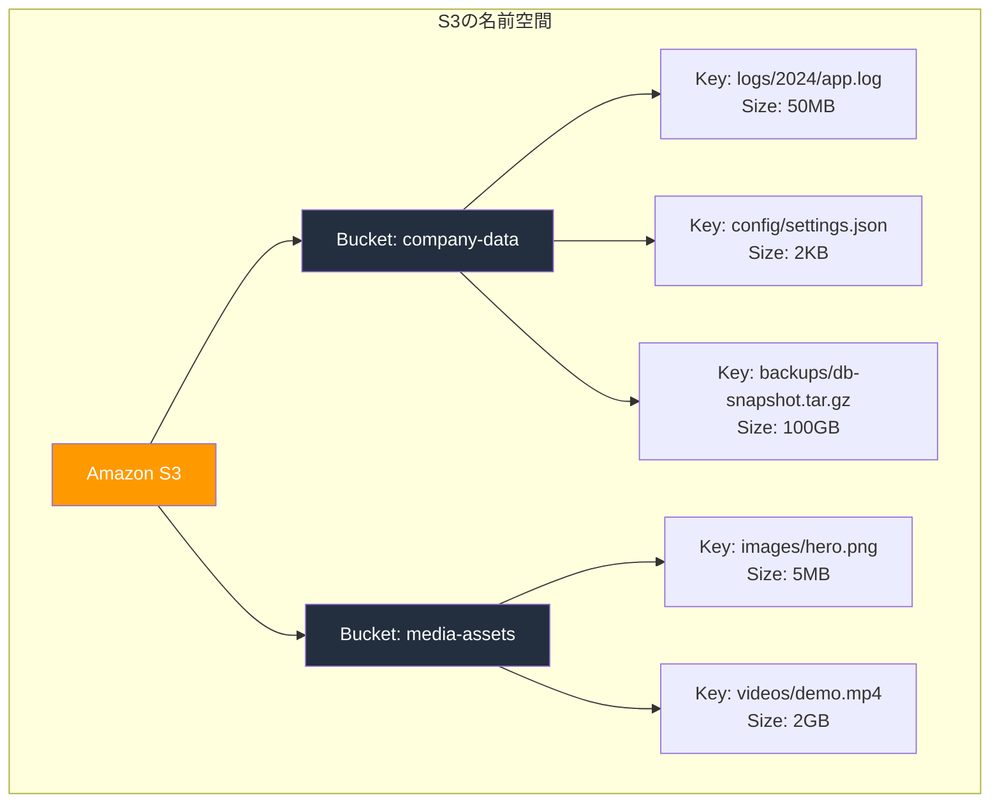

S3のLIST操作は、`Prefix` と `Delimiter` パラメータによってフラットな名前空間上で擬似的な階層ナビゲーションを可能にしている。例えば、`Prefix=logs/2024/` かつ `Delimiter=/` を指定すると、`logs/2024/` 直下のオブジェクトと「共通プレフィックス（Common Prefixes）」が返される。これにより、GUIやCLIでフォルダ風の操作が実現されている。

### 2.2 整合性モデル：結果整合性から強整合性へ

S3の整合性モデルの変遷は、分散システム設計における最も興味深い事例の1つである。

#### 2.2.1 初期の結果整合性（2006年 - 2020年）

S3は当初、**結果整合性（Eventual Consistency）**モデルを採用していた。具体的には、以下のような振る舞いをしていた。

- **新規オブジェクトのPUT**：書き込み後の読み取り整合性（Read-after-Write Consistency）。PUT直後のGETでは最新のデータが返される
- **既存オブジェクトの上書きPUTおよびDELETE**：結果整合性。更新や削除の直後にGETすると、古いデータが返される可能性があった

この設計は、システムの可用性とスケーラビリティを優先した合理的な選択であった。CAP定理が示す通り、ネットワーク分断が発生する分散システムでは、一貫性（Consistency）と可用性（Availability）を同時に完全に保証することはできない。S3は可用性を優先し、整合性を緩和するアプローチを取った。

しかし、この結果整合性モデルは開発者にとって多くの課題を生んだ。

::: warning 結果整合性による問題の例
- オブジェクトを上書き更新した直後にGETしたら、古いバージョンが返された
- オブジェクトを削除した直後にLISTしたら、削除済みオブジェクトが一覧に含まれていた
- 新しいオブジェクトをPUTする前にGETを実行し、404が返された後にPUTを実行した場合、直後のGETで404が返されることがあった（「negative caching」問題）
:::

これらの問題に対処するため、多くのアプリケーションはDynamoDBやデータベースをメタデータの整合性レイヤーとして併用したり、リトライロジックを実装したりする必要があった。

#### 2.2.2 強整合性への移行（2020年12月）

2020年12月、AWSはS3が**強整合性（Strong Consistency）**を提供するようになったと発表した。この変更は追加コストなし、パフォーマンス劣化なし、既存のAPI互換性を維持したまま実現された。

変更後のS3の整合性モデルは以下の通りである。

| 操作 | 整合性 |
|---|---|
| 新規オブジェクトのPUT | 書き込み後の読み取り整合性 |
| 既存オブジェクトの上書きPUT | **強整合性（Read-after-Write）** |
| DELETE | **強整合性** |
| LIST | **強整合性** |

すなわち、S3に対するすべての成功した書き込み操作の後、同一オブジェクトに対する読み取りは最新のデータを返すことが保証されるようになった。これは、条件付き書き込み（例えば `If-None-Match` ヘッダを用いたPUT）に対しても同様である。

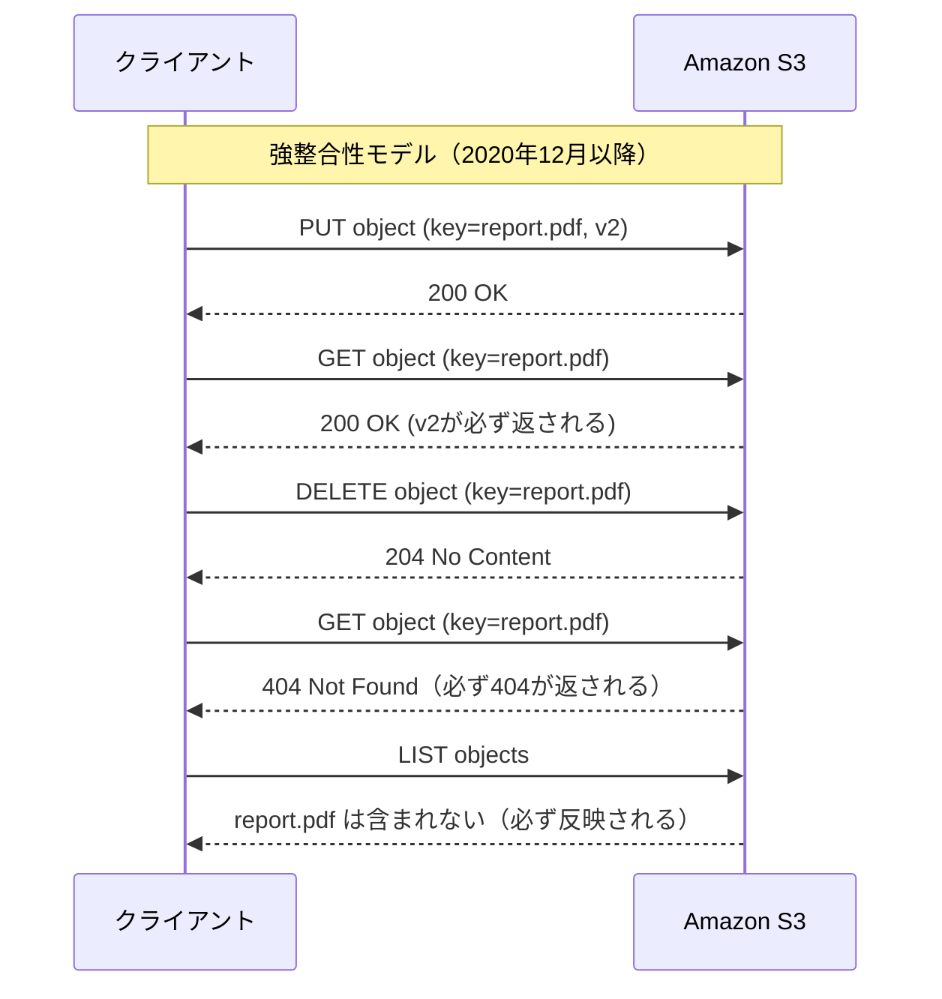

::: tip なぜ追加コストなしで実現できたのか
AWSのAndy Warfield氏（S3担当VP）によると、S3は内部的に「witness」と呼ばれる軽量な整合性チェック機構を導入した。これは、各リクエストに対して分散メタデータストアの最新状態を確認する仕組みである。重要なのは、この整合性チェックが既存のリクエストパスに組み込まれ、追加のラウンドトリップを必要としない設計であったことだ。結果として、パフォーマンスへの影響を最小限に抑えつつ強整合性を実現した。
:::

### 2.3 内部アーキテクチャの推定

AWSはS3の内部実装を完全には公開していないが、公開されている情報や論文、カンファレンス発表から、いくつかの重要な設計要素を推定できる。

#### 2.3.1 メタデータ層とデータ層の分離

S3は、メタデータ（オブジェクトの存在、バージョン、権限などの情報）とデータ本体（バイナリコンテンツ）を**別々の層**で管理していると考えられている。

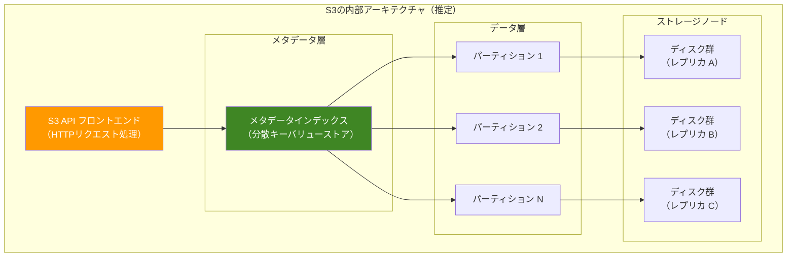

メタデータ層は分散キーバリューストアで実装されており、オブジェクトキーからデータの物理的な格納場所へのマッピングを管理する。このメタデータストアの整合性が、先述の強整合性を支える基盤である。

#### 2.3.2 パーティショニング

S3は、バケット内のオブジェクトをキーに基づいて**パーティション**に分割して管理する。以前は、キーのプレフィックスに基づいてパーティションが決定されていたため、タイムスタンプのような単調増加するプレフィックスを持つキーを使うと、特定のパーティションにリクエストが集中するホットスポット問題が発生していた。

2018年のパフォーマンス改善以降、S3は内部的にキーをハッシュしてパーティションを決定するようになった。これにより、キーの命名パターンに関係なく、リクエストが自動的に分散されるようになった。現在、S3はプレフィックスあたり毎秒5,500回のGETリクエストと3,500回のPUT/COPY/POST/DELETEリクエストをサポートしている。

#### 2.3.3 レプリケーションとイレブンナインの耐久性

S3は、99.999999999%（イレブンナイン）の耐久性を設計目標としている。これは、10,000個のオブジェクトを保存した場合、そのうち1つを失うまでに平均1,000万年かかるという計算になる。

この驚異的な耐久性は、以下の仕組みによって実現されている。

- **複数AZ（Availability Zone）への冗長化**：標準ストレージクラスでは、オブジェクトが最低3つのAZにレプリケートされる
- **チェックサム検証**：データの整合性が定期的に検証され、破損が検出された場合は自動的に修復される
- **独立した障害ドメイン**：各AZは物理的に分離されたデータセンターであり、電源・ネットワーク・冷却が独立している

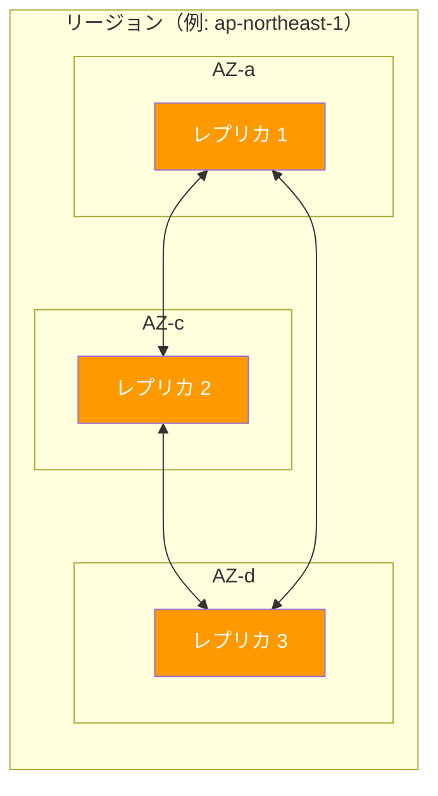

> [!NOTE]
> S3は内部的にイレイジャーコーディング（Erasure Coding）を使用していると考えられている。イレイジャーコーディングは、データを複数のフラグメントに分割し、冗長フラグメント（パリティ）を追加することで、一部のフラグメントが失われてもデータを復元できる技術である。単純な3重レプリケーションと比較して、同等の耐久性をより少ないストレージオーバーヘッドで実現できる。

## 3. 実装手法：S3の機能と活用

### 3.1 ストレージクラス

S3の最も重要な設計要素の1つが**ストレージクラス**である。すべてのデータが同じアクセスパターンを持つわけではないという現実に対応するため、S3はコスト・パフォーマンス・可用性の異なる複数のストレージクラスを提供している。

| ストレージクラス | 耐久性 | 可用性 | AZ数 | 最小保存期間 | 取り出しコスト | 主な用途 |
|---|---|---|---|---|---|---|
| **S3 Standard** | 99.999999999% | 99.99% | 3以上 | なし | なし | 頻繁にアクセスされるデータ |
| **S3 Intelligent-Tiering** | 99.999999999% | 99.9% | 3以上 | なし | なし | アクセスパターンが不明なデータ |
| **S3 Standard-IA** | 99.999999999% | 99.9% | 3以上 | 30日 | あり | 低頻度アクセス |
| **S3 One Zone-IA** | 99.999999999% | 99.5% | 1 | 30日 | あり | 再作成可能な低頻度データ |
| **S3 Glacier Instant Retrieval** | 99.999999999% | 99.9% | 3以上 | 90日 | あり | 四半期に1回程度のアクセス |
| **S3 Glacier Flexible Retrieval** | 99.999999999% | 99.99%* | 3以上 | 90日 | あり | 年1-2回のアクセス |
| **S3 Glacier Deep Archive** | 99.999999999% | 99.99%* | 3以上 | 180日 | あり | コンプライアンス用長期保存 |

*復元後の可用性

各ストレージクラスの詳細を見ていく。

#### 3.1.1 S3 Standard

最も基本的なストレージクラスであり、頻繁にアクセスされるデータに最適である。3つ以上のAZにデータが冗長化され、99.99%の可用性が保証される。保存料金は最も高いが、データの取り出しに追加コストがかからないため、読み取りが多いワークロードではトータルコストが最適になりやすい。

#### 3.1.2 S3 Standard-Infrequent Access（Standard-IA）

Standardと同じ耐久性・可用性レベルを持つが、保存料金が低い代わりに**データ取り出しに料金**が発生する。月に1回程度のアクセス頻度のデータに適している。最小保存期間は30日であり、30日未満で削除した場合も30日分の料金が請求される。

#### 3.1.3 S3 One Zone-IA

Standard-IAと似ているが、データが**単一のAZ**にのみ保存される。AZの障害によりデータが失われるリスクがあるため、再作成可能なデータ（サムネイル、トランスコード済みメディアなど）に限定して使用すべきである。保存料金はStandard-IAよりもさらに約20%低い。

#### 3.1.4 S3 Glacier Instant Retrieval

アーカイブストレージでありながら、**ミリ秒単位の取り出し**が可能なクラスである。四半期に1回程度アクセスされる医療画像、ニュースメディアアーカイブなどに適している。保存料金はStandard-IAよりも約68%低いが、取り出しコストが高い。

#### 3.1.5 S3 Glacier Flexible Retrieval（旧S3 Glacier）

長期アーカイブ向けのクラスで、以下の3段階の取り出し速度を選択できる。

| 取り出しオプション | 所要時間 | コスト |
|---|---|---|
| **Expedited** | 1-5分 | 高 |
| **Standard** | 3-5時間 | 中 |
| **Bulk** | 5-12時間 | 低 |

#### 3.1.6 S3 Glacier Deep Archive

S3の中で最も低コストなストレージクラスである。データの取り出しには12-48時間を要する。7-10年以上の長期保存が必要なコンプライアンスデータ、規制要件対応データに適している。保存料金はS3 Standardの約95%以下である。

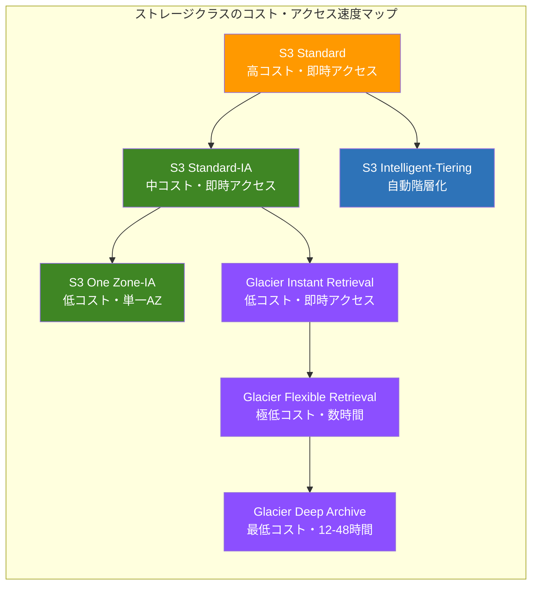

### 3.2 ライフサイクルポリシー

ストレージクラスの移行を手動で管理するのは現実的ではない。S3の**ライフサイクルポリシー**は、オブジェクトのライフサイクルに応じたストレージクラスの自動移行と自動削除を実現する機能である。

ライフサイクルルールでは、以下の2種類のアクションを定義できる。

1. **トランジションアクション**：指定した日数が経過した後、オブジェクトを別のストレージクラスに移行する
2. **有効期限アクション**：指定した日数が経過した後、オブジェクトを自動削除する

::: details ライフサイクルポリシーの設定例（JSON）
```json
{
  "Rules": [
    {
      "ID": "LogRetentionPolicy",
      "Status": "Enabled",
      "Filter": {
        "Prefix": "logs/"
      },
      "Transitions": [
        {
          "Days": 30,
          "StorageClass": "STANDARD_IA"
        },
        {
          "Days": 90,
          "StorageClass": "GLACIER"
        },
        {
          "Days": 365,
          "StorageClass": "DEEP_ARCHIVE"
        }
      ],
      "Expiration": {
        "Days": 2555
      }
    }
  ]
}
```
この例では、`logs/` プレフィックスを持つオブジェクトに対して以下のルールが適用される。
- 作成から30日後にStandard-IAに移行
- 作成から90日後にGlacierに移行
- 作成から365日後にDeep Archiveに移行
- 作成から2,555日（約7年）後に自動削除
:::

以下は、典型的なライフサイクルの流れを示す図である。

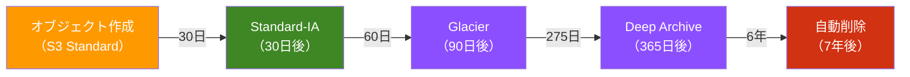

::: warning ライフサイクルポリシーの注意点
- ストレージクラスの移行にはウォーターフォール制約がある。例えば、Standard-IAからOne Zone-IAへの移行はできるが、Glacierから Standard-IAへの「逆方向」の移行はできない
- 最小オブジェクトサイズ制約がある。128KB未満のオブジェクトをStandard-IAやGlacierに移行すると、128KB分の料金が請求される
- トランジションルールの最小日数は、各ストレージクラスの最小保存期間以上でなければならない
:::

### 3.3 バージョニング

S3の**バージョニング**機能は、バケット内のすべてのオブジェクトに対して全バージョンを保持する機能である。バージョニングが有効化されたバケットでは、オブジェクトの上書きや削除を行っても以前のバージョンが保持され、いつでも復元できる。

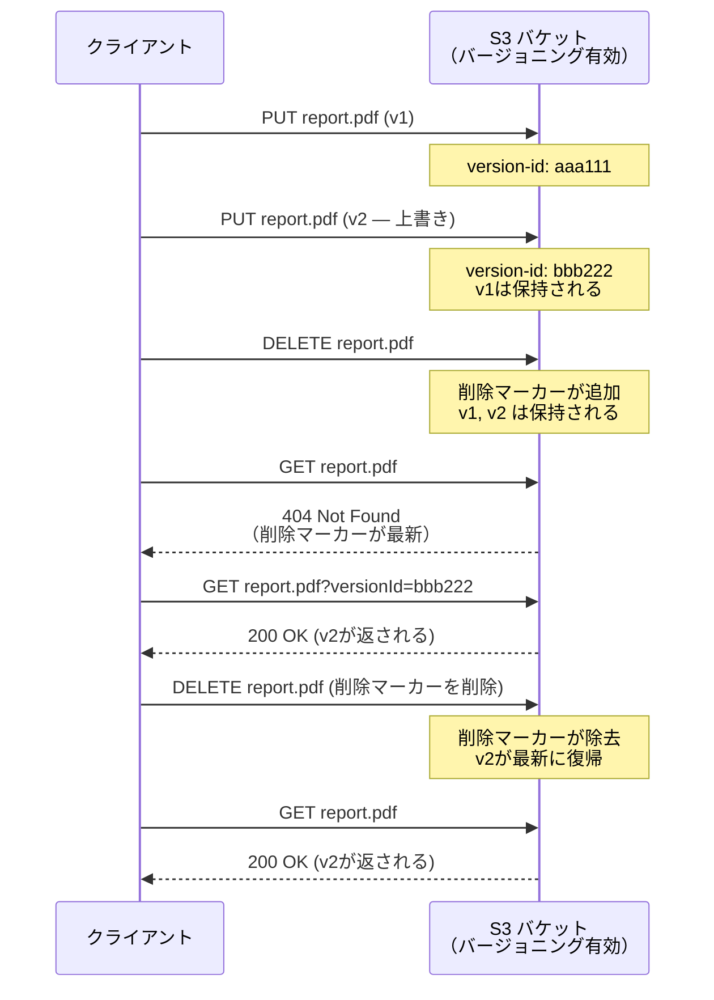

バージョニングは、以下の3つの状態を持つ。

1. **Unversioned（デフォルト）**：バージョニングが有効化されていない状態
2. **Enabled**：バージョニングが有効化され、すべてのオブジェクトにバージョンIDが付与される
3. **Suspended**：バージョニングが一時停止された状態。既存のバージョンは保持されるが、新規のオブジェクトにはバージョンIDとして `null` が付与される

> [!CAUTION]
> バージョニングを有効化した後、完全に無効化（Unversioned状態に戻す）ことはできない。一時停止（Suspended）は可能だが、既存のバージョンは残り続ける。不要なバージョンはライフサイクルポリシーの `NoncurrentVersionExpiration` を使って自動削除するのが一般的である。

### 3.4 マルチパートアップロード

大容量のオブジェクトをアップロードする際に使用する機能が**マルチパートアップロード**である。オブジェクトを複数のパート（部品）に分割し、各パートを独立してアップロードし、最後にS3側で結合する。

マルチパートアップロードの利点は以下の通りである。

- **大容量ファイルの対応**：単一のPUT操作では最大5GBまでだが、マルチパートアップロードでは最大5TBのオブジェクトをアップロードできる
- **並列アップロード**：複数のパートを同時にアップロードすることで、スループットを大幅に向上させられる
- **障害復旧**：アップロードが途中で失敗した場合、失敗したパートのみを再アップロードすればよい

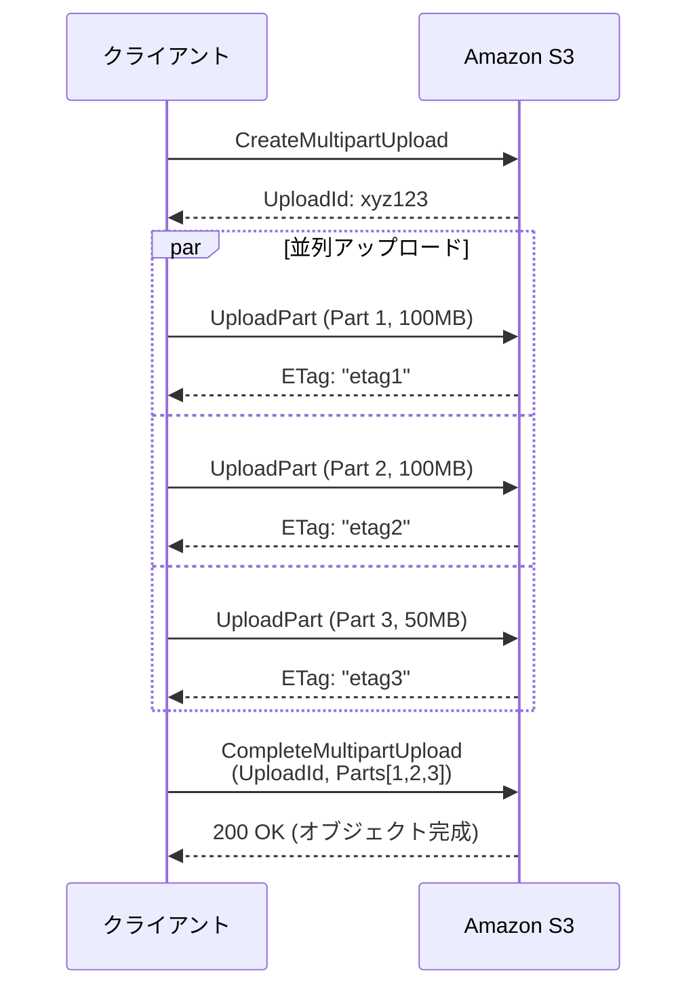

::: tip マルチパートアップロードのベストプラクティス
- **100MB以上のファイル**にはマルチパートアップロードの使用が推奨される
- 各パートのサイズは5MB以上（最終パートを除く）、最大5GBまで
- パート数は最大10,000個
- アボートされていない不完全なマルチパートアップロードはストレージ料金が発生するため、ライフサイクルポリシーで `AbortIncompleteMultipartUpload` を設定しておくべきである
:::

### 3.5 S3 SelectとAthena連携

S3には、格納されたデータに対してSQLライクなクエリを実行する機能がある。

#### 3.5.1 S3 Select

S3 Selectは、S3に保存されたCSV、JSON、Parquetファイルに対して、**サーバーサイドでSQLクエリを実行**し、必要な行・列だけを返す機能である。オブジェクト全体をダウンロードする必要がなくなるため、転送量とレイテンシの両方が大幅に削減される。

```sql
-- S3 Select query example
SELECT s.city, s.population
FROM S3Object s
WHERE s.population > 1000000
```

S3 Selectは単一オブジェクトに対する単純なフィルタリングに適しているが、複雑な分析クエリには向かない。

#### 3.5.2 Amazon Athena

より複雑な分析には **Amazon Athena** が使われる。AthenaはS3上のデータに対して標準SQLを実行できるサーバーレスのインタラクティブクエリサービスである。内部的にはPrestoベースのエンジン（現在はTrino）を使用しており、ペタバイト規模のデータに対してもクエリを実行できる。

Athenaの特徴は以下の通りである。

- **サーバーレス**：インフラの管理が不要
- **スキャン量課金**：クエリでスキャンしたデータ量に対してのみ課金される
- **多様なフォーマット対応**：CSV、JSON、Parquet、ORC、Avroなどに対応
- **パーティション**：S3のプレフィックス構造を活用したパーティショニングにより、スキャン量を大幅に削減できる

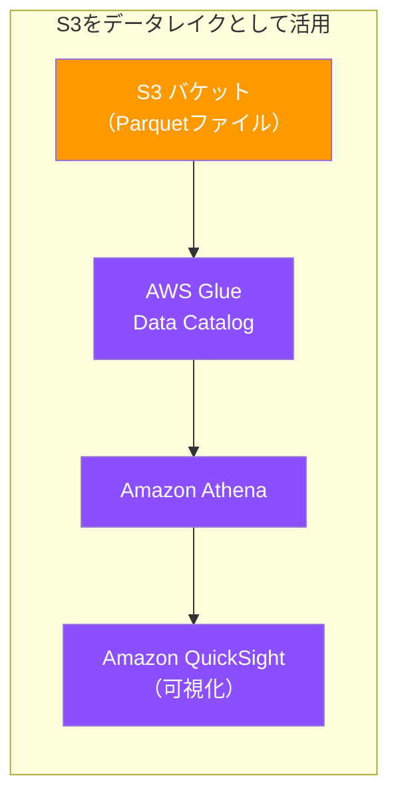

## 4. 運用の実際

### 4.1 パフォーマンス最適化

#### 4.1.1 プレフィックス設計

前述の通り、2018年以降のS3はキーのプレフィックスに関係なくリクエストを分散できるようになった。しかし、プレフィックス設計は依然としてパフォーマンスの最適化において重要である。

S3はプレフィックスごとに以下のリクエストレートをサポートしている。

- **GET/HEAD**: 5,500リクエスト/秒/プレフィックス
- **PUT/COPY/POST/DELETE**: 3,500リクエスト/秒/プレフィックス

ここで「プレフィックス」とは、最後のスラッシュ（/）より前の部分を指す。例えば、以下のキーのプレフィックスはそれぞれ異なる。

```
logs/2024/01/file1.log    → プレフィックス: logs/2024/01/
logs/2024/02/file2.log    → プレフィックス: logs/2024/02/
data/raw/file3.csv        → プレフィックス: data/raw/
```

複数のプレフィックスにリクエストを分散させることで、理論上はプレフィックス数に比例してスループットをスケールさせることができる。

::: details リクエスト分散の具体例
例えば、10個のプレフィックスにリクエストを均等に分散させれば、合計で55,000 GETリクエスト/秒をサポートできる。

```
data/shard-00/
data/shard-01/
data/shard-02/
...
data/shard-09/
```

ただし、2018年以降はS3が内部的にパーティションを自動管理するため、意図的にプレフィックスを分散させる必要性は以前ほど高くない。
:::

#### 4.1.2 転送の最適化

S3との間のデータ転送を高速化するためのいくつかの手法がある。

- **S3 Transfer Acceleration**：世界各地のAWSエッジロケーションを経由して、AWSのバックボーンネットワークを利用することで長距離転送を高速化する。クライアントは `<bucket>.s3-accelerate.amazonaws.com` エンドポイントを使用する
- **バイトレンジフェッチ**：GETリクエストに `Range` ヘッダを指定することで、オブジェクトの一部だけを取得する。大容量ファイルの一部を読み取る場合や、並列ダウンロードに有効である
- **S3 Expressワンゾーン（後述）**：低レイテンシが要求されるワークロード向けの新しいストレージクラス

### 4.2 コスト最適化

#### 4.2.1 S3 Intelligent-Tiering

S3のコスト最適化において最も強力なツールが **S3 Intelligent-Tiering** である。このストレージクラスは、個々のオブジェクトのアクセスパターンを監視し、最もコスト効率の良いストレージ層に**自動的に**移動させる。

Intelligent-Tieringは以下のアクセス層で構成される。

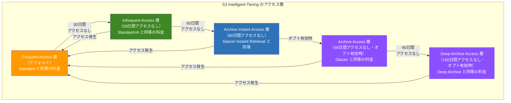

Intelligent-Tieringの特筆すべき点は以下の通りである。

- **データ取り出し料金が発生しない**：Standard-IAやGlacierでは取り出しに料金がかかるが、Intelligent-Tieringでは層間の移動に追加の取り出し料金がかからない
- **監視・自動階層化手数料**：オブジェクトごとに月額の少額の監視手数料が発生する（128KB未満のオブジェクトには課金されない）
- **Archive Access層とDeep Archive Access層はオプトイン**：デフォルトでは有効化されず、バケットレベルで有効化する必要がある

#### 4.2.2 コスト分析のポイント

S3のコストは主に以下の4つの要素で構成される。

1. **保存料金**：GBあたりの月額料金。ストレージクラスによって大きく異なる
2. **リクエスト料金**：PUT、GET、LISTなどのAPI呼び出しに対する料金
3. **データ転送料金**：S3からインターネットや他のAWSリージョンへのアウトバウンド転送に対する料金
4. **管理・レプリケーション料金**：Intelligent-Tieringの監視手数料、クロスリージョンレプリケーションなどの料金

> [!TIP]
> コスト最適化の第一歩として、S3 Storage Lensを活用することを推奨する。Storage Lensは、S3の使用状況をダッシュボードで可視化し、コスト削減の推奨事項を提示するサービスである。

### 4.3 セキュリティ

S3のセキュリティは多層防御のアプローチで設計されている。

#### 4.3.1 アクセス制御

S3のアクセス制御には複数の仕組みが存在し、それらの組み合わせによってアクセスが許可または拒否される。

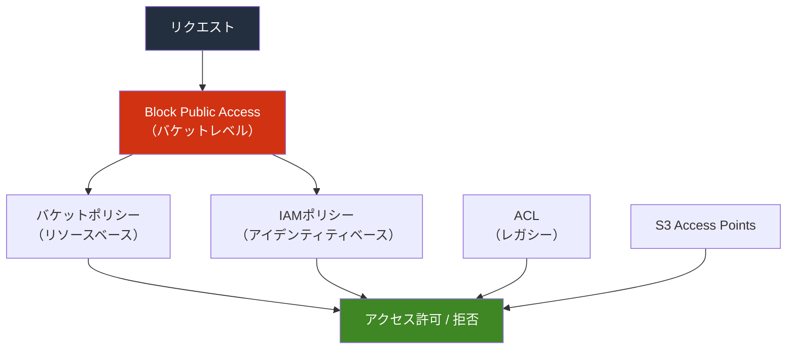

- **IAMポリシー**：IAMユーザー・ロールに対してS3リソースへのアクセスを許可・拒否するポリシー。「誰が」何をできるかを制御する
- **バケットポリシー**：バケットにアタッチされるリソースベースのポリシー。クロスアカウントアクセスや、特定の条件下でのアクセス制御に使用される
- **Block Public Access**：バケットまたはアカウントレベルで、パブリックアクセスを一括で遮断する設定。2023年4月以降、新規バケットではデフォルトで有効化されている
- **S3 Access Points**：バケットに複数のアクセスポイントを作成し、各アクセスポイントに独自のポリシーを設定できる機能。大規模な共有バケットのアクセス管理を簡素化する

::: danger ACLの使用は非推奨
S3のACL（Access Control List）はレガシーな機能であり、AWSは新規バケットではACLを無効化することを推奨している。2023年4月以降、新規バケットではデフォルトでACLが無効化されている（バケット所有者強制設定が有効）。ACLの代わりにIAMポリシーとバケットポリシーを使用すべきである。
:::

#### 4.3.2 暗号化

S3は保存データ（at rest）の暗号化について以下の選択肢を提供している。

| 暗号化方式 | 鍵の管理 | 特徴 |
|---|---|---|
| **SSE-S3** | AWSが管理 | 最もシンプル。S3がAES-256で自動暗号化 |
| **SSE-KMS** | AWS KMSが管理 | 鍵の監査ログ、きめ細かい鍵ポリシーが可能 |
| **SSE-C** | 顧客が管理 | 顧客が提供する鍵でS3が暗号化。鍵の管理責任は顧客 |
| **CSE** | 顧客が管理 | クライアント側で暗号化してからS3にアップロード |

2023年1月以降、S3に保存されるすべての新しいオブジェクトは、デフォルトでSSE-S3による暗号化が適用されるようになった。

転送中データ（in transit）の暗号化については、S3はHTTPSエンドポイントを提供しており、バケットポリシーでHTTPSを強制することが推奨される。

```json
{
  "Statement": [
    {
      "Sid": "DenyHTTP",
      "Effect": "Deny",
      "Principal": "*",
      "Action": "s3:*",
      "Resource": [
        "arn:aws:s3:::my-bucket",
        "arn:aws:s3:::my-bucket/*"
      ],
      "Condition": {
        "Bool": {
          "aws:SecureTransport": "false"
        }
      }
    }
  ]
}
```

### 4.4 データレイクとしてのS3

S3はクラウド時代の**データレイク**の事実上の標準基盤となっている。データレイクとは、構造化データ・半構造化データ・非構造化データを、スキーマを事前に定義することなく、そのままの形式で大量に蓄積する仕組みである。

S3がデータレイクに適している理由は以下の通りである。

1. **スケーラビリティ**：事実上無制限のストレージ容量
2. **耐久性**：イレブンナインの耐久性
3. **コスト効率**：ストレージクラスとライフサイクルポリシーによるコスト最適化
4. **オープンフォーマットのサポート**：Parquet、ORC、Avro、JSON、CSVなどの多様なフォーマットを格納できる
5. **エコシステムの充実**：Athena、EMR、Redshift Spectrum、Glueなど、多数のAWSサービスとシームレスに連携

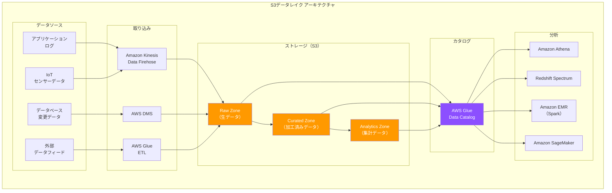

> [!NOTE]
> 最近では、Apache IcebergやDelta LakeなどのオープンテーブルフォーマットをS3上で使用する「レイクハウス」アーキテクチャが主流になりつつある。これらのフォーマットは、データレイクにACIDトランザクション、スキーマエボリューション、タイムトラベルなどの機能を追加する。AWSもAthenaやEMRでIceberg/Delta Lakeをネイティブにサポートしている。

### 4.5 S3のイベント通知とワークフロー統合

S3は、バケット内で発生したイベント（オブジェクトの作成、削除など）をトリガーとして、他のAWSサービスに通知を送る機能を備えている。これにより、イベント駆動のワークフローを構築できる。

通知先として設定できるサービスは以下の通りである。

- **Amazon SNS**：ファンアウト通知
- **Amazon SQS**：キューイング
- **AWS Lambda**：サーバーレス関数の実行
- **Amazon EventBridge**：高度なイベントルーティング

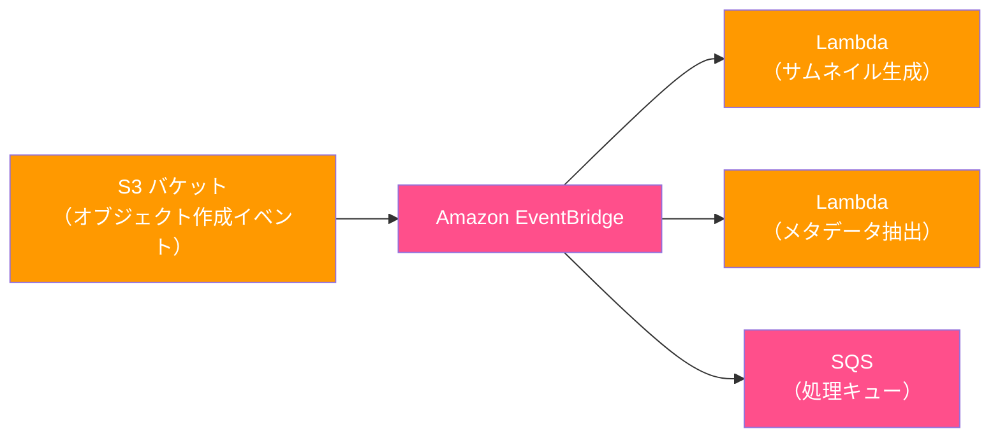

典型的なユースケースとして、画像がS3にアップロードされたときにLambda関数が自動的にサムネイルを生成し、結果を別のS3バケットに保存するというパターンがある。

## 5. 将来展望

### 5.1 S3 Express One Zone

2023年のre:Inventで発表された **S3 Express One Zone** は、S3の新しいストレージクラスであり、従来のS3 Standardと比較して最大10倍のパフォーマンスと一貫したシングルディジットミリ秒のレイテンシを提供する。

S3 Express One Zoneの特徴は以下の通りである。

- **ディレクトリバケット**：従来のフラットな名前空間ではなく、ディレクトリの概念をネイティブにサポートするバケットタイプを使用する
- **単一AZ配置**：低レイテンシを実現するため、データは単一のAZに配置される
- **リクエスト料金の低減**：S3 Standardと比較して、リクエスト料金が大幅に低い（最大50%削減）
- **保存料金の増加**：保存料金はS3 Standardの約8倍だが、頻繁にアクセスされる小さなオブジェクトに対してはトータルコストで有利になりうる

S3 Express One Zoneの主なユースケースは以下の通りである。

- **機械学習のモデルトレーニング**：トレーニングデータへの高速アクセスが必要な場面
- **インタラクティブ分析**：Athenaなどからの低レイテンシクエリ
- **メディアコンテンツの制作**：リアルタイムでの編集・レンダリング
- **HPC（High Performance Computing）**：大量の中間ファイルの読み書き

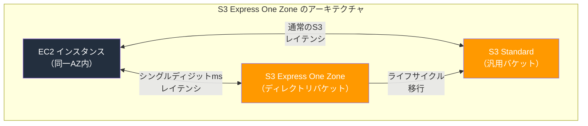

### 5.2 S3 Tables

2024年のre:Inventで発表された **S3 Tables** は、S3の上にApache Icebergテーブルをネイティブにサポートする新しい機能である。これにより、S3が単なるオブジェクトストレージから**テーブルストレージ**としても機能するようになった。

S3 Tablesの主な特徴は以下の通りである。

- **Apache Icebergのネイティブサポート**：S3がIcebergテーブルのメタデータとデータの両方をネイティブに管理する
- **自動コンパクション**：小さなファイルの自動的な統合（コンパクション）が行われ、クエリパフォーマンスが最適化される
- **スナップショット管理**：不要なスナップショットの自動クリーンアップ
- **クエリパフォーマンスの向上**：自己管理のIcebergテーブルと比較して最大3倍のクエリパフォーマンス、最大10倍のトランザクション/秒

S3 Tablesの登場は、S3がオブジェクトストレージという枠を超え、分析ワークロードの中核的なストレージ基盤として進化していることを示している。

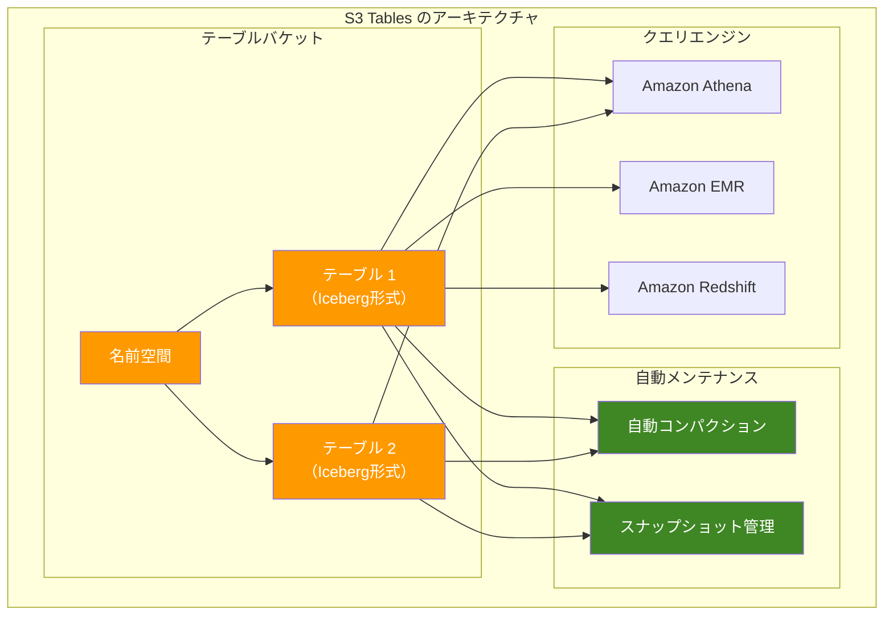

### 5.3 S3 Metadata（プレビュー）

2024年のre:Inventでは、**S3 Metadata** もプレビューとして発表された。S3 Metadataは、バケット内のすべてのオブジェクトのメタデータ（システムメタデータおよびカスタムメタデータ）を、自動的にApache Icebergテーブルとして生成・維持する機能である。

これにより、S3バケットのインベントリ分析、ガバナンス、コンプライアンス対応が大幅に簡素化される。従来はS3 Inventory Reportを使って非同期にメタデータを取得していたが、S3 Metadataではニアリアルタイムでメタデータテーブルが更新される。

### 5.4 エッジでのオブジェクトストレージ

クラウドとエッジの境界が曖昧になりつつある中、オブジェクトストレージもエッジへの拡張が進んでいる。

- **AWS Outposts上のS3**：オンプレミスのOutpostsラック上でS3 APIを提供する。ローカルデータ処理が必要なワークロード（製造業、医療、メディア制作など）に適している
- **AWS Snow Family**：Snowball Edge、Snowconeなどのデバイス上でS3互換のストレージを提供する。ネットワーク接続が制限された環境でのデータ収集に使用される
- **S3 Object Lambda**：GETリクエスト時にLambda関数を介してデータをリアルタイムに変換する。異なるアプリケーションに異なるビュー（PII削除版、リサイズ画像など）を提供できる

### 5.5 競合サービスとオープンソースの動向

S3はオブジェクトストレージの事実上の標準APIとなっているが、競合も存在する。

| サービス/プロジェクト | 提供者 | 特徴 |
|---|---|---|
| **Google Cloud Storage** | Google | マルチリージョン対応、Autoclass（Intelligent-Tiering相当） |
| **Azure Blob Storage** | Microsoft | ホット/クール/コールド/アーカイブ層、Azure Data Lake Storage Gen2 |
| **MinIO** | MinIO, Inc. | S3互換のオープンソース実装。オンプレミスやKubernetes上で稼働 |
| **Ceph (RGW)** | Red Hat | S3/Swift互換のオープンソース分散ストレージ |
| **Cloudflare R2** | Cloudflare | エグレス料金が無料。S3互換API |

特にCloudflare R2の「エグレス料金ゼロ」という価格戦略は、S3のデータ転送料金が高コストであるという長年の課題に対する直接的な回答として注目を集めている。AWSもこれに対抗し、同一リージョン内のCloudFrontへの転送を無料にするなどの施策を打っている。

MinIOは、S3互換APIをオンプレミスやKubernetes上で使いたいというニーズに応えるオープンソースプロジェクトとして広く採用されている。クラウドベンダーへのロックインを避けたい組織にとっては重要な選択肢である。

## 6. まとめ

オブジェクトストレージは、ファイルシステムの限界を乗り越えるために生まれた設計パラダイムである。Amazon S3はその代表例として、以下の設計判断により巨大なスケーラビリティと高い耐久性を実現した。

1. **フラットな名前空間**：階層構造を排することで、メタデータ管理の複雑さを排除した
2. **シンプルなAPI**：PUT/GET/DELETE/LISTの基本操作に絞ることで、分散環境での実装を容易にした
3. **整合性モデルの進化**：初期の結果整合性から、2020年に強整合性へと移行し、開発者体験を大幅に改善した
4. **ストレージクラスの多様化**：アクセスパターンに応じた複数のストレージクラスにより、コストとパフォーマンスのトレードオフを柔軟に制御できるようにした
5. **ライフサイクル管理の自動化**：ポリシーベースの自動移行・削除により、大規模データの管理コストを削減した

S3はもはや単なるオブジェクトストレージの域を超え、データレイク、分析基盤、機械学習パイプラインの中核的なストレージレイヤーとして機能している。S3 Express One ZoneやS3 Tablesの登場は、オブジェクトストレージがさらに多様なワークロードに対応していく方向性を明確に示している。

オブジェクトストレージの設計を理解することは、クラウドアーキテクチャの設計において不可欠である。「どのデータを、どのストレージクラスに、どのようなライフサイクルで管理するか」という問いに対する適切な回答が、システムのコスト効率・パフォーマンス・信頼性を大きく左右する。
