# オブザーバビリティ（メトリクス・ログ・トレース）

## オブザーバビリティとは何か

### 制御理論に由来する概念

オブザーバビリティ（Observability）という用語は、もともと制御理論の分野で1960年代にルドルフ・カールマンが提唱した概念に由来する。制御理論における可観測性とは、「システムの外部出力を観察することによって、内部状態を推定できる度合い」を意味する。この概念がソフトウェアシステムに応用され、現代のSRE（Site Reliability Engineering）やDevOpsの文脈で中核的な位置を占めるようになった。

ソフトウェアシステムにおけるオブザーバビリティとは、**システムが出力するデータ（テレメトリデータ）を通じて、システムの内部状態を理解し、未知の問題を調査できる能力**のことである。重要なのは「未知の問題」という部分だ。事前に予測できる障害パターンへの対応だけでなく、これまで見たことのない異常をも調査・診断できる力がオブザーバビリティの本質である。

### モニタリングとの違い

オブザーバビリティとモニタリングは混同されやすいが、本質的に異なる概念である。

**モニタリング（Monitoring）** は「既知の障害パターンに対して、事前に設定した条件でアラートを発報する仕組み」である。CPU使用率が90%を超えたら通知する、エラーレートが閾値を超えたら通知する、といった具合に、何を監視するかを事前に決めておく必要がある。モニタリングは「何が壊れたか」を教えてくれるが、「なぜ壊れたか」を教えてくれるとは限らない。

**オブザーバビリティ（Observability）** は「事前に予測していなかった問題をも調査できる能力」である。システムが十分なテレメトリデータを出力していれば、発生した問題に対して事後的に仮説を立て、データを探索し、根本原因を突き止めることができる。オブザーバビリティは「なぜ壊れたか」を解明するための基盤を提供する。

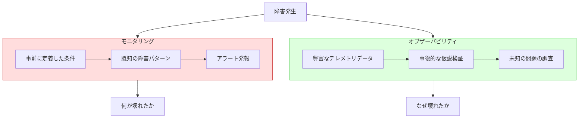

この違いを具体例で考えてみよう。あるECサイトで注文処理のレイテンシが急増したとする。モニタリングの世界では、「レイテンシが500msを超えた」というアラートが発報される。しかし、なぜレイテンシが増加したのかを調べるには、そのリクエストがどのサービスを経由し、どの処理に時間がかかり、どのようなパラメータで呼び出されたのかを追跡する必要がある。この追跡を可能にするのがオブザーバビリティである。

モニタリングはオブザーバビリティの一部であり、対立する概念ではない。十分なオブザーバビリティが確保されたシステムでは、モニタリングもより効果的に機能する。逆に、オブザーバビリティなきモニタリングは、アラートが鳴っても原因調査に時間を要するという状況を生み出す。

### なぜ今オブザーバビリティが重要なのか

オブザーバビリティの重要性が急速に高まった背景には、システムアーキテクチャの変化がある。

モノリシックなアプリケーションでは、問題の調査は比較的容易だった。一つのプロセスのログを読み、一つのデータベースのスロークエリを調べれば、大抵の問題は特定できた。しかし、マイクロサービスアーキテクチャの普及により、一つのユーザーリクエストが数十のサービスを横断して処理されるようになった。コンテナオーケストレーション（Kubernetes）の採用により、サービスのインスタンスは動的にスケールし、IPアドレスも頻繁に変わる。サーバーレスコンピューティングでは、実行基盤そのものが抽象化されている。

このような環境では、従来のモニタリング手法（特定のサーバーにSSHしてログを読む、など）はもはや通用しない。システムの複雑さに対抗するために、構造化されたテレメトリデータを体系的に収集・分析する能力、すなわちオブザーバビリティが不可欠となったのである。

## オブザーバビリティの三本柱

オブザーバビリティを構成するテレメトリデータは、伝統的に三つの柱（Three Pillars）として整理される。メトリクス（Metrics）、ログ（Logs）、トレース（Traces）の三つである。

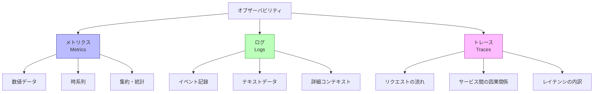

### メトリクス（Metrics）

メトリクスは、時間の経過に伴うシステムの状態を数値で表現したものである。CPU使用率、メモリ消費量、リクエストレート、エラーレート、レイテンシなど、システムの健全性を示す数値指標がメトリクスに該当する。

メトリクスの最大の特徴は、**データの圧縮性**にある。1秒間に1万件のリクエストが処理されたとしても、メトリクスとして記録するのは「リクエストレート: 10,000 req/s」「平均レイテンシ: 45ms」「p99レイテンシ: 200ms」といった集約された数値だけである。このため、長期間のデータを保存してもストレージコストが比較的低く抑えられる。

メトリクスの種類は大きく以下の4つに分類される。

| 種類 | 説明 | 例 |
|------|------|-----|
| Counter | 単調増加する累計値 | リクエスト総数、エラー総数 |
| Gauge | 任意に増減する瞬間値 | CPU使用率、メモリ使用量、キューの長さ |
| Histogram | 値の分布をバケットで記録 | レイテンシの分布 |
| Summary | クライアント側でパーセンタイルを計算 | レイテンシのp50, p90, p99 |

メトリクスの用途は主にアラートとダッシュボードである。「何かがおかしい」ことを検知するのがメトリクスの役割であり、「何がおかしいか」の詳細を調べるためにはログやトレースが必要になる。

### ログ（Logs）

ログは、システム内で発生したイベントの離散的な記録である。各ログエントリにはタイムスタンプとイベントの詳細情報が含まれる。ログはメトリクスとは異なり、個々のイベントの詳細なコンテキスト情報を保持できる。

ログには以下のような種類がある。

- **アプリケーションログ**: ビジネスロジックの実行に関するイベント（ユーザーのログイン、注文の作成、決済の完了など）
- **アクセスログ**: HTTPリクエストの詳細（リクエストURL、レスポンスコード、レイテンシなど）
- **システムログ**: OS やミドルウェアが出力するログ（カーネルログ、データベースのスロークエリログなど）
- **監査ログ**: セキュリティやコンプライアンスのための操作記録

ログの最大の課題は**データ量**である。大規模システムでは毎秒数十万行のログが生成されることも珍しくなく、保存・検索・分析のコストが膨大になる。この課題に対処するための手法が構造化ログ（Structured Logging）であり、後のセクションで詳しく解説する。

### トレース（Traces）

分散トレーシングは、一つのリクエストがシステム内の複数のサービスを横断して処理される過程を追跡する仕組みである。マイクロサービスアーキテクチャにおいて、リクエストのライフサイクル全体を可視化するために不可欠な技術である。

トレースは複数の**スパン（Span）** から構成される。各スパンは一つの処理単位（あるサービス内での処理、データベースへのクエリ、外部APIの呼び出しなど）を表し、開始時刻、終了時刻、メタデータ（タグやアノテーション）を持つ。スパン同士は親子関係やフォロー関係で結ばれ、リクエスト全体のトレースを形成する。

```mermaid
gantt
    title 分散トレースの例：注文API
    dateFormat X
    axisFormat %L ms

    section API Gateway
    認証・ルーティング           :a1, 0, 20

    section Order Service
    注文バリデーション           :a2, 20, 50
    在庫確認リクエスト           :a3, 50, 120

    section Inventory Service
    在庫データ取得               :a4, 55, 100
    在庫更新                     :a5, 100, 115

    section Order Service
    決済リクエスト               :a6, 120, 200

    section Payment Service
    決済処理                     :a7, 125, 190

    section Order Service
    注文確定・レスポンス         :a8, 200, 220
```

上図のようなトレースにより、「注文APIのレイテンシが高い」という問題の原因が「決済サービスの処理に時間がかかっている」ことであると直ちに判明する。メトリクスだけでは「注文APIが遅い」ことしか分からず、ログだけでは各サービスのログを手動で突き合わせる必要があるが、トレースはリクエストの流れを一望できる。

### 三本柱の相互関係

三本柱は独立した技術ではなく、相互に補完し合うものである。理想的なオブザーバビリティ基盤では、これら三つのデータが相互にリンクされている。

1. **メトリクスで異常を検知する**: エラーレートの急増やレイテンシの悪化をダッシュボードやアラートで検知する
2. **トレースで問題箇所を特定する**: 問題のあるリクエストのトレースを確認し、どのサービス・どの処理がボトルネックになっているかを特定する
3. **ログで根本原因を解明する**: 問題の処理に関連するログを確認し、具体的なエラーメッセージやスタックトレースから根本原因を突き止める

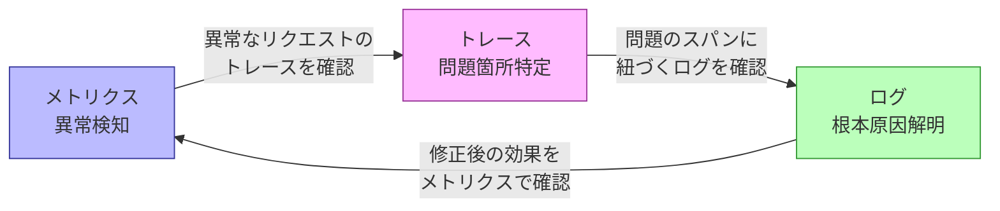

近年は OpenTelemetry の普及により、三本柱のデータを統一的なフォーマットで収集し、相互にリンクさせることが標準的な手法となりつつある。

## Prometheus と Grafana によるメトリクス基盤

### Prometheus の設計思想

Prometheus は、SoundCloudで2012年に開発が始まったオープンソースのメトリクス監視システムであり、現在は Cloud Native Computing Foundation（CNCF）の卒業プロジェクトとして広く採用されている。Prometheus はGoogleの社内モニタリングシステム Borgmon の影響を強く受けており、以下の設計上の特徴を持つ。

**Pull型アーキテクチャ**: Prometheus は監視対象に対して定期的にHTTPリクエストを送信し、メトリクスを取得する（スクレイピング）。Push型（監視対象がメトリクスを送信する方式）とは異なり、Prometheus側が監視対象の一覧を管理し、能動的にデータを収集する。この設計により、監視対象の追加・削除が容易になり、サービスディスカバリとの連携も自然に行える。

**多次元データモデル**: メトリクスは名前とラベル（キーバリューペア）の組み合わせで識別される。例えば `http_requests_total{method="GET", status="200", handler="/api/orders"}` のように、一つのメトリクス名に複数の次元を持たせることができる。この多次元モデルにより、柔軟な集約やフィルタリングが可能になる。

**PromQL**: Prometheus独自のクエリ言語 PromQL を用いて、メトリクスデータの集約・演算・フィルタリングを行う。PromQL は関数型の式言語であり、複雑な条件の表現やメトリクス間の演算が直感的に記述できる。

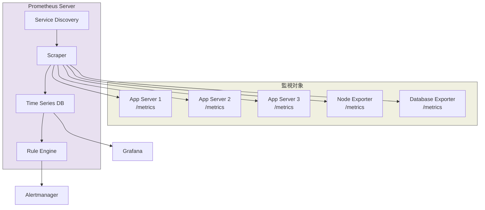

### メトリクスの計装

Prometheus でメトリクスを収集するには、アプリケーション側で計装（Instrumentation）を行う必要がある。Prometheus のクライアントライブラリは多数の言語で提供されており、アプリケーションコードにメトリクスを埋め込むことができる。

以下は Go 言語での計装の例である。

```go
package main

import (
	"net/http"
	"time"

	"github.com/prometheus/client_golang/prometheus"
	"github.com/prometheus/client_golang/prometheus/promhttp"
)

var (
	// Counter: total number of HTTP requests
	httpRequestsTotal = prometheus.NewCounterVec(
		prometheus.CounterOpts{
			Name: "http_requests_total",
			Help: "Total number of HTTP requests",
		},
		[]string{"method", "handler", "status"},
	)

	// Histogram: HTTP request duration in seconds
	httpRequestDuration = prometheus.NewHistogramVec(
		prometheus.HistogramOpts{
			Name:    "http_request_duration_seconds",
			Help:    "HTTP request duration in seconds",
			Buckets: prometheus.DefBuckets,
		},
		[]string{"method", "handler"},
	)
)

func init() {
	prometheus.MustRegister(httpRequestsTotal)
	prometheus.MustRegister(httpRequestDuration)
}

func instrumentHandler(handler string, next http.HandlerFunc) http.HandlerFunc {
	return func(w http.ResponseWriter, r *http.Request) {
		start := time.Now()

		// Wrap ResponseWriter to capture status code
		wrapped := &statusRecorder{ResponseWriter: w, status: http.StatusOK}
		next(wrapped, r)

		duration := time.Since(start).Seconds()
		httpRequestsTotal.WithLabelValues(r.Method, handler, http.StatusText(wrapped.status)).Inc()
		httpRequestDuration.WithLabelValues(r.Method, handler).Observe(duration)
	}
}

type statusRecorder struct {
	http.ResponseWriter
	status int
}

func (r *statusRecorder) WriteHeader(status int) {
	r.status = status
	r.ResponseWriter.WriteHeader(status)
}
```

### PromQL によるクエリ

PromQL はメトリクスデータを分析するための強力なクエリ言語である。いくつかの典型的なクエリパターンを紹介する。

```promql
# Rate of HTTP requests per second over the last 5 minutes
rate(http_requests_total[5m])

# Error rate (percentage of 5xx responses)
sum(rate(http_requests_total{status=~"5.."}[5m]))
/
sum(rate(http_requests_total[5m]))

# 99th percentile latency
histogram_quantile(0.99, sum(rate(http_request_duration_seconds_bucket[5m])) by (le))

# Top 5 handlers by request rate
topk(5, sum by (handler) (rate(http_requests_total[5m])))
```

### Grafana によるダッシュボード

Grafana は Prometheus と組み合わせて使われる最も一般的な可視化ツールである。Grafana はメトリクスデータをグラフ、テーブル、ヒートマップなどの多様な形式で表示し、直感的なダッシュボードを構築できる。

効果的なダッシュボード設計のポイントは以下の通りである。

1. **USE メソッド**: リソースの観点から Utilization（使用率）、Saturation（飽和度）、Errors（エラー）を可視化する
2. **RED メソッド**: サービスの観点から Rate（リクエストレート）、Errors（エラーレート）、Duration（レイテンシ）を可視化する
3. **階層的構成**: 概要ダッシュボード（全サービスの健全性）から詳細ダッシュボード（個別サービスの内部状態）へとドリルダウンできる構成にする
4. **SLI/SLO の可視化**: サービスレベル指標とエラーバジェットの消費状況を表示する

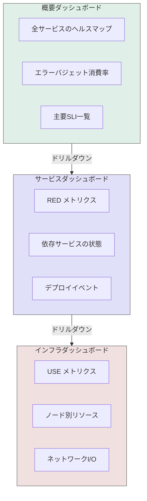

### 長期保存とスケーラビリティ

Prometheus 単体のストレージはローカルディスクに依存しており、長期保存やマルチテナント環境には向かない。この制約を克服するために、リモートストレージとの統合が行われる。代表的なソリューションとして以下がある。

- **Thanos**: Prometheus のサイドカーとして動作し、オブジェクトストレージ（S3, GCSなど）への長期保存と、複数 Prometheus インスタンスのグローバルビューを提供する
- **Cortex / Mimir**: マルチテナント対応の Prometheus 互換リモートストレージ。Grafana Labs が開発する Mimir は Cortex の後継として位置づけられている
- **VictoriaMetrics**: 高いパフォーマンスとデータ圧縮率を特徴とする Prometheus 互換の時系列データベース

## 構造化ログ

### 非構造化ログの限界

従来のログは人間が読むことを前提とした自由形式のテキストであった。

```
2026-03-05 10:23:45 INFO User john_doe logged in from 192.168.1.100
2026-03-05 10:23:46 ERROR Failed to process order #12345: insufficient inventory for item SKU-789
2026-03-05 10:23:47 WARN Database connection pool is 90% utilized
```

このような非構造化ログには以下の問題がある。

1. **パースの困難さ**: ログの形式がアプリケーションごとに異なるため、統一的な検索・集計が困難
2. **検索の非効率性**: 「特定のユーザーのエラーを時系列で並べる」といったクエリには正規表現が必要で、大規模データでは実用的でない
3. **コンテキストの欠落**: ログ行単体では前後関係が分からず、複数のログ行を人間が目視で突き合わせる必要がある
4. **機械処理の困難さ**: ログの自動分析やアラートへの活用が難しい

### 構造化ログの設計

構造化ログ（Structured Logging）は、ログをキーバリューペアの集合として出力する手法である。最も一般的な形式はJSON形式であるが、logfmt形式なども使われる。

```json
{
  "timestamp": "2026-03-05T10:23:46.123Z",
  "level": "ERROR",
  "service": "order-service",
  "trace_id": "abc123def456",
  "span_id": "789ghi",
  "user_id": "john_doe",
  "order_id": "12345",
  "message": "Failed to process order",
  "error": "insufficient inventory",
  "item_sku": "SKU-789",
  "requested_quantity": 3,
  "available_quantity": 1
}
```

構造化ログの利点は明確である。

1. **機械的なパースが容易**: JSON形式であれば、任意のログ分析ツールで即座にパース・インデックス化できる
2. **柔軟な検索・集計**: `user_id = "john_doe" AND level = "ERROR"` のような構造化クエリが使える
3. **コンテキストの保持**: トレースID、スパンID、ユーザーID、リクエストIDなどをフィールドとして含めることで、ログ間の関連付けが容易になる
4. **メトリクスとトレースとの連携**: `trace_id` フィールドを含めることで、ログからトレースへ、トレースからログへと相互にナビゲートできる

### Go における構造化ログの実装例

Go の標準ライブラリ `log/slog`（Go 1.21以降）を用いた構造化ログの実装例を示す。

```go
package main

import (
	"context"
	"log/slog"
	"os"
)

func main() {
	// JSON handler for structured output
	handler := slog.NewJSONHandler(os.Stdout, &slog.HandlerOptions{
		Level: slog.LevelInfo,
	})
	logger := slog.New(handler)
	slog.SetDefault(logger)

	// Log with structured fields
	slog.Info("order processed",
		slog.String("order_id", "12345"),
		slog.String("user_id", "john_doe"),
		slog.Int("item_count", 3),
		slog.Float64("total_amount", 159.99),
		slog.String("trace_id", "abc123def456"),
	)
}
```

### ログの集約と分析

構造化ログの価値を最大限に引き出すには、ログの集約基盤が必要である。代表的なアーキテクチャパターンとして以下がある。

**ELK/EFK スタック**: Elasticsearch（保存・検索）、Logstash または Fluentd / Fluent Bit（収集・変換）、Kibana（可視化）の組み合わせ。最も広く採用されているログ集約基盤だが、Elasticsearch のリソース消費量が大きいことが課題である。

**Loki**: Grafana Labs が開発するログ集約システム。Prometheus に着想を得た設計で、ログのフルテキストインデックスではなくラベルベースのインデックスを採用することで、ストレージコストを大幅に削減している。Grafana との親和性が高く、Prometheus メトリクスと同一のダッシュボードでログを表示できる。

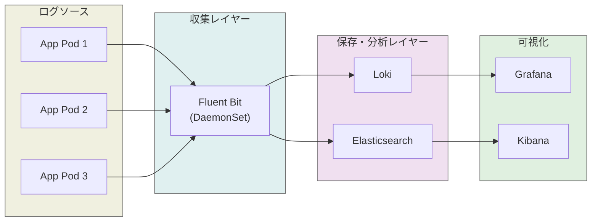

### ログレベルの設計指針

ログレベルの使い分けは、チーム内で合意しておく必要がある。以下は一般的な指針である。

| レベル | 用途 | 例 |
|--------|------|-----|
| ERROR | システムが正常に機能できない状態。即座の対応が必要 | データベース接続失敗、外部API呼び出しの致命的エラー |
| WARN | 注意が必要だが、システムは動作を継続できる | リトライ成功、リソース使用率の閾値超過 |
| INFO | 正常な業務イベント。運用に有用な情報 | ユーザーログイン、注文完了、デプロイ実行 |
| DEBUG | 開発・デバッグ用の詳細情報。本番では通常無効化 | 関数の引数・戻り値、SQL クエリの詳細 |

重要なのは、**ログレベルを動的に変更できる設計にすること**である。本番環境で問題が発生した際に、再デプロイなしで一時的にDEBUGログを有効化できれば、調査のスピードが大幅に向上する。

## 分散トレーシング

### 分散トレーシングの起源

分散トレーシングの概念を広く知らしめたのは、2010年にGoogleが発表した Dapper の論文である。Dapper は Google の内部で使われていた分散トレーシングシステムであり、以下の要件を満たすことを目指していた。

1. **低オーバーヘッド**: 本番トラフィックに影響を与えない程度の軽量さ
2. **アプリケーション透過性**: 開発者が明示的にトレーシングコードを書かなくても動作する
3. **スケーラビリティ**: Google規模のリクエスト量に対応できる

Dapper の影響を受けて、Twitter の Zipkin（2012年オープンソース化）、Uber の Jaeger（2017年オープンソース化）などのオープンソース実装が生まれた。

### OpenTelemetry — テレメトリの標準化

分散トレーシングの歴史において、標準化は大きな課題であった。OpenTracing と OpenCensus という二つの標準化プロジェクトが並立していた時期があったが、2019年にこれらが統合されて **OpenTelemetry（OTel）** が誕生した。

OpenTelemetry は CNCF のプロジェクトであり、メトリクス・ログ・トレースの三つのテレメトリデータを統一的に扱うための仕様、API、SDK、ツール群を提供する。OpenTelemetry の主要コンポーネントは以下の通りである。

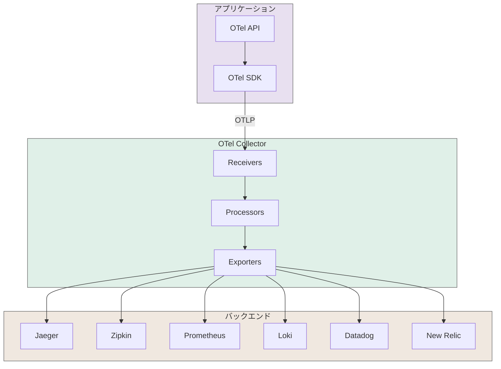

**OTel API**: 計装のためのインターフェースを定義する。アプリケーションコードは API に対してプログラミングし、具体的な実装（バックエンド）には依存しない。

**OTel SDK**: API の実装を提供する。サンプリング戦略、バッチ処理、エクスポート先の設定などを管理する。

**OTel Collector**: テレメトリデータを受信（Receivers）、加工（Processors）、送信（Exporters）するパイプラインを提供するスタンドアロンのプロセス。アプリケーションとバックエンドの間に配置することで、バックエンドの変更をアプリケーションコードに影響させない。

**OTLP（OpenTelemetry Protocol）**: テレメトリデータの送受信のためのプロトコル。gRPC と HTTP の両方をサポートする。

### コンテキスト伝播

分散トレーシングの核心は**コンテキスト伝播（Context Propagation）** にある。一つのリクエストが複数のサービスを横断する際に、トレースIDやスパンIDをサービス間で受け渡す仕組みである。

一般的に、HTTPリクエストの場合はHTTPヘッダを通じてコンテキストが伝播される。W3C Trace Context は標準的なヘッダ形式を定義している。

```
traceparent: 00-0af7651916cd43dd8448eb211c80319c-b7ad6b7169203331-01
```

この文字列は以下の構造を持つ。

| フィールド | 値 | 説明 |
|-----------|-----|------|
| version | 00 | バージョン |
| trace-id | 0af7651916cd43dd8448eb211c80319c | トレース全体の一意識別子（128bit） |
| parent-id | b7ad6b7169203331 | 親スパンの識別子（64bit） |
| trace-flags | 01 | サンプリングフラグ |

コンテキスト伝播はHTTPだけでなく、gRPC のメタデータ、メッセージキュー（Kafka のヘッダ）、非同期処理（バックグラウンドジョブ）など、あらゆるサービス間通信で行われる必要がある。

### サンプリング戦略

大規模システムでは全てのリクエストをトレースすると、テレメトリデータのストレージコストと処理負荷が膨大になる。そのため、適切なサンプリング戦略が重要になる。

1. **Head-based Sampling**: リクエストの開始時にサンプリングの可否を決定する。最もシンプルだが、エラーや高レイテンシなど重要なリクエストを取りこぼす可能性がある
2. **Tail-based Sampling**: リクエストの完了後にサンプリングの可否を決定する。エラーが発生したリクエストや高レイテンシのリクエストを確実にサンプリングできるが、全データを一時的にバッファリングする必要がある
3. **Adaptive Sampling**: トラフィック量に応じてサンプリングレートを動的に調整する

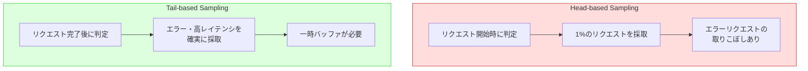

実践的には、Tail-based Sampling を OTel Collector 上で実行するのが一般的なパターンである。OTel Collector の `tail_sampling` プロセッサを使うことで、エラーが発生したトレースや特定の条件に合致するトレースを選択的に保存できる。

## SLI / SLO / SLA

### 信頼性の定量化

オブザーバビリティの目的は、単にデータを収集することではなく、サービスの信頼性を定量的に評価し、改善するための基盤を提供することにある。SLI、SLO、SLA はこの定量化のフレームワークである。

**SLI（Service Level Indicator）** は、サービスの品質を測定する定量的な指標である。SLIは「良いイベント / 全イベント」の比率として定義されることが多い。

**SLO（Service Level Objective）** は、SLIに対する目標値である。「SLIがこの値以上であるべき」という内部的な目標を定める。

**SLA（Service Level Agreement）** は、顧客との間で合意するサービスレベルの契約である。SLOを下回った場合のペナルティ（返金など）が含まれることが一般的である。通常、SLAはSLOよりも緩い値が設定される。

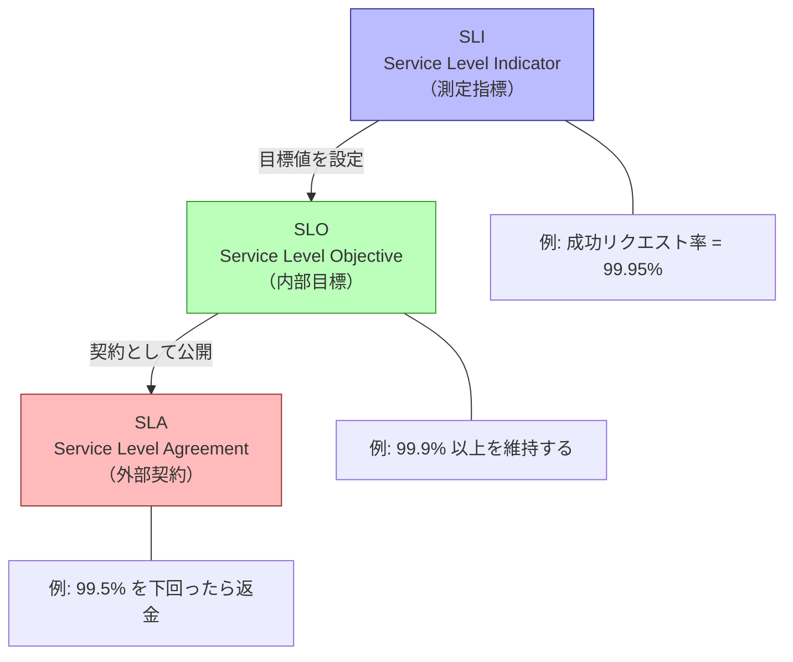

### SLI の選定

SLIの選定はオブザーバビリティ実践の中でも最も重要なステップの一つである。Googleの SRE 本では、ユーザーの体験に直結する指標を選ぶことが推奨されている。

| サービスの種類 | 推奨SLI | 測定方法 |
|---------------|---------|---------|
| リクエスト駆動型（API, Webアプリ） | 可用性（成功率）、レイテンシ | 成功レスポンス / 全レスポンス、レスポンス時間の分布 |
| データ処理パイプライン | 新鮮さ、正確性、カバレッジ | 最後の処理からの経過時間、処理結果の正しさの割合 |
| ストレージシステム | 耐久性、可用性、レイテンシ | データ損失率、読み取り成功率、読み取り時間 |

重要なのは、SLIをユーザーの視点から定義することである。サーバー側のメトリクス（CPU使用率、メモリ使用量など）はSLIとしては不適切であることが多い。ユーザーは「レスポンスが返ってくるか」「速いか」を気にするのであって、サーバーのCPU使用率を気にするわけではない。

### エラーバジェット

SLOが定まると、そこから**エラーバジェット（Error Budget）** が導出される。エラーバジェットとは「SLOの範囲内で許容される失敗の量」である。

例えば、月間のSLOが99.9%であれば、エラーバジェットは0.1%である。月間リクエスト数が1,000万件であれば、1万件までのエラーは許容される。月間の時間でいえば、約43分のダウンタイムが許容される。

エラーバジェットは開発とSREの間の共通言語として機能する。エラーバジェットに余裕があれば積極的にリリースを行い、エラーバジェットが枯渇に近づけばリリースを控えて信頼性改善に注力する。これにより、「信頼性」と「開発速度」のトレードオフを定量的に管理できる。

```promql
# Error budget remaining (as a ratio)
# SLO: 99.9% availability over 30 days

# Current error ratio
1 - (
  sum(rate(http_requests_total{status!~"5.."}[30d]))
  /
  sum(rate(http_requests_total[30d]))
)

# Error budget = 1 - SLO = 0.001
# Budget consumed = current_error_ratio / error_budget
```

## アラート設計

### アラート疲れの問題

不適切なアラート設計は「アラート疲れ（Alert Fatigue）」を引き起こす。アラート疲れとは、大量の無意味なアラートや対応不要なアラートにより、運用チームがアラートを無視するようになる現象である。アラート疲れが深刻になると、本当に重要なアラートまでもが見逃される危険がある。

Googleの SRE 本では、「すべてのアラートに対して何らかのアクションが必要であるべき」という原則が述べられている。アラートを受け取った人が「これは無視して良い」と判断するようなアラートは、そもそも存在してはならない。

### SLO ベースアラート

最も効果的なアラート戦略は、SLO に基づくアラートである。個々のメトリクスの閾値ではなく、エラーバジェットの消費速度に基づいてアラートを発報する。

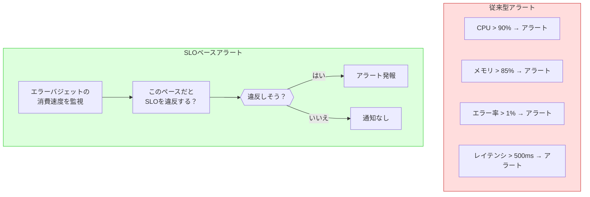

SLOベースアラートの代表的な手法として **Multi-window, Multi-burn-rate Alerts** がある。これは、エラーバジェットの消費速度（burn rate）を複数の時間窓で監視し、短期的な急増と長期的な持続的悪化の両方を検出する手法である。

| 緊急度 | 長い時間窓 | 短い時間窓 | Burn Rate | 対応 |
|--------|-----------|-----------|-----------|------|
| 高（ページ） | 1時間 | 5分 | 14.4x | 即時対応 |
| 高（ページ） | 6時間 | 30分 | 6x | 即時対応 |
| 中（チケット） | 3日 | 6時間 | 1x | 営業時間内に対応 |

例えば、burn rate 14.4x とは「通常の14.4倍の速度でエラーバジェットを消費している」状態を意味する。この場合、SLO期間（30日）のわずか2日でエラーバジェットが枯渇する計算になるため、即座の対応が必要である。

```promql
# Multi-burn-rate alert example
# SLO: 99.9% over 30 days
# Error budget: 0.1%

# Fast burn: 14.4x burn rate, 1h window, 5m short window
(
  1 - (sum(rate(http_requests_total{status!~"5.."}[1h])) / sum(rate(http_requests_total[1h])))
) > (14.4 * 0.001)
and
(
  1 - (sum(rate(http_requests_total{status!~"5.."}[5m])) / sum(rate(http_requests_total[5m])))
) > (14.4 * 0.001)
```

### アラートのルーティングとエスカレーション

アラートの発報先を適切にルーティングすることも重要である。Prometheus エコシステムでは Alertmanager がこの役割を担う。

```yaml
# Alertmanager configuration example
route:
  receiver: "default"
  group_by: ["alertname", "service"]
  group_wait: 30s
  group_interval: 5m
  repeat_interval: 4h
  routes:
    - match:
        severity: "critical"
      receiver: "pagerduty-critical"
      repeat_interval: 15m
    - match:
        severity: "warning"
      receiver: "slack-warnings"
      repeat_interval: 1h

receivers:
  - name: "pagerduty-critical"
    pagerduty_configs:
      - service_key: "<key>"
  - name: "slack-warnings"
    slack_configs:
      - channel: "#alerts-warning"
  - name: "default"
    slack_configs:
      - channel: "#alerts-info"
```

アラートには以下の情報を含めるべきである。

1. **何が起きているか**: SLI の現在値と SLO の目標値
2. **影響範囲**: 影響を受けるユーザー数やトラフィック量の推定
3. **ダッシュボードへのリンク**: 詳細を確認するための Grafana ダッシュボード URL
4. **ランブックへのリンク**: 対応手順を記載したドキュメントへの URL
5. **関連するトレースやログへのリンク**: 問題の調査を開始するための起点

## Observability as Code

### インフラ同様にオブザーバビリティもコード管理する

Observability as Code は、オブザーバビリティに関する設定（ダッシュボード、アラートルール、SLO定義など）をコードとして管理し、バージョン管理、コードレビュー、CI/CD パイプラインの対象とするプラクティスである。

手動でGUIからダッシュボードやアラートを設定する方法では、以下の問題が生じる。

- **再現性の欠如**: 設定の変更履歴が追跡できず、誤った変更を元に戻すのが困難
- **属人化**: 特定のエンジニアしかダッシュボードの構成を把握していない
- **環境間の不整合**: ステージング環境と本番環境でアラートの設定が異なる
- **レビューの欠如**: ダッシュボードやアラートの変更がピアレビューされない

### Terraform による Grafana ダッシュボードの管理

Terraform の Grafana プロバイダを使うことで、ダッシュボードやデータソースをコードとして管理できる。

```hcl
# Grafana data source configuration
resource "grafana_data_source" "prometheus" {
  type = "prometheus"
  name = "Prometheus"
  url  = "http://prometheus:9090"

  json_data_encoded = jsonencode({
    httpMethod = "POST"
    timeInterval = "15s"
  })
}

# Grafana dashboard from JSON file
resource "grafana_dashboard" "order_service" {
  config_json = file("dashboards/order-service.json")
  folder      = grafana_folder.services.id
}

# Grafana alert rule
resource "grafana_rule_group" "order_slo" {
  name             = "order-service-slo"
  folder_uid       = grafana_folder.alerts.uid
  interval_seconds = 60

  rule {
    name      = "Order API Error Rate SLO Breach"
    condition = "C"

    data {
      ref_id         = "A"
      datasource_uid = grafana_data_source.prometheus.uid
      model = jsonencode({
        expr = "sum(rate(http_requests_total{service=\"order\",status=~\"5..\"}[5m])) / sum(rate(http_requests_total{service=\"order\"}[5m]))"
      })
    }
  }
}
```

### Prometheus アラートルールのコード管理

Prometheus のアラートルールは YAML ファイルとして定義され、Git リポジトリで管理できる。

```yaml
# prometheus-rules/order-service.yml
groups:
  - name: order-service-slo
    rules:
      # Error budget burn rate alert (fast burn)
      - alert: OrderServiceHighErrorBurnRate
        expr: |
          (
            1 - sum(rate(http_requests_total{service="order",status!~"5.."}[1h]))
            / sum(rate(http_requests_total{service="order"}[1h]))
          ) > (14.4 * 0.001)
          and
          (
            1 - sum(rate(http_requests_total{service="order",status!~"5.."}[5m]))
            / sum(rate(http_requests_total{service="order"}[5m]))
          ) > (14.4 * 0.001)
        for: 2m
        labels:
          severity: critical
          service: order
        annotations:
          summary: "Order service error budget burning too fast"
          description: "Error budget burn rate is 14.4x. Budget will be exhausted in ~2 days."
          dashboard: "https://grafana.example.com/d/order-service"
          runbook: "https://wiki.example.com/runbooks/order-service-errors"
```

### SLO as Code

SLO の定義自体もコードとして管理することで、SLI の測定方法、目標値、アラートルールを一元的に管理できる。OpenSLO は SLO を YAML 形式で定義するための仕様であり、ツール間でのポータビリティを提供する。

```yaml
# openslo/order-service.yml
apiVersion: openslo/v1
kind: SLO
metadata:
  name: order-api-availability
  displayName: "Order API Availability"
spec:
  service: order-service
  description: "Availability of the Order API"
  budgetingMethod: Occurrences
  objectives:
    - displayName: "99.9% Success Rate"
      target: 0.999
      ratioMetrics:
        good:
          source: prometheus
          queryType: promql
          query: sum(rate(http_requests_total{service="order",status!~"5.."}[{{.window}}]))
        total:
          source: prometheus
          queryType: promql
          query: sum(rate(http_requests_total{service="order"}[{{.window}}]))
  timeWindow:
    - duration: 30d
      isRolling: true
```

### CI/CD パイプラインへの統合

Observability as Code を実践する場合、CI/CD パイプラインでの検証が重要になる。

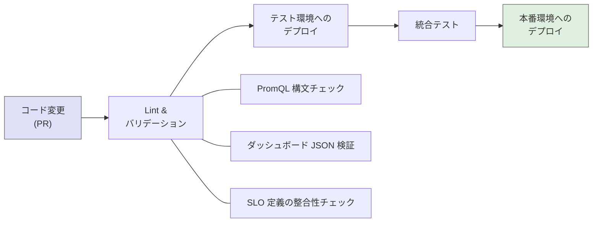

Prometheus のアラートルールは `promtool check rules` コマンドで構文検証ができる。Grafana のダッシュボード JSON も JSON Schema で検証可能である。このような検証を CI パイプラインに組み込むことで、設定ミスを本番デプロイ前に検出できる。

## 実践的な導入ステップ

### フェーズ1: 基盤の構築

オブザーバビリティの導入は段階的に進めるべきである。一度にすべてを整備しようとすると、複雑さに圧倒されて中途半端な結果に終わることが多い。

**ステップ1: メトリクス基盤の導入**

最初に取り組むべきはメトリクス基盤である。Prometheus + Grafana の組み合わせは、導入コストが低く、Kubernetes 環境では Helm チャート（kube-prometheus-stack）で容易にデプロイできる。

まずはインフラレベルのメトリクス（CPU、メモリ、ディスク、ネットワーク）とアプリケーションの基本的な RED メトリクス（Rate、Errors、Duration）の収集から始める。

**ステップ2: 構造化ログの導入**

既存のテキストログを構造化ログに移行する。この段階では、ログの出力を JSON 形式に変更し、リクエストIDやユーザーIDなどのコンテキスト情報を含めるようにする。ログの集約基盤（Loki や Elasticsearch）をデプロイし、検索可能な状態にする。

**ステップ3: 分散トレーシングの導入**

OpenTelemetry SDK をアプリケーションに組み込み、トレースの収集を開始する。最初は自動計装（auto-instrumentation）から始め、必要に応じて手動の計装を追加する。

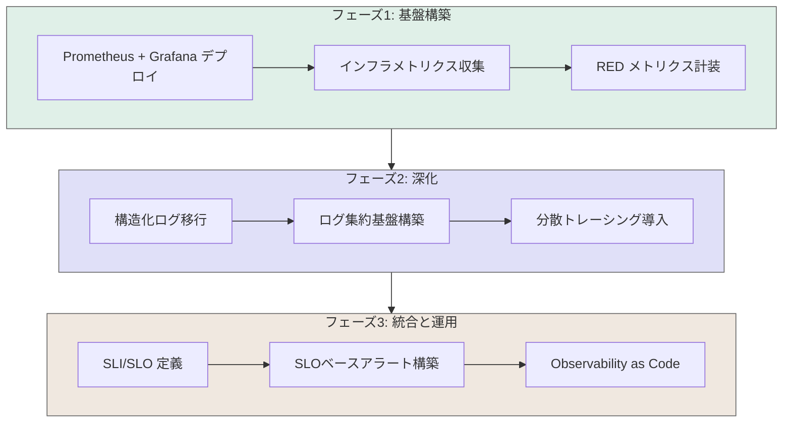

### フェーズ2: SLI/SLO の定義

メトリクスとトレースの基盤が整ったら、SLI と SLO を定義する。

1. **ユーザージャーニーの洗い出し**: ユーザーがシステムを利用する主要な動線を特定する
2. **各ジャーニーの SLI を定義**: 可用性とレイテンシの SLI を、ユーザーに近い位置で測定する
3. **SLO の目標値を設定**: 過去のデータを分析し、現実的かつ意欲的な目標値を設定する
4. **エラーバジェットの運用ポリシーを策定**: エラーバジェットが枯渇した際のアクション（リリース凍結、信頼性改善スプリントなど）を決める

### フェーズ3: アラートの最適化

SLO が定義されたら、SLO ベースのアラートを構築する。既存の閾値ベースアラートを見直し、ノイズとなっているアラートを削除する。

アラートの効果を測定するために、以下のメトリクスを追跡することが推奨される。

- **アラートの発報件数**: 週あたり・月あたりの発報件数
- **アクション可能率**: 発報されたアラートのうち、実際に対応アクションが必要だったものの割合
- **平均検知時間（MTTD）**: 問題発生から検知までの平均時間
- **平均復旧時間（MTTR）**: 問題検知から復旧までの平均時間

### フェーズ4: 組織的な成熟

オブザーバビリティは技術だけでなく、組織の文化でもある。以下の観点で組織的な成熟を図る。

**オンコール文化の醸成**: オンコール担当者がアラートに対応した際のポストモーテム（事後分析）を定期的に実施し、アラートの品質を継続的に改善する。

**ダッシュボードレビュー**: 定期的にダッシュボードの内容をレビューし、不要なパネルの削除や新たな可視化の追加を行う。

**オブザーバビリティのチャンピオン**: 各チームにオブザーバビリティに詳しいメンバー（チャンピオン）を配置し、チーム内でのベストプラクティスの普及を推進する。

## オブザーバビリティのコストと戦略的トレードオフ

### テレメトリデータのコスト構造

オブザーバビリティの導入にあたって無視できないのがコストである。テレメトリデータは量が多くなるほど保存・処理のコストが増大する。

メトリクスデータは比較的軽量であるが、カーディナリティ（ラベルの組み合わせの総数）が爆発すると Prometheus のメモリ消費が急増する。ログデータは最もコストが大きい要素であり、大規模システムでは月間 TB 単位のデータが生成される。トレースデータはサンプリングにより制御可能だが、サンプリング率を下げすぎると稀少な問題の調査能力が失われる。

### カーディナリティの管理

メトリクスのカーディナリティ管理は、Prometheus 運用における最大の課題の一つである。以下のようなラベルの使い方はカーディナリティ爆発を引き起こす。

- ユーザーID をラベルに含める（ユーザー数分の時系列が生成される）
- リクエストパスをそのままラベルに含める（パスパラメータを含む無数のパターンが生成される）
- UUIDやセッションIDをラベルに含める

カーディナリティの高い情報はメトリクスのラベルではなく、ログやトレースのフィールドとして記録すべきである。

```
# Bad: High cardinality
http_requests_total{user_id="user123", path="/api/orders/abc-def-ghi"}

# Good: Low cardinality
http_requests_total{handler="/api/orders/:id", method="GET", status="200"}
```

### データ保持期間の戦略

テレメトリデータの保持期間は、コストと調査能力のトレードオフである。一般的な指針は以下の通りである。

| データ種別 | 高解像度 | ダウンサンプリング後 |
|-----------|---------|-------------------|
| メトリクス | 15日〜30日 | 1年〜数年（5分間隔に集約） |
| ログ | 7日〜30日 | 90日〜1年（圧縮保存） |
| トレース | 7日〜14日 | サンプル保存30日〜90日 |

## まとめ — オブザーバビリティの本質

オブザーバビリティは、単なるツールの導入ではなく、複雑なシステムを理解し運用するためのエンジニアリング・ディシプリンである。その本質は以下の三点に集約される。

第一に、**未知の問題への対処能力**である。モニタリングが既知のパターンへの対応であるのに対し、オブザーバビリティは「まだ見たことのない問題」を調査する力を提供する。十分なテレメトリデータが収集されていれば、発生した問題に対して事後的に仮説を立て、検証することができる。

第二に、**三本柱の統合的活用**である。メトリクス、ログ、トレースのそれぞれが独立した価値を持つが、これらが相互にリンクされることで、問題の検知から根本原因の解明までのワークフローが飛躍的に効率化される。OpenTelemetry はこの統合を標準化するための重要な取り組みである。

第三に、**信頼性のエンジニアリング**である。SLI/SLO/エラーバジェットのフレームワークにより、信頼性を定量的に管理し、開発速度とのバランスを意識的に制御できるようになる。SLOベースのアラートは、ノイズを削減しながら真に重要な問題に集中することを可能にする。

現代のソフトウェアシステムは、マイクロサービス、コンテナ、サーバーレスといった技術の採用により、かつてないほど複雑になっている。この複雑さに立ち向かうための最も有効な武器が、体系的に設計・実装されたオブザーバビリティ基盤である。ツールの導入だけでなく、SLI/SLO の定義、アラート設計、Observability as Code の実践、そして組織文化の醸成まで含めた包括的な取り組みが、真のオブザーバビリティを実現する。
