# OCIイメージ仕様

## 1. OCI（Open Container Initiative）の背景

### 1.1 コンテナ標準化の必要性

2013 年に Docker が登場して以来、コンテナ技術は爆発的に普及した。しかし、Docker が事実上の標準を独占する状況は、エコシステムにとって健全とは言えなかった。コンテナイメージのフォーマット、ランタイムの動作仕様、レジストリとの通信プロトコル――これらがすべて Docker 社の実装に依存していたため、代替ランタイムや代替レジストリの開発が困難であり、ベンダーロックインのリスクがあった。

この問題を解決するため、2015 年 6 月に Linux Foundation のもとで **Open Container Initiative（OCI）** が設立された。Docker、Google、Red Hat、CoreOS、AWS、Microsoft など主要なクラウド・コンテナベンダーが参加し、コンテナ技術のオープンな標準化を推進する組織として活動を開始した。

### 1.2 OCI の三大仕様

OCI は以下の 3 つの仕様を策定・管理している。

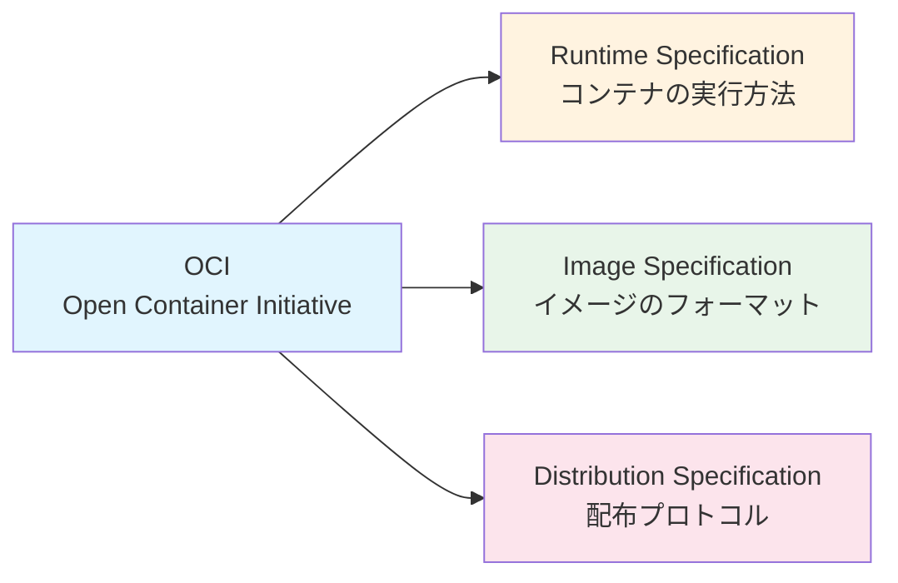

| 仕様 | 概要 | 初版リリース |
|------|------|-------------|
| **Runtime Specification** | コンテナの設定・実行・ライフサイクルを定義。参照実装は runc | 2017 年 7 月（v1.0） |
| **Image Specification** | コンテナイメージのフォーマットを定義。Manifest、Config、Layers で構成 | 2017 年 7 月（v1.0） |
| **Distribution Specification** | レジストリとの通信プロトコルを定義。Docker Registry HTTP API V2 がベース | 2021 年 5 月（v1.0） |

本記事では、このうち **Image Specification** を中心に解説し、関連する Distribution Specification にも触れる。

### 1.3 Docker Image Format から OCI Image Format へ

Docker は自社のイメージフォーマットとして Docker Image Manifest V2 Schema 2 を策定していた。OCI Image Specification はこのフォーマットを基盤として標準化されたものであり、両者には高い互換性がある。実際、Docker Engine は OCI フォーマットのイメージを直接取り扱うことができ、多くのコンテナレジストリも両方のフォーマットをサポートしている。

2024 年 2 月には OCI Image Specification v1.1 がリリースされ、`subject` フィールドや `artifactType` フィールドの追加、Referrers API の導入など、重要な拡張が行われた。

## 2. イメージ仕様の構造

### 2.1 全体アーキテクチャ

OCI イメージは、3 つの主要コンポーネントで構成される。

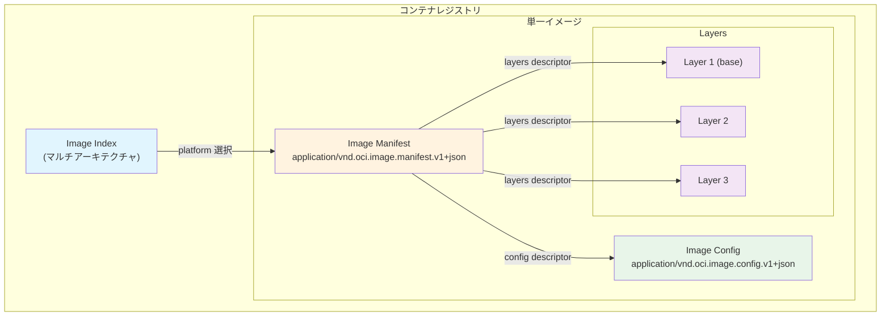

### 2.2 Content Descriptor

OCI 仕様の基盤となる概念が **Content Descriptor**（コンテンツ記述子）である。すべてのコンポーネント間の参照はこの記述子を通じて行われる。

```json
{
  "mediaType": "application/vnd.oci.image.layer.v1.tar+gzip",
  "digest": "sha256:6c3c624b58dbbcd3c0dd82b4c53f04194d1247c6eebdaab7c610cf7d66709b3b",
  "size": 73109
}
```

| フィールド | 説明 |
|-----------|------|
| `mediaType` | コンテンツの種類を示す MIME タイプ |
| `digest` | コンテンツの暗号学的ハッシュ値（`algorithm:hex` 形式） |
| `size` | コンテンツのバイト数 |

`digest` はコンテンツの一意な識別子として機能し、Content-Addressable Storage の基盤となる。通常は SHA-256 が用いられ、`sha256:` プレフィックスとともに 64 文字の 16 進数文字列で表現される。

### 2.3 Image Manifest

Image Manifest はイメージ全体の構成を記述する JSON ドキュメントであり、イメージの「目次」に相当する。

```json
{
  "schemaVersion": 2,
  "mediaType": "application/vnd.oci.image.manifest.v1+json",
  "config": {
    "mediaType": "application/vnd.oci.image.config.v1+json",
    "digest": "sha256:b5b2b2c507a0944348e0303114d8d93aaaa081732b86451d9bce1f432a537bc7",
    "size": 7023
  },
  "layers": [
    {
      "mediaType": "application/vnd.oci.image.layer.v1.tar+gzip",
      "digest": "sha256:9834876dcfb05cb167a5c24953eba58c4ac89b1adf57f28f2f9d09af107ee8f0",
      "size": 32654
    },
    {
      "mediaType": "application/vnd.oci.image.layer.v1.tar+gzip",
      "digest": "sha256:3c3a4604a545cdc127456d94e421cd355bca5b528f4a9c1905b15da2eb4a4c6b",
      "size": 16724
    }
  ],
  "annotations": {
    "org.opencontainers.image.created": "2024-01-15T10:30:00Z"
  }
}
```

`schemaVersion` は現行仕様では常に `2` である。`config` フィールドは Image Config への参照を、`layers` 配列は各レイヤーへの参照を保持する。`layers` 配列では、インデックス 0 がベースレイヤーであり、以降のレイヤーは積み重ね順に並ぶ。

v1.1 で追加された `subject` フィールドについては、後述の OCI Artifacts のセクションで詳しく扱う。

### 2.4 Image Config

Image Config はイメージの実行時メタデータを記述する JSON ドキュメントである。コンテナランタイムがコンテナを起動する際に、この情報を参照する。

```json
{
  "created": "2024-01-15T10:30:00Z",
  "author": "example@example.com",
  "architecture": "amd64",
  "os": "linux",
  "config": {
    "ExposedPorts": {
      "8080/tcp": {}
    },
    "Env": [
      "PATH=/usr/local/sbin:/usr/local/bin:/usr/sbin:/usr/bin:/sbin:/bin",
      "APP_ENV=production"
    ],
    "Entrypoint": ["/app/server"],
    "Cmd": ["--port", "8080"],
    "WorkingDir": "/app",
    "Labels": {
      "version": "1.0.0"
    }
  },
  "rootfs": {
    "type": "layers",
    "diff_ids": [
      "sha256:abc123...",
      "sha256:def456..."
    ]
  },
  "history": [
    {
      "created": "2024-01-15T10:00:00Z",
      "created_by": "/bin/sh -c #(nop) ADD file:... in /",
      "comment": "base layer"
    },
    {
      "created": "2024-01-15T10:30:00Z",
      "created_by": "COPY --from=builder /app/server /app/server",
      "empty_layer": false
    }
  ]
}
```

主要フィールドの意味を整理する。

| フィールド | 説明 |
|-----------|------|
| `architecture` | 対象 CPU アーキテクチャ（`amd64`, `arm64` など） |
| `os` | 対象 OS（`linux`, `windows` など） |
| `config` | 実行時設定（環境変数、エントリーポイント、公開ポートなど） |
| `rootfs.diff_ids` | 各レイヤーの非圧縮 tar の SHA-256 ハッシュ |
| `history` | 各レイヤーのビルド履歴 |

ここで注目すべきは `rootfs.diff_ids` と Manifest 内の `layers[].digest` の違いである。`diff_ids` は非圧縮状態のレイヤー内容のハッシュであるのに対し、Manifest 内の `digest` は圧縮後（gzip 等）のハッシュである。これにより、同じレイヤー内容でも圧縮方法が異なればレジストリ上では別の BLOB として扱われるが、ランタイム上では同一のファイルシステム差分として認識される。

### 2.5 Layers

レイヤーはファイルシステムの変更差分を tar アーカイブとして格納したものである。OCI 仕様では以下のメディアタイプが定義されている。

| メディアタイプ | 説明 |
|--------------|------|
| `application/vnd.oci.image.layer.v1.tar` | 非圧縮 tar |
| `application/vnd.oci.image.layer.v1.tar+gzip` | gzip 圧縮 tar |
| `application/vnd.oci.image.layer.v1.tar+zstd` | Zstandard 圧縮 tar |
| `application/vnd.oci.image.layer.nondistributable.v1.tar+gzip` | 再配布不可レイヤー（非推奨） |

各レイヤーはベースレイヤーからの差分を表現する。ファイルの追加は通常の tar エントリとして記録され、ファイルの削除は **whiteout ファイル**（`.wh.` プレフィックス付きファイル）によって表現される。たとえば、`/etc/config.txt` を削除するレイヤーには `/etc/.wh.config.txt` というエントリが含まれる。ディレクトリ全体を削除する場合は、**opaque whiteout**（`.wh..wh..opq`）が使われる。

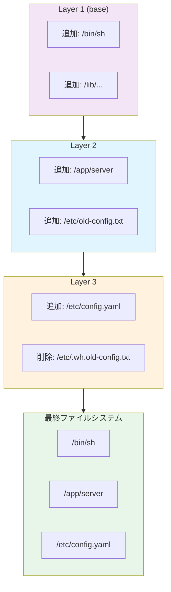

コンテナランタイムは、これらのレイヤーをユニオンファイルシステム（OverlayFS など）を用いて重ね合わせ、単一のファイルシステムビューを構築する。

## 3. レイヤーと Content-Addressable Storage

### 3.1 Content-Addressable Storage とは

Content-Addressable Storage（CAS）は、コンテンツ自体のハッシュ値をアドレス（識別子）として利用するストレージ方式である。OCI イメージ仕様はこの CAS を全面的に採用しており、イメージを構成するすべてのコンポーネント――Manifest、Config、各レイヤー――が SHA-256 ハッシュによって一意に識別される。

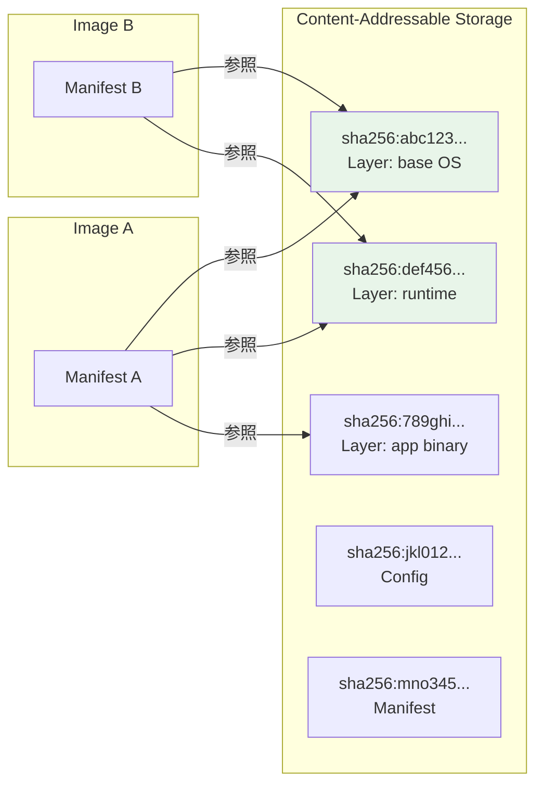

この図では、Image A と Image B が同じベース OS レイヤー（`sha256:abc123...`）とランタイムレイヤー（`sha256:def456...`）を共有している。CAS によって、物理的にはデータを一度だけ保存すれば済む。

### 3.2 CAS がもたらす利点

CAS の設計がコンテナエコシステムに与えるメリットは多岐にわたる。

**1. ストレージ効率**

同一内容のレイヤーは一度だけ保存されるため、同じベースイメージを共有する多数のイメージがあっても、ストレージ消費は最小限に抑えられる。コンテナレジストリでは、push 時に既に存在する BLOB のアップロードをスキップする「マウント」操作がサポートされている。

**2. ネットワーク効率**

イメージの pull 時に、ローカルに既に存在するレイヤーはダウンロードされない。Docker や containerd はローカルストアを CAS として管理し、digest の比較だけで「このレイヤーはダウンロード済みか」を即座に判断できる。

**3. 完全性検証**

ダウンロードしたコンテンツのハッシュ値と、Manifest に記載された digest を比較することで、転送中にデータが改ざんされていないことを検証できる。これはセキュリティ上の重要な特性である。

**4. 不変性（Immutability）**

digest は内容に対する一意な識別子であるため、一度生成された BLOB の内容が変更されることはない。これにより、再現可能なデプロイが保証される。タグ（`v1.0`, `latest` など）は可変的な参照であり、同じタグが異なる digest を指すことがあるが、digest 自体は常に不変である。

### 3.3 OCI Image Layout

OCI Image Layout は、イメージをファイルシステム上に格納するためのディレクトリ構造を定義する。これはレジストリとは独立したローカルでの保存形式であり、CAS の原則に従って構成される。

```
image-layout/
├── oci-layout          # {"imageLayoutVersion": "1.0.0"}
├── index.json          # Image Index (entry point)
└── blobs/
    └── sha256/
        ├── abc123...   # Manifest
        ├── def456...   # Config
        ├── 789ghi...   # Layer 1
        └── jkl012...   # Layer 2
```

`blobs/` ディレクトリ以下では、すべてのコンテンツがその digest をファイル名として保存される。`index.json` がエントリーポイントとなり、ここから Manifest を辿ることでイメージ全体を復元できる。

### 3.4 digest の計算

OCI 仕様では、digest は以下の形式で表現される。

```
algorithm ":" hex-encoded-hash
```

現在の標準アルゴリズムは SHA-256 であり、SHA-512 も許容されている。具体的な計算例を示す。

```bash
# Layer の tar.gz ファイルの digest を計算
sha256sum layer.tar.gz
# Output: 6c3c624b58dbbcd3c0dd82b4c53f04194d1247c6eebdaab7c610cf7d66709b3b  layer.tar.gz

# => digest は sha256:6c3c624b58dbbcd3c0dd82b4c53f04194d1247c6eebdaab7c610cf7d66709b3b
```

Manifest の digest がイメージ全体の識別子となる。Docker ではこれを「Image ID」として表示することがある。`docker pull ubuntu@sha256:abc123...` のように digest を明示指定することで、タグの可変性に依存せず、常に同一のイメージを取得できる。

## 4. マルチアーキテクチャイメージ

### 4.1 背景と動機

クラウドネイティブ環境では、複数の CPU アーキテクチャにまたがるデプロイが一般化している。x86_64（amd64）が長らく主流であったが、Apple Silicon（arm64）や AWS Graviton（arm64）の登場により、arm64 アーキテクチャの重要性が急速に高まっている。また、IoT 分野では ARM の 32 ビット版やその他のアーキテクチャも利用される。

このような多様なアーキテクチャに対応するため、一つのイメージタグ（例: `nginx:1.25`）から適切なアーキテクチャ向けのイメージを自動的に選択する仕組みが必要となった。

### 4.2 Image Index

**Image Index**（Docker の用語では「Fat Manifest」または「Manifest List」）は、複数の Image Manifest を束ねる JSON ドキュメントである。

```json
{
  "schemaVersion": 2,
  "mediaType": "application/vnd.oci.image.index.v1+json",
  "manifests": [
    {
      "mediaType": "application/vnd.oci.image.manifest.v1+json",
      "digest": "sha256:aaa111...",
      "size": 7143,
      "platform": {
        "architecture": "amd64",
        "os": "linux"
      }
    },
    {
      "mediaType": "application/vnd.oci.image.manifest.v1+json",
      "digest": "sha256:bbb222...",
      "size": 7682,
      "platform": {
        "architecture": "arm64",
        "os": "linux",
        "variant": "v8"
      }
    },
    {
      "mediaType": "application/vnd.oci.image.manifest.v1+json",
      "digest": "sha256:ccc333...",
      "size": 3204,
      "platform": {
        "architecture": "amd64",
        "os": "windows",
        "os.version": "10.0.20348.887"
      }
    }
  ]
}
```

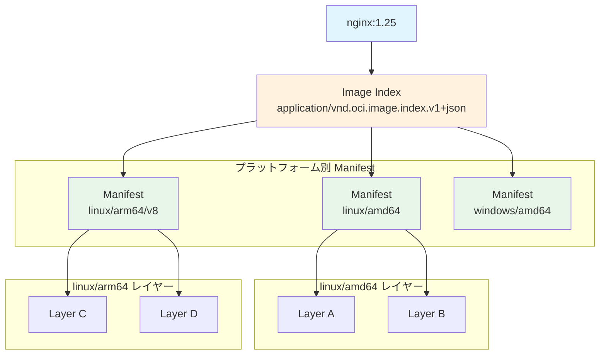

各 `manifests` エントリには `platform` フィールドがあり、`architecture`、`os`、`variant`（オプション）、`os.version`（オプション）などの情報を持つ。コンテナランタイムは、ホスト環境の情報とこの `platform` フィールドを照合し、適切な Manifest を選択する。

### 4.3 マルチアーキテクチャイメージの構築

Docker の `buildx` を用いると、複数アーキテクチャ向けのイメージを一度に構築し、Image Index としてレジストリにプッシュできる。

```bash
# buildx builder の作成
docker buildx create --name multiarch --use

# 複数アーキテクチャ向けにビルドしてプッシュ
docker buildx build \
  --platform linux/amd64,linux/arm64 \
  --tag registry.example.com/myapp:1.0 \
  --push .
```

内部的には、各アーキテクチャ向けのビルドが実行され（QEMU エミュレーションまたはネイティブビルドノードを使用）、それぞれの Manifest が生成され、最終的に Image Index にまとめられてレジストリにプッシュされる。

### 4.4 ネストされた Index

OCI 仕様では、Image Index が別の Image Index を参照することも許されている。これにより、組織内で共通のベースイメージセットを Image Index として定義し、それを上位の Index から参照するといった階層構造を構築できる。ただし、実際にこの機能をフルに活用しているケースはまだ少ない。

## 5. コンテナレジストリプロトコル

### 5.1 OCI Distribution Specification

コンテナレジストリとの通信プロトコルは、**OCI Distribution Specification** として標準化されている。この仕様は Docker Registry HTTP API V2 をベースとしており、RESTful な HTTP API でイメージの push/pull を行う。

### 5.2 主要エンドポイント

OCI Distribution Specification は、以下のカテゴリに分類される API エンドポイントを定義している。

**Pull カテゴリ（必須）**

| 操作 | メソッド | エンドポイント |
|------|---------|---------------|
| Manifest の取得 | `GET` | `/v2/<name>/manifests/<reference>` |
| BLOB の取得 | `GET` | `/v2/<name>/blobs/<digest>` |

**Push カテゴリ**

| 操作 | メソッド | エンドポイント |
|------|---------|---------------|
| BLOB のアップロード開始 | `POST` | `/v2/<name>/blobs/uploads/` |
| BLOB のアップロード（チャンク） | `PATCH` | `/v2/<name>/blobs/uploads/<uuid>` |
| BLOB のアップロード完了 | `PUT` | `/v2/<name>/blobs/uploads/<uuid>?digest=<digest>` |
| BLOB マウント | `POST` | `/v2/<name>/blobs/uploads/?mount=<digest>&from=<other>` |
| Manifest のアップロード | `PUT` | `/v2/<name>/manifests/<reference>` |

**Content Discovery カテゴリ**

| 操作 | メソッド | エンドポイント |
|------|---------|---------------|
| タグ一覧 | `GET` | `/v2/<name>/tags/list` |
| Referrers 取得 | `GET` | `/v2/<name>/referrers/<digest>` |

### 5.3 Pull の流れ

イメージの pull 操作は、以下のステップで進行する。

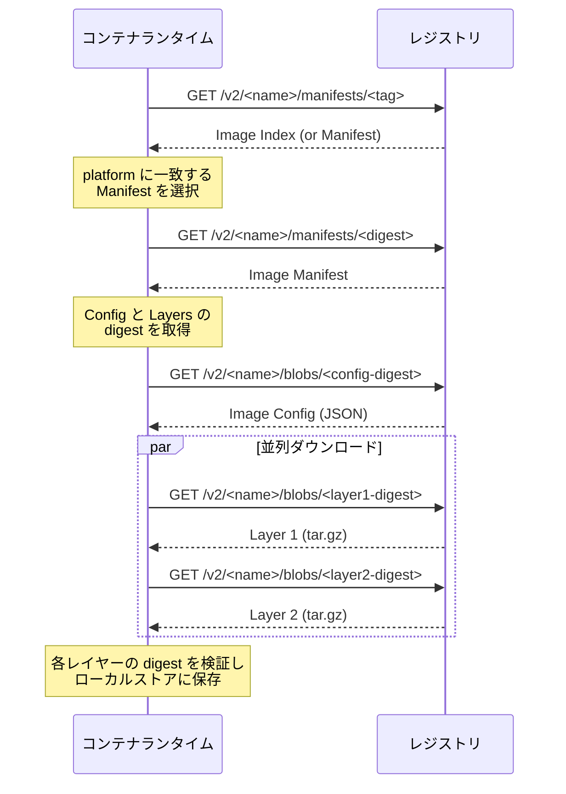

重要なのは、各レイヤーのダウンロードが **並列** に実行できる点である。レイヤーは独立した BLOB として保存されているため、順番を待つ必要がない。また、ローカルに既に存在するレイヤー（digest が一致するもの）はダウンロードをスキップできる。

### 5.4 Push の流れ

push 操作は pull の逆で、以下の手順で行われる。

1. 各レイヤーの BLOB をアップロード（既にレジストリに存在する場合はスキップまたはマウント）
2. Image Config をアップロード
3. Image Manifest をアップロード（タグを関連付け）

BLOB のアップロードは **2 段階** で行われる。まず `POST` で upload session を開始し、`PATCH` でデータを送信（チャンクアップロード対応）、最後に `PUT` で完了する。完了時に `digest` を指定することで、レジストリ側でもコンテンツの整合性が検証される。

**BLOB マウント** は、同一レジストリ内の別リポジトリに既に存在する BLOB を、データ転送なしにコピーする機能である。たとえば、`library/ubuntu` のベースレイヤーを `myorg/myapp` にマウントすることで、アップロード時間とネットワーク帯域を節約できる。

### 5.5 認証

OCI Distribution Specification は、認証方式として **Token-based authentication** を採用している。これは Docker Registry V2 の認証フローを踏襲したもので、以下のように動作する。

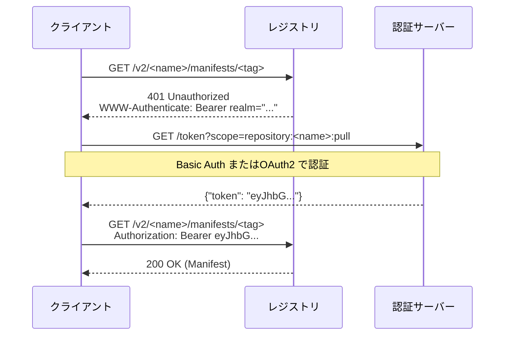

レジストリは未認証リクエストに対して `401 Unauthorized` を返し、`WWW-Authenticate` ヘッダーで認証サーバーの URL を通知する。クライアントは認証サーバーからトークンを取得し、以降のリクエストに `Authorization: Bearer` ヘッダーを付与する。

## 6. イメージ署名

### 6.1 なぜイメージ署名が必要か

コンテナイメージのサプライチェーンセキュリティにおいて、「このイメージは信頼できるソースから提供されたものか」を検証する仕組みが不可欠である。CAS によってコンテンツの完全性（改ざんがないこと）は保証されるが、**真正性**（誰が作成したか）は保証されない。イメージ署名はこの真正性を担保するための技術である。

### 6.2 Sigstore / cosign

**Sigstore** は Linux Foundation 傘下のプロジェクトであり、ソフトウェアアーティファクトの署名・検証を容易にするためのツール群とインフラストラクチャを提供する。その中核となるコマンドラインツールが **cosign** である。

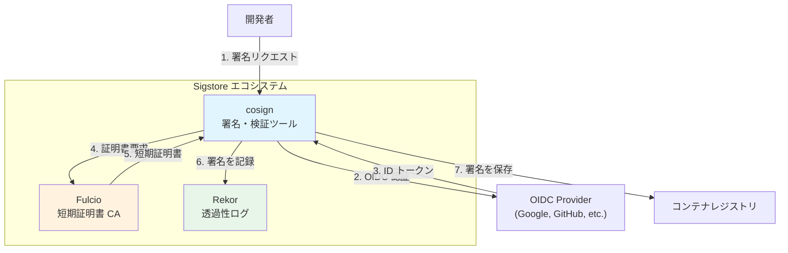

Sigstore の特徴的な設計は **Keyless Signing**（鍵なし署名）である。従来の署名方式では長期的な鍵ペアの管理が必要であったが、Sigstore では以下のアプローチにより鍵管理の負担を解消している。

1. 開発者は OIDC プロバイダ（Google、GitHub など）で認証を行う
2. Fulcio（短期証明書 CA）が、OIDC の ID トークンに基づいて短期的な署名用証明書を発行する
3. cosign はこの証明書でイメージに署名する
4. 署名の記録が Rekor（透過性ログ）に永続化される
5. 短期証明書は速やかに失効するが、Rekor のログにより後から署名の正当性を検証できる

```bash
# Keyless signing (OIDC 認証による署名)
cosign sign registry.example.com/myapp:1.0

# Key-pair based signing
cosign generate-key-pair
cosign sign --key cosign.key registry.example.com/myapp:1.0

# Verification
cosign verify \
  --certificate-identity user@example.com \
  --certificate-oidc-issuer https://accounts.google.com \
  registry.example.com/myapp:1.0
```

cosign は署名データを OCI イメージとしてレジストリに保存する。v1.1 以前では、署名は専用のタグ（`sha256-<digest>.sig`）で管理されていたが、v1.1 の Referrers API 導入により、`subject` フィールドを使った関連付けに移行しつつある。

### 6.3 Notary / Notation

**Notary** は CNCF のプロジェクトであり、コンテナイメージの署名と検証を行うための仕様とツール群を提供する。現在の主要な実装は **Notation**（notation CLI）である。

Notary と Sigstore の主な違いは信頼モデルにある。

| 特性 | Sigstore / cosign | Notary / Notation |
|------|------------------|-------------------|
| 信頼モデル | 分散型（OIDC + 透過性ログ） | 階層型（Trust Store + Trust Policy） |
| 鍵管理 | Keyless（短期証明書）が主流 | 長期的な鍵ペアが基本 |
| 透過性ログ | Rekor で自動記録 | オプション |
| エコシステム成熟度 | 高い（GitHub Actions 統合など） | 発展途上 |
| OCI v1.1 対応 | 対応済み | 対応済み |

実運用では、Sigstore/cosign の方がエコシステムの成熟度と導入の容易さから広く採用されている。一方、Notary はエンタープライズ環境での厳密な信頼チェーン管理に適している。

### 6.4 署名の保存方式

イメージ署名のレジストリへの保存方式は、OCI 仕様の進化とともに変遷してきた。

**タグベース（v1.0 時代）**: 署名を `sha256-<image-digest>.sig` のようなタグで保存する方式。動作するが、タグの名前空間を汚染する問題があった。

**Referrers API ベース（v1.1 以降）**: Manifest の `subject` フィールドで署名対象のイメージを指定し、Referrers API でイメージに関連付けられた署名を検索する方式。これが現在推奨されるアプローチである。

## 7. SBOM（Software Bill of Materials）

### 7.1 SBOM とは

**SBOM**（Software Bill of Materials、ソフトウェア部品表）は、ソフトウェアに含まれるすべてのコンポーネント（ライブラリ、依存関係、ライセンスなど）を一覧にしたメタデータである。2021 年の米国大統領令（EO 14028）をきっかけに、ソフトウェアサプライチェーンの透明性確保のために SBOM の生成・提供が強く求められるようになった。

コンテナイメージの文脈では、イメージに含まれる OS パッケージ、言語固有のライブラリ、バイナリなどの情報を SBOM として記録する。

### 7.2 主要フォーマット

SBOM の主要なフォーマットには以下の 2 つがある。

| フォーマット | 策定組織 | 特徴 |
|------------|---------|------|
| **SPDX** | Linux Foundation | ライセンスコンプライアンスに強い。ISO/IEC 5962:2021 として ISO 標準化済み |
| **CycloneDX** | OWASP Foundation | セキュリティ分析に強い。脆弱性情報との統合が容易 |

どちらのフォーマットも JSON および XML での出力をサポートしており、OCI レジストリにアーティファクトとして保存できる。

### 7.3 SBOM の生成ツール

コンテナイメージから SBOM を生成する代表的なツールを紹介する。

**Syft**（Anchore）は、コンテナイメージやファイルシステムから SBOM を生成するオープンソースツールである。内部的にはイメージの各レイヤーを解析し、パッケージマネージャのメタデータやバイナリの情報を収集する。

```bash
# Generate SBOM from a container image
syft registry.example.com/myapp:1.0 -o spdx-json > sbom.spdx.json

# Generate SBOM in CycloneDX format
syft registry.example.com/myapp:1.0 -o cyclonedx-json > sbom.cdx.json
```

**Trivy**（Aqua Security）は、脆弱性スキャナーとしても有名だが、SBOM 生成機能も備えている。

```bash
# Generate SBOM with Trivy
trivy image --format spdx-json --output sbom.spdx.json registry.example.com/myapp:1.0
```

**Docker SBOM** は Docker Desktop に統合された SBOM 生成機能で、内部的に Syft を利用している。

```bash
# Docker CLI built-in SBOM
docker sbom registry.example.com/myapp:1.0
```

### 7.4 SBOM の OCI レジストリへの保存

SBOM は OCI v1.1 の Referrers API を活用して、イメージに関連付けた形でレジストリに保存できる。**ORAS**（OCI Registry As Storage）CLI を使った保存例を示す。

```bash
# Attach SBOM to an image using ORAS
oras attach \
  --artifact-type application/spdx+json \
  registry.example.com/myapp:1.0 \
  sbom.spdx.json:application/spdx+json

# Discover attached artifacts
oras discover registry.example.com/myapp:1.0
```

cosign も SBOM のアタッチをサポートしている。

```bash
# Attach SBOM with cosign
cosign attach sbom --sbom sbom.spdx.json registry.example.com/myapp:1.0

# Verify and retrieve attached SBOM
cosign verify-attestation \
  --type spdxjson \
  --certificate-identity user@example.com \
  --certificate-oidc-issuer https://accounts.google.com \
  registry.example.com/myapp:1.0
```

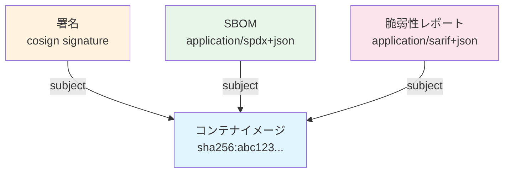

このように、OCI v1.1 の `subject` フィールドと Referrers API によって、イメージに関連するメタデータ（署名、SBOM、脆弱性レポートなど）を統一的に管理できるようになった。

## 8. イメージサイズの最適化

### 8.1 なぜサイズが重要か

コンテナイメージのサイズは、以下の点に直接的な影響を与える。

- **デプロイ速度**: イメージが大きいほど pull に時間がかかり、スケールアウトやロールバックが遅延する
- **ストレージコスト**: レジストリおよびノードのディスク使用量が増加する
- **ネットワーク帯域**: CI/CD パイプラインやマルチリージョンデプロイでの転送量が増大する
- **攻撃対象面**: 不要なパッケージやツールが含まれるほど、脆弱性のリスクが高まる

### 8.2 ベースイメージの選択

イメージサイズの最適化において、最も影響が大きいのはベースイメージの選択である。

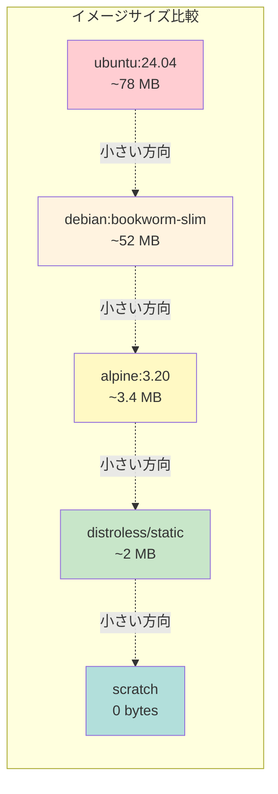

| ベースイメージ | サイズ | 特徴 | 用途 |
|--------------|-------|------|------|
| `ubuntu` / `debian` | 50-80 MB | フル機能の OS。apt でパッケージ追加可能 | 開発・デバッグ向け |
| `debian:*-slim` | ~50 MB | 不要なパッケージを削除した軽量版 | 汎用本番環境 |
| `alpine` | ~3.4 MB | musl libc + BusyBox ベース。apk でパッケージ追加可能 | サイズ重視の本番環境 |
| `distroless` | ~2 MB | Google が提供。シェルやパッケージマネージャなし | セキュリティ重視の本番環境 |
| `scratch` | 0 bytes | 完全に空のイメージ | 静的リンクバイナリ専用 |

**Alpine** は musl libc を使用するため、glibc 依存のアプリケーションでは互換性の問題が生じることがある。特に、DNS 解決の挙動や一部の C ライブラリの動作が glibc と異なる点に注意が必要である。

**Distroless** イメージにはシェルが含まれないため、コンテナ内でのデバッグが困難になる。本番環境での運用を前提として設計されている。

**scratch** は完全に空のイメージであり、Go のように静的リンクされたバイナリを直接配置する場合に使用する。

### 8.3 マルチステージビルド

マルチステージビルドは、ビルド環境と実行環境を分離することでイメージサイズを大幅に削減する手法である。

```dockerfile
# Build stage
FROM golang:1.22 AS builder
WORKDIR /src
COPY go.mod go.sum ./
RUN go mod download
COPY . .
# Build statically linked binary
RUN CGO_ENABLED=0 GOOS=linux go build -o /app/server ./cmd/server

# Runtime stage
FROM gcr.io/distroless/static-debian12:nonroot
COPY --from=builder /app/server /app/server
ENTRYPOINT ["/app/server"]
```

この例では、ビルドステージ（`golang:1.22`、約 800 MB）でコンパイルを行い、成果物だけを実行ステージ（`distroless/static`、約 2 MB）にコピーしている。最終的なイメージサイズは数 MB 程度に収まる。

### 8.4 レイヤー最適化のテクニック

**命令の結合**: Dockerfile の各命令（`RUN`, `COPY` など）は新しいレイヤーを生成する。複数の `RUN` 命令を `&&` で結合することで、中間的な不要ファイルがレイヤーに残ることを防げる。

```dockerfile
# Bad: intermediate layer retains apt cache
RUN apt-get update
RUN apt-get install -y curl
RUN apt-get clean

# Good: single layer with cleanup
RUN apt-get update && \
    apt-get install -y --no-install-recommends curl && \
    rm -rf /var/lib/apt/lists/*
```

**変更頻度によるレイヤー順序の最適化**: 変更頻度の低いレイヤーを先に、頻度の高いレイヤーを後に配置することで、レイヤーキャッシュの効率を最大化できる。

```dockerfile
# Good layer ordering
FROM node:22-slim
WORKDIR /app

# Low frequency: dependency definition
COPY package.json package-lock.json ./
RUN npm ci --production

# High frequency: application code
COPY src/ ./src/

CMD ["node", "src/index.js"]
```

**`.dockerignore` の活用**: ビルドコンテキストから不要なファイルを除外することで、`COPY` 命令で意図せず大きなファイルがイメージに含まれることを防ぐ。

```
# .dockerignore
.git
node_modules
*.md
tests/
.env
```

### 8.5 圧縮形式の選択

OCI 仕様では、レイヤーの圧縮形式として gzip と **Zstandard（zstd）** がサポートされている。zstd は gzip に比べて圧縮率と展開速度の両面で優れており、特に大きなレイヤーで顕著な効果がある。

containerd 1.6 以降では zstd 圧縮レイヤーがサポートされており、BuildKit でも `--output type=image,compression=zstd` オプションで zstd 圧縮のイメージを生成できる。ただし、すべてのレジストリやランタイムが zstd をサポートしているわけではないため、互換性の確認が必要である。

## 9. OCI Artifacts

### 9.1 コンテナイメージを超えて

OCI 仕様は当初コンテナイメージのために設計されたが、その汎用的な設計――Content-Addressable Storage、Manifest/BLOB の二層構造、レジストリプロトコル――は、コンテナイメージ以外のアーティファクトの保存・配布にも適していることが認識されるようになった。

**OCI Artifacts** は、この汎用性を活かして、コンテナレジストリをあらゆるソフトウェアアーティファクトの配布基盤として利用するための概念・仕様である。

### 9.2 v1.1 以前のアプローチ

OCI Image Specification v1.0 の時代にも、コンテナイメージ以外のアーティファクトをレジストリに保存する試みはあった。しかし、v1.0 の Manifest では `config.mediaType` が `application/vnd.oci.image.config.v1+json` に固定されることが想定されており、任意のアーティファクトを表現するには「空の Config」を使うなどのワークアラウンドが必要であった。

また、アーティファクト間の関連付け（たとえば「この SBOM はこのイメージに対応する」）を表現する標準的な方法がなく、タグベースの命名規則に頼る不安定なアプローチが用いられていた。

### 9.3 v1.1 での拡張

OCI Image Specification v1.1 では、以下の重要な拡張が行われ、OCI Artifacts の取り扱いが大幅に改善された。

**`artifactType` フィールド**

Manifest に `artifactType` フィールドが追加され、格納されているアーティファクトの種類を明示できるようになった。

```json
{
  "schemaVersion": 2,
  "mediaType": "application/vnd.oci.image.manifest.v1+json",
  "artifactType": "application/vnd.example.sbom.v1",
  "config": {
    "mediaType": "application/vnd.oci.empty.v1+json",
    "digest": "sha256:44136fa355b311bfa706c3cf3c0f...",
    "size": 2
  },
  "layers": [
    {
      "mediaType": "application/spdx+json",
      "digest": "sha256:d2a84f4b8b65...",
      "size": 45231
    }
  ],
  "subject": {
    "mediaType": "application/vnd.oci.image.manifest.v1+json",
    "digest": "sha256:abc123...",
    "size": 7143
  }
}
```

**`subject` フィールド**

`subject` フィールドにより、このアーティファクトが別のアーティファクト（通常はコンテナイメージ）に関連付けられていることを宣言できる。

**Referrers API**

Distribution Specification v1.1 では、`GET /v2/<name>/referrers/<digest>` エンドポイントが追加された。このエンドポイントは、指定された digest を `subject` として参照しているすべてのアーティファクトの一覧を Image Index として返す。

```bash
# Query referrers for an image
curl https://registry.example.com/v2/myapp/referrers/sha256:abc123...
```

レスポンスは以下のような Image Index 形式となる。

```json
{
  "schemaVersion": 2,
  "mediaType": "application/vnd.oci.image.index.v1+json",
  "manifests": [
    {
      "mediaType": "application/vnd.oci.image.manifest.v1+json",
      "digest": "sha256:sig111...",
      "size": 1024,
      "artifactType": "application/vnd.dev.cosign.simplesigning.v1+json",
      "annotations": {
        "org.opencontainers.image.created": "2024-01-15T10:35:00Z"
      }
    },
    {
      "mediaType": "application/vnd.oci.image.manifest.v1+json",
      "digest": "sha256:sbom222...",
      "size": 2048,
      "artifactType": "application/spdx+json",
      "annotations": {
        "org.opencontainers.image.created": "2024-01-15T10:36:00Z"
      }
    }
  ]
}
```

`artifactType` によるフィルタリングも可能であり、たとえば「SBOM だけを取得する」といったクエリが効率的に実行できる。

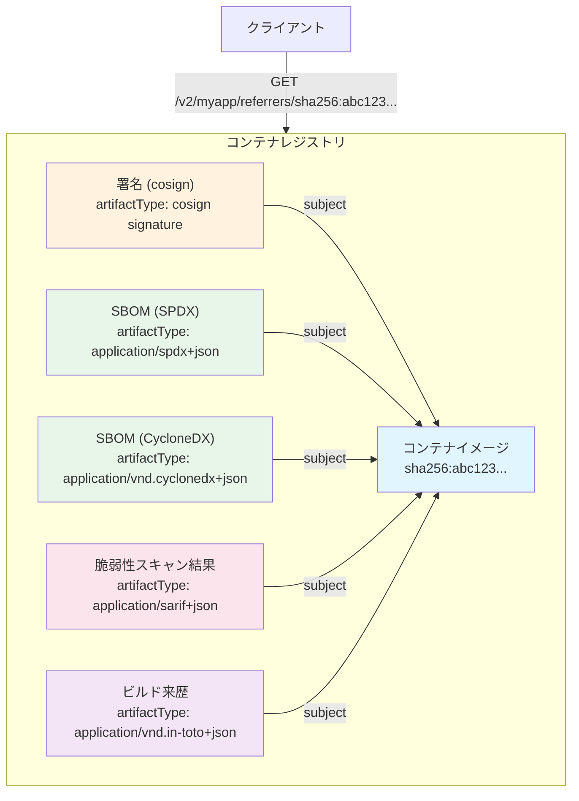

### 9.4 OCI Artifacts のユースケース

OCI Artifacts として保存されるデータの代表的な例を挙げる。

| アーティファクトタイプ | 説明 | ツール例 |
|---------------------|------|---------|
| 署名 | イメージの真正性を証明する暗号署名 | cosign, Notation |
| SBOM | ソフトウェア部品表 | Syft, Trivy |
| 脆弱性スキャン結果 | SARIF 形式のセキュリティスキャンレポート | Grype, Trivy |
| ビルド来歴（Provenance） | SLSA フレームワークに基づくビルドメタデータ | GitHub Actions, Tekton Chains |
| Helm チャート | Kubernetes アプリケーションのパッケージ | Helm 3.8+ |
| WebAssembly モジュール | WASM バイナリ | wasm-to-oci |
| Terraform モジュール | インフラストラクチャ定義 | ORAS |
| 機械学習モデル | モデルの重みやメタデータ | ORAS |

### 9.5 ORAS（OCI Registry As Storage）

**ORAS** は OCI Artifacts を操作するためのツールおよびライブラリである。任意のファイルを OCI Artifact としてレジストリに push/pull する機能を提供する。

```bash
# Push an arbitrary artifact
oras push registry.example.com/myproject/configs:v1 \
  --artifact-type application/vnd.example.config \
  config.yaml:application/yaml

# Pull an artifact
oras pull registry.example.com/myproject/configs:v1

# Attach an artifact to an existing image
oras attach \
  --artifact-type application/vnd.example.report \
  registry.example.com/myapp:1.0 \
  report.json:application/json

# Discover attached artifacts
oras discover -o tree registry.example.com/myapp:1.0
```

ORAS は Go ライブラリとしても提供されており、プログラムから OCI レジストリを汎用的なアーティファクトストアとして利用するアプリケーションの開発に活用できる。

### 9.6 Fallback メカニズム

OCI Distribution Specification v1.1 の Referrers API をサポートしていない古いレジストリとの互換性を確保するため、**Referrers Tag Schema** という Fallback メカニズムが定義されている。

Referrers API が利用できない場合、クライアントは `<alg>-<ref>` 形式のタグ（例: `sha256-abc123...`）で Referrers の一覧を表す Image Index を取得・更新する。これにより、v1.0 レジストリでも Referrers の概念を擬似的に利用できる。

ただし、この Fallback 方式にはタグの競合やアトミシティの問題があるため、可能な限り Referrers API をネイティブにサポートするレジストリの利用が推奨される。

## まとめ

OCI Image Specification は、Docker が切り開いたコンテナイメージのフォーマットをオープンな標準として確立したものである。その核心的な設計原則は以下の通りである。

1. **Content-Addressable Storage**: すべてのコンポーネントを暗号学的ハッシュで識別し、効率的な保存・転送・検証を実現する
2. **レイヤー構造**: ファイルシステムの変更差分をレイヤーとして重ね合わせ、共有と再利用を可能にする
3. **Manifest / Config / Layers の三層構造**: イメージの構成を宣言的に記述し、異なるランタイム間での互換性を保証する
4. **マルチアーキテクチャ対応**: Image Index により、単一の参照から複数のプラットフォーム向けイメージを透過的に選択できる

v1.1 で導入された `subject` フィールド、`artifactType` フィールド、Referrers API は、コンテナレジストリを単なるイメージの保管庫から、ソフトウェアサプライチェーン全体のメタデータハブへと進化させた。署名、SBOM、脆弱性レポート、ビルド来歴といったアーティファクトをイメージに関連付けて管理することで、セキュリティと透明性の向上が実現されている。

コンテナ技術がクラウドネイティブ開発の基盤として定着した今日、OCI 仕様の理解はコンテナを利用するすべてのエンジニアにとって不可欠な知識と言える。イメージの構造を正しく理解することが、効率的なビルド、安全な配布、信頼性の高いデプロイの第一歩である。
