# オンコール設計とアラート戦略

## 1. オンコールの基本概念と目的

### なぜオンコールが必要なのか

ソフトウェアシステムは24時間365日稼働し続ける。しかし、人間はそうではない。サーバーは深夜3時にディスクを使い果たし、土曜の午後にデプロイされたコードが日曜の朝にメモリリークを引き起こす。ユーザーはタイムゾーンを跨いで世界中からアクセスし、障害は営業時間を選ばない。

この現実に対応するための仕組みが**オンコール（On-Call）**である。オンコールとは、特定の時間帯において、システムに重大な問題が発生した場合に即座に対応できるエンジニアを待機させる制度を指す。消防士の当直に似た概念であり、問題が発生しなければ何もしなくてよいが、問題が発生した場合には迅速に対応することが求められる。

### オンコールの歴史的背景

オンコールの概念自体は新しいものではない。医療や消防、電力インフラの分野では何十年も前から当直制度が存在していた。ITの世界にオンコールが本格的に導入されたのは、2000年代のインターネットサービスの急速な成長期である。

従来のIT運用では、専任の運用チーム（NOC: Network Operations Center）が24時間体制でモニタリング画面を監視していた。しかし、Googleが2003年にSRE（Site Reliability Engineering）を創設し、「ソフトウェアエンジニアに運用を担当させる」というアプローチを採用したことで、オンコールの概念は大きく変化した。

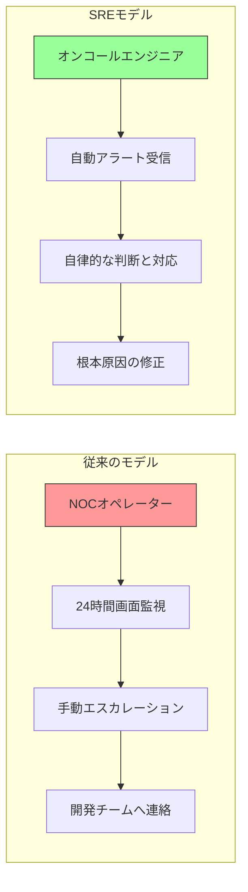

SREモデルでは、コードを書いたエンジニア自身（あるいはそのシステムを深く理解するエンジニア）がオンコールを担当する。これにより、障害対応の速度と質が劇的に向上した。「You build it, you run it」（自分が作ったものは自分で運用する）という原則は、Amazonの Werner Vogels が2006年に提唱し、現在では多くの組織で採用されている。

### オンコールの目的

オンコールの目的は単に「障害に対応すること」ではない。より本質的には、以下の3つの目的がある。

1. **ユーザーへの影響を最小化する**: 障害の検知から復旧までの時間（MTTR: Mean Time To Recovery）を短縮し、ユーザーが受ける影響を最小限に抑える
2. **システムの信頼性を維持する**: SLO（Service Level Objective）で定義された目標信頼性を維持するための最後の砦として機能する
3. **運用知識を蓄積し改善につなげる**: 障害対応を通じてシステムの弱点を特定し、恒久的な改善を推進する

::: tip 重要な視点
オンコールは「コスト」ではなく「投資」である。適切に設計されたオンコール制度は、障害の早期検知と迅速な復旧を通じて、ビジネス上の損失を大幅に削減する。同時に、オンコールで得られた知見は、システムの根本的な改善に活用される。
:::

## 2. アラート設計 — 何を通知すべきか

### SLO ベースのアラート

アラート設計の出発点は、SLO（Service Level Objective）である。SLOが定義されていないシステムでアラートを設計することは、地図なしで航海するようなものだ。

SLOベースのアラートの基本的な考え方は、**エラーバジェットの消費速度**に基づいてアラートを発火させることである。30日間のSLOが99.9%（エラーバジェット43.2分）のサービスであれば、エラーバジェットを急速に消費するような状況が発生した際にアラートを発火させる。

$$
\text{エラーバジェット消費率} = \frac{\text{現在のエラー率}}{\text{SLO許容エラー率}}
$$

例えば、30日間のSLOが99.9%のサービスの場合、許容エラー率は0.1%である。現在のエラー率が1%であれば、エラーバジェット消費率は10倍（10x）となる。この速度でエラーが継続すると、30日分のエラーバジェットが3日で枯渇する。

Google SREの実践では、**バーンレート（Burn Rate）**と**ウィンドウサイズ**を組み合わせたマルチウィンドウ・マルチバーンレート方式が推奨されている。

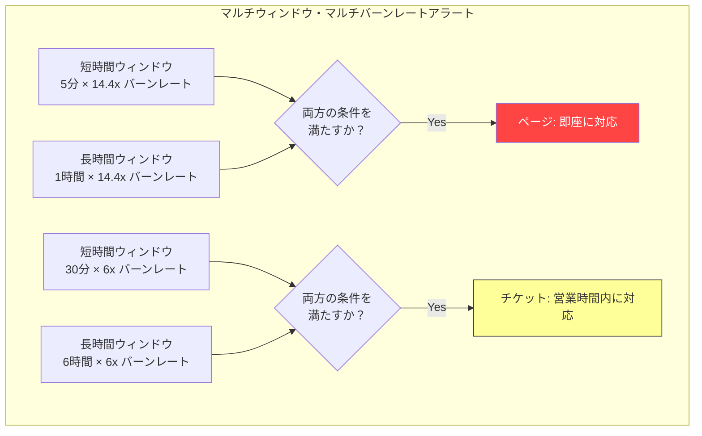

この方式のポイントは、**短時間ウィンドウと長時間ウィンドウの両方**で条件を満たした場合にのみアラートを発火させることである。短時間ウィンドウだけだと一時的なスパイクで誤報が発生し、長時間ウィンドウだけだとすでに回復した問題に対してアラートが遅延して発火する。両方を組み合わせることで、精度の高いアラートが実現される。

::: details バーンレートの計算例
30日間のSLOが99.9%のサービスを想定する。

- **許容エラー率**: 0.1%（30日間で合計43.2分のダウンタイム）
- **バーンレート14.4x**: 30日分のバジェットを2日で消費（30 / 14.4 ≒ 2.08日）
  - このレートが1時間続くと → 即座にページ
- **バーンレート6x**: 30日分のバジェットを5日で消費（30 / 6 = 5日）
  - このレートが6時間続くと → チケットを作成
- **バーンレート1x**: 通常のバジェット消費ペース
  - アラートは不要、通常運用
:::

### 症状ベース vs. 原因ベースのアラート

アラート設計において最も重要な設計判断の一つが、**症状ベース（Symptom-based）**と**原因ベース（Cause-based）**のどちらを採用するかである。

**症状ベースのアラート**は、ユーザーが実際に影響を受けている（あるいは受けようとしている）状況を検知する。例えば「APIの5xxエラー率が1%を超えた」「レスポンスタイムのP99が2秒を超えた」「ログインの成功率が95%を下回った」といったものである。

**原因ベースのアラート**は、問題の原因となりうるインフラやコンポーネントの異常を検知する。例えば「CPU使用率が90%を超えた」「ディスク使用率が85%を超えた」「データベース接続プールが枯渇しつつある」といったものである。

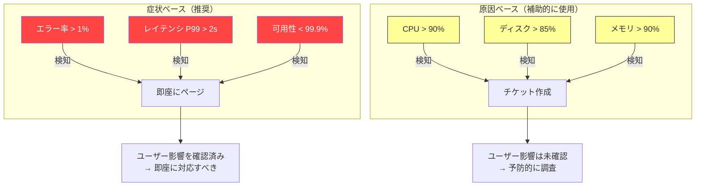

Google SREの原則では、**ページ（即座に人間を叩き起こすアラート）は症状ベースであるべき**と強く推奨されている。その理由は明快である。

1. **原因ベースのアラートは偽陽性が多い**: CPU使用率が90%でも、ユーザーに影響がなければ深夜に人を起こす必要はない
2. **原因は無限に存在する**: あらゆる障害原因をアラートでカバーしようとすると、アラートの数が爆発的に増える
3. **症状は有限である**: ユーザーが体験する問題は限定的であり、症状を網羅的にカバーすることは比較的容易である

ただし、原因ベースのアラートが不要というわけではない。以下のケースでは原因ベースのアラートが有効である。

- **予防的なアラート**: ディスクが満杯になる前に対処できるよう、ディスク使用率が閾値を超えた場合にチケットを作成する
- **症状が現れるまでに時間差がある問題**: 証明書の有効期限切れなど、問題が顕在化する前に対処すべきケース
- **デバッグの補助**: 症状ベースのアラートで検知した問題の原因を素早く特定するための情報として活用する

::: warning 注意
原因ベースのアラートをページ（即座に対応が必要なアラート）として使用してはならない。原因ベースのアラートはチケットやダッシュボード上の情報にとどめるべきである。深夜に人を起こすのは、ユーザーに影響が出ている（あるいは差し迫っている）場合に限るべきだ。
:::

### 良いアラートの条件

Rob Ewashuk（Google SRE出身）が定義した「My Philosophy on Alerting」に基づくと、良いアラートは以下の条件を満たす。

1. **アクショナブル（Actionable）**: アラートを受け取ったエンジニアが、具体的な対応を取れること。「見たけど何もすることがない」アラートは不要である
2. **即時性（Urgency）**: ページとして通知されるアラートは、即座に対応が必要なものに限ること。翌営業日に対応可能なものはチケットにすべきである
3. **関連性（Relevance）**: そのアラートが通知されるチームが、実際に対応可能であること。自チームでは対応できないアラートは、適切なチームにルーティングすべきである
4. **一意性（Unique）**: 1つの問題に対して1つのアラートが発火すること。1つの障害で10個のアラートが同時に鳴ると、ノイズとなり本質的な問題が見えにくくなる

## 3. アラート疲れ（Alert Fatigue）の防止

### アラート疲れとは何か

アラート疲れ（Alert Fatigue）は、オンコール制度を蝕む最も深刻な問題の一つである。大量のアラートが頻繁に発火することで、オンコールエンジニアがアラートに対して鈍感になり、本当に重要なアラートを見逃したり、対応が遅れたりする現象を指す。

医療分野では、ICUにおける機器のアラーム音が鳴りすぎることで看護師がアラームに反応しなくなる問題が広く研究されており、IT分野のアラート疲れもこれと同じメカニズムである。

### アラート疲れの兆候

以下のような状況が見られる場合、アラート疲れが発生している可能性が高い。

- オンコール中のエンジニアが、アラートを確認せずに自動で承認（acknowledge）している
- 「このアラートはいつも鳴るから無視してよい」という暗黙のルールがチーム内に存在する
- オンコールのハンドオフ（引き継ぎ）時に「このアラートは無視してOK」というリストが共有される
- オンコールシフトあたりのアラート数が、対応可能な数を大幅に超えている
- エンジニアがオンコールを避けたがるようになっている

### 定量的な基準

Google SREの実践では、以下のような定量的な基準が提案されている。

- **シフトあたりのページ数**: 12時間シフトあたり最大2件のページが理想的。これを超えると、エンジニアがプロジェクト作業に集中できなくなる
- **週あたりの合計ページ数**: チーム全体で週あたりのページ数を追跡し、増加傾向にあれば対策を講じる

::: tip Googleの基準
Googleでは「四半期あたりのオンコールシフトのうち、25%以上が静かなシフト（ページゼロ）であるべき」という基準も存在する。これは、オンコールエンジニアが常にアラート対応に追われている状態は持続可能でないという認識に基づいている。
:::

### アラート疲れを防ぐための戦略

#### 戦略1: アラートの定期的な棚卸し

すべてのアラートを定期的にレビューし、以下の基準で分類する。

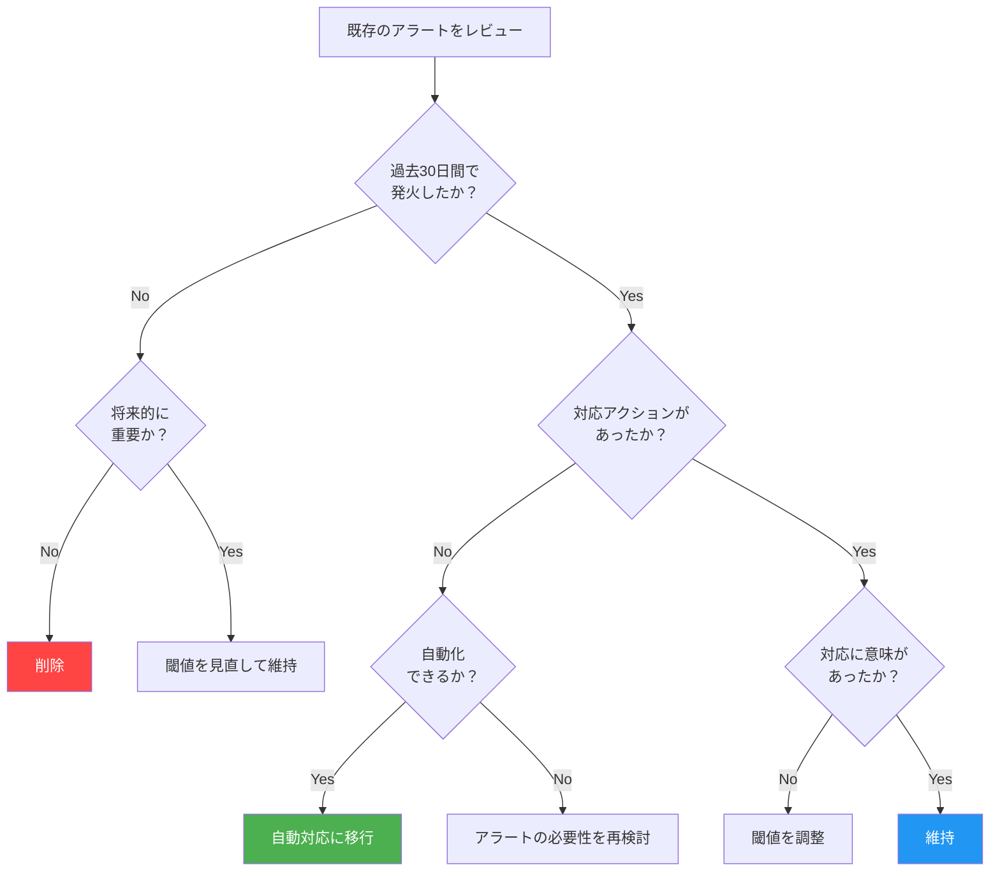

#### 戦略2: アラートの階層化

すべてのアラートを同じ重要度で扱わない。明確な階層を定義する。

| 重要度 | 通知方法 | 対応期限 | 例 |
|--------|----------|----------|-----|
| P1 (Critical) | 電話 + SMS + Push通知 | 5分以内に応答 | サービス全体のダウン |
| P2 (High) | Push通知 + SMS | 15分以内に応答 | 主要機能の劣化 |
| P3 (Medium) | メール + チャット | 翌営業日 | 非主要機能の問題 |
| P4 (Low) | チケット自動作成 | 次のスプリント | パフォーマンスの軽微な低下 |

P1とP2のみがオンコールエンジニアをページする。P3以下は営業時間内に処理する。

#### 戦略3: アラートのグルーピングと抑制

1つの根本原因から複数のアラートが発火する「アラートストーム」を防ぐために、アラートのグルーピング（集約）と抑制（inhibition）を設定する。

```yaml
# Alertmanager configuration example
route:
  receiver: 'default'
  group_by: ['alertname', 'cluster', 'service']
  group_wait: 30s        # Wait before sending first notification
  group_interval: 5m     # Wait before sending additional notifications
  repeat_interval: 4h    # Wait before resending same notification

inhibit_rules:
  # If the entire cluster is down, suppress individual service alerts
  - source_match:
      severity: 'critical'
      alertname: 'ClusterDown'
    target_match:
      severity: 'warning'
    equal: ['cluster']
```

#### 戦略4: 自動修復（Auto-remediation）

頻繁に発火し、対応手順が確立されているアラートは、自動修復に移行する。オンコールエンジニアが手動で行っている作業をスクリプト化し、アラートの発火時に自動で実行されるようにする。

```python
# Example: Auto-remediation for disk space alert
def handle_disk_space_alert(alert):
    """Automatically clean up disk space when usage exceeds threshold."""
    host = alert.labels["instance"]

    # Step 1: Clean up old log files
    cleanup_result = run_remote_command(
        host,
        "find /var/log -name '*.gz' -mtime +7 -delete"
    )

    # Step 2: Check if cleanup was sufficient
    current_usage = get_disk_usage(host)
    if current_usage < THRESHOLD:
        # Auto-resolved, create informational ticket
        create_ticket(
            title=f"Auto-remediated: Disk cleanup on {host}",
            priority="low",
            body=f"Cleaned up old logs. Usage went from {alert.value}% to {current_usage}%"
        )
        return AutoRemediationResult.RESOLVED

    # Step 3: If still above threshold, escalate to human
    return AutoRemediationResult.ESCALATE
```

::: warning 自動修復の注意点
自動修復は万能ではない。以下の点に注意すべきである。
- 自動修復が問題を隠蔽してしまい、根本原因の対処が遅れるリスクがある
- 自動修復のスクリプト自体がバグを含む可能性がある
- 自動修復の実行履歴を記録し、定期的にレビューすることが重要である
:::

## 4. エスカレーション設計

### エスカレーションとは

エスカレーション（Escalation）とは、アラートに対して一次対応者が対応できない場合、あるいは一次対応者が応答しない場合に、別の担当者やより上位の判断権限を持つ人物に通知を引き上げる仕組みである。

適切なエスカレーション設計は、以下の問いに答える必要がある。

- 一次対応者がアラートに応答しなかった場合、何分後に二次対応者に通知するか？
- 障害が一定時間以上継続している場合、マネージャーやVPにいつ通知するか？
- 複数のチームにまたがる障害の場合、インシデントコマンダーは誰が務めるか？

### エスカレーションポリシーの設計

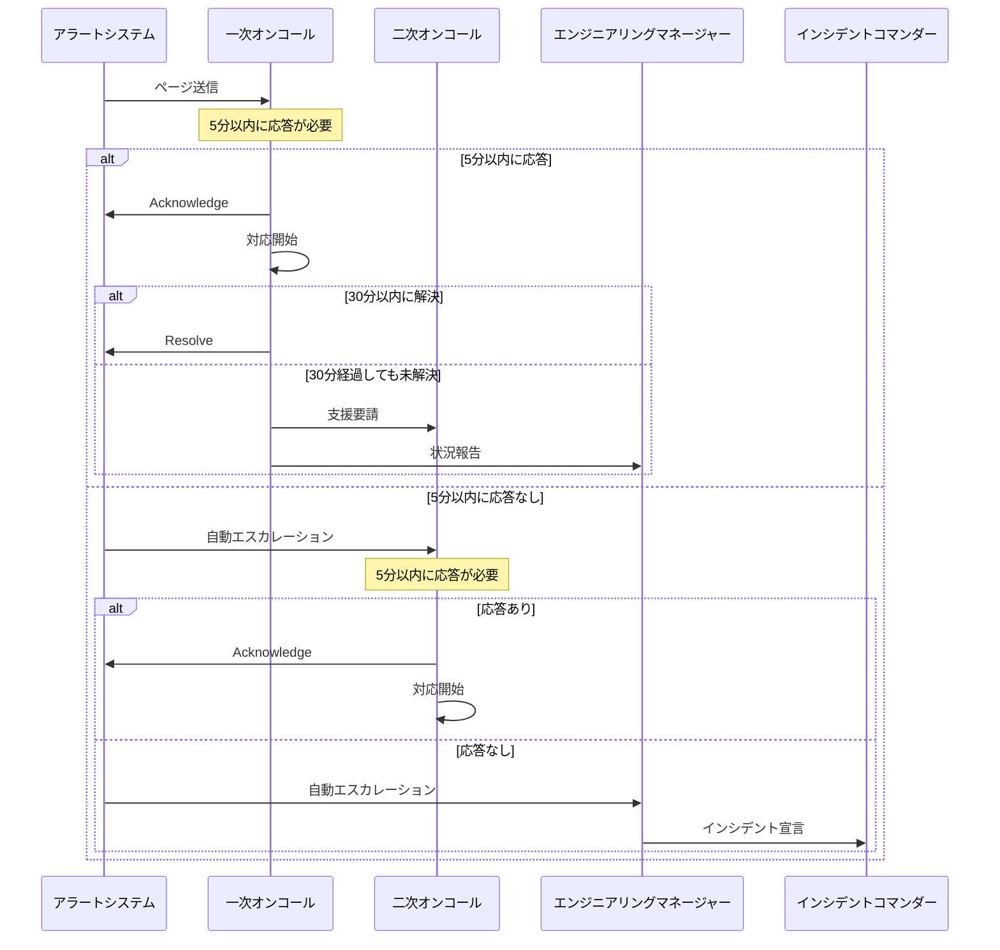

### エスカレーションレベルの定義

実務的には、以下のようなエスカレーションレベルを定義することが多い。

| レベル | 対象 | 条件 | タイムアウト |
|--------|------|------|-------------|
| L1 | 一次オンコール | アラート発火 | 5分 |
| L2 | 二次オンコール | L1が未応答 | 5分 |
| L3 | チームリード/EM | L2が未応答、または30分以上未解決 | 15分 |
| L4 | VP/Director | ユーザー影響が重大、または1時間以上未解決 | - |
| L5 | 経営陣 | 全社的な影響、またはデータ漏洩 | - |

### インシデントコマンダー

大規模な障害では、個人での対応には限界がある。このような場合に発動されるのが**インシデントコマンダー（IC: Incident Commander）**制度である。これはGoogleのSRE体制から広まった概念であり、消防や災害対応のICS（Incident Command System）に由来する。

ICの役割は以下の通りである。

1. **状況把握と全体調整**: 何が起きているかを把握し、対応チームの作業を調整する
2. **意思決定**: 「ロールバックするか、フォワードフィックスで対応するか」など、重大な判断を下す
3. **コミュニケーション**: 経営陣やステークホルダーへの状況報告を担当する
4. **タイムキーピング**: 対応が長引いている場合に、交代要員の手配を行う

ICは必ずしももっとも技術に詳しい人物である必要はない。むしろ、技術的な調査に没頭してしまわないよう、俯瞰的な視点を維持できる人物が望ましい。

::: tip IC の心構え
「ICの仕事は問題を解決することではなく、問題を解決する人を支援すること」——この原則を忘れると、ICが技術的な調査に引きずり込まれ、全体の調整が疎かになる。
:::

## 5. オンコールシフトの組み方

### シフト設計の基本原則

オンコールシフトの設計は、技術的な問題であると同時に、人的リソースの問題でもある。良いシフト設計は、以下の原則を満たす。

1. **持続可能性（Sustainability）**: エンジニアが燃え尽きることなく、長期間にわたってオンコールに参加できること
2. **公平性（Fairness）**: オンコールの負荷が特定の個人に偏らないこと
3. **十分なカバレッジ**: すべての時間帯で、適切なスキルを持つエンジニアがカバーされていること
4. **回復時間の確保**: オンコールシフトの後に十分な休息時間が確保されていること

### シフトパターン

一般的なシフトパターンには以下のようなものがある。

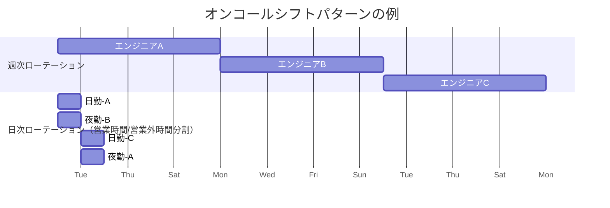

**週次ローテーション**は最も一般的なパターンである。1人のエンジニアが1週間連続でオンコールを担当し、翌週は別のエンジニアに引き継ぐ。シンプルで管理しやすいが、1週間のオンコールはエンジニアへの負荷が大きい。

**日次ローテーション**は負荷を分散するが、引き継ぎの頻度が高くなり、コンテキストの喪失が起こりやすい。

**Follow-the-Sun**パターンは、グローバルに分散したチームで採用される。各リージョンのチームが自分たちの営業時間帯にオンコールを担当することで、深夜のオンコールをなくす。

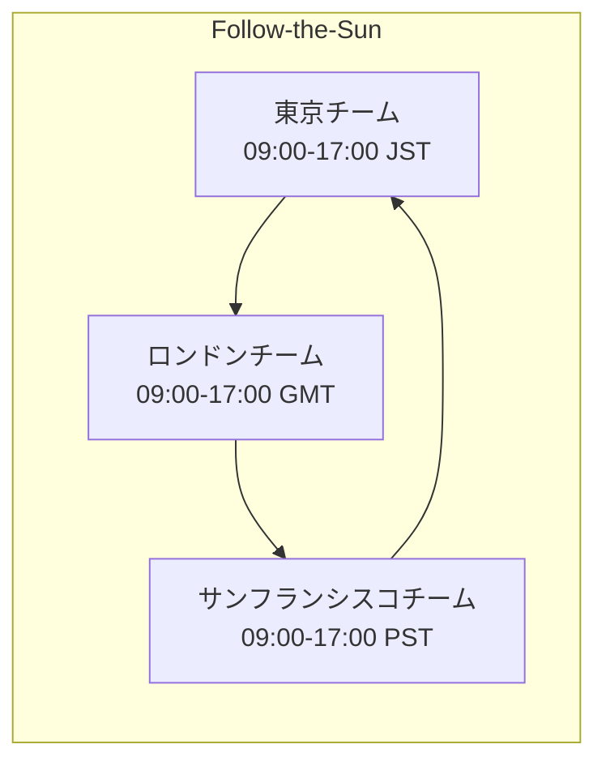

### チームサイズとオンコール頻度

オンコールの持続可能性を確保するためには、十分なチームサイズが必要である。Google SREの推奨は以下の通りである。

- **最低チームサイズ**: 8人（一次・二次の2名体制で、月に1回程度のオンコール頻度）
- **理想的な頻度**: 4〜6週に1回のオンコールシフト
- **上限**: 月に2回以上のオンコールシフトは持続不可能

チームサイズが小さい場合（例えば3〜4人）、オンコール頻度が高くなりすぎ、エンジニアの疲弊とアラート疲れを招く。この場合は、チームの統合、オンコールの共有、または自動化の強化を検討すべきである。

### オンコール報酬と公平性

オンコールはエンジニアのプライベートの時間を拘束する。この負荷に対する適切な報酬は、制度の持続性に直結する。

一般的な報酬モデルには以下がある。

- **固定手当**: オンコールシフト1回あたりの定額報酬
- **対応時間ベース**: 実際に障害対応に費やした時間に応じた報酬
- **代休**: オンコール後に代休を取得できる制度
- **これらの組み合わせ**: 固定手当 + 深夜・休日の対応に対する追加手当

::: warning 報酬なしのオンコールに注意
報酬や代休なしでオンコールを義務化すると、エンジニアの離職につながる。特に、オンコール負荷の高いチームからエンジニアが流出し、残ったメンバーの負荷がさらに高まるという悪循環が発生する。
:::

### ハンドオフ（引き継ぎ）

オンコールシフトの切り替わり時には、適切なハンドオフが不可欠である。ハンドオフで共有すべき情報は以下の通りである。

1. **現在進行中のインシデント**: 未解決の問題があれば、その状況と次のアクション
2. **最近のデプロイ**: シフト中にデプロイされたもの、あるいは近日中にデプロイが予定されているもの
3. **既知の問題**: 無視してよいアラート（ただし、こうしたアラートは早急に修正すべき）
4. **メンテナンス予定**: 計画されたメンテナンスやインフラ変更

## 6. ランブック（Runbook）

### ランブックとは

ランブック（Runbook）は、特定のアラートやインシデントに対する対応手順を文書化したものである。「このアラートが鳴ったら、何を確認し、どう対応すべきか」を具体的に記述する。プレイブック（Playbook）とも呼ばれる。

ランブックの目的は、障害対応の属人化を排除し、経験の浅いエンジニアでも適切に対応できるようにすることである。深夜3時にページで叩き起こされたエンジニアが、寝ぼけた状態でも正しい対応ができるよう、明確で具体的な手順を提供する。

### 良いランブックの構造

```markdown
# アラート名: HighErrorRate_PaymentService

## 概要
決済サービスのエラー率がSLO閾値を超えた場合に発火するアラート。

## 影響度
- ユーザー影響: 決済処理の失敗。売上に直接影響。
- 影響範囲: 全ユーザーの決済機能

## 初動確認（2分以内）
1. Grafana ダッシュボードを確認: [リンク]
2. エラー率の推移と影響範囲を把握
3. 直近のデプロイがあったかを確認: [デプロイ履歴リンク]

## 対応フロー
### デプロイ起因の場合
1. 直近のデプロイをロールバック
   ```bash
   kubectl rollout undo deployment/payment-service -n production
   ```
2. エラー率が回復したことを確認
3. インシデントチケットを作成

### デプロイ以外の原因の場合
1. 依存サービスの状態を確認
   - データベース: [ダッシュボードリンク]
   - 決済ゲートウェイ: [ステータスページリンク]
2. データベース起因の場合 → DB チームにエスカレーション
3. 外部ゲートウェイ起因の場合 → フォールバック手順を実行

## エスカレーション先
- 二次オンコール: [PagerDuty スケジュールリンク]
- 決済チームリード: @payment-team-lead
- VP of Engineering: @vp-eng（P1インシデント時のみ）

## 過去のインシデント
- 2026-01-15: 決済ゲートウェイの障害。フォールバック処理で対応。[ポストモーテムリンク]
- 2026-02-03: デプロイによるリグレッション。ロールバックで5分で復旧。[ポストモーテムリンク]
```

### ランブックの運用上のポイント

1. **アラートとランブックを直接リンクする**: アラートの通知にランブックのURLを含める。オンコールエンジニアがランブックを探す手間を省く

```yaml
# Prometheus alerting rule example
groups:
  - name: payment-service
    rules:
      - alert: HighErrorRate_PaymentService
        expr: |
          (
            sum(rate(http_requests_total{service="payment", code=~"5.."}[5m]))
            /
            sum(rate(http_requests_total{service="payment"}[5m]))
          ) > 0.01
        for: 5m
        labels:
          severity: critical
          team: payment
        annotations:
          summary: "Payment service error rate is above 1%"
          # Link to runbook directly in the alert
          runbook_url: "https://wiki.example.com/runbooks/payment-high-error-rate"
          dashboard_url: "https://grafana.example.com/d/payment-overview"
```

2. **ランブックの鮮度を保つ**: 古いランブックは嘘をつく。定期的なレビューと更新を組織的に仕組み化する。ランブックの最終更新日をメタデータとして管理し、一定期間更新されていないランブックにはリマインダーを出す

3. **ランブックの実行を追跡する**: ランブックの手順がどの程度実行されているかを追跡し、よく使われる手順は自動化の候補とする

4. **ポストモーテムとの連携**: 障害対応後のポストモーテム（振り返り）で得られた知見をランブックに反映する。ランブックは「生きた文書」であり、障害対応のたびに改善される

::: tip ランブックの適切な粒度
ランブックは詳細すぎても簡潔すぎても機能しない。「深夜3時に叩き起こされたエンジニアが、5分以内に初動を開始できる」程度の粒度が目安である。あまりに詳細な手順書は、状況が想定と異なる場合にかえって混乱を招く。
:::

## 7. ツールとエコシステム

### インシデント管理ツールの全体像

オンコールとアラートのエコシステムは、複数のコンポーネントから構成される。

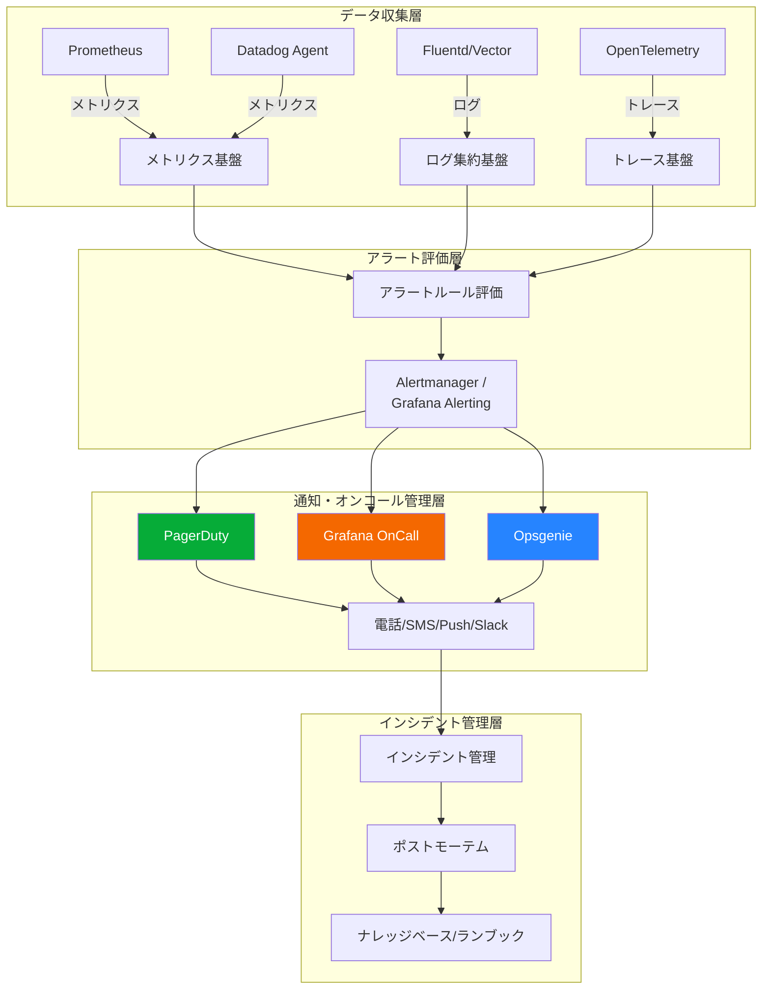

### PagerDuty

PagerDutyは、オンコール管理とインシデント対応のデファクトスタンダードともいえるSaaSである。2009年に創業し、現在では多くの企業で採用されている。

**主な機能**:

- **オンコールスケジュール管理**: ローテーション、オーバーライド、休暇対応
- **エスカレーションポリシー**: 多段階のエスカレーションを柔軟に定義
- **インテリジェントなアラートグルーピング**: 機械学習を活用した関連アラートの自動集約
- **インシデントレスポンス**: ステークホルダーへの自動通知、ステータスページ連携
- **分析とレポーティング**: MTTA（Mean Time To Acknowledge）、MTTR、アラート頻度の分析

PagerDutyの特徴的な機能の一つが**Event Intelligence**である。これは機械学習を用いて、関連するアラートを自動的にグルーピングし、ノイズを削減する機能である。例えば、データベースの障害によって複数のサービスからアラートが発火した場合、これらを1つのインシデントとしてグルーピングする。

```python
# PagerDuty Events API v2 example
import requests
import json

def send_pagerduty_event(routing_key, summary, severity, source, component):
    """Send an alert event to PagerDuty."""
    payload = {
        "routing_key": routing_key,
        "event_action": "trigger",
        "payload": {
            "summary": summary,
            "severity": severity,  # critical, error, warning, info
            "source": source,
            "component": component,
            "custom_details": {
                "runbook_url": f"https://wiki.example.com/runbooks/{component}",
                "dashboard_url": f"https://grafana.example.com/d/{component}",
            }
        },
        "links": [
            {
                "href": f"https://grafana.example.com/d/{component}",
                "text": "Grafana Dashboard"
            }
        ]
    }

    response = requests.post(
        "https://events.pagerduty.com/v2/enqueue",
        headers={"Content-Type": "application/json"},
        data=json.dumps(payload)
    )
    return response.json()
```

### Grafana OnCall

Grafana OnCallは、Grafana Labsが提供するオープンソースのオンコール管理ツールである。Grafanaのエコシステムと緊密に統合されており、Grafana Alerting（旧Grafana Alertmanager）からのアラートを直接受け取ることができる。

**PagerDutyとの比較**:

| 項目 | PagerDuty | Grafana OnCall |
|------|-----------|----------------|
| ライセンス | 商用SaaS | OSS + Cloud版 |
| 価格 | ユーザーあたり月額$21〜 | OSS版は無料 |
| Grafana統合 | プラグイン経由 | ネイティブ統合 |
| 機械学習ノイズ削減 | あり（Event Intelligence） | 限定的 |
| エコシステム | 600以上の統合 | 成長中 |
| セルフホスト | 不可 | 可能 |

Grafana OnCallはGrafanaスタック（Prometheus, Loki, Tempo）を中心にモニタリングを構成している組織にとって特に魅力的である。ダッシュボードからアラート、オンコール管理まで一つのエコシステム内で完結する。

### Prometheus + Alertmanager

オープンソースのモニタリングスタックにおいて、Prometheus + Alertmanagerはアラート管理のデファクトスタンダードである。PrometheusはCNCF（Cloud Native Computing Foundation）の卒業プロジェクトであり、Kubernetesと同様に広く採用されている。

Alertmanagerは以下の機能を提供する。

- **グルーピング**: 同一原因から発火した複数のアラートを1つにまとめる
- **抑制（Inhibition）**: 上位のアラートが発火している場合、関連する下位のアラートを抑制する
- **サイレンス（Silence）**: メンテナンス時など、特定の期間中にアラートを無効化する
- **ルーティング**: アラートのラベルに基づいて、適切なチームや通知チャネルにルーティングする

```yaml
# Alertmanager routing configuration example
route:
  receiver: 'default-slack'
  routes:
    # Critical alerts go to PagerDuty
    - match:
        severity: critical
      receiver: 'pagerduty-critical'
      continue: false

    # Payment team alerts
    - match:
        team: payment
      receiver: 'payment-team-slack'
      routes:
        - match:
            severity: critical
          receiver: 'pagerduty-payment'

    # Platform team alerts
    - match:
        team: platform
      receiver: 'platform-team-slack'

receivers:
  - name: 'default-slack'
    slack_configs:
      - channel: '#alerts-general'

  - name: 'pagerduty-critical'
    pagerduty_configs:
      - routing_key: '<pagerduty-integration-key>'

  - name: 'payment-team-slack'
    slack_configs:
      - channel: '#alerts-payment'

  - name: 'pagerduty-payment'
    pagerduty_configs:
      - routing_key: '<payment-pagerduty-key>'

  - name: 'platform-team-slack'
    slack_configs:
      - channel: '#alerts-platform'
```

### その他の注目ツール

- **Opsgenie**（Atlassian）: Jira/Confluenceとの統合が強み。Atlassian製品を中心にツールチェーンを構成している組織に適している
- **Rootly / incident.io**: インシデント管理に特化したツール。Slackネイティブなワークフローを提供し、インシデント発生からポストモーテム作成まで一気通貫で管理できる
- **FireHydrant**: インシデントライフサイクル全体を管理するプラットフォーム。自動化されたインシデント対応ワークフローが特徴

## 8. メトリクスと継続的改善

### オンコールの健全性を測るメトリクス

オンコール制度は設計して終わりではない。継続的に健全性を測定し、改善し続ける必要がある。以下のメトリクスを定期的に追跡することが推奨される。

#### MTTA（Mean Time To Acknowledge）

アラートが発火してから、オンコールエンジニアが応答するまでの平均時間。MTTAが長い場合、通知の仕組みに問題があるか、アラート疲れが発生している可能性がある。

$$
\text{MTTA} = \frac{\sum_{i=1}^{n} (t_{\text{ack}_i} - t_{\text{alert}_i})}{n}
$$

#### MTTR（Mean Time To Recovery）

障害が発生してから、サービスが復旧するまでの平均時間。MTTRは複数の要素に分解できる。

$$
\text{MTTR} = \text{検知時間} + \text{応答時間} + \text{診断時間} + \text{修復時間}
$$

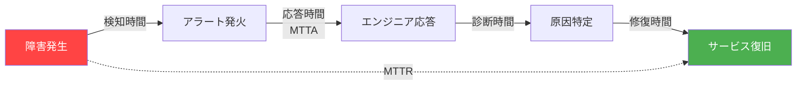

各要素を個別に改善することで、MTTRを短縮できる。

- **検知時間の短縮**: SLOベースのアラートの適切な設定
- **応答時間の短縮**: 通知チャネルの最適化、エスカレーションポリシーの見直し
- **診断時間の短縮**: ランブックの整備、オブザーバビリティの向上
- **修復時間の短縮**: 自動修復の導入、ロールバック手順の自動化

#### アラートの統計

| メトリクス | 説明 | 目標値の例 |
|-----------|------|-----------|
| シフトあたりのページ数 | 12時間シフトあたりのページ数 | 0〜2件 |
| アラートのS/N比 | アクションが必要だったアラートの割合 | > 80% |
| 偽陽性率 | 対応不要だったアラートの割合 | < 20% |
| 自動解決率 | 人間の介入なく解決されたアラートの割合 | 追跡して改善 |
| ランブックカバレッジ | ランブックが存在するアラートの割合 | > 90% |

#### エンジニアの満足度

定量的なメトリクスだけでなく、エンジニアの主観的な評価も重要である。定期的なアンケートで以下の項目を追跡する。

- オンコール中の睡眠の質
- オンコール負荷が業務に与える影響
- アラートの品質に対する満足度
- ランブックの有用性
- オンコール報酬への満足度

### 継続的改善のサイクル

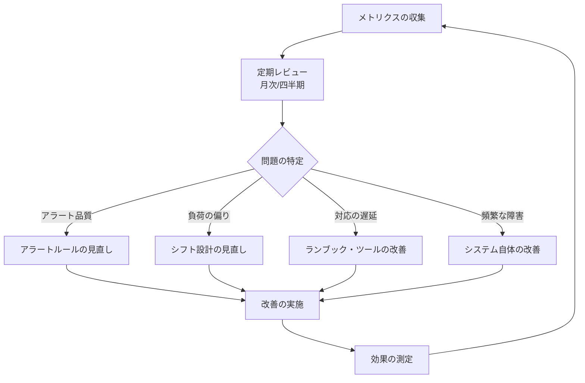

### ポストモーテムとの連携

オンコールの改善サイクルにおいて、ポストモーテム（障害振り返り）は最も重要なインプットの一つである。すべてのP1/P2インシデントに対してポストモーテムを実施し、以下のアクションアイテムを導出する。

1. **アラートの改善**: このインシデントはもっと早く検知できたか？アラートの閾値は適切だったか？
2. **ランブックの改善**: 対応手順は明確だったか？不足していた情報はないか？
3. **自動化の推進**: 手動で行った作業のうち、自動化できるものはないか？
4. **システムの改善**: 同種の障害が再発しないよう、システム自体を改善できないか？

::: warning ポストモーテムの原則
ポストモーテムは**非難しない（Blameless）**ことが大原則である。「誰がミスをしたか」ではなく「なぜシステムがそのミスを防げなかったか」に焦点を当てる。非難の文化があると、エンジニアはインシデントを隠蔽したり、ポストモーテムで正直に語ることを避けるようになり、組織の学習能力が著しく低下する。
:::

## 9. オンコール文化の構築

### 健全なオンコール文化の特徴

技術的な仕組みだけでなく、組織文化がオンコールの成否を左右する。健全なオンコール文化には以下の特徴がある。

1. **オンコールは「罰」ではなく「責任」として位置づけられている**: 自分たちが作ったシステムに対する責任の一環として、ポジティブに捉えられている
2. **経営層がオンコールの負荷を理解している**: オンコール負荷の軽減に対するリソース投資が組織的に支援されている
3. **ノイズの削減が継続的に行われている**: 不要なアラートが放置されず、チームとして改善に取り組んでいる
4. **深夜のページに対して翌日の業務が調整される**: 深夜に2時間の障害対応をしたエンジニアが、翌朝通常通り出社することを求められない
5. **新メンバーのオンボーディングが体系化されている**: シャドウイング期間を設けて、段階的にオンコールに参加させる

### オンコールのオンボーディング

新しいチームメンバーがオンコールに参加する際の段階的なプロセスは以下のようになる。

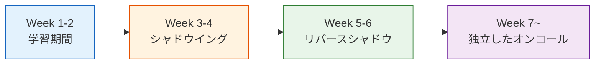

- **学習期間**: システムのアーキテクチャ、ランブック、モニタリングダッシュボードを学ぶ
- **シャドウイング**: 経験者がオンコールを担当し、新メンバーがアラートを一緒に見て学ぶ。実際の対応は経験者が行う
- **リバースシャドウ**: 新メンバーが主担当としてオンコールを担当し、経験者がバックアップとして待機する。判断に迷った場合は経験者に相談できる
- **独立したオンコール**: 新メンバーが単独でオンコールを担当する

### アンチパターン

以下は、オンコール運用でよく見られるアンチパターンである。

**「ヒーロー文化」**: 特定のエンジニアが常に障害対応を行い、チーム内で「頼れる存在」として称賛される文化。一見ポジティブに見えるが、属人化を助長し、そのエンジニアが離職した際にチームが機能不全に陥る。また、ヒーロー本人の燃え尽きリスクも高い。

**「ページの受け流し」**: アラートが鳴っても「前回も自然に治った」として対応しない文化。これが常態化すると、本当に対応が必要なアラートも見逃されるようになる。

**「アラートの追加は簡単、削除は難しい」**: 障害が起きるたびに新しいアラートが追加されるが、不要になったアラートを削除する仕組みがない。結果としてアラートの数だけが増え続け、アラート疲れを招く。

**「オンコール = 新人の仕事」**: オンコールをジュニアメンバーに押し付ける文化。システムの深い理解が必要なオンコールを、もっとも経験の浅いメンバーに担当させることは、対応品質の低下と新人の疲弊を同時に招く。

## 10. まとめ — 持続可能なオンコールに向けて

オンコール設計とアラート戦略は、単なる技術的な問題ではなく、組織設計の問題でもある。本記事で扱った要素を統合すると、持続可能なオンコール制度の要件は以下のように整理される。

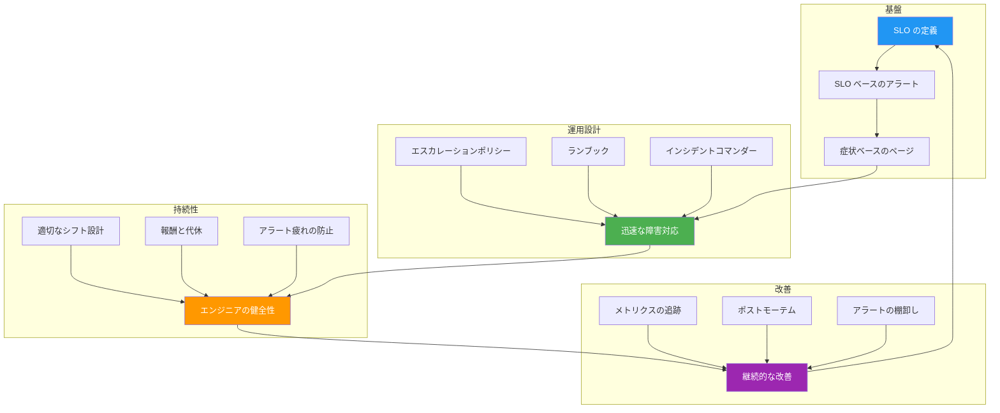

最終的に目指すべきは、「オンコールが静かであること」である。静かなオンコールは、システムの信頼性が高く、アラートが適切に設計されており、予防的な改善が機能していることの証である。逆に、常にアラートが鳴り続けるオンコールは、システムか運用設計のどちらか（あるいは両方）に根本的な問題があることを示している。

Google SREの書籍が繰り返し強調するように、オンコールは「消防活動」ではなく「防火活動」であるべきだ。障害が起きてから対応するのではなく、障害が起きにくいシステムを作り、起きた場合には迅速に検知・復旧できる仕組みを整え、同じ障害を二度と繰り返さないための改善を続ける。その循環が、信頼性の高いシステムと、健全なエンジニアリング組織の両方を実現する。
