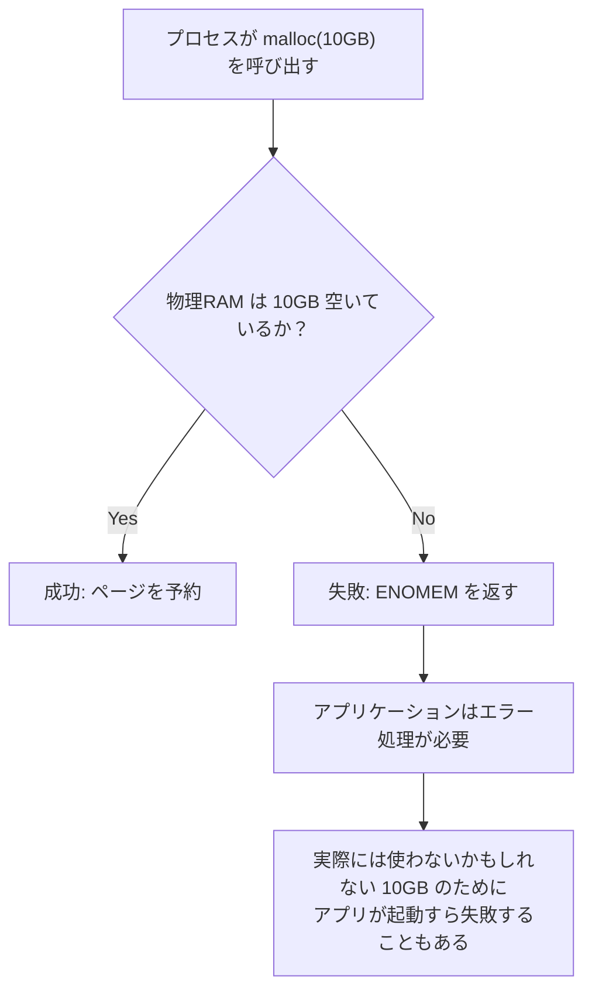
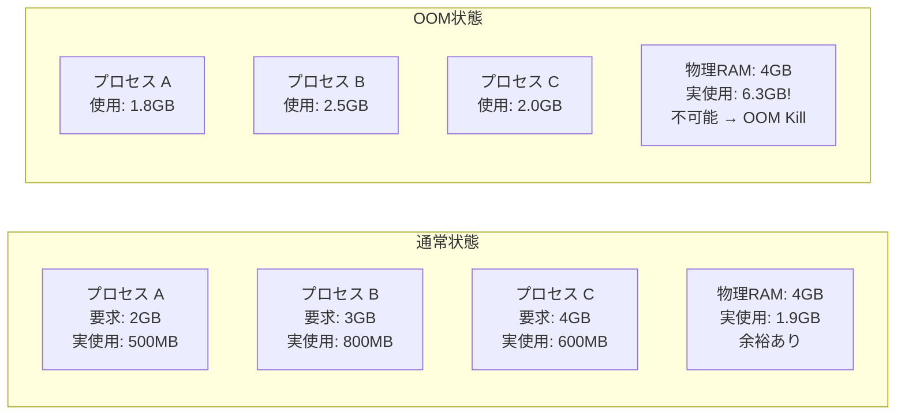
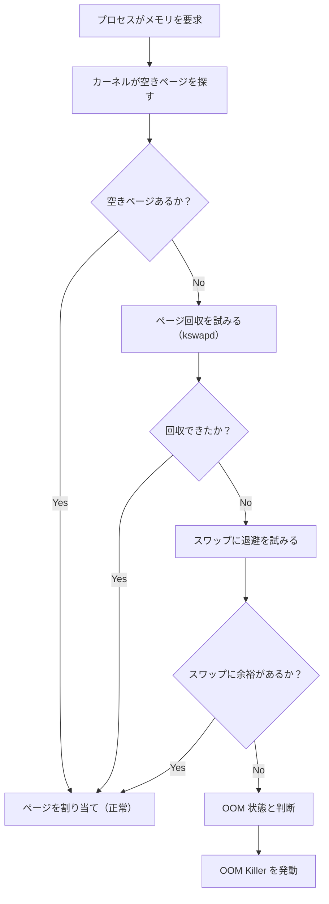
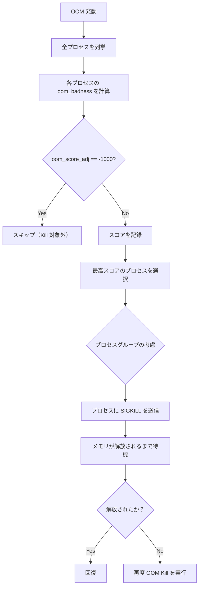
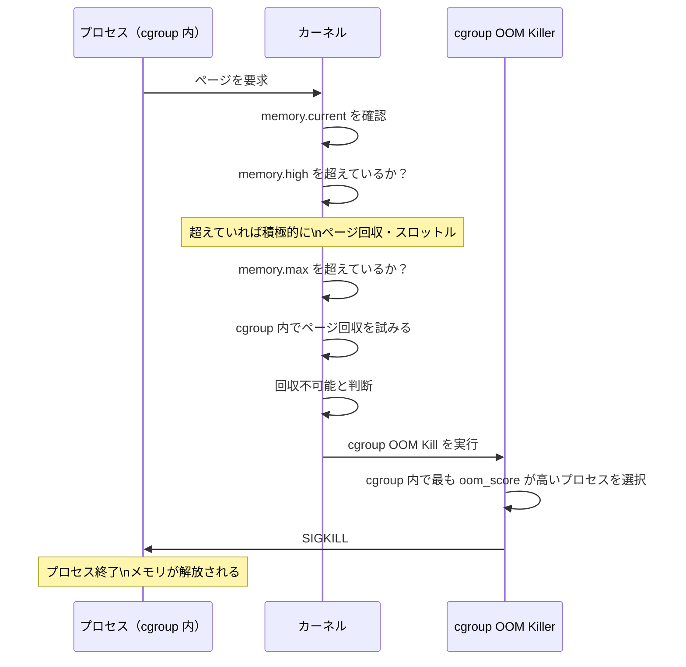
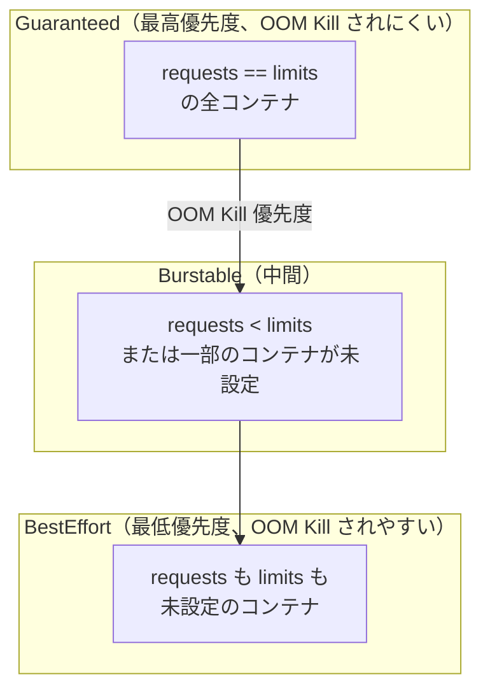
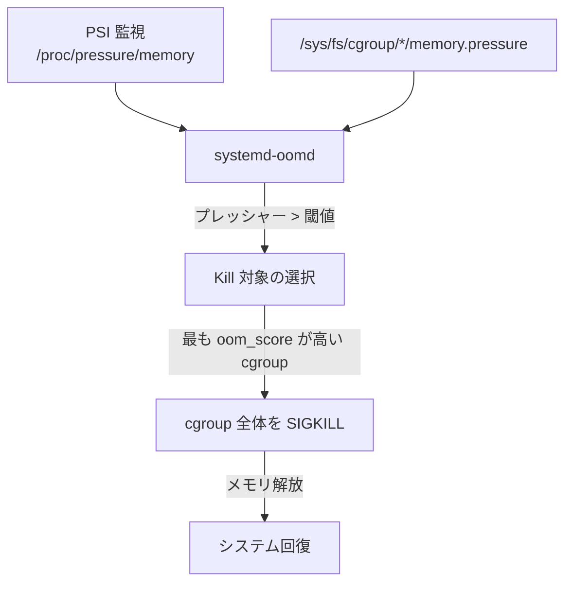
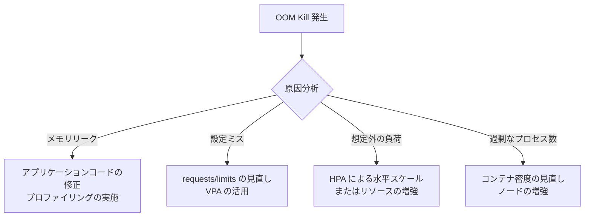

# OOM Killer の仕組みとメモリオーバーコミット

## 1. はじめに — メモリ不足という根本問題

コンピュータのメモリ（RAM）は有限である。しかし現代のLinuxシステムでは、プロセスが要求するメモリの総量が、物理的に搭載されたRAMをはるかに超えることが日常的に発生する。このような状況でシステムはどのように動作すべきか、そして本当にメモリが枯渇したとき、OSは何をするのか。

この問いに対するLinuxの答えが**メモリオーバーコミット**と**OOM Killer（Out-Of-Memory Killer）**である。

メモリオーバーコミットは、プロセスが要求したメモリを「とりあえず許可する」という楽観的な戦略だ。実際に使用されるまでメモリを割り当てないことで、システム全体の利用効率を高める。しかし、それが破綻して本当にメモリが足りなくなったとき、カーネルは最終手段として何らかのプロセスを強制終了させる。これがOOM Killerの役割である。

本記事では、Linuxのメモリオーバーコミットの設計思想から始まり、OOM Killerのアルゴリズム、cgroups環境でのOOM動作、KubernetesにおけるOOMKilledの発生メカニズム、そして実践的な防止策と調査方法まで、体系的に解説する。

## 2. メモリオーバーコミットの仕組みと設計思想

### 2.1 仮想メモリとCoWが可能にするオーバーコミット

オーバーコミットを理解するには、まず**仮想メモリ**と**Copy-on-Write（CoW）**の仕組みを押さえる必要がある。

Linuxでは、プロセスが `malloc()` でメモリを要求したとき、カーネルは仮想アドレス空間上に領域を確保するが、物理ページ（RAM）はすぐには割り当てない。実際に書き込みアクセスが発生して初めてページフォルトが起き、物理ページが割り当てられる。これを**デマンドページング**という。

```
malloc(1GB) を呼び出した直後:
  仮想アドレス空間: 1GB 分の仮想領域が確保される
  物理メモリ: 0バイトしか消費していない

実際にデータを書き込み始めたとき:
  ページフォルトが発生するたびに、物理ページが割り当てられる
  実際に使ったページ分だけ物理メモリを消費する
```

さらに、`fork()` システムコールはCoWを使ってプロセスをコピーする。子プロセスは親の全ページテーブルを共有し、実際に書き込みが発生した時点で初めてページをコピーする。多くのサーバーアプリケーションでは `fork()` 直後に `exec()` が続くため、大半のページは実際にコピーされない。

このため、プロセスが要求する仮想メモリの総量は、実際に使用する物理メモリよりも大幅に大きくなることが多い。

### 2.2 オーバーコミットがない世界の問題

もしカーネルが「物理RAMに余裕がない限り `malloc()` を失敗させる」という厳格な方針を取ったとすると、どうなるだろうか。



この場合、以下の問題が生じる。

- **メモリ利用効率の低下**: 多くのアプリケーションは最大必要量を宣言するが、実際にはその一部しか使わない
- **`fork()` のコスト増大**: 子プロセスを作るたびに親と同じ量の物理メモリが必要になり、Apacheのようなpreforkモデルのサーバーが起動できなくなる
- **アプリ設計の複雑化**: 全てのメモリ割り当てでエラー処理が必要になる

Linuxは「よほどのことがない限りメモリ割り当てを許可する」という楽観的な方針、すなわちオーバーコミットを採用した。

### 2.3 オーバーコミットの代償

オーバーコミットには本質的なリスクがある。仮想メモリの総量が物理メモリ＋スワップを超えた状態で、全プロセスが一斉にメモリを使い始めると、物理ページが枯渇する。

この状態を**OOM（Out-of-Memory）状態**という。OOM状態では、メモリの新規割り当てが不可能になり、既存のページを回収しようとしても回収できる余地がない。カーネルはシステム全体を守るために、何らかのプロセスを殺す決断をしなければならない。



## 3. vm.overcommit_memory の3つのモード

Linuxカーネルは `vm.overcommit_memory` というカーネルパラメータで、オーバーコミットの動作を制御する。3つのモードがある。

### 3.1 モード 0 — ヒューリスティック（デフォルト）

```bash
# Check the current setting
cat /proc/sys/vm/overcommit_memory
# 0

# Set temporarily
sysctl -w vm.overcommit_memory=0

# Set permanently in /etc/sysctl.conf or /etc/sysctl.d/
echo "vm.overcommit_memory = 0" >> /etc/sysctl.d/99-memory.conf
```

モード 0 はデフォルト設定であり、カーネルが独自のヒューリスティックに基づいてオーバーコミットを判断する。内部的には、要求された量が「利用可能なフリーページ＋スワップ＋共有メモリ＋ルートのリザーブ分」を超えないかどうかをチェックする。

実際の動作としては、**大多数のメモリ割り当てを許可する**が、明らかに物理的に不可能な量（例えば利用可能メモリの数倍）を一度に要求した場合は拒否することがある。

::: details モード 0 のヒューリスティック詳細

カーネルソース（`mm/mmap.c` の `__vm_enough_memory()`）では、以下のロジックが実装されている。

- `MAP_NORESERVE` フラグが指定されていれば、チェックをスキップ（常に許可）
- 呼び出し元がカーネルであれば常に許可
- 要求量 ≤ フリーページ＋スワップ＋ページキャッシュ＋ルートリザーブ であれば許可
- 上記を超えていてもある程度は許容する（完全には拒否しない）

このため、モード 0 は「完全なオーバーコミット許可」ではないが、実際には非常に寛大な判定をする。

:::

### 3.2 モード 1 — 常に許可

```bash
sysctl -w vm.overcommit_memory=1
```

モード 1 では、カーネルは**全ての `mmap()` / `malloc()` を無条件に許可**する。チェックを一切しないため、理論上は仮想アドレス空間が許す限り何十TB分でも `malloc()` が成功する。

この設定が適しているのは、**科学技術計算**のような特殊なユースケースである。例えば、疎行列の計算では非常に大きな配列を確保するが、実際に使うのはほんのわずかなインデックスだけ、というケースが多い。このような場合、モード 1 が最も効率的になる。

::: warning モード 1 の注意点
モード 1 では、OOM Killer が発動するリスクが最も高くなる。大量の仮想メモリを確保したプロセスが実際に使い始めたとき、突然システムがOOM状態に陥ることがある。本番サービスには向かない設定である。
:::

### 3.3 モード 2 — 厳格な制限

```bash
sysctl -w vm.overcommit_memory=2
```

モード 2 では、**仮想メモリの総量を物理メモリとスワップの合計の一定割合に制限**する。この上限を `CommitLimit` と呼ぶ。

$$
\text{CommitLimit} = \text{スワップ容量} + \left(\frac{\text{vm.overcommit\_ratio}}{100}\right) \times \text{物理RAM}
$$

デフォルトでは `vm.overcommit_ratio = 50` なので：

$$
\text{CommitLimit} = \text{スワップ容量} + 0.5 \times \text{物理RAM}
$$

現在のコミット量（`CommittedAS`）が `CommitLimit` を超えると、`malloc()` や `mmap()` は `ENOMEM` エラーで失敗する。

```bash
# Check CommitLimit and current committed memory
cat /proc/meminfo | grep -E "CommitLimit|Committed_AS"
# CommitLimit:    8265728 kB   <- maximum allowed virtual memory
# Committed_AS:   3124512 kB   <- currently committed virtual memory
```

モード 2 のメリットは、OOM Killer が（理論上）発動しないことである。仮想メモリの予約段階でエラーを返すため、物理メモリが枯渇する前にアプリケーション側でエラーを検知できる。

しかし、実際には `mmap()` が失敗するとアプリケーションがクラッシュしたり、`fork()` が頻繁に失敗して既存のサービスが機能不全に陥るなど、扱いが難しいケースも多い。一般的なWebサーバーや汎用サービスには向かず、リソースを厳密に管理したい環境（金融系、組み込みシステムなど）で使われることがある。

### 3.4 モード比較

| 設定 | 動作 | OOM Kill リスク | アプリの対応 | 主なユースケース |
|------|------|----------------|-------------|----------------|
| 0（デフォルト）| ヒューリスティック | 中 | 不要（通常） | 一般的なサーバー |
| 1 | 常に許可 | 高 | 不要 | 科学技術計算 |
| 2 | 厳格な制限 | 低 | `malloc()` 失敗の処理が必要 | 厳密なリソース管理 |

## 4. OOM Killer の発動条件

### 4.1 OOM 状態の判定

OOM Killer は、カーネルがメモリページを割り当てようとして失敗したときに呼び出される。具体的には、以下の状況が重なったときに発動する。



単純にメモリが少なくなっただけでは OOM Killer は発動しない。カーネルはまず `kswapd`（バックグラウンドのページ回収デーモン）やダイレクトリクレームを試みる。スワップが設定されている場合は、スワップへの退避も試みる。これらを全て試した上で、それでも割り当てができない場合にのみ OOM Killer が呼び出される。

### 4.2 OOM Killer を呼び出す状況

実際に OOM Killer が発動する典型的な状況を示す。

**ケース 1: 急激なメモリ消費**

あるプロセスが急速にメモリを使い始め（メモリリーク、想定外の大規模データ処理など）、システム全体のRAMとスワップが枯渇する。

**ケース 2: スワップなしの構成**

コンテナ環境やクラウドのインスタンスでは、スワップを無効にしている場合が多い。スワップがないと、RAMが枯渇した瞬間に OOM Killer が発動する。

**ケース 3: メモリ断片化**

物理メモリの断片化が進み、連続した大きなメモリ領域が確保できない場合にも OOM Kill が発生することがある（特にHuge Pageの割り当て時）。

**ケース 4: cgroup のメモリ上限超過**

cgroups の `memory.max` を設定している場合、そのグループ内でメモリが枯渇すると、システム全体にメモリが余っていても OOM Killer が発動する（後述）。

## 5. OOM スコアリングとプロセス選択アルゴリズム

### 5.1 oom_score の計算

OOM Killer が発動すると、カーネルは「どのプロセスを殺すか」を決定しなければならない。この判断は **oom_score** に基づいて行われる。

`oom_score` は 0〜1000 のスコアで、値が大きいほど OOM Kill されやすい。各プロセスの `oom_score` は `/proc/[pid]/oom_score` で確認できる。

```bash
# Check oom_score for the current process
cat /proc/$$/oom_score
# 5

# Check oom_score for all processes (sorted by score)
ps aux | awk '{print $2}' | tail -n +2 | while read pid; do
    score=$(cat /proc/$pid/oom_score 2>/dev/null)
    comm=$(cat /proc/$pid/comm 2>/dev/null)
    [ -n "$score" ] && echo "$score $pid $comm"
done | sort -rn | head -20
```

`oom_score` の計算の核心は、**プロセスが使用しているメモリ量に比例するスコア**である。カーネル内部の `oom_badness()` 関数でスコアを計算する。

```
基本スコア = (プロセスの実使用メモリ / システム全体のメモリ) × 1000
最終スコア = 基本スコア + oom_score_adj
```

ここで、「プロセスの実使用メモリ」は **RSS（Resident Set Size）**（実際に物理メモリ上にあるページ数）+ スワップ使用量で計算される。子プロセスのメモリも考慮されるが、すでに共有されているページは二重にカウントされないように調整される。

```c
// Simplified oom_badness() logic from Linux kernel
long oom_badness(struct task_struct *p, unsigned long totalpages) {
    long points;
    long adj;

    // Get oom_score_adj value
    adj = (long)p->signal->oom_score_adj;

    // Special cases: never kill kernel threads or init
    if (adj == OOM_SCORE_ADJ_MIN)
        return LONG_MIN;

    // Calculate base points from memory usage (RSS + swap)
    points = get_mm_rss(p->mm) + get_mm_counter(p->mm, MM_SWAPENTS);

    // Scale points relative to total memory and apply adj
    adj *= totalpages / 1000;
    points += adj;

    return points;
}
```

### 5.2 oom_score_adj による調整

`oom_score_adj` は、プロセスの OOM Kill されやすさを手動で調整するためのパラメータである。`/proc/[pid]/oom_score_adj` に値を書き込むことで設定できる。

- **範囲**: -1000〜1000
- **-1000**: このプロセスは絶対に OOM Kill しない（例: init/systemd）
- **-500〜-1**: Kill されにくくなる
- **0**: デフォルト（メモリ使用量のみで判断）
- **1〜999**: Kill されやすくなる
- **1000**: このプロセスを最優先で Kill する

```bash
# Make a process "almost immune" to OOM Kill (e.g., a critical daemon)
echo -500 > /proc/$(pgrep mysqld)/oom_score_adj

# Make a process the first target for OOM Kill (e.g., a batch job)
echo 1000 > /proc/$(pgrep batch_job)/oom_score_adj

# In code (requires CAP_SYS_RESOURCE or running as root)
# Write to /proc/self/oom_score_adj
```

systemd では、ユニットファイルで `OOMScoreAdjust` を設定できる。

```ini
# /etc/systemd/system/critical-service.service
[Service]
ExecStart=/usr/bin/critical-service
# Protect this service from OOM Kill
OOMScoreAdjust=-500
```

`oom_score_adj` は親プロセスから子プロセスに**継承される**。そのため、`systemd` が各サービスを起動するとき、サービス固有の `oom_score_adj` がそのサービスのすべての子プロセスに適用される。

### 5.3 プロセス選択の詳細ロジック

OOM Killer が発動すると、カーネルは以下のステップでプロセスを選択する。



選択されたプロセスには `SIGKILL` が送信される。`SIGKILL` はキャッチもブロックも無視もできないシグナルであり、プロセスは即座に終了させられる。

OOM Killer は、スコアが最も高い**1つのプロセス**（またはスレッドグループ）を殺して、メモリが回復するかどうかを確認する。まだ不足している場合は、再度 OOM Kill を行う。この処理は、システムが正常なメモリ状態に戻るまで繰り返される。

### 5.4 カーネルログへの記録

OOM Kill が発生すると、カーネルは詳細なログを出力する。

```
Out of memory: Kill process 12345 (myapp) score 892 or sacrifice child
Killed process 12345 (myapp) total-vm:4194304kB, anon-rss:3145728kB, file-rss:65536kB, shmem-rss:0kB
```

このログには以下の情報が含まれる。

- Kill されたプロセス名と PID
- OOM スコア（0〜1000）
- 仮想メモリ総量（`total-vm`）
- 匿名メモリの RSS（`anon-rss`）：ヒープ、スタックなど
- ファイルバックドメモリの RSS（`file-rss`）：共有ライブラリ、mmap ファイルなど

## 6. cgroups のメモリ制限と OOM

### 6.1 cgroup OOM Killer

cgroups の `memory.max` を設定している場合、そのグループが設定値を超えてメモリを割り当てようとすると、**cgroup スコープの OOM Kill** が発生する。これはシステム全体の OOM とは独立しており、システムにメモリが十分残っていても発動する。

```
/sys/fs/cgroup/myapp/
├── memory.max        # hard limit: e.g., 512Mi
├── memory.high       # soft limit: throttle threshold
├── memory.current    # current usage
└── memory.events     # OOM event counters
```

```bash
# Check OOM events for a cgroup
cat /sys/fs/cgroup/myapp/memory.events
# low 0
# high 5       <- memory.high was exceeded 5 times (throttling occurred)
# max 2        <- memory.max was hit 2 times
# oom 1        <- OOM condition was detected once
# oom_kill 1   <- a process was OOM-killed once
```

### 6.2 cgroup OOM の動作フロー



cgroup OOM Kill では、Kill 対象は**その cgroup 内のプロセスのみ**に限定される。他の cgroup のプロセスには影響しない。これは cgroups の最大のメリットの1つである。

### 6.3 cgroup OOM の設定と制御

`memory.oom.group` を使うと、OOM Kill をグループ単位で制御できる。

```bash
# When OOM occurs, kill all processes in the cgroup (not just the worst offender)
echo 1 > /sys/fs/cgroup/myapp/memory.oom.group
```

この設定により、OOM Kill が発生したとき、スコアが最も高い1プロセスだけでなく、**cgroup 内の全プロセス**が一斉に Kill される。これは、マイクロサービスのコンテナのように、「一部のプロセスが死んでも意味がない、全部または無し」というセマンティクスが必要な場合に有用である。

また、`memory.max` ではなく `memory.high` のみを設定することで、「OOM Kill はしないが、積極的にメモリを回収する」という穏やかな制限も可能である。

```bash
# Soft limit: throttle at 400MB, but no hard OOM Kill
echo "419430400" > /sys/fs/cgroup/myapp/memory.high

# Hard limit: OOM Kill at 512MB
echo "536870912" > /sys/fs/cgroup/myapp/memory.max
```

### 6.4 cgroup v1 と v2 の違い

cgroups v1 では、OOM Kill の制御は `memory.oom_control` ファイルで行われていた。

```bash
# cgroups v1: disable OOM Kill for this cgroup
echo 1 > /sys/fs/cgroup/memory/myapp/memory.oom_control

# This causes the process to be throttled instead of killed when hitting the limit
# However, this can cause indefinite stalls and is generally not recommended
```

cgroups v2 では `memory.oom_control` は廃止され、代わりに `memory.oom.group` が導入された。v2 では、メモリ上限に達したとき OOM Kill を無効にするオプションは提供されていない（意図的な設計判断）。

::: warning OOM Kill の無効化は危険
`memory.oom_control` で OOM Kill を無効にすると、メモリ上限に達したプロセスが無期限にブロックされる状態になる。デッドロック類似の状態になりうるため、本番環境での使用は推奨されない。
:::

## 7. Kubernetes における OOMKilled の発生メカニズム

### 7.1 Kubernetes のメモリ管理の基礎

Kubernetes では、Pod の各コンテナにメモリの `requests`（要求量）と `limits`（上限）を設定できる。

```yaml
apiVersion: v1
kind: Pod
metadata:
  name: myapp
spec:
  containers:
  - name: app
    image: myapp:latest
    resources:
      requests:
        memory: "256Mi"   # Guaranteed minimum memory
      limits:
        memory: "512Mi"   # Hard limit: OOM Kill if exceeded
```

kubelet はこの設定を cgroups の設定に変換する。

| Kubernetes 設定 | cgroup 設定 |
|----------------|-------------|
| `limits.memory` | `memory.max` |
| `requests.memory` | `memory.low` または cgroup の `memory.request` として記録 |

### 7.2 OOMKilled の発生パターン

コンテナが `limits.memory` を超えてメモリを使おうとすると、cgroup の OOM Killer が発動し、コンテナ内のプロセスが Kill される。Kubernetes はこれを検知して Pod のステータスを `OOMKilled` とする。

```bash
# Check if a Pod was OOMKilled
kubectl get pod myapp -o jsonpath='{.status.containerStatuses[*].lastState}'
# {"terminated":{"containerID":"...","exitCode":137,"reason":"OOMKilled",...}}

kubectl describe pod myapp
# Containers:
#   app:
#     ...
#     Last State: Terminated
#       Reason:    OOMKilled
#       Exit Code: 137
#       ...
```

終了コード **137** は `128 + 9`（`SIGKILL` のシグナル番号）を意味し、プロセスが `SIGKILL` で強制終了されたことを示す。

### 7.3 QoS クラスと OOM 優先度

Kubernetes は Pod を QoS（Quality of Service）クラスに分類し、OOM Kill の優先度に影響する。



各 QoS クラスは、kubelet によって異なる `oom_score_adj` が設定される。

| QoS クラス | `oom_score_adj` | OOM Kill されやすさ |
|-----------|----------------|---------------------|
| Guaranteed | -997 | 非常に低い（ほぼ Kill されない） |
| Burstable | min(max(2, 1000 - (requests/limits × 1000)), 999) | 中間 |
| BestEffort | 1000 | 非常に高い（最初に Kill される） |

```bash
# Verify oom_score_adj for a container process
# Find the PID of the main process in the container
kubectl exec myapp -- cat /proc/1/oom_score_adj
# -997  (for Guaranteed QoS)
```

### 7.4 Kubernetes における OOMKilled の診断

```bash
# Check recent OOM events on a node
kubectl get events --field-selector reason=OOMKilling

# Check dmesg on the node
# (requires node access or using kubectl debug)
kubectl debug node/my-node -it --image=busybox -- dmesg | grep -i oom

# Check memory metrics for pods
kubectl top pod --all-namespaces | sort -k4 -rn | head -20

# Check if any pod is near its memory limit
kubectl get pods --all-namespaces -o json | \
  jq -r '.items[] | select(.status.containerStatuses != null) |
    .metadata.namespace + "/" + .metadata.name'
```

### 7.5 Vertical Pod Autoscaler（VPA）による自動調整

Kubernetes の **VPA（Vertical Pod Autoscaler）** は、過去のメモリ使用量を分析して、適切な `requests` と `limits` を自動的に推奨・設定するツールである。

```yaml
apiVersion: autoscaling.k8s.io/v1
kind: VerticalPodAutoscaler
metadata:
  name: myapp-vpa
spec:
  targetRef:
    apiVersion: "apps/v1"
    kind: Deployment
    name: myapp
  updatePolicy:
    updateMode: "Auto"   # Automatically apply recommendations
  resourcePolicy:
    containerPolicies:
    - containerName: app
      minAllowed:
        memory: "128Mi"
      maxAllowed:
        memory: "2Gi"
      controlledResources: ["memory"]
```

## 8. OOM の防止策

### 8.1 適切なリソース設定

最も基本的かつ重要な防止策は、アプリケーションの実際のメモリ使用量を計測し、適切なリソース設定を行うことである。

```bash
# Monitor actual memory usage over time
watch -n 1 'cat /proc/$(pgrep myapp)/status | grep -E "VmRSS|VmSwap"'

# Use valgrind or heaptrack for memory profiling
valgrind --tool=massif --pages-as-heap=yes ./myapp

# In Kubernetes: use metrics-server
kubectl top pod myapp --containers
```

**Kubernetes でのベストプラクティス**:

- `requests` は実際の平均メモリ使用量の **110〜120%** 程度に設定する
- `limits` は **requests の 1.5〜2倍** 程度を目安にする（急激なスパイクを許容するため）
- ただし `limits` を高くしすぎると、OOM Kill が発生したときの影響が大きくなる

```yaml
# Example of well-tuned resource settings
resources:
  requests:
    memory: "256Mi"   # Based on observed average usage of ~220Mi
  limits:
    memory: "512Mi"   # Allow 2x headroom for spikes
```

### 8.2 スワップの活用

スワップが設定されていると、RAM が枯渇してもプロセスを即座に Kill することなく、ディスクに退避させることができる。これにより OOM Kill が発動するまでの時間を稼げる。

```bash
# Add a 4GB swap file
fallocate -l 4G /swapfile
chmod 600 /swapfile
mkswap /swapfile
swapon /swapfile

# Make permanent in /etc/fstab
echo "/swapfile none swap sw 0 0" >> /etc/fstab

# Tune swappiness (0-100, lower = less likely to use swap)
sysctl -w vm.swappiness=10
```

ただし、コンテナ環境やクラウドのインスタンスではスワップを意図的に無効にしている場合が多い。スワップを使うとメモリの問題が見えにくくなり、パフォーマンスも低下するため、根本的な解決策にはならない。

### 8.3 Early OOM — 早期発見と介入

**Early OOM** は、OOM Kill が発生する前に介入するツール・手法の総称である。

Linux には `earlyoom` というユーザー空間の OOM Manager がある。

```bash
# Install earlyoom (Debian/Ubuntu)
apt-get install earlyoom

# Configure earlyoom: kill when memory drops below 4% or swap below 10%
# /etc/default/earlyoom
EARLYOOM_ARGS="-m 4 -s 10 --avoid '(^|/)(init|systemd|sshd)$' --prefer '(^|/)(stress|memhog)$'"

# Enable and start
systemctl enable --now earlyoom
```

`earlyoom` はカーネルの OOM Killer とは独立して動作し、PSI（後述）や `/proc/meminfo` を監視して、メモリが逼迫したときにプロセスを選択的に Kill する。カーネルの OOM Killer よりも賢い選択をすることが多く、システムが完全に固まる前に介入できる。

### 8.4 systemd-oomd — systemd 統合の OOM Manager

**systemd-oomd** は systemd に統合された OOM Manager である。PSI（Pressure Stall Information）を監視し、メモリプレッシャーが閾値を超えたときに cgroup 単位でプロセスを Kill する。

```bash
# Enable systemd-oomd
systemctl enable --now systemd-oomd

# Check status
systemctl status systemd-oomd

# Configure via /etc/systemd/oomd.conf
cat /etc/systemd/oomd.conf
```

```ini
# /etc/systemd/oomd.conf
[OOM]
# Kill a cgroup when swap usage exceeds 90%
SwapUsedLimitPercent=90%
# Kill a cgroup when its memory.pressure exceeds 60% over 30s
DefaultMemoryPressureLimitPercent=60%
DefaultMemoryPressureDurationSec=30s
```

systemd-oomd は cgroup ツリーを監視し、メモリプレッシャーが高い cgroup 全体を Kill する。これは、特定のプロセスだけ Kill しても残りが再度 OOM を引き起こすような場合に効果的である。



### 8.5 アプリケーションレベルの対策

アプリケーション側でも OOM を防ぐための工夫が可能である。

**メモリリークの検出と防止**:

```python
# Python: use tracemalloc for memory profiling
import tracemalloc

tracemalloc.start()

# ... application code ...

snapshot = tracemalloc.take_snapshot()
top_stats = snapshot.statistics('lineno')
for stat in top_stats[:10]:
    print(stat)  # Print top 10 memory consumers
```

**ストリーミング処理**:

大量データを一度にメモリに展開せず、ストリーミングで処理することでメモリ使用量を抑える。

```python
# Instead of reading entire file into memory:
# data = open('large_file.csv').read()  # Bad: loads entire file

# Stream the file line by line:
with open('large_file.csv') as f:
    for line in f:  # Good: processes one line at a time
        process(line)
```

**メモリ使用量の自己監視**:

```python
import resource
import os

def check_memory_usage(threshold_mb=400):
    """Warn if memory usage exceeds threshold."""
    usage = resource.getrusage(resource.RUSAGE_SELF)
    rss_mb = usage.ru_maxrss / 1024  # Linux returns in kilobytes
    if rss_mb > threshold_mb:
        print(f"WARNING: Memory usage {rss_mb:.1f}MB exceeds threshold {threshold_mb}MB")
        # Trigger garbage collection or other cleanup
```

## 9. デバッグと調査

### 9.1 dmesg による OOM Kill の確認

OOM Kill が発生すると、カーネルは詳細なログを dmesg に出力する。

```bash
# Check for OOM messages in kernel log
dmesg | grep -i "out of memory\|oom\|killed process"

# Full OOM log typically looks like:
# [12345.678901] myapp invoked oom-killer: gfp_mask=0x..., order=0, oom_score_adj=0
# [12345.678910] CPU: 0 PID: 12345 Comm: myapp
# [12345.678915] Hardware name: ...
# [12345.678920] Call Trace:
# ...
# [12345.679000] Mem-Info:
# [12345.679010] active_anon:1234567 inactive_anon:234567 isolated_anon:0
# ...
# [12345.679100] Tasks state (memory values in pages):
# [12345.679110] [  pid  ]  uid  tgid total_vm     rss pgtables_bytes swapents oom_score_adj name
# [12345.679120] [  12345]  1000 12345  2048000 1500000      4096000   500000          0 myapp
# ...
# [12345.679200] Out of memory: Kill process 12345 (myapp) score 892 or sacrifice child
# [12345.679210] Killed process 12345 (myapp) total-vm:8192000kB, anon-rss:6000000kB...

# Monitor in real-time
dmesg -w | grep -i oom
```

### 9.2 /proc/meminfo による現在の状態確認

```bash
cat /proc/meminfo
```

OOM 診断に特に重要なフィールドを説明する。

| フィールド | 意味 | OOM 診断での注目点 |
|-----------|------|-------------------|
| `MemTotal` | 物理 RAM 総量 | 基準値 |
| `MemFree` | 完全に空きのメモリ | 低いが問題ではない（キャッシュが使っていることが多い） |
| `MemAvailable` | 実質的に利用可能なメモリ | **重要**: ここが低いと OOM のリスクがある |
| `Cached` | ページキャッシュ | 必要に応じて解放される |
| `SwapTotal` / `SwapFree` | スワップの総量/空き | スワップが枯渇すると OOM に近づく |
| `CommitLimit` | コミット可能な上限（モード2のみ有効）| 現在のコミット量と比較する |
| `Committed_AS` | 現在コミットされている仮想メモリ総量 | これが大きいほど OOM リスクが高い |

```bash
# Key memory availability check
cat /proc/meminfo | awk '
/^MemAvailable/ { avail = $2 }
/^MemTotal/ { total = $2 }
END {
    printf "Available: %d MB (%.1f%%)\n", avail/1024, avail/total*100
}'
```

### 9.3 PSI（Pressure Stall Information）による早期検知

PSI は、リソース不足によって「何らかのプロセスが待たされている時間の割合」を計測する。OOM Kill が発生する前の兆候を捉えることができる。

```bash
# System-level memory pressure
cat /proc/pressure/memory
# some avg10=2.34 avg60=1.89 avg300=0.95 total=12345678
# full avg10=0.12 avg60=0.08 avg300=0.03 total=234567

# Explanation:
# some: at least one task was stalled waiting for memory
#   avg10: 2.34% of the time in the last 10 seconds
#   avg60: 1.89% of the time in the last 60 seconds
#   avg300: 0.95% of the time in the last 5 minutes
# full: ALL runnable tasks were stalled waiting for memory
```

PSI の `memory full` が上昇し始めたら、OOM Kill が近い可能性が高い。

```bash
# Monitor PSI continuously and alert when threshold exceeded
while true; do
    some=$(awk '/^some/ {print $2}' /proc/pressure/memory | cut -d= -f2)
    full=$(awk '/^full/ {print $2}' /proc/pressure/memory | cut -d= -f2)
    echo "$(date): memory pressure: some=${some}%, full=${full}%"

    # Alert if full pressure exceeds 10%
    if (( $(echo "$full > 10.0" | bc -l) )); then
        echo "ALERT: High memory pressure! full=${full}%"
    fi
    sleep 5
done
```

### 9.4 vmstat と free による監視

```bash
# Check memory and swap usage
free -h
# Output:
#                total        used        free      shared  buff/cache   available
# Mem:            15Gi        8.2Gi       1.1Gi       312Mi        6.0Gi        6.8Gi
# Swap:          4.0Gi        1.2Gi       2.8Gi

# Watch memory in real-time
vmstat 1
# procs -----------memory---------- ---swap-- -----io---- -system-- ------cpu-----
#  r  b   swpd   free   buff  cache   si   so    bi    bo   in   cs us sy id wa st
#  2  0 1234560 1123456  65432 5678901    0    1     1    10  234  456  5  2 93  0  0
# si: swap in (reading from swap to RAM): high value = heavy swap usage
# so: swap out (writing to swap from RAM): high value = memory pressure
```

`si`（swap in）と `so`（swap out）の値が継続して高い場合は、メモリが不足していてスワップを頻繁に使っているサインである。

### 9.5 プロセス別のメモリ使用量確認

```bash
# Check memory usage of all processes (sorted by RSS)
ps aux --sort=-%mem | head -20

# Detailed memory map of a specific process
cat /proc/$(pgrep myapp)/status | grep -E "VmRSS|VmSwap|VmSize|VmPeak"
# VmPeak:  4194304 kB  <- peak virtual memory
# VmSize:  3145728 kB  <- current virtual memory
# VmRSS:   2097152 kB  <- resident set size (actually in RAM)
# VmSwap:   524288 kB  <- swap usage

# Smaps for detailed breakdown
cat /proc/$(pgrep myapp)/smaps_rollup
# Rss:             2097152 kB   <- total RSS
# Pss:             1572864 kB   <- proportional RSS (shared pages divided)
# Shared_Clean:     524288 kB
# Shared_Dirty:          0 kB
# Private_Clean:     65536 kB
# Private_Dirty:   1507328 kB   <- "true" private dirty memory (most important)
# Anonymous:       1572864 kB
# Swap:             524288 kB

# Check oom_score and oom_score_adj for all processes
for pid in $(ls /proc | grep -E '^[0-9]+$'); do
    [ -f "/proc/$pid/oom_score" ] || continue
    score=$(cat /proc/$pid/oom_score)
    adj=$(cat /proc/$pid/oom_score_adj)
    comm=$(cat /proc/$pid/comm 2>/dev/null)
    echo "$score $adj $pid $comm"
done | sort -rn | head -20
```

### 9.6 Kubernetes でのメモリ問題調査

```bash
# Find pods with OOMKilled containers
kubectl get pods --all-namespaces -o json | \
  jq -r '.items[] |
    select(.status.containerStatuses != null) |
    select(.status.containerStatuses[].lastState.terminated.reason == "OOMKilled") |
    .metadata.namespace + "/" + .metadata.name'

# Check memory events in a namespace
kubectl get events -n production | grep -i "oom\|memory"

# Real-time monitoring with kubectl top
watch kubectl top pod -n production --sort-by=memory

# Check node memory usage
kubectl describe node my-node | grep -A 10 "Allocated resources:"
# Allocated resources:
#   (Total limits may be over 100 percent, i.e., overcommitted.)
#   Resource           Requests    Limits
#   --------           --------    ------
#   cpu                3850m (96%) 7700m (192%)
#   memory             7Gi (46%)   14Gi (93%)   <- Near limit!
```

## 10. 実践的な考察とトレードオフ

### 10.1 オーバーコミットの正当性

オーバーコミットは「嘘をつく」ように見えるが、実際には理にかなった設計判断である。

現実のプロセスのメモリ使用パターンを観察すると、**仮想メモリ量と実際のRSSの乖離は非常に大きい**ことが多い。一般的なLinuxシステムでは、仮想メモリの総量がRAMとスワップの合計の2〜5倍になることも珍しくない。

```
一般的なシステムの状況（例）:
  物理 RAM: 16GB
  スワップ: 4GB
  合計: 20GB
  仮想メモリの総量: 60〜80GB（CommittedAS）
  実際の RSS 総量: 10〜12GB（MemAvailable = 5〜8GB）
```

このような「名目上は過剰確保だが実際の使用量は余裕あり」という状態が通常である。オーバーコミットがなければ、この差の分だけプロセスが起動できなくなる。

### 10.2 OOM Kill は「バグ」か「フィーチャー」か

OOM Kill は「システムが異常な状態で生き残るための緊急避難措置」である。重要なのは、**OOM Kill が発生することよりも、発生の原因を特定して根本的に解決すること**だ。

OOM Kill が頻繁に発生するシステムは、以下のいずれかの問題を抱えている可能性が高い。

- **メモリリーク**: プロセスが使い終わったメモリを適切に解放していない
- **設定ミス**: Kubernetes のメモリ制限が実際の使用量に対して低すぎる
- **想定外の負荷増大**: トラフィックやデータ量が予測を超えた
- **過剰なプロセス数**: コンテナ密度が高すぎる



### 10.3 スワップに対する現代的な考え方

コンテナ環境ではスワップを無効にすることが一般的だが、最近の Linux カーネル（5.0 以降）では **`zswap`** や **`zram`** という圧縮スワップの機能が改善された。

```bash
# zram: compressed in-memory swap
# Kernel compresses pages before writing to "swap" that stays in RAM
modprobe zram

# Create a 4GB zram device (stores ~8-12GB of data due to compression)
echo lz4 > /sys/block/zram0/comp_algorithm
echo 4G > /sys/block/zram0/disksize
mkswap /dev/zram0
swapon /dev/zram0 -p 100  # higher priority than disk swap

# Check zram stats
cat /sys/block/zram0/mm_stat
```

zram を使うと、「スワップによる I/O レイテンシなしに、RAM の容量をソフト的に増やす」ことができる。コンテナ環境でも、ディスクへのスワップを禁止しつつ zram を有効にする構成が増えている。

## まとめ

LinuxのOOM Killerとメモリオーバーコミットは、「有限なリソースをどう最大限に活用しながら、障害時にシステムを守るか」というトレードオフの産物である。

主要なポイントをまとめる。

1. **オーバーコミットはデフォルト動作であり、設計上の選択肢**: `vm.overcommit_memory` の3つのモードを理解し、ユースケースに合ったモードを選ぶ

2. **OOM Killer は `oom_score` に基づいてプロセスを選択する**: メモリ使用量が多いプロセスほどスコアが高く、Kill されやすい。`oom_score_adj` で調整できる

3. **cgroups のメモリ制限は OOM Kill の境界を作る**: Kubernetes の `limits.memory` は cgroup の `memory.max` に変換され、その境界内で OOM Kill が発生する

4. **Kubernetes の QoS クラスは OOM 優先度を決める**: Guaranteed > Burstable > BestEffort の順で保護される

5. **予防が最善の策**: 適切なリソース設定、Early OOM、systemd-oomd を組み合わせて、OOM Kill が発生する前に対処する

6. **PSI と dmesg は最強の診断ツール**: メモリプレッシャーの早期検知には PSI を、事後調査には dmesg と `/proc/meminfo` を活用する

OOM Kill は「システムが死ぬか、プロセスが死ぬか」というギリギリの選択だ。このメカニズムを深く理解することで、発生を未然に防ぎ、発生した場合でも迅速に原因を特定して解決できるエンジニアになれる。
