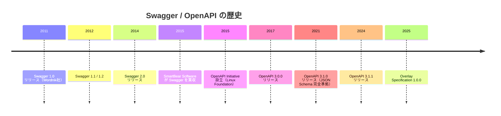
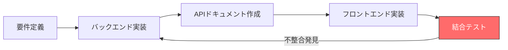
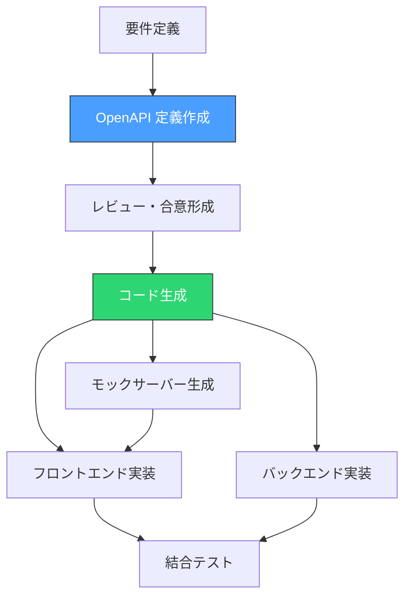
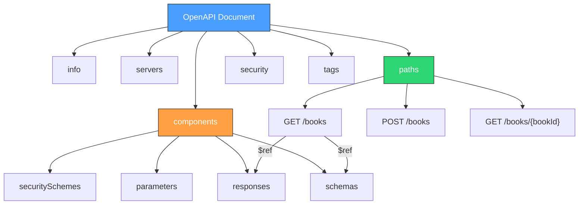
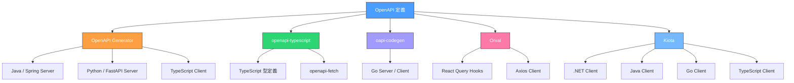
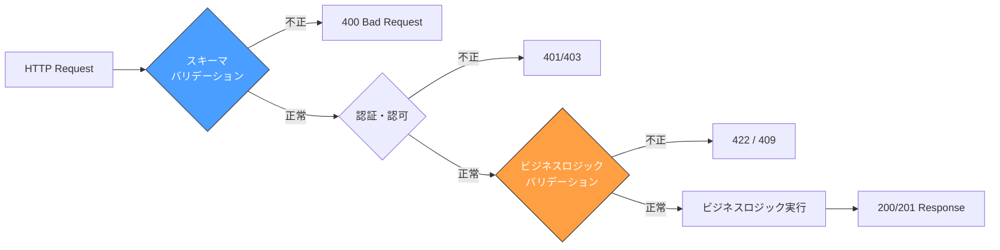
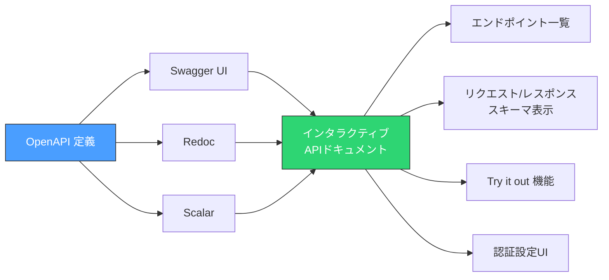
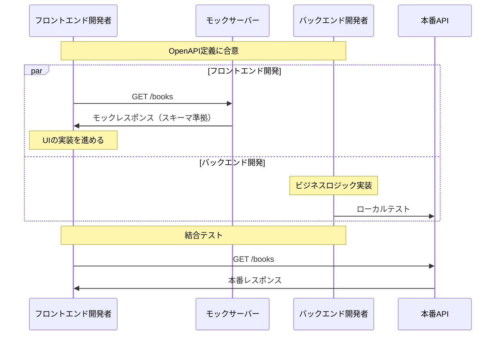
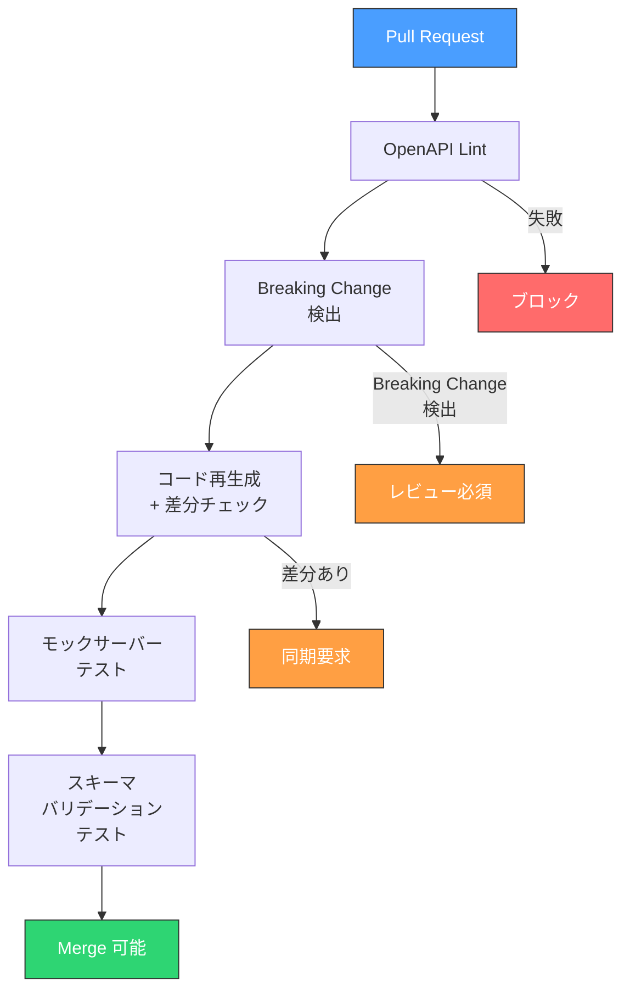
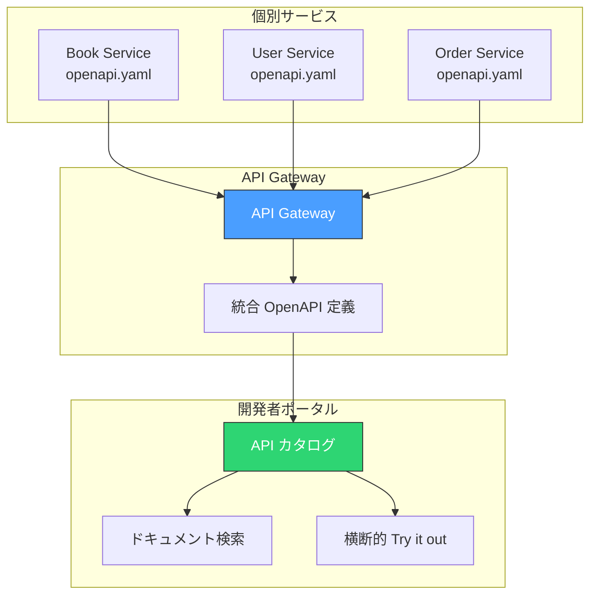

# OpenAPI とスキーマ駆動開発

## 1. 歴史的背景

### 1.1 Web API の混沌期

2000年代後半から2010年代前半にかけて、RESTful API は急速に普及した。SOAPの複雑さに辟易した開発者たちがHTTPとJSONを組み合わせたシンプルなAPIへと雪崩を打って移行したのがこの時期である。しかし、RESTはアーキテクチャスタイルであって厳密な仕様ではない。その自由度が仇となり、API設計の品質はチームや開発者の力量に大きく依存した。

典型的なプロジェクトでは、以下のような問題が慢性的に発生していた。

- **仕様の散逸**: APIの仕様がWikiページ、Googleドキュメント、口頭での伝達など、複数の場所に分散し、しかもそのいずれもが最新のコードと一致していない
- **フロントエンドとバックエンドの齟齬**: バックエンド開発者がレスポンスフィールドを変更したことにフロントエンド開発者が気づかず、本番障害が発生する
- **手動テストへの依存**: APIの入出力を検証する手段が手動のcurlコマンドやPostmanによるアドホックなテストに限られていた
- **オンボーディングの困難**: 新しくチームに参加した開発者が、既存APIの全容を把握するのに数週間を要する

こうした問題の根底にあるのは、**APIの仕様が機械可読な形式で一元管理されていない**という事実だった。

### 1.2 Swagger の登場

2011年、Wordnik社のTony Tamが、自社APIのドキュメント生成を自動化するために Swagger というツール群を開発した。Swaggerの核心的なアイデアは、APIの仕様をJSON（後にYAMLもサポート）で記述する標準的なフォーマットを定義し、その定義ファイルからドキュメント、クライアントコード、サーバースタブを自動生成できるようにするというものだった。

Swaggerは当初、以下の3つのコンポーネントで構成されていた。

- **Swagger Specification**: API定義のためのJSON形式のスキーマ
- **Swagger UI**: 定義ファイルからインタラクティブなAPIドキュメントを生成するツール
- **Swagger Codegen**: 定義ファイルから各言語のクライアント/サーバーコードを生成するツール



Swagger 2.0は2014年にリリースされ、JSON SchemaのサブセットによるスキーマDefinition、セキュリティ定義、パス定義などを包括する完成度の高い仕様となった。この時点でSwaggerはRESTful API定義のデファクトスタンダードとしての地位を確立した。

### 1.3 OpenAPI への移行

2015年、SmartBear SoftwareがSwaggerの知的財産を買収した。同年、Google、IBM、Microsoft、PayPalなどの主要テクノロジー企業がLinux Foundation傘下に**OpenAPI Initiative（OAI）**を設立し、Swagger Specification をベンダー中立な標準仕様として管理する体制が整えられた。

この移行に伴い、名称が整理された。

| 旧名称 | 新名称 | 補足 |
|--------|--------|------|
| Swagger Specification | OpenAPI Specification (OAS) | 仕様そのもの |
| Swagger UI | Swagger UI（変更なし） | SmartBear社のツールとして存続 |
| Swagger Codegen | OpenAPI Generator（コミュニティフォーク） | 2018年にフォーク |
| Swagger Editor | Swagger Editor（変更なし） | SmartBear社のツールとして存続 |

::: tip
「Swagger」は現在もSmartBear社のツール群のブランド名として使われている。一方「OpenAPI」は仕様そのものを指す。「Swagger = OpenAPI」ではなく、「Swagger Specification が OpenAPI Specification に名前が変わった」というのが正確な理解である。
:::

2017年にリリースされたOpenAPI 3.0は、Swagger 2.0からの大幅な構造刷新を含んでいた。そして2021年のOpenAPI 3.1.0では、JSON Schema Draft 2020-12への完全準拠が実現し、JSONスキーマエコシステムとの互換性が飛躍的に向上した。

## 2. スキーマ駆動開発とは

### 2.1 従来の開発フローの問題

従来のAPI開発は、多くの場合「コードファースト」で行われてきた。すなわち、サーバーサイドのコードを先に実装し、そのコードからAPIドキュメントを自動生成（あるいは手動で記述）するというフローである。



このフローには構造的な問題がある。

**直列的な依存関係**: フロントエンド開発者はバックエンドの実装完了を待たなければ作業を開始できない。これはチーム全体のスループットを大幅に低下させる。

**ドキュメントとコードの乖離**: コードの変更がドキュメントに反映されない、あるいはドキュメントの更新が遅れるという問題が常に発生する。コードファーストのアプローチでは、ドキュメントは「二次的な成果物」に過ぎず、メンテナンスの優先度が低くなりがちである。

**遅い時期のフィードバック**: API設計の問題が発覚するのが結合テストの段階であり、手戻りコストが大きい。

### 2.2 API First の原則

スキーマ駆動開発（Schema-Driven Development）は、**API定義（スキーマ）を開発プロセスの起点に置く**という開発手法である。API Firstとも呼ばれるこのアプローチでは、実装に先立ってOpenAPIなどの機械可読な仕様書を作成し、その仕様書を「信頼できる唯一の情報源（Single Source of Truth）」として扱う。



このフローには以下のメリットがある。

**並行開発の実現**: OpenAPI定義が確定すれば、フロントエンドとバックエンドの開発を並行して進められる。フロントエンド開発者はモックサーバーを使ってAPIの振る舞いをシミュレートできる。

**早期のフィードバック**: API設計に関する議論が実装前に行われるため、設計上の問題を早期に検出できる。OpenAPI定義ファイルに対するPullRequestレビューという形で、APIの仕様変更を追跡可能にできる。

**ドキュメントの正確性**: OpenAPI定義自体がドキュメントであり、コードはその定義から生成されるため、ドキュメントとコードの乖離が原理的に発生しない。

**型安全性の向上**: スキーマからクライアントコードを自動生成することで、コンパイル時にAPIの型不整合を検出できる。

### 2.3 Design First vs Code First

スキーマ駆動開発においても、Design First（定義を先に書く）とCode First（コードからスキーマを生成する）の二つのアプローチが存在する。どちらが適切かは、プロジェクトの性質やチーム構成に依存する。

| 観点 | Design First | Code First |
|------|-------------|------------|
| スキーマの作成 | 手動でOpenAPI定義を記述 | コードにアノテーションを付与し自動生成 |
| 開発フロー | 定義 → 実装 | 実装 → 定義 |
| 適するケース | 公開API、チーム間連携 | 社内API、プロトタイプ |
| メリット | 設計品質が高い、並行開発可能 | 実装と定義の乖離が起きにくい |
| デメリット | 定義の記述に時間がかかる | 設計議論が不十分になりがち |
| 代表的ツール | Swagger Editor, Stoplight Studio | SpringDoc, FastAPI, NestJS/Swagger |

::: warning
Code Firstアプローチを採用する場合でも、生成されたOpenAPI定義を必ずバージョン管理に含め、CIで差分を検出する仕組みを整えるべきである。さもなければ、コードの変更がスキーマの変更であることが見過ごされ、クライアントとの互換性が意図せず壊れるリスクがある。
:::

## 3. OpenAPI 3.x 仕様の要素

### 3.1 全体構造

OpenAPI 3.x の定義ファイルは、YAMLまたはJSON形式で記述される。以下にその全体構造を示す。

```yaml
# OpenAPI version
openapi: 3.1.0

# API metadata
info:
  title: Bookstore API
  description: A sample API for managing a bookstore
  version: 1.0.0
  contact:
    name: API Support
    email: support@example.com
  license:
    name: MIT

# Server definitions
servers:
  - url: https://api.example.com/v1
    description: Production
  - url: https://staging-api.example.com/v1
    description: Staging

# API paths (endpoints)
paths:
  /books:
    get:
      # ...
    post:
      # ...
  /books/{bookId}:
    get:
      # ...

# Reusable components
components:
  schemas:
    # ...
  parameters:
    # ...
  responses:
    # ...
  securitySchemes:
    # ...

# Global security requirements
security:
  - bearerAuth: []

# Tag definitions for grouping operations
tags:
  - name: books
    description: Operations for managing books
```



OpenAPI文書はルートレベルに7つの主要なセクションを持つ。`openapi` フィールドはバージョンを、`info` はAPIのメタデータを、`servers` はAPIのベースURLを定義する。`paths` がAPIの各エンドポイントとオペレーションの定義、`components` が再利用可能なスキーマやパラメータの定義を担う。

### 3.2 Paths とオペレーション

`paths` セクションは、APIのエンドポイントとそれに対するHTTPオペレーションを定義する。各オペレーションには、パラメータ、リクエストボディ、レスポンスなどを記述する。

```yaml
paths:
  /books:
    get:
      summary: List all books
      operationId: listBooks
      tags:
        - books
      parameters:
        - name: genre
          in: query
          description: Filter books by genre
          required: false
          schema:
            type: string
            enum: [fiction, non-fiction, science, history]
        - name: limit
          in: query
          description: Maximum number of books to return
          required: false
          schema:
            type: integer
            minimum: 1
            maximum: 100
            default: 20
        - name: cursor
          in: query
          description: Cursor for pagination
          required: false
          schema:
            type: string
      responses:
        "200":
          description: A paginated list of books
          content:
            application/json:
              schema:
                $ref: "#/components/schemas/BookListResponse"
        "400":
          $ref: "#/components/responses/BadRequest"
        "401":
          $ref: "#/components/responses/Unauthorized"

    post:
      summary: Create a new book
      operationId: createBook
      tags:
        - books
      requestBody:
        required: true
        content:
          application/json:
            schema:
              $ref: "#/components/schemas/CreateBookRequest"
      responses:
        "201":
          description: The created book
          content:
            application/json:
              schema:
                $ref: "#/components/schemas/Book"
        "400":
          $ref: "#/components/responses/BadRequest"
        "409":
          description: A book with the same ISBN already exists
          content:
            application/json:
              schema:
                $ref: "#/components/schemas/Error"
```

`operationId` は各オペレーションを一意に識別するIDであり、コード生成において関数名として使われる。命名には一貫性を持たせることが重要で、`listBooks`, `getBook`, `createBook`, `updateBook`, `deleteBook` のような動詞+名詞の形式が一般的である。

### 3.3 Components とスキーマ定義

`components` セクションは再利用可能なオブジェクトを定義する。最も重要なのは `schemas` で、リクエスト/レスポンスのデータ構造を定義する。

```yaml
components:
  schemas:
    Book:
      type: object
      required:
        - id
        - title
        - author
        - isbn
        - price
        - createdAt
      properties:
        id:
          type: string
          format: uuid
          description: Unique identifier
          examples:
            - "550e8400-e29b-41d4-a716-446655440000"
        title:
          type: string
          minLength: 1
          maxLength: 500
          description: Title of the book
        author:
          type: string
          minLength: 1
          maxLength: 200
          description: Author name
        isbn:
          type: string
          pattern: "^(97[89])-\\d{1,5}-\\d{1,7}-\\d{1,7}-\\d$"
          description: ISBN-13 format
        price:
          type: integer
          minimum: 0
          description: Price in cents
        genre:
          type: string
          enum: [fiction, non-fiction, science, history]
        publishedAt:
          type: string
          format: date
          description: Publication date
        createdAt:
          type: string
          format: date-time
          description: Record creation timestamp

    CreateBookRequest:
      type: object
      required:
        - title
        - author
        - isbn
        - price
      properties:
        title:
          type: string
          minLength: 1
          maxLength: 500
        author:
          type: string
          minLength: 1
          maxLength: 200
        isbn:
          type: string
          pattern: "^(97[89])-\\d{1,5}-\\d{1,7}-\\d{1,7}-\\d$"
        price:
          type: integer
          minimum: 0
        genre:
          type: string
          enum: [fiction, non-fiction, science, history]
        publishedAt:
          type: string
          format: date

    BookListResponse:
      type: object
      required:
        - items
        - hasMore
      properties:
        items:
          type: array
          items:
            $ref: "#/components/schemas/Book"
        hasMore:
          type: boolean
          description: Whether more items exist
        nextCursor:
          type: string
          description: Cursor for the next page

    Error:
      type: object
      required:
        - code
        - message
      properties:
        code:
          type: string
          description: Machine-readable error code
        message:
          type: string
          description: Human-readable error message
        details:
          type: array
          items:
            $ref: "#/components/schemas/ErrorDetail"

    ErrorDetail:
      type: object
      required:
        - field
        - reason
      properties:
        field:
          type: string
          description: The field that caused the error
        reason:
          type: string
          description: Why the field is invalid
```

OpenAPI 3.1ではJSON Schema Draft 2020-12に完全準拠したため、`nullable` キーワードの代わりにJSON Schemaの型の配列表記（`type: [string, "null"]`）が使えるようになった。また `examples` キーワード（複数形）も利用可能になっている。

### 3.4 セキュリティ定義

OpenAPIでは、APIの認証・認可メカニズムを `securitySchemes` で定義する。

```yaml
components:
  securitySchemes:
    bearerAuth:
      type: http
      scheme: bearer
      bearerFormat: JWT
      description: JWT token obtained from /auth/login

    apiKeyAuth:
      type: apiKey
      in: header
      name: X-API-Key
      description: API key for server-to-server communication

    oauth2:
      type: oauth2
      flows:
        authorizationCode:
          authorizationUrl: https://auth.example.com/authorize
          tokenUrl: https://auth.example.com/token
          scopes:
            books:read: Read access to books
            books:write: Write access to books
            admin: Full administrative access
```

グローバルレベルで `security` を指定すると全オペレーションに適用され、個別のオペレーションで上書きすることも可能である。認証不要のエンドポイント（ログインやヘルスチェックなど）には、空の `security: []` を指定する。

### 3.5 `$ref` による参照と再利用

OpenAPI定義が大規模化すると、ファイルが数千行に膨らむことは珍しくない。`$ref` キーワードを使うことで、コンポーネントの再利用やファイルの分割が可能になる。

```yaml
# Same-file reference
$ref: "#/components/schemas/Book"

# External file reference
$ref: "./schemas/book.yaml"

# External file with JSON Pointer
$ref: "./common.yaml#/components/schemas/Error"
```

大規模プロジェクトでは、以下のようなディレクトリ構造でOpenAPI定義を分割管理することが一般的である。

```
api/
├── openapi.yaml          # Root document
├── paths/
│   ├── books.yaml        # /books endpoints
│   ├── authors.yaml      # /authors endpoints
│   └── orders.yaml       # /orders endpoints
├── schemas/
│   ├── book.yaml         # Book schema
│   ├── author.yaml       # Author schema
│   ├── order.yaml        # Order schema
│   └── common.yaml       # Shared schemas (Error, Pagination, etc.)
└── parameters/
    └── common.yaml       # Shared parameters (limit, cursor, etc.)
```

::: details ファイル分割時の注意点
ファイルを分割する場合、最終的にすべての `$ref` を解決して単一ファイルに「バンドル」する必要がある場面がある（一部のツールが分割ファイルに対応していないため）。`@redocly/cli` の `bundle` コマンドや `swagger-cli bundle` コマンドがこの目的に使える。

```bash
# Bundle split files into a single document
npx @redocly/cli bundle api/openapi.yaml -o dist/openapi.yaml
```
:::

## 4. コード生成

### 4.1 なぜコード生成が重要か

スキーマ駆動開発の最大の恩恵は、OpenAPI定義からコードを自動生成できることにある。手動でHTTPクライアントやAPIルーティングを記述する場合、以下のようなミスが容易に発生する。

- エンドポイントのパスの誤記
- リクエスト/レスポンスの型定義とAPIの実際の仕様の不一致
- パラメータの必須/任意の取り違え
- レスポンスのステータスコードの処理漏れ

コード生成は、これらのミスを**構造的に排除**する。スキーマが変更されればコードも再生成され、型チェックによって不整合がコンパイル時に検出される。

### 4.2 主要なコード生成ツール

OpenAPIからのコード生成には、複数のツールが存在する。用途やターゲット言語に応じて使い分ける。



**OpenAPI Generator**

OpenAPI Generator は、Swagger Codegenからフォークされたコミュニティ主導のプロジェクトである。50以上の言語・フレームワークに対応し、サーバースタブとクライアントSDKの両方を生成できる。

```bash
# Generate TypeScript Axios client
npx @openapitools/openapi-generator-cli generate \
  -i openapi.yaml \
  -g typescript-axios \
  -o ./generated/client

# Generate Spring Boot server stub
npx @openapitools/openapi-generator-cli generate \
  -i openapi.yaml \
  -g spring \
  -o ./generated/server \
  --additional-properties=useSpringBoot3=true,interfaceOnly=true
```

`interfaceOnly=true` オプションは重要なプラクティスである。サーバースタブ全体を生成するのではなく、インターフェース（Java）や抽象クラスだけを生成することで、ビジネスロジックの実装部分は開発者が手動で記述する。これにより、再生成時にビジネスロジックが上書きされるリスクを回避できる。

**openapi-typescript + openapi-fetch**

TypeScriptプロジェクトにおいては、`openapi-typescript` と `openapi-fetch` の組み合わせが近年人気を集めている。OpenAPI定義から型定義のみを生成し、ランタイムの依存関係を最小限に抑えるアプローチである。

```typescript
// generated types from openapi-typescript (auto-generated)
import type { paths } from "./generated/api";
import createClient from "openapi-fetch";

// Create a type-safe API client
const client = createClient<paths>({
  baseUrl: "https://api.example.com/v1",
});

async function listBooks() {
  // Fully type-safe: path, params, and response types are inferred
  const { data, error } = await client.GET("/books", {
    params: {
      query: {
        genre: "fiction",
        limit: 10,
      },
    },
  });

  if (error) {
    // error is typed based on the OpenAPI error responses
    console.error(error.message);
    return;
  }

  // data is typed as BookListResponse
  for (const book of data.items) {
    console.log(book.title); // fully typed
  }
}
```

このアプローチの利点は、生成されるのが純粋なTypeScript型定義のみであり、ランタイムコードが最小限であることだ。バンドルサイズへの影響が小さく、TypeScriptのコンパイラが型チェックを担保してくれる。

**oapi-codegen（Go）**

Go言語のプロジェクトでは、`oapi-codegen` がデファクトスタンダードとなっている。

```yaml
# oapi-codegen configuration (oapi-codegen.yaml)
package: api
generate:
  # Generate server interface
  echo-server: true
  # Generate request/response types
  models: true
  # Generate strict server interface
  strict-server: true
output: internal/api/generated.go
```

```go
// Developer implements the generated interface (hand-written)
package api

import (
	"context"
	"net/http"
)

// StrictServerInterface is generated by oapi-codegen
type BookServer struct {
	repo BookRepository
}

// Implementation of the generated interface method
func (s *BookServer) ListBooks(
	ctx context.Context,
	request ListBooksRequestObject,
) (ListBooksResponseObject, error) {
	books, err := s.repo.FindAll(ctx, request.Params.Genre, request.Params.Limit)
	if err != nil {
		return ListBooks500JSONResponse{
			Code:    "INTERNAL_ERROR",
			Message: "Failed to fetch books",
		}, nil
	}
	return ListBooks200JSONResponse{
		Items:   books,
		HasMore: len(books) == *request.Params.Limit,
	}, nil
}
```

`strict-server` モードは、リクエストのパースとレスポンスのシリアライゼーションを生成コードに委ね、開発者はビジネスロジックに集中できるようにする設計である。HTTPレイヤーの詳細が隠蔽され、入出力の型安全性が保証される。

### 4.3 コード生成のベストプラクティス

コード生成を効果的に運用するためのプラクティスを整理する。

**生成コードはバージョン管理に含めるか？**

これは議論の分かれるポイントである。

::: details 生成コードのバージョン管理戦略

**含める派の主張:**
- CIで生成ステップが不要になり、ビルドがシンプルになる
- 生成コードの変更差分をPullRequestでレビューできる
- 生成ツールのバージョン差異による問題を回避できる

**含めない派の主張:**
- 生成コードはOpenAPI定義から常に再現可能であり、冗長である
- マージコンフリクトの原因になる
- リポジトリサイズが不必要に大きくなる

**推奨アプローチ:**
CIパイプラインで再生成し、差分がないことを検証する（後述の「CI/CD統合」セクションで詳述）。生成コードは `.gitignore` に追加するが、CIでの再生成と差分チェックを必須とする。ただし、生成コードの差分を明示的にレビューしたいチームでは含めるアプローチも有効である。
:::

**生成コードを直接編集しない**: 生成されたコードにビジネスロジックを書き込むと、再生成時に失われる。継承、インターフェース実装、ラッパーパターンなどで生成コードと手書きコードを分離する。

**`operationId` の命名を慎重に行う**: `operationId` はコード生成で関数名として使われるため、言語のキーワードと衝突しない、わかりやすい名前をつける。

## 5. バリデーション

### 5.1 リクエストバリデーション

OpenAPIスキーマには、各フィールドのバリデーションルール（型、必須/任意、最小値/最大値、正規表現パターンなど）が定義されている。これを利用して、APIリクエストのバリデーションを自動化できる。

バリデーションは大きく2つのレベルで行われる。

**スキーマレベルのバリデーション**: リクエストボディのJSON構造がスキーマに適合するかを検証する。型の一致、必須フィールドの存在、文字列長、数値範囲、正規表現パターンなどがチェック対象となる。

**ビジネスロジックレベルのバリデーション**: 「在庫が足りているか」「ユーザーがこのリソースにアクセス権限を持っているか」といった、スキーマでは表現できないルールの検証である。これはアプリケーションコードで実装する必要がある。



### 5.2 バリデーションミドルウェア

多くのフレームワークでは、OpenAPI定義を読み込んでリクエストを自動的にバリデーションするミドルウェアが利用可能である。

```typescript
// Express.js with express-openapi-validator (example)
import express from "express";
import * as OpenApiValidator from "express-openapi-validator";

const app = express();

app.use(express.json());

// Automatically validates requests and responses against the OpenAPI spec
app.use(
  OpenApiValidator.middleware({
    apiSpec: "./openapi.yaml",
    validateRequests: true,
    validateResponses: true, // Enable in development/staging
  })
);

// Route handlers receive pre-validated data
app.post("/books", (req, res) => {
  // req.body is guaranteed to match CreateBookRequest schema
  const book = createBook(req.body);
  res.status(201).json(book);
});

// Validation errors are automatically formatted
app.use((err, req, res, next) => {
  if (err.status === 400) {
    res.status(400).json({
      code: "VALIDATION_ERROR",
      message: err.message,
      details: err.errors.map((e) => ({
        field: e.path,
        reason: e.message,
      })),
    });
  }
});
```

::: warning
レスポンスバリデーション（`validateResponses: true`）は本番環境では無効にすべきである。レスポンスの検証はパフォーマンスコストが高く、また検証エラーが発生した際にクライアントに500エラーを返すことになるため、サービスの可用性に影響する。ステージング環境までで有効にし、本番では無効にするのが一般的なプラクティスである。
:::

### 5.3 スキーマ定義自体のバリデーション（リンティング）

OpenAPI定義ファイル自体の品質を保つために、リンティングツールを使って構造的な問題やベストプラクティス違反を検出する。

```yaml
# .redocly.yaml - Redocly CLI linting configuration
extends:
  - recommended

rules:
  # Ensure all operations have an operationId
  operation-operationId: error

  # Require descriptions for all operations
  operation-description: warn

  # Ensure consistent parameter naming (camelCase)
  naming-convention:
    severity: error
    parameterCases: camelCase
    propertyCases: camelCase

  # Require examples in schemas
  component-name-unique: error

  # No unused components
  no-unused-components: warn

  # Paths must use kebab-case
  paths-kebab-case: error

  # Require response for every operation
  operation-2xx-response: error

  # Tags must be defined
  operation-tag-defined: error
```

```bash
# Lint the OpenAPI definition
npx @redocly/cli lint openapi.yaml

# Output example:
# [1] openapi.yaml:45:7 - Error: Operation must have operationId
# [2] openapi.yaml:78:9 - Warning: Operation is missing a description
# ✗ 1 error, 1 warning
```

主要なリンティングツールには `@redocly/cli`（旧 `openapi-cli`）と `spectral`（Stoplight社製）がある。いずれもルールのカスタマイズが可能で、プロジェクト固有の命名規約やスキーマ設計ルールを強制できる。

## 6. ドキュメント生成

### 6.1 インタラクティブなAPIドキュメント

OpenAPI定義から、人間が読むためのAPIドキュメントを自動生成できる。ドキュメント生成ツールは単にスキーマを可視化するだけでなく、「Try it out」機能によるインタラクティブなAPIテストを提供するものも多い。

主要なドキュメント生成ツールを比較する。

| ツール | 特徴 | ライセンス |
|--------|------|-----------|
| Swagger UI | 最も歴史が長い。Try it out機能が充実 | Apache 2.0 |
| Redoc | 3カラムレイアウト。読みやすさに優れる | MIT |
| Stoplight Elements | Webコンポーネントとして埋め込み可能 | Apache 2.0 |
| Scalar | モダンなUI。カスタマイズ性が高い | MIT |



### 6.2 ドキュメントの配信

生成されたドキュメントをどのように配信するかにも設計判断がある。

**静的ホスティング**: Redocで単一のHTMLファイルを生成し、S3やGitHub Pagesにデプロイする。CDNから配信すれば、高速にアクセスできる。

```bash
# Generate static HTML documentation
npx @redocly/cli build-docs openapi.yaml -o docs/index.html
```

**APIサーバーに組み込み**: APIサーバー自体が `/docs` エンドポイントでドキュメントを提供する。FastAPI（Python）やNestJS（TypeScript）はこの機能を組み込みで持っている。

**開発者ポータル**: Stoplight、ReadMe、Backstageなどの開発者ポータルにOpenAPI定義を読み込ませ、ガイド記事やチュートリアルと合わせて公開する。公開APIを提供する企業では、このアプローチが主流である。

::: tip
ドキュメントは「正しい」だけでは不十分であり、「使いやすい」必要がある。OpenAPI定義に豊富な `description`、`example`、`summary` を記述することが、生成されるドキュメントの品質を直接左右する。スキーマだけでなく、各フィールドの意味や制約を文章で説明すべきである。
:::

## 7. モックサーバー

### 7.1 モックサーバーの役割

スキーマ駆動開発において、モックサーバーはフロントエンドとバックエンドの並行開発を実現するための重要なピースである。OpenAPI定義が合意されれば、バックエンドの実装を待たずに、定義に基づいたモックレスポンスを返すサーバーを立ち上げられる。



### 7.2 モックサーバーツール

**Prism（Stoplight）** は最も広く使われているOpenAPIモックサーバーである。

```bash
# Start a mock server based on OpenAPI definition
npx @stoplight/prism-cli mock openapi.yaml --port 4010

# The mock server returns responses based on:
# 1. Examples defined in the schema (if available)
# 2. Dynamically generated data matching the schema (fallback)
```

Prismは定義中の `example` や `examples` を優先的に使用し、それがなければスキーマの型制約に基づいてランダムなデータを生成する。`--dynamic` フラグを使えば、呼び出すたびに異なるデータが返されるため、より実践的なテストが可能になる。

## 8. CI/CD 統合

### 8.1 CI パイプラインにおけるOpenAPIの検証

スキーマ駆動開発の恩恵を最大化するには、CIパイプラインにOpenAPI関連の検証ステップを組み込むことが不可欠である。以下のチェックを自動化する。



### 8.2 Breaking Change の自動検出

APIの変更が後方互換性を壊すかどうかを自動的に判定することは、スキーマ駆動開発の中でも特に価値の高い自動化ポイントである。

```yaml
# GitHub Actions workflow example
name: OpenAPI CI
on:
  pull_request:
    paths:
      - "api/**"
      - "openapi.yaml"

jobs:
  lint:
    runs-on: ubuntu-latest
    steps:
      - uses: actions/checkout@v4

      # Lint the OpenAPI definition
      - name: Lint OpenAPI
        run: npx @redocly/cli lint openapi.yaml

  breaking-changes:
    runs-on: ubuntu-latest
    steps:
      - uses: actions/checkout@v4
        with:
          fetch-depth: 0

      # Detect breaking changes between base and head
      - name: Check breaking changes
        run: |
          # Get the base branch version of the spec
          git show origin/${{ github.base_ref }}:openapi.yaml > /tmp/base-spec.yaml

          # Compare with the current version
          npx oasdiff breaking /tmp/base-spec.yaml openapi.yaml

  codegen-check:
    runs-on: ubuntu-latest
    steps:
      - uses: actions/checkout@v4

      # Regenerate code and check for differences
      - name: Regenerate client code
        run: |
          npm run generate-api
          git diff --exit-code generated/
```

`oasdiff` はOpenAPI定義の差分を解析し、Breaking Changeを検出する専用ツールである。以下のような変更を検出できる。

- エンドポイントの削除
- 必須パラメータの追加
- レスポンスフィールドの削除
- 型の変更
- 列挙値の削除

### 8.3 Contract Testing

OpenAPIスキーマを「契約」として、クライアントとサーバーの両方がその契約に準拠していることを自動テストするのがContract Testingである。

```typescript
// Contract test example with supertest and OpenAPI validation
import { describe, it } from "node:test";
import assert from "node:assert";
import request from "supertest";
import { OpenAPIValidator } from "express-openapi-validator";

describe("Books API Contract Tests", () => {
  it("GET /books should return a valid BookListResponse", async () => {
    const res = await request(app)
      .get("/books")
      .set("Authorization", "Bearer test-token")
      .expect(200);

    // Validate response against OpenAPI schema
    const errors = validator.validateResponse(
      "get",
      "/books",
      200,
      res.body
    );

    assert.strictEqual(errors.length, 0, `Schema violations: ${JSON.stringify(errors)}`);
    assert.ok(Array.isArray(res.body.items));
    assert.ok(typeof res.body.hasMore === "boolean");
  });

  it("POST /books with invalid data should return 400", async () => {
    const res = await request(app)
      .post("/books")
      .set("Authorization", "Bearer test-token")
      .send({
        // Missing required fields: title, author, isbn, price
        genre: "fiction",
      })
      .expect(400);

    // Validate error response format
    const errors = validator.validateResponse(
      "post",
      "/books",
      400,
      res.body
    );
    assert.strictEqual(errors.length, 0);
  });
});
```

このテストでは、APIの実際のレスポンスがOpenAPI定義に準拠しているかを検証する。スキーマの変更時にテストが失敗すれば、コードの修正が必要であることが自動的に検出される。

## 9. 実践パターン

### 9.1 エラーレスポンスの標準化

API全体で一貫したエラーレスポンスの構造を定義することは、クライアントの実装を大幅に簡素化する。RFC 9457（Problem Details for HTTP APIs）に準拠した形式が推奨される。

```yaml
components:
  schemas:
    ProblemDetail:
      type: object
      required:
        - type
        - title
        - status
      properties:
        type:
          type: string
          format: uri
          description: >
            A URI reference that identifies the problem type.
            When dereferenced, it should provide human-readable
            documentation for the problem type.
          examples:
            - "https://api.example.com/problems/out-of-stock"
        title:
          type: string
          description: A short, human-readable summary of the problem type
        status:
          type: integer
          description: The HTTP status code
        detail:
          type: string
          description: >
            A human-readable explanation specific to this
            occurrence of the problem
        instance:
          type: string
          format: uri
          description: >
            A URI reference that identifies the specific
            occurrence of the problem
        errors:
          type: array
          items:
            type: object
            properties:
              field:
                type: string
              message:
                type: string
```

### 9.2 ページネーション

カーソルベースのページネーションをOpenAPIで表現するパターンを示す。

```yaml
components:
  schemas:
    # Generic paginated response pattern
    PaginatedResponse:
      type: object
      required:
        - items
        - pagination
      properties:
        items:
          type: array
          items: {}
          description: Overridden by specific response types
        pagination:
          $ref: "#/components/schemas/PaginationMeta"

    PaginationMeta:
      type: object
      required:
        - hasMore
      properties:
        hasMore:
          type: boolean
          description: Whether more items exist after the current page
        nextCursor:
          type: string
          description: Cursor to fetch the next page (absent if hasMore is false)
        totalCount:
          type: integer
          description: >
            Total number of items (optional, may be omitted
            for performance reasons on large datasets)

  parameters:
    CursorParam:
      name: cursor
      in: query
      required: false
      schema:
        type: string
      description: Cursor for pagination. Omit for the first page.
    LimitParam:
      name: limit
      in: query
      required: false
      schema:
        type: integer
        minimum: 1
        maximum: 100
        default: 20
      description: Maximum number of items to return
```

### 9.3 APIキー管理とセキュリティ設計

実際のAPIでは複数の認証方式を併用することが多い。エンドユーザー認証にはOAuth 2.0/OIDCを使い、サーバー間通信にはAPIキーを使うといった構成が典型的である。

```yaml
# Security scheme definitions
components:
  securitySchemes:
    userAuth:
      type: oauth2
      flows:
        authorizationCode:
          authorizationUrl: https://auth.example.com/authorize
          tokenUrl: https://auth.example.com/token
          scopes:
            read: Read access
            write: Write access
    serviceAuth:
      type: http
      scheme: bearer
      bearerFormat: JWT
      description: Service-to-service JWT token

# Per-operation security
paths:
  /books:
    get:
      security:
        # Either user auth OR service auth
        - userAuth: [read]
        - serviceAuth: []
    post:
      security:
        # Only user auth with write scope
        - userAuth: [write]
  /health:
    get:
      # No authentication required
      security: []
```

### 9.4 バージョニングとスキーマの進化

OpenAPIを使ったAPIでは、可能な限りバージョニングを避け、スキーマの後方互換的な進化を図るのが理想である。前述のBreaking Change検出を活用し、以下の原則を守る。

**追加は安全、削除は危険**: 新しいフィールドの追加は後方互換的だが、既存フィールドの削除やリネームは破壊的変更である。

**必須パラメータを後から追加しない**: 新しいリクエストパラメータは常にオプショナルとし、デフォルト値を設ける。

**列挙値は追加のみ**: enumに新しい値を追加するのは許容されるが、既存の値を削除してはならない（ただし、クライアントが未知の値を受容できるよう設計されている前提）。

**Deprecation の活用**: フィールドやエンドポイントを廃止する場合は、`deprecated: true` を設定して十分な移行期間を設ける。

```yaml
paths:
  /books/{bookId}:
    get:
      operationId: getBook
      parameters:
        - name: bookId
          in: path
          required: true
          schema:
            type: string
            format: uuid
      responses:
        "200":
          content:
            application/json:
              schema:
                type: object
                properties:
                  id:
                    type: string
                    format: uuid
                  title:
                    type: string
                  # Legacy field - use authorName instead
                  author:
                    type: string
                    deprecated: true
                    description: >
                      Deprecated: Use authorName instead.
                      Will be removed on 2026-09-01.
                  # New field replacing author
                  authorName:
                    type: string
                  authorId:
                    type: string
                    format: uuid
```

### 9.5 マルチサービス環境でのOpenAPI管理

マイクロサービスアーキテクチャでは、各サービスがそれぞれのOpenAPI定義を持つ。これらを統合的に管理するための戦略が必要になる。



**API Gatewayによる統合**: Kong、AWS API Gateway、Apigee などのAPI GatewayはOpenAPI定義のインポートに対応しており、各サービスのOpenAPI定義を集約してルーティング設定やポリシー適用を自動化できる。

**Backstageによるカタログ化**: Spotifyが開発したBackstageは、各サービスのOpenAPI定義をカタログに登録し、開発者が組織全体のAPIを横断的に検索・閲覧できる開発者ポータルを提供する。

**共通スキーマの抽出**: エラーレスポンス、ページネーション、認証スキーマなどのサービス横断的なスキーマは、別リポジトリで管理し、各サービスの OpenAPI 定義から `$ref` で参照する。npmやMaven Centralのようなパッケージマネージャを通じて配布するのが堅実な方法である。

## 10. OpenAPI の限界と補完技術

### 10.1 OpenAPI が表現しにくいもの

OpenAPIはRESTful APIの記述において極めて強力だが、すべてを表現できるわけではない。

**複雑なバリデーションルール**: 「フィールドAが指定された場合、フィールドBは必須」といった条件付きバリデーションは、JSON Schemaの `if`/`then`/`else` や `oneOf` で部分的に表現できるが、可読性が低下しやすい。

**状態遷移**: 「注文は `pending` → `confirmed` → `shipped` → `delivered` の順にしか遷移しない」といったビジネスルールはOpenAPIでは表現できない。

**リクエスト間の依存関係**: 「リソースAを作成してからでないとリソースBを作成できない」といったオーケストレーションの制約はOpenAPIのスコープ外である。

**非同期API**: WebSocket、Server-Sent Events、Webhookなどの非同期通信パターンは、OpenAPI 3.1で Webhook が部分的にサポートされたものの、完全な表現は困難である。AsyncAPI という別の仕様がこの領域をカバーしている。

### 10.2 関連する仕様・ツール

OpenAPIエコシステムを補完する仕様やツールを紹介する。

| 仕様/ツール | 用途 | OpenAPIとの関係 |
|------------|------|----------------|
| AsyncAPI | 非同期API（WebSocket、メッセージキュー）の定義 | 補完的。OpenAPIと似た構文を持つ |
| JSON Schema | データ構造の定義とバリデーション | OpenAPI 3.1はJSON Schemaに完全準拠 |
| TypeSpec | APIスキーマの抽象定義言語（Microsoft） | OpenAPIを生成ターゲットの一つとして出力可能 |
| gRPC / Protocol Buffers | 高効率なRPC通信 | 競合的。gRPC-Gatewayで共存可能 |
| GraphQL | クエリ言語を持つAPI | 競合的。用途に応じて使い分け |

### 10.3 TypeSpec: スキーマ定義の上位抽象

Microsoft が開発する TypeSpec は、API定義をさらに高いレベルで抽象化する言語である。OpenAPI、Protocol Buffers、JSON Schemaなど、複数の出力形式に対応するため、マルチプロトコルのAPI定義を一元化できる可能性がある。

```typespec
// TypeSpec example - compiles to OpenAPI
import "@typespec/http";
import "@typespec/rest";

using TypeSpec.Http;
using TypeSpec.Rest;

@service({
  title: "Bookstore API",
})
namespace Bookstore;

// Define a model
model Book {
  @key id: string;
  title: string;
  author: string;
  @minValue(0) price: int32;
  genre?: "fiction" | "non-fiction" | "science" | "history";
}

// Define operations
@route("/books")
interface Books {
  @get list(@query genre?: string, @query limit?: int32): Book[];
  @get read(@path id: string): Book;
  @post create(@body book: Book): Book;
}
```

TypeSpecのコードは簡潔であり、ここから生成されるOpenAPI定義は数百行に及ぶ。OpenAPI定義を手で書くのが辛くなるほど大規模なAPIを管理するチームにとって、TypeSpecのような上位抽象化は有力な選択肢となりうる。

## 11. まとめ

OpenAPIとスキーマ駆動開発は、Web API開発における「仕様とコードの分離」を実現する実践的なアプローチである。

その本質的な価値は以下の3点に集約される。

**契約としてのAPI定義**: OpenAPI定義は、フロントエンドとバックエンドの間、あるいはサービス間の「契約書」として機能する。この契約を機械可読な形式で管理し、CI/CDパイプラインで自動的に検証することで、人間の注意力に依存しないAPI品質管理が実現する。

**自動化の基盤**: OpenAPI定義を起点として、ドキュメント生成、コード生成、バリデーション、Breaking Change検出、モックサーバーなど、API開発に関わる多くのタスクを自動化できる。これは開発者の時間を反復的な作業から解放し、ビジネスロジックの実装に集中させる。

**コミュニケーションの改善**: APIの設計変更がPullRequestとして可視化され、型チェックやリンティングによって品質が担保される。これにより、チーム間のコミュニケーションコストが削減され、APIの進化が管理可能なプロセスとなる。

一方で、OpenAPIは万能ではない。非同期通信、複雑な状態遷移、サービス間のオーケストレーションといった領域は、AsyncAPIや別の仕組みで補完する必要がある。また、Design FirstかCode Firstかの選択は、チームの規模や成熟度、APIの公開範囲によって異なる判断が求められる。

重要なのは、OpenAPIを「ドキュメント生成ツール」としてだけ見るのではなく、**開発プロセス全体の基盤**として位置づけることである。CI/CDへの統合、コード生成の活用、Breaking Change検出の自動化まで含めて初めて、スキーマ駆動開発の真価が発揮される。
