# OpenID Connect（OIDC）— OAuth 2.0上に構築された認証の標準

## 1. 背景と動機

### 1.1 認証と認可の根本的な違い

Webにおけるアイデンティティ管理を議論する際、「認証（Authentication）」と「認可（Authorization）」の区別は本質的に重要である。

- **認証**: 「あなたは誰ですか？」という問いに答えること。ユーザーの身元を確認するプロセスである
- **認可**: 「あなたは何をしてよいですか？」という問いに答えること。認証済みのユーザーに対してリソースへのアクセス権を付与するプロセスである

この二つは密接に関連しているが、根本的に異なる概念である。鍵を持っていること（認証）と、その鍵でどの部屋に入れるか（認可）は別の話である。しかし、Web技術の発展の歴史において、この二つの概念は長らく混同されてきた。

### 1.2 OAuth 2.0の成功と限界

OAuth 2.0（RFC 6749, 2012年）は「認可」のためのフレームワークとして広く成功した。ユーザーが自分のデータ（例: Googleの連絡先リスト）へのアクセス権をサードパーティアプリケーションに委譲するという問題を、標準的な方法で解決した。

しかし、OAuth 2.0はあくまで**認可**のプロトコルであり、**認証**の仕組みを提供していない。OAuth 2.0のアクセストークンは「このトークンの持ち主はリソースXへのアクセスを許可されている」ということしか表現しない。「このトークンの持ち主はユーザーYである」という認証情報は、仕様上保証されていないのである。

にもかかわらず、多くのサービスがOAuth 2.0を認証に「流用」していた。典型的なパターンは以下の通りである。

```
1. ユーザーがGoogleでログインする（OAuth 2.0の認可コードフロー）
2. アプリがアクセストークンを取得する
3. アプリがアクセストークンを使ってGoogleのユーザー情報APIを呼び出す
4. 返ってきたユーザー情報を「認証」として扱う
```

この手法は広く使われていたが、いくつかの深刻な問題を抱えていた。

**アクセストークンの流用リスク**: アクセストークンは認証の証明として設計されていない。攻撃者が別のアプリケーション向けに発行されたアクセストークンを入手し、それを別のアプリケーションに提示した場合、そのアプリケーションはユーザー情報APIを正常に呼び出せてしまう。これは「Confused Deputy Problem（混乱した代理人問題）」と呼ばれる脆弱性である。

**標準化の欠如**: 各プロバイダー（Google、Facebook、Twitterなど）がそれぞれ独自のユーザー情報APIを提供しており、レスポンスのフォーマットも異なっていた。開発者はプロバイダーごとに異なる実装を行う必要があった。

**セキュリティの一貫性の欠如**: 認証に必要なセキュリティ要件（nonce検証、トークンの対象者検証など）が標準化されておらず、実装者の裁量に委ねられていた。

### 1.3 OpenID Connectの誕生

こうした課題を解決するために、OpenID Foundation は2014年に**OpenID Connect 1.0**を策定した。OpenID Connect（以下OIDC）は、OAuth 2.0の上に「認証レイヤー」を追加する仕様である。

OIDCの核心的なアイデアは明快である。OAuth 2.0のフローで認可を行う際に、アクセストークンに加えて**IDトークン**（JWT形式の認証トークン）を発行する。このIDトークンは「このユーザーは確かに認証された」という事実を、標準化された形式で伝達するものである。

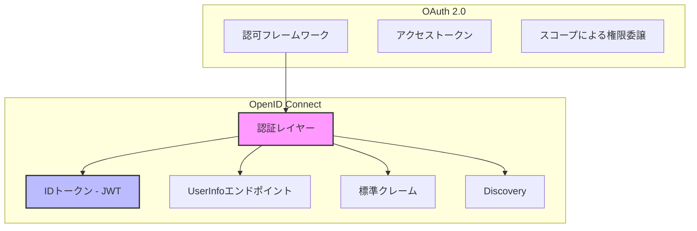

OIDCは「OAuth 2.0を置き換える」ものではなく、「OAuth 2.0を拡張する」ものである。したがって、OIDCを理解するにはOAuth 2.0の基本的な仕組みを前提知識として持っている必要がある。

## 2. OAuth 2.0との関係

### 2.1 OIDCが追加するもの

OIDCはOAuth 2.0のプロトコルフローをほぼそのまま利用しつつ、以下の要素を追加する。

| 追加要素 | 説明 |
|---------|------|
| IDトークン | JWT形式の認証トークン。ユーザーの認証情報を含む |
| `openid` スコープ | 認可リクエストにこのスコープを含めることで、OIDCフローであることを示す |
| UserInfoエンドポイント | ユーザーのプロフィール情報を取得するための標準化されたAPI |
| 標準クレーム | ユーザー情報のフィールド名を標準化（`name`, `email`, `picture` など） |
| Discovery | プロバイダーの設定情報を自動的に取得する仕組み |
| Dynamic Client Registration | クライアントを動的に登録する仕組み |
| Session Management | セッションの管理・ログアウトの標準化 |

### 2.2 用語の対応関係

OIDCの用語はOAuth 2.0の用語と対応しているが、認証の文脈に合わせてより特化した名称が使われる。

| OAuth 2.0の用語 | OIDCの用語 | 説明 |
|----------------|-----------|------|
| Authorization Server | OpenID Provider (OP) | ユーザーを認証し、IDトークンを発行するサーバー |
| Client | Relying Party (RP) | IDトークンを受け取り、ユーザーの認証を委任するアプリケーション |
| Resource Owner | End-User | 認証を受けるユーザー |
| Scope | Scope（+ `openid`） | `openid` スコープが必須。追加で `profile`, `email` 等を要求可能 |

### 2.3 スコープの体系

OIDCでは、`openid` スコープが必須であり、これがOAuth 2.0の認可リクエストとOIDCの認証リクエストを区別する唯一の指標である。追加のスコープによって、IDトークンやUserInfoレスポンスに含まれるクレームの範囲を制御する。

| スコープ | 含まれるクレーム |
|---------|----------------|
| `openid` | `sub`（必須） |
| `profile` | `name`, `family_name`, `given_name`, `middle_name`, `nickname`, `preferred_username`, `profile`, `picture`, `website`, `gender`, `birthdate`, `zoneinfo`, `locale`, `updated_at` |
| `email` | `email`, `email_verified` |
| `address` | `address` |
| `phone` | `phone_number`, `phone_number_verified` |

## 3. IDトークン

### 3.1 IDトークンとは何か

IDトークンはOIDCの最も重要な要素である。これはJWT（JSON Web Token）形式で表現された、ユーザーの認証に関する情報を含むセキュリティトークンである。

IDトークンとアクセストークンの違いを正確に理解することが重要である。

| 項目 | IDトークン | アクセストークン |
|------|-----------|----------------|
| 目的 | 認証の証明（「誰がログインしたか」） | 認可の証明（「何にアクセスできるか」） |
| 対象 | Relying Party（クライアント） | リソースサーバー |
| 形式 | 必ずJWT | JWT、Opaque tokenなど（仕様上制約なし） |
| 使い方 | クライアントが検証して内容を読む | リソースサーバーに提示してリソースにアクセスする |
| APIへの送信 | 送信してはならない | Authorizationヘッダーで送信する |

**重要な注意**: IDトークンをAPIへのアクセストークンとして使用してはならない。IDトークンはRelying Party（クライアントアプリケーション）が消費するものであり、リソースサーバーに送信するものではない。この混同は一般的な実装ミスであり、セキュリティ上の問題を引き起こす可能性がある。

### 3.2 IDトークンの構造

IDトークンはJWT仕様に従い、Header、Payload、Signatureの三部構成である。ペイロードには以下のクレームが含まれる。

#### 必須クレーム

| クレーム | 説明 | 例 |
|---------|------|-----|
| `iss` | Issuer — IDトークンの発行者（OpenID ProviderのURL） | `"https://accounts.google.com"` |
| `sub` | Subject — ユーザーの一意識別子。OP内で一意 | `"110169484474386276334"` |
| `aud` | Audience — このIDトークンの対象であるクライアントのClient ID | `"s6BhdRkqt3"` |
| `exp` | Expiration Time — 有効期限（UNIXタイムスタンプ） | `1735689600` |
| `iat` | Issued At — 発行時刻（UNIXタイムスタンプ） | `1735686000` |

#### 条件付き必須クレーム

| クレーム | 説明 | 条件 |
|---------|------|------|
| `nonce` | リプレイ攻撃を防止するためのランダム値 | 認可リクエストに `nonce` が含まれている場合に必須 |
| `auth_time` | ユーザーが実際に認証を行った時刻 | `max_age` パラメータが指定された場合に必須 |

#### オプションクレーム

| クレーム | 説明 |
|---------|------|
| `acr` | Authentication Context Class Reference — 認証の強度を示す |
| `amr` | Authentication Methods References — 使用された認証方法のリスト |
| `azp` | Authorized Party — IDトークンの発行を認可されたパーティ |
| `at_hash` | アクセストークンのハッシュ値（暗黙的フローでのバインディング用） |
| `c_hash` | 認可コードのハッシュ値 |

#### IDトークンの例

```json
{
  "iss": "https://accounts.google.com",
  "sub": "110169484474386276334",
  "aud": "1234987819200.apps.googleusercontent.com",
  "exp": 1735689600,
  "iat": 1735686000,
  "nonce": "n-0S6_WzA2Mj",
  "auth_time": 1735685900,
  "at_hash": "HK6E_P6Dh8Y93mRNtsDB1Q",
  "email": "user@example.com",
  "email_verified": true,
  "name": "Taro Yamada",
  "picture": "https://lh3.googleusercontent.com/a/photo.jpg",
  "given_name": "Taro",
  "family_name": "Yamada",
  "locale": "ja"
}
```

### 3.3 IDトークンの検証

Relying PartyがIDトークンを受け取った際、以下の手順で厳密に検証しなければならない。

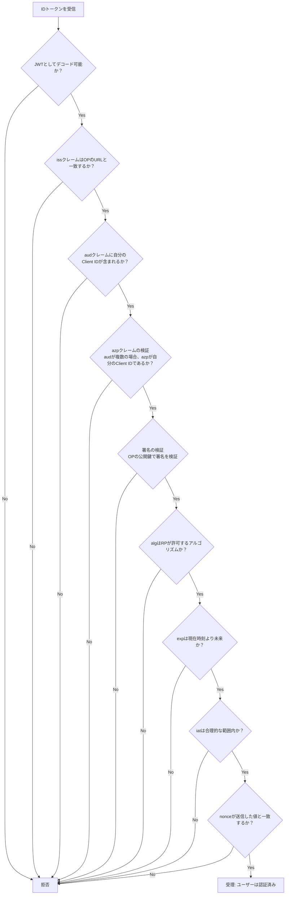

特に重要なのは以下の二点である。

**`aud` の検証**: IDトークンが自分のClient ID宛てに発行されたものであることを確認する。この検証を怠ると、攻撃者が別のアプリケーション宛てに発行されたIDトークンを流用する攻撃が成立してしまう。これはまさにOAuth 2.0を認証に流用した場合のConfused Deputy Problemを防ぐための仕組みである。

**`nonce` の検証**: 認可リクエストで送信したnonceの値とIDトークンに含まれるnonceの値が一致することを確認する。これによりリプレイ攻撃（過去に傍受されたIDトークンの再利用）を防止する。

## 4. 認証フロー

OIDCはOAuth 2.0のフローをベースに、三つの主要な認証フローを定義している。

### 4.1 Authorization Code Flow（認可コードフロー）

最も推奨されるフローである。サーバーサイドで動作するWebアプリケーション（Confidential Client）に適している。トークンの交換がバックチャネル（サーバー間通信）で行われるため、トークンがブラウザに露出しない。

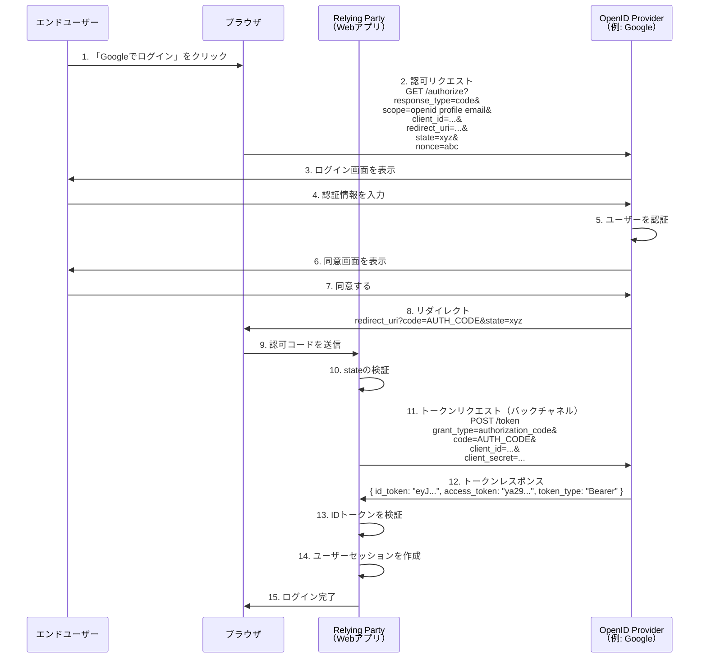

**ステップ2の認可リクエスト**のパラメータを詳細に見てみよう。

| パラメータ | 値 | 説明 |
|-----------|-----|------|
| `response_type` | `code` | 認可コードフローであることを示す |
| `scope` | `openid profile email` | `openid` が必須。追加で必要なスコープを指定 |
| `client_id` | （事前に登録した値） | RPを識別するID |
| `redirect_uri` | `https://app.example.com/callback` | 認可コードの送信先 |
| `state` | ランダムな文字列 | CSRF攻撃防止用。レスポンスで返された値と照合する |
| `nonce` | ランダムな文字列 | リプレイ攻撃防止用。IDトークン内の値と照合する |

**ステップ11のトークンリクエスト**は、RPのサーバーからOPのサーバーへの直接通信（バックチャネル）で行われる。`client_secret` が含まれるため、この通信がブラウザを経由しないことが極めて重要である。

**Authorization Code Flow with PKCE**: パブリッククライアント（SPA、モバイルアプリなど）の場合、`client_secret` を安全に保持できないため、PKCE（Proof Key for Code Exchange, RFC 7636）を組み合わせる。PKCEでは、認可リクエスト時に `code_challenge`（ランダム値のハッシュ）を送信し、トークンリクエスト時に `code_verifier`（元のランダム値）を送信する。これにより、認可コードを横取りした攻撃者がトークンを取得することを防ぐ。

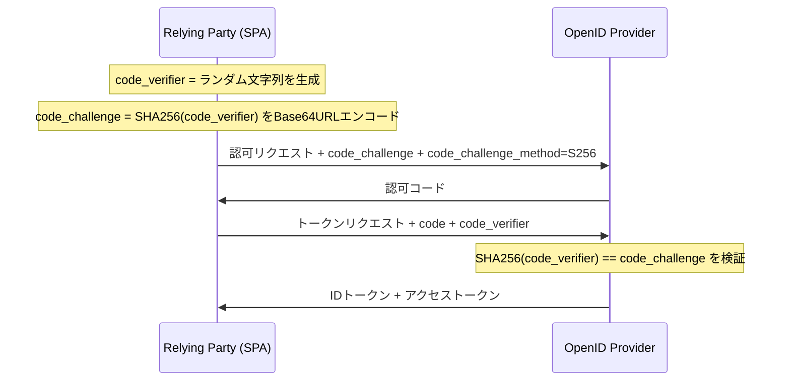

現在の推奨事項として、**すべてのクライアント（Confidential Clientを含む）でPKCEを使用する**ことが「OAuth 2.1」ドラフトで提案されている。

### 4.2 Implicit Flow（暗黙的フロー）

Implicit Flowは、トークンリクエスト（バックチャネル通信）を省略し、認可エンドポイントから直接IDトークン（およびオプションでアクセストークン）をフラグメントとして返すフローである。

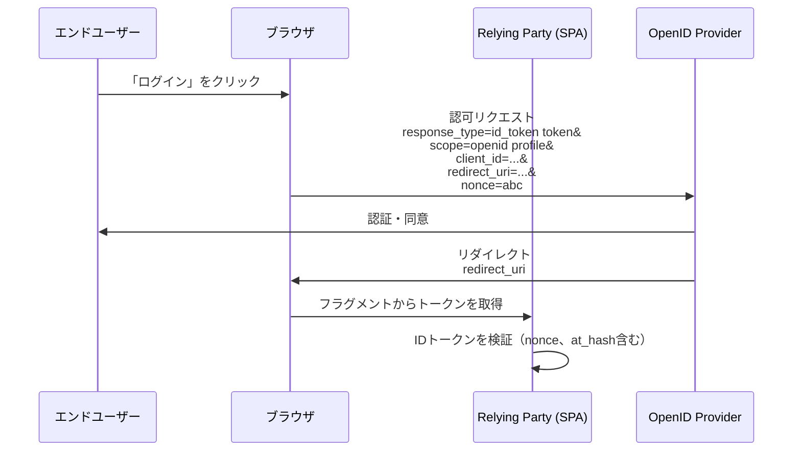

`response_type` には以下のバリエーションがある。

| `response_type` | 返されるトークン |
|-----------------|----------------|
| `id_token` | IDトークンのみ |
| `id_token token` | IDトークン + アクセストークン |

**重要**: Implicit Flowは現在非推奨である。OAuth 2.0 Security Best Current Practice（BCP）およびOAuth 2.1ドラフトにおいて、Implicit Flowの使用は明確に推奨されなくなっている。主な理由は以下の通りである。

- トークンがURLフラグメントに含まれるため、ブラウザの履歴やRefererヘッダーを通じて漏洩するリスクがある
- フロントチャネルのみでのトークン受け渡しは、中間者攻撃のリスクが高い
- PKCEを併用したAuthorization Code Flowで、SPAでも安全にトークンを取得できるようになった

新規プロジェクトでは、SPAやモバイルアプリであっても**Authorization Code Flow + PKCE**を使用すべきである。

### 4.3 Hybrid Flow（ハイブリッドフロー）

Hybrid Flowは、Authorization Code FlowとImplicit Flowの組み合わせである。認可エンドポイントからIDトークン（または一部のトークン）を即座に受け取りつつ、認可コードをバックチャネルでトークンに交換するフローである。

| `response_type` | フロントチャネルで返される | バックチャネルで取得 |
|-----------------|----------------------|-------------------|
| `code id_token` | 認可コード + IDトークン | アクセストークン |
| `code token` | 認可コード + アクセストークン | IDトークン |
| `code id_token token` | 認可コード + IDトークン + アクセストークン | （リフレッシュトークンなど） |

フロントチャネルで受け取ったIDトークンの `c_hash` クレーム（認可コードのハッシュ）を検証することで、認可コードの改ざんを検出できる。

ただし、Hybrid Flowも複雑性が高く、現代の実装ではAuthorization Code Flow + PKCEで十分なケースがほとんどである。

## 5. UserInfoエンドポイント

### 5.1 概要

UserInfoエンドポイントは、認証されたユーザーに関する追加的なプロフィール情報を取得するためのOAuth 2.0保護リソースである。IDトークンには最小限のクレームのみを含め、詳細なプロフィール情報はUserInfoエンドポイントから取得するという設計思想に基づいている。

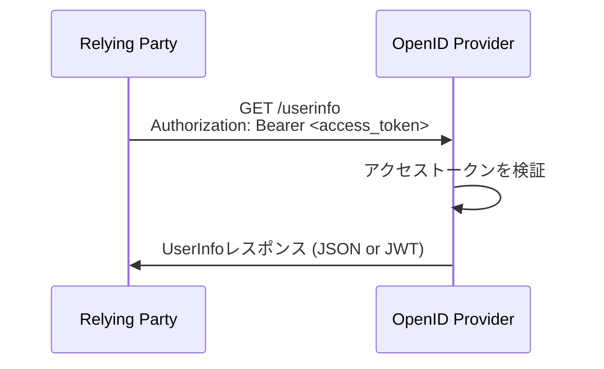

### 5.2 リクエストとレスポンス

リクエストは、アクセストークンをBearerトークンとして送信するだけである。

```http
GET /userinfo HTTP/1.1
Host: server.example.com
Authorization: Bearer SlAV32hkKG
```

レスポンスはJSON形式（デフォルト）またはJWT形式で返される。

```json
{
  "sub": "110169484474386276334",
  "name": "Taro Yamada",
  "given_name": "Taro",
  "family_name": "Yamada",
  "preferred_username": "t.yamada",
  "email": "taro@example.com",
  "email_verified": true,
  "picture": "https://example.com/photo.jpg",
  "locale": "ja",
  "updated_at": 1735600000
}
```

### 5.3 IDトークンとUserInfoの使い分け

| 観点 | IDトークン | UserInfoエンドポイント |
|------|-----------|---------------------|
| 取得タイミング | トークンレスポンスで即座に取得 | 追加のAPI呼び出しが必要 |
| 署名 | 必ず署名されている | 署名されない場合がある（TLSで保護） |
| 情報の鮮度 | 発行時点の情報 | リクエスト時点の最新情報 |
| 適するユースケース | ログイン判定、セッション開始 | プロフィール表示、情報更新の確認 |

一般的なパターンとして、ログイン処理にはIDトークンのクレームを使い、ユーザーのプロフィール画面など追加情報が必要な場面でUserInfoエンドポイントを呼び出す。

## 6. Discovery（ディスカバリー）

### 6.1 OpenID Provider Configuration

OIDCは、OpenID Providerの設定情報を自動的に発見する仕組みを標準化している。これにより、RPはOPの各エンドポイントのURLやサポートするアルゴリズムなどをハードコードする必要がなくなる。

OPは `/.well-known/openid-configuration` というパスで設定情報をJSON形式で公開する。

```
https://accounts.google.com/.well-known/openid-configuration
```

### 6.2 Discovery Documentの内容

Discovery Documentには以下のような情報が含まれる。

```json
{
  "issuer": "https://accounts.google.com",
  "authorization_endpoint": "https://accounts.google.com/o/oauth2/v2/auth",
  "token_endpoint": "https://oauth2.googleapis.com/token",
  "userinfo_endpoint": "https://openidconnect.googleapis.com/v1/userinfo",
  "revocation_endpoint": "https://oauth2.googleapis.com/revoke",
  "jwks_uri": "https://www.googleapis.com/oauth2/v3/certs",
  "response_types_supported": ["code", "token", "id_token", "code token", "code id_token", "token id_token", "code token id_token"],
  "subject_types_supported": ["public"],
  "id_token_signing_alg_values_supported": ["RS256"],
  "scopes_supported": ["openid", "email", "profile"],
  "token_endpoint_auth_methods_supported": ["client_secret_post", "client_secret_basic"],
  "claims_supported": ["aud", "email", "email_verified", "exp", "family_name", "given_name", "iat", "iss", "locale", "name", "picture", "sub"]
}
```

特に重要なフィールドを解説する。

| フィールド | 説明 |
|-----------|------|
| `issuer` | OPの識別子。IDトークンの `iss` クレームと一致しなければならない |
| `authorization_endpoint` | 認可リクエストを送信するURL |
| `token_endpoint` | トークンリクエストを送信するURL |
| `userinfo_endpoint` | UserInfo APIのURL |
| `jwks_uri` | OPの公開鍵を公開するJWKSエンドポイントのURL |
| `response_types_supported` | サポートする `response_type` の値 |
| `id_token_signing_alg_values_supported` | IDトークンの署名に使用するアルゴリズム |
| `scopes_supported` | サポートするスコープ |
| `claims_supported` | サポートするクレーム |

### 6.3 Discoveryの活用

Discovery機構の存在により、RPの設定は最小限で済む。理想的には、OPの**Issuer URL**を一つ設定するだけで、残りの情報はすべてDiscovery Documentから自動的に取得できる。

```javascript
// Example: OP configuration from discovery
async function discoverOP(issuerUrl) {
  const res = await fetch(`${issuerUrl}/.well-known/openid-configuration`);
  const config = await res.json();

  // All necessary endpoints are now available
  return {
    authorizationEndpoint: config.authorization_endpoint,
    tokenEndpoint: config.token_endpoint,
    userinfoEndpoint: config.userinfo_endpoint,
    jwksUri: config.jwks_uri,
    supportedScopes: config.scopes_supported,
    supportedAlgorithms: config.id_token_signing_alg_values_supported,
  };
}
```

また、`jwks_uri` から取得できるJWKS（JSON Web Key Set）は、IDトークンの署名検証に使用される公開鍵のセットである。これにより、鍵のローテーションが自動的かつシームレスに行われる。RPは定期的にJWKSを取得し直すだけで、OPが鍵をローテーションしても対応できる。

## 7. セッション管理

### 7.1 OIDCにおけるセッションの概念

OIDCにおけるセッション管理は、以下の三つの異なるレイヤーのセッションが関係するため、複雑になりがちである。

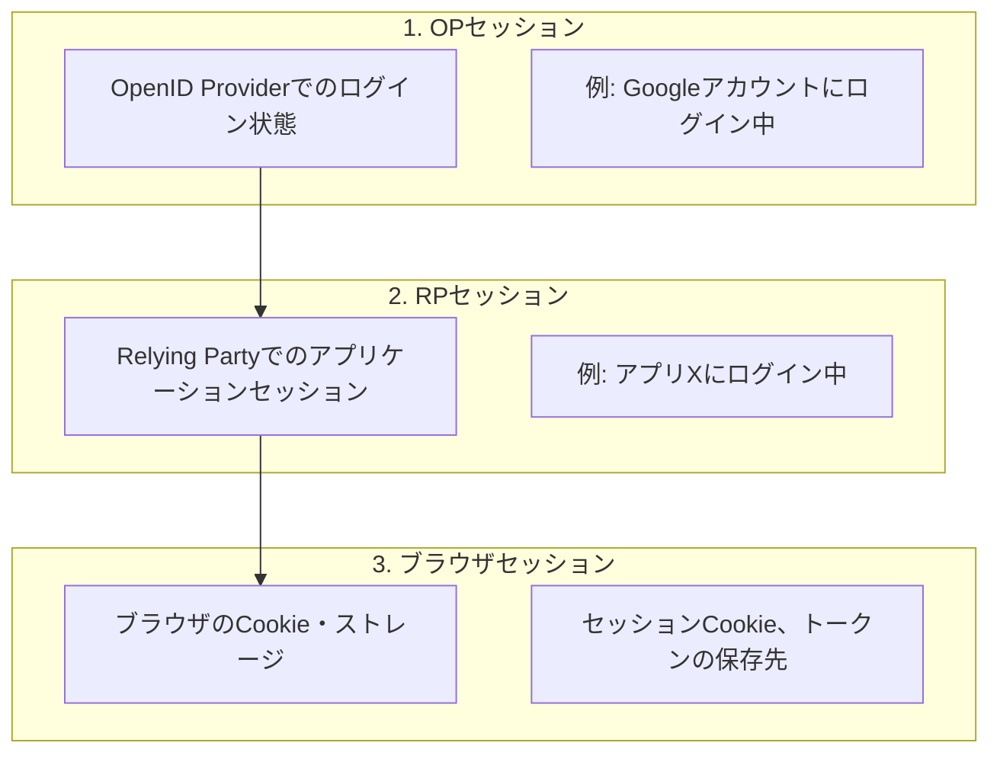

ユーザーが「Googleでログイン」してアプリにログインした場合、Googleとのセッション（OPセッション）とアプリとのセッション（RPセッション）は独立している。Googleからログアウトしてもアプリのセッションは維持されるし、アプリからログアウトしてもGoogleのセッションは維持される。

### 7.2 ログアウトの仕組み

OIDCは複数のログアウト仕様を定義している。

#### RP-Initiated Logout（OpenID Connect RP-Initiated Logout 1.0）

RPがOPに対してログアウトを要求する。ユーザーはOPのログアウトエンドポイントにリダイレクトされる。

```
GET https://op.example.com/logout?
  id_token_hint=eyJ...&
  post_logout_redirect_uri=https://app.example.com/logged-out&
  state=xyz
```

| パラメータ | 説明 |
|-----------|------|
| `id_token_hint` | ログアウト対象のセッションを特定するためのIDトークン |
| `post_logout_redirect_uri` | ログアウト後のリダイレクト先 |
| `state` | CSRF防止用のランダム値 |

#### Back-Channel Logout（OpenID Connect Back-Channel Logout 1.0）

OPがRPのバックチャネルログアウトエンドポイントに対して、ログアウトトークン（JWT）を直接送信する。ユーザーのブラウザを介さないため、確実にRPにログアウトを通知できる。

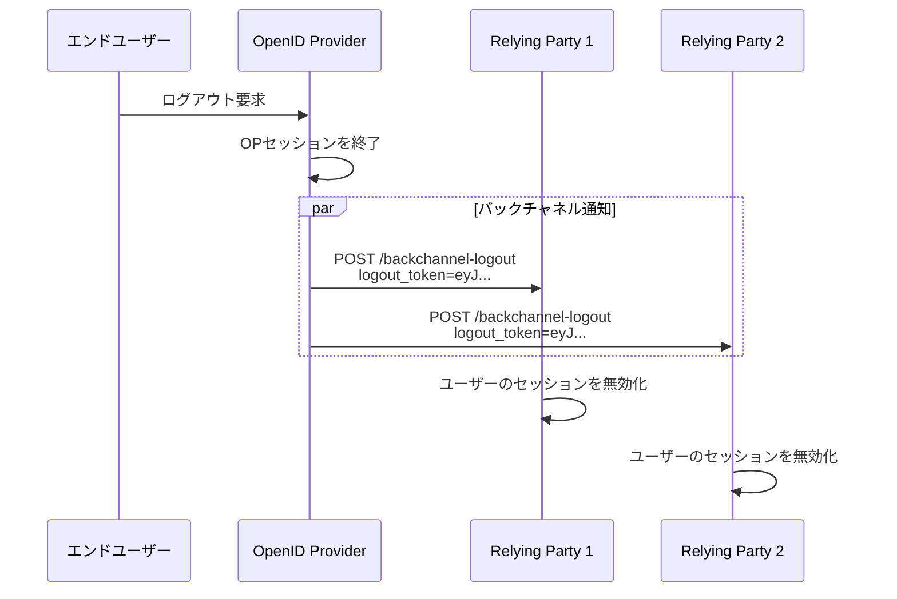

ログアウトトークンは通常のIDトークンと似た構造を持つJWTだが、`events` クレームにログアウトイベントであることを示す情報が含まれる。

#### Front-Channel Logout

OPがブラウザのiframeを使って各RPにログアウトを通知する方式。しかし、サードパーティCookieの制限が厳しくなっている現代のブラウザ環境では信頼性が低下しており、Back-Channel Logoutの方が推奨される。

### 7.3 シングルサインオン（SSO）とシングルログアウト（SLO）

OIDCは自然にシングルサインオン（SSO）を実現する。ユーザーがOP（例: Google）で一度認証を済ませると、OPとのセッションが確立される。その後、別のRPが認証を要求した場合、OPは既存のセッションを利用して再認証なしにIDトークンを発行できる（`prompt=none` パラメータの利用）。

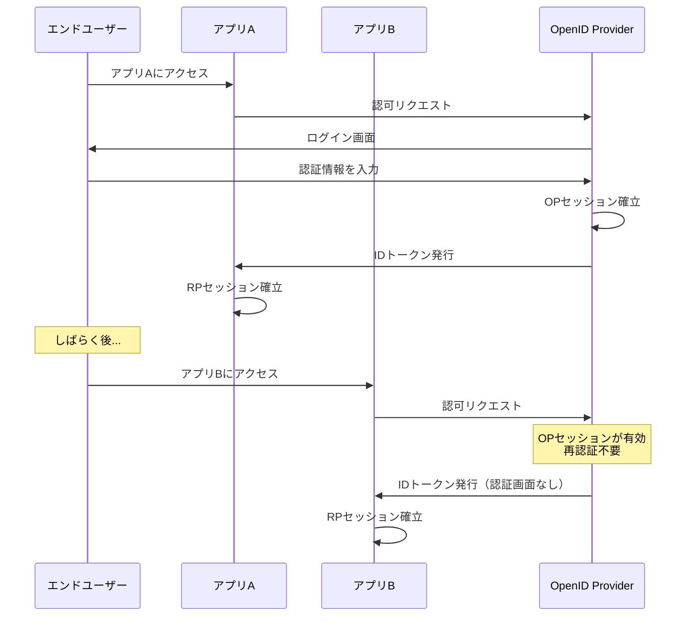

逆方向のシングルログアウト（SLO）は、前述のBack-Channel LogoutやFront-Channel Logoutで実現される。一つのRPまたはOPでログアウトした際に、関連するすべてのRPのセッションを連動して終了する仕組みである。ただし、SLOの実現は技術的に難しく、完全な同期を保証することは困難である点に注意が必要である。

## 8. SAMLとの比較

### 8.1 SAMLの概要

SAML（Security Assertion Markup Language）は、2005年にOASISによって策定されたフェデレーション認証の標準規格である。企業のシングルサインオン（SSO）の世界で長年デファクトスタンダードの地位を占めてきた。OIDCとSAMLは共に「フェデレーション認証」を実現するプロトコルだが、設計思想と技術的アプローチは大きく異なる。

### 8.2 技術的比較

| 観点 | OIDC | SAML 2.0 |
|------|------|----------|
| 策定年 | 2014年 | 2005年 |
| データ形式 | JSON / JWT | XML |
| トランスポート | HTTP REST | HTTP POST / Redirect / SOAP |
| トークン | IDトークン（JWT） | SAMLアサーション（XML + 署名） |
| サイズ | 軽量（数百バイト〜数KB） | 重い（数KB〜数十KB） |
| モバイル対応 | ネイティブ対応 | 不向き（XMLパースの負荷） |
| 暗号ライブラリ | JSON / JWT系 | XML署名 / XML暗号化 |
| 実装の複雑さ | 比較的シンプル | 複雑（XMLの正規化、XPath変換など） |
| Discovery | 標準化（`.well-known`） | メタデータXMLの手動交換が一般的 |
| 主な用途 | Web / モバイル / API | エンタープライズSSO |

### 8.3 SAMLの強みとOIDCの優位性

**SAMLの強み**:

- エンタープライズ環境での長年の実績と広い採用
- 属性マッピングの柔軟性（組織固有の属性を詳細に定義できる）
- Active Directory Federation Services（AD FS）との統合が歴史的に成熟
- XMLの名前空間やスキーマによるアサーションの厳密な型定義

**OIDCの優位性**:

- JSONベースであるため、モダンなWeb技術スタックとの親和性が高い
- トークンサイズが小さく、帯域幅の節約になる
- モバイルアプリやSPAへの組み込みが容易
- OAuth 2.0との統合が自然（認証と認可を一つのフローで処理）
- Discovery機構による設定の自動化
- 実装の複雑さが低い（XML署名の正規化問題がない）

### 8.4 現在のトレンド

2026年現在、新規プロジェクトにおいてはOIDCが標準的な選択肢となっている。ただし、既存のエンタープライズ環境では依然としてSAMLが広く使われており、多くのIdP（Azure AD、Okta、Keycloakなど）は両方のプロトコルをサポートしている。

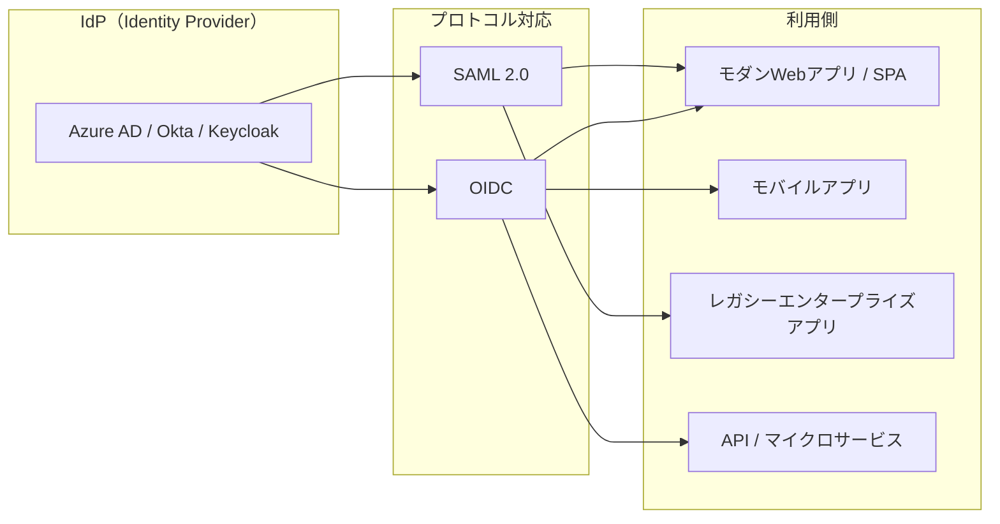

実務的な指針としては、「新規アプリケーションはOIDCを使い、既存のSAML環境との統合が必要な場合のみSAMLをサポートする」というアプローチが一般的である。

## 9. 実世界での採用

### 9.1 主要なOpenID Provider

#### Google

Googleは世界最大級のOpenID Providerである。「Googleでログイン」機能はOIDCに準拠しており、数十億のGoogleアカウントがOIDCの認証基盤として利用可能である。

- Discovery URL: `https://accounts.google.com/.well-known/openid-configuration`
- 署名アルゴリズム: RS256
- サポートするスコープ: `openid`, `profile`, `email`
- 特徴: Google Identity Services（GIS）ライブラリを通じてフロントエンド統合が容易

#### Microsoft（Azure AD / Entra ID）

Microsoft Entra ID（旧Azure Active Directory）は、エンタープライズ環境における主要なOPである。Microsoft 365のアカウントを使ったOIDC認証を提供する。

- Discovery URL: `https://login.microsoftonline.com/{tenant}/v2.0/.well-known/openid-configuration`
- 特徴: マルチテナント対応。組織ごとのテナントIDでDiscovery URLが変わる
- エンタープライズ機能: 条件付きアクセス、多要素認証との統合

#### Apple

Apple ID を使った「Appleでサインイン」もOIDCに準拠している。

- 特徴: ユーザーがメールアドレスの非公開を選択できる「Hide My Email」機能
- 制約: App Store向けアプリでソーシャルログインを提供する場合、Appleでサインインの選択肢も提供することがAppleのガイドラインで要求されている

### 9.2 IdaaSプラットフォーム

独自にOPを構築・運用するのではなく、IDaaS（Identity as a Service）を利用することが一般的である。

| サービス | 特徴 |
|---------|------|
| Auth0（Okta） | 開発者体験に優れたSDKとドキュメント。幅広い言語とフレームワークに対応 |
| Okta | エンタープライズ向けの機能が充実。Workforce Identity（従業員向け）とCustomer Identity（顧客向け）の両方を提供 |
| Firebase Authentication | Googleのモバイル開発プラットフォーム上の認証サービス。セットアップが非常に簡単 |
| AWS Cognito | AWSエコシステムとのネイティブ統合。User PoolsがOIDC準拠のOPとして機能 |
| Keycloak | Red Hat が開発するオープンソースのIdP。オンプレミス環境で自前運用が可能 |

### 9.3 ソーシャルログインの実装パターン

ソーシャルログイン（「Googleでログイン」「Appleでサインイン」など）の実装では、一般的に以下のアーキテクチャが採用される。

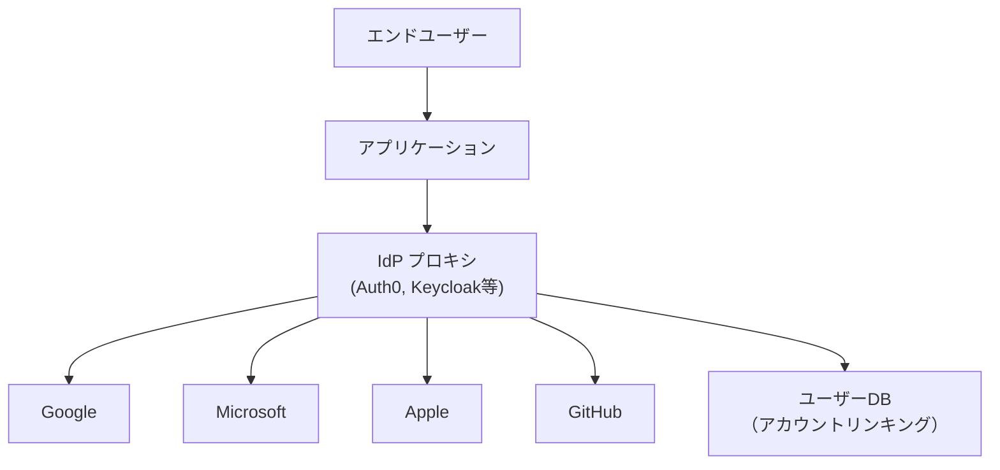

IdPプロキシ（Auth0やKeycloakなど）を間に挟むことで、以下のメリットが得られる。

- アプリケーション側はIdPプロキシとのOIDC接続のみを実装すれば良い
- 新しいソーシャルプロバイダーの追加がIdPプロキシの設定変更のみで完了する
- アカウントリンキング（同一ユーザーの複数プロバイダーアカウントの統合）がIdPプロキシ側で管理できる
- 認証フローのカスタマイズ（多要素認証の追加など）が一箇所で制御できる

### 9.4 実装例: Authorization Code Flow + PKCE

以下は、Node.js（Express）でOIDCのAuthorization Code Flow + PKCEを実装する最小限の例である。概念の理解のためにコードを示す。

```javascript
import express from "express";
import crypto from "crypto";
import jwt from "jsonwebtoken";
import jwksClient from "jwks-rsa";

const app = express();

// Configuration (from discovery document)
const OIDC_CONFIG = {
  issuer: "https://accounts.google.com",
  authorizationEndpoint: "https://accounts.google.com/o/oauth2/v2/auth",
  tokenEndpoint: "https://oauth2.googleapis.com/token",
  jwksUri: "https://www.googleapis.com/oauth2/v3/certs",
  clientId: process.env.GOOGLE_CLIENT_ID,
  clientSecret: process.env.GOOGLE_CLIENT_SECRET,
  redirectUri: "https://app.example.com/callback",
};

// JWKS client for verifying ID token signatures
const jwks = jwksClient({ jwksUri: OIDC_CONFIG.jwksUri });

// Step 1: Initiate login
app.get("/login", (req, res) => {
  // Generate PKCE code verifier and challenge
  const codeVerifier = crypto.randomBytes(32).toString("base64url");
  const codeChallenge = crypto
    .createHash("sha256")
    .update(codeVerifier)
    .digest("base64url");

  // Generate state and nonce
  const state = crypto.randomBytes(16).toString("base64url");
  const nonce = crypto.randomBytes(16).toString("base64url");

  // Store in session (server-side)
  req.session.codeVerifier = codeVerifier;
  req.session.state = state;
  req.session.nonce = nonce;

  // Build authorization URL
  const params = new URLSearchParams({
    response_type: "code",
    client_id: OIDC_CONFIG.clientId,
    redirect_uri: OIDC_CONFIG.redirectUri,
    scope: "openid profile email",
    state: state,
    nonce: nonce,
    code_challenge: codeChallenge,
    code_challenge_method: "S256",
  });

  res.redirect(`${OIDC_CONFIG.authorizationEndpoint}?${params}`);
});

// Step 2: Handle callback
app.get("/callback", async (req, res) => {
  const { code, state } = req.query;

  // Verify state to prevent CSRF
  if (state !== req.session.state) {
    return res.status(403).send("Invalid state");
  }

  // Exchange authorization code for tokens
  const tokenRes = await fetch(OIDC_CONFIG.tokenEndpoint, {
    method: "POST",
    headers: { "Content-Type": "application/x-www-form-urlencoded" },
    body: new URLSearchParams({
      grant_type: "authorization_code",
      code: code,
      redirect_uri: OIDC_CONFIG.redirectUri,
      client_id: OIDC_CONFIG.clientId,
      client_secret: OIDC_CONFIG.clientSecret,
      code_verifier: req.session.codeVerifier,
    }),
  });

  const tokens = await tokenRes.json();

  // Verify ID token
  const idToken = tokens.id_token;
  const decoded = jwt.decode(idToken, { complete: true });

  // Get signing key from JWKS
  const key = await jwks.getSigningKey(decoded.header.kid);

  const verified = jwt.verify(idToken, key.getPublicKey(), {
    algorithms: ["RS256"],
    issuer: OIDC_CONFIG.issuer,
    audience: OIDC_CONFIG.clientId,
    nonce: req.session.nonce,
  });

  // Create application session
  req.session.user = {
    sub: verified.sub,
    email: verified.email,
    name: verified.name,
  };

  // Clean up temporary session data
  delete req.session.codeVerifier;
  delete req.session.state;
  delete req.session.nonce;

  res.redirect("/dashboard");
});
```

このコードのポイントは以下の通りである。

1. **PKCE**: `code_verifier`（ランダム文字列）から`code_challenge`（SHA256ハッシュ）を生成し、認可リクエストとトークンリクエストで対にして送信する
2. **state**: CSRF攻撃を防止するためのランダム値をセッションに保存し、コールバック時に照合する
3. **nonce**: リプレイ攻撃を防止するためのランダム値をIDトークン内の値と照合する
4. **JWKS**: OPの公開鍵をJWKSエンドポイントから取得し、IDトークンの署名を検証する
5. **IDトークンの検証**: `issuer`、`audience`、`nonce` をすべて検証する

## 10. セキュリティ上の考慮事項

### 10.1 主要な攻撃ベクトルと対策

| 攻撃 | 説明 | 対策 |
|------|------|------|
| CSRF攻撃 | 攻撃者が自分のアカウントの認可コードを被害者のブラウザに注入する | `state` パラメータの検証 |
| 認可コード横取り | モバイルアプリでカスタムURLスキームを通じて認可コードが横取りされる | PKCE の使用 |
| リプレイ攻撃 | 過去に傍受されたIDトークンの再利用 | `nonce` の検証、`exp` の短い設定 |
| トークン置換攻撃 | IDトークンとアクセストークンの不正な組み合わせ | `at_hash` クレームの検証 |
| Confused Deputy | 別のRP向けのIDトークンを流用 | `aud` クレームの厳密な検証 |
| Open Redirect | 認可エンドポイントのリダイレクト先を攻撃者のサイトに変更 | `redirect_uri` の厳密な一致検証（ワイルドカード不可） |
| IDトークンの漏洩 | フラグメントやログからIDトークンが漏洩 | Implicit Flowを避け、Authorization Code Flowを使用 |

### 10.2 実装上のベストプラクティス

```
[必須]
□ すべてのクライアントでPKCEを使用する
□ state パラメータを使用してCSRFを防止する
□ nonce をIDトークンで検証する
□ IDトークンの aud クレームを自身のClient IDと照合する
□ IDトークンの iss クレームを期待するOP のURLと照合する
□ IDトークンの署名を検証する（OPの公開鍵を使用）
□ redirect_uri を厳密に一致させる（パターンマッチング不可）
□ client_secret をフロントエンドに含めない
□ すべての通信をHTTPSで行う

[推奨]
□ Implicit Flowを使用しない（Authorization Code Flow + PKCEを使用）
□ IDトークンの有効期限を短く設定する（5〜10分）
□ JWKSの定期的な更新（キャッシュの適切な管理）
□ Back-Channel Logoutを実装する
□ トークンの保存場所を適切に選択する（HttpOnly Cookie推奨）
```

## 11. OIDCの拡張仕様

### 11.1 主要な拡張仕様

OIDCのコア仕様に加えて、特定のユースケースに対応するための拡張仕様が数多く策定されている。

| 仕様 | 概要 |
|------|------|
| OpenID Connect Dynamic Client Registration | RPの動的な登録。事前の手動登録なしにOPにクライアントを登録する |
| OpenID Connect for Identity Assurance | 本人確認の保証レベル（eKYCなど）に関する標準化 |
| OpenID Connect Federation | 信頼の連鎖をベースとしたマルチパーティのフェデレーション |
| Financial-grade API（FAPI） | 金融グレードのセキュリティ要件を満たすためのプロファイル |
| CIBA（Client Initiated Backchannel Authentication） | デバイスを介さない認証フロー（コールセンターなどのユースケース） |

### 11.2 FAPI（Financial-grade API）

FAPI は金融サービスなど高いセキュリティが要求される領域でOIDC/OAuth 2.0を安全に使用するためのプロファイルである。通常のOIDCよりも厳格な要件を定めている。

主な追加要件:

- **Request Object**: 認可リクエストのパラメータをJWTとして署名する（パラメータの改ざん防止）
- **PAR（Pushed Authorization Request）**: 認可リクエストをバックチャネルで事前にOPに送信する
- **JARM（JWT Secured Authorization Response Mode）**: 認可レスポンスをJWTとして署名する
- **mTLS / DPoP**: クライアント認証やトークンバインディングの強化

日本のオープンバンキング（全銀協APIなど）やオーストラリアのConsumer Data Right（CDR）など、各国の金融APIでFAPIプロファイルが採用されている。

### 11.3 Verifiable Credentials と OIDCの将来

OIDCの発展の先には、**Verifiable Credentials**（検証可能な資格情報）と**Self-Sovereign Identity**（自己主権型アイデンティティ）の世界が見えている。OpenID for Verifiable Credentials（OID4VC）は、OIDCのフローを拡張して、ユーザーが自分のウォレットに保持するVerifiable Credentialsを提示するための仕様を策定している。

従来のOIDCでは、ユーザーの情報は常にOPが保持し、OPが提供する。Verifiable Credentialsの世界では、ユーザー自身がCredentialsを保持し、必要に応じて必要な情報だけを選択的に開示する。この考え方は、プライバシーの観点から大きな進歩であると同時に、アイデンティティ管理のパラダイムシフトを意味している。

## 12. まとめ

OpenID Connect は「OAuth 2.0の認可フレームワークの上に、標準化された認証レイヤーを追加する」仕様である。その核心的な価値は以下の三点に集約される。

**1. 認証と認可の明確な分離**: IDトークンによって「この人は誰か」（認証）の問いに答え、アクセストークンによって「何にアクセスできるか」（認可）の問いに答える。OAuth 2.0を認証に流用する際の脆弱性（Confused Deputy Problem）を仕様レベルで解決した。

**2. 相互運用性**: IDトークンのクレーム、UserInfoレスポンスのフォーマット、Discoveryメカニズムが標準化されているため、異なるOP間で共通のRPコードが使い回せる。「Googleでログイン」も「Microsoftでログイン」も、RP側の実装はほぼ同一のコードで対応できる。

**3. セキュリティのベストプラクティスの組み込み**: `nonce` によるリプレイ攻撃防止、`aud` によるトークン流用防止、JWKSによる鍵ローテーションの自動化など、認証に必要なセキュリティ機構がプロトコルレベルで組み込まれている。

ただし、OIDCも銀の弾丸ではない。セッション管理（特にシングルログアウト）の複雑さ、トークンのライフサイクル管理、鍵管理の運用負荷など、実装・運用上の課題は残る。これらの課題に対処するために、Auth0やKeycloakなどのIdaaSやオープンソースのIdPを活用し、認証基盤の構築・運用コストを最小化するアプローチが実務では一般的である。

技術選択の指針として: 新規のWebアプリケーション・モバイルアプリケーションにおいて、ソーシャルログインやSSO を実装する場合、OIDCは事実上の第一選択肢である。実装にあたっては、Authorization Code Flow + PKCEを基本とし、Implicit Flowは避け、IDトークンの検証（issuer、audience、nonce、署名、有効期限）を確実に行うこと。そして、可能な限り成熟したIdaaSやライブラリを活用し、認証基盤の自前実装を避けることが、セキュリティと開発効率の両面から推奨される。
