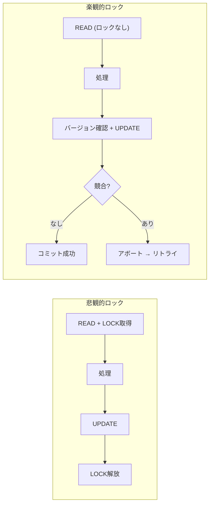
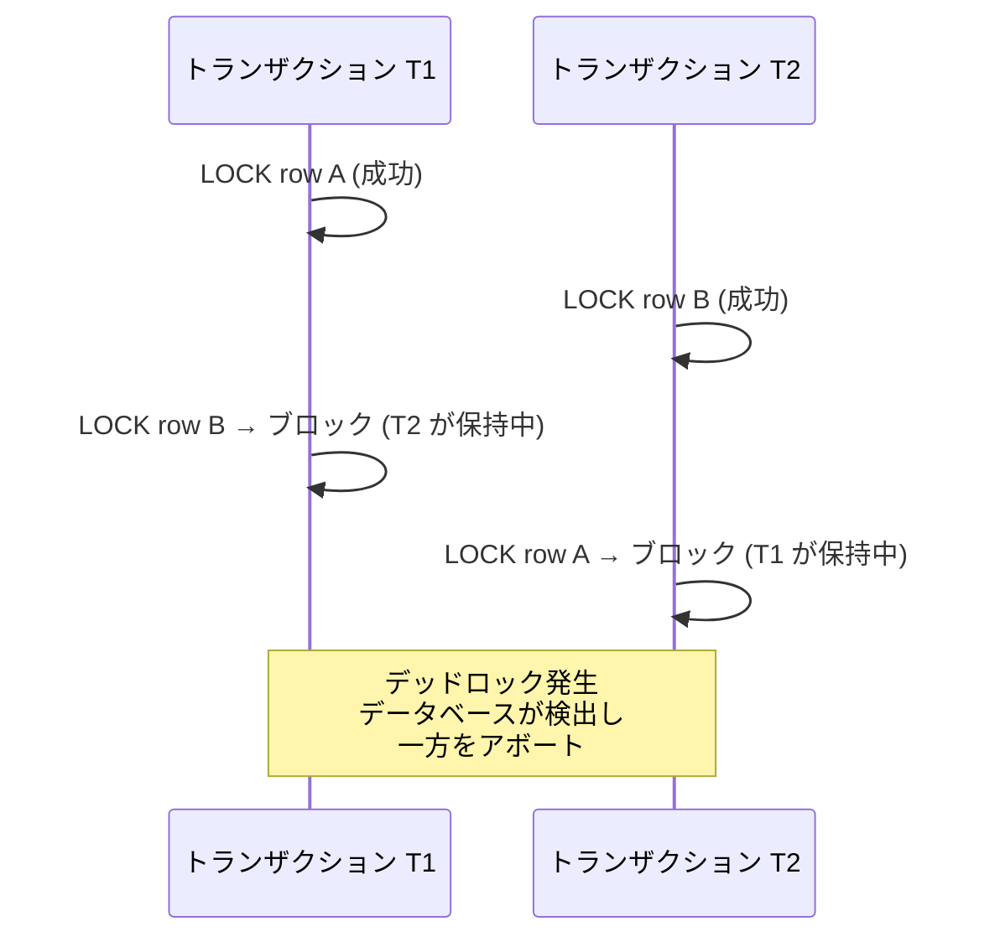
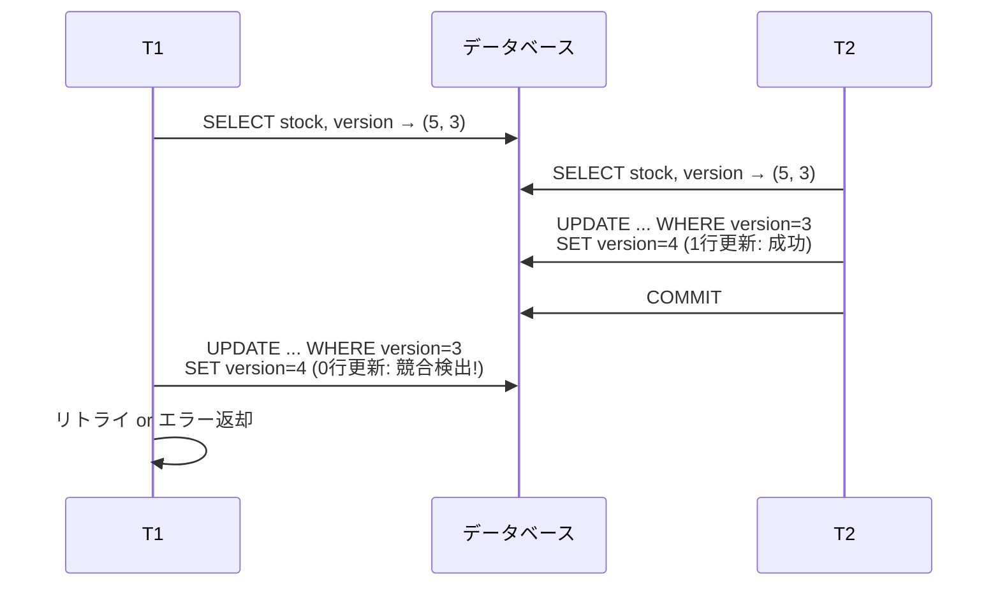
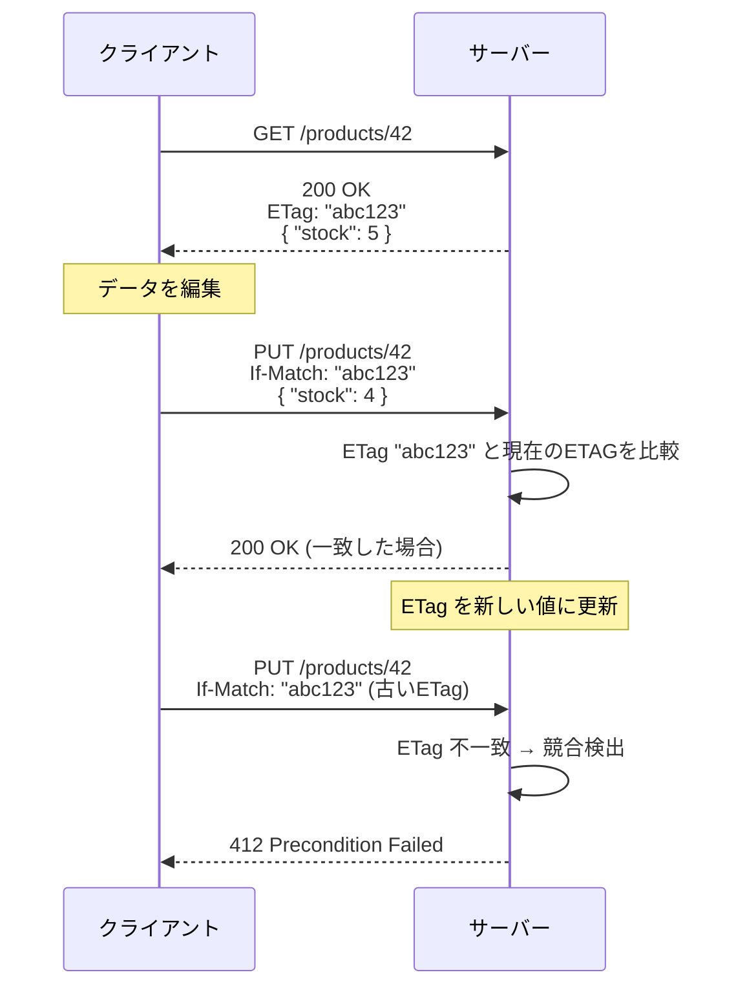
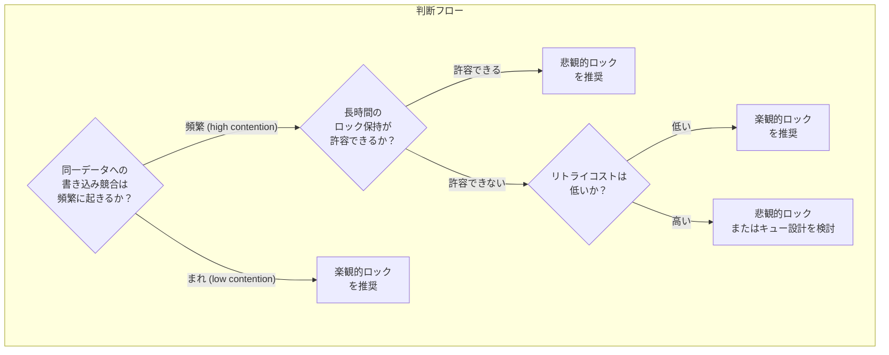
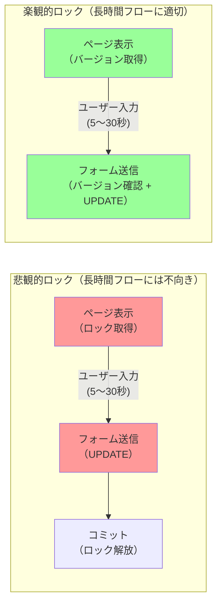
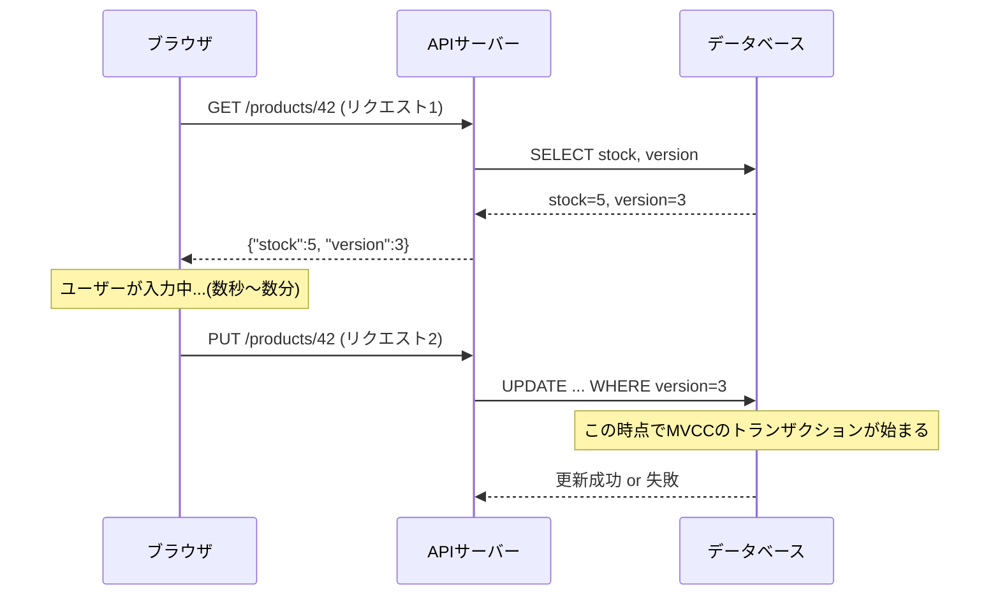
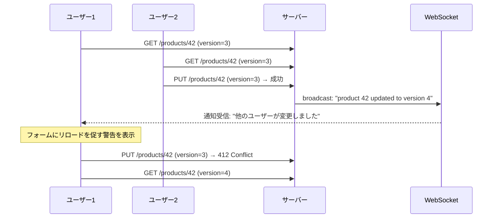
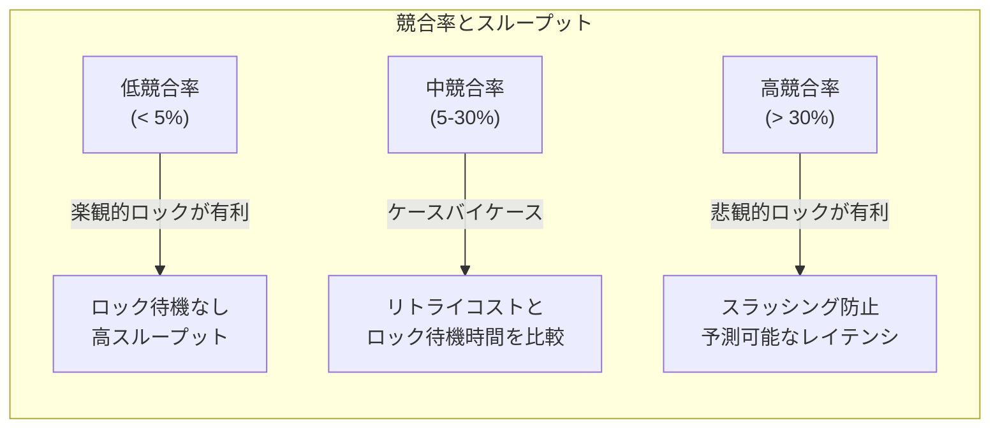

# 楽観的ロック vs 悲観的ロック

## 1. はじめに：並行制御の本質的な問いとロック戦略の二分法

### 1.1 なぜ並行制御が必要か

Webアプリケーションでは、複数のユーザーが同時に同じデータを読み書きすることが日常的に発生する。ECサイトで残り1点の商品に対して2人が同時に「購入する」ボタンを押したとき、在庫数の更新が互いに干渉すれば、在庫が負になる（=存在しない商品が売れる）という整合性の崩壊が起きる。

この問題を**ロストアップデート（Lost Update）**と呼ぶ。2つのトランザクションが同じ行を読み、それぞれが「自分が読んだ値を前提として」更新を書き込むとき、一方の更新がもう一方の更新を上書きして失われる現象である。

```
T1: READ  stock = 1
T2: READ  stock = 1        ← T1 と同じ値を読む
T1: WRITE stock = 0        ← 1 - 1 = 0
T2: WRITE stock = 0        ← T1 の更新を知らずに 1 - 1 = 0
    → 2回分売れたのに在庫は 1 しか減っていない
```

データベースのトランザクション分離レベル（Repeatable Read 以上）を使えばこの問題は自動的に防がれる場合もあるが、実際のアプリケーションでは「データを読んで、アプリケーション層で処理し、書き戻す」という一連の処理が複数のSQLにまたがることが多い。このとき、単純なトランザクションだけでは不十分で、**明示的な並行制御戦略**が必要になる。

### 1.2 楽観的ロックと悲観的ロックの根本的な違い

並行制御の戦略は、「競合が起きるかどうか」についての**仮定（assumption）**によって二分される。

**悲観的ロック（Pessimistic Locking）**: 「競合は頻繁に起きる」と仮定する。したがって、データを読む段階で先にロックを取得し、他のトランザクションが競合するデータにアクセスできないようにする。競合そのものを未然に防ぐアプローチである。

**楽観的ロック（Optimistic Locking）**: 「競合はめったに起きない」と仮定する。ロックを取得せずにデータを読み込み、更新時に「この間に誰かが変更していないか？」を検証する。競合が実際に起きたときだけ処理を中断する（リトライする）アプローチである。



この違いは単なる実装上のテクニックではなく、スループット・レイテンシ・データ整合性のトレードオフに直結する設計判断である。

## 2. 悲観的ロックの仕組み

### 2.1 SELECT FOR UPDATE — 行レベルの排他ロック

SQLにおける悲観的ロックの代表的な構文が `SELECT ... FOR UPDATE` である。この文は、対象行を**読み取りながら同時に排他ロックを取得する**。他のトランザクションはロックが解放されるまで、その行を更新できない（読み取りは可能なことが多い）。

```sql
-- pessimistic locking: lock the row at read time
BEGIN;

SELECT stock
FROM products
WHERE id = 42
FOR UPDATE;               -- acquire exclusive lock on this row

-- application checks stock and decides to purchase

UPDATE products
SET stock = stock - 1
WHERE id = 42;

COMMIT;                   -- lock is released here
```

`FOR UPDATE` を実行した時点で、他のトランザクションが同じ行に `FOR UPDATE` を試みるとブロックされる。これにより、「読んでから書くまでの間に他者が変更する」という競合を物理的に排除する。

### 2.2 ロックモードの種類

行レベルロックには複数のモードがある。PostgreSQLを例にとると以下のとおりである。

| SQL構文 | ロックモード | 別トランザクションの SELECT 許可 | 別トランザクションの FOR UPDATE 許可 |
|:---|:---|:---|:---|
| `SELECT ... FOR UPDATE` | ExclusiveLock | 許可（通常の読み取り） | ブロック |
| `SELECT ... FOR SHARE` | ShareLock | 許可 | ブロック |
| `SELECT ... FOR NO KEY UPDATE` | No Key ExclusiveLock | 許可 | 外部キー行のロックは許可 |
| `SELECT ... FOR KEY SHARE` | Key ShareLock | 許可 | `FOR UPDATE` のみブロック |

`FOR SHARE` は他のトランザクションも共有ロックを取得できるが、更新はブロックする。読み取りの一貫性を確保しつつ、更新を防ぎたい場合に用いる。

### 2.3 NOWAIT と SKIP LOCKED

ロックの取得がブロックされるのではなく、即座にエラーを返してほしい場合は `NOWAIT` を、ロック済みの行を読み飛ばしてほしい場合は `SKIP LOCKED` を使う。

```sql
-- NOWAIT: raise error immediately if lock cannot be acquired
SELECT * FROM jobs WHERE status = 'pending' FOR UPDATE NOWAIT;

-- SKIP LOCKED: skip rows that are already locked (useful for job queues)
SELECT * FROM jobs
WHERE status = 'pending'
LIMIT 1
FOR UPDATE SKIP LOCKED;
```

`SKIP LOCKED` はジョブキューの実装で特に有用である。複数のワーカーが同じキューから並行してジョブを取り出す場合、各ワーカーは他のワーカーが処理中のジョブをスキップして、ロックされていないジョブのみを取得できる。

### 2.4 テーブルロック

行ロックよりも粗い粒度として**テーブルロック**がある。テーブル全体をロックするため、同テーブルへのすべての操作をブロックできる。スキーマ変更（DDL）や、テーブル全体のバッチ処理で一貫性を確保したい場合に使う。

```sql
-- table-level lock (PostgreSQL)
LOCK TABLE products IN EXCLUSIVE MODE;

-- MySQL
LOCK TABLES products WRITE;
-- ... operations ...
UNLOCK TABLES;
```

テーブルロックは並行性を大きく損なうため、オンライントランザクション処理（OLTP）では一般に避けるべきである。

### 2.5 デッドロックとの関係

悲観的ロックの最大のリスクが**デッドロック**である。2つのトランザクションが互いに相手のロックが解放されるのを待ち続ける状態を指す。



デッドロック発生時、データベースは待機グラフ（Wait-For Graph）のサイクルを検出し、犠牲となるトランザクションを選んでアボートする。アプリケーションはデッドロックによるアボートを検知し、リトライを実装する必要がある。

デッドロックを回避するための実践的な指針は以下のとおりである。

- **ロック取得の順序を統一する**: 常に同じ順序でリソースにアクセスする（例: 必ず `users → accounts` の順でロック）
- **トランザクションを短くする**: ロック保持時間を最小化する
- **ロックの粒度を下げる**: 可能な限り行ロックを使い、テーブルロックを避ける
- **タイムアウトを設定する**: 無期限のブロックを防ぐために `lock_timeout` を設定する

```sql
-- set lock timeout (PostgreSQL)
SET lock_timeout = '5s';

-- set lock timeout (MySQL)
SET innodb_lock_wait_timeout = 5;
```

## 3. 楽観的ロックの仕組み

### 3.1 バージョン番号による楽観的ロック

楽観的ロックの最も一般的な実装が**バージョン番号（version number）**による方式である。テーブルに `version` カラムを追加し、行が更新されるたびに値をインクリメントする。

```sql
-- schema with version column
CREATE TABLE products (
    id          BIGINT PRIMARY KEY,
    name        VARCHAR(255) NOT NULL,
    stock       INTEGER NOT NULL,
    version     INTEGER NOT NULL DEFAULT 0
);
```

更新時には、「自分が読んだときのバージョン番号」と「現在のバージョン番号」が一致するかどうかを WHERE 句で検証する。

```sql
-- step 1: read the row (no lock)
SELECT id, stock, version FROM products WHERE id = 42;
-- returns: stock=5, version=3

-- step 2: application processing (no database lock held)
-- ...

-- step 3: update with version check
UPDATE products
SET    stock   = 4,
       version = version + 1
WHERE  id      = 42
AND    version = 3;         -- verify that version hasn't changed

-- check affected rows
-- if 0 rows affected → conflict detected → retry
```

`WHERE version = 3` という条件が「競合を検出するセンサー」の役割を果たす。他のトランザクションが先にコミットしてバージョンを3から4に変えていた場合、この UPDATE の影響行数は0になる。アプリケーションはこれを検知して競合が発生したと判断し、最初からやり直す。



この仕組みが有効な理由は、`UPDATE ... WHERE version = :expected` という操作が**データベースレベルでアトミック**だからである。「バージョンを確認して更新する」という2つの動作が不可分に行われるため、確認と更新の間に割り込まれる余地がない。

### 3.2 タイムスタンプによる楽観的ロック

バージョン番号の代わりに**タイムスタンプ**を使う方式もある。行が最後に更新された日時を記録し、更新時にそのタイムスタンプが変わっていないかを検証する。

```sql
-- schema with timestamp
CREATE TABLE products (
    id           BIGINT PRIMARY KEY,
    stock        INTEGER NOT NULL,
    updated_at   TIMESTAMP(6) NOT NULL DEFAULT CURRENT_TIMESTAMP
);

-- read
SELECT id, stock, updated_at FROM products WHERE id = 42;
-- returns: stock=5, updated_at='2026-03-02 10:00:00.123456'

-- update with timestamp check
UPDATE products
SET    stock      = 4,
       updated_at = CURRENT_TIMESTAMP
WHERE  id         = 42
AND    updated_at = '2026-03-02 10:00:00.123456';
```

タイムスタンプ方式はバージョン番号方式と本質的に同じだが、注意点がある。タイムスタンプの精度が低い場合（例: 秒単位）、同じ1秒以内に2つの更新が発生したとき、両方が同じタイムスタンプで更新されてしまい競合を見逃す可能性がある。**バージョン番号方式の方が信頼性が高い**。

::: warning タイムスタンプ精度の落とし穴
タイムスタンプをバージョンの代替として使う場合、マイクロ秒以上の精度が必要である。さらに、分散環境では複数ノード間のクロックスキューにより、タイムスタンプの大小関係が更新の論理的な順序を正確に反映しない可能性がある。安全のためには、整数インクリメントのバージョン番号を使うことを推奨する。
:::

### 3.3 チェックサム・ハッシュによる方式

バージョンカラムを追加できないテーブルに対しては、行全体のハッシュ値を使う方式もある。読み取り時に関心のあるカラムのハッシュを計算し、更新時に現在のハッシュと照合する。

```sql
-- check entire row contents match what was read
UPDATE products
SET    stock = 4
WHERE  id    = 42
AND    stock = 5         -- verify the specific value we read
AND    name  = 'Widget'; -- include all columns we care about
```

この方式はバージョンカラムを追加できないレガシーシステムで有用だが、比較するカラム数が増えると WHERE 句が冗長になる。

## 4. ORMでの実装

### 4.1 JPA / Hibernate の @Version

Java Persistence API (JPA) では `@Version` アノテーションによって楽観的ロックが宣言的に利用できる。

```java
@Entity
@Table(name = "products")
public class Product {

    @Id
    @GeneratedValue(strategy = GenerationType.IDENTITY)
    private Long id;

    private String name;
    private int stock;

    // JPA automatically increments version on each update
    @Version
    private int version;

    // getters and setters
}
```

```java
// usage example
@Transactional
public void purchase(Long productId) {
    Product product = em.find(Product.class, productId);

    if (product.getStock() <= 0) {
        throw new OutOfStockException();
    }

    product.setStock(product.getStock() - 1);
    // JPA issues: UPDATE products SET stock=?, version=?+1
    //             WHERE id=? AND version=?
    // Throws OptimisticLockException if version mismatch
}
```

競合が発生すると JPA は `javax.persistence.OptimisticLockException` をスローする。アプリケーションはこれをキャッチしてリトライするか、ユーザーにエラーを返す。

```java
// retry pattern
@Transactional(noRollbackFor = OptimisticLockException.class)
public void purchaseWithRetry(Long productId, int maxRetries) {
    for (int attempt = 0; attempt < maxRetries; attempt++) {
        try {
            purchase(productId);
            return;
        } catch (OptimisticLockException e) {
            if (attempt == maxRetries - 1) {
                throw new ConcurrentModificationException(
                    "Update conflict after " + maxRetries + " retries", e
                );
            }
            // clear the entity manager before retry
            em.clear();
        }
    }
}
```

Hibernate は `@Version` が付与されたフィールドに対して、SQL レベルで `WHERE id = ? AND version = ?` という条件を自動生成する。開発者は競合検出のロジックを明示的に書く必要がない。

### 4.2 Rails の lock_version

Ruby on Rails の ActiveRecord は `lock_version` という特定のカラム名を持つテーブルで自動的に楽観的ロックを有効にする。

```ruby
# migration
class AddLockVersionToProducts < ActiveRecord::Migration[7.1]
  def change
    add_column :products, :lock_version, :integer, default: 0, null: false
  end
end
```

```ruby
# model
class Product < ApplicationRecord
  # lock_version column is automatically detected
  # no explicit configuration needed
end
```

```ruby
# usage
product = Product.find(42)
product.stock -= 1
product.save!
# Rails generates: UPDATE products
#                  SET stock = 4, lock_version = lock_version + 1
#                  WHERE id = 42 AND lock_version = 3
```

競合が発生すると `ActiveRecord::StaleObjectError` が発生する。

```ruby
# conflict handling
begin
  product = Product.find(42)
  product.stock -= 1
  product.save!
rescue ActiveRecord::StaleObjectError => e
  # reload and retry
  product.reload
  retry
end
```

Rails では `optimistic_locking_enabled?` や `locking_column` をオーバーライドすることで、楽観的ロックの挙動をカスタマイズできる。

### 4.3 Django の条件付き更新

Django は ORM レベルで `update()` と `F()` オブジェクトを組み合わせることで楽観的ロックに近い挙動を実現できる。専用のバージョンフィールドサポートは標準では提供されていないが、以下のパターンで実装できる。

```python
from django.db import models
from django.db.models import F

class Product(models.Model):
    name = models.CharField(max_length=255)
    stock = models.IntegerField()
    version = models.IntegerField(default=0)

    class Meta:
        db_table = 'products'
```

```python
# optimistic lock implementation in Django
def purchase_product(product_id):
    # read phase (no lock)
    product = Product.objects.get(id=product_id)

    if product.stock <= 0:
        raise OutOfStockError()

    # update with version check (atomic at database level)
    updated = Product.objects.filter(
        id=product_id,
        version=product.version  # the version we read
    ).update(
        stock=F('stock') - 1,
        version=F('version') + 1
    )

    if updated == 0:
        # conflict: version has changed
        raise OptimisticLockError("Concurrent modification detected")
```

Django の `django-concurrency` などのサードパーティライブラリを使うと、JPA の `@Version` に近い宣言的なインターフェースが利用できる。

```python
# using django-concurrency
from concurrency.fields import IntegerVersionField

class Product(models.Model):
    name = models.CharField(max_length=255)
    stock = models.IntegerField()
    version = IntegerVersionField()  # auto-managed version field
```

## 5. HTTPにおける楽観的並行制御

### 5.1 ETag と If-Match ヘッダ

楽観的ロックの概念はHTTPプロトコルにも組み込まれている。**ETag（Entity Tag）**はリソースのバージョンを識別するトークンであり、リソースが変更されるたびに新しい値が生成される。

典型的なフローは以下のとおりである。



```http
# step 1: GET resource
GET /products/42 HTTP/1.1

# response
HTTP/1.1 200 OK
ETag: "abc123"
Content-Type: application/json

{"id": 42, "stock": 5, "version": 3}
```

```http
# step 2: conditional PUT
PUT /products/42 HTTP/1.1
If-Match: "abc123"
Content-Type: application/json

{"stock": 4}
```

```http
# response on conflict
HTTP/1.1 412 Precondition Failed
Content-Type: application/json

{"error": "The resource has been modified by another request"}
```

ETag はリソースのハッシュ値、バージョン番号、タイムスタンプなどで生成できる。重要なのは**リソースが変更されるたびに値が変わる**という性質を持つことである。

### 5.2 サーバーサイドでのETag実装

```python
# Flask example: ETag-based optimistic locking
import hashlib
from flask import Flask, request, jsonify, make_response, abort

app = Flask(__name__)

def compute_etag(product):
    """Compute ETag from product data."""
    content = f"{product['id']}:{product['version']}"
    return hashlib.md5(content.encode()).hexdigest()

@app.route('/products/<int:product_id>', methods=['GET'])
def get_product(product_id):
    product = db.get_product(product_id)
    etag = compute_etag(product)

    response = make_response(jsonify(product))
    response.headers['ETag'] = f'"{etag}"'
    return response

@app.route('/products/<int:product_id>', methods=['PUT'])
def update_product(product_id):
    if_match = request.headers.get('If-Match')
    if not if_match:
        abort(428)  # Precondition Required

    current = db.get_product(product_id)
    current_etag = f'"{compute_etag(current)}"'

    # compare ETags
    if if_match != current_etag:
        abort(412)  # Precondition Failed

    # update the product
    updated = db.update_product(product_id, request.json)
    new_etag = compute_etag(updated)

    response = make_response(jsonify(updated))
    response.headers['ETag'] = f'"{new_etag}"'
    return response
```

### 5.3 If-None-Match と条件付きGET

ETag は更新だけでなく、**条件付き取得**にも使える。`If-None-Match` ヘッダを使うと、リソースが変更されていない場合に `304 Not Modified` を返してデータ転送を節約できる。

```http
# conditional GET: only return body if ETag changed
GET /products/42 HTTP/1.1
If-None-Match: "abc123"

# response if unchanged
HTTP/1.1 304 Not Modified

# response if changed
HTTP/1.1 200 OK
ETag: "xyz789"
Content-Type: application/json

{"id": 42, "stock": 3, "version": 5}
```

これはキャッシュの有効性検証に広く使われている仕組みであり、CDNやブラウザキャッシュのコア機能でもある。

### 5.4 REST APIでの競合戦略

REST API において競合が発生した場合の応答戦略は2種類ある。

**クライアントに差分情報を返す**: 競合した場合に、現在のサーバー側のデータを `409 Conflict` レスポンスのボディに含めて返すことで、クライアントが差分を手動でマージできるようにする。

```http
HTTP/1.1 409 Conflict
Content-Type: application/json

{
  "error": "conflict",
  "message": "Resource was modified by another request",
  "current_version": {
    "id": 42,
    "stock": 2,
    "version": 5,
    "etag": "xyz789"
  }
}
```

**楽観的マージ**: マージ可能な変更であればサーバー側で自動的にマージし、コンフリクトした場合のみエラーを返す。Git のマージ戦略に近い考え方であり、共同編集システムなどで応用される。

## 6. 楽観的ロックと悲観的ロックの使い分け

### 6.1 競合頻度による判断

2つの戦略を選ぶ最大の軸は**競合頻度**である。



競合頻度が高い状況で楽観的ロックを使うと、**スラッシング（thrashing）**が発生する。多くのトランザクションがリトライを繰り返し、実際に成功するものがわずかになってしまう。このような状況では悲観的ロックの方がスループットが高くなる。

逆に、競合がめったに起きない状況で悲観的ロックを使うと、不要なロック競合でスループットが下がる。

### 6.2 レイテンシ要件による判断

悲観的ロックは「読んでから書くまでの間ずっとロックを保持する」ため、**ロック保持時間がトランザクション全体の時間に等しい**。ユーザーが画面上で10秒かけて入力フォームを埋める間もロックが保持されるような設計は、データベースリソースの無駄遣いになる。

このような「人間の操作を挟む長時間の処理フロー」では楽観的ロックが適している。



### 6.3 リトライコストによる判断

楽観的ロックのコストは「競合が発生したときのリトライ」である。リトライのコストが高い場合（例: 外部APIの呼び出しを含む処理、副作用を持つ操作）は、楽観的ロックの採用に注意が必要である。

**楽観的ロックが適するケース**:
- 読み取りが多く書き込みが少ないワークロード
- 同一データへの競合がまれな場合
- 人間の操作を挟む長時間フロー
- 分散システムでロック管理が困難な場合
- マイクロサービス間での整合性確保

**悲観的ロックが適するケース**:
- 在庫管理、座席予約など競合頻度が高い場合
- 「読んでから決める」処理が短く収まる場合
- トランザクション内で副作用（メール送信、外部API呼び出しなど）がある場合
- 高い整合性保証が求められ、リトライ失敗が許容できない場合

::: tip 実際の選択指針
迷ったら楽観的ロックから始めることが多い。スループットが高く、デッドロックが発生しない。競合が多発してスラッシングが起きていることが計測で確認できた場合に、悲観的ロックへの移行を検討する。
:::

## 7. リトライ戦略

### 7.1 単純リトライ

楽観的ロックで競合が発生した場合の最も単純な対処は、即座にリトライすることである。

```python
def purchase_with_retry(product_id, max_retries=3):
    for attempt in range(max_retries):
        try:
            return do_purchase(product_id)
        except OptimisticLockError:
            if attempt == max_retries - 1:
                raise
            # immediately retry
    raise RuntimeError("Unreachable")
```

しかし単純リトライはリトライストームを引き起こす可能性がある。多数のクライアントが同時にリトライすると、競合がさらに悪化する。

### 7.2 指数バックオフとジッター

**指数バックオフ（Exponential Backoff）**は、リトライのたびに待機時間を指数的に増やす戦略である。**ジッター（Jitter）**を加えることで、複数のクライアントが一斉にリトライすることによるリトライストームを防ぐ。

```python
import time
import random

def purchase_with_backoff(product_id, max_retries=5):
    for attempt in range(max_retries):
        try:
            return do_purchase(product_id)
        except OptimisticLockError as e:
            if attempt == max_retries - 1:
                raise

            # exponential backoff: 2^attempt * 100ms
            base_wait = (2 ** attempt) * 0.1

            # add full jitter to avoid thundering herd
            jitter = random.uniform(0, base_wait)
            wait_time = base_wait + jitter

            time.sleep(wait_time)
```

AWS の Exponential Backoff and Jitter に関するブログポストでは、Full Jitter が最もスループットの安定性が高いことが示されている。

### 7.3 リトライ不要な設計

最も根本的な対策は、そもそもリトライが不要な形にSQLを書くことである。アプリケーション層で読み取ってから書き戻すのではなく、**データベース層でアトミックな更新を行う**ことで競合を回避できる。

```sql
-- anti-pattern: read-modify-write (requires retry logic)
-- step 1: SELECT stock FROM products WHERE id = 42;  → 5
-- step 2: stock = 5 - 1 = 4
-- step 3: UPDATE products SET stock = 4 WHERE id = 42 AND version = 3;

-- better: atomic conditional update (no retry needed in many cases)
UPDATE products
SET    stock = stock - 1
WHERE  id    = 42
AND    stock > 0;          -- guard condition: prevent negative stock

-- check affected rows: 0 = out of stock, 1 = success
```

この方式では読み取りと書き込みが分離されていないため、バージョン番号による競合検出は不要になる。ただし、「読んだ値を使ってビジネスロジックを実行してから書き込む」場合には使えない。

### 7.4 楽観的ロックのリトライとべき等性

リトライを実装する際は**べき等性（Idempotency）**に注意が必要である。同じ操作を2回実行しても、結果が変わらないように設計する。

```python
# idempotent purchase using idempotency key
def purchase_idempotent(product_id, idempotency_key, max_retries=3):
    for attempt in range(max_retries):
        # check if this operation already succeeded
        existing = db.find_purchase(idempotency_key)
        if existing:
            return existing  # already completed, return result

        try:
            return do_purchase(product_id, idempotency_key)
        except OptimisticLockError:
            if attempt == max_retries - 1:
                raise
```

## 8. 分散環境における楽観的ロック

### 8.1 分散システムでの楽観的ロックの利点

マイクロサービスや分散データベースを使うシステムでは、悲観的ロックを実装すること自体が困難なケースがある。サービスをまたいでロックを保持することはネットワーク障害のリスクを抱え、1つのサービスがクラッシュしたときにロックが解放されない可能性がある。

楽観的ロックはロック保持が不要なため、**サービス間の依存関係を減らし、部分障害への耐性を高める**。

### 8.2 DynamoDB の条件付き書き込み

AWS DynamoDB は `ConditionExpression` による楽観的ロックを標準でサポートしている。

```python
import boto3
from botocore.exceptions import ClientError

dynamodb = boto3.resource('dynamodb')
table = dynamodb.Table('Products')

def purchase_product(product_id):
    # read the current item
    response = table.get_item(Key={'id': product_id})
    item = response['Item']
    current_version = item['version']

    try:
        # conditional update: only proceed if version matches
        table.update_item(
            Key={'id': product_id},
            UpdateExpression='SET stock = stock - :delta, version = version + :one',
            ConditionExpression='version = :expected AND stock > :zero',
            ExpressionAttributeValues={
                ':delta': 1,
                ':one': 1,
                ':expected': current_version,
                ':zero': 0
            }
        )
    except ClientError as e:
        if e.response['Error']['Code'] == 'ConditionalCheckFailedException':
            raise OptimisticLockError("Concurrent modification detected")
        raise
```

DynamoDB の条件付き書き込みはアトミックに実行されるため、競合を確実に検出できる。

### 8.3 Redis を使った分散楽観的ロック

Redis の WATCH/MULTI/EXEC コマンドを使うと、楽観的ロックをアプリケーション側で実装できる。

```python
import redis

r = redis.Redis()

def purchase_product_redis(product_id, max_retries=3):
    key = f"product:{product_id}"

    for attempt in range(max_retries):
        with r.pipeline() as pipe:
            try:
                # watch the key: if it changes, EXEC will fail
                pipe.watch(key)

                product = pipe.hgetall(key)
                stock = int(product[b'stock'])

                if stock <= 0:
                    raise OutOfStockError()

                # start transaction
                pipe.multi()
                pipe.hset(key, 'stock', stock - 1)
                pipe.execute()   # fails if watched key was modified

                return  # success
            except redis.WatchError:
                # key was modified during our transaction → retry
                if attempt == max_retries - 1:
                    raise OptimisticLockError("Too many conflicts")
                continue
```

WATCH コマンドは「次の EXEC まで、この key が変更されたらトランザクションを中断する」という監視を設定する。これは Redis 独自の楽観的ロック機構であり、`SELECT ... FOR UPDATE` を使えない Redis での典型的なパターンである。

### 8.4 分散楽観的ロックの課題

分散環境での楽観的ロックには固有の課題がある。

**ネットワーク分断による不確実性**: 書き込みが成功したかどうかをクライアントが知る前にネットワーク障害が発生すると、「コミットされたかどうか不明」な状態になる。この場合、再実行すれば二重操作になる可能性があるため、べき等性の確保が必須である。

**クロック同期**: タイムスタンプベースの楽観的ロックを分散システムで使う場合、ノード間のクロックスキューが競合検出の誤りを引き起こす。Hybrid Logical Clock (HLC) などの技術が解決策として提案されている。

**スキュー**: 複数のノードにまたがる楽観的ロックでは、Write Skew（書き込みスキュー）が依然として発生しうる。2つのトランザクションが別々のノードのデータを読んで、それぞれが別のノードに書き込む場合、組み合わせとして整合性制約が壊れる可能性がある。

## 9. 楽観的ロックとMVCCの関係

### 9.1 MVCCは楽観的ロックの一形態

データベースが提供する **MVCC（Multi-Version Concurrency Control）** は、楽観的な並行制御の哲学を体現している。MVCCでは、読み取りトランザクションはロックを取得せず、スナップショット（特定時点のデータバージョン）を参照する。書き込みは新しいバージョンを作成することで、読み取りと書き込みが互いにブロックしない。

MVCCが提供する **Snapshot Isolation** は、楽観的ロックの「競合はまれと仮定してロックなしで読む」という思想に基づいている。ただし、書き込み同士の競合（Write-Write Conflict）に対しては、First-Committer-Wins ルールにより後から来たトランザクションをアボートする。これは楽観的ロックのリトライに相当する。

### 9.2 アプリケーションレベルの楽観的ロックとMVCCの違い

重要な点は、MVCCが提供するアトミック性はトランザクション境界内（つまり1つの `BEGIN ... COMMIT` 内）に限られることである。「読んで、アプリケーション層で処理し、書き戻す」という流れが複数のHTTPリクエストにまたがる場合、データベースのMVCCだけでは競合を防げない。



この図のように、リクエスト1とリクエスト2の間にはデータベーストランザクションが存在しない。データベースのMVCCは各リクエストのトランザクション内の整合性しか保証しない。複数リクエストにまたがる並行制御には、バージョン番号や ETag を使ったアプリケーションレベルの楽観的ロックが必要になる。

## 10. 実装上の落とし穴と注意事項

### 10.1 ABA問題

楽観的ロックにおける潜在的な落とし穴が **ABA問題** である。バージョン番号が「A → B → A」と変化した場合、最終的にバージョンが元に戻っているため、競合が起きていないように見えてしまう。

```
T1: READ  version=1, data=A
T2:       version=1→2 (A→B)
T3:       version=2→1 (B→A)   ← ダウングレードまたはリセット
T1: WRITE WHERE version=1 → 条件が一致してしまう！
    しかし T2, T3 の変更を見逃している
```

整数インクリメントのバージョン番号を使う場合、バージョンが減少することはないため、通常この問題は発生しない。しかし、バージョンをリセットするような操作がある場合や、タイムスタンプを使う場合は注意が必要である。UUID などの一意識別子をバージョンとして使う（変更のたびに新しい UUID を生成する）ことでこの問題を完全に回避できる。

### 10.2 楽観的ロックとデータベーストランザクション分離レベルの組み合わせ

アプリケーションレベルの楽観的ロックを使う場合でも、データベースの分離レベルは重要である。

`READ COMMITTED` 分離レベルでは、楽観的ロックの更新クエリが実行された時点の最新コミット値を読む。これは通常期待どおりに動作する。

しかし `SERIALIZABLE` 分離レベルでは、楽観的ロックの更新クエリが「トランザクション開始時点のスナップショット」を使うため、WHERE 条件の評価に使われるデータが更新前のものになる場合がある。この場合、期待する競合検出が機能しないケースがあるため、分離レベルと楽観的ロックの実装を慎重に組み合わせる必要がある。

### 10.3 バルク更新での楽観的ロック

一度に複数行を更新するバルク操作では、楽観的ロックの適用が複雑になる。

```sql
-- bulk update with optimistic lock: check all versions first
UPDATE products
SET    stock   = CASE id
                     WHEN 1 THEN 10
                     WHEN 2 THEN 20
                 END,
       version = version + 1
WHERE  (id = 1 AND version = 3)
OR     (id = 2 AND version = 7);

-- problem: if only 1 row is updated (partial match),
-- we cannot tell which row had a conflict
```

バルク操作では影響行数を確認するだけでは不十分で、どの行が競合したかを特定できない。解決策として、各行を個別に更新するか、UPDATE ... RETURNING を使って更新された行を確認する方法がある。

```sql
-- PostgreSQL: use RETURNING to check which rows were actually updated
UPDATE products
SET    stock   = CASE id WHEN 1 THEN 10 WHEN 2 THEN 20 END,
       version = version + 1
WHERE  (id = 1 AND version = 3)
OR     (id = 2 AND version = 7)
RETURNING id;

-- if returned ids don't include all expected ids, detect which ones conflicted
```

### 10.4 long-polling / WebSocket でのリアルタイム競合通知

楽観的ロックのUXを改善するために、競合が発生した際にリアルタイムでクライアントに通知する仕組みを組み合わせることがある。



Google Docs に代表される共同編集システムは、この仕組みをさらに発展させた **Operational Transformation (OT)** や **CRDT（Conflict-free Replicated Data Type）** を使い、競合を自動的にマージする。

## 11. パフォーマンス特性と計測

### 11.1 競合率とスループットの関係

競合率（同一データへの書き込み競合が発生する割合）に応じた、楽観的ロックと悲観的ロックのスループット特性を理解しておくことは重要である。



競合率はワークロードの実測によってのみ正確に把握できる。以下のメトリクスを計測して判断することを推奨する。

- **楽観的ロックのリトライ率**: `(リトライ回数) / (合計更新試行回数)`
- **悲観的ロックの平均待機時間**: ロック取得待ちのレイテンシ
- **デッドロック発生率**: 単位時間あたりのデッドロック検出数

### 11.2 SKIP LOCKED によるキュー処理のスループット改善

悲観的ロックを使いながらもスループットを確保する重要なパターンが、`SKIP LOCKED` を使ったキュー処理である。

```sql
-- high-throughput job queue with SKIP LOCKED
SELECT id, payload
FROM   job_queue
WHERE  status = 'pending'
ORDER  BY created_at
LIMIT  1
FOR UPDATE SKIP LOCKED;
```

このパターンにより、複数のワーカーが同じジョブキューから並行してジョブを取り出せる。各ワーカーが取得するジョブは必ず異なるため、競合が発生しない。PostgreSQL, MySQL (8.0+), Oracle がこの機能をサポートしている。

## 12. まとめ

### 12.1 2つの戦略の本質

楽観的ロックと悲観的ロックは、競合という現象に対する**哲学の違い**を反映している。

悲観的ロックは「競合は必ず起きる。だから事前に防ぐ」という考えに基づく。ロックという強い保証を取得することで、競合による不整合を完全に防ぐ。代わりに、ロック待機、デッドロック、スケーラビリティの制限というコストを払う。

楽観的ロックは「競合はめったに起きない。だから起きたときだけ対処する」という考えに基づく。通常ケースのスループットを最大化し、ロック待機を排除する。代わりに、競合発生時のリトライコストと実装の複雑さを払う。

### 12.2 設計の指針

実際のシステム設計における指針をまとめると以下のとおりである。

| 考慮事項 | 楽観的ロック | 悲観的ロック |
|:---|:---|:---|
| 競合頻度 | 低い（< 5-10%） | 高い（> 20-30%） |
| 処理フローの長さ | 長い（人間の操作を含む） | 短い（数十ms以内） |
| リトライの副作用 | なし（べき等な操作） | — |
| デッドロックリスク | なし | あり（要対策） |
| 分散環境 | 適している | 困難なことが多い |
| 実装の複雑さ | 中（リトライ実装が必要） | 中（デッドロック対策が必要） |

### 12.3 両者の組み合わせ

実際のシステムでは、楽観的ロックと悲観的ロックを使い分けることが一般的である。

- ユーザーが商品の詳細ページを長時間見てからカートに入れる：**楽観的ロック**（ETag + バージョン番号）
- 在庫の最終確認と減算を1トランザクションで行う：**悲観的ロック**（SELECT FOR UPDATE）
- マイクロサービス間での状態更新：**楽観的ロック**（条件付き書き込み）
- ジョブキューからの排他的な取り出し：**悲観的ロック**（SKIP LOCKED）

楽観的ロックはスループットと可用性を、悲観的ロックは整合性の確実性をそれぞれ優先する。どちらが「正解」というものではなく、ユースケースの特性に応じて適切な戦略を選択することが、堅牢なデータシステムを設計する鍵となる。
