# ORMの仕組みと限界 — Active Record, Data Mapper, N+1問題

## 1. 背景と動機：オブジェクト-リレーショナルインピーダンスミスマッチ

### 1.1 二つの世界の衝突

現代のアプリケーション開発では、ビジネスロジックをオブジェクト指向言語で記述し、データの永続化にはリレーショナルデータベース（RDBMS）を用いることが標準的なアーキテクチャとなっている。しかし、この二つのパラダイムは本質的に異なるデータモデルを持っている。

| 観点 | オブジェクト指向 | リレーショナルモデル |
|---|---|---|
| 基本単位 | オブジェクト（属性＋振る舞い） | 行（タプル） |
| 関連の表現 | 参照（ポインタ） | 外部キー |
| 継承 | クラス階層 | テーブル分割戦略が必要 |
| アイデンティティ | メモリアドレス / `==` 演算子 | 主キー |
| カプセル化 | private/public でアクセス制御 | すべての列が等しくアクセス可能 |
| データ取得 | オブジェクトグラフの走査 | SQL による集合操作 |

この二つの世界の間に存在する根本的な不一致が**オブジェクト-リレーショナルインピーダンスミスマッチ（Object-Relational Impedance Mismatch）** と呼ばれる問題である。この用語は電気工学の「インピーダンスミスマッチ」から借用されたもので、異なる特性を持つ二つの系を接続するときに生じる損失を比喩的に表現している。

### 1.2 具体的なミスマッチの例

インピーダンスミスマッチが実際にどのような問題を引き起こすか、代表的な例を挙げる。

**粒度のミスマッチ（Granularity Mismatch）**

オブジェクト指向では、`Address` を独立したクラスとして定義し `User` に埋め込むことが自然である。しかしリレーショナルモデルでは、`Address` を別テーブルに分割するか、`users` テーブルに `city`、`state`、`zip` を直接カラムとして持つか、という設計判断が必要になる。

```python
# Object-oriented model
class Address:
    def __init__(self, city: str, state: str, zip_code: str):
        self.city = city
        self.state = state
        self.zip_code = zip_code

class User:
    def __init__(self, name: str, address: Address):
        self.name = name
        self.address = address  # embedded value object
```

**継承のミスマッチ（Inheritance Mismatch）**

オブジェクト指向では `Payment` 基底クラスから `CreditCardPayment` と `BankTransferPayment` を派生させることが自然だが、リレーショナルモデルには継承という概念がない。これを表現するために、Single Table Inheritance（STI）、Class Table Inheritance（CTI）、Concrete Table Inheritance といった戦略が必要になる。

**関連の走査方向のミスマッチ（Navigation Mismatch）**

オブジェクトグラフでは `user.orders[0].items[0].product.name` のようにドット記法で関連をたどるが、リレーショナルモデルでは JOIN を使って集合ベースで結合する。この走査方法の違いが、N+1問題をはじめとする性能問題の根本原因となる。

### 1.3 ORMの誕生

ORM（Object-Relational Mapping）は、このインピーダンスミスマッチを吸収し、開発者がSQLを意識することなくオブジェクトを通じてデータを操作できるようにする技術として登場した。ORMの概念は1990年代に成熟し始め、2000年代にはJavaのHibernate（2001年）、RubyのActiveRecord（2004年、Ruby on Rails）、PythonのSQLAlchemy（2006年）など、多くの実装が登場した。

ORMの基本的な責務は以下のとおりである。

1. **マッピング**：クラスとテーブル、プロパティとカラムの対応関係を定義する
2. **CRUD操作**：オブジェクトの生成・読み取り・更新・削除をSQL文に変換する
3. **関連の管理**：オブジェクト間の参照を外部キーの JOIN に変換する
4. **トランザクション管理**：データベーストランザクションをプログラム上の概念にマッピングする
5. **変更追跡**：オブジェクトの変更を検出し、適切な UPDATE 文を生成する

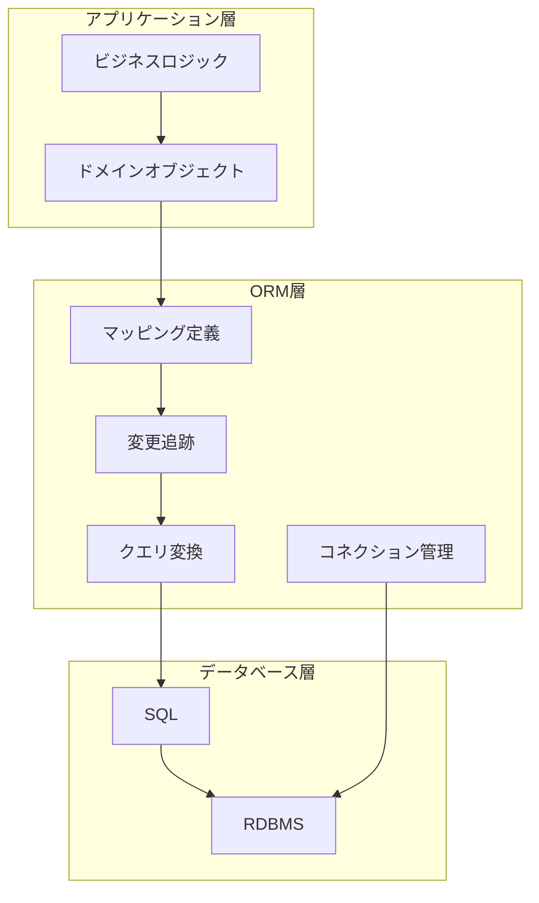

## 2. Active Record パターン

### 2.1 パターンの定義

Active Record は、Martin Fowler が著書『Patterns of Enterprise Application Architecture（PoEAA）』（2002年）で定式化したデザインパターンである。このパターンでは、**ドメインオブジェクト自身がデータベースへの永続化ロジックを持つ**。つまり、1つのクラスが「データの保持」と「データベースとの通信」の両方の責務を担う。

Active Record パターンの核心は以下の原則にある。

- テーブルの1行が1つのオブジェクトに対応する
- オブジェクト自身が `save()`、`delete()`、`find()` などのメソッドを持つ
- テーブルのカラムがオブジェクトのプロパティに直接マッピングされる

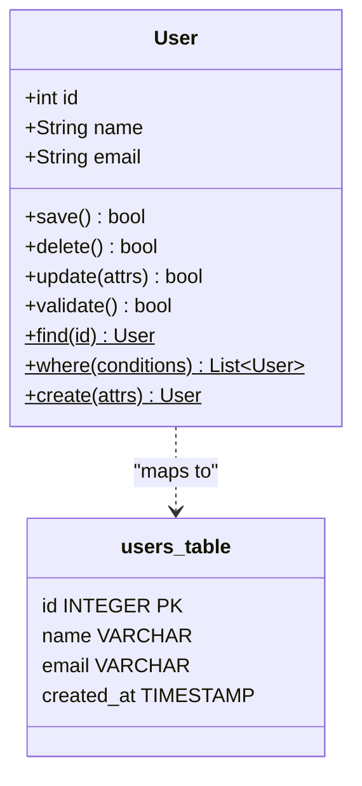

### 2.2 Ruby on Rails ActiveRecord

Active Record パターンの最も有名な実装は、Ruby on Rails の ActiveRecord である。2004年にDavid Heinemeier Hansson（DHH）がRuby on Rails と共にリリースし、「設定より規約（Convention over Configuration）」の思想を体現した。

```ruby
# Model definition - minimal configuration needed
class User < ApplicationRecord
  has_many :posts
  has_many :comments
  validates :email, presence: true, uniqueness: true

  def full_name
    "#{first_name} #{last_name}"
  end
end

# CRUD operations - the object itself handles persistence
user = User.new(name: "Alice", email: "alice@example.com")
user.save          # INSERT INTO users (name, email) VALUES ('Alice', 'alice@example.com')

user.name = "Bob"
user.save          # UPDATE users SET name = 'Bob' WHERE id = 1

user = User.find(1)       # SELECT * FROM users WHERE id = 1
users = User.where(active: true).order(:name).limit(10)

user.destroy       # DELETE FROM users WHERE id = 1
```

Rails ActiveRecord の特徴的な設計判断は以下のとおりである。

- **規約ベースのマッピング**：`User` クラスは自動的に `users` テーブルにマッピングされる。カラム情報はデータベースのスキーマから動的に取得される
- **メタプログラミングの活用**：`has_many`、`belongs_to` などの宣言的DSLにより、関連を簡潔に定義できる
- **スコープチェーン**：`User.where(...).order(...).limit(...)` のようにメソッドチェーンでクエリを組み立てられる
- **コールバック**：`before_save`、`after_create` などのフックにより、ライフサイクルイベントに処理を差し込める

### 2.3 Django ORM

Python のWeb フレームワーク Django もActive Record パターンに近い設計を採用している。ただし、Django ではモデル定義時にフィールドを明示的に宣言する点が Rails との違いである。

```python
from django.db import models

class User(models.Model):
    name = models.CharField(max_length=100)
    email = models.EmailField(unique=True)
    created_at = models.DateTimeField(auto_now_add=True)

    class Meta:
        db_table = 'users'

    def full_name(self):
        return f"{self.first_name} {self.last_name}"

# CRUD operations
user = User(name="Alice", email="alice@example.com")
user.save()

user = User.objects.get(id=1)
users = User.objects.filter(active=True).order_by('name')[:10]
```

Django ORM は `Manager` と `QuerySet` の概念により、遅延評価（Lazy Evaluation）を実現している。`User.objects.filter(...)` は即座にSQLを発行するのではなく、`QuerySet` オブジェクトを返す。実際にデータが必要になった時点（イテレーション、スライス、`list()` 呼び出しなど）で初めてSQLが実行される。

### 2.4 Active Record パターンの利点と欠点

**利点：**

- **シンプルさ**：テーブルとクラスが1対1で対応するため、直感的に理解できる
- **迅速な開発**：CRUDアプリケーションを少ないコード量で構築できる
- **学習コストの低さ**：SQLの知識がなくても基本的なデータ操作が可能
- **一貫性**：規約に従うことで、チーム内のコードスタイルが統一される

**欠点：**

- **単一責任原則の違反**：ドメインロジックと永続化ロジックが同一クラスに混在する
- **テスタビリティの低下**：データベース接続なしにドメインロジックを単体テストすることが困難
- **複雑なドメインモデルへの対応の限界**：ビジネスルールが複雑になると、モデルクラスが肥大化する（Fat Model 問題）
- **テーブル構造への依存**：クラスの設計がデータベースのスキーマに強く縛られる

## 3. Data Mapper パターン

### 3.1 パターンの定義

Data Mapper は、同じく Martin Fowler が PoEAA で定式化したパターンであり、Active Record とは対照的な設計思想を持つ。Data Mapper では、**ドメインオブジェクトとデータベースアクセスの責務を明確に分離する**。ドメインオブジェクトはデータベースの存在を知らず、マッピングを担当する別のレイヤー（Mapper）がオブジェクトとデータベースの間を仲介する。

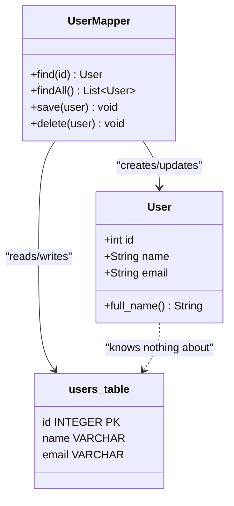

この分離により、ドメインオブジェクトは純粋なビジネスロジックに集中でき、永続化の詳細から解放される。

### 3.2 Hibernate / JPA（Java）

Java の Hibernate は Data Mapper パターンの代表的な実装であり、JPA（Java Persistence API）の標準仕様のリファレンス実装でもある。2001年に Gavin King によって開発され、Java のエンタープライズ開発に大きな影響を与えた。

```java
// Domain entity - no persistence logic
@Entity
@Table(name = "users")
public class User {
    @Id
    @GeneratedValue(strategy = GenerationType.IDENTITY)
    private Long id;

    @Column(nullable = false)
    private String name;

    @Column(unique = true)
    private String email;

    @OneToMany(mappedBy = "author", fetch = FetchType.LAZY)
    private List<Post> posts;

    // Business logic only
    public String getFullName() {
        return this.firstName + " " + this.lastName;
    }
}

// Persistence is handled by EntityManager (the mapper)
EntityManager em = entityManagerFactory.createEntityManager();
em.getTransaction().begin();

User user = new User();
user.setName("Alice");
user.setEmail("alice@example.com");
em.persist(user);    // INSERT

User found = em.find(User.class, 1L);  // SELECT
found.setName("Bob");
// No explicit save needed - changes are tracked automatically

em.getTransaction().commit();
```

Hibernate では `EntityManager` がマッパーの役割を果たす。`@Entity` アノテーションによるメタデータと `EntityManager` による永続化操作が分離されている点が、Active Record との根本的な違いである。

### 3.3 SQLAlchemy（Python）

Python の SQLAlchemy は、ORMレイヤーとSQLツールキットを明確に分離した設計で知られている。Data Mapper パターンをコアに据えつつ、Active Record 的な便利さも提供するハイブリッドなアプローチを採用している。

```python
from sqlalchemy import Column, Integer, String, create_engine
from sqlalchemy.orm import declarative_base, Session

Base = declarative_base()

# Domain model with mapping metadata
class User(Base):
    __tablename__ = 'users'

    id = Column(Integer, primary_key=True)
    name = Column(String(100), nullable=False)
    email = Column(String(255), unique=True)

    def full_name(self):
        return f"{self.first_name} {self.last_name}"

# Session acts as the mapper / Unit of Work
engine = create_engine("postgresql://localhost/mydb")
with Session(engine) as session:
    user = User(name="Alice", email="alice@example.com")
    session.add(user)       # mark for insertion
    session.commit()        # flush all changes to DB

    user = session.get(User, 1)
    user.name = "Bob"       # change is tracked automatically
    session.commit()        # UPDATE users SET name = 'Bob' WHERE id = 1
```

SQLAlchemy の `Session` は Unit of Work パターンを実装しており、トランザクション内で行われたすべての変更を追跡し、`commit()` 時にまとめてデータベースに反映する。

### 3.4 TypeORM（TypeScript）

TypeORM は TypeScript / JavaScript のための ORM であり、Data Mapper パターンと Active Record パターンの両方をサポートしている点が特徴的である。

```typescript
// Data Mapper style
import { Entity, PrimaryGeneratedColumn, Column, Repository } from "typeorm";

@Entity()
class User {
  @PrimaryGeneratedColumn()
  id: number;

  @Column()
  name: string;

  @Column({ unique: true })
  email: string;
}

// Repository handles persistence
const userRepository: Repository<User> = dataSource.getRepository(User);

const user = new User();
user.name = "Alice";
user.email = "alice@example.com";
await userRepository.save(user);

const found = await userRepository.findOneBy({ id: 1 });
```

### 3.5 Data Mapper パターンの利点と欠点

**利点：**

- **関心の分離**：ドメインロジックと永続化ロジックが明確に分離される
- **テスタビリティ**：ドメインオブジェクトをデータベースなしに単体テストできる
- **柔軟なマッピング**：テーブル構造とオブジェクト構造を独立に設計できる
- **大規模アプリケーションへの適合**：複雑なドメインモデルやDDDとの親和性が高い

**欠点：**

- **コード量の増加**：マッパー層やリポジトリ層の実装が必要
- **学習コストの高さ**：Session、EntityManager などの抽象概念を理解する必要がある
- **オーバーエンジニアリングのリスク**：単純なCRUDアプリケーションには過剰な設計になりうる

### 3.6 Active Record と Data Mapper の比較

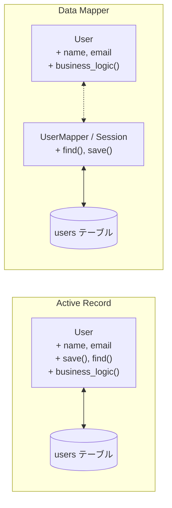

| 観点 | Active Record | Data Mapper |
|---|---|---|
| 責務の配置 | オブジェクトに集約 | マッパーに分離 |
| テーブルとクラスの関係 | 1対1が原則 | 柔軟にマッピング可能 |
| 学習コスト | 低い | 高い |
| テスタビリティ | DB依存が強い | 容易にモック可能 |
| 適合するプロジェクト規模 | 小〜中規模 | 中〜大規模 |
| 代表的な実装 | Rails ActiveRecord, Django ORM | Hibernate, SQLAlchemy |

## 4. Unit of Work と Identity Map

### 4.1 Unit of Work パターン

Unit of Work は Martin Fowler の PoEAA で定義されたパターンで、一連のビジネストランザクション内で行われたオブジェクトの変更を追跡し、それらをまとめてデータベースに反映する責務を持つ。

Unit of Work がない場合、開発者は個々のオブジェクトの変更を手動でデータベースに反映する必要がある。

```python
# Without Unit of Work - manual tracking
user.name = "Bob"
execute_sql("UPDATE users SET name = 'Bob' WHERE id = 1")  # must be done manually

order.status = "shipped"
execute_sql("UPDATE orders SET status = 'shipped' WHERE id = 42")  # must be done manually
```

Unit of Work を使用する場合、変更はトランザクションの終了時に自動的にまとめて反映される。

```python
# With Unit of Work (SQLAlchemy Session)
with Session(engine) as session:
    user = session.get(User, 1)
    user.name = "Bob"           # change tracked

    order = session.get(Order, 42)
    order.status = "shipped"    # change tracked

    session.commit()  # both changes flushed in a single transaction
    # 1. UPDATE users SET name = 'Bob' WHERE id = 1
    # 2. UPDATE orders SET status = 'shipped' WHERE id = 42
```

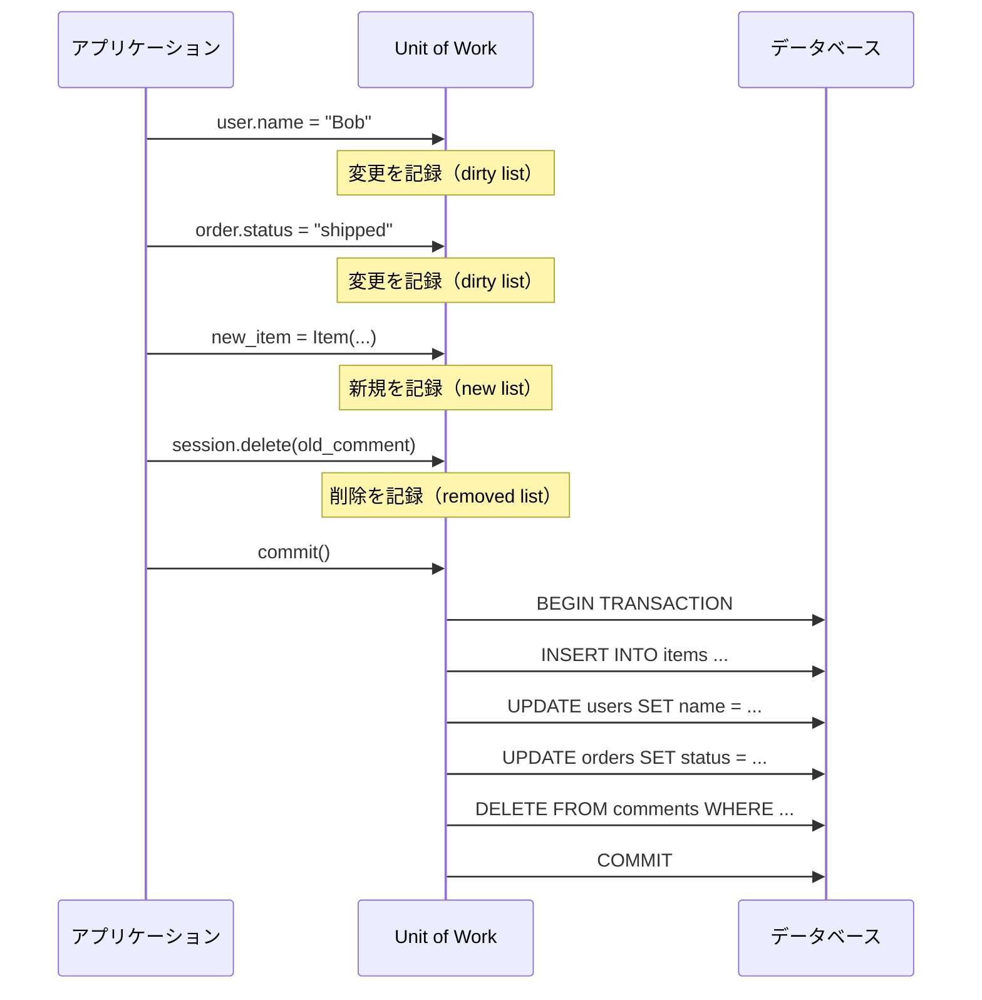

Unit of Work は内部で3つのリストを管理する。

- **New list**：新たに作成されたオブジェクト（INSERT が必要）
- **Dirty list**：変更されたオブジェクト（UPDATE が必要）
- **Removed list**：削除されたオブジェクト（DELETE が必要）

`commit()` が呼ばれると、これらのリストを処理し、適切なSQL文を生成して単一のトランザクション内で実行する。これにより、個々の変更ごとにトランザクションを発行する場合と比べて、データベースへのラウンドトリップが削減され、パフォーマンスが向上する。

### 4.2 Identity Map パターン

Identity Map は、同一トランザクション内で同じデータベース行を複数回読み取った場合に、同一のオブジェクトインスタンスを返すことを保証するパターンである。これにより、以下の問題が解消される。

1. **重複クエリの回避**：同じ行を何度フェッチしても、2回目以降はキャッシュから返される
2. **一貫性の保証**：同じ行に対応するオブジェクトが複数存在して矛盾した変更を行うことを防ぐ

```python
# Without Identity Map
user1 = session.query(User).get(1)  # SELECT * FROM users WHERE id = 1
user2 = session.query(User).get(1)  # SELECT * FROM users WHERE id = 1 (again!)
print(user1 is user2)  # False - two different objects, potential inconsistency

# With Identity Map (SQLAlchemy's default behavior)
user1 = session.get(User, 1)  # SELECT * FROM users WHERE id = 1
user2 = session.get(User, 1)  # No SQL! Returns cached object
print(user1 is user2)  # True - same Python object
```

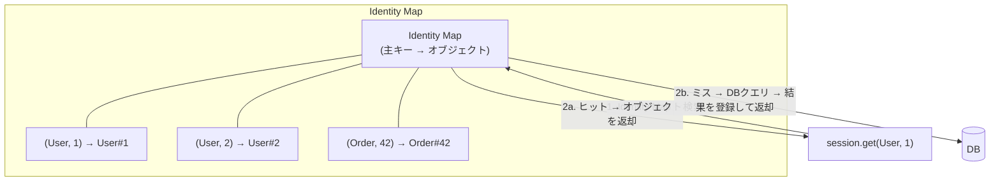

Hibernate の `EntityManager`、SQLAlchemy の `Session`、Rails ActiveRecord の `IdentityMap`（オプション）など、主要な ORM の多くが Identity Map を内蔵している。

### 4.3 Dirty Checking の仕組み

Unit of Work が変更を検出する方法（Dirty Checking）には主に2つのアプローチがある。

**スナップショット比較方式（Hibernate, SQLAlchemy）**

オブジェクトがロードされた時点のスナップショット（全プロパティのコピー）を保持しておき、`commit()` 時に現在の値と比較して変更箇所を特定する。

```
ロード時:    User(id=1, name="Alice", email="alice@example.com")  → snapshot に保存
変更後:      User(id=1, name="Bob",   email="alice@example.com")
比較結果:    name が "Alice" → "Bob" に変更 → UPDATE users SET name = 'Bob' WHERE id = 1
```

この方式は正確だが、多数のオブジェクトがセッション内に存在する場合、スナップショットのメモリ消費と比較のCPUコストが問題になりうる。

**属性変更の追跡方式（Django ORM）**

プロパティの setter をインターセプトして、変更が発生した時点で即座に記録する。メモリ効率は良いが、実装が複雑になる。

## 5. N+1問題の発生メカニズムと解決法

### 5.1 N+1問題とは

N+1問題は、ORM を使用する際に最も頻繁に遭遇する性能問題である。親エンティティのリストを取得した後、各親エンティティの関連エンティティにアクセスする際に、親の数（N）だけ追加のクエリが発行されてしまう現象を指す。最初の1クエリ＋N回の追加クエリで、合計 N+1 回のクエリが実行される。

```ruby
# N+1 problem in Rails
users = User.all  # 1 query: SELECT * FROM users
# => Returns 100 users

users.each do |user|
  puts user.posts.count  # N queries: SELECT COUNT(*) FROM posts WHERE user_id = ?
end
# Total: 1 + 100 = 101 queries!
```

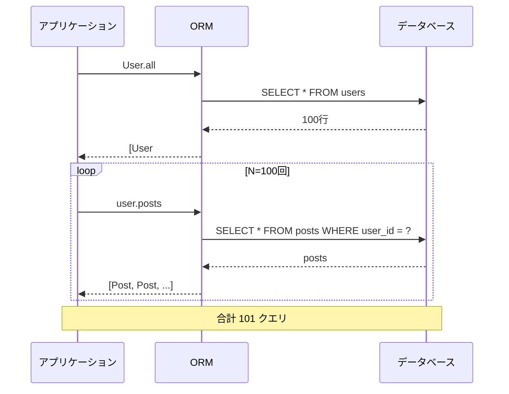

100ユーザーの投稿を表示するだけで101回のクエリが実行される。各クエリのネットワークラウンドトリップが1msだとしても、101msの純粋なネットワーク遅延が発生する。本来は2回のクエリ（ユーザー一覧の取得と、該当ユーザーのすべての投稿の取得）で済むはずの処理である。

### 5.2 N+1問題が発生する根本原因

N+1問題が発生する根本原因は、ORMの**遅延ロード（Lazy Loading）** のデフォルト動作にある。遅延ロードでは、関連オブジェクトは実際にアクセスされるまで読み込まれない。これはメモリ効率の観点では合理的だが、ループ内でのアクセスパターンと組み合わさることで性能問題を引き起こす。

問題のある典型的なパターンを列挙する。

```python
# Pattern 1: Loop access
for user in session.query(User).all():
    print(user.posts)  # N+1

# Pattern 2: Template rendering
# template:  {{ user.department.name }} 

# Pattern 3: Serialization
def serialize_user(user):
    return {
        "name": user.name,
        "posts": [serialize_post(p) for p in user.posts],  # N+1
    }
```

### 5.3 解決法1：Eager Loading（即時ロード）

Eager Loading は、最初のクエリの時点で関連データもまとめて取得する手法である。実装方法には主に2つのアプローチがある。

**JOIN ベースの Eager Loading**

SQLの JOIN を用いて、親と子を1つのクエリで取得する。

```ruby
# Rails: includes with join
users = User.includes(:posts).all
# SELECT users.* FROM users
# SELECT posts.* FROM posts WHERE posts.user_id IN (1, 2, 3, ..., 100)

# Or using eager_load for a true JOIN
users = User.eager_load(:posts).all
# SELECT users.*, posts.* FROM users LEFT OUTER JOIN posts ON posts.user_id = users.id
```

```python
# SQLAlchemy: joinedload
from sqlalchemy.orm import joinedload

users = session.query(User).options(joinedload(User.posts)).all()
# SELECT users.*, posts.* FROM users LEFT OUTER JOIN posts ON posts.user_id = users.id
```

```java
// JPA: JOIN FETCH
TypedQuery<User> query = em.createQuery(
    "SELECT u FROM User u JOIN FETCH u.posts", User.class);
List<User> users = query.getResultList();
```

**Subquery ベースの Eager Loading**

まず親を取得し、次に子をIN句を使ったサブクエリで一括取得する。JOINベースの方式と異なり、データの重複（親データがJOINによって子の数だけ繰り返される問題）が発生しない。

```python
# SQLAlchemy: subqueryload
from sqlalchemy.orm import subqueryload

users = session.query(User).options(subqueryload(User.posts)).all()
# Query 1: SELECT * FROM users
# Query 2: SELECT * FROM posts WHERE posts.user_id IN (SELECT users.id FROM users)
```

### 5.4 解決法2：Batch Loading（バッチロード）

Batch Loading は、遅延ロードのタイミングは維持しつつ、複数のオブジェクトの関連データを一括で取得する手法である。

```python
# SQLAlchemy: selectinload (batch loading strategy)
from sqlalchemy.orm import selectinload

users = session.query(User).options(selectinload(User.posts)).all()
# Query 1: SELECT * FROM users
# Query 2: SELECT * FROM posts WHERE posts.user_id IN (1, 2, 3, ..., 100)
```

Hibernate では `@BatchSize` アノテーションで同様の機能を実現できる。

```java
@Entity
public class User {
    @OneToMany(mappedBy = "author")
    @BatchSize(size = 25)  // load posts in batches of 25
    private List<Post> posts;
}
```

`@BatchSize(size = 25)` を指定すると、100ユーザーの投稿を取得する際に、25ユーザー分の投稿をまとめてIN句で取得するクエリが4回発行される。N+1 → 1+4 に削減される。

### 5.5 解決法3：DataLoader パターン

DataLoader は、Facebook が2016年にオープンソース化したライブラリに端を発するパターンである。元々は GraphQL のリゾルバにおけるN+1問題を解決するために設計されたが、その概念はGraphQL以外でも広く応用されている。

DataLoader の核心は**バッチングとキャッシング**の2つである。

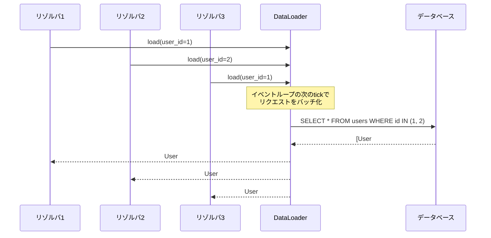

DataLoader は以下の手順で動作する。

1. 同一イベントループ tick（または同一リクエスト）内で発生した `load()` 呼び出しを蓄積する
2. tick の終了時に、蓄積されたキーをまとめて1つのバッチクエリに変換する
3. 結果をキャッシュし、同じキーに対する再度のリクエストにはキャッシュから応答する

```javascript
// JavaScript DataLoader example
const DataLoader = require('dataloader');

// Batch function: receives an array of keys, returns an array of results
const userLoader = new DataLoader(async (userIds) => {
  const users = await db.query('SELECT * FROM users WHERE id IN (?)', [userIds]);
  // Must return results in the same order as keys
  const userMap = new Map(users.map(u => [u.id, u]));
  return userIds.map(id => userMap.get(id) || null);
});

// Usage in resolvers - these are automatically batched
const user1 = await userLoader.load(1);  // not executed immediately
const user2 = await userLoader.load(2);  // not executed immediately
// At the end of the tick: SELECT * FROM users WHERE id IN (1, 2)
```

### 5.6 各解決法の比較

| 手法 | クエリ数 | メモリ使用量 | 実装の複雑さ | 適用場面 |
|---|---|---|---|---|
| Lazy Loading（デフォルト） | N+1 | 低い | なし | 関連データに必ずしもアクセスしないケース |
| JOIN Eager Loading | 1 | 高い（重複あり） | 低い | 1対1、多対1の関連 |
| Subquery Eager Loading | 2 | 中程度 | 低い | 1対多の関連 |
| Batch Loading | 1 + ceil(N/batch) | 中程度 | 低い | 大量の関連データ |
| DataLoader | 1 + 1（バッチ） | 中程度 | 中程度 | GraphQL、非同期処理 |

## 6. クエリビルダとの比較

### 6.1 クエリビルダとは

クエリビルダは、SQL文をプログラム的に組み立てるためのAPIを提供するライブラリである。ORMのように完全なオブジェクトマッピングは行わず、SQLの構築と実行に特化している。

代表的なクエリビルダとして、Node.js の Knex.js、PHP の Doctrine DBAL、Java の jOOQ、Go の squirrel などがある。

```javascript
// Knex.js query builder
const users = await knex('users')
  .select('users.id', 'users.name', 'departments.name as dept_name')
  .join('departments', 'users.department_id', 'departments.id')
  .where('users.active', true)
  .orderBy('users.name')
  .limit(10);
```

```python
# SQLAlchemy Core (query builder layer)
from sqlalchemy import select, join

stmt = (
    select(users_table.c.id, users_table.c.name, departments_table.c.name)
    .select_from(
        join(users_table, departments_table,
             users_table.c.department_id == departments_table.c.id)
    )
    .where(users_table.c.active == True)
    .order_by(users_table.c.name)
    .limit(10)
)
```

### 6.2 ORM とクエリビルダの設計思想の違い

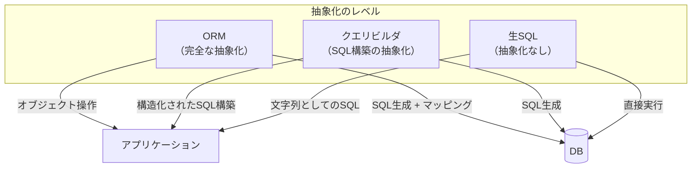

| 観点 | ORM | クエリビルダ | 生SQL |
|---|---|---|---|
| 抽象化レベル | 高い | 中程度 | なし |
| 型安全性 | フレームワーク依存 | ライブラリ依存 | なし |
| SQL の可視性 | 低い | 高い | 完全 |
| 複雑なクエリの記述 | 困難な場合あり | 容易 | 完全に自由 |
| マッピング | 自動 | 手動 | 手動 |
| 学習コスト | ORM 固有の概念が必要 | SQLの知識 + API | SQLの知識のみ |

### 6.3 ハイブリッドアプローチ

実際のプロジェクトでは、ORM とクエリビルダ（あるいは生SQL）を併用するハイブリッドアプローチが現実的である。単純なCRUD操作にはORMを使い、複雑な集計クエリやパフォーマンスクリティカルな処理ではクエリビルダや生SQLにフォールバックする。

```python
# SQLAlchemy: ORM for simple operations
user = session.get(User, 1)
user.name = "Bob"
session.commit()

# SQLAlchemy Core for complex aggregation
from sqlalchemy import func, text

stmt = (
    select(
        users_table.c.department_id,
        func.count().label('user_count'),
        func.avg(users_table.c.salary).label('avg_salary')
    )
    .group_by(users_table.c.department_id)
    .having(func.count() > 5)
)

# Raw SQL for database-specific features
result = session.execute(
    text("SELECT * FROM users WHERE name @@ to_tsquery(:query)"),
    {"query": "alice & bob"}
)
```

## 7. マイグレーション管理

### 7.1 マイグレーションとは

データベースマイグレーションとは、データベーススキーマの変更をバージョン管理し、再現可能な方法で適用する仕組みである。アプリケーションコードがGitで管理されるのと同様に、データベースの構造変更もコードとして管理される。

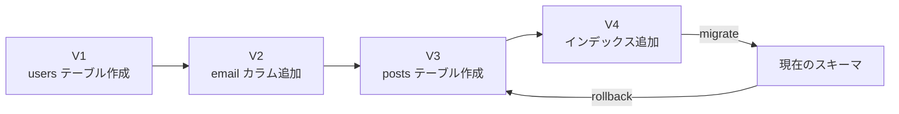

### 7.2 主要なマイグレーションツール

**Rails のマイグレーション**

```ruby
# db/migrate/20260301000001_create_users.rb
class CreateUsers < ActiveRecord::Migration[7.1]
  def change
    create_table :users do |t|
      t.string :name, null: false
      t.string :email, null: false
      t.timestamps
    end

    add_index :users, :email, unique: true
  end
end

# db/migrate/20260301000002_add_department_to_users.rb
class AddDepartmentToUsers < ActiveRecord::Migration[7.1]
  def change
    add_reference :users, :department, foreign_key: true
  end
end
```

**Alembic（SQLAlchemy 用）**

```python
# alembic/versions/001_create_users.py
def upgrade():
    op.create_table(
        'users',
        sa.Column('id', sa.Integer(), primary_key=True),
        sa.Column('name', sa.String(100), nullable=False),
        sa.Column('email', sa.String(255), nullable=False),
    )
    op.create_index('ix_users_email', 'users', ['email'], unique=True)

def downgrade():
    op.drop_index('ix_users_email')
    op.drop_table('users')
```

**Flyway / Liquibase（Java）**

Java エコシステムでは Flyway や Liquibase が広く使われている。Flyway はSQLファイルによるマイグレーションを基本とし、ファイル名のバージョン番号による順序管理を行う。

### 7.3 マイグレーションの課題

マイグレーション管理においては、特に本番環境での運用において以下の課題がある。

- **ゼロダウンタイムマイグレーション**：カラムの追加は比較的安全だが、カラムの削除やリネームはアプリケーションとの互換性を考慮して段階的に行う必要がある（Expand/Contract パターン）
- **大規模テーブルのマイグレーション**：数億行のテーブルに対する ALTER TABLE はロックを長時間保持する可能性がある。pt-online-schema-change（MySQL）や `pg_repack`（PostgreSQL）などのツールが必要になる場合がある
- **データマイグレーション**：スキーマの変更だけでなく、既存データの変換が必要な場合、マイグレーション内でのデータ操作が必要になるが、これは冪等性や性能の観点で慎重に設計する必要がある

## 8. ORM の性能限界

### 8.1 複雑な JOIN の壁

ORMは単純なJOINは適切に処理できるが、複雑な結合条件やサブクエリを含むクエリの表現力には限界がある。

```sql
-- ORM does not naturally express this kind of query
SELECT
    u.name,
    d.name AS department,
    (SELECT COUNT(*) FROM posts p WHERE p.user_id = u.id AND p.created_at > NOW() - INTERVAL '30 days') AS recent_posts,
    RANK() OVER (PARTITION BY u.department_id ORDER BY u.created_at) AS dept_rank
FROM users u
JOIN departments d ON u.department_id = d.id
WHERE EXISTS (
    SELECT 1 FROM orders o
    WHERE o.user_id = u.id
    AND o.total > 1000
)
ORDER BY recent_posts DESC
LIMIT 20;
```

このような相関サブクエリ、ウィンドウ関数、EXISTS句を含むクエリをORMのAPIで表現しようとすると、可読性が著しく低下するか、そもそも表現不可能な場合がある。結果として、ORM の抽象化を破って生SQLにフォールバックせざるを得なくなる。

### 8.2 バルク操作の非効率性

ORMは個々のオブジェクトの変更追跡を前提としているため、大量のレコードを一括で操作する場合に非効率になる。

```python
# Inefficient: ORM creates N objects and executes N INSERT statements
for i in range(100000):
    user = User(name=f"user_{i}", email=f"user_{i}@example.com")
    session.add(user)
session.commit()  # may take minutes

# Efficient: bulk insert bypassing ORM
session.execute(
    insert(User),
    [{"name": f"user_{i}", "email": f"user_{i}@example.com"} for i in range(100000)]
)
session.commit()  # takes seconds

# Even more efficient: database-native COPY
# PostgreSQL COPY command can insert millions of rows per second
```

同様に、バルク更新やバルク削除もORM経由では非効率になる。

```python
# Inefficient: loads all objects into memory, then updates one by one
users = session.query(User).filter(User.active == False).all()
for user in users:
    user.status = "archived"
session.commit()

# Efficient: bulk update without loading objects
session.query(User).filter(User.active == False).update({"status": "archived"})
session.commit()
# Generates: UPDATE users SET status = 'archived' WHERE active = false
```

### 8.3 大規模クエリとメモリ消費

ORMは通常、クエリ結果のすべての行をオブジェクトに変換してメモリに保持する。大量のデータを処理する場合、これがメモリ不足の原因になる。

```python
# Dangerous: loads all 10 million rows into memory
all_users = session.query(User).all()  # OutOfMemoryError!

# Better: streaming with yield_per
for user in session.query(User).yield_per(1000):
    process(user)

# Best for read-only: use raw connection with server-side cursor
with engine.connect() as conn:
    result = conn.execution_options(stream_results=True).execute(
        text("SELECT * FROM users")
    )
    for partition in result.partitions(1000):
        for row in partition:
            process(row)
```

### 8.4 SELECT * 問題

多くのORMはデフォルトでテーブルのすべてのカラムを取得する（`SELECT *`）。これは不要なデータの転送とメモリ消費を招く。

```python
# ORM default: SELECT id, name, email, bio, avatar, ... FROM users
users = session.query(User).all()

# Only need name and email:
users = session.query(User.name, User.email).all()
# SELECT name, email FROM users
```

特に、BLOB やTEXT型の大きなカラムを含むテーブルでは、不要なカラムの取得がパフォーマンスに大きく影響する。

### 8.5 Generated SQL の品質

ORMが生成するSQLは、人間が手書きするSQLと比べて最適でない場合がある。特に以下のケースで問題が顕在化する。

- **不要な JOIN**：Eager Loading の設定により、アクセスしない関連テーブルまで JOIN してしまう
- **非効率なサブクエリ**：ORM の制約により、効率的なクエリ構造を表現できない
- **データベース固有の最適化が使えない**：`LATERAL JOIN`、`MATERIALIZED CTE`、`ARRAY_AGG` などのデータベース固有機能はORM経由では利用困難

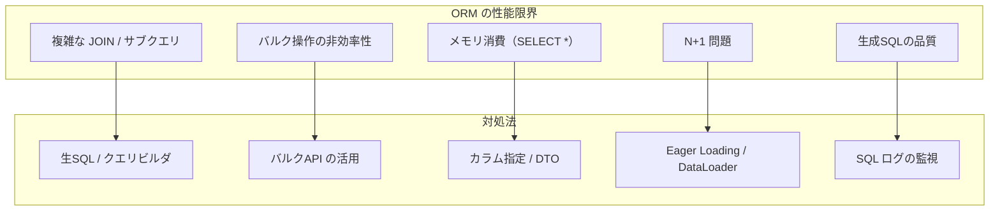

## 9. 代替アプローチ

### 9.1 Query Builder：jOOQ

jOOQ（Java Object Oriented Querying）は、Java のためのタイプセーフなSQLクエリビルダである。ORMのようなオブジェクトマッピングではなく、SQLそのものをプログラム的に構築することに焦点を当てている。

```java
// jOOQ: type-safe SQL construction
DSLContext ctx = DSL.using(connection, SQLDialect.POSTGRES);

Result<Record3<String, String, Integer>> result = ctx
    .select(USERS.NAME, DEPARTMENTS.NAME, count())
    .from(USERS)
    .join(DEPARTMENTS).on(USERS.DEPARTMENT_ID.eq(DEPARTMENTS.ID))
    .where(USERS.ACTIVE.isTrue())
    .groupBy(USERS.NAME, DEPARTMENTS.NAME)
    .having(count().gt(5))
    .orderBy(count().desc())
    .fetch();
```

jOOQ の特長は以下のとおりである。

- **データベーススキーマからのコード生成**：テーブルやカラムがJavaクラスとして生成され、コンパイル時に型チェックが行われる
- **SQL の完全な表現力**：ウィンドウ関数、CTE、LATERAL JOIN などの高度なSQL機能をタイプセーフに利用できる
- **生成SQLの透明性**：どのようなSQLが生成されるかが直感的に理解できる

### 9.2 Prisma（TypeScript）

Prisma は、TypeScript / JavaScript のための次世代 ORM を標榜するツールである。従来の ORM とは異なる設計思想を持つ。

```typescript
// schema.prisma - declarative schema definition
// model User {
//   id    Int     @id @default(autoincrement())
//   name  String
//   email String  @unique
//   posts Post[]
// }

// Type-safe client generated from schema
const users = await prisma.user.findMany({
  where: { active: true },
  include: { posts: true },     // eager loading
  select: {                     // partial select
    name: true,
    email: true,
    posts: {
      select: { title: true }
    }
  },
  orderBy: { name: 'asc' },
  take: 10,
});
// Generated type: { name: string, email: string, posts: { title: string }[] }[]
```

Prisma の設計上の特徴は以下のとおりである。

- **スキーマファーストアプローチ**：`schema.prisma` ファイルでスキーマを宣言し、そこからクライアントコードとマイグレーションを生成する
- **完全な型安全性**：クエリの結果型がスキーマと `select` / `include` の指定に基づいて自動的に推論される
- **明示的な関連読み込み**：`include` を指定しなければ関連は読み込まれず、N+1問題を構造的に防ぐ
- **Rust製のクエリエンジン**：クエリの解析と最適化をRustで実装されたエンジンが担当する

### 9.3 SQLc（Go）

SQLc は Go のためのコード生成ツールで、「SQLを書き、型安全な Go コードを生成する」というアプローチを採用している。ORMとは正反対の設計思想であり、SQLそのものを第一級の記述方法として扱う。

```sql
-- queries.sql
-- name: GetUser :one
SELECT id, name, email FROM users WHERE id = $1;

-- name: ListUsers :many
SELECT id, name, email FROM users WHERE active = true ORDER BY name;

-- name: CreateUser :one
INSERT INTO users (name, email) VALUES ($1, $2) RETURNING *;
```

```go
// Generated Go code (auto-generated by sqlc)
type User struct {
    ID    int32
    Name  string
    Email string
}

func (q *Queries) GetUser(ctx context.Context, id int32) (User, error) {
    // ...
}

func (q *Queries) ListUsers(ctx context.Context) ([]User, error) {
    // ...
}

func (q *Queries) CreateUser(ctx context.Context, arg CreateUserParams) (User, error) {
    // ...
}
```

SQLc のアプローチの利点は以下のとおりである。

- **SQLの完全な制御**：開発者が書いたSQLがそのまま実行されるため、性能特性が予測可能
- **コンパイル時の検証**：SQLの構文エラーやスキーマとの不整合がコード生成時に検出される
- **ゼロオーバーヘッド**：ランタイムでのリフレクションやクエリ構築のコストがない
- **学習コストの低さ**：SQLとGoの知識だけで使える

### 9.4 各アプローチの位置づけ

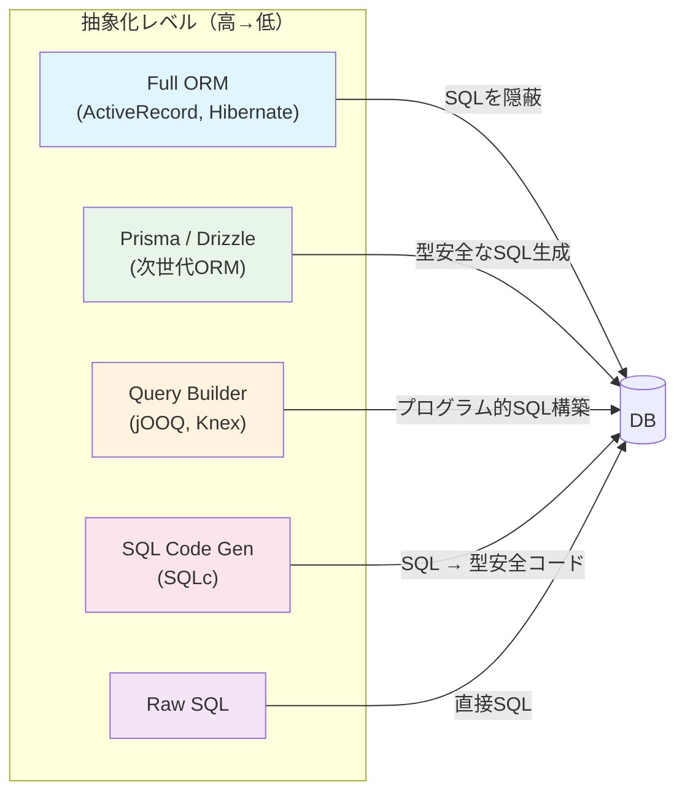

| ツール | アプローチ | 型安全性 | SQL制御 | マッピング | 適合場面 |
|---|---|---|---|---|---|
| ActiveRecord / Django | Active Record ORM | 低い | 低い | 自動 | 迅速なプロトタイピング |
| Hibernate / SQLAlchemy | Data Mapper ORM | 中程度 | 中程度 | 自動 | エンタープライズアプリ |
| Prisma | スキーマファーストORM | 高い | 中程度 | 自動 | TypeScript プロジェクト |
| jOOQ | タイプセーフクエリビルダ | 高い | 高い | 半自動 | 複雑なSQLが必要な場面 |
| SQLc | SQLコード生成 | 高い | 完全 | 自動生成 | Go プロジェクト、性能重視 |
| 生SQL | なし | なし | 完全 | 手動 | 最大限の制御が必要な場面 |

## 10. ORMを使うべき場合・使わないべき場合

### 10.1 ORMが適している場面

**CRUDが中心のアプリケーション**

Webアプリケーションの多くは、ユーザー管理、投稿の作成・編集・削除、コメントの追加といったCRUD操作が処理の大部分を占める。このような場面ではORMが大きな生産性向上をもたらす。

**ドメインモデルが複雑で、ビジネスロジックが豊富な場合**

DDD（ドメイン駆動設計）を採用するプロジェクトでは、Data Mapper パターンの ORM がドメインモデルの表現に適している。エンティティ、値オブジェクト、集約ルートといった概念をオブジェクトとして自然にモデリングし、永続化の詳細を分離できる。

**プロトタイピングやMVP開発**

開発速度が最優先される場面では、Active Record パターンの ORM（Rails ActiveRecord、Django ORM）が圧倒的な生産性を発揮する。スキーマの変更に対してもマイグレーション機能で柔軟に対応できる。

**複数のデータベースをサポートする必要がある場合**

ORMは SQL の方言差を吸収するため、PostgreSQL、MySQL、SQLite間でのポータビリティが必要な場合に有用である。

### 10.2 ORMが適さない場面

**分析・集計クエリが中心の場合**

GROUP BY、ウィンドウ関数、CTE、CUBE/ROLLUP などを多用する分析系の処理では、ORMの抽象化は障害になる。クエリビルダや生SQLの方が適切である。

**高スループットのバッチ処理**

ETLパイプラインや大量データのインポート・エクスポートでは、ORM のオブジェクト生成・変更追跡のオーバーヘッドが許容できないレベルになる。COPY コマンドやバルクインサートを直接使用すべきである。

**マイクロ秒単位のレイテンシが求められる場合**

ORM のランタイムオーバーヘッド（リフレクション、クエリ構築、オブジェクト変換）は通常数百マイクロ秒程度だが、超低レイテンシが求められるシステムでは問題になりうる。

**データベース固有機能に強く依存する場合**

PostgreSQL の JSONB 操作、全文検索（`tsvector`/`tsquery`）、PostGIS の地理空間クエリなど、データベース固有の高度な機能を活用する場合は、ORMのポータビリティ層がかえって障害になる。

### 10.3 実践的な指針

実際のプロジェクトでは、「ORM か 生SQL か」という二項対立ではなく、場面に応じて使い分けるハイブリッドアプローチが最も現実的である。以下のような指針が有効である。

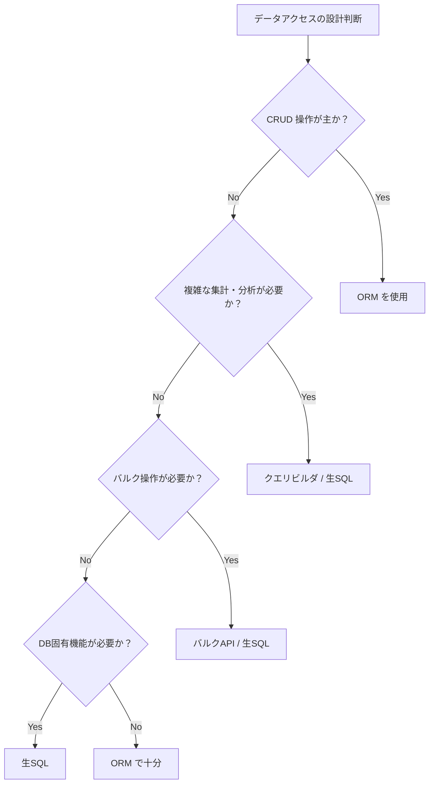

1. **基本はORMを使う**：単純なCRUD操作、関連の操作、バリデーション、コールバックにはORMを活用する
2. **複雑なクエリではフォールバックする**：ORMで表現困難なクエリは、迷わずクエリビルダや生SQLを使う。ORMの制約に無理に合わせようとしない
3. **SQLログを常に監視する**：開発環境ではORMが生成するSQLを常にログに出力し、N+1問題や非効率なクエリを早期に発見する
4. **ベンチマークを取る**：性能がクリティカルな部分では、ORM経由と生SQL直接実行のパフォーマンスを比較する
5. **チームのスキルセットを考慮する**：SQLに精通したチームであればクエリビルダやSQLcの方が生産的かもしれない。逆に、フレームワーク中心の開発経験が豊富なチームではORMの方が効率的である

### 10.4 まとめ

ORMは「オブジェクト指向言語とリレーショナルデータベースの間のインピーダンスミスマッチを吸収する」という目的のもとに生まれた技術であり、数十年にわたる実績がある。Active Record パターンはシンプルさと開発速度を、Data Mapper パターンは関心の分離とテスタビリティを重視する。それぞれの特性を理解し、プロジェクトの要件に応じて適切なパターンとツールを選択することが重要である。

同時に、ORMは万能ではない。N+1問題、バルク操作の非効率性、複雑なクエリの表現力の限界など、固有の課題を持っている。これらの限界を正しく認識し、クエリビルダ、コード生成ツール、生SQLとの使い分けを意識することで、生産性とパフォーマンスの両立が可能になる。

Ted Neward が2006年に「ORMはコンピュータサイエンスのベトナム戦争だ」と表現したように、オブジェクト-リレーショナルインピーダンスミスマッチは本質的に解決困難な問題である。しかし、各ツールのトレードオフを理解し、適材適所で活用することこそが、エンジニアリングの本質である。
