# アウトオブオーダー実行とスーパースカラ — 命令レベル並列性の追求

## 1. 命令パイプラインの基礎

### 1.1 なぜパイプラインが必要か

プロセッサが命令を実行する過程は、複数の独立したステージに分解できる。最も古典的なモデルでは、1つの命令が「フェッチ → デコード → 実行 → メモリアクセス → ライトバック」という5つの段階を経て完了する。パイプラインが存在しない逐次実行モデルでは、1つの命令が5サイクルかけて完了するまで次の命令に着手できない。仮に各ステージが1クロックサイクルを要するなら、N個の命令を処理するのに 5N サイクルが必要になる。

パイプラインの発想は、工場の流れ作業と同じである。ある命令がデコードステージに進んだ時点で、フェッチステージは空いているから、次の命令のフェッチを開始できる。理想的には、パイプラインが満たされた後は毎サイクル1命令が完了し、スループットが5倍に向上する。

```mermaid
gantt
    title 5段パイプラインの動作
    dateFormat X
    axisFormat %s
    section 命令1
    IF  : 0, 1
    ID  : 1, 2
    EX  : 2, 3
    MEM : 3, 4
    WB  : 4, 5
    section 命令2
    IF  : 1, 2
    ID  : 2, 3
    EX  : 3, 4
    MEM : 4, 5
    WB  : 5, 6
    section 命令3
    IF  : 2, 3
    ID  : 3, 4
    EX  : 4, 5
    MEM : 5, 6
    WB  : 6, 7
    section 命令4
    IF  : 3, 4
    ID  : 4, 5
    EX  : 5, 6
    MEM : 6, 7
    WB  : 7, 8
```

上図では、サイクル5以降は毎サイクル1命令が完了している。パイプラインの各ステージを以下に整理する。

| ステージ | 略称 | 役割 |
|---------|------|------|
| Instruction Fetch | IF | プログラムカウンタ（PC）が指すアドレスから命令をメモリ（命令キャッシュ）から読み出す |
| Instruction Decode | ID | 命令のオペコードとオペランドを解釈し、レジスタファイルからソースオペランドを読み出す |
| Execute | EX | ALU演算、アドレス計算、分岐判定などを実行する |
| Memory Access | MEM | ロード命令はデータキャッシュからデータを読み出し、ストア命令はデータを書き込む |
| Write Back | WB | 演算結果やロードしたデータをレジスタファイルに書き戻す |

### 1.2 パイプラインの理想と現実

理想的なパイプラインでは、CPI（Cycles Per Instruction）は1.0に収束する。しかし現実には、パイプラインの流れを阻害する**ハザード（hazard）**が頻繁に発生し、**パイプラインストール（pipeline stall）**や**バブル（bubble）**と呼ばれる空きサイクルが挿入される。その結果、実際のCPIは1.0を大幅に上回ることがある。

パイプラインの段数を増やす（深いパイプライン）ことで各ステージの処理を単純化し、クロック周波数を向上させる手法もある。Intel Pentium 4のNetBurstアーキテクチャは31段という深いパイプラインを採用し、最大3.8GHzのクロック周波数を実現した。しかし、パイプラインを深くすると分岐予測ミス時のペナルティが増大し、消費電力も増加するため、現代のプロセッサは14〜20段程度に落ち着いている。

### 1.3 歴史的背景

命令パイプラインのアイデアは1960年代のIBM System/360 Model 91にまで遡る。このプロセッサはRobert Tomasulo が考案したアルゴリズムを実装しており、これは後述するアウトオブオーダー実行の原点でもある。1980年代にはRISCアーキテクチャ（MIPS、SPARC、ARM）が5段パイプラインを標準化し、パイプラインは現代のプロセッサ設計の根幹となった。

## 2. パイプラインハザード

パイプラインの性能を劣化させる要因であるハザードは、3種類に分類される。

### 2.1 構造ハザード（Structural Hazard）

構造ハザードは、ハードウェアリソースの競合によって発生する。例えば、命令メモリとデータメモリが統合されている（フォン・ノイマンアーキテクチャ）場合、IFステージの命令フェッチとMEMステージのデータアクセスが同時にメモリにアクセスしようとすると競合が生じる。

```mermaid
gantt
    title 構造ハザードの例（メモリポート競合）
    dateFormat X
    axisFormat %s
    section 命令1
    IF  : 0, 1
    ID  : 1, 2
    EX  : 2, 3
    MEM : 3, 4
    WB  : 4, 5
    section 命令2
    IF  : 1, 2
    ID  : 2, 3
    EX  : 3, 4
    MEM : 4, 5
    WB  : 5, 6
    section 命令3
    IF  : 2, 3
    ID  : 3, 4
    EX  : 4, 5
    MEM : 5, 6
    WB  : 6, 7
    section 命令4(競合)
    stall : 3, 4
    IF  : 4, 5
    ID  : 5, 6
    EX  : 6, 7
    MEM : 7, 8
    WB  : 8, 9
```

現代のプロセッサでは、命令キャッシュ（I-Cache）とデータキャッシュ（D-Cache）を分離するハーバードアーキテクチャを採用し、ALUを複数搭載するなどして構造ハザードの発生を最小化している。

### 2.2 データハザード（Data Hazard）

データハザードは、命令間のデータ依存関係によって発生する。具体的には以下の3種類がある。

**RAW（Read After Write）依存 — 真の依存関係**

先行命令の結果を後続命令が読み出す場合に発生する。これは命令間の本質的な依存関係であり、回避不可能である。

```
ADD R1, R2, R3    ; R1 = R2 + R3
SUB R4, R1, R5    ; R4 = R1 - R5  ← R1の値が必要
```

上の例では、`SUB` 命令は `ADD` 命令が `R1` に書き込む結果を必要とする。パイプラインでは `ADD` のWBステージが完了する前に `SUB` のEXステージが実行されるため、古い `R1` の値を読んでしまう危険がある。

RAWハザードへの対処として**フォワーディング（forwarding）**あるいは**バイパス（bypass）**と呼ばれる技法がある。EXステージの出力を直接後続命令のEXステージの入力に転送することで、WBを待たずに正しい値を利用できる。

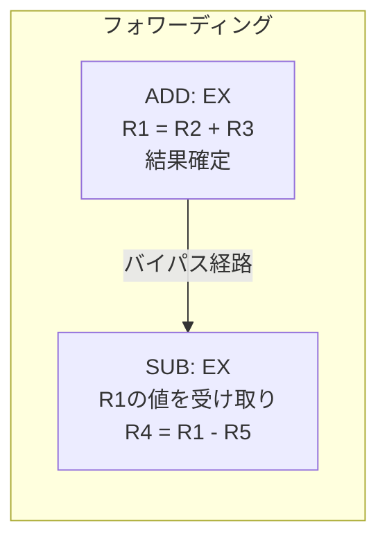

ただし、ロード命令の直後にその結果を使用する場合（load-use hazard）は、データがMEMステージ完了まで確定しないため、フォワーディングだけでは解決できず、1サイクルのストールが不可避である。

**WAW（Write After Write）依存 — 出力依存**

2つの命令が同一レジスタに書き込む場合に発生する。

```
MUL R1, R2, R3    ; R1 = R2 * R3
ADD R1, R4, R5    ; R1 = R4 + R5  ← 同じR1に書き込み
```

インオーダーパイプラインではWBの順序が保証されるため問題にならないが、アウトオブオーダー実行では `ADD` が `MUL` より先に完了する可能性があり、最終的な `R1` の値が誤る危険がある。

**WAR（Write After Read）依存 — 逆依存**

先行命令が読み出すレジスタに、後続命令が書き込む場合に発生する。

```
ADD R3, R1, R2    ; R3 = R1 + R2  ← R1を読み出す
SUB R1, R4, R5    ; R1 = R4 - R5  ← R1に書き込み
```

インオーダーパイプラインではIDステージでレジスタ読み出しが完了するため問題にならないが、アウトオブオーダー実行では `SUB` が先に実行されると `ADD` が誤った `R1` の値を読む可能性がある。

WAWとWARは**名前依存（name dependence）**とも呼ばれ、真のデータ依存ではない。別々の物理レジスタを割り当てる**レジスタリネーミング**によって解消できる。これは後述する。

### 2.3 制御ハザード（Control Hazard）

制御ハザードは、条件分岐命令によって発生する。分岐の成否が確定するまで、次に実行すべき命令が不明であるため、パイプラインの流れが中断される。

```
BEQ R1, R2, label    ; R1 == R2 なら label にジャンプ
ADD R3, R4, R5       ; 分岐不成立なら実行される
...
label:
SUB R6, R7, R8       ; 分岐成立なら実行される
```

分岐がEXステージで解決される場合、2サイクルのペナルティ（バブル）が発生する。深いパイプラインではこのペナルティがさらに大きくなる。

制御ハザードへの対処法は以下の通りである。

| 手法 | 説明 | 効果 |
|------|------|------|
| 分岐遅延スロット | 分岐命令の直後に無条件実行される命令を配置（MIPS） | 1サイクルの有効活用 |
| 静的分岐予測 | 後方分岐は成立、前方分岐は不成立と仮定 | ループで高い精度 |
| 動的分岐予測 | 過去の分岐履歴に基づいてハードウェアが予測 | 95%以上の精度 |
| 投機的実行 | 予測に基づいて先行実行し、ミス時にフラッシュ | 高スループット |

現代のプロセッサは高度な動的分岐予測器（TAGE予測器、パーセプトロン予測器など）を備え、予測精度は99%以上に達する。しかし、分岐予測ミスのペナルティは15〜20サイクルに及ぶため、残り1%のミスでも性能に大きな影響を与える。

## 3. スーパースカラアーキテクチャ

### 3.1 命令レベル並列性（ILP）の活用

パイプラインは1サイクルに1命令を完了させることを目指すが、CPI = 1.0が理論上の上限となる。この壁を超えるために、**1サイクルに複数の命令を発行・実行する**スーパースカラアーキテクチャが考案された。

スーパースカラプロセッサは、命令列中の独立した命令を同時に実行することで**命令レベル並列性（Instruction-Level Parallelism, ILP）**を活用する。ILPとは、プログラム中に存在する、データ依存や制御依存の制約なく同時実行可能な命令の度合いを示す指標である。

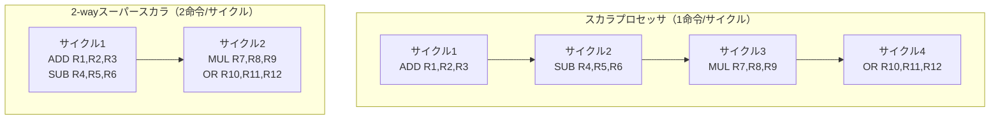

### 3.2 スーパースカラの構成要素

N-way スーパースカラプロセッサとは、1サイクルに最大N個の命令を発行できるプロセッサを指す。これを実現するには以下のハードウェアが必要になる。

| 構成要素 | 役割 |
|---------|------|
| 複数デコーダ | 1サイクルに複数命令を同時にデコード |
| 複数実行ユニット | ALU、FPU、ロード/ストアユニットなどを複数搭載 |
| 多ポートレジスタファイル | 複数命令が同時にレジスタを読み書き可能 |
| 依存関係検出ロジック | 同時発行する命令間のデータ依存を高速に検出 |
| 複数発行ロジック | 依存関係のない命令を選別し、同時に実行ユニットに発行 |

### 3.3 インオーダースーパースカラの限界

初期のスーパースカラプロセッサ（例：Intel i960、MIPS R8000の一部）は、命令をプログラム順（in-order）に発行していた。インオーダー発行の問題は、先頭の命令がハザードによって停止すると、後続の独立した命令まで巻き添えでストールする点にある。

```
LD   R1, [R2]      ; キャッシュミス → 数十サイクル待ち
ADD  R3, R1, R4    ; R1に依存 → ストール
MUL  R5, R6, R7    ; 独立した命令だがストールに巻き込まれる
SUB  R8, R9, R10   ; 独立した命令だがストールに巻き込まれる
```

上の例では、`MUL` と `SUB` は `LD` とも `ADD` とも依存関係がないにもかかわらず、インオーダー発行では実行できない。この問題を解決するのが**アウトオブオーダー実行（Out-of-Order Execution, OoOE）**である。

## 4. アウトオブオーダー実行の仕組み

### 4.1 基本原理

アウトオブオーダー実行の核心は、**命令をプログラム順にフェッチ・デコードし、データが準備できた命令から順に（プログラム順に関係なく）実行し、結果をプログラム順に確定（コミット）する**という3段階のモデルにある。

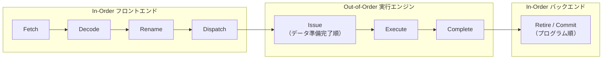

この設計の鍵は、実行順序の自由度を確保しつつ、外部から観測可能な状態（アーキテクチャ状態）はプログラム順序に従って更新するという点にある。これにより、割り込みや例外発生時にも正確な状態を再現できる（**精密例外, precise exception**）。

### 4.2 アウトオブオーダー実行のパイプライン全体像

典型的なアウトオブオーダーパイプラインの各ステージを以下に詳述する。

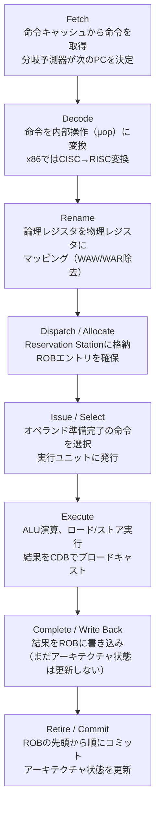

各ステージの詳細は以下の通りである。

**Fetch**: 分岐予測器と連携し、投機的に命令をフェッチし続ける。現代のプロセッサでは1サイクルに4〜8命令をフェッチできる。フェッチ帯域を確保するため、命令キャッシュに加えて**Decoded Stream Buffer（DSB）**やμopキャッシュ（IntelのDSB、AMDのOp Cache）を持つ設計も一般的である。

**Decode**: x86のようなCISC命令セットでは、可変長命令を固定長の内部操作（μop）に分解する。この変換はパイプラインのフロントエンドの中で最も複雑な処理の1つであり、ボトルネックになりやすい。RISC-VやARM（AArch64）のようなRISC命令セットでは命令が固定長であるため、デコードは比較的単純である。

**Rename**: 論理レジスタ（ISAが定義するレジスタ）を物理レジスタにマッピングする。この処理によりWAWとWAR依存が解消される。詳細は第7章で述べる。

**Dispatch**: リネームされた命令をReservation Station（RS）に格納し、同時にReorder Buffer（ROB）にエントリを確保する。

**Issue**: RSの中からすべてのオペランドが準備できた命令を選択し、適切な実行ユニットに発行する。これがアウトオブオーダー実行の核心部分である。

**Execute**: 実際の演算を行う。整数ALU、浮動小数点ユニット、SIMD/ベクトルユニット、ロード/ストアユニットなど、複数の機能ユニットが並列に動作する。

**Complete**: 実行結果をROBおよびRSに書き戻す。共通データバス（Common Data Bus, CDB）を通じて結果をブロードキャストし、依存する命令にデータを転送する。

**Retire**: ROBの先頭（最も古い命令）から順にコミットし、アーキテクチャ状態（アーキテクチャレジスタファイル、メモリ）を更新する。投機的実行が誤りだった場合はROBをフラッシュし、正しいパスから再実行する。

### 4.3 インオーダーとの性能比較

先ほどの例を再考する。

```
LD   R1, [R2]      ; キャッシュミス（100サイクル）
ADD  R3, R1, R4    ; R1に依存
MUL  R5, R6, R7    ; 独立
SUB  R8, R9, R10   ; 独立
AND  R11, R5, R8   ; MULとSUBに依存
```

**インオーダー実行**の場合:
- サイクル1: `LD` 発行 → キャッシュミスで100サイクル待ち
- サイクル101: `ADD` 発行（R1準備完了）
- サイクル102: `MUL` 発行
- サイクル103〜105: `MUL` 実行完了（3サイクルレイテンシと仮定）
- サイクル106: `SUB` 発行
- サイクル107: `AND` 発行
- 合計: 約107サイクル

**アウトオブオーダー実行**の場合:
- サイクル1: `LD` 発行 → キャッシュミスで待機
- サイクル2: `MUL` 発行（R6, R7は準備済み）
- サイクル3: `SUB` 発行（R9, R10は準備済み）
- サイクル4: `MUL` 完了, `SUB` 完了
- サイクル5: `AND` 発行（R5, R8は準備済み）
- サイクル101: `LD` 完了
- サイクル102: `ADD` 発行・完了
- サイクル102: 全命令コミット
- 合計: 約102サイクル

この単純な例でも5サイクルの節約だが、実際のプログラムでは数百の命令が同時にパイプライン中に存在し、アウトオブオーダー実行による効果はさらに大きい。特にキャッシュミスのレイテンシを隠蔽する能力は、メモリウォール問題への重要な対策となる。

## 5. Reservation Station

### 5.1 概念と役割

**Reservation Station（RS）**は、実行ユニットの前段に配置されるバッファであり、命令がオペランドの準備を待つ「待機所」として機能する。各RSエントリは以下の情報を保持する。

| フィールド | 説明 |
|-----------|------|
| Op | 実行すべき演算の種類（ADD, MUL, LD など） |
| Qj, Qk | ソースオペランドjおよびkを生成する命令のタグ（0ならオペランド準備済み） |
| Vj, Vk | ソースオペランドjおよびkの値（準備済みの場合） |
| Dest | 結果の書き込み先（ROBエントリのタグ） |
| Busy | このRSエントリが使用中かどうか |

### 5.2 RSの動作メカニズム

RSの動作を段階的に説明する。

**ディスパッチ時**: 命令がデコード・リネームされた後、RSにエントリが確保される。ソースオペランドが既に準備できている場合は値（V）が直接格納される。未準備の場合は、そのオペランドを生成する命令のタグ（Q）が記録される。

**監視フェーズ**: RSの各エントリは共通データバス（CDB）を継続的に監視する。CDB上に自分が待っているタグと一致する結果がブロードキャストされると、その値を取り込み、対応するQフィールドをクリアする。

**発行**: Qj = 0 かつ Qk = 0（両方のオペランドが準備完了）になったエントリは発行可能となる。複数のエントリが同時に発行可能な場合は、選択ロジック（年齢順、ランダムなど）によって優先度が決定される。

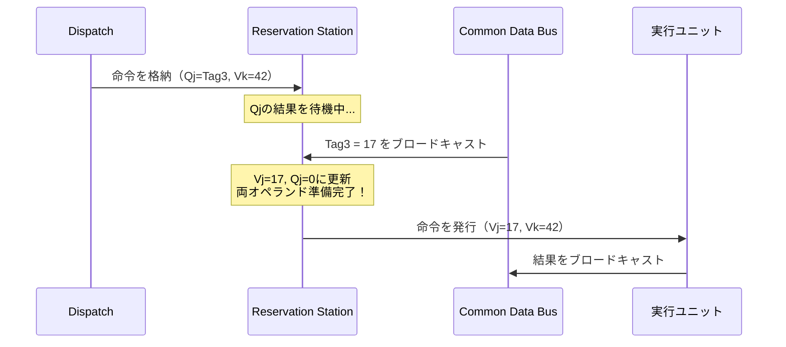

### 5.3 分散RSと集中RS

RSの実装には2つのスタイルがある。

**分散型RS（Distributed Reservation Stations）**: 各実行ユニットに専用のRSを配置する。Tomasuloの元の設計やIntel Core系のマイクロアーキテクチャがこの方式を採用している。利点は発行ロジックが単純で高速な点である。欠点は、特定の実行ユニットのRSが満杯になるとディスパッチが停止する一方、他のRSには空きがあるという非効率が生じうる点である。

**集中型RS（Unified Reservation Station / Issue Queue）**: すべての実行ユニットで共有される単一の発行キューを使用する。AMD Zenシリーズがこの方式に近い設計を採用している。利点はリソースの利用効率が高い点である。欠点はキューのサイズが大きくなり、選択ロジックが複雑化する点である。

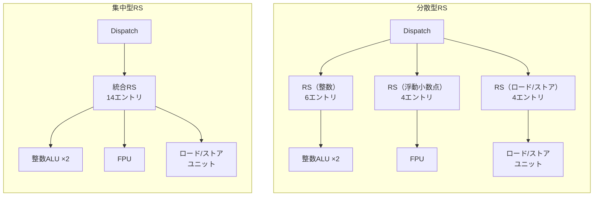

## 6. Reorder Buffer

### 6.1 なぜROBが必要か

アウトオブオーダー実行では命令がプログラム順とは異なる順序で完了するが、プロセッサの外部から見える状態はプログラム順に更新されなければならない。この制約を満たすための機構が**Reorder Buffer（ROB）**である。

ROBが解決する問題は以下の通りである。

1. **精密例外（Precise Exception）**: 例外が発生した際に、その命令より前の命令はすべて完了し、後の命令は一切の影響を残さない状態を保証する
2. **分岐予測ミスのリカバリ**: 投機的に実行された命令の結果を安全に破棄する
3. **割り込みの正確な処理**: 割り込み発生時点の正確なアーキテクチャ状態を再現する

### 6.2 ROBの構造

ROBは**循環バッファ（Circular Buffer）**として実装され、各エントリは以下の情報を保持する。

| フィールド | 説明 |
|-----------|------|
| Type | 命令の種類（レジスタ書き込み、ストア、分岐など） |
| Destination | 結果の書き込み先（レジスタ番号またはメモリアドレス） |
| Value | 実行結果の値 |
| Ready | 実行が完了したかどうか |
| Exception | 例外が発生したかどうか |

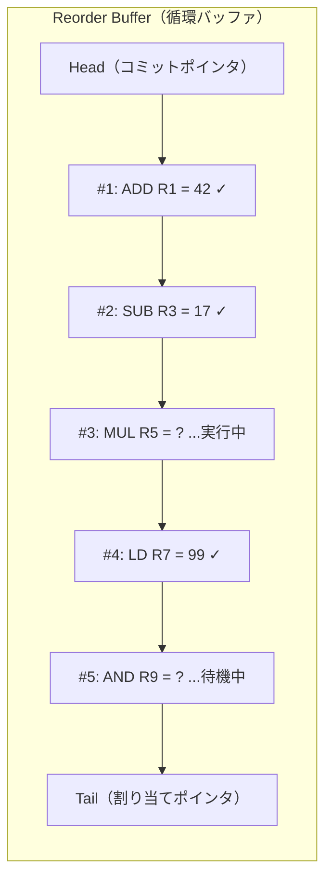

### 6.3 ROBの動作

**ディスパッチ**: 新しい命令がデコードされると、ROBの末尾（Tail）にエントリが確保される。この時点でROBのインデックスが命令のタグ（識別子）として使用される。

**完了（Complete）**: 実行が完了した命令は、対応するROBエントリにValue を書き込み、Readyフラグをセットする。この段階ではアーキテクチャ状態はまだ更新されない。

**コミット（Retire）**: ROBの先頭（Head）のエントリがReady状態であれば、その結果をアーキテクチャレジスタファイルやメモリに反映（コミット）し、エントリを解放してHeadポインタを進める。先頭がReady でない場合はコミットは停止する（後続のReady命令も待たされる）。

**フラッシュ**: 分岐予測ミスが検出された場合、ミスした分岐以降のROBエントリをすべて無効化（フラッシュ）する。これにより投機的実行の結果が安全に破棄される。

::: tip ROBのサイズと性能
ROBのエントリ数は、アウトオブオーダー実行の「窓の大きさ（instruction window）」を決定する重要なパラメータである。ROBが大きいほど、より遠方の独立した命令を見つけてILPを活用できる。現代のプロセッサではROBサイズは数百エントリに達する（Intel Golden Coveで512エントリ、AMD Zen 4で320エントリ）。
:::

### 6.4 ROBとストアバッファ

ストア命令は、ROBだけでは正しく処理できない。ストア命令のコミット前にデータをメモリに書き込んでしまうと、分岐予測ミス時にメモリの状態をロールバックできない。そのため、ストア命令のデータは**Store Buffer（SB）**に一時保管され、コミット時にメモリに書き込まれる。

ロード命令がStore Bufferに存在する未コミットのストアと同一アドレスを参照する場合、**Store-to-Load Forwarding**によりStore Bufferからデータを転送する。これにより、メモリアクセスを経由せずに最新の値を取得できる。

## 7. レジスタリネーミング

### 7.1 名前依存の解消

第2章で述べたWAW依存とWAR依存は、命令が同一の「名前」（論理レジスタ）を共有することに起因する偽の依存関係（false dependency）である。レジスタリネーミングは、ISAが定義する**論理レジスタ（architectural register）**を、プロセッサ内部のより多くの**物理レジスタ（physical register）**にマッピングすることで、これらの偽の依存関係を除去する。

```
; リネーミング前（論理レジスタ）
MUL R1, R2, R3    ; R1 = R2 * R3
ADD R1, R4, R5    ; R1 = R4 + R5  ← WAW依存
SUB R6, R1, R7    ; R6 = R1 - R7

; リネーミング後（物理レジスタ）
MUL P10, P2, P3   ; P10 = P2 * P3
ADD P11, P4, P5   ; P11 = P4 + P5  ← WAW依存が解消！
SUB P12, P11, P7  ; P12 = P11 - P7
```

リネーミング後、`MUL` と `ADD` は異なる物理レジスタ（P10とP11）に書き込むため、実行順序に制約がなくなる。`SUB` は `ADD` の結果（P11）を参照するRAW依存のみが残り、これは真のデータ依存であるため除去できない。

### 7.2 RAT（Register Alias Table）

レジスタリネーミングの実装には**RAT（Register Alias Table）**と呼ばれるマッピングテーブルが使用される。RATは各論理レジスタが現在どの物理レジスタにマッピングされているかを管理する。

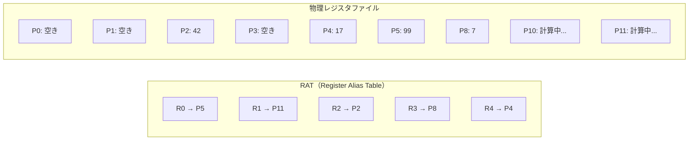

新しい命令がデコードされると、以下の処理が行われる。

1. ソースオペランドの論理レジスタについて、RATを参照して現在の物理レジスタを取得する
2. デスティネーション論理レジスタについて、フリーリストから新しい物理レジスタを割り当てる
3. RATを更新し、デスティネーション論理レジスタの新しいマッピングを登録する

### 7.3 物理レジスタの管理

物理レジスタは**フリーリスト（Free List）**で管理される。新しい命令がデスティネーションレジスタをリネームする際にフリーリストから物理レジスタが1つ取り出され、命令がコミットされて以前のマッピングが不要になると、古い物理レジスタがフリーリストに返却される。

フリーリストが空になると、新たな命令のディスパッチができなくなる。これは物理レジスタ枯渇と呼ばれ、パイプラインのストール要因の1つである。現代のプロセッサは200〜300以上の物理レジスタを搭載している。

### 7.4 リネーミングの実装方式

レジスタリネーミングの実装には主に2つの方式がある。

**RAT + 分離された物理レジスタファイル方式**: RATと物理レジスタファイルを明示的に分離する方式。Intel P6マイクロアーキテクチャ以降で広く採用されている。物理レジスタファイルのサイズは論理レジスタ数より大幅に大きく、典型的にはROBエントリ数と同程度かそれ以上である。

**ROB統合方式**: ROBの各エントリに結果格納領域を設け、ROBエントリ自体を物理レジスタとして使う方式。構造が単純だが、ROBからのデータ読み出しパスが必要となり、レイテンシが増加する場合がある。初期のP6マイクロアーキテクチャではこの方式が使われていた。

## 8. Tomasuloのアルゴリズム

### 8.1 歴史的背景

Tomasuloのアルゴリズムは、1967年にIBM System/360 Model 91の浮動小数点ユニット向けにRobert Tomasuloが考案した。当時、System/360のISAは浮動小数点レジスタを4本しか持たず、コンパイラによるレジスタ割り当ての最適化にも限界があった。Tomasuloは、ハードウェアによる動的なレジスタリネーミングとデータフロー的な命令発行により、この制約を乗り越えた。

Tomasuloのアルゴリズムは現代のアウトオブオーダー実行プロセッサの基盤であり、その基本原理は50年以上経った今でも変わらず使用されている。

### 8.2 アルゴリズムの3つの柱

Tomasuloのアルゴリズムは以下の3つの機構で構成される。

1. **Reservation Station**: 命令がオペランドの準備を待つバッファ（第5章で詳述）
2. **共通データバス（Common Data Bus, CDB）**: 実行結果を全RSにブロードキャストするバス
3. **タグベースのレジスタリネーミング**: RSのエントリIDをタグとして使い、暗黙的にレジスタリネーミングを行う

### 8.3 動作の具体例

以下の命令列でTomasuloのアルゴリズムの動作を追跡する。

```
; 命令列
I1: LD   F6, 34(R2)       ; F6 = Mem[R2 + 34]
I2: LD   F2, 45(R3)       ; F2 = Mem[R3 + 45]
I3: MUL  F0, F2, F4       ; F0 = F2 * F4
I4: SUB  F8, F6, F2       ; F8 = F6 - F2
I5: DIV  F10, F0, F6      ; F10 = F0 / F6
I6: ADD  F6, F8, F2       ; F6 = F8 + F2
```

依存関係を分析する。

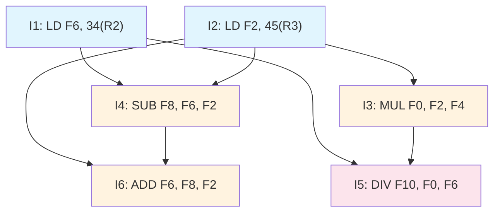

> [!NOTE]
> I6は `F6` に書き込むが、I1も `F6` に書き込んでいる（WAW依存）。また、I5は `F6` を読むが、I6が `F6` に書き込む（WAR依存）。Tomasuloのアルゴリズムでは、RSのタグによるリネーミングでこれらの偽の依存関係が自動的に解消される。

**サイクルごとの状態遷移（簡略版）**

以下では、LD のレイテンシを2サイクル、ADD/SUBを2サイクル、MULを10サイクル、DIVを40サイクルと仮定する。

| サイクル | Issue | Execute | Write Result | 備考 |
|---------|-------|---------|-------------|------|
| 1 | I1 | | | Load1 RSに格納 |
| 2 | I2 | I1 | | Load2 RSに格納 |
| 3 | I3 | I2 | I1 | Mult1 RSに格納, F6の値がCDBでブロードキャスト |
| 4 | I4 | | I2 | Add1 RSに格納, F2の値がCDBでブロードキャスト |
| 5 | I5 | I3, I4 | | Mult2 RSに格納, MULとSUBの両オペランド準備完了 |
| 6 | I6 | I3, I4 | | Add2 RSに格納（F8をI4のタグで待機, F2は値あり） |
| 7 | | I3, I4 | I4 | SUB完了, F8の値がCDBでブロードキャスト |
| 8 | | I3, I6 | | ADD(I6)の両オペランド準備完了, 実行開始 |
| 9 | | I3, I6 | | |
| 10 | | I3 | I6 | ADD(I6)完了 |
| ... | | I3 | | MUL継続実行 |
| 15 | | | I3 | MUL完了, F0の値がCDBでブロードキャスト |
| 16 | | I5 | | DIV開始（F0とF6の両方が準備完了） |
| ... | | I5 | | DIV継続実行 |
| 56 | | | I5 | DIV完了 |

ここで重要なのは、I6（`ADD F6, F8, F2`）がI5（`DIV F10, F0, F6`）より先に完了しても問題ない点である。I5は発行時にI1の結果である `F6` の値（またはそのタグ）を既に取得しているため、I6が後から `F6` を上書きしてもI5には影響しない。これがタグベースのリネーミングによるWAR依存の解消である。

### 8.4 CDB（Common Data Bus）の役割

CDBはTomasuloのアルゴリズムの心臓部であり、以下の特性を持つ。

- **ブロードキャスト型**: 実行結果（タグと値のペア）がすべてのRSと ROBに同時に送信される
- **連想照合**: 各RSエントリはCDB上のタグを自身の待機タグと比較し、一致すれば値を取り込む
- **ボトルネック**: CDBは1サイクルに1つの結果しか送信できない（元の設計）。現代のプロセッサではCDBを複数本に拡張している

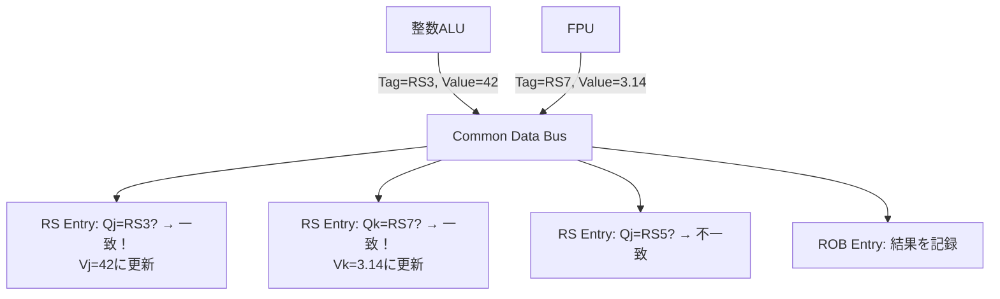

### 8.5 元のTomasuloと現代の拡張

元のTomasuloのアルゴリズムにはROBが存在せず、精密例外をサポートしていなかった。1988年にJames E. Smithが提案したROBの概念が加わることで、投機的実行と精密例外が可能となり、現代のアウトオブオーダー実行の基本形が完成した。

現代のプロセッサにおける主な拡張は以下の通りである。

| 拡張 | 説明 |
|-----|------|
| ROB追加 | 精密例外と投機的実行のサポート |
| 物理レジスタファイル分離 | ROB内ではなく独立した物理レジスタファイルで結果を管理 |
| 複数CDB | 複数の結果を同時にブロードキャスト |
| メモリ曖昧性解消 | ロード/ストア間のアドレス依存を動的に検出 |
| 分岐予測統合 | 投機的フェッチ・実行と予測ミスリカバリ |
| μop融合・分解 | CISCの複合命令をμopに分解し、場合によっては融合 |

## 9. 現代CPUの実装例

### 9.1 Intel Core（Golden Cove / Raptor Cove）マイクロアーキテクチャ

Intel第12世代（Alder Lake）以降のPコア（Performance Core）に使用されるGolden Coveマイクロアーキテクチャは、アウトオブオーダー実行の最先端の実装例である。

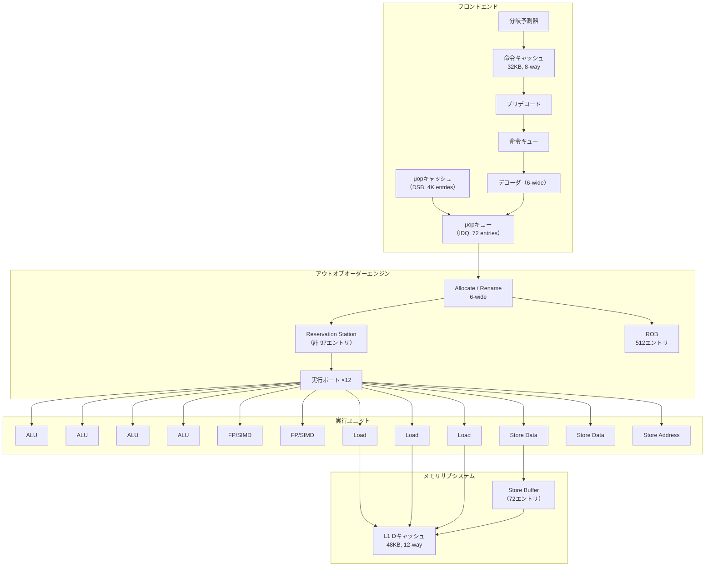

Golden Coveの主要パラメータ:

| パラメータ | 値 |
|-----------|-----|
| パイプライン段数 | 約20段 |
| フェッチ幅 | 16バイト/サイクル + μopキャッシュ |
| デコード幅 | 6 μops/サイクル |
| リネーム/アロケート幅 | 6 μops/サイクル |
| ROBエントリ数 | 512 |
| RSエントリ数 | 97（分散型） |
| 物理レジスタ数 | 整数280+、浮動小数点/SIMD 332+ |
| 実行ポート数 | 12 |
| ロードバッファ | 128エントリ |
| ストアバッファ | 72エントリ |
| 分岐予測ミスペナルティ | 約15〜20サイクル |

### 9.2 AMD Zen 4 マイクロアーキテクチャ

AMD Zen 4（Ryzen 7000シリーズ）は、Intelとは異なるアプローチでアウトオブオーダー実行を実装している。

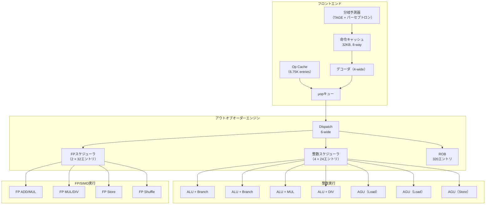

Zen 4の特徴的な設計として以下が挙げられる。

- **4-wideデコード + 6-wideディスパッチ**: Op Cache（μopキャッシュ）からのバイパスにより実質的なスループットを向上
- **分散型整数スケジューラ**: 4つの独立したスケジューラに分割し、各スケジューラが専用のALUポートを持つ
- **統合型FPスケジューラ**: 浮動小数点/SIMD系は2つのスケジューラで統合管理
- **ROB 320エントリ**: Golden Coveの512より少ないが、スケジューラ効率の高さで補う

### 9.3 Apple M シリーズ（Firestorm / Avalanche コア）

Apple M1/M2/M3のPコアは、ARMv8（AArch64）ベースでありながら、x86系プロセッサを凌駕する広いアウトオブオーダーウィンドウを持つ。

| パラメータ | Firestorm（M1 Pコア）推定値 |
|-----------|---------------------------|
| デコード幅 | 8 μops/サイクル |
| ROBエントリ数 | 約630 |
| 整数レジスタ | 約380 |
| 実行ユニット数 | 13（ALU×4, FP/SIMD×4, Load×2, Store×2, Branch×1） |
| リオーダーウィンドウ | 約630命令 |

Firestormコアの設計哲学は「とにかくアウトオブオーダーウィンドウを広くする」というものであり、これは以下の理由で有効である。

1. **ARMの固定長命令**: x86と異なりデコードが単純で、フロントエンドのボトルネックが小さい
2. **ISAの豊富なレジスタ**: AArch64は31本の汎用レジスタを持ち、コンパイラがレジスタ割り当てを最適化しやすい
3. **消費電力の余裕**: モバイル向けSoCとして電力予算内で広いウィンドウを実現

### 9.4 インオーダーコアの現代的意義

すべてのプロセッサコアがアウトオブオーダー実行を採用しているわけではない。以下のようなユースケースでは、インオーダーコアが意図的に選択される。

**Eコア（Efficiency Core）**: Intel Alder Lake以降のEコア（Gracemont/Crestmont）やARMのLittleコア（Cortex-A510/A520）は、省電力性を重視した比較的シンプルなマイクロアーキテクチャを採用している。ただし、これらも基本的なアウトオブオーダー実行機能は持っている。完全なインオーダー設計は、現在では組込み用途（ARM Cortex-R/Mシリーズなど）が主体である。

**GPU**: GPUのコア（CUDA CoreやShader Processor）はインオーダー実行であり、アウトオブオーダー実行のハードウェアを持たない。代わりに大量のスレッドを同時実行し、あるスレッドがメモリ待ちの間に別のスレッドを実行する**スレッドレベル並列性（Thread-Level Parallelism, TLP）**でレイテンシを隠蔽する。

**RISC-Vのスペクトラム**: RISC-Vエコシステムでは、SiFive U74（インオーダー）からSiFive P670（アウトオブオーダー）まで、さまざまな実装が存在する。アプリケーションの要件に応じてマイクロアーキテクチャの複雑度を選択できるのがRISC-Vの柔軟性である。

### 9.5 Spectre/Meltdown — 投機的実行の代償

2018年に公開されたSpectreおよびMeltdown脆弱性は、アウトオブオーダー実行と投機的実行が持つセキュリティ上の問題を世界に知らしめた。

**Meltdown（CVE-2017-5754）**: 投機的実行中にカーネル空間のデータが一時的にマイクロアーキテクチャ状態（キャッシュ）に影響を与えることを利用し、権限外のメモリを読み取る攻撃。投機的にロードされたデータはROBのフラッシュにより論理的には破棄されるが、キャッシュへの影響（サイドチャネル）は残る。

**Spectre（CVE-2017-5753, CVE-2017-5715）**: 分岐予測を意図的にミストレーニングし、攻撃者が望むパスを投機的に実行させることで、サイドチャネルを通じて秘密情報を漏洩させる攻撃。

これらの脆弱性への対策として、以下が導入された。

- **KPTI（Kernel Page Table Isolation）**: Meltdown対策。ユーザ空間とカーネル空間のページテーブルを分離
- **Retpoline**: Spectre Variant 2対策。間接分岐をreturn命令に置き換え
- **IBRS/IBPB/STIBP**: 分岐予測器のセキュリティ強化命令
- **マイクロコードアップデート**: プロセッサのマイクロコードレベルでの緩和策

> [!WARNING]
> 投機的実行の脆弱性は、アウトオブオーダー実行の本質的なトレードオフを示している。性能のために投機的に実行された命令は、論理的にはキャンセルされても、マイクロアーキテクチャレベルの痕跡（キャッシュ状態など）を完全に消去することが困難である。この問題は現在も活発に研究されている。

## 10. まとめ — 命令レベル並列性の過去・現在・未来

### 10.1 技術の進化の系譜

アウトオブオーダー実行とスーパースカラは、半世紀以上にわたるプロセッサ設計の集大成である。

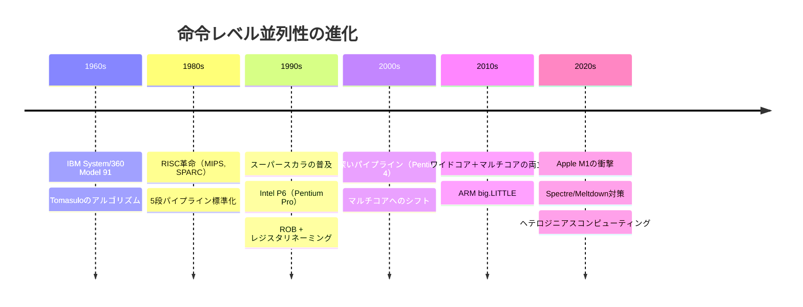

### 10.2 設計上のトレードオフ

アウトオブオーダー実行の設計には本質的なトレードオフが存在する。

**性能 vs. 消費電力**: アウトオブオーダー実行のハードウェア（RS、ROB、リネーミングロジック、CDB）は、チップ面積と消費電力の大きな部分を占める。インオーダーコアと比較して、OoOEエンジンだけで2〜3倍の電力を消費するとされる。

**ウィンドウサイズ vs. 複雑度**: ROBやRSのエントリ数を増やせばILPの活用度は上がるが、選択ロジックの複雑度が二次関数的に増加し、クロック周波数の低下や消費電力の増大を招く。

**投機の深さ vs. セキュリティ**: 投機的実行を積極的に行うほど性能は向上するが、Spectre系の脆弱性のリスクも増大する。

### 10.3 ILPの壁とその先

研究により、一般的なプログラムに含まれるILPには限界があることが知られている。理想的な条件下でもILPは命令ウィンドウサイズに対して対数的にしか増加せず、実用的にはIPC 3〜6程度が上限とされる。

この壁を超えるため、現代のプロセッサ設計は以下の方向に進化している。

- **マルチコア / マルチスレッド**: スレッドレベル並列性（TLP）の活用
- **SIMD / ベクトル拡張**: データレベル並列性（DLP）の活用。AVX-512やSVE
- **ヘテロジニアスコンピューティング**: Pコア + Eコア、CPU + GPU + NPU
- **ドメイン特化アクセラレータ**: TPU、行列演算ユニット（AMX）、暗号化エンジン

アウトオブオーダー実行は、シングルスレッド性能の基盤として今後も不可欠であり続けるが、それ単体でのスケーリングには限界がある。現代のプロセッサ設計は、ILP、TLP、DLPの3つの並列性を適切に組み合わせることで、総合的な性能向上を追求している。

アウトオブオーダー実行の理解は、コンパイラの最適化（命令スケジューリング、レジスタ割り当て）、システムプログラミング（メモリバリア、ロックフリーアルゴリズム）、セキュリティ（投機的実行脆弱性の理解と対策）など、コンピュータサイエンスの幅広い分野において不可欠な基礎知識である。
