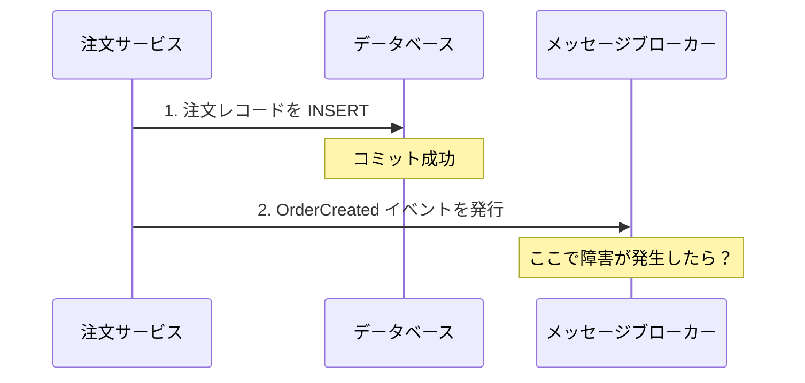
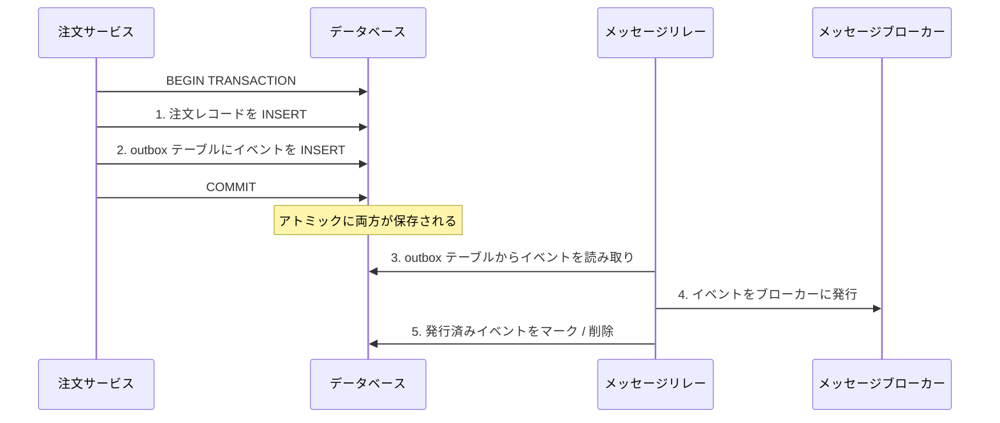
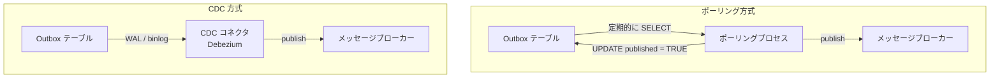
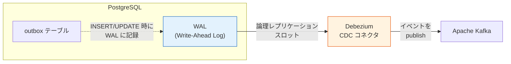
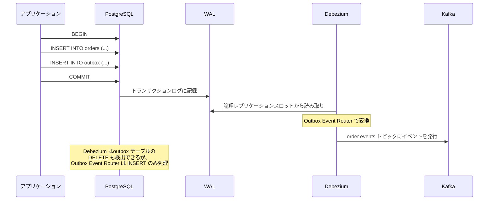
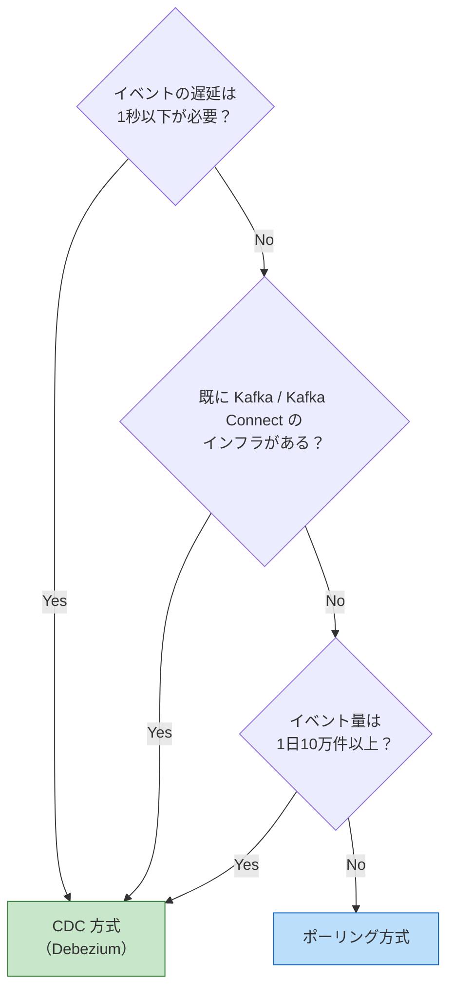
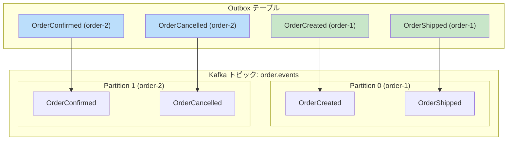
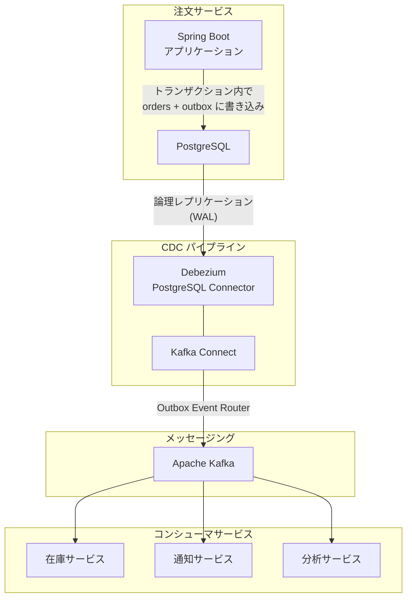
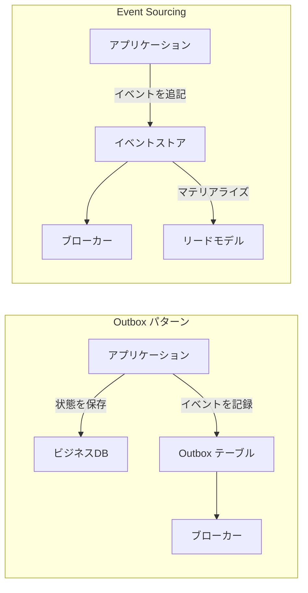
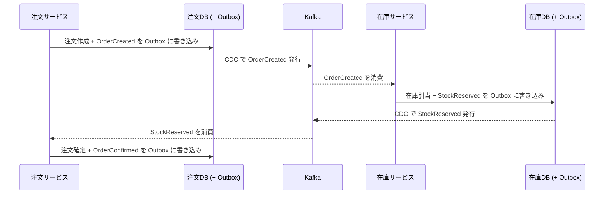

# Outbox パターン（Transactional Outbox）

## 1. はじめに：マイクロサービスにおける「二重書き込み」の罠

マイクロサービスアーキテクチャを採用すると、サービスはそれぞれ独立したデータベースを持ち、サービス間の連携にはイベント（メッセージ）を用いるのが一般的になる。たとえば注文サービスが注文を受け付けたら、自身のデータベースに注文レコードを保存し、同時に「注文が作成された」というイベントを Kafka などのメッセージブローカーに発行して、在庫サービスや通知サービスに処理を委ねる。

一見すると単純に見えるこの処理には、分散システム特有の深刻な問題が潜んでいる。それが**Dual Write 問題（二重書き込み問題）**である。

### 1.1 Dual Write 問題とは

Dual Write 問題とは、**2 つの異なるシステム（典型的にはデータベースとメッセージブローカー）に対して、アトミックに書き込みを行えない**という問題である。



上の図において、ステップ 1（データベースへの書き込み）は成功したが、ステップ 2（メッセージブローカーへのイベント発行）が失敗した場合を考えてみよう。データベースには注文レコードが存在するが、下流のサービスにはイベントが届かない。在庫は引き当てられず、顧客には確認メールが送られない。データベースとイベントの間に**不整合**が生じてしまう。

逆のケースも問題になる。イベントを先に発行し、その後データベースに書き込む順番にすると、イベントは送信されたがデータベースへの書き込みが失敗するという逆の不整合が発生する可能性がある。

### 1.2 なぜ分散トランザクションでは解決できないのか

「データベースとメッセージブローカーを 1 つのトランザクションで包めばよいのでは？」と考えるかもしれない。これは**分散トランザクション（Two-Phase Commit, 2PC）**の考え方である。

しかし、分散トランザクションには以下の根本的な問題がある。

- **可用性の低下**：2PC はブロッキングプロトコルであり、コーディネーターやパーティシパントに障害が発生するとトランザクション全体が停止する
- **パフォーマンスの低下**：すべての参加者がロックを保持した状態で合意を待つため、レイテンシが大幅に増加する
- **対応の制約**：多くのメッセージブローカー（Kafka を含む）は XA トランザクション（分散トランザクションの標準プロトコル）をサポートしていない
- **運用の複雑性**：分散トランザクションの障害リカバリは非常に複雑で、ヒューリスティック決定（heuristic decision）が必要になる場合がある

::: warning 分散トランザクションの限界
Pat Helland は 2007 年の論文「Life beyond Distributed Transactions: an Apostate's Opinion」において、スケーラブルなシステムでは分散トランザクションに頼るべきではないと主張した。現代のマイクロサービスアーキテクチャでは、この見解が広く支持されている。
:::

### 1.3 Dual Write の発生パターン

Dual Write 問題は、以下のようなさまざまな場面で発生する。

| パターン | 書き込み先 1 | 書き込み先 2 | 不整合の結果 |
|---------|------------|------------|------------|
| イベント発行 | ローカル DB | メッセージブローカー | イベントの欠落 |
| キャッシュ更新 | ローカル DB | Redis キャッシュ | 陳腐化したキャッシュ |
| 検索インデックス更新 | ローカル DB | Elasticsearch | 検索結果の不一致 |
| CQRS のリード側更新 | ライト側 DB | リード側 DB | クエリ結果の不整合 |

これらすべてに共通するのは、「2 つの異なるデータストアに一貫性を保って書き込みたいが、アトミックにそれを行う手段がない」という構造的な問題である。

## 2. Outbox パターンの基本原理

### 2.1 核心となるアイデア

Outbox パターン（Transactional Outbox パターン）は、Dual Write 問題に対するエレガントな解決策である。その核心は驚くほどシンプルである。

> **ビジネスデータの変更とイベントの記録を、同じデータベーストランザクション内で行う。**

具体的には、データベースに `outbox` テーブルを作成し、ビジネスデータの変更と同じトランザクション内でイベントをこのテーブルに書き込む。その後、別のプロセスが `outbox` テーブルからイベントを読み取り、メッセージブローカーに発行する。



このアプローチが Dual Write 問題を解決できる理由は明確である。データベースの ACID トランザクションにより、**ビジネスデータの変更とイベントの記録はアトミックに行われる**。どちらか一方だけが保存されることはない。ビジネスデータがコミットされれば必ずイベントも記録され、ロールバックされれば両方とも取り消される。

### 2.2 Outbox テーブルの設計

Outbox テーブルの典型的なスキーマは以下のようになる。

```sql
CREATE TABLE outbox (
    id            UUID PRIMARY KEY DEFAULT gen_random_uuid(),
    aggregate_type VARCHAR(255) NOT NULL,   -- e.g., 'Order', 'Customer'
    aggregate_id   VARCHAR(255) NOT NULL,   -- e.g., order ID
    event_type     VARCHAR(255) NOT NULL,   -- e.g., 'OrderCreated'
    payload        JSONB NOT NULL,          -- event data
    created_at     TIMESTAMPTZ NOT NULL DEFAULT now(),
    published      BOOLEAN NOT NULL DEFAULT FALSE
);

-- Index for efficient polling
CREATE INDEX idx_outbox_unpublished ON outbox (created_at)
    WHERE published = FALSE;
```

各カラムの設計意図を説明する。

- **`id`**：イベントの一意識別子。コンシューマ側で冪等性を担保するために使用する
- **`aggregate_type`**：DDD（ドメイン駆動設計）における集約の種類。メッセージブローカーのトピック名の決定に使用されることが多い
- **`aggregate_id`**：集約の ID。同じ集約に対するイベントの順序を保証するためのパーティションキーとして使用する
- **`event_type`**：イベントの種類。コンシューマがイベントの処理方法を判別するために使用する
- **`payload`**：イベントの本体。JSON 形式でイベントのデータを格納する
- **`created_at`**：イベントの作成時刻。ポーリング時の順序付けに使用する
- **`published`**：イベントが発行済みかどうかを示すフラグ。ポーリング方式で使用する（CDC 方式では不要な場合もある）

::: tip Outbox テーブルの命名
Outbox テーブルの名前は慣例的に `outbox` や `outbox_event` が使われるが、Debezium の Outbox Event Router を使う場合は設定で任意のテーブル名を指定できる。ドメインごとに分ける場合は `order_outbox`、`customer_outbox` のように命名することもある。
:::

### 2.3 ビジネストランザクションとの統合

Outbox パターンの要は、ビジネスロジックとイベント記録を同一トランザクション内で行うことである。以下に擬似コードで示す。

```java
@Transactional
public Order createOrder(CreateOrderRequest request) {
    // 1. Create the order entity
    Order order = new Order(request.getCustomerId(), request.getItems());
    orderRepository.save(order);

    // 2. Create the outbox event in the same transaction
    OutboxEvent event = new OutboxEvent(
        "Order",                          // aggregate type
        order.getId().toString(),         // aggregate ID
        "OrderCreated",                   // event type
        toJson(new OrderCreatedPayload(   // payload
            order.getId(),
            order.getCustomerId(),
            order.getItems(),
            order.getTotalAmount()
        ))
    );
    outboxRepository.save(event);

    return order;
}
```

この `@Transactional` アノテーション（Spring Framework の例）により、`orderRepository.save()` と `outboxRepository.save()` は同一のデータベーストランザクション内で実行される。どちらか一方が失敗すればトランザクション全体がロールバックされ、不整合は発生しない。

## 3. Outbox からイベントを読み取る 2 つのアプローチ

Outbox テーブルに書き込まれたイベントをメッセージブローカーに転送する方法には、大きく分けて 2 つのアプローチがある。**ポーリング方式**と **CDC（Change Data Capture）方式**である。



### 3.1 ポーリング方式（Polling Publisher）

#### 基本的な仕組み

ポーリング方式は最もシンプルなアプローチである。バックグラウンドプロセスが定期的に Outbox テーブルに対して未発行のイベントを問い合わせ（ポーリング）、取得したイベントをメッセージブローカーに発行し、発行済みとしてマークする。

```sql
-- 1. Fetch unpublished events
SELECT id, aggregate_type, aggregate_id, event_type, payload, created_at
FROM outbox
WHERE published = FALSE
ORDER BY created_at ASC
LIMIT 100
FOR UPDATE SKIP LOCKED;

-- 2. After publishing to the broker, mark as published
UPDATE outbox
SET published = TRUE
WHERE id IN (:published_ids);
```

`FOR UPDATE SKIP LOCKED` は、複数のポーリングプロセスが並行して動作する場合に、同じイベントを重複して処理することを防ぐための仕組みである。ロックされているレコードはスキップし、ロックされていないレコードのみを取得する。

#### ポーリング方式の実装例

```python
import time
import json
import psycopg2
from kafka import KafkaProducer

producer = KafkaProducer(
    bootstrap_servers=['localhost:9092'],
    value_serializer=lambda v: json.dumps(v).encode('utf-8'),
    acks='all'  # Wait for all replicas to acknowledge
)

def poll_and_publish():
    conn = psycopg2.connect("dbname=orders user=app")
    try:
        with conn.cursor() as cur:
            # Fetch unpublished events with row-level locking
            cur.execute("""
                SELECT id, aggregate_type, aggregate_id,
                       event_type, payload, created_at
                FROM outbox
                WHERE published = FALSE
                ORDER BY created_at ASC
                LIMIT 100
                FOR UPDATE SKIP LOCKED
            """)
            rows = cur.fetchall()

            published_ids = []
            for row in rows:
                event_id, agg_type, agg_id, evt_type, payload, created = row
                topic = f"{agg_type.lower()}.events"

                # Publish to Kafka with aggregate_id as key
                # to ensure ordering within the same aggregate
                future = producer.send(
                    topic,
                    key=agg_id.encode('utf-8'),
                    value={
                        'eventId': str(event_id),
                        'eventType': evt_type,
                        'aggregateType': agg_type,
                        'aggregateId': agg_id,
                        'payload': payload,
                        'timestamp': created.isoformat()
                    }
                )
                future.get(timeout=10)  # Wait for acknowledgement
                published_ids.append(event_id)

            # Mark events as published
            if published_ids:
                cur.execute(
                    "UPDATE outbox SET published = TRUE WHERE id = ANY(%s)",
                    (published_ids,)
                )
            conn.commit()

    except Exception as e:
        conn.rollback()
        raise
    finally:
        conn.close()

# Main polling loop
while True:
    poll_and_publish()
    time.sleep(1)  # Poll every second
```

#### ポーリング方式の利点と課題

| 観点 | 評価 |
|------|------|
| **シンプルさ** | 実装が非常にシンプル。追加のインフラストラクチャが不要 |
| **データベース負荷** | 頻繁なポーリングはデータベースに負荷をかける |
| **レイテンシ** | ポーリング間隔に依存する。1 秒間隔なら最大 1 秒の遅延 |
| **スケーラビリティ** | `FOR UPDATE SKIP LOCKED` で複数インスタンスに対応可能だが、限界がある |
| **Outbox テーブルの肥大化** | 発行済みイベントの定期的な削除（パージ）が必要 |

::: warning ポーリング間隔のジレンマ
ポーリング間隔を短くすればレイテンシは改善するが、データベースへの問い合わせ頻度が増加する。長くすればデータベース負荷は下がるが、イベントの遅延が大きくなる。このトレードオフはポーリング方式の本質的な限界である。
:::

### 3.2 CDC 方式（Change Data Capture）

#### CDC とは何か

CDC（Change Data Capture）とは、データベースのトランザクションログ（PostgreSQL の WAL、MySQL の binlog）を監視し、データの変更をリアルタイムに検出・取得する技術である。

CDC がポーリングよりも優れている点は、**データベースのトランザクションログを直接読み取る**ため、ポーリングのようなデータベースへの追加的な問い合わせが不要であり、変更がコミットされた瞬間にほぼリアルタイムでキャプチャできることである。



#### Debezium による Outbox 読み取り

Debezium は、Red Hat が開発するオープンソースの CDC プラットフォームであり、Outbox パターンとの組み合わせにおいて事実上の標準となっている。Debezium は Kafka Connect フレームワーク上で動作し、データベースのトランザクションログを監視して変更イベントを Kafka トピックに書き込む。

Debezium には**Outbox Event Router**という専用の SMT（Single Message Transform）が組み込まれている。これは、Outbox テーブルへの書き込みを検出し、Outbox テーブルの構造に基づいてイベントを適切な Kafka トピックにルーティングする機能である。



#### Debezium Outbox Event Router の設定

Debezium の Outbox Event Router を使用する際の Kafka Connect コネクタ設定例を以下に示す。

```json
{
  "name": "order-outbox-connector",
  "config": {
    "connector.class": "io.debezium.connector.postgresql.PostgresConnector",
    "database.hostname": "postgres",
    "database.port": "5432",
    "database.user": "debezium",
    "database.password": "dbz",
    "database.dbname": "orders",
    "topic.prefix": "order-service",
    "table.include.list": "public.outbox",

    "tombstones.on.delete": "false",
    "transforms": "outbox",
    "transforms.outbox.type":
      "io.debezium.transforms.outbox.EventRouter",
    "transforms.outbox.table.fields.additional.placement":
      "event_type:header:eventType",
    "transforms.outbox.route.by.field": "aggregate_type",
    "transforms.outbox.route.topic.replacement":
      "${routedByValue}.events",

    "transforms.outbox.table.field.event.id": "id",
    "transforms.outbox.table.field.event.key": "aggregate_id",
    "transforms.outbox.table.field.event.payload": "payload",
    "transforms.outbox.table.field.event.timestamp": "created_at"
  }
}
```

この設定により、Debezium は以下のように動作する。

1. `public.outbox` テーブルへの変更を監視する
2. `aggregate_type` フィールドの値に基づいてトピック名を決定する（例：`Order` -> `Order.events`）
3. `aggregate_id` を Kafka メッセージのキーとして使用する（パーティション分散と順序保証のため）
4. `payload` フィールドをメッセージの本体として使用する

#### CDC 方式の利点と課題

| 観点 | 評価 |
|------|------|
| **レイテンシ** | ほぼリアルタイム（ミリ秒〜数秒） |
| **データベース負荷** | トランザクションログの読み取りなので、ポーリングより低負荷 |
| **信頼性** | WAL ベースなのでイベントの取りこぼしがない |
| **運用の複雑性** | Debezium、Kafka Connect、Kafka のインフラストラクチャが必要 |
| **デバッグの難しさ** | トランザクションログレベルの問題追跡が必要になることがある |

### 3.3 ポーリング vs CDC：どちらを選ぶべきか



一般的な指針として、以下のように整理できる。

- **ポーリング方式が適するケース**：小〜中規模のシステム、追加インフラを最小限にしたい場合、イベントの遅延が秒単位で許容できる場合
- **CDC 方式が適するケース**：大規模なシステム、リアルタイムに近いイベント配信が必要な場合、既に Kafka エコシステムを運用している場合

実際のプロジェクトでは、最初はポーリング方式で始め、スケールや要件に応じて CDC 方式に移行するという段階的なアプローチも有効である。

## 4. 冪等なコンシューマ（Idempotent Consumer）

Outbox パターンにおいて、メッセージリレー（ポーリングプロセスまたは CDC コネクタ）がイベントをメッセージブローカーに発行した後、そのイベントの発行済みマーク（ポーリング方式）や WAL の読み取り位置の更新（CDC 方式）の前に障害が発生すると、同じイベントが**重複して発行**される可能性がある。

これは Outbox パターンに固有の問題ではなく、分散システムにおけるメッセージ配信の根本的な性質に関わる問題である。

### 4.1 メッセージ配信の保証レベル

メッセージングシステムにおける配信保証は、以下の 3 つのレベルに分類される。

| 保証レベル | 意味 | 実現の難しさ |
|-----------|------|------------|
| **At-most-once** | 最大 1 回配信。メッセージが失われる可能性がある | 容易 |
| **At-least-once** | 少なくとも 1 回配信。重複する可能性がある | 中程度 |
| **Exactly-once** | 正確に 1 回配信。メッセージの欠落も重複もない | 非常に困難 |

Outbox パターンは本質的に **At-least-once** の配信保証を提供する。メッセージが少なくとも 1 回はコンシューマに届くことを保証するが、重複配信の可能性を完全に排除することはできない。

::: tip Exactly-once は幻想か？
厳密な意味での Exactly-once 配信は、ネットワーク障害が存在する環境では原理的に達成が極めて困難である。Kafka Streams などが提供する「Exactly-once semantics」は、実際には冪等なプロデューサーとトランザクショナルなコンシューマの組み合わせによる「Effectively exactly-once（実質的に exactly-once）」であり、エンドツーエンドでの exactly-once ではない。実用上は At-least-once + 冪等なコンシューマが最も現実的な選択である。
:::

### 4.2 冪等性の実装パターン

コンシューマが重複メッセージを安全に処理するために、以下のパターンが使われる。

#### パターン 1：イベント ID による重複排除テーブル

最も一般的なパターンである。処理済みのイベント ID を記録するテーブルを用意し、イベント処理とイベント ID の記録を同一トランザクション内で行う。

```sql
CREATE TABLE processed_events (
    event_id UUID PRIMARY KEY,
    processed_at TIMESTAMPTZ NOT NULL DEFAULT now()
);
```

```java
@Transactional
public void handleOrderCreated(OrderCreatedEvent event) {
    // Check if this event has already been processed
    if (processedEventRepository.existsById(event.getEventId())) {
        log.info("Event {} already processed, skipping", event.getEventId());
        return;
    }

    // Process the event (business logic)
    inventoryService.reserveStock(event.getOrderId(), event.getItems());

    // Record the event as processed (in the same transaction)
    processedEventRepository.save(
        new ProcessedEvent(event.getEventId())
    );
}
```

このパターンのポイントは、**ビジネスロジックの実行とイベント ID の記録が同一トランザクション内で行われる**ことである。これにより、ビジネスロジックが実行されたにもかかわらずイベント ID が記録されない（またはその逆の）不整合を防ぐ。

#### パターン 2：自然な冪等性（Natural Idempotency）

ビジネスロジック自体が本質的に冪等であれば、追加の重複排除メカニズムは不要である。

```sql
-- This operation is naturally idempotent:
-- Running it multiple times produces the same result
UPDATE inventory
SET reserved_quantity = reserved_quantity + :amount
WHERE product_id = :product_id
  AND order_id = :order_id    -- order_id prevents double reservation
  AND NOT EXISTS (
      SELECT 1 FROM reservations
      WHERE order_id = :order_id AND product_id = :product_id
  );
```

#### パターン 3：条件付き更新（Optimistic Concurrency）

バージョン番号やタイムスタンプを使った楽観的排他制御により、同じ更新が 2 回適用されることを防ぐ。

```sql
-- Only update if the version matches (prevents duplicate processing)
UPDATE orders
SET status = 'CONFIRMED', version = version + 1
WHERE id = :order_id AND version = :expected_version;
-- If affected rows = 0, the update was already applied
```

### 4.3 重複排除テーブルの運用

重複排除テーブル（`processed_events`）は無限に肥大化するため、一定期間が経過したレコードを定期的にパージする必要がある。メッセージブローカー側のリテンション期間（Kafka のデフォルトは 7 日間）を超えたレコードは安全に削除できる。

```sql
-- Purge events older than the broker's retention period
DELETE FROM processed_events
WHERE processed_at < now() - INTERVAL '14 days';
```

リテンション期間よりも長めの保持期間（上の例では 14 日間）を設定するのが安全である。

## 5. イベントの順序保証

分散システムにおいてイベントの順序を保証することは、非常にデリケートな問題である。Outbox パターンにおいても、イベントの順序保証をどの範囲で実現するかは重要な設計判断となる。

### 5.1 順序保証の範囲

#### グローバル順序（Total Order）

すべてのイベントがシステム全体で厳密に順序付けされること。これは実現が非常に困難であり、通常は必要ない。Kafka の単一パーティションでは実現可能だが、スループットが大幅に制限される。

#### 集約単位の順序（Per-Aggregate Order）

同じ集約（たとえば同じ注文 ID）に対するイベントが順序通りに処理されること。これは多くのビジネス要件で必要十分であり、Outbox パターンで実現可能である。



### 5.2 Kafka のパーティションキーによる順序保証

Kafka は同一パーティション内でのメッセージ順序を保証する。したがって、同じ集約に属するイベントを同じパーティションに送るために、**`aggregate_id` をメッセージキーとして使用する**のが定石である。

Kafka はメッセージキーのハッシュ値に基づいてパーティションを決定するため、同じ `aggregate_id` を持つイベントは常に同じパーティションに振り分けられる。

```java
// Send event with aggregate_id as key
// Events with the same key go to the same partition
producer.send(new ProducerRecord<>(
    "order.events",                    // topic
    event.getAggregateId(),            // key -> determines partition
    serializeEvent(event)              // value
));
```

::: warning パーティション数の変更に注意
Kafka のパーティション数を変更すると、キーとパーティションのマッピングが変わるため、同じ `aggregate_id` のイベントが異なるパーティションに振り分けられる可能性がある。パーティション数は慎重に決定し、変更時には影響を十分に評価する必要がある。
:::

### 5.3 コンシューマ側での順序処理

パーティション内の順序が保証されていても、コンシューマ側で適切に処理しなければ意味がない。以下の点に注意が必要である。

- **パーティションごとに 1 つのコンシューマスレッド**：同一パーティションのメッセージを複数スレッドで並列処理すると、順序が崩れる
- **エラー時のリトライ戦略**：あるメッセージの処理に失敗した場合、後続のメッセージを先に処理してしまうと順序が崩れる。デッドレターキュー（DLQ）への退避など、適切なエラーハンドリングが必要である
- **コンシューマグループのリバランス**：リバランス中のメッセージの重複処理に備えて、冪等性を確保する

## 6. 実装例：PostgreSQL + Debezium + Kafka

ここまでの概念を統合し、実際の構成例を示す。PostgreSQL、Debezium（Kafka Connect）、Kafka を使った Outbox パターンの完全な実装である。

### 6.1 全体アーキテクチャ



### 6.2 PostgreSQL の設定

Debezium で CDC を利用するには、PostgreSQL の論理レプリケーション（Logical Replication）を有効にする必要がある。

```sql
-- postgresql.conf settings for logical replication
-- wal_level = logical
-- max_replication_slots = 4
-- max_wal_senders = 4

-- Create the outbox table
CREATE TABLE outbox (
    id             UUID PRIMARY KEY DEFAULT gen_random_uuid(),
    aggregate_type VARCHAR(255) NOT NULL,
    aggregate_id   VARCHAR(255) NOT NULL,
    event_type     VARCHAR(255) NOT NULL,
    payload        JSONB NOT NULL,
    created_at     TIMESTAMPTZ NOT NULL DEFAULT now()
);

-- Create the orders table
CREATE TABLE orders (
    id          UUID PRIMARY KEY DEFAULT gen_random_uuid(),
    customer_id VARCHAR(255) NOT NULL,
    status      VARCHAR(50) NOT NULL DEFAULT 'CREATED',
    total_amount DECIMAL(10, 2) NOT NULL,
    created_at  TIMESTAMPTZ NOT NULL DEFAULT now(),
    updated_at  TIMESTAMPTZ NOT NULL DEFAULT now()
);

-- Create the order_items table
CREATE TABLE order_items (
    id         UUID PRIMARY KEY DEFAULT gen_random_uuid(),
    order_id   UUID NOT NULL REFERENCES orders(id),
    product_id VARCHAR(255) NOT NULL,
    quantity   INT NOT NULL,
    price      DECIMAL(10, 2) NOT NULL
);

-- Grant replication privileges to the Debezium user
CREATE ROLE debezium WITH REPLICATION LOGIN PASSWORD 'dbz';
GRANT SELECT ON ALL TABLES IN SCHEMA public TO debezium;

-- Create a publication for the outbox table
CREATE PUBLICATION outbox_publication FOR TABLE outbox;
```

::: details PostgreSQL の論理レプリケーションの仕組み
PostgreSQL の論理レプリケーションは、WAL（Write-Ahead Log）の内容を論理的な変更イベント（INSERT、UPDATE、DELETE）としてデコードし、サブスクライバーに配信する機能である。物理レプリケーション（バイトレベルのログ複製）とは異なり、テーブル単位でのフィルタリングが可能で、異なるバージョンの PostgreSQL 間でも利用できる。

Debezium は PostgreSQL の論理レプリケーションスロットを使ってこの変更ストリームを消費する。レプリケーションスロットは、コンシューマが読み取った位置を追跡するため、Debezium が一時的にダウンしても、復帰後に未読の変更から読み取りを再開できる。
:::

### 6.3 アプリケーション層の実装

Spring Boot と JPA を用いたアプリケーション層の実装例を示す。

```java
// Outbox event entity
@Entity
@Table(name = "outbox")
public class OutboxEvent {
    @Id
    @GeneratedValue
    private UUID id;

    @Column(name = "aggregate_type", nullable = false)
    private String aggregateType;

    @Column(name = "aggregate_id", nullable = false)
    private String aggregateId;

    @Column(name = "event_type", nullable = false)
    private String eventType;

    @Column(name = "payload", nullable = false, columnDefinition = "jsonb")
    private String payload;

    @Column(name = "created_at", nullable = false)
    private Instant createdAt = Instant.now();

    // Constructors, getters, setters omitted for brevity
}
```

```java
// Order service with transactional outbox
@Service
public class OrderService {

    private final OrderRepository orderRepository;
    private final OutboxRepository outboxRepository;
    private final ObjectMapper objectMapper;

    @Transactional
    public Order createOrder(CreateOrderCommand command) {
        // 1. Create the order
        Order order = Order.create(
            command.getCustomerId(),
            command.getItems()
        );
        order = orderRepository.save(order);

        // 2. Write outbox event in the same transaction
        OrderCreatedPayload payload = new OrderCreatedPayload(
            order.getId(),
            order.getCustomerId(),
            order.getItems().stream()
                .map(item -> new OrderItemPayload(
                    item.getProductId(),
                    item.getQuantity(),
                    item.getPrice()
                ))
                .toList(),
            order.getTotalAmount()
        );

        OutboxEvent event = new OutboxEvent(
            "Order",
            order.getId().toString(),
            "OrderCreated",
            serialize(payload)
        );
        outboxRepository.save(event);

        return order;
    }

    @Transactional
    public void cancelOrder(UUID orderId) {
        Order order = orderRepository.findById(orderId)
            .orElseThrow(() -> new OrderNotFoundException(orderId));

        order.cancel();
        orderRepository.save(order);

        // Write cancellation event to outbox
        OutboxEvent event = new OutboxEvent(
            "Order",
            orderId.toString(),
            "OrderCancelled",
            serialize(new OrderCancelledPayload(orderId))
        );
        outboxRepository.save(event);
    }

    private String serialize(Object payload) {
        try {
            return objectMapper.writeValueAsString(payload);
        } catch (JsonProcessingException e) {
            throw new RuntimeException(
                "Failed to serialize outbox payload", e
            );
        }
    }
}
```

### 6.4 Debezium コネクタの設定

Kafka Connect に登録する Debezium コネクタの完全な設定を示す。

```json
{
  "name": "order-outbox-connector",
  "config": {
    "connector.class":
      "io.debezium.connector.postgresql.PostgresConnector",
    "database.hostname": "postgres",
    "database.port": "5432",
    "database.user": "debezium",
    "database.password": "dbz",
    "database.dbname": "orders",
    "topic.prefix": "order-service",
    "schema.include.list": "public",
    "table.include.list": "public.outbox",
    "plugin.name": "pgoutput",
    "slot.name": "outbox_slot",
    "publication.name": "outbox_publication",

    "tombstones.on.delete": "false",

    "transforms": "outbox",
    "transforms.outbox.type":
      "io.debezium.transforms.outbox.EventRouter",
    "transforms.outbox.route.by.field": "aggregate_type",
    "transforms.outbox.route.topic.replacement":
      "${routedByValue}.events",
    "transforms.outbox.table.field.event.id": "id",
    "transforms.outbox.table.field.event.key": "aggregate_id",
    "transforms.outbox.table.field.event.payload": "payload",
    "transforms.outbox.table.field.event.timestamp": "created_at",
    "transforms.outbox.table.fields.additional.placement":
      "event_type:header:eventType",
    "transforms.outbox.table.expand.json.payload": "true"
  }
}
```

### 6.5 コンシューマサービスの実装

在庫サービスのコンシューマ実装例を示す。冪等な処理を実現するために、処理済みイベント ID を記録する方式を採用している。

```java
@Component
public class InventoryEventConsumer {

    private final InventoryService inventoryService;
    private final ProcessedEventRepository processedEventRepository;

    @KafkaListener(
        topics = "Order.events",
        groupId = "inventory-service"
    )
    @Transactional
    public void handleOrderEvent(
        ConsumerRecord<String, String> record,
        @Header("eventType") String eventType
    ) {
        String eventId = extractEventId(record);

        // Idempotency check
        if (processedEventRepository.existsById(
                UUID.fromString(eventId))) {
            log.info("Event {} already processed, skipping", eventId);
            return;
        }

        // Route to appropriate handler based on event type
        switch (eventType) {
            case "OrderCreated" -> handleOrderCreated(record);
            case "OrderCancelled" -> handleOrderCancelled(record);
            default -> log.warn(
                "Unknown event type: {}", eventType
            );
        }

        // Record as processed (in the same transaction)
        processedEventRepository.save(
            new ProcessedEvent(UUID.fromString(eventId))
        );
    }

    private void handleOrderCreated(
        ConsumerRecord<String, String> record
    ) {
        OrderCreatedPayload payload = deserialize(
            record.value(), OrderCreatedPayload.class
        );
        // Reserve inventory for each item in the order
        for (OrderItemPayload item : payload.getItems()) {
            inventoryService.reserveStock(
                payload.getOrderId(),
                item.getProductId(),
                item.getQuantity()
            );
        }
    }

    private void handleOrderCancelled(
        ConsumerRecord<String, String> record
    ) {
        OrderCancelledPayload payload = deserialize(
            record.value(), OrderCancelledPayload.class
        );
        // Release reserved inventory
        inventoryService.releaseReservation(payload.getOrderId());
    }
}
```

### 6.6 Docker Compose による環境構築

上記のコンポーネントを統合する Docker Compose の設定例を示す。

```yaml
services:
  postgres:
    image: postgres:16
    environment:
      POSTGRES_DB: orders
      POSTGRES_USER: app
      POSTGRES_PASSWORD: secret
    command:
      - "postgres"
      - "-c"
      - "wal_level=logical"
      - "-c"
      - "max_replication_slots=4"
      - "-c"
      - "max_wal_senders=4"
    ports:
      - "5432:5432"

  zookeeper:
    image: confluentinc/cp-zookeeper:7.6.0
    environment:
      ZOOKEEPER_CLIENT_PORT: 2181

  kafka:
    image: confluentinc/cp-kafka:7.6.0
    depends_on:
      - zookeeper
    environment:
      KAFKA_BROKER_ID: 1
      KAFKA_ZOOKEEPER_CONNECT: zookeeper:2181
      KAFKA_ADVERTISED_LISTENERS: PLAINTEXT://kafka:9092
      KAFKA_OFFSETS_TOPIC_REPLICATION_FACTOR: 1
    ports:
      - "9092:9092"

  kafka-connect:
    image: debezium/connect:2.5
    depends_on:
      - kafka
      - postgres
    environment:
      BOOTSTRAP_SERVERS: kafka:9092
      GROUP_ID: connect-cluster
      CONFIG_STORAGE_TOPIC: connect-configs
      OFFSET_STORAGE_TOPIC: connect-offsets
      STATUS_STORAGE_TOPIC: connect-status
    ports:
      - "8083:8083"
```

## 7. Outbox テーブルの運用上の考慮事項

### 7.1 Outbox テーブルの肥大化対策

Outbox テーブルはイベントが追加され続けるため、放置するとテーブルサイズが際限なく増大する。以下の対策を講じる必要がある。

#### CDC 方式の場合：即時削除

Debezium が Outbox テーブルのイベントを読み取った後は、そのレコードは不要になる。Debezium の Outbox Event Router は INSERT イベントのみを処理するため、レコードを削除しても問題ない。アプリケーション側で INSERT の直後に（別のトランザクションで）DELETE を発行するか、定期的なバッチ削除を行う。

```sql
-- Periodic cleanup: delete events older than 1 hour
-- (CDC should have captured them within seconds)
DELETE FROM outbox
WHERE created_at < now() - INTERVAL '1 hour';
```

#### ポーリング方式の場合：発行済みレコードの削除

ポーリング方式では `published = TRUE` のレコードを定期的に削除する。

```sql
-- Delete published events older than 1 day
DELETE FROM outbox
WHERE published = TRUE
  AND created_at < now() - INTERVAL '1 day';
```

#### パーティショニングによる対策

PostgreSQL のテーブルパーティショニングを使えば、古いパーティションを丸ごと DROP することで効率的に不要データを削除できる。

```sql
-- Create partitioned outbox table (by day)
CREATE TABLE outbox (
    id             UUID NOT NULL DEFAULT gen_random_uuid(),
    aggregate_type VARCHAR(255) NOT NULL,
    aggregate_id   VARCHAR(255) NOT NULL,
    event_type     VARCHAR(255) NOT NULL,
    payload        JSONB NOT NULL,
    created_at     TIMESTAMPTZ NOT NULL DEFAULT now()
) PARTITION BY RANGE (created_at);

-- Create daily partitions
CREATE TABLE outbox_2026_03_01
    PARTITION OF outbox
    FOR VALUES FROM ('2026-03-01') TO ('2026-03-02');

CREATE TABLE outbox_2026_03_02
    PARTITION OF outbox
    FOR VALUES FROM ('2026-03-02') TO ('2026-03-03');

-- Drop old partition (much faster than DELETE)
DROP TABLE outbox_2026_02_28;
```

### 7.2 レプリケーションスロットの監視

CDC 方式を使用する場合、PostgreSQL のレプリケーションスロットに関する重要な運用上の注意点がある。Debezium が長時間停止すると、レプリケーションスロットが WAL のクリーンアップを阻止し、ディスクが圧迫される。

```sql
-- Monitor replication slot lag
SELECT slot_name,
       pg_size_pretty(
           pg_wal_lsn_diff(
               pg_current_wal_lsn(),
               confirmed_flush_lsn
           )
       ) AS lag_size
FROM pg_replication_slots
WHERE slot_name = 'outbox_slot';
```

::: danger レプリケーションスロットのリスク
Debezium の障害やメンテナンスにより、レプリケーションスロットの消費が停止すると、PostgreSQL は対応する WAL セグメントを保持し続ける。これによりディスクが枯渇し、データベース全体が書き込み不能になる可能性がある。レプリケーションスロットのラグを監視し、`max_slot_wal_keep_size`（PostgreSQL 13 以降）を設定してディスク枯渇を防ぐことが重要である。
:::

### 7.3 スキーマ進化（Schema Evolution）

時間の経過とともにイベントのスキーマは変化する。フィールドの追加、削除、型の変更などが発生した場合に、コンシューマが新旧のイベント形式を処理できるようにする必要がある。

一般的な戦略は以下の通りである。

- **後方互換性のある変更のみ許可する**：フィールドの追加はオプショナルとし、既存フィールドの削除や型変更は行わない
- **スキーマレジストリの利用**：Confluent Schema Registry と Avro / Protobuf を使ってスキーマのバージョン管理と互換性チェックを行う
- **バージョニング**：Outbox テーブルのペイロードにスキーマバージョンを含め、コンシューマ側でバージョンに応じた処理を行う

## 8. Outbox パターンの変種と関連パターン

### 8.1 Listen/Notify 方式（PostgreSQL 固有）

PostgreSQL の `LISTEN/NOTIFY` 機能を使って、Outbox テーブルへの書き込みを即座にポーリングプロセスに通知するハイブリッドアプローチがある。

```sql
-- Trigger to notify on outbox insert
CREATE OR REPLACE FUNCTION notify_outbox_insert()
RETURNS TRIGGER AS $$
BEGIN
    PERFORM pg_notify('outbox_channel', NEW.id::text);
    RETURN NEW;
END;
$$ LANGUAGE plpgsql;

CREATE TRIGGER outbox_insert_trigger
    AFTER INSERT ON outbox
    FOR EACH ROW EXECUTE FUNCTION notify_outbox_insert();
```

```python
import select
import psycopg2
import psycopg2.extensions

conn = psycopg2.connect("dbname=orders user=app")
conn.set_isolation_level(
    psycopg2.extensions.ISOLATION_LEVEL_AUTOCOMMIT
)

cur = conn.cursor()
cur.execute("LISTEN outbox_channel;")

# Event-driven polling: process only when notified
while True:
    if select.select([conn], [], [], 5) != ([], [], []):
        conn.poll()
        while conn.notifies:
            notify = conn.notifies.pop(0)
            # Process the new outbox event
            process_outbox_event(notify.payload)
    else:
        # Periodic fallback poll (catch-up safety net)
        poll_and_publish()
```

この方式はポーリングのレイテンシ問題を軽減しつつ、CDC ほどのインフラストラクチャを必要としないバランスの取れたアプローチである。

### 8.2 Event Sourcing との関係

Event Sourcing パターンでは、アプリケーションの状態がイベントの列（イベントストア）として保存される。この場合、イベントストア自体が Outbox テーブルの役割を果たすため、別途 Outbox テーブルを用意する必要がない。



Event Sourcing は Outbox パターンの Dual Write 問題を本質的に解消するが、クエリの複雑性やイベントストアの運用コストなど、別の課題を伴う。すべてのシステムに Event Sourcing が適しているわけではないため、Outbox パターンは Event Sourcing を採用しないシステムにおける実用的な解決策として位置づけられる。

### 8.3 Saga パターンとの組み合わせ

Saga パターンは、複数のサービスにまたがるビジネストランザクションを一連のローカルトランザクションの連鎖として実現するパターンである。各ステップでのイベント発行に Outbox パターンを使用することで、Saga の信頼性を高めることができる。



Saga の各ステップで Outbox パターンを使用することで、サービス間のイベント配信が信頼性の高いものとなり、補償トランザクション（Compensating Transaction）の発行も確実に行える。

## 9. トレードオフと設計上の判断

### 9.1 Outbox パターンの利点

- **信頼性**：ローカルトランザクションの ACID 特性により、ビジネスデータとイベントの一貫性が保証される
- **技術的なシンプルさ**：分散トランザクション（2PC/XA）を回避し、局所的な仕組みで問題を解決できる
- **ブローカー非依存**：メッセージブローカーの種類に依存しない。Kafka、RabbitMQ、Amazon SNS/SQS など、任意のブローカーと組み合わせられる
- **段階的な導入**：既存のシステムに対して、テーブルの追加とメッセージリレーの導入だけで適用できる

### 9.2 Outbox パターンの課題

| 課題 | 詳細 |
|------|------|
| **結果整合性** | イベントの発行は非同期であるため、ビジネスデータの変更とコンシューマの処理の間にはタイムラグが存在する |
| **Outbox テーブルの運用** | テーブルの肥大化、パージ戦略、パフォーマンス監視が必要 |
| **インフラの複雑性（CDC 方式）** | Debezium、Kafka Connect、Kafka の運用が必要。コネクタの障害時のリカバリ手順の整備も必要 |
| **デバッグの困難さ** | イベントがアプリケーション -> DB -> WAL -> Debezium -> Kafka -> コンシューマと多段階を経由するため、問題の切り分けが難しい |
| **冪等性の負担** | コンシューマ側に冪等な処理の実装が求められる |
| **スキーマ管理** | イベントのスキーマ変更には後方互換性の維持が必要 |

### 9.3 At-Least-Once と結果整合性の受容

Outbox パターンを採用するということは、以下の設計上の前提を受け入れることを意味する。

1. **結果整合性（Eventual Consistency）**：コンシューマがイベントを処理するまでの間、システム全体としてはデータの不整合が一時的に存在する。この不整合の窓（inconsistency window）を許容できるかどうかは、ビジネス要件に依存する
2. **At-Least-Once 配信**：メッセージの重複配信が発生し得るため、コンシューマは冪等でなければならない
3. **順序の限定的な保証**：同一集約内の順序は保証できるが、異なる集約間のグローバルな順序は保証されない

これらのトレードオフは、分散システムにおいては避けられないものである。Outbox パターンは、これらのトレードオフを明確にした上で、実用的に十分な一貫性を提供する現実的な設計パターンである。

### 9.4 Outbox パターンを使うべきでないケース

以下のケースでは、Outbox パターン以外のアプローチを検討すべきである。

- **強い一貫性が必要な場合**：金融取引の一部など、結果整合性が許容されない場面では、同期的なアプローチや分散トランザクションの検討が必要になる
- **単一データベースで完結する場合**：複数のサービスにイベントを配信する必要がなく、単一のデータベース内でトランザクションが完結するなら、Outbox パターンは不要である
- **イベント量が極めて少ない場合**：1 日数十件程度のイベントであれば、手動のリカバリ運用で十分な場合もある

## 10. まとめ

Outbox パターンは、マイクロサービスアーキテクチャにおける Dual Write 問題に対する、実証されたエレガントな解決策である。

その本質は、**2 つの異なるシステムへのアトミックな書き込みという不可能な問題を、ローカルデータベーストランザクションという確実な仕組みに帰着させる**ことにある。ビジネスデータとイベントを同一トランザクション内で書き込むことで一貫性を保証し、メッセージブローカーへの転送は別プロセスに委ねることで、At-Least-Once の信頼性を実現する。

CDC 方式（Debezium）はリアルタイム性とスケーラビリティに優れるが、インフラストラクチャの複雑性が増す。ポーリング方式はシンプルだが、レイテンシとデータベース負荷のトレードオフがある。システムの規模と要件に応じて適切なアプローチを選択し、段階的に進化させていくことが重要である。

いずれのアプローチを選択するにしても、**冪等なコンシューマの実装**は必須である。At-Least-Once 配信を前提とした上で、重複メッセージを安全に処理できるコンシューマを設計することが、Outbox パターンを成功させる鍵となる。

分散システムにおいて完全な一貫性を追求するのではなく、実用上十分な一貫性を現実的なコストで実現する。Outbox パターンは、そのための最も実用的で広く採用されているパターンのひとつである。
