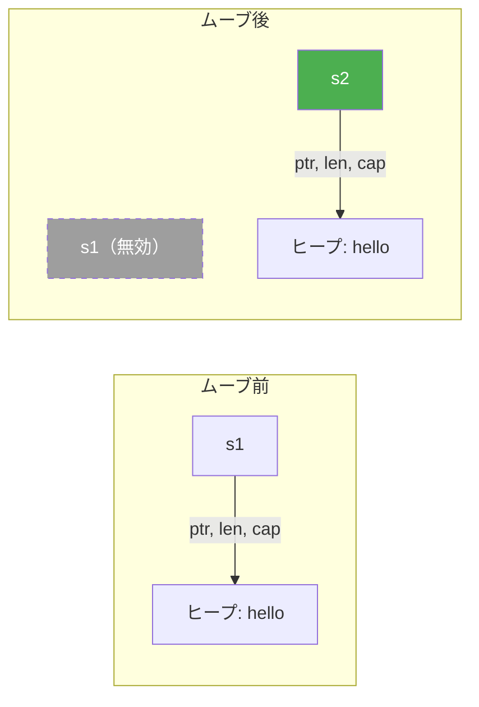
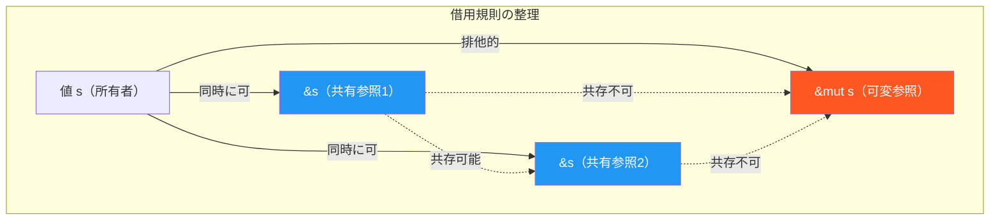
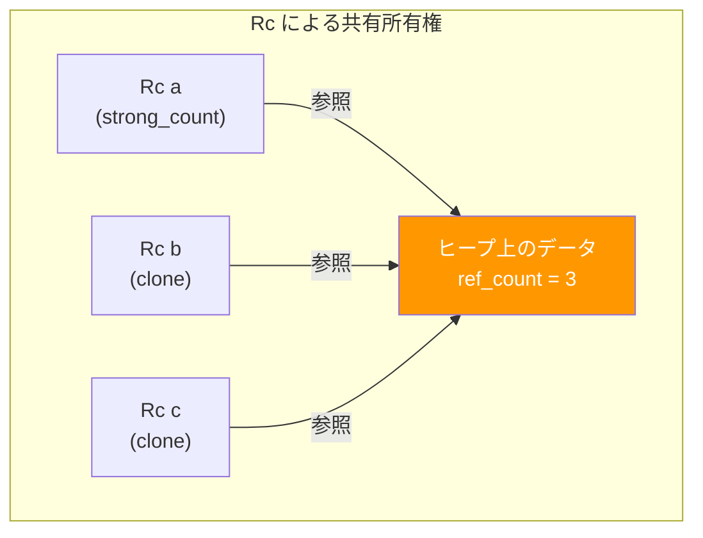
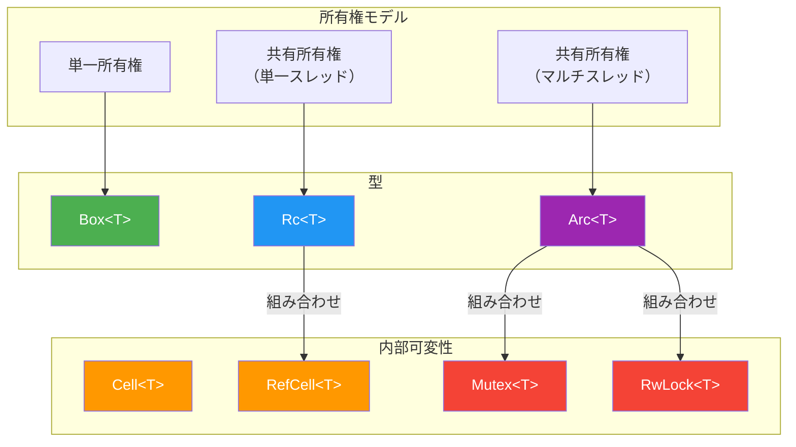

# 所有権と借用

## 1. 背景 — メモリ安全性という未解決問題

### 1.1 システムプログラミングのジレンマ

コンピュータの歴史において、メモリ管理は常に最も困難な課題の一つであった。CやC++のようなシステムプログラミング言語は、プログラマにメモリの直接制御を許すことで最大限のパフォーマンスを提供する。しかし、その代償として深刻なバグの温床となってきた。

Microsoftが2019年に公開した調査によれば、同社製品におけるセキュリティ脆弱性の約70%がメモリ安全性に起因する。Googleも同様に、Chromiumプロジェクトにおけるセキュリティバグの約70%がメモリ安全性の問題であると報告している。これらの数字は、手動メモリ管理がもたらすリスクの深刻さを如実に物語っている。

メモリ安全性に関わる代表的なバグを具体的に見ていこう。

**ダングリングポインタ（dangling pointer）** — 解放済みメモリへの参照。Use-After-Free（UAF）とも呼ばれる。

```c
int *p = malloc(sizeof(int));
*p = 42;
free(p);
printf("%d\n", *p);  // undefined behavior: p points to freed memory
```

**二重解放（double free）** — 同一メモリ領域を複数回解放する。ヒープメタデータが破壊され、任意コード実行に悪用されうる。

```c
char *buf = malloc(128);
free(buf);
free(buf);  // double free: heap corruption
```

**データ競合（data race）** — 複数スレッドが同じメモリ位置に同時アクセスし、少なくとも一方が書き込みを行う状況。結果は非決定的であり、再現困難なバグを引き起こす。

```c
// Thread 1
global_counter++;

// Thread 2
global_counter++;
// data race: no synchronization, result is unpredictable
```

**バッファオーバーフロー（buffer overflow）** — 確保した領域を超えてメモリに書き込む。スタック上のリターンアドレスを書き換えることで、攻撃者が任意のコードを実行できる古典的な攻撃手法の入口となる。

これらの問題に対して、従来は二つのアプローチが取られてきた。一つは**ガベージコレクション（GC）** による自動メモリ管理であり、Java、Go、Python、C#などの言語が採用している。GCはプログラマからメモリ管理の負担を取り除く一方で、実行時オーバーヘッド、予測困難な停止時間（GCパーズ）、メモリ消費の増大という代償を伴う。

もう一つは、C++11以降のスマートポインタ（`std::unique_ptr`、`std::shared_ptr`）やRAII（Resource Acquisition Is Initialization）パターンの活用であるが、これらはあくまで「規約」であり、言語が正しさを保証するわけではない。プログラマが規約を破れば、従来と同様のバグが生じる。

### 1.2 Rustの登場 — 第三の道

2006年、MozillaのGraydon Hoareは個人プロジェクトとしてRustの開発を開始した。2010年にMozillaが公式にスポンサーとなり、2015年に1.0がリリースされた。Rustが目指したのは、GCを用いずにメモリ安全性をコンパイル時に保証するという、従来不可能と思われていた目標であった。

Rustの核心的なアイデアは**所有権（ownership）** と**借用（borrowing）** という概念をtype systemに組み込み、コンパイラがプログラムのメモリアクセスパターンを静的に検証することにある。これにより、ダングリングポインタ、二重解放、データ競合といったバグがコンパイル時に排除される。実行時コストはゼロ、つまりCやC++と同等のパフォーマンスを維持しながら安全性を得られる。

この「ゼロコスト抽象化」の思想は、C++の設計者Bjarne Stroustrupの名言「使わないものに対して代価を払わない（You don't pay for what you don't use）」と通底する。Rustはこの原則を、メモリ安全性という文脈で徹底的に追求した言語である。

## 2. 所有権の三つのルール

Rustの所有権システムは、以下の三つのルールに基づいている。

1. **Rustにおいて、すべての値は「所有者（owner）」と呼ばれる変数を一つ持つ。**
2. **所有者は同時に一つだけ存在できる。**
3. **所有者がスコープを抜けると、値は自動的に破棄（drop）される。**

これらのルールは単純に見えるが、その帰結は深遠である。順に詳しく見ていこう。

### 2.1 所有者とスコープ

Rustでは、変数が値を「所有」する。所有者のスコープ（有効範囲）が終了すると、Rustは自動的にその値に対して `drop` 関数を呼び出し、リソースを解放する。

```rust
fn main() {
    {
        let s = String::from("hello"); // s is the owner of the String
        println!("{}", s);             // s is valid here
    } // s goes out of scope; drop is called, memory is freed

    // println!("{}", s); // compile error: s is no longer valid
}
```

この仕組みはC++のRAIIパターンと類似しているが、決定的な違いがある。C++ではRAIIはプログラマの「規約」であるのに対し、Rustではコンパイラが強制する「ルール」である。


### 2.2 ムーブセマンティクス

所有者が同時に一つしか存在できないというルールから、代入や関数呼び出し時に**ムーブ（move）** が発生する。

```rust
fn main() {
    let s1 = String::from("hello");
    let s2 = s1; // ownership moves from s1 to s2

    // println!("{}", s1); // compile error: value used after move
    println!("{}", s2);    // ok: s2 is the new owner
}
```

`String` はヒープにデータを確保する型であり、代入時に単純なビットコピーを行うと、二つの変数が同じヒープメモリを指すことになる。もし両方がスコープを抜けた時点で `drop` が呼ばれれば、二重解放が発生する。Rustはムーブによってこれを防ぐ。`s1` から `s2` に所有権がムーブされた後、`s1` は無効化され、以降のアクセスはコンパイルエラーとなる。



関数呼び出しにおいても同様にムーブが発生する。

```rust
fn takes_ownership(s: String) {
    println!("{}", s);
} // s goes out of scope and is dropped

fn main() {
    let s = String::from("hello");
    takes_ownership(s); // ownership moves to the function parameter
    // println!("{}", s); // compile error: s has been moved
}
```

### 2.3 Copy トレイトと Clone トレイト

すべての型でムーブが発生するわけではない。整数、浮動小数点数、`bool`、`char` といったスタック上に完結する固定サイズの型は、**`Copy` トレイト**を実装している。`Copy` 型の値は代入時にビットコピーされ、元の変数も引き続き有効である。

```rust
fn main() {
    let x = 42;    // i32 implements Copy
    let y = x;     // x is copied, not moved
    println!("{}", x); // ok: x is still valid
    println!("{}", y); // ok: y is a copy
}
```

`Copy` は暗黙的なビットコピーであるのに対し、**`Clone` トレイト**は明示的な深いコピーを提供する。`String` のようなヒープ割り当てを含む型では、`Clone` を呼ぶことでヒープデータを含む完全なコピーを作成できる。

```rust
fn main() {
    let s1 = String::from("hello");
    let s2 = s1.clone(); // explicit deep copy
    println!("{}", s1);   // ok: s1 is still valid
    println!("{}", s2);   // ok: s2 is an independent copy
}
```

`Copy` と `Clone` の関係は次のように整理できる。

| 特性 | `Copy` | `Clone` |
|------|--------|---------|
| コピー方法 | 暗黙のビットコピー | 明示的な `.clone()` 呼び出し |
| コスト | 常に安価（スタックコピー） | 潜在的に高価（ヒープ割り当て） |
| 適用対象 | スタック上の固定サイズ型 | 任意の型（実装次第） |
| ムーブとの関係 | ムーブの代わりにコピーが発生 | 所有権を維持しつつ複製を作成 |

`Copy` を実装するためには、その型のすべてのフィールドが `Copy` を実装している必要がある。ヒープ割り当てを含む型（`String`、`Vec<T>` など）は `Copy` を実装できない。これは意図的な設計であり、「暗黙のコピーが安価であること」を型システムが保証している。

## 3. 借用 — 所有権を移さずにアクセスする

ムーブだけでは、値を関数に渡すたびに所有権を失うことになり、プログラムが煩雑になる。この問題を解決するのが**借用（borrowing）** である。借用とは、所有権を移転せずに値への参照（reference）を作成することである。

### 3.1 共有参照（`&T`）

共有参照（shared reference）は、値を読み取り専用で借用する。`&` 演算子で参照を作成し、`*` 演算子で参照先の値にアクセスする（多くの場合、Rustの自動参照解決により明示的な `*` は不要）。

```rust
fn calculate_length(s: &String) -> usize {
    s.len()
} // s goes out of scope, but it doesn't own the String, so nothing happens

fn main() {
    let s = String::from("hello");
    let len = calculate_length(&s); // borrow s (shared reference)
    println!("The length of '{}' is {}.", s, len); // s is still valid
}
```

共有参照は同時に複数存在できる。これは「複数の読み取りは安全」という直感に対応する。

```rust
fn main() {
    let s = String::from("hello");
    let r1 = &s; // ok
    let r2 = &s; // ok: multiple shared references allowed
    println!("{} and {}", r1, r2);
}
```

### 3.2 可変参照（`&mut T`）

可変参照（mutable reference）は、値を書き換え可能な状態で借用する。

```rust
fn append_world(s: &mut String) {
    s.push_str(", world!");
}

fn main() {
    let mut s = String::from("hello");
    append_world(&mut s); // mutable borrow
    println!("{}", s);     // "hello, world!"
}
```

ここで、Rustの借用規則の核心が現れる。

### 3.3 借用規則（Borrowing Rules）

Rustコンパイラは、以下の二つの規則を任意の時点で強制する。

1. **共有参照は同時に複数存在できる（`&T` は何個でもOK）**
2. **可変参照は同時に一つだけ存在でき、その間は共有参照も存在できない**

言い換えれば、「読み取りは複数可、書き込みは排他的」という原則である。これはRead-Writeロックの考え方と同じであるが、Rustではこれをコンパイル時に静的に検証する。

```rust
fn main() {
    let mut s = String::from("hello");

    let r1 = &s;     // ok: shared reference
    let r2 = &s;     // ok: multiple shared references
    // let r3 = &mut s; // compile error: cannot borrow as mutable
                        // while shared references exist
    println!("{} and {}", r1, r2);
    // r1 and r2 are no longer used after this point (NLL)

    let r3 = &mut s;  // ok: no shared references are live
    r3.push_str(", world!");
    println!("{}", r3);
}
```

この例で重要なのは、Rust 2018 editionで導入された**NLL（Non-Lexical Lifetimes）** の概念である。以前のRustでは、参照のライフタイムはレキシカルスコープ（`{}` の範囲）で決まっていたが、NLLにより「最後に使用された地点」までに短縮された。これにより、上記のコードが合法となる。



### 3.4 なぜこの規則がデータ競合を防ぐのか

データ競合が発生する条件は以下の三つがすべて揃った場合である。

1. 二つ以上のポインタが同じデータに同時にアクセスする
2. 少なくとも一つのポインタがデータへの書き込みに使われる
3. データへのアクセスを同期する仕組みがない

Rustの借用規則は、条件1と条件2が同時に成立することを型システムレベルで禁止する。可変参照が存在する間、他の参照（共有・可変問わず）は存在できないため、「同時に複数のアクセスがあり、かつ少なくとも一方が書き込み」という状況がコンパイル時に排除される。

これは極めて強力な保証である。GCを持つ言語（Java、Go）でさえデータ競合は実行時に発生しうるが、Rustではコンパイルが通った時点でデータ競合がないことが保証される。

## 4. ライフタイム — 参照の有効期間

### 4.1 ダングリングポインタの防止

借用規則だけでは不十分なケースがある。参照が指す先のデータが先に破棄された場合、ダングリングポインタが発生する。Rustは**ライフタイム（lifetime）** の概念を用いてこれを防ぐ。

```rust
fn main() {
    let r;
    {
        let x = 5;
        r = &x; // error: `x` does not live long enough
    }
    // println!("{}", r); // r would be a dangling reference
}
```

コンパイラは、参照 `r` のライフタイムが参照先 `x` のライフタイムよりも長いことを検出し、コンパイルエラーを報告する。

### 4.2 ライフタイムアノテーション

関数のシグネチャにおいて、入力参照と出力参照の関係をコンパイラに伝える必要がある場合、**ライフタイムアノテーション（lifetime annotation）** を用いる。ライフタイムアノテーションはアポストロフィ `'` で始まる名前（慣習的に `'a`、`'b` など）で表記する。

```rust
// Without lifetime annotation: compile error
// fn longest(x: &str, y: &str) -> &str { ... }

// With lifetime annotation
fn longest<'a>(x: &'a str, y: &'a str) -> &'a str {
    if x.len() > y.len() {
        x
    } else {
        y
    }
}
```

この `'a` は「`x` と `y` の参照が有効である期間のうち、短い方と同じ期間だけ戻り値の参照も有効である」ことをコンパイラに伝える。ライフタイムアノテーションは参照の実際の生存期間を変えるものではなく、あくまで参照間の関係を記述するためのものである。

```rust
fn main() {
    let string1 = String::from("long string");
    let result;
    {
        let string2 = String::from("xyz");
        result = longest(string1.as_str(), string2.as_str());
        println!("The longest string is '{}'", result); // ok
    }
    // If result were used here, it would be an error
    // because string2's lifetime has ended
}
```

### 4.3 ライフタイムエリジョン（Lifetime Elision）

すべての参照にライフタイムアノテーションを書くのは煩雑である。Rustコンパイラは一定のパターンにおいてライフタイムを自動的に推論する。これを**ライフタイムエリジョン規則（lifetime elision rules）** と呼ぶ。

Rust 1.0の時点で定められたエリジョン規則は三つある。

**規則1**: 各入力参照パラメータに個別のライフタイムが割り当てられる。

```rust
// Written by programmer:
fn first_word(s: &str) -> &str { ... }

// After rule 1:
fn first_word<'a>(s: &'a str) -> &str { ... }
```

**規則2**: 入力参照パラメータが一つだけの場合、そのライフタイムが全出力参照に適用される。

```rust
// After rule 2:
fn first_word<'a>(s: &'a str) -> &'a str { ... }
// All lifetimes are resolved; no annotation needed
```

**規則3**: 入力パラメータの一つが `&self` または `&mut self` の場合、`self` のライフタイムが全出力参照に適用される。

```rust
impl MyStruct {
    // Written:
    fn get_name(&self) -> &str { ... }
    // Equivalent:
    fn get_name<'a>(&'a self) -> &'a str { ... }
}
```

これらの規則により、多くの場合ライフタイムアノテーションを明示的に書く必要がない。コンパイラがエリジョン規則を適用してもライフタイムを完全に決定できない場合にのみ、プログラマが明示的にアノテーションを記述する。

### 4.4 静的ライフタイム `'static`

`'static` ライフタイムは、プログラムの実行期間全体にわたって有効な参照を示す。文字列リテラルはすべて `'static` ライフタイムを持つ。

```rust
let s: &'static str = "I live for the entire program";
```

`'static` はバイナリのデータセグメントに埋め込まれるため、プログラムが終了するまで有効である。ただし、`'static` の安易な使用は避けるべきであり、本当にプログラム全体にわたって生存する必要がある場合にのみ使用すべきである。

## 5. 構造体とライフタイム

### 5.1 参照を保持する構造体

構造体が参照をフィールドに持つ場合、ライフタイムアノテーションが必須となる。

```rust
struct Excerpt<'a> {
    part: &'a str,
}

fn main() {
    let novel = String::from("Call me Ishmael. Some years ago...");
    let first_sentence;
    {
        let words: &str = novel.as_str();
        first_sentence = Excerpt {
            part: words.split('.').next().expect("Could not find a '.'"),
        };
    }
    println!("First sentence: {}", first_sentence.part);
}
```

ライフタイムアノテーション `'a` は、`Excerpt` 構造体のインスタンスが、フィールド `part` が参照するデータよりも長く生存しないことをコンパイラに保証させる。

### 5.2 複数のライフタイムパラメータ

構造体が異なるライフタイムの参照を持つ場合、複数のライフタイムパラメータを使う。

```rust
struct TwoRefs<'a, 'b> {
    x: &'a i32,
    y: &'b i32,
}

fn main() {
    let a = 10;
    let result;
    {
        let b = 20;
        let refs = TwoRefs { x: &a, y: &b };
        result = refs.x; // ok: 'a outlives the current scope
    }
    println!("{}", result);
}
```

ライフタイムを分離することで、コンパイラはそれぞれの参照が独立した生存期間を持つことを理解し、より柔軟なコードを書ける。

## 6. 借用チェッカーの仕組み

### 6.1 コンパイラの内部動作

Rustコンパイラ（`rustc`）の借用チェッカー（borrow checker）は、MIR（Mid-level Intermediate Representation）と呼ばれる中間表現上で動作する。MIRはソースコードを制御フローグラフ（CFG）に変換したもので、借用チェッカーはこのCFG上で以下の検証を行う。

1. **ライフタイム推論**: 各参照のライフタイムを推論し、ライフタイム制約を収集する
2. **借用チェック**: 借用規則（共有参照と可変参照の排他性）が守られているか検証する
3. **ムーブチェック**: ムーブ済みの値にアクセスしていないか検証する
4. **初期化チェック**: 未初期化の値を使用していないか検証する


### 6.2 NLL（Non-Lexical Lifetimes）の詳細

Rust 2018以前の借用チェッカーは、参照のライフタイムをレキシカルスコープ（`{}` で囲まれた範囲）に基づいて決定していた。これにより、プログラマが安全だと分かっているコードでもコンパイルエラーになることがあった。

```rust
// Pre-NLL: this would not compile
fn main() {
    let mut data = vec![1, 2, 3];
    let first = &data[0]; // immutable borrow
    println!("{}", first);
    // first is never used again, but its lexical scope extends further
    data.push(4); // mutable borrow: conflict with first's lexical scope
}
```

NLLでは、参照のライフタイムは「最後に使われた地点」まで短縮される。上記のコードでは、`first` は `println!` の後に使われないため、`data.push(4)` 時点では借用は終了しており、コンパイルが通る。

NLLの実装は、制御フローグラフ上でデータフロー解析を行い、各参照の「活性区間（live range）」を計算することで実現されている。これはレジスタ割り当てにおける活性解析と概念的に同じ手法である。

### 6.3 借用チェッカーの限界

借用チェッカーは保守的な解析を行うため、安全であるにもかかわらずコンパイルエラーになるケースが存在する。典型例は、配列の異なるインデックスへの可変参照である。

```rust
fn main() {
    let mut v = vec![1, 2, 3];
    let a = &mut v[0];
    let b = &mut v[1]; // compile error: cannot borrow v as mutable twice
    *a += 1;
    *b += 1;
}
```

プログラマには `v[0]` と `v[1]` が異なるメモリ領域であることが明らかだが、コンパイラは `v` への可変借用が二度行われていると判断する。この制約を回避するために、`split_at_mut` のようなAPIが提供されている。

```rust
fn main() {
    let mut v = vec![1, 2, 3];
    let (left, right) = v.split_at_mut(1);
    left[0] += 1;  // ok: left and right are disjoint slices
    right[0] += 1;
}
```

`split_at_mut` の内部実装では `unsafe` コードが使われており、安全性はAPI設計者が手動で保証している。このように、Rustは「安全な抽象化の境界を `unsafe` で実装する」という設計パターンを採用している。

## 7. スマートポインタ

所有権と借用の基本規則だけでは表現できないデータ構造やパターンが存在する。Rustはこれらを**スマートポインタ（smart pointer）** によって対処する。スマートポインタは、参照のように振る舞いつつ、追加のメタデータや機能を持つデータ構造である。

### 7.1 `Box<T>` — ヒープ割り当て

`Box<T>` はヒープ上に値を割り当てるための最もシンプルなスマートポインタである。所有権のセマンティクスは通常の値と同じであり、`Box` がスコープを抜けるとヒープ上の値も解放される。

```rust
fn main() {
    let b = Box::new(5);     // allocate 5 on the heap
    println!("b = {}", b);
} // b goes out of scope, heap memory is freed
```

`Box<T>` の主な用途は以下の通りである。

- **コンパイル時にサイズが不明な型**（再帰型など）をヒープに配置する
- **大きなデータ**のムーブ時にスタックコピーを避ける
- **トレイトオブジェクト**（`Box<dyn Trait>`）による動的ディスパッチ

再帰型の例を示す。

```rust
// This won't compile: recursive type has infinite size
// enum List { Cons(i32, List), Nil }

// Box provides indirection, giving the type a known size
enum List {
    Cons(i32, Box<List>),
    Nil,
}

fn main() {
    let list = List::Cons(1,
        Box::new(List::Cons(2,
            Box::new(List::Cons(3,
                Box::new(List::Nil))))));
}
```

### 7.2 `Rc<T>` — 参照カウント（単一スレッド）

所有権のルールでは所有者は一つだけであるが、グラフ構造のようにノードが複数の親から参照されるケースでは、複数の所有者が必要になる。`Rc<T>`（Reference Counted）は参照カウントによる共有所有権を提供する。

```rust
use std::rc::Rc;

fn main() {
    let a = Rc::new(String::from("hello"));
    println!("reference count: {}", Rc::strong_count(&a)); // 1

    let b = Rc::clone(&a); // increment reference count
    println!("reference count: {}", Rc::strong_count(&a)); // 2

    {
        let c = Rc::clone(&a);
        println!("reference count: {}", Rc::strong_count(&a)); // 3
    } // c goes out of scope, reference count decreases

    println!("reference count: {}", Rc::strong_count(&a)); // 2
}
```

`Rc<T>` は不変の共有所有権を提供する。`Rc<T>` を通じて中身を変更することはできない。また、`Rc<T>` はスレッド安全ではなく、単一スレッド内でのみ使用できる。



循環参照がある場合、参照カウントが0にならずメモリリークが発生する。これを防ぐために `Weak<T>`（弱参照）が用意されている。`Weak<T>` は参照カウントを増加させず、参照先がすでに破棄されている可能性があるため、アクセス時に `Option` を返す。

```rust
use std::rc::{Rc, Weak};

struct Node {
    value: i32,
    parent: Option<Weak<Node>>,
    children: Vec<Rc<Node>>,
}
```

### 7.3 `Arc<T>` — アトミック参照カウント（マルチスレッド）

`Arc<T>`（Atomically Reference Counted）は `Rc<T>` のスレッド安全版である。内部の参照カウントの操作にアトミック命令を使用するため、複数スレッドから安全に共有できる。

```rust
use std::sync::Arc;
use std::thread;

fn main() {
    let data = Arc::new(vec![1, 2, 3]);

    let handles: Vec<_> = (0..3).map(|i| {
        let data = Arc::clone(&data);
        thread::spawn(move || {
            println!("Thread {}: {:?}", i, data);
        })
    }).collect();

    for handle in handles {
        handle.join().unwrap();
    }
}
```

`Arc<T>` も `Rc<T>` と同様に不変の共有所有権を提供する。可変アクセスが必要な場合は、`Arc<Mutex<T>>` のように内部可変性パターンと組み合わせる。

アトミック操作はCPUキャッシュの一貫性を維持するための同期コストを伴うため、スレッド間共有が不要な場合は `Rc<T>` を使うべきである。

### 7.4 `RefCell<T>` — 実行時借用チェック

通常の借用規則はコンパイル時に検証されるが、`RefCell<T>` は借用規則を**実行時に**検証する。コンパイル時に安全性を証明できないが、プログラマが安全だと確信しているケースで使用する。

```rust
use std::cell::RefCell;

fn main() {
    let data = RefCell::new(5);

    {
        let r1 = data.borrow();     // immutable borrow at runtime
        let r2 = data.borrow();     // ok: multiple immutable borrows
        println!("{} {}", r1, r2);
    } // r1, r2 dropped

    {
        let mut r3 = data.borrow_mut(); // mutable borrow at runtime
        *r3 += 1;
    }

    println!("{}", data.borrow()); // 6
}
```

借用規則違反が実行時に検出された場合、`RefCell` はパニック（プログラムのクラッシュ）を引き起こす。

```rust
use std::cell::RefCell;

fn main() {
    let data = RefCell::new(5);
    let r1 = data.borrow();
    let r2 = data.borrow_mut(); // panic! already borrowed as immutable
}
```

`RefCell<T>` はスレッド安全ではないため、単一スレッド内でのみ使用する。

## 8. 内部可変性パターン

### 8.1 内部可変性とは

Rustの借用規則は「`&T` を通じて値を変更できない」ことを要求する。しかし、あるデータ構造が外部から見れば不変に見えつつ、内部状態を変更する必要があるケースが存在する。これを**内部可変性（interior mutability）** と呼ぶ。

典型的な例はキャッシュである。キャッシュは論理的には「読み取り」操作であるが、内部的にはキャッシュの状態を更新する必要がある。

### 8.2 `Cell<T>` と `RefCell<T>`

`Cell<T>` は `Copy` を実装する型に対して、`&self` を通じた値の設定と取得を可能にする。`RefCell<T>` は任意の型に対して、実行時の借用チェック付きで可変アクセスを提供する。

```rust
use std::cell::Cell;

struct Counter {
    value: Cell<u32>,
}

impl Counter {
    fn new() -> Self {
        Counter { value: Cell::new(0) }
    }

    fn increment(&self) {
        // Note: &self, not &mut self
        self.value.set(self.value.get() + 1);
    }

    fn get(&self) -> u32 {
        self.value.get()
    }
}
```

### 8.3 `Mutex<T>` と `RwLock<T>`

マルチスレッド環境で内部可変性を実現するために、`Mutex<T>` と `RwLock<T>` が提供されている。

```rust
use std::sync::{Arc, Mutex};
use std::thread;

fn main() {
    let counter = Arc::new(Mutex::new(0));
    let mut handles = vec![];

    for _ in 0..10 {
        let counter = Arc::clone(&counter);
        let handle = thread::spawn(move || {
            let mut num = counter.lock().unwrap();
            *num += 1;
        });
        handles.push(handle);
    }

    for handle in handles {
        handle.join().unwrap();
    }

    println!("Result: {}", *counter.lock().unwrap()); // 10
}
```

`Arc<Mutex<T>>` の組み合わせは、Rustにおけるスレッド間共有状態の標準パターンである。`Arc` が複数スレッドからの所有権共有を、`Mutex` が排他的アクセスをそれぞれ担う。

各スマートポインタと内部可変性の型の関係を整理する。



## 9. `unsafe` — 安全性境界の越え方

### 9.1 `unsafe` の役割

Rustの安全性保証は強力であるが、すべての正しいプログラムを表現できるわけではない。OS のシステムコール呼び出し、FFI（他言語との連携）、ハードウェアの直接操作など、コンパイラが安全性を検証できない操作が必要な場合がある。`unsafe` ブロックはこれらの操作を明示的に許可する。

```rust
fn main() {
    let mut num = 5;
    let r1 = &num as *const i32;     // raw pointer (immutable)
    let r2 = &mut num as *mut i32;   // raw pointer (mutable)

    unsafe {
        println!("r1 is: {}", *r1);  // dereferencing raw pointer
        *r2 = 10;
        println!("r2 is: {}", *r2);
    }
}
```

`unsafe` で許可される操作は以下の五つに限定される。

1. 生ポインタの参照外し
2. `unsafe` 関数・メソッドの呼び出し
3. 可変な静的変数のアクセスまたは変更
4. `unsafe` トレイトの実装
5. `union` のフィールドへのアクセス

重要なのは、`unsafe` は借用チェッカーを無効にするわけではないということである。`unsafe` ブロック内でも、通常の借用規則は引き続き適用される。`unsafe` はあくまで上記五つの特定の操作を許可するだけであり、「何でもあり」になるわけではない。

### 9.2 安全な抽象化

Rustのエコシステムにおいて、`unsafe` は「安全な抽象化（safe abstraction）」を構築するための道具として位置づけられている。標準ライブラリの `Vec<T>`、`String`、`HashMap` などの多くの基本型は、内部で `unsafe` を使用しているが、外部に公開するAPIは完全に安全である。

この「内部は `unsafe` だが、外部APIは安全」というパターンは、Rustの設計哲学の核心である。`unsafe` の使用は最小限に留め、その正しさは人間が注意深くレビューする。そして、一度安全な抽象化が構築されれば、その利用者はメモリ安全性を気にする必要がない。

## 10. ガベージコレクションとの比較

### 10.1 設計思想の違い

Rustの所有権モデルとGCベースの言語は、メモリ安全性という同じ目標に対して根本的に異なるアプローチを取る。

| 特性 | Rust（所有権モデル） | GC言語（Java, Go等） |
|------|---------------------|---------------------|
| メモリ安全性 | コンパイル時に保証 | 実行時に管理 |
| データ競合防止 | コンパイル時に保証 | プログラマの責任（実行時エラー） |
| 実行時コスト | ゼロ（コンパイル時解決） | GCの停止時間・CPU使用率 |
| メモリ使用量 | 最小限（即座に解放） | GCサイクルまで保持 |
| 開発者体験 | 学習曲線が急峻 | 直感的で書きやすい |
| コンパイル時間 | 長い（借用チェックの分析） | 短い〜中程度 |
| 決定性 | 決定的にリソース解放 | 非決定的（GCのタイミング） |
| ファイル/ソケット管理 | RAIIで確実に閉じる | finalizer/defer に依存 |

### 10.2 パフォーマンス特性

GCベースの言語では、ヒープ上に確保されたオブジェクトの解放はGCに委ねられる。GCは定期的にヒープを走査し、到達不可能なオブジェクトを回収する。この過程で以下のコストが生じる。

- **GCパーズ（stop-the-world）**: GCがオブジェクトグラフを走査する間、アプリケーションスレッドが停止する。最新のGC（ZGC、Shenandoahなど）は停止時間をミリ秒以下に抑えるが、ゼロにはならない。
- **メモリオーバーヘッド**: GCが効率的に動作するためには、ヒープにある程度の空き領域が必要である。一般にGC言語のプログラムは、同等のRustプログラムよりも2〜5倍のメモリを消費する。
- **キャッシュ圧迫**: GCのマーキングフェーズでヒープ全体を走査するため、CPUキャッシュが汚染される。

一方、Rustでは値がスコープを抜けた時点で即座に解放される。これは決定的であり、パフォーマンスの予測が容易である。組み込みシステムやリアルタイムシステムにおいて、この決定性は特に重要である。

### 10.3 リソース管理の決定性

メモリだけでなく、ファイルハンドル、ネットワーク接続、データベース接続、ミューテックスなど、プログラムが管理するリソースは多岐にわたる。GC言語ではこれらのリソースの解放タイミングがGCに依存するため、明示的な `close()` 呼び出しや `try-with-resources`（Java）、`defer`（Go）などのパターンが必要になる。

Rustでは `Drop` トレイトを実装することで、スコープ終了時に確実にリソースが解放される。これはC++のRAIIと同じパターンであるが、Rustでは所有権システムにより `Drop` の呼び出しが正確に一度だけ行われることが保証される。

```rust
struct DatabaseConnection {
    // connection handle
}

impl Drop for DatabaseConnection {
    fn drop(&mut self) {
        // connection is always closed when the value goes out of scope
        println!("Closing database connection");
    }
}

fn query_database() {
    let conn = DatabaseConnection {};
    // use connection...
} // conn.drop() is called here, guaranteed
```

## 11. 所有権モデルの他言語への影響

### 11.1 Rustから影響を受けた言語

Rustの所有権モデルの成功は、他の言語設計にも大きな影響を与えている。

**Swift** は ARC（Automatic Reference Counting）を採用しつつ、値型セマンティクスとCopy-on-Write（CoW）を積極的に使用している。Swiftの `struct` はデフォルトで値型であり、共有状態を最小化する設計思想はRustの影響を受けている。また、Swift 5.9で導入された「noncopyable types」は、Rustの `Copy` を実装しない型と同様の概念であり、所有権の移転を明示的に制御する。

**C++** は、Rustの成功を受けてメモリ安全性への取り組みを強化している。C++のSean Parentらによるlifetime profilesの提案や、Herb Sutterによるcpp2（CppFront）プロジェクトは、C++にRust的な安全性をもたらすことを目指している。

**Mojo** はPythonの構文を持ちつつシステムプログラミングを可能にする言語であり、所有権と借用の概念をRustから取り入れている。`owned`、`borrowed`、`inout` といったパラメータ修飾子は、Rustの所有権・借用・可変借用に対応する。

**Vale** は、Rustの借用チェッカーのような静的解析ではなく、「Generational References」と呼ばれる実行時チェックを用いたメモリ安全性を提案している言語であり、所有権の概念をベースとしながらより柔軟なモデルを模索している。

**Hylo**（旧Val）は、Rustの所有権モデルを拡張した「mutable value semantics」を提案する研究言語であり、値型のセマンティクスを徹底することでメモリ安全性を実現しようとしている。

### 11.2 所有権の概念の一般化

Rustの所有権モデルは、プログラミング言語の設計においてより広い影響を与えている。その核心的な洞察は以下のように一般化できる。

1. **リソースの所有者を常に明確にする**: あらゆるリソース（メモリ、ファイル、ロックなど）に対して、その解放に責任を持つ唯一の主体を定める。
2. **共有と変更は同時に行えない**: 共有される不変データか、排他的に変更可能なデータのいずれかを選ぶ。この二律背反を型システムで強制する。
3. **安全性の証明をコンパイラに委ねる**: 人間による規約ではなく、機械的な検証によって安全性を保証する。

これらの原則は、Rust以外の文脈でも広く適用可能である。たとえば、データベースのMVCC（Multi-Version Concurrency Control）は「読み取りと書き込みの分離」という同じ原則に基づいている。また、Gitのイミュータブルなオブジェクトモデルも、共有データの不変性という原則の具現化と捉えることができる。

### 11.3 線形型とアフィン型の理論的背景

Rustの所有権モデルは、プログラミング言語理論における**アフィン型（affine type）** と深い関係がある。線形論理（linear logic）に基づく型システムでは、値の使用回数に制約を設ける。

- **線形型（linear type）**: 値は正確に一度だけ使用しなければならない
- **アフィン型（affine type）**: 値は最大一度だけ使用できる（使用しなくてもよい）

Rustのムーブセマンティクスはアフィン型に相当する。値はムーブ（＝使用）されると無効化され、二度と使えない。ただし、値を使用せずにスコープを抜ける（dropされる）ことは許容される。

このように、Rustの所有権モデルは型理論の深い基盤の上に構築されている。しかし、Rustの設計者たちの卓越した点は、これらの理論的概念を、実用的なシステムプログラミング言語に統合したことにある。理論と実践の橋渡しという意味で、Rustは言語設計の歴史における重要なマイルストーンである。

## 12. 所有権モデルの実践的パターン

### 12.1 所有権とAPI設計

関数やメソッドのシグネチャにおいて、引数をどの形式で受け取るかは重要なAPI設計上の判断である。

```rust
// Takes ownership: caller can no longer use the value
fn consume(s: String) { /* ... */ }

// Borrows immutably: caller retains ownership, read-only access
fn inspect(s: &String) { /* ... */ }

// Borrows mutably: caller retains ownership, read-write access
fn modify(s: &mut String) { /* ... */ }

// Takes a reference to a slice: more flexible
fn process(s: &str) { /* ... */ }
```

一般的なガイドラインは以下の通りである。

- 関数が値を消費する必要がある場合（たとえば、別のデータ構造に格納する場合）は、所有権を取る
- 読み取りのみの場合は共有参照 `&T` を使う。スライス（`&str`、`&[T]`）を使うとより柔軟になる
- 変更が必要な場合は可変参照 `&mut T` を使う
- 小さな `Copy` 型（`i32`、`f64` など）は値で受け取る

### 12.2 構造体の設計における所有権

構造体がデータを所有するか参照するかの選択は、構造体のライフタイムと使用パターンに依存する。

```rust
// Owns its data: simple, no lifetime annotations needed
struct OwnedConfig {
    name: String,
    values: Vec<i32>,
}

// Borrows its data: lighter, but requires lifetime annotations
struct BorrowedConfig<'a> {
    name: &'a str,
    values: &'a [i32],
}
```

所有型の構造体は独立して存在できるが、メモリ割り当てのコストがかかる。参照型の構造体は軽量だが、参照先のデータよりも短いライフタイムでなければならない。

### 12.3 エラーハンドリングと所有権

Rustのエラーハンドリングにおいて、`Result<T, E>` 型は所有権モデルと密接に関連する。

```rust
use std::fs::File;
use std::io::{self, Read};

fn read_file_contents(path: &str) -> Result<String, io::Error> {
    let mut file = File::open(path)?; // ? propagates error, dropping file on error
    let mut contents = String::new();
    file.read_to_string(&mut contents)?;
    Ok(contents) // ownership of contents moves to the caller
} // file is dropped here (closed)

fn main() {
    match read_file_contents("example.txt") {
        Ok(contents) => println!("{}", contents),
        Err(e) => eprintln!("Error: {}", e),
    }
}
```

`?` 演算子によるエラーの伝播時に、正常パスで確保されたリソースは `Drop` によって確実に解放される。所有権システムとRAIIの組み合わせにより、例外安全性が構造的に保証される。

## 13. まとめ — 所有権モデルの意義

Rustの所有権と借用のシステムは、システムプログラミングにおけるパラダイムシフトを代表する成果である。その本質は以下の三点に集約される。

**第一に、メモリ安全性のコンパイル時保証**。ダングリングポインタ、二重解放、データ競合といったメモリバグの大部分がコンパイル時に排除される。これは従来「実行時にしか検出できない」と考えられていた問題を、型システムによって静的に解決したという点で画期的である。

**第二に、ゼロコスト抽象化の実現**。所有権チェックはすべてコンパイル時に行われ、実行時のオーバーヘッドは発生しない。GCのような実行時メカニズムを必要とせず、CやC++と同等のパフォーマンスを維持しながら安全性を得られる。

**第三に、リソース管理の統一モデル**。所有権と `Drop` トレイトの組み合わせにより、メモリだけでなく、ファイル、ネットワーク接続、ロックなどあらゆるリソースの管理を統一的に扱える。リソースリークは構造的に防止される。

一方で、所有権モデルには学習コストの高さという課題がある。借用チェッカーとの「格闘」はRust初学者が最も苦労する点であり、「Rustと戦う（fighting the borrow checker）」という表現はコミュニティ内でよく知られている。しかし多くの開発者は、この初期の困難を乗り越えた後、借用チェッカーが「コンパイラが潜在的なバグを教えてくれている」という肯定的な体験に変わると報告している。

Rustの所有権モデルが示したのは、安全性と性能はトレードオフではなく、適切な型システムの設計によって両立可能であるという事実である。この洞察は、今後のプログラミング言語設計において中心的な指導原理となるだろう。
