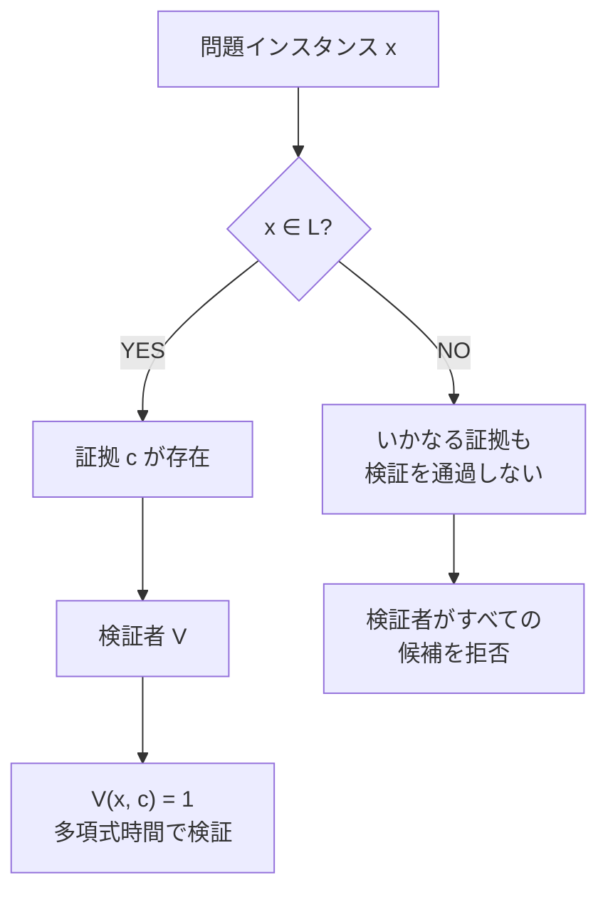
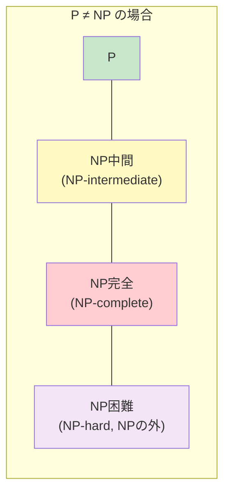
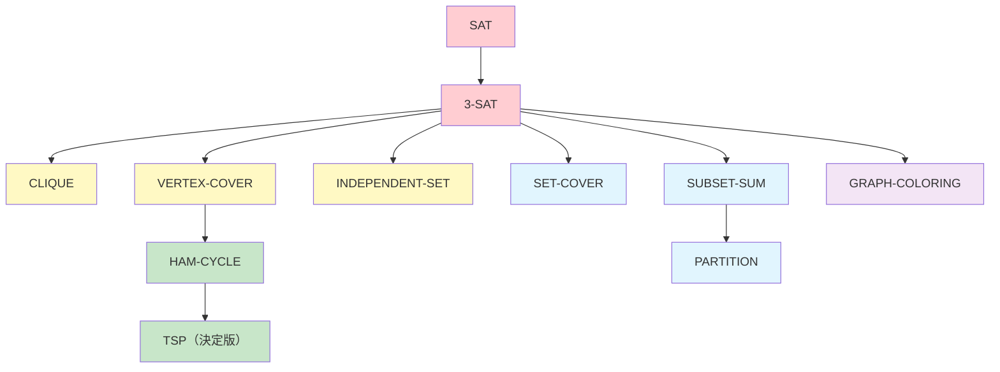
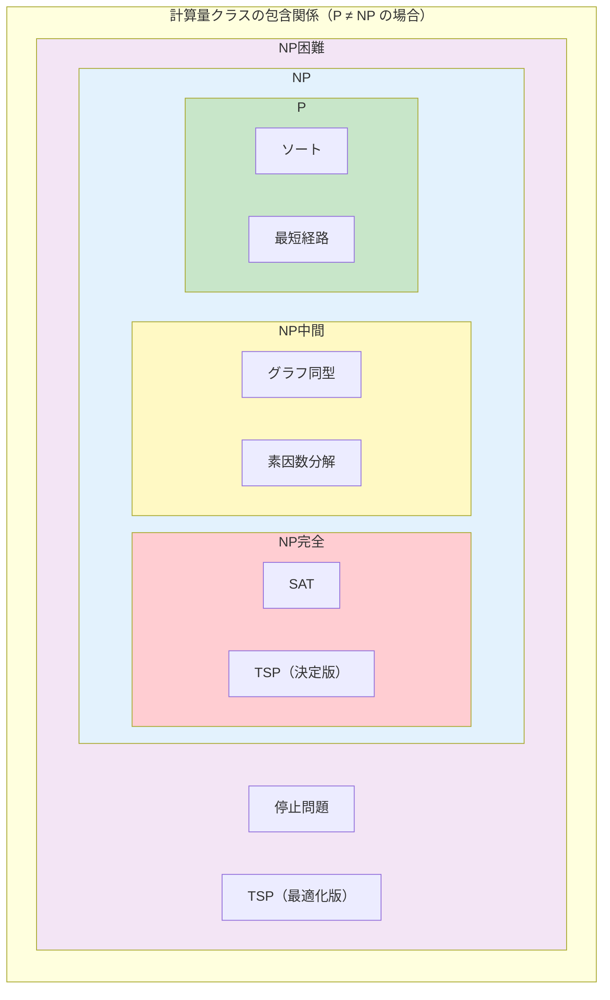
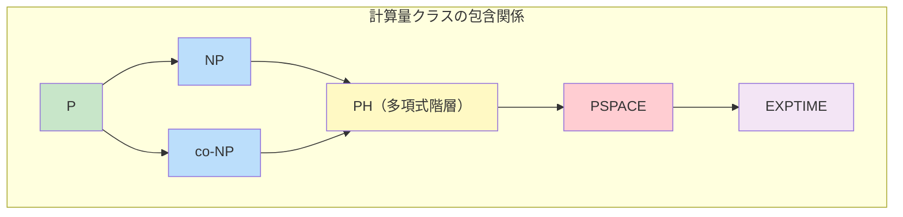

# P, NP, NP完全 — 計算量理論の中心的問題

## 1. 背景と動機：効率的に解ける問題とそうでない問題

コンピュータサイエンスの根本的な問いの一つは、**「ある問題を効率的に解くことは可能か？」** というものである。ここでいう「効率的」とは、入力サイズが大きくなったときに計算時間が爆発的に増大しないことを意味する。

日常的にコンピュータが瞬時に解いてくれる問題は数多い。整数のソート、最短経路の計算、連立一次方程式の求解など、これらは入力サイズ $n$ に対して $O(n \log n)$ や $O(n^3)$ といった多項式時間で解くことができる。一方で、一見すると単純に見えるにもかかわらず、入力サイズの増大に伴って計算時間が指数的に爆発する問題群が存在する。巡回セールスマン問題（TSP）、充足可能性問題（SAT）、グラフ彩色問題など、これらの問題に対して多項式時間のアルゴリズムは発見されていない。

### 1.1 計算量理論の誕生

1960年代、Jack Edmonds は「良いアルゴリズム」を多項式時間アルゴリズムと同一視する提案を行い、Alan Cobham も独立に同様の議論を展開した。この **Cobham-Edmonds のテーゼ**は、多項式時間で解ける問題を「実際に効率的に解ける問題」と見なすという、計算量理論の基本的な立場を確立した。

もちろん、$O(n^{1000})$ のアルゴリズムは実用的ではないし、$O(2^{0.001n})$ の指数時間アルゴリズムが実用上は十分高速な場合もある。しかし、多項式 vs 指数という境界線は理論的に非常にクリーンであり、計算の本質的な困難さを議論するための強力な枠組みを提供する。

### 1.2 なぜこの問題が重要か

P vs NP 問題は、単なる理論的な好奇心の対象ではない。この問題の解決は以下の領域に根本的な影響を与える。

- **暗号技術**：公開鍵暗号は「ある種の問題（素因数分解、離散対数など）は効率的に解けない」という仮定に基づいている。もし P = NP であれば、これらの暗号系は原理的に破られることになる
- **最適化**：物流のルーティング、スケジューリング、資源配分などの組合せ最適化問題の多くは NP 困難であり、P ≠ NP であればこれらに対する万能の効率的アルゴリズムは存在しない
- **人工知能**：多くの AI の問題（制約充足、プランニング）は本質的に NP 困難であり、計算量の壁はAIの能力の限界を画定する
- **数学の基礎**：P vs NP 問題は、クレイ数学研究所が2000年に選定した**ミレニアム懸賞問題**の一つであり、解決者には100万ドルの賞金が贈られる

::: tip 計算量理論の本質
計算量理論は「何が計算できるか」ではなく「何が**効率的に**計算できるか」を問う。計算可能性理論（チューリングマシンで計算できるか否か）が**定性的**な問いであるのに対し、計算量理論は**定量的**な問いである。つまり、問題を解くためにどれだけの計算資源（時間、空間）が必要かを厳密に議論する。
:::

## 2. 決定問題と言語

計算量理論を厳密に議論するためには、「問題」の概念を形式的に定義する必要がある。計算量理論では通常、**決定問題（decision problem）** を扱う。

### 2.1 決定問題

決定問題とは、答えが「YES」か「NO」かのいずれかである問題のことである。たとえば、以下のような問題が決定問題である。

- **素数判定**：「入力された自然数 $n$ は素数か？」
- **グラフ連結性**：「入力されたグラフ $G$ は連結か？」
- **充足可能性（SAT）**：「入力された論理式 $\varphi$ を真にする変数の割り当ては存在するか？」

最適化問題（「最短経路の長さはいくらか？」「最小のコストはいくらか？」）も、しきい値を導入することで決定問題に変換できる。たとえば「グラフ $G$ において、頂点 $s$ から頂点 $t$ への長さ $k$ 以下の経路は存在するか？」は決定問題である。多くの場合、最適化問題の難しさは対応する決定問題の難しさと本質的に同じである。

### 2.2 言語としての形式化

決定問題は**言語（language）** として形式化される。アルファベット $\Sigma$（通常は $\{0, 1\}$）上の文字列の集合 $\Sigma^*$ から部分集合 $L \subseteq \Sigma^*$ を取り出したものが言語である。

決定問題 $\Pi$ に対応する言語 $L_\Pi$ は、「問題 $\Pi$ に対する答えが YES であるようなインスタンスをエンコードした文字列の集合」として定義される。

$$
L_\Pi = \{ \langle x \rangle \in \Sigma^* \mid \Pi(x) = \text{YES} \}
$$

ここで $\langle x \rangle$ は問題インスタンス $x$ の適切な二進符号化を表す。

たとえば、素数判定問題に対応する言語は次のように定義される。

$$
\text{PRIMES} = \{ \langle n \rangle \mid n \text{ は素数} \}
$$

チューリングマシン $M$ が言語 $L$ を**決定する（decide）**とは、任意の入力 $w \in \Sigma^*$ に対して、$w \in L$ ならば $M$ が受理状態で停止し、$w \notin L$ ならば $M$ が拒否状態で停止することをいう。

### 2.3 時間計算量

チューリングマシン $M$ の**時間計算量（time complexity）**は、入力の長さ $n$ に対して $M$ が停止するまでに要するステップ数の最大値として定義される。形式的には、関数 $T: \mathbb{N} \to \mathbb{N}$ が $M$ の時間計算量であるとは、任意の長さ $n$ の入力に対して $M$ が $T(n)$ ステップ以内に停止することをいう。

$$
\text{TIME}(T(n)) = \{ L \mid \text{ある } O(T(n)) \text{ 時間の決定性チューリングマシンが } L \text{ を決定する} \}
$$

## 3. クラス P：多項式時間決定可能

### 3.1 定義

**P（Polynomial time）** は、決定性チューリングマシンによって多項式時間で決定可能な言語の集合である。

$$
\text{P} = \bigcup_{k \geq 0} \text{TIME}(n^k)
$$

すなわち、ある定数 $k$ と決定性チューリングマシン $M$ が存在して、$M$ が $O(n^k)$ ステップ以内に任意の入力に対して正しく YES/NO を判定できるとき、その問題はクラス P に属する。

### 3.2 P に属する問題の例

P に属する問題は「効率的に解ける問題」を代表する。以下にいくつかの例を挙げる。

**ソート（SORTING）**

$n$ 個の要素を昇順に並び替える問題。Merge Sort により $O(n \log n)$ で解ける。対応する決定問題は「この配列はソート済みか？」であり、$O(n)$ で判定できる。

**最短経路（SHORTEST-PATH）**

重み付きグラフにおいて、2頂点間の最短経路が長さ $k$ 以下かを判定する問題。非負の重みに対しては Dijkstra のアルゴリズムにより $O(|V|^2)$（あるいはフィボナッチヒープを用いて $O(|E| + |V| \log |V|)$）で解ける。

**2-SAT**

各節が高々2つのリテラルからなる CNF 論理式の充足可能性を判定する問題。含意グラフ上の強連結成分分解により $O(n + m)$ で解ける（$n$ は変数の数、$m$ は節の数）。

**線形計画法（LP）**

線形制約条件の下での線形目的関数の最適化。Khachyan の楕円体法（1979年）により多項式時間で解けることが示された。実用的には Karmarkar の内点法（1984年）が広く使われる。

**素数判定（PRIMES）**

自然数が素数であるかを判定する問題。2002年に Agrawal, Kayal, Saxena が AKS 素数判定法を発表し、PRIMES $\in$ P であることが証明された。これは計算量理論の大きなマイルストーンであった。

```python
def is_in_2sat(clauses):
    """
    Determine if a 2-SAT formula is satisfiable
    using implication graph and SCC decomposition.
    Time complexity: O(n + m)
    """
    # Build implication graph
    n = max(abs(lit) for clause in clauses for lit in clause)
    graph = [[] for _ in range(2 * n + 2)]
    reverse_graph = [[] for _ in range(2 * n + 2)]

    def var_index(x):
        return x + n if x > 0 else -x

    def neg_index(x):
        return var_index(-x)

    for a, b in clauses:
        # (a OR b) => (NOT a -> b) AND (NOT b -> a)
        graph[neg_index(a)].append(var_index(b))
        graph[neg_index(b)].append(var_index(a))
        reverse_graph[var_index(b)].append(neg_index(a))
        reverse_graph[var_index(a)].append(neg_index(b))

    # Kosaraju's SCC algorithm
    # ... (omitted for brevity)
    # Check: for each variable x,
    # x and NOT x must be in different SCCs
    return True  # if satisfiable
```

### 3.3 P の性質

P は計算量理論において中心的な役割を果たすクラスであり、以下の重要な性質を持つ。

1. **閉包性**：P は補集合、和集合、積集合、連接、Kleene 閉包の下で閉じている
2. **計算モデルへの頑健性**：多項式時間の定義は、多テープチューリングマシン、RAM モデルなど、さまざまな計算モデル間で本質的に同じである（多項式の次数は変わりうるが、多項式であることは変わらない）
3. **合成可能性**：P に属する2つの問題を組み合わせた問題も（多項式回の呼び出しと多項式サイズの出力変換であれば）P に属する

## 4. クラス NP：非決定性多項式時間

### 4.1 非決定性チューリングマシンによる定義

**NP（Nondeterministic Polynomial time）** の名称は、**非決定性チューリングマシン（nondeterministic Turing machine, NTM）** に由来する。非決定性チューリングマシンとは、遷移関数が一つの構成（configuration）から複数の構成への遷移を許すチューリングマシンである。

形式的には、NTM $M$ は各ステップにおいて最大 $c$ 個（$c$ は定数）の選択肢を持つ。入力 $w$ に対する $M$ の計算は、可能なすべての選択の系列をまとめた**計算木（computation tree）** として表現される。NTM $M$ が入力 $w$ を受理するとは、計算木の中に**少なくとも1つの受理に至るパス（受理計算パス）** が存在することをいう。

$$
\text{NTIME}(T(n)) = \{ L \mid \text{ある } O(T(n)) \text{ 時間の非決定性チューリングマシンが } L \text{ を決定する} \}
$$

$$
\text{NP} = \bigcup_{k \geq 0} \text{NTIME}(n^k)
$$

### 4.2 検証者による等価な定義

NP のより直観的で実用的な特徴づけは、**検証者（verifier）** を用いた定義である。

> 言語 $L$ がクラス NP に属するとは、ある多項式時間の決定性チューリングマシン $V$（検証者）と多項式 $p$ が存在して、以下が成り立つことをいう。
>
> $$w \in L \iff \exists c \in \{0,1\}^{p(|w|)} \text{ such that } V(w, c) = 1$$
>
> ここで $c$ は**証拠（certificate）** あるいは**証人（witness）** と呼ばれる。

この定義の意味は明快である。NP の問題は、「答えが YES であるとき、その正しさを効率的に検証できる証拠が存在する」問題である。重要なのは、**証拠を見つけること**は難しいかもしれないが、**証拠が与えられたときにそれを検証すること**は多項式時間でできるという点である。



### 4.3 2つの定義の等価性

非決定性チューリングマシンによる定義と検証者による定義が等価であることは、以下のように示される。

**NTM → 検証者**：NTM $M$ が多項式時間 $p(n)$ で $L$ を決定するとする。入力 $w$ に対する証拠 $c$ を、NTM の各ステップにおける非決定的選択の系列とする。$c$ の長さは $p(|w|)$ 以下である。検証者 $V$ は、$c$ に従って $M$ の計算を決定的にシミュレートし、$M$ が受理すれば $V$ も受理する。このシミュレーションは多項式時間で実行できる。

**検証者 → NTM**：検証者 $V$ が存在するとする。NTM $M$ は、まず多項式長の証拠 $c$ を非決定的に「推測」し、次に $V(w, c)$ を決定的にシミュレートする。$V$ が受理すれば $M$ も受理する。推測のステップは $p(|w|)$ ステップ、検証は多項式時間であるから、全体として多項式時間である。

### 4.4 NP に属する問題の例

**充足可能性問題（SAT）**

命題論理の CNF 式 $\varphi$ が与えられたとき、$\varphi$ を真にする変数の割り当ては存在するか？

- 証拠：変数への真偽の割り当て
- 検証：割り当てを $\varphi$ に代入して真になるかを確認する（$O(|\varphi|)$ 時間）

**ハミルトン閉路問題（HAM-CYCLE）**

グラフ $G = (V, E)$ にすべての頂点をちょうど1回ずつ通る閉路が存在するか？

- 証拠：頂点の順列 $(v_1, v_2, \ldots, v_n)$
- 検証：各連続する頂点ペアが辺で結ばれているか、すべての頂点が含まれているかを確認する（$O(n)$ 時間）

**クリーク問題（CLIQUE）**

グラフ $G = (V, E)$ と正整数 $k$ が与えられたとき、$G$ に $k$ 頂点のクリーク（完全部分グラフ）が存在するか？

- 証拠：$k$ 個の頂点の集合 $S$
- 検証：$S$ の任意の2頂点間に辺が存在するかを確認する（$O(k^2)$ 時間）

**部分和問題（SUBSET-SUM）**

整数の集合 $S = \{a_1, a_2, \ldots, a_n\}$ と目標値 $t$ が与えられたとき、$S$ の部分集合で和がちょうど $t$ となるものが存在するか？

- 証拠：部分集合を示すビットベクトル
- 検証：選ばれた要素の和を計算して $t$ と比較する（$O(n)$ 時間）

### 4.5 P ⊆ NP

P に属する任意の問題は NP にも属する。なぜなら、P の問題に対しては検証者が証拠を無視して入力だけから直接 YES/NO を判定できるからである。形式的には、空の証拠 $c = \varepsilon$ と、元の多項式時間アルゴリズムをそのまま検証者として用いればよい。

$$
\text{P} \subseteq \text{NP}
$$

したがって、**P vs NP 問題**の核心は、この包含関係が真（P $\subsetneq$ NP）であるか、等号（P = NP）であるかという問いである。

## 5. NP 完全性：Cook-Levin 定理と SAT

### 5.1 多項式時間還元

NP 完全性を定義するための鍵概念が**多項式時間還元（polynomial-time reduction）** である。

問題 $A$ から問題 $B$ への**多項式時間多対一還元（polynomial-time many-one reduction）**（Karp 還元とも呼ばれる）とは、多項式時間で計算可能な関数 $f: \Sigma^* \to \Sigma^*$ が存在して、任意の $x$ に対して以下が成り立つことをいう。

$$
x \in A \iff f(x) \in B
$$

これを $A \leq_p B$ と書く。直観的には、「$A$ は $B$ 以下の難しさである」ことを意味する。$B$ を解くアルゴリズムがあれば、入力を $f$ で変換することで $A$ も解ける。


多項式時間還元の重要な性質として**推移性（transitivity）** がある。$A \leq_p B$ かつ $B \leq_p C$ ならば $A \leq_p C$ である。

### 5.2 NP 完全性の定義

言語 $L$ が **NP 完全（NP-complete）** であるとは、以下の2条件を同時に満たすことをいう。

1. $L \in \text{NP}$（$L$ は NP に属する）
2. NP の任意の言語 $L'$ に対して $L' \leq_p L$（$L$ は **NP 困難（NP-hard）**である）

条件2のみを満たす（NP に属するかどうかは問わない）場合、$L$ は **NP 困難** であるという。

NP 完全問題は、いわば NP の中で「最も難しい」問題群である。もしいずれかの NP 完全問題に多項式時間アルゴリズムが見つかれば、**NP のすべての問題**が多項式時間で解けることになる（すなわち P = NP）。逆に、いずれかの NP 完全問題に対して多項式時間アルゴリズムが存在しないことが証明されれば、P ≠ NP が証明される。



### 5.3 Cook-Levin 定理

NP 完全問題の存在は自明ではない。NP のすべての問題を還元できる「万能の難問」が本当に存在するのだろうか？ この問いに肯定的な回答を与えたのが、1971年の **Cook-Levin 定理** である。

> **定理（Cook 1971, Levin 1973）**：充足可能性問題（SAT）は NP 完全である。

Stephen Cook と Leonid Levin はそれぞれ独立にこの定理を証明した。Cook の証明は1971年の論文 *"The Complexity of Theorem-Proving Procedures"* で発表され、Levin の結果は1973年にソビエト連邦で発表された。

### 5.4 証明の概略

Cook-Levin 定理の証明の核心は、**NTM の計算過程を論理式としてエンコードする**ことにある。

NP に属する任意の言語 $L$ を考える。$L$ を多項式時間 $p(n)$ で決定する NTM $M$ が存在する。入力 $w$（長さ $n$）に対して、$M$ の計算を以下のようにエンコードする。

**タブロー（tableau）の構成**：$M$ の計算を $(p(n)+1) \times (p(n)+1)$ のテーブルとして表す。各行は計算の各ステップにおけるテープの内容（とヘッド位置、状態）を表す。

**ブーリアン変数の導入**：

- $x_{i,j,s}$：時刻 $i$ にテープのセル $j$ にシンボル $s$ が書かれていることを表す
- 状態とヘッド位置もシンボルの一部として符号化する

**CNF 式の構成**：以下を保証する節を構成する。

1. **セルの一意性**：各セルにはちょうど1つのシンボルがある
2. **初期構成**：最初の行は入力 $w$ を正しく反映している
3. **受理条件**：計算のどこかで受理状態に至る
4. **遷移の合法性**：各行から次の行への変化は $M$ の遷移関数に従う（ウィンドウ（window）の手法を用いる）

構成される CNF 式のサイズは $O(p(n)^2)$ の変数と $O(p(n)^2)$ の節を含む。変換は多項式時間で計算可能であり、元の入力 $w$ が $L$ に属する（NTM が受理する計算パスが存在する）ことと、構成された CNF 式が充足可能であることが同値になる。

::: details Cook-Levin 定理のウィンドウ技法の詳細

遷移の合法性を保証するために、**ウィンドウ（window）技法** が用いられる。タブローの $2 \times 3$ のウィンドウに注目する。チューリングマシンの遷移は局所的であるため（ヘッドが1セルしか動かない）、$2 \times 3$ のウィンドウの下半分は上半分から一意に（あるいは非決定的に有限個の候補に）決まる。

合法的でないウィンドウパターンを列挙し、それらを禁止する節をCNF式に追加する。ウィンドウのパターン数は有限（$M$ のテープアルファベットと状態の数のみに依存）であり、入力サイズに依存しない定数であるため、全体として多項式サイズの CNF 式が得られる。

:::

## 6. 多項式時間還元の実践

Cook-Levin 定理によって SAT が NP 完全であることが証明されれば、**他の問題の NP 完全性は多項式時間還元によって示すことができる**。すなわち、問題 $B$ が NP 完全であることを示すには、以下の2ステップを踏めばよい。

1. $B \in \text{NP}$ を示す（証拠と多項式時間検証者を提示する）
2. 既知の NP 完全問題 $A$ から $B$ への多項式時間還元 $A \leq_p B$ を構成する

このアプローチにより、NP 完全問題は**連鎖的に**増えていく。Cook-Levin 定理が最初の NP 完全問題（SAT）を確立し、そこからの還元によって次々と新たな NP 完全問題が発見された。

### 6.1 SAT から 3-SAT への還元

SAT の特殊ケースである 3-SAT（各節がちょうど3つのリテラルからなる CNF 式の充足可能性）も NP 完全である。

**還元の構成**：SAT のインスタンスの各節 $C$ を変換する。

- $C$ が1つのリテラル $l$ のみを含む場合：新しい変数 $y_1, y_2$ を導入し、$(l \lor y_1 \lor y_2) \land (l \lor y_1 \lor \neg y_2) \land (l \lor \neg y_1 \lor y_2) \land (l \lor \neg y_1 \lor \neg y_2)$ に置き換える
- $C$ が2つのリテラル $l_1, l_2$ を含む場合：新しい変数 $y$ を導入し、$(l_1 \lor l_2 \lor y) \land (l_1 \lor l_2 \lor \neg y)$ に置き換える
- $C$ がちょうど3つのリテラルを含む場合：そのまま
- $C$ が $k > 3$ 個のリテラル $l_1, \ldots, l_k$ を含む場合：$k - 3$ 個の新しい変数 $y_1, \ldots, y_{k-3}$ を導入し、以下の節に置き換える
  - $(l_1 \lor l_2 \lor y_1)$
  - $(\neg y_1 \lor l_3 \lor y_2)$
  - $(\neg y_2 \lor l_4 \lor y_3)$
  - $\ldots$
  - $(\neg y_{k-3} \lor l_{k-1} \lor l_k)$

この変換は線形時間で実行可能であり、元の式が充足可能であることと変換後の式が充足可能であることは同値である。

### 6.2 還元の連鎖

Richard Karp は1972年の画期的な論文 *"Reducibility among Combinatorial Problems"* において、SAT から出発して**21個の NP 完全問題**を同定した。以下はその還元の連鎖の一部である。



## 7. 代表的な NP 完全問題

### 7.1 3-SAT

**問題**：各節がちょうど3つのリテラルからなる CNF 式 $\varphi$ が与えられたとき、$\varphi$ を真にする割り当ては存在するか？

$$
\varphi = (x_1 \lor \neg x_2 \lor x_3) \land (\neg x_1 \lor x_2 \lor x_4) \land \cdots
$$

3-SAT は NP 完全問題の「原型」であり、多くの他の NP 完全問題への還元の出発点として使われる。なお、2-SAT は P に属するため、節のリテラル数が2から3に増えるだけで問題の計算量が劇的に変化する。この「しきい値現象」は計算量理論の興味深い側面である。

### 7.2 CLIQUE

**問題**：無向グラフ $G = (V, E)$ と正整数 $k$ が与えられたとき、$G$ に $k$ 頂点のクリーク（任意の2頂点間に辺がある部分グラフ）は存在するか？

**NP 完全性の証明**（3-SAT $\leq_p$ CLIQUE）：

3-SAT の式 $\varphi$ に $m$ 個の節 $C_1, C_2, \ldots, C_m$ があるとする。グラフ $G$ を以下のように構成する。

- 各節 $C_i$ の各リテラル $l_{i,j}$ に対して頂点 $(i, j)$ を作る
- 頂点 $(i, j)$ と $(i', j')$ の間に辺を引く条件：$i \neq i'$（異なる節に属する）かつ $l_{i,j} \neq \neg l_{i',j'}$（矛盾しない）

$k = m$ として、$G$ に $m$-クリークが存在することと $\varphi$ が充足可能であることが同値になる。

### 7.3 VERTEX-COVER

**問題**：無向グラフ $G = (V, E)$ と正整数 $k$ が与えられたとき、$k$ 個以下の頂点からなる頂点被覆（すべての辺の少なくとも一方の端点を含む頂点集合）は存在するか？

VERTEX-COVER と INDEPENDENT-SET は補集合の関係にある。$S$ が頂点被覆であることと $V \setminus S$ が独立集合であることは同値である。したがって、一方の NP 完全性から他方の NP 完全性が直ちに従う。

### 7.4 HAM-CYCLE

**問題**：無向グラフ $G = (V, E)$ にハミルトン閉路（すべての頂点をちょうど1回ずつ訪問する閉路）は存在するか？

ハミルトン閉路の存在判定は NP 完全であるが、**オイラー閉路**（すべての辺をちょうど1回ずつ通る閉路）の存在判定は P に属する（すべての頂点の次数が偶数であることを確認するだけでよい）。これは、一見似ている2つの問題が計算量において天と地ほど異なりうることの好例である。

### 7.5 巡回セールスマン問題（TSP）

**問題**：$n$ 個の都市と各都市間の距離が与えられたとき、すべての都市をちょうど1回ずつ訪問して出発点に戻る巡回路のうち、総距離が $k$ 以下のものは存在するか？

TSP はハミルトン閉路問題の一般化であり、HAM-CYCLE $\leq_p$ TSP は容易に示される（辺がある都市間の距離を1、ない都市間を2とし、$k = n$ とすればよい）。

### 7.6 SUBSET-SUM

**問題**：正整数の集合 $S = \{a_1, a_2, \ldots, a_n\}$ と目標値 $t$ が与えられたとき、$\sum_{i \in I} a_i = t$ となる $I \subseteq \{1, \ldots, n\}$ は存在するか？

SUBSET-SUM は**疑似多項式時間（pseudo-polynomial time）** で解ける（動的計画法により $O(nt)$ 時間）。これは入力の「値」に対しては多項式時間だが、入力の「ビット長」に対しては指数時間になりうる（$t$ が $n$ ビットで表される場合、$t$ は最大 $2^n$ になる）。このような問題は**弱 NP 完全（weakly NP-complete）** と呼ばれる。

### 7.7 GRAPH-COLORING

**問題**：無向グラフ $G = (V, E)$ と正整数 $k$ が与えられたとき、$G$ の頂点を $k$ 色で彩色して、隣接する頂点が異なる色になるようにできるか？

$k = 2$ の場合は二部グラフの判定であり P に属する（BFS/DFS で $O(|V| + |E|)$）。$k = 3$ の場合から NP 完全になる。ここでもリテラル数と同様の「しきい値現象」が見られる。

### 7.8 NP 完全問題の共通パターン

以上の問題を俯瞰すると、NP 完全問題には共通のパターンが見える。

| パターン | 問題例 | 本質 |
|---------|--------|------|
| 充足可能性 | SAT, 3-SAT | 制約を同時に満たす割り当ての探索 |
| 部分構造探索 | CLIQUE, INDEPENDENT-SET, VERTEX-COVER | 特定の性質を持つ部分集合の探索 |
| 順列・経路 | HAM-CYCLE, TSP | 条件を満たす順列・経路の探索 |
| 数値分割 | SUBSET-SUM, PARTITION, BIN-PACKING | 数値の条件付き分割 |
| 被覆・配色 | SET-COVER, GRAPH-COLORING | 最小リソースでの被覆 |

いずれも「**膨大な候補空間から条件を満たす解を見つけ出す**」という構造を共有している。候補空間のサイズは入力サイズに対して指数的であり、各候補が条件を満たすかの検証は多項式時間で可能だが、効率的に解を見つける方法は知られていない。

## 8. P ≠ NP 予想

### 8.1 問題の正式な記述

P vs NP 問題は以下のように述べられる。

> $\text{P} = \text{NP}$ か、$\text{P} \neq \text{NP}$ か？

すなわち、多項式時間で解の正しさを検証できる問題は、すべて多項式時間で解くことができるか？

### 8.2 多数派の見解：P ≠ NP

ほとんどの計算理論の研究者は **P ≠ NP** と予想している。William Gasarch による複数回の調査（2002年、2012年、2019年）では、回答者の圧倒的多数（約80%以上）が P ≠ NP を予想しており、P = NP を予想する研究者はごく少数である。

P ≠ NP を支持する主な根拠は以下の通りである。

1. **経験的根拠**：数十年にわたって世界中の研究者が NP 完全問題の多項式時間アルゴリズムを探索してきたが、一つも見つかっていない
2. **探索と検証の非対称性**：日常的直観として、「解を見つけること」は「解を検証すること」よりも難しいことが多い。数学の定理の証明を見つけることは、与えられた証明を検証することよりもはるかに難しい
3. **暗号学的仮定との整合性**：現代の暗号技術は一方向性関数の存在を前提としており、これは P ≠ NP と密接に関連している

### 8.3 P = NP ならば何が起きるか

もし P = NP が証明されれば、以下のような劇的な帰結が生じる。

- すべての NP 完全問題が多項式時間で解ける
- 現在の公開鍵暗号系（RSA、楕円曲線暗号など）は原理的に破られる
- 数学の定理の証明が（証明の長さに関する多項式時間で）自動的に見つけられるようになる
- 最適なタンパク質折りたたみ、最適なスケジューリング、最適な回路設計などが効率的に計算可能になる

::: warning P = NP の実際的影響に関する注意
P = NP が成り立つとしても、得られる多項式の次数が極端に大きければ（例えば $O(n^{10^{100}})$）実用的には無意味である。計算量理論は漸近的な議論であり、P = NP の証明が直ちに実用的なアルゴリズムをもたらすとは限らない。ただし、歴史的には、P に属することが判明した問題に対しては、やがて実用的に効率の良いアルゴリズムが発見されることが多い。
:::

### 8.4 証明の困難さ

P vs NP 問題の証明がなぜこれほど困難であるかについて、いくつかの重要な障壁（barrier）が知られている。

**相対化障壁（Relativization barrier, Baker-Gill-Solovay 1975）**：ある神託（oracle）$A$ に対しては $\text{P}^A = \text{NP}^A$ が成り立ち、別の神託 $B$ に対しては $\text{P}^B \neq \text{NP}^B$ が成り立つ。したがって、P vs NP 問題の証明は神託の存在に依存しない（相対化しない）技法を用いる必要がある。

**自然な証明の障壁（Natural proofs barrier, Razborov-Rudich 1997）**：暗号学的な擬似乱数生成器が存在するならば、回路計算量の下界を示すための「自然な証明」は存在しない。P ≠ NP を証明する多くの「自然な」アプローチはこの障壁に阻まれる。

**代数化障壁（Algebrization barrier, Aaronson-Wigderson 2009）**：相対化障壁の拡張であり、算術的な拡張を許す証明技法でも P vs NP を解決できないことを示した。

これらの障壁は、P vs NP の解決には根本的に新しい数学的手法が必要であることを示唆している。

### 8.5 Ladner の定理と NP 中間問題

P ≠ NP が成り立つ場合、NP の中には P にも NP 完全にも属さない問題が存在する。これは **Ladner の定理（1975年）** によって保証される。

> **定理（Ladner 1975）**：$\text{P} \neq \text{NP}$ ならば、NP に属するが P にも NP 完全にも属さない言語が存在する。

このような問題は **NP 中間問題（NP-intermediate problem）** と呼ばれる。NP 中間に属する自然な候補としては以下が挙げられる。

- **グラフ同型問題（Graph Isomorphism）**：2つのグラフが同型であるかを判定する問題。NP に属するが、NP 完全であることも P に属することも証明されていない。2015年に Babai が準多項式時間アルゴリズム（$2^{O((\log n)^c)}$ 時間）を発表し、大きな注目を集めた
- **素因数分解の決定問題版**：「$N$ に $k$ 以下の素因数は存在するか？」NP $\cap$ co-NP に属することが知られており、NP 完全である可能性は低いと考えられている

## 9. NP 困難

### 9.1 定義

問題 $L$ が **NP 困難（NP-hard）** であるとは、NP のすべての問題が $L$ に多項式時間還元可能であることをいう。

$$
\forall L' \in \text{NP}: L' \leq_p L
$$

NP 完全問題は NP 困難かつ NP に属する問題であるが、NP 困難問題は NP に属する必要はない。NP に属さない NP 困難問題は NP 完全ではなく、NP 完全問題よりもさらに難しいと考えられる。



### 9.2 NP 困難だが NP に属さない問題の例

- **停止問題（Halting Problem）**：チューリングマシンが与えられた入力に対して停止するかを判定する問題。これは決定不能問題であり、NP はおろか、いかなるアルゴリズムでも解けない。しかし NP のすべての問題は停止問題に還元可能であるため、NP 困難である
- **最適化版の TSP**：「最短巡回路の長さを求めよ」。答えが YES/NO ではなく数値であるため、厳密には決定問題ではない。ただし、対応する決定問題が NP 完全であるため、最適化版は少なくとも同等に難しい
- **QSAT（量化ブーリアン式の充足可能性）**：すべての変数に全称量化子と存在量化子が交互に付いた論理式の真偽を判定する問題。PSPACE 完全であり、NP 困難であるが NP に属さないと考えられている（PSPACE ≠ NP の場合）

## 10. 実用上の対処法

NP 完全問題は理論的には「効率的に解けない」と考えられているが、実世界では NP 完全問題のインスタンスを実際に解かなければならない場面が無数にある。実務で使われる対処法を以下に概観する。

### 10.1 近似アルゴリズム

最適解を求めることを諦め、最適解に近い解を多項式時間で求める手法である。

**近似比（approximation ratio）**：アルゴリズムの出力値 $C$ と最適値 $C^*$ の比 $\rho = \max(C/C^*, C^*/C)$ が定数（あるいは入力サイズの緩やかな関数）で抑えられることを保証する。

例：

- **VERTEX-COVER の2-近似**：任意の辺を選び、両端点を被覆に加え、被覆された辺を除去する貪欲法。最適解の高々2倍のサイズの頂点被覆が得られる
- **計量 TSP の 3/2-近似（Christofides のアルゴリズム, 1976）**：三角不等式を満たす TSP に対して、最適解の高々 $3/2$ 倍の巡回路を構成する。最小全域木、最小重みマッチング、オイラー回路を組み合わせる
- **MAX-3-SAT のランダム 7/8-近似**：各変数を独立に確率 $1/2$ で真にすると、期待的に全節の $7/8$ が充足される。これは最適であることが PCP 定理から証明されている

```python
def vertex_cover_2approx(graph):
    """
    2-approximation algorithm for Vertex Cover.
    Returns a vertex cover at most twice the optimal size.
    """
    cover = set()
    edges = set(graph.edges())
    while edges:
        # Pick an arbitrary edge
        u, v = next(iter(edges))
        cover.add(u)
        cover.add(v)
        # Remove all edges incident to u or v
        edges = {(a, b) for (a, b) in edges if a != u and a != v and b != u and b != v}
    return cover
```

::: tip 近似不可能性
すべての NP 完全問題が良い近似を持つわけではない。PCP 定理（Probabilistically Checkable Proofs theorem, Arora-Safra 1998）により、一般の MAX-SAT や CLIQUE などでは、ある定数比以上の近似を多項式時間で達成することが NP 困難であることが証明されている。近似可能性と近似不可能性の境界を特定することは、計算量理論の活発な研究分野である。
:::

### 10.2 ヒューリスティクスとメタヒューリスティクス

最悪ケースの保証はないが、実用的なインスタンスに対して良い解を効率的に見つける手法である。

- **局所探索（Local Search）**：現在の解の「近傍」を探索し、改善できる解に移る。局所最適解に陥るリスクがある
- **焼きなまし法（Simulated Annealing）**：確率的に悪い方向への移動も許し、局所最適からの脱出を図る。温度パラメータを徐々に下げていく
- **遺伝的アルゴリズム（Genetic Algorithm）**：解の集団を進化的に改善する。交叉、突然変異、選択の操作を用いる
- **タブーサーチ（Tabu Search）**：最近訪問した解への再訪を禁止リスト（タブーリスト）で回避する

### 10.3 SAT ソルバー

SAT は NP 完全問題の代表であるが、現代の SAT ソルバーは実用的なインスタンスに対して驚くほど高性能である。

**DPLL アルゴリズム（Davis-Putnam-Logemann-Loveland, 1962）**：分岐限定法に基づく基本アルゴリズム。単位伝播（unit propagation）と純リテラル除去を組み合わせる。

**CDCL（Conflict-Driven Clause Learning）**：現代の SAT ソルバーの核心技術。矛盾（conflict）が発生したとき、その原因を分析して新しい節（学習節）を追加する。

- **非時系列バックトラック（non-chronological backtracking）**：矛盾の原因となった決定レベルまで一気に戻る
- **VSIDS（Variable State Independent Decaying Sum）**：分岐変数の選択ヒューリスティクス。最近矛盾に関与した変数を優先する
- **再起動（restart）**：探索を定期的にリスタートし、探索空間の偏りを軽減する

これらの技術により、現代の SAT ソルバー（MiniSat, CaDiCaL, Kissat など）は数百万変数のインスタンスを実用的な時間で解くことができる。

### 10.4 パラメータ化計算量（Parameterized Complexity）

問題の難しさを入力サイズ $n$ だけでなく、**パラメータ** $k$ も含めて分析する枠組みである。

問題がパラメータ $k$ に関して **FPT（Fixed-Parameter Tractable）** であるとは、$f(k) \cdot n^{O(1)}$ 時間で解けることをいう。ここで $f$ は $k$ のみに依存する任意の計算可能関数である。

例：

- **$k$-VERTEX-COVER**：サイズ $k$ 以下の頂点被覆の存在判定。$O(2^k \cdot n)$ 時間で解ける（FPT）。$k$ が小さければ（$k \leq 30$ 程度）、$n$ が大きくても効率的に解ける
- **$k$-CLIQUE**：サイズ $k$ のクリークの存在判定。単純には $O(n^k)$ 時間だが、これは FPT ではない（$k$ がパラメータのとき $n$ の指数が $k$ に依存する）。$k$-CLIQUE が FPT であるかは未解決問題であり、W[1]-完全であることが知られている

### 10.5 特殊ケースの利用

NP 完全問題であっても、入力が特定の構造を持つ場合に多項式時間で解けることがある。

- **木幅（treewidth）が限定されたグラフ**：多くの NP 完全グラフ問題は、グラフの木幅 $w$ が定数のとき $O(f(w) \cdot n)$ 時間で解ける（Courcelle の定理）
- **平面グラフ**：一般のグラフでは NP 完全な問題（例：最大独立集合）が、平面グラフに限定すると PTAS（多項式時間近似スキーム）を持つ場合がある
- **疑似多項式時間アルゴリズム**：SUBSET-SUM は $O(nt)$ の動的計画法で解ける。数値が小さい場合は実用的

## 11. 関連する計算量クラス

P と NP の周辺には、さまざまな計算量クラスが定義されている。

### 11.1 co-NP

**co-NP** は NP の補クラスであり、NP に属する言語の補集合からなるクラスである。

$$
\text{co-NP} = \{ L \mid \overline{L} \in \text{NP} \}
$$

co-NP の問題は、「答えが NO であるときに、短い反証が存在する」問題と見なせる。

例：

- **TAUTOLOGY**：命題論理式がトートロジー（恒真式）であるかを判定する問題。TAUTOLOGY は co-NP 完全であると考えられている。「トートロジーでない」ことの証拠（反例の割り当て）は短いが、「トートロジーである」ことの短い証拠は知られていない
- **UNSAT**：論理式が充足不可能であるかの判定。SAT の補問題であり、co-NP 完全

P $\subseteq$ NP $\cap$ co-NP であることは明らかだが、NP $\cap$ co-NP = P であるかは未解決である。素因数分解の決定問題は NP $\cap$ co-NP に属することが知られている。

$$
\text{P} \subseteq \text{NP} \cap \text{co-NP} \subseteq \text{NP} \subseteq \text{PSPACE}
$$

### 11.2 PSPACE

**PSPACE** は多項式量の作業空間（メモリ）を使って決定可能な言語のクラスである。

$$
\text{PSPACE} = \bigcup_{k \geq 0} \text{SPACE}(n^k)
$$

NP $\subseteq$ PSPACE は容易に示される。NP の問題は非決定的に証拠を推測して検証するが、すべての可能な証拠を系統的に列挙しながら多項式空間を再利用すれば、多項式空間で解ける。

PSPACE 完全問題の代表例：

- **QSAT（QBF）**：量化ブーリアン式の充足可能性。$\forall x_1 \exists x_2 \forall x_3 \cdots \varphi(x_1, \ldots, x_n)$ が真であるか
- **二人零和ゲームの一般化**：多くのボードゲーム（一般化されたチェスやオセロ）の最適戦略は PSPACE 完全

$$
\text{P} \subseteq \text{NP} \subseteq \text{PSPACE} \subseteq \text{EXPTIME}
$$

Savitch の定理（1970年）により、NPSPACE = PSPACE であることが知られている。すなわち、空間計算量においては非決定性は本質的な利得をもたらさない（多項式の二乗程度の増加のみ）。

### 11.3 EXPTIME

**EXPTIME** は指数時間で決定可能な言語のクラスである。

$$
\text{EXPTIME} = \bigcup_{k \geq 0} \text{TIME}(2^{n^k})
$$

**時間階層定理（Time Hierarchy Theorem）** により、P $\subsetneq$ EXPTIME が証明されている。すなわち、P に属さない EXPTIME の問題が存在する。しかし、NP $\subsetneq$ EXPTIME であるか（あるいは NP = EXPTIME であるか）は未解決である。

EXPTIME 完全問題の例として、一般化されたチェス（$n \times n$ 盤）の最適手の決定がある。

### 11.4 計算量クラスの全体像



上記の包含関係はすべて $\subseteq$ であり、いずれかが真の包含（$\subsetneq$）であるかは、P $\subsetneq$ EXPTIME を除いてすべて未解決である。PSPACE $\subsetneq$ EXPTIME であることは空間・時間の関係から証明されているが、P $\subsetneq$ PSPACE であるかは未解決である。

### 11.5 多項式階層（Polynomial Hierarchy）

P, NP, co-NP を一般化した階層構造が**多項式階層（PH）** である。

$$
\Sigma_0^p = \Pi_0^p = \text{P}
$$
$$
\Sigma_{i+1}^p = \text{NP}^{\Sigma_i^p}, \quad \Pi_{i+1}^p = \text{co-NP}^{\Sigma_i^p}
$$
$$
\text{PH} = \bigcup_{i \geq 0} \Sigma_i^p
$$

$\Sigma_1^p = \text{NP}$、$\Pi_1^p = \text{co-NP}$ である。もし NP = co-NP（あるいはより一般に、$\Sigma_i^p = \Pi_i^p$）ならば、多項式階層はその階で「崩壊（collapse）」する。P = NP ならば多項式階層全体が P に崩壊する。

多項式階層が崩壊しないと広く信じられていることも、P ≠ NP の間接的な傍証とされている。

### 11.6 BPP — 確率的計算

**BPP（Bounded-error Probabilistic Polynomial time）** はランダム性を利用した多項式時間計算のクラスである。

$$
L \in \text{BPP} \iff \exists \text{ 確率的多項式時間TM } M: \Pr[M(x) \text{ が正しい}] \geq \frac{2}{3}
$$

P $\subseteq$ BPP は明らかだが、BPP $\subseteq$ P であるかは未解決である（広く信じられてはいる）。BPP $\subseteq$ $\Sigma_2^p$ が証明されている（Sipser-Gacs-Lautemann の定理）。

素数判定は Miller-Rabin テストにより長年 BPP に属することが知られていたが、AKS アルゴリズムにより P に属することが2002年に証明された。

## 12. まとめと展望

### 12.1 中心的な概念の整理

| 概念 | 定義 | 意味 |
|------|------|------|
| P | 決定性 TM で多項式時間決定可能 | 「効率的に解ける」問題 |
| NP | 非決定性 TM で多項式時間決定可能 / 多項式時間で検証可能 | 「効率的に検証できる」問題 |
| NP 完全 | NP に属し、かつ NP 困難 | NP の中で「最も難しい」問題 |
| NP 困難 | NP のすべての問題が還元可能 | NP 完全以上の難しさ |
| co-NP | NP の補クラス | 「反証」が効率的に検証できる問題 |
| PSPACE | 多項式空間で決定可能 | 時間を問わず多項式空間で解ける問題 |

### 12.2 なぜ P vs NP は未解決なのか

P vs NP 問題は50年以上にわたって未解決である。これは単に「まだ証明を思いつかない」というだけではなく、**既知の証明技法では原理的に解決できない**ことが示されている（相対化障壁、自然な証明の障壁、代数化障壁）。解決には、これらの障壁をすべて回避する根本的に新しい数学的手法が必要であると考えられている。

一方で、回路計算量や代数的計算量の分野では、部分的な進展が続いている。Ryan Williams（2011年）は NEXP $\not\subseteq$ ACC$^0$ を証明し、制限された計算モデルにおける下界証明に新たな道を開いた。また、幾何学的複雑性理論（Geometric Complexity Theory, GCT）は代数幾何学と表現論を用いて計算量の下界に迫るプログラムであり、長期的な解決への有望な道筋の一つとされている。

### 12.3 実務者への教訓

P vs NP 問題の解決を待たずとも、計算量理論は実務に重要な示唆を与える。

1. **問題の難しさを認識する**：取り組んでいる問題が NP 困難であることを知れば、「完璧な解を諦めて近似解で妥協する」という戦略的判断ができる
2. **還元を活用する**：自分の問題を既知の NP 完全問題に還元できれば、その問題に対する既存のソルバーやヒューリスティクスを利用できる。特に SAT ソルバーへの還元は実用的に強力なアプローチである
3. **構造を利用する**：実世界の問題は最悪ケースのインスタンスとは異なる構造を持つことが多い。木幅の制限、平面性、疑似多項式時間アルゴリズムの適用可能性などを検討する価値がある
4. **パラメータを見極める**：FPT アルゴリズムが存在するパラメータを特定できれば、そのパラメータが小さい実用的な場面では効率的に解ける

::: tip P vs NP 問題の本質
P vs NP 問題は、「探索」と「検証」の計算的な非対称性が本質的なものであるかを問うている。解を見つけることと、解を確認することの間に、本当に超えられない壁があるのか——この問いは、計算の本質に関する最も深い未解決問題の一つであり続けている。
:::
