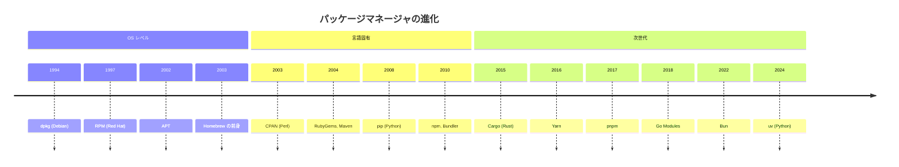
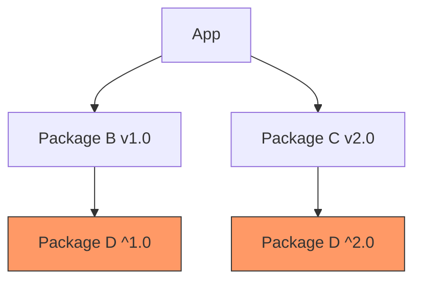
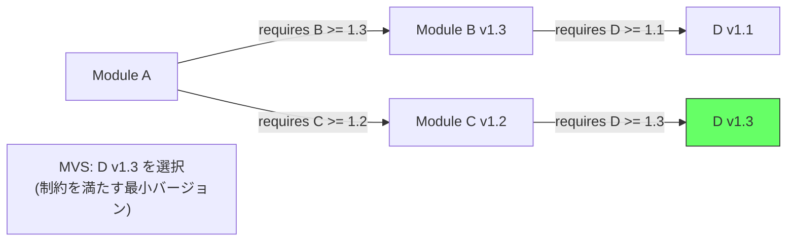
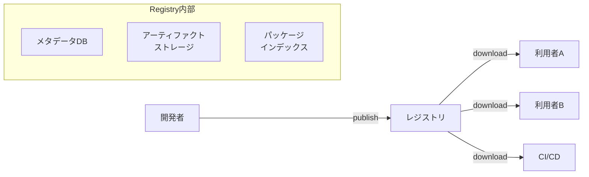
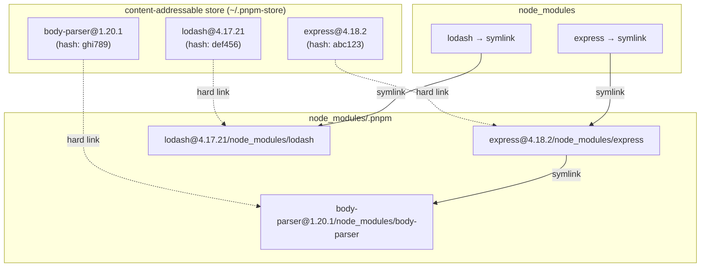
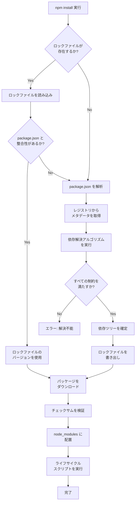

# パッケージマネージャの仕組み（依存解決, ロックファイル, レジストリ）

## 1. 背景と動機：なぜパッケージマネージャが必要なのか

### 1.1 依存関係管理という根源的問題

ソフトウェア開発において、すべてのコードをゼロから書くことは現実的ではない。現代のアプリケーションは膨大な数の外部ライブラリに依存しており、その管理は手作業では到底追いつかない複雑さを持つ。

たとえば、典型的なReactアプリケーションの `node_modules` ディレクトリには1,000以上のパッケージが含まれている。開発者が直接 `package.json` に記述する依存は数十程度だが、それぞれの依存がさらに別のライブラリに依存する——いわゆる**推移的依存関係（transitive dependencies）**——を含めると、依存グラフは巨大なものになる。

パッケージマネージャが解決すべき問題は、大きく分けて以下の4つに集約される。

1. **発見と取得**: 必要なライブラリをどこから、どうやって入手するか
2. **依存解決**: 複数のライブラリが要求するバージョン制約を同時に満たす組み合わせをどう決定するか
3. **再現性**: 異なる環境・異なる時点で、まったく同じ依存ツリーを再構築できるか
4. **隔離と整合性**: インストールされたパッケージが互いに干渉せず、正しく動作するか

### 1.2 パッケージマネージャがない世界

パッケージマネージャが存在しない時代、開発者は以下のような手順でライブラリを管理していた。

1. ライブラリの公式サイトからtarballやzipファイルを手動ダウンロード
2. ソースコードを `./configure && make && make install` でビルド・インストール
3. ヘッダファイルやライブラリパスを手動で設定
4. バージョンアップ時は再度同じ作業を繰り返す
5. 依存ライブラリがさらに別のライブラリを要求する場合、芋づる式に手作業が増える

この手法には深刻な問題があった。

- **DLL地獄（DLL Hell）/ 依存地獄（Dependency Hell）**: 異なるアプリケーションが同じライブラリの異なるバージョンを要求し、システム全体で共存できない
- **再現不可能なビルド**: 開発者Aの環境では動くが、開発者Bの環境では動かない（いわゆる「It works on my machine」問題）
- **セキュリティリスク**: パッチの適用漏れ、出所不明なバイナリの使用
- **スケーラビリティの欠如**: 依存が数個なら手作業で管理できるが、数百になると破綻する

パッケージマネージャは、これらの問題を体系的に解決するために生まれたツールである。

## 2. パッケージマネージャの進化の歴史

### 2.1 OSレベルのパッケージマネージャ

パッケージマネージャの歴史は、OSレベルのソフトウェア配布から始まる。

**dpkg / APT（1994年〜）**: Debianプロジェクトが開発した `dpkg` は、`.deb` パッケージの管理を自動化した最初期のパッケージマネージャの一つである。APT（Advanced Package Tool）はその上に構築されたフロントエンドであり、依存関係の自動解決とリポジトリからのダウンロードを実現した。

**RPM / YUM / DNF（1997年〜）**: Red Hat系ディストリビューションで採用されたRPM（Red Hat Package Manager）は、`.rpm` パッケージ形式を定義し、YUM（Yellowdog Updater Modified）、さらにその後継であるDNFが依存解決の機能を提供した。

これらのOSレベルのパッケージマネージャは、システム全体に対してソフトウェアをインストールする設計であった。そのため、以下の制約があった。

- 同じライブラリの複数バージョンを共存させることが困難
- root権限が必要
- 特定のプログラミング言語のエコシステムに特化していない

### 2.2 言語固有のパッケージマネージャの登場

2000年代に入ると、プログラミング言語ごとに専用のパッケージマネージャが発展した。

| 年代 | ツール | 言語/エコシステム | 特徴 |
|------|--------|-------------------|------|
| 2003 | CPAN | Perl | 最初期の言語固有レジストリ |
| 2004 | RubyGems | Ruby | gemという単位でのパッケージ管理 |
| 2004 | Maven | Java | XML設定ベース、Maven Central |
| 2008 | pip | Python | PyPIからのインストール |
| 2010 | npm | Node.js | package.jsonによる宣言的管理 |
| 2013 | Composer | PHP | Packagistレジストリ |
| 2015 | Cargo | Rust | 言語と統合された設計 |
| 2018 | Go Modules | Go | 言語仕様レベルでの依存管理 |

この進化において重要な転換点がいくつかある。

**npmの革新（2010年）**: npmは、プロジェクトごとにローカルに依存をインストールする `node_modules` というアプローチを普及させた。これにより、プロジェクト間の依存の衝突が原理的に排除された。また、`package.json` による宣言的な依存管理は、それ以降の多くのパッケージマネージャの設計に影響を与えた。

**Bundlerの貢献（2010年）**: Rubyの世界では、Bundlerが `Gemfile.lock` というロックファイルの概念を広く普及させた。これにより「開発環境と本番環境で同じバージョンのgemが使われる」ことが保証されるようになった。

**Cargoの統合設計（2015年）**: RustのCargoは、パッケージマネージャをビルドシステムと一体化させた設計であり、`Cargo.toml`（マニフェスト）と `Cargo.lock`（ロックファイル）の分離、セマンティックバージョニングの厳密な適用など、後発の利点を活かした洗練された設計を持つ。



## 3. セマンティックバージョニングとバージョン制約

### 3.1 Semantic Versioning（SemVer）

依存解決を議論する前に、バージョン番号の体系を理解する必要がある。現代のほとんどのパッケージマネージャは **Semantic Versioning（SemVer）** を前提としている。

SemVerの形式は `MAJOR.MINOR.PATCH` であり、それぞれの数値は以下の意味を持つ。

- **MAJOR**: 後方互換性のないAPIの変更
- **MINOR**: 後方互換性のある機能追加
- **PATCH**: 後方互換性のあるバグ修正

たとえば、`1.2.3` から `1.3.0` への変更は「新機能の追加だが、既存APIは壊れない」ことを意味し、`2.0.0` への変更は「破壊的変更がある」ことを意味する。

### 3.2 バージョン制約の記法

パッケージの依存宣言では、正確なバージョンを固定するのではなく、許容するバージョンの範囲を指定する。これにより、バグ修正やセキュリティパッチの適用が自動化される。

```json
// package.json (npm) の例
{
  "dependencies": {
    "lodash": "^4.17.0",
    "express": "~4.18.0",
    "react": ">=18.0.0 <19.0.0",
    "typescript": "5.3.3"
  }
}
```

主要な制約記法を以下にまとめる。

| 記法 | 意味 | 例: `^1.2.3` に該当するバージョン |
|------|------|-----------------------------------|
| `^` (caret) | MAJOR が同じ範囲 | `>=1.2.3` かつ `<2.0.0` |
| `~` (tilde) | MINOR が同じ範囲 | `>=1.2.3` かつ `<1.3.0` |
| `>=`, `<` | 明示的な範囲 | そのまま |
| `*` | 任意のバージョン | すべて |
| 固定値 | 厳密な一致 | `1.2.3` のみ |

::: warning SemVerの限界
SemVerは「約束事」であり、強制力はない。パッケージ作者がMINORバージョンで破壊的変更を入れてしまうことは現実に起こりうる。ロックファイルが重要な理由の一つはここにある。
:::

### 3.3 Rust / Cargo におけるバージョン指定

Cargoでは、SemVerの解釈がさらに厳密に定義されている。

```toml
# Cargo.toml
[dependencies]
serde = "1.0"       # ^1.0.0 と同義: >=1.0.0, <2.0.0
tokio = "~1.25"     # >=1.25.0, <1.26.0
rand = ">=0.8, <0.9"
```

特筆すべきは、`0.x.y` の扱いである。SemVerの仕様では `0.x` は「初期開発段階」であり安定性の保証がないが、Cargoでは `0.x.y` のうち `x` をMAJOR相当として扱う。すなわち `^0.2.3` は `>=0.2.3, <0.3.0` を意味する。

## 4. 依存解決アルゴリズム

### 4.1 依存解決問題の本質

依存解決とは、すべてのパッケージが要求するバージョン制約を同時に満たすバージョンの組み合わせを見つける問題である。形式的には以下のように定義される。

与えられた条件:
- パッケージの集合 $P = \{p_1, p_2, \ldots, p_n\}$
- 各パッケージ $p_i$ の利用可能なバージョンの集合 $V_i = \{v_{i,1}, v_{i,2}, \ldots\}$
- 各バージョン $v_{i,j}$ が持つ依存制約の集合 $D_{i,j} = \{(p_k, C_k) \mid \ldots\}$（パッケージ $p_k$ のバージョンが制約 $C_k$ を満たす必要がある）

求めるもの:
- 各パッケージ $p_i$ に対する具体的なバージョン $v_i^*$ の選択で、すべての制約が同時に満たされるもの

この問題は、一般的には **NP完全** であることが知られている。つまり、パッケージ数が増えるにつれて、最悪の場合の計算量は指数的に増大する。

### 4.2 依存解決の困難さ：ダイヤモンド依存問題

依存解決が難しくなる典型的なパターンとして、**ダイヤモンド依存**がある。



この例では、AppはBとCに依存し、BはD v1.xを、CはD v2.xを要求している。D v1.xとD v2.xは互換性がないため、BとCを同時に使用することは不可能である——少なくともDのインスタンスが一つしか存在できない環境では。

この問題に対するアプローチは言語・ツールによって異なる。

- **npm**: `node_modules` のネスト構造により、BとCがそれぞれ異なるバージョンのDを持つことを許容する
- **Go Modules**: Minimum Version Selection（後述）によりMAJORバージョンが異なるモジュールを別のパッケージとして扱う
- **pip**: 基本的にフラットな名前空間であり、同じパッケージの複数バージョン共存は不可能。制約が矛盾する場合はエラーとなる

### 4.3 SATソルバーによる依存解決

多くの高度なパッケージマネージャは、依存解決問題を**充足可能性問題（SAT: Boolean Satisfiability Problem）** に帰着させて解く。

基本的な考え方は以下の通りである。

1. 各パッケージの各バージョンに対してブーリアン変数を割り当てる: $x_{p,v}$ は「パッケージ $p$ のバージョン $v$ を選択する」ことを意味する
2. 以下の制約を論理式として表現する:
   - **一意性制約**: 各パッケージについて、選択されるバージョンは高々1つ: $\sum_{v} x_{p,v} \leq 1$
   - **依存制約**: パッケージ $p$ のバージョン $v$ が選択された場合、その依存先も満たされる: $x_{p,v} \Rightarrow \bigvee_{v' \in \text{compatible}} x_{q,v'}$
   - **非互換制約**: 互いに矛盾するバージョンの組み合わせを禁止: $\neg(x_{p,v} \wedge x_{q,w})$
3. SATソルバーを用いて、すべての制約を同時に満たす変数の割り当てを探索する

実際には、単純なSATではなく **DPLL（Davis-Putnam-Logemann-Loveland）アルゴリズム** やその拡張である **CDCL（Conflict-Driven Clause Learning）** が使われることが多い。CDCLは矛盾を検出した際にその原因を「学習」し、同じ矛盾パターンを繰り返さないようにすることで探索を効率化する。

**PubGrub**: Dartのパッケージマネージャ（pub）のために開発されたPubGrubアルゴリズムは、依存解決に特化したバージョン解決アルゴリズムである。CDCLに着想を得つつ、バージョン解決問題の構造を活用した最適化を行い、矛盾が生じた場合に人間が理解しやすいエラーメッセージを生成できる点が特徴である。Poetryやuvなど、近年のパッケージマネージャで採用が広がっている。

### 4.4 バックトラッキングによる解決

SATソルバーほど汎用的ではないが、多くのパッケージマネージャは**バックトラッキング**ベースのアルゴリズムを使用している。

```
resolve(requirements, selections):
    if requirements is empty:
        return selections  // all constraints satisfied

    pick the next requirement R
    for each version V of R (newest first):
        if V is compatible with current selections:
            add V to selections
            new_requirements = requirements + dependencies_of(V)
            result = resolve(new_requirements, selections)
            if result is not FAILURE:
                return result
            remove V from selections  // backtrack

    return FAILURE
```

このアルゴリズムは、最新バージョンから順に試行し、矛盾が生じたら前の選択に戻って別のバージョンを試す。最悪の場合は指数的な時間がかかるが、実際のパッケージエコシステムでは、最新バージョンを優先する戦略により多くの場合高速に解決できる。

### 4.5 Minimum Version Selection（MVS）

Go Modulesが採用した**Minimum Version Selection（MVS）** は、従来の依存解決アルゴリズムとは異なるアプローチを取る。

従来のアプローチでは「制約を満たす最新バージョン」を選択するが、MVSでは「制約を満たす最小（最古）のバージョン」を選択する。



MVSでは、D v1.1とD v1.3の両方が制約として挙がるが、両方を満たす最小バージョンであるD v1.3を選択する。v1.4やv1.5が存在していても、それらは選択されない。

MVSの利点は以下の通りである。

- **決定性**: ロックファイルなしでも、同じ `go.mod` から常に同じバージョンが選択される
- **NP完全の回避**: MVSは多項式時間で解ける。バックトラッキングが不要であるため、計算が高速
- **最小変更の原則**: 新しいバージョンが公開されても、明示的にバージョンを上げない限り依存が変わらない

ただし、MVSは「最古のバージョンを使い続ける」という性質上、セキュリティパッチの自動適用が行われず、開発者が能動的にバージョンを上げる必要がある。

## 5. ロックファイル：決定論的ビルドの鍵

### 5.1 なぜロックファイルが必要なのか

マニフェストファイル（`package.json`, `Cargo.toml`, `pyproject.toml` など）には、依存のバージョン**範囲**が記述されている。`^1.2.3` は「1.2.3以上、2.0.0未満」を意味するが、この範囲に該当するバージョンは時間とともに増えていく。

```
2024-01-01: lodash ^4.17.0 → 解決結果: 4.17.21
2024-06-01: lodash ^4.17.0 → 解決結果: 4.17.25（新バージョンがリリースされた）
```

もしロックファイルがなければ、`npm install` を実行するタイミングによって異なるバージョンがインストールされる。これは「昨日まで動いていたのに、今日 `npm install` したら動かなくなった」という事態を引き起こす。

ロックファイルは、依存解決の**結果**を記録するファイルであり、以下の情報を含む。

- 解決されたすべてのパッケージの正確なバージョン
- 各パッケージのダウンロード元URL
- 完全性検証のためのハッシュ値（チェックサム）
- 推移的依存関係の完全なツリー

### 5.2 主要なロックファイルの形式

#### package-lock.json（npm）

```json
{
  "name": "my-app",
  "version": "1.0.0",
  "lockfileVersion": 3,
  "packages": {
    "node_modules/express": {
      "version": "4.18.2",
      "resolved": "https://registry.npmjs.org/express/-/express-4.18.2.tgz",
      "integrity": "sha512-...",
      "dependencies": {
        "accepts": "~1.3.8",
        "body-parser": "1.20.1"
      }
    }
  }
}
```

#### Cargo.lock（Rust）

```toml
[[package]]
name = "serde"
version = "1.0.193"
source = "registry+https://github.com/rust-lang/crates.io-index"
checksum = "25dd9975e68d0cb5aa1120c288333fc98731bd1dd12f561e468ea5c6c71b1e9b"
dependencies = [
 "serde_derive",
]
```

#### uv.lock / poetry.lock（Python）

```toml
# uv.lock
[[package]]
name = "requests"
version = "2.31.0"
source = { registry = "https://pypi.org/simple" }
dependencies = [
    { name = "certifi" },
    { name = "charset-normalizer" },
    { name = "idna" },
    { name = "urllib3" },
]
```

### 5.3 ロックファイルの運用方針

ロックファイルの運用方針は、プロジェクトの種類によって異なる。

| プロジェクトの種類 | ロックファイルをコミットするか | 理由 |
|---|---|---|
| アプリケーション | **する**（必須） | 全環境で同一のバージョンを使用するため |
| ライブラリ | **しない**ことが多い | 利用者側で依存解決が行われるため |

ライブラリの場合、ロックファイルをコミットすると、そのライブラリのCI環境では特定のバージョンに固定されるが、利用者のプロジェクトでは別のバージョンが選択される可能性がある。ライブラリ側でロックファイルに依存したテストを行うと、利用者の環境で発生するバグを見逃すリスクがある。

::: tip CI/CDにおけるベストプラクティス
CI環境では `npm install` ではなく `npm ci` を使用すべきである。`npm ci` はロックファイルの内容を厳密に再現し、`package.json` との不整合がある場合はエラーとする。`npm install` はロックファイルを更新してしまう可能性がある。同様に、Cargoでは `--locked` フラグを使用する。
:::

## 6. レジストリアーキテクチャ

### 6.1 レジストリとは何か

レジストリは、パッケージのメタデータとアーティファクト（パッケージ本体）を保管・配布するサーバーである。パッケージマネージャのエコシステムにおいて、レジストリは中央集権的なインフラストラクチャとして機能する。



### 6.2 主要なレジストリの比較

| レジストリ | 言語 | パッケージ数 | ストレージ方式 | 特徴 |
|---|---|---|---|---|
| npm Registry | JavaScript | 約200万 | CouchDB + S3 | 最大規模、scoped packages |
| PyPI | Python | 約55万 | PostgreSQL + S3 | Wheel/sdist形式 |
| crates.io | Rust | 約15万 | Git index + S3 | GitベースのIndex |
| Maven Central | Java | 約60万 | Sonatype Nexus | GAV座標系 |
| RubyGems.org | Ruby | 約18万 | PostgreSQL + S3 | compact indexプロトコル |

### 6.3 npmレジストリの内部構造

npmレジストリは、世界最大のパッケージレジストリである。そのアーキテクチャを例に、レジストリの動作を詳しく見てみよう。

**パッケージメタデータの取得**: `npm install lodash` を実行すると、クライアントはまず `https://registry.npmjs.org/lodash` にHTTPリクエストを送信する。レスポンスはJSON形式であり、すべてのバージョンのメタデータ（依存関係、tarballのURL、チェックサムなど）が含まれる。

**tarballのダウンロード**: バージョンが確定すると、`https://registry.npmjs.org/lodash/-/lodash-4.17.21.tgz` のようなURLからパッケージ本体をダウンロードする。

**完全性の検証**: ダウンロードしたtarballのSHA-512ハッシュを計算し、メタデータに含まれる `integrity` フィールドの値（SRI: Subresource Integrity形式）と照合する。

### 6.4 crates.ioのGitベースインデックス

Rustのcrates.ioは、パッケージのインデックスをGitリポジトリとして管理するユニークな設計を持つ。

`https://github.com/rust-lang/crates.io-index` リポジトリには、すべてのクレート（パッケージ）のメタデータがファイルとして格納されている。Cargoはこのリポジトリをローカルにクローンし、`git pull` で差分のみを取得することで効率的なインデックス更新を実現する。

```
crates.io-index/
├── 1/           # 1文字のクレート名
├── 2/           # 2文字のクレート名
├── 3/
│   └── s/
│       └── url  # "url" クレートのメタデータ
├── se/
│   └── rd/
│       └── serde # "serde" クレートのメタデータ（4文字以上は先頭2文字ずつで分割）
└── config.json
```

各ファイルはJSON Lines形式であり、クレートの各バージョンが1行ずつ記録されている。この設計により、Gitの差分取得機能を活用した効率的なインデックス同期が実現される。

なお、2023年以降はHTTPベースの「Sparse Index」プロトコルも導入され、必要なクレートのメタデータだけをHTTPで取得することも可能になった。これにより、インデックス全体をクローンする必要がなくなり、初回の `cargo build` が大幅に高速化された。

### 6.5 プライベートレジストリとプロキシ

企業環境では、以下のような理由からプライベートレジストリが必要になる。

- 社内専用パッケージの公開
- パブリックレジストリへのアクセス制御とキャッシュ
- サプライチェーンセキュリティのためのパッケージ検査

主要なプライベートレジストリ/プロキシソリューション:

- **Verdaccio**: 軽量なnpmプライベートレジストリ
- **Sonatype Nexus**: Java中心だがnpm、PyPIにも対応するユニバーサルリポジトリマネージャ
- **Artifactory**: JFrogが提供する商用のユニバーサルパッケージ管理
- **GitHub Packages / GitLab Package Registry**: GitプラットフォームのパッケージレジストリP

## 7. パッケージのインストール戦略

### 7.1 ネストされた node_modules（npm v2以前）

npmの初期バージョンは、依存関係をツリー構造そのままに `node_modules` ディレクトリにネストして配置していた。

```
node_modules/
├── A/
│   └── node_modules/
│       └── C@1.0/
└── B/
    └── node_modules/
        └── C@2.0/
```

この方式では、AとBがそれぞれ異なるバージョンのCを使用できる。Node.jsのモジュール解決アルゴリズム（`require()` が親ディレクトリの `node_modules` を順に探索する）と自然に整合する。

しかし、以下の問題があった。

- **深いネスト**: Windowsのパス長制限（260文字）に抵触する
- **重複インストール**: 同じバージョンのパッケージが複数箇所にコピーされ、ディスクを浪費する
- **インストール速度**: 大量のファイルコピーが発生する

### 7.2 フラット化された node_modules（npm v3以降 / Yarn Classic）

npm v3からは、可能な限り `node_modules` の直下にパッケージを配置する**フラット化（hoisting）** が導入された。

```
node_modules/
├── A/
├── B/
├── C@1.0/        # A が使うバージョン（トップレベルに巻き上げ）
└── B/
    └── node_modules/
        └── C@2.0/ # B が使うバージョン（衝突するためネスト）
```

フラット化により、ディスク使用量とネストの深さは改善されたが、新たな問題が生じた。これが後述する**ファントム依存問題**である。

### 7.3 pnpmのcontent-addressable storage

pnpmは、上記の問題を根本的に解決するアプローチを採用している。



pnpmの設計の核心は以下の3点である。

1. **Content-addressable store**: すべてのパッケージファイルはグローバルストア（`~/.pnpm-store`）にハッシュベースで格納される。同じファイルは一度しかダウンロード・保存されない
2. **ハードリンク**: プロジェクトの `node_modules` からグローバルストアへのハードリンクにより、ディスク使用量を最小化
3. **仮想ストア**: `node_modules/.pnpm` ディレクトリに仮想的なパッケージ配置を構築し、シンボリックリンクで接続することで、各パッケージが自分の直接依存のみを参照できるようにする（厳密な依存関係の強制）

### 7.4 Pythonの仮想環境

Pythonのパッケージ管理は、仮想環境（virtual environment）という独自のアプローチを取る。

```bash
# Create a virtual environment
python -m venv .venv

# Activate it (Unix)
source .venv/bin/activate

# Install packages into the virtual environment
pip install requests
```

仮想環境は、Pythonインタープリタのコピーと独立した `site-packages` ディレクトリを持つ隔離された環境である。これにより、プロジェクトごとに異なるバージョンのライブラリを使用できる。

ただし、Pythonの仮想環境には本質的な制限がある。同一環境内では同じパッケージの複数バージョンを共存させることはできず、`site-packages` はフラットな名前空間である。Node.jsのように推移的依存で異なるバージョンをネストさせることはできない。

### 7.5 Go Modulesのモジュールキャッシュ

Go Modulesでは、ダウンロードしたモジュールは `$GOPATH/pkg/mod` にキャッシュされる。特筆すべきは、MAJORバージョンが異なるモジュールを別のパッケージパスとして扱うことである。

```go
import (
    "github.com/user/repo"    // v0.x or v1.x
    "github.com/user/repo/v2" // v2.x
)
```

これにより、同じモジュールのv1とv2を同一プログラム内で同時に使用できる。ダイヤモンド依存問題に対するGoの回答は「MAJORバージョンが異なれば別のモジュールとして扱う」というものである。

## 8. ファントム依存とホイスティングの問題

### 8.1 ファントム依存（Phantom Dependencies）

ファントム依存とは、プロジェクトの `package.json` に明示的に宣言されていないにもかかわらず、ホイスティングにより `node_modules` のトップレベルに配置されたパッケージを利用できてしまう現象である。

```json
// package.json
{
  "dependencies": {
    "express": "^4.18.0"
  }
}
```

expressは内部的に `accepts` パッケージに依存している。npmやYarnのフラット化により、`accepts` は `node_modules/accepts` に配置される。すると、以下のコードが意図せず動作してしまう。

```javascript
// This works due to hoisting, but "accepts" is not in package.json
const accepts = require('accepts'); // phantom dependency!
```

このコードの問題は明白である。

- expressが将来のバージョンで `accepts` への依存を削除したら、このコードは壊れる
- expressが `accepts` の別のバージョンに依存を変更したら、予期しない動作が起こりうる
- CIやデプロイ環境で `node_modules` のフラット化の結果が異なれば、動作しない

### 8.2 ホイスティングの非決定性

ホイスティングの結果は、インストール順序やパッケージマネージャのバージョンに依存して変わりうる。

```
# Case 1: A@1.0 depends on C@1.0, B@1.0 depends on C@2.0
node_modules/
├── A/
├── B/
│   └── node_modules/
│       └── C@2.0/
└── C@1.0/          # C@1.0 is hoisted

# Case 2: Same dependencies, different hoist result
node_modules/
├── A/
│   └── node_modules/
│       └── C@1.0/
├── B/
└── C@2.0/          # C@2.0 is hoisted
```

どちらのバージョンがトップレベルに配置されるかは、パッケージの処理順序（多くの場合はアルファベット順）やパッケージマネージャの内部ロジックに依存する。

### 8.3 pnpmによる厳密な依存の強制

pnpmは、シンボリックリンクベースの `node_modules` 構造により、ファントム依存を原理的に排除する。`package.json` に宣言されたパッケージだけが `node_modules` のトップレベルにシンボリックリンクとして配置され、推移的依存は `node_modules/.pnpm` 内の仮想ストアにのみ存在する。

このため、pnpmに移行する際には、ファントム依存に起因するエラーが発覚することがある。これは問題の検出であり、プロジェクトの依存管理を正しくするための一歩である。

## 9. セキュリティ上の考慮事項

### 9.1 サプライチェーン攻撃の脅威

パッケージマネージャのエコシステムは、サプライチェーン攻撃の主要なターゲットとなっている。`npm install` の実行は、事実上、見知らぬ開発者のコードを自分のシステムで実行することに等しい。

主な攻撃ベクターを以下に整理する。

**タイポスクワッティング**: 人気パッケージに似た名前のパッケージを登録し、タイプミスを狙う（例: `lodash` に対する `1odash`）。

**依存性混乱（Dependency Confusion）**: 組織内部で使われているプライベートパッケージと同じ名前で、パブリックレジストリにより高いバージョン番号のパッケージを登録する。多くのパッケージマネージャは、パブリックレジストリのほうが高いバージョンを持つ場合、そちらを優先的にインストールしてしまう。

**アカウント乗っ取り**: パッケージメンテナーのアカウントを侵害し、悪意のあるバージョンを公開する。

**悪意のあるポストインストールスクリプト**: npmの `postinstall` スクリプトにより、パッケージのインストール時に任意のコードを実行できる。

### 9.2 防御メカニズム

#### チェックサムと完全性検証

ロックファイルに記録されたハッシュ値（integrity）により、ダウンロードしたパッケージが改ざんされていないことを検証できる。

```
# package-lock.json
"integrity": "sha512-WMwm9LhRUo+WUaRN+vRuETqG89IgZphVSNkdFgeb6sS/E4OrDIN7t48CAewSHXc6C8lefD8KKfr5vY61brQlow=="
```

#### パッケージの署名

npm v8.13.0以降では、**署名（Sigstore）** によるパッケージの出所証明が導入されている。これにより、パッケージが特定のCI/CDパイプライン（GitHub Actionsなど）からビルド・公開されたことを暗号学的に検証できる。

```bash
# Verify package signatures
npm audit signatures
```

#### npm provenance

npm provenance（来歴情報）は、パッケージがどのソースコードリポジトリから、どのビルドシステムで構築されたかを証明するメタデータである。SLSA（Supply-chain Levels for Software Artifacts）フレームワークに基づいている。

#### ロックファイルの差分レビュー

Pull Requestにおいてロックファイルの差分を注意深くレビューすることは、不正なパッケージの混入を防ぐ有効な手段である。新しい依存が追加された場合、そのパッケージの信頼性を確認すべきである。

### 9.3 `npm install` 時のスクリプト実行リスク

npmでは、パッケージのインストール時に `preinstall`、`install`、`postinstall` スクリプトが自動実行される。これは正当な用途（ネイティブアドオンのビルドなど）にも使われるが、攻撃の入り口にもなる。

対策として以下がある。

- `--ignore-scripts` フラグの使用
- `npm config set ignore-scripts true` によるグローバル設定
- `allow-scripts`（npm v9以降）によるパッケージごとの許可制御

## 10. 主要パッケージマネージャの比較

### 10.1 JavaScript / Node.js エコシステム

| 特性 | npm | Yarn Classic | Yarn Berry (v2+) | pnpm |
|------|-----|-------------|------------------|------|
| ロックファイル | `package-lock.json` | `yarn.lock` | `yarn.lock` | `pnpm-lock.yaml` |
| node_modules構造 | フラット | フラット | Plug'n'Play (PnP) | シンボリックリンク |
| ファントム依存防止 | なし | なし | あり | あり |
| ワークスペース | v7+ | あり | あり | あり |
| ディスク効率 | 低 | 低 | 高 | 非常に高 |
| インストール速度 | 中 | 中〜高 | 高 | 高 |

**Yarn Berry (PnP)** は、`node_modules` ディレクトリを完全に廃止し、`.pnp.cjs` というマッピングファイルでパッケージの位置を解決する革新的なアプローチを取る。しかし、Node.jsのモジュール解決の仕組みとの互換性の問題から、エコシステム全体での採用は限定的にとどまっている。

### 10.2 Python エコシステム

| 特性 | pip | Poetry | uv |
|------|-----|--------|-----|
| 依存解決 | バックトラッキング (v20.3+) | PubGrub | PubGrub (Rust実装) |
| ロックファイル | なし（requirements.txt で代替） | `poetry.lock` | `uv.lock` |
| 仮想環境管理 | 外部（venv） | 統合 | 統合 |
| 速度 | 低 | 中 | 非常に高 |
| マニフェスト | `requirements.txt` / `pyproject.toml` | `pyproject.toml` | `pyproject.toml` |

**uv** は2024年にAstral社がRustで実装したPythonパッケージマネージャであり、pipの10〜100倍の速度を実現している。Cargoに着想を得た設計で、依存解決にはPubGrubアルゴリズムを採用し、パッケージのダウンロードとインストールを高度に並列化している。

### 10.3 Rust エコシステム

Cargoは、パッケージマネージャとビルドシステムが一体化した設計により、以下の利点を持つ。

- `Cargo.toml`（マニフェスト）と `Cargo.lock`（ロックファイル）の明確な分離
- フィーチャーフラグによる条件付き依存
- ビルドスクリプト（`build.rs`）による拡張
- `cargo publish` から `cargo install` までの一気通貫したワークフロー

```toml
# Cargo.toml
[dependencies]
serde = { version = "1.0", features = ["derive"] }
tokio = { version = "1", features = ["full"] }

[dev-dependencies]
criterion = "0.5"

[build-dependencies]
cc = "1.0"
```

### 10.4 Go Modules

Go Modulesは、言語仕様にモジュールシステムを統合した設計であり、他のツールとは異なるアプローチを取る。

- **Minimum Version Selection**: ロックファイルなしでも再現可能なビルド
- **Go module proxy**: `proxy.golang.org` を経由することで、元のリポジトリが消滅してもモジュールを取得可能
- **Go sumdb**: `sum.golang.org` による透明性ログで、モジュールの完全性を保証
- **Vendor directory**: `go mod vendor` により、依存を `vendor/` ディレクトリにコピーして完全なオフラインビルドを実現

```
module github.com/user/myapp

go 1.22

require (
    github.com/gin-gonic/gin v1.9.1
    golang.org/x/crypto v0.17.0
)
```

## 11. モダンな潮流

### 11.1 ワークスペース（モノレポサポート）

モノレポ（複数のパッケージを一つのリポジトリで管理する手法）の普及に伴い、パッケージマネージャのワークスペース機能が重要性を増している。

```json
// package.json (root)
{
  "workspaces": [
    "packages/*",
    "apps/*"
  ]
}
```

ワークスペース機能により、以下が実現される。

- ローカルパッケージ間の依存をシンボリックリンクで解決
- 共通の依存をルートレベルで共有（ホイスティング）
- 単一のロックファイルで全パッケージの依存を管理
- `workspace:` プロトコルによるローカルパッケージへの明示的な参照

```json
// packages/app/package.json
{
  "dependencies": {
    "@myorg/shared-utils": "workspace:^"
  }
}
```

### 11.2 Content-Addressable Storage の普及

pnpmが先駆けたcontent-addressable storage（CAS）のアプローチは、他のツールにも影響を与えている。

CASの原理は単純である。ファイルの内容をハッシュ化し、そのハッシュ値をキーとしてストアに格納する。同一内容のファイルは同一のハッシュを持つため、異なるプロジェクト間でファイルが重複しない。

```
~/.pnpm-store/v3/files/
├── 00/
│   ├── 1a2b3c4d5e...  # file content addressed by hash
│   └── 6f7g8h9i0j...
├── 01/
│   └── ...
└── ff/
    └── ...
```

この設計は、Gitのオブジェクトストア（`.git/objects`）やNixパッケージマネージャの `/nix/store` と同じ思想に基づいている。

### 11.3 Nixとの接点：完全再現可能ビルド

Nixは、パッケージ管理に関数型プログラミングのアプローチを適用した異色のパッケージマネージャである。すべてのビルド入力（ソースコード、コンパイラ、依存ライブラリ、ビルドスクリプト）をハッシュ化し、そのハッシュをパッケージのインストールパスに含めることで、完全な再現性と並行インストールを実現する。

```
/nix/store/b6gvzjyb2pg0kjfwrjmg1vfhh54ad73z-nodejs-18.16.0/
/nix/store/4ra0b9pq1m2xqsmcw4n7bq2yx6ixk3d2-nodejs-20.9.0/
```

この設計では、同じマシン上にNode.js 18とNode.js 20を問題なく共存させることができ、パスが衝突しない。開発環境の再現性という観点では究極のソリューションであるが、学習コストの高さとエコシステムの独自性がハードルとなっている。

### 11.4 ビルドシステムとの統合

パッケージマネージャは、ビルドシステムとの統合が進んでいる。

- **Turborepo / Nx**: モノレポにおけるタスク実行の最適化（キャッシュ、並列実行、依存グラフに基づく実行順序の決定）
- **Bun**: ランタイム、パッケージマネージャ、バンドラ、テストランナーを統合したオールインワンツール
- **Deno**: npmとの互換レイヤーを持ちつつ、`deno.json` による独自のモジュール管理を提供

### 11.5 セキュリティの強化

パッケージマネージャのセキュリティは、近年急速に強化されている。

- **SLSA（Supply-chain Levels for Software Artifacts）**: ビルドの完全性と来歴を保証するフレームワーク
- **Sigstore**: 署名鍵の管理を不要にする透明性ログベースの署名基盤
- **Socket.dev**: パッケージの挙動を静的解析し、怪しいパターン（ネットワークアクセス、ファイルシステム操作、環境変数の読み取りなど）を検出するサービス
- **npm audit / cargo audit**: 既知の脆弱性データベースとの照合による脆弱性スキャン

## 12. パッケージマネージャの内部処理フロー

`npm install` を例に、パッケージマネージャが内部で行う処理の全体像を整理する。



この処理フローにおいて、ロックファイルの有無が大きな分岐点となる。ロックファイルが存在し、`package.json` と整合性がある場合は、依存解決をスキップしてロックファイルに記録されたバージョンをそのまま使用する。これにより、インストールの高速化と再現性の確保が同時に実現される。

## 13. 設計上のトレードオフと今後の展望

### 13.1 中央集権 vs 分散

現在の主要なパッケージレジストリは中央集権的であり、単一障害点（SPOF）のリスクを内包している。npmレジストリが停止すれば、世界中のNode.js開発者のビルドが影響を受ける。

Go module proxyやIPFS（InterPlanetary File System）を活用した分散型のアプローチは、このリスクを軽減する可能性を持つが、メタデータの整合性やパッケージの削除（unpublish）の扱いなど、解決すべき課題は多い。

### 13.2 厳密性 vs 利便性

pnpmのような厳密な依存管理は、ファントム依存を排除する一方で、既存プロジェクトからの移行コストを生む。Yarn BerryのPlug'n'Playは `node_modules` を廃止する革新的な試みだが、エコシステムとの互換性の問題がある。

理想的なパッケージマネージャは、厳密さと利便性のバランスをどこに置くかという設計判断を迫られる。

### 13.3 速度と効率性

uvやBunのような高速なパッケージマネージャの登場は、パフォーマンスがDeveloper Experienceに直結することを示している。Rustで実装されたuvがpipの10〜100倍速いという事実は、従来のPython実装のパッケージマネージャにとって大きなインパクトを与えている。

### 13.4 今後の方向性

パッケージ管理の今後の方向性として、以下が挙げられる。

1. **ビルドの完全再現性**: Nixの思想がより広く浸透し、すべてのビルド入力をハッシュ化して管理するアプローチが一般化する可能性
2. **サプライチェーンセキュリティの標準化**: SLSAやSigstoreの普及により、パッケージの来歴と完全性の検証が標準的なワークフローに組み込まれる
3. **言語横断的な統合**: Nixやdevboxのような、言語に依存しないパッケージ管理・環境構築ツールの発展
4. **AIとの連携**: LLMによるライセンス互換性チェック、脆弱性パターンの自動検出など

## 14. まとめ

パッケージマネージャは、現代のソフトウェア開発において不可欠なインフラストラクチャである。その本質は、依存解決という組合せ最適化問題を解き、レジストリからパッケージを取得し、ロックファイルによって再現性を保証するシステムである。

依存解決アルゴリズムは、SATソルバー、バックトラッキング、PubGrub、Minimum Version Selectionなど、問題の構造に応じた多様なアプローチが存在する。ロックファイルは「今動いているバージョンの組み合わせ」を正確に記録し、時間と環境を超えた再現性を提供する。レジストリは数百万のパッケージを効率的に保管・配布するためのインフラであり、そのアーキテクチャは各エコシステムの哲学を反映している。

npm、Yarn、pnpm、pip、Poetry、uv、Cargo、Go Modules——それぞれのパッケージマネージャは、異なる設計哲学と異なるトレードオフを持つ。しかし、それらが解決しようとしている根本的な問題——「正しいバージョンのソフトウェアを、正しい場所に、再現可能な方法でインストールする」——は共通している。

パッケージマネージャの仕組みを深く理解することは、日々の開発における問題解決能力を高めるだけでなく、ソフトウェアのサプライチェーン全体のセキュリティと信頼性を考える上での基盤となるであろう。
