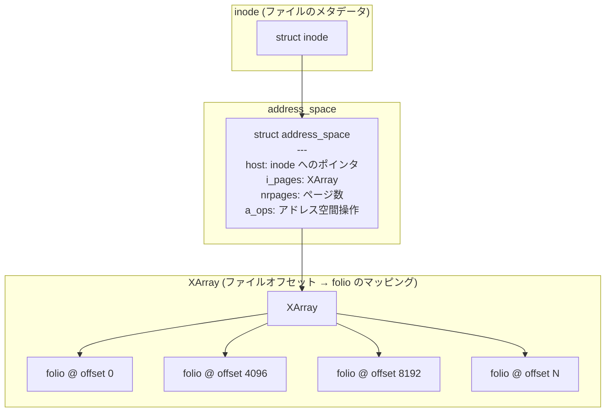
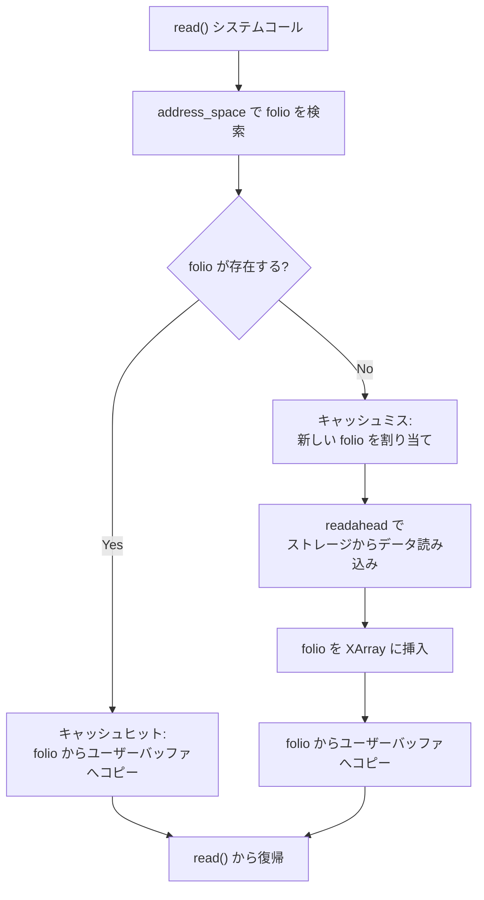
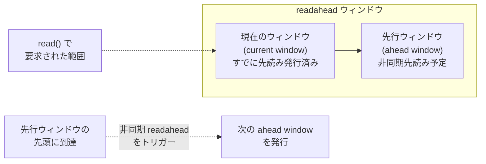
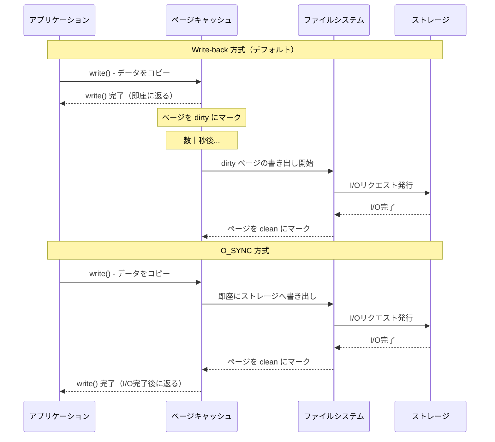
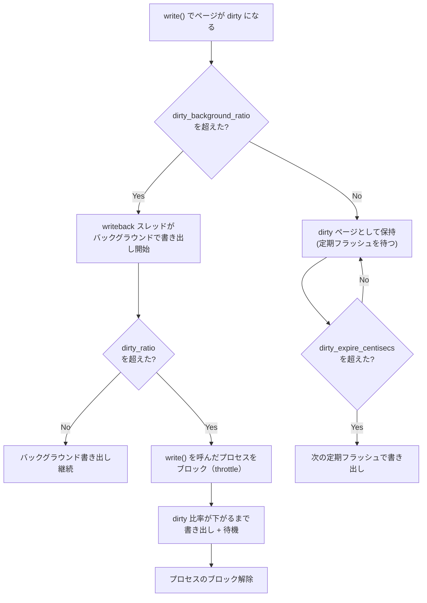
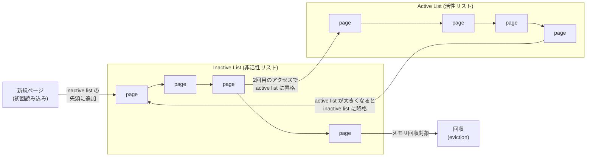
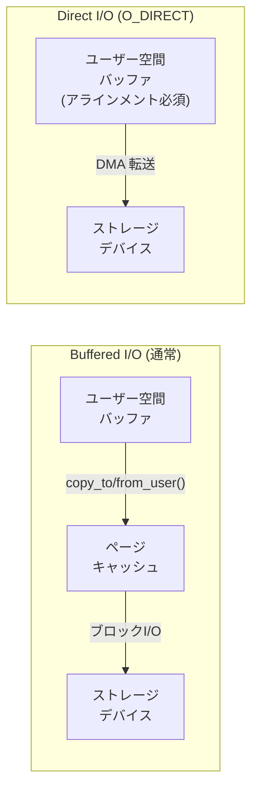
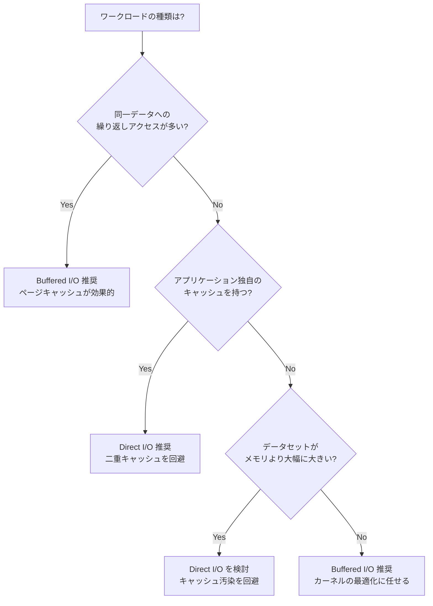

# ページキャッシュとダイレクトI/O

## 1. ページキャッシュの役割 — なぜOSはストレージの内容をメモリに保持するのか

### 1.1 ストレージアクセスの速度差という根本問題

コンピュータシステムにおいて、CPUとメインメモリの間の速度差は数十〜数百倍程度であるが、メインメモリとストレージデバイスの間には桁違いの速度差が存在する。以下に代表的なアクセスレイテンシを示す。

| 階層 | 典型的なレイテンシ | メモリ比 |
|------|-------------------|---------|
| L1キャッシュ | 1 ns | - |
| L2キャッシュ | 4 ns | - |
| L3キャッシュ | 10 ns | - |
| メインメモリ (DRAM) | 50–100 ns | 1x |
| NVMe SSD (ランダム4K読み取り) | 10–20 μs | 100–200x |
| SATA SSD (ランダム4K読み取り) | 50–100 μs | 500–1000x |
| HDD (ランダム4K読み取り) | 5–10 ms | 50,000–100,000x |

この速度差は、メモリとCPUキャッシュの間の差よりもはるかに大きい。したがって、一度ストレージから読み込んだデータをメモリ上に保持しておき、次回以降のアクセスではメモリから直接返すという戦略は、システム全体の性能に対して極めて大きな効果を持つ。

### 1.2 ページキャッシュの基本概念

**ページキャッシュ（page cache）** とは、OSカーネルがストレージデバイスから読み込んだデータ、またはストレージに書き込む予定のデータを、メインメモリ上のページ単位で保持するキャッシュ機構である。Linuxカーネルにおいては、ファイルシステムを介したI/Oのほぼすべてがページキャッシュを経由して行われる。

```
アプリケーションから見たI/Oの流れ:

┌─────────────────────────────┐
│      ユーザー空間            │
│   アプリケーション           │
│     read() / write()        │
└─────────────┬───────────────┘
              │ システムコール
              ▼
┌─────────────────────────────┐
│      カーネル空間            │
│  ┌───────────────────────┐  │
│  │   VFS (仮想ファイル    │  │
│  │   システム)            │  │
│  └───────────┬───────────┘  │
│              ▼              │
│  ┌───────────────────────┐  │
│  │   ページキャッシュ     │  │  ← ここでメモリ上にデータを保持
│  └───────────┬───────────┘  │
│              ▼              │
│  ┌───────────────────────┐  │
│  │   ファイルシステム     │  │
│  │   (ext4, XFS, etc.)   │  │
│  └───────────┬───────────┘  │
│              ▼              │
│  ┌───────────────────────┐  │
│  │   ブロックI/O層        │  │
│  └───────────┬───────────┘  │
│              ▼              │
│  ┌───────────────────────┐  │
│  │   デバイスドライバ     │  │
│  └───────────┬───────────┘  │
└──────────────┼──────────────┘
               ▼
       ストレージデバイス
```

この構造の重要な特徴は、ページキャッシュがアプリケーションから**透過的（transparent）** に動作する点である。アプリケーションは通常の `read()` / `write()` システムコールを発行するだけで、カーネルが自動的にキャッシュの利用・更新を行う。アプリケーション側にキャッシュを意識したロジックを書く必要はない。

### 1.3 ページキャッシュが解決する問題

ページキャッシュは以下の問題を解決する。

**読み取りの高速化（read caching）:** 一度読み込んだファイルデータをメモリ上に保持することで、同一データへの再アクセス時にストレージI/Oを回避する。ログファイルの解析、設定ファイルの繰り返し読み込み、共有ライブラリのロードなど、多くのワークロードで恩恵がある。

**書き込みの高速化（write buffering）:** `write()` システムコールが返った時点ではデータはメモリ上のページキャッシュに書き込まれるだけで、ストレージへの実際の書き込みは後から非同期に行われる（write-back方式）。これにより、アプリケーションはストレージI/Oの完了を待たずに処理を続行できる。

**I/Oリクエストの集約:** 細かな書き込みをメモリ上でまとめてから一括してストレージに書き出すことで、ストレージデバイスへのI/Oリクエスト数を削減する。特にHDDではシーク時間の削減効果が大きい。

**複数プロセス間でのデータ共有:** 同じファイルを複数のプロセスが読み取る場合、ページキャッシュ上の同一ページを共有する。物理メモリの消費を抑えつつ、すべてのプロセスが高速にアクセスできる。

## 2. Linuxのページキャッシュ実装

### 2.1 ページキャッシュの内部データ構造

Linuxカーネルにおいて、ページキャッシュの中核をなすデータ構造は `struct address_space` と `struct folio`（以前は `struct page`）である。

**`struct address_space`:** ファイル（正確には inode）ごとに1つ存在し、そのファイルに関連するすべてのキャッシュページを管理する。内部ではXArrayというデータ構造（カーネル5.1以降。それ以前はradix tree）を使って、ファイル内のオフセットからページへの高速なマッピングを提供する。

**`struct folio`:** カーネル5.16以降で導入された、ページキャッシュの基本単位を表す構造体である。従来の `struct page` が単一の物理ページ（通常4 KiB）を表していたのに対し、folio は複数の連続した物理ページ（compound page）をまとめて扱える。これにより、大きなファイルを扱う際のメタデータオーバーヘッドを削減できる。



### 2.2 読み取りの流れ

アプリケーションが `read()` システムコールを発行した場合の処理の流れは以下のようになる。

1. VFS層がファイルの `struct file` から `struct address_space` を取得する
2. 要求されたオフセットに対応する folio がXArray内に存在するかを検索する
3. **キャッシュヒット:** folio が見つかった場合、そのページの内容をユーザー空間のバッファにコピーする（`copy_to_user()`）。ストレージI/Oは発生しない
4. **キャッシュミス:** folio が見つからない場合、新しい folio を割り当て、ファイルシステムの `readahead` 操作を通じてストレージからデータを読み込み、ページキャッシュに追加してからユーザー空間にコピーする



### 2.3 書き込みの流れ

`write()` システムコールの処理は以下のようになる。

1. 書き込み先のオフセットに対応する folio を検索（または新規割り当て）する
2. 書き込むデータ範囲がページ全体でない場合（部分書き込み）、まず既存データをストレージから読み込んでページキャッシュに載せる
3. ユーザー空間のバッファからページキャッシュの folio にデータをコピーする
4. その folio を **dirty（ダーティ）** としてマークする
5. `write()` システムコールはこの時点でアプリケーションに制御を返す
6. dirty ページは後述の write-back メカニズムによって、非同期にストレージに書き出される

この方式により、`write()` の呼び出しはメモリコピーのみで完了するため、ストレージI/Oのレイテンシをアプリケーションが直接被ることはない。ただし、電源障害やカーネルパニックが発生した場合、dirty ページのデータはストレージに到達していない可能性があるため、データ損失のリスクが存在する。

### 2.4 mmap とページキャッシュ

`mmap()` によるファイルマッピングも、ページキャッシュと密接に関連している。ファイルを `mmap()` でプロセスのアドレス空間にマッピングすると、そのマッピング領域のページテーブルエントリはページキャッシュ上の folio を直接指すようになる。

これにより、以下の特性が生まれる。

- `read()` / `write()` のようなシステムコールを介さず、通常のメモリアクセス命令でファイルの内容を読み書きできる（`copy_to_user()` / `copy_from_user()` のオーバーヘッドが不要）
- 複数プロセスが同一ファイルを `mmap()` した場合、物理的に同じページキャッシュの folio を共有する
- ページフォルト経由でオンデマンドにページが読み込まれる

## 3. Readahead — 先読みによるシーケンシャルアクセスの最適化

### 3.1 先読みの動機

多くのワークロードでは、ファイルの読み取りはシーケンシャル（先頭から末尾に向かって順番に）に行われる。ログファイルの処理、メディアファイルのストリーミング、データのインポートなどが典型例である。このようなアクセスパターンでは、現在読んでいる位置の先のデータも近い将来に必要になる可能性が高い。

ストレージデバイスは一般に、細かなランダムアクセスよりも大きなシーケンシャルアクセスのほうが効率がよい。HDDではシークの回数を減らせるし、SSDでもコマンド発行のオーバーヘッドを削減できる。そこでカーネルは、アプリケーションが明示的に要求していないデータを「先読み（readahead）」してページキャッシュに載せておく。

### 3.2 Linuxの readahead アルゴリズム

Linuxカーネルの readahead アルゴリズムは、`struct file_ra_state` にファイルごとの先読み状態を保持し、アクセスパターンを監視して動的に先読みサイズを調整する。



先読みの基本的な流れは以下の通りである。

1. **初回検知:** ファイルに対する最初の `read()` が発行されると、カーネルはこれがシーケンシャルアクセスかどうかを判断する。ファイルの先頭からの読み取り、あるいは前回の読み取り位置から連続した読み取りであればシーケンシャルと判断する
2. **先読みウィンドウの初期化:** シーケンシャルアクセスを検知すると、初期サイズ（通常は128 KiB〜256 KiB程度）の先読みウィンドウを設定し、非同期にI/Oを発行する
3. **先読みウィンドウの拡大:** シーケンシャルアクセスが継続すると、先読みウィンドウサイズを2倍ずつ拡大していく。最大サイズはデフォルトで `read_ahead_kb`（通常128 KiB）で制限される
4. **非同期トリガー:** 現在の先読みウィンドウ内のデータを読み進め、先行ウィンドウの先頭に達すると、次の先読みが非同期にトリガーされる。これにより、アプリケーションが実際にデータを必要とする前にI/Oが完了していることを目指す
5. **パターン変更の検知:** ランダムアクセスに切り替わった場合、先読みは無効化される

### 3.3 readahead の制御

`/sys/block/<device>/queue/read_ahead_kb` を通じて、デバイスごとの最大先読みサイズをチューニングできる。

```bash
# current readahead size
cat /sys/block/sda/queue/read_ahead_kb

# set readahead to 256 KiB
echo 256 > /sys/block/sda/queue/read_ahead_kb
```

また、`posix_fadvise()` システムコールを使って、アプリケーションからカーネルに対してアクセスパターンのヒントを伝えることもできる。

```c
#include <fcntl.h>

int fd = open("data.bin", O_RDONLY);

// hint: sequential access expected
posix_fadvise(fd, 0, 0, POSIX_FADV_SEQUENTIAL);

// hint: random access expected (disable readahead)
posix_fadvise(fd, 0, 0, POSIX_FADV_RANDOM);

// hint: data will not be needed soon (can evict from cache)
posix_fadvise(fd, 0, file_size, POSIX_FADV_DONTNEED);
```

`POSIX_FADV_SEQUENTIAL` を指定すると先読みウィンドウサイズが2倍になり、`POSIX_FADV_RANDOM` を指定すると先読みが無効化される。

## 4. Write-back と dirty page — 遅延書き込みの仕組み

### 4.1 write-back 方式の概要

前述の通り、Linuxのページキャッシュはデフォルトで **write-back** 方式を採用している。`write()` システムコールでデータがページキャッシュに書き込まれると、そのページは dirty としてマークされ、実際のストレージへの書き出しは後から非同期で行われる。

対照的な方式として **write-through** がある。write-through では `write()` のたびにストレージにも同期的に書き込むため、データの永続性は保証されるが、書き込み性能が大幅に低下する。Linuxではファイルを `O_SYNC` フラグ付きでオープンすることでwrite-through に近い動作を得られるが、通常のファイルI/Oでは使用されない。



### 4.2 dirty ページの書き出しトリガー

dirty ページがストレージに書き出されるタイミングは、主に以下の3つである。

**1. 定期的なフラッシュ（periodic writeback）:**

カーネルの `writeback` ワーカースレッドが一定間隔で dirty ページを書き出す。間隔は `dirty_writeback_centisecs`（デフォルト: 500 = 5秒）で制御される。

```bash
# writeback interval (in centiseconds)
cat /proc/sys/vm/dirty_writeback_centisecs
# => 500 (5 seconds)
```

**2. dirty ページの割合が閾値を超えた場合:**

dirty ページがシステムのメモリに対して一定割合を超えると、バックグラウンドでの書き出しが始まる。さらに高い閾値を超えると、`write()` を呼んだプロセス自体がブロックされて書き出しに参加する（throttling）。

| パラメータ | デフォルト値 | 意味 |
|-----------|-------------|------|
| `dirty_background_ratio` | 10% | この割合を超えると writeback スレッドが書き出し開始 |
| `dirty_ratio` | 20% | この割合を超えるとプロセスがブロックされる |
| `dirty_expire_centisecs` | 3000 (30秒) | dirty 状態がこの時間を超えたページは書き出し対象 |

```bash
# background writeback threshold (percentage of available memory)
cat /proc/sys/vm/dirty_background_ratio
# => 10

# hard limit - processes block when exceeded
cat /proc/sys/vm/dirty_ratio
# => 20
```

**3. 明示的な同期要求:**

`fsync()`, `fdatasync()`, `sync()` などのシステムコールにより、アプリケーションが明示的にデータの永続化を要求する場合。

```c
int fd = open("data.bin", O_WRONLY | O_CREAT, 0644);

write(fd, buf, size);

// flush this file's dirty pages to storage
fsync(fd);

// flush only data (not metadata like timestamps)
fdatasync(fd);
```

### 4.3 writeback の制御フロー



### 4.4 データ損失のリスクと対策

write-back 方式では、dirty ページがストレージに書き出される前にシステムが異常終了すると、データが失われる。このリスクに対処するための主な手段を以下に示す。

- **`fsync()` / `fdatasync()` の適切な使用:** データの永続化が必要なタイミング（例：トランザクションのコミット時）で明示的に呼び出す
- **`O_SYNC` / `O_DSYNC` フラグ:** ファイルオープン時に指定することで、すべての `write()` を同期的に行う
- **ジャーナリングファイルシステム:** ext4, XFS などのジャーナリングファイルシステムは、メタデータの整合性を保証するためにジャーナル（ログ）を使用する。データそのものの保護には `data=journal` マウントオプションが必要（ext4 の場合）だが、性能への影響が大きい
- **バッテリーバックアップ付きストレージコントローラ:** ハードウェアレベルでwrite-back キャッシュを備えたRAIDコントローラの中には、バッテリーやスーパーキャパシタで電源障害時にキャッシュ内容をフラッシュする機能を持つものがある

## 5. メモリ回収 — LRU と active/inactive list

### 5.1 メモリ圧迫時の問題

ページキャッシュは「空いているメモリはすべてキャッシュに使う」という方針で運用される。`free` コマンドの `buff/cache` 列に表示される値が大きいのは正常な動作であり、問題ではない。

```bash
$ free -h
               total        used        free      shared  buff/cache   available
Mem:            62Gi       8.2Gi       1.3Gi       256Mi        53Gi        53Gi
Swap:          4.0Gi          0B       4.0Gi
```

この例では、62 GiBのメモリのうち53 GiBがバッファ/キャッシュに使われているが、`available` も53 GiBと表示されている。これは、ページキャッシュのメモリはアプリケーションが必要とすればいつでも解放できるためである。

しかし、アプリケーションが新たにメモリを必要とした際に空きメモリが不足している場合、カーネルはページキャッシュのページを回収（reclaim）してアプリケーションに割り当てる必要がある。このとき、**どのページを回収すべきか**を効率的に決定する仕組みが必要になる。

### 5.2 LRUアルゴリズムとその課題

最も基本的なキャッシュ回収アルゴリズムは **LRU（Least Recently Used）** である。最も長い間アクセスされていないページから順に回収する方式で、「最近アクセスされたデータは近い将来もアクセスされる可能性が高い」という時間的局所性（temporal locality）の仮定に基づいている。

しかし、純粋なLRUには問題がある。例えば、巨大なファイルを一度だけスキャンする処理（大量データのインポートやバックアップなど）を行うと、一度しか使われないデータでページキャッシュが埋め尽くされ、頻繁にアクセスされる「ホットな」データが追い出されてしまう。これを **キャッシュ汚染（cache pollution）** と呼ぶ。

### 5.3 Linuxの active/inactive list

Linuxカーネルは、キャッシュ汚染に対処するため、ページキャッシュのページを2つのLRUリストで管理する。



**Inactive list（非活性リスト）:**
- 新しくページキャッシュに追加されたページは、まず inactive list の先頭に配置される
- 一度しかアクセスされていないページが置かれるリスト
- メモリ回収時には、このリストの末尾から順にページが回収される

**Active list（活性リスト）:**
- inactive list にいる間に2回目のアクセスがあったページは、active list に昇格する
- 頻繁にアクセスされる「ホットな」ページが置かれるリスト
- active list が inactive list に対して大きくなりすぎると、active list の末尾のページが inactive list に降格される

この2段階の仕組みにより、一度しかアクセスされないデータ（巨大ファイルのスキャンなど）は inactive list に留まったまま回収され、active list 上のホットなデータを追い出すことはない。

### 5.4 ファイル系ページとアノニマスページ

Linuxのメモリ回収は、ページキャッシュ（ファイルバックド・ページ）だけでなく、アノニマスページ（ヒープやスタックなど、ファイルに紐づかないメモリ）も対象としている。カーネルはこれらに別々のLRUリストを維持している。

| 種別 | 回収方法 | コスト |
|------|---------|-------|
| Clean なファイルバックド・ページ | 単にページを破棄する（ストレージから再読み込み可能） | 低い |
| Dirty なファイルバックド・ページ | ストレージに書き出してから破棄 | 中程度 |
| アノニマスページ | スワップ領域に書き出してから回収 | 高い |

`vm.swappiness` パラメータ（デフォルト: 60）は、ファイルバックド・ページとアノニマスページのどちらを優先的に回収するかのバランスを制御する。値が小さいほどファイルキャッシュを優先的に回収し（スワップを避け）、値が大きいほどアノニマスページも積極的にスワップする。

```bash
# current swappiness
cat /proc/sys/vm/swappiness
# => 60

# prefer reclaiming file-backed pages (reduce swap usage)
echo 10 > /proc/sys/vm/swappiness
```

### 5.5 Multi-Generation LRU (MGLRU)

Linux 6.1で導入された **Multi-Generation LRU (MGLRU)** は、従来の2段階（active/inactive）LRUを拡張し、複数の「世代（generation）」でページの年齢をより精密に追跡する仕組みである。

従来のactive/inactive方式では、active list 内のページ間の年齢区別が粗いため、メモリ圧迫時に最適でないページが回収される場合があった。MGLRUは以下の改善をもたらす。

- ページを複数世代で管理し、アクセスパターンをより正確に反映
- ページテーブルのアクセスビットを効率的にスキャンしてページの使用状況を追跡
- 大規模メモリシステムにおけるCPUオーバーヘッドの削減

## 6. ダイレクトI/Oの仕組みと用途

### 6.1 ダイレクトI/Oとは

**ダイレクトI/O（Direct I/O）** とは、ページキャッシュをバイパスして、アプリケーションのユーザー空間バッファとストレージデバイスの間で直接データを転送するI/O方式である。Linuxでは、ファイルをオープンする際に `O_DIRECT` フラグを指定することで使用できる。

```c
#include <fcntl.h>
#include <unistd.h>
#include <stdlib.h>

// open with O_DIRECT
int fd = open("data.bin", O_RDWR | O_DIRECT);

// buffer must be aligned to block size (typically 512 or 4096 bytes)
void *buf;
posix_memalign(&buf, 4096, 4096);

// read bypasses page cache
pread(fd, buf, 4096, 0);

// write bypasses page cache
pwrite(fd, buf, 4096, 0);

free(buf);
close(fd);
```

### 6.2 ダイレクトI/Oのデータフロー



通常のバッファードI/Oでは、データはユーザー空間バッファとページキャッシュの間でコピーされ、さらにページキャッシュとストレージデバイスの間でDMA転送される。つまりデータは**2回コピー**される。

ダイレクトI/Oでは、DMAコントローラがユーザー空間のバッファから直接ストレージデバイスにデータを転送する（またはその逆）。ページキャッシュを経由しないため、コピーが**1回**で済む。

### 6.3 ダイレクトI/Oの制約

ダイレクトI/Oを使用するには、以下の制約を満たす必要がある。

**アラインメント要件:**
- 読み書きするバッファのメモリアドレスが、デバイスのブロックサイズ（通常512バイトまたは4096バイト）にアラインされている必要がある
- 読み書きのサイズもブロックサイズの倍数でなければならない
- ファイル内のオフセットもブロックサイズの倍数でなければならない

これらの要件を満たさない場合、`read()` / `write()` は `EINVAL` エラーを返す。

**性能特性:**
- 読み取り時にページキャッシュの恩恵を受けられないため、同一データへの繰り返しアクセスが遅くなる
- readahead が行われないため、シーケンシャルリードの性能がバッファードI/Oより劣る場合がある
- 小さなI/Oリクエストでは、ページキャッシュのバッファリング効果がないため、オーバーヘッドが相対的に大きくなる

### 6.4 ダイレクトI/Oが有効なユースケース

以下のようなケースでは、ダイレクトI/Oが有効である。

**アプリケーション独自のキャッシュを持つ場合:** データベースシステムがその代表例である。データベースはクエリパターンやアクセス頻度に基づいた独自のバッファプール（キャッシュ）を管理しており、OSのページキャッシュは「二重キャッシュ」となってメモリを浪費するだけでなく、キャッシュ管理の正確性を損なう可能性がある。

**巨大なシーケンシャル書き込み:** ログの一括書き込みやデータのエクスポートなど、大量のデータを連続して書き込む場合、ページキャッシュを汚染せずに直接ストレージに書き出せる。

**リアルタイム性の要求:** バッファードI/Oでは dirty ページの書き出しタイミングがカーネル任せであり、レイテンシが予測しにくい。ダイレクトI/OではアプリケーションがI/Oのタイミングを完全に制御できる。

## 7. O_DIRECT vs buffered I/O — 詳細比較

### 7.1 性能特性の比較

| 特性 | Buffered I/O | Direct I/O (O_DIRECT) |
|------|-------------|----------------------|
| キャッシュ | ページキャッシュ経由 | ページキャッシュをバイパス |
| 読み取りキャッシュヒット時 | 非常に高速（メモリコピーのみ） | N/A（常にストレージアクセス） |
| 読み取りキャッシュミス時 | ストレージ読み取り + メモリコピー | ストレージ読み取りのみ |
| 書き込みレイテンシ | 低い（メモリコピーのみ） | 高い（ストレージI/O完了まで待機） |
| 書き込みスループット | dirty ratio に到達するまで高速 | ストレージデバイスの性能に依存 |
| メモリ使用量 | ページキャッシュでメモリ消費 | 最小限 |
| CPU使用率 | copy_to/from_user() のコスト | コピー1回分削減 |
| Readahead | あり（自動） | なし |
| アラインメント要件 | なし | あり（ブロックサイズの倍数） |

### 7.2 ワークロード別の推奨



### 7.3 io_uring と非同期I/O

`O_DIRECT` は、Linux の非同期I/Oインタフェースである `io_uring`（カーネル5.1以降）や旧来の Linux AIO（`io_submit()` / `io_getevents()`）と組み合わせて使われることが多い。

バッファードI/Oの場合、`read()` / `write()` はページキャッシュへのメモリコピーで完了するため、実質的にブロックしない（キャッシュヒット時）。一方、ダイレクトI/Oでは必ずストレージI/Oが発生するため、同期的な `read()` / `write()` を使うとスレッドがブロックされる。これを回避するために、非同期I/Oインタフェースが使用される。

```c
#include <liburing.h>
#include <fcntl.h>

// simplified io_uring + O_DIRECT example
struct io_uring ring;
io_uring_queue_init(32, &ring, 0);

int fd = open("data.bin", O_RDONLY | O_DIRECT);
void *buf;
posix_memalign(&buf, 4096, 4096);

// prepare read request
struct io_uring_sqe *sqe = io_uring_get_sqe(&ring);
io_uring_prep_read(sqe, fd, buf, 4096, 0);

// submit request (non-blocking)
io_uring_submit(&ring);

// ... do other work ...

// wait for completion
struct io_uring_cqe *cqe;
io_uring_wait_cqe(&ring, &cqe);

// process result
int bytes_read = cqe->res;
io_uring_cqe_seen(&ring, cqe);

io_uring_queue_exit(&ring);
```

`io_uring` はカーネルとユーザー空間の間で共有メモリのリングバッファを使用してI/Oリクエストを受け渡しするため、システムコールのオーバーヘッドも最小化できる。データベースシステムのように大量のI/Oリクエストを処理するアプリケーションでは、`O_DIRECT` + `io_uring` の組み合わせが最高の性能を発揮する。

## 8. データベースにおけるダイレクトI/O

### 8.1 なぜデータベースはダイレクトI/Oを好むのか

リレーショナルデータベース（PostgreSQL, MySQL/InnoDB, Oracle Database など）やNoSQLデータベースの多くは、ダイレクトI/Oを使用するオプションを提供している。その理由を掘り下げる。

**二重バッファリングの問題:**

データベースは独自のバッファプール（buffer pool）を持ち、ディスク上のページをメモリ上にキャッシュしている。バッファードI/Oを使用すると、同じデータがデータベースのバッファプールとOSのページキャッシュの両方に存在する「二重バッファリング」が発生し、物理メモリの利用効率が悪化する。

```
二重バッファリング:

┌──────────────────────────────────┐
│ データベースプロセス               │
│  ┌────────────────────────────┐  │
│  │  バッファプール (例: 8 GB)  │  │  ← データベースが管理するキャッシュ
│  │  テーブルページ, インデックス │  │
│  └────────────────────────────┘  │
└──────────────────────────────────┘
                 ↕ read() / write()
┌──────────────────────────────────┐
│ カーネル                          │
│  ┌────────────────────────────┐  │
│  │  ページキャッシュ            │  │  ← 同じデータの複製が存在
│  │  (同じテーブルページの       │  │
│  │   コピーが存在しうる)       │  │
│  └────────────────────────────┘  │
└──────────────────────────────────┘
                 ↕
           ストレージデバイス
```

**キャッシュ管理の精度:**

OSのページキャッシュはLRUベースの汎用的なアルゴリズムでキャッシュ管理を行う。一方、データベースはクエリの種類やテーブルの統計情報に基づいて、どのページをキャッシュに保持すべきかをより精密に判断できる。例えば、全テーブルスキャンで読み込まれたページはキャッシュから早期に追い出し、頻繁にアクセスされるインデックスページは優先的に保持するといった制御が可能である。

**WAL（Write-Ahead Logging）との整合性:**

データベースのトランザクション処理では、データの変更をデータファイルに書き込む前にWAL（ログ）に書き込む必要がある（write-ahead logging プロトコル）。この順序保証を正確に制御するためには、OSのwrite-backタイミングに依存するのではなく、データベース自身が `fsync()` や `O_DIRECT` を使ってI/Oのタイミングを管理することが望ましい。

### 8.2 主要データベースでの実装

**PostgreSQL:**

PostgreSQLはデフォルトではバッファードI/Oを使用する。`O_DIRECT` 相当の動作は `wal_sync_method` や `debug_io_direct` 設定（PostgreSQL 16以降の実験的機能）で有効化できるが、長い間バッファードI/O + `fsync()` の組み合わせが標準的な運用であった。

PostgreSQLがバッファードI/Oを長く使い続けた背景には、OSのページキャッシュによるreadaheadの恩恵や、実装の簡潔さ、ポータビリティの高さがある。ただし、大規模なインスタンスでは二重バッファリングのメモリ浪費が問題になるため、`O_DIRECT` サポートの改善が進められている。

**MySQL/InnoDB:**

InnoDBは `innodb_flush_method` 設定で I/O 方式を制御する。`O_DIRECT` を指定すると、データファイルへのI/Oがダイレクトに行われる。これはLinux環境での推奨設定である。

```ini
# my.cnf
[mysqld]
innodb_buffer_pool_size = 8G
innodb_flush_method = O_DIRECT
```

InnoDBのバッファプールサイズ（`innodb_buffer_pool_size`）は、`O_DIRECT` 使用時には物理メモリの60〜80%程度に設定するのが一般的である。ページキャッシュにメモリを取られないため、バッファプールに多くのメモリを割り当てられる。

**RocksDB / LevelDB:**

LSM-Tree ベースのストレージエンジンであるRocksDBも `O_DIRECT` をサポートしている。コンパクション処理で大量のシーケンシャルI/Oが発生するため、ページキャッシュの汚染を避けるためにダイレクトI/Oが有効である。

```cpp
// RocksDB O_DIRECT configuration
rocksdb::Options options;

// use O_DIRECT for reads
options.use_direct_reads = true;

// use O_DIRECT for compaction and flush
options.use_direct_io_for_flush_and_compaction = true;
```

### 8.3 O_DIRECT を使わないデータベースの選択

すべてのデータベースがダイレクトI/Oを使うわけではない。例えば、SQLiteはバッファードI/Oを使用する（`O_DIRECT` はサポートしていない）。SQLiteの用途（組み込みデータベース、単一プロセス）では、OSのページキャッシュを活用するほうがシンプルで効率的だからである。

また、特に読み取りが支配的なワークロードでは、OSのページキャッシュによるreadaheadやキャッシュ管理のほうが手軽で十分に高速な場合もある。データベースの規模やワークロード特性に応じた判断が必要である。

## 9. 監視とチューニング

### 9.1 ページキャッシュの状態監視

**`free` コマンド:**

最も基本的な監視方法。`buff/cache` 列でページキャッシュの使用量を確認できる。

```bash
$ free -h
               total        used        free      shared  buff/cache   available
Mem:            62Gi       8.2Gi       1.3Gi       256Mi        53Gi        53Gi
```

- `buff/cache`: バッファキャッシュとページキャッシュの合計
- `available`: アプリケーションが実際に利用可能なメモリ量（ページキャッシュの回収可能分を含む）

**`/proc/meminfo`:**

より詳細な情報を得られる。

```bash
$ grep -E "^(Cached|Buffers|Dirty|Writeback|Active\(file\)|Inactive\(file\))" /proc/meminfo
Buffers:          524288 kB
Cached:         55574528 kB
Active(file):   32505856 kB
Inactive(file): 22020096 kB
Dirty:              8192 kB
Writeback:             0 kB
```

- `Cached`: ページキャッシュのサイズ
- `Active(file)`: active list 上のファイルバックド・ページ
- `Inactive(file)`: inactive list 上のファイルバックド・ページ
- `Dirty`: ストレージに書き出されていない dirty ページの量
- `Writeback`: 現在書き出し中のページの量

**`vmstat`:**

ページキャッシュの動的な動作を監視するのに有用。

```bash
$ vmstat 1
procs -----------memory---------- ---swap-- -----io---- -system-- ------cpu-----
 r  b   swpd   free   buff  cache   si   so    bi    bo   in   cs us sy id wa st
 1  0      0  13412  52428 5557452    0    0     4   128  256  512 10  2 87  1  0
 0  1      0  13200  52428 5557664    0    0  2048     0  384  640  5  3 88  4  0
```

- `bi`: ブロックイン（ストレージからメモリへの読み込み、ブロック/秒）
- `bo`: ブロックアウト（メモリからストレージへの書き出し、ブロック/秒）
- `wa`: I/O待ちのCPU時間の割合

### 9.2 キャッシュヒット率の測定

ページキャッシュのヒット率を直接的に取得するカーネルインタフェースは標準では存在しないが、BPF（Berkeley Packet Filter）ベースのツールを使って計測できる。

**`cachestat`（bcc-tools / bpftrace）:**

```bash
# using bcc-tools
$ sudo cachestat 1
    HITS   MISSES  DIRTIES HITRATIO   BUFFERS_MB  CACHED_MB
    8345       12       45   99.86%          512      54238
    7892        8       23   99.90%          512      54238
    9102      256      128   97.26%          512      54240
```

`HITRATIO` が高い（99%以上）場合、ワークロードのワーキングセットがメモリに収まっており、ページキャッシュが効果的に機能している。逆に低い場合は、メモリ不足かワーキングセットが大きすぎることを示唆する。

**`perf` によるページフォルト監視:**

```bash
# count page cache misses (major faults = disk I/O required)
$ perf stat -e major-faults,minor-faults -- ./my_application

 Performance counter stats for './my_application':
                12      major-faults    # disk I/O required
           145,678      minor-faults    # page cache hits or new allocations
```

### 9.3 ページキャッシュのドロップ

デバッグやベンチマーク目的で、ページキャッシュを手動でクリアすることができる。

```bash
# drop page cache only
echo 1 > /proc/sys/vm/drop_caches

# drop dentries and inodes
echo 2 > /proc/sys/vm/drop_caches

# drop page cache, dentries, and inodes
echo 3 > /proc/sys/vm/drop_caches
```

::: warning
`drop_caches` は本番環境で安易に使用すべきではない。ページキャッシュを一気にクリアすると、直後に大量のキャッシュミスが発生し、ストレージI/Oが急増してシステム全体のパフォーマンスが著しく低下する（いわゆる「コールドキャッシュ問題」）。ベンチマークの初期化やデバッグ目的に限定して使用すること。
:::

### 9.4 チューニングパラメータのまとめ

以下に、ページキャッシュとwrite-backに関連する主要なカーネルパラメータをまとめる。

| パラメータ | 場所 | デフォルト | 説明 |
|-----------|------|-----------|------|
| `dirty_background_ratio` | `/proc/sys/vm/` | 10 | dirty ページがこの割合を超えると、バックグラウンド writeback 開始（%） |
| `dirty_ratio` | `/proc/sys/vm/` | 20 | dirty ページがこの割合を超えると、プロセスがブロックされる（%） |
| `dirty_background_bytes` | `/proc/sys/vm/` | 0 | `dirty_background_ratio` の代わりにバイト数で指定 |
| `dirty_bytes` | `/proc/sys/vm/` | 0 | `dirty_ratio` の代わりにバイト数で指定 |
| `dirty_writeback_centisecs` | `/proc/sys/vm/` | 500 | writeback スレッドの実行間隔（1/100秒） |
| `dirty_expire_centisecs` | `/proc/sys/vm/` | 3000 | dirty ページの有効期限（1/100秒） |
| `swappiness` | `/proc/sys/vm/` | 60 | ファイル vs アノニマスページの回収バランス |
| `vfs_cache_pressure` | `/proc/sys/vm/` | 100 | inode/dentry キャッシュの回収積極性 |
| `read_ahead_kb` | `/sys/block/<dev>/queue/` | 128 | 最大先読みサイズ（KiB） |
| `min_free_kbytes` | `/proc/sys/vm/` | 動的 | 常に確保しておく空きメモリの最小量（KiB） |

### 9.5 ワークロード別チューニング例

**データベースサーバー（O_DIRECT 使用時）:**

```bash
# reduce dirty ratio since DB manages its own cache
echo 5 > /proc/sys/vm/dirty_background_ratio
echo 10 > /proc/sys/vm/dirty_ratio

# reduce swappiness - prefer reclaiming file cache
echo 10 > /proc/sys/vm/swappiness
```

データベースが `O_DIRECT` を使用している場合、ページキャッシュ上の dirty ページは主にメタデータやその他のファイルI/Oによるものであり、大きなバッファは不要である。`dirty_ratio` を低く設定することで、dirty ページによるメモリ消費を抑え、データベースのバッファプールにより多くのメモリを確保できる。

**ファイルサーバー / Web配信サーバー:**

```bash
# increase readahead for sequential reads
echo 2048 > /sys/block/sda/queue/read_ahead_kb

# keep default or slightly higher dirty ratios
echo 15 > /proc/sys/vm/dirty_background_ratio
echo 40 > /proc/sys/vm/dirty_ratio
```

大量のファイル配信を行うサーバーでは、readahead サイズを大きくすることでシーケンシャルリードの効率を高められる。dirty ratio も高めに設定して、書き込みバッファリングの恩恵を最大化する。

**バッチ処理 / ログ処理:**

```bash
# large readahead for sequential scan
echo 4096 > /sys/block/sda/queue/read_ahead_kb

# or use posix_fadvise in application code
```

大量のデータを一括処理するワークロードでは、readahead を最大限に活用する。処理が終わったデータは `posix_fadvise(fd, offset, len, POSIX_FADV_DONTNEED)` でページキャッシュから解放することで、他のワークロードへの影響を軽減できる。

### 9.6 cgroup v2 によるメモリとI/Oの制御

コンテナ環境やマルチテナント環境では、cgroup v2 を使ってプロセスグループごとにページキャッシュの使用量やI/O帯域を制御できる。

```bash
# set memory limit (including page cache) for a cgroup
echo 8G > /sys/fs/cgroup/myapp/memory.max

# set memory high watermark (throttling starts)
echo 6G > /sys/fs/cgroup/myapp/memory.high

# limit I/O bandwidth for a specific device
echo "253:0 rbps=100000000 wbps=50000000" > /sys/fs/cgroup/myapp/io.max
```

cgroup v2 のメモリコントローラは、cgroup 内のプロセスが使用するページキャッシュもメモリ制限に含める。これにより、あるコンテナがページキャッシュを大量に消費して他のコンテナに影響を与えることを防止できる。

## まとめ

ページキャッシュはLinuxのI/Oスタックにおいて中心的な役割を果たし、ストレージとメモリの速度差を透過的に吸収する。readahead によるシーケンシャルアクセスの最適化、write-back による書き込みの高速化、active/inactive list による効率的なメモリ回収が組み合わさり、多くのワークロードで十分な性能を提供する。

一方、データベースのように独自のキャッシュ管理を行うアプリケーションでは、ダイレクトI/O（`O_DIRECT`）を使ってページキャッシュをバイパスし、二重バッファリングを回避しつつI/Oのタイミングを精密に制御する方が合理的である。`io_uring` との組み合わせにより、非同期ダイレクトI/Oの性能はさらに向上する。

どちらの方式が適切かは、ワークロードの特性（ランダム vs シーケンシャル、読み取り vs 書き込み、ワーキングセットサイズ vs 物理メモリ量）に依存する。ページキャッシュの状態を `cachestat` や `/proc/meminfo` で継続的に監視し、カーネルパラメータを適切にチューニングすることが、ストレージI/O性能を最大限に引き出す鍵となる。
