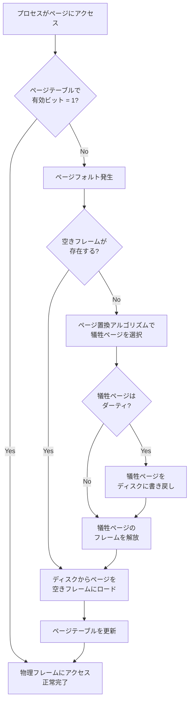
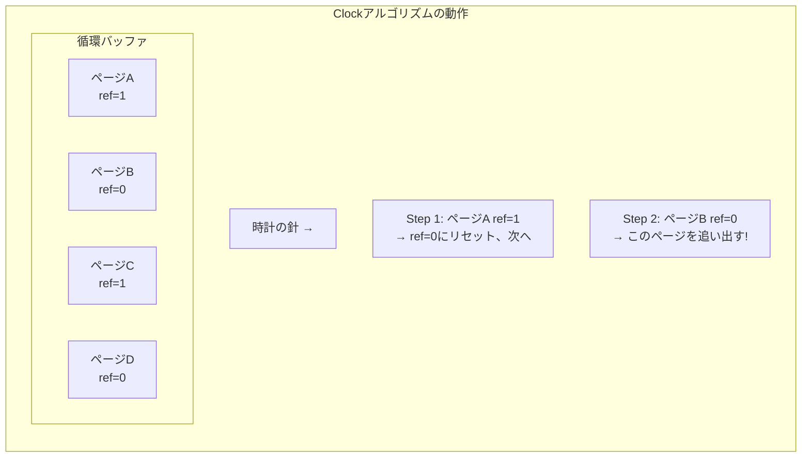
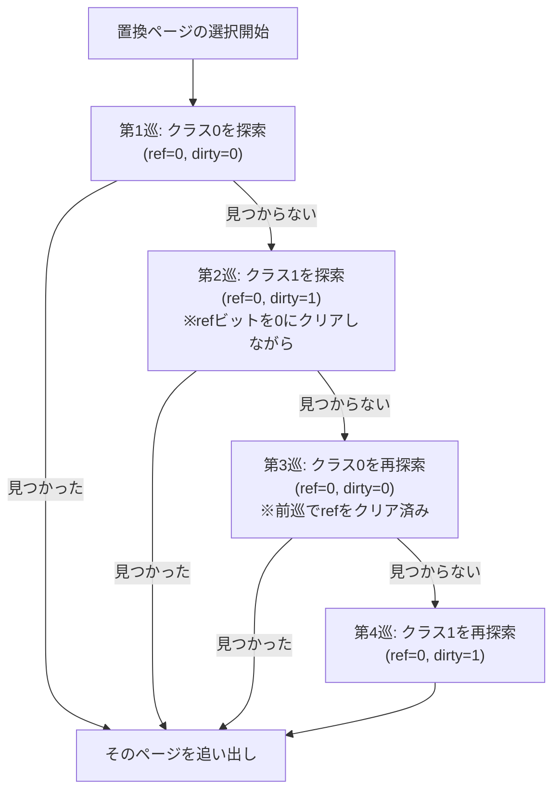
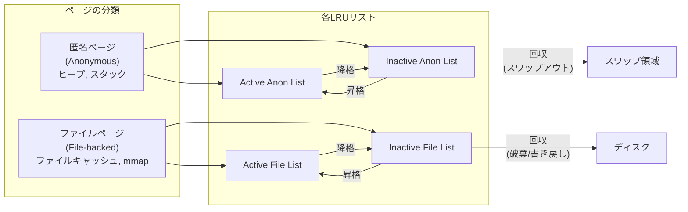
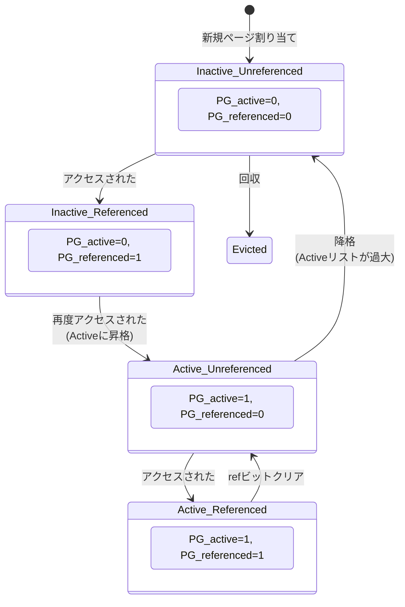
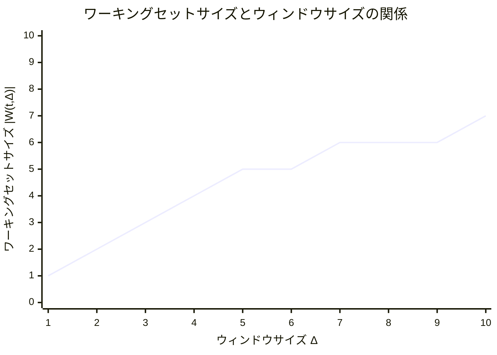
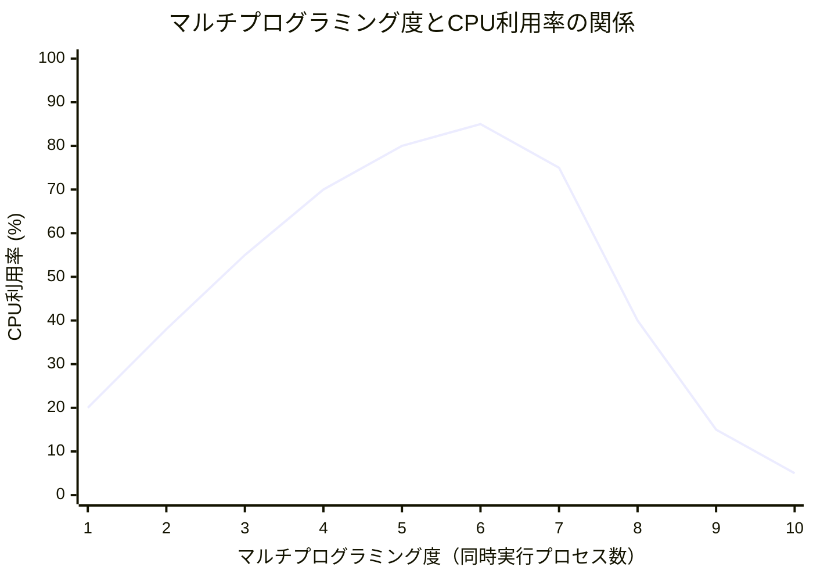
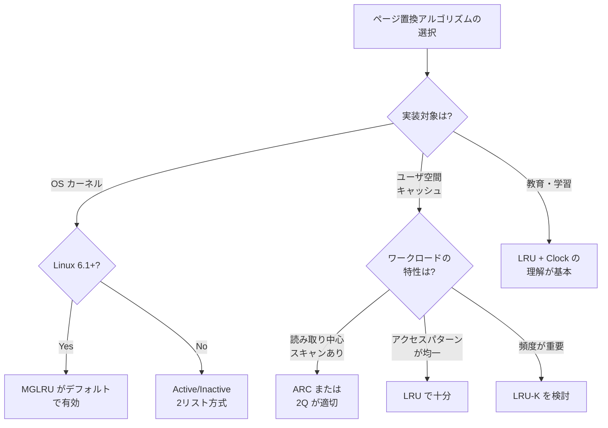

# ページ置換アルゴリズム

## 1. 背景と動機 — なぜページ置換が必要なのか

### 1.1 仮想メモリとデマンドページングの前提

現代のオペレーティングシステムは、**仮想メモリ**の仕組みにより、各プロセスに対して物理メモリよりもはるかに大きなアドレス空間を提供する。64ビットシステムでは理論上 $2^{48}$ バイト（256 TiB）もの仮想アドレス空間が利用可能だが、実際に搭載される物理メモリ（DRAM）は一般的に数GiB〜数百GiBに過ぎない。

この乖離を埋めるのが**デマンドページング（demand paging）**である。プロセスの仮想アドレス空間全体を物理メモリに載せるのではなく、実際にアクセスされたページだけを物理メモリにロードする。まだ物理メモリに存在しないページへのアクセスが発生すると、**ページフォルト（page fault）**が発生し、OSがディスク（スワップ領域やファイルシステム）から該当ページを読み込む。

```
仮想アドレス空間（プロセスA）        物理メモリ           ディスク（スワップ）
+------------------+              +------------------+   +------------------+
| ページ 0 (使用中) | ----------> | フレーム 3       |   |                  |
+------------------+              +------------------+   +------------------+
| ページ 1 (未使用) |              | フレーム 0       |   | ページ 2 の内容  |
+------------------+              +------------------+   +------------------+
| ページ 2 (スワップ)| --------------------------------> | ページ 5 の内容  |
+------------------+              +------------------+   +------------------+
| ページ 3 (使用中) | ----------> | フレーム 7       |   |                  |
+------------------+              +------------------+   +------------------+
```

### 1.2 ページ置換が発生する瞬間

物理メモリのフレームが全て使用されている状態で新たなページフォルトが発生した場合、OSは既存のいずれかのページを**追い出して（evict）**空きフレームを作らなければならない。この「どのページを追い出すか」を決定するのが**ページ置換アルゴリズム（page replacement algorithm）**である。



### 1.3 ページ置換の性能への影響

ページ置換アルゴリズムの選択は、システムの性能に決定的な影響を与える。ページフォルトが発生すると、ディスクI/O（SSDで約100μs、HDDで約10ms）が必要となり、これはメモリアクセス（約100ns）の **1,000倍〜100,000倍** 遅い。つまり、1回のページフォルトはメモリアクセス数千〜数万回分に相当するペナルティをもたらす。

$$
\text{実効アクセス時間} = (1 - p) \times t_{\text{mem}} + p \times t_{\text{fault}}
$$

ここで、$p$ はページフォルト率、$t_{\text{mem}}$ はメモリアクセス時間、$t_{\text{fault}}$ はページフォルト処理時間である。例えば、$t_{\text{mem}} = 100\text{ns}$、$t_{\text{fault}} = 10\text{ms}$ の場合：

- $p = 0.001$（0.1%）のとき：実効アクセス時間 $\approx 10.1\mu\text{s}$（100倍の低下）
- $p = 0.0001$（0.01%）のとき：実効アクセス時間 $\approx 1.1\mu\text{s}$（10倍の低下）

ページフォルト率をわずかでも下げることが、システム全体の性能向上に直結する。これが、ページ置換アルゴリズムの研究が長年にわたって続けられてきた理由である。

## 2. 理論的基盤 — OPTアルゴリズムと最適性

### 2.1 OPT（Optimal Page Replacement）

ページ置換アルゴリズムの理論的上界を示すのが、Belady（1966年）が提案した**OPTアルゴリズム**（別名：Belady's algorithm、MIN algorithm）である。

::: tip OPTの置換規則
将来最も長い期間アクセスされないページを追い出す。
:::

OPTは**将来のアクセスパターンを完全に知っている**ことを前提とするため、実際のシステムでは実装不可能である。しかし、理論的に最小のページフォルト回数を達成することが証明されており、他のアルゴリズムの性能を評価するための**ベースライン（下界）**として使われる。

**例：OPTの動作**

フレーム数3、参照列: `7, 0, 1, 2, 0, 3, 0, 4, 2, 3, 0, 3, 2, 1, 2, 0, 1, 7, 0, 1`

| ステップ | 参照 | フレーム状態 | フォルト |
|---------|------|-------------|---------|
| 1 | 7 | [7, -, -] | F |
| 2 | 0 | [7, 0, -] | F |
| 3 | 1 | [7, 0, 1] | F |
| 4 | 2 | [2, 0, 1] | F (7を追い出し: 将来最も遠い) |
| 5 | 0 | [2, 0, 1] | - |
| 6 | 3 | [2, 0, 3] | F (1を追い出し: 将来最も遠い) |
| 7 | 0 | [2, 0, 3] | - |
| 8 | 4 | [2, 0, 4] | F (3を追い出し: 将来最も遠い) |
| 9 | 2 | [2, 0, 4] | - |
| 10 | 3 | [2, 3, 4] | F (0を追い出し: しばらく先) |
| 11 | 0 | [2, 3, 0] | F (4を追い出し: 以降参照なし) |
| 12 | 3 | [2, 3, 0] | - |
| 13 | 2 | [2, 3, 0] | - |
| 14 | 1 | [2, 1, 0] | F (3を追い出し) |
| 15 | 2 | [2, 1, 0] | - |
| 16 | 0 | [2, 1, 0] | - |
| 17 | 1 | [2, 1, 0] | - |
| 18 | 7 | [7, 1, 0] | F (2を追い出し) |
| 19 | 0 | [7, 1, 0] | - |
| 20 | 1 | [7, 1, 0] | - |

合計ページフォルト：**9回**

### 2.2 Beladyの異常（Belady's Anomaly）

ページ置換アルゴリズムの研究において重要な発見の一つが、**Beladyの異常**である。直感的には、物理メモリのフレーム数を増やせばページフォルト回数は減少するはずだが、一部のアルゴリズム（特にFIFO）では、フレーム数を増やすと逆にページフォルト回数が**増加**する場合がある。

**例：FIFOにおけるBeladyの異常**

参照列: `1, 2, 3, 4, 1, 2, 5, 1, 2, 3, 4, 5`

- フレーム数3：ページフォルト **9回**
- フレーム数4：ページフォルト **10回**（増えている!）

この異常は**スタックアルゴリズム**の性質に関連する。ある時点のフレーム数 $n$ で保持されるページの集合を $S_n$ としたとき、$S_n \subseteq S_{n+1}$ が常に成り立つアルゴリズムを**スタックアルゴリズム**と呼ぶ。OPTやLRUはスタックアルゴリズムであるため、Beladyの異常が発生しないことが保証されるが、FIFOはスタックアルゴリズムではないため、この異常が発生しうる。

## 3. 古典的アルゴリズム

### 3.1 FIFO（First-In, First-Out）

最も単純なページ置換アルゴリズムで、最も古くメモリに読み込まれたページを追い出す。

::: tip FIFOの置換規則
最も早く物理メモリにロードされたページを追い出す。
:::

```
キュー構造（先頭が最古）:

ロード: ページA → [A]
ロード: ページB → [A, B]
ロード: ページC → [A, B, C]
置換時: Aを追い出し → [B, C, 新ページ]
```

**FIFOの実装（概念コード）:**

```python
from collections import deque

class FIFOPageReplacement:
    def __init__(self, num_frames: int):
        self.num_frames = num_frames
        self.frames: set[int] = set()
        self.queue: deque[int] = deque()
        self.page_faults = 0

    def access(self, page: int) -> bool:
        """Returns True if page fault occurred."""
        if page in self.frames:
            return False  # page hit

        self.page_faults += 1
        if len(self.frames) >= self.num_frames:
            # Evict the oldest page
            victim = self.queue.popleft()
            self.frames.remove(victim)

        self.frames.add(page)
        self.queue.append(page)
        return True  # page fault
```

**FIFOの特徴:**

| 観点 | 評価 |
|------|------|
| 実装の単純さ | 非常に簡単（キュー1つ） |
| 性能 | 悪い（アクセス頻度を考慮しない） |
| Beladyの異常 | 発生しうる |
| 実用性 | 単体では使われない |

FIFOの最大の問題は、頻繁にアクセスされるページであっても、最も古くロードされたというだけで追い出してしまうことである。例えば、OSカーネルの共有ライブラリページは起動直後にロードされ、その後も頻繁にアクセスされるが、FIFOはこのようなページを真っ先に追い出す候補にしてしまう。

### 3.2 LRU（Least Recently Used）

FIFOの問題を解決するのが、**LRU（最近最も使われていないページを追い出す）**アルゴリズムである。LRUは「最近の過去のアクセスパターンが将来のアクセスパターンをよく予測する」という**時間的局所性（temporal locality）**の仮定に基づく。

::: tip LRUの置換規則
最も長い間アクセスされていない（最後のアクセスが最も古い）ページを追い出す。
:::


**例：LRUの動作**

フレーム数3、参照列: `7, 0, 1, 2, 0, 3, 0, 4, 2, 3, 0, 3, 2, 1, 2, 0, 1, 7, 0, 1`

| ステップ | 参照 | フレーム状態 | LRU順序（右が最古）| フォルト |
|---------|------|-------------|-------------------|---------|
| 1 | 7 | [7] | 7 | F |
| 2 | 0 | [7, 0] | 0, 7 | F |
| 3 | 1 | [7, 0, 1] | 1, 0, 7 | F |
| 4 | 2 | [2, 0, 1] | 2, 1, 0 → 7追い出し | F |
| 5 | 0 | [2, 0, 1] | 0, 2, 1 | - |
| 6 | 3 | [2, 0, 3] | 3, 0, 2 → 1追い出し | F |
| 7 | 0 | [2, 0, 3] | 0, 3, 2 | - |
| 8 | 4 | [4, 0, 3] | 4, 0, 3 → 2追い出し | F |
| 9 | 2 | [4, 0, 2] | 2, 4, 0 → 3追い出し | F |
| 10 | 3 | [4, 3, 2] | 3, 2, 4 → 0追い出し | F |
| 11 | 0 | [0, 3, 2] | 0, 3, 2 → 4追い出し | F |
| 12 | 3 | [0, 3, 2] | 3, 0, 2 | - |
| 13 | 2 | [0, 3, 2] | 2, 3, 0 | - |
| 14 | 1 | [1, 3, 2] | 1, 2, 3 → 0追い出し | F |
| 15 | 2 | [1, 3, 2] | 2, 1, 3 | - |
| 16 | 0 | [1, 0, 2] | 0, 2, 1 → 3追い出し | F |
| 17 | 1 | [1, 0, 2] | 1, 0, 2 | - |
| 18 | 7 | [1, 0, 7] | 7, 1, 0 → 2追い出し | F |
| 19 | 0 | [1, 0, 7] | 0, 7, 1 | - |
| 20 | 1 | [1, 0, 7] | 1, 0, 7 | - |

合計ページフォルト：**12回**（OPTの9回と比較して3回多い）

**LRUの理論的性質:**

LRUはスタックアルゴリズムであるため、Beladyの異常が発生しない。また、OPTが「将来最も遠いページを追い出す」のに対し、LRUは「過去最も遠いページを追い出す」という対称的な関係にある。プログラムの参照パターンに時間的局所性がある場合、LRUはOPTに近い性能を発揮する。

### 3.3 LRUの実装の課題

LRUの概念は直感的だが、正確な実装にはコストがかかる。

**方法1：カウンタ方式**

各ページテーブルエントリにタイムスタンプ（カウンタ）を保持し、ページアクセスのたびに現在時刻を記録する。置換時には全ページのタイムスタンプを比較して最小のものを選ぶ。

- 問題：全ページのタイムスタンプの比較に $O(n)$ かかる
- 問題：メモリアクセスのたびにページテーブルエントリの更新が必要

**方法2：スタック（連結リスト）方式**

ページをアクセス順に保持する二重連結リストを管理し、アクセスされたページを先頭に移動する。追い出し時は末尾のページを選ぶ。

- 問題：毎回のメモリアクセスでリストの再構成が必要
- 問題：ハードウェア支援なしには実用的な速度を達成できない

いずれの方式も、**メモリアクセスのたびに**データ構造を更新する必要があるため、ハードウェアの支援なしに純粋なLRUを実装することは現実的ではない。現代のCPUが提供するのは、ページテーブルエントリの**参照ビット（reference bit / accessed bit）**と**ダーティビット（dirty bit / modified bit）**のみであり、正確なアクセス時刻は記録されない。

このため、実際のOSでは、LRUを近似するアルゴリズムが用いられる。

## 4. LRU近似アルゴリズム

### 4.1 Clock アルゴリズム（Second Chance）

**Clockアルゴリズム**は、LRUの近似として最も広く知られた手法であり、FIFOとLRUの中間的な性質を持つ。ハードウェアが提供する参照ビットを利用し、FIFOの単純さを保ちながらLRUに近い性能を実現する。

::: tip Clockアルゴリズムの置換規則
1. 全フレームを循環リスト（時計の文字盤）状に配置する
2. 「時計の針（clock hand）」を巡回させる
3. 針が指すページの参照ビットが1なら、0にリセットして次に進む（セカンドチャンスを与える）
4. 参照ビットが0のページを見つけたら、それを追い出す
:::



```
Clockの循環バッファ（→は時計の針の位置）:

初期状態:
→ [A:ref=1] → [B:ref=0] → [C:ref=1] → [D:ref=0]

置換開始:
  A: ref=1 → ref=0にクリア、針を進める
→ [A:ref=0] → [B:ref=0] → [C:ref=1] → [D:ref=0]

  B: ref=0 → Bを追い出し!
  [A:ref=0] → [新ページ:ref=1] → [C:ref=1] → [D:ref=0]
                    ↑ 針はここ
```

**Clockアルゴリズムの実装:**

```python
class ClockPageReplacement:
    def __init__(self, num_frames: int):
        self.num_frames = num_frames
        self.frames: list[int | None] = [None] * num_frames
        self.ref_bits: list[int] = [0] * num_frames
        self.page_to_frame: dict[int, int] = {}
        self.hand = 0  # clock hand position
        self.used = 0   # number of used frames
        self.page_faults = 0

    def access(self, page: int) -> bool:
        """Returns True if page fault occurred."""
        if page in self.page_to_frame:
            # Page hit: set reference bit
            frame = self.page_to_frame[page]
            self.ref_bits[frame] = 1
            return False

        self.page_faults += 1

        if self.used < self.num_frames:
            # Free frame available
            frame = self.used
            self.used += 1
        else:
            # Find victim using clock algorithm
            frame = self._find_victim()

        # Load the new page
        if self.frames[frame] is not None:
            del self.page_to_frame[self.frames[frame]]
        self.frames[frame] = page
        self.page_to_frame[page] = frame
        self.ref_bits[frame] = 1
        return True

    def _find_victim(self) -> int:
        """Find a page to evict using clock sweep."""
        while True:
            if self.ref_bits[self.hand] == 0:
                victim_frame = self.hand
                self.hand = (self.hand + 1) % self.num_frames
                return victim_frame
            # Give second chance: clear reference bit
            self.ref_bits[self.hand] = 0
            self.hand = (self.hand + 1) % self.num_frames
```

**Clockアルゴリズムの特徴:**

| 観点 | 評価 |
|------|------|
| 実装の複雑さ | 低い（循環バッファ + 参照ビット） |
| 性能 | FIFOより大幅に良い、LRUに近い |
| ハードウェア要件 | 参照ビットのみ |
| Beladyの異常 | 発生しうる（スタックアルゴリズムではない） |
| 実用性 | 多くのOSで基本形として採用 |

### 4.2 Enhanced Clock（NRU: Not Recently Used）

基本のClockアルゴリズムをさらに改良したのが、**参照ビットとダーティビットの両方**を利用する方式である。ダーティページの追い出しにはディスクへの書き戻しが必要なため、クリーンページ（ダーティでないページ）を優先的に追い出すことでI/Oコストを削減する。

ページは以下の4カテゴリに分類される：

| クラス | 参照ビット | ダーティビット | 優先度（低いほど追い出されやすい） |
|--------|-----------|--------------|----------------------------------|
| 0 | 0 | 0 | 最優先で追い出し |
| 1 | 0 | 1 | 次に追い出し |
| 2 | 1 | 0 | なるべく保持 |
| 3 | 1 | 1 | 最後に追い出し |



### 4.3 追加参照ビットアルゴリズム（Aging）

参照ビットは「最近アクセスされたかどうか」という1ビットの情報しか持たないが、定期的に参照ビットをシフトレジスタに記録することで、より精度の高いLRU近似を実現できる。

```
各ページに8ビットのカウンタを持たせる:

タイマー割り込みごとの処理:
1. 全ページのカウンタを右に1ビットシフト
2. 現在の参照ビットを最上位ビットに設定
3. 参照ビットをクリア

ページA のカウンタの推移:
時刻 T0: 10000000  （アクセスあり）
時刻 T1: 11000000  （アクセスあり）
時刻 T2: 01100000  （アクセスなし）
時刻 T3: 10110000  （アクセスあり）
時刻 T4: 01011000  （アクセスなし）

ページB のカウンタの推移:
時刻 T0: 10000000  （アクセスあり）
時刻 T1: 01000000  （アクセスなし）
時刻 T2: 00100000  （アクセスなし）
時刻 T3: 00010000  （アクセスなし）
時刻 T4: 00001000  （アクセスなし）

→ カウンタ値を比較: A(01011000=88) > B(00001000=8)
→ Bの方がLRU → Bを追い出す
```

この方式では、8ビットカウンタの精度の範囲内で、最近の8回のタイマー区間のアクセスパターンを記録できる。カウンタ値が小さいほど最近アクセスされていないことを意味し、最小値を持つページを追い出す。

## 5. 現代のOS実装 — Linux のページ置換

### 5.1 Linux のメモリ管理の全体像

Linux カーネルは、ページ置換において単純なLRUやClockを直接適用するのではなく、長年の研究と実運用の経験を踏まえた独自のアプローチを採用している。その核心にあるのが、**LRUリスト**を用いたページ管理と、**kswapd** デーモンによるバックグラウンドでの回収処理である。



### 5.2 Active/Inactive LRUリスト

Linux は各メモリゾーンにおいて、ページを**Active リスト**と**Inactive リスト**の2つに分けて管理する。これは2Q（Two Queue）アルゴリズムの変形であり、単純なLRUが持つ「スキャン耐性の欠如」問題を解決するための設計である。

**スキャン耐性（scan resistance）の問題:**

純粋なLRUでは、大量のデータを1回だけ順番にスキャンするワークロード（例：`find / -name "*.log"` のようなファイル全件検索）が実行されると、スキャン対象のページがLRUの先頭に次々と挿入され、頻繁にアクセスされている「ホットな」ページが押し出されてしまう。これにより、スキャン完了後にシステムの性能が大幅に低下する。

**2リスト方式による解決:**

```
ページの遷移:

新規ページ → Inactive リスト（末尾に追加）
                |
                | Inactiveリスト上で再度アクセスされた場合
                v
            Active リスト（末尾に追加）
                |
                | Active リストが大きくなりすぎた場合
                v
            Inactive リスト（先頭に降格）
                |
                | 再アクセスなしで先頭まで到達
                v
            回収（eviction）
```

1回しかアクセスされないページはInactiveリストから直接回収されるため、Activeリスト上のホットなページが影響を受けない。これがスキャン耐性を提供する仕組みである。

### 5.3 PG_referenced と PG_active フラグ

Linux は各ページに `PG_referenced` と `PG_active` の2つのフラグを用いて、ページの「温度」を追跡する。ページの昇格と降格は以下のルールで行われる。



この「2回アクセスされたら昇格」という仕組みは、一時的にアクセスされただけのページがActiveリストに混入することを防ぐ。

### 5.4 kswapd と直接回収

Linux のページ回収は2つのメカニズムで実行される。

**1. kswapd（バックグラウンド回収）**

各NUMAノードに1つずつ存在するカーネルスレッドで、空きメモリが**low watermark** を下回ると起動し、**high watermark** まで回収を行う。

```
メモリ使用量:

High Watermark  ─────────── kswapd 停止
                     ↑ 回収中
Low Watermark   ─────────── kswapd 起動
                     ↑
Min Watermark   ─────────── 直接回収の閾値
                     ↑ 緊急!
0               ─────────── OOM Killer 発動
```

**2. 直接回収（direct reclaim）**

空きメモリが **min watermark** を下回ると、メモリを要求したプロセス自身がページ回収を行う。これはプロセスの実行をブロックするため、性能への影響が大きい。

::: warning 直接回収の性能影響
直接回収が頻発する状態は、システムのメモリ不足を意味する。`/proc/vmstat` の `pgsteal_direct` カウンタが増加している場合は、メモリの増設やワークロードの見直しが必要である。
:::

### 5.5 Refault Distance と Thrashing 検出

Linux 5.9以降では、**ワークロードの特性に応じてActiveリストとInactiveリストの比率を動的に調整**する仕組みが導入されている。これは、Inactiveリストから回収されたページが短期間で再度アクセスされる（refault）頻度を測定することで実現される。

**Refault Distance** とは、あるページがInactiveリストから回収された時点から、再度アクセスされるまでの間に回収されたページ数である。この距離がActiveリストのサイズ以下であれば、そのページはActiveリストに保持されていれば回収を免れたはずであり、Activeリストを拡大すべきことを示唆する。

```
Refault Distance の概念:

時刻T1: ページPがInactiveリストから回収される
        (回収時のNR_INACTIVE + NR_ACTIVE の値を記録)

時刻T2: ページPが再度アクセスされる（refault）
        (現在のNR_INACTIVE + NR_ACTIVE の値と比較)

Refault Distance = (T2時点のカウンタ) - (T1時点のカウンタ)

if Refault Distance <= NR_ACTIVE:
    → Activeリストに直接昇格（Inactiveリストをスキップ）
    → Activeリストの拡大を検討
```

### 5.6 MGLRU（Multi-Generation LRU）

Linux 6.1 で導入された**MGLRU（Multi-Generation LRU）**は、従来のActive/Inactive 2リスト方式を大幅に拡張した新しいページ回収フレームワークである。

**従来方式の限界:**

従来のActive/Inactive方式では、ページの「温度」が2段階（Active/Inactive）でしか区別できず、ワークロードが複雑になると適切な判断が困難だった。特に以下の問題があった：

- 複数の異なるアクセス頻度のワーキングセットが混在する場合の区別が粗い
- ページテーブルのスキャンが非効率（全ページをスキャンする必要がある）
- Active/Inactiveリストのバランス調整ヒューリスティックが複雑

**MGLRUのアーキテクチャ:**

MGLRUは、ページを**世代（generation）**で管理する。各世代は「最後にアクセスされた時間帯」を表し、最も若い世代が最新のアクセスを持つページ群、最も古い世代が最も長くアクセスされていないページ群を含む。

```
MGLRUの世代構造:

Generation 3 (最新): 最近アクセスされたページ群
   → 回収対象外

Generation 2: やや古いページ群
   → 回収対象外

Generation 1: 古いページ群
   → 回収候補

Generation 0 (最古): 長期間未アクセスのページ群
   → 最優先の回収対象
```

MGLRUの主な革新は以下の点にある：

1. **効率的なページテーブルウォーク**: ページテーブルを直接ウォークして参照ビットを確認し、世代を更新する。従来のrmap（reverse mapping）ベースのスキャンよりもTLBフレンドリーで効率が良い

2. **多段階の分類**: 2段階（Active/Inactive）ではなく、複数の世代でページの温度を管理する。これにより、異なるアクセス頻度のワーキングセットをより精密に区別できる

3. **ティアベースの分類**: 各世代内で、ページをさらにティア（tier）で分類する。ティアはページの種類（匿名/ファイル）やアクセスパターン（読み取り/書き込み）に基づく

::: details MGLRUの性能改善の事例
Google の社内ベンチマークでは、MGLRU の導入により以下の改善が報告されている：
- Chrome OS: 低メモリ環境でのタブ切り替え時のレイテンシが大幅に低下
- Android: アプリの強制終了（LMK: Low Memory Killer 発動）頻度が減少
- サーバーワークロード: メモリプレッシャー下でのスループット向上
:::

## 6. ワーキングセットモデルとスラッシング

### 6.1 ワーキングセットの概念

**ワーキングセット（working set）**とは、Denning（1968年）が提唱した概念で、ある時点においてプロセスが「アクティブに使用している」ページの集合を指す。

形式的には、時刻 $t$ におけるウィンドウサイズ $\Delta$ のワーキングセット $W(t, \Delta)$ は、時刻 $t - \Delta$ から $t$ までの間にアクセスされたページの集合として定義される。

$$
W(t, \Delta) = \{p \mid p \text{ は時刻 } (t - \Delta, t] \text{ の間にアクセスされたページ}\}
$$

ワーキングセットのサイズ $|W(t, \Delta)|$ は、プロセスが効率的に動作するために最低限必要な物理フレーム数の指標となる。



典型的なプログラムでは、ワーキングセットサイズはウィンドウサイズ $\Delta$ の増加に対して**急速に増加した後、飽和**する。これは参照の局所性を反映している -- プログラムは特定の期間中に限られたページ集合を繰り返しアクセスする傾向があるためである。

### 6.2 スラッシング（Thrashing）

プロセスに割り当てられた物理フレーム数がワーキングセットサイズを下回ると、ページフォルトが頻発し、CPUの大部分の時間がページフォルト処理（ディスクI/O待ち）に費やされる状態になる。これが**スラッシング（thrashing）**である。



上のグラフが示すように、同時実行プロセス数を増やすとCPU利用率は上昇するが、ある閾値を超えると急激に低下する。これがスラッシングのポイントであり、各プロセスのワーキングセットの合計が物理メモリを超えた時点で発生する。

$$
\sum_{i=1}^{n} |W_i(t, \Delta)| > \text{物理メモリサイズ}
$$

::: danger スラッシングの症状
- CPU利用率が極端に低下（I/O待ちが支配的）
- ディスクI/Oが常に100%に張り付く
- システムの応答時間が数秒〜数分に悪化
- `vmstat` や `sar` で `si`/`so`（swap in/out）が高い値を示す
:::

### 6.3 スラッシングへの対策

**1. ワーキングセットモデルに基づくフレーム割り当て**

各プロセスに最低限ワーキングセットサイズ分のフレームを保証する。全プロセスのワーキングセットの合計が物理メモリを超える場合は、一部のプロセスを一時停止（スワップアウト）する。

**2. PFF（Page Fault Frequency）方式**

ページフォルト率を監視し、閾値に基づいてフレーム割り当てを動的に調整する。

```
ページフォルト率の監視:

上限閾値 ──────── フォルト率がこれを超えたら
                   → フレーム数を増やす

               ← 適正範囲 →

下限閾値 ──────── フォルト率がこれを下回ったら
                   → フレーム数を減らす（他に回す）
```

**3. Linux の OOM Killer**

Linux では、メモリが完全に枯渇した場合に**OOM Killer（Out-Of-Memory Killer）**が発動し、メモリを最も多く消費しているプロセスを強制終了する。これはスラッシングの最終的な安全弁として機能する。

各プロセスには `oom_score` が割り当てられ、メモリ使用量やプロセスの重要度に基づいてスコアリングされる。`/proc/<pid>/oom_score_adj` で調整可能（-1000〜1000、-1000で完全に保護）。

## 7. 特殊なワークロードへの対応

### 7.1 データベースのバッファプール管理

データベースシステム（PostgreSQL、MySQL/InnoDB など）は、OSのページ置換に依存せず、**独自のバッファプール管理**を行う場合が多い。これは、データベースが自身のアクセスパターンをOSよりも正確に把握しているためである。

**LRU-K アルゴリズム:**

データベースでよく使われるLRU-Kは、「最後のK回目のアクセス時刻」に基づいて置換を行う。LRU-1（通常のLRU）はスキャン耐性がないが、LRU-2（K=2）は「2回以上アクセスされたページ」を優遇するため、テーブルフルスキャンによるバッファ汚染を防げる。

```
LRU-2 の判断基準:

ページA: 最後から2番目のアクセス = T=100
ページB: 最後から2番目のアクセス = T=50
ページC: アクセス回数1回のみ → K(2)未定義 → 最優先で追い出し

追い出し優先順: C > B > A
```

**ARC（Adaptive Replacement Cache）:**

IBM が開発したARCは、LRUとLFU（Least Frequently Used）を動的に適応させるアルゴリズムである。ZFSのファイルシステムキャッシュで有名な採用例がある。

ARCは4つのリストを管理する：

```
ARC の4リスト構造:

T1: 最近1回だけアクセスされたページ（LRU風）
T2: 最近2回以上アクセスされたページ（LFU風）
B1: T1から追い出されたページの履歴（ページ自体は保持しない）
B2: T2から追い出されたページの履歴（ページ自体は保持しない）

キャッシュサイズ c に対して:
|T1| + |T2| = c  （実データ）
|B1| + |B2| ≤ c  （履歴のみ）

適応メカニズム:
- B1でヒット → T1が小さすぎる → T1の目標サイズを増加
- B2でヒット → T2が小さすぎる → T2の目標サイズを増加
```

::: tip ARCの利点
ARCはワークロードの変化に自動的に適応する。スキャン負荷が高い時期にはT1を大きくし、繰り返しアクセスが多い時期にはT2を大きくする。パラメータチューニングが不要で、幅広いワークロードで安定した性能を発揮する。
:::

### 7.2 SSDとページ置換の関係

SSDの普及は、ページ置換アルゴリズムの設計にも影響を与えている。

**従来（HDD時代）の前提:**
- ランダム読み取り：約10ms（シーク + 回転待ち）
- ランダム書き込み：約10ms
- 読み取りと書き込みのコスト差：小さい

**SSD時代の前提:**
- ランダム読み取り：約100μs
- ランダム書き込み：約100μs（ただし書き込み増幅やウェアレベリングの影響あり）
- 読み取りと書き込みの非対称性：SSDでは書き込みの方がデバイス寿命に影響

この変化により、以下のような設計上の考慮が必要になる：

1. **ページフォルトのペナルティが100倍小さくなった**（HDD比）ため、積極的なスワップ利用が以前より現実的
2. **書き込み回数の削減**がデバイス寿命の観点から重要。ダーティページの書き戻し頻度を最適化する必要がある
3. **スワップ先としてSSDを使用**する場合、zswapやzramのような圧縮スワップとの組み合わせが有効

> [!NOTE]
> Linux の `vm.swappiness` パラメータ（0〜200、デフォルト60）は、匿名ページとファイルページの回収の相対的な優先度を制御する。SSD環境ではswappinessをやや高めに設定し、ファイルキャッシュの保持を優先する戦略が有効な場合がある。

## 8. ページ置換アルゴリズムの比較

### 8.1 アルゴリズム比較表

| アルゴリズム | 計算量（置換時） | 追加メモリ | スキャン耐性 | Beladyの異常 | 実用性 |
|-------------|-----------------|-----------|-------------|-------------|--------|
| OPT | $O(n)$ | なし | N/A（理論的最適） | なし | 実装不可能 |
| FIFO | $O(1)$ | キュー | なし | あり | 低い |
| LRU（厳密） | $O(1)$（ハッシュ+リスト） | 大（リスト管理） | 部分的 | なし | ハードウェア支援が必要 |
| Clock | $O(n)$（最悪） | 参照ビットのみ | 部分的 | あり | 高い |
| Enhanced Clock | $O(n)$（最悪） | 参照+ダーティビット | 部分的 | あり | 高い |
| Aging | $O(n)$（比較） | カウンタ（8bit/ページ） | 部分的 | あり | 中程度 |
| Active/Inactive | $O(1)$ | リスト2本 | あり | N/A | 高い（Linux） |
| MGLRU | $O(1)$（償却） | 世代管理 | あり | N/A | 高い（Linux 6.1+） |
| ARC | $O(1)$ | リスト4本+履歴 | あり | なし | 高い（ZFS等） |

### 8.2 アルゴリズム選択の指針



## 9. 実践的な観点 — 監視とチューニング

### 9.1 Linux でのメモリ状態の監視

ページ置換の動作を理解し、問題を診断するための主要なツールとメトリクスを紹介する。

::: code-group
```bash [/proc/vmstat の主要カウンタ]
# Page scan and steal counters
$ grep -E "pgscan|pgsteal|pgfault|pgmajfault" /proc/vmstat
pgscan_kswapd      1234567   # kswapd がスキャンしたページ数
pgscan_direct       12345    # 直接回収でスキャンしたページ数
pgsteal_kswapd     1200000   # kswapd が回収したページ数
pgsteal_direct      10000    # 直接回収で回収したページ数
pgfault          987654321   # マイナーフォルト数
pgmajfault           5678   # メジャーフォルト数（ディスクI/O発生）
```

```bash [vmstat コマンド]
# 1-second interval memory statistics
$ vmstat 1
procs -----------memory---------- ---swap-- -----io----
 r  b   swpd   free   buff  cache   si   so    bi    bo
 2  0  51200 245760  81920 524288    0    0    12     8
 1  1  51200 204800  81920 524288   48   64   128    64
 3  2  61440 163840  81920 491520  128  256   384   256
#                                  ^^   ^^
#                          si: swap in (pages/s)
#                          so: swap out (pages/s)
#                          High si/so indicates thrashing
```

```bash [cgroup v2 メモリ統計]
# Per-cgroup memory pressure information
$ cat /sys/fs/cgroup/user.slice/memory.stat
anon 1073741824
file 2147483648
pgfault 12345678
pgmajfault 1234
pgscan 567890
pgsteal 560000
workingset_refault_anon 5678
workingset_refault_file 12345
# workingset_refault: refault events indicating
# working set is larger than available memory
```
:::

### 9.2 主要なカーネルパラメータ

| パラメータ | デフォルト | 説明 |
|-----------|-----------|------|
| `vm.swappiness` | 60 | 匿名ページの回収積極度（0=スワップしない、200=積極的にスワップ） |
| `vm.dirty_ratio` | 20 | ダーティページがメモリの何%を超えたら書き戻しをブロック |
| `vm.dirty_background_ratio` | 10 | バックグラウンドでの書き戻しを開始する閾値 |
| `vm.vfs_cache_pressure` | 100 | inode/dentryキャッシュの回収積極度（100=デフォルト、低い=キャッシュ保持） |
| `vm.min_free_kbytes` | 自動計算 | 最低限確保する空きメモリ量 |
| `vm.watermark_scale_factor` | 10 | watermark間の距離（1/10000単位） |

::: warning チューニングの注意点
これらのパラメータは相互に影響し合い、ワークロードによって最適値が大きく異なる。闇雲に変更するのではなく、まず `vmstat`、`/proc/meminfo`、`/proc/vmstat` でシステムの状態を正確に把握し、仮説を立ててから変更すること。
:::

## 10. まとめと展望

### 10.1 ページ置換アルゴリズムの歴史的発展

ページ置換アルゴリズムは、1960年代の仮想メモリシステムの誕生とともに研究が始まった。理論的にはOPT（1966年）が最適解を示し、LRU（1960年代後半）が実用的な近似として広く認知された。しかし、正確なLRUの実装コストの問題から、Clock（Second Chance）アルゴリズムやその派生が実際のOSで採用されてきた。

```
ページ置換アルゴリズムの系譜:

1966  OPT (Belady)           ← 理論的最適
1960s FIFO                   ← 最も単純だが性能が悪い
1960s LRU                    ← 理論的に優れるが実装困難
1970s Clock (Second Chance)  ← LRUの実用的近似
1980s Working Set Model      ← Denning のワーキングセット理論
1990s 2Q, LRU-K              ← データベース向けの拡張
1990s ARC (IBM)              ← 自己適応型キャッシュ
2000s Active/Inactive (Linux)← 2リストによるスキャン耐性
2022  MGLRU (Linux 6.1)      ← 多世代LRUによる効率化
```

### 10.2 現代の課題と今後の方向性

**1. メモリ階層の多様化**

CXL（Compute Express Link）メモリやNVM（Non-Volatile Memory）の登場により、メモリ階層が DRAM だけでなく多層化している。ページ置換アルゴリズムも、異なるレイテンシ・帯域幅を持つメモリティア間でのページ移動を最適化する必要がある。

**2. 機械学習によるページ置換**

Google の研究では、プロファイルデータから学習したモデルによるページ置換がOPTに近い性能を達成できることが示されている。ただし、推論のオーバーヘッドとモデルの汎用性が課題である。

**3. メモリ圧縮との統合**

zswapやzramのようなメモリ圧縮技術は、ページをディスクに追い出す前にメモリ上で圧縮することで、実質的なメモリ容量を増やす。ページ置換アルゴリズムは「追い出すか、圧縮して保持するか」の判断も含めて最適化する必要がある。

**4. 大規模メモリシステムでの効率性**

テラバイト級のメモリを搭載するサーバーでは、ページテーブル自体のメモリ消費やスキャンコストが問題になる。Huge Page（2MiB / 1GiB）の活用やTHP（Transparent Huge Pages）との統合が重要な課題である。

ページ置換アルゴリズムは、半世紀以上の研究歴を持つ成熟した分野でありながら、ハードウェアの進化とワークロードの多様化により、今なお活発に研究が続けられている。その本質は、「限られたリソースの中で、将来のアクセスパターンをいかに予測し、最適な割り当てを実現するか」という普遍的な問題に帰着する。
