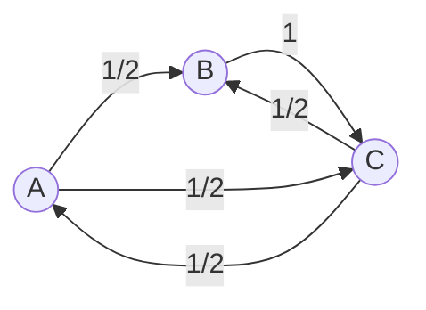
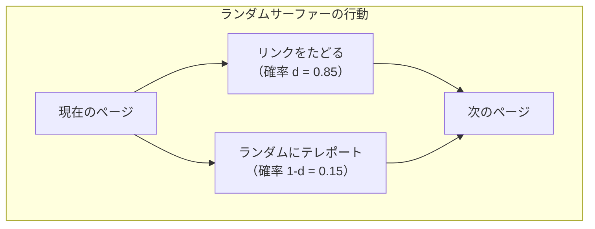
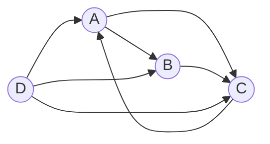
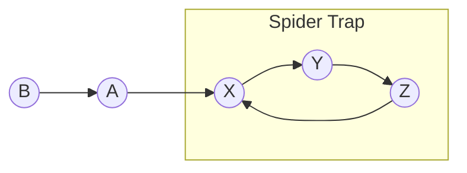
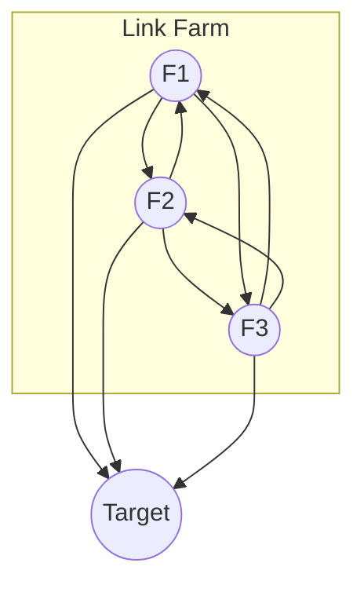
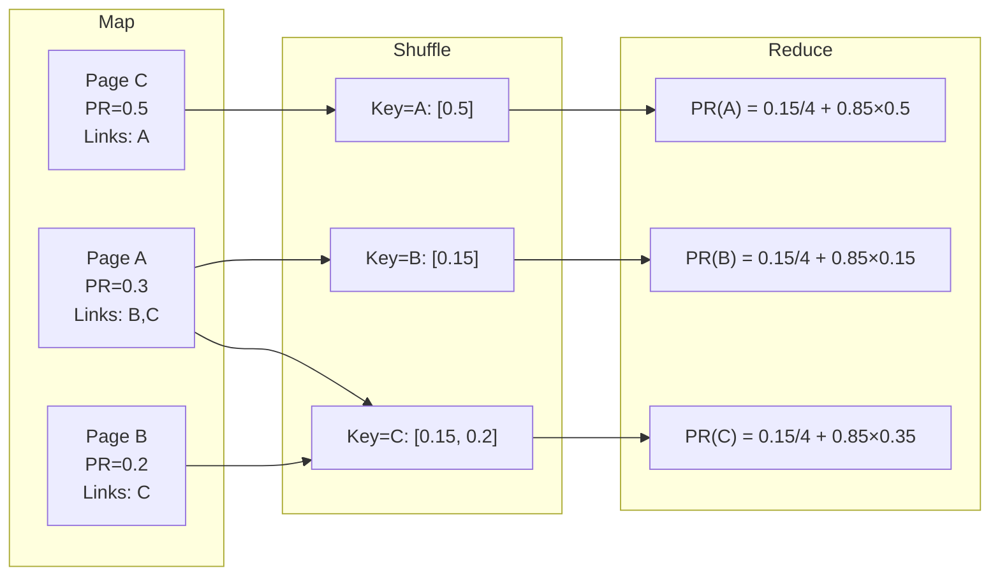
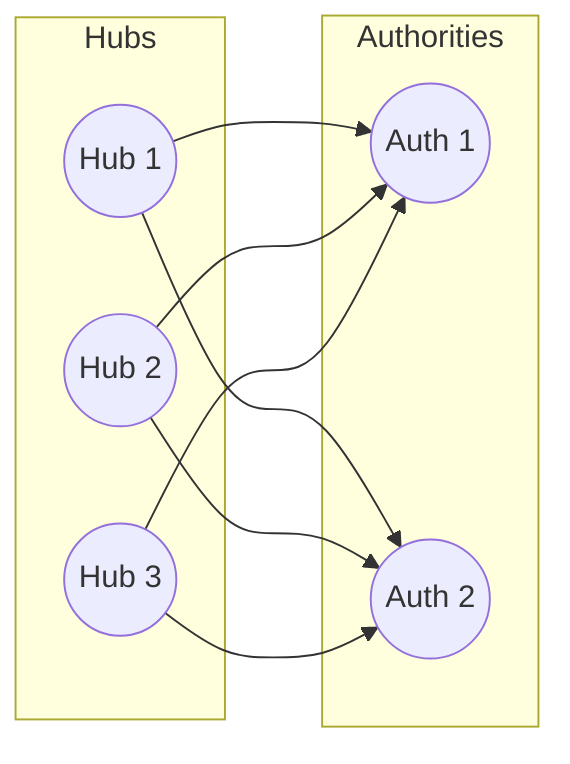

# PageRank とリンク解析 — Web検索を変えたアルゴリズム

## 1. 歴史的背景：Google以前のWeb検索

### 1.1 1990年代のWeb検索の課題

1990年代後半、Webは爆発的に成長し、既存の検索エンジンは深刻な品質問題に直面していた。AltaVista、Excite、Lycosといった当時の検索エンジンは、主にテキストベースの手法——キーワードの出現頻度やメタタグの内容——に依存してページの関連性を判断していた。

この方式には根本的な欠陥があった。Webページの作成者が検索順位を操作することが極めて容易だったのである。たとえば、ページ内に目的のキーワードを大量に埋め込む「キーワードスタッフィング」や、白い背景に白い文字で見えないテキストを記述する「隠しテキスト」などの手法が横行した。検索結果はスパムで溢れ、ユーザーが真に有用な情報を見つけることは困難になっていった。

### 1.2 リンク構造という発想

1998年、スタンフォード大学の大学院生であった Larry Page と Sergey Brin は、この問題に対する革新的な解決策を提示した。それが **PageRank** である。彼らの着想は明快だった——**Webのハイパーリンク構造そのものがページの重要度を反映している**という仮説である。

学術論文の世界では、多くの論文から引用される論文は重要であるとみなされる。同様に、多くのWebページからリンクされているページは重要である可能性が高い。さらに重要なのは、**重要なページからのリンクは、そうでないページからのリンクよりも価値が高い**という再帰的な構造を捉えた点である。

この考え方は "The Anatomy of a Large-Scale Hypertextual Web Search Engine" という論文（1998年）で発表され、Google検索エンジンの基盤技術となった。PageRankという名前は、Webの「ページ」と発明者 Larry **Page** の姓をかけた命名である。

### 1.3 テキストとリンクの融合

PageRankの革新性は、それまでの検索エンジンが見落としていた情報源——**リンク構造**——を活用した点にある。テキストの類似度（TF-IDFやBM25など）がクエリとの**関連性（relevance）**を測るのに対し、PageRankはクエリに依存しないページの**権威性（authority）**を測定する。Googleはこの2つのシグナルを組み合わせることで、検索品質を飛躍的に向上させた。

```
最終スコア ≈ テキスト関連性スコア × ページ権威性スコア（PageRank）
```

この「コンテンツの関連性」と「リンク構造の権威性」の組み合わせという思想は、現代の検索エンジンにおいても基本的な設計原理として生き続けている。

## 2. ランダムサーファーモデル

### 2.1 直感的な理解

PageRankを理解する最も直感的な方法は、**ランダムサーファーモデル（Random Surfer Model）**である。これは以下のような仮想的なWebブラウジング行動を想定する。

> あるユーザーが任意のWebページからブラウジングを開始する。各ページで、そのページ上のリンクの一つをランダムに（等確率で）クリックし、次のページに移動する。このプロセスを無限に繰り返す。

この仮想ユーザーが**長時間ブラウジングを続けた後に、各ページに滞在している確率**がPageRankの値に対応する。直感的に言えば、多くのページからリンクされているページ、あるいは重要なページからリンクされているページには、ランダムサーファーがより高い確率で到達する。



上の例では、ページAは2つのリンク（BとC）を持つので、ランダムサーファーはそれぞれ確率1/2で遷移する。ページBはCへのリンクのみを持つので、確率1でCに遷移する。

### 2.2 ランダムサーファーとダンピングファクター

しかし、純粋なランダムウォークには問題がある。Webには**行き止まり（ダングリングノード）**——外部へのリンクを持たないページ——が存在する。ランダムサーファーがこのようなページに到達すると、次に移動する先がなくなってしまう。

また、リンク構造がいくつかの独立したコンポーネントに分かれている場合、サーファーが一方のコンポーネントに閉じ込められ、他のコンポーネントのページに到達できなくなる。

これらの問題を解決するために、PageRankでは**ダンピングファクター（damping factor）** $d$ を導入する。具体的には、ランダムサーファーの行動を以下のように修正する。

- **確率 $d$** で、現在のページのリンクの一つをランダムにクリックして遷移する
- **確率 $1 - d$** で、Web全体からランダムに選んだページに「テレポート」する

パラメータ $d$ は通常 $0.85$ に設定される。つまり、85%の確率でリンクをたどり、15%の確率でランダムなページにジャンプする。このテレポート機構により、行き止まりや孤立した部分グラフの問題が解消される。



## 3. 数学的定式化

### 3.1 Webグラフの表現

Webをグラフ $G = (V, E)$ として表現する。ここで $V$ はWebページの集合（$|V| = N$）、$E$ はハイパーリンクの集合である。ページ $i$ からページ $j$ へのリンクが存在するとき、有向辺 $(i, j) \in E$ とする。

各ページ $i$ の出次数（outgoing links の数）を $L(i)$ と表記する。

### 3.2 基本的なPageRank方程式

ページ $j$ のPageRank値 $PR(j)$ は以下の方程式で定義される。

$$
PR(j) = \frac{1 - d}{N} + d \sum_{i \to j} \frac{PR(i)}{L(i)}
$$

ここで:
- $d$ はダンピングファクター（通常0.85）
- $N$ はWebページの総数
- 総和 $\sum_{i \to j}$ はページ $j$ にリンクしているすべてのページ $i$ にわたる
- $L(i)$ はページ $i$ の出次数（外部リンク数）

第1項 $\frac{1-d}{N}$ はテレポートに対応し、すべてのページに均等に最低限のスコアを配分する。第2項はリンクを通じたスコアの伝播を表す。ページ $i$ は自身のPageRankを出リンクの数 $L(i)$ で等分し、リンク先の各ページに配分する。

### 3.3 行列による定式化

この方程式は行列形式で簡潔に表現できる。まず、**遷移行列（transition matrix）** $\mathbf{H}$ を定義する。

$$
H_{ij} =
\begin{cases}
\frac{1}{L(j)} & \text{if } j \to i \\
0 & \text{otherwise}
\end{cases}
$$

ここで $H_{ij}$ は、ページ $j$ からページ $i$ への遷移確率を表す。列が遷移元、行が遷移先である（列確率行列）。

ダングリングノード（出リンクがないページ）の処理を加えた行列 $\mathbf{S}$ を考える。ダングリングノード $j$（$L(j) = 0$）からは全ページへ均等に遷移するものとし:

$$
S_{ij} =
\begin{cases}
H_{ij} & \text{if } L(j) > 0 \\
\frac{1}{N} & \text{if } L(j) = 0
\end{cases}
$$

最終的に、ダンピングファクターを組み込んだ**Google行列** $\mathbf{G}$ を定義する。

$$
\mathbf{G} = d \cdot \mathbf{S} + \frac{1 - d}{N} \cdot \mathbf{E}
$$

ここで $\mathbf{E}$ は全要素が1の $N \times N$ 行列である。PageRankベクトル $\boldsymbol{\pi}$ は、この行列の**固有ベクトル方程式**:

$$
\boldsymbol{\pi} = \mathbf{G} \boldsymbol{\pi}
$$

を満たす、固有値1に対応する左固有ベクトル（正規化条件 $\sum_i \pi_i = 1$ を満たす）である。

### 3.4 マルコフ連鎖としての解釈

PageRankは**マルコフ連鎖（Markov chain）**の定常分布として理解できる。Google行列 $\mathbf{G}$ は以下の性質を持つ。

1. **確率行列（stochastic matrix）**: すべての列の和が1になる
2. **既約（irreducible）**: テレポートにより任意の状態から任意の状態へ到達可能
3. **非周期的（aperiodic）**: テレポートにより自己ループが暗黙的に存在

マルコフ連鎖の基本定理により、既約かつ非周期的な有限マルコフ連鎖は**唯一の定常分布**を持ち、初期分布に依存せず収束する。これがPageRankの数学的な正当性を保証する。ダンピングファクター $d < 1$ が既約性と非周期性を保証する鍵であり、これによりPageRankの値が一意に定まることが理論的に裏付けられる。

## 4. べき乗法による計算

### 4.1 アルゴリズムの概要

PageRankの計算には、**べき乗法（Power Iteration / Power Method）**が用いられる。これは固有ベクトルを反復的に求める古典的なアルゴリズムであり、以下のように動作する。

1. 初期ベクトル $\boldsymbol{\pi}^{(0)}$ を設定する（通常は一様分布 $\pi_i^{(0)} = 1/N$）
2. 以下の更新を収束するまで繰り返す:

$$
\boldsymbol{\pi}^{(t+1)} = \mathbf{G} \boldsymbol{\pi}^{(t)} = d \cdot \mathbf{S} \boldsymbol{\pi}^{(t)} + \frac{1 - d}{N} \cdot \mathbf{1}
$$

3. $\| \boldsymbol{\pi}^{(t+1)} - \boldsymbol{\pi}^{(t)} \|_1 < \epsilon$ （たとえば $\epsilon = 10^{-8}$）となったら終了

### 4.2 収束性

べき乗法の収束速度は、Google行列の**第二固有値**の絶対値に支配される。Google行列の場合、最大固有値は1であり、第二固有値の絶対値は $d$ 以下であることが示される。したがって、$t$ 回の反復後の誤差は:

$$
\| \boldsymbol{\pi}^{(t)} - \boldsymbol{\pi} \| = O(d^t)
$$

$d = 0.85$ の場合、各反復で誤差が約85%に減少する。実用的には50〜100回程度の反復で十分な精度が得られる。たとえば、50回の反復で誤差は $0.85^{50} \approx 3 \times 10^{-4}$ まで減衰する。

### 4.3 効率的な実装

実際の計算では、Google行列 $\mathbf{G}$ を陽に構築する必要はない。$N$ が数十億のオーダーに達するWebでは、$N \times N$ の密行列を格納することは不可能である。代わりに、遷移行列 $\mathbf{H}$ のスパース構造を利用する。

各反復の計算は以下の3ステップに分解できる。

```python
def power_iteration(links, N, d=0.85, epsilon=1e-8, max_iter=100):
    """
    Compute PageRank using the Power Iteration method.

    Args:
        links: dict mapping page -> list of outgoing pages
        N: total number of pages
        d: damping factor
        epsilon: convergence threshold
        max_iter: maximum iterations
    """
    # Step 1: Initialize uniform distribution
    pr = {page: 1.0 / N for page in range(N)}

    for iteration in range(max_iter):
        pr_new = {}

        # Step 2: Compute link contributions (sparse matrix-vector multiply)
        for page in range(N):
            pr_new[page] = 0.0

        for page, out_links in links.items():
            if len(out_links) > 0:
                contribution = pr[page] / len(out_links)
                for target in out_links:
                    pr_new[target] += contribution

        # Step 3: Apply damping and teleportation
        # Also handle dangling node mass
        dangling_mass = sum(
            pr[p] for p in range(N) if len(links.get(p, [])) == 0
        )

        for page in range(N):
            pr_new[page] = (
                d * pr_new[page]
                + d * dangling_mass / N
                + (1 - d) / N
            )

        # Check convergence
        diff = sum(abs(pr_new[p] - pr[p]) for p in range(N))
        pr = pr_new

        if diff < epsilon:
            break

    return pr
```

このアルゴリズムの各反復の計算量は $O(|E|)$ である。Webグラフのエッジ数は通常ノード数の10〜20倍程度であるため、1回の反復は事実上 $O(N)$ に近い。

### 4.4 具体的な計算例

以下の4ページからなる小さなWebグラフで、PageRankを具体的に計算してみよう。



各ページの出リンク:
- A → B, C （$L(A) = 2$）
- B → C （$L(B) = 1$）
- C → A （$L(C) = 1$）
- D → A, B, C （$L(D) = 3$）

$d = 0.85$, $N = 4$ として、$PR(j) = \frac{1-d}{N} + d \sum_{i \to j} \frac{PR(i)}{L(i)}$ を反復計算する。

**初期値**: $PR(A) = PR(B) = PR(C) = PR(D) = 0.25$

**反復1回目**:

$$
PR(A) = \frac{0.15}{4} + 0.85 \left( \frac{PR(C)}{1} + \frac{PR(D)}{3} \right) = 0.0375 + 0.85 \left( 0.25 + 0.0833 \right) \approx 0.321
$$

$$
PR(B) = \frac{0.15}{4} + 0.85 \left( \frac{PR(A)}{2} + \frac{PR(D)}{3} \right) = 0.0375 + 0.85 \left( 0.125 + 0.0833 \right) \approx 0.215
$$

$$
PR(C) = \frac{0.15}{4} + 0.85 \left( \frac{PR(A)}{2} + \frac{PR(B)}{1} + \frac{PR(D)}{3} \right) = 0.0375 + 0.85 \left( 0.125 + 0.25 + 0.0833 \right) \approx 0.427
$$

$$
PR(D) = \frac{0.15}{4} + 0.85 \times 0 = 0.0375
$$

ページDにはどのページからもリンクされていないため、テレポート分のみのスコアとなる。数回の反復を重ねると、値は以下のように収束する。

| 反復 | PR(A) | PR(B) | PR(C) | PR(D) |
|------|-------|-------|-------|-------|
| 初期 | 0.250 | 0.250 | 0.250 | 0.250 |
| 1回目 | 0.321 | 0.215 | 0.427 | 0.038 |
| 2回目 | 0.399 | 0.206 | 0.357 | 0.038 |
| ... | ... | ... | ... | ... |
| 収束 | 0.368 | 0.208 | 0.386 | 0.038 |

ページCが最も高いPageRankを獲得している。これは、A, B, Dの3ページからリンクされていることに加え、比較的高いPageRankを持つAからもリンクされているためである。

## 5. ダングリングノード問題

### 5.1 ダングリングノードとは

**ダングリングノード（dangling node）**とは、外部へのリンクを一切持たないページのことである。PDFファイル、画像ファイル、ログインが必要なページ、あるいは単純にリンクを含まないコンテンツページなどがこれに該当する。

実際のWebにおけるダングリングノードの割合は無視できないほど大きい。ある推計では、Webページの約25〜30%がダングリングノードであるとされる。

### 5.2 なぜ問題になるのか

ダングリングノードは遷移行列 $\mathbf{H}$ において、対応する列がすべて0となる。これは確率行列の要件（各列の和が1）を満たさない。

$$
\text{ダングリングノード } j: \quad \sum_i H_{ij} = 0 \neq 1
$$

確率行列でない行列に対してべき乗法を適用すると、PageRankの合計値が反復ごとに減少してしまう。ランダムサーファーの比喩で言えば、ダングリングノードに到達したサーファーが「消滅」してしまうのである。

### 5.3 解決策

この問題への標準的な解決策は、ダングリングノードからの遷移を**全ページへの均等な遷移**として扱うことである。すなわち、ダングリングノード $j$ について:

$$
S_{ij} = \frac{1}{N} \quad \text{for all } i
$$

実装上は、ダングリングノードのPageRank値の合計（**ダングリングマス**）を計算し、これを全ページに均等に再配分する。

$$
\boldsymbol{\pi}^{(t+1)} = d \cdot \mathbf{H} \boldsymbol{\pi}^{(t)} + d \cdot \frac{\boldsymbol{a}^T \boldsymbol{\pi}^{(t)}}{N} \cdot \mathbf{1} + \frac{1 - d}{N} \cdot \mathbf{1}
$$

ここで $\boldsymbol{a}$ はダングリングノードを示すインジケータベクトルであり、$a_j = 1$ ならば $j$ はダングリングノード、$a_j = 0$ ならばそうでないことを表す。$\boldsymbol{a}^T \boldsymbol{\pi}^{(t)}$ がダングリングマスに対応する。

この修正により、べき乗法の各ステップは以下の3つの要素の和となる。

| 要素 | 意味 | 計算量 |
|------|------|--------|
| $d \cdot \mathbf{H} \boldsymbol{\pi}^{(t)}$ | リンクを通じたスコア伝播 | $O(\|E\|)$ |
| $d \cdot \frac{\boldsymbol{a}^T \boldsymbol{\pi}^{(t)}}{N} \cdot \mathbf{1}$ | ダングリングマスの再配分 | $O(N)$ |
| $\frac{1 - d}{N} \cdot \mathbf{1}$ | テレポートによる底上げ | $O(N)$ |

## 6. ダンピングファクター $d$ の影響

### 6.1 $d$ の役割

ダンピングファクター $d$ は、PageRankの振る舞いを制御する唯一のハイパーパラメータである。その値は以下のトレードオフに影響を与える。

**$d$ が大きい場合（$d \to 1$）:**
- リンク構造がPageRankにより強く反映される
- 人気ページと不人気ページの格差が大きくなる
- 収束が遅くなる（第二固有値が $d$ に近づくため）
- テレポートが少ないため、グラフの構造的な問題（スパイダートラップなど）の影響を受けやすい

**$d$ が小さい場合（$d \to 0$）:**
- すべてのページのPageRankが $1/N$ に近づく（均一分布）
- リンク構造の情報がほとんど活用されない
- 収束は速いが、ランキングの識別力が低下する

### 6.2 なぜ0.85なのか

Larry PageとSergey Brinの原論文では $d = 0.85$ が採用された。この値は経験的に選ばれたものであり、厳密な最適化の結果ではない。ただし、以下の直感的な根拠がある。

- ユーザーの実際のブラウジング行動を研究すると、平均的なWebセッションにおいてユーザーは約5〜7回リンクをクリックしてからセッションを終了する
- 各クリックでの継続確率が $d$ だとすると、平均クリック回数は $\frac{1}{1-d}$ で与えられる
- $d = 0.85$ の場合、$\frac{1}{0.15} \approx 6.7$ 回となり、観測された行動パターンとおおむね整合する

### 6.3 収束速度への影響

$d$ の値は収束に必要な反復回数に直接影響する。$\epsilon$ の精度を達成するために必要な反復回数は:

$$
t \geq \frac{\log \epsilon}{\log d}
$$

| $d$ | 収束に必要な反復回数（$\epsilon = 10^{-8}$） |
|-----|----------------------------------------------|
| 0.50 | 27回 |
| 0.85 | 114回 |
| 0.90 | 175回 |
| 0.95 | 359回 |
| 0.99 | 1833回 |

$d = 0.85$ は、ランキング品質と計算効率のバランスが取れた値であると言える。

## 7. スパイダートラップとリンクファーム

### 7.1 スパイダートラップ

**スパイダートラップ（spider trap）**とは、一群のページが互いにリンクし合い、外部へのリンクを持たない構造のことである。純粋なランダムウォーク（$d = 1$）では、サーファーがこのトラップに入ると永久に脱出できず、トラップ内のページにPageRankが不当に集中してしまう。



ダンピングファクターによるテレポート機構が、このスパイダートラップの問題を軽減する。$d < 1$ であれば、サーファーは一定確率でトラップから脱出できる。

### 7.2 リンクファーム

**リンクファーム（link farm）**は、PageRankを人為的に操作するために構築されたページ群である。大量のページを相互にリンクさせ、そこからターゲットページへリンクを集中させることで、ターゲットのPageRankを不正に高める手法である。



PageRank単体ではリンクファームへの耐性が限定的であり、この問題への対処が後述するTrustRankなどの後続手法を生む動機となった。

## 8. MapReduceによる分散計算

### 8.1 規模の課題

2020年代のWebは推定数百億〜数千億のページを含み、リンク数は数兆に達する。このスケールでPageRankを計算するには、単一マシンでは不十分であり、分散計算が不可欠である。

PageRankのべき乗法は、その構造上MapReduceフレームワークに自然に適合する。各反復は以下の2つの操作に分解できるためである。

1. **各ページのPageRankを出リンク先に配分する**（Map）
2. **各ページに集まったスコアを集約する**（Reduce）

### 8.2 MapReduceによる実装

PageRankのMapReduce実装は以下のように構成される。

**入力形式**: 各ページのデータを `(ページID, [出リンク先リスト], 現在のPR値)` として保持する。

```
// Map phase
// Input: (pageId, (outLinks, currentPR))
// Output: list of (targetPageId, contribution)

function Map(pageId, (outLinks, currentPR)):
    // Emit link structure for graph preservation
    emit(pageId, outLinks)

    // Distribute PageRank to linked pages
    contribution = currentPR / len(outLinks)
    for each target in outLinks:
        emit(target, contribution)

// Reduce phase
// Input: (pageId, [values])  where values = outLinks or contribution floats
// Output: (pageId, (outLinks, newPR))

function Reduce(pageId, values):
    outLinks = null
    sumContributions = 0.0

    for each value in values:
        if value is a link list:
            outLinks = value
        else:
            sumContributions += value

    newPR = (1 - d) / N + d * sumContributions
    emit(pageId, (outLinks, newPR))
```

### 8.3 1反復の処理フロー



### 8.4 最適化手法

大規模なWebグラフに対するPageRankのMapReduce計算には、いくつかの重要な最適化が適用される。

**Combinerの活用**: Map出力のうち同一ページ宛のcontributionをローカルで事前に合計することで、Shuffle/Sortフェーズのデータ転送量を削減できる。

**グラフのパーティショニング**: WebグラフをHash分割するだけでなく、リンク構造のローカリティを考慮したパーティショニング（たとえばドメイン単位でのグルーピング）を行うことで、クロスパーティション通信を削減できる。

**差分計算（Delta PageRank）**: 収束に近い段階では、大部分のページのPageRank値はほとんど変化しない。変化量が閾値を超えたページのみを次回の計算対象とすることで、計算量を大幅に削減できる。

**Checkpoint/Restart**: 数十〜百回の反復のうち、中間結果を定期的にHDFSなどに書き出すことで、ノード障害時の再計算コストを抑える。

### 8.5 Pregel / BSPモデル

MapReduceは各反復でデータの読み書きが発生するため、反復計算にはオーバーヘッドが大きい。Googleはこの問題を解決するために、グラフ処理に特化した**Pregel**フレームワーク（2010年）を開発した。Pregelは**BSP（Bulk Synchronous Parallel）**モデルに基づき、各頂点（ページ）がメッセージパッシングにより隣接頂点と通信する。

Pregelモデルでは:
- 各頂点が自身のPageRank値を保持する（メモリ常駐）
- 各スーパーステップで、頂点は隣接頂点にメッセージ（contribution）を送信する
- 値の変化が閾値以下になった頂点は「投票（vote to halt）」して計算から離脱する

このアプローチはMapReduceと比較して、以下の利点がある。

| 特性 | MapReduce | Pregel / BSP |
|------|-----------|-------------|
| 反復間のI/O | 毎回HDFSに書き出し | メモリ常駐 |
| 通信モデル | Shuffle（全対全） | メッセージパッシング（隣接のみ） |
| 収束の効率 | 全ページ再計算 | 収束したページは停止 |
| 耐障害性 | 反復ごとに自然にチェックポイント | 明示的なチェックポイントが必要 |

Apache Giraph（Pregelのオープンソース実装）やGraphXなど、Pregelの思想を引き継ぐフレームワークが多数開発されている。

## 9. PageRankの変種と拡張

### 9.1 Topic-Sensitive PageRank

通常のPageRankはクエリに依存しないグローバルなスコアである。**Topic-Sensitive PageRank**（Haveliwala, 2003）は、テレポート先をWebの一部（特定トピックに関連するページ集合）に限定することで、トピックごとに異なるPageRankベクトルを事前計算する手法である。

$$
PR_{\text{topic}}(j) = \frac{1 - d}{|S_{\text{topic}}|} \sum_{s \in S_{\text{topic}}} \delta_{js} + d \sum_{i \to j} \frac{PR_{\text{topic}}(i)}{L(i)}
$$

ここで $S_{\text{topic}}$ はトピックに関連するシードページの集合である。クエリ時にはクエリのトピックに応じたPageRankベクトルを使用することで、よりクエリに適したランキングを実現する。

### 9.2 Personalized PageRank

**Personalized PageRank（PPR）**は、テレポート分布を特定のユーザーやシードノードに偏らせたバリエーションである。テレポート先を全ページの均等分布ではなく、特定のノード集合に集中させる。

$$
PR_{\text{personal}}(j) = (1 - d) \cdot p_j + d \sum_{i \to j} \frac{PR_{\text{personal}}(i)}{L(i)}
$$

ここで $p_j$ はパーソナライゼーションベクトルであり、$\sum_j p_j = 1$ を満たす。PPRはWebの検索だけでなく、ソーシャルネットワークにおけるレコメンデーション（友人推薦など）にも広く応用されている。

### 9.3 Weighted PageRank

通常のPageRankでは、ページの出リンクに均等にスコアを配分する。**Weighted PageRank** はリンクの重要度に応じて配分比率を変える拡張であり、リンク先のページの入次数や出次数を考慮して重みを付ける。

## 10. PageRankの限界

### 10.1 リンクスパムへの脆弱性

PageRankの最大の限界は、リンクスパムに対する脆弱性である。前述のリンクファームに加え、以下のような攻撃手法が存在する。

- **リンク売買**: 高PageRankのサイトからのリンクを金銭で購入する
- **相互リンクスキーム**: 関連性のないサイト同士が組織的にリンクを交換する
- **ブログスパム/コメントスパム**: ブログのコメント欄やフォーラムにリンクを大量に投稿する
- **リダイレクトハイジャック**: リダイレクトを利用して、本来のリンク先とは異なるページにPageRankを流す

Googleはこれらの対策として、`rel="nofollow"` 属性の導入（2005年）、ペンギンアップデート（2012年）による不自然なリンクパターンの検出など、多層的な防御策を講じてきた。

### 10.2 新しいページへの不公平

PageRankはリンクの蓄積に時間を要するため、新しく作成されたページは本来の品質に関係なく低いスコアからスタートする。これは「リッチ・ゲット・リッチャー（rich-get-richer）」現象とも呼ばれ、既存の人気ページがさらにリンクを集めやすくなる構造的なバイアスである。

### 10.3 トピック非依存性

標準的なPageRankはクエリに依存しないグローバルなスコアである。あるページがスポーツについて高い権威を持っていても、そのPageRankは科学に関するクエリにも同じように影響する。前述のTopic-Sensitive PageRankはこの問題への一つの回答であるが、追加の計算コストが伴う。

### 10.4 操作のインセンティブ

PageRankのアルゴリズムが公開されていることにより、SEO（Search Engine Optimization）業者がアルゴリズムの隙を突いた最適化を行うインセンティブが生まれる。これは検索エンジンとスパマーの間の終わりなき「いたちごっこ」を生み出した。

## 11. 後続手法：HITS と TrustRank

### 11.1 HITS（Hyperlink-Induced Topic Search）

**HITS**（Kleinberg, 1999）はPageRankとほぼ同時期に提案されたリンク解析アルゴリズムであり、重要な対照をなす。HITSは各ページに2つのスコアを付与する。

- **Authority（権威度）**: 良質なコンテンツを持つページ
- **Hub（ハブ度）**: 良質なページへのリンクを多く持つページ

これら2つのスコアは相互に強化し合う——良いハブは良いAuthorityを指し、良いAuthorityは良いハブから指される。

$$
a(j) = \sum_{i \to j} h(i) \qquad h(i) = \sum_{i \to j} a(j)
$$

ここで $a(j)$ はページ $j$ のAuthorityスコア、$h(i)$ はページ $i$ のHubスコアである。



PageRankとHITSの主な違いは以下の通りである。

| 特性 | PageRank | HITS |
|------|----------|------|
| 計算タイミング | オフライン（事前計算） | クエリ時（オンライン） |
| スコアの種類 | 1種類（重要度） | 2種類（Authority, Hub） |
| クエリ依存性 | なし（グローバル） | あり（クエリ固有のサブグラフ上で計算） |
| スケーラビリティ | Web全体で計算可能 | クエリごとにサブグラフを構築して計算 |
| スパム耐性 | 中程度 | 低い（小さなサブグラフは操作しやすい） |

HITSの最大の課題は、クエリ時に毎回サブグラフの構築と固有ベクトル計算が必要な点であり、大規模な検索エンジンでは実用的でない場合が多い。ただし、HubとAuthorityの分離という概念は、特定領域のランキングやレコメンデーションにおいて今日でも有用である。

### 11.2 TrustRank

**TrustRank**（Gyongyi et al., 2004）は、スパムページを識別するためにPageRankの考え方を拡張した手法である。基本的なアイデアは以下の通りである。

1. **シードセットの選定**: 人間の評価者が、高品質であることが確実なページ（大学のホームページ、政府機関のサイトなど）を少数選出する
2. **信頼の伝播**: これらのシードページからリンクをたどり、信頼（trust）スコアを伝播させる。信頼スコアは伝播するにつれ減衰する
3. **スパム判定**: 信頼スコアが低いページをスパムの可能性が高いものとして扱う

数学的には、TrustRankはPersonalized PageRankの一種とみなせる。テレポート先を信頼できるシードページに限定したPageRankを計算することに相当する。

$$
TR(j) = (1 - d) \cdot s_j + d \sum_{i \to j} \frac{TR(i)}{L(i)}
$$

ここで $s_j$ はシードページに対してのみ正の値を持つ信頼ベクトルである。

TrustRankの背景にある仮説は「**信頼できるページはスパムページにリンクしにくい**」というものであり、この仮説はWebの実態と概ね整合する。この手法により、リンクファームのようなスパム構造は信頼の連鎖から切り離される。

### 11.3 Anti-TrustRank

TrustRankの逆のアプローチとして、**Anti-TrustRank**（Krishnan & Raj, 2006）も提案されている。これは既知のスパムページをシードとして「不信（distrust）」を逆方向に伝播させる手法である。スパムページにリンクしているページは、それ自体がスパムである可能性が高いという仮説に基づく。

## 12. 現代の検索エンジンにおけるPageRankの位置づけ

### 12.1 200以上のランキングシグナル

Googleの現代の検索ランキングは、200以上のシグナル（特徴量）を組み合わせた複雑なシステムである。PageRankはその中の一つに過ぎず、以下のようなシグナルと併用される。

- **テキスト関連性**: BM25、TF-IDF、フレーズマッチ
- **ユーザーシグナル**: クリック率、滞在時間、直帰率
- **鮮度**: コンテンツの更新頻度、公開日
- **地理・言語**: ユーザーの所在地、検索言語
- **デバイス**: モバイル対応、ページ読み込み速度
- **構造化データ**: Schema.org、Knowledge Graph
- **エンティティ理解**: クエリの意図理解、同義語展開

### 12.2 機械学習によるランキング

2010年代以降、検索ランキングの中核は手動のルールベースから**機械学習ベース**のランキング（Learning to Rank）へと移行した。PageRankをはじめとする各種シグナルは、機械学習モデルの**特徴量（feature）**として入力される。

Googleは以下のような機械学習モデルを導入してきた。

- **RankBrain**（2015年）: Word2Vecベースの埋め込みを使ったクエリ理解
- **BERT**（2019年）: Transformerベースの自然言語理解。クエリとドキュメントの文脈的な関係を捉える
- **MUM（Multitask Unified Model）**（2021年）: マルチモーダル・マルチタスクの大規模モデル

これらの深層学習モデルは、PageRankのようなグラフベースの特徴量とテキストの意味的理解を統合し、より精度の高いランキングを実現している。

### 12.3 PageRankの現在

Googleは2016年にPageRank Toolbarの公開を停止し、外部からPageRank値を確認することはできなくなった。しかし、これはPageRankが使われなくなったことを意味するものではない。Google内部ではPageRankまたはその発展形がランキングシグナルの一つとして依然として活用されていると考えられている。

実際、GoogleのSEO関連のドキュメントやGoogleのエンジニアの公式発言においても、リンクの重要性は繰り返し強調されており、リンクグラフの解析がランキングの重要な要素であることは広く認められている。

### 12.4 Web検索以外への応用

PageRankの影響はWeb検索にとどまらない。同じ考え方が多様な分野に応用されている。

| 応用分野 | 説明 |
|----------|------|
| 学術論文のランキング | 引用ネットワーク上でのPageRank（例: Google Scholar） |
| ソーシャルネットワーク | ユーザーの影響力測定、フォロー推薦 |
| レコメンデーション | Personalized PageRankによる商品・コンテンツ推薦 |
| 生物学 | タンパク質相互作用ネットワークの解析 |
| 自然言語処理 | TextRank（文書要約、キーワード抽出） |
| 不正検出 | 金融取引ネットワークにおける異常検出 |
| 交通 | 道路ネットワークにおける重要交差点の特定 |
| Wikipedia | 記事の重要度評価 |

特に**TextRank**（Mihalcea & Tarau, 2004）は、文書内の文や単語をノードとし、類似度に基づくエッジを構築した上でPageRankを適用する手法であり、教師なしの文書要約やキーワード抽出に広く使われている。

## 13. PageRankの計算量と実践的考慮

### 13.1 時間計算量

べき乗法によるPageRankの計算には、1回の反復あたり $O(|E|)$ の計算が必要である（$|E|$ はリンク数）。収束に $T$ 回の反復が必要とすると、全体の計算量は $O(T \cdot |E|)$ となる。

実際のWebグラフでは:
- $|V| \approx 10^{10}$（ページ数: 約100億）
- $|E| \approx 10^{11}$〜$10^{12}$（リンク数: 約1000億〜1兆）
- $T \approx 50$〜$100$（反復回数）

したがって、1回のPageRank計算には $10^{13}$ 程度の演算が必要となる。これは数千台のマシンによる分散計算で数時間〜数十時間のオーダーである。

### 13.2 空間計算量

各ページについてPageRank値（8バイトのdouble）と出リンクリストを保持する必要がある。

- PageRankベクトル: $N \times 8$ バイト $\approx$ 80 GB（$N = 10^{10}$ の場合）
- リンク構造: 各リンクにつきソースとターゲットのIDが必要。4バイトの整数IDを使用すると、$|E| \times 8$ バイト $\approx$ 800 GB〜8 TB

このデータ量は単一マシンのメモリには収まらないため、分散環境での処理が不可欠である。

### 13.3 増分計算

Webは常に変化しており、新しいページの追加、既存ページの更新、リンクの追加・削除が絶えず発生する。毎回ゼロからPageRankを再計算するのは非効率的であるため、増分計算（incremental computation）が重要となる。

基本的なアプローチは、前回のPageRankベクトルを初期値として使用することである。グラフの変更が小さければ、少ない反復回数で新しいPageRankに収束する。より高度なアプローチとしては、変更の影響を受けるノードのみを再計算する局所的な更新手法も研究されている。

## 14. まとめ

PageRankは、Web検索の品質を劇的に向上させた歴史的なアルゴリズムである。その本質は以下の3点に集約される。

1. **リンク構造の再帰的評価**: 重要なページからリンクされているページは重要であるという再帰的な定義
2. **ランダムウォークの定常分布**: マルコフ連鎖の理論に基づく数学的に厳密な定式化
3. **スケーラブルな計算**: べき乗法による反復計算と、MapReduce/BSPモデルによる分散計算

PageRankはその後の検索技術やグラフ解析に多大な影響を与え、HITS、TrustRank、Personalized PageRankなどの発展を生んだ。現代の検索エンジンにおいてPageRankは数百のシグナルの一つに相対化されたが、「リンク構造がコンテンツの品質を反映する」という基本的な洞察は今なお有効である。

そしてPageRankの影響はWeb検索にとどまらず、ソーシャルネットワーク分析、レコメンデーション、自然言語処理、生物学など、グラフ構造を持つあらゆる領域に波及している。PageRankは、シンプルな数学的アイデアが実世界の巨大な問題を解決した、コンピューターサイエンスにおける最も成功した事例の一つと言えるだろう。
