# ページネーション設計（Offset vs Cursor vs Keyset）

## 1. ページネーションの必要性

### 1.1 なぜデータを分割して返すのか

現代のアプリケーションが扱うデータ量は膨大である。EC サイトの商品一覧、SNS のタイムライン、管理画面のログ一覧——いずれも数千〜数億件のレコードを保持しうる。これらをすべて一度にクライアントへ返すことは、サーバーのメモリ・ネットワーク帯域・クライアントの描画性能のいずれの観点からも現実的ではない。

ページネーション（Pagination）とは、大量のデータセットを小さな「ページ」に分割して段階的に提供する設計手法である。ページネーションが解決する問題は明確だ。

- **サーバーリソースの保護**: 全件取得クエリは大量のメモリと CPU を消費し、他のリクエストを圧迫する
- **ネットワーク効率**: 不要なデータを転送しないことで、レイテンシと帯域幅を削減する
- **クライアント UX の向上**: ユーザーが一度に認知できる情報量には限界があり、適切な分割が体験を向上させる
- **データベース負荷の分散**: 大規模な結果セットの生成・ソート・転送はデータベースにとっても重い処理である

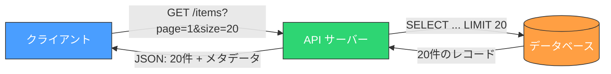

### 1.2 ページネーションの主要な3方式

ページネーションには大きく分けて 3 つのアプローチがある。

| 方式 | 基本的な考え方 | 代表的な利用場面 |
|------|-------------|---------------|
| **Offset-Based** | 「先頭から N 件スキップして M 件取得」 | 管理画面、検索結果 |
| **Cursor-Based** | 「このマーカーの次から M 件取得」 | SNS タイムライン、GraphQL API |
| **Keyset** | 「この値より大きい（小さい）ものから M 件取得」 | リアルタイムフィード、大規模データ |

これら 3 つの方式は、それぞれ異なるトレードオフを持つ。本記事では各方式の仕組みを詳解し、パフォーマンス・UX・実装複雑性の観点から比較したうえで、実際の API 設計における選択指針を示す。

## 2. Offset-Based Pagination

### 2.1 仕組み

Offset-Based Pagination は最も直感的な方式である。「何件スキップして、何件取得するか」をパラメータとして指定する。SQL の `LIMIT` / `OFFSET` 句がそのまま対応するため、実装が容易である。

```sql
-- Fetch page 3 (20 items per page)
SELECT id, name, price, created_at
FROM products
ORDER BY created_at DESC
LIMIT 20 OFFSET 40;
```

上記の例では、`OFFSET 40` で最初の 40 件をスキップし、`LIMIT 20` で続く 20 件を取得する。これはページ番号 3（1 ページあたり 20 件）に相当する。

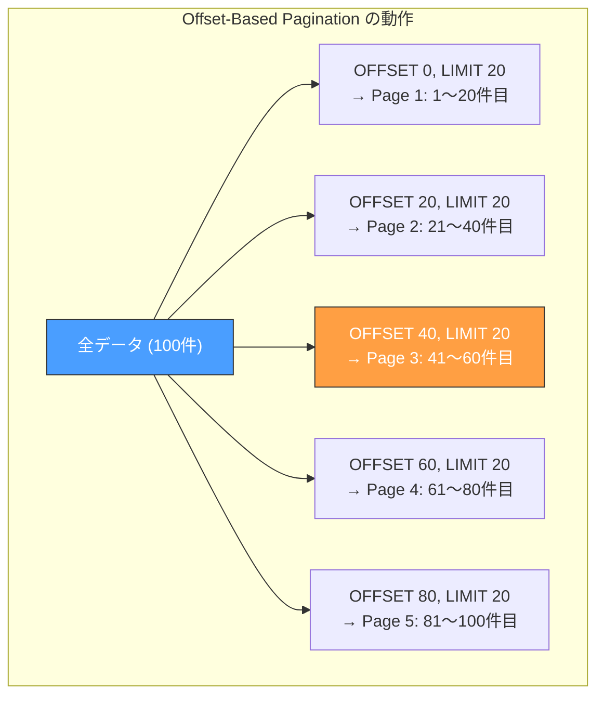

API リクエストとしては、一般的に `page` と `size`（または `limit`）の 2 つのパラメータを受け取る。

```
GET /api/products?page=3&size=20
```

サーバー側では `offset = (page - 1) * size` と変換して SQL に渡す。

### 2.2 レスポンス設計

Offset-Based Pagination のレスポンスには、ページ遷移のためのメタデータを含めることが一般的である。

```json
{
  "data": [
    { "id": 41, "name": "Product A", "price": 1200 },
    { "id": 42, "name": "Product B", "price": 3400 }
  ],
  "pagination": {
    "page": 3,
    "size": 20,
    "total_items": 100,
    "total_pages": 5,
    "has_next": true,
    "has_previous": true
  }
}
```

`total_items` と `total_pages` を返すことで、クライアントはページ番号付きのナビゲーション UI（`1 2 3 4 5`）を構築できる。これが Offset-Based 方式の最大の利点である。

### 2.3 問題点

Offset-Based Pagination はシンプルさと引き換えに、いくつかの重大な問題を抱えている。

#### パフォーマンスの劣化

データベースが `OFFSET N` を処理する際、**実際には N 件の行をスキャンしてから破棄する**。つまり `OFFSET 1000000` を指定すると、データベースは 100 万行を読み込み、すべて捨ててから次の `LIMIT` 件を返す。

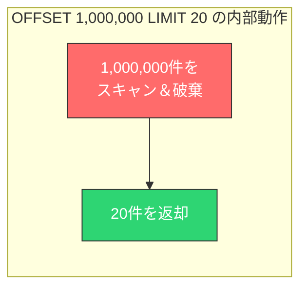

この問題はデータ量が増えるほど深刻になる。以下は OFFSET 値と応答時間の関係を示す概念的な表である。

| OFFSET 値 | 概算レスポンス時間 |
|-----------|----------------|
| 0 | 1 ms |
| 10,000 | 10 ms |
| 100,000 | 80 ms |
| 1,000,000 | 500 ms |
| 10,000,000 | 5,000 ms |

::: warning
`OFFSET` の計算量は O(N) であり、N はスキップする行数である。ページが深くなるほど応答が遅くなるため、大規模データセットでは実用に耐えないケースが生じる。
:::

#### データの欠落と重複

Offset-Based Pagination は**静的なスナップショット**を前提としている。しかし、実際のデータはリアルタイムで変化する。ユーザーがページ 1 を表示している間に新しいデータが挿入されると、ページ 2 に遷移したとき、本来ページ 1 にあったはずのアイテムが再度表示される（重複）。逆に、データが削除されると表示されるべきアイテムがスキップされる（欠落）。

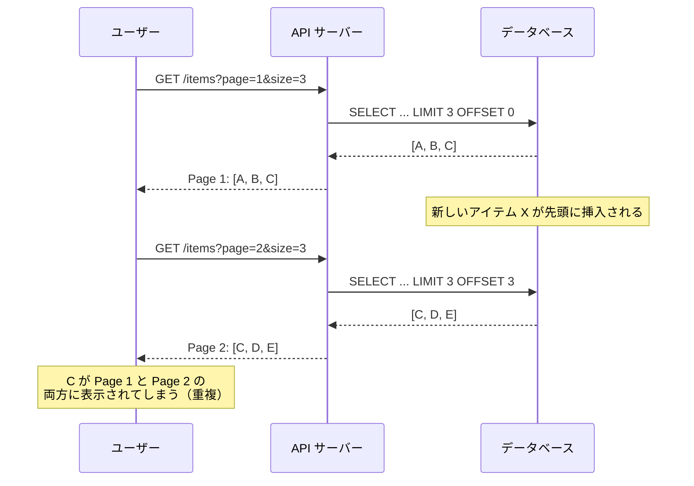

この問題は「ページドリフト」と呼ばれ、Offset-Based 方式の本質的な欠陥である。

#### 任意ページへのジャンプコスト

ページ番号によるナビゲーションを提供できることは利点だが、ユーザーが最終ページ（例: 5000 ページ目）にジャンプすると、巨大な OFFSET が発生し、パフォーマンスが著しく劣化する。Google 検索がかつて表示していた長大なページ番号ナビゲーションを縮小したのは、この問題への現実的な対応でもある。

### 2.4 Offset-Based が適する場面

問題点を理解したうえで、Offset-Based Pagination が適切な場面も存在する。

- **データ量が小さい（数千〜数万件程度）**: OFFSET のパフォーマンス劣化が無視できる規模
- **ページ番号ナビゲーションが必須**: 管理画面や検索結果など、任意ページへのジャンプが求められる
- **データの変動が少ない**: マスタデータなど、挿入・削除が頻繁でないデータ
- **実装の簡潔さが優先**: プロトタイプやMVP など、パフォーマンスより開発速度を重視する場合

## 3. Cursor-Based Pagination

### 3.1 仕組み

Cursor-Based Pagination は、ページ番号の代わりに**カーソル（cursor）** と呼ばれるマーカーを使ってデータの位置を特定する方式である。カーソルは「このデータセットにおける現在位置」を表すトークンであり、クライアントはカーソルを渡すことで「この位置の次（または前）のデータ」を取得する。

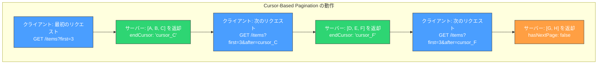

API リクエストの典型的な形式は以下の通りである。

```
GET /api/items?first=20&after=eyJpZCI6MTAwfQ==
```

ここで `after` パラメータに渡されるのがカーソルである。サーバーはこのカーソルをデコードし、内部的には条件付きクエリとして処理する。

### 3.2 カーソルのエンコーディング

カーソルの実体は、ページネーションの位置を特定するための情報をエンコードしたものである。一般的な実装では Base64 エンコーディングが使われる。

```python
import base64
import json

def encode_cursor(record):
    # Encode the pagination position as a Base64 string
    payload = json.dumps({"id": record["id"], "created_at": record["created_at"]})
    return base64.urlsafe_b64encode(payload.encode()).decode()

def decode_cursor(cursor_str):
    # Decode the cursor back to its original payload
    payload = base64.urlsafe_b64decode(cursor_str.encode()).decode()
    return json.loads(payload)
```

::: tip
カーソルを Base64 でエンコードする理由は、**内部構造を隠蔽するため**である。クライアントにカーソルの内容を解釈させないことで、サーバー側はカーソルの内部表現をバージョン間で自由に変更できる。カーソルは「不透明なトークン（opaque token）」として扱うことが設計上の鉄則である。
:::

カーソルに何を含めるかは、ソート条件によって異なる。

| ソート条件 | カーソルに含める値 | デコード例 |
|-----------|-----------------|-----------|
| `ORDER BY id` | `id` | <code v-pre>{"id": 100}</code> |
| `ORDER BY created_at DESC` | `created_at`, `id` | <code v-pre>{"created_at": "2026-01-15T10:30:00Z", "id": 100}</code> |
| `ORDER BY price ASC, id ASC` | `price`, `id` | <code v-pre>{"price": 1500, "id": 42}</code> |

ソートキーが一意でない場合（例: `price` の重複がありうる場合）、タイブレーカーとして一意な列（通常は主キー `id`）をカーソルに含めることが不可欠である。これについては Keyset Pagination のセクションで詳しく解説する。

### 3.3 GraphQL Relay Specification

GraphQL のエコシステムでは、Facebook（Meta）が策定した **Relay Connection Specification** がカーソルベースのページネーションの事実上の標準となっている。この仕様は GraphQL に限らず、REST API のページネーション設計にも多くの示唆を与える。

#### Connection モデル

Relay Specification では、ページネーション可能なリストを **Connection** というパターンで表現する。

```graphql
type Query {
  # Paginated list of users
  users(first: Int, after: String, last: Int, before: String): UserConnection!
}

type UserConnection {
  edges: [UserEdge!]!
  pageInfo: PageInfo!
  totalCount: Int
}

type UserEdge {
  node: User!
  cursor: String!
}

type PageInfo {
  hasNextPage: Boolean!
  hasPreviousPage: Boolean!
  startCursor: String
  endCursor: String
}

type User {
  id: ID!
  name: String!
  email: String!
}
```

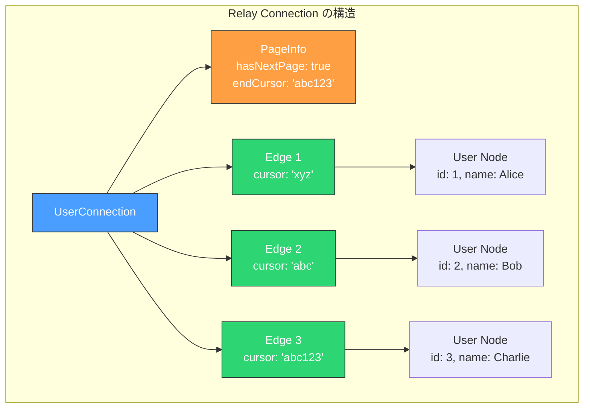

#### ページネーションパラメータ

Relay Specification では 4 つのページネーション引数を定義している。

| パラメータ | 方向 | 説明 |
|-----------|------|------|
| `first` | 前方 | 先頭から N 件取得 |
| `after` | 前方 | 指定カーソルの**後ろ**から取得 |
| `last` | 後方 | 末尾から N 件取得 |
| `before` | 後方 | 指定カーソルの**前**から取得 |

前方ページネーション（`first` + `after`）と後方ページネーション（`last` + `before`）を組み合わせることで、双方向のナビゲーションが可能になる。

::: warning
`first` と `last` を同時に指定した場合の動作は仕様上未定義であり、多くの実装ではエラーとして扱う。混乱を避けるため、一方向のみのパラメータを受け付ける設計にすべきである。
:::

#### クエリ例

```graphql
# Forward pagination: fetch first 10 users after a cursor
query {
  users(first: 10, after: "eyJpZCI6MTB9") {
    edges {
      node {
        id
        name
        email
      }
      cursor
    }
    pageInfo {
      hasNextPage
      endCursor
    }
    totalCount
  }
}
```

### 3.4 Cursor-Based の利点と制約

#### 利点

- **ページドリフトが起きない**: カーソルは「特定のレコードの後ろ」を指すため、データの挿入・削除があっても欠落や重複が生じにくい
- **一貫したパフォーマンス**: 内部的に Keyset 方式のクエリに変換されるため、深いページでもパフォーマンスが劣化しない（後述の Keyset Pagination を参照）
- **API の安定性**: カーソルが不透明トークンであるため、内部実装を変更してもクライアントに影響しない

#### 制約

- **任意ページへのジャンプ不可**: 「100 ページ目へ移動」のような操作ができない。カーソルは順次たどる必要がある
- **総件数の取得が別途必要**: ページ番号を表示するための `total_pages` を自然に算出できない（`totalCount` は別クエリで取得する必要がある）
- **実装の複雑さ**: カーソルのエンコード / デコード、双方向ナビゲーションの実装など、Offset 方式に比べて実装量が増える

## 4. Keyset Pagination

### 4.1 仕組み

Keyset Pagination（別名: Seek Method, WHERE-Based Pagination）は、Cursor-Based Pagination の内部実装に相当する方式であり、`WHERE` 句の条件によって開始位置を指定する。`OFFSET` を一切使わず、**インデックスを活用した効率的なクエリ**を実行できることが最大の特徴である。

基本原理は単純だ。前回取得した最後のレコードのソートキー値を記憶し、次のリクエストでは「その値より後ろ」のレコードを取得する。

```sql
-- First page
SELECT id, name, created_at
FROM products
ORDER BY created_at DESC, id DESC
LIMIT 20;

-- Second page (using the last record's values from page 1)
SELECT id, name, created_at
FROM products
WHERE (created_at, id) < ('2026-02-28 10:30:00', 500)
ORDER BY created_at DESC, id DESC
LIMIT 20;
```

::: tip
Keyset Pagination が高速な理由は、**データベースがインデックスを使って直接目的の位置にシークできる**からである。B-Tree インデックスの探索は O(log N) であり、全行をスキャンする OFFSET の O(N) とは根本的に異なる。
:::

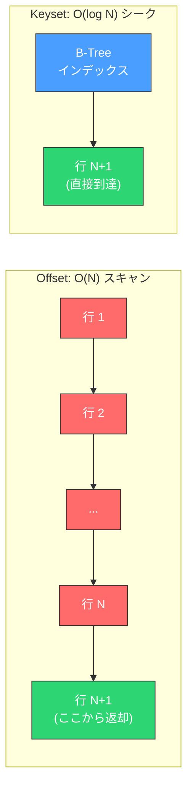

### 4.2 タプル比較と複合キー

Keyset Pagination でソートキーが複数カラムにわたる場合、**タプル比較（Row Value Comparison）** を使うことで、正しい順序を保証できる。

#### 単一カラムの場合

ソートキーが一意な単一カラム（例: `id`）であれば、シンプルな比較で済む。

```sql
-- Single column keyset (id is unique)
SELECT id, name, price
FROM products
WHERE id > 100
ORDER BY id ASC
LIMIT 20;
```

#### 複合キーの場合

しかし、実際のユースケースではソートキーが一意でないことが多い。例えば `created_at` でソートする場合、同じタイムスタンプを持つレコードが複数存在しうる。このとき、タイブレーカーとして一意な列（`id`）を追加する必要がある。

```sql
-- Composite keyset: created_at DESC, id DESC
-- Using tuple comparison (supported by PostgreSQL, MySQL 8.0+)
SELECT id, name, created_at
FROM products
WHERE (created_at, id) < ('2026-02-28 10:30:00', 500)
ORDER BY created_at DESC, id DESC
LIMIT 20;
```

タプル比較をサポートしないデータベースの場合、等価な条件を展開する必要がある。

```sql
-- Expanded form (equivalent to tuple comparison)
SELECT id, name, created_at
FROM products
WHERE created_at < '2026-02-28 10:30:00'
   OR (created_at = '2026-02-28 10:30:00' AND id < 500)
ORDER BY created_at DESC, id DESC
LIMIT 20;
```

::: warning
展開形式は条件が増えるほど複雑になる。3 カラム以上のソートキー `(a, b, c)` では以下のようになる。

```sql
WHERE a < :a
   OR (a = :a AND b < :b)
   OR (a = :a AND b = :b AND c < :c)
```

この展開はオプティマイザによっては効率的なインデックス利用に変換されない場合がある。可能な限りタプル比較構文を使用すべきである。
:::

### 4.3 インデックス設計

Keyset Pagination の性能はインデックスに依存する。ソート条件に合致するインデックスが存在しない場合、フルテーブルスキャンが発生し、OFFSET 方式と大差ない性能になってしまう。

```sql
-- Index that supports the keyset pagination query
CREATE INDEX idx_products_created_at_id
ON products (created_at DESC, id DESC);
```

インデックスのカラム順序とソート方向は、クエリの `ORDER BY` 句と**完全に一致**させる必要がある。`ORDER BY created_at DESC, id DESC` に対して `(created_at ASC, id ASC)` のインデックスでも逆順スキャンで利用可能だが、`(created_at DESC, id ASC)` のインデックスは利用できない。

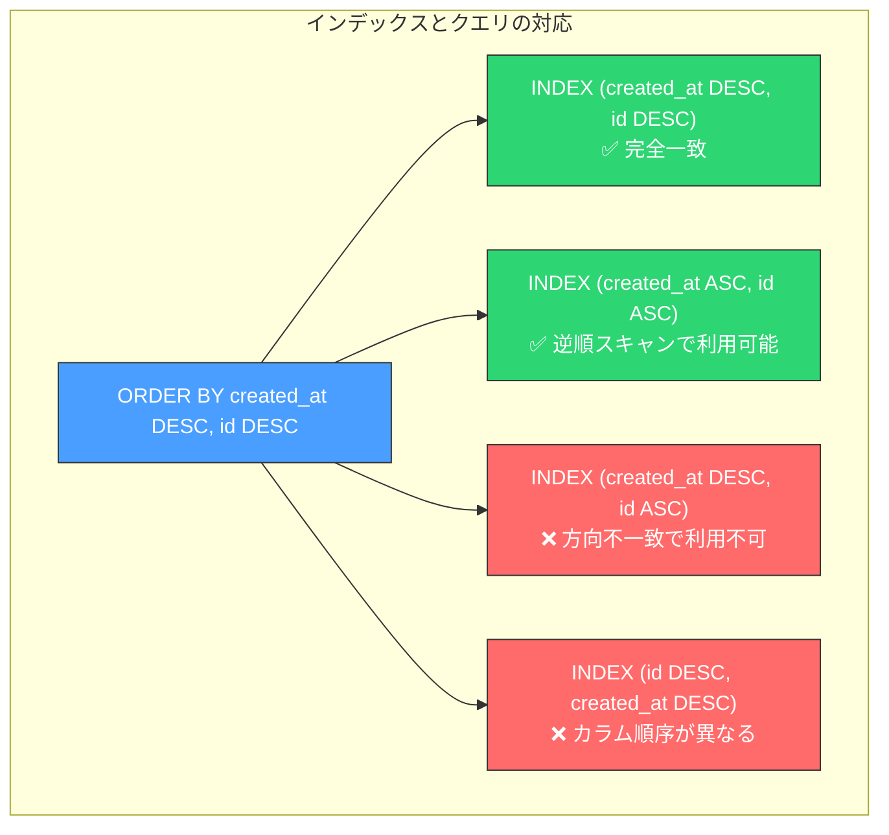

### 4.4 Keyset Pagination の実装例

以下に、Python（SQLAlchemy）での Keyset Pagination の実装例を示す。

```python
from sqlalchemy import and_, or_, tuple_
from sqlalchemy.orm import Session

def get_products_keyset(
    db: Session,
    limit: int = 20,
    cursor_created_at: str = None,
    cursor_id: int = None,
):
    """Fetch products using keyset pagination."""
    query = db.query(Product).order_by(
        Product.created_at.desc(),
        Product.id.desc(),
    )

    # Apply keyset condition if cursor is provided
    if cursor_created_at is not None and cursor_id is not None:
        query = query.filter(
            tuple_(Product.created_at, Product.id)
            < tuple_(cursor_created_at, cursor_id)
        )

    # Fetch one extra to determine hasNextPage
    results = query.limit(limit + 1).all()

    has_next = len(results) > limit
    items = results[:limit]

    return {
        "items": items,
        "has_next": has_next,
        "next_cursor": {
            "created_at": items[-1].created_at,
            "id": items[-1].id,
        } if items else None,
    }
```

::: tip
`limit + 1` 件取得して実際に返すのは `limit` 件だけ、という手法は「1 件余分に取得するテクニック」と呼ばれ、`hasNextPage` の判定に `COUNT(*)` を避けるための定番パターンである。
:::

### 4.5 Cursor-Based と Keyset の関係

Cursor-Based Pagination と Keyset Pagination は本質的に同じ手法を異なる抽象レベルで扱ったものである。

- **Keyset Pagination**: データベースクエリの技法として、`WHERE` 句の条件でページ位置を指定する手法
- **Cursor-Based Pagination**: API の設計パターンとして、不透明なカーソルトークンでページ位置を指定する手法

Cursor-Based API の内部実装として Keyset クエリを用いるのが一般的な組み合わせである。

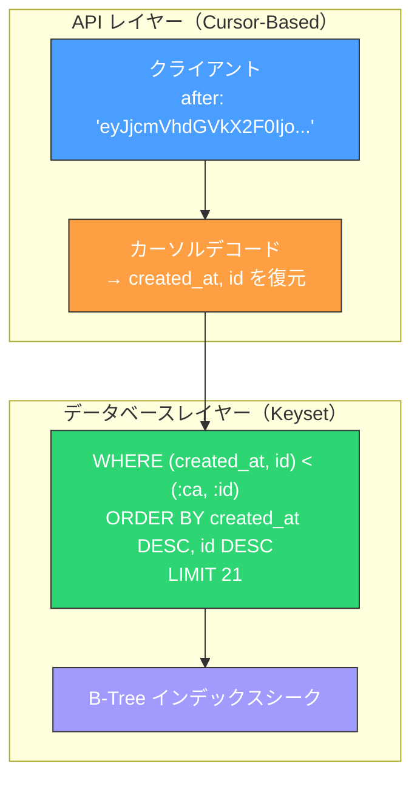

つまり、Cursor-Based はクライアントから見たインターフェースの設計であり、Keyset はサーバー内部の実装技法である。この区別を理解することが、正しいページネーション設計の第一歩となる。

## 5. 各方式の比較

### 5.1 パフォーマンス比較

3 つの方式のパフォーマンス特性を整理する。

| 観点 | Offset-Based | Cursor/Keyset |
|------|-------------|---------------|
| 最初のページ | O(limit) | O(limit) |
| N ページ目 | O(N * limit) | O(log(total) + limit) |
| インデックスの必要性 | ORDER BY に対応するインデックス | ORDER BY に対応するインデックス（必須度が高い） |
| 深いページのレスポンス時間 | 線形に劣化 | ほぼ一定 |

以下に、テーブルサイズ 1,000 万件での概念的なパフォーマンス比較を図示する。

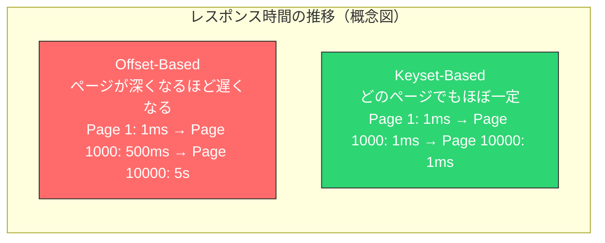

### 5.2 UX 比較

| 観点 | Offset-Based | Cursor/Keyset |
|------|-------------|---------------|
| ページ番号ナビゲーション | 自然に対応 | 不可能（または高コスト） |
| 「最終ページへジャンプ」 | 可能（ただし遅い） | 不可能 |
| 無限スクロール | 可能だが非効率 | 最適 |
| 「もっと読む」ボタン | 可能だが非効率 | 最適 |
| ブックマーク / URL 共有 | `?page=3` で直感的 | カーソルが長く不透明 |
| ブラウザの「戻る」操作 | ページ番号で復元可能 | カーソルの保存が必要 |

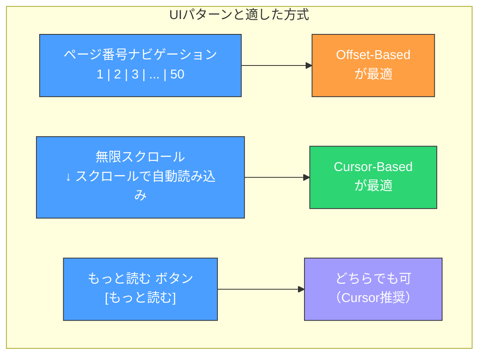

### 5.3 実装複雑性の比較

| 観点 | Offset-Based | Cursor-Based | Keyset（直接公開） |
|------|-------------|-------------|-----------------|
| クエリ構築 | 非常にシンプル | エンコード/デコードが必要 | 条件展開が複雑になりうる |
| クライアント実装 | page/size のみ | カーソル管理が必要 | ソートキー値の管理が必要 |
| 双方向ナビゲーション | 自然 | before/after の実装が必要 | 比較演算子の切り替えが必要 |
| ソート変更への対応 | 容易 | カーソル内容の変更が必要 | WHERE 条件の再構築が必要 |
| テスト容易性 | 高い | 中程度 | 中程度 |

### 5.4 方式選択のデシジョンツリー

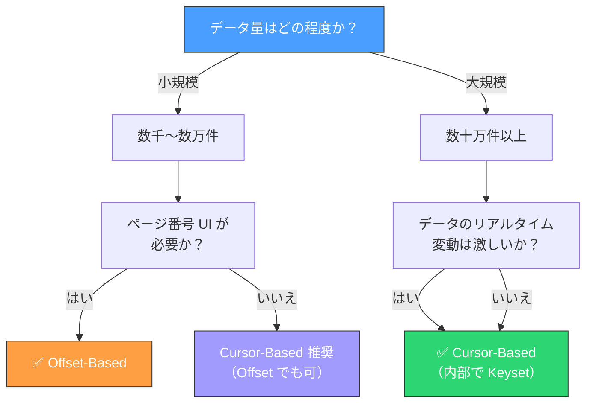

## 6. 実装上の考慮事項

### 6.1 総件数の取得

#### 問題

多くの API は `totalCount`（総件数）をレスポンスに含める。しかし、`COUNT(*)` クエリは大規模テーブルでは非常に重い処理である。特に PostgreSQL では MVCC の仕組み上、`COUNT(*)` は常にテーブルの全行を走査する必要があり、1,000 万行のテーブルでは数秒を要することもある。

```sql
-- This can be extremely slow on large tables
SELECT COUNT(*) FROM products WHERE category = 'electronics';
```

#### 対策

総件数の取得コストに対するアプローチはいくつか存在する。

**1. 概算値の利用**

PostgreSQL では `pg_stat_user_tables` から概算行数を取得できる。

```sql
-- Approximate count (PostgreSQL)
SELECT reltuples::bigint AS estimate
FROM pg_class
WHERE relname = 'products';
```

MySQL では `SHOW TABLE STATUS` が同様の情報を提供する。ただし、これはテーブル全体の行数の概算であり、`WHERE` 条件付きの件数は得られない。

**2. カウントキャッシュ**

頻繁にアクセスされるフィルタ条件の総件数を、別テーブルやキャッシュ（Redis など）に保持する方式である。データの追加・削除時にカウントを更新する。

```sql
-- Maintain a separate count table
CREATE TABLE product_counts (
    category VARCHAR(50) PRIMARY KEY,
    count BIGINT NOT NULL DEFAULT 0
);

-- Update count on insert (via trigger or application logic)
UPDATE product_counts SET count = count + 1 WHERE category = 'electronics';
```

**3. 総件数を返さない設計**

Cursor-Based Pagination では、`hasNextPage` のみを返し、総件数やページ数を提供しない設計が可能である。Twitter（X）のタイムライン API や GitHub の GraphQL API がこのアプローチを採用している。

::: details 「あと何件あるか分からない」は UX 上問題にならないのか？
無限スクロールや「もっと読む」の UI パターンでは、ユーザーは「全体の何割を見ているか」を意識しないことが多い。SNS のフィードを使うとき、投稿が何件あるかを気にするユーザーはほとんどいない。一方、管理画面の検索結果や EC サイトの商品一覧では、総件数がフィルタリングの有効性の指標になるため、何らかの形で件数を提示すべきケースがある。アプリケーションの文脈に応じた判断が必要である。
:::

### 6.2 ソートの取り扱い

ソート条件はページネーション方式と密接に関係する。特に Keyset Pagination では、ソートキーがクエリの `WHERE` 条件に直結するため、ソート変更への対応が設計上の重要な論点になる。

#### 動的ソートへの対応

ユーザーが「価格順」「新着順」「人気順」などを切り替える UI を提供する場合、Keyset Pagination ではソートキーの変更に伴ってカーソルの内容も変わる。ソートキーが変わった場合は、**カーソルを破棄して最初のページから取得し直す**のが安全な設計である。

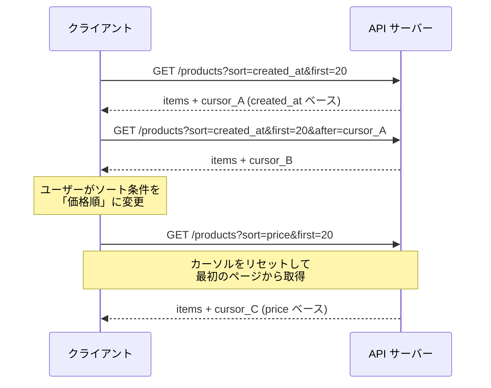

#### 各ソート条件に必要なインデックス

動的ソートをサポートする場合、各ソート条件に対応するインデックスを作成する必要がある。インデックスの増加はストレージと書き込み性能に影響するため、サポートするソート条件は慎重に選定すべきである。

```sql
-- Index for sorting by created_at
CREATE INDEX idx_products_created_at_id ON products (created_at DESC, id DESC);

-- Index for sorting by price
CREATE INDEX idx_products_price_id ON products (price ASC, id ASC);

-- Index for sorting by popularity (e.g., review count)
CREATE INDEX idx_products_review_count_id ON products (review_count DESC, id DESC);
```

### 6.3 フィルタリングとの組み合わせ

ページネーションとフィルタリング（検索条件の絞り込み）を組み合わせる場合、複合インデックスの設計が重要になる。

#### フィルタ条件を含む Keyset クエリ

```sql
-- Keyset pagination with filtering
SELECT id, name, price, created_at
FROM products
WHERE category = 'electronics'
  AND (created_at, id) < ('2026-02-28 10:30:00', 500)
ORDER BY created_at DESC, id DESC
LIMIT 20;
```

このクエリを効率的に実行するには、フィルタ条件とソートキーを組み合わせた複合インデックスが必要である。

```sql
-- Composite index: filter column first, then sort columns
CREATE INDEX idx_products_category_created_at_id
ON products (category, created_at DESC, id DESC);
```

インデックスのカラム順序は「等価条件（`=`）で使うカラムを先に、範囲条件（`<`, `>`）で使うカラムを後に」が基本原則である。

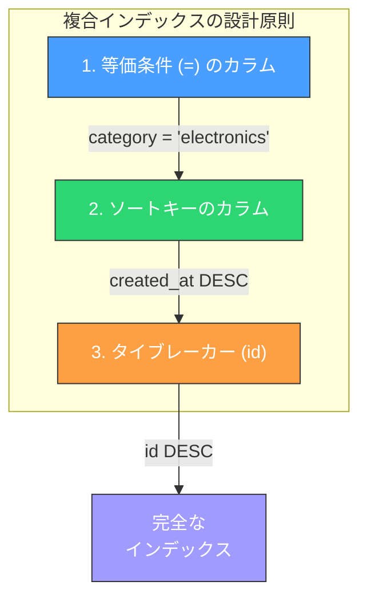

### 6.4 NULL 値の扱い

ソートキーに `NULL` を含むカラムがある場合、注意が必要である。`NULL` は比較演算子（`<`, `>`）で比較できず、`IS NULL` / `IS NOT NULL` での分岐が必要になる。

```sql
-- Handling NULL in keyset pagination (PostgreSQL NULLS LAST)
SELECT id, name, price
FROM products
WHERE price IS NOT NULL
  AND (price, id) > (1500, 42)
   OR price IS NULL
ORDER BY price ASC NULLS LAST, id ASC
LIMIT 20;
```

可能であれば、ソートキーに使用するカラムは `NOT NULL` 制約を付与するのが最もシンプルな解決策である。

### 6.5 ページサイズの制御

クライアントが任意のページサイズを指定できると、`size=1000000` のようなリクエストで大量データを一度に取得される危険がある。サーバー側では必ず上限を設定すべきである。

```python
# Server-side page size validation
MAX_PAGE_SIZE = 100
DEFAULT_PAGE_SIZE = 20

def validate_page_size(requested_size: int) -> int:
    """Clamp the requested page size to valid bounds."""
    if requested_size is None or requested_size < 1:
        return DEFAULT_PAGE_SIZE
    return min(requested_size, MAX_PAGE_SIZE)
```

::: tip
ページサイズのデフォルト値と上限値は API ドキュメントに明記すべきである。一般的には、デフォルト 20〜25 件、上限 100 件程度が実用的な設定である。
:::

## 7. REST / GraphQL API での実践

### 7.1 REST API での実装パターン

#### Offset-Based REST API

```
GET /api/v1/products?page=2&size=20&sort=created_at:desc
```

レスポンス例:

```json
{
  "data": [
    { "id": 21, "name": "Widget A", "price": 1500 },
    { "id": 22, "name": "Widget B", "price": 2300 }
  ],
  "pagination": {
    "page": 2,
    "size": 20,
    "total_items": 342,
    "total_pages": 18,
    "has_next": true,
    "has_previous": true
  },
  "links": {
    "self": "/api/v1/products?page=2&size=20&sort=created_at:desc",
    "first": "/api/v1/products?page=1&size=20&sort=created_at:desc",
    "prev": "/api/v1/products?page=1&size=20&sort=created_at:desc",
    "next": "/api/v1/products?page=3&size=20&sort=created_at:desc",
    "last": "/api/v1/products?page=18&size=20&sort=created_at:desc"
  }
}
```

`links` フィールドは HATEOAS（Hypermedia as the Engine of Application State）の原則に基づき、クライアントが URL を組み立てなくてもページ遷移できるようにするためのものである。

#### Cursor-Based REST API

```
GET /api/v1/products?limit=20&after=eyJjcmVhdGVkX2F0IjoiMjAyNi0wMi0yOCIsImlkIjo1MDB9
```

レスポンス例:

```json
{
  "data": [
    { "id": 499, "name": "Widget C", "price": 800 },
    { "id": 498, "name": "Widget D", "price": 1200 }
  ],
  "pagination": {
    "has_next": true,
    "has_previous": true,
    "next_cursor": "eyJjcmVhdGVkX2F0IjoiMjAyNi0wMi0yMCIsImlkIjo0ODB9",
    "previous_cursor": "eyJjcmVhdGVkX2F0IjoiMjAyNi0wMi0yOCIsImlkIjo0OTl9"
  },
  "links": {
    "self": "/api/v1/products?limit=20&after=eyJjcmVhdGVkX2F0IjoiMjAyNi0wMi0yOCIsImlkIjo1MDB9",
    "next": "/api/v1/products?limit=20&after=eyJjcmVhdGVkX2F0IjoiMjAyNi0wMi0yMCIsImlkIjo0ODB9",
    "prev": "/api/v1/products?limit=20&before=eyJjcmVhdGVkX2F0IjoiMjAyNi0wMi0yOCIsImlkIjo0OTl9"
  }
}
```

#### HTTP Link ヘッダーの活用

GitHub API v3 のように、ページネーションのリンクを HTTP `Link` ヘッダーで返す方式もある。

```
Link: <https://api.example.com/items?limit=20&after=abc123>; rel="next",
      <https://api.example.com/items?limit=20&before=xyz789>; rel="prev"
```

この方式はレスポンスボディをデータのみに保つことができるが、クライアント側で Link ヘッダーのパースが必要になる。

### 7.2 GraphQL API での実装パターン

GraphQL では、Relay Connection Specification に準拠した実装が広く採用されている（3.3 節参照）。ここでは、サーバーサイドのリゾルバ実装例を示す。

```typescript
// GraphQL resolver for cursor-based pagination (TypeScript)
import { connectionFromArraySlice, cursorToOffset } from "graphql-relay";

const resolvers = {
  Query: {
    products: async (
      _parent: unknown,
      args: { first?: number; after?: string; last?: number; before?: string },
      context: { db: Database }
    ) => {
      const { first, after, last, before } = args;
      const limit = first ?? last ?? 20;

      // Decode cursor to keyset values
      let keysetCondition = {};
      if (after) {
        const cursor = decodeCursor(after);
        keysetCondition = {
          created_at: { $lt: cursor.created_at },
          id: { $lt: cursor.id },
        };
      }

      // Build and execute query
      const items = await context.db.products
        .find(keysetCondition)
        .sort({ created_at: -1, id: -1 })
        .limit(limit + 1)
        .toArray();

      const hasMore = items.length > limit;
      const slicedItems = items.slice(0, limit);

      // Build connection response
      return {
        edges: slicedItems.map((item) => ({
          node: item,
          cursor: encodeCursor({
            created_at: item.created_at,
            id: item.id,
          }),
        })),
        pageInfo: {
          hasNextPage: hasMore,
          hasPreviousPage: !!after,
          startCursor: slicedItems.length > 0
            ? encodeCursor({
                created_at: slicedItems[0].created_at,
                id: slicedItems[0].id,
              })
            : null,
          endCursor: slicedItems.length > 0
            ? encodeCursor({
                created_at: slicedItems[slicedItems.length - 1].created_at,
                id: slicedItems[slicedItems.length - 1].id,
              })
            : null,
        },
        totalCount: await context.db.products.countDocuments({}),
      };
    },
  },
};
```

::: warning
上記の `totalCount` は全件カウントを実行するため、大規模データでは性能問題を引き起こす可能性がある。6.1 節で述べた対策を検討すべきである。また、GraphQL ではクライアントが `totalCount` フィールドをクエリに含めなければ、リゾルバは実行されない。この仕組みを活かし、必要な場合のみカウントを実行する設計が有効である。
:::

### 7.3 主要サービスの API 設計事例

実際のプロダクションで使われている API が、どのようなページネーション方式を採用しているかを確認する。

| サービス | API 種別 | 方式 | 特徴 |
|---------|---------|------|------|
| GitHub | REST API v3 | Link ヘッダー + `page`/`per_page` | Offset-Based。Link ヘッダーで次ページ URL を提供 |
| GitHub | GraphQL API v4 | Relay Connection | Cursor-Based。`first`/`after` パラメータを使用 |
| Twitter (X) | REST API v2 | `pagination_token` | Cursor-Based。不透明なトークンで次ページを指定 |
| Stripe | REST API | `starting_after`/`ending_before` | Keyset 風。オブジェクト ID を直接指定 |
| Slack | Web API | `cursor` | Cursor-Based。`response_metadata.next_cursor` で次ページを取得 |
| Shopify | GraphQL API | Relay Connection | Cursor-Based。Relay 仕様に準拠 |
| Google | Various APIs | `pageToken` | Cursor-Based。不透明なトークン方式 |

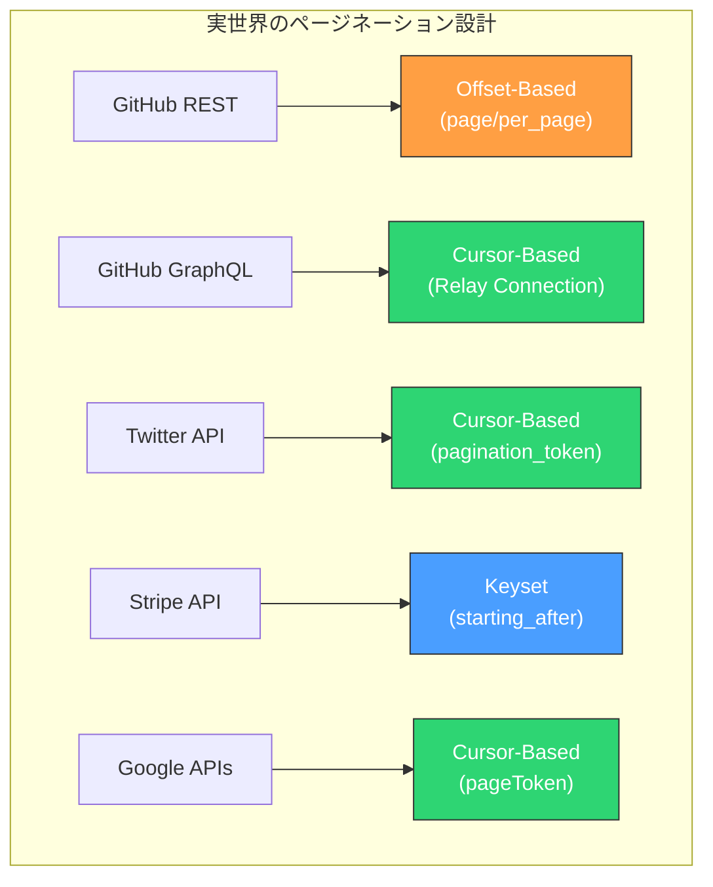

注目すべきは、GitHub が REST API では Offset-Based を採用しながら、GraphQL API では Cursor-Based に移行している点である。これは REST API の後方互換性を維持しつつ、新しい API では効率的な方式を採用するという現実的な判断である。

また、Stripe の `starting_after` パラメータは Keyset Pagination をほぼそのまま API に露出させた例であり、カーソルのエンコードを省略してオブジェクト ID を直接指定させている。これはカーソルの不透明性を犠牲にする代わりに、API の直感性とデバッグ容易性を向上させている。

### 7.4 ハイブリッドアプローチ

実際のアプリケーションでは、単一の方式に統一するのではなく、用途に応じて方式を使い分けることが多い。

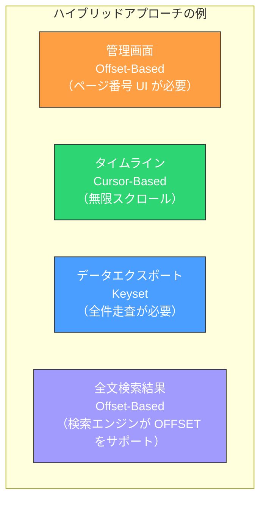

- **管理画面**: データ量が限定的であり、ページ番号ナビゲーションが求められるため、Offset-Based が適切
- **タイムライン / フィード**: データの変動が激しく、無限スクロール UI であるため、Cursor-Based が最適
- **データエクスポート**: 大量データを順次処理する必要があり、パフォーマンスが重要なため、Keyset が最適
- **全文検索結果**: Elasticsearch などの検索エンジンは内部的に OFFSET ベースの API を提供するため、Offset-Based が自然な選択

::: tip
同一プロジェクト内で複数のページネーション方式を採用する場合は、レスポンス形式を統一することが重要である。例えば、Offset-Based も Cursor-Based もレスポンスの `pagination` フィールドに `has_next` と `has_previous` を含めるようにすれば、クライアント側のページネーション処理を共通化しやすくなる。
:::

## 8. まとめ

ページネーションは一見単純に思える機能だが、方式の選択はアプリケーションのパフォーマンス・UX・保守性に深い影響を及ぼす。

**Offset-Based Pagination** は実装が容易でページ番号ナビゲーションに適するが、深いページでのパフォーマンス劣化とデータの整合性問題を抱える。データ量が限定的で、ページ番号 UI が必要な管理画面や検索結果に適している。

**Cursor-Based Pagination** は不透明なトークンでページ位置を表現し、API のインターフェースとして最も柔軟である。GraphQL Relay Specification は事実上の標準であり、広く採用されている。内部実装として Keyset クエリを組み合わせることで、スケーラブルなページネーションを実現できる。

**Keyset Pagination** はデータベースのインデックスを最大限に活用し、データ量に関わらず一定のパフォーマンスを提供する。Cursor-Based API の内部実装として利用されるケースが多いが、Stripe API のように直接公開するケースもある。

最終的な選択は、データ量、UI 要件、データの変動頻度、そして開発チームの技術的成熟度を総合的に考慮して行うべきである。迷った場合は、**Cursor-Based Pagination（内部 Keyset 実装）をデフォルトとし、ページ番号ナビゲーションが必要な場面でのみ Offset-Based を使う**、というアプローチが最もバランスが良い選択となる。
