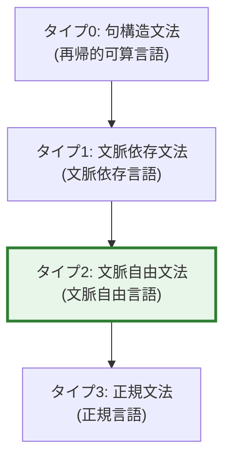
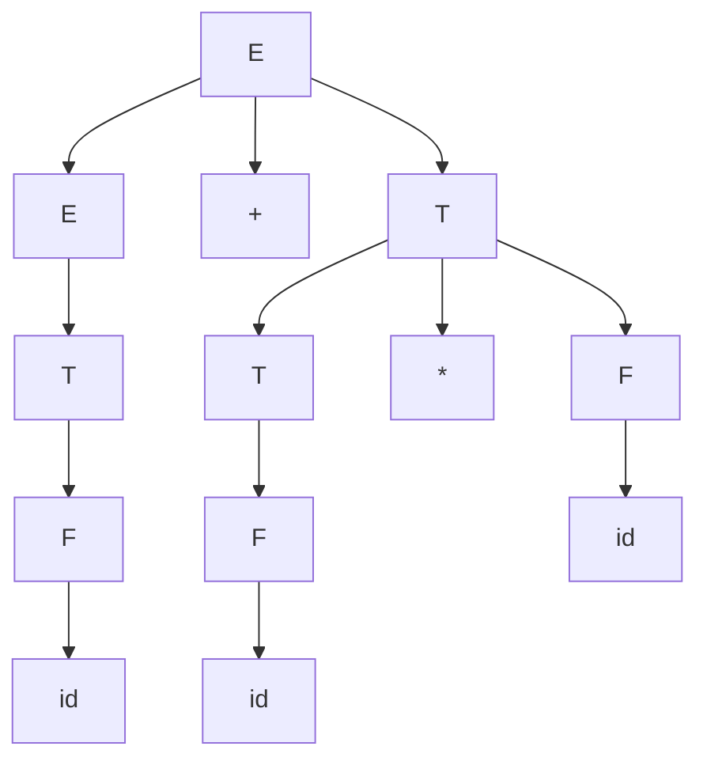
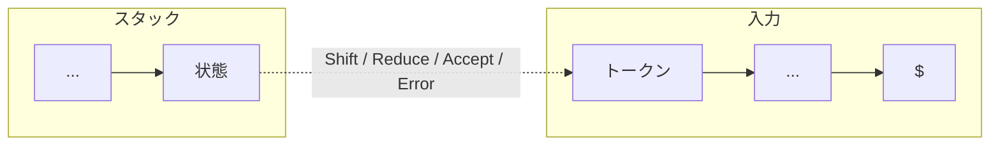
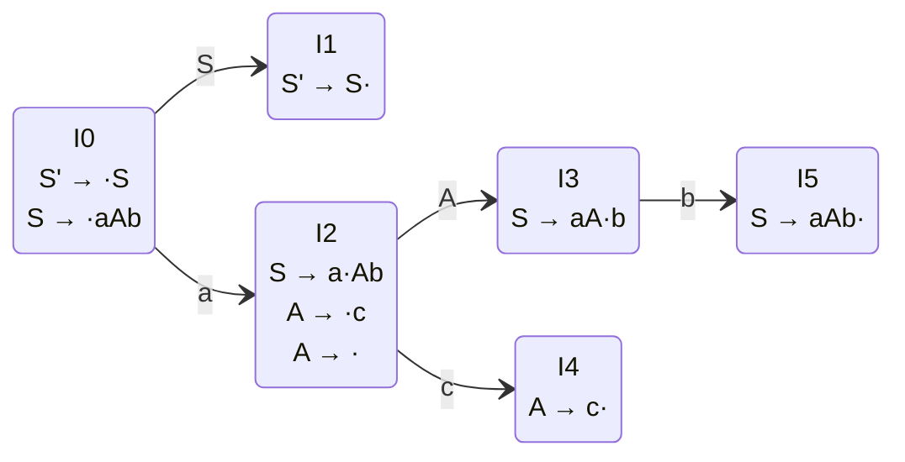
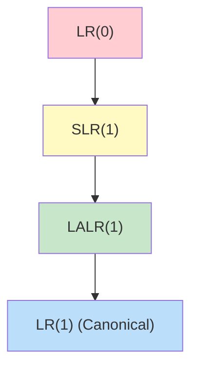
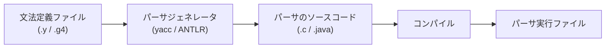
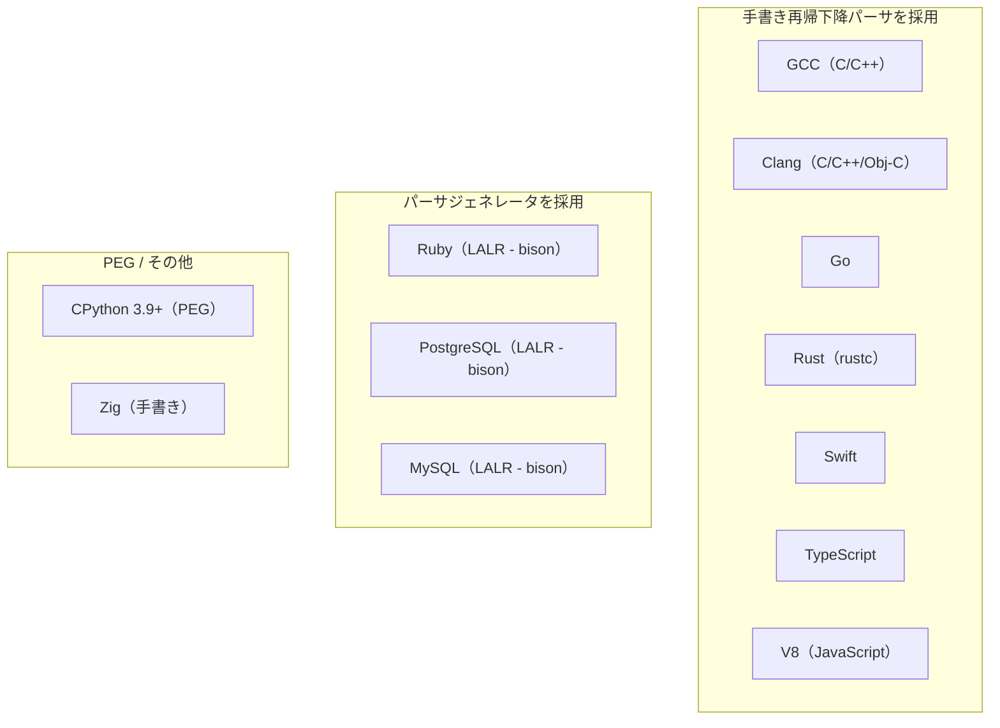
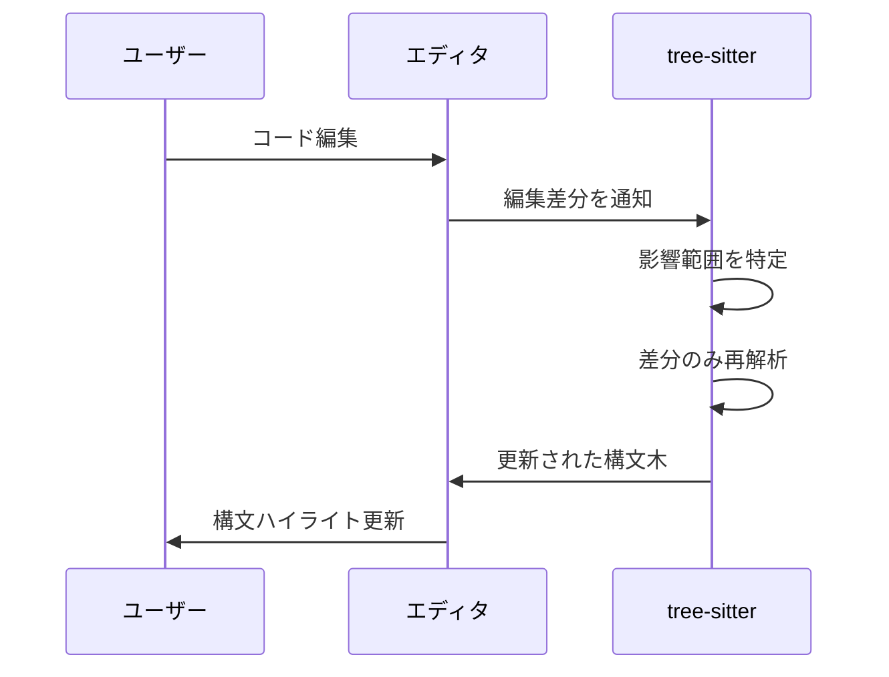

# 文脈自由文法とパーサ — LL法, LR法, PEGによる構文解析

## 1. 背景と動機：なぜ構文解析が必要か

プログラミング言語の処理系を構築する際、最初に立ちはだかる問題が**構文解析（parsing）**である。人間が書いたソースコード——単なるテキスト（文字列）——を、コンパイラやインタプリタが意味を理解し処理できる構造化された内部表現に変換しなければならない。

```
ソースコード (文字列)
    ↓ 字句解析 (lexing)
トークン列
    ↓ 構文解析 (parsing)
構文木 (parse tree / AST)
    ↓ 意味解析, 最適化, コード生成 ...
```

この変換の中核を担うのが構文解析器、すなわち**パーサ（parser）**である。パーサは、入力が言語の文法規則に従っているかを検証し、同時にプログラムの階層的な構造——**構文木（syntax tree）**——を構築する。

### 1.1 構文解析の歴史的背景

構文解析の理論は、1950年代から1960年代にかけて急速に発展した。その端緒は、言語学者 **Noam Chomsky** が自然言語の構造を記述するために提案した**形式文法（formal grammar）**の理論にある。Chomsky は1956年に形式言語の階層——後に **Chomsky 階層（Chomsky hierarchy）**と呼ばれるもの——を定式化した。



この階層の中で、**タイプ2：文脈自由文法（Context-Free Grammar, CFG）**が、プログラミング言語の構文記述においてもっとも重要な位置を占める。正規文法（タイプ3）では再帰的な構造（入れ子の括弧や条件分岐など）を表現できず、文脈依存文法（タイプ1）は解析が困難すぎるためである。CFG は**表現力と解析可能性のバランス**がちょうど良い。

### 1.2 プログラミング言語における構文定義

1960年、**ALGOL 60** の仕様が **BNF（Backus-Naur Form）**によって記述された。これは、CFG をプログラミング言語の構文定義に適用した歴史的に重要な事例である。John Backus と Peter Naur が考案したこの表記法は、以後すべてのプログラミング言語の仕様記述の基盤となった。

::: tip 構文解析の本質
構文解析とは、**線形なトークン列を階層的な木構造に変換する**処理である。この変換を正確かつ効率的に行うために、数十年にわたる理論研究と実装の蓄積がある。本記事では、その核心となる文脈自由文法の理論から、LL法・LR法・PEGといった具体的な解析手法、そしてパーサジェネレータやパーサコンビネータといった実践的なツールまでを体系的に解説する。
:::

## 2. 文脈自由文法（CFG）の定義と表記

### 2.1 形式的定義

文脈自由文法 $G$ は以下の4つ組 $(V, \Sigma, R, S)$ として定義される。

$$
G = (V, \Sigma, R, S)
$$

- $V$：**非終端記号（nonterminal symbols）**の有限集合。構文構造を表す。
- $\Sigma$：**終端記号（terminal symbols）**の有限集合。実際のトークンに対応する。$V \cap \Sigma = \emptyset$。
- $R$：**生成規則（production rules）**の有限集合。各規則は $A \to \alpha$ の形をとる。ここで $A \in V$、$\alpha \in (V \cup \Sigma)^*$。
- $S$：**開始記号（start symbol）**。$S \in V$。

「文脈自由」という名称は、生成規則の左辺が**単一の非終端記号**であることに由来する。すなわち、$A$ を $\alpha$ に書き換える際に、$A$ の周囲の文脈（前後の記号列）を考慮する必要がない。これが文脈依存文法との決定的な違いである。

### 2.2 導出と構文木

文法 $G$ の開始記号 $S$ から出発し、生成規則を繰り返し適用して終端記号列を得るプロセスを**導出（derivation）**と呼ぶ。

例として、簡単な算術式の文法を考えよう。

$$
\begin{aligned}
E &\to E + T \mid T \\
T &\to T * F \mid F \\
F &\to ( E ) \mid \texttt{id}
\end{aligned}
$$

式 `id + id * id` の導出過程を示す。

**最左導出（leftmost derivation）**：常に最も左の非終端記号を展開する。

$$
E \Rightarrow E + T \Rightarrow T + T \Rightarrow F + T \Rightarrow \texttt{id} + T \Rightarrow \texttt{id} + T * F \Rightarrow \texttt{id} + F * F \Rightarrow \texttt{id} + \texttt{id} * F \Rightarrow \texttt{id} + \texttt{id} * \texttt{id}
$$

この導出に対応する**構文木（parse tree）**は以下のようになる。



構文木は、演算子の優先度と結合性を正しく反映する。上の文法では、`*` が `+` より優先度が高いことが、文法の階層構造（$E \to T$、$T \to F$）によって自然に表現されている。

### 2.3 曖昧性（Ambiguity）

文法が**曖昧（ambiguous）**であるとは、ある文に対して2つ以上の異なる構文木（あるいは最左導出）が存在することをいう。たとえば、以下のような文法は曖昧である。

$$
E \to E + E \mid E * E \mid ( E ) \mid \texttt{id}
$$

式 `id + id * id` に対して、`+` を先に結合する構文木と、`*` を先に結合する構文木の両方が生成可能であり、意味が曖昧になる。プログラミング言語の構文定義では、曖昧性を排除するか、あるいは曖昧性解消規則（優先度・結合性の指定）を明示的に導入する必要がある。

::: warning 曖昧性の判定
一般に、任意のCFGが曖昧であるかどうかを判定する問題は**決定不能（undecidable）**である。したがって、文法設計者が注意深く曖昧性を回避するか、パーサジェネレータの優先度・結合性宣言を活用する必要がある。
:::

### 2.4 BNF と EBNF

**BNF（Backus-Naur Form）**は、CFGの生成規則を記述するための標準的な表記法である。

```
<expr> ::= <expr> "+" <term> | <term>
<term> ::= <term> "*" <factor> | <factor>
<factor> ::= "(" <expr> ")" | <id>
```

**EBNF（Extended BNF）**は、BNFを拡張して繰り返し（`{}`）、省略可能（`[]`）、グループ化（`()`）などの記法を追加したものである。ISO/IEC 14977 として標準化されている。

```
expr = term { ("+" | "-") term } .
term = factor { ("*" | "/") factor } .
factor = "(" expr ")" | id .
```

EBNFは、CFGの表現力を超えるものではない。あくまで記述の便宜のための構文糖衣であり、すべてのEBNF規則はBNF（すなわちCFG）に機械的に変換できる。

## 3. 構文解析の分類：トップダウン vs ボトムアップ

構文解析アルゴリズムは、大きく2つのアプローチに分類される。


### 3.1 トップダウン解析（Top-Down Parsing）

開始記号から出発し、生成規則を左辺から右辺へ展開して、入力トークン列を生成しようと試みるアプローチである。**最左導出（leftmost derivation）**を構成する。

- **予測型構文解析（predictive parsing）**：先読みトークンに基づいて適用すべき規則を一意に決定する。LL(k) パーサがこれに該当する。
- **再帰下降構文解析（recursive descent parsing）**：各非終端記号に対応する再帰関数を記述する手法。手書きパーサとして最も一般的。
- **バックトラック型**：規則の選択に失敗した場合に別の選択肢を試す。一般に非効率だが、PEGで体系化されている。

### 3.2 ボトムアップ解析（Bottom-Up Parsing）

入力トークン列から出発し、生成規則を右辺から左辺へ**還元（reduce）**して、最終的に開始記号に到達するアプローチである。**最右導出の逆（reverse of rightmost derivation）**を構成する。

- **LR(k) パーサ**：Shift-Reduce 解析の代表。非常に広いクラスの文法を扱える。
- **演算子順位解析（operator-precedence parsing）**：演算子の優先度に基づく簡略化されたボトムアップ手法。

### 3.3 両者の比較

| 特性 | トップダウン | ボトムアップ |
|------|------------|-------------|
| 導出の方向 | 最左導出を構成 | 最右導出の逆を構成 |
| 処理する文法クラス | LL(k) | LR(k) |
| 文法の制約 | 左再帰の排除が必要 | 左再帰を自然に扱える |
| 実装の容易さ | 手書きが容易 | テーブル駆動が一般的 |
| エラーメッセージ | 直感的 | やや複雑 |
| 文法の表現力 | やや狭い | 広い（LL ⊂ LR） |

重要な関係として、以下の包含関係が成り立つ。

$$
\text{LL}(1) \subset \text{LR}(1) \subset \text{CFG全体}
$$

## 4. LL(1) パーサ

### 4.1 LL(k) の意味

**LL(k)** という名称は以下の意味を持つ。

- 1番目の **L**：入力を**左から右（Left-to-right）**に読む
- 2番目の **L**：**最左導出（Leftmost derivation）**を構成する
- **k**：先読みトークン数

LL(1) パーサは、現在の非終端記号と**1トークンの先読み**だけで、適用すべき生成規則を一意に決定できる。この一意決定を可能にするのが、**First 集合**と **Follow 集合**である。

### 4.2 First 集合と Follow 集合

#### First 集合

記号列 $\alpha$ の **First 集合** $\text{FIRST}(\alpha)$ は、$\alpha$ から導出される文字列の先頭に現れ得る終端記号の集合である。$\alpha$ が空文字列 $\varepsilon$ を導出できる場合は、$\varepsilon$ も含む。

$$
\text{FIRST}(\alpha) = \{ a \in \Sigma \mid \alpha \Rightarrow^* a\beta \text{ for some } \beta \} \cup \begin{cases} \{\varepsilon\} & \text{if } \alpha \Rightarrow^* \varepsilon \\ \emptyset & \text{otherwise} \end{cases}
$$

#### Follow 集合

非終端記号 $A$ の **Follow 集合** $\text{FOLLOW}(A)$ は、あらゆる文形式において $A$ の直後に現れ得る終端記号の集合である。入力の終端を表す記号 `$` を含むことがある。

$$
\text{FOLLOW}(A) = \{ a \in \Sigma \cup \{\$\} \mid S \Rightarrow^* \alpha A a \beta \text{ for some } \alpha, \beta \}
$$

#### 計算アルゴリズム

First 集合の計算規則は以下の通りである。

1. 終端記号 $a$ について：$\text{FIRST}(a) = \{a\}$
2. 非終端記号 $A$ について：
   - $A \to \varepsilon$ なら $\varepsilon \in \text{FIRST}(A)$
   - $A \to Y_1 Y_2 \cdots Y_k$ なら、$Y_1, Y_2, \ldots$ の First 集合を順に追加。$Y_i$ が $\varepsilon$ を導出できる間は $Y_{i+1}$ の First も追加する。

Follow 集合の計算規則は以下の通りである。

1. $\$ \in \text{FOLLOW}(S)$（$S$ は開始記号）
2. $A \to \alpha B \beta$ なら $\text{FIRST}(\beta) \setminus \{\varepsilon\} \subseteq \text{FOLLOW}(B)$
3. $A \to \alpha B$ または $A \to \alpha B \beta$ で $\varepsilon \in \text{FIRST}(\beta)$ なら $\text{FOLLOW}(A) \subseteq \text{FOLLOW}(B)$

#### 具体例

以下の文法で First/Follow を計算してみよう。

$$
\begin{aligned}
E &\to T\, E' \\
E' &\to +\, T\, E' \mid \varepsilon \\
T &\to F\, T' \\
T' &\to *\, F\, T' \mid \varepsilon \\
F &\to (\, E\, ) \mid \texttt{id}
\end{aligned}
$$

| 非終端記号 | First 集合 | Follow 集合 |
|-----------|-----------|------------|
| $E$ | $\{(, \texttt{id}\}$ | $\{\$, )\}$ |
| $E'$ | $\{+, \varepsilon\}$ | $\{\$, )\}$ |
| $T$ | $\{(, \texttt{id}\}$ | $\{+, \$, )\}$ |
| $T'$ | $\{*, \varepsilon\}$ | $\{+, \$, )\}$ |
| $F$ | $\{(, \texttt{id}\}$ | $\{*, +, \$, )\}$ |

### 4.3 LL(1) 予測構文解析表

First/Follow 集合を用いて、**予測構文解析表（predictive parsing table）**を構築する。表の行は非終端記号、列は終端記号（および `$`）に対応し、各セルには適用すべき生成規則が格納される。

生成規則 $A \to \alpha$ に対して、以下のようにテーブルを埋める。

1. $\text{FIRST}(\alpha)$ に含まれるすべての終端記号 $a$ について、$M[A, a] = A \to \alpha$
2. $\varepsilon \in \text{FIRST}(\alpha)$ の場合、$\text{FOLLOW}(A)$ に含まれるすべての終端記号 $b$（および `$`）について、$M[A, b] = A \to \alpha$

LL(1) 文法とは、このテーブルの各セルに**高々1つの規則**しか入らない文法のことである。複数の規則が1つのセルに入る場合、その文法は LL(1) ではない。

上記の文法に対する予測構文解析表は以下のようになる。

| | `id` | `+` | `*` | `(` | `)` | `$` |
|---|---|---|---|---|---|---|
| $E$ | $E \to TE'$ | | | $E \to TE'$ | | |
| $E'$ | | $E' \to +TE'$ | | | $E' \to \varepsilon$ | $E' \to \varepsilon$ |
| $T$ | $T \to FT'$ | | | $T \to FT'$ | | |
| $T'$ | | $T' \to \varepsilon$ | $T' \to *FT'$ | | $T' \to \varepsilon$ | $T' \to \varepsilon$ |
| $F$ | $F \to \texttt{id}$ | | | $F \to (E)$ | | |

### 4.4 LL(1) 文法の制約

LL(1) 文法であるためには、以下の条件を満たす必要がある。

1. **左再帰（left recursion）の排除**：$A \to A\alpha$ の形の規則は LL(1) では扱えない。左再帰を右再帰に変換する必要がある。
2. **左括り出し（left factoring）**：同じ非終端記号の複数の選択肢が共通の接頭辞を持つ場合、括り出す必要がある。

#### 左再帰の除去

直接左再帰 $A \to A\alpha \mid \beta$ は以下のように変換できる。

$$
\begin{aligned}
A &\to \beta\, A' \\
A' &\to \alpha\, A' \mid \varepsilon
\end{aligned}
$$

#### 左括り出し

$A \to \alpha\beta_1 \mid \alpha\beta_2$ は以下のように変換する。

$$
\begin{aligned}
A &\to \alpha\, A' \\
A' &\to \beta_1 \mid \beta_2
\end{aligned}
$$

### 4.5 再帰下降パーサ

**再帰下降パーサ（recursive descent parser）**は、LL パーサの最も直感的な実装形態である。各非終端記号に対して1つの関数を定義し、生成規則の右辺に沿ってトークンを消費する。

```python
class RecursiveDescentParser:
    def __init__(self, tokens):
        self.tokens = tokens
        self.pos = 0

    def peek(self):
        if self.pos < len(self.tokens):
            return self.tokens[self.pos]
        return '$'

    def consume(self, expected):
        token = self.peek()
        if token != expected:
            raise SyntaxError(f"Expected {expected}, got {token}")
        self.pos += 1
        return token

    # E -> T E'
    def parse_E(self):
        self.parse_T()
        self.parse_E_prime()

    # E' -> + T E' | epsilon
    def parse_E_prime(self):
        if self.peek() == '+':
            self.consume('+')
            self.parse_T()
            self.parse_E_prime()
        # else: epsilon production (do nothing)

    # T -> F T'
    def parse_T(self):
        self.parse_F()
        self.parse_T_prime()

    # T' -> * F T' | epsilon
    def parse_T_prime(self):
        if self.peek() == '*':
            self.consume('*')
            self.parse_F()
            self.parse_T_prime()
        # else: epsilon production (do nothing)

    # F -> ( E ) | id
    def parse_F(self):
        if self.peek() == '(':
            self.consume('(')
            self.parse_E()
            self.consume(')')
        elif self.peek() == 'id':
            self.consume('id')
        else:
            raise SyntaxError(f"Unexpected token: {self.peek()}")
```

再帰下降パーサの特長は以下の通りである。

- **手書きが容易**：文法規則からほぼ機械的にコードに変換できる
- **エラーメッセージの品質**：構文エラーが発生した箇所と文脈を正確に把握しやすい
- **柔軟性**：文法に収まらない特殊なケース（文脈依存的な処理）を容易に組み込める

現代の多くのプロダクション品質のコンパイラ——GCC、Clang、Go、Rust、Swift、TypeScript など——は、パーサジェネレータではなく手書きの再帰下降パーサを採用している。その理由は、エラーメッセージの制御性と保守性にある。

## 5. LR パーサ

### 5.1 LR(k) の意味

**LR(k)** の名称は以下の意味を持つ。

- **L**：入力を**左から右（Left-to-right）**に読む
- **R**：**最右導出（Rightmost derivation）**の逆を構成する
- **k**：先読みトークン数

LR パーサは LL パーサよりも広いクラスの文法を扱える。左再帰を自然に処理でき、ほぼすべてのプログラミング言語の構文を表現できる。Donald Knuth が1965年に LR(k) パーサの理論を確立した。

### 5.2 Shift-Reduce 解析

LR パーサの動作は、**スタック**と**入力バッファ**を用いた **Shift-Reduce** 操作として理解できる。



4つの基本操作がある。

1. **Shift（シフト）**：入力から次のトークンを読み取り、スタックに積む。対応する状態に遷移する。
2. **Reduce（還元）**：スタックの先頭にある記号列が、ある生成規則の右辺と一致する場合、それを左辺の非終端記号に置き換える。
3. **Accept（受理）**：入力をすべて読み終え、スタックに開始記号のみが残った場合、解析成功。
4. **Error（エラー）**：いずれの操作も適用できない場合、構文エラーを報告する。

#### 具体例：`id + id * id` の解析

文法：

$$
\begin{aligned}
(1)\; E &\to E + T \\
(2)\; E &\to T \\
(3)\; T &\to T * F \\
(4)\; T &\to F \\
(5)\; F &\to \texttt{id}
\end{aligned}
$$

| ステップ | スタック | 入力 | 操作 |
|---------|---------|------|------|
| 1 | | `id + id * id $` | Shift |
| 2 | `id` | `+ id * id $` | Reduce (5): $F \to \texttt{id}$ |
| 3 | `F` | `+ id * id $` | Reduce (4): $T \to F$ |
| 4 | `T` | `+ id * id $` | Reduce (2): $E \to T$ |
| 5 | `E` | `+ id * id $` | Shift |
| 6 | `E +` | `id * id $` | Shift |
| 7 | `E + id` | `* id $` | Reduce (5): $F \to \texttt{id}$ |
| 8 | `E + F` | `* id $` | Reduce (4): $T \to F$ |
| 9 | `E + T` | `* id $` | Shift |
| 10 | `E + T *` | `id $` | Shift |
| 11 | `E + T * id` | `$` | Reduce (5): $F \to \texttt{id}$ |
| 12 | `E + T * F` | `$` | Reduce (3): $T \to T * F$ |
| 13 | `E + T` | `$` | Reduce (1): $E \to E + T$ |
| 14 | `E` | `$` | Accept |

ステップ 9 において、`E + T` の状態で次の入力が `*` であるとき、**Shift** が選択される点に注目してほしい。ここで Reduce（$E \to E + T$）を選択すると `*` の優先度が `+` より低く扱われてしまう。LR パーサは、先読みトークンを活用して正しい操作を選択する。

### 5.3 LR(0) アイテムとオートマトン

LR パーサの構成の基盤となるのが **LR(0) アイテム（item）**である。LR(0) アイテムとは、生成規則の右辺にドット（`·`）を挿入したものであり、解析の進行状況を示す。

たとえば、規則 $A \to XYZ$ に対して4つの LR(0) アイテムが存在する。

$$
A \to \cdot X Y Z, \quad A \to X \cdot Y Z, \quad A \to X Y \cdot Z, \quad A \to X Y Z \cdot
$$

ドットの位置が、「右辺のどこまで認識したか」を示す。ドットが右端に達した $A \to X Y Z \cdot$ は、還元可能であることを意味する。

#### LR(0) オートマトンの構成

LR(0) アイテムの集合を**状態**とする有限オートマトンを構成する。状態の構成には2つの操作が必要である。

**Closure（閉包）**：アイテム集合 $I$ の closure は以下のように計算される。

1. $I$ のすべてのアイテムを closure に追加する
2. $A \to \alpha \cdot B \beta$ が closure に含まれ、$B \to \gamma$ が生成規則であれば、$B \to \cdot \gamma$ を closure に追加する
3. 新たに追加されるアイテムがなくなるまで繰り返す

**Goto**：アイテム集合 $I$ と文法記号 $X$ に対して、$\text{GOTO}(I, X)$ は以下のように計算される。

$$
\text{GOTO}(I, X) = \text{Closure}(\{ A \to \alpha X \cdot \beta \mid A \to \alpha \cdot X \beta \in I \})
$$

#### 簡単な文法での LR(0) オートマトン

文法 $S' \to S$, $S \to aAb$, $A \to c \mid \varepsilon$ を例に、状態遷移を図示する。



### 5.4 LR パーサの変種

LR パーサにはいくつかの変種があり、解析テーブルの構成方法が異なる。



#### LR(0)

もっとも単純だが、先読みをまったく使わないため、実用的なプログラミング言語の文法にはほとんど対応できない。Reduce を行うかどうかの判定に先読みトークンを使えないため、**Shift-Reduce 衝突**や **Reduce-Reduce 衝突**が頻発する。

#### SLR(1) — Simple LR

LR(0) オートマトンを基盤としつつ、Reduce 操作の適用条件に **Follow 集合**を利用する。具体的には、$A \to \alpha \cdot$ というアイテムを含む状態で、次の入力トークン $a$ が $\text{FOLLOW}(A)$ に含まれる場合にのみ Reduce を行う。

SLR(1) は LR(0) より多くの文法を扱えるが、Follow 集合はすべての文脈を通じて計算されるため、特定の文脈では不要な Reduce が衝突を引き起こすことがある。

#### LALR(1) — Look-Ahead LR

**LALR(1)** は、LR(1) アイテムを用いるが、**コア（core）**が同じ状態を統合する手法である。ここでコアとは、先読みトークンを除いた LR(0) アイテムの集合を指す。

LALR(1) は SLR(1) より多くの文法を扱え、かつ LR(1) に比べて状態数が大幅に少ない。**yacc** や **bison** が採用しているのがこの LALR(1) である。

#### LR(1) — Canonical LR

**LR(1)** は、各 LR(0) アイテムに**先読みトークン**を付加した LR(1) アイテムを使う。

$$
[A \to \alpha \cdot \beta, \, a]
$$

ここで $a$ は先読みトークンであり、$A \to \alpha \beta$ を $a$ の直前でのみ還元してよいことを意味する。

LR(1) は最も広いクラスの決定性文脈自由言語を扱えるが、状態数が膨大になるという実用上の問題がある。

#### 各変種の比較

| 方式 | 文法クラス | 状態数 | 衝突解決の精度 |
|------|----------|--------|-------------|
| LR(0) | 最も狭い | 少ない | 先読みなし |
| SLR(1) | 狭い | 少ない | Follow 集合 |
| LALR(1) | 実用的に十分 | 中程度 | 文脈ごとの先読み（統合あり） |
| LR(1) | 最も広い | 非常に多い | 完全な先読み |

### 5.5 衝突と解消

LR パーサの構成時に発生しうる衝突は2種類ある。

**Shift-Reduce 衝突**：ある状態で、Shift と Reduce の両方が可能な場合に発生する。典型例は **dangling else** 問題である。

```
if_stmt → if expr then stmt
if_stmt → if expr then stmt else stmt
```

`if a then if b then s1 else s2` において、`else` を内側の `if` に結合させるか外側の `if` に結合させるかが曖昧になる。通常は **Shift を優先**する（`else` を最も近い `if` に結合させる）ことで解消する。

**Reduce-Reduce 衝突**：ある状態で、2つの異なる規則による Reduce が可能な場合に発生する。これは文法の根本的な問題を示していることが多く、文法の再設計が必要になる。

### 5.6 アクション表と遷移表

LR パーサのテーブルは以下の2つから構成される。

**ACTION 表**：$\text{ACTION}[\text{状態}, \text{終端記号}]$ は以下のいずれかを返す。
- Shift $s_n$：状態 $n$ に遷移し、トークンをスタックに積む
- Reduce $r_n$：規則 $n$ で還元する
- Accept：解析成功
- Error：構文エラー

**GOTO 表**：$\text{GOTO}[\text{状態}, \text{非終端記号}]$ は、Reduce 後の遷移先状態を返す。

LR パーサの動作は以下のループで記述できる。

```python
def lr_parse(tokens, action_table, goto_table, productions):
    stack = [0]  # initial state
    pos = 0

    while True:
        state = stack[-1]
        token = tokens[pos] if pos < len(tokens) else '$'
        entry = action_table.get((state, token))

        if entry is None:
            raise SyntaxError(f"Unexpected token '{token}' in state {state}")
        elif entry[0] == 'shift':
            # Push token and new state
            stack.append(token)
            stack.append(entry[1])
            pos += 1
        elif entry[0] == 'reduce':
            # Pop 2 * len(rhs) items from stack
            rule_idx = entry[1]
            lhs, rhs = productions[rule_idx]
            for _ in range(2 * len(rhs)):
                stack.pop()
            # Push lhs and goto state
            top_state = stack[-1]
            stack.append(lhs)
            stack.append(goto_table[(top_state, lhs)])
        elif entry[0] == 'accept':
            return True  # parse succeeded
```

## 6. PEG（Parsing Expression Grammar）と Packrat Parser

### 6.1 PEG とは何か

**Parsing Expression Grammar（PEG）**は、Bryan Ford が2004年に提案した構文記述の形式体系である。CFG と構文的に似ているが、根本的に異なる意味論を持つ。

PEG と CFG の決定的な違いは、**選択演算子の意味**にある。

| | CFG | PEG |
|---|---|---|
| 選択 | $A \to \alpha \mid \beta$（非決定的） | $A \leftarrow \alpha\, /\, \beta$（優先順位付き） |
| 意味 | $\alpha$ と $\beta$ の両方が有効 | $\alpha$ を先に試し、成功したら $\beta$ は試さない |
| 曖昧性 | 存在しうる | **定義上存在しない** |

PEG の選択演算子 $/$ は**順序付き選択（ordered choice）**と呼ばれ、最初の選択肢が成功すれば残りの選択肢は無視される。これにより、PEG は常に一意の解析結果を生成する。

### 6.2 PEG の形式的定義

PEG $G = (V, \Sigma, R, e_S)$ は以下の構成要素からなる。

- $V$：非終端記号の有限集合
- $\Sigma$：終端記号の有限集合
- $R$：解析規則の集合。各規則は $A \leftarrow e$ の形（$A \in V$、$e$ は解析式）
- $e_S$：開始式

解析式（parsing expression）は以下の要素から構成される。

| 式 | 意味 |
|---|---|
| $\varepsilon$ | 空文字列（常に成功） |
| $a$（$a \in \Sigma$） | 終端記号のマッチ |
| $A$（$A \in V$） | 非終端記号の参照 |
| $e_1\, e_2$ | 連接（sequence） |
| $e_1\, /\, e_2$ | 順序付き選択（ordered choice） |
| $e*$ | 0回以上の繰り返し（greedy） |
| $e+$ | 1回以上の繰り返し（greedy） |
| $e?$ | 省略可能（greedy） |
| $\&e$ | 肯定先読み（and-predicate）：$e$ がマッチするか検査するが、入力は消費しない |
| $!e$ | 否定先読み（not-predicate）：$e$ がマッチしないことを検査する |

### 6.3 PEG の特性

PEG にはいくつかの重要な特性がある。

**曖昧性がない**：順序付き選択により、すべての入力に対して一意の解析結果が保証される。これは言語設計の観点から大きな利点である。

**先読み述語**：$\&e$ と $!e$ により、CFG では表現できないいくつかの言語も記述できる。たとえば、$\{a^n b^n c^n \mid n \geq 1\}$（文脈依存言語の典型例）を PEG で記述できる。

```
S ← &(A 'c') 'a'+ B !.
A ← 'a' A? 'b'
B ← 'b' B? 'c'
```

**左再帰の不可**：PEG は再帰下降解析に基づくため、左再帰を直接扱えない。左再帰を含む規則は無限ループを引き起こす。

::: warning CFG と PEG の関係
PEG と CFG は異なる言語クラスを定義する。CFG で記述できるが PEG では記述できない言語、また PEG で記述できるが CFG では記述できない言語が存在する。両者は包含関係にはなく、重なりつつも異なるクラスである。
:::

### 6.4 Packrat Parser

PEG に基づく構文解析を素朴に実装すると、バックトラックにより最悪の場合**指数時間**の計算量になりうる。これを解決するのが **Packrat Parser** である。

Packrat Parser は、**メモ化（memoization）**を導入したバックトラックパーサである。各非終端記号と入力位置の組み合わせに対する解析結果をキャッシュすることで、同じ位置での同じ非終端記号の解析を2度行わない。

```python
class PackratParser:
    def __init__(self, input_str, rules):
        self.input = input_str
        self.rules = rules
        self.memo = {}  # (rule_name, position) -> (success, end_position)

    def parse(self, rule_name, pos):
        # Check memo table
        key = (rule_name, pos)
        if key in self.memo:
            return self.memo[key]

        # Try each alternative in order (ordered choice)
        result = None
        for alternative in self.rules[rule_name]:
            result = self._try_sequence(alternative, pos)
            if result is not None:
                break  # first match wins (ordered choice)

        if result is None:
            self.memo[key] = (False, pos)
            return (False, pos)

        self.memo[key] = (True, result)
        return (True, result)

    def _try_sequence(self, elements, pos):
        current = pos
        for elem in elements:
            if isinstance(elem, str) and elem in self.rules:
                # Nonterminal: recursive call
                success, current = self.parse(elem, current)
                if not success:
                    return None
            else:
                # Terminal: match character
                if current < len(self.input) and self.input[current] == elem:
                    current += 1
                else:
                    return None
        return current
```

Packrat Parser の計算量は以下の通りである。

- **時間計算量**：$O(n \cdot |G|)$（$n$ は入力長、$|G|$ は文法サイズ）
- **空間計算量**：$O(n \cdot |G|)$（メモ化テーブルのサイズ）

線形時間で解析できる点は大きな利点だが、空間計算量が入力長に比例する点が実用上の課題となることがある。このトレードオフに対する改善として、メモ化テーブルの一部のみを保持する**部分メモ化**や、一定の窓サイズ分のみキャッシュする手法が提案されている。

### 6.5 PEG の実用例

PEG を採用している言語処理系やツールとして以下がある。

- **Lua の lpeg ライブラリ**：Lua の公式パターンマッチライブラリ。PEG に基づく
- **Python の pegen**：CPython 3.9 以降のパーサは PEG ベースのパーサ（pegen）で生成されている
- **pest（Rust）**：Rust の PEG パーサジェネレータ
- **PEG.js / Peggy（JavaScript）**：JavaScript 向けの PEG パーサジェネレータ

## 7. パーサジェネレータ

### 7.1 パーサジェネレータとは

**パーサジェネレータ（parser generator）**は、文法定義を入力として受け取り、その文法に対応するパーサのソースコードを自動生成するツールである。「コンパイラのコンパイラ（compiler-compiler）」とも呼ばれる。



### 7.2 yacc / bison

**yacc（Yet Another Compiler-Compiler）**は1975年に Stephen C. Johnson が Bell Labs で開発した、LALR(1) パーサジェネレータである。**GNU bison** はその GNU版の実装であり、現在最も広く使われている。

yacc/bison の文法定義ファイルは以下の構造を持つ。

```yacc
%{
/* C declarations */
#include <stdio.h>
%}

/* Token declarations */
%token NUM
%token PLUS MINUS TIMES DIVIDE
%token LPAREN RPAREN

/* Precedence and associativity */
%left PLUS MINUS
%left TIMES DIVIDE

%%
/* Grammar rules */
expr
    : expr PLUS expr    { $$ = $1 + $3; }
    | expr MINUS expr   { $$ = $1 - $3; }
    | expr TIMES expr   { $$ = $1 * $3; }
    | expr DIVIDE expr  { $$ = $1 / $3; }
    | LPAREN expr RPAREN { $$ = $2; }
    | NUM               { $$ = $1; }
    ;
%%
/* C code */
```

yacc/bison の特長は以下の通りである。

- **`%left`, `%right`, `%nonassoc`** による演算子の結合性・優先度の宣言で、曖昧な文法の衝突を解消できる
- **セマンティックアクション**（`{}`内のCコード）を規則に埋め込むことで、解析と同時に構文木の構築や値の計算を行える
- **`%error`** トークンを用いたエラー回復機構を備える

#### yacc/bison の限界

- LALR(1) の文法クラスに限定される。LR(1) で衝突しない文法でも LALR(1) では衝突することがある
- 生成されるコードの可読性が低い
- エラーメッセージのカスタマイズが困難

### 7.3 ANTLR

**ANTLR（ANother Tool for Language Recognition）**は Terence Parr が開発した、LL(*) ベースのパーサジェネレータである。ANTLR 4 では **Adaptive LL(*)** アルゴリズム（ALL(*)）を採用しており、任意の先読みを動的に決定する。

```antlr
// ANTLR 4 grammar
grammar Expr;

// Parser rules
prog : expr EOF ;
expr : expr ('*' | '/') expr    # MulDiv
     | expr ('+' | '-') expr    # AddSub
     | INT                      # Int
     | '(' expr ')'             # Parens
     ;

// Lexer rules
INT  : [0-9]+ ;
WS   : [ \t\r\n]+ -> skip ;
```

ANTLR の主要な特長を以下に挙げる。

- **ALL(*) アルゴリズム**：LL(k) の制約を超え、必要な分だけ動的に先読みを行う。ほぼすべての文法を扱える
- **直接左再帰のサポート**：ANTLR 4 は直接左再帰を自動的に書き換えて処理する
- **Visitor / Listener パターン**：構文木のトラバーサルのためのコードを自動生成する
- **多言語対応**：Java, Python, C#, JavaScript, Go, C++, Swift など多数の言語のパーサを生成できる
- **充実したエラー回復**：デフォルトで高品質なエラー回復が組み込まれている

#### yacc/bison vs ANTLR

| 特性 | yacc/bison | ANTLR 4 |
|------|-----------|---------|
| 解析手法 | LALR(1)（ボトムアップ） | ALL(*)（トップダウン） |
| 左再帰 | 自然に扱える | 直接左再帰のみサポート |
| 先読み | 1トークン | 動的に無制限 |
| 出力言語 | C/C++ | 多言語 |
| エラーメッセージ | 手動設計が必要 | 自動生成される |
| 学習曲線 | 急峻 | 比較的緩やか |

### 7.4 その他のパーサジェネレータ

- **tree-sitter**：増分パーサを生成する。テキストエディタ向け。GLR アルゴリズムベース
- **Menhir**：OCaml 向けの LR(1) パーサジェネレータ
- **Happy**：Haskell 向けの LALR(1) パーサジェネレータ
- **lemon**：SQLite のパーサに使われている LALR(1) パーサジェネレータ

## 8. パーサコンビネータ

### 8.1 パーサコンビネータとは

**パーサコンビネータ（parser combinator）**は、小さなパーサを関数として定義し、それらを**合成（combine）**してより大きなパーサを構築するアプローチである。パーサジェネレータが外部ツールであるのに対し、パーサコンビネータはホスト言語のライブラリとして実装される。

パーサコンビネータの核心的なアイデアは、**パーサ自体を第一級の値**として扱い、高階関数によって合成する点にある。

### 8.2 基本的なコンビネータ

パーサを「入力文字列を受け取り、解析結果と残りの入力を返す関数」として定義する。

```haskell
-- A parser is a function from input to list of (result, remaining input) pairs
type Parser a = String -> [(a, String)]
```

基本的なコンビネータを以下に示す。

```haskell
-- Match a single character satisfying a predicate
satisfy :: (Char -> Bool) -> Parser Char
satisfy p (c:cs) | p c = [(c, cs)]
satisfy _ _            = []

-- Match a specific character
char :: Char -> Parser Char
char c = satisfy (== c)

-- Sequence: run two parsers in order
(>>>) :: Parser a -> Parser b -> Parser (a, b)
(p >>> q) input = [ ((a, b), rest2)
                   | (a, rest1) <- p input
                   , (b, rest2) <- q rest1 ]

-- Choice: try first parser, then second if first fails
(<|>) :: Parser a -> Parser a -> Parser a
(p <|> q) input = case p input of
    []     -> q input
    result -> result

-- Map: transform the result of a parser
fmap :: (a -> b) -> Parser a -> Parser b
fmap f p input = [ (f a, rest) | (a, rest) <- p input ]

-- Many: zero or more repetitions
many :: Parser a -> Parser [a]
many p = ((:) <$> p <*> many p) <|> pure []
```

### 8.3 パーサコンビネータによる式パーサ

パーサコンビネータを用いた算術式パーサの例を、Haskell 風の擬似コードで示す。

```haskell
-- expr = term (('+' | '-') term)*
expr :: Parser Int
expr = do
    t <- term
    rest <- many (do
        op <- char '+' <|> char '-'
        t2 <- term
        return (op, t2))
    return (foldl applyOp t rest)
  where
    applyOp acc ('+', x) = acc + x
    applyOp acc ('-', x) = acc - x

-- term = factor (('*' | '/') factor)*
term :: Parser Int
term = do
    f <- factor
    rest <- many (do
        op <- char '*' <|> char '/'
        f2 <- factor
        return (op, f2))
    return (foldl applyOp f rest)
  where
    applyOp acc ('*', x) = acc * x
    applyOp acc ('/', x) = acc `div` x

-- factor = '(' expr ')' | number
factor :: Parser Int
factor = parens expr <|> number

parens :: Parser a -> Parser a
parens p = do
    char '('
    result <- p
    char ')'
    return result
```

### 8.4 代表的なパーサコンビネータライブラリ

| ライブラリ | 言語 | 特長 |
|-----------|------|------|
| **Parsec** | Haskell | パーサコンビネータの代名詞。モナディックインターフェース |
| **Megaparsec** | Haskell | Parsec の後継。より良いエラーメッセージ |
| **nom** | Rust | ゼロコピー解析。バイナリプロトコルの解析にも強い |
| **FParsec** | F# | .NET 向けの高性能パーサコンビネータ |
| **Scala Parser Combinators** | Scala | Scala 標準ライブラリの一部（現在は外部化） |
| **pyparsing** | Python | Python 向けのパーサコンビネータ |

### 8.5 パーサコンビネータの利点と課題

**利点：**

- **宣言的な記述**：文法規則がそのままコードになる
- **合成可能性**：小さなパーサを自由に組み合わせられる
- **ホスト言語の機能**：型システム、IDE サポート、デバッガがそのまま使える
- **文脈依存的な処理**：パーサが関数であるため、文脈に応じた動的な振る舞いを容易に実装できる

**課題：**

- **左再帰の不可**：多くのパーサコンビネータはトップダウン解析に基づくため、左再帰を直接扱えない
- **エラーメッセージ**：バックトラック時のエラー位置の追跡が難しい
- **性能**：関数呼び出しのオーバーヘッドがあり、パーサジェネレータ生成のテーブル駆動パーサに比べて遅いことがある

## 9. エラー回復戦略

構文エラーの検出だけでなく、エラーからの**回復（error recovery）**を行い、可能な限り多くのエラーを一度に報告することは、実用的なパーサにとって極めて重要である。

### 9.1 パニックモード回復

**パニックモード（panic mode）**は最も単純かつ広く使われているエラー回復手法である。構文エラーを検出すると、**同期トークン（synchronization token）**——セミコロン、閉じ括弧、キーワードなど——に到達するまでトークンを読み飛ばす。

```python
def parse_statement(self):
    try:
        if self.peek() == 'if':
            return self.parse_if_statement()
        elif self.peek() == 'while':
            return self.parse_while_statement()
        # ...
    except SyntaxError as e:
        self.report_error(e)
        # Skip tokens until we find a synchronization point
        self.synchronize()
        return ErrorNode()

def synchronize(self):
    """Skip tokens until a statement boundary is found."""
    while not self.is_at_end():
        # After a semicolon, we're likely at a new statement
        if self.previous() == ';':
            return
        # These tokens typically begin a new statement
        if self.peek() in ('class', 'fun', 'var', 'for',
                           'if', 'while', 'return'):
            return
        self.advance()
```

### 9.2 フレーズレベル回復

**フレーズレベル回復（phrase-level recovery）**は、エラーが検出された箇所で局所的な修正を試みる手法である。たとえば、セミコロンが欠落している場合に自動的に挿入する。

```
// Source code with error
int x = 42  // missing semicolon
int y = 10;

// Parser inserts missing semicolon and continues
```

### 9.3 エラープロダクション

**エラープロダクション（error production）**は、よくある誤りのパターンを文法に組み込む手法である。

```yacc
stmt : expr ';'
     | expr error ';'  { yyerror("missing operator"); }
     ;
```

### 9.4 現代のエラー回復の実践

現代のコンパイラでは、以下のような高度なエラー回復が行われている。

**Rust コンパイラ（rustc）**は、エラー回復後も型チェックなどの後続フェーズを続行し、多数のエラーを一度に報告する。さらに、「もしかして○○のことですか？」という修正候補の提案を行う。

**TypeScript コンパイラ**は、不完全なコードに対しても可能な限り型情報を推論し、IDE での補完やリアルタイムエラー表示を提供する。エラーを含む構文木（**error-tolerant AST**）を構築することで、これを実現している。

**tree-sitter** は増分パーサであり、ソースコードの一部が変更されたときに構文木全体を再構築するのではなく、変更された部分のみを更新する。これにより、エディタでの高速な構文ハイライトが可能になる。

## 10. 現代の言語処理系での構文解析の実際

### 10.1 手書きパーサ vs パーサジェネレータ

歴史的に、多くのコンパイラがパーサジェネレータ（主に yacc/bison）を使用して構築されてきた。しかし現在では、**プロダクション品質のコンパイラの多くが手書きの再帰下降パーサを採用**している。



手書きパーサが選ばれる理由は以下の通りである。

1. **エラーメッセージの制御**：パーサジェネレータでは、生成されたコードの中でエラーが発生するため、文脈に応じた的確なエラーメッセージを出すことが困難である。手書きパーサでは、エラー発生箇所とその文脈を完全に把握できる。

2. **エラー回復の柔軟性**：手書きパーサでは、構文エラー後の回復戦略を自由に設計できる。

3. **漸進的なパーサ（incremental parser）**：IDE 向けには、ソースコードの一部が変更されたときに構文木全体を再解析するのではなく、差分のみを更新するパーサが求められる。手書きパーサの方が、このような拡張を行いやすい。

4. **性能の最適化**：手書きパーサでは、特定のホットパスに対してカスタムの最適化を施すことができる。

### 10.2 CPython における PEG パーサへの移行

CPython（Python のリファレンス実装）は、バージョン 3.9 で従来の LL(1) パーサから PEG ベースのパーサに移行した（PEP 617）。この移行の動機は以下の通りである。

- **LL(1) の制約の回避**：Python の文法には LL(1) では自然に表現できない構文が多く存在し、パーサのハックや文法の歪みが蓄積していた
- **構文の拡張性**：PEG により、パターンマッチ（`match`/`case` 文、PEP 634）などの新しい構文をより自然に定義できるようになった
- **メモ化による性能**：Packrat パーサのメモ化技法を限定的に適用し、十分な性能を確保している

### 10.3 Pratt パーサ（Top-Down Operator Precedence）

**Pratt パーサ**は、Vaughan Pratt が1973年に提案した手法で、演算子の優先度と結合性を簡潔に扱える再帰下降パーサの一種である。文法全体を形式的に定義するのではなく、各トークンに**結合力（binding power）**を割り当てて解析する。

```python
class PrattParser:
    def __init__(self, tokens):
        self.tokens = tokens
        self.pos = 0

    def parse_expression(self, min_bp=0):
        """Parse an expression with minimum binding power."""
        token = self.advance()

        # Prefix (nud - null denotation)
        if token.type == 'NUM':
            left = NumNode(token.value)
        elif token.type == 'LPAREN':
            left = self.parse_expression(0)
            self.expect('RPAREN')
        elif token.type == 'MINUS':
            # Unary minus
            right = self.parse_expression(prefix_bp('-'))
            left = UnaryNode('-', right)
        else:
            raise SyntaxError(f"Unexpected token: {token}")

        # Infix (led - left denotation)
        while True:
            op = self.peek()
            if op is None:
                break

            left_bp, right_bp = infix_bp(op.type)
            if left_bp < min_bp:
                break

            self.advance()
            right = self.parse_expression(right_bp)
            left = BinaryNode(op.type, left, right)

        return left

def infix_bp(op):
    """Return (left binding power, right binding power) for an operator."""
    # Left-associative: left_bp < right_bp
    # Right-associative: left_bp > right_bp
    return {
        'PLUS':   (1, 2),
        'MINUS':  (1, 2),
        'TIMES':  (3, 4),
        'DIVIDE': (3, 4),
        'POWER':  (6, 5),  # right-associative
    }[op]
```

Pratt パーサは以下の特長を持つ。

- 演算子の追加が容易（テーブルに一行追加するだけ）
- 単項演算子、三項演算子、後置演算子も自然に扱える
- 再帰下降パーサと組み合わせやすい

多くの現代のコンパイラ・インタプリタで、式の解析部分に Pratt パーサが採用されている。

### 10.4 GLR パーサと Earley パーサ

すべての CFG を扱える汎用的な解析アルゴリズムも存在する。

**GLR（Generalized LR）パーサ**は、LR パーサの衝突が発生する箇所で解析を分岐させ、すべての可能な解析を並行して追跡する。曖昧な文法をそのまま扱えるため、自然言語処理や、tree-sitter のようなエラー耐性パーサに適している。

**Earley パーサ**は、Jay Earley が1968年に提案したアルゴリズムで、任意の CFG を $O(n^3)$ で解析できる。曖昧でない文法では $O(n^2)$、多くの実用的な文法では $O(n)$ で動作する。

| アルゴリズム | 文法クラス | 最悪時間計算量 | 典型的な用途 |
|------------|----------|--------------|-----------|
| LL(1) | LL(1) 文法 | $O(n)$ | 手書きパーサ |
| LALR(1) | LALR(1) 文法 | $O(n)$ | yacc/bison |
| PEG (Packrat) | PEG で定義可能な言語 | $O(n)$ | pegen, PEG.js |
| GLR | 任意の CFG | $O(n^3)$ | tree-sitter |
| Earley | 任意の CFG | $O(n^3)$ | 自然言語処理 |
| CYK | 任意の CFG | $O(n^3)$ | 理論研究 |

### 10.5 増分解析（Incremental Parsing）

IDE やテキストエディタでは、ユーザーがコードを編集するたびに構文木を更新する必要がある。毎回ソースコード全体を再解析するのは非効率であり、**増分解析（incremental parsing）**が求められる。

**tree-sitter** は、この分野で最も成功したツールの一つである。tree-sitter は以下の特長を持つ。

- **増分パーサ**：変更された箇所のみを再解析する
- **エラー耐性**：構文エラーを含むコードでも、可能な限り正確な構文木を構築する
- **GLR ベース**：曖昧な文法も扱える
- **多言語対応**：数百のプログラミング言語に対応



### 10.6 構文解析の今後

構文解析の技術は成熟しているように見えるが、いくつかの活発な研究・開発分野がある。

**エラー回復の改善**：コンパイラのエラーメッセージの品質は、開発者の生産性に直結する。Rust コンパイラのエラーメッセージが高い評価を受けているように、パーサのエラー回復はまだ改善の余地がある。

**言語サーバープロトコル（LSP）**：IDE がリアルタイムで構文解析を行い、補完、リファクタリング、型情報の表示などを提供する。増分解析とエラー耐性パーサの需要がますます高まっている。

**AI を活用した構文解析**：大規模言語モデル（LLM）はコードの構造を理解する能力を示しているが、従来の形式文法に基づく構文解析に取って代わるものではない。むしろ、LLM が生成するコードの構文的正しさを検証するために、従来のパーサが不可欠である。

::: tip まとめ
構文解析は、コンパイラの最もよく研究されたフェーズの一つである。CFG による形式的な言語定義、LL法とLR法の対照的な解析戦略、PEGの順序付き選択による曖昧性の排除、そしてパーサジェネレータとパーサコンビネータという2つの実装アプローチ——これらの理論と実践を理解することは、言語処理系の設計と実装の基盤となる。

現代では手書きの再帰下降パーサが主流に回帰しているが、これは理論が不要になったことを意味しない。むしろ、First/Follow 集合や LL/LR の概念を深く理解しているからこそ、正確で効率的な手書きパーサを設計できるのである。理論は実践の土台であり、実践は理論の検証である。
:::
