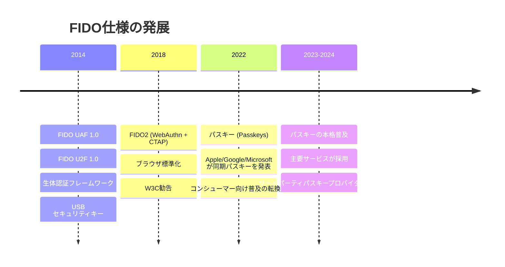
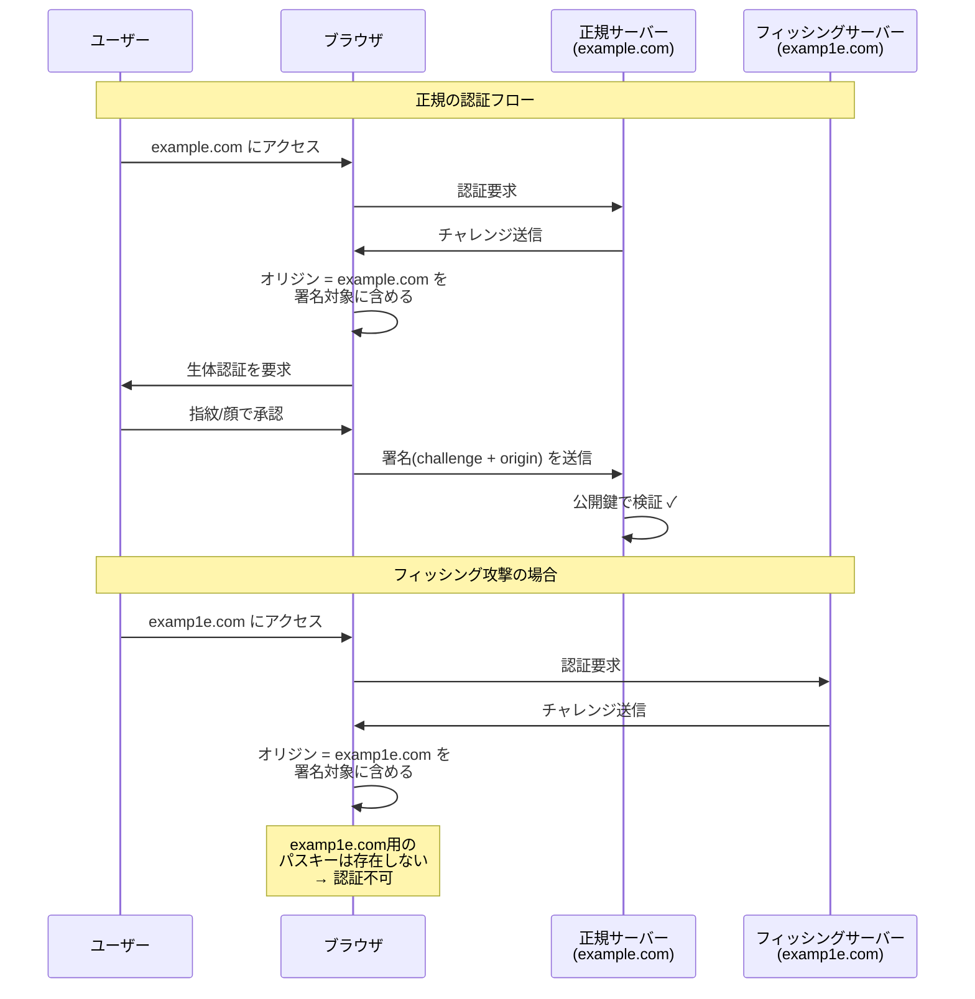
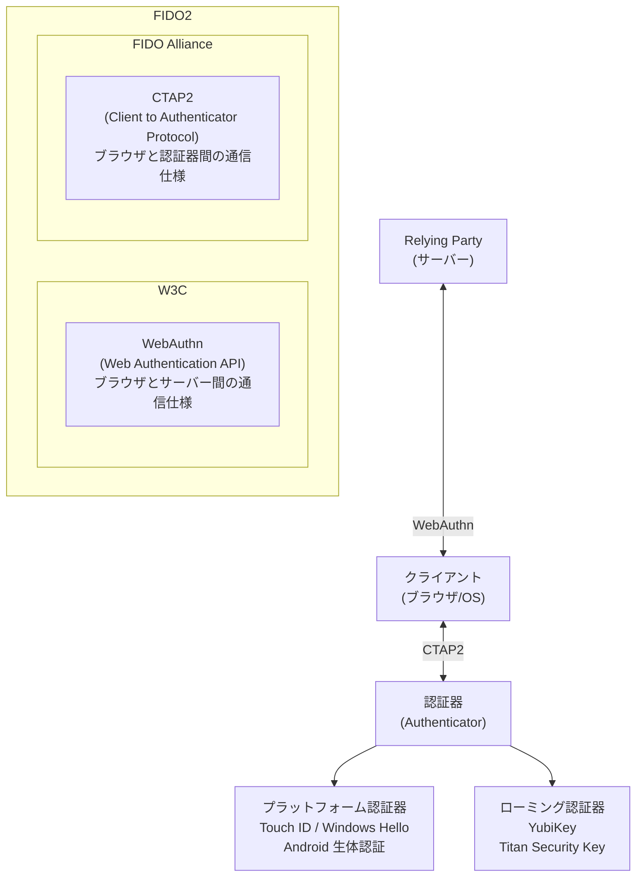
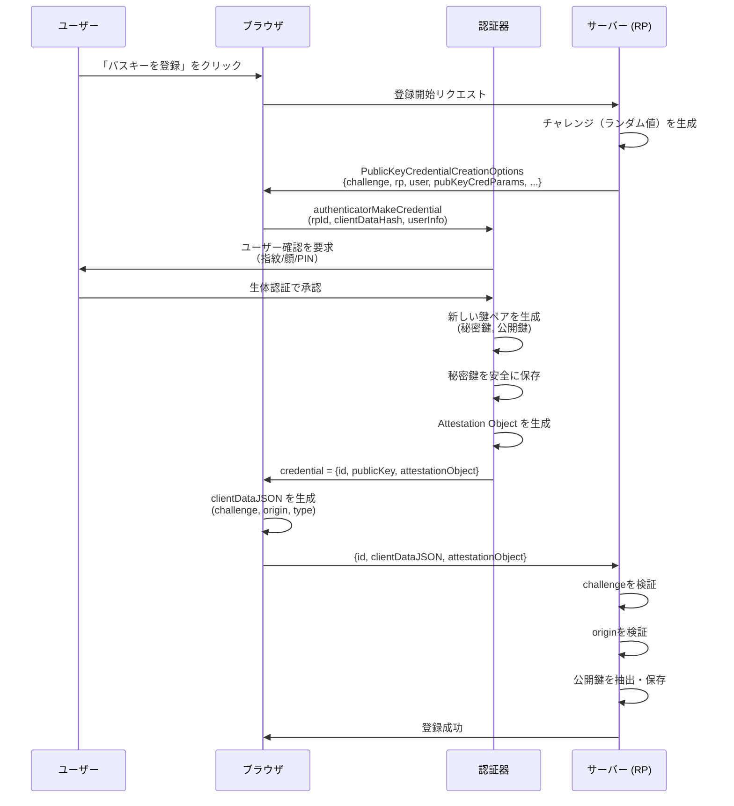
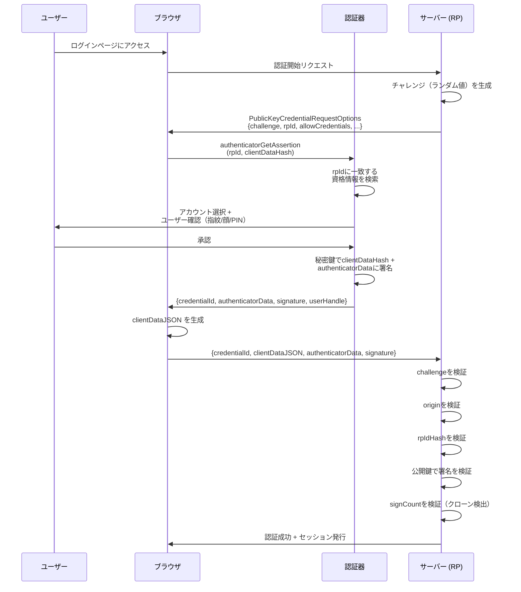
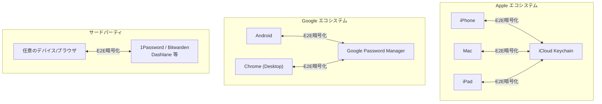
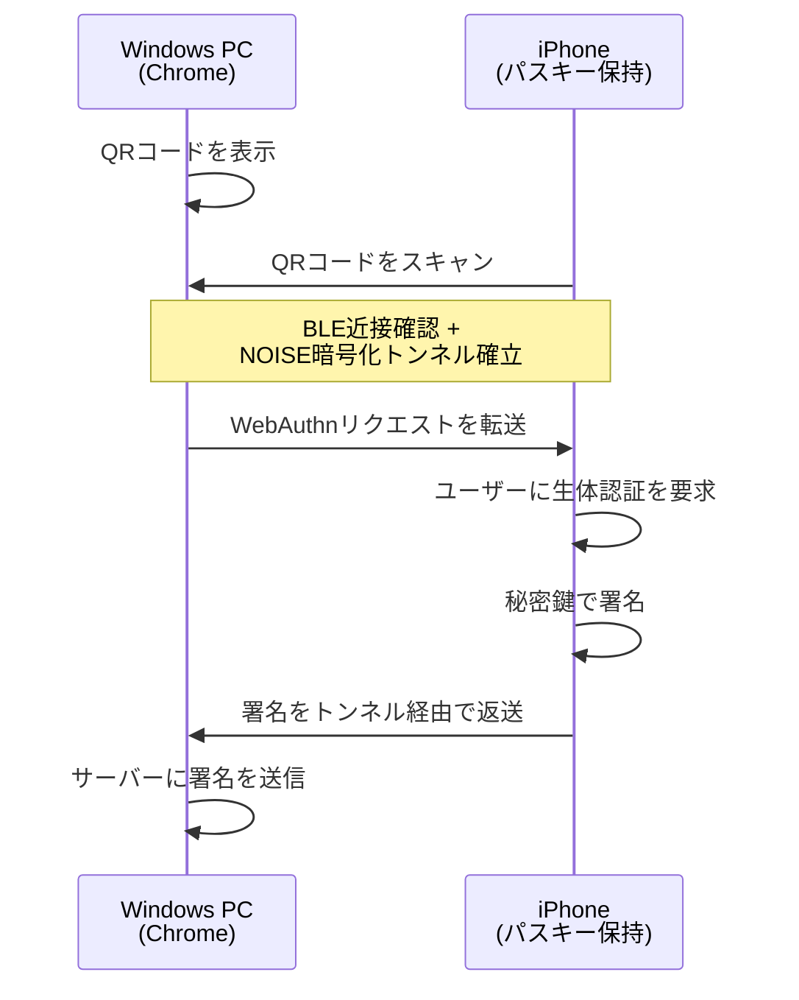
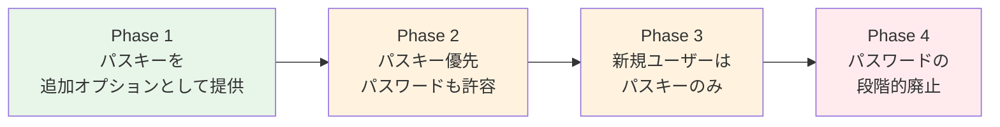

# パスキー（Passkeys）— パスワードレス認証の技術基盤と設計思想

## 1. パスワードの根本的な問題

### 1.1 なぜパスワードは破綻しているのか

パスワードは半世紀以上にわたりデジタル認証の中心であり続けてきた。1960年代のMITのCTSS（Compatible Time-Sharing System）で初めて導入されて以来、その基本的な仕組み——「秘密の文字列を知っていることで本人を証明する」——は変わっていない。しかし、現代のインターネット環境において、パスワードは構造的に破綻している。

**共有秘密の脆弱性**: パスワード認証は「共有秘密」モデルに基づく。ユーザーとサーバーの双方が同じ秘密（パスワードまたはそのハッシュ）を保持する。これはすなわち、サーバーが侵害された時点で秘密が漏洩することを意味する。サーバー側でハッシュ化（bcrypt, Argon2等）していたとしても、弱いパスワードは辞書攻撃やレインボーテーブルで解読されうる。

**フィッシングの本質的な問題**: パスワードは「人間が入力する知識情報」であるため、偽のログイン画面に誘導すれば容易に窃取できる。巧妙なフィッシングサイトを技術的に見分けるのは、セキュリティの専門家でさえ困難な場合がある。フィッシングはパスワードモデルに内在する脆弱性であり、ユーザー教育だけでは根本的に解決できない。

**パスワード再利用の蔓延**: 調査によれば、ユーザーの50%以上が複数のサービスで同じパスワードを使い回している。一つのサービスで漏洩したパスワードを使って別のサービスに不正アクセスする「クレデンシャルスタッフィング攻撃」は、現代のサイバー攻撃の主要なベクターの一つである。

**UXとセキュリティの相反**: 「長く」「複雑で」「サービスごとに異なる」パスワードを「定期的に変更する」ことを人間に要求するのは、認知的な負荷として非現実的である。パスワードマネージャーは有効な緩和策だが、普及率は依然として低い。

### 1.2 多要素認証の進化と限界

パスワードの弱点を補うために、多要素認証（MFA）が普及してきた。

```
認証の三要素:

+-------------------+  +-------------------+  +-------------------+
| 知識情報          |  | 所持情報          |  | 生体情報          |
| (Something you    |  | (Something you    |  | (Something you    |
|  know)            |  |  have)            |  |  are)             |
+-------------------+  +-------------------+  +-------------------+
| パスワード        |  | スマートフォン    |  | 指紋              |
| PIN               |  | セキュリティキー  |  | 顔                |
| 秘密の質問        |  | ICカード          |  | 虹彩              |
+-------------------+  +-------------------+  +-------------------+
```

しかし、従来のMFAにも問題がある:

- **SMS OTP（ワンタイムパスワード）**: SIMスワップ攻撃やSSシグナリング攻撃で傍受可能。リアルタイムフィッシングプロキシにも脆弱
- **TOTP（Time-based OTP）**: フィッシングサイトがリアルタイムでコードを中継すれば突破される。ユーザーが正しいサイトにコードを入力しているかを技術的に保証できない
- **プッシュ通知**: MFA疲労攻撃（MFA Fatigue Attack）により、大量の通知を送りつけてユーザーに誤って承認させる

これらの方式に共通する根本的な問題は、**認証情報がどのサーバーに送信されているかをユーザーや認証器が検証しない**という点である。フィッシングサイトが本物のサイトの前に立つ中間者（MITM）として機能する場合、多くのMFA方式は無力化される。

### 1.3 FIDO Allianceの設立とパスワードレスへの道

こうした課題を根本から解決するため、2012年にFIDO（Fast IDentity Online）Allianceが設立された。PayPal、Lenovo、Nok Nok Labs、Validity Sensors、Infineon、Agnitioの6社を創設メンバーとし、のちにGoogle、Microsoft、Apple、Amazon、Intel、Samsung、Visaなど主要テクノロジー企業が参加した。

FIDOの目標は明確である。「フィッシング耐性のある、公開鍵暗号に基づく認証の標準を策定し、パスワードを置き換える」こと。この目標に向けた技術仕様の発展は以下のように進んだ。



- **FIDO UAF（Universal Authentication Framework）**: 生体認証などによるパスワードレス認証のフレームワーク。主にモバイル向け
- **FIDO U2F（Universal 2nd Factor）**: パスワードに加えてセキュリティキーを使う二要素認証。YubiKeyなどのハードウェアキーがこの仕様に準拠
- **FIDO2**: UAFとU2Fの後継。W3CのWebAuthn仕様とFIDO AllianceのCTAP仕様の二つで構成される。ブラウザとOS標準の仕組みとして統合された

そして2022年、Apple、Google、Microsoftが共同で「パスキー（Passkeys）」を発表した。これはFIDO2の技術をベースに、資格情報のクラウド同期を加えることで、一般ユーザーにとっての利便性を飛躍的に向上させたものである。

## 2. パスキーの定義と核心原理

### 2.1 パスキーとは何か

パスキーとは、FIDO2/WebAuthn標準に基づく**公開鍵暗号ペアを用いた認証資格情報（credential）**である。従来のパスワードが「共有秘密」であるのに対し、パスキーは「非対称鍵ペア」を使う点が根本的に異なる。

核心的な原理を一言で言えば:

> **秘密鍵はユーザーの手元にだけ存在し、サーバーには公開鍵しか渡さない。認証はチャレンジ・レスポンス方式で行い、秘密鍵がデバイスの外に出ることはない。**

この単純な原理が、パスワードの構造的な問題を一挙に解決する。

```
パスワード認証:
  ユーザー  ----[パスワード]---->  サーバー
                                  サーバーも秘密を保持
                                  → 漏洩リスクあり

パスキー認証:
  ユーザー  ----[署名(challenge)]---->  サーバー
  (秘密鍵)                              (公開鍵のみ)
                                        → 公開鍵が漏洩しても無害
```

### 2.2 パスワードとの本質的な違い

| 観点 | パスワード | パスキー |
|------|-----------|---------|
| 認証モデル | 共有秘密 | 公開鍵暗号 |
| サーバーに保存される情報 | パスワードのハッシュ（秘密を含む） | 公開鍵（秘密を含まない） |
| フィッシング耐性 | なし | あり（オリジン検証） |
| ユーザーが覚える必要があるもの | パスワード文字列 | なし |
| サーバー侵害時の影響 | パスワードハッシュ漏洩 → クラック可能 | 公開鍵漏洩 → 無害 |
| 再利用の問題 | 蔓延している | サービスごとに一意の鍵ペア |
| 認証時にネットワークを流れる秘密情報 | パスワード自体（TLS内） | なし（署名のみ） |

### 2.3 フィッシング耐性の仕組み

パスキーが「フィッシング耐性がある」と言われる最も重要な理由は、**認証プロセスにWebサイトのオリジン（ドメイン）が暗号学的に結合されている**点にある。



ブラウザが署名対象にオリジン情報を自動的に含め、かつパスキー自体が特定のオリジンに紐づいているため、フィッシングサイトではパスキーが表示されない（もしくは一致しない）。ユーザーが騙されようとしても、技術的にフィッシングが成立しない。これは人間の判断力に依存しないセキュリティ境界であり、パスワードやOTPとは根本的に異なる。

## 3. 技術的基盤

### 3.1 FIDO2のアーキテクチャ

FIDO2は、二つの仕様の組み合わせで構成される。



**WebAuthn（Web Authentication API）**: W3Cが標準化したJavaScript APIであり、Webアプリケーション（Relying Party: RP）とブラウザ間のインターフェースを定義する。`navigator.credentials.create()` で資格情報を登録し、`navigator.credentials.get()` で認証を行う。

**CTAP2（Client to Authenticator Protocol 2）**: FIDO Allianceが策定した、クライアント（ブラウザ/OS）と認証器の間の通信プロトコル。USB、NFC、Bluetoothなどのトランスポート上で動作する。

### 3.2 認証器の種類

認証器は大きく二種類に分類される。

**プラットフォーム認証器（Platform Authenticator）**: デバイスに組み込まれた認証器。Touch ID、Face ID、Windows Hello、Android の生体認証がこれにあたる。ユーザーにとって最も自然な体験を提供するが、そのデバイスでしか使えないという制約がある（同期パスキーにより緩和、後述）。

**ローミング認証器（Roaming Authenticator）**: 外付けの認証器。YubiKeyやGoogle Titan Security Keyなどのハードウェアセキュリティキー。USB、NFC、BLEで接続する。複数デバイス間で持ち運べるが、紛失リスクがある。

### 3.3 Discoverable Credential（旧 Resident Key）

パスキーの実現にとって重要な概念が**Discoverable Credential**である。これは、認証器内に秘密鍵とともにRP IDやユーザー情報を保存する方式を指す。

従来のFIDO U2Fでは、サーバーが credential ID をクライアントに送信し、認証器はその ID を使って対応する秘密鍵を特定していた（Server-side Credential）。つまり、サーバーがまずユーザーを特定し、credential ID を提示する必要があった。

Discoverable Credentialでは、認証器自体がどのサービスのどのアカウント用の鍵であるかを記憶している。これにより、**ユーザー名の入力なしに認証が可能**になる。ブラウザがRP IDに基づいて認証器内の候補を表示し、ユーザーが選択するだけでよい。

```
Server-side Credential（従来）:
  1. ユーザーがユーザー名を入力
  2. サーバーがcredential IDを返す
  3. 認証器がcredential IDで秘密鍵を特定
  4. 署名を生成

Discoverable Credential（パスキー）:
  1. ブラウザがRP IDに基づいて認証器に問い合わせ
  2. 認証器が該当するすべての資格情報を返す
  3. ユーザーがアカウントを選択
  4. 署名を生成
  → ユーザー名の入力が不要
```

## 4. 登録と認証のフロー

### 4.1 登録（Registration / Attestation）

パスキーの登録は、ユーザーの認証器に新しい鍵ペアを生成し、公開鍵をサーバーに登録するプロセスである。



サーバーが送信する `PublicKeyCredentialCreationOptions` の主要なフィールド:

```javascript
const options = {
  challenge: new Uint8Array(32), // Cryptographically random
  rp: {
    name: "Example Corp",
    id: "example.com"      // RP ID: the effective domain
  },
  user: {
    id: new Uint8Array(16), // Opaque user handle (NOT username)
    name: "alice@example.com",
    displayName: "Alice"
  },
  pubKeyCredParams: [
    { alg: -7, type: "public-key" },   // ES256 (ECDSA w/ P-256)
    { alg: -257, type: "public-key" }  // RS256 (RSASSA-PKCS1-v1_5)
  ],
  authenticatorSelection: {
    authenticatorAttachment: "platform",   // or "cross-platform"
    residentKey: "required",               // Discoverable credential
    userVerification: "required"           // Biometric/PIN required
  },
  attestation: "none",  // "direct" for enterprise use cases
  timeout: 60000
};
```

ここで `rp.id` は重要な概念である。**RP ID**はサービスを識別するドメイン名であり、パスキーのフィッシング耐性の基盤となる。RP IDは現在のページのオリジンのドメインまたはそのregisterable domain suffix でなければならない。例えば `login.example.com` のページは `example.com` をRP IDとして使用できるが、`evil.com` をRP IDにすることはできない。

### 4.2 認証（Authentication / Assertion）



認証フローの重要なポイント:

1. **チャレンジ**: サーバーが生成するランダムな値。リプレイ攻撃を防止する。毎回異なる値が使われる
2. **clientDataJSON**: ブラウザが自動的に生成するJSON。`challenge`、`origin`、`type`（"webauthn.get"）を含む。**ブラウザがoriginを自動挿入する**ため、フィッシングサイトでは正規のoriginが設定されない
3. **authenticatorData**: 認証器が生成するバイナリデータ。RP IDのSHA-256ハッシュ、ユーザー確認フラグ、署名カウンターを含む
4. **署名**: `authenticatorData` と `clientDataHash`（clientDataJSONのSHA-256）を連結したものに対する、秘密鍵による署名

### 4.3 署名対象のデータ構造

署名の対象となるデータを詳しく見ると、フィッシング耐性の技術的な根拠が明確になる。

```
署名対象 = authenticatorData || SHA-256(clientDataJSON)

authenticatorData の構造:
+----------------------------------+---+---+----------+
| rpIdHash (32 bytes)              | F | SC| ...      |
| SHA-256("example.com")           |   |   |          |
+----------------------------------+---+---+----------+
  rpIdHash: RP IDのハッシュ          フラグ  署名カウンター

clientDataJSON の内容:
{
  "type": "webauthn.get",
  "challenge": "dGVzdC1jaGFsbGVuZ2U...",  ← サーバーが生成
  "origin": "https://example.com",         ← ブラウザが自動設定
  "crossOrigin": false
}
```

攻撃者がフィッシングサイト `https://examp1e.com` でパスキー認証を中継しようとしても:

- `clientDataJSON` の `origin` がブラウザによって `https://examp1e.com` に設定される
- サーバーは `origin` を検証し、`https://example.com` と一致しないため拒否する
- そもそも認証器は `examp1e.com` 用の資格情報を持っていないため、パスキーの候補が表示されない

この二重の防御により、フィッシング攻撃は構造的に不可能になる。

## 5. 同期パスキーとデバイス固定パスキー

### 5.1 パスキー普及の障壁だった問題

FIDO2/WebAuthnの技術自体は2018年から存在していたが、一般ユーザーへの普及には大きな障壁があった。**アカウントリカバリーの問題**である。

従来のFIDO認証では、秘密鍵はハードウェアセキュリティキーや特定デバイスのセキュアエレメントに保存され、エクスポートできない設計だった。これはセキュリティの観点では理想的だが、ユーザーにとっては:

- デバイスを紛失・故障した場合、アカウントにアクセスできなくなる
- 新しいデバイスへの移行が困難
- バックアップとして複数のセキュリティキーを登録する必要がある

この「鍵を失ったらおしまい」問題は、技術に詳しいユーザーでなければ許容しがたいリスクである。パスワードの方が「忘れてもリセットできる」分、ユーザーにとっては安心感がある。

### 5.2 同期パスキー（Synced Passkeys）の登場

2022年にApple、Google、Microsoftが発表した「パスキー」の革新は、**秘密鍵をクラウド経由でデバイス間で同期する**という決断にあった。



同期パスキーの仕組み:

1. ユーザーがデバイスAでパスキーを作成する
2. 秘密鍵がエンドツーエンド暗号化されてクラウド（iCloud Keychain、Google Password Manager等）にバックアップされる
3. 同じアカウントでサインインしているデバイスBにも秘密鍵が同期される
4. ユーザーはデバイスBでも同じパスキーで認証できる

### 5.3 デバイス固定パスキー（Device-bound Passkeys）

同期パスキーに対し、特定のハードウェアから秘密鍵がエクスポートされない従来型のパスキーを**デバイス固定パスキー**と呼ぶ。YubiKeyなどのハードウェアセキュリティキーがこれに該当する。

| 特性 | 同期パスキー | デバイス固定パスキー |
|------|------------|-------------------|
| 秘密鍵の保存場所 | クラウド同期（E2E暗号化） | ハードウェア内のみ |
| デバイス間の利用 | 可能（同一エコシステム内） | 不可（物理的に持ち運ぶ） |
| デバイス紛失時 | 他のデバイスで継続利用可能 | アクセス喪失のリスク |
| セキュリティ強度 | 高い（ただしクラウドアカウントに依存） | 最高（秘密鍵のエクスポート不可） |
| 適する場面 | 一般消費者向けサービス | 高セキュリティ要件（金融、政府等） |

### 5.4 同期パスキーのセキュリティに関する議論

同期パスキーには「秘密鍵がハードウェアの外に出る」というFIDO本来の設計思想からの逸脱がある。これに対するセキュリティコミュニティの議論は続いている。

**肯定派の主張**:
- パスワードよりも圧倒的に安全であり、完璧を求めるより普及を優先すべき
- エンドツーエンド暗号化により、クラウドプロバイダーでさえ秘密鍵にアクセスできない
- デバイス紛失によるアカウントロックアウトを防ぎ、ユーザビリティが劇的に向上する
- アカウントリカバリーフローの複雑さを解消し、結果として全体のセキュリティ態勢が改善する

**懐疑派の主張**:
- セキュリティの根拠がApple/Google/Microsoftのクラウドインフラの安全性に依存する
- 国家レベルの攻撃者がクラウドプロバイダーに令状を出した場合の懸念
- エンドツーエンド暗号化の実装の正しさを外部から完全には検証できない
- 企業環境では資格情報がユーザーの個人アカウントに同期されることが管理上の問題になる

現実的な評価としては、同期パスキーは**パスワードと比較すれば圧倒的に安全**であり、大多数のユーザーにとっては最適な選択肢である。最高レベルのセキュリティが求められる場面ではデバイス固定パスキーを使い分ける、という階層的なアプローチが合理的である。

### 5.5 クロスデバイス認証（Hybrid Transport）

異なるエコシステム間でのパスキー利用を可能にする仕組みとして、**Hybrid Transport**（旧称 caBLE: cloud-assisted BLE）がある。

例えば、WindowsのChromeでパスキーを求められた場合に、iPhoneのパスキーを使って認証するシナリオ:



この仕組みの特筆すべき点:

- **BLEによる近接確認**: QRコードだけでなくBLEを使って物理的な近接を確認するため、リモートからの中間者攻撃を防止する
- **NOISEプロトコル**: 通信はNOISEプロトコルフレームワークによるエンドツーエンド暗号化で保護される
- **秘密鍵は移動しない**: あくまで署名結果だけが転送され、秘密鍵自体はiPhoneの外に出ない

## 6. Attestationとメタデータ

### 6.1 Attestation（構成証明）

登録時にサーバーが受け取るデータには、オプションで**Attestation**が含まれる。Attestationは「この公開鍵が確かに特定の種類の認証器で生成された」ことを証明するための署名である。

```
Attestation の種類:

None        : Attestationなし。多くの一般消費者向けサービスで使用
Self        : 生成した鍵自身で自己署名。認証器の種類は証明されない
Packed      : FIDO定義のAttestationフォーマット。認証器ベンダーの証明書で署名
TPM         : TPM 2.0仕様に基づくAttestation
Android Key : Android Keystoreに基づくAttestation
Apple       : Apple App Attestation
```

一般消費者向けのサービスでは `attestation: "none"` が推奨される。Attestationを要求すると、ユーザーに追加の同意プロンプトが表示される場合があり、UXが悪化する。また、Attestation証明書のメンテナンス負荷も発生する。

企業やセキュリティ要件の高い環境では、Attestationによって使用が許可される認証器を制限できる。例えば「FIPS 140-2 Level 2以上の認証器のみ許可」といったポリシーを実現できる。

### 6.2 FIDO Metadata Service（MDS）

FIDO Allianceは**Metadata Service（MDS）**を運営しており、認証器の種類、セキュリティ特性、既知の脆弱性などの情報を提供している。Relying Partyはこのメタデータを参照して、特定の認証器を信頼するかどうかの判断に利用できる。

## 7. WebAuthn APIの実装詳細

### 7.1 登録の実装

```javascript
// Server-side: generate registration options
// (Using a library like SimpleWebAuthn is recommended)

// Client-side: create credential
async function registerPasskey() {
  const optionsResponse = await fetch("/api/webauthn/register/options", {
    method: "POST",
  });
  const options = await optionsResponse.json();

  // Decode Base64URL-encoded values
  options.challenge = base64URLToBuffer(options.challenge);
  options.user.id = base64URLToBuffer(options.user.id);

  // Call WebAuthn API
  const credential = await navigator.credentials.create({
    publicKey: options,
  });

  // Send credential to server for verification and storage
  const verifyResponse = await fetch("/api/webauthn/register/verify", {
    method: "POST",
    headers: { "Content-Type": "application/json" },
    body: JSON.stringify({
      id: credential.id,
      rawId: bufferToBase64URL(credential.rawId),
      type: credential.type,
      response: {
        attestationObject: bufferToBase64URL(
          credential.response.attestationObject
        ),
        clientDataJSON: bufferToBase64URL(credential.response.clientDataJSON),
      },
    }),
  });
}
```

### 7.2 認証の実装

```javascript
// Client-side: authenticate with passkey
async function authenticateWithPasskey() {
  const optionsResponse = await fetch("/api/webauthn/authenticate/options", {
    method: "POST",
  });
  const options = await optionsResponse.json();

  options.challenge = base64URLToBuffer(options.challenge);

  // allowCredentials may be empty for discoverable credentials
  if (options.allowCredentials) {
    options.allowCredentials = options.allowCredentials.map((cred) => ({
      ...cred,
      id: base64URLToBuffer(cred.id),
    }));
  }

  // Call WebAuthn API
  const assertion = await navigator.credentials.get({
    publicKey: options,
  });

  // Send assertion to server for verification
  const verifyResponse = await fetch("/api/webauthn/authenticate/verify", {
    method: "POST",
    headers: { "Content-Type": "application/json" },
    body: JSON.stringify({
      id: assertion.id,
      rawId: bufferToBase64URL(assertion.rawId),
      type: assertion.type,
      response: {
        authenticatorData: bufferToBase64URL(
          assertion.response.authenticatorData
        ),
        clientDataJSON: bufferToBase64URL(assertion.response.clientDataJSON),
        signature: bufferToBase64URL(assertion.response.signature),
        userHandle: assertion.response.userHandle
          ? bufferToBase64URL(assertion.response.userHandle)
          : null,
      },
    }),
  });
}
```

### 7.3 サーバー側の検証

サーバー側での検証は慎重に行う必要がある。多くのライブラリがこの処理を抽象化しているが、内部で行われている検証のステップを理解しておくことは重要である。

```
登録時の検証手順:
  1. clientDataJSON をデコードし、type が "webauthn.create" であることを確認
  2. challenge がサーバーが発行したものと一致することを確認
  3. origin が期待するオリジンと一致することを確認
  4. attestationObject をCBORデコード
  5. authenticatorData の rpIdHash がRP IDのSHA-256と一致することを確認
  6. ユーザー確認フラグ（UV）が要件を満たすことを確認
  7. 公開鍵を抽出し、credential ID とともにデータベースに保存
  8. (任意) Attestation署名を検証

認証時の検証手順:
  1. clientDataJSON をデコードし、type が "webauthn.get" であることを確認
  2. challenge が一致することを確認
  3. origin が一致することを確認
  4. authenticatorData の rpIdHash が一致することを確認
  5. ユーザー確認フラグ（UV）を確認
  6. 保存済み公開鍵で signature を検証
  7. signCount が前回より増加していることを確認（クローン検出）
  8. (任意) userHandle でユーザーを特定
```

### 7.4 代表的なサーバーサイドライブラリ

| 言語 | ライブラリ | 備考 |
|------|-----------|------|
| Node.js | `@simplewebauthn/server` | 最も広く使われている。登録・認証のヘルパーが充実 |
| Python | `py_webauthn` | Pythonでの実装に推奨 |
| Go | `go-webauthn/webauthn` | 旧 `duo-labs/webauthn` の後継 |
| Java | `webauthn4j` | Spring Securityとの統合が良好 |
| Ruby | `webauthn-ruby` | Deviseとの統合gem（`devise-passkeys`）もあり |
| .NET | `Fido2NetLib` | ASP.NET Coreとの統合 |

## 8. Conditional UI（パスキーの自動提示）

### 8.1 Autofillによるパスキー提示

Conditional UI（条件付きUI）は、パスワードマネージャーのオートフィルUIにパスキーの選択肢を統合する仕組みである。これにより、ユーザーは既存のログインフォームで自然にパスキーを選択できる。

```
従来のWebAuthn UI:
  1. 「パスキーでログイン」ボタンをクリック
  2. ブラウザのモーダルダイアログが表示
  3. パスキーを選択
  4. 生体認証

Conditional UI:
  1. ユーザー名フィールドにフォーカス
  2. オートフィルのドロップダウンにパスキーが表示される
     ┌─────────────────────────┐
     │ 🔑 alice@example.com   │  ← パスキー
     │ 👤 alice (password)     │  ← 保存済みパスワード
     │ 👤 bob (password)       │
     └─────────────────────────┘
  3. パスキーを選択
  4. 生体認証
```

実装はシンプルで、`navigator.credentials.get()` に `mediation: "conditional"` を指定する:

```javascript
// Check if Conditional UI is supported
if (
  window.PublicKeyCredential &&
  PublicKeyCredential.isConditionalMediationAvailable
) {
  const available =
    await PublicKeyCredential.isConditionalMediationAvailable();

  if (available) {
    const assertion = await navigator.credentials.get({
      publicKey: {
        challenge: challengeFromServer,
        rpId: "example.com",
        // allowCredentials is typically empty for conditional UI
      },
      mediation: "conditional",
    });
    // Process assertion...
  }
}
```

HTML側では、input要素に `autocomplete="username webauthn"` を追加する:

```html
<input type="text" name="username" autocomplete="username webauthn" />
```

Conditional UIにより、パスキーとパスワードの共存期間における移行がスムーズになる。ユーザーはログインフォームの操作を変える必要がなく、オートフィルからパスキーを選ぶだけでよい。

## 9. パスキーの導入戦略

### 9.1 段階的な移行パス

パスワードからパスキーへの移行は一夜にしては実現できない。現実的には以下のような段階的アプローチが推奨される。



**Phase 1**: 既存のパスワード認証に加えて、パスキーを登録・使用するオプションを追加する。パスワードは引き続き有効。

**Phase 2**: ログインUIでパスキーを優先的に表示する（Conditional UI）。パスキー登録済みユーザーにはパスキーでのログインを促す。

**Phase 3**: 新規ユーザー登録時にパスキーをデフォルトとする。パスワード設定はオプションまたは非推奨に。

**Phase 4**: パスワード認証を段階的に廃止する。ただし、パスキー非対応のレガシー環境向けにフォールバック手段は維持する必要がある。

### 9.2 アカウントリカバリー

パスキーの導入において最も慎重に設計すべきなのが、アカウントリカバリーの仕組みである。

同期パスキーはデバイス紛失のリスクを大幅に軽減するが、クラウドアカウント自体にアクセスできなくなるシナリオは依然として存在する。以下のようなリカバリー手段を組み合わせる:

- **複数のパスキーの登録**: 異なるデバイス/エコシステムで複数のパスキーを登録しておく
- **リカバリーコード**: ワンタイムのリカバリーコードを発行し、安全に保管してもらう
- **バックアップメール/電話番号**: 本人確認のためのセカンダリチャネル
- **カスタマーサポートによる身元確認**: 最終手段としての人的プロセス

重要なのは、リカバリー手段自体がフィッシングに脆弱であってはならないということである。せっかくパスキーでフィッシング耐性を実現しても、リカバリーフローがSMS OTPに依存していれば、攻撃者はリカバリーフローを狙う。

## 10. パスキーの現状と課題

### 10.1 対応状況（2025-2026年時点）

パスキーの対応状況は急速に広がっている:

**プラットフォーム対応**:
- **Apple**: iOS 16+, macOS Ventura+, Safari 16+。iCloud Keychainで同期
- **Google**: Android 9+, Chrome 108+。Google Password Managerで同期
- **Microsoft**: Windows 10/11, Edge。Windows Helloがプラットフォーム認証器として機能
- **サードパーティ**: 1Password、Bitwarden、Dashlane、Enpassなどがパスキープロバイダーとして対応

**サービス対応**:
- Google、Apple、Microsoft、Amazon、GitHub、PayPal、Shopify、Nintendo、Sony、Adobe、WhatsApp、TikTok、X（旧Twitter）、LinkedIn、Uber、Kayak等、多くの主要サービスが対応済み

### 10.2 現在の課題

**エコシステムのロックイン**: Apple、Google、Microsoftの各エコシステム間でのパスキーの移行（エクスポート/インポート）は、FIDO Allianceが標準化を進めているCredential Exchange Protocol（CXP）とCredential Exchange Format（CXF）によって改善されつつある。しかし、完全にシームレスなクロスプラットフォーム移行はまだ発展途上である。

**エンタープライズ管理**: 企業環境では、従業員の個人Apple/Googleアカウントにパスキーが同期されることが管理上の問題となる。デバイス固定パスキーの強制、MDM（Mobile Device Management）との統合、組織の認証ポリシーの適用といったエンタープライズ向けの管理機能は、各プラットフォームで段階的に整備されている。

**レガシーブラウザ/OS**: WebAuthn未対応の古いブラウザやOSを使用しているユーザーは引き続き存在する。完全なパスキー移行には、フォールバック手段の維持が一定期間必要である。

**ユーザーの理解**: 「パスキー」という概念がまだ一般ユーザーに十分に浸透していない。「指紋でログインする」という体験は直感的だが、「パスキーとは何か」を説明するのは容易ではない。ユーザー教育とUXの工夫が引き続き必要である。

**共有デバイスの問題**: 家族や職場で一つのデバイスを共有する場合、デバイス上のすべてのパスキーが全ユーザーからアクセス可能になるリスクがある。プラットフォーム認証器のユーザー分離が必要だが、現状では十分に対応されていない場面がある。

## 11. パスワード・JWT・パスキーの関係

パスキーはパスワードを置き換えるものだが、JWTのようなトークンベースの認証と直接競合するものではない。むしろ、これらは異なるレイヤーで補完的に機能する。

```
認証レイヤーの整理:

+----------------------------------------------------------+
| ユーザーの本人確認（一次認証）                              |
|                                                          |
|  パスワード ← パスキーが置き換えようとしている              |
|  パスキー   ← フィッシング耐性のある一次認証               |
+----------------------------------------------------------+
                      ↓ 認証成功
+----------------------------------------------------------+
| セッション/トークン管理                                    |
|                                                          |
|  サーバーサイドセッション                                  |
|  JWT (アクセストークン)                                   |
|  ← 認証後のセッション維持に使用。一次認証の方式に依存しない  |
+----------------------------------------------------------+
                      ↓ リクエストごと
+----------------------------------------------------------+
| APIアクセス制御                                           |
|                                                          |
|  Bearer Token / JWT / セッションCookieで認可             |
+----------------------------------------------------------+
```

つまり:
- **パスキー**: 「あなたは本当にAliceですか？」に答える（認証）
- **JWT/セッション**: 「Aliceは認証済みである」という事実を後続のリクエストで伝達する（セッション維持）

パスキーで認証した後にJWTを発行する、というフローは完全に合理的であり、実際に多くのサービスがこのパターンを採用している。

## 12. 将来展望

### 12.1 パスワードの終焉は来るのか

パスキーはパスワード置き換えの最も有力な候補であるが、パスワードが完全に消滅するまでには長い時間がかかるだろう。レガシーシステム、パスキー非対応環境、ユーザーの慣性、そしてパスキー自体の課題（エコシステムのロックイン、共有デバイス問題等）が障壁として残る。

しかし、Apple、Google、Microsoftという三大プラットフォームが足並みを揃えてパスキーを推進しているという事実は、過去のどのパスワードレス技術にもなかった強力な推進力である。FIDO U2Fがセキュリティキー愛好家のニッチな技術にとどまっていたのに対し、パスキーはOSレベルで統合され、ユーザーが意識せずとも利用できる体験を提供しつつある。

### 12.2 技術的な発展方向

**Credential Exchange Protocol/Format（CXP/CXF）**: FIDO Allianceが策定中の、パスキーのエクスポート/インポート標準。これが完成すれば、AppleからGoogleへの移行、あるいはパスワードマネージャー間の移行が標準化される。

**PRF拡張（Pseudo-Random Function）**: WebAuthnのPRF拡張により、パスキーの認証と同時に暗号鍵を導出する機能が利用可能になる。エンドツーエンド暗号化のための鍵管理にパスキーを活用する道が開かれる。

**Linked Device認証の改善**: クロスデバイス認証（Hybrid Transport）の改善により、エコシステムをまたいだパスキー利用の体験がさらに向上していく。

### 12.3 パスキーが成功するための条件

パスキーが本当にパスワードを置き換えるためには、以下の条件が満たされる必要がある:

1. **ユーザー体験がパスワードより明確に優れていること**: これは既にほぼ達成されている。指紋一つでログインできる体験は、パスワードの入力より圧倒的に快適である
2. **アカウントリカバリーが安全かつ容易であること**: 同期パスキーにより大幅に改善されたが、まだ完全ではない
3. **エコシステム間の相互運用性が確保されること**: CXP/CXFの標準化と実装が鍵を握る
4. **すべてのプラットフォームで一貫した体験が提供されること**: OS、ブラウザ、デバイスの組み合わせによる体験のばらつきを最小化する必要がある

## 13. まとめ

パスキーは、パスワードの構造的な問題——共有秘密モデルの脆弱性、フィッシングへの脆弱性、ユーザー負荷の高さ——を、公開鍵暗号に基づくチャレンジ・レスポンス認証で根本的に解決しようとする技術である。

その技術的核心は:
- **公開鍵暗号**: 秘密鍵はユーザーの手元にのみ存在し、サーバーには公開鍵だけを保存する
- **オリジンバインディング**: 認証プロセスにWebサイトのドメインが暗号学的に結合され、フィッシングを構造的に不可能にする
- **ユーザー確認**: 生体認証やPINによるローカルな本人確認を統合し、二要素認証をワンステップで実現する
- **同期パスキー**: 秘密鍵のクラウド同期により、デバイス紛失時のリカバリーとマルチデバイス利用を実現する

パスキーはパスワード認証の問題を解決するが、JWTなどのトークンベースのセッション管理とは異なるレイヤーで機能し、互いに補完的である。

パスワードが半世紀かけて築いたエコシステムを置き換えるのは容易ではない。しかし、Apple、Google、Microsoftの三社が共同で推進し、FIDO Allianceが標準化を主導するパスキーは、過去のどのパスワードレス技術よりも成功に近い位置にある。セキュリティとユーザビリティの両立という、長年「二律背反」と考えられてきた課題に対する、現時点で最も説得力のある回答がパスキーである。
