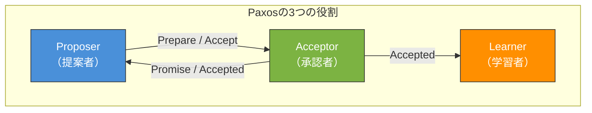
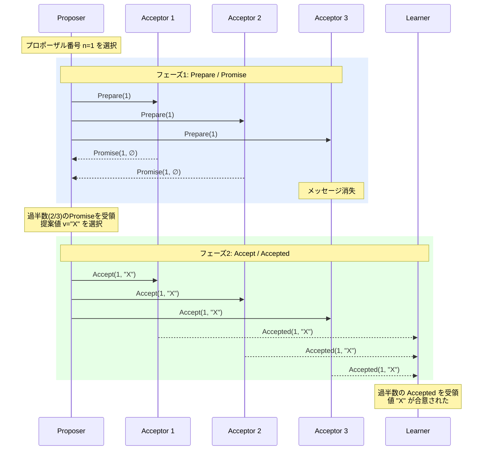
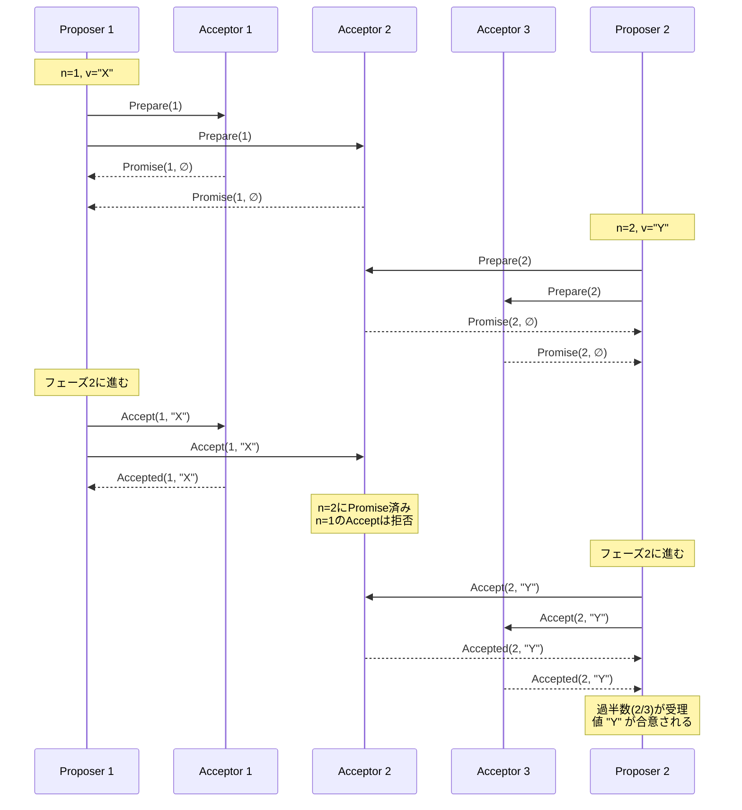
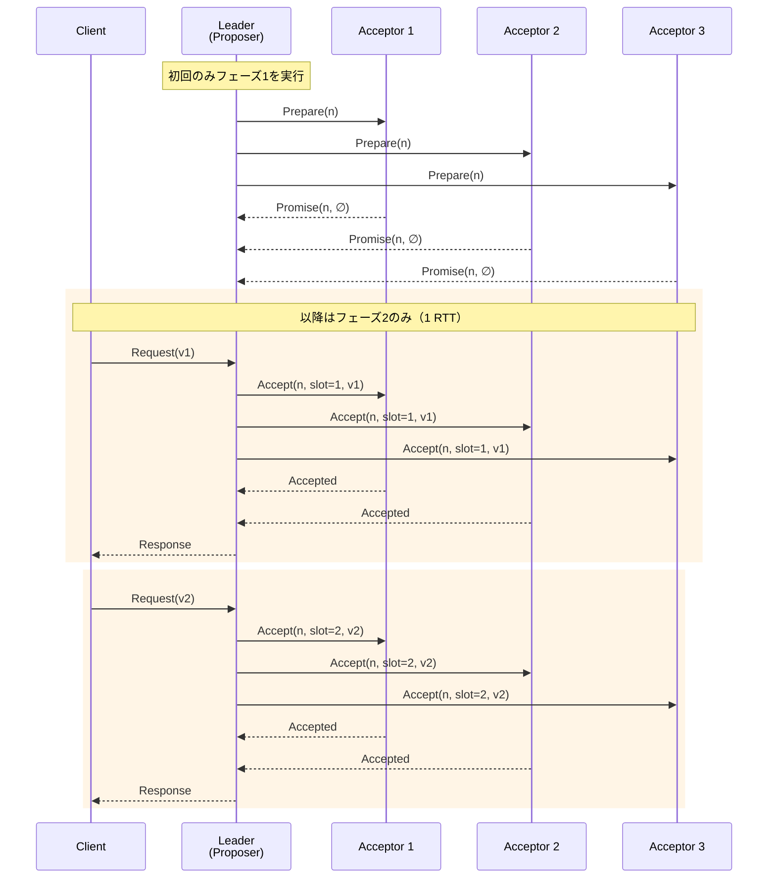

# Paxos — 分散合意アルゴリズムの原点

## 1. はじめに：Paxosとは何か

分散システムにおいて、複数のノードが**ひとつの値について合意する**ことは、一見すると単純な問題に見える。しかし、ネットワークの遅延、メッセージの消失、ノードの障害が発生しうる環境では、この「合意（Consensus）」の達成は驚くほど困難な課題となる。

Paxosは、Leslie Lamportが1989年に発表した分散合意アルゴリズムであり、非同期ネットワーク上で障害が発生しうる環境においても、**安全性（Safety）を保証しつつ合意に到達する**ための手法を提供する。Paxosが解決する根本的な問題は以下のとおりである。

> 複数のプロセスが提案する値の中から、**たかだかひとつの値が選択され**、選択された値は全プロセスに学習される。このプロセスの過半数が正常に動作している限り、最終的に合意が成立する。

Paxosは分散合意アルゴリズムの「原典」ともいうべき存在であり、Chubby（Google）、Spanner（Google）、Megastore、Apache ZooKeeperの基盤であるZABなど、数多くの分散システムの設計に直接的・間接的な影響を与えてきた。本記事では、Paxosの歴史的背景から基本プロトコル、拡張手法、そして実装上の課題まで、包括的に解説する。

## 2. 歴史的背景

### Lamportの「パートタイム議会」

Paxosの名前は、ギリシャのパクソス島（Paxos島）に由来する。Lamportは1989年に、この島の架空の議会制度に喩えてアルゴリズムを記述した論文「The Part-Time Parliament」を執筆した。議員たちが常に議場にいるわけではない（パートタイムで参加する）状況下で、いかにして法令（合意）を成立させるか、という比喩を用いた。

しかし、この論文のスタイルは学術界から理解されにくく、当初は出版が大幅に遅れた。論文が最終的にACM Transactions on Computer Systems（TOCS）に掲載されたのは1998年のことである。

### 2001年の「Paxos Made Simple」

論文の難解さに対する批判を受けて、Lamportは2001年に「Paxos Made Simple」という簡潔な再説明を発表した。この文書の冒頭には、有名な一文がある。

> "The Paxos algorithm, when presented in plain English, is very simple."
> （Paxosアルゴリズムを平易な英語で説明すれば、非常にシンプルである。）

この再説明は、Paxosの核心を抽出し、比喩を排して直接的にアルゴリズムを記述したものであり、以降のPaxos理解の標準的な参考文献となった。

### FLPの不可能性定理との関係

分散合意の理論的基盤として重要なのが、Fischer, Lynch, Patersonによる**FLP不可能性定理**（1985年）である。この定理は以下を述べる。

> 非同期システムにおいて、**1つのプロセスが故障しうる場合**、決定的な合意アルゴリズムは存在しない。

Paxosはこの不可能性定理と矛盾しない。Paxosは**安全性（Safety）は常に保証する**が、**活性（Liveness）は保証しない**。すなわち、特定の障害パターン下では合意が永遠に成立しない可能性がある（ただし、実用的にはリーダー選出などの追加メカニズムで対処する）。

## 3. システムモデルと前提条件

Paxosは以下のシステムモデルを前提とする。

### プロセスモデル

- **クラッシュ故障モデル**: プロセスはクラッシュしうるが、ビザンチン障害（嘘をつく、改ざんする）は起こさない
- **永続ストレージ**: プロセスはクラッシュ後に再起動でき、クラッシュ前の状態を永続ストレージから回復できる
- **プロセス数**: $n$ 個のプロセスのうち、$f$ 個がクラッシュしても合意が成立する（$n \geq 2f + 1$）

### ネットワークモデル

- **非同期ネットワーク**: メッセージの配送に上限時間の保証がない
- **メッセージの信頼性**: メッセージは失われる、重複する、順序が入れ替わることがある。ただし、改ざんはされない
- **最終的な配送**: メッセージが十分に再送されれば、最終的には届く

### 三つの役割

Paxosには以下の3つの論理的な役割がある。実際のシステムでは、ひとつのプロセスが複数の役割を兼任することが一般的である。



| 役割 | 責務 |
|------|------|
| **Proposer** | 値を提案し、Acceptorに受理を求める |
| **Acceptor** | 提案を受け取り、条件に基づいて受理または拒否する。合意の「投票者」 |
| **Learner** | 合意が成立した値を学習する。結果の利用者 |

## 4. Basic Paxos

Basic Paxosは、**ひとつの値についての合意**を達成するためのプロトコルである。プロトコルは2つのフェーズから構成される。

### 4.1 プロポーザル番号

各提案には、グローバルに一意な**プロポーザル番号**（proposal number）が付与される。プロポーザル番号は全順序を持つ必要がある。一般的な実装では、`(シーケンス番号, プロセスID)` のペアを用いて一意性と順序を保証する。

$$n = (\text{round}, \text{proposer\_id})$$

番号の比較はまずroundで行い、同一roundの場合はproposer\_idで比較する。

### 4.2 フェーズ1: Prepare / Promise

**Proposerの動作（Prepare）:**

1. Proposerは新しいプロポーザル番号 $n$ を選択する
2. Acceptorの過半数（quorum）に `Prepare(n)` メッセージを送信する

**Acceptorの動作（Promise）:**

Acceptorが `Prepare(n)` を受け取ったとき：

- $n$ がこれまで応答したどのPrepareよりも大きい場合：
  - $n$ 未満の番号を持つ提案にはもう応答しないと**約束（Promise）**する
  - もし以前にAcceptした提案があれば、その中で最大番号の提案 $(n_a, v_a)$ を返す
  - 以前にAcceptした提案がなければ、値なしでPromiseを返す
- $n$ がこれまでのPrepare以下の場合：
  - メッセージを無視する（またはNACKを返す）

### 4.3 フェーズ2: Accept / Accepted

**Proposerの動作（Accept）:**

Proposerが過半数のAcceptorからPromise応答を受け取った場合：

1. 返されたPromiseの中にAccept済みの値がある場合、最も高いプロポーザル番号に紐づく値 $v$ を選択する
2. Accept済みの値がない場合、Proposer自身が提案したい値 $v$ を選択する
3. `Accept(n, v)` メッセージを過半数のAcceptorに送信する

**Acceptorの動作（Accepted）:**

Acceptorが `Accept(n, v)` を受け取ったとき：

- $n$ 以上のPrepareに対してPromiseしていない場合（つまり、$n$ がこれまでPromiseした最大の番号以上である場合）：
  - 提案 $(n, v)$ を**受理（Accept）**する
  - `Accepted(n, v)` をLearnerに通知する
- それ以外の場合：
  - メッセージを無視する

### 4.4 値の学習

Learnerは、過半数のAcceptorから同じプロポーザル番号についての `Accepted` メッセージを受け取ったとき、その値が合意されたと判断する。

### 4.5 Basic Paxosの全体フロー



### 4.6 競合発生時のシナリオ

複数のProposerが同時に提案を行うと、競合が発生する。以下のシナリオを考える。



この例では、Proposer 1の提案はAcceptor 2に拒否される（より高い番号のPrepareにPromise済みのため）。Proposer 1は過半数の受理を得られないため、より高い番号で再試行する必要がある。

## 5. 安全性と活性の証明概要

### 5.1 安全性（Safety）

Paxosの安全性は以下の3つの性質で定義される。

**性質1: 非自明性（Non-triviality）**
選択された値は、いずれかのプロセスが提案した値でなければならない。

**性質2: 一貫性（Consistency / Agreement）**
最大でひとつの値のみが選択される。すなわち、異なる2つの値が同時に選択されることはない。

**性質3: 学習の正確性（Learning accuracy）**
プロセスが値を学習した場合、その値は実際に選択された値である。

### 安全性の証明スケッチ

一貫性の証明の核心は以下のとおりである。

**定理**: プロポーザル番号 $m$ で値 $v$ が選択された場合、番号 $n > m$ を持つ任意の提案の値も $v$ である。

**証明の要点**（数学的帰納法による）:

1. 値 $v$ がプロポーザル番号 $m$ で選択されたとすると、過半数のAcceptorが $(m, v)$ を受理している
2. 番号 $n > m$ のProposerがフェーズ1を実行すると、過半数のAcceptorからPromiseを受け取る
3. **任意の2つの過半数集合は少なくとも1つの共通要素を持つ**（Quorum Intersection Property）
4. したがって、番号 $n$ のProposerが受け取るPromiseの中には、$(m, v)$ を受理したAcceptorが少なくとも1つ含まれる
5. フェーズ2のルールにより、Proposerは受け取ったPromiseの中で最大番号に紐づく値を採用する
6. 帰納法により、$m$ 以降のすべての提案の値が $v$ であることが示される

この「Quorum Intersection」がPaxosの安全性保証の根幹である。

$$|Q_1| > \frac{n}{2} \wedge |Q_2| > \frac{n}{2} \implies Q_1 \cap Q_2 \neq \emptyset$$

### 5.2 活性（Liveness）

Paxosは活性を**保証しない**。以下の「デュエリング・プロポーザー」シナリオが活性の欠如を示す。

1. Proposer Aがプロポーザル番号 $n_1$ でPrepareを送り、過半数のPromiseを得る
2. Proposer Bがプロポーザル番号 $n_2 > n_1$ でPrepareを送り、過半数のPromiseを得る
3. Proposer Aの `Accept(n_1, ...)` は拒否される
4. Proposer Aが $n_3 > n_2$ でPrepareを送り、過半数のPromiseを得る
5. Proposer Bの `Accept(n_2, ...)` は拒否される
6. 以下、無限に繰り返される可能性がある

この問題は**ライブロック**と呼ばれる。実用的には、ランダムバックオフやリーダー選出によって回避する。

## 6. Multi-Paxos

### 6.1 Basic Paxosの限界

Basic Paxosは単一の値についての合意を扱う。しかし、実際の分散システムでは、**一連の値（ログエントリ）**について繰り返し合意を形成する必要がある。各合意を独立したBasic Paxosインスタンスとして実行すると、2回のラウンドトリップ（Prepare + Accept）が毎回必要となり、性能が問題となる。

### 6.2 Multi-Paxosの最適化

Multi-Paxosは、**安定したリーダー**（Distinguished Proposer）を選出し、フェーズ1を省略することでスループットを大幅に向上させる。

**安定リーダーの動作:**

1. リーダーが一度フェーズ1を実行し、高いプロポーザル番号で全Acceptorから包括的なPromiseを得る
2. 以降のリクエストでは、フェーズ1を省略し、フェーズ2（Accept/Accepted）のみを実行する
3. リーダーの障害が検出された場合、新たなリーダーがフェーズ1から実行を開始する



### 6.3 ログの穴（Gap）とスロット管理

Multi-Paxosでは、各合意がログの「スロット」に対応する。リーダー交代時にログに「穴」が生じることがある。新リーダーはフェーズ1を実行し、各スロットの状態を確認して穴を埋める必要がある。

| スロット | 状態 | 処理 |
|----------|------|------|
| 1 | Accepted (v="A") | そのまま確定 |
| 2 | Accepted (v="B") | そのまま確定 |
| 3 | 空（未決定） | no-op で穴埋め |
| 4 | Accepted (v="C") | そのまま確定 |

## 7. Paxosの変種

### 7.1 Fast Paxos

Lamportが2006年に提案したFast Paxosは、クライアントが直接Acceptorに提案を送ることで、リーダーを経由する際の1 RTTを省略しようとする変種である。

**特徴:**
- 通常ケースで2 RTT → 1 RTT に削減
- 競合が発生した場合はリーダーが介入し、Classic Paxosにフォールバック
- 必要なAcceptor数が増加する（$n \geq 3f + 1$ ではなく、Fast Quorumには $\lceil \frac{3n}{4} \rceil$ 以上のAcceptorが必要）

**トレードオフ:**
- 競合が少ない場合に有効
- 競合が多い場合は Classic Paxos よりもオーバーヘッドが増大
- 実装が複雑化する

### 7.2 Flexible Paxos（FPaxos）

Heidi Howardらが2016年に提案したFlexible Paxosは、Paxosのクォーラム要件を緩和する重要な洞察を提供した。

**核心的洞察:**
Classic Paxosでは、フェーズ1のクォーラム（$Q_1$）とフェーズ2のクォーラム（$Q_2$）の両方が過半数であることを要求するが、実際に安全性に必要なのは**$Q_1$ と $Q_2$ が交差すること**のみである。

$$Q_1 + Q_2 > n$$

この緩和により、例えば以下のような設定が可能になる。

| $n$ | $Q_1$（Prepare） | $Q_2$（Accept） | 利点 |
|-----|-------------------|------------------|------|
| 5 | 4 | 2 | 書き込みレイテンシ削減 |
| 5 | 2 | 4 | 読み込み最適化 |
| 5 | 3 | 3 | Classic Paxos（従来） |

Multi-Paxosではフェーズ1はリーダー交代時のみ実行されるため、$Q_1$ を大きくして $Q_2$ を小さくすることで、定常状態のスループットを向上させられる。

### 7.3 Egalitarian Paxos（EPaxos）

Moraru, Andersen, Dahlinが2013年に提案したEPaxosは、リーダーレスの合意プロトコルである。

**特徴:**
- **リーダー不要**: どのレプリカもコマンドを受理できる
- **依存関係の追跡**: コマンド間の干渉（conflict）を検出し、干渉しないコマンドは並行して決定できる
- **高い可用性**: 単一リーダーのボトルネックとSPOFを排除
- **地理分散に有利**: クライアントは最寄りのレプリカに接続でき、Fast Pathでは1 RTT で合意が成立

**課題:**
- 実装の複雑さが大幅に増加
- 干渉が多い場合の性能低下
- 依存グラフの解決にコストがかかる

## 8. Paxosの実装の難しさ

### 8.1 「Paxos Made Live」の教訓

Googleのエンジニアリングチームが2007年に発表した「Paxos Made Live — An Engineering Perspective」は、Chubbyの実装経験に基づいて、Paxosの実装における現実的な困難さを詳細に記述している。

**主な困難点:**

1. **仕様と実装のギャップ**: 論文のアルゴリズムは「what to do」を記述するが、「how to do」の詳細は省略されている。ディスク書き込みのタイミング、メッセージのシリアライゼーション形式、スナップショットの管理など、実装レベルの決定事項が膨大にある。

2. **メンバーシップ変更**: クラスタの構成を動的に変更する（ノードの追加・削除）ことは、Basic Paxosの仕様に含まれていない。安全なメンバーシップ変更プロトコルの設計は極めて難しい。

3. **状態のスナップショット**: ログが無限に成長するのを防ぐために、定期的にスナップショットを取得し、古いログを破棄する必要がある。この仕組みの正しい実装は非自明である。

4. **テストの困難さ**: 非決定的な分散プロトコルのテストは困難であり、すべてのエッジケースをカバーするには膨大な努力が必要である。

5. **性能最適化**: バッチ処理、パイプライン、グループコミットなど、実用的な性能を達成するための最適化が多数必要である。

### 8.2 Raftとの比較

Diego Ongaroが2014年に発表したRaftは、「理解しやすさ」を設計目標に掲げた合意アルゴリズムである。Paxosと同等の安全性と障害耐性を提供しつつ、以下の点で理解しやすさを追求している。

| 観点 | Paxos | Raft |
|------|-------|------|
| **リーダー** | 必須ではない（Multi-Paxosで最適化として導入） | 設計の中核（Strong Leader） |
| **ログの一貫性** | 穴（Gap）が許容される | ログに穴は許容されない |
| **メンバーシップ変更** | 標準仕様に含まれない | Joint Consensusで対応 |
| **理解しやすさ** | 難解とされる | 教育目的を重視 |
| **正当性の証明** | 暗黙的に証明可能 | TLA+による形式的検証あり |
| **実装数** | 少数（実装が難しい） | 多数（etcd, CockroachDBなど） |

Raftが登場した背景には、Paxosの「正しく実装することの難しさ」が大きく影響している。Raftの論文では、スタンフォード大学の学生を対象にした理解度調査が行われ、RaftがPaxosよりも有意に理解しやすいことが示された。

ただし、Paxosの方が柔軟性に優れる面もある。Flexible PaxosやEPaxosのような発展は、Raftの設計では困難である。Raftの強いリーダー制約は理解しやすさの代償として、一部の最適化の道を閉ざしている。

## 9. 実世界の使用例

### 9.1 Google Chubby

Chubbyは、Googleが開発した分散ロックサービスであり、Paxosを内部的に使用している。Chubbyは以下の目的で使用される。

- **リーダー選出**: 分散システムにおけるリーダーの選出と監視
- **名前解決**: サービスディスカバリのためのネーミングサービス
- **分散ロック**: 粗粒度のロック機構

Chubbyは通常5台のレプリカで構成され、Multi-Paxosによってレプリカ間の一貫性を維持する。Googleの多くの分散システム（Bigtable、MapReduceなど）がChubbyに依存している。

### 9.2 Google Spanner

Spannerは、Googleが開発したグローバル規模の分散データベースであり、以下の特徴を持つ。

- **外部一貫性**: TrueTime APIを利用した強い一貫性保証
- **Paxosグループ**: データの各パーティション（Tablet）がPaxosグループによって複製される
- **地理分散**: データセンター間でのPaxosレプリケーション

Spannerでは、各Paxosグループがリーダーを選出し、リーダーが読み書きトランザクションを処理する。リーダーのリース期間はTrueTimeによって管理される。

### 9.3 Apache Cassandraの軽量トランザクション

Apache Cassandraは、Compare-And-Set操作を提供する「軽量トランザクション」（Lightweight Transactions, LWT）においてPaxosを使用している。通常の読み書きは最終的整合性モデルで行われるが、線形化可能な操作が必要な場合にPaxos（具体的にはSingle-Decree Paxos）が使用される。

### 9.4 その他の使用例

| システム | Paxosの利用方法 |
|----------|-----------------|
| **Windows Azure Storage** | ストレージノード間の複製と障害回復 |
| **Megastore** | Entityグループ内のPaxosレプリケーション |
| **Neo4j（Causal Clustering）** | クラスタリーダー選出と複製 |
| **WANdisco** | Active-Active レプリケーション |

## 10. 実装の要点

### 10.1 永続化が必要な状態

Acceptorは以下の状態を永続ストレージに書き込む必要がある。クラッシュ後の再起動時に、これらの状態を復元できなければ安全性が損なわれる。

```
// Persistent state on each Acceptor
struct AcceptorState {
    max_promised: ProposalNumber,  // highest prepare number promised
    accepted_proposal: Option<ProposalNumber>,  // highest accepted proposal number
    accepted_value: Option<Value>,  // value of the highest accepted proposal
}
```

**重要**: `Accept` メッセージに応答する**前に**、状態をディスクに書き込む必要がある（`fsync` が必要）。これは性能上のボトルネックとなるため、バッチ書き込みやグループコミットで最適化する。

### 10.2 プロポーザル番号の生成

```python
class ProposalNumberGenerator:
    def __init__(self, server_id: int, num_servers: int):
        self.server_id = server_id
        self.num_servers = num_servers
        self.round = 0

    def next(self) -> int:
        self.round += 1
        # Ensure globally unique and ordered proposal numbers
        return self.round * self.num_servers + self.server_id
```

この方式では、各サーバーが生成するプロポーザル番号が他のサーバーと衝突しないことが保証される。

### 10.3 クォーラムの効率的な判定

```python
class QuorumTracker:
    def __init__(self, cluster_size: int):
        self.cluster_size = cluster_size
        self.quorum_size = cluster_size // 2 + 1
        self.responses = {}

    def add_response(self, node_id: int, response) -> bool:
        """Add a response and return True if quorum is reached."""
        self.responses[node_id] = response
        return len(self.responses) >= self.quorum_size

    def highest_accepted(self):
        """Return the value with the highest accepted proposal number."""
        best = None
        for resp in self.responses.values():
            if resp.accepted_proposal is not None:
                if best is None or resp.accepted_proposal > best.accepted_proposal:
                    best = resp
        return best.accepted_value if best else None
```

## 11. まとめ

Paxosは分散合意問題に対する最初の実用的な解法であり、以下の点で計算機科学史上極めて重要なアルゴリズムである。

1. **理論的基盤**: 非同期ネットワーク上での安全な合意が可能であることを示した（FLP不可能性定理の活性の制約内で）
2. **Quorum Intersectionの原理**: 過半数のクォーラムが必ず交差するという単純な原理によって安全性を保証する設計パターンは、以降の分散プロトコルの基盤となった
3. **実装の複雑さ**: 理論的にはシンプルだが、実装は極めて困難であることが「Paxos Made Live」で明らかにされ、これがRaftの設計動機となった
4. **発展と変種**: Flexible Paxos、EPaxosなどの変種は、元のPaxosでは到達できなかった性能特性や柔軟性を実現している

分散合意は今日の分散システム（分散データベース、分散ストレージ、マイクロサービスのコーディネーション）において不可欠な基盤技術である。Paxosを理解することは、これらのシステムの設計原理を深く理解するための第一歩であると言える。

## 参考文献

- Lamport, L. "The Part-Time Parliament." ACM Transactions on Computer Systems, 16(2):133-169, 1998.
- Lamport, L. "Paxos Made Simple." ACM SIGACT News, 32(4):51-58, 2001.
- Chandra, T., Griesemer, R., Redstone, J. "Paxos Made Live — An Engineering Perspective." PODC 2007.
- Lamport, L. "Fast Paxos." Distributed Computing, 19(2):79-103, 2006.
- Howard, H., Malkhi, D., Spiegelman, A. "Flexible Paxos: Quorum Intersection Revisited." 2016.
- Moraru, I., Andersen, D., Dahlin, M. "There Is More Consensus in Egalitarian Parliaments." SOSP 2013.
- Ongaro, D., Ousterhout, J. "In Search of an Understandable Consensus Algorithm." USENIX ATC 2014.
- Corbett, J. et al. "Spanner: Google's Globally-Distributed Database." OSDI 2012.
- Burrows, M. "The Chubby Lock Service for Loosely-Coupled Distributed Systems." OSDI 2006.
