# 決済システムの設計 — 冪等性・二重請求防止・非同期処理

## 1. はじめに：決済システムが特別である理由

ソフトウェアシステムの中で、決済システムほど「正確さ」が厳しく求められる領域は少ない。SNS の投稿が一瞬遅れても大きな問題にはならないが、決済が二重に実行されればユーザーの資金が不当に引き落とされる。決済が処理されなければ、事業者は売上を失う。

決済システムの設計が難しい根本的な理由は、**分散システム固有の不確実性**と**お金という取り消しが困難なリソース**が組み合わさることにある。ネットワークは遅延し、サーバーはクラッシュし、外部の決済プロバイダは予告なくタイムアウトする。これらの障害のすべてのパターンにおいて、システムは「お金を正しく扱う」ことを保証しなければならない。

本記事では、決済システムの設計において避けて通れない以下のテーマを包括的に解説する。

- **全体アーキテクチャ**：決済システムを構成するコンポーネントとその役割
- **決済フロー**：Authorization、Capture、Settlement の3段階モデル
- **冪等性（Idempotency）**：同じリクエストを何度送っても結果が変わらない設計
- **二重請求防止**：ネットワーク障害やリトライによる重複課金の回避
- **非同期処理と Webhook**：即時応答できない処理の扱い方
- **ステートマシン**：決済の状態遷移を安全に管理する手法
- **PCI DSS 準拠**：カード情報を扱う際の規制要件
- **リコンシリエーション**：内部データと外部データの突合処理
- **障害時のリカバリ**：障害発生時にデータの整合性を回復する手法

## 2. 決済システムの全体アーキテクチャ

### 2.1 主要コンポーネント

決済システムは、以下のコンポーネントで構成される。これらの境界を明確に定義し、各コンポーネントの責務を分離することがシステムの信頼性の基盤となる。

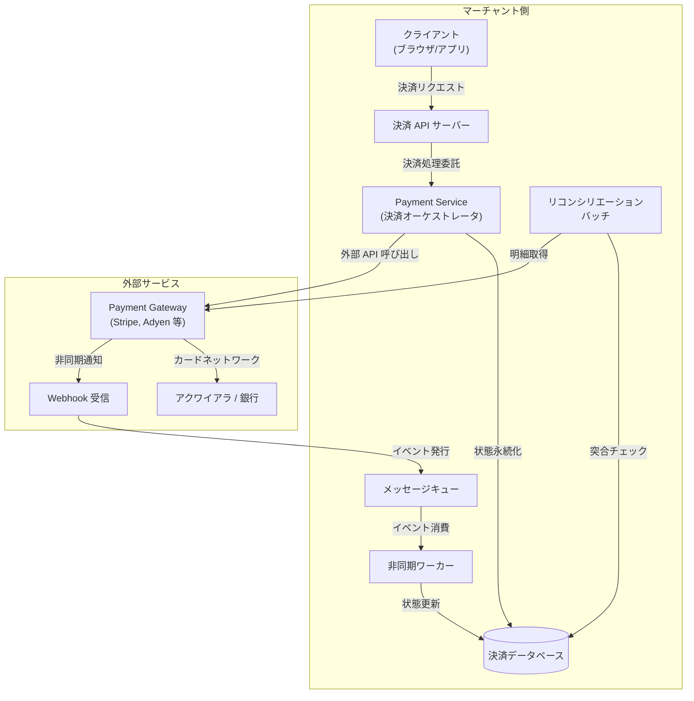

各コンポーネントの役割を整理する。

| コンポーネント | 責務 |
|---|---|
| **決済 API サーバー** | クライアントからのリクエストを受け取り、認証・バリデーション・レート制限を行う |
| **決済オーケストレータ（Payment Service）** | 決済フローの制御を担う中核。冪等性チェック、状態遷移管理、外部 API 呼び出しを行う |
| **決済データベース** | 決済トランザクションの状態を永続化する。ACID 特性を持つ RDBMS が一般的 |
| **メッセージキュー** | 非同期処理の仲介。Webhook イベントの受信や後続処理のトリガーに使用 |
| **非同期ワーカー** | キューからイベントを消費し、状態更新や通知送信を行う |
| **Payment Gateway** | 外部の決済プロバイダ（Stripe、Adyen、PayPay 等）。カードネットワークとの通信を仲介 |
| **リコンシリエーションバッチ** | 内部の決済データと外部プロバイダの明細を定期的に突合し、不整合を検出する |

### 2.2 設計原則

決済システムの設計で特に重視すべき原則を挙げる。

**1. 最小権限の原則（Least Privilege）**

カード番号やセキュリティコードなどの機密情報にアクセスできるコンポーネントを最小限に抑える。多くの場合、自社システムはトークン化された情報のみを扱い、実際のカード情報は Payment Gateway に委任する。

**2. 障害を前提とした設計（Design for Failure）**

外部の Payment Gateway は必ず障害を起こすという前提で設計する。タイムアウト、部分的な障害、不整合な応答のすべてに対処するコードを書く。

**3. 監査可能性（Auditability）**

すべての決済操作は追跡可能でなければならない。「いつ」「誰が」「何に対して」「いくらの」「どのような操作を行ったか」を完全に記録する。一度記録されたデータは物理的に削除せず、論理削除またはイベントの追記で管理する。

**4. 冪等性（Idempotency）**

同じリクエストが複数回送信されても、決済が1回だけ実行されることを保証する。ネットワーク障害によるリトライは避けられないため、この特性はシステムの根幹を成す。

## 3. 決済フロー — Authorization, Capture, Settlement

### 3.1 カード決済の3段階モデル

クレジットカード決済は、一般に3つの段階を経て完了する。このモデルを理解することは、決済システムの状態管理を正しく設計する上で不可欠である。

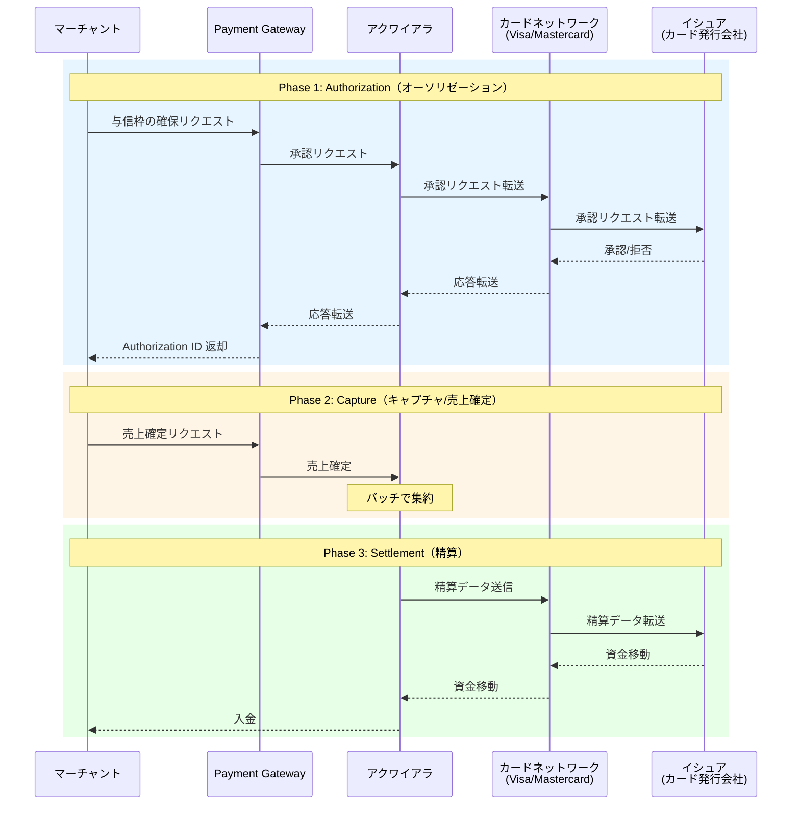

#### Authorization（オーソリゼーション / 与信）

Authorization は、カード所有者の口座に十分な残高（またはクレジット枠）があるかを確認し、その金額を一時的に確保する処理である。この段階ではまだ実際の資金移動は発生しない。

EC サイトで商品を購入する場合を考える。ユーザーが「購入」ボタンを押した時点で Authorization が実行され、カードの利用可能枠から購入金額分が一時的にブロックされる。商品が発送されるまでは「仮押さえ」の状態であり、一定期間（通常 7〜30 日）が経過すると自動的に解除される。

#### Capture（キャプチャ / 売上確定）

Capture は、Authorization で確保した金額の全部または一部を実際に請求する処理である。EC サイトでは、商品の出荷が確認された時点で Capture を行うのが一般的である。

Authorization と Capture を分離するメリットは大きい。

- 在庫切れや注文キャンセルの場合、Capture せずに Authorization を解放（Void）するだけで済む
- 部分的な出荷の場合、Authorization の一部のみを Capture できる
- 不正取引の検知時に、Capture 前であれば実際の請求を防げる

#### Settlement（精算 / 入金）

Settlement は、Capture された取引の資金が実際に移動する段階である。通常、アクワイアラ（加盟店契約会社）がバッチ処理で1日分の取引を集約し、カードネットワークを通じてイシュア（カード発行会社）から資金を回収し、手数料を差し引いた上でマーチャントの口座に入金する。

Settlement は通常 T+1 から T+3（取引日から1〜3営業日後）で完了するが、国やカードブランドによって異なる。

### 3.2 Auth & Capture の分離 vs. 一括処理

決済フローの設計において、Authorization と Capture を分離するか一括で行うかは重要な選択である。

| 方式 | ユースケース | メリット | デメリット |
|------|------------|---------|-----------|
| **Auth + Capture 分離** | EC（物理商品）、ホテル予約、レンタカー | キャンセル・部分請求が容易 | 実装が複雑、Authorization の有効期限管理が必要 |
| **Auth & Capture 一括** | デジタルコンテンツ、サブスクリプション、即時配送 | 実装がシンプル | キャンセル時は返金（Refund）が必要 |

::: tip Auth & Capture の使い分け
Stripe では `capture_method: "manual"` を指定すると Auth と Capture が分離され、`capture_method: "automatic"`（デフォルト）では一括処理となる。ビジネスの性質に応じて適切な方式を選択すべきである。
:::

### 3.3 その他の決済操作

基本の3段階に加えて、実運用では以下の操作も必要になる。

- **Void（取消）**：Capture 前の Authorization を取り消す。与信枠が即座に解放される
- **Refund（返金）**：Capture 済みの取引に対して、全額または一部を返金する。Settlement 後の返金は資金の逆移動を伴うため、処理に数日かかる
- **Chargeback（チャージバック）**：カード所有者が取引を異議申し立てした場合に、イシュアが強制的に返金する処理。マーチャントは証拠を提出して反論できるが、最終的にはカードネットワークが裁定する

## 4. 冪等性の設計 — Idempotency Key

### 4.1 なぜ冪等性が必要か

分散システムにおいて、リクエストの結果が不明確になる状況は日常的に発生する。

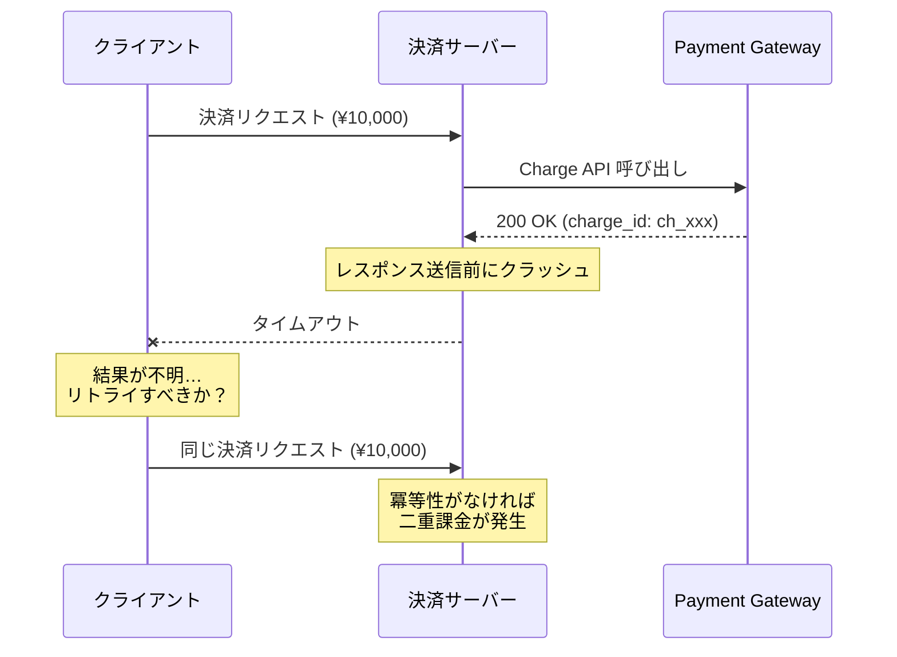

上の図のように、サーバーが Payment Gateway から成功レスポンスを受け取った直後にクラッシュした場合、クライアントはタイムアウトを受け取る。クライアントからは決済が成功したのか失敗したのか判断できない。安全のためにリトライすると、冪等性が実装されていなければ二重課金が発生する。

このような状況は以下のケースで発生しうる。

- サーバーのプロセスがレスポンス送信前にクラッシュ
- ネットワークの一時的な断絶
- ロードバランサーのタイムアウト
- クライアント側のタイムアウトによる早期切断
- モバイルアプリでの通信不安定時の自動リトライ

### 4.2 Idempotency Key の仕組み

冪等性を実現する最も一般的なアプローチは、**Idempotency Key**（冪等性キー）をリクエストに付与する方法である。

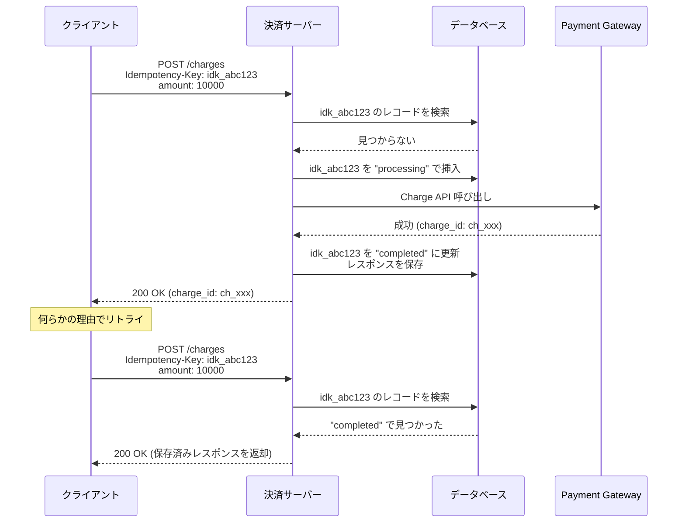

#### 基本的な実装

Idempotency Key の管理テーブルは以下のように設計する。

```sql
CREATE TABLE idempotency_keys (
    -- Unique identifier for idempotency key
    idempotency_key VARCHAR(255) PRIMARY KEY,
    -- Associated user or merchant
    merchant_id BIGINT NOT NULL,
    -- HTTP method and path
    request_method VARCHAR(10) NOT NULL,
    request_path VARCHAR(255) NOT NULL,
    -- Hash of request body for consistency check
    request_body_hash VARCHAR(64) NOT NULL,
    -- Processing status
    status VARCHAR(20) NOT NULL DEFAULT 'started',
    -- Stored response for replay
    response_status_code INT,
    response_body JSONB,
    -- Timestamps
    created_at TIMESTAMP NOT NULL DEFAULT NOW(),
    updated_at TIMESTAMP NOT NULL DEFAULT NOW(),

    CONSTRAINT unique_key_per_merchant
        UNIQUE (merchant_id, idempotency_key)
);

-- Index for cleanup of expired keys
CREATE INDEX idx_idempotency_keys_created_at
    ON idempotency_keys (created_at);
```

サーバー側の処理フローを擬似コードで示す。

```python
def process_charge(request):
    idempotency_key = request.headers.get("Idempotency-Key")
    if not idempotency_key:
        return error_response(400, "Idempotency-Key header is required")

    request_hash = sha256(canonical_form(request.body))

    # Attempt to insert or find existing key
    existing = db.query(
        "SELECT * FROM idempotency_keys WHERE idempotency_key = %s AND merchant_id = %s",
        idempotency_key, request.merchant_id
    )

    if existing:
        # Verify request consistency
        if existing.request_body_hash != request_hash:
            return error_response(422, "Request body mismatch for idempotency key")

        if existing.status == "completed":
            # Return stored response (idempotent replay)
            return Response(
                status=existing.response_status_code,
                body=existing.response_body
            )

        if existing.status == "processing":
            # Another request is in flight
            return error_response(409, "A request with this idempotency key is being processed")

    # Insert new key with "processing" status
    db.execute(
        """INSERT INTO idempotency_keys
           (idempotency_key, merchant_id, request_method, request_path,
            request_body_hash, status)
           VALUES (%s, %s, %s, %s, %s, 'processing')""",
        idempotency_key, request.merchant_id,
        request.method, request.path, request_hash
    )

    try:
        # Execute the actual payment
        result = payment_gateway.charge(
            amount=request.body["amount"],
            currency=request.body["currency"],
            source=request.body["payment_method"]
        )

        response = success_response(result)

        # Store the response for future replays
        db.execute(
            """UPDATE idempotency_keys
               SET status = 'completed',
                   response_status_code = %s,
                   response_body = %s,
                   updated_at = NOW()
               WHERE idempotency_key = %s AND merchant_id = %s""",
            response.status, json.dumps(response.body),
            idempotency_key, request.merchant_id
        )

        return response

    except Exception as e:
        # Mark as failed so it can be retried
        db.execute(
            """UPDATE idempotency_keys
               SET status = 'failed', updated_at = NOW()
               WHERE idempotency_key = %s AND merchant_id = %s""",
            idempotency_key, request.merchant_id
        )
        raise
```

### 4.3 Idempotency Key の設計上の注意点

#### キーの生成戦略

Idempotency Key はクライアント側で生成するのが一般的である。以下の方式が広く使われている。

| 方式 | 例 | 特徴 |
|------|-----|------|
| **UUID v4** | `550e8400-e29b-41d4-a716-446655440000` | ランダム生成。衝突確率は無視できるレベル |
| **ビジネスキーの組み合わせ** | `order_12345_charge` | 同一注文に対する重複決済を自然に防止 |
| **ULID** | `01ARZ3NDEKTSV4RRFFQ69G5FAV` | 時間順ソート可能な UUID 代替 |

::: warning Idempotency Key をサーバー側で生成してはいけない
サーバー側でキーを生成すると、クライアントが同じリクエストをリトライする際に異なるキーが割り当てられ、冪等性が機能しない。キーは必ずクライアント側で生成し、リクエストヘッダーに含める。
:::

#### キーの有効期限

Idempotency Key は永久に保持する必要はない。Stripe は 24 時間、PayPal は一定期間でキーを失効させている。一般的には 24〜72 時間の TTL を設定し、期限切れのキーはバッチで削除する。

#### リクエストの整合性チェック

同じ Idempotency Key で異なるリクエストボディが送信された場合、これはクライアントのバグである可能性が高い。この場合はエラーを返すべきであり、暗黙的に前回のレスポンスを返してはいけない。リクエストボディのハッシュ値を保存しておき、再送時に比較することで検出できる。

### 4.4 データベースレベルの冪等性保証

アプリケーションレベルの Idempotency Key に加えて、データベースレベルでも冪等性を保証する仕組みを入れるのが堅牢な設計である。

```sql
-- Payment transactions table with unique constraint
CREATE TABLE payment_transactions (
    id BIGSERIAL PRIMARY KEY,
    -- Unique payment reference prevents duplicate charges
    payment_reference VARCHAR(255) NOT NULL UNIQUE,
    merchant_id BIGINT NOT NULL,
    amount DECIMAL(19, 4) NOT NULL,
    currency VARCHAR(3) NOT NULL,
    status VARCHAR(20) NOT NULL DEFAULT 'pending',
    gateway_charge_id VARCHAR(255),
    idempotency_key VARCHAR(255),
    created_at TIMESTAMP NOT NULL DEFAULT NOW(),
    updated_at TIMESTAMP NOT NULL DEFAULT NOW()
);

-- Unique constraint ensures at most one transaction per reference
-- Even if application-level idempotency check fails due to race condition,
-- database constraint will prevent duplicate insertion
```

`payment_reference` にユニーク制約を設けることで、アプリケーションレベルの冪等性チェックに競合状態が生じた場合でも、データベースレベルで二重挿入を防止できる。

## 5. 二重請求防止のパターン

### 5.1 二重請求が発生するシナリオ

冪等性の議論と密接に関連するが、二重請求の防止にはより包括的なアプローチが必要である。二重請求が発生しうるシナリオを整理する。

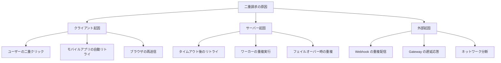

### 5.2 多層防御アプローチ

二重請求の防止は、単一のメカニズムに頼るのではなく、複数の層で防御する**多層防御（Defense in Depth）**のアプローチが必要である。

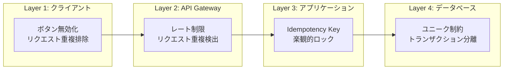

#### Layer 1: クライアント側の防御

最も基本的な防御は、クライアント側での二重送信防止である。

```javascript
// Disable submit button on click to prevent double submission
const PaymentButton = ({ onSubmit }) => {
  const [isProcessing, setIsProcessing] = useState(false);
  const idempotencyKeyRef = useRef(crypto.randomUUID());

  const handleClick = async () => {
    if (isProcessing) return;
    setIsProcessing(true);

    try {
      await onSubmit({
        idempotencyKey: idempotencyKeyRef.current,
      });
    } catch (error) {
      // Allow retry on failure, but reuse the same idempotency key
      setIsProcessing(false);
    }
  };

  return (
    <button onClick={handleClick} disabled={isProcessing}>
      {isProcessing ? "処理中..." : "支払う"}
    </button>
  );
};
```

::: warning クライアント側の防御だけでは不十分
ボタンの無効化はユーザー体験の改善には有効だが、セキュリティ上の保証にはならない。ブラウザの開発者ツールで簡単に回避でき、API を直接呼び出すクライアントにはそもそも効果がない。必ずサーバー側でも二重請求防止を実装する。
:::

#### Layer 2: API Gateway での重複検出

API Gateway レベルで、短時間に同一クライアントから同一エンドポイントへの重複リクエストを検出する。Redis を使ったリクエスト重複排除の実装例を示す。

```python
import hashlib
import redis

redis_client = redis.Redis()

def deduplicate_request(request):
    """
    Detect duplicate requests at the API gateway level.
    Uses a short TTL to catch rapid resubmissions.
    """
    # Create fingerprint from request attributes
    fingerprint = hashlib.sha256(
        f"{request.merchant_id}:{request.method}:{request.path}:{request.body}".encode()
    ).hexdigest()

    key = f"dedup:{fingerprint}"

    # SET NX with 5-second TTL
    is_new = redis_client.set(key, "1", nx=True, ex=5)

    if not is_new:
        # Duplicate request detected within 5 seconds
        return False  # Reject or return cached response

    return True  # Allow through
```

#### Layer 3: アプリケーション層の冪等性

前述の Idempotency Key による保護がここに該当する。

#### Layer 4: データベース層の制約

最後の砦として、データベースのユニーク制約やトランザクション分離を利用する。

```sql
-- Use advisory lock to prevent concurrent processing of same payment
BEGIN;

-- Acquire advisory lock based on payment reference hash
SELECT pg_advisory_xact_lock(hashtext('payment:order_12345'));

-- Check if payment already exists
SELECT id, status FROM payment_transactions
WHERE payment_reference = 'order_12345_charge'
FOR UPDATE;

-- If not exists, insert new transaction
INSERT INTO payment_transactions (payment_reference, merchant_id, amount, currency, status)
VALUES ('order_12345_charge', 1001, 10000, 'JPY', 'pending');

COMMIT;
```

`pg_advisory_xact_lock` を使うことで、同一決済に対する並行処理を直列化し、競合状態による二重挿入を防ぐ。このロックはトランザクションの終了時に自動的に解放される。

### 5.3 楽観的ロックによる状態遷移保護

決済の状態更新においては、楽観的ロック（Optimistic Locking）を使用して、状態遷移の一貫性を保つ。

```sql
-- Optimistic locking using version column
UPDATE payment_transactions
SET status = 'captured',
    gateway_charge_id = 'ch_xxx',
    version = version + 1,
    updated_at = NOW()
WHERE id = 12345
  AND status = 'authorized'  -- Expected current status
  AND version = 3;            -- Expected current version

-- If affected rows = 0, another process already modified this record
```

更新された行数が0であれば、別のプロセスが先に状態を変更したことを意味する。この場合は最新の状態を再読み込みし、適切な処理（リトライまたはエラー返却）を行う。

## 6. 非同期処理と Webhook

### 6.1 なぜ非同期処理が必要か

決済処理の多くは、即時に結果が確定しない。以下のようなケースでは非同期処理が不可欠となる。

- **銀行振込**：入金の確認に数時間〜数日かかる
- **3D セキュア認証**：ユーザーの追加認証が必要で、完了まで時間がかかる
- **不正検知**：リスクスコアリングに時間がかかり、手動レビューが入る場合もある
- **チャージバック処理**：カード所有者の異議申し立てに対する対応
- **精算（Settlement）**：バッチ処理で行われるため即時には完了しない

### 6.2 Webhook の設計

Payment Gateway は、非同期に確定した決済の結果を Webhook で通知する。Webhook は HTTP POST リクエストとして、マーチャントが指定したエンドポイントに送信される。

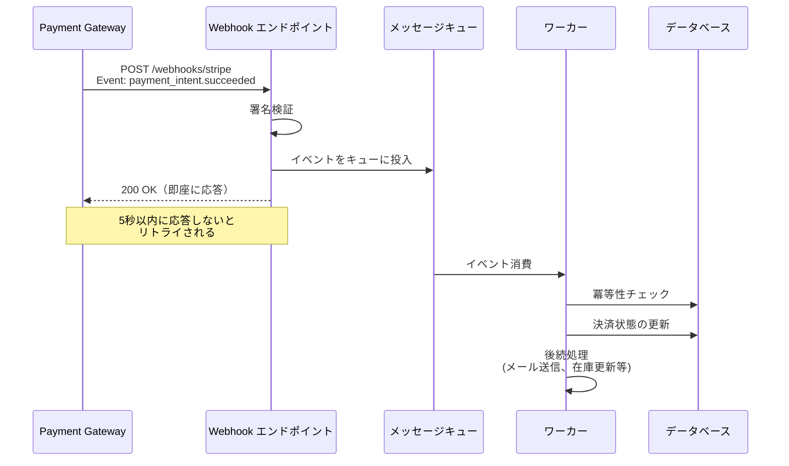

#### Webhook 受信の実装原則

Webhook の受信処理では、以下の原則を厳守する。

**1. 即座に 200 を返す**

Webhook エンドポイントは、イベントをキューに投入した後、即座に 200 OK を返す。時間のかかる処理（データベース更新、外部 API 呼び出し等）は Webhook ハンドラ内で行ってはいけない。Payment Gateway は一般的に 5〜30 秒でタイムアウトし、リトライを開始するためである。

**2. 署名を必ず検証する**

Webhook リクエストが本当に Payment Gateway から送信されたものか、署名を検証する。署名検証を怠ると、攻撃者が偽の Webhook を送信して決済状態を不正に操作できてしまう。

```python
import hmac
import hashlib

def verify_stripe_webhook(payload, signature_header, webhook_secret):
    """
    Verify Stripe webhook signature using HMAC-SHA256.
    """
    # Parse signature header
    elements = dict(
        pair.split("=", 1)
        for pair in signature_header.split(",")
    )
    timestamp = elements.get("t")
    expected_sig = elements.get("v1")

    if not timestamp or not expected_sig:
        raise ValueError("Invalid signature header format")

    # Construct signed payload
    signed_payload = f"{timestamp}.{payload}"

    # Compute expected signature
    computed_sig = hmac.new(
        webhook_secret.encode(),
        signed_payload.encode(),
        hashlib.sha256
    ).hexdigest()

    # Constant-time comparison to prevent timing attacks
    if not hmac.compare_digest(computed_sig, expected_sig):
        raise ValueError("Signature verification failed")

    return True
```

**3. 冪等に処理する**

Webhook は少なくとも1回（at-least-once）配信される。同じイベントが複数回配信される可能性があるため、受信側は冪等に処理しなければならない。

```python
def handle_webhook_event(event):
    """
    Process webhook event idempotently.
    """
    event_id = event["id"]

    # Check if this event has already been processed
    existing = db.query(
        "SELECT id FROM processed_webhook_events WHERE event_id = %s",
        event_id
    )
    if existing:
        # Already processed; skip
        return

    # Process the event within a transaction
    with db.transaction():
        # Record that we've processed this event
        db.execute(
            "INSERT INTO processed_webhook_events (event_id, event_type, processed_at) VALUES (%s, %s, NOW())",
            event_id, event["type"]
        )

        # Dispatch to appropriate handler
        if event["type"] == "payment_intent.succeeded":
            handle_payment_succeeded(event["data"]["object"])
        elif event["type"] == "payment_intent.payment_failed":
            handle_payment_failed(event["data"]["object"])
        elif event["type"] == "charge.dispute.created":
            handle_dispute_created(event["data"]["object"])
```

### 6.3 Webhook のリトライとエラーハンドリング

Payment Gateway は、Webhook の配信に失敗した場合にリトライを行う。リトライ戦略は Gateway によって異なるが、一般的に**指数バックオフ（Exponential Backoff）**が使われる。

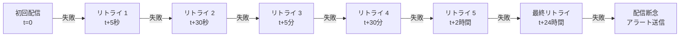

Stripe の場合、最大 72 時間にわたって指数バックオフでリトライし、それでも成功しなければイベントは「未配信」としてダッシュボードに表示される。

::: danger Webhook だけに依存してはいけない
Webhook は「プッシュ型」の通知であり、100%の到達を保証するものではない。ネットワーク障害、DNS の問題、マーチャント側のサーバーダウンなど、あらゆる理由で Webhook が届かない可能性がある。後述するリコンシリエーション（突合処理）によって、Webhook の漏れを補完する仕組みが必須である。
:::

### 6.4 ポーリングとの併用

Webhook の到達が不確実であるため、多くの決済システムではポーリング（Pull 型）も併用する。

```python
async def poll_pending_payments():
    """
    Periodically poll Payment Gateway for status of pending payments.
    Complements webhook-based notifications.
    """
    # Find payments that have been pending for too long
    pending = db.query(
        """SELECT id, gateway_payment_id, created_at
           FROM payment_transactions
           WHERE status = 'pending'
             AND created_at < NOW() - INTERVAL '10 minutes'
           ORDER BY created_at ASC
           LIMIT 100"""
    )

    for payment in pending:
        try:
            # Query Payment Gateway for current status
            gateway_status = payment_gateway.retrieve(
                payment.gateway_payment_id
            )

            if gateway_status.status == "succeeded":
                update_payment_status(payment.id, "completed")
            elif gateway_status.status == "failed":
                update_payment_status(payment.id, "failed")
            # If still pending, do nothing and check again later

        except Exception as e:
            logger.warning(
                f"Failed to poll payment {payment.id}: {e}"
            )
```

## 7. ステートマシンによる状態管理

### 7.1 決済状態の遷移モデル

決済トランザクションは、明確に定義された状態間を遷移する。この遷移を**ステートマシン（有限状態機械）**として明示的にモデル化することで、不正な状態遷移を防ぎ、システムの正確性を保証する。

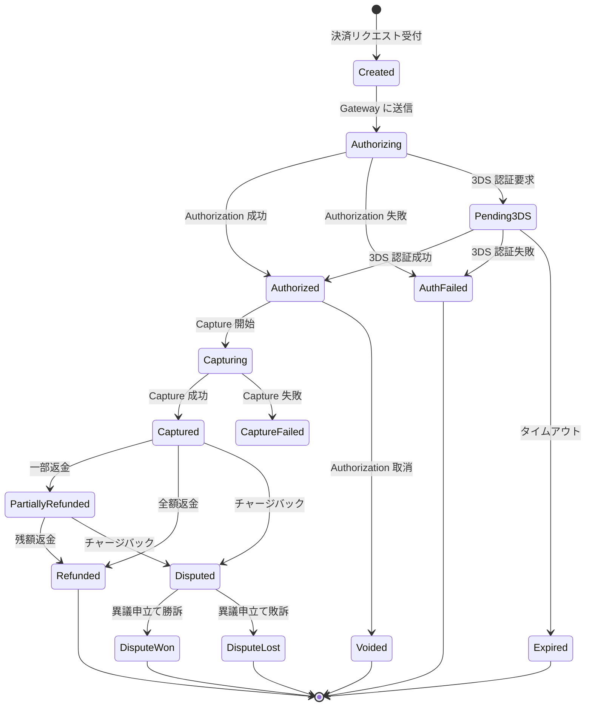

### 7.2 ステートマシンの実装

ステートマシンをコードで明示的に実装することで、許可されていない状態遷移を型レベルまたはランタイムで防止する。

```python
from enum import Enum
from typing import Dict, Set

class PaymentStatus(Enum):
    CREATED = "created"
    AUTHORIZING = "authorizing"
    AUTHORIZED = "authorized"
    AUTH_FAILED = "auth_failed"
    PENDING_3DS = "pending_3ds"
    EXPIRED = "expired"
    CAPTURING = "capturing"
    CAPTURED = "captured"
    CAPTURE_FAILED = "capture_failed"
    VOIDED = "voided"
    PARTIALLY_REFUNDED = "partially_refunded"
    REFUNDED = "refunded"
    DISPUTED = "disputed"
    DISPUTE_WON = "dispute_won"
    DISPUTE_LOST = "dispute_lost"

# Define allowed transitions
ALLOWED_TRANSITIONS: Dict[PaymentStatus, Set[PaymentStatus]] = {
    PaymentStatus.CREATED: {PaymentStatus.AUTHORIZING},
    PaymentStatus.AUTHORIZING: {
        PaymentStatus.AUTHORIZED,
        PaymentStatus.AUTH_FAILED,
        PaymentStatus.PENDING_3DS,
    },
    PaymentStatus.PENDING_3DS: {
        PaymentStatus.AUTHORIZED,
        PaymentStatus.AUTH_FAILED,
        PaymentStatus.EXPIRED,
    },
    PaymentStatus.AUTHORIZED: {
        PaymentStatus.CAPTURING,
        PaymentStatus.VOIDED,
    },
    PaymentStatus.CAPTURING: {
        PaymentStatus.CAPTURED,
        PaymentStatus.CAPTURE_FAILED,
    },
    PaymentStatus.CAPTURED: {
        PaymentStatus.PARTIALLY_REFUNDED,
        PaymentStatus.REFUNDED,
        PaymentStatus.DISPUTED,
    },
    PaymentStatus.PARTIALLY_REFUNDED: {
        PaymentStatus.REFUNDED,
        PaymentStatus.DISPUTED,
    },
    PaymentStatus.DISPUTED: {
        PaymentStatus.DISPUTE_WON,
        PaymentStatus.DISPUTE_LOST,
    },
    # Terminal states have no transitions
    PaymentStatus.AUTH_FAILED: set(),
    PaymentStatus.EXPIRED: set(),
    PaymentStatus.VOIDED: set(),
    PaymentStatus.REFUNDED: set(),
    PaymentStatus.CAPTURE_FAILED: set(),
    PaymentStatus.DISPUTE_WON: set(),
    PaymentStatus.DISPUTE_LOST: set(),
}


class PaymentStateMachine:
    """
    Enforces valid state transitions for payment transactions.
    """

    def __init__(self, current_status: PaymentStatus):
        self._status = current_status

    @property
    def status(self) -> PaymentStatus:
        return self._status

    def can_transition_to(self, new_status: PaymentStatus) -> bool:
        return new_status in ALLOWED_TRANSITIONS.get(self._status, set())

    def transition_to(self, new_status: PaymentStatus) -> None:
        if not self.can_transition_to(new_status):
            raise InvalidStateTransitionError(
                f"Cannot transition from {self._status.value} to {new_status.value}"
            )
        self._status = new_status

    def is_terminal(self) -> bool:
        return len(ALLOWED_TRANSITIONS.get(self._status, set())) == 0
```

### 7.3 状態遷移とイベント記録

状態遷移のたびにイベントを記録することで、完全な監査証跡を残す。このアプローチはイベントソーシングの考え方に通じる。

```sql
-- Payment state transition log (append-only)
CREATE TABLE payment_events (
    id BIGSERIAL PRIMARY KEY,
    payment_id BIGINT NOT NULL REFERENCES payment_transactions(id),
    -- Previous and new status
    from_status VARCHAR(30),
    to_status VARCHAR(30) NOT NULL,
    -- Event metadata
    event_type VARCHAR(50) NOT NULL,
    event_data JSONB,
    -- Who/what triggered the transition
    triggered_by VARCHAR(100) NOT NULL,
    -- Timestamp
    created_at TIMESTAMP NOT NULL DEFAULT NOW()
);

-- Index for querying payment history
CREATE INDEX idx_payment_events_payment_id
    ON payment_events (payment_id, created_at);
```

```python
def transition_payment(payment_id, new_status, event_type, event_data, triggered_by):
    """
    Transition payment status atomically with event recording.
    """
    with db.transaction():
        # Lock and read current status
        payment = db.query(
            "SELECT id, status, version FROM payment_transactions WHERE id = %s FOR UPDATE",
            payment_id
        )

        state_machine = PaymentStateMachine(PaymentStatus(payment.status))

        if not state_machine.can_transition_to(PaymentStatus(new_status)):
            raise InvalidStateTransitionError(
                f"Cannot transition payment {payment_id} "
                f"from {payment.status} to {new_status}"
            )

        # Update status with optimistic locking
        rows_updated = db.execute(
            """UPDATE payment_transactions
               SET status = %s, version = version + 1, updated_at = NOW()
               WHERE id = %s AND version = %s""",
            new_status, payment_id, payment.version
        )

        if rows_updated == 0:
            raise ConcurrentModificationError(
                f"Payment {payment_id} was modified concurrently"
            )

        # Record the state transition event
        db.execute(
            """INSERT INTO payment_events
               (payment_id, from_status, to_status, event_type, event_data, triggered_by)
               VALUES (%s, %s, %s, %s, %s, %s)""",
            payment_id, payment.status, new_status,
            event_type, json.dumps(event_data), triggered_by
        )
```

状態遷移とイベント記録を同一トランザクション内で行うことで、両者の一貫性が保証される。これにより、いつ、何をきっかけに状態が変わったかを完全に追跡できる。

## 8. PCI DSS 準拠の考慮事項

### 8.1 PCI DSS とは

**PCI DSS（Payment Card Industry Data Security Standard）**は、クレジットカード情報を扱うすべての組織が遵守すべきセキュリティ基準である。Visa、Mastercard、JCB、American Express、Discover の5大カードブランドが共同で設立した PCI SSC（Payment Card Industry Security Standards Council）によって策定・管理されている。

PCI DSS の準拠レベルは、年間のカード取引件数によって4段階に分かれる。取引件数が多いほど厳しい審査が求められ、レベル1（年間600万件以上）では外部のQSA（Qualified Security Assessor）による年次監査が必須となる。

### 8.2 トークナイゼーションによるスコープ最小化

PCI DSS の準拠コストと運用負荷を最小限に抑える最も効果的な手法が、**トークナイゼーション（Tokenization）**である。

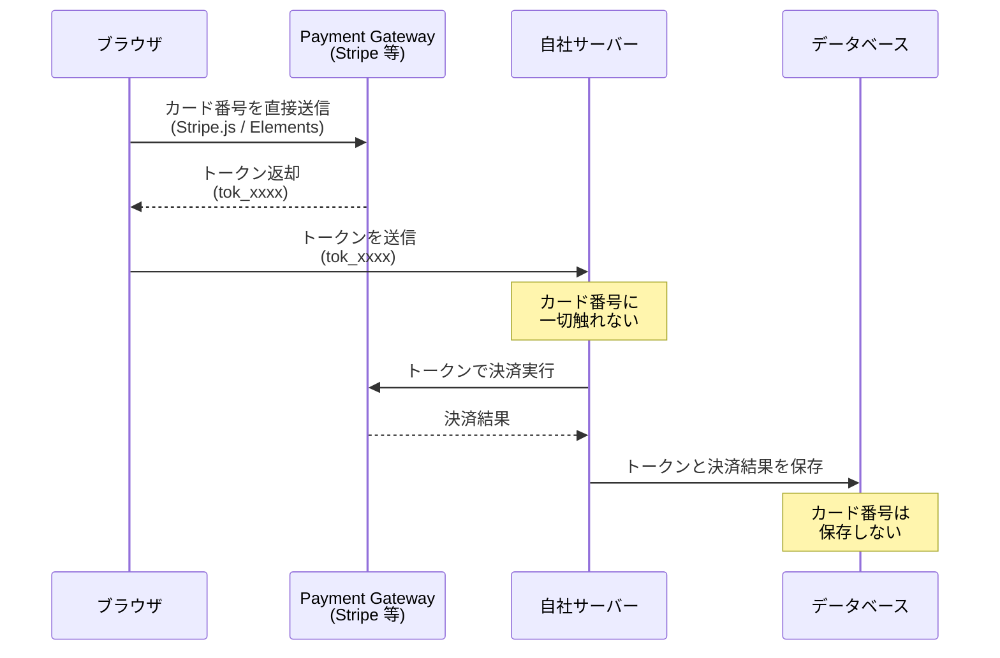

この方式では、カード番号が自社のサーバーを一切経由しない。ブラウザから直接 Payment Gateway にカード情報が送信され、自社システムはトークン化された情報のみを扱う。これにより、PCI DSS のスコープ（適用範囲）が大幅に縮小され、最も軽いレベルの自己評価問診票（SAQ A または SAQ A-EP）での準拠が可能になる。

### 8.3 主要なセキュリティ要件

トークナイゼーションを採用してスコープを最小化した場合でも、以下の要件は依然として重要である。

**通信の暗号化（TLS）**

決済に関するすべての通信は TLS 1.2 以上で暗号化する。HTTP での決済 API 呼び出しは絶対に許可してはいけない。

**アクセス制御**

決済データへのアクセスは、業務上必要な最小限の人員・システムに限定する。本番環境の決済データベースへの直接アクセスは厳しく制限し、すべてのアクセスをログに記録する。

**ログと監査証跡**

決済操作のすべてのログを保持し、改竄されないよう保護する。ログにはカード番号や CVV を絶対に含めてはいけない（マスキングまたは除外する）。

```python
import re

def sanitize_log_data(data: dict) -> dict:
    """
    Remove or mask sensitive payment data before logging.
    """
    sensitive_keys = {"card_number", "cvv", "cvc", "security_code", "pan"}
    sanitized = {}

    for key, value in data.items():
        if key.lower() in sensitive_keys:
            sanitized[key] = "***REDACTED***"
        elif isinstance(value, str):
            # Mask potential card numbers (13-19 digit sequences)
            sanitized[key] = re.sub(
                r'\b(\d{4})\d{5,11}(\d{4})\b',
                r'\1****\2',
                value
            )
        elif isinstance(value, dict):
            sanitized[key] = sanitize_log_data(value)
        else:
            sanitized[key] = value

    return sanitized
```

**脆弱性管理**

定期的な脆弱性スキャンとペネトレーションテストを実施する。特に決済関連のエンドポイントは攻撃者の標的になりやすいため、WAF（Web Application Firewall）の導入も検討する。

::: tip SAQ の種類と選択
- **SAQ A**：カード情報の入力が完全に Payment Gateway のホスト型ページ（リダイレクト型）で行われる場合
- **SAQ A-EP**：自社のウェブページ上で Stripe.js のような JavaScript を使ってカード情報を直接 Gateway に送信する場合
- **SAQ D**：カード情報が自社サーバーを経由する場合（最も要件が厳しい）

ほとんどのケースでは SAQ A-EP で十分であり、カード情報を自社で扱う（SAQ D）のは可能な限り避けるべきである。
:::

## 9. リコンシリエーション（突合処理）

### 9.1 なぜリコンシリエーションが必要か

決済システムは複数の独立したシステム（自社システム、Payment Gateway、銀行）が協調して動作するため、各システム間でデータの不整合が生じる可能性が常にある。

リコンシリエーション（Reconciliation）とは、**自社の決済データと外部プロバイダの決済データを突合し、不整合を検出・解消する処理**である。会計における「帳簿の照合」に相当する。

不整合が生じる典型的な原因は以下の通りである。

- Webhook の未到達により、自社側の状態が更新されていない
- ネットワーク障害により、Gateway での決済成功が自社に伝わっていない
- 自社システムのバグにより、金額が誤って記録されている
- タイムゾーンの差異により、日次の集計値がずれている
- 通貨換算のレートの違いにより、金額が微妙に異なっている

### 9.2 リコンシリエーションのアーキテクチャ

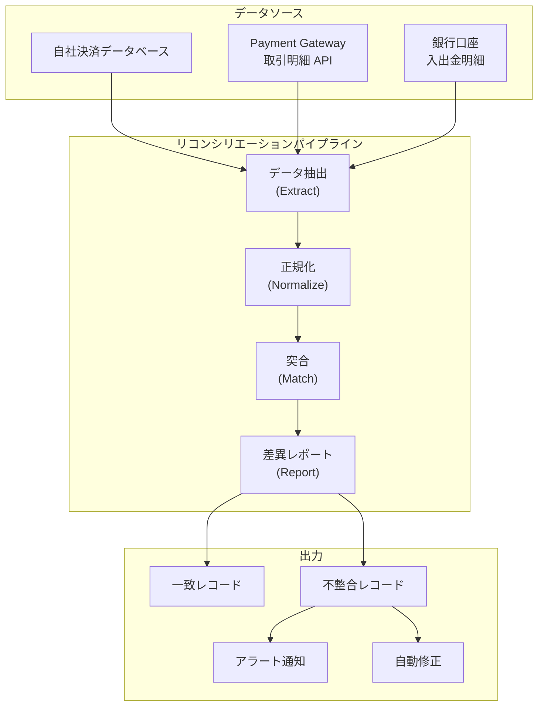

### 9.3 突合の実装

リコンシリエーションの処理は、以下のステップで行う。

#### Step 1: データ抽出

自社データベースと Payment Gateway の両方から、対象期間の取引データを抽出する。

```python
from datetime import date, timedelta
from dataclasses import dataclass
from decimal import Decimal
from typing import List, Optional

@dataclass
class InternalTransaction:
    payment_id: str
    gateway_charge_id: Optional[str]
    amount: Decimal
    currency: str
    status: str
    created_at: str

@dataclass
class GatewayTransaction:
    charge_id: str
    amount: Decimal
    currency: str
    status: str
    created_at: str
    fee: Decimal
    net: Decimal

def extract_internal_transactions(target_date: date) -> List[InternalTransaction]:
    """
    Extract all transactions for the target date from internal database.
    """
    rows = db.query(
        """SELECT payment_reference, gateway_charge_id, amount, currency,
                  status, created_at
           FROM payment_transactions
           WHERE DATE(created_at) = %s
             AND status IN ('captured', 'refunded', 'partially_refunded')
           ORDER BY created_at""",
        target_date
    )
    return [InternalTransaction(**row) for row in rows]

def extract_gateway_transactions(target_date: date) -> List[GatewayTransaction]:
    """
    Extract all transactions for the target date from Payment Gateway API.
    """
    # Stripe example: list all charges for the date
    charges = stripe.Charge.list(
        created={
            "gte": int(target_date.strftime("%s")),
            "lt": int((target_date + timedelta(days=1)).strftime("%s")),
        },
        limit=100,  # Paginate for large volumes
    )
    return [
        GatewayTransaction(
            charge_id=c.id,
            amount=Decimal(c.amount) / 100,  # Convert from cents
            currency=c.currency.upper(),
            status=c.status,
            created_at=c.created,
            fee=Decimal(c.balance_transaction.fee) / 100,
            net=Decimal(c.balance_transaction.net) / 100,
        )
        for c in charges.auto_paging_iter()
    ]
```

#### Step 2: 突合とレポート生成

両方のデータセットを突合し、不整合を検出する。

```python
@dataclass
class ReconciliationResult:
    matched: List[dict]
    internal_only: List[InternalTransaction]   # Gateway side missing
    gateway_only: List[GatewayTransaction]     # Internal side missing
    amount_mismatch: List[dict]                # Both exist but amounts differ
    status_mismatch: List[dict]                # Both exist but statuses differ

def reconcile(
    internal: List[InternalTransaction],
    gateway: List[GatewayTransaction]
) -> ReconciliationResult:
    """
    Match internal transactions with gateway transactions
    and identify discrepancies.
    """
    # Build lookup maps
    internal_by_gateway_id = {
        t.gateway_charge_id: t
        for t in internal
        if t.gateway_charge_id
    }
    gateway_by_id = {t.charge_id: t for t in gateway}

    result = ReconciliationResult(
        matched=[], internal_only=[], gateway_only=[],
        amount_mismatch=[], status_mismatch=[]
    )

    # Check internal records against gateway
    for txn in internal:
        if not txn.gateway_charge_id:
            result.internal_only.append(txn)
            continue

        gw_txn = gateway_by_id.get(txn.gateway_charge_id)
        if not gw_txn:
            result.internal_only.append(txn)
            continue

        # Compare amounts
        if txn.amount != gw_txn.amount:
            result.amount_mismatch.append({
                "internal": txn,
                "gateway": gw_txn,
                "diff": txn.amount - gw_txn.amount,
            })
        # Compare statuses
        elif not statuses_compatible(txn.status, gw_txn.status):
            result.status_mismatch.append({
                "internal": txn,
                "gateway": gw_txn,
            })
        else:
            result.matched.append({
                "internal": txn,
                "gateway": gw_txn,
            })

    # Check for gateway records not in internal system
    internal_gateway_ids = set(internal_by_gateway_id.keys())
    for gw_txn in gateway:
        if gw_txn.charge_id not in internal_gateway_ids:
            result.gateway_only.append(gw_txn)

    return result
```

### 9.4 不整合の分類と対応

リコンシリエーションで検出される不整合にはいくつかのパターンがある。それぞれの対応方針を整理する。

| 不整合パターン | 考えられる原因 | 対応方針 |
|---|---|---|
| **自社にあるが Gateway にない** | Gateway への送信が失敗した / Gateway 側でロールバックされた | Gateway API で確認し、存在しなければ自社レコードを失敗に更新 |
| **Gateway にあるが自社にない** | Webhook 未到達 / 自社側の記録漏れ | Gateway の取引情報を元に自社レコードを作成 |
| **金額の不一致** | 通貨換算の差異 / 部分 Capture の反映漏れ | 差額を確認し、手動レビューの上で修正 |
| **状態の不一致** | Webhook の処理遅延 / 自社側の状態遷移バグ | Gateway の状態を正として自社側を更新 |

::: warning 自動修正の適用範囲
すべての不整合を自動修正するのは危険である。金額の不一致や、大量の不整合が発生した場合は、必ず人間がレビューした上で修正を行うべきである。自動修正は、Webhook 未到達による状態の不一致など、原因が明確で安全な修正が可能なケースに限定する。
:::

### 9.5 リコンシリエーションの運用

リコンシリエーションは以下のスケジュールで実施するのが一般的である。

- **日次リコンシリエーション**：前日分の取引を翌営業日の早朝に突合する。不整合の早期発見が目的
- **月次リコンシリエーション**：月次の精算サイクルに合わせて、入金額と取引額の総額を照合する
- **リアルタイム検知**：取引件数や金額の急激な変動をリアルタイムで監視し、異常を即座に検出する

## 10. 障害時のリカバリパターン

### 10.1 障害の分類

決済システムで発生する障害は、大きく以下の3つに分類できる。

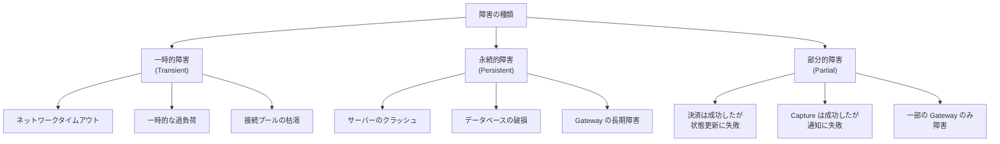

### 10.2 リトライ戦略

一時的な障害に対しては、適切なリトライ戦略を実装する。

```python
import random
import time
from functools import wraps

def retry_with_exponential_backoff(
    max_retries=3,
    base_delay=1.0,
    max_delay=60.0,
    retryable_exceptions=(TimeoutError, ConnectionError),
):
    """
    Decorator that retries a function with exponential backoff and jitter.
    """
    def decorator(func):
        @wraps(func)
        def wrapper(*args, **kwargs):
            last_exception = None

            for attempt in range(max_retries + 1):
                try:
                    return func(*args, **kwargs)
                except retryable_exceptions as e:
                    last_exception = e

                    if attempt == max_retries:
                        break

                    # Exponential backoff with full jitter
                    delay = min(base_delay * (2 ** attempt), max_delay)
                    jittered_delay = random.uniform(0, delay)

                    logger.warning(
                        f"Attempt {attempt + 1}/{max_retries} failed: {e}. "
                        f"Retrying in {jittered_delay:.2f}s"
                    )
                    time.sleep(jittered_delay)

            raise last_exception

        return wrapper
    return decorator

@retry_with_exponential_backoff(
    max_retries=3,
    base_delay=1.0,
    retryable_exceptions=(TimeoutError, ConnectionError, GatewayTimeoutError),
)
def charge_payment_gateway(amount, currency, payment_method):
    """
    Call Payment Gateway's charge API with automatic retry.
    """
    return payment_gateway.charge(
        amount=amount,
        currency=currency,
        source=payment_method,
    )
```

::: danger 決済 API のリトライは冪等性が前提
リトライを行う場合、呼び出し先の API が冪等であることが前提条件である。冪等性のない API をリトライすると二重課金のリスクがある。Stripe のような主要な Gateway は Idempotency Key をサポートしているが、すべての Gateway がそうとは限らない。Gateway のドキュメントを必ず確認する。
:::

### 10.3 Saga パターンによる分散トランザクション管理

決済処理が複数のサービスにまたがる場合、単一のデータベーストランザクションでは一貫性を保証できない。**Saga パターン**は、分散トランザクションを一連のローカルトランザクションに分解し、障害時には補償トランザクション（Compensating Transaction）で整合性を回復する手法である。

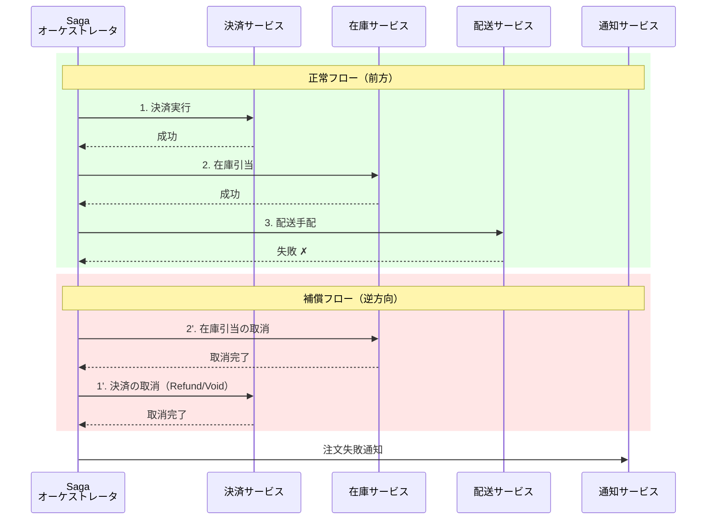

Saga パターンの実装には、**オーケストレーション方式**と**コレオグラフィ方式**の2つがある。

| 方式 | 特徴 | 適用場面 |
|------|------|---------|
| **オーケストレーション** | 中央のオーケストレータが各ステップの実行を制御 | 決済のようにフローが複雑で厳密な制御が必要な場合 |
| **コレオグラフィ** | 各サービスがイベントを発行し、次のサービスがそれに反応 | サービス間の依存が少なく、疎結合が重要な場合 |

決済システムでは、補償処理の確実な実行が求められるため、**オーケストレーション方式**が適していることが多い。

### 10.4 Outbox パターンによるイベント確実配信

決済の状態をデータベースに更新すると同時に、後続処理のためにイベントをメッセージキューに発行する必要がある場面は多い。しかし、データベースの更新とメッセージの発行はアトミックに行えないため、一方だけが成功してもう一方が失敗するという問題が生じる。

**Outbox パターン**は、この問題を解決するための手法である。イベントをメッセージキューに直接発行する代わりに、データベースの「Outbox テーブル」に同一トランザクション内で書き込み、別のプロセスがそのテーブルを読み取ってメッセージキューに中継する。

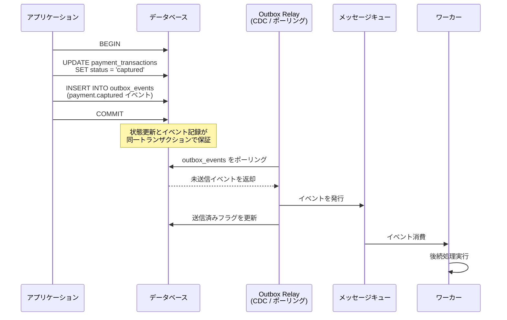

```sql
-- Outbox table for reliable event publishing
CREATE TABLE outbox_events (
    id BIGSERIAL PRIMARY KEY,
    -- Aggregate information
    aggregate_type VARCHAR(50) NOT NULL,
    aggregate_id VARCHAR(255) NOT NULL,
    -- Event information
    event_type VARCHAR(100) NOT NULL,
    payload JSONB NOT NULL,
    -- Delivery tracking
    published BOOLEAN NOT NULL DEFAULT FALSE,
    published_at TIMESTAMP,
    -- Timestamp
    created_at TIMESTAMP NOT NULL DEFAULT NOW()
);

-- Index for efficient polling of unpublished events
CREATE INDEX idx_outbox_unpublished
    ON outbox_events (published, created_at)
    WHERE published = FALSE;
```

Outbox Relay の実装には、以下の2つのアプローチがある。

- **ポーリング方式**：定期的に Outbox テーブルをクエリし、未送信のイベントを取得してメッセージキューに発行する。実装はシンプルだが、ポーリング間隔による遅延が生じる
- **CDC（Change Data Capture）方式**：データベースのトランザクションログ（WAL）を監視し、Outbox テーブルへの挿入をリアルタイムに検知してメッセージキューに中継する。Debezium などのツールがこの方式を実現する。遅延は最小限だが、運用の複雑さが増す

### 10.5 タイムアウトと不確定状態の処理

決済システムで最も難しいのは、Gateway からの応答がタイムアウトした場合の処理である。この時点では、決済が成功したのか失敗したのか判断できない。

```python
def handle_gateway_timeout(payment_id, idempotency_key):
    """
    Handle timeout from Payment Gateway.
    The payment may or may not have been processed.
    """
    # Mark as "unknown" - do NOT assume success or failure
    transition_payment(
        payment_id,
        new_status="unknown",
        event_type="gateway_timeout",
        event_data={"idempotency_key": idempotency_key},
        triggered_by="system:timeout_handler"
    )

    # Schedule a status check with delay
    schedule_delayed_task(
        task="check_payment_status",
        payload={
            "payment_id": payment_id,
            "idempotency_key": idempotency_key,
            "attempt": 1,
        },
        delay_seconds=30,  # Wait before checking
    )

def check_payment_status(payment_id, idempotency_key, attempt):
    """
    Check the actual status of a payment at the Gateway.
    Called after a timeout to resolve the unknown state.
    """
    MAX_ATTEMPTS = 5

    try:
        # Query Gateway for the payment status using idempotency key
        gateway_result = payment_gateway.retrieve_by_idempotency_key(
            idempotency_key
        )

        if gateway_result is None:
            # Payment was never processed at the gateway
            transition_payment(payment_id, "failed", "gateway_not_found", {}, "system:status_checker")
        elif gateway_result.status == "succeeded":
            transition_payment(payment_id, "captured", "gateway_confirmed", gateway_result.to_dict(), "system:status_checker")
        elif gateway_result.status == "failed":
            transition_payment(payment_id, "failed", "gateway_confirmed", gateway_result.to_dict(), "system:status_checker")
        else:
            # Still processing at gateway - check again later
            if attempt < MAX_ATTEMPTS:
                schedule_delayed_task(
                    task="check_payment_status",
                    payload={
                        "payment_id": payment_id,
                        "idempotency_key": idempotency_key,
                        "attempt": attempt + 1,
                    },
                    delay_seconds=30 * (2 ** attempt),
                )
            else:
                # Escalate to manual review
                create_alert(
                    severity="high",
                    message=f"Payment {payment_id} stuck in unknown state after {MAX_ATTEMPTS} checks",
                )

    except Exception as e:
        logger.error(f"Failed to check payment status: {e}")
        if attempt < MAX_ATTEMPTS:
            schedule_delayed_task(
                task="check_payment_status",
                payload={
                    "payment_id": payment_id,
                    "idempotency_key": idempotency_key,
                    "attempt": attempt + 1,
                },
                delay_seconds=30 * (2 ** attempt),
            )
```

重要な原則は、**タイムアウト時に決済が失敗したと仮定しない**ことである。決済が実際には成功していた場合、ユーザーに「失敗しました」と表示してリトライを促すと、同じ Idempotency Key であれば問題ないが、ユーザーが別の決済手段で再度支払ってしまう可能性がある。タイムアウト時は「処理中」と表示し、バックグラウンドで状態を確認するのが安全なアプローチである。

## 11. 監視とアラート

### 11.1 決済固有のメトリクス

決済システムでは、一般的なシステムメトリクス（CPU、メモリ、レイテンシ等）に加えて、ビジネスメトリクスの監視が不可欠である。

| メトリクス | 意味 | アラート閾値の例 |
|---|---|---|
| **決済成功率** | 全決済リクエストに占める成功の割合 | 95% を下回ったら警告 |
| **Gateway 応答時間** | Payment Gateway の応答にかかる時間 | P99 が 5秒を超えたら警告 |
| **タイムアウト率** | Gateway 呼び出しがタイムアウトした割合 | 1% を超えたら警告 |
| **不明状態の決済数** | 状態が確定していない決済の累積数 | 10件を超えたら即時アラート |
| **リコンシリエーション不整合率** | 突合で不整合が検出された割合 | 0.1% を超えたら即時アラート |
| **チャージバック率** | 全取引に占めるチャージバックの割合 | 0.65% を超えたら即時アラート（カードブランドの閾値） |
| **返金率** | 全取引に占める返金の割合 | 急激な増加を検知したら警告 |

::: danger チャージバック率の管理
Visa と Mastercard は、チャージバック率が一定の閾値（おおよそ 0.65〜1%）を超えたマーチャントに対してペナルティを課し、最悪の場合はカード決済の受付を停止される。チャージバック率は事業の存続に直結するため、最も優先度の高いメトリクスとして監視すべきである。
:::

### 11.2 異常検知

単純な閾値ベースのアラートに加えて、決済パターンの異常を検知する仕組みも重要である。

- **急激な取引量の増減**：DDoS 攻撃やシステム障害の兆候
- **特定の BIN（Bank Identification Number）からの大量決済**：カード詐欺の可能性
- **異常に高い金額の取引の集中**：不正利用のパターン
- **特定のエラーコードの急増**：Gateway 側の障害の兆候
- **深夜帯の大量取引**：通常のビジネスパターンから逸脱

## 12. まとめ：決済システム設計のチェックリスト

決済システムの設計は、分散システムの不確実性と金銭的な正確性の要求という二つの難題が交差する領域である。本記事で取り上げたテーマを、設計時のチェックリストとして整理する。

**アーキテクチャ**
- コンポーネントの責務が明確に分離されているか
- カード情報のスコープが最小化されているか（トークナイゼーション）
- すべての操作に対して完全な監査証跡が残るか

**冪等性と二重請求防止**
- すべての決済 API に Idempotency Key が実装されているか
- クライアント側でキーを生成し、リトライ時に再利用しているか
- データベースレベルのユニーク制約でも二重挿入を防止しているか
- 多層防御（クライアント、Gateway、アプリケーション、データベース）が実装されているか

**状態管理**
- 決済の状態遷移がステートマシンとして明示的に定義されているか
- 不正な状態遷移がコードレベルで防止されているか
- すべての状態遷移がイベントとして記録されているか

**非同期処理**
- Webhook の署名検証が実装されているか
- Webhook の処理が冪等であるか
- Webhook だけに依存せず、ポーリングも併用しているか
- Outbox パターンなどで、イベントの確実な配信が保証されているか

**リコンシリエーション**
- 日次の突合処理が自動化されているか
- 不整合検出時のエスカレーションフローが定義されているか
- 自動修正の適用範囲が適切に制限されているか

**障害対応**
- リトライ戦略（指数バックオフ + ジッタ）が実装されているか
- タイムアウト時に「不明状態」として扱い、バックグラウンドで確認しているか
- 分散トランザクションに対して Saga パターン等の補償メカニズムがあるか

**監視**
- 決済成功率、タイムアウト率、チャージバック率が監視されているか
- 不明状態の決済が放置されないアラートがあるか
- 異常な取引パターンの検知が実装されているか

決済システムは「動くコード」を書くだけでは不十分であり、「障害が起きても正しく動くコード」を書く必要がある。ネットワークは切れ、サーバーはクラッシュし、外部サービスは予告なくダウンするという前提のもとで、あらゆるシナリオでお金が正しく扱われることを保証する設計が求められる。その困難さこそが、決済システムの設計を学ぶ価値でもある。
