# パフォーマンスバジェット：Core Web Vitals, Lighthouse CI, バンドルサイズ管理

## 1. パフォーマンスバジェットの概念

### 1.1 なぜパフォーマンスに「予算」が必要なのか

Webアプリケーションの開発において、機能追加は避けられない。新しいUIコンポーネントの導入、サードパーティスクリプトの追加、画像やフォントの埋め込み——これらはすべてユーザー体験を向上させる意図で行われるが、同時にページの読み込み速度や応答性を確実に劣化させる要因となる。

問題は、個々の変更がもたらす劣化が微小であるため、開発者がその累積的な影響を認識しにくいことにある。ある日は10KBのライブラリを追加し、別の日には20KBの画像を追加する。個々の変更はレビューを通過するが、数ヶ月後にはページサイズが当初の2倍に膨れ上がり、ユーザーの離脱率が上昇する。この現象は**パフォーマンスの漸進的劣化（performance regression）**と呼ばれ、多くのWeb開発チームが直面する共通の課題である。

**パフォーマンスバジェット（Performance Budget）**は、この問題に対する構造的な解決策である。パフォーマンスバジェットとは、Webサイトやアプリケーションのパフォーマンス指標に対して設定する**定量的な上限値**のことである。

```
Performance Budget の例：
┌────────────────────────────────┬──────────┐
│ メトリクス                      │ 上限      │
├────────────────────────────────┼──────────┤
│ JavaScript バンドルサイズ       │ 200 KB   │
│ 画像の合計サイズ                │ 500 KB   │
│ ページの総転送量                │ 1 MB     │
│ Largest Contentful Paint (LCP) │ 2.5 秒   │
│ Interaction to Next Paint (INP)│ 200 ms   │
│ Cumulative Layout Shift (CLS)  │ 0.1      │
│ Time to Interactive (TTI)      │ 3.5 秒   │
│ サードパーティスクリプト数       │ 3 個以下  │
└────────────────────────────────┴──────────┘
```

パフォーマンスバジェットは、財務における予算と同じ原理で機能する。予算を超過する支出（＝パフォーマンスを劣化させる変更）は、何かを削減するか、その変更自体を見直さなければならない。この制約が、開発チームにパフォーマンスを意識した意思決定を強制する。

### 1.2 パフォーマンスバジェットの分類

パフォーマンスバジェットは、その性質によって3つのカテゴリに分類される。

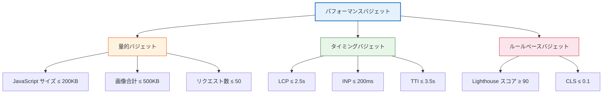

**量的バジェット（Quantity-based Budget）**は、リソースのサイズやリクエスト数を制限する。最も設定しやすく、CIパイプラインでの自動チェックに適している。JavaScriptバンドルのサイズ、画像の合計サイズ、Webフォントのサイズ、HTTPリクエスト数などがこれに該当する。

**タイミングバジェット（Timing-based Budget）**は、ユーザーが体感する時間を直接制限する。LCP、TTI、First Contentful Paint (FCP) など、ユーザー体験に直結する指標を対象とする。ただし、タイミング指標はネットワーク環境やデバイス性能に依存するため、再現性の確保が量的バジェットよりも難しい。

**ルールベースバジェット（Rule-based Budget）**は、LighthouseスコアやWebPageTestのグレードなど、複合的な評価基準に基づく。複数の指標を総合的に評価できるが、スコアの算出方法がツールのバージョンによって変わる可能性がある点に注意が必要である。

### 1.3 パフォーマンスバジェットの策定プロセス

パフォーマンスバジェットを決定するためのアプローチは主に3つある。

**競合分析アプローチ**は、競合サイトのパフォーマンスを計測し、そこから20%以上高速な目標を設定する方法である。Googleの調査によれば、ユーザーが速度の違いを知覚するには20%以上の差が必要とされている（Just Noticeable Difference）。

**ユーザーデータアプローチ**は、自社サイトの実データ（Real User Monitoring）から、パフォーマンスとビジネス指標（コンバージョン率、直帰率など）の相関を分析し、最適な閾値を導出する方法である。データに基づくため説得力が高いが、十分な量のデータと分析基盤が前提となる。

**デバイスベースアプローチ**は、ターゲットユーザーのデバイスとネットワーク環境から逆算する方法である。例えば、ミッドレンジのAndroid端末で4G回線を使用するユーザーをターゲットとする場合、ページの総転送量は170KB以下が望ましいという試算がある。これは、5秒以内にインタラクティブな状態を実現するために必要な制約である。

## 2. Core Web Vitals

### 2.1 Core Web Vitalsの位置づけ

**Core Web Vitals**は、Googleが2020年に提唱したWebページのユーザー体験を評価するための核心的な指標群である。Googleの検索ランキングアルゴリズムの要素としても使用されており、SEOの観点からも無視できない。

Core Web Vitalsは、ユーザー体験の3つの側面を各1つの指標で代表する。

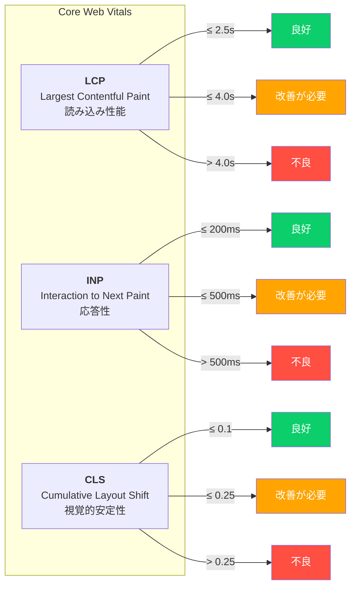

Core Web Vitalsの評価は、フィールドデータ（実ユーザーのデータ）の**75パーセンタイル値**に基づいて行われる。つまり、訪問者の75%がその閾値以下の体験をしている必要がある。

### 2.2 Largest Contentful Paint (LCP)

**LCP**は、ページのビューポート内で最も大きなコンテンツ要素がレンダリングされるまでの時間を計測する。「ページが読み込まれた」とユーザーが感じるタイミングの近似値として設計されている。

LCPの候補となる要素は以下の通りである。

- `` 要素
- `<video>` 要素（ポスター画像を使用する場合）
- `url()` によるCSS背景画像を持つ要素
- テキストノードを含むブロックレベル要素（`<h1>`, `<p>` など）

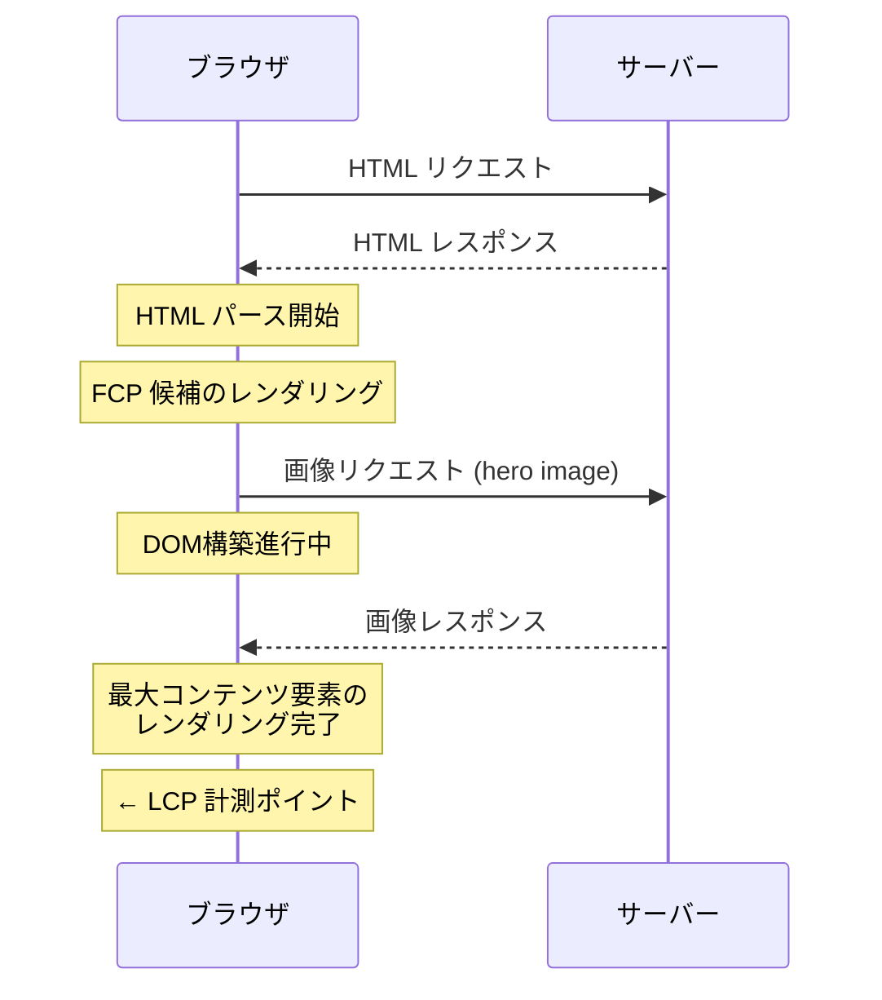

LCPの改善においては、以下の4つのサブパートを理解することが重要である。

1. **Time to First Byte (TTFB)**: サーバーの応答速度。CDNの活用やサーバーサイドのキャッシュが有効。
2. **Resource Load Delay**: LCPリソースの読み込み開始までの遅延。`<link rel="preload">` による事前読み込みが効果的。
3. **Resource Load Duration**: LCPリソースの読み込み時間。画像の最適化や適切なフォーマット選択（WebP, AVIF）が重要。
4. **Element Render Delay**: リソース読み込み完了からレンダリングまでの遅延。レンダリングブロッキングリソースの削減が鍵。

::: tip LCPの改善で最も効果が高い施策
ヒーロー画像がLCP要素である場合、`<link rel="preload" as="image" fetchpriority="high">` を使用することで、ブラウザが画像を可能な限り早く取得し始める。これだけで数百ミリ秒の改善が得られることが多い。
:::

### 2.3 Interaction to Next Paint (INP)

**INP**は、2024年3月にFirst Input Delay (FID) に代わってCore Web Vitalsの指標となった。FIDが「最初のインタラクション」のみを計測していたのに対し、INPはページのライフサイクル全体を通じたインタラクションの応答性を評価する。

INPは、ユーザーのインタラクション（クリック、タップ、キーボード入力）に対して、次のフレームが描画されるまでの時間を計測する。具体的には、ページ上で発生した全インタラクションの中から、最も遅いもの（外れ値を除く）をINPの値として報告する。

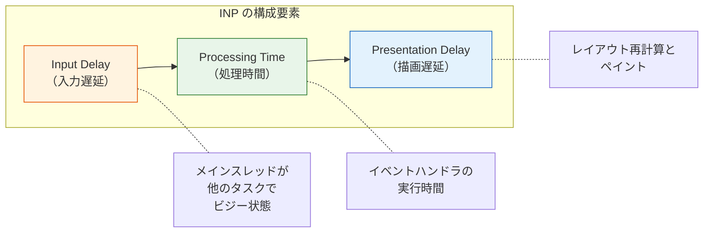

INPの改善には、以下の戦略が有効である。

**Input Delayの削減**: メインスレッドでの長時間タスク（Long Task）を分割する。50ms以上のタスクはLong Taskと見なされ、その実行中にユーザーがインタラクションを行うと、タスク完了まで応答が遅延する。`requestIdleCallback` や `scheduler.yield()` を使ってタスクを分割することが推奨される。

**Processing Timeの削減**: イベントハンドラ内での不要な計算を排除する。特に、DOMの大量更新やステートの複雑な再計算は、処理時間を増大させる主要因である。

**Presentation Delayの削減**: DOMサイズの最適化や、CSSの `content-visibility` プロパティの活用により、レイアウト計算のコストを削減する。

```javascript
// Bad: Long task blocks the main thread
function handleClick() {
  // This blocks the main thread for potentially hundreds of ms
  const results = processLargeDataset(data);
  updateDOM(results);
}

// Good: Break up work using scheduler.yield()
async function handleClick() {
  const chunk1 = processChunk(data, 0, 1000);
  updateDOM(chunk1); // Show partial results immediately

  await scheduler.yield(); // Yield to the browser

  const chunk2 = processChunk(data, 1000, 2000);
  updateDOM(chunk2);
}
```

### 2.4 Cumulative Layout Shift (CLS)

**CLS**は、ページの読み込み中および操作中に発生する予期しないレイアウトのずれを定量化する指標である。ボタンをタップしようとした瞬間にレイアウトがずれて、意図しない要素をタップしてしまう——このようなフラストレーションの原因を数値化する。

CLSのスコアは、以下の式で算出される。

$$
\text{Layout Shift Score} = \text{Impact Fraction} \times \text{Distance Fraction}
$$

**Impact Fraction**は、不安定な要素がビューポートに占める面積の割合であり、**Distance Fraction**は、不安定な要素が移動した距離のビューポート高さに対する割合である。

CLSは、ページのライフサイクル全体を通じて発生するすべてのレイアウトシフトの中から、「セッションウィンドウ」と呼ばれる連続するシフトのグループを形成し、その中で最大のスコアを持つウィンドウの値を報告する。セッションウィンドウは、各シフトの間隔が1秒以内で、ウィンドウ全体の持続時間が5秒以内のものとして定義される。

```
レイアウトシフトのタイムライン例：

        セッションウィンドウ 1       セッションウィンドウ 2
       ┌─────────────────────┐    ┌──────────────────┐
時間 ──┼──┼──┼───────────────┼────┼──┼──┼────────────┼──→
       s1 s2 s3              5s   s4 s5 s6
       0.02+0.05+0.03=0.10        0.01+0.02+0.01=0.04

CLS = max(0.10, 0.04) = 0.10
```

CLSの主な発生原因と対策は以下の通りである。

| 原因 | 対策 |
|------|------|
| サイズ未指定の画像・動画 | `width` と `height` 属性を必ず指定する。CSSの `aspect-ratio` も有効 |
| 動的に挿入されるコンテンツ | 挿入先のスペースを事前に確保する（スケルトンUIなど） |
| Webフォントの読み込み | `font-display: swap` + `<link rel="preload">` + サイズ調整 |
| 動的なリサイズ | `transform` アニメーションを使用し、レイアウトプロパティの変更を避ける |

::: warning CLSとSPAの注意点
Single Page Application (SPA) では、ページ遷移時にRoute変更に伴うレイアウトシフトが発生しやすい。SPAにおけるCLSは、View Transitionsのタイミングなどソフトナビゲーションの扱いに注意が必要である。Chromeチームは「ソフトナビゲーション」の検出に関する実験的なAPIを開発しており、将来的にSPAでもより正確なCLS計測が可能になると期待されている。
:::

## 3. メトリクスの計測方法

### 3.1 ラボデータとフィールドデータ

パフォーマンスメトリクスの計測には、2つの本質的に異なるアプローチがある。

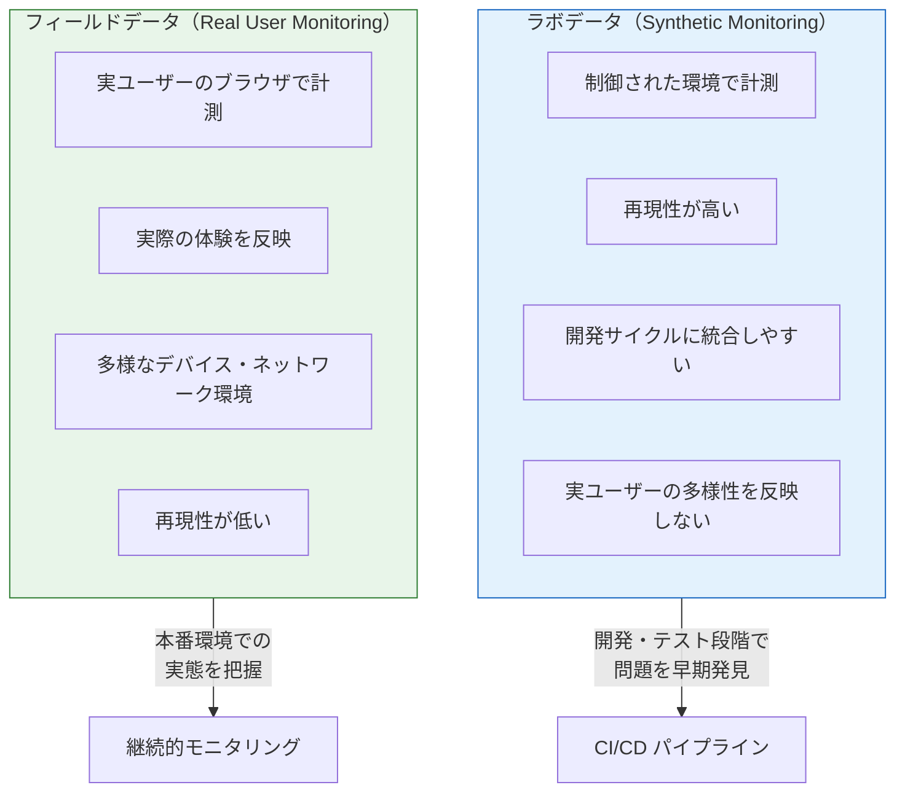

**ラボデータ**は、Lighthouse、WebPageTest、Chrome DevToolsなどのツールを使って、制御された環境で計測する。CPU性能やネットワーク速度をシミュレートして一貫した条件下で計測できるため、CIパイプラインでの自動テストに適している。ただし、実ユーザーのデバイスやネットワーク環境の多様性を反映しない。

**フィールドデータ**は、実際のユーザーのブラウザで計測される。Chrome User Experience Report (CrUX) は、Chromeブラウザからオプトインで収集された匿名のパフォーマンスデータを集約したデータセットであり、Core Web Vitalsの公式な評価に使用される。フィールドデータは実態を反映するが、特定のページ変更がもたらした影響を特定しにくい。

パフォーマンスバジェットの運用においては、**ラボデータをゲートキーパーとして使い、フィールドデータでバリデーションする**という二段構えが推奨される。

### 3.2 Web Vitals JavaScript ライブラリ

Googleが提供する `web-vitals` ライブラリは、Core Web Vitalsをフィールドで計測するための標準的なJavaScriptライブラリである。

```javascript
import { onLCP, onINP, onCLS } from "web-vitals";

// Report each metric to an analytics endpoint
function sendToAnalytics(metric) {
  const body = JSON.stringify({
    name: metric.name,
    value: metric.value,
    rating: metric.rating, // "good", "needs-improvement", or "poor"
    delta: metric.delta,
    id: metric.id,
    navigationType: metric.navigationType,
  });

  // Use sendBeacon for reliable delivery even on page unload
  if (navigator.sendBeacon) {
    navigator.sendBeacon("/api/analytics", body);
  } else {
    fetch("/api/analytics", { body, method: "POST", keepalive: true });
  }
}

onLCP(sendToAnalytics);
onINP(sendToAnalytics);
onCLS(sendToAnalytics);
```

`web-vitals` ライブラリは、ブラウザの Performance API（`PerformanceObserver`）をラップし、各メトリクスの計測ロジックの複雑さを隠蔽する。例えば、LCPの計測では `largest-contentful-paint` エントリタイプを監視し、ユーザーのインタラクション（クリックやキー入力）が発生した時点で最終値を確定する。

### 3.3 Performance API の活用

ブラウザのPerformance APIは、`web-vitals` ライブラリの内部でも使用されているが、カスタムメトリクスの計測にも直接利用できる。

```javascript
// Observe Long Tasks (>50ms)
const longTaskObserver = new PerformanceObserver((list) => {
  for (const entry of list.getEntries()) {
    console.log(`Long Task detected: ${entry.duration}ms`);
    // Report to monitoring system
  }
});
longTaskObserver.observe({ type: "longtask", buffered: true });

// Measure custom user timing
performance.mark("feature-start");
await loadFeatureModule();
performance.mark("feature-end");
performance.measure("feature-load", "feature-start", "feature-end");

const [measure] = performance.getEntriesByName("feature-load");
console.log(`Feature loaded in ${measure.duration}ms`);
```

`PerformanceObserver` を用いたLong Taskの検出は、INPの改善において特に有用である。Long Taskがどのタイミングで発生しているかを特定することで、メインスレッドのブロッキングの原因を突き止めることができる。

### 3.4 Chrome DevToolsによるラボ計測

Chrome DevToolsのPerformanceパネルは、パフォーマンスのボトルネックを視覚的に特定するための強力なツールである。

主要な機能として以下がある。

- **Performanceパネル**: フレームレート、CPU使用率、ネットワークアクティビティのタイムラインを記録・分析する。Main ThreadのFlame Chartから、どの関数が処理時間を消費しているかを特定できる。
- **Lighthouseパネル**: DevToolsに統合されたLighthouseを実行し、パフォーマンススコアと改善提案を得る。
- **Networkパネル**: スロットリング機能（Slow 3G, Fast 3Gなど）を使って、低速ネットワーク環境でのページ読み込みをシミュレートする。
- **Coverageパネル**: 読み込まれたJavaScriptとCSSのうち、実際に使用された割合を可視化する。未使用コードの特定に有効。

::: details DevToolsのCPUスロットリング設定
DevToolsのPerformanceパネルでは、CPUスロットリング（4x slowdown, 6x slowdown）を設定できる。これにより、高性能な開発マシン上でもミッドレンジのモバイルデバイスに近い環境をシミュレートできる。パフォーマンスバジェットのラボテストでは、4x slowdownを標準的なテスト条件とすることが推奨される。
:::

## 4. Lighthouse CI

### 4.1 Lighthouseとは

**Lighthouse**は、Googleが開発したオープンソースのWebページ品質監査ツールである。パフォーマンス、アクセシビリティ、ベストプラクティス、SEOの4カテゴリについて自動的に評価を行い、0〜100のスコアと具体的な改善提案を提示する。

Lighthouseのパフォーマンススコアは、以下のメトリクスの加重平均として算出される（Lighthouse 12時点）。

| メトリクス | 重み |
|-----------|------|
| First Contentful Paint (FCP) | 10% |
| Speed Index (SI) | 10% |
| Largest Contentful Paint (LCP) | 25% |
| Total Blocking Time (TBT) | 30% |
| Cumulative Layout Shift (CLS) | 25% |

Total Blocking Time (TBT) は、ラボ環境におけるINPの代替指標として使用されている。FIDの計測にはユーザーのインタラクションが必要であり、ラボ環境では再現が困難であるためである。TBTは、FCPからTime to Interactiveまでの間にメインスレッドがブロックされた合計時間を計測する。

### 4.2 Lighthouse CIのアーキテクチャ

**Lighthouse CI (LHCI)** は、LighthouseをCI/CDパイプラインに統合するためのツール群である。Pull Requestごとにパフォーマンスを自動計測し、設定した閾値を下回った場合にビルドを失敗させることができる。

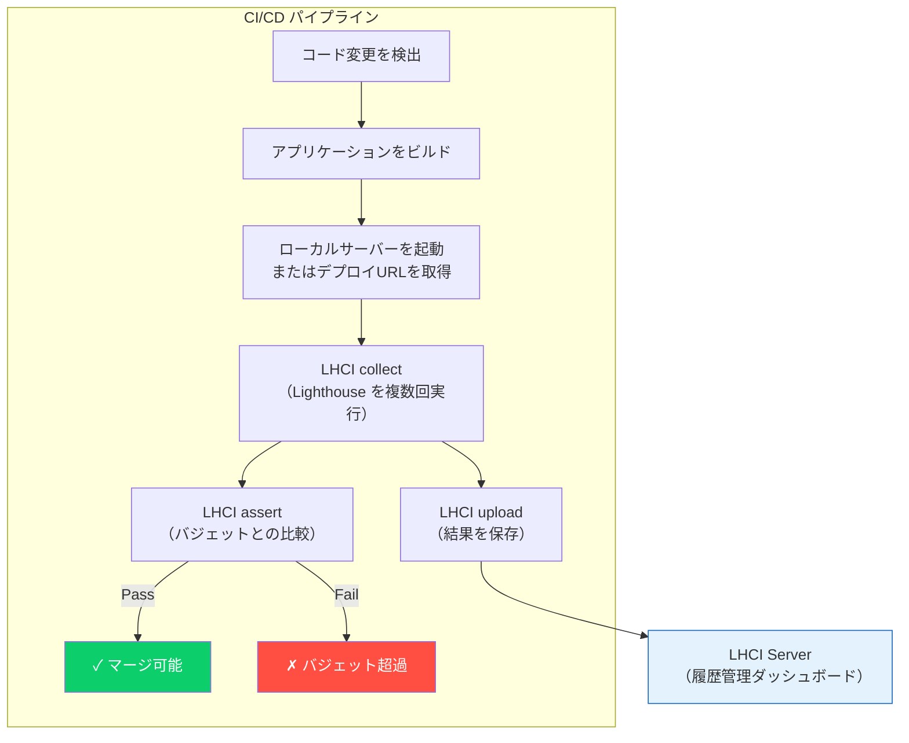

Lighthouse CIは3つの主要コマンドで構成される。

- **`lhci collect`**: 指定されたURLに対してLighthouseを複数回実行し、結果を収集する。複数回実行することで、ラボ環境特有の計測ノイズを軽減する。
- **`lhci assert`**: 収集した結果をパフォーマンスバジェットと比較し、合否を判定する。
- **`lhci upload`**: 結果をLHCI ServerまたはGoogle Cloud上のTemporary Public Storageにアップロードし、履歴として管理する。

### 4.3 Lighthouse CIの設定

Lighthouse CIの設定は、プロジェクトルートの `lighthouserc.js`（または `.lighthouserc.json`, `.lighthouserc.yml`）に記述する。

```javascript
// lighthouserc.js
module.exports = {
  ci: {
    collect: {
      // Run Lighthouse 5 times to reduce noise
      numberOfRuns: 5,

      // Start a local server for testing
      startServerCommand: "npm run start",
      startServerReadyPattern: "ready on",

      // URLs to audit
      url: [
        "http://localhost:3000/",
        "http://localhost:3000/products",
        "http://localhost:3000/checkout",
      ],

      // Lighthouse configuration
      settings: {
        // Simulate a mid-tier mobile device
        preset: "desktop",
        // Or use custom throttling
        // throttling: {
        //   cpuSlowdownMultiplier: 4,
        //   downloadThroughputKbps: 1600,
        //   uploadThroughputKbps: 768,
        //   rttMs: 150,
        // },
      },
    },

    assert: {
      assertions: {
        // Core Web Vitals budgets
        "largest-contentful-paint": ["error", { maxNumericValue: 2500 }],
        "cumulative-layout-shift": ["error", { maxNumericValue: 0.1 }],
        "total-blocking-time": ["error", { maxNumericValue: 300 }],

        // Lighthouse score budgets
        "categories:performance": ["error", { minScore: 0.9 }],
        "categories:accessibility": ["warn", { minScore: 0.9 }],

        // Resource size budgets
        "resource-summary:script:size": [
          "error",
          { maxNumericValue: 200000 }, // 200KB
        ],
        "resource-summary:total:size": [
          "error",
          { maxNumericValue: 1000000 }, // 1MB
        ],
      },
    },

    upload: {
      // Use temporary public storage (free, 7-day retention)
      target: "temporary-public-storage",

      // Or use a self-hosted LHCI server
      // target: 'lhci',
      // serverBaseUrl: 'https://lhci.example.com',
      // token: process.env.LHCI_TOKEN,
    },
  },
};
```

### 4.4 GitHub Actionsとの統合

Lighthouse CIをGitHub Actionsに統合する典型的なワークフロー定義を以下に示す。

```yaml
# .github/workflows/lighthouse.yml
name: Lighthouse CI

on:
  pull_request:
    branches: [main]

jobs:
  lighthouse:
    runs-on: ubuntu-latest
    steps:
      - uses: actions/checkout@v4

      - uses: actions/setup-node@v4
        with:
          node-version: 20
          cache: "npm"

      - name: Install dependencies
        run: npm ci

      - name: Build application
        run: npm run build

      - name: Run Lighthouse CI
        run: |
          npm install -g @lhci/cli@0.14.x
          lhci autorun
        env:
          LHCI_GITHUB_APP_TOKEN: ${{ secrets.LHCI_GITHUB_APP_TOKEN }}
```

`lhci autorun` は、`collect`、`assert`、`upload` の3ステップを順番に実行するコンビニエンスコマンドである。`LHCI_GITHUB_APP_TOKEN` を設定することで、Pull RequestにLighthouseの結果をステータスチェックとして表示できる。

### 4.5 Lighthouseの計測ノイズへの対処

Lighthouseのラボ計測には、同じページを同じ条件で計測しても結果が変動するという課題がある（計測ノイズ）。CIのリソース制約（CPUやメモリの可用性の変動）がこの問題を増幅する。

計測ノイズへの対処として、以下の手法が推奨される。

1. **複数回実行**: `numberOfRuns: 5` 以上に設定し、中央値（median）を使用する。LHCI はデフォルトでmedian runを選択する。
2. **閾値にマージンを設ける**: 目標値がLCP 2.5秒であれば、バジェットは2.0秒に設定するなど、ノイズ分のマージンを確保する。
3. **差分ベースの比較**: 絶対値ではなく、ベースライン（mainブランチ）との差分で判定する。LHCIの `assert` には `preset: 'lighthouse:no-pwa'` のようなプリセットや、baselineとの比較機能がある。
4. **専用のCI環境**: 可能であれば、パフォーマンステスト用の固定スペックのランナーを用意する。

## 5. バンドルサイズの管理

### 5.1 なぜバンドルサイズが重要なのか

JavaScriptのバンドルサイズは、Webアプリケーションのパフォーマンスに多面的な影響を与える。

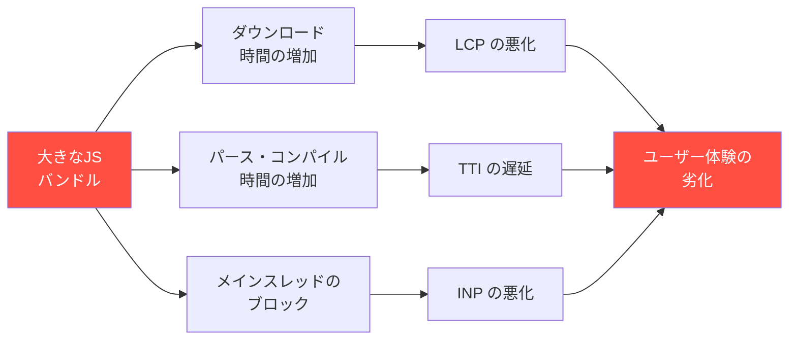

JavaScriptはダウンロードだけでなく、パース（構文解析）とコンパイル（バイトコードへの変換）にもCPU時間を消費する。Addy Osmani氏の調査によると、ミッドレンジのモバイルデバイスでは、1MBのJavaScriptのパースに約2〜4秒を要する。これは同サイズの画像の処理時間と比較して、はるかに大きなコストである。

したがって、バンドルサイズの管理は、パフォーマンスバジェットの中でも最優先で取り組むべき領域である。

### 5.2 bundlesize

**bundlesize**は、バンドルファイルのサイズを検証するシンプルなCLIツールである。`package.json` に閾値を定義し、CIで実行することで、バンドルサイズの増加を自動的に検出する。

```json
{
  "name": "my-app",
  "bundlesize": [
    {
      "path": "./dist/js/main.*.js",
      "maxSize": "150 kB",
      "compression": "gzip"
    },
    {
      "path": "./dist/js/vendor.*.js",
      "maxSize": "120 kB",
      "compression": "gzip"
    },
    {
      "path": "./dist/css/main.*.css",
      "maxSize": "20 kB",
      "compression": "gzip"
    }
  ]
}
```

```bash
# Run bundlesize check
npx bundlesize

# Output example:
# PASS  ./dist/js/main.abc123.js: 142 kB < 150 kB (gzip)
# FAIL  ./dist/js/vendor.def456.js: 135 kB > 120 kB (gzip)
# PASS  ./dist/css/main.ghi789.css: 12 kB < 20 kB (gzip)
```

bundlesizeはGitHub Statusとの連携機能を持ち、Pull Requestにサイズチェックの結果を表示できる。ただし、bundlesizeはメンテナンスが停滞気味であり、より現代的な代替ツールの検討が推奨される。

### 5.3 size-limit

**size-limit**は、Andrey Sitnik（PostCSSやAutoprefixerの作者）が開発したバンドルサイズの検証ツールである。bundlesizeと比較して以下の利点がある。

- **実行時間の計測**: ファイルサイズだけでなく、JavaScriptの実行にかかる時間も計測できる。
- **Tree-shakingの考慮**: `import` 文を解析し、実際に使用されるコードのサイズを計測できる。
- **柔軟な設定**: プラグインベースのアーキテクチャで、計測対象をカスタマイズできる。

```json
{
  "size-limit": [
    {
      "path": "dist/my-library.js",
      "limit": "10 kB"
    },
    {
      "name": "Core module",
      "path": "dist/core.js",
      "limit": "5 kB",
      "import": "{ core }",
      "running": false
    },
    {
      "name": "Full bundle with execution time",
      "path": "dist/index.js",
      "limit": "50 ms",
      "running": true
    }
  ]
}
```

```bash
# Run size-limit check
npx size-limit

# Output example:
#   Package size limit
#
#   dist/my-library.js
#   Size:  8.2 kB   ✓ (limit: 10 kB)
#   Time:  45 ms
#
#   Core module
#   Size:  3.1 kB   ✓ (limit: 5 kB)
#
#   Full bundle with execution time
#   Time:  38 ms    ✓ (limit: 50 ms)
```

size-limitは、ライブラリの作者にとって特に有用である。`import` オプションを使うことで、ライブラリの特定のエクスポートだけをインポートした場合のサイズを計測でき、Tree-shakingが正しく機能しているかを検証できる。

### 5.4 webpack-bundle-analyzer と Source Map Explorer

バンドルサイズが予算を超過した場合、**何が原因でサイズが増加しているのか**を特定する必要がある。そのためのツールとして、`webpack-bundle-analyzer` と `source-map-explorer` が広く使われている。

```javascript
// webpack.config.js
const BundleAnalyzerPlugin =
  require("webpack-bundle-analyzer").BundleAnalyzerPlugin;

module.exports = {
  plugins: [
    new BundleAnalyzerPlugin({
      analyzerMode: "static", // Generate HTML report
      reportFilename: "bundle-report.html",
      openAnalyzer: false,
    }),
  ],
};
```

`webpack-bundle-analyzer` は、バンドルに含まれるモジュールをTreemapで可視化する。どのライブラリがどれだけのサイズを占めているかが一目瞭然となり、以下のような最適化の判断材料を提供する。

- 大きなライブラリの軽量な代替品への置き換え（例：`moment.js` → `date-fns` or `dayjs`）
- 不要なロケールやポリフィルの除去
- Dynamic importによるコード分割の候補特定
- 重複してバンドルされているモジュールの検出

`source-map-explorer` はwebpackに限らず、Source Mapが利用可能な任意のバンドルに対して同様の分析を提供する。

```bash
# Generate a visual report from source maps
npx source-map-explorer dist/js/main.*.js --html report.html
```

### 5.5 Import Cost の可視化

バンドルサイズの管理は、CIでの事後チェックだけでなく、開発時のリアルタイムフィードバックも重要である。VS Codeの **Import Cost** 拡張機能は、`import` 文の横にそのモジュールのサイズをインラインで表示する。

```
import { debounce } from 'lodash';       // 72.5KB (gzip: 25.3KB) ← 大きい
import debounce from 'lodash/debounce';   // 1.2KB  (gzip: 0.5KB) ← 適切
import { debounce } from 'lodash-es';     // 0.4KB  (gzip: 0.2KB) ← Tree-shaking可能
```

このようなリアルタイムのフィードバックは、開発者が依存関係を追加する時点でサイズを意識する習慣を醸成する。

## 6. CIパイプラインへの統合

### 6.1 パフォーマンスゲートの設計

パフォーマンスバジェットの真価は、CIパイプラインに統合して**自動的に強制する**ことで発揮される。手動でのチェックに依存すると、締め切りのプレッシャーや怠慢により、バジェット超過が見逃される。

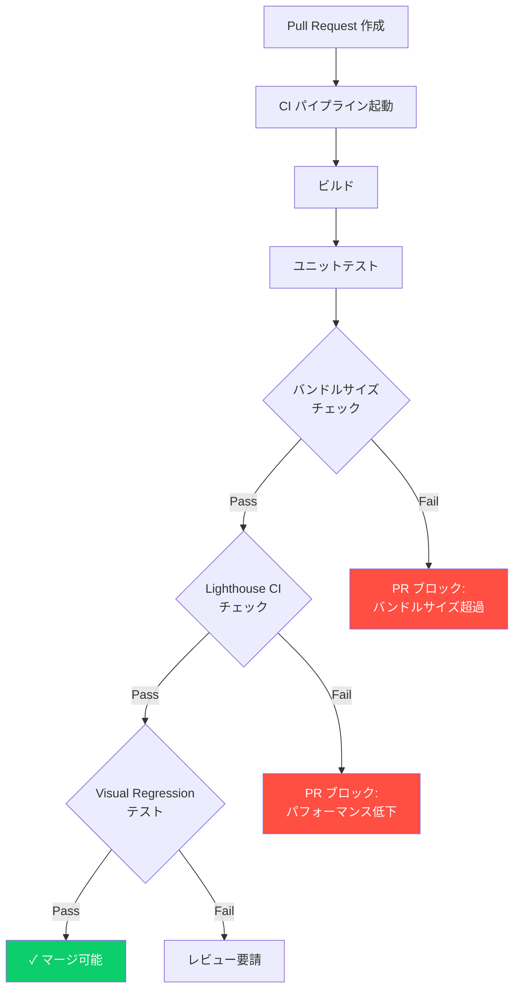

パフォーマンスゲートは、テストピラミッドと同様に、コストの低いチェックから順に実行するのが効率的である。

1. **バンドルサイズチェック**（高速・低コスト）: ビルド成果物のファイルサイズを検証する。数秒で完了する。
2. **Lighthouse CI**（中速・中コスト）: ブラウザを起動してページをレンダリングし、パフォーマンスメトリクスを計測する。1URL あたり数分を要する。
3. **フルE2Eパフォーマンステスト**（低速・高コスト）: 複雑なユーザーシナリオをシミュレートし、包括的なパフォーマンス評価を行う。

### 6.2 実践的なCIワークフロー

以下は、バンドルサイズチェックとLighthouse CIを組み合わせた実践的なGitHub Actionsワークフローの例である。

```yaml
# .github/workflows/performance.yml
name: Performance Budget

on:
  pull_request:
    branches: [main]

jobs:
  bundle-size:
    runs-on: ubuntu-latest
    steps:
      - uses: actions/checkout@v4

      - uses: actions/setup-node@v4
        with:
          node-version: 20
          cache: "npm"

      - run: npm ci
      - run: npm run build

      # Check bundle sizes
      - name: Check bundle size
        run: npx size-limit

      # Comment bundle size diff on PR
      - uses: andresz1/size-limit-action@v1
        with:
          github_token: ${{ secrets.GITHUB_TOKEN }}
          skip_step: build

  lighthouse:
    runs-on: ubuntu-latest
    needs: bundle-size
    steps:
      - uses: actions/checkout@v4

      - uses: actions/setup-node@v4
        with:
          node-version: 20
          cache: "npm"

      - run: npm ci
      - run: npm run build

      - name: Run Lighthouse CI
        run: |
          npm install -g @lhci/cli@0.14.x
          lhci autorun
        env:
          LHCI_GITHUB_APP_TOKEN: ${{ secrets.LHCI_GITHUB_APP_TOKEN }}
```

`size-limit-action` は、Pull Requestのベースブランチとの差分を計算し、コメントとして以下のような表を投稿する。

```
📦 Size Changes

| Path                  | Base    | Current | Diff     |
|-----------------------|---------|---------|----------|
| dist/js/main.js       | 142 kB  | 148 kB  | +6 kB 🔺 |
| dist/js/vendor.js     | 118 kB  | 118 kB  | 0        |
| dist/css/main.css     | 12 kB   | 11 kB   | -1 kB 🔽 |
```

この可視化により、レビュアーがサイズの変化を一目で把握でき、「この6KBの増加は何が原因か？」という議論を促進する。

### 6.3 段階的な導入戦略

パフォーマンスバジェットの導入には、段階的なアプローチが推奨される。いきなり厳格なバジェットを設定すると、既存のコードがバジェットを超過してCIが常に失敗する状態に陥り、チームの反発を招く。

**Phase 1: 観測フェーズ（2〜4週間）**

まず、現状のパフォーマンスを計測し、ベースラインを確立する。この段階ではバジェット超過をwarningとして報告するだけで、ビルドを失敗させない。

```javascript
// lighthouserc.js - Phase 1: Warning only
assert: {
  assertions: {
    "largest-contentful-paint": ["warn", { maxNumericValue: 4000 }],
    "cumulative-layout-shift": ["warn", { maxNumericValue: 0.25 }],
    "total-blocking-time": ["warn", { maxNumericValue: 600 }],
  },
},
```

**Phase 2: ソフトゲートフェーズ（4〜8週間）**

現状のベースラインに基づいてバジェットを設定し、超過をerrorとして報告する。ただし、正当な理由がある場合はバイパスを許可する。

**Phase 3: ハードゲートフェーズ**

バジェットの超過はPull Requestのマージをブロックする。例外的な超過は、意図的なバジェット引き上げ（バジェットの値自体の変更をPull Requestとして提出する）として対応する。

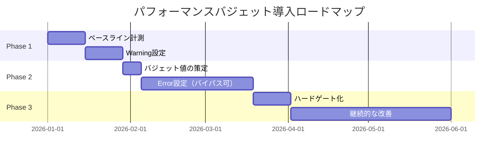

## 7. RUM（Real User Monitoring）

### 7.1 RUMの必要性

ラボ計測（Lighthouse CI）とフィールド計測（RUM）は補完的な関係にある。ラボ計測はCIパイプラインでの自動チェックに適しているが、以下の限界がある。

- **ネットワーク環境の多様性**: 実ユーザーは2G/3G/4G/5G/WiFi/衛星回線など、多様なネットワーク環境を使用する。ラボ環境で全てをシミュレートすることは不可能である。
- **デバイスの多様性**: ローエンドのAndroid端末から最新のiPhone、デスクトップPCまで、CPUやメモリの性能は桁違いに異なる。
- **地理的な多様性**: CDNのキャッシュヒット率やDNSの解決時間は、ユーザーの地理的位置によって大きく変わる。
- **実際の使用パターン**: SPAのナビゲーション、スクロール、フォーム入力など、実際のユーザー行動はラボテストでは再現しきれない。

RUMは、これらの実世界の多様性を反映したパフォーマンスデータを収集する。

### 7.2 RUMの実装アーキテクチャ

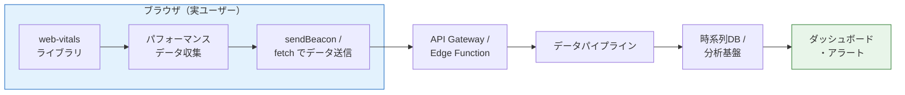

RUMの実装においては、パフォーマンスデータの送信自体がパフォーマンスに影響を与えないよう注意する必要がある。`navigator.sendBeacon` は、ページのアンロード時でもデータを確実に送信できるAPIであり、RUMデータの送信に最適である。

```javascript
// rum.js - Minimal RUM implementation
import { onLCP, onINP, onCLS, onFCP, onTTFB } from "web-vitals";

const queue = [];
const FLUSH_INTERVAL = 5000; // 5 seconds
const ENDPOINT = "/api/rum";

function addToQueue(metric) {
  queue.push({
    name: metric.name,
    value: metric.value,
    rating: metric.rating,
    delta: metric.delta,
    id: metric.id,
    // Add context
    url: location.href,
    userAgent: navigator.userAgent,
    connection: navigator.connection?.effectiveType || "unknown",
    deviceMemory: navigator.deviceMemory || "unknown",
    timestamp: Date.now(),
  });
}

function flush() {
  if (queue.length === 0) return;

  const body = JSON.stringify(queue.splice(0));

  if (navigator.sendBeacon) {
    navigator.sendBeacon(ENDPOINT, body);
  } else {
    fetch(ENDPOINT, { body, method: "POST", keepalive: true });
  }
}

// Collect Core Web Vitals
onLCP(addToQueue);
onINP(addToQueue);
onCLS(addToQueue);
onFCP(addToQueue);
onTTFB(addToQueue);

// Periodic flush
setInterval(flush, FLUSH_INTERVAL);

// Flush on page visibility change (user switches tab or navigates away)
document.addEventListener("visibilitychange", () => {
  if (document.visibilityState === "hidden") {
    flush();
  }
});
```

### 7.3 RUMデータの分析

RUMデータは、単純な平均値ではなく**パーセンタイル分布**で分析する。平均値は外れ値に大きく影響されるため、ユーザー体験の全体像を正しく反映しない。

```
LCP の分布例（フィールドデータ）：

    ユーザー数
    │
    │  ████
    │  ████
    │  ████████
    │  ████████████
    │  ████████████████
    │  ████████████████████
    │  ████████████████████████
    │  ████████████████████████████      ████
    ├──┴──┴──┴──┴──┴──┴──┴──┴──┴──┴──┴──┴──┴──→ LCP (秒)
    0  0.5  1.0  1.5  2.0  2.5  3.0  3.5  4.0

    p50 = 1.2s   p75 = 2.1s   p95 = 3.8s
    ↑             ↑             ↑
    中央値       Core Web Vitals  テールレイテンシ
                 の評価基準
```

**p75（75パーセンタイル）**は、Core Web Vitalsの公式な評価基準であり、「75%のユーザーがこの値以下の体験をしている」ことを意味する。パフォーマンスバジェットをp75で設定することで、大多数のユーザーに良好な体験を保証しつつ、極端なエッジケースに引きずられることを防ぐ。

**p95**は、テールレイテンシの監視に有用である。p75が良好でもp95が著しく悪い場合、特定の条件（低速ネットワーク、ローエンドデバイス、特定の地域）のユーザーが極端に悪い体験をしている可能性がある。

### 7.4 RUMサービスの選択肢

RUMの実装は、自前で構築する方法と、専用のSaaSサービスを利用する方法がある。

| サービス | 特徴 |
|---------|------|
| Google CrUX | 無料。Chromeユーザーからの匿名データ。28日間のローリングデータ。オリジン単位の集約 |
| Google Analytics (GA4) | Web Vitalsイベントを手動送信。既存のGA基盤を活用可能 |
| Sentry Performance | エラー監視と統合。トランザクション単位のパフォーマンス追跡 |
| Datadog RUM | 包括的なObservabilityプラットフォームの一部。セッションリプレイ機能 |
| SpeedCurve | パフォーマンス専門。Synthetic MonitoringとRUMの統合 |
| Vercel Analytics | Vercelデプロイと統合。Web Vitalsの自動収集 |

小規模なプロジェクトでは、CrUXとGoogleのPageSpeed Insights APIを組み合わせた無料の監視が現実的な選択肢である。中〜大規模なプロジェクトでは、Sentryやatadogなどの既存のObservabilityプラットフォームにRUMを統合することで、パフォーマンスの問題をエラーやインフラの状態と関連づけて分析できる。

### 7.5 RUMデータに基づくアラート設定

RUMデータを収集するだけでは不十分であり、パフォーマンスの劣化を早期に検知するアラートの設定が重要である。

```javascript
// Example: Alert configuration for performance degradation
const alertRules = [
  {
    metric: "LCP",
    percentile: "p75",
    threshold: 2500, // ms
    window: "1h", // 1-hour rolling window
    condition: "above_for_5_minutes",
    severity: "warning",
  },
  {
    metric: "LCP",
    percentile: "p75",
    threshold: 4000,
    window: "1h",
    condition: "above_for_5_minutes",
    severity: "critical",
  },
  {
    metric: "INP",
    percentile: "p75",
    threshold: 200,
    window: "1h",
    condition: "above_for_10_minutes",
    severity: "warning",
  },
  {
    metric: "CLS",
    percentile: "p75",
    threshold: 0.1,
    window: "1h",
    condition: "above_for_10_minutes",
    severity: "warning",
  },
];
```

アラートの設計においては、**フラッピング（アラートが頻繁にon/offを繰り返す状態）**を防ぐために、一定時間の持続を条件とすることが重要である。また、デプロイ直後は一時的にメトリクスが変動するため、デプロイイベントとの関連づけを行い、デプロイ起因のパフォーマンス劣化を迅速に特定できるようにする。

## 8. パフォーマンス改善の優先順位

### 8.1 影響度に基づくトリアージ

パフォーマンスの問題が複数存在する場合、すべてを同時に修正することは現実的ではない。限られたリソースを最大限に活用するために、改善のROI（投資対効果）に基づいて優先順位を設定する。

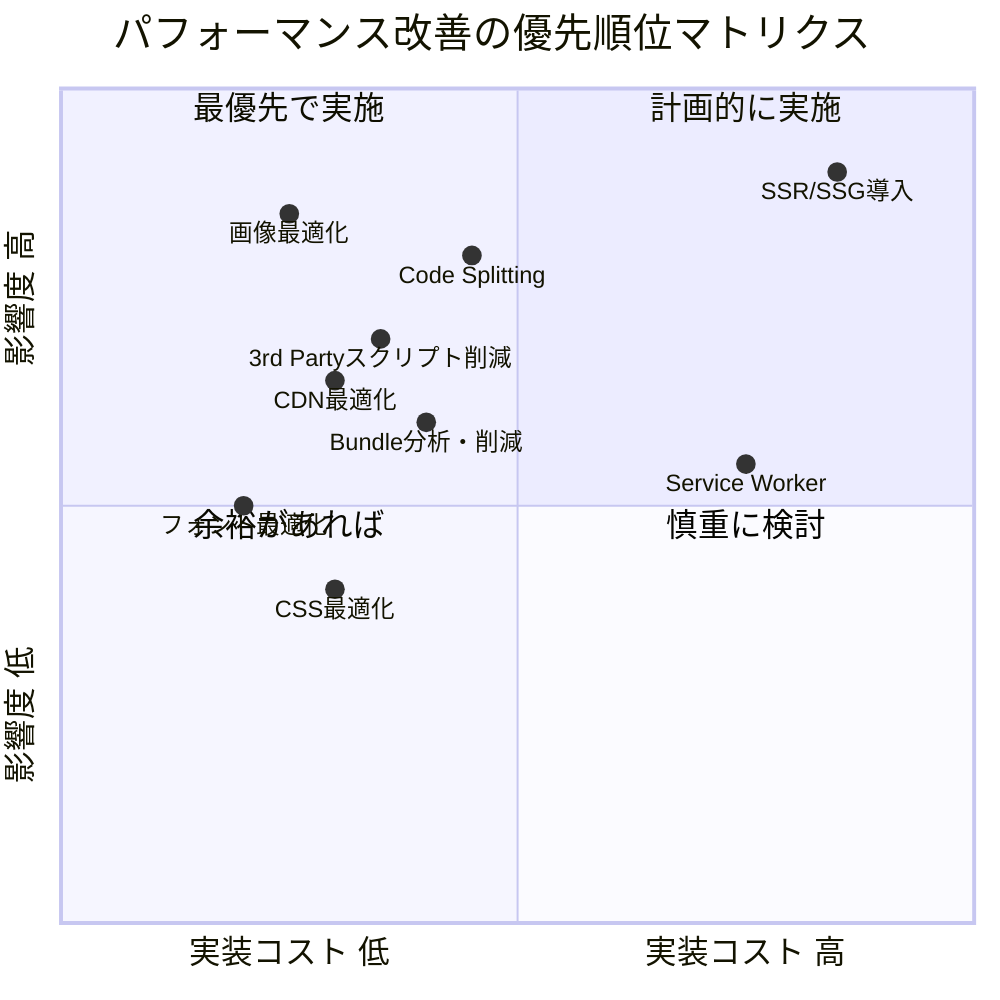

### 8.2 低コスト・高影響の改善策

**画像最適化**は、ほとんどのWebサイトで最もROIの高い改善策である。HTTP Archiveのデータによると、Webページの総転送量の約50%を画像が占めている。

```html
<!-- Before: Unoptimized image -->


<!-- After: Optimized with modern formats and responsive images -->

```

**コード分割（Code Splitting）**は、JavaScriptバンドルの初期読み込みサイズを大幅に削減する。Route-based code splittingは、ページ単位でバンドルを分割し、現在のページに必要なコードのみを読み込む。

```javascript
// Before: All routes bundled together
import Home from "./pages/Home";
import Products from "./pages/Products";
import Checkout from "./pages/Checkout";

// After: Route-based code splitting with React.lazy
import { lazy, Suspense } from "react";

const Home = lazy(() => import("./pages/Home"));
const Products = lazy(() => import("./pages/Products"));
const Checkout = lazy(() => import("./pages/Checkout"));

function App() {
  return (
    <Suspense fallback={<Loading />}>
      <Routes>
        <Route path="/" element={<Home />} />
        <Route path="/products" element={<Products />} />
        <Route path="/checkout" element={<Checkout />} />
      </Routes>
    </Suspense>
  );
}
```

**サードパーティスクリプトの管理**も、比較的低コストで大きな効果を得られる領域である。Google Tag Manager経由で多数のトラッキングスクリプトが挿入されているケースは珍しくなく、定期的な棚卸しが必要である。

```html
<!-- Load third-party scripts efficiently -->
<script src="https://analytics.example.com/tag.js" async></script>

<!-- Or defer non-critical scripts -->
<script>
  // Load non-critical third-party scripts after page load
  window.addEventListener("load", () => {
    const script = document.createElement("script");
    script.src = "https://chat-widget.example.com/widget.js";
    document.body.appendChild(script);
  });
</script>
```

### 8.3 高コスト・高影響の改善策

**SSR/SSG（Server-Side Rendering / Static Site Generation）の導入**は、アーキテクチャレベルの変更を伴うため実装コストが高いが、LCPの大幅な改善が期待できる。クライアントサイドレンダリング（CSR）のSPAでは、HTMLの取得後にJavaScriptのダウンロード・パース・実行が完了するまでコンテンツが表示されない。SSR/SSGはこのボトルネックを解消する。

**Service Workerによるキャッシュ戦略の導入**は、2回目以降の訪問のパフォーマンスを劇的に改善する。ただし、キャッシュの無効化戦略の設計が複雑であり、バグが発生した場合のデバッグも難しい。

### 8.4 Webフォントの最適化

Webフォントは、CLSとLCPの両方に影響を与える。フォントの読み込み中にテキストが表示されない（FOIT: Flash of Invisible Text）、または代替フォントから置き換わる際にレイアウトがずれる（FOUT: Flash of Unstyled Text）が発生する。

```css
/* Optimal font loading strategy */
@font-face {
  font-family: "CustomFont";
  src: url("/fonts/custom-font.woff2") format("woff2");
  font-display: swap;
  /* Size-adjust reduces layout shift when swapping fonts */
  size-adjust: 105%;
  ascent-override: 95%;
  descent-override: 20%;
  line-gap-override: 0%;
}
```

```html
<!-- Preload critical fonts -->
<link
  rel="preload"
  href="/fonts/custom-font.woff2"
  as="font"
  type="font/woff2"
  crossorigin
/>
```

`font-display: swap` と `size-adjust` の組み合わせは、FOUTによるCLSを最小限に抑えつつ、テキストの表示をブロックしない効果的な戦略である。

## 9. 組織でのパフォーマンス文化

### 9.1 パフォーマンスは技術の問題ではなく組織の問題である

パフォーマンスバジェットのツールや手法をどれだけ整備しても、組織がパフォーマンスを優先事項として位置づけなければ、持続的な改善は実現しない。新機能の開発が常にパフォーマンス改善よりも優先され、バジェットの超過が「今回だけは例外」として許容され続ければ、バジェットは形骸化する。

パフォーマンス文化の構築とは、**パフォーマンスの意思決定をプロセスに埋め込む**ことである。

### 9.2 パフォーマンスオーナーシップモデル

組織におけるパフォーマンスの責任体制は、以下のようなモデルが考えられる。

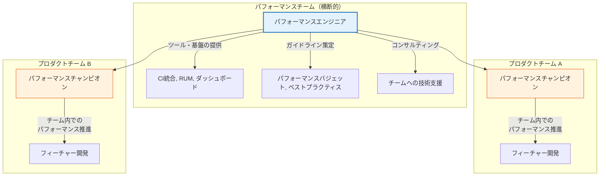

**パフォーマンスチャンピオンモデル**は、各プロダクトチームからパフォーマンスに関心の高いエンジニアを「チャンピオン」として任命し、チーム内でのパフォーマンス意識の向上を推進する体制である。横断的なパフォーマンスチームがツールやガイドラインを提供し、チャンピオンがそれをチームに浸透させる。

このモデルの利点は、パフォーマンスの責任を特定のチームに押し付けるのではなく、全チームが当事者意識を持つ点にある。パフォーマンスの問題は、しばしばフィーチャー開発の文脈で発生するため、フィーチャーチーム内にパフォーマンスの知見を持つメンバーがいることが重要である。

### 9.3 パフォーマンスダッシュボードの設計

パフォーマンスの可視化は、文化形成の重要な要素である。データが見えなければ、問題も改善も認識されない。

効果的なパフォーマンスダッシュボードには、以下の要素を含める。

**エグゼクティブビュー**: Core Web Vitalsの現在の状態を信号機（緑・黄・赤）で表示する。非技術的なステークホルダーにもパフォーマンスの状態が一目でわかるようにする。

**トレンドビュー**: 過去30日間のメトリクスの推移をグラフで表示する。デプロイイベントをオーバーレイし、パフォーマンスの変化とデプロイの相関を可視化する。

**詳細ビュー**: ページ別、デバイス別、地域別、ネットワーク環境別のメトリクス分布を表示する。パーセンタイル分布のヒストグラムで、ユーザー体験の全体像を把握する。

```
パフォーマンスダッシュボード例：

┌─────────── Core Web Vitals Overview ────────────┐
│                                                  │
│  LCP: 1.8s  [🟢 Good]    INP: 150ms [🟢 Good]  │
│  CLS: 0.08  [🟢 Good]    FCP: 1.1s  [🟢 Good]  │
│                                                  │
├─────────── LCP Trend (30 days) ─────────────────┤
│                                                  │
│  3.0s ┤                                         │
│  2.5s ┤──────────────────────── threshold ───── │
│  2.0s ┤         ╲                    ╱╲         │
│  1.5s ┤──╱╲──╱──╲──╲──╲────╱──╲╱    ╲──╲─     │
│  1.0s ┤                                         │
│       └──────────────────────────────────────    │
│        Jan 1    Jan 8   Jan 15  Jan 22  Jan 29  │
│                  ↑ deploy                        │
└─────────────────────────────────────────────────┘
```

### 9.4 パフォーマンスレビューの仕組み

コードレビューにパフォーマンスの観点を組み込むことは、予防的なアプローチとして有効である。

パフォーマンスレビューのチェックリスト例を以下に示す。

- 新しい依存関係の追加は、そのサイズと必要性を検討したか？
- 大きなライブラリの全量インポートではなく、必要な関数のみをインポートしているか？
- 画像には適切なフォーマット（WebP/AVIF）、サイズ、遅延読み込みが設定されているか？
- 新しいサードパーティスクリプトの追加は、パフォーマンスへの影響を計測したか？
- Code Splittingの機会はないか？
- CIのパフォーマンスチェックは通過しているか？

これらのチェックを自動化するために、ESLintのカスタムルールやPull Requestテンプレートを活用できる。

### 9.5 パフォーマンスバジェットの継続的な見直し

パフォーマンスバジェットは、一度設定したら終わりではない。以下のタイミングで定期的に見直すべきである。

- **四半期ごとのレビュー**: フィールドデータの推移を確認し、バジェットの妥当性を評価する。改善が進んでいればバジェットを引き締め、ビジネス要件の変化に応じてバジェットを調整する。
- **Core Web Vitalsの閾値変更時**: Googleがメトリクスの閾値やウェイトを更新した場合、バジェットもそれに合わせて更新する。
- **ターゲットユーザーの変化時**: 新しい市場への展開やユーザー層の変化に応じて、デバイスやネットワーク環境の前提を見直す。
- **大規模なアーキテクチャ変更時**: フレームワークの移行やSSR導入など、パフォーマンス特性が根本的に変わる場合は、バジェットの再策定が必要である。

### 9.6 ビジネスとパフォーマンスの接続

パフォーマンスの改善を組織の優先事項として位置づけるには、ビジネス指標との関連を示すことが不可欠である。

多くの企業が、パフォーマンスとビジネス指標の相関を公開している。

- **Google**: モバイルページの読み込みが1秒から3秒に遅くなると、直帰率が32%増加する。
- **Amazon**: ページの読み込み時間が100ms増加するごとに、売上が1%減少する。
- **Pinterest**: 知覚的な待ち時間を40%削減したことで、トラフィックが15%増加した。
- **Vodafone**: LCPを31%改善したことで、売上が8%増加した。

自社のデータでも同様の分析を行い、「LCPを500ms改善すると、コンバージョン率がX%向上する」という定量的な関係を示すことで、パフォーマンス改善への投資を正当化できる。

## 10. まとめ

パフォーマンスバジェットは、Webアプリケーションのパフォーマンスを**測定可能**かつ**強制可能**な形で管理するための仕組みである。

その実践は、以下の要素から構成される。

1. **メトリクスの選定**: Core Web Vitals（LCP、INP、CLS）を中心に、量的・タイミング・ルールベースのバジェットを設定する。
2. **ラボ計測の自動化**: Lighthouse CIをCIパイプラインに統合し、Pull Requestごとにパフォーマンスを検証する。
3. **バンドルサイズの管理**: size-limitやbundlesizeでバンドルサイズを制限し、webpack-bundle-analyzerで原因を特定する。
4. **フィールド計測の継続**: RUMにより実ユーザーのパフォーマンスを継続的に監視し、ラボ計測では捉えられない問題を検出する。
5. **組織文化の構築**: ダッシュボード、レビュープロセス、パフォーマンスチャンピオンの制度を通じて、パフォーマンスを全チームの関心事とする。

パフォーマンスの改善は、一度きりのプロジェクトではなく、**継続的なプロセス**である。機能追加と同じように、パフォーマンスの維持・改善にも継続的なリソースの配分が必要であり、パフォーマンスバジェットはそのためのガードレールとして機能する。ツールの導入だけでなく、パフォーマンスを重視する文化の醸成こそが、長期的に優れたユーザー体験を提供し続けるための鍵である。
