# 永続メモリ（Intel Optane, CXL）

## 1. 永続メモリとは

### 1.1 揮発性と永続性の狭間

コンピュータの記憶装置は、伝統的に2つのカテゴリに大別されてきた。電源を切るとデータが失われる**揮発性メモリ（volatile memory）** と、電源を切ってもデータが保持される**不揮発性ストレージ（non-volatile storage）** である。DRAMは前者の代表であり、HDD・SSDは後者の代表である。

この2つのカテゴリの間には、アクセス速度において数桁にわたるギャップが存在する。DRAMのアクセスレイテンシは数十ナノ秒であるのに対し、NVMe SSDでも数マイクロ秒、HDDに至っては数ミリ秒を要する。このギャップは「ストレージウォール（storage wall）」とも呼ばれ、データベースやファイルシステムの設計において最も本質的な制約の一つであり続けてきた。

**永続メモリ（Persistent Memory, PMem）** は、このギャップを埋めることを目指す技術である。永続メモリは、DRAMに近いアクセスレイテンシを持ちながら、SSD と同様にデータの永続性を保証する。つまり、メモリバスに直接接続され、バイト単位でアクセス可能でありながら、電源を切ってもデータが失われない。

### 1.2 永続メモリの本質的な意義

永続メモリが単なる「高速なSSD」ではなく、根本的に新しい技術であることを理解するには、従来のI/Oスタックとの対比が不可欠である。

従来のアーキテクチャでは、アプリケーションがデータを永続化するためには、カーネルのI/Oスタックを経由する必要があった。`write()` システムコールを発行し、ファイルシステムがブロックデバイスドライバを通じてストレージにデータを書き込む。この過程では、ユーザー空間からカーネル空間へのコンテキストスイッチ、バッファコピー、ブロック単位へのアライメント調整など、多くのオーバーヘッドが発生する。

永続メモリは、このI/Oスタックの大部分をバイパスできる。メモリバスに直接接続されているため、CPUの `STORE` 命令でデータを永続メモリに書き込み、`CLWB`（Cache Line Write Back）や `CLFLUSHOPT` 命令でキャッシュラインをフラッシュし、`SFENCE` 命令でストアの順序を保証するだけで、データの永続化が完了する。システムコールもブロックデバイスドライバも不要である。

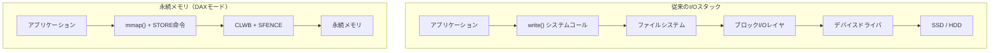

この違いは、特に小さなデータの頻繁な更新において劇的なパフォーマンス差をもたらす。従来のI/Oでは数マイクロ秒かかる4KBの永続化が、永続メモリでは数百ナノ秒で完了する。

### 1.3 永続メモリの歴史的文脈

永続メモリの概念自体は新しいものではない。バッテリバックアップ付きDRAM（NVDIMM-N）は、以前から存在していた。NVDIMM-Nは通常のDRAMにバッテリとNANDフラッシュを組み合わせたもので、電源喪失時にDRAMの内容をフラッシュに退避させる仕組みである。しかし、NVDIMM-Nは容量がDRAMと同等であり、コストも高く、大規模な永続メモリ層としての利用には不向きであった。

真の意味で永続メモリを実現したのは、2019年にIntelが発表した**Intel Optane Persistent Memory（旧称 Intel Optane DC Persistent Memory）** である。Optane PMは**3D XPoint**と呼ばれる新しい不揮発性メモリ技術に基づき、DDR4互換のDIMMスロットに装着可能な形状で提供された。DRAMよりも大容量（1モジュールあたり最大512GB）かつ低コストでありながら、DRAMに近いレイテンシでのアクセスが可能であった。

## 2. ストレージ階層における位置づけ

### 2.1 メモリ・ストレージ階層の再定義

永続メモリの登場は、従来のメモリ・ストレージ階層に新たな層を追加するものである。

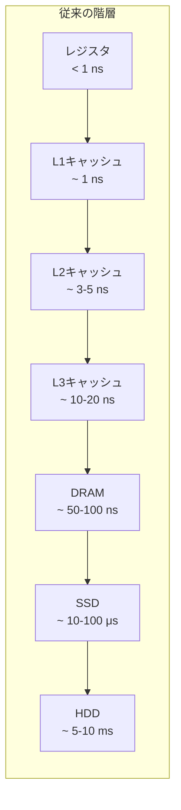

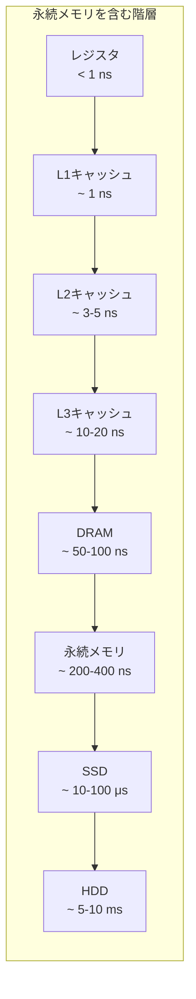

永続メモリのアクセスレイテンシは、DRAMの2〜4倍程度（読み取り約200〜350ns）であり、DRAMとSSDの間に位置する。ただし、重要な点として、永続メモリの読み取りと書き込みには非対称性がある。読み取りレイテンシは比較的DRAMに近いが、書き込みレイテンシはそれよりもやや大きい。また、帯域幅にも非対称性があり、読み取り帯域のほうが書き込み帯域よりも大幅に高い。

### 2.2 容量・コスト・性能のトレードオフ

永続メモリの真価は、単にレイテンシだけでなく、**容量単価**の面にもある。Intel Optane PMの容量単価は、DRAMよりも安く、NVMe SSDよりも高い位置にある。これにより、DRAMでは経済的に不可能であった大容量のバイトアドレッサブルなメモリ空間を実現できる。

| 特性 | DRAM | 永続メモリ（Optane PM） | NVMe SSD |
|---|---|---|---|
| 読み取りレイテンシ | ~80 ns | ~200-350 ns | ~10-100 μs |
| 書き込みレイテンシ | ~80 ns | ~100-500 ns | ~10-100 μs |
| 読み取り帯域 | ~40 GB/s | ~6-8 GB/s（per DIMM） | ~3-7 GB/s |
| 書き込み帯域 | ~40 GB/s | ~2-3 GB/s（per DIMM） | ~3-5 GB/s |
| アクセス粒度 | 64 B（キャッシュライン） | 256 B（内部） | 4 KB（ブロック） |
| 永続性 | なし | あり | あり |
| 最大モジュール容量 | 128 GB | 512 GB | 数TB |

特に注目すべきは、永続メモリの**内部アクセス粒度が256バイト**であるという点である。CPUからは64バイトのキャッシュライン単位でアクセスされるが、永続メモリの内部メディア（3D XPoint）は256バイト単位で読み書きを行う。これは、64バイトの書き込みであっても内部では256バイトのリード・モディファイ・ライト（RMW）が発生することを意味し、小さな書き込みが多い場合に書き込み帯域の低下を引き起こす。この **書き込みアンプリフィケーション（write amplification）** は、永続メモリ向けのデータ構造設計において重要な考慮事項となる。

### 2.3 2つの動作モード

Intel Optane PMは、2つの異なるモードで動作させることができる。

**Memory Mode（メモリモード）**：DRAMをキャッシュとして使い、永続メモリを大容量のメインメモリとして使用するモードである。アプリケーションからは単に大容量のDRAMとして見え、永続性は提供されない。DRAMがキャッシュとしてホットデータを保持し、キャッシュミス時に永続メモリにアクセスする。この方式では、OSやアプリケーションの変更なしに、メモリ容量を大幅に拡大できる。

**App Direct Mode（アプリダイレクトモード）**：永続メモリをDRAMとは独立した永続的なメモリ領域として使用するモードである。このモードでは永続性が提供され、アプリケーションは永続メモリに直接アクセスしてデータを永続化できる。ただし、アプリケーションは永続メモリを意識したプログラミングが必要となる。

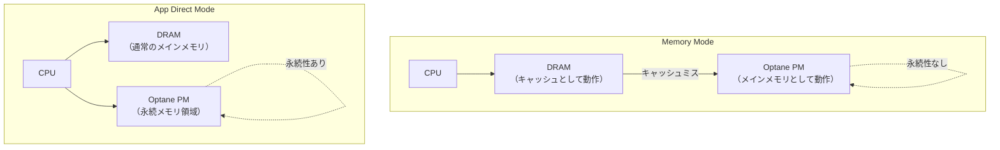

Memory Modeは既存のアプリケーションを変更せずにメモリ容量を拡大したい場合に有用であるが、ワーキングセットがDRAMキャッシュに収まらない場合にはパフォーマンスが大幅に低下する可能性がある。一方、App Direct Modeはアプリケーションの改修が必要であるが、永続メモリの性能を最大限に活用できる。

## 3. Intel Optane（3D XPoint）

### 3.1 3D XPointの技術的基盤

Intel Optane Persistent Memoryの基盤となる**3D XPoint**（「スリーディー・クロスポイント」と発音）技術は、IntelとMicronの合弁事業として2015年に発表された。3D XPointは、DRAMでもNANDフラッシュでもない、まったく新しいカテゴリの不揮発性メモリ技術である。

NANDフラッシュがフローティングゲートやチャージトラップに電荷を蓄えることでデータを記憶するのに対し、3D XPointは**相変化メモリ（Phase-Change Memory, PCM）** に類似した原理を利用すると広く推定されている。Intelは3D XPointの正確な物理メカニズムを公式には開示していないが、業界の分析では、カルコゲナイドガラス素材を用いたバルク抵抗変化によってデータを記憶するとされている。

3D XPointの構造は、文字通り「クロスポイント（交差点）」方式である。ワード線とビット線が直交する格子状の構造において、各交差点にメモリセルが配置される。各セルは**セレクタ（selector）** と**ストレージ素子（storage element）** から構成される。セレクタはアクセストランジスタの代わりとなるスイッチング素子であり、NANDフラッシュのような複雑なブロック・ページ構造を必要としない。これにより、セル単位でのアクセスが可能となり、バイトアドレッサブルなメモリとしての利用が実現される。

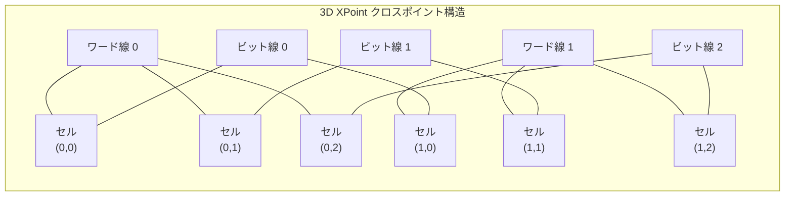

### 3.2 NANDフラッシュとの根本的な違い

3D XPointがNANDフラッシュと根本的に異なる点は、以下の通りである。

**トランジスタレスアーキテクチャ**：3D XPointはアクセストランジスタを使用しない。NANDフラッシュでは各セルにトランジスタが必要であるが、3D XPointではセレクタ素子がその役割を果たす。これにより、セルの集積度を高めることが可能となる。

**ビット変更可能（bit-alterable）**：NANDフラッシュではデータの上書きにブロック単位の消去が必要であるが、3D XPointはインプレースで書き換えが可能である。これにより、NANDフラッシュにおけるガベージコレクションやウェアレベリングの複雑さが大幅に軽減される。

**高い耐久性**：NANDフラッシュの書き換え回数は、SLCで10万回、TLCで1000〜3000回程度に制限される。一方、3D XPointはそれよりも桁違いに高い耐久性を持つとされている。

**低レイテンシ**：NANDフラッシュの読み取りレイテンシがページ単位で数十マイクロ秒であるのに対し、3D XPointは数百ナノ秒のレイテンシでアクセスできる。

### 3.3 Optane PMの世代と進化

Intel Optane PMは、2つの世代にわたって製品化された。

**第1世代（Barlow Pass / Apache Pass, 2019年）**：Cascade Lake世代のXeonプロセッサとともに登場した。DDR4-T（DDR4互換のDIMM形状）で提供され、128GB、256GB、512GBの3つの容量オプションが用意された。App Direct ModeとMemory Modeの両方をサポートし、1ソケットあたり最大6モジュール（3TB）を搭載可能であった。

**第2世代（Crow Pass, 2021年）**：Ice Lake世代のXeonプロセッサ向けに提供された。DDR4互換の形状は維持されたが、内部の改良により読み取りレイテンシの改善と帯域幅の向上が図られた。

### 3.4 Optaneの終焉と遺産

2022年7月、Intelは3D XPointメモリの製造中止を発表した。大連工場の売却とともに、Optane事業全体が段階的に終了することとなった。この決定の背景には、製造コストの高さ、市場の立ち上がりの遅さ、そしてCXLの台頭による代替技術の登場がある。

しかし、Optane PMが残した遺産は大きい。永続メモリのプログラミングモデル、ソフトウェアエコシステム（PMDK）、OSのサポート（DAX）、そしてデータベースや分散システムにおける永続メモリ活用の研究は、Optane PMなしには生まれなかった。これらの知見は、CXLベースの次世代メモリ技術に引き継がれている。

## 4. PMDK（Persistent Memory Development Kit）

### 4.1 PMDKの設計思想

永続メモリ向けのプログラミングは、従来のメモリプログラミングやI/Oプログラミングとは本質的に異なる課題を提起する。最大の課題は**障害原子性（failure atomicity）** の保証である。

DRAMに対する書き込みは揮発性であるため、システムクラッシュ時にはすべてのデータが失われることを前提としたプログラミングが行われる。一方、ストレージへの書き込みは、ファイルシステムやデータベースのジャーナリング、WAL（Write-Ahead Logging）などの仕組みによって一貫性が保証される。

永続メモリは、この両方の世界の中間に位置する。`STORE` 命令でデータを書き込めるが、そのデータは永続的である。しかし、CPUのキャッシュ階層の存在により、`STORE` 命令の完了はデータが永続メモリに到達したことを意味しない。データはまだCPUキャッシュに留まっている可能性がある。さらに、複数の関連するデータを更新する場合、一部だけが永続化された状態でシステムがクラッシュすると、データの一貫性が破壊される。

**PMDK（Persistent Memory Development Kit）** は、これらの課題に対処するためにIntelが開発したオープンソースのライブラリ群である。PMDKは、永続メモリのプログラミングに必要な基本的なプリミティブから高レベルの抽象化まで、階層的なライブラリ構成を提供する。

### 4.2 PMDKのライブラリ構成

PMDKは複数のライブラリから構成される。

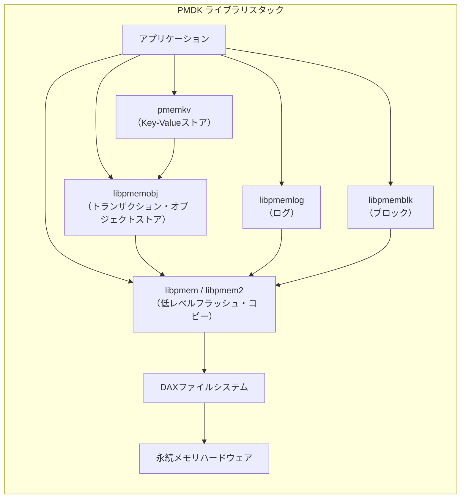

**libpmem / libpmem2**：最も低レベルのライブラリであり、永続メモリへのフラッシュ操作やメモリコピーを提供する。`pmem_persist()` 関数は、指定されたアドレス範囲のデータを永続メモリに確実にフラッシュする。内部的には、プラットフォームの能力に応じて `CLWB`、`CLFLUSHOPT`、`CLFLUSH` のいずれかを使用する。

**libpmemobj**：永続メモリ上のオブジェクトストアを実現するライブラリであり、PMDKの中核をなす。トランザクション機能、永続ポインタ、型安全な永続オブジェクトの管理機能を提供する。

**libpmemlog**：追記専用のログを永続メモリ上に実装するためのライブラリ。

**libpmemblk**：永続メモリ上に固定サイズのブロック配列を実装するためのライブラリ。各ブロックへの書き込みは原子的に行われる。

**pmemkv**：libpmemobjの上に構築されたKey-Valueストア。さまざまなバックエンドエンジン（B+Tree、Radix Tree、CSMapなど）を選択可能。

### 4.3 障害原子性とトランザクション

libpmemobjが提供するトランザクション機能は、永続メモリプログラミングの中核的な課題を解決する。以下に、基本的なトランザクションの使用例を示す。

```c
#include <libpmemobj.h>

POBJ_LAYOUT_BEGIN(example);
POBJ_LAYOUT_ROOT(example, struct root);
POBJ_LAYOUT_TOID(example, struct entry);
POBJ_LAYOUT_END(example);

struct entry {
    int value;
    PMEMoid next;
};

struct root {
    PMEMoid head;
    int count;
};

void add_entry(PMEMobjpool *pop, int value) {
    TOID(struct root) root = POBJ_ROOT(pop, struct root);

    TX_BEGIN(pop) {
        // Allocate a new persistent object
        TOID(struct entry) entry = TX_NEW(struct entry);

        // Snapshot fields before modification (for undo logging)
        TX_ADD(root);

        // Modify persistent data within a transaction
        D_RW(entry)->value = value;
        D_RW(entry)->next = D_RO(root)->head;
        D_RW(root)->head = entry.oid;
        D_RW(root)->count++;
    } TX_ONABORT {
        // Transaction aborted — all changes are rolled back
        fprintf(stderr, "Transaction aborted\n");
    } TX_END
}
```

このコードでは、`TX_BEGIN` と `TX_END` の間の操作が単一のトランザクションとして実行される。トランザクション内で永続オブジェクトを変更する前に `TX_ADD` マクロでスナップショットを記録し、トランザクションがアボートされた場合やクラッシュが発生した場合には、スナップショットを使ってデータを元の状態に復元する（**Undo ログ方式**）。

### 4.4 永続ポインタの課題

永続メモリプログラミングにおけるもう一つの本質的な課題は、**ポインタの永続化**である。通常のプログラムでは、メモリアドレスはプロセスの仮想アドレス空間内の位置を指す。しかし、永続メモリ上のデータ構造に通常のポインタを格納すると、次回のプログラム起動時にはメモリマップのアドレスが変わっている可能性があるため、ポインタが無効になる。

PMDKはこの問題を、**永続OID（Object ID）** という間接参照の仕組みで解決する。`PMEMoid` は、プールID（どの永続メモリプール内のオブジェクトか）とオフセット（プール内での位置）の組で構成される。実行時には、このOIDからプールのベースアドレスを加算して実際のポインタに変換する。

```c
typedef struct pmemoid {
    uint64_t pool_uuid_lo; // Pool identifier
    uint64_t off;          // Offset within the pool
} PMEMoid;
```

この方式により、永続メモリプールが異なるアドレスにマップされても、オフセットベースの参照は有効であり続ける。ただし、OIDからポインタへの変換にはオーバーヘッドが伴うため、パフォーマンスクリティカルなコードでは、変換結果を揮発性メモリにキャッシュするなどの工夫が必要となる。

## 5. DAX（Direct Access）

### 5.1 DAXの概念と仕組み

**DAX（Direct Access）** は、永続メモリの性能を最大限に引き出すためのOS機能である。DAXは、ファイルシステムのページキャッシュをバイパスし、アプリケーションが永続メモリ上のデータに直接アクセスすることを可能にする。

従来のファイルシステムでは、ファイルの読み書きはページキャッシュを経由して行われる。`read()` システムコールはストレージからページキャッシュにデータをコピーし、さらにユーザーバッファにコピーする。`mmap()` を使う場合でも、ページフォルト時にストレージからページキャッシュにデータがロードされ、アプリケーションはページキャッシュ上のデータにアクセスする。

永続メモリの場合、このページキャッシュの層は不要であるばかりか、むしろ害となる。永続メモリはすでにメモリバスに接続されており、CPUから直接アクセス可能である。ページキャッシュにデータをコピーすることは、不要なメモリ消費とコピーのオーバーヘッドを生むだけである。

DAXはこの問題を解決する。DAX対応のファイルシステム（ext4-dax、XFS-dax、NOVA、Strata、WineFSなど）上でファイルを `mmap()` すると、ページキャッシュを経由せずに、永続メモリの物理アドレスがアプリケーションの仮想アドレス空間に直接マップされる。

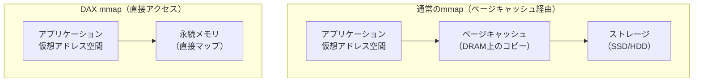

### 5.2 Linuxにおける DAX の実装

Linuxにおいて、DAXは以下のように利用される。

まず、永続メモリデバイスを管理する**ndctl（Non-Volatile Device Control）** ユーティリティを使い、永続メモリの名前空間（namespace）を設定する。

```bash
# Create a namespace in fsdax mode
ndctl create-namespace --mode=fsdax --region=region0

# Create a filesystem with DAX support
mkfs.ext4 /dev/pmem0

# Mount with DAX option
mount -o dax /dev/pmem0 /mnt/pmem
```

`-o dax` オプション（Linux 5.10以降では `-o dax=always`）を指定してマウントすることで、そのファイルシステム上のファイルに対する `mmap()` はDAXモードで動作する。

アプリケーション側では、以下のようにDAXファイルを利用する。

```c
#include <sys/mman.h>
#include <fcntl.h>
#include <immintrin.h>

void dax_example(void) {
    int fd = open("/mnt/pmem/data", O_RDWR | O_CREAT, 0666);
    ftruncate(fd, 4096);

    // mmap with MAP_SYNC for DAX
    void *addr = mmap(NULL, 4096, PROT_READ | PROT_WRITE,
                      MAP_SHARED_VALIDATE | MAP_SYNC, fd, 0);

    // Write data directly to persistent memory
    char *data = (char *)addr;
    memcpy(data, "Hello, Persistent Memory!", 25);

    // Flush cache line to ensure persistence
    _mm_clwb(data);

    // Store fence to ensure ordering
    _mm_sfence();

    // Data is now persistent
    close(fd);
}
```

ここで重要なのは、`MAP_SYNC` フラグの使用である。`MAP_SYNC`（Linux 4.15以降）は、ファイルシステムメタデータの同期を保証し、ページフォルト時にメタデータが永続化されることを確認する。これにより、`msync()` や `fsync()` を呼び出さなくても、`CLWB` + `SFENCE` だけでデータの永続性を保証できる。

### 5.3 devdaxモード

DAXには、ファイルシステムを経由する **fsdax** モードのほかに、ファイルシステムを使わずに永続メモリデバイスに直接アクセスする **devdax** モードがある。

```bash
# Create a namespace in devdax mode
ndctl create-namespace --mode=devdax --region=region0
```

devdaxモードでは、永続メモリは `/dev/dax0.0` のようなキャラクタデバイスとして現れる。ファイルシステムのオーバーヘッドがないため、最大限のパフォーマンスが得られるが、ファイル単位のアクセス制御やメタデータ管理は行われない。PMDKのlibpmemobjは、fsdaxモードとdevdaxモードの両方をサポートしている。

## 6. データベースへの影響

### 6.1 従来のデータベースアーキテクチャの前提

リレーショナルデータベースの内部アーキテクチャは、「メモリは揮発性、ストレージは永続的だが遅い」という前提の上に構築されている。この前提から、以下のような設計パターンが生まれた。

**バッファプール**：ストレージ上のページをDRAM上のバッファプールにキャッシュし、頻繁にアクセスされるページをメモリ上に保持する。バッファプール管理はデータベースの中核コンポーネントであり、ページの読み込み、置換（LRU等のポリシー）、ダーティページの管理を行う。

**WAL（Write-Ahead Logging）**：データの変更を永続化する前に、まずログに変更内容を記録する。これにより、クラッシュ時にはログを再生してデータの一貫性を回復できる。WALは、ストレージへの書き込みがランダムアクセスよりもシーケンシャルアクセスのほうが高速であるという特性を利用している。

**チェックポイント**：ダーティページを定期的にストレージに書き戻し、リカバリ時に再生すべきログの量を制限する。

永続メモリの登場は、これらの前提を根本から覆す可能性がある。

### 6.2 永続メモリを活用したデータベース設計

永続メモリをデータベースに適用する方法は、大きく3つのアプローチに分類できる。

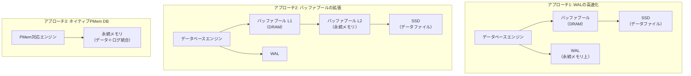

**アプローチ1：WALの配置先として永続メモリを利用する。** WALへの書き込みは、データベーストランザクションのコミットパスにおいて最も頻繁に発生するI/O操作である。WALを永続メモリに配置することで、`fsync()` のオーバーヘッドを排除し、コミットレイテンシを劇的に削減できる。PostgreSQLやMySQLのような既存のデータベースで、最小限の変更で導入可能なアプローチである。

**アプローチ2：バッファプールを階層化し、永続メモリを中間層として利用する。** DRAMのバッファプールからエビクトされたページを、SSDに書き戻す前に永続メモリに保持する。これにより、実効的なバッファプールサイズが大幅に拡大し、I/O回数が削減される。SQL Serverの「Buffer Pool Extension」やSAPの「HANA Persistent Memory」がこのアプローチの例である。

**アプローチ3：永続メモリをネイティブに活用する新しいデータベースエンジンを設計する。** WALとデータを統合し、バッファプールの概念自体を排除する。データ構造を直接永続メモリ上に配置し、インプレースで更新する。このアプローチは最も高い性能を引き出せるが、データベースエンジンの全面的な再設計が必要となる。

### 6.3 研究事例：WBL（Write-Behind Logging）

永続メモリを前提とした新しいログ方式として、CMU（カーネギーメロン大学）の研究グループが提案した**WBL（Write-Behind Logging）** は注目に値する。

従来のWAL（Write-Ahead Logging）では、データの変更をログに先に書き込んでからデータページを更新する。この方式は、ストレージへの書き込みが高コストであるという前提に基づいている。永続メモリでは、データのインプレース更新がログへの書き込みと同程度のコストで実行できるため、WALの前提が崩れる。

WBLでは、まずデータをインプレースで更新し、その後にコミット情報をログに記録する。ログにはデータの変更内容ではなく、コミットされたトランザクションの情報のみを記録するため、ログのサイズは大幅に縮小される。リカバリ時には、ログに記録されていないトランザクションの変更を取り消す（Undo）ことで一貫性を回復する。

### 6.4 永続メモリ向けデータ構造

永続メモリの特性を活かすために、従来とは異なるデータ構造の設計が求められる。特に重要な考慮事項は以下の通りである。

**256バイト境界のアライメント**：3D XPointの内部アクセス粒度が256バイトであるため、データ構造のノードやエントリを256バイト境界にアライメントすることで、書き込みアンプリフィケーションを最小化できる。

**キャッシュラインの書き戻し回数の最小化**：永続メモリへのフラッシュ操作（`CLWB`）は比較的高コストであるため、1回の操作で書き戻すキャッシュラインの数を最小化する設計が重要となる。例えば、B+Treeのノードを1つのキャッシュライン（64バイト）に収まるように設計する「キャッシュラインフレンドリーなB+Tree」の研究がある。

**ログフリー設計**：障害原子性をログを使わずに保証するデータ構造の設計も研究されている。例えば、FPTree（Fingerprint Persistent Tree）は、リーフノードのエントリにフィンガープリント（ハッシュ値）を付与し、部分的に書き込まれたエントリをフィンガープリントの不一致で検出することで、ログを使わずに一貫性を維持する。

## 7. CXLメモリ拡張

### 7.1 CXL（Compute Express Link）の概要

**CXL（Compute Express Link）** は、2019年にIntelが提案し、その後CXLコンソーシアムによって標準化が進められているインターコネクト規格である。CXLはPCIe（PCI Express）の物理層を利用しつつ、その上にキャッシュコヒーレントなメモリアクセスプロトコルを定義する。

CXLの目的は、CPU、アクセラレータ、メモリ拡張デバイスの間で、キャッシュコヒーレントなメモリ共有を実現することである。特に、CXLの**メモリ拡張（Memory Expansion）** 機能は、永続メモリの次世代技術として注目されている。

### 7.2 CXLのプロトコル

CXLは3つのサブプロトコルを定義している。

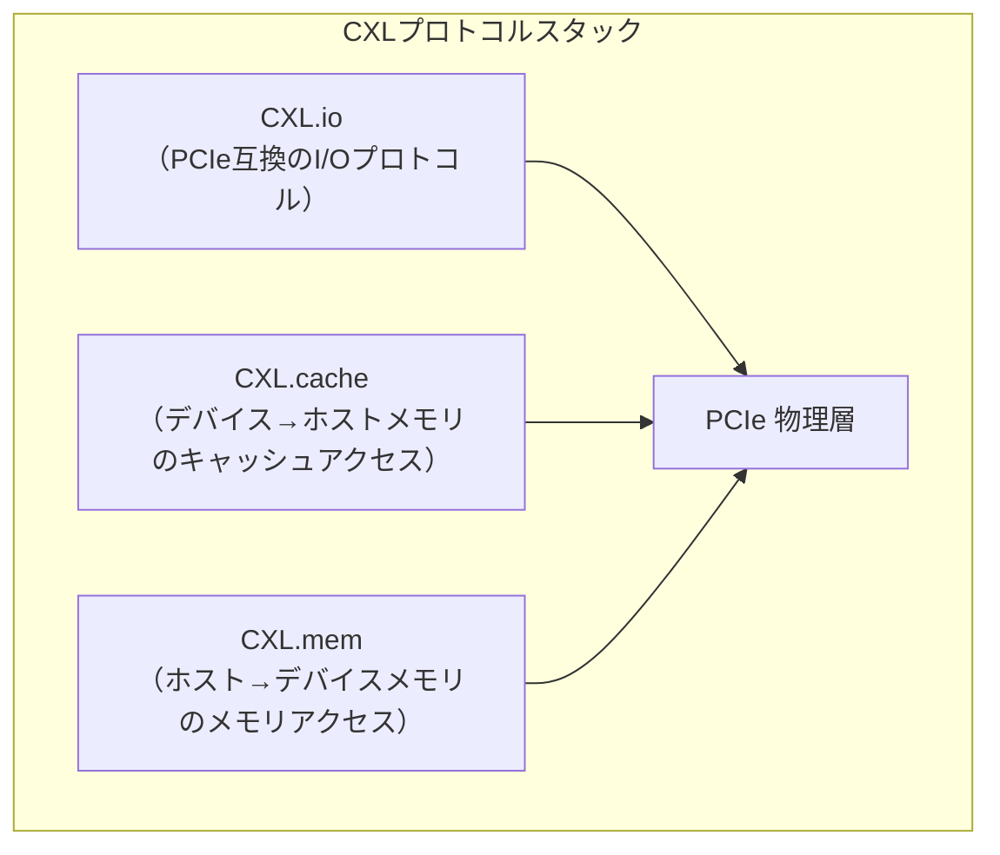

**CXL.io**：PCIeと完全に互換性のあるI/Oプロトコル。デバイスの検出、設定、割り込み処理などに使用される。

**CXL.cache**：デバイスがホストCPUに接続されたメモリにキャッシュコヒーレントにアクセスするためのプロトコル。GPUやFPGAなどのアクセラレータが、ホストメモリのデータをキャッシュに取り込む際に使用される。

**CXL.mem**：ホストCPUがデバイスに搭載されたメモリにアクセスするためのプロトコル。これが永続メモリのメモリ拡張に直接関連するプロトコルである。CXL.memにより、デバイス上のメモリはCPUのメモリアドレス空間にマップされ、通常のLOAD/STORE命令でアクセス可能となる。

### 7.3 CXLデバイスタイプ

CXL仕様は、デバイスを3つのタイプに分類している。

| タイプ | サブプロトコル | 用途例 |
|---|---|---|
| Type 1 | CXL.io + CXL.cache | スマートNIC、暗号アクセラレータ |
| Type 2 | CXL.io + CXL.cache + CXL.mem | GPU、FPGA（デバイスメモリ付き） |
| Type 3 | CXL.io + CXL.mem | メモリ拡張デバイス |

永続メモリの文脈で最も重要なのは **Type 3 デバイス** である。Type 3デバイスは、デバイス上にメモリ（DRAM、永続メモリ、あるいはその組み合わせ）を搭載し、CXL.memプロトコルを通じてホストCPUからアクセスされる。ホストCPUにとっては、Type 3デバイスのメモリは通常のメモリと同様にアドレス空間にマップされ、LOAD/STORE命令でアクセスできる。

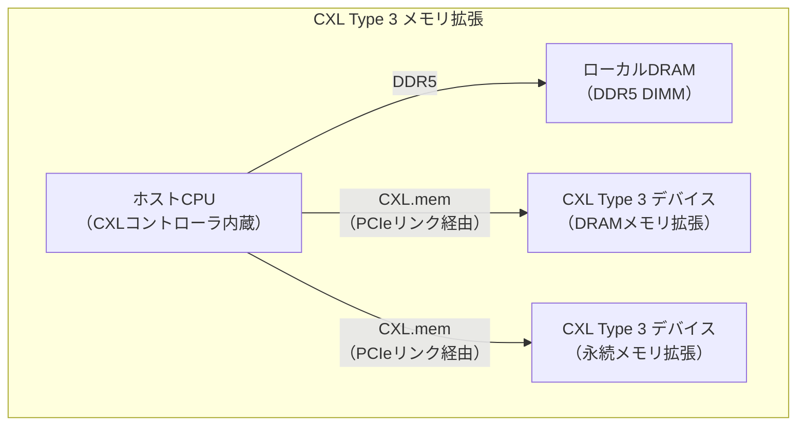

### 7.4 CXLの世代と進化

CXL規格は急速に進化しており、各世代で大幅な機能強化が行われている。

**CXL 1.1（2020年）**：PCIe 5.0ベース。基本的なメモリ拡張とアクセラレータ接続をサポート。最初の商用製品はこのバージョンに基づく。

**CXL 2.0（2022年）**：メモリプーリングとスイッチングのサポートを追加。複数のホストが同一のCXLメモリプールを共有する構成が可能となった。

**CXL 3.0（2022年）**：PCIe 6.0ベース。帯域幅が倍増（64 GT/s）。さらに、マルチレベルスイッチングとファブリック構成のサポートにより、大規模なメモリプーリングが実現可能に。バック・インバリデート・スヌープ（BIS）によるキャッシュコヒーレンシの効率化も導入された。

**CXL 3.1（2023年）**：信頼性、セキュリティ、ポートの分割などが強化された。

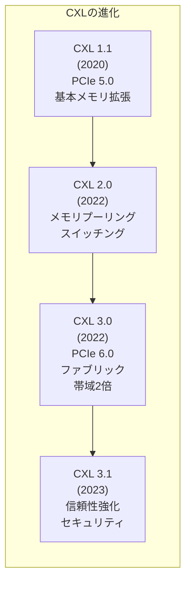

### 7.5 CXLメモリプーリング

CXL 2.0以降で導入された**メモリプーリング**は、CXLの最も革新的な機能の一つである。従来、サーバのメモリはCPUソケットに直接接続された物理DIMMとして固定的に割り当てられていた。メモリプーリングにより、複数のサーバが共有するメモリプールから、必要に応じてメモリを動的に割り当て・解放することが可能となる。

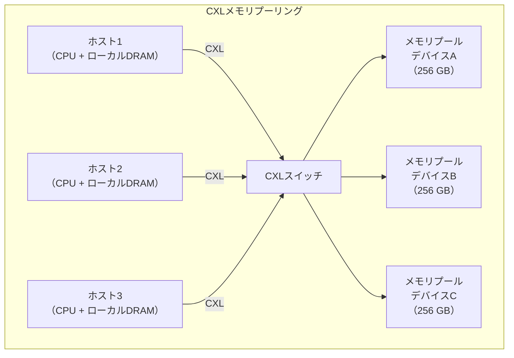

メモリプーリングは、データセンターにおけるメモリの利用効率を大幅に向上させる。従来、サーバはピーク時のメモリ需要に合わせてDRAMを搭載する必要があったが、平均的な使用率は40〜60%程度に留まることが多い。メモリプーリングにより、ピーク時に必要なサーバだけにメモリを動的に割り当てることで、全体としてのメモリ搭載量を削減できる。Metaの研究では、メモリプーリングにより総メモリ消費量を最大25%削減できると報告されている。

### 7.6 CXLと永続メモリの関係

CXLは、Optane PMの終焉後における永続メモリの主要なインターフェースとなることが期待されている。CXL Type 3デバイスにNANDフラッシュやその他の不揮発性メモリ（ReRAM、STT-MRAMなど）を搭載することで、バイトアドレッサブルな永続メモリを実現できる。

CXLベースの永続メモリには、Optane PMにはない利点がある。

**標準化されたインターフェース**：Optane PMはIntel独自のDDR-T互換プロトコルを使用していたが、CXLは業界標準の規格である。AMD、Intel、ARM、Samsung、SKハイニックスなど、主要な半導体メーカーが参加しており、ベンダーロックインのリスクが低い。

**柔軟なメディア選択**：CXLのインターフェースはメディアに依存しないため、DRAMバックアップ付きNAND、ReRAM、STT-MRAM、あるいは将来の新しい不揮発性メモリ技術など、様々なメモリメディアをCXL Type 3デバイスに搭載できる。

**ティアードメモリとしての利用**：CXLメモリはNUMAノードの一種として扱えるため、Linuxのtiered memory管理機能（メモリティアリング）と組み合わせて、ホットデータをローカルDRAM、コールドデータをCXLメモリに自動的に振り分けることが可能である。

ただし、CXLメモリのレイテンシは、PCIeリンクのオーバーヘッドにより、直接DIMMスロットに接続されていたOptane PMよりも高くなる。PCIe 5.0ベースのCXL 1.1では、追加レイテンシは概ね80〜150ns程度であり、ローカルDRAMの80nsに加えて合計160〜250ns程度のアクセスレイテンシとなる。

## 8. プログラミングモデルの課題

### 8.1 永続メモリプログラミングの本質的な難しさ

永続メモリのプログラミングは、従来のメモリプログラミングやストレージI/Oプログラミングとは質的に異なる課題を提起する。これらの課題は、永続メモリの普及を妨げる主要な要因の一つとなっている。

**キャッシュの透過性の喪失**：通常のプログラミングでは、CPUキャッシュの存在は完全に透過的である。プログラマはキャッシュを意識する必要がなく、メモリの一貫性はハードウェアが保証する。しかし永続メモリでは、データの永続性を保証するためにプログラマが明示的にキャッシュラインをフラッシュしなければならない。`STORE` 命令の完了は、データがCPUキャッシュに書き込まれたことを意味するだけであり、永続メモリに到達したことを意味しない。

**ストアの順序保証の複雑さ**：現代のCPUは性能最適化のためにストアの順序を変更する可能性がある（ストアバッファリング、キャッシュの書き戻しの並べ替えなど）。通常のプログラミングでは、メモリオーダリングの問題はマルチスレッドプログラミングの文脈でのみ考慮すれば十分であるが、永続メモリでは、データの永続化順序が論理的な更新順序と一致しない場合にデータ構造の一貫性が破壊される可能性がある。

以下の例で、この問題を具体的に示す。

```c
// Inserting a node into a persistent linked list
void insert_node(struct node *prev, struct node *new_node) {
    new_node->next = prev->next;   // (1)
    // If system crashes here, new_node->next is persistent
    // but prev->next still points to old next node
    prev->next = new_node;         // (2)
}
```

このコードでは、(1) と (2) の間でクラッシュが発生した場合、リストの一貫性が破壊される。さらに、CPUのキャッシュフラッシュの順序によっては、(2) が (1) より先に永続化される可能性もある。これを防ぐためには、明示的なフラッシュとフェンスが必要である。

```c
void insert_node_safe(struct node *prev, struct node *new_node) {
    new_node->next = prev->next;
    pmem_persist(&new_node->next, sizeof(new_node->next)); // Flush (1)

    prev->next = new_node;
    pmem_persist(&prev->next, sizeof(prev->next));         // Flush (2)
}
```

しかし、このコードでもまだ問題がある。`prev->next = new_node` の永続化後にクラッシュすると、`new_node` の他のフィールドが初期化途中であった場合にデータ構造が壊れる。完全な安全性のためには、PMDKのトランザクション機能を使用する必要がある。

### 8.2 eADR と プラットフォームレベルの保証

永続メモリプログラミングの複雑さを軽減するために、Intelは**eADR（Enhanced Asynchronous DRAM Refresh）** という仕組みを導入した。

通常の**ADR（Asynchronous DRAM Refresh）** は、電源喪失時にメモリコントローラのWPQ（Write Pending Queue）に残っている書き込みを永続メモリにフラッシュする仕組みである。ADRの保護範囲は、メモリコントローラのWPQまでであり、CPUキャッシュ内のデータは保護されない。

**eADR** は、ADRを拡張し、電源喪失時にCPUキャッシュの内容も永続メモリにフラッシュする。eADRが有効なプラットフォームでは、`STORE` 命令が完了した時点でデータの永続性が保証されるため、明示的な `CLWB` や `CLFLUSHOPT` が不要となる。これにより、永続メモリプログラミングの複雑さが大幅に軽減される。

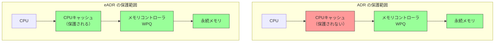

ただし、eADRが有効であっても、**ストアの順序保証**の問題は残る。CPUが書き込みを並べ替える可能性があるため、論理的な順序で永続化を保証するには `SFENCE` が依然として必要である。eADRが不要にするのは `CLWB` / `CLFLUSHOPT` だけであり、`SFENCE` は引き続き必要である。

### 8.3 テストとデバッグの困難さ

永続メモリプログラミングのもう一つの大きな課題は、バグの検出が極めて困難であるということである。永続メモリに関連するバグ（フラッシュの欠落、順序の不正など）は、通常の実行では問題を引き起こさない。これらのバグは、特定のタイミングでクラッシュが発生した場合にのみ顕在化する。

この問題に対処するためのツールがいくつか開発されている。

**PMDK の pmemcheck**：Valgrindベースのツールであり、永続メモリへの書き込みがフラッシュされているか、ストアの順序が適切であるかを動的に検査する。

**PMTest**：永続メモリプログラムの網羅的なクラッシュ一貫性テストを行うフレームワーク。プログラムの実行中にクラッシュが発生し得るすべての地点でのメモリ状態を解析し、データ構造の一貫性が維持されるかを検証する。

**Yat / XFDetector**：永続メモリのストア順序のバグを検出する静的・動的解析ツール。

### 8.4 言語レベルのサポート

永続メモリのプログラミングモデルを改善するために、プログラミング言語レベルでの支援も模索されている。

**C++のPMDKバインディング（libpmemobj-cpp）**：C++のRAII（Resource Acquisition Is Initialization）パターンやスマートポインタを活用して、永続メモリのトランザクションやポインタ管理をより安全に行えるようにしたライブラリである。

```cpp
#include <libpmemobj++/make_persistent.hpp>
#include <libpmemobj++/persistent_ptr.hpp>
#include <libpmemobj++/pool.hpp>
#include <libpmemobj++/transaction.hpp>

using namespace pmem::obj;

struct root {
    persistent_ptr<int[]> data;
    p<size_t> size;
};

void example(pool<root> &pop) {
    auto r = pop.root();
    // Transaction with C++ RAII
    transaction::run(pop, [&] {
        r->data = make_persistent<int[]>(100);
        r->size = 100;
    });
    // If an exception is thrown, the transaction is automatically aborted
}
```

**Rustの永続メモリサポート**：Rustの所有権モデルと借用チェッカーは、永続メモリプログラミングの安全性を高めるのに適している。`Corundum` のようなRust向け永続メモリフレームワークは、コンパイル時にフラッシュの欠落やトランザクション外での永続データの変更を検出できる。

**Javaの永続メモリサポート**：Intel LLPL（Low-Level Persistence Library）やPCJ（Persistent Collections for Java）により、Java言語からも永続メモリを利用できる。ただし、Javaのガベージコレクタが永続メモリ上のオブジェクトを適切に管理できるかという課題がある。

## 9. 永続メモリの将来

### 9.1 Optane後の世界

Intelが3D XPointの製造を中止したことで、永続メモリの展望は大きく変化した。しかし、永続メモリの概念自体が消えたわけではない。むしろ、CXLの急速な発展により、永続メモリは新しい形で再定義されつつある。

現在、CXLベースのメモリ拡張製品が複数のベンダーから登場し始めている。Samsung、SKハイニックス、Micronなどの主要メモリメーカーがCXL Type 3デバイスを開発しており、最初の商用製品はDRAMベースのメモリ拡張が中心であるが、将来的には不揮発性メモリを搭載した製品も期待されている。

### 9.2 新世代の不揮発性メモリ技術

3D XPointに代わる不揮発性メモリ技術として、以下の候補が研究・開発されている。

**STT-MRAM（Spin-Transfer Torque Magnetoresistive RAM）**：磁気トンネル接合を利用したメモリ技術。DRAMに近い読み取り速度と優れた耐久性を持ち、組み込みシステム向けのNVMとして実用化が進んでいる。大容量化が課題であるが、CXL接続によるメモリ拡張デバイスへの搭載も検討されている。

**ReRAM（Resistive RAM）**：金属酸化物の抵抗変化を利用したメモリ技術。3D XPointと同様にクロスポイント構造で製造可能であり、高い集積度が期待できる。Samsung、TSMC、Western Digitalなどが研究を進めている。

**MRAM（Magnetoresistive RAM）の大容量化**：Everspin Technologiesが先行するMRAM技術は、既に256Mb品が実用化されているが、Gbクラスへの大容量化が進めば、CXLベースの永続メモリとしての利用も現実味を帯びる。

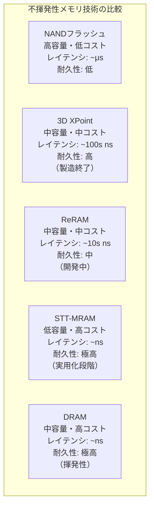

### 9.3 ソフトウェアエコシステムの継承

Optane PMの製造終了にもかかわらず、そのソフトウェアエコシステムは存続している。PMDKは引き続きオープンソースとしてメンテナンスされており、CXLベースの永続メモリへの移植も視野に入っている。

Linuxカーネルにおける永続メモリのサポート（ndctl、DAX、memmap、tiered memory）は、CXLメモリにも適用可能であり、実際にLinux 6.x系列ではCXLメモリのNUMAノードとしての認識やtiered memory機能との統合が進んでいる。

データベース分野では、Optane PM向けに開発された最適化技術（永続メモリ向けB+Tree、WALの代替手法、インプレース更新のためのデータ構造）の多くは、CXLメモリにも応用可能である。ただし、CXLメモリのレイテンシ特性（PCIeリンクの追加レイテンシ）はOptane PMとは異なるため、データ構造の設計パラメータの再調整は必要となる。

### 9.4 ティアードメモリの時代

CXLの普及に伴い、コンピュータのメモリアーキテクチャは「フラットなメモリ空間」から「ティアード（階層化された）メモリ空間」へと移行していくと予想される。

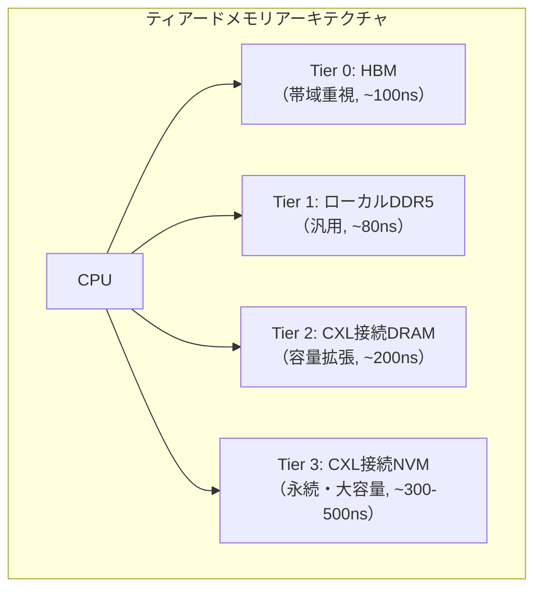

この階層構造において、OSのメモリ管理サブシステムは、データのアクセス頻度に応じてページを適切なティアに配置・移動する**自動ティアリング**を行う。Linuxでは、カーネル6.x系列で導入された`memory tiering`機能がこれを実現しており、`NUMA balancing`の仕組みを拡張してホットページをローカルDRAMに、コールドページをCXLメモリに自動的に移動する。

### 9.5 永続メモリがもたらすパラダイムシフト

永続メモリの真のインパクトは、単なるパフォーマンス向上ではなく、ソフトウェアアーキテクチャの根本的な再考を迫ることにある。

**シリアライゼーションの消滅**：従来、データを永続化するためにはシリアライゼーション（インメモリ表現からストレージ上の表現への変換）が必要であった。永続メモリでは、インメモリのデータ構造がそのまま永続的であるため、シリアライゼーション・デシリアライゼーションのコストが消滅する。これは、アプリケーションの起動時間を劇的に短縮する可能性がある。

**リカバリ時間の短縮**：データベースのリカバリ時間は、WALの再生に要する時間によって決まる。永続メモリ上でインプレース更新を行う設計では、リカバリ時間はほぼゼロに近づく。高可用性が求められるシステムにおいて、この特性は大きな意味を持つ。

**プロセスの概念の変容**：従来のプロセスモデルでは、プロセスの状態はそのアドレス空間に存在し、プロセスの終了とともに消滅する。永続メモリ上にプロセスの状態を配置すれば、プロセスの再起動後に以前の状態をそのまま復元できる。これは、マイクロサービスの再起動コストやステートフルサービスの設計に大きな影響を与える。

**ストレージスタックの簡素化**：ページキャッシュ、バッファプール、I/Oスケジューラ、ブロックデバイスドライバなど、現在のストレージスタックの多くの層は、「メモリとストレージが異なるインターフェースを持つ」という前提に基づいている。永続メモリがこの前提を覆すことで、ストレージスタックの大幅な簡素化が可能となる。

### 9.6 残された課題

永続メモリの実用化に向けて、いくつかの重要な課題が残されている。

**セキュリティ**：永続メモリ上のデータは電源を切っても残るため、物理的なアクセスによるデータ漏洩のリスクがDRAMよりも高い。暗号化（Intel TME: Total Memory Encryption）や、永続メモリ固有のアクセス制御機構が必要となる。

**寿命管理**：不揮発性メモリ技術には書き込み回数の制限がある。長期間にわたって高頻度の書き込みが行われるワークロードでは、メモリの寿命を監視・管理する仕組みが必要である。

**コスト**：3D XPointの製造中止の主要因の一つはコストであった。CXLベースの次世代永続メモリが経済的に成立するためには、メモリメディアの製造コストの低減が不可欠である。

**ソフトウェアの成熟**：永続メモリ向けのプログラミングモデル、ライブラリ、デバッグツールは、まだ発展途上にある。特に、永続メモリプログラミングの複雑さを隠蔽する高レベルの抽象化や、プログラミング言語レベルでのサポートの強化が求められている。

**標準化**：SNIA（Storage Networking Industry Association）のNVM Programming Modelなど、永続メモリのプログラミングモデルの標準化は進んでいるが、CXLベースの永続メモリに対応した新しい標準の策定が必要である。

## まとめ

永続メモリは、コンピュータアーキテクチャにおける「メモリは揮発性、ストレージは永続的だが遅い」という数十年来の二分法を打破する技術である。Intel Optane PMは、3D XPoint技術に基づく最初の大規模な商用永続メモリとして、プログラミングモデル（PMDK）、OS機能（DAX）、データベース設計の革新（WBL、永続メモリ向けインデックス構造）に至る広範なエコシステムを生み出した。

Optane PMの製造終了という逆風はあるものの、CXLの急速な進化により、永続メモリの概念は新たな形で存続し続けている。CXLが提供するメモリプーリング、ティアードメモリ、標準化されたインターフェースは、Optane PMの時代には不可能であった柔軟なメモリアーキテクチャを実現する。

永続メモリが真に普及するためには、ハードウェアの成熟だけでなく、プログラミングモデルの改善、デバッグツールの整備、そしてアプリケーション開発者の意識変革が必要である。しかし、データの爆発的な増加と、リアルタイム処理への需要の高まりを考えると、メモリとストレージの境界を溶解させる永続メモリの方向性は、コンピュータアーキテクチャの進化において不可避の流れであると言えるだろう。
