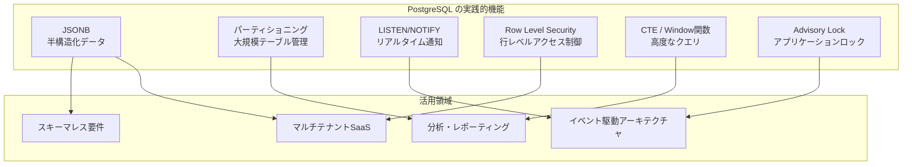
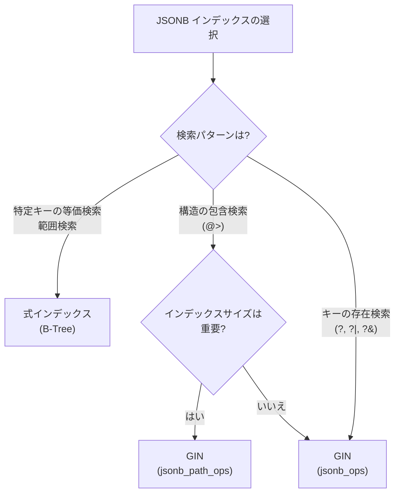
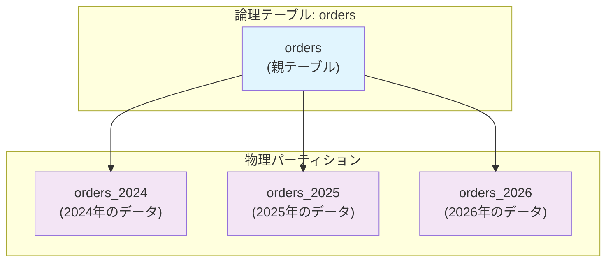
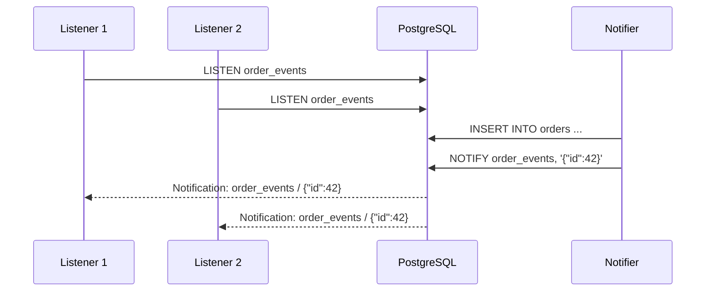
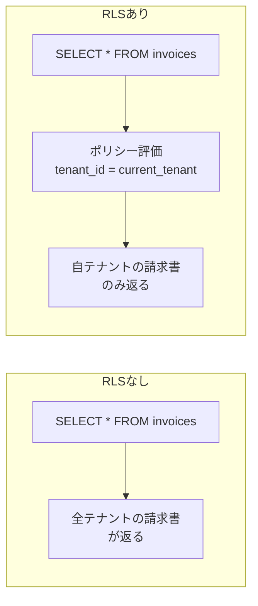
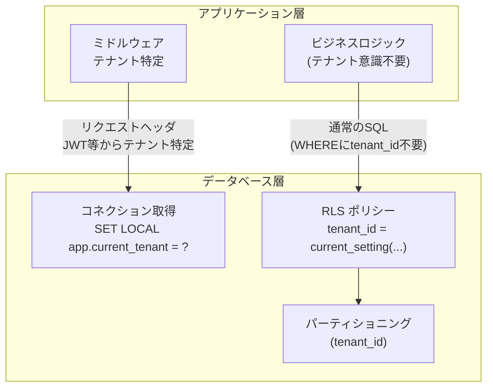
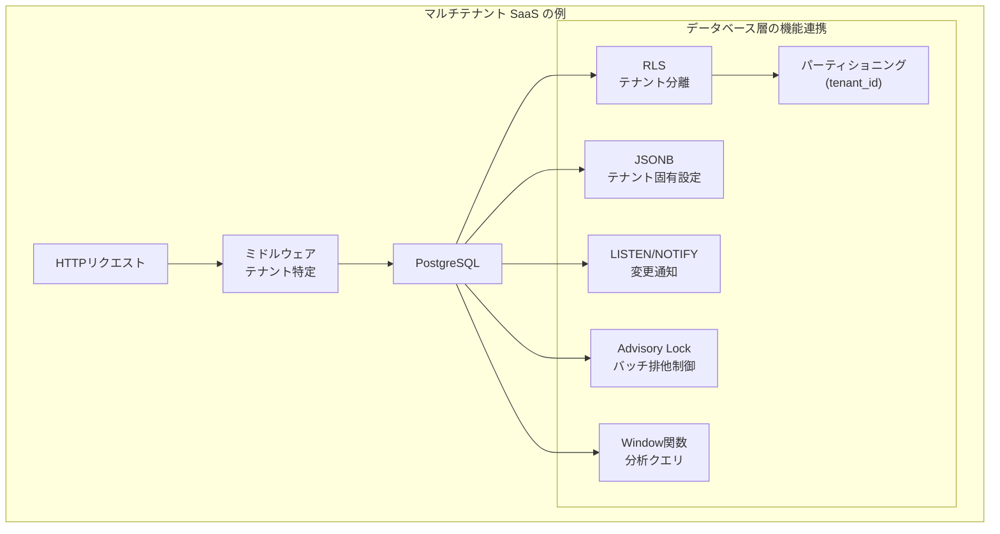

# PostgreSQL の実践的機能（JSONB, パーティショニング, LISTEN/NOTIFY, RLS）

## 1. はじめに：PostgreSQL が選ばれ続ける理由

PostgreSQL は、1986年にカリフォルニア大学バークレー校の Michael Stonebraker が率いるプロジェクト POSTGRES から始まったオープンソースのリレーショナルデータベースである。その後40年近くにわたり開発が続けられ、今日では MySQL と並ぶ最も広く採用されている RDBMS の一つとなった。

PostgreSQL が他の RDBMS と一線を画すのは、SQL 標準への忠実な準拠と、**拡張性**を基盤とした設計思想である。カスタム型、カスタム演算子、カスタムインデックスメソッド、手続き型言語（PL/pgSQL, PL/Python, PL/v8 など）のプラグイン機構を通じて、コアを変更することなく機能を追加できる。この拡張性こそが、PostGIS（地理空間）、pgvector（ベクトル検索）、TimescaleDB（時系列）といったエコシステムを生み出した土壌である。

本記事では、PostgreSQL が備える実践的な機能のうち、現代のアプリケーション開発で特に有用な6つのトピックを取り上げる。

1. **JSONB** — 半構造化データをリレーショナルDBで扱う
2. **テーブルパーティショニング** — 大規模テーブルの管理と性能を改善する
3. **LISTEN/NOTIFY** — データベース層でリアルタイム通知を実現する
4. **Row Level Security（RLS）** — 行レベルのアクセス制御をデータベースに委ねる
5. **CTE と Window 関数の実践** — 宣言的に複雑なクエリを構築する
6. **Advisory Lock** — アプリケーションレベルのロックをデータベースに委譲する

これらはいずれも「知っていれば使う、知らなければアプリケーション側で代替実装する」類の機能であり、適切に活用することでアプリケーションの複雑度を大幅に削減できる。



## 2. JSONB — リレーショナルとドキュメントの融合

### 2.1 なぜ RDBMS で JSON を扱うのか

アプリケーション開発では、テーブルのカラムとして事前にスキーマを定義できないデータが頻繁に現れる。ユーザー設定、フォームの自由入力フィールド、外部 API から受け取るペイロード、A/B テストのパラメータなどがその典型である。

こうしたデータに対して、従来は以下のようなアプローチが取られてきた。

- **EAV（Entity-Attribute-Value）パターン**: 汎用的だが JOIN の爆発とクエリの複雑化を招く
- **MongoDB 等のドキュメントDB への分離**: 運用対象のデータストアが増え、トランザクションの一貫性を確保しにくくなる
- **TEXT 型で JSON 文字列を格納**: パース・検索・インデックスのすべてが非効率

PostgreSQL の JSONB 型はこの問題を根本的に解決する。JSONB は JSON データを**バイナリ形式で格納**し、リレーショナルデータと同一のトランザクション内で操作できる。

### 2.2 JSON 型と JSONB 型の違い

PostgreSQL には `json` と `jsonb` の2つの JSON 型が存在する。

| 特性 | json | jsonb |
|---|---|---|
| 格納形式 | テキスト（入力そのまま） | 分解されたバイナリ |
| 重複キー | 保持 | 最後のキーが優先 |
| キーの順序 | 保持 | 保持しない |
| 空白・フォーマット | 保持 | 正規化される |
| インデックス | 不可 | GIN インデックス対応 |
| 検索・操作速度 | 遅い（毎回パース） | 高速 |

::: tip
実務では **ほぼ常に `jsonb` を選択すべき**である。`json` が適切なのは、入力の原文をそのまま保存する必要があるごく限定的なケースに限られる。
:::

### 2.3 JSONB の演算子

JSONB を操作するための演算子は PostgreSQL の中でも特に豊富に用意されている。

```sql
-- Sample data
CREATE TABLE events (
    id SERIAL PRIMARY KEY,
    data JSONB NOT NULL
);

INSERT INTO events (data) VALUES
('{
    "type": "purchase",
    "user": {"id": 42, "name": "Alice"},
    "items": [{"sku": "A001", "qty": 2}, {"sku": "B003", "qty": 1}],
    "metadata": {"source": "web", "campaign": "summer2026"}
}');
```

#### 参照演算子

```sql
-- -> : Get JSON object field by key (returns jsonb)
SELECT data -> 'user' FROM events;
-- {"id": 42, "name": "Alice"}

-- ->> : Get JSON object field by key (returns text)
SELECT data ->> 'type' FROM events;
-- 'purchase'

-- #> : Get JSON object at specified path (returns jsonb)
SELECT data #> '{user,name}' FROM events;
-- "Alice"

-- #>> : Get JSON object at specified path (returns text)
SELECT data #>> '{items,0,sku}' FROM events;
-- 'A001'
```

#### 検索演算子

```sql
-- @> : Does the left value contain the right value?
SELECT * FROM events WHERE data @> '{"type": "purchase"}';

-- <@ : Is the left value contained in the right value?
SELECT * FROM events WHERE '{"type": "purchase"}' <@ data;

-- ? : Does the key/element exist?
SELECT * FROM events WHERE data ? 'metadata';

-- ?| : Do any of the keys exist?
SELECT * FROM events WHERE data ?| array['metadata', 'tags'];

-- ?& : Do all of the keys exist?
SELECT * FROM events WHERE data ?& array['type', 'user'];
```

#### 更新演算子

```sql
-- || : Concatenate (merge) two JSONB values
UPDATE events
SET data = data || '{"priority": "high"}'
WHERE id = 1;

-- - : Delete key from JSONB object
UPDATE events
SET data = data - 'metadata'
WHERE id = 1;

-- #- : Delete field at specified path
UPDATE events
SET data = data #- '{user,name}'
WHERE id = 1;
```

#### jsonb_set 関数によるネストされた値の更新

```sql
-- Update nested value
UPDATE events
SET data = jsonb_set(data, '{user,name}', '"Bob"')
WHERE id = 1;

-- Add element to array
UPDATE events
SET data = jsonb_set(
    data,
    '{items}',
    (data -> 'items') || '[{"sku": "C007", "qty": 5}]'
)
WHERE id = 1;
```

### 2.4 JSONB インデックス

JSONB の真価は**インデックスが構築できる**点にある。主に2種類のインデックスが使われる。

#### GIN インデックス（デフォルト演算子クラス）

```sql
-- Default GIN index: supports @>, ?, ?|, ?& operators
CREATE INDEX idx_events_data ON events USING GIN (data);

-- This query uses the GIN index
SELECT * FROM events WHERE data @> '{"type": "purchase"}';
```

デフォルトの `jsonb_ops` 演算子クラスは、JSONB 値のすべてのキーと値をインデックスエントリとして登録する。そのためインデックスサイズは大きくなるが、幅広い演算子に対応する。

#### GIN インデックス（jsonb_path_ops）

```sql
-- Path-based GIN index: supports only @> operator, but smaller and faster
CREATE INDEX idx_events_data_path ON events USING GIN (data jsonb_path_ops);
```

`jsonb_path_ops` は `@>` 演算子のみをサポートするが、パスとその末端の値をハッシュ化してインデックスエントリとするため、デフォルトの `jsonb_ops` に比べてインデックスサイズが小さく、`@>` 検索がより高速になる。

#### 式インデックス（特定のキーに対する B-Tree）

```sql
-- Expression index on a specific JSONB field
CREATE INDEX idx_events_type ON events ((data ->> 'type'));

-- Equality search uses B-Tree index
SELECT * FROM events WHERE data ->> 'type' = 'purchase';

-- Index on nested field with cast
CREATE INDEX idx_events_user_id ON events (((data -> 'user' ->> 'id')::int));

SELECT * FROM events WHERE (data -> 'user' ->> 'id')::int = 42;
```

::: warning
式インデックスは、クエリの WHERE 句が**インデックス定義と完全に同じ式**でなければ使用されない。`(data ->> 'type')` で定義したインデックスは `(data -> 'type')` では使えない。
:::

#### インデックス戦略の選択



### 2.5 JSONB の実践的なユースケース

#### ユーザー設定の格納

```sql
CREATE TABLE user_preferences (
    user_id INT PRIMARY KEY REFERENCES users(id),
    preferences JSONB NOT NULL DEFAULT '{}'
);

-- Merge new preferences without overwriting existing ones
UPDATE user_preferences
SET preferences = preferences || '{"theme": "dark", "lang": "ja"}'
WHERE user_id = 1;

-- Remove a specific preference
UPDATE user_preferences
SET preferences = preferences - 'theme'
WHERE user_id = 1;
```

#### 監査ログ

```sql
CREATE TABLE audit_log (
    id BIGSERIAL PRIMARY KEY,
    table_name TEXT NOT NULL,
    record_id INT NOT NULL,
    action TEXT NOT NULL,  -- 'INSERT', 'UPDATE', 'DELETE'
    old_data JSONB,
    new_data JSONB,
    changed_by INT REFERENCES users(id),
    changed_at TIMESTAMPTZ NOT NULL DEFAULT now()
);

-- Find all changes to a specific field
SELECT * FROM audit_log
WHERE new_data -> 'status' IS DISTINCT FROM old_data -> 'status'
ORDER BY changed_at DESC;
```

#### スキーマレスなイベントデータ

```sql
CREATE TABLE analytics_events (
    id BIGSERIAL PRIMARY KEY,
    event_type TEXT NOT NULL,
    payload JSONB NOT NULL,
    created_at TIMESTAMPTZ NOT NULL DEFAULT now()
);

CREATE INDEX idx_analytics_type_created
    ON analytics_events (event_type, created_at);
CREATE INDEX idx_analytics_payload
    ON analytics_events USING GIN (payload jsonb_path_ops);

-- Aggregation on JSONB field
SELECT
    payload ->> 'page' AS page,
    COUNT(*) AS views,
    COUNT(DISTINCT payload ->> 'session_id') AS unique_sessions
FROM analytics_events
WHERE event_type = 'page_view'
  AND created_at >= now() - INTERVAL '7 days'
GROUP BY payload ->> 'page'
ORDER BY views DESC;
```

::: tip JSONB とリレーショナルの使い分け
JSONB は万能ではない。以下の基準で使い分けるとよい。

- **リレーショナルカラム**: 頻繁に JOIN される、一意制約・外部キー制約が必要、型の厳密性が重要
- **JSONB**: スキーマが事前に決まらない、ネストした構造を持つ、テナントごとにフィールドが異なる
:::

## 3. テーブルパーティショニング

### 3.1 パーティショニングの動機

テーブルのデータ量が数千万行、数億行に達すると、以下の問題が顕在化する。

- **クエリ性能の劣化**: インデックスの深さが増し、大量の不要なページが走査される
- **VACUUM の長時間化**: PostgreSQL の MVCC に基づく不要タプルの回収が巨大テーブルで遅延する
- **DDL 操作のロック**: `ALTER TABLE` やインデックスの再構築がテーブル全体をロックする
- **バックアップ・リストアの困難**: 単一の巨大テーブルを部分的にバックアップ・リストアできない

パーティショニングは、一つの論理テーブルを**複数の物理テーブル（パーティション）**に分割することで、これらの問題を解決する手法である。PostgreSQL 10 以降では**宣言的パーティショニング（Declarative Partitioning）**が導入され、以前の継承ベースの方式に比べて大幅に使いやすくなった。



### 3.2 Range パーティショニング

パーティションキーの値の範囲に基づいてデータを分割する方式である。時系列データとの親和性が最も高い。

```sql
-- Create partitioned table
CREATE TABLE orders (
    id BIGSERIAL,
    customer_id INT NOT NULL,
    amount NUMERIC(12, 2) NOT NULL,
    status TEXT NOT NULL,
    created_at TIMESTAMPTZ NOT NULL DEFAULT now(),
    PRIMARY KEY (id, created_at)  -- partition key must be in PK
) PARTITION BY RANGE (created_at);

-- Create partitions for each year
CREATE TABLE orders_2024 PARTITION OF orders
    FOR VALUES FROM ('2024-01-01') TO ('2025-01-01');

CREATE TABLE orders_2025 PARTITION OF orders
    FOR VALUES FROM ('2025-01-01') TO ('2026-01-01');

CREATE TABLE orders_2026 PARTITION OF orders
    FOR VALUES FROM ('2026-01-01') TO ('2027-01-01');

-- Create default partition for data outside defined ranges
CREATE TABLE orders_default PARTITION OF orders DEFAULT;
```

::: warning
パーティションキーは**主キーおよびユニーク制約に含まれていなければならない**。これは PostgreSQL の制約であり、パーティション間をまたぐユニーク性の保証が困難であるためである。`(id, created_at)` のように複合主キーとする必要がある。
:::

### 3.3 List パーティショニング

パーティションキーの離散的な値のリストに基づいて分割する方式である。地域、ステータス、テナントIDなどの有限集合による分割に適している。

```sql
CREATE TABLE sales (
    id BIGSERIAL,
    region TEXT NOT NULL,
    product_id INT NOT NULL,
    amount NUMERIC(12, 2) NOT NULL,
    sold_at TIMESTAMPTZ NOT NULL DEFAULT now(),
    PRIMARY KEY (id, region)
) PARTITION BY LIST (region);

CREATE TABLE sales_apac PARTITION OF sales
    FOR VALUES IN ('JP', 'KR', 'CN', 'SG', 'AU');

CREATE TABLE sales_emea PARTITION OF sales
    FOR VALUES IN ('GB', 'DE', 'FR', 'NL', 'SE');

CREATE TABLE sales_americas PARTITION OF sales
    FOR VALUES IN ('US', 'CA', 'BR', 'MX');

CREATE TABLE sales_default PARTITION OF sales DEFAULT;
```

### 3.4 Hash パーティショニング

パーティションキーのハッシュ値に基づいて均等に分割する方式である。データの分布に偏りがなく、特定の範囲やリストで分割しにくい場合に使用する。

```sql
CREATE TABLE sessions (
    id UUID NOT NULL DEFAULT gen_random_uuid(),
    user_id INT NOT NULL,
    data JSONB,
    created_at TIMESTAMPTZ NOT NULL DEFAULT now(),
    PRIMARY KEY (id)
) PARTITION BY HASH (id);

-- Create 4 hash partitions
CREATE TABLE sessions_p0 PARTITION OF sessions
    FOR VALUES WITH (MODULUS 4, REMAINDER 0);
CREATE TABLE sessions_p1 PARTITION OF sessions
    FOR VALUES WITH (MODULUS 4, REMAINDER 1);
CREATE TABLE sessions_p2 PARTITION OF sessions
    FOR VALUES WITH (MODULUS 4, REMAINDER 2);
CREATE TABLE sessions_p3 PARTITION OF sessions
    FOR VALUES WITH (MODULUS 4, REMAINDER 3);
```

### 3.5 パーティションプルーニング

パーティショニングの最大の性能メリットが**パーティションプルーニング（Partition Pruning）**である。クエリの WHERE 句にパーティションキーの条件が含まれている場合、PostgreSQL はクエリプランナの段階で不要なパーティションを走査対象から除外する。

```sql
-- Only scans orders_2026, other partitions are pruned
EXPLAIN (COSTS OFF) SELECT * FROM orders
WHERE created_at >= '2026-01-01' AND created_at < '2026-04-01';
```

```
Seq Scan on orders_2026 orders
  Filter: ((created_at >= '2026-01-01') AND (created_at < '2026-04-01'))
```

PostgreSQL 11 以降では**実行時パーティションプルーニング（Runtime Partition Pruning）**も導入されており、Prepared Statement のパラメータや Subquery の結果に基づいて実行時にプルーニングが行われる。

```sql
-- Runtime pruning with prepared statement
PREPARE get_orders(timestamptz, timestamptz) AS
SELECT * FROM orders WHERE created_at >= $1 AND created_at < $2;

EXECUTE get_orders('2026-01-01', '2026-04-01');
```

::: details パーティションプルーニングが効かないケース
以下のような場合、プルーニングは効果を発揮しない。

1. **パーティションキーに関数を適用**: `WHERE EXTRACT(YEAR FROM created_at) = 2026` はプルーニングされない。`WHERE created_at >= '2026-01-01' AND created_at < '2027-01-01'` と書く必要がある。
2. **パーティションキーが条件に含まれない**: `WHERE customer_id = 42` だけではプルーニングできない。
3. **`enable_partition_pruning` が `off`**: デフォルトは `on` だが、明示的に確認しておくと安心である。
:::

### 3.6 パーティション管理の実務

#### 古いパーティションの切り離し（DETACH）

```sql
-- Detach old partition (PostgreSQL 14+: CONCURRENTLY option)
ALTER TABLE orders DETACH PARTITION orders_2024 CONCURRENTLY;

-- Detached table still exists, can be archived or dropped
-- Archive to cold storage, then drop
DROP TABLE orders_2024;
```

#### 新しいパーティションの追加

```sql
-- Add partition for next year
CREATE TABLE orders_2027 PARTITION OF orders
    FOR VALUES FROM ('2027-01-01') TO ('2028-01-01');
```

::: tip
パーティションの追加は**軽量な操作**であり、既存データへの影響はない。一方、既存テーブルをパーティションとしてアタッチする場合は制約の検証が発生する。事前に CHECK 制約を付けておくと検証をスキップできる。

```sql
-- Pre-validate with CHECK constraint before attaching
ALTER TABLE orders_archive ADD CONSTRAINT chk_created_at
    CHECK (created_at >= '2023-01-01' AND created_at < '2024-01-01');

ALTER TABLE orders ATTACH PARTITION orders_archive
    FOR VALUES FROM ('2023-01-01') TO ('2024-01-01');
```
:::

### 3.7 サブパーティショニング

パーティションをさらにパーティショニングする**多段パーティショニング**も可能である。

```sql
-- First level: partition by range (year)
CREATE TABLE logs (
    id BIGSERIAL,
    level TEXT NOT NULL,
    message TEXT,
    created_at TIMESTAMPTZ NOT NULL,
    PRIMARY KEY (id, created_at, level)
) PARTITION BY RANGE (created_at);

-- Second level: partition by list (log level)
CREATE TABLE logs_2026 PARTITION OF logs
    FOR VALUES FROM ('2026-01-01') TO ('2027-01-01')
    PARTITION BY LIST (level);

CREATE TABLE logs_2026_error PARTITION OF logs_2026
    FOR VALUES IN ('ERROR', 'FATAL');

CREATE TABLE logs_2026_warn PARTITION OF logs_2026
    FOR VALUES IN ('WARN');

CREATE TABLE logs_2026_info PARTITION OF logs_2026
    FOR VALUES IN ('INFO', 'DEBUG');
```

## 4. LISTEN/NOTIFY — データベース層のリアルタイム通知

### 4.1 背景と動機

アプリケーションがデータベースの変更をリアルタイムに検知する必要があるシナリオは多い。新しい注文の到着、ユーザーステータスの更新、バックグラウンドジョブのキューイングなどである。

従来のアプローチは**ポーリング**であった。一定間隔でデータベースにクエリを発行し、新しいデータがないかチェックする。しかしポーリングには本質的な問題がある。

- **遅延**: ポーリング間隔分の遅延が必ず発生する
- **負荷**: 変更がなくても定期的にクエリが発行される
- **トレードオフ**: 間隔を短くすれば遅延は減るが負荷が増える

PostgreSQL の **LISTEN/NOTIFY** は、このポーリングの代替として設計されたプロセス間通信（IPC）機構である。クライアントが特定のチャネルを LISTEN し、他のセッションがそのチャネルに NOTIFY を送信すると、LISTEN しているすべてのクライアントに即座に通知が届く。



### 4.2 基本的な使い方

```sql
-- Session 1: Start listening
LISTEN order_events;

-- Session 2: Send notification
NOTIFY order_events, '{"order_id": 42, "status": "created"}';

-- Alternative syntax using pg_notify function
SELECT pg_notify('order_events', '{"order_id": 42, "status": "created"}');
```

::: warning
NOTIFY のペイロードは**最大 8000 バイト**に制限されている。大きなデータを通知する場合は、ペイロードにはレコードの ID のみを含め、リスナー側でデータベースから詳細を取得するパターンが推奨される。
:::

### 4.3 トリガーと組み合わせた変更通知

LISTEN/NOTIFY の最も実用的なパターンは、テーブルの変更をトリガーで検知し、自動的に通知を送信する構成である。

```sql
-- Create notification trigger function
CREATE OR REPLACE FUNCTION notify_order_change()
RETURNS TRIGGER AS $$
DECLARE
    payload JSONB;
BEGIN
    payload := jsonb_build_object(
        'action', TG_OP,
        'order_id', COALESCE(NEW.id, OLD.id),
        'old_status', CASE WHEN TG_OP = 'INSERT' THEN NULL ELSE OLD.status END,
        'new_status', CASE WHEN TG_OP = 'DELETE' THEN NULL ELSE NEW.status END
    );

    PERFORM pg_notify('order_changes', payload::text);

    RETURN COALESCE(NEW, OLD);
END;
$$ LANGUAGE plpgsql;

-- Attach trigger to orders table
CREATE TRIGGER trg_order_change
    AFTER INSERT OR UPDATE OR DELETE ON orders
    FOR EACH ROW
    EXECUTE FUNCTION notify_order_change();
```

### 4.4 アプリケーション側の実装パターン

多くのプログラミング言語のデータベースドライバが LISTEN/NOTIFY をサポートしている。以下は代表的な実装パターンである。

```python
# Python example using psycopg (v3)
import psycopg
import json
import select

def listen_for_orders():
    # Use autocommit mode for LISTEN
    conn = psycopg.connect("dbname=myapp", autocommit=True)

    conn.execute("LISTEN order_changes")

    # Event loop
    gen = conn.notifies()
    for notify in gen:
        payload = json.loads(notify.payload)
        print(f"Action: {payload['action']}, Order: {payload['order_id']}")
        process_order_change(payload)
```

```go
// Go example using pgx
package main

import (
	"context"
	"encoding/json"
	"fmt"
	"log"

	"github.com/jackc/pgx/v5/pgxpool"
)

func listenForOrders(ctx context.Context, pool *pgxpool.Pool) error {
	conn, err := pool.Acquire(ctx)
	if err != nil {
		return err
	}
	defer conn.Release()

	// Subscribe to channel
	_, err = conn.Exec(ctx, "LISTEN order_changes")
	if err != nil {
		return err
	}

	for {
		// Wait for notification
		notification, err := conn.Conn().WaitForNotification(ctx)
		if err != nil {
			return err
		}

		var payload map[string]interface{}
		json.Unmarshal([]byte(notification.Payload), &payload)
		fmt.Printf("Channel: %s, Payload: %v\n",
			notification.Channel, payload)
	}
}
```

### 4.5 LISTEN/NOTIFY の設計上の考慮事項

LISTEN/NOTIFY は便利な機構だが、以下の特性を理解した上で使う必要がある。

**通知はトランザクション内では遅延される**: NOTIFY がトランザクション内で発行された場合、通知は**コミット時にのみ送信**される。ロールバックされた場合は通知も破棄される。これは通常望ましい動作であり、まだコミットされていないデータについて通知を受け取ることはない。

**通知はベストエフォート**: リスナーが接続していない間に送信された通知は失われる。永続的なメッセージキューではないため、確実な配信が必要な場合はテーブルベースのジョブキュー（後述の Advisory Lock との組み合わせ）やメッセージブローカーと併用すべきである。

**同一トランザクション内の重複は除去される**: 同じチャネルに同じペイロードの NOTIFY が複数回発行された場合、1回にまとめられる。異なるペイロードの場合は個別に送信される。

**専用接続が必要**: LISTEN はセッションレベルの機能であるため、コネクションプールの共有接続では使用できない。リスナー用の専用接続を確保する必要がある。

::: danger
LISTEN 用の接続は**コネクションプールから取得してはならない**。PgBouncer のトランザクションプーリングモードでは LISTEN/NOTIFY は動作しない。専用の接続を確保するか、PgBouncer をセッションプーリングモードで使用する必要がある。
:::

### 4.6 実践パターン：簡易ジョブキュー

LISTEN/NOTIFY とテーブルを組み合わせることで、外部のメッセージブローカーなしに簡易的なジョブキューを構築できる。

```sql
-- Job queue table
CREATE TABLE job_queue (
    id BIGSERIAL PRIMARY KEY,
    job_type TEXT NOT NULL,
    payload JSONB NOT NULL,
    status TEXT NOT NULL DEFAULT 'pending',
    attempts INT NOT NULL DEFAULT 0,
    max_attempts INT NOT NULL DEFAULT 3,
    created_at TIMESTAMPTZ NOT NULL DEFAULT now(),
    locked_at TIMESTAMPTZ,
    locked_by TEXT,
    completed_at TIMESTAMPTZ
);

CREATE INDEX idx_job_queue_pending
    ON job_queue (created_at) WHERE status = 'pending';

-- Trigger to notify workers on new job
CREATE OR REPLACE FUNCTION notify_new_job()
RETURNS TRIGGER AS $$
BEGIN
    PERFORM pg_notify('new_job', NEW.id::text);
    RETURN NEW;
END;
$$ LANGUAGE plpgsql;

CREATE TRIGGER trg_new_job
    AFTER INSERT ON job_queue
    FOR EACH ROW
    EXECUTE FUNCTION notify_new_job();

-- Worker: claim a job atomically using SKIP LOCKED
-- SKIP LOCKED ensures no contention between workers
UPDATE job_queue
SET status = 'running',
    locked_at = now(),
    locked_by = 'worker-1',
    attempts = attempts + 1
WHERE id = (
    SELECT id FROM job_queue
    WHERE status = 'pending'
    ORDER BY created_at
    FOR UPDATE SKIP LOCKED
    LIMIT 1
)
RETURNING *;
```

この `FOR UPDATE SKIP LOCKED` パターンは、複数のワーカーが同じキューから競合なくジョブを取得するための標準的な手法である。ロックされている行をスキップするため、ワーカー間のブロッキングが発生しない。

## 5. Row Level Security（RLS）— 行レベルのアクセス制御

### 5.1 マルチテナントの課題

SaaS アプリケーションにおいて、複数のテナント（組織・顧客）のデータを一つのデータベースに格納する**シングルデータベース・マルチテナント**方式は、運用コストとスケーラビリティのバランスに優れた選択肢である。

しかし、この方式では**テナント間のデータ分離**を確実に実装しなければならない。典型的なアプローチは、すべてのクエリに `WHERE tenant_id = :current_tenant` を付加する方法である。

```sql
-- Every query must include tenant filter
SELECT * FROM invoices WHERE tenant_id = 42 AND status = 'unpaid';
UPDATE invoices SET status = 'paid' WHERE id = 1 AND tenant_id = 42;
DELETE FROM invoices WHERE id = 1 AND tenant_id = 42;
```

この方式の問題は明白である。

- **WHERE 句の付け忘れ**: 一つの漏れがテナント間のデータ漏洩につながる
- **コードの分散**: テナントフィルタがアプリケーションのあらゆる場所に散らばる
- **テスト困難**: すべてのクエリパスでテナントフィルタの存在を検証する必要がある
- **ORM との相性**: ORM が自動生成するクエリにテナントフィルタを確実に挿入するのは困難

### 5.2 RLS の基本概念

PostgreSQL の **Row Level Security（RLS）**は、テーブルへのアクセスを**行単位のポリシー**で制御する機能である。RLS を有効にすると、ポリシーに合致する行のみがクエリ結果に含まれ、合致しない行は**存在しないかのように振る舞う**。



### 5.3 RLS の実装

#### テーブルとポリシーの定義

```sql
-- Enable RLS on the table
ALTER TABLE invoices ENABLE ROW LEVEL SECURITY;

-- Force RLS even for table owner (important for security)
ALTER TABLE invoices FORCE ROW LEVEL SECURITY;

-- Create policy: users can only see rows matching their tenant
CREATE POLICY tenant_isolation ON invoices
    USING (tenant_id = current_setting('app.current_tenant')::int);

-- Separate policies for different operations
CREATE POLICY tenant_select ON invoices
    FOR SELECT
    USING (tenant_id = current_setting('app.current_tenant')::int);

CREATE POLICY tenant_insert ON invoices
    FOR INSERT
    WITH CHECK (tenant_id = current_setting('app.current_tenant')::int);

CREATE POLICY tenant_update ON invoices
    FOR UPDATE
    USING (tenant_id = current_setting('app.current_tenant')::int)
    WITH CHECK (tenant_id = current_setting('app.current_tenant')::int);

CREATE POLICY tenant_delete ON invoices
    FOR DELETE
    USING (tenant_id = current_setting('app.current_tenant')::int);
```

`USING` 句は既存の行に対するフィルタ（SELECT, UPDATE の対象行, DELETE の対象行）を定義し、`WITH CHECK` 句は新しく書き込まれる行の検証（INSERT, UPDATE 後の行）を定義する。

#### アプリケーションからのテナント設定

```sql
-- Set current tenant at the beginning of each request
SET LOCAL app.current_tenant = '42';

-- All subsequent queries are automatically filtered
SELECT * FROM invoices WHERE status = 'unpaid';
-- Internally becomes: SELECT * FROM invoices
--   WHERE status = 'unpaid' AND tenant_id = 42;
```

`SET LOCAL` を使用すると、設定はそのトランザクション内でのみ有効となり、トランザクション終了時に自動的にリセットされる。これにより、コネクションプールで接続が再利用されても前のテナントの設定が残る心配がない。

### 5.4 ロールベースの RLS

テナント分離に加えて、同一テナント内でのロールベースのアクセス制御も RLS で実現できる。

```sql
-- Users can only see their own records, admins can see all
CREATE POLICY user_data_access ON user_data
    FOR SELECT
    USING (
        user_id = current_setting('app.current_user_id')::int
        OR current_setting('app.current_role') = 'admin'
    );

-- Managers can see records of their team members
CREATE POLICY team_data_access ON tasks
    FOR SELECT
    USING (
        assignee_id = current_setting('app.current_user_id')::int
        OR team_id IN (
            SELECT team_id FROM team_members
            WHERE user_id = current_setting('app.current_user_id')::int
              AND role = 'manager'
        )
    );
```

### 5.5 RLS の性能とセキュリティ上の考慮事項

::: warning RLS と性能
RLS のポリシーはクエリに追加の WHERE 条件として注入される。複雑なサブクエリをポリシーに含めると、すべてのクエリに対してそのサブクエリが評価されるため、性能に大きな影響を与える可能性がある。

- ポリシーの条件はできるだけ単純に保つ（`tenant_id = :val` 程度が理想）
- パーティションキーとテナント ID を揃えると、RLS とパーティションプルーニングの両方の恩恵を受けられる
- `current_setting()` の呼び出しは非常に軽量であり、性能上の懸念はない
:::

::: danger RLS のセキュリティ注意点
- **`FORCE ROW LEVEL SECURITY`** を忘れると、テーブルオーナーには RLS が適用されない。本番環境では必ず設定すること
- **`current_setting` の設定忘れ**: テナント ID を設定せずにクエリを発行すると、`current_setting` がエラーを返すか、あるいは空文字列を返す。安全側に倒すために、デフォルト値を利用する場合は `current_setting('app.current_tenant', true)` を使い、NULL が返った場合は何も見えないようにポリシーを設計する
- **スーパーユーザーには RLS が効かない**: マイグレーションやメンテナンスに使うスーパーユーザーとアプリケーション用のユーザーを分離する
:::

### 5.6 マルチテナントアーキテクチャの全体像



## 6. CTE と Window 関数の実践

### 6.1 CTE（Common Table Expression）

CTE は `WITH` 句を使って名前付きの一時的な結果セットを定義する機能である。複雑なクエリを段階的に構築し、可読性を大幅に向上させる。

#### 基本的な CTE

```sql
-- Calculate monthly revenue with comparison to previous month
WITH monthly_revenue AS (
    SELECT
        date_trunc('month', created_at) AS month,
        SUM(amount) AS revenue
    FROM orders
    WHERE status = 'completed'
    GROUP BY date_trunc('month', created_at)
),
with_prev AS (
    SELECT
        month,
        revenue,
        LAG(revenue) OVER (ORDER BY month) AS prev_revenue
    FROM monthly_revenue
)
SELECT
    month,
    revenue,
    prev_revenue,
    CASE
        WHEN prev_revenue > 0
        THEN ROUND((revenue - prev_revenue) / prev_revenue * 100, 1)
        ELSE NULL
    END AS growth_pct
FROM with_prev
ORDER BY month;
```

#### 再帰 CTE

再帰 CTE は階層構造のデータ（組織図、カテゴリツリー、グラフの経路探索など）を処理するための強力な手段である。

```sql
-- Organizational hierarchy traversal
WITH RECURSIVE org_tree AS (
    -- Base case: start from the CEO
    SELECT id, name, manager_id, 1 AS depth, ARRAY[name] AS path
    FROM employees
    WHERE manager_id IS NULL

    UNION ALL

    -- Recursive case: find direct reports
    SELECT e.id, e.name, e.manager_id, t.depth + 1,
           t.path || e.name
    FROM employees e
    JOIN org_tree t ON e.manager_id = t.id
)
SELECT
    depth,
    repeat('  ', depth - 1) || name AS org_chart,
    array_to_string(path, ' > ') AS reporting_line
FROM org_tree
ORDER BY path;
```

::: tip PostgreSQL 12 以降の CTE 最適化
PostgreSQL 11 以前では CTE は**最適化バリア（Optimization Fence）**として機能し、CTE の結果は常にマテリアライズ（実体化）されていた。PostgreSQL 12 以降では、CTE が1回しか参照されず副作用がない場合、**インライン化**される。明示的にマテリアライズしたい場合は `WITH ... AS MATERIALIZED (...)` を、インライン化を強制したい場合は `WITH ... AS NOT MATERIALIZED (...)` を指定できる。
:::

### 6.2 Window 関数

Window 関数は、結果セットの各行に対して「その行を含む行の集合（ウィンドウ）」に基づく計算を行う機能である。GROUP BY が行をグループに集約するのに対し、Window 関数は**各行を保持したまま**集約結果を付与する点が根本的に異なる。

#### 基本的な Window 関数

```sql
-- Running total and rank within each customer
SELECT
    id,
    customer_id,
    amount,
    created_at,
    -- Running total per customer
    SUM(amount) OVER (
        PARTITION BY customer_id
        ORDER BY created_at
    ) AS running_total,
    -- Rank by amount within each customer
    RANK() OVER (
        PARTITION BY customer_id
        ORDER BY amount DESC
    ) AS amount_rank,
    -- Row number (guaranteed unique)
    ROW_NUMBER() OVER (
        PARTITION BY customer_id
        ORDER BY created_at
    ) AS order_seq
FROM orders;
```

#### 前後の行の参照（LAG / LEAD）

```sql
-- Calculate time between consecutive orders per customer
SELECT
    customer_id,
    created_at,
    LAG(created_at) OVER w AS prev_order_at,
    created_at - LAG(created_at) OVER w AS days_since_prev,
    LEAD(created_at) OVER w AS next_order_at
FROM orders
WINDOW w AS (PARTITION BY customer_id ORDER BY created_at);
```

#### フレーム指定

```sql
-- 7-day moving average of daily revenue
SELECT
    order_date,
    daily_revenue,
    AVG(daily_revenue) OVER (
        ORDER BY order_date
        ROWS BETWEEN 6 PRECEDING AND CURRENT ROW
    ) AS moving_avg_7d,
    -- Range-based frame (handles gaps in dates)
    AVG(daily_revenue) OVER (
        ORDER BY order_date
        RANGE BETWEEN INTERVAL '6 days' PRECEDING AND CURRENT ROW
    ) AS moving_avg_7d_range
FROM (
    SELECT
        created_at::date AS order_date,
        SUM(amount) AS daily_revenue
    FROM orders
    GROUP BY created_at::date
) daily;
```

`ROWS` フレームは物理的な行数に基づき、`RANGE` フレームは値の範囲に基づく。日付に欠損がある場合は `RANGE` を使う方が正確な移動平均を計算できる。

#### FILTER 句との組み合わせ

```sql
-- Count by status using FILTER (PostgreSQL 9.4+)
SELECT
    customer_id,
    COUNT(*) AS total_orders,
    COUNT(*) FILTER (WHERE status = 'completed') AS completed,
    COUNT(*) FILTER (WHERE status = 'cancelled') AS cancelled,
    SUM(amount) FILTER (WHERE status = 'completed') AS completed_revenue
FROM orders
GROUP BY customer_id;
```

#### 実践例：セッション分析

```sql
-- Identify user sessions (30-minute inactivity gap = new session)
WITH events_with_gap AS (
    SELECT
        user_id,
        event_time,
        event_type,
        event_time - LAG(event_time) OVER (
            PARTITION BY user_id ORDER BY event_time
        ) AS gap
    FROM user_events
),
sessions AS (
    SELECT
        user_id,
        event_time,
        event_type,
        SUM(CASE WHEN gap > INTERVAL '30 minutes' OR gap IS NULL
            THEN 1 ELSE 0 END) OVER (
            PARTITION BY user_id ORDER BY event_time
        ) AS session_id
    FROM events_with_gap
)
SELECT
    user_id,
    session_id,
    MIN(event_time) AS session_start,
    MAX(event_time) AS session_end,
    MAX(event_time) - MIN(event_time) AS session_duration,
    COUNT(*) AS event_count
FROM sessions
GROUP BY user_id, session_id
ORDER BY user_id, session_start;
```

## 7. Advisory Lock — アプリケーションレベルのロック

### 7.1 行ロックを超えた排他制御の必要性

PostgreSQL の行ロック（`SELECT ... FOR UPDATE`）はテーブル内の行に対する排他制御を提供するが、以下のようなケースでは行ロックだけでは不十分である。

- **テーブルに存在しないリソース**に対するロック（例：外部 API の呼び出し、ファイル操作）
- **複数テーブルにまたがる論理的な操作**を排他的に実行したい
- **冪等性の確保**: 同じ処理が同時に複数実行されるのを防ぎたい
- **リーダー選出**: 複数のワーカーから一つだけを選出したい

### 7.2 Advisory Lock の基本

Advisory Lock は PostgreSQL が提供する**アプリケーション定義のロック**である。テーブルの行やページではなく、アプリケーションが指定する**任意の整数値**をロック対象とする。データベースはロックの意味を解釈せず、排他制御のメカニズムのみを提供する。

```sql
-- Session-level advisory lock (blocks until acquired)
SELECT pg_advisory_lock(12345);

-- ... perform exclusive work ...

-- Release lock
SELECT pg_advisory_unlock(12345);

-- Try to acquire without blocking (returns true/false)
SELECT pg_try_advisory_lock(12345);
```

### 7.3 ロックの種類

Advisory Lock には2つの軸がある。

**粒度**:
- **セッションレベル**: 明示的に解放するか、セッションが終了するまで保持される
- **トランザクションレベル**: トランザクションの終了（COMMIT/ROLLBACK）時に自動的に解放される

**モード**:
- **排他ロック**: 他のすべてのロック（排他・共有）と競合する
- **共有ロック**: 他の共有ロックとは共存するが、排他ロックとは競合する

```sql
-- Transaction-level exclusive lock
SELECT pg_advisory_xact_lock(12345);
-- Automatically released at COMMIT/ROLLBACK

-- Session-level shared lock
SELECT pg_advisory_lock_shared(12345);

-- Transaction-level shared lock
SELECT pg_advisory_xact_lock_shared(12345);
```

::: tip トランザクションレベル vs セッションレベル
実務では**トランザクションレベルのロック**を優先すべきである。セッションレベルのロックは解放忘れのリスクがあり、セッションがコネクションプールで再利用される場合にロックが意図せず保持され続ける問題を引き起こす可能性がある。
:::

### 7.4 2つのキーによるロック

Advisory Lock は1つの `bigint` 値、または2つの `int` 値をキーとして受け取ることができる。2つのキーを使うと、ロックの意味を構造化できる。

```sql
-- Two-key advisory lock: (entity_type, entity_id)
-- entity_type: 1 = order, 2 = payment, 3 = shipment
SELECT pg_advisory_xact_lock(1, order_id);

-- This is semantically clearer than encoding both into one bigint
```

### 7.5 実践パターン

#### 冪等な処理の排他実行

```sql
-- Ensure only one instance of a batch job runs at a time
-- Returns immediately if another instance is running
DO $$
DECLARE
    lock_acquired BOOLEAN;
BEGIN
    -- Try to acquire lock without blocking
    SELECT pg_try_advisory_lock(hashtext('daily_report_generation'))
    INTO lock_acquired;

    IF NOT lock_acquired THEN
        RAISE NOTICE 'Another instance is already running';
        RETURN;
    END IF;

    -- Perform exclusive work
    PERFORM generate_daily_report();

    -- Release lock (session-level, so must be explicit)
    PERFORM pg_advisory_unlock(hashtext('daily_report_generation'));
END;
$$;
```

#### リーダー選出

```sql
-- Worker attempts to become leader
-- Only one worker succeeds; others skip
CREATE OR REPLACE FUNCTION try_become_leader(worker_name TEXT)
RETURNS BOOLEAN AS $$
DECLARE
    acquired BOOLEAN;
BEGIN
    SELECT pg_try_advisory_lock(hashtext('cluster_leader'))
    INTO acquired;

    IF acquired THEN
        -- Register as leader
        INSERT INTO leader_registry (worker, elected_at)
        VALUES (worker_name, now())
        ON CONFLICT (singleton) DO UPDATE
        SET worker = worker_name, elected_at = now();
    END IF;

    RETURN acquired;
END;
$$ LANGUAGE plpgsql;
```

#### ジョブキューとの組み合わせ

先ほどの LISTEN/NOTIFY + ジョブキューのパターンに Advisory Lock を組み合わせることで、ジョブの重複実行を防止できる。

```sql
-- Worker: claim and process a job with advisory lock
WITH claimed AS (
    UPDATE job_queue
    SET status = 'running',
        locked_at = now(),
        locked_by = 'worker-1'
    WHERE id = (
        SELECT id FROM job_queue
        WHERE status = 'pending'
          AND pg_try_advisory_xact_lock(hashtext('job'), id)
        ORDER BY created_at
        LIMIT 1
    )
    RETURNING *
)
SELECT * FROM claimed;
```

### 7.6 Advisory Lock の監視

```sql
-- View currently held advisory locks
SELECT
    l.locktype,
    l.classid,
    l.objid,
    l.mode,
    l.granted,
    a.pid,
    a.usename,
    a.application_name,
    a.state,
    a.query
FROM pg_locks l
JOIN pg_stat_activity a ON l.pid = a.pid
WHERE l.locktype = 'advisory';
```

::: warning Advisory Lock の制限
- ロックはデータベース単位である。異なるデータベース間では同じキーでも別のロックとなる
- ロック数に明示的な上限はないが、`max_locks_per_transaction` の設定（共有メモリ上のロックテーブルのサイズ）に影響される
- セッションレベルのロックは**再入可能（reentrant）**である。同じセッションで同じキーを2回ロックした場合、2回アンロックしなければ解放されない
:::

## 8. 機能間の連携と設計パターン

### 8.1 機能の組み合わせによるシステム設計

ここまで紹介した機能は単独でも強力だが、組み合わせることでさらに高度なシステムを構築できる。



#### パーティショニング + RLS のシナジー

テナント ID でパーティショニングし、同じテナント ID で RLS を適用すると、パーティションプルーニングと行フィルタリングが同時に機能する。

```sql
-- Table partitioned by tenant_id
CREATE TABLE tenant_data (
    id BIGSERIAL,
    tenant_id INT NOT NULL,
    key TEXT NOT NULL,
    value JSONB,
    PRIMARY KEY (id, tenant_id)
) PARTITION BY HASH (tenant_id);

-- Create partitions (e.g., 8 partitions)
CREATE TABLE tenant_data_p0 PARTITION OF tenant_data
    FOR VALUES WITH (MODULUS 8, REMAINDER 0);
-- ... (repeat for p1 through p7)

-- Enable RLS
ALTER TABLE tenant_data ENABLE ROW LEVEL SECURITY;
ALTER TABLE tenant_data FORCE ROW LEVEL SECURITY;

CREATE POLICY tenant_isolation ON tenant_data
    USING (tenant_id = current_setting('app.current_tenant')::int);

-- Query hits only the relevant partition AND filters by RLS
SET LOCAL app.current_tenant = '42';
SELECT * FROM tenant_data WHERE key = 'config';
```

#### JSONB + RLS：テナントごとの機能フラグ

```sql
CREATE TABLE feature_flags (
    id SERIAL PRIMARY KEY,
    tenant_id INT NOT NULL,
    flags JSONB NOT NULL DEFAULT '{}'
);

ALTER TABLE feature_flags ENABLE ROW LEVEL SECURITY;
ALTER TABLE feature_flags FORCE ROW LEVEL SECURITY;

CREATE POLICY tenant_flags ON feature_flags
    USING (tenant_id = current_setting('app.current_tenant')::int);

-- Check if a feature is enabled for current tenant
SELECT flags -> 'new_dashboard' AS enabled
FROM feature_flags;
-- RLS automatically filters to current tenant
```

### 8.2 アンチパターンと注意点

#### JSONB の過剰使用

JSONB はスキーマレスの柔軟性を提供するが、リレーショナルモデルの利点（型安全性、参照整合性、CHECK 制約）を放棄することでもある。主要なビジネスエンティティの属性を JSONB に詰め込むのはアンチパターンである。

#### パーティション数の爆発

パーティション数が数百を超えると、クエリプランニングのオーバーヘッドが顕著になる。PostgreSQL 14 以降では改善されているが、数千パーティションは依然として問題となりうる。

#### RLS ポリシーの複雑化

RLS ポリシーにサブクエリや関数呼び出しを多用すると、すべてのクエリに対してそのオーバーヘッドが加算される。ポリシーは可能な限り単純なインデックス付きカラムの等価比較に留めるべきである。

#### Advisory Lock の解放忘れ

セッションレベルの Advisory Lock を使用する場合、コネクションプール経由の接続では解放忘れが深刻な問題となる。トランザクションレベルのロックを優先するか、アプリケーションフレームワークで確実に解放するラッパーを用意する。

## 9. まとめ

本記事では、PostgreSQL の6つの実践的機能を概観した。

| 機能 | 解決する課題 | 典型的なユースケース |
|---|---|---|
| JSONB | スキーマレスデータの格納と検索 | ユーザー設定、監査ログ、イベントデータ |
| パーティショニング | 大規模テーブルの管理と性能 | 時系列データ、ログ、マルチテナント |
| LISTEN/NOTIFY | リアルタイムなデータ変更通知 | ジョブキュー、キャッシュ無効化、イベント駆動 |
| RLS | 行レベルのアクセス制御 | マルチテナント SaaS、ロールベースアクセス |
| CTE / Window 関数 | 複雑な分析クエリの宣言的記述 | レポーティング、セッション分析、ランキング |
| Advisory Lock | アプリケーションレベルの排他制御 | バッチ排他実行、リーダー選出、冪等性確保 |

これらの機能に共通する設計思想は、「**アプリケーション層で実装していた関心事をデータベース層に委譲する**」というものである。テナント分離をアプリケーションの WHERE 句に頼るのではなく RLS に委ね、ポーリングの代わりに LISTEN/NOTIFY を使い、分散ロックの代わりに Advisory Lock を活用する。

この委譲によって得られるメリットは、アプリケーションコードの単純化だけではない。データベースはトランザクションの一貫性を保証する場所であり、アクセス制御や排他制御をデータベース層に置くことで、**バグによるデータ不整合のリスクを構造的に低減**できる。

ただし、PostgreSQL の機能に過度に依存すると、データベースの移植性が下がり、PostgreSQL 固有の運用知識が要求される。採用する機能ごとに、チームの習熟度と運用体制を考慮した上で判断すべきである。重要なのは、これらの機能の**存在を知っておくこと**であり、必要な場面で適切に引き出せる引き出しを持つことである。
