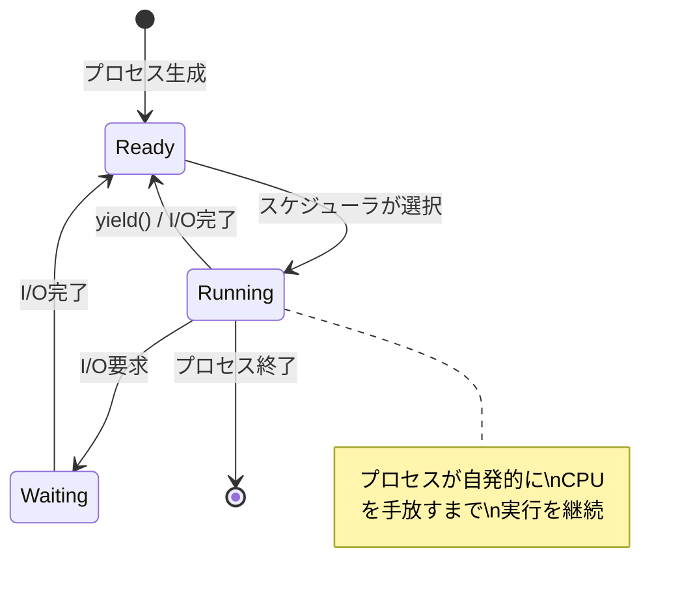
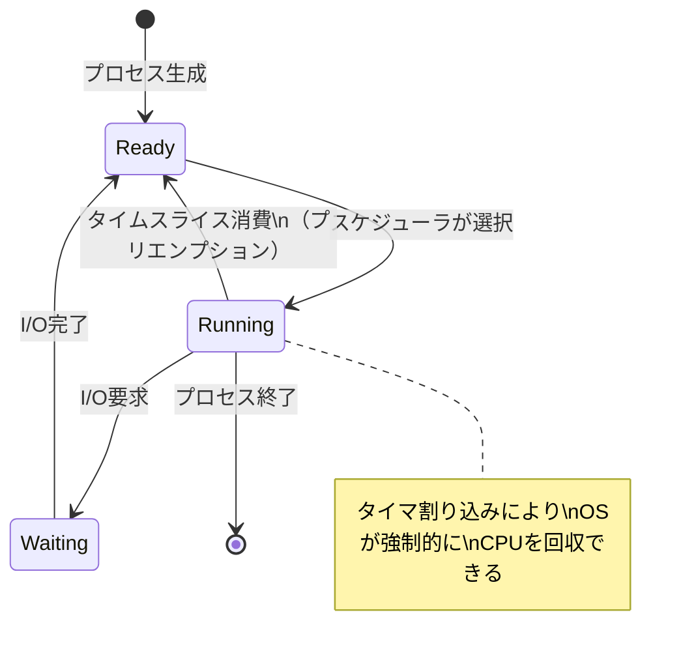
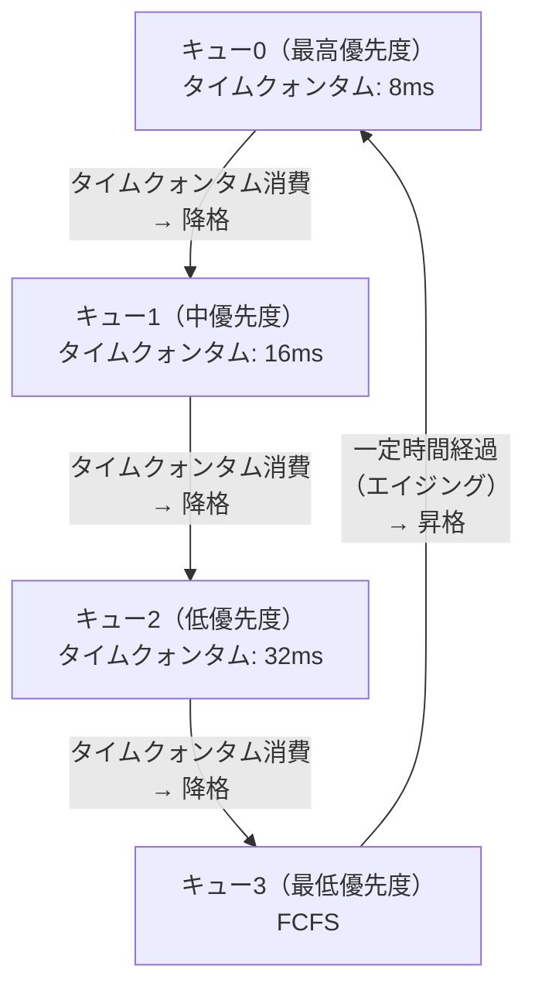
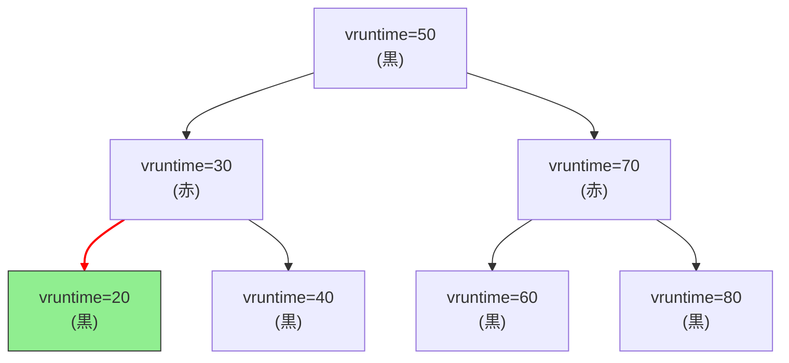
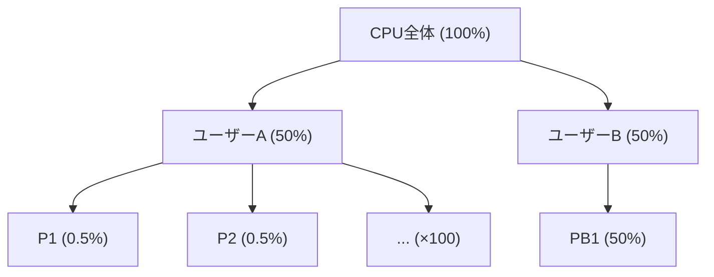
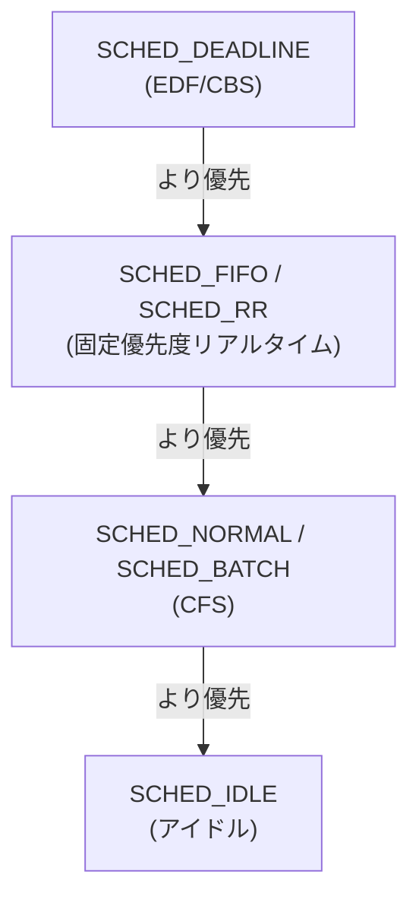
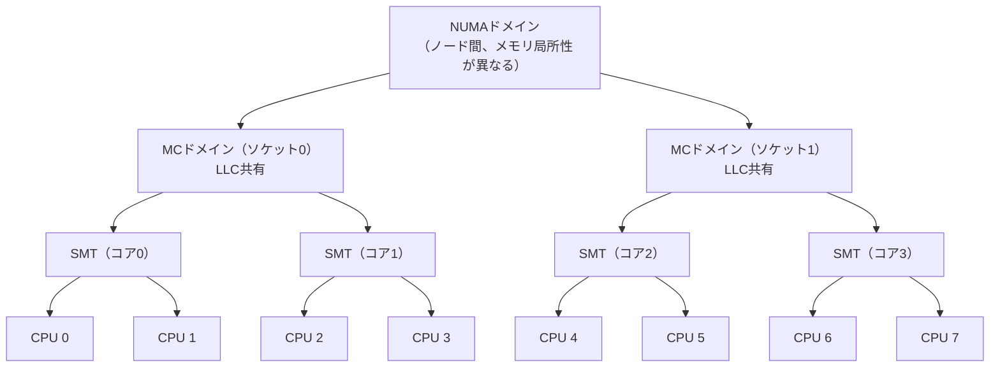

# プロセススケジューリング — CPU資源を賢く配分する技術

## 1. 背景と動機 — なぜスケジューリングが必要なのか

### 1.1 CPUは希少資源である

現代のコンピュータでは、数百から数千のプロセスやスレッドが同時に存在している。しかし、CPUコアの数はせいぜい数個から数十個であり、ある瞬間に実際にCPU上で命令を実行できるのはコア数と同じ数だけである。残りのプロセスは「実行可能だが待っている」状態にある。

この状況を管理するのが**プロセススケジューラ（process scheduler）**である。スケジューラは、実行可能なプロセス群の中から次にCPUを割り当てるプロセスを選択するOSカーネルの中核コンポーネントである。スケジューリングの品質は、システムの応答性、スループット、公平性に直接影響し、OSの設計において最も重要なテーマの一つとなっている。

### 1.2 バッチ処理からタイムシェアリングへ

スケジューリングの歴史は、コンピュータの利用形態の変遷と密接に結びついている。

**バッチ処理時代（1950〜1960年代）** では、プログラムをカードやテープに記録し、オペレータが順番に投入して実行していた。1つのジョブが完了するまで次のジョブは待たされる。この方式ではスケジューリングの概念は単純で、「先着順に処理する」だけだった。しかし、I/O待ちの間CPUが遊休状態になるという深刻な非効率があった。

**マルチプログラミング（1960年代）** では、複数のプログラムをメモリに同時にロードし、あるプログラムがI/O待ちになったら別のプログラムにCPUを切り替えることで効率を向上させた。ここで初めて「どのプログラムに次のCPU時間を与えるか」という本格的なスケジューリング問題が生まれた。

**タイムシェアリング（1960年代後半〜）** では、タイマ割り込みを利用して一定時間（タイムスライス）ごとに強制的にCPUを切り替えることで、複数のユーザーに対話的な応答性を提供した。Multicsはこの概念を最初に実現したシステムの一つである。

現代のOSでは、対話的なデスクトップアプリケーション、Webサーバー、バッチ処理、リアルタイム制御など、性質の大きく異なるワークロードが同時に動作する。スケジューラはこれらすべてに対して適切な動作を提供しなければならない。

### 1.3 スケジューリングの目標

スケジューリングアルゴリズムの設計には、しばしば相互に矛盾する複数の目標が存在する。

| 目標 | 定義 | 重視される場面 |
|---|---|---|
| **スループット（Throughput）** | 単位時間あたりに完了するジョブの数 | バッチ処理、サーバー |
| **応答時間（Response Time）** | ジョブが投入されてから最初の応答が返るまでの時間 | 対話型アプリケーション |
| **ターンアラウンドタイム** | ジョブが投入されてから完了するまでの総時間 | バッチ処理 |
| **公平性（Fairness）** | すべてのプロセスに均等なCPU時間を配分する | 汎用OS |
| **デッドライン遵守** | 指定された期限までにタスクを完了する | リアルタイムシステム |
| **CPU利用率** | CPUが遊休状態にならないようにする | すべてのシステム |
| **オーバーヘッドの最小化** | スケジューリング処理自体のコストを抑える | すべてのシステム |

例えば、スループットを最大化するにはコンテキストスイッチの回数を減らす（各プロセスに長い時間を与える）のが有効だが、これは応答時間の悪化を招く。逆に応答時間を改善するにはタイムスライスを短くする必要があるが、コンテキストスイッチのオーバーヘッドが増加しスループットが低下する。このトレードオフはスケジューリング設計における永遠のテーマである。

## 2. プリエンプティブ vs ノンプリエンプティブ

スケジューリングの大きな分類軸として、**プリエンプティブ（preemptive）**と**ノンプリエンプティブ（non-preemptive / cooperative）**の区別がある。

### 2.1 ノンプリエンプティブスケジューリング

ノンプリエンプティブ（協調的）スケジューリングでは、実行中のプロセスが自発的にCPUを手放すまで、OSはCPUを奪うことができない。プロセスがCPUを手放すのは、I/O待ちに入る場合、`yield()`のような明示的な譲渡を行う場合、またはプロセスが終了する場合に限られる。



この方式は実装が単純であるが、重大な問題がある。あるプロセスが無限ループに陥ったり、長時間CPUを占有し続けたりすると、他のプロセスが一切実行されなくなる。Windows 3.1やクラシックMac OSはこの方式を採用していたが、1つのアプリケーションの暴走がシステム全体をフリーズさせる原因となっていた。

### 2.2 プリエンプティブスケジューリング

プリエンプティブスケジューリングでは、OSがタイマ割り込みを利用して、実行中のプロセスから強制的にCPUの制御を奪うことができる。タイムスライスが消費された場合や、より高い優先度のプロセスが実行可能になった場合に、スケジューラが介入する。



現代の汎用OSはすべてプリエンプティブスケジューリングを採用している。これにより、個々のプロセスの行儀の良さに依存することなく、システム全体の安定性と公平性を保証できる。

### 2.3 両方式の比較

| 特性 | ノンプリエンプティブ | プリエンプティブ |
|---|---|---|
| CPU奪取のタイミング | プロセスが自発的に手放す | OS がいつでも奪える |
| 応答性 | 悪い（1つが占有する可能性） | 良い（タイムスライスで保証） |
| 実装の複雑さ | 単純 | 複雑（再入可能性、同期が必要） |
| 暴走プロセスへの耐性 | 弱い | 強い |
| コンテキストスイッチのオーバーヘッド | 最小限 | 発生する |
| 採用例 | Windows 3.1, クラシックMac OS | Linux, Windows NT以降, macOS |

## 3. 古典的スケジューリングアルゴリズム

ここでは、OSの教科書で広く取り上げられる古典的なスケジューリングアルゴリズムを解説する。これらは概念的な基盤であり、現代のスケジューラは複数のアイデアを組み合わせて構成されている。

### 3.1 FCFS（First-Come, First-Served）

**FCFS**は最も単純なスケジューリングアルゴリズムで、到着した順にプロセスを処理する。ノンプリエンプティブであり、一度実行が始まったプロセスは完了するかI/O待ちになるまでCPUを占有する。

```mermaid
gantt
    title FCFS スケジューリング（例）
    dateFormat X
    axisFormat %s
    section CPU
    P1 (burst=24) :a1, 0, 24
    P2 (burst=3)  :a2, 24, 27
    P3 (burst=3)  :a3, 27, 30
```



上の例では、P1（バースト時間24）、P2（バースト時間3）、P3（バースト時間3）がこの順に到着した場合、平均待ち時間は (0 + 24 + 27) / 3 = 17 となる。しかし、もしP2, P3, P1の順に到着していれば、平均待ち時間は (0 + 3 + 6) / 3 = 3 に大幅に改善される。

この現象は**コンボイ効果（convoy effect）**と呼ばれる。1つの長いプロセスの後ろに短いプロセスが多数並んでしまうと、全体の平均待ち時間が著しく悪化する。

**FCFSの特性：**
- 実装が非常に単純（FIFOキューのみ）
- コンボイ効果による性能劣化
- 対話型システムには不適

### 3.2 SJF（Shortest Job First）

**SJF**は、CPUバースト時間が最も短いプロセスを優先的に実行するアルゴリズムである。理論的には、SJFは平均待ち時間を最小化する最適なアルゴリズムであることが証明されている。

しかし、SJFには根本的な問題がある。**次のCPUバースト時間を事前に知ることは不可能**である。実際のシステムでは、過去のバースト時間から将来のバースト時間を予測する手法（指数平滑法など）が使われるが、予測精度には限界がある。

次のCPUバースト時間の予測には、以下の指数平滑法がしばしば用いられる。

$$\tau_{n+1} = \alpha \cdot t_n + (1 - \alpha) \cdot \tau_n$$

ここで、$t_n$ は直前の実際のCPUバースト時間、$\tau_n$ は直前の予測値、$\alpha$ （$0 \leq \alpha \leq 1$）は新しい情報への重み付けパラメータである。$\alpha = 0.5$ が典型的な値として用いられる。

SJFのプリエンプティブ版は**SRTF（Shortest Remaining Time First）**と呼ばれ、新たなプロセスが到着した時点で残りバースト時間が最短のプロセスに切り替える。

**SJFの特性：**
- 平均待ち時間を最小化する（最適）
- 実行時間の事前予測が必要（実用上の大きな障壁）
- 長いプロセスが**スタベーション（starvation）**に陥る可能性がある

### 3.3 Round Robin（ラウンドロビン）

**Round Robin（RR）**は、タイムシェアリングシステムのために設計されたプリエンプティブなアルゴリズムである。すべてのプロセスは循環キューに並び、各プロセスには一定のタイムクォンタム（quantum、タイムスライスとも言う）が与えられる。タイムクォンタムが消費されるとプリエンプトされ、キューの末尾に回される。

```mermaid
gantt
    title Round Robin（タイムクォンタム = 4）
    dateFormat X
    axisFormat %s
    section CPU
    P1 :a1, 0, 4
    P2 :a2, 4, 7
    P3 :a3, 7, 11
    P1 :a4, 11, 15
    P3 :a5, 15, 19
    P1 :a6, 19, 23
    P1 :a7, 23, 27
```



タイムクォンタムの設定は性能に大きく影響する。

- **タイムクォンタムが極端に大きい場合** → FCFSと同じ動作になる
- **タイムクォンタムが極端に小さい場合** → コンテキストスイッチのオーバーヘッドが支配的になり、実質的なCPU利用率が低下する
- **経験則** → タイムクォンタムは、CPUバーストの80%程度がタイムクォンタム内に収まるように設定するのが望ましい。典型的には10〜100ミリ秒程度

**Round Robinの特性：**
- すべてのプロセスに公平なCPU時間を保証
- スタベーションが発生しない
- 応答時間の上限が保証される（n個のプロセスでタイムクォンタムq なら、最大待ち時間は (n-1) * q）
- 平均ターンアラウンドタイムはSJFより悪い傾向

### 3.4 Priority Scheduling（優先度スケジューリング）

**優先度スケジューリング**では、各プロセスに優先度（priority）が割り当てられ、最も高い優先度のプロセスが次にCPUを獲得する。優先度が同じプロセスの間ではFCFSなどの二次的なルールが適用される。

優先度の決定方法は大きく2つに分類される。

- **静的優先度** — プロセス生成時に決定され、変化しない。UNIX系OSの `nice` 値が代表例
- **動的優先度** — 実行状況に応じて動的に変更される。I/O待ちから復帰したプロセスの優先度を上げるなど

優先度スケジューリングの最大の問題は**スタベーション**である。高優先度のプロセスが継続的に到着すると、低優先度のプロセスは永遠にCPUを得られない可能性がある。この問題への対策として**エイジング（aging）**が用いられる。待機時間が長くなるにつれて優先度を段階的に引き上げ、最終的にはすべてのプロセスが実行される機会を得られるようにする。

### 3.5 MLFQ（Multi-Level Feedback Queue）

**MLFQ（マルチレベルフィードバックキュー）**は、複数の優先度レベルを持つキューと動的な優先度調整を組み合わせた、実用的で強力なアルゴリズムである。1962年にFernando J. Corbatóがシステム「CTSS」で導入したこのアルゴリズムは、SJFの利点（短いジョブの優先）を、実行時間の事前知識なしに実現しようとする。



MLFQの基本ルールは以下の通りである。

1. **新しいプロセスは最高優先度のキューに入る**
2. **上位キューのプロセスが優先して実行される**
3. **タイムクォンタムを使い切ったプロセスは1段階低いキューに移動する**
4. **I/O待ちなどでタイムクォンタムを使い切る前にCPUを手放したプロセスは、同じキューに留まる**
5. **一定時間経過後、すべてのプロセスを最高優先度キューに戻す（priority boost）**

このルールにより、以下の動作が自然に実現される。

- **対話的プロセス**（I/Oバウンド）は、頻繁にI/O待ちに入りタイムクォンタムを使い切らないため、高い優先度を維持する → 短い応答時間が保たれる
- **CPUバウンドのバッチプロセス**は、タイムクォンタムを繰り返し使い切るため、低い優先度に降格する → 対話的プロセスの邪魔をしない
- **ルール5のpriority boost**により、スタベーションを防止する

ルール5がないと、CPUバウンドプロセスは低い優先度に永久に留まり、後から到着し続ける対話的プロセスによってスタベーションに陥る。priority boostは、プロセスの振る舞いの変化にも対応する。あるプロセスがCPUバウンドのフェーズを終えてI/Oバウンドのフェーズに入った場合、boostにより高い優先度に戻り、適切な応答性を得られる。

MLFQはFreeBSD、Solaris、Windows NTなど多くのOSで採用されてきた歴史あるアルゴリズムである。ただし、パラメータ（キューの数、各キューのタイムクォンタム、boost間隔など）のチューニングが必要であり、ワークロードによって最適な設定が変わるという運用上の課題がある。

## 4. LinuxスケジューラのO(1)スケジューラの歴史

### 4.1 Linux 2.4以前のスケジューラ

初期のLinuxカーネル（2.4以前）のスケジューラは、非常にシンプルな設計であった。すべての実行可能なプロセスをリンクリストで管理し、スケジューリング時にはリスト全体を走査して最も優先度の高いプロセスを選択していた。この計算量は $O(n)$（nは実行可能プロセス数）であり、プロセス数が少ないうちは問題にならなかったが、数百から数千のプロセスが動作するサーバー環境ではスケジューリングのオーバーヘッドが顕著になった。

### 4.2 O(1)スケジューラ（Linux 2.6.0〜2.6.22）

2003年にリリースされたLinux 2.6.0で、Ingo Molnárが設計した**O(1)スケジューラ**が導入された。名前の通り、スケジューリング判断にかかる計算量がプロセス数に依存しない $O(1)$ を実現した。

O(1)スケジューラの核心的な設計は以下の通りである。

- **140段階の優先度** — 0〜99がリアルタイム優先度、100〜139が通常プロセスの優先度（nice値 -20〜+19に対応）
- **2つのランキュー** — activeキューとexpiredキューの2つのビットマップ付き配列を持つ
- **ビットマップによる高速検索** — 140ビットのビットマップで、どの優先度レベルにプロセスが存在するかを管理。最高優先度の検索は `find_first_bit()` 命令一つで $O(1)$ で完了する
- **activeとexpiredの交換** — activeキューのすべてのプロセスがタイムスライスを使い切ると、activeとexpiredのポインタを交換するだけで新しいエポックが始まる

```
Active Array                    Expired Array
[0]  → task_list               [0]  → task_list
[1]  → task_list               [1]  → task_list
...                             ...
[139] → task_list               [139] → task_list
bitmap: 140 bits                bitmap: 140 bits
```

O(1)スケジューラはスケジューリングの計算量の問題を解決したが、以下の問題が残った。

- **対話的プロセスの識別ヒューリスティクスが複雑** — スリープ時間に基づく動的優先度調整は経験則に依存しており、ワークロードによっては適切に機能しないケースがあった
- **公平性の保証が弱い** — 優先度に基づくスケジューリングでは、同一優先度のプロセス間でのCPU時間の公平な配分が困難
- **SMPスケーラビリティの問題** — マルチプロセッサ環境での負荷分散アルゴリズムにも改善の余地があった

## 5. Linux CFS（Completely Fair Scheduler）

### 5.1 設計思想 — 理想的な公平性

2007年にリリースされたLinux 2.6.23で、Ingo MolnárによってO(1)スケジューラに代わる**CFS（Completely Fair Scheduler）**が導入された。CFSの設計思想は、名前の通り「完全に公平な」CPU時間の配分を目指すものである。

CFSの理想モデルは次のようなものである。n個のプロセスが存在する場合、それぞれが常にCPUの $1/n$ を使用しているかのように振る舞う**理想的なマルチタスクプロセッサ**を考える。現実にはCPUを時分割でしか使えないが、CFSはこの理想状態からの「乖離」を最小化するようにスケジューリングを行う。

### 5.2 vruntimeの仕組み

CFSの中核概念は**vruntime（virtual runtime）**である。vruntimeは、各プロセスが実際に使ったCPU時間を、そのプロセスの重み（nice値に基づく）で調整した仮想的な実行時間である。

基本的な計算は以下のようになる。

$$\text{vruntime の増分} = \text{実際の実行時間} \times \frac{\text{nice 0 の重み}}{\text{当該プロセスの重み}}$$

nice値と重みの関係は、nice値が1違うとCPU時間の比率が約1.25倍異なるように設計されている。具体的な重みの一部を示す。

| nice値 | 重み | nice 0との比率 |
|---|---|---|
| -20 | 88761 | 約68.7倍 |
| -10 | 9548 | 約7.4倍 |
| -5 | 3121 | 約2.4倍 |
| 0 | 1024 | 1.0倍 |
| 5 | 335 | 約0.33倍 |
| 10 | 110 | 約0.11倍 |
| 19 | 15 | 約0.015倍 |

nice値が低い（優先度が高い）プロセスは重みが大きいため、同じ実行時間でもvruntimeの増加が小さい。逆にnice値が高い（優先度が低い）プロセスはvruntimeが速く増加する。

スケジューラは常に**vruntimeが最も小さいプロセス**を次の実行対象として選択する。これにより、以下の動作が自然に実現される。

- CPU時間を多く使ったプロセスはvruntimeが大きくなり、しばらく選ばれにくくなる
- I/O待ちでスリープしていたプロセスはvruntimeが進まないため、復帰時に優先的に選ばれる（→ 対話的プロセスの応答性向上）
- nice値の低いプロセスはvruntimeの進みが遅いため、相対的に多くのCPU時間を得る

### 5.3 赤黒木によるプロセス管理

CFSは実行可能なプロセスを**赤黒木（Red-Black Tree）**で管理する。赤黒木は平衡二分探索木の一種であり、挿入・削除・最小値の検索がすべて $O(\log n)$ で行える。



最もvruntimeが小さいプロセス（上図ではvruntime=20のプロセス）は赤黒木の最左ノードにあり、これがCFSにおけるキャッシュ済みの `rb_leftmost` ポインタにより $O(1)$ で取得される。

スケジューリングの流れは以下の通りである。

1. 最左ノード（最小vruntime）のプロセスを取り出す
2. そのプロセスをCPUで実行する
3. タイムスライス消費後、実行時間に応じてvruntimeを更新する
4. 更新されたvruntimeで赤黒木に再挿入する（$O(\log n)$）
5. 新しい最左ノードのプロセスが次の実行対象となる

### 5.4 CFSのタイムスライス計算

CFSではタイムスライスを固定値ではなく、**スケジューリング期間（sched_period）**から動的に計算する。

- **プロセス数が少ない場合（例: 8以下）** → `sched_period` は典型的に6ms（`sysctl_sched_latency`で設定）
- **プロセス数が多い場合** → `sched_period = nr_running × sched_min_granularity`（`sched_min_granularity`は典型的に0.75ms）

各プロセスのタイムスライスは、`sched_period` を重みに比例して配分する。

$$\text{タイムスライス}_i = \text{sched\_period} \times \frac{w_i}{\sum_{j} w_j}$$

ここで $w_i$ はプロセス $i$ の重みである。

この設計により、プロセス数が増えてもスケジューリングの遅延が際限なく増加することはなく、`sched_min_granularity` によって最小タイムスライスが保証される。

### 5.5 スリープからの復帰とvruntimeの補正

プロセスが長時間スリープしていた場合、そのvruntimeは他のプロセスに比べて大幅に小さくなっている。もしこのままスケジューリングに参加させると、そのプロセスが不当に長い時間CPUを独占してしまう。

CFSでは、スリープから復帰したプロセスのvruntimeを、現在の実行キューの最小vruntimeに近い値に補正する。具体的には、復帰したプロセスのvruntimeを `min_vruntime - sched_latency` 程度の値に設定する。これにより、復帰したプロセスは優先的に選ばれるが、過度にCPUを独占することは防がれる。

### 5.6 グループスケジューリング

CFSは**cgroup（コントロールグループ）**と連携したグループスケジューリングをサポートする。例えば、ユーザーAが100個のプロセスを実行し、ユーザーBが1個のプロセスを実行している場合、単純なプロセスレベルのスケジューリングではユーザーAがCPU時間の99%を使ってしまう。

グループスケジューリングでは、まずグループ間でCPU時間を公平に配分し（ユーザーAとBが各50%）、次に各グループ内でプロセス間の配分を行う。これはcgroupのcpuコントローラによって制御される。



この仕組みはKubernetesにおけるコンテナのCPU制限（`cpu.shares`、`cpu.cfs_quota_us`）の基盤でもある。

## 6. リアルタイムスケジューリング

### 6.1 リアルタイムシステムとは

**リアルタイムシステム（real-time system）**では、タスクが指定されたデッドライン内に完了することが要求される。リアルタイム性は以下のように分類される。

- **ハードリアルタイム** — デッドラインの超過は壊滅的な結果を招く（例: 航空機の制御システム、ペースメーカー、ABS）
- **ソフトリアルタイム** — デッドラインの超過はサービス品質の低下につながるが、致命的ではない（例: 動画再生、音声通話）
- **ファームリアルタイム** — デッドラインを超過した結果は無価値になるが、システムの安全性には影響しない（例: センサーデータの定期収集）

Linuxはソフトリアルタイムをサポートしているが、ハードリアルタイム用途には PREEMPT_RT パッチ（2024年にLinux 6.12でメインラインにマージ）や、Xenomaiなどの拡張が必要となる。

### 6.2 リアルタイムタスクモデル

リアルタイムスケジューリングの理論では、周期的タスクモデルがよく用いられる。各タスク $\tau_i$ は以下のパラメータで特徴付けられる。

- $C_i$: 最悪実行時間（Worst-Case Execution Time, WCET）
- $T_i$: 周期（Period）
- $D_i$: 相対デッドライン（Relative Deadline）。簡単のため $D_i = T_i$ と仮定することが多い
- $U_i = C_i / T_i$: タスク $\tau_i$ のCPU利用率

システム全体のCPU利用率は以下で与えられる。

$$U = \sum_{i=1}^{n} \frac{C_i}{T_i}$$

$U > 1$ であれば、いかなるスケジューリングアルゴリズムを用いてもすべてのデッドラインを満たすことは不可能である。

### 6.3 Rate Monotonic Scheduling（RMS）

**Rate Monotonic Scheduling（RMS）**は、1973年にLiu & Laylandによって提案された、固定優先度のリアルタイムスケジューリングアルゴリズムである。

RMSのルールは極めて単純である。**周期が短いタスクほど高い優先度を与える**。つまり、最も頻繁に実行されるタスクが最も高い優先度を持つ。

RMSはプリエンプティブであり、より高い優先度のタスクが実行可能になると、現在実行中のタスクをプリエンプトする。

**スケジューラビリティ判定：**

Liu & Laylandにより、以下の十分条件が証明されている。$n$ 個のタスクがRMSによってすべてのデッドラインを満たせることが保証されるのは、

$$U = \sum_{i=1}^{n} \frac{C_i}{T_i} \leq n(2^{1/n} - 1)$$

を満たす場合である。$n \to \infty$ のとき、この上界は $\ln 2 \approx 0.693$ に収束する。

| タスク数 $n$ | 利用率上界 $n(2^{1/n}-1)$ |
|---|---|
| 1 | 1.000 |
| 2 | 0.828 |
| 3 | 0.780 |
| 5 | 0.743 |
| 10 | 0.718 |
| $\infty$ | 0.693 |

この条件は十分条件であり、この上界を超えてもスケジューラブルな場合がある。正確な判定にはResponse Time Analysis（RTA）などのより精密な手法が必要となる。

**RMSの具体例：**

タスク $\tau_1$（$C_1=1, T_1=4$）とタスク $\tau_2$（$C_2=2, T_2=6$）を考える。

- $U = 1/4 + 2/6 = 0.583$
- 2タスクの利用率上界は $0.828$

$U = 0.583 < 0.828$ なので、RMSでスケジューラブルである。$\tau_1$ の周期が短いため優先度が高い。

```mermaid
gantt
    title RMS スケジューリング例
    dateFormat X
    axisFormat %s
    section τ1 (C=1, T=4)
    τ1-job1 :a1, 0, 1
    τ1-job2 :a2, 4, 5
    τ1-job3 :a3, 8, 9
    section τ2 (C=2, T=6)
    τ2-job1 :b1, 1, 3
    τ2-job2-part1 :b2, 5, 6
    τ2-job2-part2 :b3, 9, 10
```



### 6.4 EDF（Earliest Deadline First）

**EDF（Earliest Deadline First）**は、動的優先度のリアルタイムスケジューリングアルゴリズムである。RMSとは異なり、実行時に動的にデッドラインを評価し、**絶対デッドラインが最も近いタスクに最高優先度を与える**。

EDFの最大の特徴は、**CPU利用率100%まで**（つまり $U \leq 1$）スケジューラブルであることが理論的に証明されている点である。これは固定優先度のRMS（上界 $\approx 0.693$）に比べて大きな優位性である。

$$U = \sum_{i=1}^{n} \frac{C_i}{T_i} \leq 1 \iff \text{EDFでスケジューラブル}$$

EDFはRMSの上界を超える場合でもスケジューラブルであることが多く、理論的に最適なスケジューリングアルゴリズムである。

**EDFの課題：**
- 動的優先度の管理が必要であり、実装がRMSより複雑
- 過負荷時（$U > 1$）の振る舞いが予測しにくい — RMSでは優先度が高いタスクが確実にデッドラインを満たす一方、EDFではどのタスクがデッドラインを逃すか予測が困難
- Linuxでは `SCHED_DEADLINE` ポリシー（Linux 3.14以降）としてCBS（Constant Bandwidth Server）アルゴリズムベースのEDFが実装されている

### 6.5 Linuxのリアルタイムスケジューリングクラス

Linuxカーネルは以下のスケジューリングクラスを階層的に管理する。



- **SCHED_DEADLINE** — 最も高い優先度。EDF/CBSに基づくデッドラインスケジューリング
- **SCHED_FIFO** — 固定優先度のリアルタイムスケジューリング。同一優先度内ではFIFO
- **SCHED_RR** — 固定優先度のリアルタイムスケジューリング。同一優先度内ではRound Robin
- **SCHED_NORMAL**（旧 SCHED_OTHER） — 通常のプロセス向け。CFSが担当
- **SCHED_BATCH** — CPU集約型のバッチプロセス向け。CFSが担当するが、対話性ボーナスを受けない
- **SCHED_IDLE** — 他に実行可能なプロセスがないときにだけ実行される

SCHED_DEADLINEクラスのタスクが実行可能であれば、常にSCHED_FIFOやSCHED_NORMALのタスクに優先して実行される。この階層構造により、リアルタイム要件のあるタスクと通常のタスクを同一システム上で共存させることができる。

## 7. マルチコアスケジューリング

### 7.1 SMP時代の到来

シングルコアプロセッサの時代には、スケジューリングは「実行可能なプロセスの中から1つを選ぶ」という問題であった。しかし、2000年代中盤以降、CPUの性能向上がクロック周波数の引き上げからマルチコア化へと移行すると、スケジューリングの問題は「複数のCPUにどのようにプロセスを配置するか」というより複雑な問題になった。

### 7.2 ロードバランシング

マルチコア環境では、すべてのCPUに均等に負荷を分散させる**ロードバランシング**が必要になる。あるCPUが過負荷で他のCPUが遊休状態であれば、システム全体のスループットは低下する。

ロードバランシングには大きく2つのアプローチがある。

**Push Migration（プッシュ型）**

カーネルの周期的なタスクが、各CPUの負荷を定期的に確認し、過負荷のCPUから軽負荷のCPUへプロセスを移動させる。Linuxではソフト割り込み（softirq）のコンテキストで `run_rebalance_domains()` が定期的に実行される。

**Pull Migration（プル型）**

CPUが自分のランキューが空になった（アイドル状態になった）ときに、他のCPUのランキューからプロセスを「引き取る」。これはワークスティーリング（work stealing）とも呼ばれ、負荷の不均衡を速やかに解消する。

Linuxは両方のアプローチを組み合わせて使用している。

### 7.3 スケジューリングドメイン

現代のマルチコアプロセッサは階層的なトポロジーを持つ。同じ物理コア上のハイパースレッド（SMT）、同じダイ上の複数コア、同じソケット上のマルチダイ構成、そしてマルチソケットのNUMAシステムなどがある。

Linuxでは**スケジューリングドメイン（scheduling domain）**という概念を用いて、このハードウェアトポロジーを抽象化している。



ロードバランシングは、このドメイン階層のボトムアップで行われる。まずSMTレベルでバランスを取り、次にMC（マルチコア）レベル、最後にNUMAレベルという順序である。より低いレベルのバランシングは頻繁に（ミリ秒オーダー）、より高いレベルのバランシングはより低頻度に（数十ミリ秒〜秒オーダー）行われる。これは、プロセスの移動コストが階層の上位ほど大きくなるためである。

### 7.4 CPU Affinity

**CPU Affinity（CPUアフィニティ）**は、プロセスを特定のCPUに紐づける仕組みである。

- **ソフトアフィニティ** — スケジューラは可能な限りプロセスを以前実行していたCPUで実行しようとするが、負荷分散の必要性に応じて別のCPUに移動させることもある。Linuxのデフォルト動作
- **ハードアフィニティ** — ユーザーが明示的にプロセスを特定のCPU（群）に固定する。`sched_setaffinity()` システムコールや `taskset` コマンドで設定

ソフトアフィニティは**キャッシュ親和性（cache affinity）**の観点から重要である。プロセスがあるCPUで実行された後、そのCPUのL1/L2キャッシュにはそのプロセスのデータが残っている。別のCPUに移動すると、キャッシュを「温め直す」（キャッシュウォームアップ）必要があり、性能が低下する。

ハードアフィニティは以下のような場面で有用である。

- **リアルタイム処理** — 特定のCPUをリアルタイムタスク専用にする（CPU isolation）
- **NUMA最適化** — プロセスをメモリが配置されているNUMAノードのCPUに固定する
- **ベンチマーク** — 他のプロセスの干渉を排除して正確な性能測定を行う

### 7.5 NUMA対応スケジューリング

**NUMA（Non-Uniform Memory Access）**アーキテクチャでは、各CPUからメモリへのアクセス遅延が均一ではない。CPUが自身のNUMAノードに接続されたローカルメモリにアクセスする場合は高速だが、リモートノードのメモリにアクセスする場合は2〜3倍の遅延が発生する。

```
+------------------+     QPI/UPI     +------------------+
|  NUMAノード 0    |<-------------->|  NUMAノード 1    |
|  CPU 0-7         |                 |  CPU 8-15        |
|  ローカルメモリ   |                 |  ローカルメモリ   |
|  (アクセス: ~100ns)|                |  (アクセス: ~100ns)|
+------------------+                 +------------------+
        |                                     |
        |  リモートアクセス: ~200-300ns        |
        +-------------------------------------+
```

Linuxのスケジューラ（特にLinux 3.8以降のNUMA Balancing機能）は、以下の方針でNUMAの特性に対応する。

1. **プロセスのメモリアクセスパターンを監視** — ページテーブルを操作してNUMAページフォルトを人為的に発生させ、どのノードのメモリにアクセスしているかを追跡する
2. **プロセスをメモリの近くに移動** — リモートメモリへのアクセスが多いプロセスを、そのメモリが存在するノードのCPUに移動する
3. **メモリをプロセスの近くに移動** — 逆に、メモリページを現在プロセスが実行されているノードに移行する

これらの判断はヒューリスティクスに基づいて自動的に行われるが、`numactl` コマンドやmbindシステムコールで明示的に制御することも可能である。

## 8. 最新動向 — EEVDF

### 8.1 CFSの限界

CFSは長年にわたってLinuxのデフォルトスケジューラとして優れた性能を発揮してきたが、いくつかの問題点が認識されるようになった。

1. **レイテンシの保証がない** — CFSはvruntimeに基づく公平性は保証するが、特定のプロセスが「いつまでに」CPUを得られるかというレイテンシの上界を厳密に保証しない
2. **スリーパー問題** — スリープから復帰したプロセスの扱い（vruntimeの補正）にはヒューリスティクスが必要であり、完全には解決されていない
3. **公平性とレイテンシのバランス** — 短いタイムスライスはレイテンシを改善するが公平性に影響し、長いタイムスライスはその逆。CFSではこのバランスの制御が難しい

### 8.2 EEVDFとは

**EEVDF（Earliest Eligible Virtual Deadline First）**は、1995年にIon StoicaとHussein Abdel-Wahab が提案したスケジューリングアルゴリズムであり、2023年にLinux 6.6でCFSを置き換える形で導入された。EEVDF は CFSの公平性の概念を維持しつつ、レイテンシの保証を追加したアルゴリズムである。

EEVDFの核心的なアイデアは、各プロセスに**仮想デッドライン（virtual deadline）**を設定し、それに基づいてスケジューリングを行う点にある。

### 8.3 EEVDFの仕組み

EEVDFでは、各プロセスに対して2つの時刻が管理される。

- **eligible time** — プロセスがスケジューリングの対象になる最早時刻。公平性の観点から、まだ「十分なCPU時間を受け取っていない」プロセスのみがeligibleとなる
- **virtual deadline** — プロセスの仮想的なデッドライン。eligible timeにタイムスライス分を加えた時刻

スケジューラは以下のルールで次のプロセスを選択する。

1. **eligibleなプロセスのみを候補とする** — 既に「公平な取り分」以上のCPU時間を受け取ったプロセスは一時的にeligibleでなくなる
2. **eligibleなプロセスの中で、virtual deadlineが最も早いものを選ぶ**

この仕組みにより、以下の利点が得られる。

- **公平性** — eligible timeの概念により、CFSと同様の公平なCPU時間配分が実現される
- **レイテンシの制限** — virtual deadlineにより、プロセスが次にCPUを得られるまでの待ち時間に上界が設定される
- **タイムスライスの柔軟性** — プロセスごとにタイムスライス（スライス長）を指定でき、これがvirtual deadlineの計算に影響する。短いタイムスライスを要求するプロセスは、より短いvirtual deadlineを持つため、より頻繁にCPUを得られる

### 8.4 CFSからEEVDFへの移行

Linux 6.6（2023年10月リリース）でEEVDFがCFSを置き換えた。この移行はPeter Zijlstraを中心に行われ、以下の点が強調された。

- **vruntimeの概念は維持される** — EEVDFでもvruntimeに相当する仮想時間の追跡は行われる
- **赤黒木ベースのデータ構造も維持** — 実装面での連続性がある
- **後方互換性** — 既存のsysctlパラメータやcgroupインターフェースはほぼそのまま利用可能
- **`sched_ext`との連携** — Linux 6.12で導入された `sched_ext`（BPFベースのカスタムスケジューラ）フレームワークとの連携も視野に入れた設計

EEVDFの導入により、特にレイテンシに敏感なワークロード（ゲーミング、オーディオ処理、デスクトップの対話性）で改善が報告されている。

## 9. スケジューリングの実装と計測

### 9.1 Linuxにおけるスケジューリングパラメータの確認と変更

```bash
# Process scheduling policy and priority
chrt -p <PID>

# Change to SCHED_FIFO with priority 50
sudo chrt -f -p 50 <PID>

# Change to SCHED_DEADLINE
sudo chrt -d --sched-runtime 5000000 --sched-period 16666666 --sched-deadline 16666666 -p 0 <PID>

# Set nice value
nice -n -5 ./my_program
renice -n 10 -p <PID>

# Set CPU affinity
taskset -c 0,1 ./my_program
taskset -cp 0-3 <PID>

# View scheduling domain topology
cat /proc/schedstat
ls /sys/kernel/debug/sched/
```

### 9.2 スケジューリングの可視化

スケジューリングの振る舞いを理解・デバッグするために、以下のツールが利用できる。

- **`perf sched`** — Linuxの `perf` ツールに含まれるスケジューリングイベントの記録・分析機能
  - `perf sched record` でスケジューリングイベントを記録
  - `perf sched latency` でプロセスごとのスケジューリング遅延を表示
  - `perf sched map` でCPUごとのプロセス実行を時系列で可視化
- **`trace-cmd`** — ftraceのフロントエンド。`sched_switch`、`sched_wakeup` などのトレースポイントを記録
- **`kernelshark`** — `trace-cmd` の結果をGUIで可視化するツール

```bash
# Record scheduling events for 5 seconds
perf sched record -- sleep 5

# Show scheduling latency summary
perf sched latency

# Show CPU-to-process mapping over time
perf sched map
```

### 9.3 スケジューリングレイテンシの測定

```bash
# cyclictest: measure scheduling latency for real-time workloads
sudo cyclictest -t 4 -p 80 -n -i 1000 -l 10000

# -t 4: 4 threads
# -p 80: priority 80
# -n: use clock_nanosleep
# -i 1000: interval 1000us
# -l 10000: 10000 loops
```

`cyclictest` は、指定した間隔でスレッドがウェイクアップし、実際のウェイクアップ時刻と理論的なウェイクアップ時刻の差分（レイテンシ）を測定する。リアルタイムシステムのチューニングにおいて標準的なベンチマークツールである。

## 10. 設計上のトレードオフと実践的考察

### 10.1 スケジューリングにおける根本的なトレードオフ

スケジューラの設計は、以下の根本的なトレードオフの上に成り立っている。

**公平性 vs 効率性**

完全に公平なスケジューリング（全プロセスに等しいCPU時間）を追求すると、コンテキストスイッチの頻度が増加し、キャッシュの効率が低下する。ある程度の不公平を許容することで、スループットを改善できる。

**応答時間 vs スループット**

対話的プロセスの応答時間を最小化するには、短いタイムスライスと頻繁なプリエンプションが必要だが、これはコンテキストスイッチのオーバーヘッドを増加させ、スループットを低下させる。

**汎用性 vs 特化**

あらゆるワークロードに対して「そこそこ良い」動作をするスケジューラと、特定のワークロードに最適化されたスケジューラのトレードオフ。Linuxは汎用OSとして前者を目指しているが、`sched_ext`（Linux 6.12）によりBPFプログラムでカスタムスケジューラを実装できるようになり、ワークロード固有の最適化が容易になった。

**単純さ vs 最適性**

理論的に最適なアルゴリズム（例: EDFの利用率100%保証）は実装が複雑になりがちである。一方、単純なアルゴリズム（例: Round Robin）は理解しやすく実装も容易だが、最適ではない。

### 10.2 ワークロード別の推奨設定

| ワークロード | 推奨ポリシー | 備考 |
|---|---|---|
| デスクトップアプリ | SCHED_NORMAL | デフォルト。EEVDFの恩恵を受ける |
| Webサーバー | SCHED_NORMAL | nice値の調整で優先度を制御 |
| バッチ処理 | SCHED_BATCH | 対話性ボーナスを無効化し、スループット重視 |
| 音声/映像処理 | SCHED_FIFO / SCHED_RR | ソフトリアルタイム要件に対応 |
| 産業制御 | SCHED_DEADLINE | ハードリアルタイム。PREEMPT_RTカーネルと併用 |
| 低優先度バックグラウンド | SCHED_IDLE | 他のタスクがないときだけ実行 |

### 10.3 sched_ext — BPFによるカスタムスケジューラ

Linux 6.12（2024年11月リリース）で導入された**sched_ext**は、eBPFプログラムを使ってユーザー空間でスケジューリングポリシーをカスタマイズできるフレームワークである。

sched_extにより、カーネルの再コンパイルやモジュールの開発なしに、ワークロード固有のスケジューリングロジックを迅速に実装・デプロイできるようになった。Metaでは社内のワークロードに最適化したカスタムスケジューラの開発に活用されている。

sched_extの登場は、「1つのスケジューラですべてのワークロードに対応する」という従来の前提を変え、スケジューリングをよりアプリケーション層に近い場所でカスタマイズする時代への転換を示唆している。

## 11. まとめ

プロセススケジューリングは、CPUという有限資源を複数のプロセスに効率的かつ公平に配分するための、OS設計における中核的な技術である。

本記事で見てきたように、スケジューリングは単純な先着順処理（FCFS）から始まり、SJFの最適性の追求、Round Robinによる公平性の保証、MLFQによる適応的な優先度制御、そしてLinux CFSのvruntimeに基づく精密な公平性の実現へと進化してきた。さらに2023年のEEVDFの導入は、公平性に加えてレイテンシの保証という新たな次元を加えた。

リアルタイムスケジューリングの分野では、RMSの理論的な厳密さとEDFの最適性が確立され、LinuxにおけるSCHED_DEADLINEの実装につながった。マルチコア時代には、ロードバランシング、CPU Affinity、NUMA対応といった新たな課題が加わり、スケジューリングの問題空間はさらに拡大している。

そして現在、sched_extに代表されるように、スケジューリングはカーネル開発者だけのものではなく、アプリケーション開発者が自らのワークロードに最適化できる領域になりつつある。スケジューリングの研究と実装は、コンピュータの利用形態の変化とともに、今後も進化を続けていくだろう。
