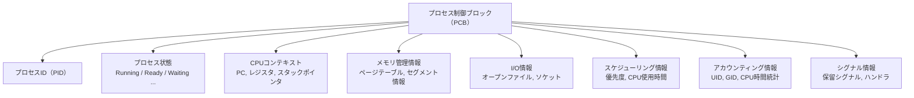
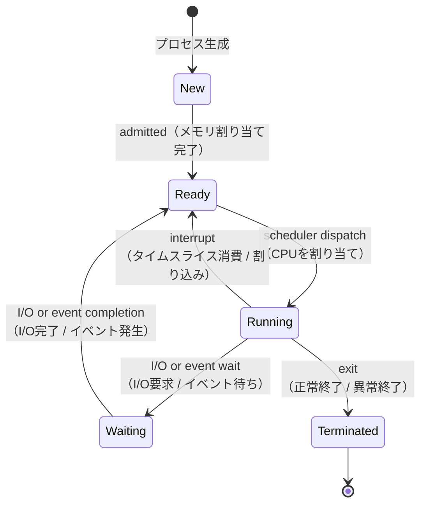
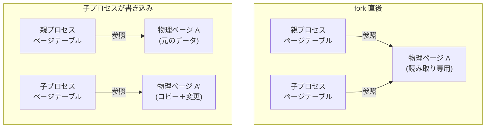
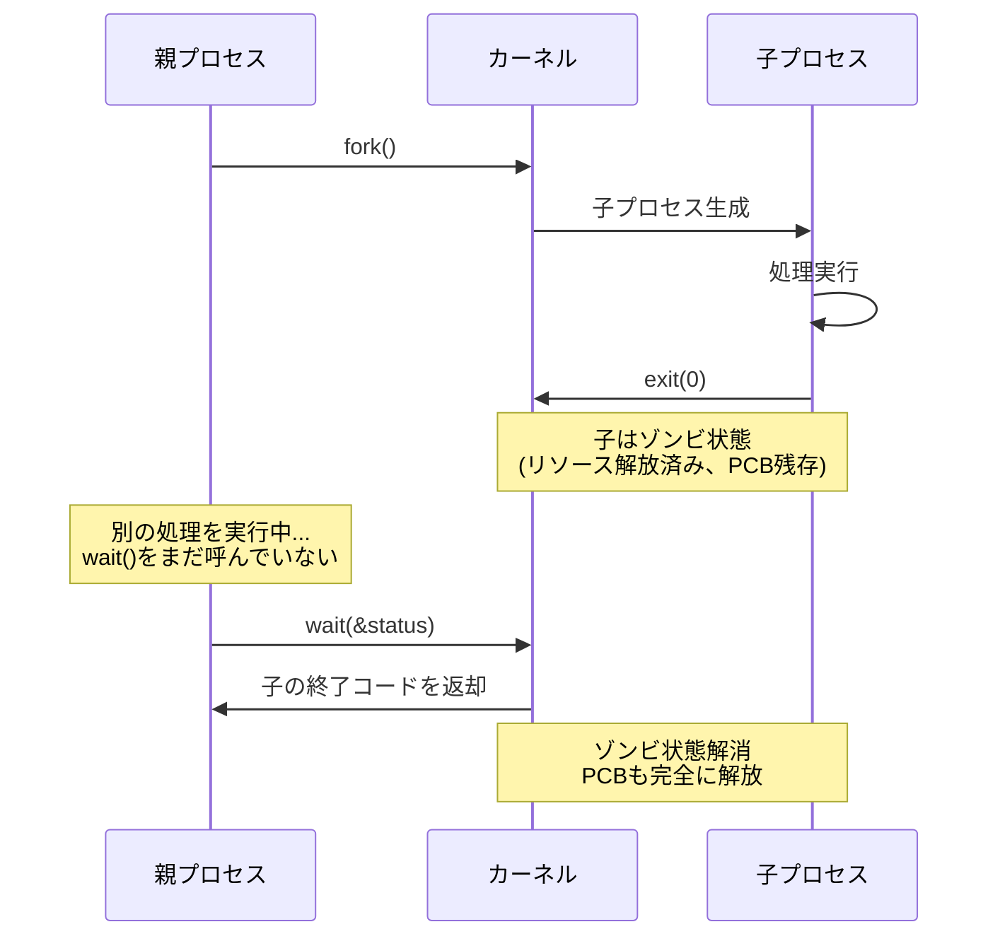
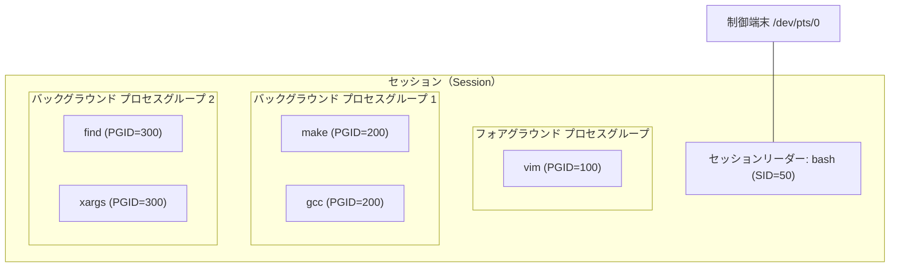
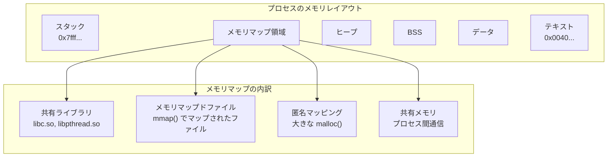
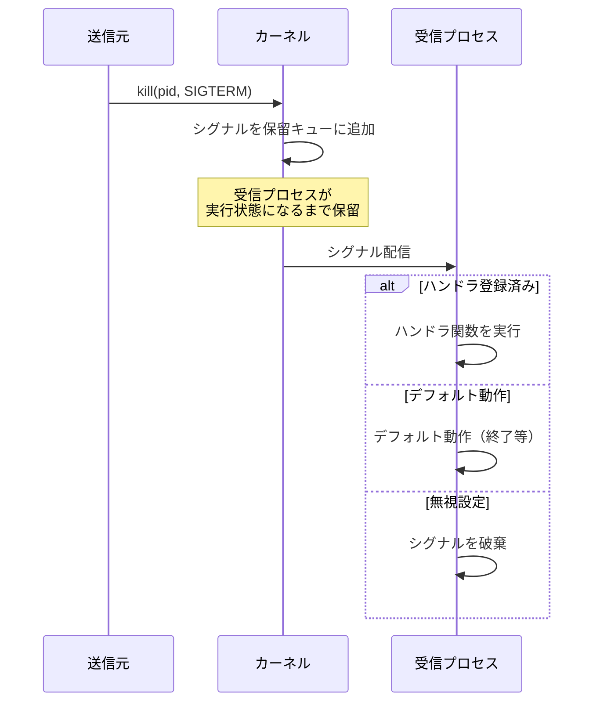
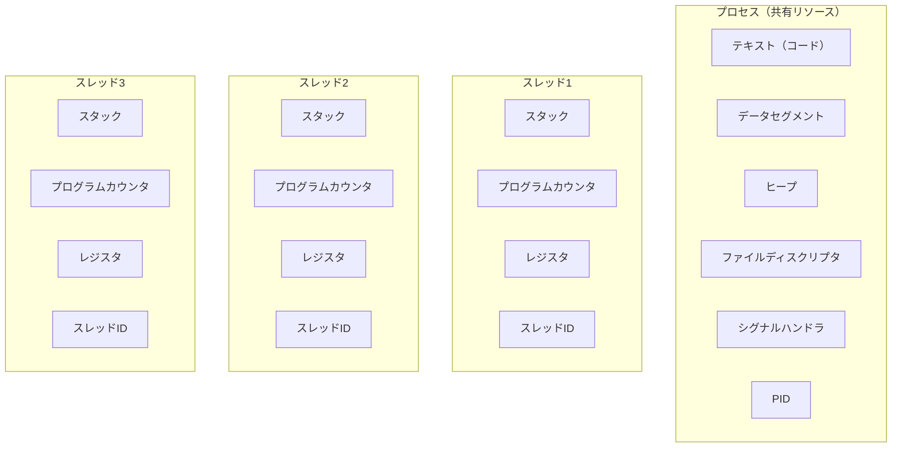
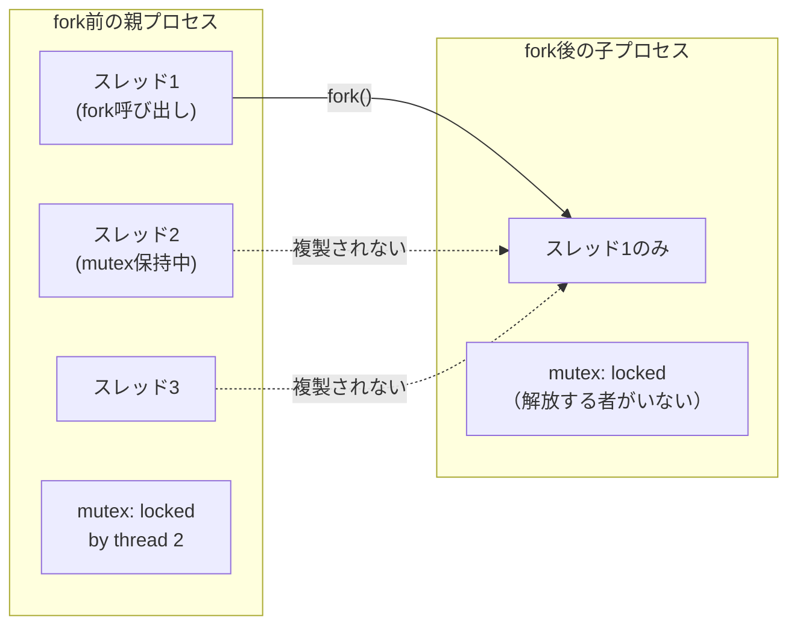

# プロセスの概念とライフサイクル

## 1. 背景と動機 — プログラムとプロセスの違い

### 1.1 プログラムは静的、プロセスは動的

オペレーティングシステム（OS）を学ぶうえで最も基本的な概念の一つが**プロセス（process）**である。プロセスとは、一言でいえば「実行中のプログラム」であるが、この簡潔な定義には深い意味が含まれている。

**プログラム（program）**はディスク上に格納された命令列と初期データの集合であり、それ自体は何のアクションも起こさない静的な存在である。C言語でコンパイルして生成した実行可能ファイル（ELF形式やPE形式）、あるいはPythonの`.py`ファイルなどが該当する。これらはディスク上に「置かれているだけ」では何も起きない。

一方、**プロセス**はそのプログラムをメモリにロードし、CPUが命令を逐次実行し始めた瞬間から生まれる動的な実体である。プロセスには以下のような**実行時の状態**が付随する。

- プログラムカウンタ（次に実行する命令のアドレス）
- CPUレジスタの値
- スタック（関数呼び出しの履歴、ローカル変数）
- ヒープ（動的に確保されたメモリ）
- オープンしているファイルディスクリプタ
- シグナルハンドラの設定
- プロセスID、ユーザーID、カレントディレクトリなどのメタデータ

同じプログラムから複数のプロセスを同時に起動することは日常的に行われる。例えばWebサーバーのApache HTTP Serverは、クライアント接続ごとに子プロセスをforkして並行処理する。この場合、同じ実行可能ファイルから生まれた複数のプロセスが存在するが、それぞれ独立した仮想アドレス空間を持ち、独立した実行状態を持つ。プログラムは「レシピ」であり、プロセスは「レシピに従って料理をしている行為そのもの」に例えられる。

### 1.2 なぜプロセスという抽象化が必要なのか

初期のコンピュータは一度に1つのプログラムしか実行できなかった。バッチ処理方式では、オペレータがプログラムを1つずつ投入し、完了を待ってから次のプログラムを実行していた。この方式ではCPUの利用効率が極めて低く、I/O待ち時間の間CPUは遊休状態になっていた。

1960年代に登場した**マルチプログラミング**の概念は、複数のプログラムをメモリ上に同時に保持し、あるプログラムがI/O待ちになったら別のプログラムにCPUを切り替えることで、CPU利用効率を飛躍的に向上させた。さらに**タイムシェアリングシステム**では、一定の時間間隔（タイムスライス）で強制的にプログラムを切り替えることで、複数のユーザーに対話的な応答性を提供した。

このような環境では、各プログラムの実行状態を管理するための抽象化が不可欠となる。OSは以下の責務を果たす必要がある。

1. **隔離（Isolation）** — 各プログラムが他のプログラムのメモリを破壊できないようにする
2. **資源の公平な分配** — CPU時間、メモリ、I/Oデバイスを複数のプログラムに適切に配分する
3. **状態の保存と復元** — CPU切り替え時に実行状態を正確に保存・復元する
4. **ライフサイクル管理** — プログラムの起動、停止、異常終了の処理を一貫して管理する

**プロセス**は、これらすべてを実現するためにOSが提供する中心的な抽象化である。プロセスの概念なくして、現代のマルチタスクOSは成り立たない。

### 1.3 歴史的背景

プロセスの概念は、1960年代にMITが開発した**Multics**（Multiplexed Information and Computing Service）で体系化された。Multicsは多くの先進的なアイデアを導入したが、あまりに複雑になりすぎた。その反省から、Ken ThompsonとDennis RitchieがBell研究所で1969年に開発した**UNIX**では、プロセスの概念をシンプルかつ強力に再設計した。

UNIXのプロセスモデルは以下の特徴を持つ。

- すべてのプロセスは一意のプロセスID（PID）を持つ
- プロセスはツリー構造の親子関係を形成する
- `fork()`システムコールで子プロセスを生成する
- `exec()`システムコールでプロセスの実行内容を置き換える
- `wait()`システムコールで子プロセスの終了を待つ

この「fork-exec モデル」はシンプルでありながら極めて柔軟であり、50年以上経った現在でもLinuxをはじめとするUNIX系OSの根幹を成している。

## 2. プロセスの構成要素

プロセスは単なる「命令の列」ではなく、OSが管理するための多くの情報から構成されている。大きく分けると、**メモリ上のレイアウト**と**カーネル内のデータ構造（PCB）**の2つの側面がある。

### 2.1 プロセスのメモリ空間

各プロセスには独立した仮想アドレス空間が割り当てられる。典型的なプロセスのメモリレイアウトは以下のようになる。

```
高位アドレス
+---------------------------+
|     カーネル空間          |  ← ユーザープロセスからは直接アクセス不可
+---------------------------+ 0xC0000000 (32-bit Linux)
|      スタック ↓           |  ← 関数呼び出し、ローカル変数
|          ...              |
|      (成長方向: 下)       |
+---------------------------+
|                           |
|    未使用の仮想空間       |
|                           |
+---------------------------+
|      ヒープ ↑             |  ← malloc/new で動的確保
|      (成長方向: 上)       |
+---------------------------+
|    未初期化データ (BSS)   |  ← 初期化されていないグローバル変数
+---------------------------+
|    初期化済みデータ       |  ← 初期値を持つグローバル変数
+---------------------------+
|    テキスト（コード）     |  ← 実行可能な機械語命令列
+---------------------------+ 0x08048000 (典型的な開始アドレス)
|    (予約領域)             |
+---------------------------+ 0x00000000
低位アドレス
```

各セグメントの役割を詳しく見ていく。

**テキストセグメント（Text / Code Segment）**

プログラムの機械語命令が格納される領域である。この領域は通常**読み取り専用（read-only）**に設定される。自身のコードを書き換えることを防ぎ、同じプログラムから起動された複数のプロセス間でこの領域を**共有**することで、物理メモリの使用量を削減できる。

**データセグメント（Data Segment）**

初期値を持つグローバル変数と静的変数が格納される。例えば`int global_count = 42;`のように宣言された変数は、実行可能ファイルのデータセクションに初期値が記録されており、プロセス起動時にこの領域にロードされる。

**BSSセグメント（Block Started by Symbol）**

初期化されていない、あるいはゼロで初期化されたグローバル変数と静的変数が配置される。例えば`int uninitialized_array[1000];`のような宣言が該当する。BSSセグメントの重要な特徴は、実行可能ファイルの中にはサイズ情報だけが記録され、実際のデータ（全てゼロ）は格納されないことである。これにより、実行可能ファイルのサイズを大幅に削減できる。プロセス起動時にOSがゼロで初期化したメモリを割り当てる。

**ヒープ（Heap）**

`malloc()`（C言語）や`new`（C++/Java）で動的に確保されるメモリ領域である。プログラマが明示的にサイズを指定して領域を確保し、不要になったら解放（`free()`/`delete`）する。ヒープはアドレスの高位方向に成長する。

**スタック（Stack）**

関数呼び出しに伴う情報が格納される領域である。具体的には以下が含まれる。

- **戻りアドレス** — 関数呼び出し元に戻るためのアドレス
- **関数引数**
- **ローカル変数**
- **保存されたレジスタ値**

スタックはアドレスの低位方向に成長する。関数が呼び出されるたびにスタックフレームが積まれ（push）、関数から戻ると取り除かれる（pop）。スタックオーバーフローは、再帰が深すぎたり大きなローカル変数を確保したりして、スタック領域の上限を超えた場合に発生する。

以下はCプログラムにおける各変数がどのセグメントに配置されるかの例である。

```c
#include <stdlib.h>

int global_initialized = 42;  // Data segment
int global_uninitialized;      // BSS segment

void function(int arg) {       // arg: Stack
    int local_var = 10;        // Stack
    static int static_var = 5; // Data segment
    int *heap_ptr = malloc(sizeof(int) * 100); // pointer: Stack, allocated memory: Heap
    free(heap_ptr);
}

int main() {
    function(1);
    return 0;
}
```

### 2.2 プロセス制御ブロック（PCB）

OSカーネルは、各プロセスに関するすべての管理情報を**プロセス制御ブロック（Process Control Block, PCB）**と呼ばれるデータ構造に保持する。PCBはOSにとってプロセスの「身分証明書」であり、プロセスの生成から消滅まで維持される。



PCBに含まれる主要な情報は以下のとおりである。

| 情報カテゴリ | 内容 |
|---|---|
| プロセス識別情報 | PID, PPID（親のPID）, UID, GID |
| プロセス状態 | New, Ready, Running, Waiting, Terminated |
| CPUコンテキスト | プログラムカウンタ, 汎用レジスタ, スタックポインタ, フラグレジスタ |
| メモリ管理情報 | ページテーブルのベースアドレス, 仮想メモリ領域の情報 |
| I/O管理情報 | オープンファイルディスクリプタテーブル, カレントディレクトリ |
| スケジューリング情報 | プロセス優先度, スケジューリングキューへのポインタ, CPU使用時間 |
| シグナル情報 | 保留中のシグナルマスク, シグナルハンドラテーブル |

コンテキストスイッチ（あるプロセスから別のプロセスへCPUの実行を切り替えること）が発生すると、OSは現在実行中のプロセスのCPUコンテキストをPCBに保存し、次に実行するプロセスのPCBからCPUコンテキストを復元する。この操作が正確でなければ、プロセスの実行を正しく再開することはできない。

## 3. プロセスの状態遷移

### 3.1 5状態モデル

プロセスはその生存期間中、いくつかの状態を遷移する。最も基本的なモデルでは以下の5つの状態が定義される。



各状態の意味を詳しく説明する。

**New（新規）**

プロセスが生成されたばかりの状態。OSがPCBを作成し、メモリを割り当てている最中である。まだスケジューリングの対象にはなっていない。

**Ready（実行可能）**

プロセスは実行に必要なリソースをすべて持っており、CPUが割り当てられれば即座に実行できる状態である。しかし、利用可能なCPUが他のプロセスによって占有されているため、待機している。Ready状態のプロセスは**Readyキュー**に格納され、スケジューラがここから次に実行するプロセスを選択する。

**Running（実行中）**

プロセスがCPUを実際に使用し、命令を実行している状態である。シングルプロセッサシステムではRunning状態のプロセスは常に1つだけだが、マルチプロセッサシステムではCPUの数だけRunning状態のプロセスが存在しうる。

**Waiting（待機 / ブロック）**

プロセスが何らかのイベント（I/O完了、シグナル受信、子プロセスの終了など）を待っている状態である。I/O要求を発行した直後のプロセスは、ディスクやネットワークからの応答が返るまでCPUを使う必要がないため、Waiting状態に移行する。これにより、CPUを他のプロセスが有効活用できる。

**Terminated（終了）**

プロセスの実行が完了した状態。`exit()`システムコールの呼び出し、`main()`関数からの`return`、またはシグナルによる強制終了などで到達する。この状態では、プロセスが使用していたリソースの回収が行われるが、親プロセスが終了コードを回収するまでPCBの一部は保持される（後述のゾンビプロセス）。

### 3.2 状態遷移のトリガー

状態遷移は以下のイベントによって引き起こされる。

| 遷移 | トリガー | 具体例 |
|---|---|---|
| New → Ready | OSがプロセスの初期化を完了 | `fork()`完了後 |
| Ready → Running | スケジューラがこのプロセスを選択 | CPUディスパッチ |
| Running → Ready | タイムスライスの消費、より優先度の高いプロセスの到着 | タイマー割り込み（プリエンプション） |
| Running → Waiting | I/O要求、`sleep()`、`wait()`、ロック待ちなど | `read()`システムコール発行 |
| Waiting → Ready | 待っていたイベントが発生 | ディスクI/O完了通知 |
| Running → Terminated | `exit()`呼び出し、致命的シグナル受信 | `SIGSEGV`（セグメンテーション違反） |

### 3.3 プリエンプティブとノンプリエンプティブ

Running → Ready の遷移に関連して、スケジューリングの方式には2つの考え方がある。

**ノンプリエンプティブ（Non-preemptive / 協調型）** — プロセスが自発的にCPUを手放す（I/O待ちやyield）まで、OSはプロセスからCPUを取り上げない。古いWindowsやMac OSで採用されていた。一つのプロセスが暴走すると、システム全体が応答不能になるリスクがある。

**プリエンプティブ（Preemptive / 優先型）** — OSがタイマー割り込みを利用して、一定のタイムスライスを消費したプロセスから強制的にCPUを取り上げる。現代のほぼすべての汎用OSはこの方式を採用している。応答性が高く、1つのプロセスがシステム全体を占有することを防げる。

## 4. プロセスの生成 — fork, exec, CreateProcess

### 4.1 UNIXの fork-exec モデル

UNIXおよびLinuxにおけるプロセス生成は、`fork()`と`exec()`という2つのシステムコールの組み合わせによって行われる。この分離設計はUNIXの最も優れたアイデアの一つとして知られている。

#### fork()

`fork()`は呼び出し元のプロセス（親プロセス）のほぼ完全なコピーを作成し、新しいプロセス（子プロセス）を生成するシステムコールである。

```c
#include <stdio.h>
#include <unistd.h>
#include <sys/wait.h>

int main() {
    printf("Before fork: PID = %d\n", getpid());

    pid_t pid = fork();

    if (pid < 0) {
        // fork failed
        perror("fork");
        return 1;
    } else if (pid == 0) {
        // Child process
        printf("Child: PID = %d, Parent PID = %d\n", getpid(), getppid());
    } else {
        // Parent process
        printf("Parent: PID = %d, Child PID = %d\n", getpid(), pid);
        wait(NULL); // Wait for child to finish
    }

    return 0;
}
```

`fork()`の最も特徴的な点は、**1回の呼び出しで2回returnする**ことである。親プロセスには子プロセスのPIDが、子プロセスには0が返される。エラーの場合は-1が返される。

`fork()`後の子プロセスは、以下を親プロセスから継承する。

- 仮想アドレス空間のコピー（テキスト、データ、ヒープ、スタック）
- オープンしているファイルディスクリプタ
- シグナルハンドラの設定
- 環境変数
- カレントディレクトリ
- UID, GID

一方、以下は子プロセスで新たに設定される。

- 新しいPID
- PPIDは親プロセスのPIDに設定
- プロセスのリソース使用量カウンタはリセット
- 保留中のシグナルはクリア
- ファイルロックは継承されない

#### Copy-on-Write（COW）

素朴に考えると、`fork()`はプロセスのメモリ空間全体をコピーする必要があり、非常にコストが高いように思える。しかし、現代のOSは**Copy-on-Write（COW）**という最適化を実装している。



COWでは、`fork()`時点ではメモリページの実体はコピーせず、親子プロセスが同じ物理ページを共有する。ただし、共有されているページは**読み取り専用**に設定される。いずれかのプロセスがそのページに書き込みを行おうとすると、ページフォールトが発生し、OSがその時点で初めてページのコピーを作成する。これにより、`fork()`後すぐに`exec()`を呼ぶ一般的なパターンでは、親プロセスのメモリをほとんどコピーせずに済む。

#### exec()

`exec()`ファミリのシステムコール（`execl`, `execv`, `execve`など）は、現在のプロセスのアドレス空間を新しいプログラムで完全に置き換える。PIDは変わらず、プロセスの「器」はそのままに、中身だけが新しいプログラムに入れ替わるイメージである。

```c
#include <stdio.h>
#include <unistd.h>
#include <sys/wait.h>

int main() {
    pid_t pid = fork();

    if (pid == 0) {
        // Child: replace with "ls -la"
        char *args[] = {"ls", "-la", NULL};
        execvp("ls", args);
        // If execvp returns, it failed
        perror("execvp");
        _exit(1);
    } else {
        // Parent: wait for child
        int status;
        waitpid(pid, &status, 0);
        printf("Child exited with status %d\n", WEXITSTATUS(status));
    }

    return 0;
}
```

`exec()`を呼ぶと、以下が行われる。

1. テキスト、データ、BSS、ヒープ、スタックが新しいプログラムの内容で置き換えられる
2. シグナルハンドラはデフォルトにリセットされる（キャッチ設定はリセット、無視設定は継承）
3. ファイルディスクリプタのうち、`close-on-exec`フラグが設定されているものは閉じられる

#### fork-exec の分離が優れている理由

`fork()`と`exec()`が分離されていることで、その間にリダイレクトやパイプの設定を自在に行える。シェルはまさにこの仕組みを活用している。

```c
// Simplified shell: "ls -la > output.txt"
pid_t pid = fork();
if (pid == 0) {
    // Child: set up redirection BEFORE exec
    int fd = open("output.txt", O_WRONLY | O_CREAT | O_TRUNC, 0644);
    dup2(fd, STDOUT_FILENO); // Redirect stdout to file
    close(fd);

    // Now exec — the new program inherits the redirected stdout
    execlp("ls", "ls", "-la", NULL);
    _exit(1);
}
waitpid(pid, NULL, 0);
```

この例では、`fork()`後にファイルディスクリプタを操作してから`exec()`を呼んでいる。`ls`コマンド自身はリダイレクトのことを何も知る必要がない。もし`fork()`と`exec()`が一体の操作だったら、このような柔軟な構成は困難だっただろう。

### 4.2 WindowsのCreateProcess

WindowsではUNIXの`fork-exec`モデルとは異なり、**`CreateProcess()`** API一つでプロセスの生成とプログラムの実行を同時に行う。

```c
// Simplified Windows CreateProcess example
STARTUPINFO si = { sizeof(STARTUPINFO) };
PROCESS_INFORMATION pi;

CreateProcess(
    NULL,           // Application name (NULL = use command line)
    "notepad.exe",  // Command line
    NULL,           // Process security attributes
    NULL,           // Thread security attributes
    FALSE,          // Inherit handles
    0,              // Creation flags
    NULL,           // Environment (NULL = inherit parent)
    NULL,           // Current directory (NULL = inherit parent)
    &si,            // Startup info
    &pi             // Process information (output)
);

WaitForSingleObject(pi.hProcess, INFINITE);
CloseHandle(pi.hProcess);
CloseHandle(pi.hThread);
```

Windowsの`CreateProcess()`は10以上のパラメータを受け取り、プロセス生成のあらゆる側面を一度に指定する。UNIXの`fork-exec`モデルと比較すると以下の違いがある。

| 特徴 | UNIX fork-exec | Windows CreateProcess |
|---|---|---|
| 生成方法 | 2段階（fork + exec） | 1段階 |
| 親プロセスのコピー | fork直後は親のコピー | なし（新規） |
| リダイレクトの設定 | fork-exec間に自由に操作 | StartupInfo構造体で指定 |
| 柔軟性 | 高い（間に任意のコードを実行可能） | パラメータで制御 |
| オーバーヘッド | COWで最小化 | コピーが不要なので低い |

### 4.3 Linuxの clone() と posix_spawn()

Linuxでは、`fork()`の裏で実際に呼ばれるのは**`clone()`**システムコールである。`clone()`は、親プロセスと子プロセスの間で共有するリソースをフラグで細かく制御できる。

```c
// clone flags control what is shared
clone(child_fn, child_stack,
      CLONE_VM |       // Share virtual memory
      CLONE_FS |       // Share filesystem info
      CLONE_FILES |    // Share file descriptors
      CLONE_SIGHAND |  // Share signal handlers
      SIGCHLD,         // Signal parent on child exit
      arg);
```

スレッド（後述）は、`CLONE_VM | CLONE_FS | CLONE_FILES | CLONE_SIGHAND`など多くのフラグを有効にした`clone()`呼び出しとして実装される。つまりLinuxにおいてはプロセスとスレッドは同じ`clone()`から生まれ、共有するリソースの範囲が異なるだけである。

また、POSIX標準には**`posix_spawn()`**が定義されている。これは`fork()`+`exec()`を安全かつ効率的に行うためのAPIで、特にマルチスレッドプログラムにおける`fork()`の問題（後述）を回避するために使われる。

## 5. プロセスの終了とゾンビプロセス

### 5.1 正常終了と異常終了

プロセスの終了には以下の経路がある。

**正常終了**
- `main()`関数からの`return`（Cランタイムが`exit()`を呼ぶ）
- `exit()`ライブラリ関数の明示的な呼び出し（atexit登録関数の実行、バッファのフラッシュを行う）
- `_exit()`/`_Exit()`システムコールの呼び出し（クリーンアップなしで即座に終了）

**異常終了**
- シグナルによる終了（`SIGSEGV`, `SIGKILL`, `SIGTERM`など）
- `abort()`の呼び出し（`SIGABRT`を自プロセスに送信）

いずれの場合も、プロセスは**終了コード（exit status）**を親プロセスに返す。慣例として、0は成功、0以外はエラーを示す。シグナルによる終了の場合は、シグナル番号がステータスに含まれる。

```c
#include <sys/wait.h>
#include <stdio.h>
#include <unistd.h>
#include <stdlib.h>

int main() {
    pid_t pid = fork();

    if (pid == 0) {
        // Child exits with status 42
        exit(42);
    }

    int status;
    waitpid(pid, &status, 0);

    if (WIFEXITED(status)) {
        printf("Child exited normally with code %d\n", WEXITSTATUS(status));
    } else if (WIFSIGNALED(status)) {
        printf("Child killed by signal %d\n", WTERMSIG(status));
    }

    return 0;
}
```

### 5.2 ゾンビプロセス

プロセスが終了すると、メモリやファイルディスクリプタなどのリソースはほぼすべてOSに回収される。しかし、**PCBの一部（PID、終了コード、リソース使用統計など）は残される**。これは、親プロセスが`wait()`系のシステムコールで子プロセスの終了コードを回収するまで保持される。

この「実行は終了しているが、PCBの情報がまだ残っている」状態のプロセスを**ゾンビプロセス（zombie process）**と呼ぶ。`ps`コマンドでは状態が`Z`と表示される。



ゾンビプロセス自体はCPUやメモリをほとんど消費しないが、PIDを一つ占有し続ける。システム上のPID数には上限があるため（Linuxのデフォルトは`/proc/sys/kernel/pid_max`で確認可能、通常32768または4194304）、大量のゾンビプロセスが蓄積するとPIDの枯渇を引き起こし、新しいプロセスを生成できなくなる危険性がある。

### 5.3 ゾンビの防止策

ゾンビプロセスを防ぐための主な方法は以下のとおりである。

**方法1: `wait()`/`waitpid()`を適切に呼ぶ**

最も基本的な方法。親プロセスが子プロセスの終了を`wait()`で回収する。

**方法2: `SIGCHLD`シグナルハンドラで回収する**

```c
#include <signal.h>
#include <sys/wait.h>

void sigchld_handler(int sig) {
    // Reap all terminated children
    while (waitpid(-1, NULL, WNOHANG) > 0)
        ;
}

int main() {
    struct sigaction sa;
    sa.sa_handler = sigchld_handler;
    sigemptyset(&sa.sa_mask);
    sa.sa_flags = SA_RESTART | SA_NOCLDSTOP;
    sigaction(SIGCHLD, &sa, NULL);

    // ... create children ...
}
```

**方法3: `SIGCHLD`を`SIG_IGN`に設定する**

Linuxでは、`SIGCHLD`のハンドラを`SIG_IGN`に設定すると、子プロセスの終了時にカーネルが自動的にPCBを回収する。ただし、この場合`wait()`で子の終了コードを取得することはできなくなる。

**方法4: ダブルフォーク**

子プロセスがさらに孫プロセスを`fork()`し、子プロセスは即座に`exit()`する。孫プロセスの親は`init`（PID 1）に引き継がれ、`init`が孫プロセスの終了を自動的に回収する。

### 5.4 孤児プロセス

親プロセスが子プロセスより先に終了した場合、子プロセスは**孤児プロセス（orphan process）**になる。UNIXでは、孤児プロセスの親は自動的に**initプロセス（PID 1）**に変更される（reparenting）。現代のLinuxではsystemdがPID 1として動作し、この役割を担う。また、Linux 3.4以降では`PR_SET_CHILD_SUBREAPER`を使って特定のプロセスを「サブリーパー」に指定し、子孫プロセスの引き取り先を制御できる。

initプロセス（またはサブリーパー）は、引き取った孤児プロセスが終了した際に適切に`wait()`を呼んでゾンビを回収する責務を持つ。

## 6. プロセス階層 — 親子関係、プロセスグループ、セッション

### 6.1 プロセスツリー

UNIXにおいて、すべてのプロセスは**ツリー構造**を形成する。カーネルが起動時に最初に生成するプロセスが**initプロセス（PID 1）**であり、他のすべてのプロセスはinitの子孫として存在する。

```
init (PID 1)
├── systemd-journald (PID 300)
├── sshd (PID 500)
│   └── sshd (PID 12000)
│       └── bash (PID 12001)
│           ├── vim (PID 12050)
│           └── grep (PID 12051)
├── cron (PID 600)
└── nginx (PID 700)
    ├── nginx worker (PID 701)
    ├── nginx worker (PID 702)
    └── nginx worker (PID 703)
```

`pstree`コマンドでプロセスツリーの可視化ができる。

```bash
$ pstree -p
systemd(1)─┬─sshd(500)───sshd(12000)───bash(12001)─┬─vim(12050)
            │                                        └─grep(12051)
            ├─cron(600)
            └─nginx(700)─┬─nginx(701)
                         ├─nginx(702)
                         └─nginx(703)
```

### 6.2 プロセスグループ

**プロセスグループ（process group）**は、関連するプロセスをまとめて管理するための仕組みである。シェルのパイプラインがその典型例である。

```bash
$ cat file.txt | grep "pattern" | sort | uniq -c
```

このパイプラインでは、`cat`, `grep`, `sort`, `uniq`の4つのプロセスが1つのプロセスグループを形成する。プロセスグループの利点は、**シグナルをグループ全体に一度に送信できる**ことである。例えば、Ctrl+Cを押すと`SIGINT`がフォアグラウンドプロセスグループの全メンバーに送られ、パイプライン全体を停止できる。

各プロセスグループには**プロセスグループID（PGID）**があり、通常はグループリーダー（最初に起動されたプロセス）のPIDがPGIDになる。

```c
#include <unistd.h>

// Get process group ID
pid_t pgid = getpgrp();

// Set process group
setpgid(pid, pgid);

// Send signal to entire process group
kill(-pgid, SIGTERM);  // Negative PID = send to group
```

### 6.3 セッション

**セッション（session）**はプロセスグループをさらにまとめた単位であり、通常1つのログインセッションに対応する。ユーザーがターミナルにログインすると、新しいセッションが作成される。



セッションの重要な特徴は以下のとおりである。

- セッションには最大1つの**制御端末（controlling terminal）**が割り当てられる
- 制御端末を持つセッションでは、1つのプロセスグループが**フォアグラウンド**に、残りが**バックグラウンド**に区分される
- 制御端末でのキー操作（Ctrl+C, Ctrl+Z）は、フォアグラウンドプロセスグループにシグナルを送信する
- 制御端末の切断（ハングアップ）時には、セッションリーダーに`SIGHUP`が送られる

**デーモンプロセス**は、制御端末を持たない独立したセッションで動作するプロセスである。デーモンを作成する古典的な手順は以下のとおりである。

1. `fork()`して親プロセスを終了
2. `setsid()`で新しいセッションを作成（制御端末を切り離す）
3. 再度`fork()`して、セッションリーダーでなくする（制御端末の再取得を防ぐ）
4. カレントディレクトリを`/`に変更
5. 標準入出力を`/dev/null`にリダイレクト
6. ファイル生成マスクを設定（`umask(0)`）

現代のLinuxでは、systemdがデーモン管理を担当するため、上記の手順を手動で行う必要は減っているが、仕組みを理解しておくことは重要である。

## 7. Linuxにおけるプロセス管理

### 7.1 task_struct — Linuxのプロセス表現

Linuxカーネルでは、プロセスを表現するデータ構造として**`task_struct`**を使用する。`task_struct`は約600以上のフィールドを持つ巨大な構造体であり、Linuxカーネルにおけるプロセス管理の中核である。

`task_struct`の主要なフィールドの概要を示す（実際のカーネルソースから抜粋・簡略化）。

```c
struct task_struct {
    /* Process state */
    volatile long state;          // TASK_RUNNING, TASK_INTERRUPTIBLE, etc.
    unsigned int flags;           // PF_EXITING, PF_KTHREAD, etc.

    /* Scheduling */
    int prio, static_prio, normal_prio;
    const struct sched_class *sched_class;
    struct sched_entity se;       // CFS scheduling entity

    /* Process identity */
    pid_t pid;
    pid_t tgid;                   // Thread group ID (= PID of main thread)

    /* Process relationships */
    struct task_struct *parent;
    struct list_head children;
    struct list_head sibling;

    /* Memory management */
    struct mm_struct *mm;         // Virtual memory descriptor
    struct mm_struct *active_mm;

    /* File system */
    struct fs_struct *fs;         // Filesystem info (cwd, root)
    struct files_struct *files;   // Open file descriptors

    /* Signal handling */
    struct signal_struct *signal;
    struct sighand_struct *sighand;
    sigset_t blocked;             // Blocked signals

    /* Credentials */
    const struct cred *cred;      // UID, GID, capabilities

    /* Namespaces */
    struct nsproxy *nsproxy;      // Namespace references

    /* ... hundreds more fields ... */
};
```

注目すべきは、Linuxでは**プロセスとスレッドの区別がカーネルレベルでは存在しない**という点である。両者はともに`task_struct`で表現され、`clone()`で生成される。違いは、スレッドが同じ`mm_struct`（仮想メモリ空間）を共有する点にある。`tgid`（Thread Group ID）フィールドは、同じプロセスに属するスレッド群を識別するために使用され、ユーザー空間から見た「PID」は実際にはこの`tgid`に対応する。

### 7.2 プロセスの状態フラグ

Linuxカーネル内部では、前述の5状態モデルをさらに詳細化した状態が定義されている。

| カーネル状態 | 意味 |
|---|---|
| `TASK_RUNNING` | 実行中、または実行可能（Readyキュー上） |
| `TASK_INTERRUPTIBLE` | シグナルで起床可能なスリープ状態 |
| `TASK_UNINTERRUPTIBLE` | シグナルでは起床しないスリープ状態（`D`状態） |
| `TASK_STOPPED` | `SIGSTOP`/`SIGTSTP`で停止中 |
| `TASK_TRACED` | デバッガによるトレース中 |
| `EXIT_ZOMBIE` | 終了済みだが親がwait()していない |
| `EXIT_DEAD` | 最終的な消滅状態 |

特に`TASK_UNINTERRUPTIBLE`（`D`状態）は注目に値する。この状態のプロセスはシグナルを受け付けず、`kill -9`（`SIGKILL`）でさえ効かない。典型的にはディスクI/Oの完了待ちで発生する。NFSサーバーが応答しなくなった場合などに、`D`状態のプロセスが長時間残り続けることがある。Linux 4.14以降では、`TASK_KILLABLE`（= `TASK_UNINTERRUPTIBLE | TASK_WAKEKILL`）という状態が追加され、致命的シグナルでは起床可能な待ち状態が使えるようになった。

### 7.3 /proc ファイルシステム

Linuxの**`/proc`ファイルシステム**は、カーネル内部の情報をユーザー空間に公開する疑似ファイルシステムである。各プロセスに対応する`/proc/[pid]/`ディレクトリが存在し、そのプロセスに関するさまざまな情報を読み取ることができる。

| パス | 内容 |
|---|---|
| `/proc/[pid]/status` | プロセスの状態、メモリ使用量、UID/GIDなど |
| `/proc/[pid]/cmdline` | プロセス起動時のコマンドライン引数 |
| `/proc/[pid]/environ` | 環境変数 |
| `/proc/[pid]/maps` | メモリマッピング情報 |
| `/proc/[pid]/fd/` | オープンしているファイルディスクリプタ（シンボリックリンク） |
| `/proc/[pid]/stat` | 詳細なプロセス統計情報（`ps`コマンドが参照） |
| `/proc/[pid]/task/` | スレッド情報（各スレッドのサブディレクトリ） |
| `/proc/[pid]/cgroup` | 所属するcgroup |
| `/proc/[pid]/ns/` | 名前空間情報 |

例えば、プロセスのメモリマッピングを確認する。

```bash
$ cat /proc/self/maps
55a3d6400000-55a3d6401000 r--p 00000000 08:01 1234  /usr/bin/cat
55a3d6401000-55a3d6405000 r-xp 00001000 08:01 1234  /usr/bin/cat
55a3d6405000-55a3d6407000 r--p 00005000 08:01 1234  /usr/bin/cat
55a3d6408000-55a3d6409000 rw-p 00007000 08:01 1234  /usr/bin/cat
55a3d7e00000-55a3d7e21000 rw-p 00000000 00:00 0     [heap]
7f2b3c000000-7f2b3c200000 r--p 00000000 08:01 5678  /usr/lib/x86_64-linux-gnu/libc.so.6
...
7ffc8a100000-7ffc8a121000 rw-p 00000000 00:00 0     [stack]
7ffc8a1fe000-7ffc8a202000 r--p 00000000 00:00 0     [vvar]
7ffc8a202000-7ffc8a204000 r-xp 00000000 00:00 0     [vdso]
```

出力の各行は、仮想アドレス範囲、パーミッション（`r`=read, `w`=write, `x`=execute, `p`=private/`s`=shared）、オフセット、デバイス、inode、ファイルパスを示している。

`/proc`ファイルシステムは`ps`, `top`, `htop`などのプロセス監視ツールの情報源でもある。これらのコマンドは`/proc`以下のファイルを読み取って情報を整形・表示している。

## 8. プロセスのメモリレイアウト — 詳細

### 8.1 64ビットLinuxの仮想アドレス空間

64ビットLinuxでは、現在48ビットの仮想アドレス空間（256TB）が使用されるのが一般的である。アドレス空間は**カノニカルアドレス**の制約により、下半分（ユーザー空間）と上半分（カーネル空間）に分かれる。

```
64ビット Linux の仮想アドレス空間レイアウト:

0xFFFFFFFFFFFFFFFF ┌────────────────────────┐
                   │                        │
                   │   カーネル空間          │
                   │   (128 TB)             │
                   │                        │
0xFFFF800000000000 ├────────────────────────┤
                   │                        │
                   │   非カノニカル領域      │  ← 使用不可
                   │   (巨大なギャップ)      │
                   │                        │
0x00007FFFFFFFFFFF ├────────────────────────┤
                   │   スタック              │  ← 下方向に成長
                   ├────────────────────────┤
                   │   メモリマップ領域      │  ← mmap, 共有ライブラリ
                   ├────────────────────────┤
                   │   (空き)               │
                   ├────────────────────────┤
                   │   ヒープ               │  ← 上方向に成長
                   ├────────────────────────┤
                   │   BSS                  │
                   ├────────────────────────┤
                   │   データ               │
                   ├────────────────────────┤
                   │   テキスト             │
0x0000000000000000 └────────────────────────┘
```

### 8.2 ASLR（Address Space Layout Randomization）

現代のOSでは、セキュリティ強化のために**ASLR（Address Space Layout Randomization）**が有効になっている。ASLRは、スタック、ヒープ、共有ライブラリ、mmap領域の開始アドレスをプロセス起動ごとにランダム化する。

```bash
# Run twice — addresses differ due to ASLR
$ cat /proc/self/maps | grep stack
7ffc8a100000-7ffc8a121000 rw-p 00000000 00:00 0  [stack]

$ cat /proc/self/maps | grep stack
7fff2b300000-7fff2b321000 rw-p 00000000 00:00 0  [stack]
```

ASLRにより、バッファオーバーフロー攻撃でリターンアドレスを予測可能なアドレスに書き換えることが困難になる。攻撃者はスタックやライブラリのアドレスを事前に知ることができないため、Return-to-libc攻撃やROP（Return-Oriented Programming）の難易度が上がる。

### 8.3 メモリマップ領域

スタックとヒープの間に位置するメモリマップ領域は、`mmap()`システムコールで管理される。以下のものがこの領域に配置される。

- **共有ライブラリ**（libc.so、libm.soなど）
- **メモリマップドファイル**（ファイルの内容を仮想メモリにマップ）
- **匿名マッピング**（大きなメモリブロックの動的確保。実はglibcの`malloc()`は、一定サイズ以上のメモリ要求に対して`mmap()`を使う）
- **共有メモリ**（プロセス間で共有するメモリ領域）



## 9. シグナルとプロセス制御

### 9.1 シグナルの概要

**シグナル（signal）**は、プロセスに対してイベントの発生を通知するソフトウェア割り込みである。UNIXにおけるプロセス間通信（IPC）の中で最も原始的な仕組みだが、プロセス制御において不可欠な役割を果たしている。

シグナルは以下の発生源から送られる。

- **カーネル** — 不正なメモリアクセス（SIGSEGV）、ゼロ除算（SIGFPE）、パイプの破断（SIGPIPE）など
- **他のプロセス** — `kill()`システムコールで任意のシグナルを送信
- **ユーザー操作** — Ctrl+C（SIGINT）、Ctrl+Z（SIGTSTP）、Ctrl+\（SIGQUIT）
- **タイマー** — `alarm()`やタイマーの期限到来（SIGALRM）

### 9.2 主要なシグナル一覧

| シグナル | 番号 | デフォルト動作 | 説明 |
|---|---|---|---|
| `SIGHUP` | 1 | 終了 | 端末のハングアップ |
| `SIGINT` | 2 | 終了 | 端末からの割り込み（Ctrl+C） |
| `SIGQUIT` | 3 | コアダンプ+終了 | 端末からの終了要求（Ctrl+\） |
| `SIGILL` | 4 | コアダンプ+終了 | 不正な命令 |
| `SIGABRT` | 6 | コアダンプ+終了 | abort()の呼び出し |
| `SIGFPE` | 8 | コアダンプ+終了 | 浮動小数点例外（ゼロ除算含む） |
| `SIGKILL` | 9 | 終了 | **強制終了（捕捉・無視不可）** |
| `SIGSEGV` | 11 | コアダンプ+終了 | 不正なメモリ参照 |
| `SIGPIPE` | 13 | 終了 | 読み手のないパイプへの書き込み |
| `SIGALRM` | 14 | 終了 | alarm()のタイマー期限 |
| `SIGTERM` | 15 | 終了 | 終了要求（`kill`コマンドのデフォルト） |
| `SIGCHLD` | 17 | 無視 | 子プロセスの状態変化 |
| `SIGCONT` | 18 | 続行 | 停止中のプロセスを再開 |
| `SIGSTOP` | 19 | 停止 | **プロセスの停止（捕捉・無視不可）** |
| `SIGTSTP` | 20 | 停止 | 端末からの停止要求（Ctrl+Z） |

`SIGKILL`と`SIGSTOP`は特別なシグナルであり、プロセスがこれらを捕捉・無視・ブロックすることはできない。これにより、OSは任意のプロセスを確実に強制終了・停止させる手段を常に保持する。

### 9.3 シグナルハンドラの設定

プロセスはシグナルに対して以下の3つの対応を選択できる。

1. **デフォルト動作** — カーネルが定義したデフォルトの処理（終了、コアダンプ、停止、無視など）
2. **捕捉（catch）** — 独自のハンドラ関数を登録して処理する
3. **無視（ignore）** — シグナルを無視する

```c
#include <stdio.h>
#include <signal.h>
#include <unistd.h>

volatile sig_atomic_t got_signal = 0;

void handler(int sig) {
    // Signal handler should be async-signal-safe
    got_signal = 1;
}

int main() {
    struct sigaction sa;
    sa.sa_handler = handler;
    sigemptyset(&sa.sa_mask);
    sa.sa_flags = 0;

    sigaction(SIGINT, &sa, NULL);  // Catch Ctrl+C

    printf("PID: %d. Press Ctrl+C...\n", getpid());

    while (!got_signal) {
        pause();  // Wait for signal
    }

    printf("Caught SIGINT! Cleaning up...\n");
    return 0;
}
```

::: warning シグナルハンドラの安全性
シグナルハンドラは非同期に呼び出されるため、**async-signal-safe**な関数のみを使用すべきである。`printf()`や`malloc()`はasync-signal-safeではないため、ハンドラ内での使用は未定義動作を引き起こす可能性がある。安全なのは`write()`, `_exit()`, `sig_atomic_t`変数への代入などに限られる。実践的にはハンドラ内ではフラグを立てるだけにとどめ、メインループでフラグを確認して処理する「self-pipe trick」パターンが推奨される。
:::

### 9.4 シグナルの送信と配信

シグナルの配信には以下のステップがある。



通常のシグナルはキューイングされない（同じシグナルが複数回保留中になっても、1回にまとめられる）。確実にキューイングしたい場合は、POSIX リアルタイムシグナル（`SIGRTMIN`〜`SIGRTMAX`）と`sigqueue()`を使用する。

### 9.5 ジョブ制御とシグナル

シェルのジョブ制御は、シグナルを活用して実装されている。

| 操作 | シグナル | 効果 |
|---|---|---|
| Ctrl+C | SIGINT → フォアグラウンドグループ | プロセスの中断 |
| Ctrl+Z | SIGTSTP → フォアグラウンドグループ | プロセスの一時停止 |
| `fg` | SIGCONT | バックグラウンドジョブをフォアグラウンドで再開 |
| `bg` | SIGCONT | 停止中のジョブをバックグラウンドで再開 |
| `kill %1` | SIGTERM → ジョブ1 | ジョブの終了要求 |

## 10. プロセスとスレッドの関係

### 10.1 スレッドの登場背景

プロセスはメモリ空間やファイルディスクリプタの完全な隔離を提供するが、この隔離にはコストが伴う。特に以下の場面で問題となる。

- **プロセス生成のオーバーヘッド** — `fork()`はCOWで最適化されているとはいえ、ページテーブルのコピーなどの処理が必要
- **コンテキストスイッチのコスト** — 異なるプロセス間のスイッチでは、TLBのフラッシュ、ページテーブルの切り替えなどが発生
- **プロセス間通信のコスト** — 隔離されたアドレス空間を持つプロセス間でデータを共有するには、パイプ、共有メモリ、ソケットなどの明示的なIPC機構が必要

**スレッド（thread）**は、同じプロセス内で複数の実行の流れを持つ仕組みである。同一プロセス内のスレッドは以下を共有する。



### 10.2 プロセスとスレッドの比較

| 特徴 | プロセス | スレッド |
|---|---|---|
| アドレス空間 | 独立 | 共有 |
| 生成コスト | 高い（ページテーブルのコピーなど） | 低い（スタックの割り当て程度） |
| コンテキストスイッチ | 重い（TLBフラッシュ） | 軽い（同一アドレス空間） |
| データ共有 | IPCが必要 | 直接共有（同期は必要） |
| 障害の分離 | 高い（クラッシュが他プロセスに影響しにくい） | 低い（1スレッドのクラッシュでプロセス全体が終了） |
| セキュリティ | 強い隔離 | 弱い隔離（同一アドレス空間） |
| デバッグ | 比較的容易 | データ競合のデバッグは困難 |

### 10.3 Linuxにおけるスレッドの実装

前述のとおり、Linuxカーネルはプロセスとスレッドを同じ`task_struct`で表現する。ユーザー空間でPOSIXスレッド（`pthread_create()`）を使うと、内部的には`clone()`が以下のフラグ付きで呼ばれる。

```c
// What pthread_create() roughly does internally
clone(thread_fn, thread_stack,
      CLONE_VM |        // Share memory space
      CLONE_FS |        // Share filesystem info
      CLONE_FILES |     // Share file descriptors
      CLONE_SIGHAND |   // Share signal handlers
      CLONE_THREAD |    // Same thread group (same tgid)
      CLONE_SYSVSEM |   // Share System V semaphore undo values
      CLONE_SETTLS |    // Set thread-local storage
      CLONE_PARENT_SETTID |
      CLONE_CHILD_CLEARTID,
      arg);
```

`CLONE_THREAD`フラグにより、新しく作成されたタスクは親と同じ`tgid`（Thread Group ID）を持つ。`getpid()`はこの`tgid`を返すため、ユーザー空間からは同じプロセスに属するスレッドすべてが同一のPIDを持つように見える。

### 10.4 マルチスレッド環境での fork の問題

マルチスレッドプログラムで`fork()`を呼ぶと、**呼び出しスレッドだけ**が子プロセスに複製される。他のスレッドは子プロセスには存在しない。これは以下の深刻な問題を引き起こす。

- 他のスレッドがmutexを保持したまま消えた場合、子プロセスでそのmutexは永遠にロックされたままになる
- 他のスレッドが中途半端な状態でメモリを操作していた場合、データ構造が不整合になる



このため、マルチスレッドプログラムでは`fork()`後に即座に`exec()`を呼ぶか、`posix_spawn()`を使うことが推奨される。POSIX標準では`pthread_atfork()`というフック機構が提供されているが、実用上は限界がある。

### 10.5 プロセスとスレッドの使い分け

実際のシステム設計では、プロセスとスレッドを適切に使い分けることが重要である。

**プロセスが適する場面**

- 信頼性と障害分離が重要な場合（Webサーバー、データベースの接続ハンドリング）
- 異なるプログラムを実行する場合
- セキュリティ境界が必要な場合（特権分離）
- Chromeブラウザのプロセスモデル（各タブが独立したプロセス）

**スレッドが適する場面**

- 低レイテンシでの並行処理が求められる場合
- 大量の共有データを扱う場合
- I/Oバウンドなタスクの並行処理
- GUI アプリケーション（メインスレッドでUIイベント処理、ワーカースレッドでバックグラウンド処理）

**ハイブリッドアプローチ**

多くの実世界のシステムは、プロセスとスレッドの両方を活用する。例えば、Nginx は**マルチプロセス＋イベント駆動**のアーキテクチャを採用している。マスタープロセスが複数のワーカープロセスを管理し、各ワーカープロセス内ではイベントループによる非同期I/O処理を行う。PostgreSQLは接続ごとにプロセスをforkする**プロセスベース**のモデルを採用し、一方でMySQLは接続ごとにスレッドを使う**スレッドベース**のモデルを採用している。

## 11. まとめ

本記事では、オペレーティングシステムにおける**プロセスの概念とライフサイクル**について包括的に解説した。

プロセスは「実行中のプログラム」を表すOSの基本的な抽象化であり、以下の要素から構成される。

- **メモリレイアウト**（テキスト、データ、BSS、ヒープ、スタック）
- **PCB**（カーネルが管理するプロセスのメタデータ）
- **状態遷移**（New → Ready → Running → Waiting → Terminated）

プロセスの生成についてはUNIXの**fork-execモデル**がシンプルかつ強力な設計であることを見た。COW最適化により、`fork()`のコストは実質的に低く抑えられている。一方で、プロセスの終了時には**ゾンビプロセス**の問題が生じうるため、`wait()`による適切な回収が必要である。

プロセスは単独で存在するのではなく、**親子関係、プロセスグループ、セッション**というツリー構造の中に位置づけられる。これらの階層構造は、シグナルによるプロセス制御やジョブ管理の基盤となっている。

Linuxカーネルでは、プロセスは`task_struct`として表現され、スレッドも同じデータ構造を共有するリソースの範囲で区別するという統一的な設計が採用されている。`/proc`ファイルシステムを通じて、プロセスの内部状態を詳細に観察できることも、Linuxの運用上の大きな利点である。

プロセスの概念は、メモリ管理（仮想メモリ）、スケジューリング、プロセス間通信、コンテナ技術（名前空間・cgroups）など、OSの他の多くのトピックの基盤となる。プロセスを深く理解することは、コンピュータシステムの全体像を把握するための第一歩である。
