# プロファイラの仕組み（サンプリング vs 計装, フレームグラフ）

## 1. はじめに：プロファイリングとは何か

ソフトウェアのパフォーマンス問題は、直感や「思い込み」で解決できることはほとんどない。「このループが遅いはずだ」「ガベージコレクションが原因だろう」といった推測に基づく最適化は、しばしば的外れな方向に開発者を誘導し、本当のボトルネックを見逃す。プロファイリング（profiling）は、プログラムの実際の実行時動作を計測し、どこに時間やリソースが費やされているかを客観的なデータとして示す技術である。

プロファイリングの本質は「計測に基づく最適化（measure-then-optimize）」という原則にある。Donald Knuth の有名な言葉「時期尚早な最適化は諸悪の根源（premature optimization is the root of all evil）」は、まずプロファイリングによって問題を特定してから最適化せよという文脈で語られたものだ。

### 1.1 プロファイリングの種類

プロファイリングには計測対象によってさまざまな種類がある。

| プロファイリングの種類 | 計測対象 | 代表的なツール |
|------|------|------|
| CPU プロファイリング | 関数ごとのCPU消費時間 | perf, pprof, async-profiler |
| メモリプロファイリング | ヒープ割り当て、メモリリーク | Valgrind/Massif, heaptrack, jemalloc |
| I/O プロファイリング | ディスク・ネットワーク I/O | strace, blktrace, eBPF |
| ロックプロファイリング | ミューテックス競合、スレッド待機時間 | lockdep, Java Flight Recorder |
| アロケーションプロファイリング | オブジェクト生成頻度と寿命 | pprof (alloc), async-profiler (alloc) |

本記事では主にCPUプロファイリングを中心に説明するが、多くの概念はメモリ・I/O・ロックプロファイリングにも適用できる。

### 1.2 プロファイラの二大方式

プロファイラの実装方式は大きく2つに分類される：

1. **サンプリングプロファイラ（Sampling Profiler）** — 一定間隔でプログラムの状態（スタックトレース）をスナップショットとして取得し、統計的に推測する
2. **計装プロファイラ（Instrumentation Profiler）** — 関数の入口・出口にフックを挿入し、実行を直接記録する

それぞれのアプローチには固有のトレードオフがあり、用途によって使い分ける必要がある。

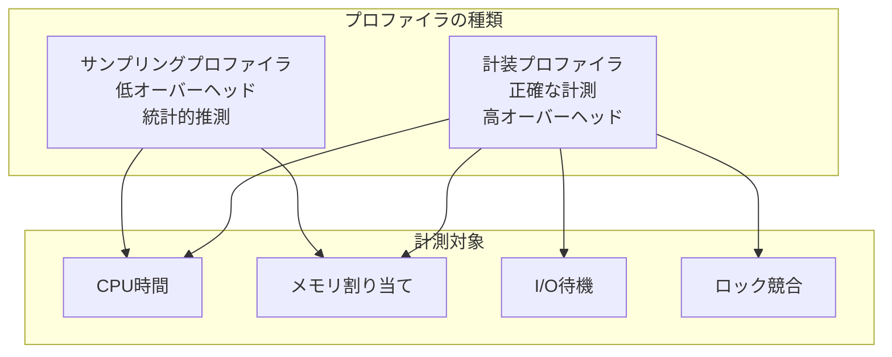

## 2. サンプリングプロファイラの仕組み

### 2.1 基本原理

サンプリングプロファイラは「確率的サンプリング」という考え方に基づく。ある関数がCPU時間の40%を消費しているなら、ランダムなタイミングでスタックトレースを取得したとき、そのうちの約40%のサンプルでその関数がスタック上に存在するはずだ——この統計的性質を利用する。

サンプリングの流れは以下のとおりである：

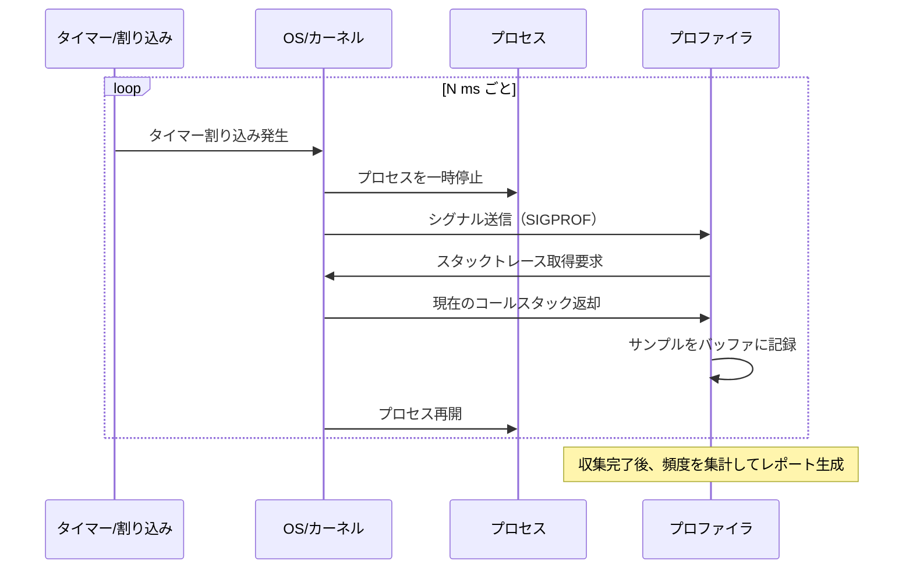

### 2.2 シグナルベースのサンプリング（SIGPROF）

Unix/Linux 環境における古典的なサンプリング手法は、`SIGPROF` シグナルを使う方法である。POSIX の `setitimer(ITIMER_PROF, ...)` システムコールを使うと、一定時間ごとに `SIGPROF` シグナルがプロセスに送信される。プロファイラはこのシグナルのハンドラの中でスタックトレースを取得する。

```c
// Example: Signal-based sampling profiler
#include <signal.h>
#include <sys/time.h>
#include <ucontext.h>

static void sigprof_handler(int sig, siginfo_t *info, void *ucontext) {
    // Walk the call stack using frame pointers
    void *stack[128];
    int depth = 0;

    ucontext_t *uc = (ucontext_t *)ucontext;
    void *pc = (void *)uc->uc_mcontext.gregs[REG_RIP]; // current PC (x86-64)
    void *fp = (void *)uc->uc_mcontext.gregs[REG_RBP]; // frame pointer

    // Unwind frames by following the frame pointer chain
    while (fp && depth < 128) {
        stack[depth++] = pc;
        pc = *((void **)fp + 1); // return address
        fp = *((void **)fp);     // previous frame pointer
    }

    record_sample(stack, depth); // store in ring buffer
}

void start_profiling(int interval_ms) {
    struct sigaction sa = {
        .sa_sigaction = sigprof_handler,
        .sa_flags = SA_SIGINFO | SA_RESTART,
    };
    sigaction(SIGPROF, &sa, NULL);

    struct itimerval timer = {
        .it_interval = { .tv_sec = 0, .tv_usec = interval_ms * 1000 },
        .it_value    = { .tv_sec = 0, .tv_usec = interval_ms * 1000 },
    };
    setitimer(ITIMER_PROF, &timer, NULL);
}
```

この方式にはいくつかの問題点がある。まず、`SIGPROF` はプロセス単位で送信されるため、マルチスレッドプログラムでは任意の1スレッドにしかシグナルが届かない。また、シグナルハンドラの中で使えるAsync-Signal-Safe関数に制限がある（`malloc` などは呼び出せない）。さらに、ユーザー空間CPU時間のみを計測し、I/O 待機中はサンプルが取得されない。

### 2.3 スタックアンワインド（Stack Unwinding）

サンプリング時に最も重要な操作は「コールスタックの取得（スタックアンワインド）」である。現在どの関数呼び出しの連鎖にいるかを再構築するプロセスだ。

**フレームポインタベースのアンワインド**

コンパイラが `-fno-omit-frame-pointer` フラグで最適化をオフにしている場合、各スタックフレームにはフレームポインタ（`rbp` レジスタ）が保存される。フレームポインタを辿ることで、O(depth) でスタックを再構築できる。

```
スタックのメモリレイアウト（x86-64）:

Higher addresses
┌─────────────────┐
│ return address  │ ← frame pointer + 8
│ saved rbp       │ ← frame pointer (current frame)
│ local variables │
│ ...             │
├─────────────────┤
│ return address  │ ← previous frame pointer + 8
│ saved rbp       │ ← previous frame pointer
│ local variables │
│ ...             │
└─────────────────┘
Lower addresses
```

**DWARF CFI（Call Frame Information）ベースのアンワインド**

最近のコンパイラは `-O2` 以上の最適化でフレームポインタを省略する（`-fomit-frame-pointer`）。この場合、ELF バイナリの `.eh_frame` セクションに記録された DWARF CFI（Call Frame Information）メタデータを使ってスタックを再構築する必要がある。libunwind や libdwfl がこの処理を担う。

DWARF CFI はより正確だが、パースコストが高くプロファイラのオーバーヘッドが増大する。本番環境では `-fno-omit-frame-pointer` を明示的に指定してビルドするのが、プロファイラの精度とパフォーマンスの両立に有効な手段だ。

> [!TIP]
> Linux では `perf` コマンドで `-g fp`（フレームポインタ）と `-g dwarf`（DWARF）を選択できる。フレームポインタが利用できるなら `fp` のほうが高速だが、最近の `perf` は LBR（Last Branch Record）や ORC（Oops Rewind Capability）を使ったアンワインドもサポートしている。

### 2.4 サンプリングレートのトレードオフ

サンプリング間隔（サンプリングレート）は精度とオーバーヘッドのトレードオフだ。

| サンプリングレート | 精度 | オーバーヘッド | 用途 |
|------|------|------|------|
| 99 Hz（10ms間隔） | 低精度 | 極めて低い（< 1%） | 本番環境での常時プロファイリング |
| 1000 Hz（1ms間隔） | 中程度 | 低い（1-3%） | ステージング環境 |
| 10000 Hz（0.1ms間隔） | 高精度 | 高い（5-10%） | 開発環境でのデバッグ |

99 Hz という非直感的な数字をよく見るのは、CPU の 100 Hz タイマーとの「うなり（beating）」を避けるためである。もし 100 Hz でサンプリングすると、システムの定期的な処理と同期してしまい、特定の関数が過剰または過小にカウントされる可能性がある。

## 3. 計装プロファイラの仕組み

### 3.1 計装（Instrumentation）とは

計装プロファイラは、プログラムの実行に直接フックを挿入し、関数の呼び出し・復帰を**すべて**記録する。これにより統計的推測ではなく確定的な計測が可能になるが、そのコストは高い。

計装の実装は大きく3種類に分けられる：

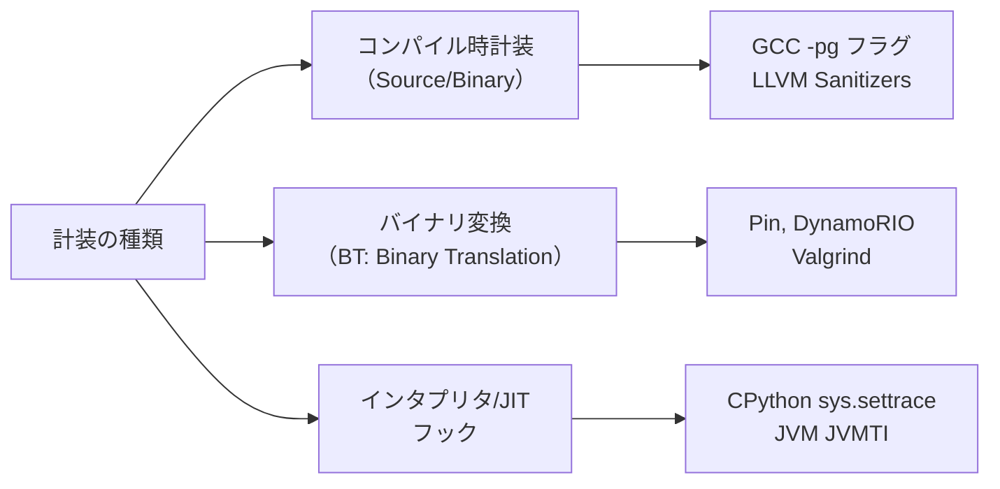

### 3.2 コンパイル時計装：gprof の仕組み

最古のUnixプロファイリングツールの一つである `gprof` は、コンパイル時に `-pg` フラグを渡すことで計装を行う。コンパイラは各関数の先頭に `mcount()` という小さなフックを自動挿入する。

```c
// Original user function
void compute(int n) {
    for (int i = 0; i < n; i++) {
        process(i);
    }
}

// After compiler instrumentation with -pg
void compute(int n) {
    mcount();  // inserted by compiler: records (caller, callee) pair
    for (int i = 0; i < n; i++) {
        process(i);
    }
}
```

`mcount()` はコール回数とコールグラフ（どの関数からどの関数が呼ばれたか）を記録する。実行終了時に `gmon.out` ファイルに書き出され、`gprof` コマンドで集計・表示する。

gprof の問題点は、すべての関数呼び出しにフックが挿入されるため、オーバーヘッドが大きい（短い関数が頻繁に呼ばれるコードでは10〜30%以上のオーバーヘッドが生じることもある）。また、共有ライブラリには `-pg` でコンパイルされていないものが多く、計測できない範囲が生じる。

### 3.3 動的バイナリ変換：Valgrind Callgrind

Valgrind は「動的バイナリ変換（Dynamic Binary Translation）」と呼ばれるアーキテクチャで動作する。プログラムのバイナリをそのまま改変するのではなく、実行時に各機械語命令を仮想的な内部表現（VEX IR）に変換し、分析・計装を挿入した上で実行する。

```
Valgrind の処理フロー:

プログラムバイナリ
       ↓
   VEX IR 変換（1 ブロックずつ）
       ↓
   ツール固有の計装挿入（Callgrind: コールカウンタ）
       ↓
   ネイティブコードに再コンパイル
       ↓
   実行（Valgrind が CPU をエミュレート）
```

Callgrind（Valgrind のCPUプロファイリングツール）は命令レベルの完全な計装を行うため、**全命令数、キャッシュヒット率、分岐予測ミス率**を正確に計測できる。しかし、速度は通常の実行の5〜50倍遅くなるため、本番環境には全く向かない。

### 3.4 JVM の JVMTI と Java Flight Recorder

Java Virtual Machine Tool Interface（JVMTI）は、JVM が提供する標準の計装 API である。プロファイラは JVMTI エージェント（`.so` / `.dll`）として実装され、JVM に `-agentpath:` オプションで組み込まれる。

JVMTI は以下のイベントをフックできる：

- `MethodEntry` / `MethodExit` — 関数の入口・出口（非常に高オーバーヘッド）
- `SampledObjectAlloc` — ヒープアロケーション（サンプリングベース）
- `ThreadStart` / `ThreadEnd` — スレッドの開始・終了
- `MonitorContended` — ミューテックス競合（ロックプロファイリング）

Java Flight Recorder（JFR）は JVM に組み込まれた低オーバーヘッドのプロファイリング基盤である。サンプリングと軽量計装を組み合わせ、通常 1〜2% 以下のオーバーヘッドで動作する。

### 3.5 Python の sys.settrace

CPython のインタプリタはトレース機構を内蔵している。`sys.settrace()` でコールバック関数を登録すると、関数呼び出し・復帰・例外・行実行のたびに呼び出される。

```python
import sys

def trace_calls(frame, event, arg):
    # Called on every function call, return, exception, and line
    if event == 'call':
        filename = frame.f_code.co_filename
        func_name = frame.f_code.co_name
        lineno = frame.f_lineno
        print(f"CALL: {filename}:{func_name}:{lineno}")
    return trace_calls  # continue tracing

sys.settrace(trace_calls)
run_target_code()
sys.settrace(None)  # disable tracing
```

cProfile は `sys.setprofile()` を使う（こちらは行単位のトレースを省略してやや高速）。しかしいずれも CPython のすべての関数呼び出しにオーバーヘッドが生じるため、通常 2〜10 倍の実行時間増加が起きる。

> [!WARNING]
> Python の `cProfile` は CPython の C 拡張モジュール（NumPy, pandas の内部など）の実行時間を正確に計測できない場合がある。ネイティブコードへの呼び出しは1つの "外部" 時間としてまとめて計上される。

## 4. Linux perf の内部構造

### 4.1 perf_events サブシステム

`perf` は Linux カーネルの `perf_events` サブシステム（`kernel/events/core.c`）の上に構築されたプロファイリングツールである。`perf_events` はカーネル 2.6.31（2009年）で導入され、ハードウェアの PMU（Performance Monitoring Unit）への統一インターフェースを提供する。

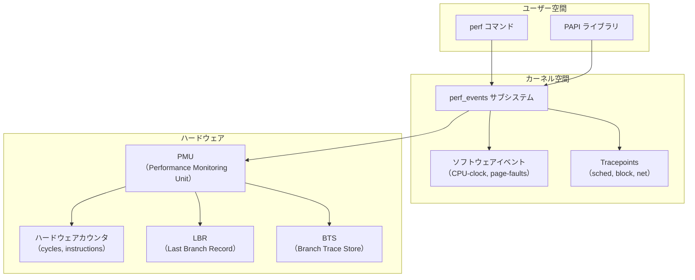

### 4.2 PMU とハードウェアカウンタ

CPU 内の PMU（Performance Monitoring Unit）は、ハードウェアレベルのイベントをカウントする専用回路である。典型的なハードウェアカウンタには以下がある：

| カウンタ名 | 意味 |
|------|------|
| `cycles` | CPU サイクル数 |
| `instructions` | 実行命令数 |
| `cache-references` | キャッシュアクセス数 |
| `cache-misses` | キャッシュミス数 |
| `branch-instructions` | 分岐命令数 |
| `branch-misses` | 分岐予測ミス数 |
| `LLC-load-misses` | ラストレベルキャッシュのロードミス |
| `dTLB-load-misses` | データ TLB ミス |

Intel の IPC（Instructions Per Cycle）は `instructions / cycles` で計算される。これが低い（< 1.0）場合、メモリ待機やキャッシュミスがボトルネックとなっている可能性が高い。

**PMU のオーバーフロー割り込み（Overflow Interrupt）**

`perf record` の仕組みは、PMU カウンタのオーバーフローを利用したサンプリングである。例えば `perf record -e cycles:u -F 99` を実行すると：

1. `perf_events` サブシステムが PMU カウンタを設定し、`cycles` が一定数（例: 約10万カウント）に達するたびにオーバーフロー割り込みを発生させる
2. オーバーフロー割り込みでカーネルがスタックトレースを取得し、`mmap` されたリングバッファに書き込む
3. `perf` コマンドがリングバッファからデータを読み出し、`perf.data` ファイルに保存する

```bash
# Record CPU samples at 99Hz for 10 seconds
perf record -F 99 -g ./my_program

# Report: flat profile sorted by CPU usage
perf report

# Generate call graph report
perf report --call-graph

# Record specific hardware events
perf record -e cache-misses,LLC-load-misses -g ./my_program

# Annotate source code with performance data
perf annotate --symbol=my_hot_function
```

### 4.3 ソフトウェアイベントと Tracepoints

PMU のハードウェアカウンタ以外にも、`perf_events` はソフトウェアレベルのイベントをサポートする：

- **ソフトウェアイベント**: `cpu-clock`（CPU時間）、`task-clock`、`page-faults`（ページフォルト）、`context-switches`
- **Tracepoints**: カーネル内の静的計装点。`sched:sched_switch`（コンテキストスイッチ）、`block:block_rq_issue`（ディスク I/O）、`net:netif_receive_skb`（ネットワーク受信）など

```bash
# List available tracepoints
perf list tracepoint

# Record context switch events
perf record -e sched:sched_switch -g -p <PID>

# Record page fault events to find memory access patterns
perf record -e page-faults -g ./my_program

# Trace system calls with latency
perf trace -p <PID>
```

### 4.4 eBPF との統合

Linux カーネル 4.9 以降、`perf` は eBPF（extended Berkeley Packet Filter）プログラムと統合できる。eBPF を使うと、カーネル空間でのデータ集計や高度なフィルタリングが可能になり、ユーザー空間へのデータ転送量を劇的に削減できる。

```bash
# Use bpftrace to trace function latency
sudo bpftrace -e '
kprobe:do_sys_open { @start[tid] = nsecs; }
kretprobe:do_sys_open /@start[tid]/ {
  @latency = hist(nsecs - @start[tid]);
  delete(@start[tid]);
}
'
```

## 5. フレームグラフの読み方と生成

### 5.1 フレームグラフとは何か

フレームグラフ（Flame Graph）は、Brendan Gregg（当時 Netflix, 現 Intel）が 2013年に考案したスタックトレースの可視化手法である。プロファイリングで取得した数千〜数万のスタックサンプルを集計し、呼び出し関係とCPU時間の分布を一枚の図として表現する。

```
フレームグラフの見方:

^ CPU 時間の割合（横幅 = CPU 消費率）
│
│  ┌──────────────────────────────────────────┐
│  │              main (100%)                  │  ← 最下段（呼び出しスタックのルート）
│  ├──────────────────┬───────────────────────┤
│  │  parse_input(30%)│  compute(70%)          │  ← 子フレーム（より上位の呼び出し）
│  ├──────────────────┼────────────┬──────────┤
│  │  read_file(25%)  │  matrix_mul│ sort(20%)│
│  │                  │   (50%)    │          │
│  └──────────────────┴────────────┴──────────┘
→ 関数名（横幅 ∝ CPU 使用率）
```

フレームグラフの読み方の要点：

- **横幅**が大きいほど、その関数がCPU時間を多く消費している
- **高さ**はコールスタックの深さを表す
- **色**に特別な意味はない（視覚的な区別のため）
- **最上段**（スタックの末端）のフレームが実際にCPUを消費している関数
- **子フレームを持たない（上にのびない）**幅広のフレームがボトルネック候補

> [!TIP]
> フレームグラフで「高原（plateau）」のように平らな最上段のフレームが幅広く伸びているのがボトルネックのサインだ。逆に高い塔のようなスタックは深い再帰や関数チェーンを示すが、それ自体が遅いとは限らない。

### 5.2 フレームグラフの生成手順

Brendan Gregg の FlameGraph スクリプト（Perl製、GitHub で公開）を使った生成手順：

```bash
# Step 1: Collect samples with perf
sudo perf record -F 99 -g -p <PID> -- sleep 30

# Step 2: Convert to folded format
sudo perf script | stackcollapse-perf.pl > out.folded

# Step 3: Generate SVG flame graph
flamegraph.pl out.folded > flamegraph.svg

# Open in browser
firefox flamegraph.svg
```

あるいは `perf script` の出力を直接パイプする：

```bash
sudo perf record -F 99 -ag -- sleep 10
sudo perf script | stackcollapse-perf.pl | flamegraph.pl > out.svg
```

### 5.3 フレームグラフの種類

Brendan Gregg は CPU プロファイリング以外の用途向けにもフレームグラフの派生形を定義している：

| 種類 | 説明 | 生成に使うイベント |
|------|------|------|
| CPU Flame Graph | オンCPU時間の分布 | `cpu-clock`, `cycles` |
| Off-CPU Flame Graph | I/O・スリープ待機の分布 | `sched:sched_switch` |
| Memory Flame Graph | ヒープアロケーションの分布 | `malloc` の uprobe |
| Differential Flame Graph | 2つのプロファイルの差分 | 2つの folded ファイルを比較 |
| Icicle Graph | フレームグラフの上下反転版 | 同上（flame グラフのオプション） |

特に **Off-CPU フレームグラフ**は強力だ。I/O 待機やロック競合でブロックされている時間を可視化する。CPU プロファイラだけではブロッキング I/O の問題は見えないが、Off-CPU グラフを組み合わせることで全体像を把握できる。

```bash
# Off-CPU flame graph using perf
sudo perf record -e sched:sched_switch -a -g -- sleep 10
sudo perf script | stackcollapse-perf.pl --pid | flamegraph.pl \
  --color=io --title="Off-CPU Time Flame Graph" > offcpu.svg
```

## 6. 言語ランタイム別プロファイラ

### 6.1 Go: pprof

Go のプロファイリングエコシステムの中心にあるのが `pprof`（program profiler）である。Go は標準ライブラリに `runtime/pprof` と `net/http/pprof` を内蔵しており、追加のツールなしにプロファイリングデータを取得できる。

```go
// HTTP endpoint for pprof (commonly used in production services)
import _ "net/http/pprof"
import "net/http"

func main() {
    // Register pprof handlers at /debug/pprof/*
    go func() {
        http.ListenAndServe(":6060", nil)
    }()
    // ... your program
}
```

この1行をインポートするだけで、以下のエンドポイントが使えるようになる：

```bash
# CPU profile: sample for 30 seconds
go tool pprof http://localhost:6060/debug/pprof/profile?seconds=30

# Heap profile: current memory allocations
go tool pprof http://localhost:6060/debug/pprof/heap

# Goroutine profile: all goroutines and their stacks
go tool pprof http://localhost:6060/debug/pprof/goroutine

# Mutex profile: lock contention
go tool pprof http://localhost:6060/debug/pprof/mutex

# Block profile: goroutine blocking on channels/mutexes
go tool pprof http://localhost:6060/debug/pprof/block
```

`go tool pprof` はインタラクティブなシェルを起動し、`top`、`list`、`web`（フレームグラフを SVG で表示）などのコマンドが使える。

```bash
# Generate flame graph directly from pprof
go tool pprof -http=:8080 http://localhost:6060/debug/pprof/profile?seconds=30
# Opens browser with flamegraph, top, and source views
```

**Go のサンプリング実装**

Go の CPU プロファイラは OS シグナル（`SIGPROF`）を使わず、内部的に `runtime.readProfile` という Go ランタイム専用の仕組みを使う。10ms（デフォルト）ごとにランタイムスケジューラがすべてのゴルーチンのスタックを収集する。これにより、マルチスレッドの問題（シグナルが1スレッドにしか届かない問題）を回避している。

Go のヒーププロファイラは**サンプリングベース**のアロケーションプロファイラだ。デフォルトで 512 KB ごとに1回、アロケーションのスタックトレースを記録する（`runtime.MemProfileRate` で設定可能）。全アロケーションを記録するのではなく統計的サンプリングを行うため、オーバーヘッドは低い。

### 6.2 Java: async-profiler

**async-profiler** は、Java のサンプリングプロファイラの事実上の標準となっているオープンソースツール（Azul Systems が主に開発）だ。JVMTI と `AsyncGetCallTrace`（undocumented な JVM 内部 API）を組み合わせることで、通常の JVMTI の `MethodEntry` 計装よりはるかに低いオーバーヘッド（通常 < 5%）でサンプリングを実現する。

通常の `MethodEntry` / `MethodExit` ベースの JVMTI プロファイラが高オーバーヘッドになる原因は、**すべての関数呼び出しでコールバックが呼ばれる**ためだ。async-profiler は代わりに `perf_events` を使ったシグナルベースのサンプリングを行い、シグナルハンドラ内で `AsyncGetCallTrace` を呼び出してJVM のスタックを取得する。

```bash
# Download and use async-profiler
./profiler.sh -d 30 -f profile.html <PID>
# Or generate JFR format
./profiler.sh -d 30 -o jfr -f recording.jfr <PID>

# CPU profiling with flame graph output
./profiler.sh -d 30 -f flamegraph.html --title "CPU Profile" <PID>

# Allocation profiling
./profiler.sh -d 30 -e alloc -f alloc.html <PID>

# Lock contention profiling
./profiler.sh -d 30 -e lock -f lock.html <PID>
```

**safepoint バイアス問題**

JVM の古典的なサンプリング問題として「safepoint バイアス（safepoint bias）」がある。JVM はガベージコレクション等のために定期的に全スレッドを「セーフポイント」と呼ばれる特定の場所でのみ停止させる。サンプリングがセーフポイントでしか行えない場合、セーフポイントに到達しやすいコード（ループの後ろなど）が過剰にサンプリングされ、セーフポイントに到達しにくいコードが過小評価される。

async-profiler は `AsyncGetCallTrace` を使うことで**セーフポイント以外の任意のタイミング**でスタックを取得でき、このバイアスを解消している。

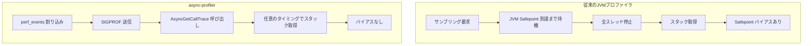

### 6.3 Python: py-spy

**py-spy** は Rust で実装された Python 用サンプリングプロファイラである。大きな特徴は、**対象プロセスのコードを一切変更せずに外部からプロファイリングできる**点だ。プロセスの `/proc/<PID>/mem` を読み取り、CPython の内部データ構造を直接解析してスタックトレースを再構築する。

```bash
# Install py-spy
pip install py-spy

# Profile a running Python process
sudo py-spy top --pid <PID>

# Record flame graph for 30 seconds
py-spy record -o profile.svg --duration 30 -- python my_script.py

# Real-time top-like display
py-spy top -- python my_script.py

# Dump all thread stacks (like gdb py-bt)
sudo py-spy dump --pid <PID>
```

py-spy の仕組みは以下のとおりだ：

1. `/proc/<PID>/maps` を読んで CPython の `libpython.so` のベースアドレスを特定する
2. CPython の `_PyRuntime` 構造体の offset を特定し、現在インタプリタの状態を読む
3. `PyThreadState` から現在の `PyFrameObject` チェーンを辿り、スタックを再構築する
4. これを `ptrace(PTRACE_PEEK...)` または `/proc/<PID>/mem` 経由で行う

```
CPython の内部構造（簡略化）:

_PyRuntime
  └── tstate_current (PyThreadState*)
         └── frame (PyFrameObject*)
               ├── f_code (PyCodeObject*)
               │     ├── co_filename
               │     └── co_name
               └── f_back (PyFrameObject*)  ← 1フレーム前
                     └── ...
```

> [!NOTE]
> py-spy は GIL（Global Interpreter Lock）をまったく取得しない。これは大きな利点だが、稀にスタックトレースが不完全または不正確になる場合がある。特に CPython の内部構造が変更される GIL リリース中のコード（`io.read()` など）ではスタックが不完全に見えることがある。

**py-spy の制約**

- C 拡張モジュール（NumPy, pandas, PyTorch の内部）のスタックフレームは Python フレームとして見えない
- PyPy、Jython、GraalPy などの CPython 以外の実装は非対応（内部構造が異なるため）
- GIL を保持しないため、マルチスレッドの場合は各スレッドを個別にプロファイリングする必要がある

### 6.4 各プロファイラの比較

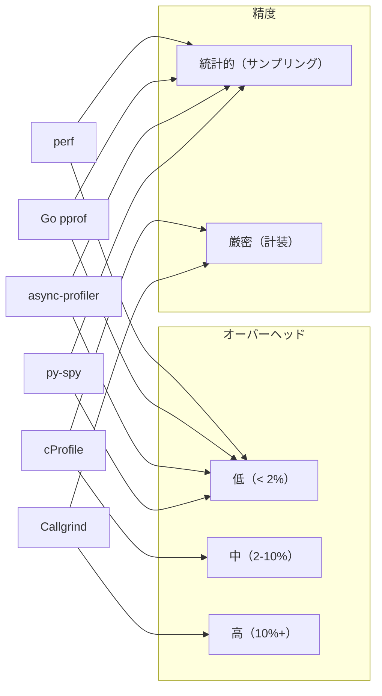

## 7. Continuous Profiling（継続的プロファイリング）

### 7.1 Continuous Profiling とは

従来のプロファイリングは「問題が発生したとき」に手動で実行する「オンデマンドプロファイリング」だった。しかしこのアプローチには根本的な問題がある：**本番環境で再現が難しい問題や、断続的に発生するパフォーマンス劣化は、手動でプロファイリングするタイミングに起きているとは限らない**。

Continuous Profiling（継続的プロファイリング）は、プロファイリングを常時実行し、その結果を時系列で保存・分析するアプローチだ。いつでも任意の時点のプロファイルを遡って確認できる。

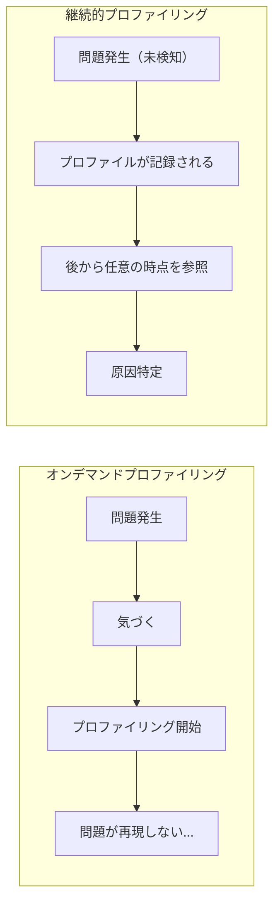

### 7.2 Parca

**Parca** は Polar Signals が開発したオープンソースの Continuous Profiling プラットフォームだ。pprof 形式のプロファイルを長期保存し、時系列での比較・分析を提供する。

アーキテクチャの核心は以下の構成要素からなる：

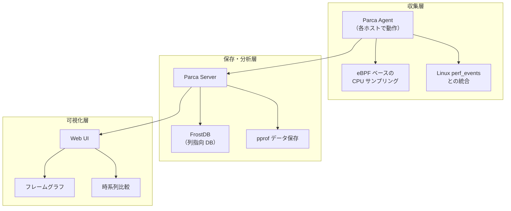

Parca Agent は eBPF プログラムを使ってカーネル空間でスタックトレースを収集し、ユーザー空間への転送を最小化する。これにより、エージェント自体のCPUオーバーヘッドを 1% 未満に抑えている。

```bash
# Deploy Parca Agent (typically via Kubernetes DaemonSet)
parca-agent --node=<NODE_NAME> --remote-store-address=localhost:7070

# Access web UI at http://localhost:7070
```

### 7.3 Pyroscope

**Pyroscope**（現在は Grafana Labs に統合）は、より広いエコシステムと言語サポートを持つ Continuous Profiling プラットフォームだ。

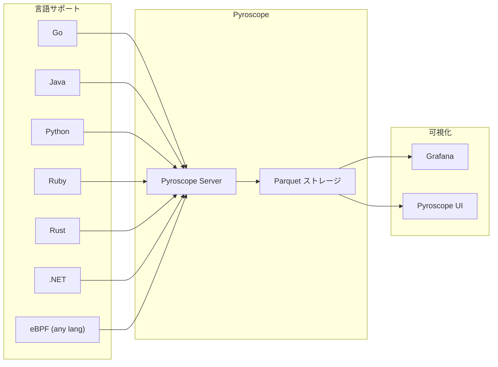

Pyroscope の Go SDK は Push ベースでプロファイルを送信する：

```go
import "github.com/grafana/pyroscope-go"

func main() {
    // Start continuous profiling
    profiler, _ := pyroscope.Start(pyroscope.Config{
        ApplicationName: "my-service",
        ServerAddress:   "http://pyroscope:4040",
        ProfileTypes: []pyroscope.ProfileType{
            pyroscope.ProfileCPU,
            pyroscope.ProfileAllocObjects,
            pyroscope.ProfileAllocSpace,
            pyroscope.ProfileInuseObjects,
            pyroscope.ProfileInuseSpace,
        },
    })
    defer profiler.Stop()

    // ... your application code
}
```

### 7.4 Continuous Profiling の実装上の課題

**シンボル解決（Symbol Resolution）**

プロファイリングデータはアドレス（メモリアドレス）の列として収集される。これを人間が読める関数名に変換する「シンボル解決」が必要だ。本番環境では：

- バイナリが strip されていてシンボルテーブルがない
- ASLR（Address Space Layout Randomization）でアドレスが毎回変わる
- コンテナ環境ではホストからゲストのシンボルテーブルにアクセスしにくい

Parca は「symbolizer」コンポーネントで ELF バイナリのデバッグ情報（`.debug_info`、`.eh_frame` セクション）や外部デバッグシンボルパッケージを使ってシンボルを解決する。

**プロファイルデータの圧縮と長期保存**

継続的なプロファイリングデータは圧縮なしには膨大なストレージを消費する。pprof プロトコルバッファ形式は既に圧縮されているが、長期保存には重複排除と downsampling が必要だ。Pyroscope は Parquet（列指向フォーマット）を使い、時系列プロファイルデータを効率的に圧縮・クエリする。

> [!NOTE]
> Grafana の Grafana Cloud Profiles（Pyroscope 統合版）は、プロファイルデータを Tempo（分散トレーシング）や Loki（ログ）と組み合わせて「3本柱（Metrics, Logs, Traces, Profiles）」の観測可能性を実現する方向に進化している。プロファイルと分散トレースのスパンを紐付け、遅いトレースの原因をプロファイルで直接確認するワークフローが可能になっている。

## 8. サンプリング vs 計装の選択指針

### 8.1 使い分けの原則

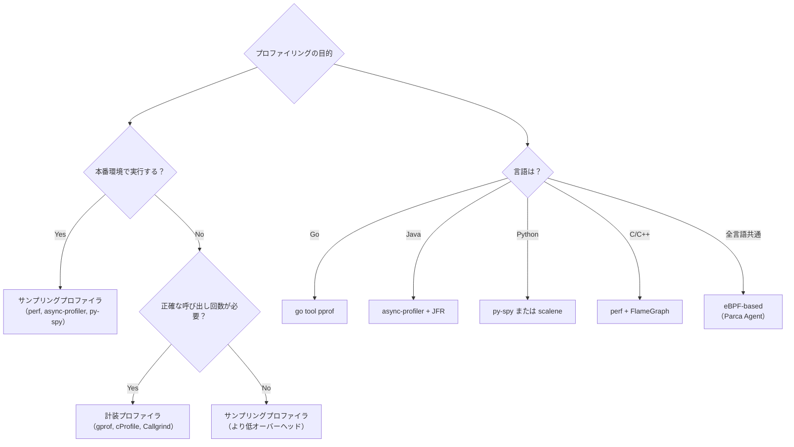

### 8.2 よくある間違いと注意点

**計測自体がボトルネックにならないように**

計装プロファイラを本番環境で使うと、プロファイラ自体のオーバーヘッドがシステムの動作を変えてしまう「ハイゼンベルグ問題（Heisenbug）」が生じる。プロファイリングのオーバーヘッドで本来 CPU バウンドだった問題が隠れ、逆にプロファイラが原因で I/O パターンが変わることもある。

**Wallclock 時間 vs CPU 時間**

- **CPU 時間**（`cpu-clock`）: プロセスが実際に CPU を使っていた時間。I/O 待機中はカウントされない
- **Wallclock 時間**（実時間）: I/O 待機・スリープを含む実際の経過時間

CPU バウンドの問題には CPU 時間プロファイリングが有効。I/O バウンドの問題には Off-CPU プロファイリングや Wallclock プロファイリングが必要だ。

**JIT コンパイルと動的コード**

JVM（JIT コンパイル済みコード）や Python（JIT なしのバイトコード実行）のプロファイリングは、ネイティブコードとは異なる考慮が必要だ。JVM の場合、JIT コンパイルされたコードのシンボルは通常の ELF シンボルテーブルには存在しない。async-profiler は JVM に `/tmp/perf-<PID>.map` ファイルを生成させ、`perf` がこのファイルからJITシンボルを解決できるようにする。

```bash
# Enable JVM to generate perf map file
java -XX:+UnlockDiagnosticVMOptions -XX:+DebugNonSafepoints \
     -agentpath:/path/to/async-profiler/libasyncProfiler.so=start,\
     flamegraph,file=profile.html \
     MyApp
```

## 9. 実践的なプロファイリングワークフロー

### 9.1 体系的なアプローチ

プロファイリングは「データを集めて終わり」ではなく、体系的な問題解決プロセスだ。

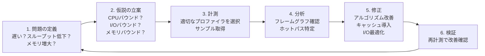

### 9.2 典型的なボトルネックパターン

**パターン1: CPU バウンド（計算集約）**

フレームグラフで特定の計算関数が大きな幅を占める。典型的な改善策：アルゴリズムの改善（O(n²) → O(n log n)）、SIMD 命令の活用、並列化。

**パターン2: メモリバウンドとキャッシュミス**

`perf stat -e cache-misses,LLC-load-misses` でキャッシュミス率を確認する。フレームグラフでは比較的フラットに見えても、`cache-misses` が高い場合はデータ配置（AoS → SoA）の改善が有効。

**パターン3: ロック競合**

async-profiler の `-e lock` モードや Go の `pprof/mutex` でロック待機時間を計測する。ロック保持時間の短縮、より細粒度なロック、ロックフリーデータ構造への移行を検討する。

**パターン4: I/O 待機**

Off-CPU フレームグラフや `perf trace` でシステムコールのレイテンシを確認する。バッファリング、非同期 I/O、mmap の活用などを検討する。

## 10. まとめ

プロファイラの本質は「プログラムの実行時動作を客観的に計測する」技術だ。

サンプリングプロファイラは統計的な手法で低オーバーヘッドを実現し、本番環境での継続的な監視に適している。計装プロファイラは正確な測定が可能だが、オーバーヘッドが大きく開発・テスト環境での詳細分析に向く。

Linux の `perf` は PMU ハードウェアカウンタと eBPF を組み合わせた強力な基盤を提供し、フレームグラフはその結果を直感的に可視化する手段だ。Go の `pprof`、Java の `async-profiler`、Python の `py-spy` はそれぞれの言語ランタイムの特性に最適化されたサンプリングプロファイラを提供している。

そして Parca や Pyroscope に代表される Continuous Profiling は、プロファイリングを「問題が起きてから行う事後分析」から「常時監視して問題を予防・即座に検出する」パラダイムへと変えつつある。

最終的に重要なのは、プロファイリングは**データに基づいた意思決定**のためのツールだということだ。推測ではなく計測、思い込みではなく証拠——プロファイラはその原則を実現する手段である。
