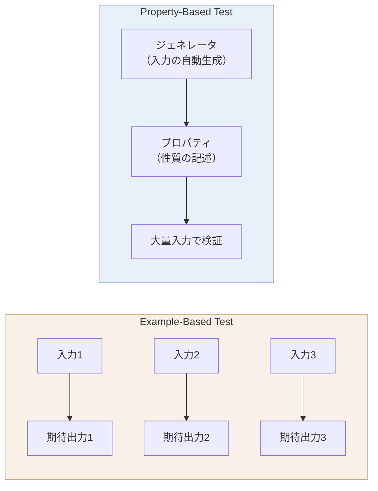
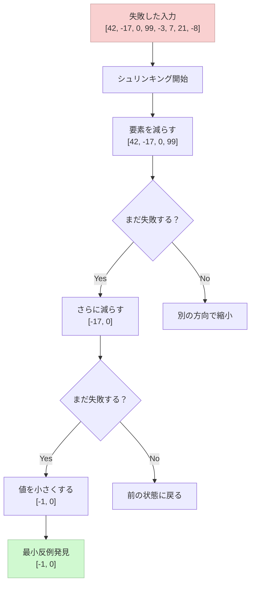
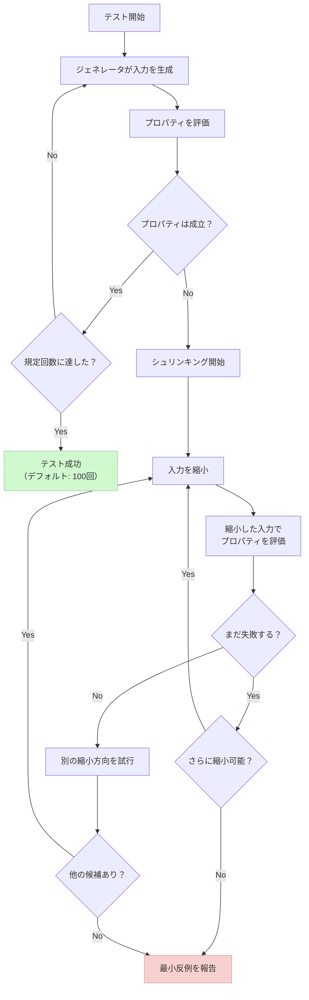
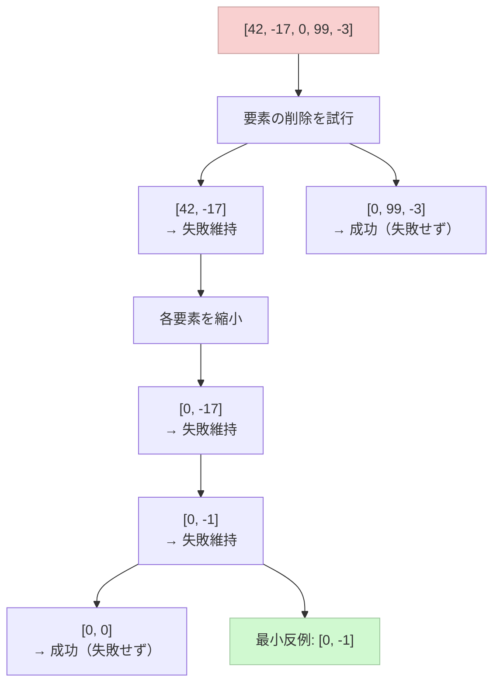
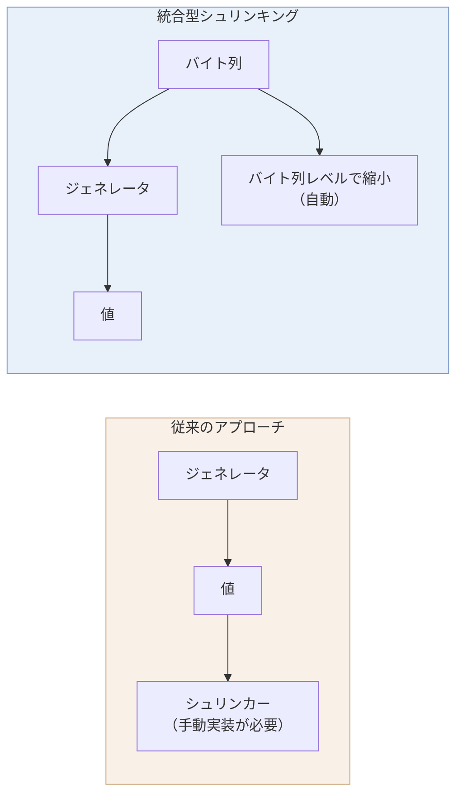
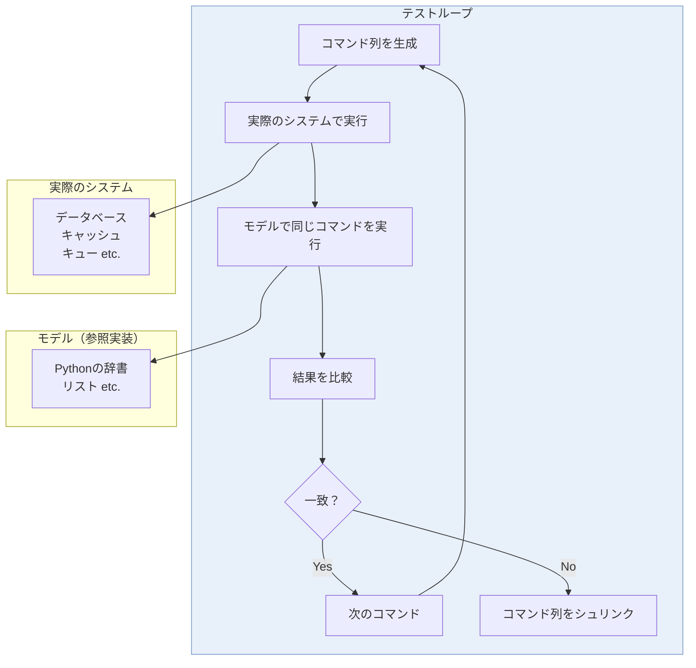
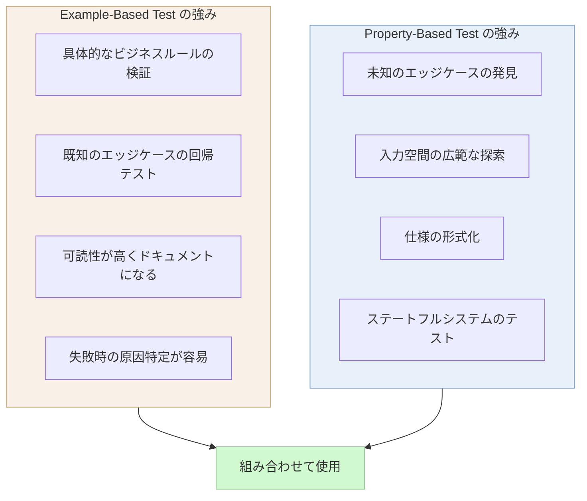

# プロパティベーステスト

## 1. 背景と動機

### 1.1 Example-Based Test の限界

ソフトウェアテストの世界で最も広く普及しているのは、Example-Based Test（例ベーステスト）である。開発者が具体的な入力と期待される出力のペアを手動で記述し、関数やモジュールの振る舞いを検証する手法だ。

```python
# Example-based test
def test_sort():
    assert sort([3, 1, 2]) == [1, 2, 3]
    assert sort([]) == []
    assert sort([1]) == [1]
    assert sort([5, 5, 5]) == [5, 5, 5]
```

このアプローチには根本的な限界がある。テストケースの選択が開発者の想像力と経験に完全に依存するという点だ。開発者は自身が思いつく範囲内でのみテストケースを書く。しかし、バグは往々にして開発者が想像しなかったケース――境界値の組み合わせ、極端に大きな入力、特殊な文字列パターン――に潜む。

Example-Based Test のもう一つの問題は、テストの数が増えてもカバーする入力空間がごく一部に留まることである。整数を引数に取る関数のテストで10個のテストケースを書いたとしても、64ビット整数の全空間 $2^{64}$ のうち、検証されるのはわずか10点に過ぎない。テストケースの追加は労力に対するリターンが逓減し、真に重要なエッジケースを見逃す確率はほとんど下がらない。

### 1.2 QuickCheck の誕生

この限界に対する画期的な解答が、2000年にKoen ClaessenとJohn Hughesによって発表された **QuickCheck** である。Haskell で実装されたこのテストフレームワークは、「具体的なテストケースを開発者が書く」という従来のパラダイムを根本から転換した。

QuickCheck の着想は明快である。**開発者はテストケースを書くのではなく、プロパティ（性質）を記述する。** テスト入力の生成はフレームワークに委ね、大量のランダム入力に対してプロパティが成り立つことを検証する。

```haskell
-- QuickCheck property: reversing a list twice yields the original
prop_reverse :: [Int] -> Bool
prop_reverse xs = reverse (reverse xs) == xs
```

この一行のプロパティ定義は、QuickCheck によって数百から数千のランダムなリストに対して自動的に検証される。開発者が `[3, 1, 2]` や `[]` といった具体例を一つ一つ列挙する必要はない。

QuickCheck の論文 "QuickCheck: A Lightweight Tool for Random Testing of Haskell Programs" は、ソフトウェアテストの分野に大きなインパクトを与えた。John Hughes はその後、テスト専門企業 Quviq を設立し、ErlangベースのQuickCheck（Quviq QuickCheck）を産業界に展開した。Ericsson の通信プロトコルスタック、Volvo の車載ソフトウェアなど、高い信頼性が求められるシステムのテストで成果を上げている。

### 1.3 なぜプロパティベーステストが重要なのか

プロパティベーステストの本質的な価値は、テストの観点を「具体例の列挙」から「仕様の記述」へと引き上げることにある。



具体的に言えば、プロパティベーステストには以下の利点がある。

1. **入力空間の広範な探索**: ランダム生成により、開発者が想定しなかったエッジケースを発見できる
2. **仕様の形式化**: プロパティを書くことは、対象の仕様を形式的に記述することに等しい。これにより仕様の曖昧さが露呈する
3. **シュリンキングによる最小反例**: テストが失敗した場合、フレームワークが自動的に最小の反例を探索してくれる
4. **回帰テストの自動強化**: コード変更時に、変更が引き起こす問題をより高い確率で検出できる

## 2. プロパティベーステストの基本概念

プロパティベーステストは三つの柱で構成される。**プロパティ**、**ジェネレータ**、**シュリンキング**である。

### 2.1 プロパティ（Property）

プロパティとは、テスト対象が満たすべき**普遍的な性質**の記述である。Example-Based Test における「この入力に対してこの出力が返る」という具体的なアサーションとは異なり、プロパティは「任意の入力に対して、この条件が常に成り立つ」という形で記述される。

::: tip プロパティとは何か
プロパティは、全称量化された論理式と考えることができる。「すべての入力 x に対して、P(x) が真である」という形式だ。Example-Based Test が存在量化（「ある入力 x に対して P(x) が真である」）であるのに対し、プロパティベーステストは全称量化を近似的に検証する。
:::

プロパティの記述にはいくつかのパターンがある。これについては次章で詳しく解説する。

### 2.2 ジェネレータ（Generator）

ジェネレータは、テスト入力を自動的に生成する仕組みである。基本型（整数、文字列、真偽値など）のジェネレータはフレームワークに組み込まれており、開発者はこれらを組み合わせてより複雑なデータ構造のジェネレータを構築できる。

ジェネレータの設計は、プロパティベーステストの有効性を大きく左右する。入力空間の重要な領域（境界値、極端なケース）を十分にカバーする一方で、無意味なテストケースの生成を避ける必要がある。

### 2.3 シュリンキング（Shrinking）

シュリンキングは、プロパティベーステストを実用的にする上で最も重要な機能の一つである。ランダムに生成された入力でプロパティ違反が検出された場合、その入力は往々にして大きく複雑である。シュリンキングは、プロパティ違反を引き起こす**最小の入力**を自動的に探索する。



### 2.4 テスト実行の全体フロー

プロパティベーステストの実行フローを以下に示す。



## 3. プロパティの種類

プロパティを見つけることは、プロパティベーステストにおいて最も創造性を要する作業である。多くの開発者が「プロパティが思いつかない」という壁にぶつかる。ここでは、実践で広く使われるプロパティのパターンを体系的に紹介する。

### 3.1 往復プロパティ（Roundtrip Property）

最も直感的で見つけやすいプロパティの一つが、逆操作との往復である。ある操作とその逆操作を組み合わせた結果が元の値に戻るという性質だ。

```python
from hypothesis import given
import hypothesis.strategies as st
import json

# Roundtrip: encode then decode yields original
@given(st.dictionaries(st.text(), st.integers()))
def test_json_roundtrip(d):
    assert json.loads(json.dumps(d)) == d
```

往復プロパティが適用できる例は多い。

| 操作 | 逆操作 | プロパティ |
|------|--------|------------|
| `serialize` | `deserialize` | `deserialize(serialize(x)) == x` |
| `encrypt` | `decrypt` | `decrypt(encrypt(x, key), key) == x` |
| `compress` | `decompress` | `decompress(compress(x)) == x` |
| `encode` | `decode` | `decode(encode(x)) == x` |
| `insert` | `delete` | `delete(insert(collection, x), x) == collection` |

::: warning 往復プロパティの落とし穴
往復プロパティは強力だが、すべての場合に成り立つわけではない。たとえば浮動小数点数のJSON往復は、精度の問題で厳密には成り立たない。また、`serialize` がフィールドの順序を保持しない場合、構造的に等価でも `==` では一致しないことがある。
:::

### 3.2 不変条件プロパティ（Invariant Property）

操作の前後で保持されるべき不変条件を検証するプロパティである。

```python
@given(st.lists(st.integers()))
def test_sort_preserves_length(xs):
    """Sorting preserves the length of the list."""
    assert len(sort(xs)) == len(xs)

@given(st.lists(st.integers()))
def test_sort_preserves_elements(xs):
    """Sorting preserves all elements (as a multiset)."""
    from collections import Counter
    assert Counter(sort(xs)) == Counter(xs)

@given(st.lists(st.integers()))
def test_sort_is_ordered(xs):
    """Result of sorting is ordered."""
    result = sort(xs)
    for i in range(len(result) - 1):
        assert result[i] <= result[i + 1]
```

ソートのプロパティとして、上記の三つを組み合わせると、ソートの完全な仕様になる。「長さが変わらない」「要素が保存される」「結果が整列されている」。これら三つを同時に満たす関数はソートしかない。

不変条件プロパティは、データ構造のテストに特に有効である。

```python
@given(st.lists(st.integers()))
def test_bst_invariant(xs):
    """BST invariant: left < node <= right."""
    tree = BinarySearchTree()
    for x in xs:
        tree.insert(x)
    assert tree.is_valid_bst()
```

### 3.3 等価性プロパティ（Equivalence Property）

同じ結果を返すはずの二つの異なる実装を比較するプロパティである。テスト・オラクル（Test Oracle）とも呼ばれ、参照実装が存在する場合に特に有効である。

```python
@given(st.lists(st.integers()))
def test_my_sort_matches_builtin(xs):
    """Custom sort produces same result as built-in sort."""
    assert my_sort(xs) == sorted(xs)
```

このパターンは、最適化されたアルゴリズムが素朴な実装と同じ結果を返すことの検証に使える。たとえばSIMD最適化された行列乗算が、素朴な三重ループと同じ結果を返すかどうかのテストなどである。

```python
@given(st.lists(st.lists(st.floats(allow_nan=False, allow_infinity=False),
                          min_size=2, max_size=2),
                 min_size=2, max_size=2))
def test_optimized_matmul(matrix):
    """Optimized matrix multiplication matches naive implementation."""
    import numpy as np
    a = np.array(matrix)
    assert np.allclose(optimized_matmul(a, a), naive_matmul(a, a))
```

### 3.4 冪等性プロパティ（Idempotence Property）

操作を複数回適用しても、一度適用した結果と変わらないという性質である。

```python
@given(st.lists(st.integers()))
def test_sort_is_idempotent(xs):
    """Sorting is idempotent: sorting a sorted list yields the same list."""
    assert sort(sort(xs)) == sort(xs)

@given(st.text())
def test_normalize_is_idempotent(s):
    """Normalization is idempotent."""
    assert normalize(normalize(s)) == normalize(s)
```

冪等性は、HTTP の PUT メソッド、データベースのマイグレーション、設定ファイルのフォーマッタなどで重要な性質である。

### 3.5 帰納的プロパティ（Inductive Property）

小さな入力に対する結果と、大きな入力に対する結果の関係を記述するプロパティである。

```python
@given(st.lists(st.integers(), min_size=1))
def test_sum_inductive(xs):
    """Sum of a list equals head + sum of tail."""
    assert sum(xs) == xs[0] + sum(xs[1:])
```

### 3.6 モデルベースプロパティ（Model-Based Property）

テスト対象のシステムの振る舞いを、より単純なモデル（参照実装）と比較するプロパティである。等価性プロパティの発展形であり、特にステートフルなシステムのテストで威力を発揮する。詳細は7章で解説する。

### 3.7 「Hard to Compute, Easy to Verify」プロパティ

計算結果を直接検証するのが困難でも、結果が正しいかどうかを間接的に検証できる場合がある。

```python
@given(st.integers(min_value=2, max_value=10000))
def test_prime_factorization(n):
    """Product of prime factors equals original number, and all factors are prime."""
    factors = prime_factorize(n)
    # Product of factors equals n
    product = 1
    for f in factors:
        product *= f
    assert product == n
    # All factors are prime
    for f in factors:
        assert is_prime(f)
```

素因数分解の結果を直接計算するのは難しいが、「すべての因数が素数であり、それらの積が元の数と一致する」ことは簡単に検証できる。

## 4. ジェネレータの設計

ジェネレータは、プロパティベーステストの品質を決定する重要な要素である。適切なジェネレータ設計なしには、テストが入力空間の重要な領域を見逃す可能性がある。

### 4.1 基本型ジェネレータ

ほとんどのプロパティベーステストフレームワークは、基本型のジェネレータを組み込みで提供する。

```python
import hypothesis.strategies as st

# Integers
st.integers()                          # arbitrary integers
st.integers(min_value=0, max_value=100) # bounded integers

# Floats
st.floats()                            # includes NaN, Inf
st.floats(allow_nan=False, allow_infinity=False)  # "normal" floats

# Strings
st.text()                              # arbitrary Unicode strings
st.text(alphabet=st.characters(whitelist_categories=('L',)))  # letters only

# Booleans
st.booleans()

# None
st.none()

# Bytes
st.binary()
```

::: tip 境界値の自動生成
多くのフレームワークは、純粋にランダムな値だけでなく、境界値（0、1、-1、空文字列、最大値、最小値など）を意図的に生成する。Hypothesis はこの戦略を特に重視しており、境界値付近のバグ発見率を高めている。
:::

### 4.2 合成ジェネレータ

基本型ジェネレータを組み合わせて、複雑なデータ構造を生成する。

```python
# Lists
st.lists(st.integers())                          # list of integers
st.lists(st.integers(), min_size=1, max_size=10) # bounded size

# Tuples
st.tuples(st.integers(), st.text())              # (int, str)

# Dictionaries
st.dictionaries(st.text(), st.integers())        # Dict[str, int]

# Sets
st.sets(st.integers())                           # Set[int]

# Optional values
st.none() | st.integers()                        # Optional[int]

# One of several types
st.one_of(st.integers(), st.text(), st.booleans())

# Fixed dictionaries (record-like)
st.fixed_dictionaries({
    'name': st.text(min_size=1),
    'age': st.integers(min_value=0, max_value=150),
    'email': st.emails(),
})
```

### 4.3 カスタムジェネレータ

ドメイン固有のデータ構造には、カスタムジェネレータが必要になる。

```python
from hypothesis import given
import hypothesis.strategies as st
from dataclasses import dataclass

@dataclass
class User:
    name: str
    age: int
    email: str

# Custom generator using @st.composite
@st.composite
def users(draw):
    name = draw(st.text(min_size=1, max_size=50,
                        alphabet=st.characters(whitelist_categories=('L', 'N'))))
    age = draw(st.integers(min_value=0, max_value=150))
    email = draw(st.emails())
    return User(name=name, age=age, email=email)

@given(users())
def test_user_serialization_roundtrip(user):
    """Serializing and deserializing a User yields the original."""
    assert User.from_dict(user.to_dict()) == user
```

#### 再帰的データ構造のジェネレータ

木構造やグラフのような再帰的データ構造のジェネレータは特別な配慮が必要である。無限に深いデータが生成されないよう、再帰の深さを制御する必要がある。

```python
from hypothesis import given
import hypothesis.strategies as st

# Recursive data structure: binary tree
@st.composite
def binary_trees(draw, max_depth=5):
    if max_depth <= 0:
        # Base case: leaf node
        return {'value': draw(st.integers()), 'left': None, 'right': None}

    value = draw(st.integers())
    has_left = draw(st.booleans())
    has_right = draw(st.booleans())

    left = draw(binary_trees(max_depth=max_depth - 1)) if has_left else None
    right = draw(binary_trees(max_depth=max_depth - 1)) if has_right else None

    return {'value': value, 'left': left, 'right': right}
```

Hypothesis では `st.recursive` を使って再帰的なジェネレータをより簡潔に定義することもできる。

```python
# JSON-like values using st.recursive
json_values = st.recursive(
    # Base case
    st.none() | st.booleans() | st.integers() | st.floats(allow_nan=False) | st.text(),
    # Recursive case
    lambda children: st.lists(children) | st.dictionaries(st.text(), children),
    max_leaves=50,
)
```

### 4.4 ジェネレータの分布制御

ジェネレータが生成する値の分布は、テストの有効性に直結する。一様分布では重要な領域が十分にカバーされないことがある。

```python
# Biased towards small values (more likely to hit edge cases)
small_integers = st.integers(min_value=-10, max_value=10)

# Biased distribution using frequency
weighted_values = st.sampled_from([0, 1, -1, 42, 100, -100, 2**31-1, -2**31])

# Filter-based generation (use sparingly)
even_integers = st.integers().filter(lambda x: x % 2 == 0)

# Prefer map over filter for better performance
even_integers_better = st.integers().map(lambda x: x * 2)
```

::: warning filter の過剰使用に注意
`filter` を使ったジェネレータは、条件を満たさない値を捨てるため、生成効率が低下する。フィルタ条件が厳しい場合（生成される値の大半が条件を満たさない場合）、テストの実行時間が大幅に増加するか、Hypothesis がヘルスチェック違反を報告する。可能な限り `map` や直接的な構築を使うべきである。
:::

## 5. シュリンキング（最小反例の探索）の仕組み

### 5.1 シュリンキングが必要な理由

プロパティベーステストでランダムに生成された入力が失敗を引き起こした場合、その入力は通常、大きく複雑である。たとえば、以下のような失敗メッセージを想像してほしい。

```
Falsifying example: test_sort_stable(
    xs=[437, -29182, 0, 17, -3, 99, 42, 1, 8372, -1, 0, 55, -7, 12, 3, 0, 88, -42, 7193, 2]
)
```

20要素のリストから、バグの原因に必要な最小限の要素を人間が特定するのは困難である。シュリンキングは、この入力をプロパティ違反を維持したまま自動的に縮小し、次のような最小反例を見つけ出す。

```
Falsifying example: test_sort_stable(
    xs=[0, -1]
)
```

### 5.2 シュリンキングのアルゴリズム

シュリンキングの基本的なアプローチは、失敗した入力を「より小さい」入力の候補群へ分解し、それぞれについてプロパティの失敗が再現するかどうかを検証することである。

#### 整数のシュリンキング

整数のシュリンキングは比較的単純である。0に向かって値を縮小する。

```
42 → [0, 21, 32, 37, 40, 41]
-17 → [0, -9, -13, -15, -16]
```

各候補に対してプロパティを再評価し、失敗が再現するなら、その候補を新たな起点としてさらに縮小を試みる。

#### リストのシュリンキング

リストのシュリンキングは、複数の縮小戦略を組み合わせる。

1. **要素の削除**: リストから要素を取り除く（まず半分を削除し、次に4分の1、と段階的に）
2. **個別要素のシュリンキング**: リスト内の各要素を個別に縮小する
3. **要素の並べ替え**: ソート順に近づける（デバッグの容易さのため）



#### 文字列のシュリンキング

文字列はリストのシュリンキングと同様の戦略に加え、各文字をより「単純な」文字（ASCIIの小さい値）へ縮小する戦略を用いる。

### 5.3 統合型シュリンキング（Integrated Shrinking）

QuickCheck の初期実装では、シュリンキングはジェネレータとは独立した仕組みとして実装されていた。つまり、カスタムジェネレータを作成するたびに、対応するシュリンカーも実装する必要があった。

この問題に対して、Hypothesis は**統合型シュリンキング（Integrated Shrinking）**というアプローチを採用した。Hypothesis はジェネレータが内部的に使用するランダムバイト列（choice sequence）のレベルでシュリンキングを行う。これにより、カスタムジェネレータに対してもシュリンカーを手動で実装する必要がない。



統合型シュリンキングの利点は以下の通りである。

- カスタムジェネレータのシュリンカーを書く必要がない
- `filter` や `flatmap` を使った複雑なジェネレータでも正しくシュリンキングが動作する
- ジェネレータの前提条件（precondition）を破るシュリンク候補が自動的に除外される

## 6. 実装例

### 6.1 QuickCheck（Haskell）

QuickCheck は、プロパティベーステストの原点であり、Haskell の型クラスシステムを活用した洗練された設計を持つ。

```haskell
import Test.QuickCheck

-- Property: reverse is an involution
prop_reverseInvolution :: [Int] -> Bool
prop_reverseInvolution xs = reverse (reverse xs) == xs

-- Property: the head of a sorted list is the minimum
prop_sortHead :: [Int] -> Property
prop_sortHead xs =
    not (null xs) ==>
    head (sort xs) == minimum xs

-- Custom generator for positive integers
newtype Positive = Positive Int deriving Show

instance Arbitrary Positive where
    arbitrary = Positive . abs <$> arbitrary
    shrink (Positive n) = [Positive n' | n' <- shrink n, n' > 0]

-- Property using custom generator
prop_positiveSquare :: Positive -> Bool
prop_positiveSquare (Positive n) = n * n >= n

-- Run all properties
main :: IO ()
main = do
    quickCheck prop_reverseInvolution
    quickCheck prop_sortHead
    quickCheck prop_positiveSquare
```

QuickCheck の `Arbitrary` 型クラスは、`arbitrary`（ジェネレータ）と `shrink`（シュリンカー）の二つのメソッドを定義する。Haskell の型推論により、プロパティの引数の型から自動的に適切なジェネレータが選択される。

`==>` 演算子は前提条件（precondition）を表す。前提条件を満たさない入力はテストケースとしてカウントされず、捨てられる。ただし、前提条件を満たす入力の割合が低い場合、QuickCheck はテストを放棄する（gave up）。

### 6.2 Hypothesis（Python）

Hypothesis はPythonのプロパティベーステストフレームワークであり、David MacIverによって開発された。QuickCheck の影響を強く受けつつ、統合型シュリンキングやデータベースによるテストケース永続化など、独自の革新を加えている。

```python
from hypothesis import given, assume, settings, example
from hypothesis import strategies as st

# Basic property
@given(st.lists(st.integers()))
def test_sort_idempotent(xs):
    """Sorting is idempotent."""
    assert sorted(sorted(xs)) == sorted(xs)

# Property with precondition
@given(st.lists(st.integers(), min_size=1))
def test_max_in_list(xs):
    """max(xs) is an element of xs."""
    assert max(xs) in xs

# Complex data structure
@st.composite
def sorted_lists(draw):
    """Generate already-sorted lists."""
    xs = draw(st.lists(st.integers()))
    return sorted(xs)

@given(sorted_lists(), st.integers())
def test_bisect_insert(xs, x):
    """bisect_insort maintains sorted order."""
    import bisect
    xs_copy = xs.copy()
    bisect.insort(xs_copy, x)
    assert xs_copy == sorted(xs_copy)

# Combining explicit examples with property-based testing
@given(st.text())
@example("")           # always test empty string
@example("hello")      # always test a simple case
@example("\x00\xff")   # always test edge case
def test_encode_decode(s):
    """Encoding and decoding preserves the original string."""
    assert s.encode('utf-8').decode('utf-8') == s

# Configuring test execution
@settings(max_examples=1000, deadline=None)
@given(st.lists(st.integers()))
def test_thorough_sort(xs):
    """Sort with more examples and no time limit."""
    result = sorted(xs)
    for i in range(len(result) - 1):
        assert result[i] <= result[i + 1]
```

Hypothesis の特徴的な機能として、**テストケースデータベース**がある。一度発見された失敗ケースはローカルデータベースに保存され、以降のテスト実行時に自動的に再テストされる。これにより、ランダムテストの非決定性の問題（「たまに落ちるテスト」）が緩和される。

::: details Hypothesis の内部アーキテクチャ
Hypothesis の内部では、テスト入力はバイト列（choice sequence）として表現される。ジェネレータは、このバイト列を消費して具体的な値を構築する。シュリンキングはバイト列のレベルで行われるため、任意のジェネレータに対して自動的にシュリンキングが機能する。

この設計により、`filter` や `flatmap`（Hypothesis では `draw` パターン）を使った複雑なジェネレータでも、シュリンカーを手動実装する必要がない。ジェネレータが生成した値の空間ではなく、ジェネレータへの入力（バイト列）の空間でシュリンキングを行うことがポイントである。
:::

### 6.3 fast-check（JavaScript / TypeScript）

fast-check は、Nicolas DubienによるJavaScript/TypeScript向けのプロパティベーステストフレームワークである。Jest や Vitest などの主要テストフレームワークとシームレスに統合できる。

```typescript
import fc from 'fast-check';

// Basic property
test('sort is idempotent', () => {
  fc.assert(
    fc.property(fc.array(fc.integer()), (arr) => {
      const sorted1 = [...arr].sort((a, b) => a - b);
      const sorted2 = [...sorted1].sort((a, b) => a - b);
      expect(sorted1).toEqual(sorted2);
    })
  );
});

// String property
test('string split and join roundtrip', () => {
  fc.assert(
    fc.property(fc.string(), fc.string({ minLength: 1 }), (s, sep) => {
      // Only valid when separator is not empty
      expect(s.split(sep).join(sep)).toBe(s);
    })
  );
});

// Custom arbitrary for domain objects
const userArbitrary = fc.record({
  id: fc.uuid(),
  name: fc.string({ minLength: 1, maxLength: 100 }),
  age: fc.integer({ min: 0, max: 150 }),
  email: fc.emailAddress(),
  isActive: fc.boolean(),
});

test('user serialization roundtrip', () => {
  fc.assert(
    fc.property(userArbitrary, (user) => {
      const serialized = JSON.stringify(user);
      const deserialized = JSON.parse(serialized);
      expect(deserialized).toEqual(user);
    })
  );
});

// Model-based testing (simplified)
test('array push/pop model', () => {
  fc.assert(
    fc.property(fc.array(fc.integer()), (values) => {
      const arr: number[] = [];
      // Push all values
      for (const v of values) {
        arr.push(v);
      }
      // Pop all values (should be in reverse order)
      const popped: number[] = [];
      while (arr.length > 0) {
        popped.push(arr.pop()!);
      }
      expect(popped).toEqual([...values].reverse());
    })
  );
});

// Reproducing a specific failure with seed
test('deterministic replay', () => {
  fc.assert(
    fc.property(fc.integer(), fc.integer(), (a, b) => {
      expect(a + b).toBe(b + a); // commutativity of addition
    }),
    { seed: 42 } // deterministic seed for reproduction
  );
});
```

fast-check は、再現性を確保するためにシード値の明示的な指定をサポートしている。CI環境でテストが失敗した場合、ログに出力されたシード値を使って失敗を確実に再現できる。

### 6.4 フレームワークの比較

| 特徴 | QuickCheck (Haskell) | Hypothesis (Python) | fast-check (JS/TS) |
|------|---------------------|--------------------|--------------------|
| 統合型シュリンキング | いいえ（手動実装） | はい | はい |
| テストケースDB | いいえ | はい | いいえ |
| ステートフルテスト | Quviq版で対応 | はい（`stateful` module） | はい（`commands` API） |
| 型による自動導出 | はい（`Arbitrary` 型クラス） | 部分的（`from_type`） | いいえ |
| 前提条件 | `==>` 演算子 | `assume()` 関数 | `fc.pre()` 関数 |
| 再現性 | シード値 | テストケースDB + シード値 | シード値 |

## 7. ステートフルテスト

### 7.1 ステートフルテストの必要性

これまで見てきたプロパティベーステストは、主に純粋関数（入力を受け取り出力を返すだけの関数）を対象としていた。しかし、現実のソフトウェアの多くはステートフル（状態を持つ）である。データベース、キャッシュ、ファイルシステム、ネットワーク接続――これらは操作の順序と履歴に依存する振る舞いを示す。

ステートフルなシステムのテストでは、「個々の操作のプロパティ」ではなく、「操作の列（sequence of operations）に対するプロパティ」を検証する必要がある。

### 7.2 状態機械ベーステスト

ステートフルテストの最も強力な手法が、**状態機械ベーステスト（State Machine Based Testing）**である。このアプローチでは、テスト対象システムの振る舞いを単純な状態機械（モデル）として記述し、実際のシステムの振る舞いがモデルと一致するかどうかを検証する。



#### Hypothesis によるステートフルテストの例

以下の例では、キーバリューストアのテストを状態機械ベースで行う。

```python
from hypothesis.stateful import RuleBasedStateMachine, rule, precondition, invariant
from hypothesis import strategies as st

class KeyValueStoreTest(RuleBasedStateMachine):
    """State machine test for a key-value store."""

    def __init__(self):
        super().__init__()
        # System under test
        self.store = KeyValueStore()
        # Model (simple dict)
        self.model = {}

    @rule(key=st.text(min_size=1), value=st.integers())
    def put(self, key, value):
        """Insert or update a key-value pair."""
        self.store.put(key, value)
        self.model[key] = value

    @precondition(lambda self: len(self.model) > 0)
    @rule(data=st.data())
    def get_existing(self, data):
        """Get a value for an existing key."""
        key = data.draw(st.sampled_from(list(self.model.keys())))
        result = self.store.get(key)
        assert result == self.model[key]

    @rule(key=st.text(min_size=1))
    def get_missing(self, key):
        """Get a value for a potentially missing key."""
        if key not in self.model:
            assert self.store.get(key) is None

    @precondition(lambda self: len(self.model) > 0)
    @rule(data=st.data())
    def delete(self, data):
        """Delete an existing key."""
        key = data.draw(st.sampled_from(list(self.model.keys())))
        self.store.delete(key)
        del self.model[key]

    @invariant()
    def size_matches(self):
        """The size of the store matches the model."""
        assert self.store.size() == len(self.model)

# Run the state machine test
TestKeyValueStore = KeyValueStoreTest.TestCase
```

このテストの流れは以下の通りである。

1. Hypothesis がランダムにコマンド列（`put`, `get_existing`, `get_missing`, `delete` の組み合わせ）を生成する
2. 各コマンドを実際のキーバリューストアとモデル（Python の辞書）の両方に対して実行する
3. 各ステップで結果が一致するか検証し、不変条件（`size_matches`）も検証する
4. 不一致が見つかった場合、コマンド列をシュリンキングして最小の再現手順を提示する

### 7.3 線形化可能性テスト

並行システムのテストでは、**線形化可能性（Linearizability）**の検証が重要になる。並行に実行された操作列が、ある逐次実行順序と矛盾しないかどうかを検証する。

このアプローチは、Jepsen（分散システムのテストツール）が行っているテスト手法の核心でもある。プロパティベーステストと組み合わせることで、並行操作のランダム列を生成し、結果が線形化可能であるかを自動的に検証できる。

## 8. 実世界での適用事例と効果

### 8.1 Erlang/OTP と通信プロトコル

QuickCheck の最も有名な産業適用事例は、Ericsson の通信プロトコルスタックのテストである。John Hughes の Quviq 社が Ericsson と協力し、AUTOSAR（自動車向けソフトウェアアーキテクチャ標準）のプロトコル実装に対してプロパティベーステストを適用した。

このプロジェクトでは、プロトコルの仕様書をプロパティとして形式化し、実装がそのプロパティを満たすかを検証した。結果として、従来のテストでは発見できなかった数百のバグが見つかった。特に重要だったのは、複数のプロトコル層の相互作用によって発生するバグであり、これは手動でテストケースを書く方法では発見がきわめて困難なものだった。

### 8.2 データベースのテスト

CockroachDB（分散SQL データベース）は、プロパティベーステストを広く活用している。特にSQL クエリオプティマイザのテストでは、ランダムに生成されたSQLクエリに対して、最適化前後で結果が一致するかを検証する等価性プロパティを使用している。

FoundationDB はシミュレーションベーステストという独自のアプローチを採用しているが、その思想はプロパティベーステストと共通する部分が多い。ランダムに障害を注入し、システムが不変条件を維持するかを検証する。

### 8.3 シリアライゼーションライブラリ

Protocol Buffers、Avro、MessagePack などのシリアライゼーションライブラリでは、往復プロパティ（serialize -> deserialize が元の値に戻る）が自然に適用できる。実際、多くのシリアライゼーションライブラリがプロパティベーステストを CI パイプラインに組み込んでいる。

### 8.4 暗号ライブラリ

暗号ライブラリのテストでは、以下のようなプロパティが広く使われている。

- **往復プロパティ**: `decrypt(encrypt(plaintext, key), key) == plaintext`
- **ランダム性プロパティ**: 暗号文が入力と統計的に無相関であること
- **等価性プロパティ**: 最適化された実装が参照実装と同じ結果を返すこと

### 8.5 発見されたバグの特徴

プロパティベーステストで発見されるバグには、以下のような特徴がある。

1. **境界値に関連するバグ**: 空リスト、長さ1のリスト、最大値・最小値付近
2. **組み合わせに起因するバグ**: 複数の条件の特定の組み合わせでのみ発現
3. **状態依存のバグ**: 特定の操作順序でのみ発現（ステートフルテストで発見）
4. **仕様の曖昧さ**: プロパティを書く過程で仕様自体の不備が発見される

::: tip プロパティベーステストの最大の価値
実務者の多くが指摘するのは、バグの発見以上に価値があるのが「プロパティを考える過程で仕様の理解が深まること」だという点である。プロパティを書けないということは、対象の仕様が十分に理解されていないか、仕様自体が曖昧であることを意味する。プロパティベーステストは、仕様の形式化を促す効果がある。
:::

## 9. Example-Based Test との使い分け

### 9.1 対立ではなく補完

プロパティベーステストと Example-Based Test は対立するものではなく、補完的に使用すべきである。それぞれの長所と短所を正確に理解することが重要だ。



### 9.2 Example-Based Test が適するケース

- **具体的なビジネスルール**: 「消費税率は10%である」「30日を超える月はない（2月を除く）」といった具体的な仕様
- **既知のバグの回帰テスト**: 過去に発見されたバグの再発防止
- **外部仕様との適合**: RFC やプロトコル仕様で定義された具体的なテストベクターの検証
- **人間による理解の容易さ**: テストがドキュメントの役割を果たす場合

### 9.3 プロパティベーステストが適するケース

- **汎用的なデータ処理**: ソート、シリアライゼーション、圧縮、暗号化など、広い入力範囲で正しさが求められる処理
- **データ構造の実装**: 木構造、ハッシュテーブルなど、不変条件の維持が重要なデータ構造
- **パーサーとシリアライザ**: 往復プロパティが自然に適用できる
- **ステートフルなシステム**: データベース、キャッシュ、ファイルシステムの状態遷移テスト
- **並行処理**: 競合状態やデッドロックの検出
- **数学的性質を持つ関数**: 結合律、交換律、単位元などの代数的性質

### 9.4 実践的な導入戦略

プロパティベーステストを既存のテストスイートに導入する際の推奨アプローチを以下に示す。

1. **往復プロパティから始める**: シリアライゼーション/デシリアライゼーションのペアは最も自然にプロパティ化できる
2. **不変条件を探す**: 既存の Example-Based Test を見て、「どの入力でも成り立つか」を考える
3. **参照実装との比較**: 最適化されたコードを書いた場合、素朴な実装と比較する
4. **ステートフルテストは成熟してから**: 状態機械ベーステストは強力だが、モデルの設計に技術が必要。チームに経験が蓄積されてから導入する

### 9.5 テストピラミッドにおける位置づけ

テストピラミッドの文脈では、プロパティベーステストは主にユニットテスト層に位置するが、ステートフルテストはインテグレーションテスト層にも及ぶ。

```
        /\
       /  \        E2E テスト
      /    \       （少数・高コスト）
     /------\
    /        \     インテグレーションテスト
   / PBT      \   （ステートフルテスト）
  / (Stateful) \
 /--------------\
/                \  ユニットテスト
/ PBT + Example  \  （多数・低コスト）
/  Based Tests    \
/==================\
```

## 10. まとめ

### 10.1 プロパティベーステストの本質

プロパティベーステストは、ソフトウェアテストのパラダイムを「具体例の列挙」から「仕様の記述」へと転換する手法である。その価値は、単にバグを見つけることだけにあるのではない。プロパティを考える過程そのものが、対象システムの仕様に対する深い理解を促す。

QuickCheck の誕生から四半世紀が経ち、プロパティベーステストのエコシステムは大きく成熟した。Hypothesis、fast-check をはじめとする各言語のフレームワークが整備され、統合型シュリンキングの登場により使いやすさも大幅に向上している。

### 10.2 三つの柱の再確認

プロパティベーステストを支える三つの柱を改めて整理する。

1. **プロパティ**: テスト対象が満たすべき普遍的な性質。往復、不変条件、等価性、冪等性など、多様なパターンがある。プロパティを見つける能力は、経験と共に向上する
2. **ジェネレータ**: テスト入力を自動生成する仕組み。基本型の組み合わせからカスタムジェネレータまで、柔軟な構築が可能。入力空間の重要な領域をカバーする設計が鍵
3. **シュリンキング**: 失敗を引き起こす最小入力を自動探索する仕組み。統合型シュリンキングの登場により、カスタムシュリンカーの手動実装が不要になった

### 10.3 導入のための現実的な指針

プロパティベーステストの導入に際して、以下の点を念頭に置くとよい。

- **Example-Based Test を置き換えるのではなく補完する**: 両者は異なる強みを持つ
- **小さく始める**: まずはシリアライゼーションの往復テストから。チームに経験が蓄積されてから、ステートフルテストに進む
- **プロパティが思いつかない場合は仕様の理解を深める**: プロパティを書けないという事実自体が、仕様の曖昧さを示す貴重なシグナルである
- **CI での実行回数を調整する**: ローカル開発では100回、CI では1000回など、環境に応じて実行回数を調整する
- **シード値を固定して再現性を確保する**: CI で失敗した場合に再現できるよう、シード値のログ出力を設定する

プロパティベーステストは、ソフトウェアの品質を高める強力な手法であると同時に、開発者の仕様理解を深める知的ツールでもある。テストを書くことが仕様を考えることと直結する――これがプロパティベーステストの最も本質的な価値である。
