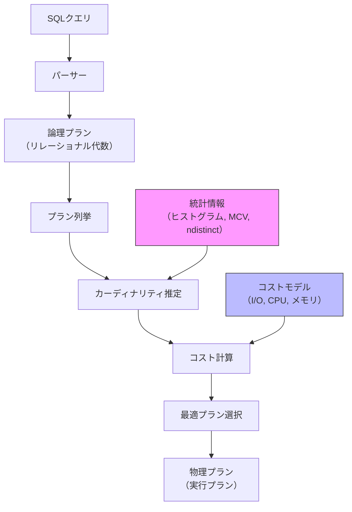
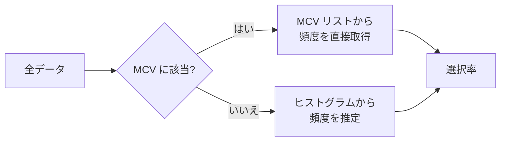
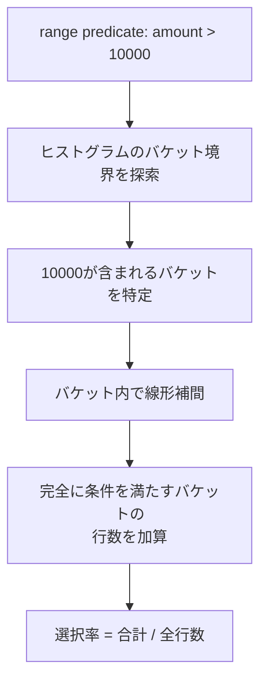
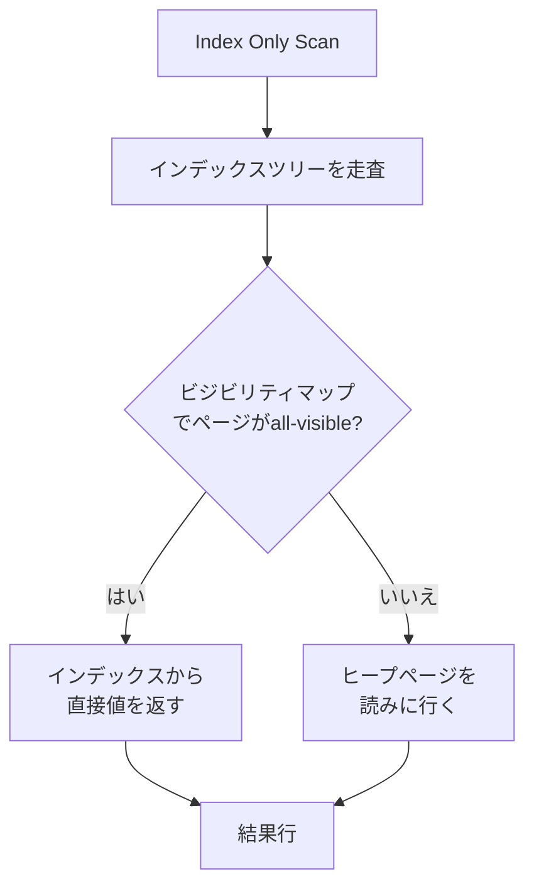
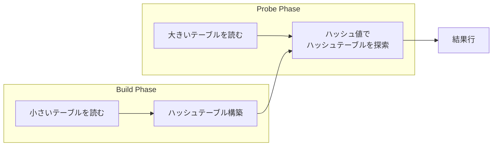
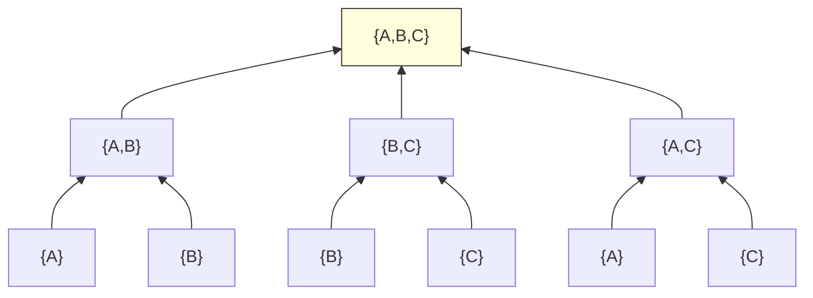
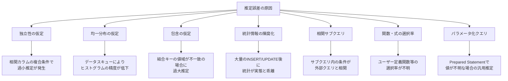
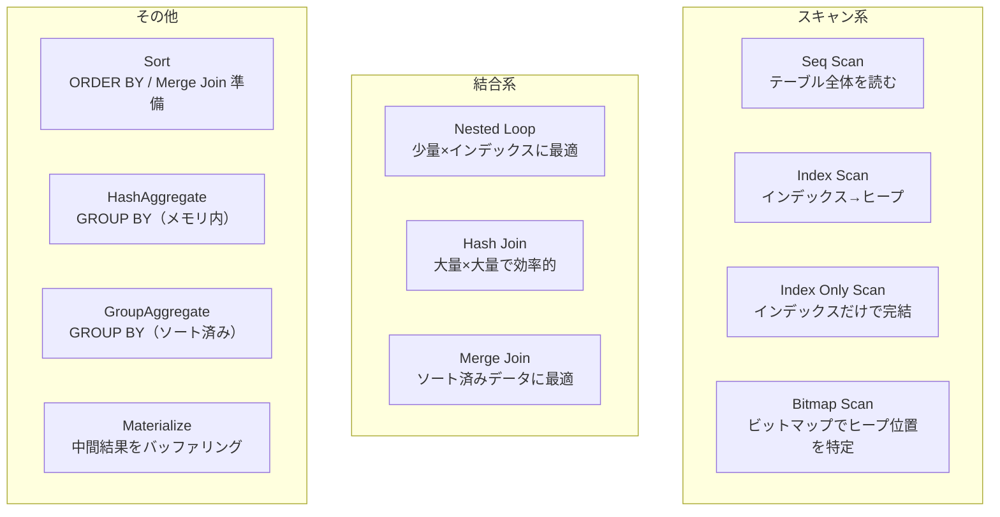
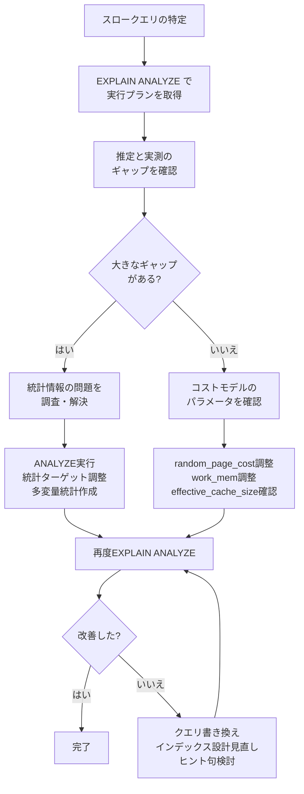

# クエリコスト推定の仕組み — 統計情報・カーディナリティ推定・コストモデル

## 1. クエリコスト推定の概要

リレーショナルデータベースにおいて、SQL は「何を取得するか」を宣言するだけであり、「どのように取得するか」はデータベースエンジンに委ねられる。同じクエリに対しても、テーブルのフルスキャン、インデックススキャン、ネステッドループ結合、ハッシュ結合、マージ結合など、複数の実行戦略（実行プラン）が存在する。そのうちどれが最も効率的かを判断するのが**クエリオプティマイザ**の役割であり、その判断の根幹にあるのが**コスト推定**である。

### 1.1 なぜコスト推定が必要か

2つのテーブルを結合する場合を考える。テーブル A に10万行、テーブル B に1,000行あるとする。ネステッドループ結合で外側を A にすれば10万回のループが走るが、外側を B にすれば1,000回で済む。さらにインデックスの有無、結合条件の選択率、メモリサイズなどの要因を考慮すると、可能な実行プランの組み合わせは爆発的に増加する。3テーブル結合で結合順序だけでも $3! = 6$ 通り、10テーブルなら $10! = 3{,}628{,}800$ 通りである。

この膨大な選択肢の中から最適な（あるいは十分に良い）プランを選ぶために、各実行プランの「コスト」を数値化して比較する仕組みがコスト推定である。

### 1.2 コスト推定の全体像

クエリオプティマイザにおけるコスト推定は、大きく3つの段階で構成される。



1. **統計情報の収集**: テーブルの行数、カラムの値分布（ヒストグラム、最頻値リスト）、NULL率などをカタログに格納する
2. **カーディナリティ推定**: 統計情報を用いて、各演算子の出力行数（カーディナリティ）を予測する
3. **コスト計算**: カーディナリティと物理パラメータ（ページサイズ、ランダムI/Oコスト、シーケンシャルI/Oコスト、CPU処理コスト）を組み合わせて、プラン全体のコストを算出する

この3段階のうち、最も誤差が大きくなりやすいのがカーディナリティ推定であり、推定精度がコストモデルの妥当性を左右する。

### 1.3 コストベースオプティマイザの歴史

コストベースのクエリ最適化は、1979年のIBM System Rにおける Selinger らの論文「*Access Path Selection in a Relational Database Management System*」に端を発する。この論文では、統計情報に基づくコストモデルと動的計画法による結合順序の最適化が提案され、現在のほぼすべての商用データベースの基礎となっている。

それ以前のシステムでは、ルールベースのオプティマイザが使われていた。「インデックスがあればインデックスを使う」「小さいテーブルを内側にする」といった固定的なヒューリスティクスに従うものであり、データの実際の分布を考慮しないため、多くのケースで準最適なプランを生成していた。

## 2. 統計情報

コスト推定の出発点は、テーブルとカラムに関する統計情報である。データベースはこれらの情報をシステムカタログ（PostgreSQL では `pg_statistic`、MySQL では `information_schema` や内部の統計テーブル）に格納し、オプティマイザが参照する。

### 2.1 基本統計量

各テーブルおよびカラムについて、以下の基本的な統計量が収集される。

| 統計量 | 説明 | 用途 |
|---|---|---|
| `n_rows` | テーブルの総行数（推定値） | すべてのコスト計算の基礎 |
| `n_pages` | テーブルが占有するディスクページ数 | I/Oコストの計算 |
| `n_distinct` | カラムの異なる値の数 | 等価条件の選択率推定 |
| `null_frac` | NULL値の割合 | NULL条件の選択率 |
| `avg_width` | カラムの平均バイト幅 | ソート・ハッシュの作業メモリ推定 |
| `correlation` | 物理的な行順序と論理的な値順序の相関 | インデックススキャンのコスト推定 |

特に `correlation` は見落とされがちだが重要な統計量である。`correlation` が1.0に近い場合（例えば自動増分の主キー）、インデックス経由のアクセスは物理的にもシーケンシャルに近くなるため、ランダムI/Oのコストを低く見積もることができる。逆に `correlation` が0に近い場合、インデックススキャンは大量のランダムI/Oを引き起こすため、フルテーブルスキャンの方が効率的な場合もある。

### 2.2 ヒストグラム

カラムの値分布を精密に把握するために、データベースはヒストグラムを構築する。ヒストグラムにはいくつかの種類がある。

#### 等幅ヒストグラム（Equi-Width Histogram）

値域を等間隔のバケットに分割する最も単純な方式である。例えば `age` カラムの値域が0〜100の場合、10個のバケット（0-10, 11-20, ...）に分ける。

```
バケット  | 0-10 | 11-20 | 21-30 | 31-40 | 41-50 | 51-60 | 61-70 | 71-80 | 81-90 | 91-100 |
頻度      |  50  |  200  |  800  | 1500  | 2000  | 1800  | 1200  |  500  |  100  |   50   |
```

等幅ヒストグラムの問題は、データが偏っている場合に精度が低くなることである。上の例では、41-50のバケットに2000行が含まれているが、その中で `age = 45` の行が何行あるかは分からない。

#### 等深ヒストグラム（Equi-Depth / Equi-Height Histogram）

各バケットに含まれる行数が（おおむね）等しくなるように値域を分割する方式である。PostgreSQL はこの方式を採用している。

```
バケット  | 0-28  | 29-35 | 36-40 | 41-44 | 45-49 | 50-54 | 55-60 | 61-68 | 69-80 | 81-100 |
頻度      |  820  |  820  |  820  |  820  |  820  |  820  |  820  |  820  |  820  |  820   |
```

等深ヒストグラムでは、データの密集する領域ではバケットの幅が狭くなり、疎な領域では広くなる。これにより、よく検索される値域の推定精度が自然に高まる。

PostgreSQL では、デフォルトで100個のバケット境界値が保持される（`default_statistics_target = 100`）。この値はカラムごとに変更可能である。

```sql
-- Change statistics target for a specific column
ALTER TABLE orders ALTER COLUMN status SET STATISTICS 500;
ANALYZE orders;
```

#### V-Optimal ヒストグラムと圧縮ヒストグラム

理論的にはV-Optimal ヒストグラム（各バケット内の分散の合計を最小化する分割）が最も精度が高いが、構築コストが高いため実用的にはあまり使われない。商用データベースの一部（旧Oracle など）ではハイブリッド型のヒストグラムが使われている。

### 2.3 最頻値リスト（Most Common Values, MCV）

多くのカラムには、出現頻度が極端に高い値が存在する。例えば `status` カラムでは `'active'` が全体の80%を占め、`'inactive'`、`'suspended'`、`'deleted'` がそれぞれ数%ずつということがある。このような偏りのある値を正確に推定するために、MCV リストが使われる。

MCV リストは、最も頻繁に出現する値とその出現割合のペアを保持する。

```
MCV values:      ['active', 'inactive', 'suspended', 'deleted']
MCV frequencies: [0.80,     0.12,       0.05,        0.03]
```

PostgreSQL では、MCV リストに含まれない値に対する推定は、残りのヒストグラムを使って行われる。つまり、MCV に該当する行を除外した上でヒストグラムが構築される。



PostgreSQL の `pg_stats` ビューを通じて、カラムの統計情報を確認できる。

```sql
-- View statistics for a column
SELECT
    tablename,
    attname,
    n_distinct,
    most_common_vals,
    most_common_freqs,
    histogram_bounds,
    correlation
FROM pg_stats
WHERE tablename = 'orders' AND attname = 'status';
```

### 2.4 多変量統計（Multi-Column Statistics）

伝統的なオプティマイザは各カラムの統計を独立に扱うが、現実のデータではカラム間に相関が存在することが多い。例えば `city = 'Tokyo'` かつ `country = 'Japan'` という条件において、独立性を仮定すると選択率は $P(\text{city}) \times P(\text{country})$ と計算されるが、実際にはこの2条件にはほぼ完全な相関があり、推定が大きくずれる。

PostgreSQL 10以降では、明示的に多変量統計を作成できる。

```sql
-- Create multi-column statistics
CREATE STATISTICS city_country_stats (dependencies, ndistinct, mcv)
    ON city, country FROM addresses;
ANALYZE addresses;
```

これにより、`dependencies`（関数従属性）、`ndistinct`（複合的なユニーク値数）、`mcv`（複合MCV）が収集され、相関のあるカラムに対する推定精度が向上する。

## 3. カーディナリティ推定

カーディナリティ推定とは、クエリの各中間演算（フィルタ、結合、集約など）の出力行数を予測することである。コスト計算はカーディナリティに大きく依存するため、この推定の精度がプラン選択の品質を決定する。

### 3.1 選択率（Selectivity）

選択率とは、条件を適用した後に残る行の割合である。行数 $N$ のテーブルに選択率 $s$ の条件を適用すると、出力カーディナリティは $N \times s$ と推定される。

#### 等価条件の選択率

```sql
-- Example: equality predicate
SELECT * FROM employees WHERE department = 'Engineering';
```

MCV リストに `'Engineering'` が含まれていれば、その頻度がそのまま選択率になる。含まれていない場合は、次の式で推定される。

$$
s_{eq} = \frac{1 - \sum_{i} f_{mcv_i}}{n_{distinct} - n_{mcv}}
$$

ここで $f_{mcv_i}$ は各 MCV 値の頻度、$n_{distinct}$ はカラムの異なる値の数、$n_{mcv}$ は MCV に含まれる値の数である。つまり、MCV 以外の値は均一に分布していると仮定する。

#### 範囲条件の選択率

```sql
-- Example: range predicate
SELECT * FROM orders WHERE amount > 10000;
```

範囲条件の選択率はヒストグラムから推定される。等深ヒストグラムの場合、条件値が含まれるバケットを特定し、そのバケット内では値が線形に分布していると仮定して補間する。



具体的に、等深ヒストグラムのバケット境界が `[0, 1000, 3000, 7000, 12000, 20000, 50000]` で各バケットに1000行ずつ含まれるとする。`amount > 10000` の場合：

- バケット [7000, 12000]: 10000〜12000 の部分 → $1000 \times \frac{12000 - 10000}{12000 - 7000} = 400$ 行
- バケット [12000, 20000]: 全体 → 1000行
- バケット [20000, 50000]: 全体 → 1000行

推定カーディナリティ = 400 + 1000 + 1000 = 2400行

#### LIKE条件の選択率

`LIKE 'abc%'` のような前方一致は範囲条件に変換できる（`>= 'abc' AND < 'abd'`）。しかし `LIKE '%abc%'` のような中間一致や後方一致は、ヒストグラムからの推定が困難であり、デフォルトの固定値（PostgreSQLでは以前は1%程度の値）が使われることがある。

#### 複合条件の選択率

AND条件とOR条件の選択率は、独立性を仮定して次のように計算される。

$$
s(A \wedge B) = s(A) \times s(B)
$$

$$
s(A \vee B) = s(A) + s(B) - s(A) \times s(B)
$$

NOT条件：

$$
s(\neg A) = 1 - s(A)
$$

この独立性の仮定は、先述のとおり相関のあるカラム間で大きな誤差を生む。多変量統計はこの問題を緩和するための手段である。

### 3.2 結合カーディナリティ

2つのテーブルの結合のカーディナリティ推定は、クエリ最適化において最も重要かつ難しい部分である。

#### 等価結合のカーディナリティ

テーブル $R$ と $S$ を $R.a = S.b$ で結合する場合、基本的な推定式は次のとおりである。

$$
|R \bowtie S| = \frac{|R| \times |S|}{\max(n_{distinct}(R.a), n_{distinct}(S.b))}
$$

この式は「包含の仮定」（containment assumption）に基づいている。すなわち、値域の小さい方の全ての値が、値域の大きい方にも含まれると仮定する。

例えば、`orders` テーブルに10万行、`customers` テーブルに1万行あり、`orders.customer_id` の異なる値が8,000個、`customers.id` の異なる値が10,000個の場合：

$$
|orders \bowtie customers| = \frac{100{,}000 \times 10{,}000}{10{,}000} = 100{,}000
$$

これは直感的にも正しい。各注文は1人の顧客に属するため、結合結果は注文の行数と同じになる。

#### 外部結合のカーディナリティ

LEFT OUTER JOIN の場合、左テーブルのすべての行が結果に含まれることが保証されるため、カーディナリティの下限は左テーブルの行数になる。

$$
|R \text{ LEFT JOIN } S| = \max(|R|, |R \bowtie_{inner} S|)
$$

#### 非等価結合のカーディナリティ

`R.a > S.b` のような非等価結合は推定がさらに困難である。一般的には、結合条件の選択率をデカルト積に適用する。

$$
|R \bowtie_{R.a > S.b} S| = |R| \times |S| \times s_{>}
$$

ここで $s_{>}$ は範囲比較の選択率であり、データの分布に依存する。均一分布を仮定した場合は $s_{>} \approx 1/3$ が使われることもある。

### 3.3 集約のカーディナリティ

GROUP BY のカーディナリティは、グループ化キーの異なる値の数（`n_distinct`）で推定される。複数のカラムでグループ化する場合、独立性を仮定して：

$$
|GROUP BY (a, b)| = \min(|R|, n_{distinct}(a) \times n_{distinct}(b))
$$

ただし、この推定は相関のあるカラムに対して大きく過大評価することがある。例えば `city` と `prefecture` でグループ化する場合、独立性仮定では $n_{distinct}(\text{city}) \times n_{distinct}(\text{prefecture})$ となるが、実際の組み合わせはそれよりはるかに少ない。

### 3.4 DISTINCT のカーディナリティ

SELECT DISTINCT のカーディナリティ推定には、入力行数と `n_distinct` の情報が使われる。サブクエリの結果に対する DISTINCT の場合、推定がさらに難しくなる。入力の推定カーディナリティが元テーブルの `n_distinct` より小さい場合、実際の DISTINCT 値の数は `n_distinct` よりも少なくなる可能性が高い。この推定にはさまざまなヒューリスティクスが使われる。

## 4. コストモデル

カーディナリティが推定できたら、次に各物理演算子のコストを計算する。コストモデルは、ハードウェアの特性を抽象化した数値パラメータを用いて、各操作のコストを数値化する。

### 4.1 コストパラメータ

PostgreSQL のコストモデルで使用される主要なパラメータを示す。

| パラメータ | デフォルト値 | 説明 |
|---|---|---|
| `seq_page_cost` | 1.0 | シーケンシャルなページ読み取りのコスト（基準値） |
| `random_page_cost` | 4.0 | ランダムなページ読み取りのコスト |
| `cpu_tuple_cost` | 0.01 | 各行の処理コスト |
| `cpu_index_tuple_cost` | 0.005 | インデックスエントリの処理コスト |
| `cpu_operator_cost` | 0.0025 | 演算子（比較、関数呼び出し等）の実行コスト |
| `parallel_tuple_cost` | 0.1 | パラレルワーカーからの行受け渡しコスト |
| `parallel_setup_cost` | 1000 | パラレルワーカーの起動コスト |
| `effective_cache_size` | 4GB | OSとデータベースのキャッシュの合計サイズの推定値 |

`random_page_cost` と `seq_page_cost` の比率は特に重要である。デフォルトの4:1はHDDを前提とした値であり、SSDでは1.1〜2.0程度に下げることが推奨される。この比率が、インデックススキャンとシーケンシャルスキャンの損益分岐点を決定する。

```sql
-- Adjust cost parameters for SSD storage
SET random_page_cost = 1.1;
SET seq_page_cost = 1.0;
```

### 4.2 シーケンシャルスキャンのコスト

テーブル全体を走査するシーケンシャルスキャンのコストは、最も単純に計算できる。

$$
C_{seqscan} = N_{pages} \times \text{seq\_page\_cost} + N_{rows} \times \text{cpu\_tuple\_cost} + N_{rows} \times \text{cpu\_operator\_cost} \times N_{quals}
$$

ここで $N_{pages}$ はテーブルのページ数、$N_{rows}$ は行数、$N_{quals}$ はフィルタ条件の数である。

例えば、10,000ページ、100万行のテーブルに1つのフィルタ条件を適用する場合：

$$
C_{seqscan} = 10{,}000 \times 1.0 + 1{,}000{,}000 \times 0.01 + 1{,}000{,}000 \times 0.0025 = 10{,}000 + 10{,}000 + 2{,}500 = 22{,}500
$$

### 4.3 インデックススキャンのコスト

インデックススキャンのコストは、インデックスの走査コストとヒープ（テーブル）へのランダムアクセスコストの合計である。

$$
C_{idxscan} = C_{index\_traversal} + N_{tuples} \times \text{random\_page\_cost} \times f_{correlation} + N_{tuples} \times \text{cpu\_tuple\_cost}
$$

ここで $f_{correlation}$ は物理的な相関を反映する係数であり、`correlation` が1.0に近い場合はランダムI/Oが減少することを表現する。PostgreSQL の実際のコスト計算はこれよりも複雑で、Mackert-Lohman 式を用いてキャッシュ効果も考慮される。

#### Index Only Scan

カバリングインデックス（クエリに必要なすべてのカラムがインデックスに含まれている場合）では、ヒープへのアクセスが不要になる。PostgreSQL の Index Only Scan では、ビジビリティマップを参照してヒープアクセスの要否を判断するため、VACUUM が適切に実行されているテーブルほどコストが低くなる。



### 4.4 ネステッドループ結合のコスト

ネステッドループ結合は、外側テーブルの各行に対して内側テーブルを走査する方式である。

$$
C_{NLJ} = C_{outer\_scan} + N_{outer} \times C_{inner\_scan}
$$

内側にインデックスがある場合（Index Nested Loop Join）：

$$
C_{INLJ} = C_{outer\_scan} + N_{outer} \times C_{index\_lookup}
$$

ネステッドループ結合は、外側のカーディナリティが小さく、内側にインデックスがある場合に最も効率的である。外側のカーディナリティが大きい場合は、ハッシュ結合やマージ結合が有利になる。

### 4.5 ハッシュ結合のコスト

ハッシュ結合は、片方のテーブル（通常は小さい方）からハッシュテーブルを構築し、もう一方のテーブルを走査しながらプローブする方式である。

$$
C_{hash} = C_{build\_scan} + C_{build\_hash} + C_{probe\_scan} + C_{probe\_hash}
$$

ハッシュテーブルがメモリに収まる場合のコスト：

$$
C_{hash} \approx N_{pages\_build} \times \text{seq\_page\_cost} + N_{pages\_probe} \times \text{seq\_page\_cost} + (N_{rows\_build} + N_{rows\_probe}) \times \text{cpu\_tuple\_cost}
$$

ハッシュテーブルが `work_mem` に収まらない場合、一時ファイルへの書き出し（バッチ処理）が発生し、コストが大幅に増加する。



### 4.6 マージ結合のコスト

マージ結合は、両テーブルを結合キーでソートし、同時に走査する方式である。

$$
C_{merge} = C_{sort\_outer} + C_{sort\_inner} + C_{merge\_scan}
$$

既にソート済み（例えばインデックスが利用可能）の場合、ソートコストが不要になり非常に効率的になる。大規模なデータセット同士の結合で、かつ結合キーにインデックスがある場合に特に有利である。

### 4.7 ソートと集約のコスト

ソートのコストは、データがメモリに収まるかどうかで大きく異なる。

**インメモリソート**（`work_mem` に収まる場合）：

$$
C_{sort} = N_{rows} \times \log_2(N_{rows}) \times \text{cpu\_operator\_cost}
$$

**外部ソート**（`work_mem` に収まらない場合）：

$$
C_{sort} = C_{in\_memory} + N_{pages} \times 2 \times \log_M(N_{pages} / M) \times \text{seq\_page\_cost}
$$

ここで $M$ は `work_mem` に収まるページ数である。外部ソートではマージパスの回数分だけ追加のI/Oが発生する。

HashAggregate と GroupAggregate の選択も、`work_mem` とグループ数に依存する。グループ数が少なくメモリに収まる場合は HashAggregate が効率的であり、グループ数が多い場合やデータが既にソート済みの場合は GroupAggregate が選択される。

## 5. 結合順序の最適化

### 5.1 問題の規模

$n$ テーブルの結合順序の候補数は、ブッシー木（bushy tree）を含めると以下のように急激に増加する。

| テーブル数 | 左深木の順序数 | ブッシー木を含む順序数 |
|---|---|---|
| 2 | 2 | 2 |
| 3 | 6 | 12 |
| 4 | 24 | 120 |
| 5 | 120 | 1,680 |
| 10 | 3,628,800 | ~$1.76 \times 10^{10}$ |
| 20 | ~$2.4 \times 10^{18}$ | 天文学的数字 |

全探索は少数のテーブルでしか現実的ではないため、効率的な探索戦略が必要になる。

### 5.2 動的計画法（System R方式）

System R のオプティマイザで提案された動的計画法では、テーブルの部分集合に対する最適プランをボトムアップに構築する。

```
DP[{A}] = Access(A) の最適プラン
DP[{B}] = Access(B) の最適プラン
DP[{A,B}] = min(Join(DP[{A}], DP[{B}]),
                 Join(DP[{B}], DP[{A}]))
DP[{A,B,C}] = min(Join(DP[{A,B}], DP[{C}]),
                   Join(DP[{A,C}], DP[{B}]),
                   Join(DP[{B,C}], DP[{A}]))
```



動的計画法の時間計算量は $O(3^n)$（ブッシー木を考慮する場合）であり、テーブル数が10〜12程度までは実用的である。PostgreSQL では `geqo_threshold`（デフォルト12）を超えるテーブル数の結合に対して、遺伝的アルゴリズム（GEQO）に切り替わる。

### 5.3 「興味深い順序」（Interesting Orders）

System R の重要な発見の一つは、最小コストのプランだけを保持するのでは不十分だということである。あるサブプランが結合キーでソートされた結果を返す場合、その上位の結合でマージ結合を使えば追加のソートが不要になる。このため、各部分集合について「コスト最小のプラン」だけでなく、「興味深い順序を持つコスト最小のプラン」も保持する必要がある。

例えば、最終的に ORDER BY が必要なクエリでは、結合過程でソート順が保存されるプランが、総合的には安価になることがある。

### 5.4 遺伝的アルゴリズム（GEQO）

PostgreSQL の遺伝的アルゴリズムでは、結合順序を「遺伝子」として表現し、交叉と突然変異を繰り返して準最適な結合順序を探索する。テーブル数が多い場合でも一定時間内に解を返すが、最適性は保証されない。

MySQL では、テーブル数が `optimizer_search_depth`（デフォルト62、ただし実質的にはヒューリスティクスで枝刈り）を超えると、貪欲法（greedy heuristic）に切り替わる。

### 5.5 適応型クエリ最適化

近年のデータベースでは、実行中に統計情報の誤りを検出してプランを動的に変更する適応型最適化も導入されている。Oracle の Adaptive Query Plans では、ネステッドループ結合の途中で実際のカーディナリティが推定を大きく上回った場合、ハッシュ結合に切り替えることができる。

## 6. 統計情報の更新戦略

### 6.1 ANALYZE コマンド

PostgreSQL の `ANALYZE` コマンドは、テーブルからサンプリングによって統計情報を収集する。

```sql
-- Analyze a specific table
ANALYZE orders;

-- Analyze specific columns
ANALYZE orders (status, created_at);

-- Analyze all tables in the database
ANALYZE;
```

`ANALYZE` はテーブルからランダムに行をサンプリングする。サンプルサイズは `default_statistics_target` × 300 行である。デフォルトの `default_statistics_target = 100` の場合、30,000行がサンプリングされる。

### 6.2 自動ANALYZE（autovacuum）

PostgreSQL の autovacuum デーモンは、テーブルの変更量に基づいて自動的に ANALYZE を実行する。トリガー条件は以下のとおりである。

$$
\text{変更行数} > \text{autovacuum\_analyze\_threshold} + \text{autovacuum\_analyze\_scale\_factor} \times N_{rows}
$$

デフォルトでは、`autovacuum_analyze_threshold = 50`、`autovacuum_analyze_scale_factor = 0.1` であるため、テーブルの行数の10%（+50行）が変更されると自動 ANALYZE が発火する。

しかし、大規模テーブルでは10%の変更が発生するまでに時間がかかり、その間に統計情報が陳腐化する可能性がある。例えば1億行のテーブルでは、1,000万行が変更されるまで自動 ANALYZE が走らない。

```sql
-- Adjust autovacuum settings for large tables
ALTER TABLE large_orders SET (
    autovacuum_analyze_scale_factor = 0.01,  -- 1% instead of 10%
    autovacuum_analyze_threshold = 1000
);
```

### 6.3 MySQL の統計更新

MySQL（InnoDB）では、統計情報の更新方式が2つある。

1. **永続統計（persistent statistics）**: `innodb_stats_persistent = ON`（デフォルト）。`ANALYZE TABLE` で明示的に更新する。統計は `mysql.innodb_table_stats` と `mysql.innodb_index_stats` に格納される。
2. **一時統計（transient statistics）**: テーブルのメタデータが初回にアクセスされた時やテーブルの変更割合がしきい値を超えた時に自動更新される。

InnoDB のヒストグラムは MySQL 8.0 で導入されており、`ANALYZE TABLE ... UPDATE HISTOGRAM` で明示的に作成する必要がある。

```sql
-- Create histogram in MySQL 8.0+
ANALYZE TABLE orders UPDATE HISTOGRAM ON status, amount WITH 100 BUCKETS;
```

### 6.4 統計情報の鮮度と実行プランの安定性

統計情報が更新されると実行プランが変わる可能性がある。これは性能向上に寄与することもあれば、いわゆる**プランリグレッション**（以前は高速だったクエリが突然遅くなる現象）を引き起こすこともある。

プランリグレッションへの対策としては、以下のアプローチがある。

- **プランガイド/ヒント**: 特定のクエリに対して実行プランを固定する（Oracle のSQL Plan Baseline、PostgreSQL の `pg_hint_plan`）
- **プラン管理**: 新しいプランを自動的にテストし、以前より遅い場合は古いプランに戻す（Oracle の SQL Plan Management）
- **段階的な統計更新**: 大規模な変更後は、慎重にANALYZEを実行し影響を確認する

## 7. 推定誤差の原因と対策

### 7.1 主要な誤差要因

カーディナリティ推定の誤差は、以下の要因によって生じる。



#### 独立性の仮定による誤差

最も一般的な誤差要因である。2つの条件 A と B がそれぞれ選択率10%を持つ場合、独立性仮定では `A AND B` の選択率を $0.1 \times 0.1 = 0.01$（1%）と推定するが、A と B に正の相関があれば実際は10%に近い可能性がある。

具体例として、性別と名前の関係を考える。`gender = 'F' AND first_name = 'Mary'` の場合、`gender = 'F'` の選択率が50%、`first_name = 'Mary'` の選択率が3%であっても、Mary は女性名であるため、独立性仮定による $0.5 \times 0.03 = 1.5\%$ は過小推定であり、実際は3%に近い。

#### パラメータ化クエリの問題

Prepared Statement では、プランの作成時にパラメータの値が不明な場合がある。PostgreSQL 12以降では、最初の数回はカスタムプラン（パラメータ値を使った最適化）を生成し、汎用プラン（generic plan）の方がコスト的に有利と判断された場合に切り替える適応的な戦略を取る。

```sql
-- Force use of custom plans (PostgreSQL)
SET plan_cache_mode = 'force_custom_plan';

-- Force use of generic plans
SET plan_cache_mode = 'force_generic_plan';
```

### 7.2 誤差の伝播

カーディナリティ推定の誤差は、クエリプランの各段階で累積的に伝播する。複数テーブルの結合では、各結合のカーディナリティ推定の誤差が乗算的に伝播するため、最終的な推定値が実際の値から桁違いにずれることがある。

あるテーブルの推定行数が実際の10倍であった場合、3回の結合を経ると $10^3 = 1000$ 倍の誤差に増幅される可能性がある。このような大きな誤差は、完全に不適切なプラン選択を引き起こす。

### 7.3 対策

| 対策 | 効果 | 適用場面 |
|---|---|---|
| `CREATE STATISTICS` で多変量統計を作成 | 相関カラムの推定改善 | 相関の強い条件が頻出する場合 |
| `default_statistics_target` の増加 | ヒストグラムの精度向上 | 値の分布が複雑なカラム |
| 部分インデックスの作成 | 特定条件の統計情報を精密化 | 特定パターンの検索が多い場合 |
| クエリの書き換え | 推定しやすい形に変換 | 複雑なサブクエリ、相関サブクエリ |
| ヒント句の使用 | プランを直接制御 | 推定が根本的に困難な場合の最終手段 |
| マテリアライズドビューの活用 | 中間結果の統計情報を明確化 | 複雑な集約・結合の結果を再利用 |

## 8. EXPLAIN ANALYZE の読み方

### 8.1 基本構文

PostgreSQL の `EXPLAIN` コマンドは、クエリの実行プランを表示する。`ANALYZE` オプションを付けると実際にクエリを実行し、推定値と実測値の両方を表示する。

```sql
-- Show execution plan with actual timing
EXPLAIN (ANALYZE, BUFFERS, FORMAT TEXT)
SELECT o.order_id, c.name, o.amount
FROM orders o
JOIN customers c ON o.customer_id = c.id
WHERE o.status = 'shipped'
  AND o.amount > 10000;
```

### 8.2 出力の読み方

```
Hash Join  (cost=350.00..1250.00 rows=500 width=48)
           (actual time=5.2..15.8 rows=423 loops=1)
  Hash Cond: (o.customer_id = c.id)
  Buffers: shared hit=180 read=45
  ->  Seq Scan on orders o  (cost=0.00..850.00 rows=500 width=20)
                             (actual time=0.05..8.3 rows=423 loops=1)
        Filter: ((status = 'shipped') AND (amount > 10000))
        Rows Removed by Filter: 99577
        Buffers: shared hit=120 read=30
  ->  Hash  (cost=200.00..200.00 rows=10000 width=36)
            (actual time=4.8..4.8 rows=10000 loops=1)
        Buffers: shared hit=60 read=15
        ->  Seq Scan on customers c  (cost=0.00..200.00 rows=10000 width=36)
                                      (actual time=0.02..2.5 rows=10000 loops=1)
              Buffers: shared hit=60 read=15
```

各行の読み方を解説する。

**cost=350.00..1250.00**: 推定コスト。最初の数値はスタートアップコスト（最初の行を返すまでのコスト）、2番目は総コスト。

**rows=500**: オプティマイザの推定行数。

**actual time=5.2..15.8**: 実際の実行時間（ミリ秒）。スタートアップ時間と総時間。

**rows=423**: 実際の出力行数。

**loops=1**: この演算子の実行回数。ネステッドループの内側では loops > 1 になる。

**Buffers: shared hit=180 read=45**: バッファキャッシュのヒット数とディスク読み取りページ数。

### 8.3 推定と実測のギャップに注目する

上の例では、推定行数500に対して実測行数423であり、概ね良好な推定である。しかし、次のような出力が見られた場合は問題である。

```
Nested Loop  (cost=0.43..50.00 rows=1 width=48)
             (actual time=0.05..1250.00 rows=50000 loops=1)
```

推定行数1に対して実測行数50,000は5万倍のずれであり、ネステッドループ結合が選択されたのは推定行数が1であったからこそである。実際には50,000行が返されるなら、ハッシュ結合の方が適切であった可能性が高い。

### 8.4 実行プランの各ノードの意味



### 8.5 EXPLAIN のフォーマットオプション

```sql
-- JSON format (easier to parse programmatically)
EXPLAIN (ANALYZE, BUFFERS, FORMAT JSON) SELECT ...;

-- YAML format
EXPLAIN (ANALYZE, BUFFERS, FORMAT YAML) SELECT ...;

-- Verbose (show output columns, schema names)
EXPLAIN (ANALYZE, VERBOSE, BUFFERS) SELECT ...;

-- Settings (show non-default configuration affecting the plan)
EXPLAIN (ANALYZE, SETTINGS) SELECT ...;

-- WAL (show WAL generation for write queries)
EXPLAIN (ANALYZE, WAL, BUFFERS) INSERT INTO ...;
```

### 8.6 MySQL の EXPLAIN

MySQL の EXPLAIN も同様の情報を提供するが、出力形式が異なる。

```sql
-- Traditional tabular format
EXPLAIN SELECT * FROM orders WHERE status = 'shipped';

-- JSON format with cost information (MySQL 5.7+)
EXPLAIN FORMAT=JSON SELECT * FROM orders WHERE status = 'shipped';

-- Tree format with actual execution (MySQL 8.0.18+)
EXPLAIN ANALYZE SELECT * FROM orders WHERE status = 'shipped';
```

MySQL 8.0.18 以降の `EXPLAIN ANALYZE` は、PostgreSQL と同様に推定と実測の両方を表示する。

```
-> Filter: (orders.`status` = 'shipped')  (cost=10200 rows=9980)
    (actual time=0.125..45.3 rows=8500 loops=1)
    -> Table scan on orders  (cost=10200 rows=99800)
        (actual time=0.112..38.5 rows=100000 loops=1)
```

## 9. 実務でのチューニング

### 9.1 チューニングのワークフロー



### 9.2 統計情報のチューニング

#### statistics_target の調整

カーディナリティの偏りが大きいカラムや、範囲検索が頻繁に行われるカラムでは、`statistics_target` を増やしてヒストグラムの解像度を上げる。

```sql
-- Increase histogram resolution for a skewed column
ALTER TABLE events ALTER COLUMN event_type SET STATISTICS 1000;
ANALYZE events;

-- Verify improvement
EXPLAIN ANALYZE SELECT * FROM events WHERE event_type = 'rare_event';
```

ただし、`statistics_target` を上げすぎると ANALYZE の所要時間とカタログのサイズが増加するため、必要なカラムに絞って適用すべきである。

#### 多変量統計の活用

相関のあるカラムが WHERE 句で同時に使われる場合、多変量統計が有効である。

```sql
-- Example: city and zip_code are correlated
CREATE STATISTICS zip_city_stats (dependencies, ndistinct, mcv)
    ON zip_code, city FROM addresses;
ANALYZE addresses;

-- Before: estimated rows may be much less than actual
-- After: estimation should be much closer
EXPLAIN ANALYZE
SELECT * FROM addresses
WHERE zip_code = '100-0001' AND city = 'Chiyoda';
```

### 9.3 コストパラメータの調整

#### SSD環境での random_page_cost

SSD上で動作するデータベースでは、`random_page_cost` をデフォルトの4.0から下げることで、インデックススキャンがより積極的に選択されるようになる。

```sql
-- Check current settings
SHOW random_page_cost;
SHOW seq_page_cost;

-- Adjust for SSD (session level)
SET random_page_cost = 1.1;

-- Adjust for SSD (database level, persistent)
ALTER DATABASE mydb SET random_page_cost = 1.1;

-- Adjust for specific tablespace (e.g., SSD tablespace)
ALTER TABLESPACE ssd_space SET (random_page_cost = 1.1);
```

#### work_mem の調整

`work_mem` はソートやハッシュ操作に使用するメモリ量を制御する。この値が小さすぎると外部ソートやバッチハッシュが発生し、コストが増大する。

```sql
-- Check if sort/hash operations spill to disk
EXPLAIN (ANALYZE, BUFFERS)
SELECT * FROM orders ORDER BY created_at;

-- Output may show:
-- Sort Method: external merge  Disk: 25600kB
-- This indicates work_mem is insufficient

-- Increase work_mem for this session
SET work_mem = '256MB';
```

ただし、`work_mem` はクエリの各ソート/ハッシュノードごとに割り当てられるため、同時接続数が多い環境では合計メモリ使用量に注意が必要である。

### 9.4 インデックス設計とコスト推定

#### 部分インデックス

特定の条件に特化した部分インデックスを作成すると、その条件に対するカーディナリティ推定が正確になるとともに、インデックスのサイズも小さくなる。

```sql
-- Partial index for active orders only
CREATE INDEX idx_orders_active
    ON orders (created_at)
    WHERE status = 'active';

-- The optimizer knows this index covers only active orders
EXPLAIN ANALYZE
SELECT * FROM orders
WHERE status = 'active' AND created_at > '2026-01-01';
```

#### 複合インデックスの列順序

複合インデックスの列順序は、コスト推定に影響する。先頭カラムによるフィルタリングが最も効率的であり、先頭カラムの等価条件 + 2番目のカラムの範囲条件というパターンが理想的である。

```sql
-- Optimal column order: equality column first, then range column
CREATE INDEX idx_orders_status_amount
    ON orders (status, amount);

-- This query can efficiently use the index
EXPLAIN ANALYZE
SELECT * FROM orders
WHERE status = 'shipped' AND amount > 10000;
```

### 9.5 クエリの書き換えによるチューニング

#### サブクエリの結合への変換

相関サブクエリはカーディナリティ推定が困難になることが多い。JOIN に書き換えることで、推定精度が向上する場合がある。

```sql
-- Correlated subquery (may have poor estimation)
SELECT * FROM orders o
WHERE o.amount > (
    SELECT AVG(amount)
    FROM orders o2
    WHERE o2.customer_id = o.customer_id
);

-- Rewritten as JOIN (typically better estimation)
SELECT o.*
FROM orders o
JOIN (
    SELECT customer_id, AVG(amount) AS avg_amount
    FROM orders
    GROUP BY customer_id
) sub ON o.customer_id = sub.customer_id
WHERE o.amount > sub.avg_amount;
```

#### CTE の最適化バリア

PostgreSQL 12以前では、CTE（WITH句）が最適化バリアとして機能し、CTE内部のクエリが独立して最適化されていた。PostgreSQL 12以降では、参照が1回だけの CTE はインライン化される。しかし、MATERIALIZED キーワードを使うと明示的に最適化バリアを設定できる。

```sql
-- CTE will be inlined (PostgreSQL 12+)
WITH recent_orders AS (
    SELECT * FROM orders WHERE created_at > '2026-01-01'
)
SELECT * FROM recent_orders WHERE status = 'shipped';

-- Force materialization (optimization barrier)
WITH recent_orders AS MATERIALIZED (
    SELECT * FROM orders WHERE created_at > '2026-01-01'
)
SELECT * FROM recent_orders WHERE status = 'shipped';
```

### 9.6 ヒント句によるプラン制御

オプティマイザが最適なプランを選択できない場合の最終手段として、ヒント句がある。

PostgreSQL では公式にはヒント句をサポートしていないが、`pg_hint_plan` 拡張を使うことで実現できる。

```sql
-- Using pg_hint_plan extension
/*+
  HashJoin(o c)
  SeqScan(o)
  IndexScan(c)
*/
SELECT o.order_id, c.name
FROM orders o
JOIN customers c ON o.customer_id = c.id
WHERE o.status = 'shipped';
```

MySQL ではオプティマイザヒントが公式にサポートされている。

```sql
-- MySQL optimizer hints
SELECT /*+ JOIN_ORDER(c, o) USE_INDEX(o idx_status) */
    o.order_id, c.name
FROM orders o
JOIN customers c ON o.customer_id = c.id
WHERE o.status = 'shipped';
```

ヒント句はあくまで最終手段であり、統計情報やインデックスの改善で解決できるならそちらが望ましい。ヒント句はデータの分布が変化した際に逆効果になるリスクがあり、メンテナンスコストも高い。

### 9.7 実務上の注意点

**本番環境での EXPLAIN ANALYZE の注意**: `EXPLAIN ANALYZE` は実際にクエリを実行するため、UPDATE/DELETE に対して使う場合はトランザクション内で実行し、ROLLBACK する必要がある。

```sql
BEGIN;
EXPLAIN ANALYZE DELETE FROM old_logs WHERE created_at < '2025-01-01';
ROLLBACK;
```

**統計情報の定期的な監視**: `pg_stat_user_tables` ビューの `last_analyze`、`last_autoanalyze`、`n_mod_since_analyze` を定期的に確認し、統計情報が最新であることを保証する。

```sql
-- Check statistics freshness
SELECT
    schemaname,
    relname,
    n_live_tup,
    n_mod_since_analyze,
    last_analyze,
    last_autoanalyze
FROM pg_stat_user_tables
WHERE n_mod_since_analyze > n_live_tup * 0.1
ORDER BY n_mod_since_analyze DESC;
```

**プランキャッシュの管理**: Prepared Statement のプランキャッシュが古い統計に基づいている場合、`DISCARD PLANS` や `DEALLOCATE ALL` でプランキャッシュをクリアする。

```sql
-- Clear all cached plans in the session
DISCARD PLANS;
```

## 10. まとめ

クエリコスト推定は、リレーショナルデータベースの性能を根本から支える仕組みである。統計情報の収集、カーディナリティ推定、コストモデルの3つが連携して、膨大な実行プランの候補から最適なプランを選択する。

コスト推定の精度は完璧ではなく、独立性の仮定、統計情報の陳腐化、複雑なクエリパターンなどによって誤差が生じる。しかし、この仕組みがなければ、データベースは単純なルールベースの最適化に頼らざるを得ず、実用的な性能を達成できない。

実務においては、以下の原則が重要である。

1. **EXPLAIN ANALYZE を読む力を養う**: 推定と実測のギャップが、すべてのチューニングの出発点である
2. **統計情報を最新に保つ**: autovacuum の設定を適切に行い、大量更新後は手動で ANALYZE を実行する
3. **コストパラメータをハードウェアに合わせる**: 特に SSD 環境では `random_page_cost` の調整が大きな効果を持つ
4. **推定精度の改善を優先する**: ヒント句でプランを固定する前に、統計情報、多変量統計、インデックスの改善を試みる
5. **誤差の伝播を意識する**: 結合が多いクエリでは、1箇所の推定ミスが全体のプランを狂わせることを理解する

コスト推定の仕組みを理解することは、データベースの性能問題を「勘」ではなく「根拠」に基づいて解決するための基盤であり、すべてのデータベースエンジニアにとって不可欠な知識である。
