# クエリ実行エンジン — Volcano/Iterator, Vectorized, コンパイル方式

## 1. はじめに：クエリ実行エンジンとは何か

### 1.1 SQLからデータ取得までの道のり

ユーザーが `SELECT` 文を発行してから結果が返るまでには、いくつもの段階がある。SQL文はまずパーサーによって構文解析され、抽象構文木（AST）へ変換される。次にバインダーがテーブル名やカラム名をカタログ情報と突き合わせて解決し、オプティマイザが統計情報やコストモデルに基づいて最適な実行計画を選択する。そして最後に、その実行計画を実際に動かし、ストレージからデータを取り出して演算を施し、結果を返すのが**クエリ実行エンジン（Query Execution Engine）**である。

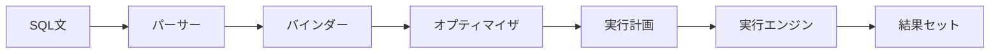

オプティマイザがどれほど優れた実行計画を生成しても、実行エンジンの効率が低ければ性能は出ない。逆に、実行エンジンが高速であれば、同じ実行計画からより短い時間で結果を返すことができる。クエリ実行エンジンはデータベースシステムの性能を決定づける中核コンポーネントである。

### 1.2 実行エンジンの進化

クエリ実行エンジンの設計は、過去40年にわたって大きく進化してきた。

1. **Volcano/Iteratorモデル**（1990年代〜）：Goetz Graefeが1994年に発表した論文 "Volcano — An Extensible and Parallel Query Evaluation System" に端を発するモデル。各演算子が `open()`/`next()`/`close()` のインターフェースを実装し、一行ずつデータを引き上げる（pull）方式である。PostgreSQLをはじめ、多くの伝統的RDBMSがこのモデルを採用している。

2. **Vectorized実行**（2005年〜）：MonetDB/X100（後のVectorwise、現在のActian Vector）の研究から生まれたモデル。Iteratorの骨格を維持しつつ、一度に一行ではなく**一度にベクトル（数百〜数千行のバッチ）**を処理することで、関数呼び出しのオーバーヘッドを削減し、CPUキャッシュとSIMD命令を活用する。DuckDB、ClickHouse、Databricksなどが採用している。

3. **コンパイル方式**（2011年〜）：Thomas Neumannが2011年に発表した論文 "Efficiently Compiling Efficient Query Plans for Modern Hardware" で提唱。クエリごとにネイティブコードやバイトコードを動的に生成（JIT: Just-In-Time Compilation）し、演算子間の仮想関数呼び出しを排除する。HyPer（後にTableau/Salesforceに買収）やApache Spark（Tungsten/Whole-Stage CodeGen）が代表例である。

これらの方式は単なる歴史的な遷移ではなく、現代のデータベースシステムでは要件に応じて選択・組み合わせされている。本記事では、各実行モデルの原理・長所・短所を深く掘り下げ、さらにPush/Pullモデル、パイプラインブレーカー、並列実行、メモリ管理といった横断的な関心事を議論し、最後に代表的なシステムの実装を比較する。

## 2. Volcano/Iteratorモデル

### 2.1 基本構造

Volcano/Iteratorモデルでは、クエリの実行計画はオペレータの木構造（演算子ツリー）として表現される。各演算子は共通のインターフェースを持つ。

```
interface Operator {
    open()    // Initialize the operator
    next() -> Tuple | EOF  // Return the next tuple
    close()   // Release resources
}
```

例として、`SELECT name, salary FROM employees WHERE salary > 50000 ORDER BY salary` というクエリの実行計画を考える。

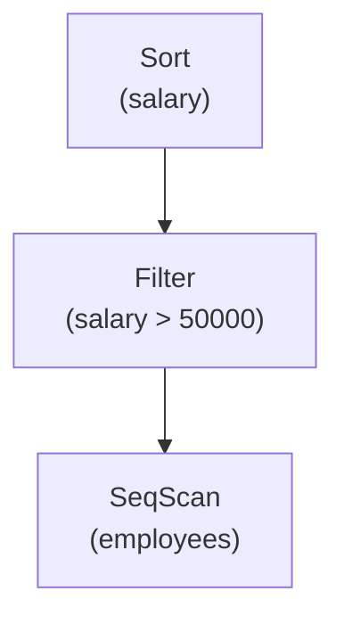

実行は最上位の演算子から始まる。クライアントが結果を要求すると、`Sort` の `next()` が呼ばれ、`Sort` は内部で `Filter` の `next()` を繰り返し呼び出してすべてのタプルを収集し、ソートした後、一行ずつ返す。`Filter` の `next()` は `SeqScan` の `next()` を呼び出し、条件に合致しないタプルをスキップしながら条件に合致したタプルを返す。`SeqScan` の `next()` はバッファプールからページを読み取り、ページ内のタプルを一行ずつ返す。

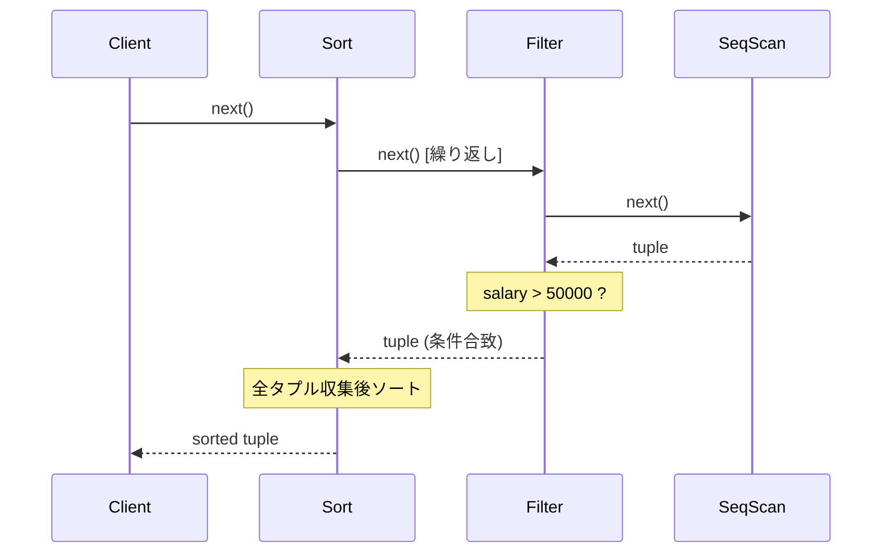

### 2.2 結合演算子の例：Nested Loop Join

Iteratorモデルの優雅さは、結合のような複雑な演算子も同じインターフェースで統一的に扱える点にある。Nested Loop Joinの擬似コードを示す。

```python
class NestedLoopJoin:
    def open(self):
        self.outer.open()
        self.inner.open()
        self.current_outer = self.outer.next()

    def next(self):
        while self.current_outer is not EOF:
            inner_tuple = self.inner.next()
            if inner_tuple is EOF:
                # Reset inner, advance outer
                self.inner.close()
                self.inner.open()
                self.current_outer = self.outer.next()
                continue
            if self.join_predicate(self.current_outer, inner_tuple):
                return combine(self.current_outer, inner_tuple)
        return EOF

    def close(self):
        self.outer.close()
        self.inner.close()
```

Hash JoinやSort-Merge Joinも同じ `next()` インターフェースで実装可能であり、オプティマイザはどの結合アルゴリズムを使うかを自由に差し替えられる。この**拡張性**こそが、Volcanoモデルが30年以上にわたって支持されてきた最大の理由である。

### 2.3 利点

**シンプルさと拡張性**: 新しい演算子を追加するには、`open()`/`next()`/`close()` の3メソッドを実装するだけでよい。演算子間の結合はインターフェースの約束のみに依存するため、独立して開発・テストできる。

**メモリ効率**: 一度にメモリに保持するのは各演算子のパイプライン上の1タプルだけである（パイプラインブレーカーを除く）。巨大なテーブルに対しても、メモリ消費を低く抑えられる。

**実装の成熟**: 数十年にわたる実績があり、PostgreSQLやMySQLなど広く利用されるシステムで検証済みである。

### 2.4 問題点：なぜ遅いのか

Volcanoモデルの問題は、**一行ずつ処理する（tuple-at-a-time）**という特性から生じる。

**仮想関数呼び出しのオーバーヘッド**: 各タプルに対して `next()` が演算子ツリーを上から下へ再帰的に呼び出される。100万行を処理するクエリで演算子が5段あれば、500万回の関数呼び出しが発生する。C++の仮想関数呼び出しは間接分岐を伴い、分岐予測ミスのコストが蓄積する。

**命令キャッシュの非効率**: `next()` の1回の呼び出しで、演算子ツリー全体のコードが実行される。フィルタの条件評価、ハッシュ計算、タプル構築など、異なる処理のコードが交互に実行されるため、命令キャッシュのローカリティが低い。

**データキャッシュの非効率**: 一行ずつ処理するため、同じカラムの値を連続して処理する機会がない。カラム型ストレージの利点を活かせず、L1/L2キャッシュを有効活用できない。

**SIMDの非活用**: Single Instruction Multiple Data命令は、同じ演算を複数のデータに同時に適用する。一行ずつ処理するVolcanoモデルでは、SIMDの恩恵を受けられない。

**コンパイラの最適化阻害**: 各演算子が仮想関数を介して接続されているため、コンパイラはインライン化やループ最適化を適用できない。

これらの問題は、処理対象のデータがディスクI/O bound である間は顕在化しなかった。しかし、メモリ容量の増大によりデータの大部分がメモリに載るようになると、CPUの処理効率がボトルネックとなり、Volcanoモデルの非効率が深刻な性能問題として表面化した。

## 3. Vectorized実行

### 3.1 MonetDB/X100の洞察

2005年、Peter BonczsらはMonetDB/X100（後のVectorwise）の論文 "MonetDB/X100: Hyper-Pipelining Query Execution" を発表した。この研究の核となる洞察は次のとおりである。

> Volcanoモデルの問題は「pull型」であることではなく、「一行ずつ処理すること」にある。Iteratorの構造を維持しつつ、一度にベクトル（固定長のタプルのバッチ）を処理すれば、関数呼び出しのオーバーヘッドを削減し、CPUの並列性を活用できる。

### 3.2 基本構造

Vectorized実行では、`next()` の戻り値が1タプルからベクトル（通常1024〜4096行のバッチ）に変わる。

```
interface VectorizedOperator {
    open()
    next() -> Vector | EOF   // Return a batch of tuples
    close()
}
```

ベクトルは各カラムの値を連続した配列として保持する。これは**カラムナー（columnar）レイアウト**であり、同じ型の値がメモリ上で隣接するため、キャッシュ効率が格段に向上する。

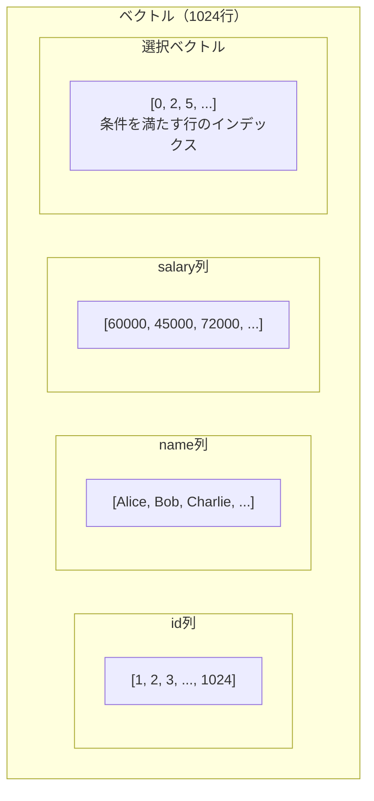

### 3.3 プリミティブ関数とタイトループ

Vectorized実行のもう一つの鍵は、各演算が**タイプ特化のプリミティブ関数**として実装されることである。例えば、`salary > 50000` というフィルタは以下のようなタイトループで処理される。

```c
// Vectorized comparison: int32 > constant
int select_gt_int32_const(int32_t* col, int n, int32_t val, int* sel_out) {
    int count = 0;
    for (int i = 0; i < n; i++) {
        // Branch-free: compiler can auto-vectorize with SIMD
        sel_out[count] = i;
        count += (col[i] > val);
    }
    return count;
}
```

このコードは以下の点でVolcanoモデルのフィルタと根本的に異なる。

1. **仮想関数呼び出しがない**: `for` ループの中に間接分岐がない
2. **ブランチフリー**: 条件分岐を算術演算に変換しており、分岐予測ミスが発生しない
3. **SIMD対応**: コンパイラが自動ベクトル化（auto-vectorization）を適用できる
4. **キャッシュフレンドリー**: `col` 配列はメモリ上で連続しており、プリフェッチが効く

### 3.4 選択ベクトル

フィルタの結果を表現するために、Vectorized実行では**選択ベクトル（Selection Vector）**を使用する。選択ベクトルは、条件を満たす行のインデックスを格納する整数配列である。

```
入力ベクトル:  salary = [60000, 45000, 72000, 30000, 55000, 80000, ...]
フィルタ条件:  salary > 50000
選択ベクトル:  sel = [0, 2, 4, 5, ...]  (60000, 72000, 55000, 80000が条件を満たす)
```

データを物理的にコピーする代わりに、選択ベクトルで「どの行が有効か」を管理する。これにより不要なメモリコピーを回避しつつ、後続の演算子は選択ベクトルを参照して有効な行だけを処理する。

### 3.5 利点と効果

Vectorized実行がVolcanoモデルに対して持つ利点を整理する。

| 観点 | Volcano（tuple-at-a-time） | Vectorized |
|---|---|---|
| 関数呼び出し回数 | N × 演算子数 | (N / ベクトルサイズ) × 演算子数 |
| 命令キャッシュ | 低局所性（演算子間を行き来） | 高局所性（一演算子がタイトループを実行） |
| データキャッシュ | 低局所性（行指向） | 高局所性（カラムナー配列） |
| SIMD活用 | 不可 | 可能（自動ベクトル化） |
| 分岐予測 | ミス多発（仮想関数） | ブランチフリーコード |

MonetDB/X100の論文では、TPC-Hベンチマークにおいて従来のVolcanoモデルに対して数倍から数十倍の性能向上が報告されている。

### 3.6 Vectorized実行の限界

Vectorized実行にも限界がある。

**解釈オーバーヘッド**: 各プリミティブ関数はベクトル単位で効率的だが、演算子間の制御フローは依然としてインタプリタ的に管理される。複雑な式（例：`CASE WHEN ... THEN ... END` のネスト）では、プリミティブ関数の呼び出し回数が増え、中間ベクトルの生成コストも蓄積する。

**マテリアライゼーション**: 各演算子間でベクトル（中間結果）をメモリに書き出す必要がある。単純な式であっても、入力ベクトルの読み取り→演算→出力ベクトルの書き込みというメモリアクセスが発生する。

**ベクトルサイズのチューニング**: ベクトルサイズが小さすぎるとVolcanoと同じ問題に近づき、大きすぎるとL1キャッシュに収まらなくなる。最適なベクトルサイズはハードウェアのキャッシュ構成に依存し、普遍的な最適値は存在しない。

## 4. コンパイル方式（JITコンパイル）

### 4.1 Neumannの洞察

2011年、Thomas Neumannは "Efficiently Compiling Efficient Query Plans for Modern Hardware" を発表した。この論文の核となる主張は次のとおりである。

> 最適なクエリ実行コードは、手書きのCコードと同等でなければならない。Volcanoモデルもvectorized実行もインタプリタであり、演算子の境界で不要なオーバーヘッドが生じる。クエリごとにネイティブコードを生成すれば、演算子間の境界を消去し、手書きのループと同等の効率を達成できる。

例えば、`SELECT name FROM employees WHERE salary > 50000` というクエリに対して、理想的な実行コードは以下のような単純なループである。

```c
// Ideal hand-written code for the query
for (int i = 0; i < num_rows; i++) {
    if (employees[i].salary > 50000) {
        output(employees[i].name);
    }
}
```

VolcanoモデルやVectorized実行では、演算子の境界（SeqScan → Filter → Projection）が実行時に存在するが、コンパイル方式ではこれらの境界がコンパイル時に消去される。

### 4.2 Produce/Consumeモデル

Neumannの論文では、コード生成のフレームワークとして**Produce/Consumeモデル**が提案された。各演算子は2つのメソッドを持つ。

- **`produce()`**: コードの生成を開始する。子演算子の `produce()` を呼び出す
- **`consume(tuple)`**: 子演算子がタプルを生成したときに呼ばれる。自身の処理コードを生成し、親演算子の `consume()` を呼び出す

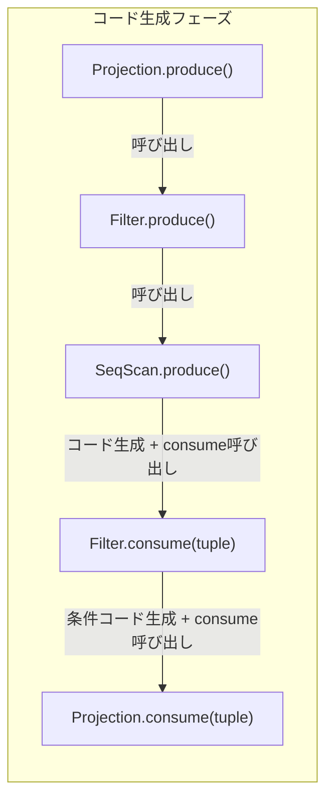

`produce()` はツリーを下向きに再帰し、リーフの `SeqScan` が実際のスキャンループのコード生成を開始する。そのループ内で親の `consume()` が呼ばれ、フィルタ条件のチェックコードが挿入され、さらに親の `consume()` が呼ばれてプロジェクションのコードが挿入される。最終的に、すべてが一つのタイトループに融合される。

### 4.3 生成されるコードのイメージ

上記のクエリに対して生成されるコード（概念的なCコード）は以下のようになる。

```c
// Generated code for:
// SELECT name FROM employees WHERE salary > 50000
void execute_query(Table* employees, ResultBuffer* output) {
    // SeqScan: iterate over all pages and tuples
    for (int page_id = 0; page_id < employees->num_pages; page_id++) {
        Page* page = buffer_pool_get(page_id);
        for (int slot = 0; slot < page->num_tuples; slot++) {
            // Filter: inline condition check
            int32_t salary = page_get_int32(page, slot, SALARY_COL);
            if (salary > 50000) {
                // Projection: extract name column
                char* name = page_get_varchar(page, slot, NAME_COL);
                result_buffer_append(output, name);
            }
        }
    }
}
```

演算子の境界がすべて消えていることに注目してほしい。仮想関数呼び出しはゼロ、中間タプルの構築もゼロである。変数はCPUレジスタに保持され、メモリへの書き戻しは最終結果の出力時のみである。

### 4.4 JITコンパイルの実装方式

コード生成の実装にはいくつかのアプローチがある。

**LLVM IR生成**: HyPerやPostgreSQLのJIT機能が採用。LLVM Intermediate Representation（IR）を動的に生成し、LLVMのバックエンドでネイティブコードにコンパイルする。LLVMの強力な最適化パス（インライン化、定数畳み込み、ループ最適化、SIMD化）を活用できる。


**バイトコード生成**: SQLiteが採用する方式。クエリを独自のバイトコードに変換し、仮想マシン（VDBE: Virtual Database Engine）上で実行する。ネイティブコードへのコンパイルは行わないが、演算子の境界を消去し、レジスタベースの効率的な実行を実現する。

**Java/JVMバイトコード生成**: Apache SparkのWhole-Stage CodeGenが採用。Javaソースコードを動的に生成し、Janino等のコンパイラでJVMバイトコードにコンパイルする。JVMのJITコンパイラ（C2）がさらにネイティブコードへ最適化する。

**C/C++コード生成**: コンパイル済みのCコードを動的にロードする方式。コンパイル時間は長いが、最高品質のネイティブコードが得られる。MemSQL（現SingleStore）が初期に採用していた。

### 4.5 利点

**最大限のCPU効率**: 演算子の境界が消え、生成されたコードはhand-tunedのCコードと同等の性能を持つ。レジスタ割り当て、命令パイプライニング、分岐予測のすべてが最適化される。

**仮想関数呼び出しゼロ**: Volcanoモデル最大のボトルネックが根本的に排除される。

**中間タプル構築の排除**: タプルのデータはCPUレジスタ上で演算子パイプラインを流れ、メモリに書き出されるのは最終結果またはパイプラインブレーカーの時点のみである。

### 4.6 問題点

**コンパイル遅延**: LLVM IRのコンパイルには数ミリ秒から数十ミリ秒を要する。OLTPのような短時間クエリでは、コンパイル時間がクエリ実行時間を上回る可能性がある。

::: tip コンパイル遅延への対策
多くのシステムでは、コンパイルが完了するまでインタプリタモードで実行を開始し、コンパイルが終わったら切り替える**Adaptive Execution**を採用している。PostgreSQLのJIT機能は、推定コストが閾値を超えたクエリにのみJITを適用する。
:::

**デバッグの困難さ**: 生成されたコードは読みにくく、実行計画との対応関係を追うのが難しい。プロファイリングも複雑になる。

**コードの肥大化**: 複雑なクエリでは生成されるコードが巨大になり、命令キャッシュを圧迫する可能性がある。

**実装の複雑さ**: LLVM等のコンパイラインフラストラクチャとの統合、コード生成ロジックのメンテナンス、型システムとの整合性など、実装のハードルが高い。

## 5. Push vs Pull モデル

### 5.1 Pullモデル（Demand-Driven）

Volcanoモデルは**Pullモデル**の代表である。データの流れは消費者（上位演算子）が生産者（下位演算子）に「次のデータをくれ」と要求することで駆動される。

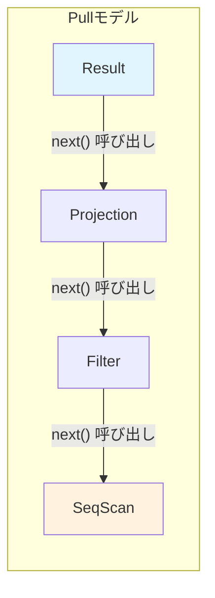

Pullモデルの利点は制御フローが自然であることだ。各演算子は自分のペースでデータを要求でき、例えば `LIMIT 10` の演算子は10行取得したら下位演算子への呼び出しを停止するだけでよい。コルーチンやイテレータとの親和性も高い。

### 5.2 Pushモデル（Data-Driven）

**Pushモデル**では、データの流れが逆転する。生産者（下位演算子）がデータを生成し、消費者（上位演算子）に「このデータを処理してくれ」と渡す。

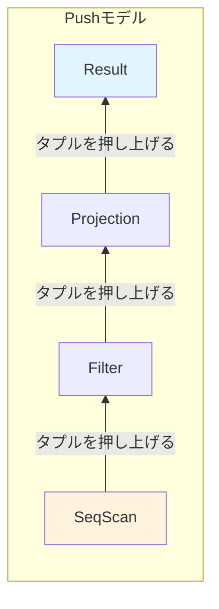

Pushモデルの利点は、制御フローがデータソースに集中することである。SeqScanがスキャンループを持ち、そのループ内で後続の演算子を直接呼び出す。これはコンパイル方式との親和性が非常に高い。Neumannのproduce/consumeモデルはまさにPushモデルである。

### 5.3 比較

| 特性 | Pull（Volcano） | Push（Neumann） |
|---|---|---|
| 制御フローの所在 | 消費者（上位演算子） | 生産者（下位演算子） |
| LIMIT/TOPの実装 | 自然（停止するだけ） | やや複雑（キャンセル伝播が必要） |
| コンパイル方式との親和性 | 低い | 高い |
| 非同期/パイプライン実行 | 可能だが複雑 | 自然にサポート |
| coroutineとの親和性 | 高い | 低い |
| エラーハンドリング | 戻り値で自然に伝播 | コールバック的に複雑になりうる |

実際のシステムでは、純粋なPullまたはPushではなく、ハイブリッドが多い。例えば、パイプラインブレーカー間はPush、パイプラインブレーカーの境界ではPullという組み合わせがある。

### 5.4 Morselモデル：Push + 並列性の融合

Leis et al.（2014）の論文 "Morsel-Driven Parallelism: A NUMA-Aware Query Evaluation Framework" は、Pushモデルと並列性を融合する**Morselモデル**を提案した。

Morselとは、テーブルの一部（通常10,000行程度）のチャンクである。各ワーカースレッドはMorselを取得し、そのMorsel内のデータをパイプライン全体を通して処理する。Morsel間でのロード不均衡はワークスティーリング（work stealing）で動的に調整される。

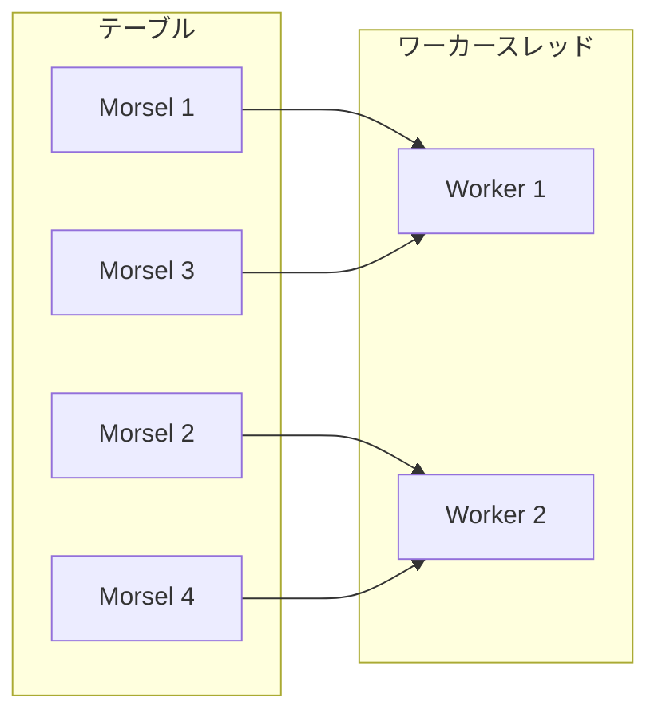

このモデルはNUMA（Non-Uniform Memory Access）アーキテクチャを意識している。各Morselは特定のNUMAノードに割り当てられ、そのノードに所属するワーカースレッドが優先的に処理する。これにより、リモートメモリアクセスのレイテンシを最小化する。

## 6. パイプラインブレーカー

### 6.1 パイプラインとパイプラインブレーカーの定義

演算子ツリーにおいて、上位演算子が下位演算子からデータを受け取り、直ちに（バッファリングなしに）処理して次の演算子に渡せる区間を**パイプライン**と呼ぶ。パイプライン内では、一つのタプル（またはベクトル）が複数の演算子を連続して通過する。

一方、入力をすべて読み終えないと出力を開始できない演算子を**パイプラインブレーカー（Pipeline Breaker）**と呼ぶ。パイプラインブレーカーはパイプラインの境界を形成する。

### 6.2 パイプラインブレーカーの分類

**Full Pipeline Breaker**: 入力全体をマテリアライズしてからでないと、1行も出力できない演算子。

- **Sort**: 全データを読み込んでソートしないと、最小値すら確定できない
- **Hash Join（ビルド側）**: ハッシュテーブルを完全に構築しないと、プローブ側のマッチングを開始できない
- **Hash Aggregate**: 全データを集約しないと、GROUP BYの結果を出力できない

**Partial Pipeline Breaker**: ある程度のバッファリングは必要だが、入力全体を読み込む前に出力を開始できる演算子。

- **Hash Join（プローブ側）**: ビルド側のハッシュテーブルが構築済みであれば、プローブ側のタプルを1行ずつ処理して結果を出力できる

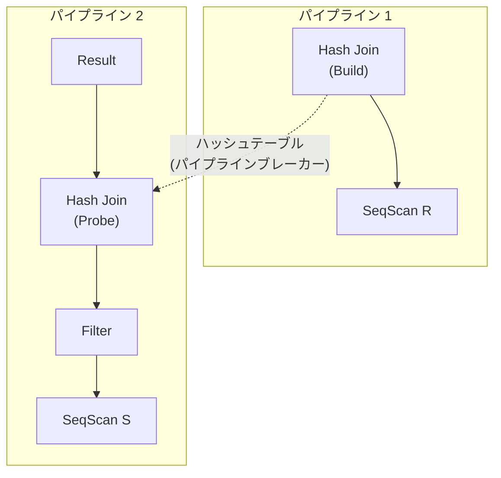

上の図では、Hash Joinのビルド側がパイプラインブレーカーとなり、2つのパイプラインに分割されている。パイプライン1（ScanR → HashJoin Build）とパイプライン2（ScanS → Filter → HashJoin Probe → Result）は独立して実行可能であり、パイプライン1が完了してからパイプライン2が開始される。

### 6.3 コンパイル方式におけるパイプラインの意味

コンパイル方式では、パイプラインが**コード生成の単位**となる。1つのパイプライン内の演算子はすべて1つのタイトループに融合される。パイプラインブレーカーの境界で、ループが切れてマテリアライズが発生する。

したがって、パイプラインブレーカーが少ないクエリほどコンパイル方式の恩恵が大きい。逆に、複数のソートや複雑な集約を含むクエリでは、パイプラインが細かく分割され、コンパイル方式の利点が薄れる。

## 7. 並列クエリ実行

### 7.1 なぜ並列性が必要か

現代のサーバーは数十から数百のCPUコアを搭載している。単一スレッドで実行する限り、これらのリソースの大半が遊休状態となる。特にOLAP（分析）ワークロードでは、大量データのスキャン・集約・結合が要求されるため、並列実行は不可欠である。

### 7.2 並列性の種類

**Intra-operator Parallelism（演算子内並列性）**: 単一の演算子の処理を複数のスレッドで分担する。例えばSeqScanでテーブルを分割し、各スレッドが異なる範囲をスキャンする。

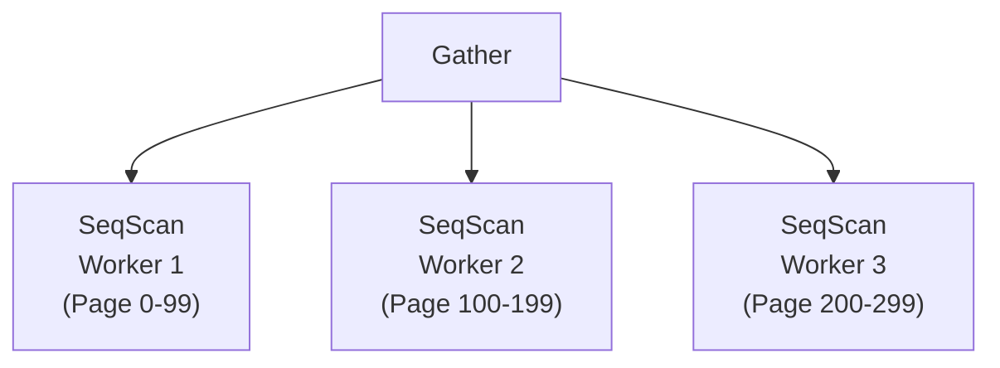

**Inter-operator Parallelism（演算子間並列性）**: 異なる演算子を異なるスレッドで同時に実行する。パイプライン的な並列性であり、上流の演算子がデータを生成している間に下流の演算子が処理する。

**Inter-query Parallelism（クエリ間並列性）**: 異なるクエリを異なるスレッドで同時に実行する。これはクエリ実行エンジンの設計というよりもスケジューラの責務である。

### 7.3 Exchange演算子

Volcanoモデルにおける並列実行の古典的なアプローチは、Graefeの**Exchange演算子**である。Exchange演算子は、他の演算子と同じ `next()` インターフェースを持ちながら、内部でデータの分配や集約を行う。

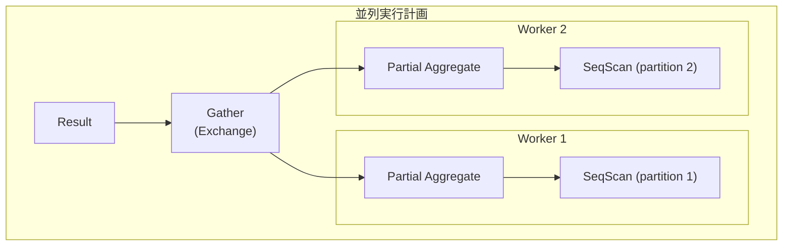

Exchange演算子の種類：

- **Gather**: 複数の子からデータを集約する（N:1）
- **Redistribute（Shuffle）**: ハッシュやレンジに基づいてデータを再分配する（N:M）
- **Broadcast**: すべてのワーカーにデータを複製する（1:N）

### 7.4 並列Hash Join

並列Hash Joinは並列クエリ実行の典型例である。

**ビルドフェーズ**: 各ワーカーがビルド側テーブルの担当パーティションをスキャンし、共有ハッシュテーブルにエントリを挿入する。同時挿入のため、ロックフリーハッシュテーブル（例：Cuckoo Hashing）やパーティション分割（各ワーカーがハッシュ値に基づいて異なるバケットを担当）が用いられる。

**バリア同期**: すべてのワーカーがビルドフェーズを完了するまで待機する。

**プローブフェーズ**: 各ワーカーがプローブ側テーブルの担当パーティションをスキャンし、共有ハッシュテーブルをルックアップする。プローブは読み取り専用なので、同期は不要。

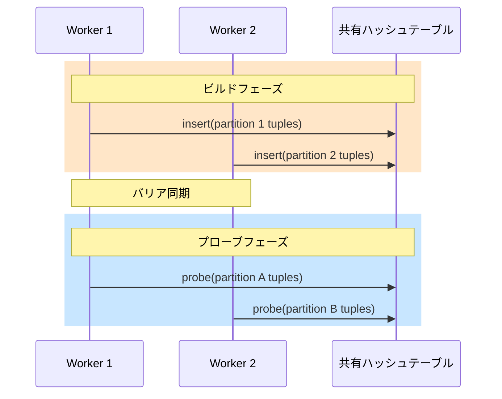

### 7.5 NUMA対応

NUMA環境では、メモリアクセスのレイテンシがアクセス先のNUMAノードによって異なる。ローカルメモリアクセスとリモートメモリアクセスでは2〜3倍のレイテンシ差がある。

NUMA対応のクエリ実行エンジンでは以下の工夫が行われる。

- **データの配置制御**: テーブルデータを各NUMAノードに分散配置し、各ワーカーがローカルメモリのデータを優先的に処理する
- **ワーカーのピンニング**: ワーカースレッドを特定のCPUコア（NUMAノード）に固定する
- **ローカルバッファの活用**: Hash Joinのビルドフェーズで、各NUMAノードにローカルなパーティションバッファを使い、リモート書き込みを最小化する

## 8. メモリ管理

### 8.1 メモリ管理の重要性

クエリ実行エンジンのメモリ管理は、性能と安定性の両方に直結する。ハッシュテーブル、ソートバッファ、中間結果の保持など、実行中には大量のメモリが必要となる。利用可能なメモリを超えるデータを処理する場合、ディスクへのスピル（spill）が必要となるが、スピルの発生は性能に甚大な影響を与える。

### 8.2 メモリバジェットとスピル

多くのシステムでは、各演算子にメモリバジェット（使用可能なメモリの上限）を設定する。

**Sort**: インメモリソート（クイックソートやイントロソート）で処理できるデータ量を超えた場合、External Merge Sort にフォールバックする。データをソート済みのランに分割してディスクに書き出し、マージフェーズで統合する。

```
Phase 1: Run Generation
  - メモリにB行読み込み → ソート → ディスクにラン1として書き出し
  - 次のB行読み込み → ソート → ラン2として書き出し
  - ...

Phase 2: Merge
  - 全ランを同時にオープンし、マージソート
  - ランの数がメモリで同時にオープンできる数を超える場合、多段マージ
```

**Hash Join**: ハッシュテーブルがメモリに収まらない場合、**Grace Hash Join** に切り替える。ビルド側とプローブ側の両方をハッシュ関数で同じパーティションに分割してディスクに書き出し、パーティション単位でHash Joinを実行する。

**Hash Aggregate**: ハッシュテーブルが溢れた場合、パーティションごとにディスクに書き出し、各パーティションを個別に集約する。

### 8.3 メモリアロケータ

汎用のメモリアロケータ（`malloc`/`free`）は、クエリ実行エンジンのワークロードに最適ではない。以下の理由から、専用のメモリアロケータが使用されることが多い。

**アリーナアロケータ（Arena/Bump Allocator）**: メモリを大きなチャンク単位で確保し、その中でポインタを進めるだけの高速なアロケーション。クエリ終了時にチャンク全体を一括解放する。個別の `free` が不要であり、フラグメンテーションも発生しない。

```c
struct Arena {
    char* base;     // Start of the arena
    char* current;  // Current allocation pointer
    char* end;      // End of the arena
};

void* arena_alloc(Arena* arena, size_t size) {
    // Align to 8 bytes
    size = (size + 7) & ~7;
    if (arena->current + size > arena->end) {
        // Allocate new chunk
        arena_grow(arena, size);
    }
    void* ptr = arena->current;
    arena->current += size;
    return ptr;
}
```

**メモリプールの事前確保**: クエリ開始時に必要な見積もりに基づいてメモリプールを確保し、実行中のシステムコール呼び出しを最小化する。

### 8.4 バッファプールとの連携

クエリ実行エンジンはバッファプールを通じてディスク上のデータにアクセスする。バッファプールのページ管理とクエリ実行のメモリ管理は密接に関連している。

大規模なシーケンシャルスキャンでは、バッファプールの全ページが入れ替えられてしまう問題（sequential flooding）がある。PostgreSQLはこれを防ぐために、大規模スキャンには小さなリングバッファ（256KB）を使用する。

## 9. 実装例の比較

### 9.1 PostgreSQL — 伝統的Volcanoモデル + JITオプション

PostgreSQLはVolcano/Iteratorモデルの忠実な実装である。各演算子ノード（`SeqScanState`、`HashJoinState`、`SortState` 等）が `ExecProcNode()` 関数を通じて `next()` に相当する処理を行う。

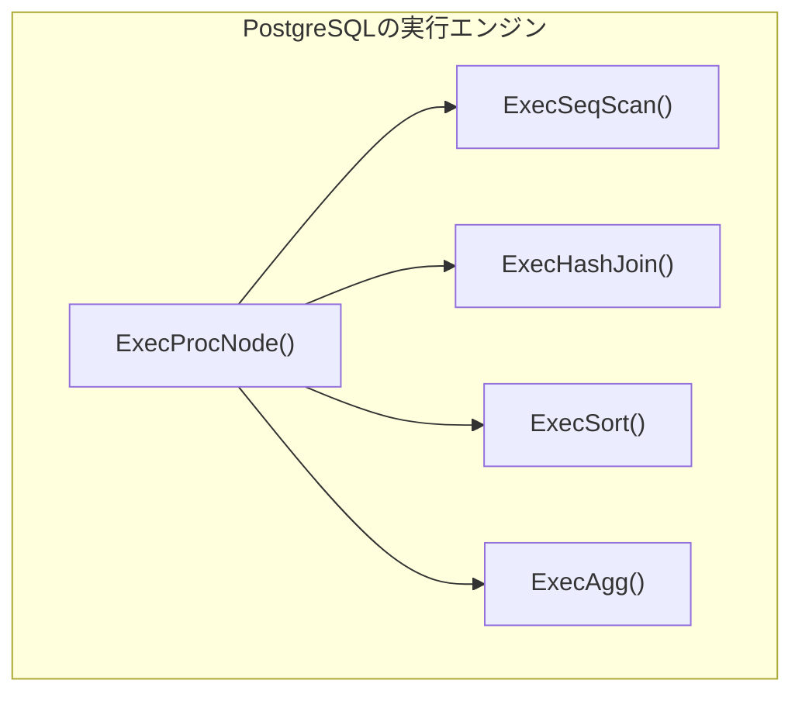

PostgreSQL 11（2018年）からLLVMベースのJITコンパイルが導入された。ただし、JITの対象は式の評価（WHERE句の条件、SELECT句のプロジェクション）とタプルのデシリアライゼーション（deforming）に限定されており、演算子間のパイプライン全体を融合する完全なコンパイル方式ではない。

```sql
-- JITが適用される条件（GUCパラメータ）
SET jit = on;                      -- JIT enabled
SET jit_above_cost = 100000;       -- Cost threshold for JIT
SET jit_inline_above_cost = 500000;  -- Cost threshold for inlining
SET jit_optimize_above_cost = 500000; -- Cost threshold for LLVM optimization
```

PostgreSQLのJITは、OLAP的な大規模クエリで効果を発揮するが、OLTPの短時間クエリではコンパイルのオーバーヘッドが支配的となるため、デフォルトではコスト閾値によって適用が制限されている。

**並列実行**: PostgreSQL 9.6（2016年）から並列クエリが導入された。Gather/Gather Merge演算子がExchange演算子の役割を果たし、バックグラウンドワーカープロセスが並列にスキャン・結合・集約を実行する。プロセスベース（スレッドベースではない）のアーキテクチャであるため、プロセス間でのデータ共有にはshared memoryが使用される。

### 9.2 DuckDB — Vectorized実行の最前線

DuckDBはMonetDB/X100の研究を受け継ぐインプロセス分析データベースで、Vectorized実行を全面的に採用している。

**カラムナーストレージ**: データはカラム単位で格納され、各カラムは圧縮された状態で保持される。実行エンジンはカラムナーのベクトルを直接処理する。

**ベクトルサイズ**: DuckDBのデフォルトベクトルサイズは2048行である。この値はL1キャッシュに収まるよう設計されている。

**パイプライン実行**: DuckDBは演算子ツリーをパイプラインに分割し、各パイプライン内でPushモデル的にデータを処理する。パイプラインブレーカーの境界で、中間結果がマテリアライズされる。

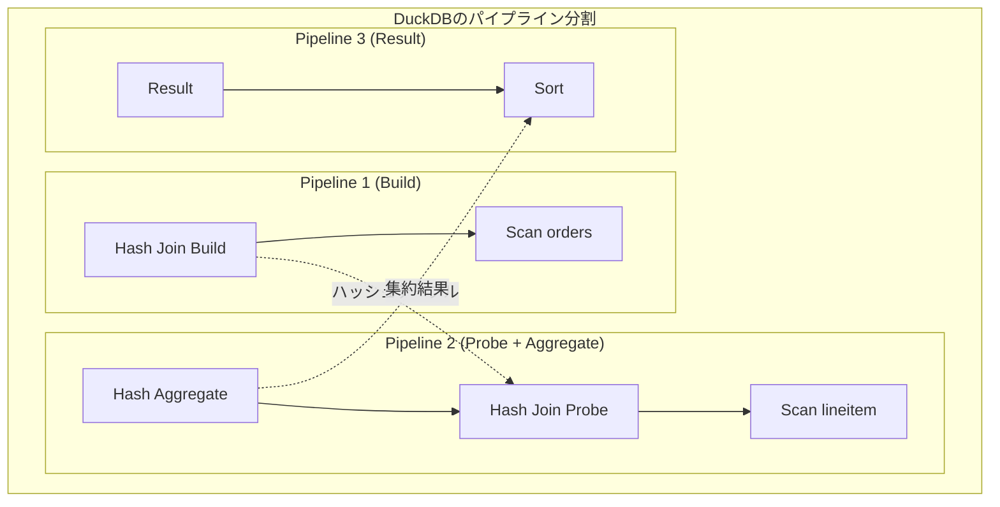

**Adaptive Execution**: DuckDBは実行中にプロファイリングを行い、演算子の挙動を動的に調整する。例えば、フィルタの選択率が高い場合と低い場合で異なるプリミティブ関数を使い分ける。

**並列実行**: DuckDBはMorselベースの並列実行を採用している。各パイプラインはMorsel（チャンク）単位で並列に処理され、スレッド間でのワークスティーリングによりロードバランシングが行われる。

### 9.3 Apache Spark — JVMベースのコンパイル方式

Apache SparkのSQL実行エンジン（Catalyst + Tungsten）は、JVM上でのコンパイル方式を採用している。

**Whole-Stage CodeGen**: Spark 2.0（2016年）で導入された最適化。パイプライン全体をJavaコードに変換し、Janinoコンパイラでバイトコードにコンパイルする。JVMのC2 JITコンパイラがさらにネイティブコードへ最適化する。

```
// Sparkが生成するコード（概念的）
// SELECT sum(salary) FROM employees WHERE dept = 'Engineering'
while (scan.hasNext()) {
    InternalRow row = scan.next();
    if (row.getString(DEPT_COL).equals("Engineering")) {
        sum += row.getLong(SALARY_COL);
    }
}
```

**オフヒープメモリ管理**: Tungstenは、JVMのガベージコレクションを避けるために、`sun.misc.Unsafe` を使ったオフヒープメモリ管理を実装している。メモリレイアウトを直接制御し、GCの停止を最小化する。

**分散実行**: Sparkは分散環境でのクエリ実行を前提としており、Exchange（Shuffle）が分散ノード間のデータ再分配を担う。Shuffleはネットワーク越しのデータ転送を伴うため、クエリ性能のボトルネックになりやすい。

### 9.4 ClickHouse — Vectorized + 特化型アーキテクチャ

ClickHouseはOLAP向けカラムナーデータベースで、Vectorized実行を基盤としつつ、独自の最適化を多数施している。

**カラム単位の処理**: ClickHouseの演算子はカラムのブロック（デフォルト65,536行）を単位として処理する。各カラムは圧縮されたまま保持され、必要な時だけ展開される。

**特化型演算子**: 集約関数や文字列処理関数に対して、データ型とカーディナリティに応じた特化実装が用意されている。例えば、低カーディナリティの `GROUP BY` には配列ベースのハッシュテーブル、高カーディナリティには通常のハッシュテーブルを使い分ける。

**パイプライン実行**: ClickHouseもパイプライン分割に基づく実行を行っており、近年のリファクタリングでPushベースの実行モデルに移行している。

### 9.5 HyPer/Umbra — コンパイル方式の先駆者

HyPer（Thomas Neumannのグループが開発）はコンパイル方式の先駆的システムである。クエリ全体をLLVM IRにコンパイルし、パイプライン内の演算子を完全に融合する。後継のUmbraでは、LLVMの依存を排除し、独自の軽量コンパイラを使用してコンパイル遅延を大幅に削減している。

**Umbra Flying Start**: Umbraは、コンパイル待ちの間にバイトコードインタプリタで実行を開始する。コンパイルが完了したら、その時点の実行状態をネイティブコードに引き継ぐ。これにより、コンパイル遅延がゼロに見える効果を実現する。

### 9.6 比較表

| 特性 | PostgreSQL | DuckDB | Spark SQL | ClickHouse | Umbra |
|---|---|---|---|---|---|
| 実行モデル | Volcano + JIT | Vectorized | CodeGen | Vectorized | CodeGen |
| Pull/Push | Pull | Push (pipeline内) | Push | Push | Push |
| 並列実行 | プロセスベース | Morselベース | 分散 | スレッドベース | Morselベース |
| ストレージ | 行指向 | カラムナー | カラムナー(Parquet等) | カラムナー | 行+カラムナー |
| 主要用途 | OLTP/OLAP | OLAP（組み込み） | 分散OLAP | OLAP | OLTP/OLAP |
| コンパイル遅延 | 中（LLVM） | なし | 中（Janino+C2） | なし | 極小（独自IR） |

## 10. 実行モデルの選択指針

### 10.1 ワークロード特性による選択

**OLTPワークロード**: トランザクションは短時間で、少数の行にアクセスする。Volcanoモデルのオーバーヘッドは相対的に小さく、コンパイル遅延のリスクが大きい。PostgreSQLの伝統的Volcanoモデルが適している。JITは大規模クエリにのみ選択的に適用するのが現実的である。

**OLAPワークロード**: 大量のデータをスキャン・集約するため、CPU効率が性能を支配する。Vectorized実行またはコンパイル方式が大きな効果を発揮する。DuckDB、ClickHouse、Sparkなどの選択が自然である。

**HTAP（Hybrid）ワークロード**: OLTPとOLAPの両方を扱う。Adaptive Execution（コスト推定に基づいてインタプリタモードとコンパイルモードを切り替え）が有効。HyPer/Umbraのアプローチが参考になる。

### 10.2 Vectorized vs Compiled：決着のない議論

Vectorized実行とコンパイル方式のどちらが優れているかは、長年にわたって議論されてきた。Kersten et al.（2018）の論文 "Everything You Always Wanted to Know About Compiled and Vectorized Query Engines" は、両者を公平に比較した重要な研究である。

この論文の結論は以下のとおりである。

1. **純粋な計算性能では同等**: 両方のアプローチとも、適切に実装すれば同等の性能を達成できる
2. **実装の容易さではVectorizedが優位**: プリミティブ関数は独立してテスト・プロファイリング可能であり、開発サイクルが短い
3. **プロファイリングではVectorizedが優位**: 演算子ごとの実行時間を正確に測定でき、性能チューニングが容易
4. **極限の最適化ではコンパイル方式が優位**: 演算子間の境界を越えた最適化（レジスタ割り当て、不要なマテリアライゼーション排除）はコンパイル方式でのみ可能
5. **SIMD活用ではVectorizedが優位**: タイプ特化のプリミティブ関数にSIMD命令を明示的に組み込める

::: warning 実装品質の重要性
実行モデルの選択よりも、実装品質のほうが性能への影響が大きいことが多い。メモリアロケータの効率、ハッシュテーブルの設計、SIMD命令の活用度など、低レベルの最適化が最終的な性能を決定する。
:::

### 10.3 近年の収斂：ハイブリッドアプローチ

近年のシステムでは、Vectorizedとコンパイル方式の境界が曖昧になりつつある。

- **DuckDB**: Vectorized実行を基本としつつ、式の評価にはコンパイル的な最適化を施している
- **Apache Datafusion**: Vectorized実行を採用しつつ、Rustの型システムを活用してコンパイル時に演算を特殊化する
- **Photon（Databricks）**: SparkのCodeGenをVectorizedエンジンに置き換えた。CodeGenのコンパイル遅延を避けつつ、C++で書かれたVectorized演算子でネイティブに近い性能を達成する
- **Velox（Meta）**: C++で実装されたVectorizedエンジンで、複数のクエリエンジン（Presto、Spark等）のバックエンドとして機能する

## 11. まとめ

クエリ実行エンジンの設計は、データベースシステムの性能を左右する根幹的なテーマである。

**Volcano/Iteratorモデル**は、そのシンプルさと拡張性により30年以上にわたって標準的なアーキテクチャであり続けている。一行ずつの処理という制約がCPU効率の低下を招くものの、OLTPワークロードや中小規模のクエリでは依然として合理的な選択肢である。

**Vectorized実行**は、Volcanoの骨格を維持しつつバッチ処理に切り替えることで、キャッシュ効率とSIMD活用を実現する。実装の容易さとプロファイリングの利便性から、近年のOLAPシステムで広く採用されている。

**コンパイル方式**は、演算子間の境界を消去して理論上最高のCPU効率を達成する。コンパイル遅延という課題があるものの、Adaptive Executionやインタプリタとの併用により実用的な解決策が確立されつつある。

これら3つのモデルは競合するものではなく、相補的な関係にある。現代のデータベースシステムは、ワークロードの特性とハードウェアの進化に応じて最適な組み合わせを模索している。Push/Pullモデル、パイプラインブレーカー、並列実行、メモリ管理といった横断的な関心事の理解が、実行エンジンの全体像を把握するためには不可欠である。

今後は、GPU/FPGAなどのアクセラレータへの対応、永続メモリ（CXL接続のメモリプール）の活用、ハードウェア支援によるデータ転送の最適化（RDMA）など、ハードウェアの進化に合わせた実行エンジンの革新が続くであろう。
