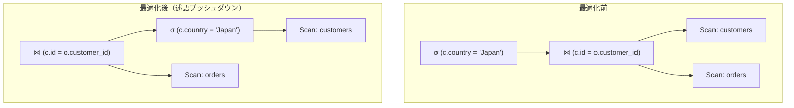
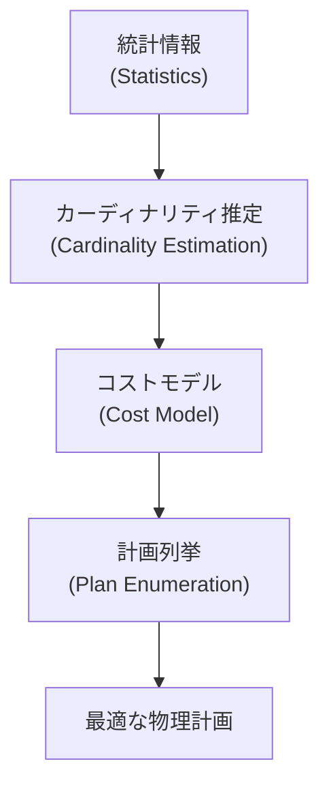
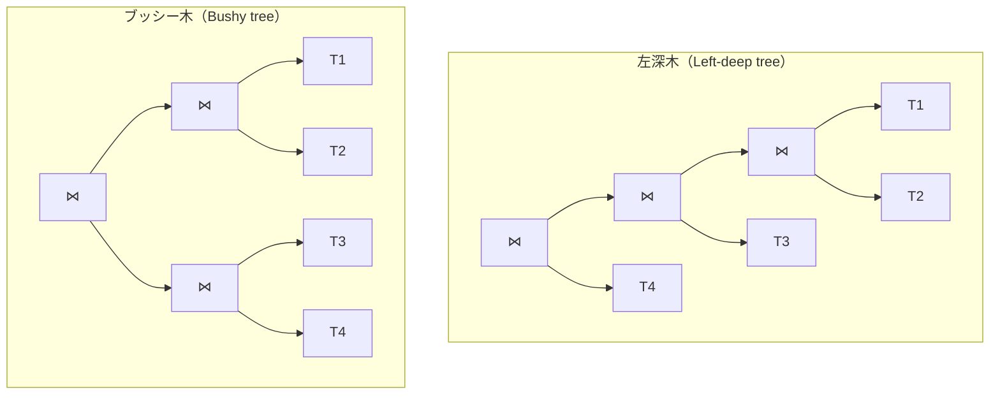
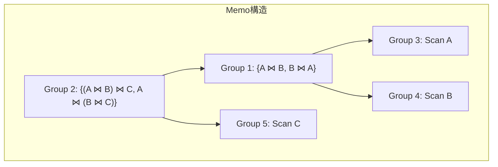
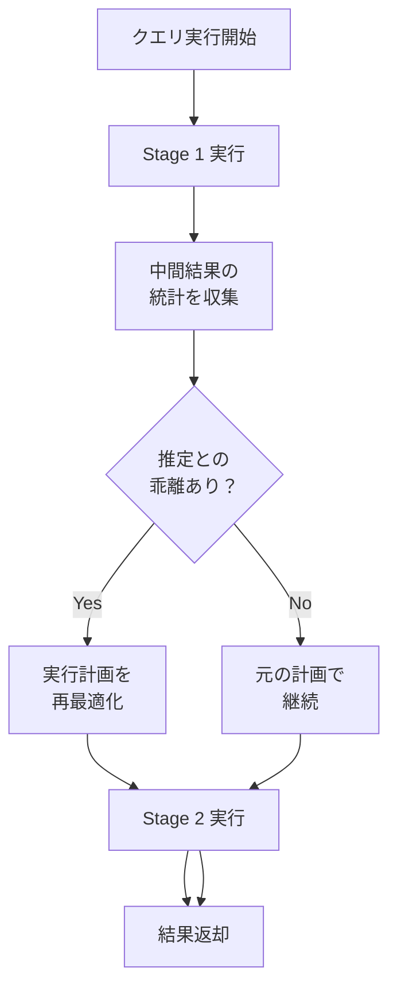
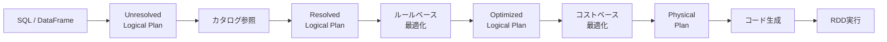

# クエリオプティマイザ — SQLの実行計画を最適化する仕組み

## 1. 背景と動機：宣言的SQLと実行計画の選択

### 1.1 SQLの宣言的性質

SQLは**宣言的言語**（Declarative Language）である。ユーザーは「何が欲しいか」を記述するだけで、「どうやって取得するか」は指定しない。たとえば以下のクエリを見てみよう。

```sql
SELECT c.name, o.total
FROM customers c
JOIN orders o ON c.id = o.customer_id
WHERE c.country = 'Japan'
  AND o.total > 10000
ORDER BY o.total DESC;
```

このSQLは「日本の顧客のうち、注文金額が10,000を超える注文を金額の降順で取得せよ」という要求を表している。しかし、この要求を満たすための**物理的な手順**はまったく指定されていない。具体的には、以下のような選択肢がすべて残されている。

- `customers` テーブルに `country` でフィルタリングしてから結合するのか、結合してからフィルタリングするのか
- 結合にNested Loop Join、Hash Join、Sort-Merge Joinのどれを使うのか
- `customers.country` にインデックスがあるなら、それを使うのか、全件スキャンするのか
- ソートはどの段階で行うのか

これらの選択はクエリの実行性能に**桁違いの差**をもたらす。同じ結果を返すにもかかわらず、ある実行計画は10ミリ秒で完了し、別の実行計画は10分かかるということが現実に起きる。

### 1.2 クエリオプティマイザの役割

**クエリオプティマイザ（Query Optimizer）**は、この「どうやって取得するか」を自動的に決定するデータベースエンジンのコンポーネントである。ユーザーが記述した宣言的SQLから、可能な限り効率的な**実行計画（Execution Plan / Query Plan）**を生成することがその使命だ。

クエリオプティマイザが解く問題は、本質的には**探索問題**である。与えられたSQLクエリに対して、同じ結果を返す実行計画の空間（Plan Space）を探索し、その中から最もコストの低い計画を選択する。この探索空間は結合するテーブルの数が増えるにつれて爆発的に大きくなる。$n$ 個のテーブルを結合する場合、結合順序だけでも $n!$ 通りの候補があり、さらに各結合に対する物理演算子の選択を組み合わせると、探索空間は天文学的な大きさに達する。

### 1.3 歴史的背景

リレーショナルデータベースの提唱者であるEdgar F. Coddは1970年に "A Relational Model of Data for Large Shared Data Banks" を発表し、データの物理的格納構造とデータの論理的操作を分離するというビジョンを示した。このビジョンを実現するために不可欠なのがクエリオプティマイザである。

最初の本格的なコストベースオプティマイザは、1979年にIBMのSystem Rプロジェクトで開発された。P. Griffiths Selinger らの論文 "Access Path Selection in a Relational Database Management System" は、コストベース最適化と動的計画法による結合順序列挙という、今日まで続く基本的なフレームワークを確立した。この論文はデータベース分野で最も引用される論文の一つであり、40年以上経った現在でもほとんどすべてのRDBMSのオプティマイザの基盤となっている。

## 2. クエリ処理の全体フロー

SQLクエリが実行結果になるまでの全体フローを理解することで、オプティマイザが果たす役割を明確にしよう。

```mermaid
flowchart LR
    SQL["SQL文"] --> Parser["パーサ<br/>(Parser)"]
    Parser --> AST["抽象構文木<br/>(AST)"]
    AST --> Analyzer["意味解析<br/>(Semantic Analyzer)"]
    Analyzer --> LogicalPlan["論理計画<br/>(Logical Plan)"]
    LogicalPlan --> Rewriter["論理最適化<br/>(Rewriter)"]
    Rewriter --> OptimizedLogical["最適化済み<br/>論理計画"]
    OptimizedLogical --> PhysicalOptimizer["物理最適化<br/>(Physical Optimizer)"]
    PhysicalOptimizer --> PhysicalPlan["物理計画<br/>(Physical Plan)"]
    PhysicalPlan --> Executor["実行エンジン<br/>(Executor)"]
    Executor --> Result["結果セット"]
```



### 2.1 パース（Parse）

SQL文をトークンに分解し（字句解析）、文法規則に従って**抽象構文木（AST: Abstract Syntax Tree）**を構築する。この段階ではSQL構文の正しさのみを検証する。テーブル名やカラム名が実在するかどうかはまだチェックしない。

### 2.2 意味解析（Semantic Analysis）

ASTに対して、テーブル名・カラム名の解決、型の検証、権限のチェックなどを行う。カタログ（メタデータ）を参照して、参照されているテーブルやカラムが実在し、型が互換であることを確認する。この段階を経て、ASTは**論理計画（Logical Plan）**に変換される。

論理計画は**関係代数（Relational Algebra）**の演算子ツリーとして表現される。主要な関係代数演算子は以下の通りである。

| 演算子 | 記号 | 説明 |
|--------|------|------|
| 選択（Selection） | $\sigma$ | 行のフィルタリング（WHERE条件） |
| 射影（Projection） | $\pi$ | カラムの選択（SELECT句） |
| 結合（Join） | $\bowtie$ | テーブルの結合 |
| 集約（Aggregation） | $\gamma$ | GROUP BY + 集約関数 |
| ソート（Sort） | $\tau$ | ORDER BY |
| 和集合（Union） | $\cup$ | UNION |

### 2.3 論理最適化（Logical Optimization / Query Rewriting）

論理計画に対して、**結果を変えない等価な変換**を適用して、より効率的な論理計画に書き換える。この段階ではコスト情報を使わず、ヒューリスティック（経験則）に基づいて変換を行う。詳細は次章で述べる。

### 2.4 物理最適化（Physical Optimization）

最適化された論理計画を**物理計画（Physical Plan）**に変換する。論理演算子を具体的な物理演算子に置き換える工程である。たとえば、論理的な「結合」を物理的な「Hash Join」や「Nested Loop Join」に、論理的な「テーブルスキャン」を物理的な「インデックススキャン」や「シーケンシャルスキャン」に変換する。

この段階では**統計情報**と**コストモデル**を用いて、各物理計画のコストを推定し、最もコストの低い計画を選択する。これがいわゆる**コストベース最適化（Cost-Based Optimization, CBO）**である。

### 2.5 実行（Execution）

物理計画を実行エンジンが解釈・実行し、結果セットを返す。実行モデルとしては、Volcano Model（イテレータモデル）やVectorized Execution（ベクトル化実行）、あるいはコード生成ベースの実行などがある。

## 3. 論理最適化（Query Rewriting）

論理最適化は、コスト情報に依存しないルールベースの変換であり、ほぼすべてのケースで性能を改善する。主要な最適化ルールを見ていこう。

### 3.1 述語プッシュダウン（Predicate Pushdown）

**述語プッシュダウン**は最も重要な論理最適化の一つである。フィルタ条件（述語）を可能な限りデータソースに近い位置に移動する変換だ。



最適化前は、`customers` と `orders` の全行を結合した後に `country = 'Japan'` でフィルタリングしている。最適化後は、`customers` テーブルを先にフィルタリングしてから結合する。`customers` テーブルに100万行あり、そのうち日本の顧客が1万行だとすると、結合の入力が100分の1に削減される。

述語プッシュダウンが適用できる条件は、述語が参照するカラムがデータソース側に存在し、かつ結合によって述語の意味が変わらないことである。外部結合（OUTER JOIN）の場合は、プッシュダウンの方向に注意が必要である。INNER JOINであれば結合のどちら側にもプッシュダウンできるが、LEFT OUTER JOINの場合、右側（preserved side）への述語プッシュダウンは正確さに影響する場合がある。

### 3.2 射影プッシュダウン（Projection Pushdown）

不必要なカラムをできるだけ早い段階で除去する最適化である。結合前に必要なカラムだけを射影しておけば、結合時のメモリ使用量とI/Oが削減される。

たとえば、`SELECT c.name, o.total FROM ...` というクエリでは、`customers` テーブルの `name` と `id`（結合キー）、`orders` テーブルの `total` と `customer_id`（結合キー）だけがあればよい。他のすべてのカラムは結合前に除去できる。

### 3.3 結合の除去（Join Elimination）

外部キー制約やユニーク制約の情報を利用して、実際には結果に影響しない結合を除去する最適化である。

```sql
-- orders.customer_id は customers.id への外部キー制約を持つとする
SELECT o.order_id, o.total
FROM orders o
JOIN customers c ON o.customer_id = c.id;
```

このクエリでは `customers` テーブルのカラムが SELECT 句に含まれておらず、外部キー制約により結合条件は必ず成立する。したがって、結合自体を除去できる。

### 3.4 サブクエリの非ネスト化（Subquery Unnesting）

相関サブクエリ（Correlated Subquery）は、外側のクエリの各行に対してサブクエリが繰り返し実行されるため、非効率になりがちである。これを結合に変換することで、オプティマイザがより広い最適化空間を探索できるようになる。

```sql
-- 変換前：相関サブクエリ
SELECT c.name
FROM customers c
WHERE c.id IN (
    SELECT o.customer_id
    FROM orders o
    WHERE o.total > 10000
);

-- 変換後：Semi-Join
SELECT c.name
FROM customers c
SEMI JOIN orders o
  ON c.id = o.customer_id AND o.total > 10000;
```

Semi-Joinは結合相手のテーブルから一致する行が1つでも見つかれば結果に含めるという意味であり、IN句のサブクエリと論理的に等価である。この変換により、オプティマイザはHash Semi-JoinやNested Loop Semi-Joinなど、より効率的な物理演算子を選択できるようになる。

### 3.5 ビューのマージ（View Merging）

ビューやサブクエリで定義されたクエリブロックを外側のクエリに統合し、一つの最適化単位として扱う変換である。

```sql
-- ビュー定義
CREATE VIEW high_value_orders AS
SELECT * FROM orders WHERE total > 10000;

-- クエリ
SELECT c.name, v.total
FROM customers c
JOIN high_value_orders v ON c.id = v.customer_id
WHERE c.country = 'Japan';

-- ビューマージ後の等価クエリ
SELECT c.name, o.total
FROM customers c
JOIN orders o ON c.id = o.customer_id
WHERE o.total > 10000
  AND c.country = 'Japan';
```

マージすることで、述語プッシュダウンや結合順序の最適化がクエリ全体に対して適用可能になる。

### 3.6 定数畳み込みと述語の簡約

```sql
-- 変換前
WHERE 1 = 1 AND status = 'active' AND price * 1.10 > 110

-- 変換後（定数畳み込み + 述語の簡約）
WHERE status = 'active' AND price > 100
```

コンパイル時に評価可能な定数式を先に計算し、常に真または偽の述語を除去する。また、算術式を変形してインデックスが利用可能な形にすることもある。

## 4. コストベース最適化（Cost-Based Optimization）

論理最適化が「明らかに良い変換」を適用するのに対し、物理最適化はデータの分布やサイズに依存する判断を行う。ここで中心的な役割を果たすのが**コストベース最適化**である。

### 4.1 コストベース最適化の構成要素

コストベース最適化は以下の3つの要素で構成される。



1. **統計情報（Statistics）**: テーブルの行数、カラムの値の分布、インデックスの情報など
2. **カーディナリティ推定（Cardinality Estimation）**: 各演算子の出力行数を推定する
3. **コストモデル（Cost Model）**: 各物理演算子のI/OコストとCPUコストを推定する

### 4.2 カーディナリティ推定

カーディナリティ推定は、クエリの各中間結果が何行になるかを推定するプロセスである。この推定の精度がコストベース最適化の品質を決定する。

#### 選択率（Selectivity）

**選択率（Selectivity）**は、述語によってフィルタリングされた後に残る行の割合を表す。$0 \leq \text{selectivity} \leq 1$ の範囲の値をとる。

| 述語の種類 | 選択率の推定方法 |
|------------|------------------|
| `col = value` | $\frac{1}{\text{NDV}(col)}$（NDV: Number of Distinct Values） |
| `col > value` | ヒストグラムから範囲内の行の割合を推定 |
| `col BETWEEN a AND b` | ヒストグラムから範囲内の行の割合を推定 |
| `col LIKE 'prefix%'` | 範囲スキャンとして推定 |
| `col IS NULL` | $\frac{\text{null\_count}}{\text{total\_count}}$ |

たとえば、`customers` テーブルに100万行あり、`country` カラムのNDV（ユニークな値の数）が50であれば、`country = 'Japan'` の選択率は $\frac{1}{50} = 0.02$ と推定される。推定カーディナリティは $1{,}000{,}000 \times 0.02 = 20{,}000$ 行となる。

ただし、この均一分布の仮定は現実にはしばしば不正確である。国別の顧客数は均等ではないからだ。これに対処するためにヒストグラムやMCV（Most Common Values）が使われる。詳細は後述する。

#### 結合のカーディナリティ推定

結合のカーディナリティ推定は特に難しい問題である。基本的な公式は以下の通りだ。

$$
|R \bowtie S| = \frac{|R| \times |S|}{\max(\text{NDV}(R.a), \text{NDV}(S.b))}
$$

ここで $R.a$ と $S.b$ は結合カラムである。この公式は「結合カラムの値の分布が均一であり、一方の値の集合が他方に包含される（containment assumption）」という仮定に基づいている。

#### 独立性の仮定とその問題

複合条件の選択率推定では、各述語が**独立（independent）**であるという仮定がよく使われる。

$$
\text{sel}(p_1 \wedge p_2) = \text{sel}(p_1) \times \text{sel}(p_2)
$$

しかし現実にはカラム間に相関が存在することが多い。たとえば、`city = 'Tokyo'` と `country = 'Japan'` は強い正の相関があるが、独立性の仮定では選択率を過小に推定してしまう。

```
実際の選択率: sel(city='Tokyo' AND country='Japan') ≈ sel(city='Tokyo')
独立性仮定:   sel(city='Tokyo') × sel(country='Japan') << sel(city='Tokyo')
```

この問題に対処するため、近年のデータベースでは多次元ヒストグラムやカラム間の相関統計を収集する機能が追加されている。PostgreSQLでは `CREATE STATISTICS` 文でカラム間の相関情報を明示的に作成できる。

### 4.3 コストモデル

コストモデルは、物理演算子の実行コストを数値化する関数である。一般的に、以下のコスト要素を考慮する。

$$
\text{Cost} = w_{\text{io}} \times C_{\text{io}} + w_{\text{cpu}} \times C_{\text{cpu}} + w_{\text{net}} \times C_{\text{net}}
$$

- $C_{\text{io}}$: ディスクI/Oコスト（ページの読み書き回数）
- $C_{\text{cpu}}$: CPU処理コスト（タプルの比較・ハッシュ計算回数）
- $C_{\text{net}}$: ネットワーク転送コスト（分散DBの場合）
- $w$: 各コスト要素の重み

#### Sequential Scan のコスト

テーブル全体を順次読み取る場合のコストは、テーブルが占めるページ数に比例する。

$$
C_{\text{seq\_scan}} = N_{\text{pages}} \times w_{\text{seq\_io}} + N_{\text{tuples}} \times w_{\text{cpu\_tuple}}
$$

#### Index Scan のコスト

インデックスを使って行をフェッチする場合のコストは、選択率と相関（クラスタリング度合い）に依存する。

$$
C_{\text{index\_scan}} = C_{\text{index\_traverse}} + N_{\text{matching}} \times C_{\text{heap\_fetch}}
$$

インデックスの物理的な順序とテーブルの物理的な順序が一致している（相関が高い）場合、ヒープフェッチのコストは連続I/Oに近くなる。一致していない場合はランダムI/Oとなり、コストが大幅に増加する。

この「どちらが安いか」の判断が、Sequential Scan と Index Scan のどちらを選択するかを決定する。選択率が低い（フィルタ後の行数が少ない）場合はIndex Scanが有利だが、選択率が高い場合はSequential Scanの方がランダムI/Oを避けられるため有利になる。

#### 各結合アルゴリズムのコスト

主要な結合アルゴリズムのコスト特性を比較する。

| アルゴリズム | コストモデル（概算） | 最適なケース |
|-------------|---------------------|-------------|
| Nested Loop Join | $O(\|R\| \times \|S\|)$ | 内側が小さくインデックスあり |
| Hash Join | $O(\|R\| + \|S\|)$ | 等値結合、十分なメモリ |
| Sort-Merge Join | $O(\|R\| \log \|R\| + \|S\| \log \|S\|)$ | 既にソート済み、または大規模 |

**Nested Loop Join**は外側テーブルの各行に対して内側テーブルをスキャンする。内側テーブルにインデックスがある場合、内側のスキャンがIndex Lookupに置き換わり、コストは $O(|R| \times \log|S|)$ に改善される。

**Hash Join**はビルドフェーズで小さい方のテーブル（ビルド側）のハッシュテーブルを構築し、プローブフェーズで大きい方のテーブル（プローブ側）の各行をハッシュテーブルで照合する。等値結合でのみ使用可能だが、メモリに収まる場合は非常に高速である。

**Sort-Merge Join**は両テーブルを結合キーでソートした後、マージ操作で結合を行う。既にソート済みのデータ（インデックスの順序やORDER BY句との整合性）がある場合に特に効率的である。

## 5. 結合順序の列挙

### 5.1 結合順序問題の組み合わせ爆発

$n$ 個のテーブルの結合順序の列挙は、クエリオプティマイザが解くべき最も計算量の大きな問題である。

左深木（Left-deep tree）のみを考えた場合でも、$n$ テーブルの結合順序は $n!$ 通りある。ブッシー木（Bushy tree）を含めると、結合木の数はカタラン数に比例して急激に増大する。

$$
C_n = \frac{(2n)!}{(n+1)!n!}
$$

| テーブル数 | 左深木の順列 | ブッシー木を含む |
|-----------|-------------|-----------------|
| 4 | 24 | 120 |
| 6 | 720 | 30,240 |
| 8 | 40,320 | 17,297,280 |
| 10 | 3,628,800 | 約 $1.76 \times 10^{10}$ |



左深木はパイプライン実行（一方のテーブルのスキャン結果をストリーミングで結合に流し込む）に適しているため、従来のオプティマイザは左深木のみを探索することが多かった。しかし、ブッシー木は並列実行に適しており、データウェアハウス系のシステムではブッシー木も探索空間に含めることがある。

### 5.2 動的計画法（System R アプローチ）

System Rオプティマイザが導入した動的計画法は、結合順序列挙の古典的かつ現在でも広く使われるアプローチである。

基本的なアイデアは以下の通りである。

1. テーブルの集合を $S = \{T_1, T_2, \ldots, T_n\}$ とする
2. $S$ の各部分集合について、最適な結合計画を**ボトムアップ**に構築する
3. 部分集合 $S'$ の最適計画は、$S'$ を2つの非空な部分集合 $S_1$ と $S_2$（$S_1 \cup S_2 = S'$、$S_1 \cap S_2 = \emptyset$）に分割し、$S_1$ の最適計画と $S_2$ の最適計画を結合したもののうち、最もコストの低いものとする

```
// Pseudocode for dynamic programming join enumeration
function DPJoinOrder(tables):
    // Base case: single table access plans
    for each T in tables:
        bestPlan[{T}] = best access path for T

    // Build up from 2-table joins to n-table joins
    for s = 2 to |tables|:
        for each subset S of tables where |S| = s:
            for each non-empty S1, S2 where S1 ∪ S2 = S and S1 ∩ S2 = ∅:
                if join predicate exists between S1 and S2:
                    p = join(bestPlan[S1], bestPlan[S2])
                    if cost(p) < cost(bestPlan[S]):
                        bestPlan[S] = p

    return bestPlan[tables]
```

動的計画法の時間計算量は $O(3^n)$ であり、全数探索の $O(n!)$ よりは大幅に改善されている。これは、各部分集合について最適な計画をメモ化（memoization）するため、同じ部分問題を繰り返し解かなくてよいためだ。

ただし、$O(3^n)$ は $n$ が大きくなると依然として実用的でなくなる。一般的に、動的計画法が実用的に使えるのは $n \leq 15$ 程度までである。

#### Interesting Order（有用なソート順）

System Rオプティマイザの重要な洞察の一つが**Interesting Order**の概念である。ある部分計画の結果がソート済みであることが、その後の演算（Sort-Merge Join、ORDER BY、GROUP BY）にとって有利になる場合がある。

動的計画法では、各部分集合について**コストが最小の計画だけでなく、有用なソート順を持つ計画も保持する**。これにより、短期的にはコストが高くても、全体としては最適な計画が選ばれるようになる。

### 5.3 Greedy アルゴリズム

テーブル数が多い場合（$n > 15$ 程度）、動的計画法は現実的でなくなる。**Greedy（貪欲）アルゴリズム**は、各段階で局所的に最もコストの低い結合を選択する近似的なアプローチである。

```
function GreedyJoinOrder(tables):
    remaining = tables
    plan = pick table with lowest scan cost from remaining
    remaining = remaining - {plan}

    while remaining is not empty:
        // Find the table whose join with current plan has lowest cost
        best = null
        for each T in remaining:
            candidate = join(plan, T)
            if cost(candidate) < cost(best):
                best = candidate
                bestTable = T
        plan = best
        remaining = remaining - {bestTable}

    return plan
```

Greedyアルゴリズムの時間計算量は $O(n^2)$ であり、非常に高速だが、局所最適に陥りやすく、最適解を見つけられない場合がある。

### 5.4 遺伝的アルゴリズム（Genetic Algorithm）

PostgreSQLの**GEQO（GEnetic Query Optimizer）**は、結合順序の列挙に遺伝的アルゴリズムを使用する。テーブル数が `geqo_threshold`（デフォルト12）を超えると、動的計画法からGEQOに切り替わる。

遺伝的アルゴリズムの基本的な流れは以下の通りである。

1. **初期集団の生成**: ランダムな結合順序（遺伝子）の集合を生成する
2. **適合度の評価**: 各結合順序のコストを計算する
3. **選択**: コストの低い結合順序を優先的に次世代に残す
4. **交叉（Crossover）**: 2つの結合順序の一部を交換して新しい結合順序を生成する
5. **突然変異（Mutation）**: ランダムに結合順序の一部を変更する
6. **反復**: 2〜5を指定された世代数だけ繰り返す

この手法は最適解を保証しないが、大規模な探索空間でも妥当な解を効率的に見つけることができる。

### 5.5 Cascadesフレームワーク

**Cascades**（Goetz Graefe, 1995）は、現代の多くのオプティマイザの基盤となっているフレームワークである。SQL Server、CockroachDB、Apache Calciteなどが Cascadesベースのオプティマイザを採用している。

Cascadesの特徴は以下の通りである。

- **メモ構造（Memo / MEMO）**: 等価な論理式のグループ（Equivalence Group）を管理するデータ構造。探索の過程で発見された等価な計画をすべてメモに記録し、重複した計算を避ける。
- **トップダウン探索**: System Rのボトムアップ方式とは異なり、目的（最終的なクエリの結果）からトップダウンに探索を進める。必要な部分だけを探索するため、枝刈り（pruning）が効率的に行える。
- **変換ルール**: 論理変換ルール（等価な論理式への変換）と実装ルール（論理演算子から物理演算子への変換）を統一的なフレームワークで扱う。



## 6. 統計情報

コストベース最適化の品質は統計情報の品質に直結する。主要な統計情報の種類と特性を見ていこう。

### 6.1 基本統計

データベースが収集する最も基本的な統計情報は以下の通りである。

- **行数（Row count）**: テーブルに含まれる行の総数
- **ページ数（Page count）**: テーブルが占めるディスクページ数
- **NDV（Number of Distinct Values）**: カラムのユニークな値の数
- **NULLの割合**: カラムにおけるNULL値の比率
- **最小値・最大値**: カラムの値の範囲
- **平均行サイズ**: 行のバイト数の平均

### 6.2 ヒストグラム（Histogram）

カラムの値の分布を近似的に表現するデータ構造である。等値述語 (`col = value`) や範囲述語 (`col BETWEEN a AND b`) の選択率推定に使われる。

#### Equi-Width ヒストグラム

値の範囲を等幅のバケットに分割する。実装は単純だが、データの偏り（skew）がある場合に精度が低くなる。

```
      100|     ██
         |     ██
      80 |     ██
         |     ██    ██
      60 |     ██    ██
         |     ██    ██
      40 | ██  ██    ██  ██
         | ██  ██    ██  ██
      20 | ██  ██    ██  ██  ██
         | ██  ██    ██  ██  ██
       0 +--+----+----+----+----+
         0  20   40   60   80  100
           (各バケット幅 = 20)
```

#### Equi-Depth（Equi-Height）ヒストグラム

各バケットに含まれる行数がほぼ等しくなるようにバケットの境界を決定する。PostgreSQLが採用している方式であり、データの偏りに対してEqui-Widthよりも頑健である。

```
      |████|████|████|████|████|
      | 20 | 20 | 20 | 20 | 20 |  (各バケットの行数 ≈ 20)
      +----+----+----+----+----+
      0    5   12   30   70  100
       (バケット境界は値の分布で決まる)
```

PostgreSQLでは `default_statistics_target`（デフォルト100）がヒストグラムのバケット数を決定する。`ALTER TABLE ... ALTER COLUMN ... SET STATISTICS` で個別のカラムについてバケット数を変更できる。

#### Compressed Histogram / Hybrid Histogram

Oracleが採用するHybrid Histogramは、高頻度の値（popular values）には専用のバケットを割り当て、それ以外の値にはEqui-Depthバケットを使う方式である。データの偏りが極端な場合でも正確な推定が可能になる。

### 6.3 Most Common Values（MCV）

**MCV（Most Common Values）**は、カラムにおける最も頻度の高い値とその頻度のリストである。高頻度の値に対する等値述語の選択率を正確に推定するために使われる。

PostgreSQLでは、MCVリストとヒストグラムを組み合わせて選択率を推定する。

```sql
-- PostgreSQLでMCVを確認する
SELECT
    most_common_vals,
    most_common_freqs
FROM pg_stats
WHERE tablename = 'customers' AND attname = 'country';

-- 出力例
-- most_common_vals:  {Japan,USA,Germany,UK,France}
-- most_common_freqs: {0.35,0.25,0.12,0.08,0.05}
```

`country = 'Japan'` の選択率は、MCVリストから直接 0.35 であるとわかる。NDVに基づく均一分布の仮定 ($\frac{1}{50} = 0.02$) と比べて、桁違いに正確な推定が可能になる。

### 6.4 HyperLogLog

**HyperLogLog**は、NDV（カーディナリティ）を近似的に推定する確率的データ構造である。正確なNDVの計算には $O(n)$ のメモリが必要だが、HyperLogLogは $O(\log \log n)$ のメモリで相対誤差数%以内の推定が可能である。

大規模テーブルのNDV推定や、結合結果のカーディナリティ推定に活用される。特に分散データベースでは、各ノードのHyperLogLogスケッチをマージすることで、全体のNDVを効率的に推定できる。

### 6.5 多次元統計（Multi-Column Statistics）

カラム間の相関を捉えるための統計情報である。

```sql
-- PostgreSQLでの多次元統計の作成
CREATE STATISTICS city_country_stats (dependencies)
    ON city, country FROM customers;

ANALYZE customers;
```

PostgreSQLは以下の種類の多次元統計をサポートしている。

- **Functional Dependencies**: `city → country` のような関数従属性
- **NDV（Multi-column NDV）**: 複数カラムの組み合わせのNDV
- **MCV（Multi-column MCV）**: 複数カラムの値の組み合わせの頻度

### 6.6 統計情報の収集と更新

統計情報はデータの変更に伴って陳腐化する。主要なデータベースにおける統計情報の管理方式を見てみよう。

| データベース | 自動収集 | トリガー条件 | 手動コマンド |
|-------------|---------|-------------|-------------|
| PostgreSQL | autovacuum daemon | 変更行数が閾値を超えた場合 | `ANALYZE` |
| MySQL (InnoDB) | 自動（テーブル初回オープン時など） | 変更行数が全体の10%を超えた場合 | `ANALYZE TABLE` |
| Oracle | 自動（メンテナンスウィンドウ） | Stale統計の検出 | `DBMS_STATS.GATHER_TABLE_STATS` |
| SQL Server | 自動 | 変更行数に基づく閾値 | `UPDATE STATISTICS` |

## 7. 実行計画の読み方（EXPLAIN）

### 7.1 EXPLAINの基本

実行計画の理解はデータベースのパフォーマンスチューニングの基礎である。主要なデータベースでの実行計画の確認コマンドを見てみよう。

```sql
-- PostgreSQL
EXPLAIN ANALYZE SELECT ...;

-- MySQL
EXPLAIN FORMAT=TREE SELECT ...;
-- or
EXPLAIN ANALYZE SELECT ...;  -- MySQL 8.0.18+

-- Oracle
EXPLAIN PLAN FOR SELECT ...;
SELECT * FROM TABLE(DBMS_XPLAN.DISPLAY_CURSOR);

-- SQL Server
SET STATISTICS PROFILE ON;
SELECT ...;
```

### 7.2 PostgreSQL の EXPLAIN ANALYZE の読み方

PostgreSQLの `EXPLAIN ANALYZE` は最も詳細な実行計画情報を提供する。実際の例を見てみよう。

```sql
EXPLAIN ANALYZE
SELECT c.name, o.total
FROM customers c
JOIN orders o ON c.id = o.customer_id
WHERE c.country = 'Japan'
  AND o.total > 10000
ORDER BY o.total DESC;
```

```
Sort  (cost=1234.56..1234.78 rows=89 width=36)
      (actual time=12.345..12.389 rows=95 loops=1)
  Sort Key: o.total DESC
  Sort Method: quicksort  Memory: 32kB
  ->  Hash Join  (cost=45.67..1232.10 rows=89 width=36)
                 (actual time=1.234..12.100 rows=95 loops=1)
        Hash Cond: (o.customer_id = c.id)
        ->  Seq Scan on orders o  (cost=0.00..1100.00 rows=3500 width=12)
                                  (actual time=0.015..8.200 rows=3450 loops=1)
              Filter: (total > 10000)
              Rows Removed by Filter: 96550
        ->  Hash  (cost=40.00..40.00 rows=454 width=28)
                  (actual time=1.100..1.100 rows=450 loops=1)
              Buckets: 1024  Batches: 1  Memory Usage: 32kB
              ->  Seq Scan on customers c  (cost=0.00..40.00 rows=454 width=28)
                                           (actual time=0.010..0.800 rows=450 loops=1)
                    Filter: (country = 'Japan')
                    Rows Removed by Filter: 9550
Planning Time: 0.250 ms
Execution Time: 12.500 ms
```

この実行計画を読み解こう。

**各ノードの構造**: `演算子名 (cost=初期コスト..総コスト rows=推定行数 width=行幅) (actual time=初期時間..総時間 rows=実際行数 loops=ループ数)`

- **cost**: オプティマイザが推定したコスト（単位は任意のコスト単位で、ページ読み取りを1とした相対値）
- **rows**: 推定行数と実際の行数。この乖離が大きい場合、カーディナリティ推定が不正確であることを示す
- **actual time**: 実際の実行時間（ミリ秒）

**この計画の読み方**:

1. `customers` テーブルをSequential Scanし、`country = 'Japan'` でフィルタ（10,000行 → 450行）
2. フィルタ後の結果でHash Tableを構築
3. `orders` テーブルをSequential Scanし、`total > 10000` でフィルタ（100,000行 → 3,450行）
4. Hash Joinで結合（3,450行 × 450行のハッシュ表参照 → 95行）
5. 結果を `o.total DESC` でソート

### 7.3 推定行数と実際の行数の乖離

実行計画で最も注目すべきは、**推定行数（rows）と実際の行数（actual rows）の乖離**である。

```
-- 問題のある例
->  Index Scan on orders_idx  (cost=0.42..8.44 rows=1 width=12)
                              (actual time=0.030..45.000 rows=50000 loops=1)
```

この例では、オプティマイザは1行しか返さないと推定したが、実際には50,000行が返された。推定が50,000倍も外れている。このような乖離は、不適切な結合アルゴリズムの選択やインデックス選択の誤りにつながる。

乖離の原因として典型的なものは以下の通りである。

- **統計情報が古い**: `ANALYZE` が最近実行されていない
- **カラム間の相関**: 独立性の仮定が成り立たない
- **関数・式による変換**: `WHERE YEAR(created_at) = 2024` のように関数を適用すると、オプティマイザは選択率を正確に推定できない
- **パラメータ化されたクエリ**: Prepared Statementでは、実行時のパラメータ値が分からない状態で計画を生成する

## 8. アダプティブクエリ実行（Adaptive Query Execution）

### 8.1 なぜアダプティブが必要か

従来のクエリオプティマイザの最大の弱点は、**実行前の推定に基づいて一度決めた計画を途中で変更できない**ことである。カーディナリティ推定が外れた場合、非効率な計画が最後まで実行されてしまう。

たとえば、Hash Joinのビルド側のテーブルが推定では1,000行だったが実際には100万行だった場合、メモリに収まらずディスクに溢れ（spill）、性能が大幅に劣化する。事前に正しい推定ができていれば、Sort-Merge Joinを選択した方が効率的だったかもしれない。

### 8.2 アダプティブクエリ実行の手法



#### Apache Spark SQL: Adaptive Query Execution（AQE）

Spark SQL 3.0以降で導入されたAQEは、以下の3つのアダプティブ最適化を行う。

1. **シャッフルパーティションの動的合体（Coalescing Shuffle Partitions）**: 実行時のデータサイズに基づいて、シャッフルパーティションの数を動的に調整する。小さなパーティションをマージして、タスク数のオーバーヘッドを削減する。

2. **結合戦略の動的切り替え（Switching Join Strategies）**: 実行時にテーブルのサイズが閾値以下であることが判明した場合、Sort-Merge JoinからBroadcast Hash Joinに動的に切り替える。

3. **スキュー結合の最適化（Optimizing Skew Joins）**: 結合キーの値に偏りがある（あるパーティションだけ極端に大きい）場合、そのパーティションを分割して並列度を上げる。

#### Oracle: Adaptive Plans

Oracleはバージョン12c以降、実行計画のキーポイント（結合方式の選択など）に「切り替えポイント」を埋め込む。実行時にカーディナリティの実測値が推定値から大きく乖離した場合、計画の残りの部分を別の演算子に切り替える。

たとえば、Nested Loop Joinで実行を開始し、内側テーブルの行数が閾値を超えた場合、途中でHash Joinに切り替えるといった動作が可能である。

#### PostgreSQL

PostgreSQL自体にはアダプティブクエリ実行の機能はないが、`pg_hint_plan` のような拡張や、アプリケーションレベルでの再試行ロジックで対処することがある。また、PostgreSQLのJIT（Just-In-Time）コンパイルは実行時の行数に基づいてJITを有効にするかどうかを判断するという意味で、部分的にアダプティブな動作を行う。

## 9. 各DBの実装比較

### 9.1 PostgreSQL

PostgreSQLのオプティマイザは、System Rスタイルのコストベースオプティマイザとして広く知られている。

**特徴的な機能**:

- **動的計画法 + GEQO**: テーブル数が `geqo_threshold`（デフォルト12）以下の場合は動的計画法、それを超える場合は遺伝的アルゴリズム（GEQO）を使用する
- **Equi-Depthヒストグラム**: `default_statistics_target`（デフォルト100）バケットのヒストグラムを構築する
- **MCVリスト**: 高頻度値とその頻度を記録する
- **多次元統計**: `CREATE STATISTICS` でカラム間の相関を明示的に定義できる（PostgreSQL 10以降）
- **JIT Compilation**: 計算量の多いクエリに対してLLVMベースのJITコンパイルを適用する（PostgreSQL 11以降）
- **Parallel Query**: テーブルスキャン、結合、集約の並列実行をサポートする

**コストモデルのパラメータ**:

```sql
-- 主要なコストパラメータ
SHOW seq_page_cost;          -- 1.0 (Sequential I/O cost per page)
SHOW random_page_cost;       -- 4.0 (Random I/O cost per page)
SHOW cpu_tuple_cost;         -- 0.01 (CPU cost per tuple)
SHOW cpu_index_tuple_cost;   -- 0.005 (CPU cost per index entry)
SHOW cpu_operator_cost;      -- 0.0025 (CPU cost per operator)
SHOW effective_cache_size;   -- 4GB (OS + DB cache size estimate)
```

`random_page_cost` と `seq_page_cost` の比率はSSDでは1.1〜1.5程度に下げることが推奨される（HDDのデフォルトは4.0:1.0）。`effective_cache_size` はOSのページキャッシュを含めた実効的なキャッシュサイズを設定する。この値が大きいほど、インデックススキャンのコストが相対的に低く見積もられる。

### 9.2 MySQL（InnoDB）

MySQLのオプティマイザは歴史的にシンプルな設計であったが、バージョンを重ねるごとに機能が充実してきている。

**特徴的な機能**:

- **コストベースオプティマイザ**: Greedy探索と動的計画法のハイブリッド。`optimizer_search_depth` で探索の深さを制御する
- **ヒストグラム**: MySQL 8.0でEqui-Heightヒストグラムとsingleton（個別の値ごとのバケット）ヒストグラムが導入された
- **インデックスダイブ（Index Dive）**: `IN` 句の値リストが小さい場合、実際にインデックスを走査してカーディナリティをサンプリングする
- **Index Condition Pushdown（ICP）**: フィルタ条件をストレージエンジン層にプッシュダウンする
- **Multi-Range Read（MRR）**: ランダムI/Oをソートしてから連続I/Oに変換する

```sql
-- MySQL 8.0でのヒストグラム作成
ANALYZE TABLE customers UPDATE HISTOGRAM ON country WITH 100 BUCKETS;

-- ヒストグラムの確認
SELECT JSON_PRETTY(histogram)
FROM information_schema.column_statistics
WHERE table_name = 'customers' AND column_name = 'country';
```

**MySQLの制約**:

- Hash Joinのサポートは MySQL 8.0.18 以降で追加された（それ以前はNested Loop Joinのみ）
- 多次元統計はサポートされていない
- パラレルクエリのサポートは限定的である

### 9.3 Oracle

Oracleのオプティマイザは商用RDBMSの中で最も成熟しており、多くの先進的機能を備えている。

**特徴的な機能**:

- **Cascadesベースのオプティマイザ**: トップダウン探索による効率的な計画生成
- **Adaptive Plans**: 実行時にカーディナリティの実測値に基づいて計画を切り替える
- **Adaptive Statistics**: 実行結果のフィードバックを統計情報に反映する
- **SQL Plan Management**: 計画の安定性を確保するために、承認された計画のベースラインを管理する
- **Automatic Indexing**: ワークロードを分析して自動的にインデックスを作成・削除する
- **Hybrid Histogram**: 高頻度値と範囲を組み合わせたヒストグラム
- **拡張統計（Extended Statistics）**: 式やカラムグループに対する統計情報

```sql
-- Oracle での統計収集
BEGIN
    DBMS_STATS.GATHER_TABLE_STATS(
        ownname => 'MYSCHEMA',
        tabname => 'CUSTOMERS',
        method_opt => 'FOR ALL COLUMNS SIZE AUTO',
        cascade => TRUE
    );
END;
/

-- 拡張統計の作成
SELECT DBMS_STATS.CREATE_EXTENDED_STATS(
    'MYSCHEMA', 'CUSTOMERS', '(city, country)'
) FROM DUAL;
```

### 9.4 Spark SQL

Apache Spark SQLは分散処理環境向けのオプティマイザであり、RDBMSとは異なる特有の課題がある。

**Catalyst Optimizer**:

Spark SQLの中核はCatalyst Optimizerである。Catalystは以下の特徴を持つ。

- **ルールベースの論理最適化**: 述語プッシュダウン、定数畳み込み、カラムの枝刈りなど
- **コストベースの物理最適化**: 結合方式の選択（Broadcast Hash Join vs Sort-Merge Join vs Shuffle Hash Join）
- **Adaptive Query Execution（AQE）**: 前述の通り、実行時に計画を動的に調整する
- **Whole-Stage Code Generation**: Spark 2.0以降、実行計画全体をJavaバイトコードにコンパイルする



**分散環境特有の最適化**:

- **Broadcast Join**: 小さいテーブルを全ワーカーにブロードキャストすることで、シャッフル（データの再分配）を避ける。`spark.sql.autoBroadcastJoinThreshold`（デフォルト10MB）以下のテーブルに適用される
- **Partition Pruning**: パーティションキーの条件に基づいて、不要なパーティションの読み取りをスキップする
- **Dynamic Partition Pruning**: 結合の結果に基づいて、もう一方のテーブルのパーティションを動的にプルーニングする

### 9.5 比較まとめ

| 機能 | PostgreSQL | MySQL 8.0+ | Oracle | Spark SQL |
|------|-----------|------------|--------|-----------|
| 結合順序列挙 | DP + GEQO | Greedy + DP | Cascades | ルール + CBO |
| ヒストグラム | Equi-Depth | Equi-Height / Singleton | Hybrid | Equi-Height |
| MCV | あり | なし | あり | なし |
| 多次元統計 | あり (10+) | なし | あり | なし |
| アダプティブ実行 | なし | 限定的 | あり | あり (AQE) |
| パラレルクエリ | あり | 限定的 | あり | ネイティブ |
| JIT | LLVM | なし | あり | Whole-Stage CodeGen |
| Hash Join | あり | あり (8.0.18+) | あり | あり |

## 10. よくある最適化の落とし穴

### 10.1 インデックスを使えない述語

```sql
-- NG: 関数を適用するとインデックスが使えない
WHERE YEAR(created_at) = 2024

-- OK: 範囲条件に書き換える
WHERE created_at >= '2024-01-01' AND created_at < '2025-01-01'
```

```sql
-- NG: 暗黙の型変換
WHERE varchar_column = 12345  -- numeric literal

-- OK: 型を合わせる
WHERE varchar_column = '12345'
```

カラムに関数や演算子を適用すると、オプティマイザはインデックスを利用できなくなる。これは**SARGable（Search ARGument ABLE）**の問題として知られている。関数適用をカラム側から定数側に移すことで、インデックスの利用が可能になる。

PostgreSQLでは、**式インデックス（Expression Index）**を使って関数適用後の値にインデックスを作成できる。

```sql
-- 式インデックス
CREATE INDEX idx_year ON events (EXTRACT(YEAR FROM created_at));
```

### 10.2 カーディナリティ推定の外れ

```sql
-- 相関のあるカラムの複合条件
WHERE city = 'Tokyo' AND country = 'Japan'
```

先述の通り、独立性の仮定により選択率が過小推定される。PostgreSQLでは `CREATE STATISTICS` で対処可能だが、他のデータベースでは直接的な解決策がない場合もある。

**対策**:
- 多次元統計の作成（PostgreSQL）
- 拡張統計の作成（Oracle）
- ヒントの使用（最後の手段）

### 10.3 パラメータ嗅ぎ（Parameter Sniffing）

Prepared Statementの実行計画はパラメータ値に依存するが、一般的にオプティマイザは最初のパラメータ値に基づいて計画を生成し、以降のパラメータ値にも同じ計画を再利用する。

```sql
-- 最初の呼び出し: country = 'Vatican' (非常に少ない行数)
-- → Index Scan が最適と判断

-- 次の呼び出し: country = 'Japan' (非常に多い行数)
-- → Index Scan が再利用されるが、Sequential Scan の方が効率的
```

**対策**:
- PostgreSQL: `plan_cache_mode = 'force_custom_plan'` でカスタムプランを強制する
- SQL Server: `OPTION (RECOMPILE)` でプランの再コンパイルを強制する
- Oracle: Adaptive Cursor Sharingにより、パラメータ値の範囲に応じて複数のプランを保持する

### 10.4 統計情報の陳腐化

大量のINSERTやDELETEの直後は統計情報が実態と乖離する。自動ANALYZEが実行されるまでの間、オプティマイザは不正確な計画を生成し続ける。

**対策**:
- 大量データ操作の後に明示的に `ANALYZE`（PostgreSQL）や `ANALYZE TABLE`（MySQL）を実行する
- 自動統計収集の頻度を上げる
- テーブルの `autovacuum_analyze_threshold` を小さく設定する（PostgreSQL）

### 10.5 過度なインデックスの副作用

インデックスを増やすことでSELECTは高速化するが、INSERT、UPDATE、DELETEは遅くなる。オプティマイザの選択肢が増えることで、最適化自体の計算量も増大する。

```
-- 10個のインデックスを持つテーブルへのINSERT
INSERT INTO orders (...) VALUES (...);
-- → テーブルへの書き込み + 10個のインデックスの更新
```

**対策**:
- 使われていないインデックスを定期的に棚卸しする
- PostgreSQLでは `pg_stat_user_indexes.idx_scan` でインデックスの利用状況を確認できる
- 複合インデックスで複数の単一カラムインデックスを統合する

### 10.6 ヒントの乱用

オプティマイザヒント（Oracle: `/*+ FULL(t) */`、MySQL: `FORCE INDEX`、PostgreSQL: `pg_hint_plan`）は一時的なワークアラウンドとしては有効だが、データ量の変化やスキーマの変更に追従できない。

```sql
-- ヒントの例（Oracle）
SELECT /*+ USE_HASH(o) FULL(c) */ c.name, o.total
FROM customers c
JOIN orders o ON c.id = o.customer_id;
```

ヒントは「オプティマイザよりも人間が正しい判断をしている」という仮定に基づいており、データの性質が変わった場合にはかえって性能を悪化させる。根本的な解決策は、正確な統計情報の維持とクエリの書き換えである。

## 11. まとめ

クエリオプティマイザは、SQLの宣言的な性質とデータベースの物理的な実行を結びつける核心的なコンポーネントである。本記事で解説した内容を振り返ろう。

**論理最適化**は、述語プッシュダウン、射影プッシュダウン、結合の除去、サブクエリの非ネスト化など、コスト情報に依存しないルールベースの変換を行う。これらはほぼ常に有効な最適化であり、後続のコストベース最適化の効率も改善する。

**コストベース最適化**は、統計情報とコストモデルに基づいて物理的な実行戦略を決定する。カーディナリティ推定の精度がその品質を左右し、ヒストグラム、MCV、多次元統計などの統計情報が正確な推定を支える。

**結合順序の列挙**は、動的計画法（System Rアプローチ）が正確だが計算量が大きく、Greedy法や遺伝的アルゴリズムが大規模クエリへの実用的な対処法を提供する。Cascadesフレームワークはトップダウン探索と効率的な枝刈りにより、現代のオプティマイザの基盤となっている。

**アダプティブクエリ実行**は、カーディナリティ推定の限界を実行時に補う新しいパラダイムである。Spark SQLのAQEやOracleのAdaptive Plansがこの分野をリードしている。

クエリオプティマイザの領域は、依然として活発な研究と開発が続いている。機械学習によるカーディナリティ推定（Learned Cardinality Estimation）、強化学習による結合順序の最適化、自己チューニングデータベースなど、新しいアプローチが次々と提案されている。しかし、System Rが1979年に確立したコストベース最適化の基本的なフレームワーク — 統計情報、カーディナリティ推定、コストモデル、計画列挙 — は40年以上経った今でもその有効性を失っていない。データベースを使うすべてのエンジニアにとって、この仕組みを理解することは、性能問題の診断と解決に不可欠な知識である。
