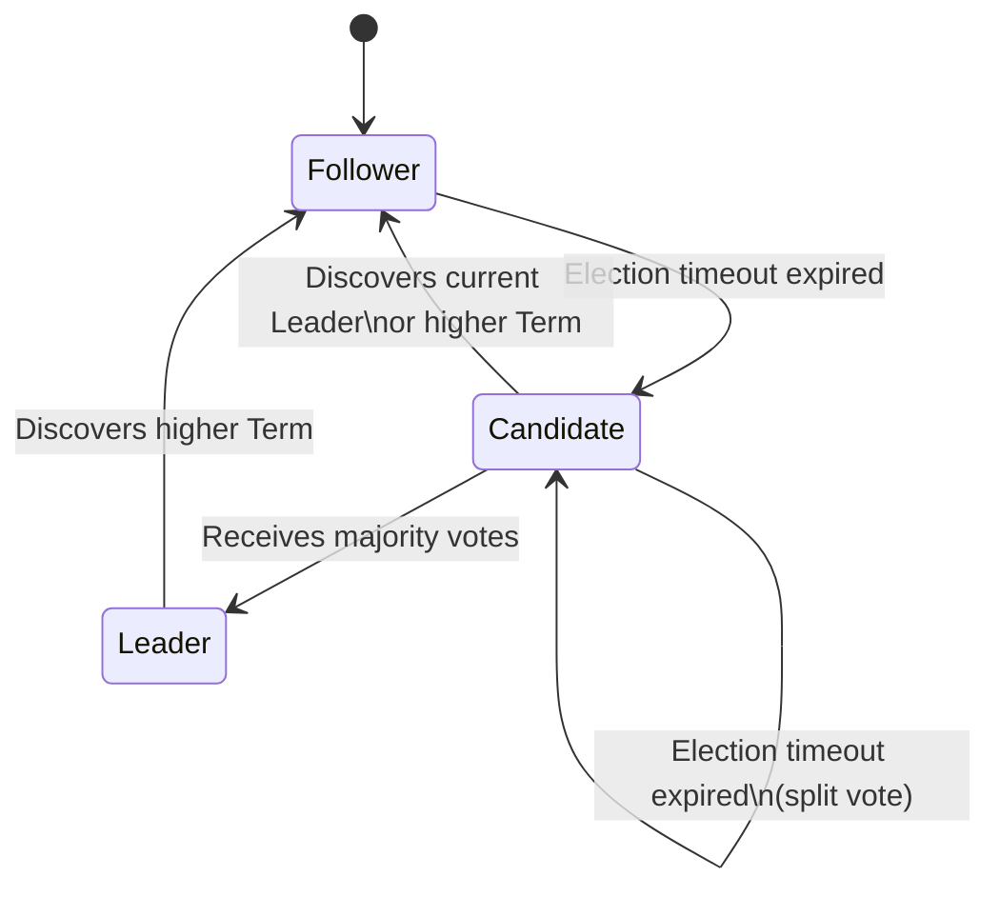
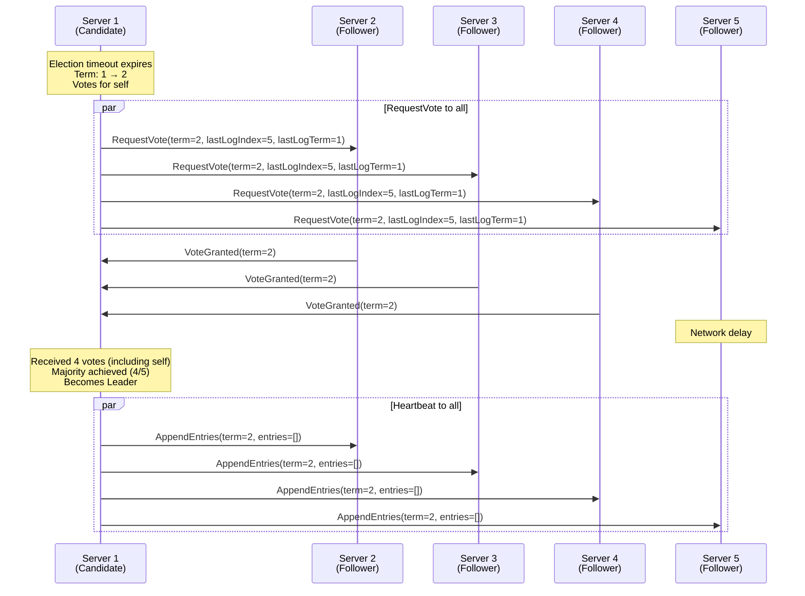
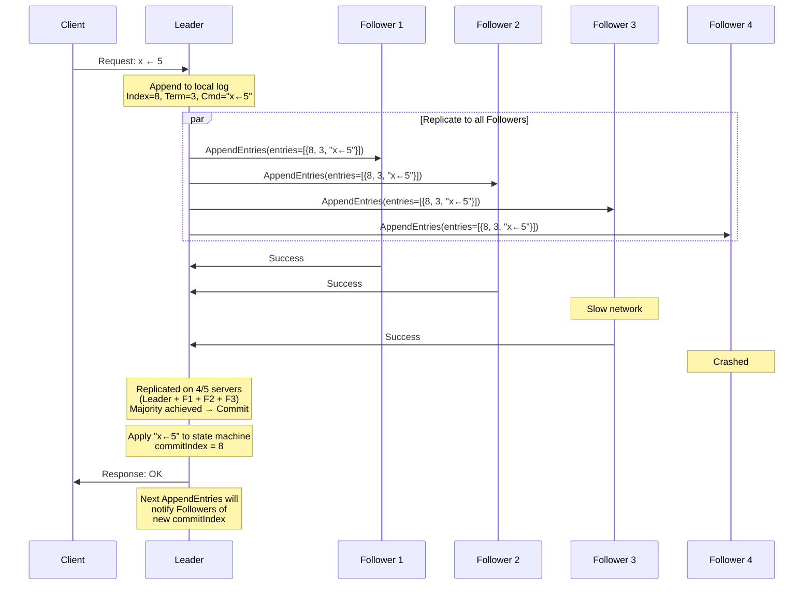
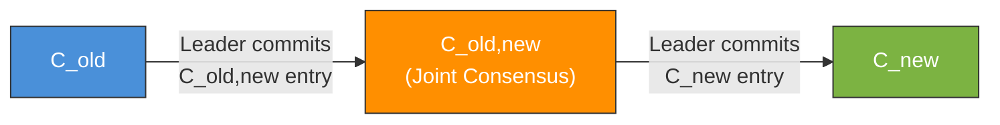
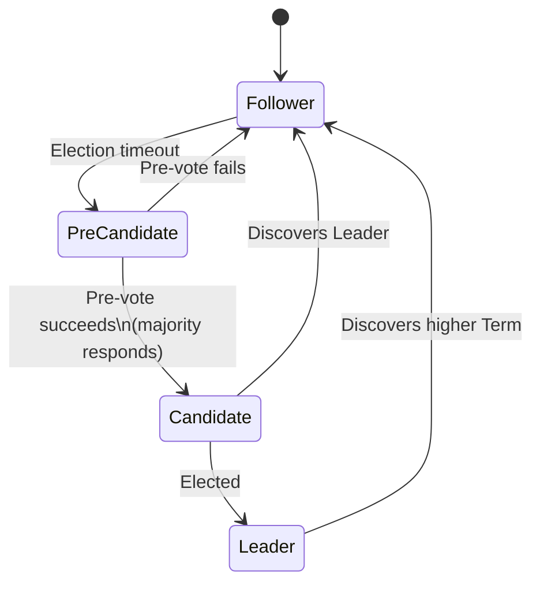

# Raftコンセンサス — 理解しやすさを重視した合意アルゴリズム

## 1. はじめに：なぜRaftが必要だったのか

分散システムにおいて、複数のノードが同じ状態を共有し、障害が発生しても一貫性を保ち続けることは根本的な課題である。この「合意（Consensus）」問題に対して、長年にわたりPaxosが理論的な標準解として君臨してきた。しかし、Paxosには実用上の深刻な問題があった。**理解が極めて困難である**ということだ。

Paxosの原論文はギリシャの架空の議会という比喩で記述され、2001年の簡略版「Paxos Made Simple」でさえ、多くの開発者やコンピューターサイエンスの学生にとって直感的に把握しにくいものであった。さらに深刻な問題として、Paxosは単一値の合意（Single-Decree Paxos）しか直接的に記述しておらず、実際のシステムで必要となる**複製ログ（Replicated Log）** の構築方法については、Multi-Paxosとして実装者の裁量に委ねられていた。結果として、Paxosを基盤にした実システムの実装はそれぞれが独自の解釈と拡張を行い、「Paxosを名乗りながらも実態は異なる」という状況が広がっていた。

2014年、スタンフォード大学のDiego OngaroとJohn Ousterhoutは、この状況を打破するために**Raft**を発表した。Raftの設計目標は、Paxosと同等の安全性と可用性を保ちつつ、**理解容易性（Understandability）** を最優先の設計原則とすることであった。

> "We believe that Raft is superior to Paxos and other consensus algorithms for educational purposes and as a foundation for implementation."
>
> — Diego Ongaro, John Ousterhout, "In Search of an Understandable Consensus Algorithm" (2014)

Raftの論文は、USENIX ATC 2014でBest Paperを受賞した。この受賞は、分散システムの研究コミュニティが「理解しやすさ」を技術的な貢献として正式に認めたことを意味している。

## 2. Raftの設計哲学

### 2.1 理解容易性の追求

Raftの設計において最も革新的なのは、アルゴリズムそのものの新規性ではなく、**問題の分解方法**である。Ongaroは博士論文の中で、Raftの設計プロセスにおいて以下の原則を一貫して適用したと述べている。

1. **問題の分解（Decomposition）**: 合意問題を、独立に理解・説明・実装できる複数のサブ問題に分割する
2. **状態空間の削減（State Space Reduction）**: 考慮すべき状態の数を減らし、システムの振る舞いを予測しやすくする

具体的に、Raftは合意問題を以下の3つの独立したサブ問題に分解した。

| サブ問題 | 内容 |
|----------|------|
| **Leader Election** | クラスタ内で1台のLeaderを選出する |
| **Log Replication** | Leaderがクライアントからのリクエストをログエントリとして受け取り、全ノードに複製する |
| **Safety** | いかなる障害パターンにおいても、一度コミットされたログエントリが失われないことを保証する |

この分解は、Paxosの対称的な設計とは根本的に異なる。Paxosではすべてのノードが対等な役割を持ちうるが、Raftは**強いリーダー（Strong Leader）** を中核に据えることで、データフローを単方向化し、推論を容易にしている。

### 2.2 強いリーダーモデル

Raftの最も顕著な設計選択は、**すべてのログエントリがLeaderからFollowerへの一方向にのみ流れる**という制約である。この設計により、以下のメリットが得られる。

- **データフローの単純化**: ログの複製方向が常にLeader → Followerであるため、競合の解決が不要
- **判断の集中**: クライアントリクエストの処理、ログの順序付け、コミットの判断がすべてLeaderに集約される
- **障害時の推論容易性**: Leaderが障害を起こした場合の挙動が明確に定義される

この設計はPaxosのMulti-Proposerモデルと比較すると柔軟性に欠けるが、理解と実装の容易さにおいて大きな優位性を持つ。

### 2.3 三つのサーバー状態

Raftでは、各サーバーは常に以下の3つの状態のいずれかにある。



| 状態 | 役割 |
|------|------|
| **Follower** | 受動的な状態。Leaderからの AppendEntries RPC やCandidateからの RequestVote RPC に応答するのみ |
| **Candidate** | Leader選出を試みている状態。自身への投票を他のサーバーに依頼する |
| **Leader** | クラスタのリーダー。クライアントリクエストの処理、ログの複製、ハートビートの送信を行う |

通常の運用では、クラスタにはちょうど1台のLeaderが存在し、残りのサーバーはすべてFollowerである。Candidateは選挙時にのみ出現する一時的な状態である。

## 3. Term（任期）の概念

### 3.1 論理時計としてのTerm

Raftは時間を**Term（任期）** と呼ばれる連番で区切る。Termは論理時計（Logical Clock）としての役割を果たし、Raftにおけるあらゆる操作の時間的な順序付けの基盤となる。

```
Term 1        Term 2        Term 3       Term 4         Term 5
|-- election --|-- election --|-- election --|             |-- election --|
|-- Leader S1 -|-- Leader S3 -| (no leader) |-- Leader S5 -|-- Leader S2 -|
|  normal      |  normal      | split vote   |  normal      |  normal      |
|  operation   |  operation   |              |  operation   |  operation   |
```

各Termは**選挙**によって開始される。選挙が成功すれば、選出されたLeaderがそのTerm中クラスタを管理する。選挙がSplit Vote（票の分裂）により失敗した場合、そのTermはLeaderが存在しないまま終了し、次のTermの選挙へ移行する。

### 3.2 Termのルール

Termは以下のルールに従って運用される。

1. **各サーバーは現在のTerm番号を永続ストレージに保存する**
2. サーバー間の通信（すべてのRPC）にはTerm番号が含まれる
3. 受信したRPCのTerm番号が自身のTermより大きい場合、自身のTermを更新し、**直ちにFollowerに遷移する**
4. 受信したRPCのTerm番号が自身のTermより小さい場合、そのRPCを**拒否する**

このルール3は特に重要である。これにより、古いLeader（Network Partitionから復帰した場合など）が自動的に退位し、クラスタ内のTermの単調増加性が保証される。

### 3.3 永続化が必要な状態

Raftの正しさを保証するために、以下の3つの状態はRPCに応答する**前に**永続ストレージに書き込む必要がある。

| 状態 | 説明 |
|------|------|
| `currentTerm` | サーバーが認識している最新のTerm番号 |
| `votedFor` | 現在のTermで投票した候補者のID（未投票なら null） |
| `log[]` | ログエントリの配列 |

これらを永続化することで、サーバーがクラッシュ後に再起動した場合でも、同一Termで二重に投票したり、コミット済みのログエントリを失ったりすることを防止する。

## 4. リーダー選出（Leader Election）

### 4.1 選挙のトリガー

Raftのリーダー選出は**タイムアウト駆動**で開始される。各Followerは**Election Timeout**と呼ばれるタイマーを持ち、この間にLeaderからのAppendEntries RPC（ハートビートを含む）を受信しなかった場合、Leaderに障害が発生したと判断し、選挙を開始する。

Election Timeoutは、各サーバーが異なる値を持つように**ランダム化**される（典型的には150ms〜300msの範囲）。このランダム化は、複数のFollowerが同時に選挙を開始してSplit Voteが発生する確率を低減するための重要な設計である。

### 4.2 選挙プロセスの詳細

選挙は以下の手順で進行する。

1. FollowerがElection Timeoutの満了を検知する
2. 自身のTermをインクリメントし、状態をCandidateに遷移する
3. **自身に投票する**（`votedFor` を自分自身に設定）
4. クラスタ内の他のすべてのサーバーに `RequestVote` RPCを送信する
5. 以下のいずれかが発生するまで待機する:
   - **過半数の投票を獲得**: Leaderに遷移し、直ちにハートビートを送信
   - **他のLeaderからのAppendEntriesを受信**: そのLeaderのTermが自身以上であればFollowerに遷移
   - **Election Timeoutの再度満了**: Termをさらにインクリメントして新たな選挙を開始



### 4.3 RequestVote RPCの仕様

RequestVote RPCは以下のフィールドで構成される。

**リクエスト:**

| フィールド | 型 | 説明 |
|-----------|-----|------|
| `term` | int | Candidateの現在のTerm |
| `candidateId` | int | 投票を要求しているCandidateのID |
| `lastLogIndex` | int | Candidateのログの最後のエントリのインデックス |
| `lastLogTerm` | int | Candidateのログの最後のエントリのTerm |

**レスポンス:**

| フィールド | 型 | 説明 |
|-----------|-----|------|
| `term` | int | 応答側の現在のTerm（Candidateが自身のTermを更新するために使用） |
| `voteGranted` | bool | Candidateへの投票が認められたか |

**投票のルール:**

サーバーは以下の条件をすべて満たす場合にのみ投票する。

1. RequestVoteのTermが自身のTerm以上である
2. 自身が現在のTermでまだ投票していない、または既に同じCandidateに投票している
3. Candidateのログが自身のログと同等以上に「最新」である（**Election Restriction**）

条件3の「最新」の比較は以下のルールで行われる。

- ログの最後のエントリのTermが異なる場合、**Termが大きい方がより最新**
- ログの最後のエントリのTermが同じ場合、**ログが長い方がより最新**

このElection Restrictionは、Raftの安全性の根幹をなす制約であり、**コミット済みのエントリを持たないサーバーがLeaderに選出されることを防ぐ**。

### 4.4 Split Voteの処理

5台構成のクラスタで、Server 2とServer 4が同時にCandidateとなった場合を考える。

```
Server 1: votes for Server 2  →  Server 2 gets 2 votes (self + S1)
Server 2: votes for self (Candidate)
Server 3: votes for Server 4  →  Server 4 gets 2 votes (self + S3)
Server 4: votes for self (Candidate)
Server 5: votes for Server 2  →  Server 2 gets 3 votes → Leader!
```

上記のように、どちらかのCandidateが過半数を獲得できればLeaderが選出される。しかし、以下のような状況では過半数を獲得できない。

```
Server 1: votes for Server 2  →  Server 2 gets 2 votes
Server 2: votes for self (Candidate)
Server 3: votes for Server 4  →  Server 4 gets 2 votes
Server 4: votes for self (Candidate)
Server 5: (crashed or slow)
```

この場合、Election Timeoutが満了し、新たなTermで再選挙が行われる。**Election Timeoutのランダム化**により、次の選挙では1台のCandidateが先に選挙を開始する確率が高く、Split Voteの連続発生は実用上きわめて稀である。

## 5. ログレプリケーション（Log Replication）

### 5.1 ログの構造

Raftの複製ログは、順序付けられたログエントリの列として構成される。各ログエントリは以下の情報を含む。

| フィールド | 説明 |
|-----------|------|
| **Index** | ログ内の位置（1から始まる連番） |
| **Term** | そのエントリがLeaderによって作成されたときのTerm番号 |
| **Command** | 状態マシンに適用するコマンド（クライアントからのリクエスト内容） |

```
Index:  1      2      3      4      5      6      7      8
Term:   1      1      1      2      3      3      3      3
Cmd:   x←3   y←1   x←9   y←2   x←0   y←7   x←5   z←4

                                         ↑
                                    commitIndex = 6
                                  (entries 1-6 are committed)
```

ログエントリが**コミットされた（committed）** とは、そのエントリがクラスタの過半数のサーバーに複製された状態を指す。コミットされたエントリは安全に状態マシンに適用でき、クライアントに結果を返すことができる。

### 5.2 ログレプリケーションのプロセス

Leaderがクライアントからリクエストを受けてからレスポンスを返すまでの流れは以下のとおりである。



1. クライアントがLeaderにリクエストを送信する
2. Leaderはリクエストをログエントリとしてローカルログに追加する
3. Leaderは `AppendEntries` RPCを全Followerに並行して送信する
4. 過半数のサーバー（Leader自身を含む）がエントリを永続化した時点で、Leaderはそのエントリをコミット済みとみなす
5. Leaderはコミット済みエントリを状態マシンに適用し、クライアントにレスポンスを返す
6. 後続のAppendEntries RPCで、LeaderのcommitIndexがFollowerに通知され、Followerも該当エントリを状態マシンに適用する

### 5.3 AppendEntries RPCの仕様

AppendEntries RPCはログレプリケーションとハートビートの両方に使用される。ハートビートはエントリを含まないAppendEntries RPCである。

**リクエスト:**

| フィールド | 型 | 説明 |
|-----------|-----|------|
| `term` | int | LeaderのTerm |
| `leaderId` | int | FollowerがクライアントをLeaderにリダイレクトするために使用 |
| `prevLogIndex` | int | 新しいエントリの直前のログエントリのインデックス |
| `prevLogTerm` | int | `prevLogIndex` のエントリのTerm |
| `entries[]` | LogEntry[] | 保存するログエントリ（ハートビートの場合は空） |
| `leaderCommit` | int | LeaderのcommitIndex |

**レスポンス:**

| フィールド | 型 | 説明 |
|-----------|-----|------|
| `term` | int | 応答側の現在のTerm |
| `success` | bool | `prevLogIndex` と `prevLogTerm` に一致するエントリが存在する場合にtrue |

### 5.4 ログの一貫性保証

Raftは以下の**Log Matching Property**を保証する。

> 1. 2つのログエントリが同じIndexとTermを持つ場合、それらは同じコマンドを格納している
> 2. 2つのログエントリが同じIndexとTermを持つ場合、それ以前のすべてのエントリも一致している

性質1は、Leaderが所与のTermの所与のIndexに対してたかだか1つのエントリしか作成しないこと、およびログエントリの位置が変わらないことから保証される。

性質2は、AppendEntries RPCの**一貫性チェック**によって帰納的に保証される。AppendEntries RPCを送信する際、Leaderは新しいエントリの直前のエントリのIndexとTermを含める（`prevLogIndex` と `prevLogTerm`）。Followerは、自身のログ内でこのIndex/Termの組に一致するエントリを見つけられない場合、RPCを拒否する。

### 5.5 ログの不整合と修復

Leader交代が繰り返されると、Followerのログがleaderのログと不整合を起こすことがある。以下に不整合のパターンを示す。

```
Leader (Term 8):
  Index: 1  2  3  4  5  6  7  8  9  10 11 12
  Term:  1  1  1  4  4  5  5  6  6   6  8  8

Follower A (missing entries):
  Index: 1  2  3  4  5  6  7  8  9  10 11
  Term:  1  1  1  4  4  5  5  6  6   6  8

Follower B (missing entries):
  Index: 1  2  3  4  5  6  7  8  9
  Term:  1  1  1  4  4  5  5  6  6

Follower C (extra uncommitted entries):
  Index: 1  2  3  4  5  6  7  8  9  10 11 12
  Term:  1  1  1  4  4  5  5  6  6   6  7  7

Follower D (extra uncommitted entries from different Term):
  Index: 1  2  3  4  5  6  7  8  9  10 11 12 13
  Term:  1  1  1  4  4  5  5  6  6   6  7  7  7
```

Raftでは、Leaderは各Followerに対して `nextIndex` という値を保持する。これはLeaderがそのFollowerに次に送信すべきログエントリのインデックスを示す。Leaderが選出された直後、すべての `nextIndex` はLeaderのログの末尾 + 1に初期化される。

不整合の修復は以下のように行われる。

1. LeaderがAppendEntries RPCを送信する（`prevLogIndex = nextIndex - 1`）
2. Followerが一貫性チェックに失敗し、RPCを拒否する
3. Leaderは `nextIndex` をデクリメントし、再度AppendEntries RPCを送信する
4. これを繰り返し、Followerのログと一致する点が見つかるまで遡る
5. 一致する点が見つかったら、Followerはその点以降のエントリをLeaderのエントリで上書きする

::: tip 最適化：高速バックトラック
上記の「1エントリずつデクリメント」するアプローチは単純だが、ログの差異が大きい場合に非効率である。実装上の最適化として、Followerが拒否レスポンスに「競合するエントリのTerm」と「そのTermの最初のIndex」を含めることで、Leaderはまとめて遡ることができる。これにより、バックトラックの回数はTermの差異の数まで削減される。
:::

## 6. 安全性の保証（Safety Properties）

Raftは以下の安全性プロパティを保証する。これらは任意の障害パターン（ネットワーク分断、サーバークラッシュ、メッセージ遅延・消失）において成立する。

### 6.1 五つの安全性プロパティ

| プロパティ | 内容 |
|-----------|------|
| **Election Safety** | 各Termにおいて、たかだか1台のLeaderが選出される |
| **Leader Append-Only** | Leaderは自身のログにエントリを追加するのみで、既存のエントリを上書き・削除しない |
| **Log Matching** | 2つのログが同じIndex・Termのエントリを含む場合、そのIndexまでのすべてのエントリが一致する |
| **Leader Completeness** | あるTermでコミットされたログエントリは、それ以降のすべてのTermのLeaderのログに含まれる |
| **State Machine Safety** | あるサーバーが所与のIndexのログエントリを状態マシンに適用した場合、他のサーバーが同じIndexに異なるログエントリを適用することはない |

### 6.2 Election Safety

Election Safetyは、以下の2つのメカニズムによって保証される。

1. **各サーバーは所与のTermにおいて1票しか投票しない**（`votedFor` を永続化することで、クラッシュ後も保証される）
2. **Leaderとなるためには過半数の投票が必要**

過半数の集合は必ず重複するため（Quorum Intersection Property）、同一Term内で2台以上のサーバーが過半数の投票を獲得することは数学的に不可能である。

### 6.3 Leader Completeness Property

Leader Completenessは、Raftの安全性の中で最も重要なプロパティであり、**Election Restriction**によって保証される。この制約を改めて整理すると以下のようになる。

RequestVoteを受信したサーバーは、Candidateのログが自身のログと同等以上に最新でない場合、投票を拒否する。「最新」の比較ルールは以下のとおりである。

1. 最後のログエントリのTermが異なる場合、Termが大きい方がより最新
2. Termが同じ場合、ログが長い方がより最新

**なぜこれでLeader Completenessが保証されるのか。** コミット済みのエントリは定義上、過半数のサーバーに存在する。新たなLeaderは過半数の投票を必要とする。過半数の集合は必ず重複するため、新しいLeaderに投票したサーバーの中に、コミット済みのエントリを持つサーバーが少なくとも1台存在する。Election Restrictionにより、そのサーバーよりもログが古いCandidateは投票を得られない。したがって、新しいLeaderは必ずすべてのコミット済みエントリを持っている。

### 6.4 コミットに関する微妙な問題

Raftには、**前のTermで作成されたログエントリのコミット**に関する微妙だが重要な制約がある。Leaderは、**現在のTermのエントリが過半数に複製された場合にのみ、そのエントリ以前のすべてのエントリをコミット済みとみなせる**。前のTermのエントリが過半数に複製されただけでは、そのエントリを直接コミットしてはならない。

この制約が必要な理由を、以下の具体例で示す。

```
Time →

(a) S1 is Leader (Term 2), replicates index 2 to S2

  S1: [1₁][2₂]          ← Leader
  S2: [1₁][2₂]
  S3: [1₁]
  S4: [1₁]
  S5: [1₁]

(b) S1 crashes, S5 is elected Leader (Term 3)
    S5 gets votes from S3, S4, and itself
    S5 receives a client request

  S1: [1₁][2₂]          (crashed)
  S2: [1₁][2₂]
  S3: [1₁]
  S4: [1₁]
  S5: [1₁][3₃]          ← Leader

(c) S5 crashes, S1 restarts, is elected Leader (Term 4)
    S1 replicates index 2 (Term 2) to S3
    Index 2 is now on majority (S1, S2, S3)

  S1: [1₁][2₂]          ← Leader
  S2: [1₁][2₂]
  S3: [1₁][2₂]          ← replicated
  S4: [1₁]
  S5: [1₁][3₃]          (crashed)

(d1) DANGER: If S1 commits index 2 based on majority replication,
     then crashes, S5 could become Leader (Term 5, votes from S3,S4,S5)
     and overwrite index 2 with Term 3 entry → VIOLATION

(d2) CORRECT: S1 should first replicate a Term 4 entry (index 3),
     and only then consider both index 2 and 3 as committed

  S1: [1₁][2₂][4₄]      ← Leader, appends new entry
  S2: [1₁][2₂][4₄]
  S3: [1₁][2₂][4₄]      ← majority for index 3
  S4: [1₁]
  S5: [1₁][3₃]          (crashed)
```

(d2)の状態であれば、S5がLeaderに選出されることはない。なぜなら、S1、S2、S3のいずれもTerm 4のエントリを持っており、S5のログ（最後のTerm = 3）よりも最新であるため、S5に投票しないからである。

この制約は一見すると制限的に思えるが、Leaderは通常の運用でクライアントリクエストを処理しているため、現在のTermのエントリが自然に生成され、実用上の問題にはならない。Leaderが起動直後にコミットを確定したい場合は、**no-op（空の操作）** エントリをログに追加して複製することで対処できる。

## 7. メンバーシップ変更（Cluster Membership Changes）

### 7.1 動的なメンバーシップ変更の課題

実運用環境では、クラスタのメンバー構成を変更する必要がしばしば生じる。故障したサーバーの交換、クラスタサイズの拡張・縮小、ハードウェアのアップグレードなどである。

素朴なアプローチとして、クラスタを一度停止し、設定を変更し、再起動するという方法がある。しかし、これはダウンタイムを伴い、操作ミスのリスクもある。Raftは**ダウンタイムなしで安全にメンバーシップ変更を行う**メカニズムを提供する。

### 7.2 直接切り替えの危険性

古い構成（$C_\text{old}$）から新しい構成（$C_\text{new}$）へ直接切り替えると、**同一Termで2台のLeaderが選出される可能性**がある。

```
                    Time →
             ┌─────────────────────┐
Server 1  ───┤    C_old            ├──────────────
             └─────────────────────┘
             ┌─────────────────────┐
Server 2  ───┤    C_old            ├──────────────
             └─────────────────────┘
             ┌──────────────────────────────────┐
Server 3  ───┤         C_new                    ├─
             └──────────────────────────────────┘
             ┌──────────────────────────────────┐
Server 4  ───┤         C_new                    ├─
             └──────────────────────────────────┘
             ┌──────────────────────────────────┐
Server 5  ───┤         C_new                    ├─
             └──────────────────────────────────┘
```

上記の状況で、Server 1とServer 2がまだ $C_\text{old}$ を使用しており、$C_\text{old}$ = {S1, S2, S3} の過半数で Server 1 がLeaderとなる。同時に、Server 3、4、5が $C_\text{new}$ = {S1, S2, S3, S4, S5} を使用しており、$C_\text{new}$ の過半数で Server 3 がLeaderとなる。こうして同一Termで2台のLeaderが存在する事態が発生する。

### 7.3 Joint Consensus

Raftの論文では、この問題を**Joint Consensus（共同合意）** と呼ばれる2段階のアプローチで解決する。



1. **$C_\text{old,new}$（Joint Consensus）への遷移**: Leaderは $C_\text{old,new}$ という特殊な設定エントリをログに追加し、複製する。$C_\text{old,new}$ の期間中、合意（選挙およびログコミット）には $C_\text{old}$ と $C_\text{new}$ の**両方の過半数**が必要となる

2. **$C_\text{new}$ への遷移**: $C_\text{old,new}$ がコミットされた後、Leaderは $C_\text{new}$ の設定エントリをログに追加し、複製する。$C_\text{new}$ がコミットされた時点で、移行は完了する

この方法により、$C_\text{old}$ と $C_\text{new}$ のいずれかのみで独立にLeaderが選出される状況を防止できる。

### 7.4 Single-Server変更（実用的アプローチ）

Joint Consensusは正確だが複雑である。実用上は、**一度に1台ずつサーバーを追加・削除する**というSimpler approachが広く採用されている。この方法が安全である理由は、1台の変更では $C_\text{old}$ の過半数と $C_\text{new}$ の過半数が必ず重複するため、2台のLeaderが同時に存在する状況が生じないことにある。

例えば、3台クラスタに1台追加する場合を考える。

- $C_\text{old}$ = {A, B, C}、過半数 = 2台
- $C_\text{new}$ = {A, B, C, D}、過半数 = 3台

$C_\text{old}$ の過半数（2台）と $C_\text{new}$ の過半数（3台）の合計は5台だが、サーバーは4台しかない。したがって、両方の過半数に属するサーバーが必ず存在し、同一Termで2台のLeaderが選出されることはない。

## 8. スナップショットとログコンパクション

### 8.1 ログの無限増大問題

Raftのログは運用が続く限り増大し続ける。メモリとストレージの消費が際限なく増加するだけでなく、サーバーの再起動時にログ全体を再生する必要があるため、復旧時間も増大する。ログコンパクションは、この問題に対処するための不可欠なメカニズムである。

### 8.2 スナップショットの仕組み

Raftの最も一般的なログコンパクション手法は**スナップショット**である。各サーバーは独立にスナップショットを取得する。

```
Before snapshot:
┌─────────────────────────────────────────────────────┐
│ Log: [1₁][2₁][3₁][4₂][5₃][6₃][7₃][8₃][9₃][10₃]  │
│                                                     │
│ State machine: {x=0, y=9, z=4}                     │
│ lastApplied = 10                                    │
└─────────────────────────────────────────────────────┘

After snapshot (at index 5):
┌──────────────────────────────────────────────────────┐
│ Snapshot:                                            │
│   lastIncludedIndex = 5                              │
│   lastIncludedTerm  = 3                              │
│   State: {x=0, y=1}     ← state at index 5          │
│                                                      │
│ Remaining log: [6₃][7₃][8₃][9₃][10₃]               │
│                                                      │
│ State machine: {x=0, y=9, z=4}                      │
│ lastApplied = 10                                     │
└──────────────────────────────────────────────────────┘
```

スナップショットには以下の情報が含まれる。

| フィールド | 説明 |
|-----------|------|
| `lastIncludedIndex` | スナップショットが包含する最後のログエントリのIndex |
| `lastIncludedTerm` | そのエントリのTerm |
| `State data` | スナップショット時点の状態マシンの完全な状態 |

スナップショットの取得後、`lastIncludedIndex` 以前のログエントリは安全に破棄できる。

### 8.3 InstallSnapshot RPC

通常、各サーバーは独立にスナップショットを取得する。しかし、Followerが大幅に遅れている場合（長時間のクラッシュやネットワーク障害からの復帰時）、Leaderが既に破棄したログエントリをFollowerが必要とする状況が発生する。この場合、LeaderはAppendEntries RPCの代わりに `InstallSnapshot` RPCを送信する。

**リクエスト:**

| フィールド | 型 | 説明 |
|-----------|-----|------|
| `term` | int | LeaderのTerm |
| `leaderId` | int | LeaderのID |
| `lastIncludedIndex` | int | スナップショットの最後のエントリのIndex |
| `lastIncludedTerm` | int | スナップショットの最後のエントリのTerm |
| `offset` | int | スナップショットデータのチャンク内のバイトオフセット |
| `data[]` | byte[] | スナップショットのチャンクデータ |
| `done` | bool | 最後のチャンクかどうか |

Followerは、スナップショットを受信すると、以下の手順で処理する。

1. スナップショットの `lastIncludedIndex` と `lastIncludedTerm` に一致するエントリが自身のログに存在する場合、そのエントリ以降のログを保持し、スナップショットの前のエントリのみを破棄する
2. 一致するエントリが存在しない場合、ログ全体を破棄し、スナップショットの状態で状態マシンをリセットする

## 9. 実装上の考慮事項

### 9.1 リーダーリース（Leader Lease）

Raftの標準的な実装では、クライアントからの読み取りリクエストもLeaderが処理する必要がある。しかし、Leaderが自身のLeadership状態を確認するためにQuorumにアクセスすると、読み取りのレイテンシが増大する。

**リーダーリース**は、この問題に対処するための最適化である。Leaderは、ハートビートの応答を受け取った時点から一定時間（Election Timeoutよりも短い時間）は、自身がまだLeaderであるとみなして読み取りリクエストを直接処理する。

```
Timeline:
  ├── Heartbeat sent ──── Heartbeat responses received ──┤
  │                                                       │
  │←──────── Lease period (< election timeout) ──────────→│
  │                                                       │
  │   During this period, Leader can serve reads           │
  │   without contacting the quorum                       │
```

::: warning リーダーリースの前提条件
リーダーリースは**時計の精度**に依存する。Leaderのリース期間がFollowerのElection Timeoutよりも短いことを前提としているため、時計のスキューが大きい環境では安全性が損なわれる可能性がある。CockroachDBのようなシステムでは、この問題に対処するためにHLC（Hybrid Logical Clocks）と組み合わせた洗練されたリーダーリース機構を実装している。
:::

### 9.2 ReadIndex

リーダーリースの時計依存性を回避するためのアプローチとして、**ReadIndex**がある。ReadIndexの手順は以下のとおりである。

1. Leaderは現在のcommitIndexを記録する（これがReadIndex）
2. Leaderはハートビートを送信し、過半数からの応答を得て、自身がまだLeaderであることを確認する
3. ReadIndexまでのエントリが状態マシンに適用されるのを待つ
4. 読み取りクエリを実行して結果を返す

ReadIndexはリーダーリースよりもレイテンシが増加するが、時計に依存しないため、安全性が確実に保証される。etcdではこの手法がデフォルトで使用されている。

### 9.3 Pre-Vote

**Pre-Vote**は、ネットワーク分断から復帰したサーバーが不必要にTermを増加させ、クラスタの安定性を損なう問題を防止するための拡張である。

通常のRaftでは、ネットワークから分離されたサーバーはElection Timeoutが繰り返し発生し、Termを際限なくインクリメントする。このサーバーがネットワークに復帰すると、高いTermを持つRPCによって現在のLeaderがFollowerに降格し、不必要な選挙が発生する。

Pre-Voteでは、Candidateが実際の選挙を開始する前に、**Pre-Vote（事前投票）フェーズ**を実施する。

1. サーバーはTermをインクリメントせずに、`PreVote` RPCを送信する
2. 他のサーバーは、そのCandidateがLeaderになり得る場合（ログが十分に最新であり、かつ自身がLeaderからのハートビートを受信していない場合）にのみ、Pre-Voteに応答する
3. Pre-Voteで過半数の同意を得た場合にのみ、実際の選挙を開始する



この拡張により、ネットワーク分断から復帰したサーバーはPre-Voteの段階で拒否されるため、クラスタの安定性が維持される。Pre-Voteは Raft の論文の博士論文版（Diego Ongaro, 2014）で提案され、etcdやTiKVなど多くの実装で採用されている。

### 9.4 バッチングとパイプライニング

高スループットを実現するために、実装では以下の最適化が一般的に採用される。

**バッチング（Batching）**: 複数のクライアントリクエストを1つのAppendEntries RPCにまとめて送信する。これにより、RPCのオーバーヘッドとfsyncの回数を削減する。

**パイプライニング（Pipelining）**: Leaderは前のAppendEntries RPCの応答を待たずに、次のAppendEntries RPCを送信する。各RPCには正しい `prevLogIndex` と `prevLogTerm` を含めるため、Follower側で順序の検証は可能である。

### 9.5 Follower/Learnerの読み取り

読み取り負荷を分散するために、Followerに読み取りリクエストを処理させるアプローチもある。ただし、Followerのデータは最新でない可能性があるため、**Stale Read（古いデータの読み取り）** を許容するか、Leaderに現在のcommitIndexを問い合わせた上で読み取りを行う必要がある。

TiKVではFollower Read機能を提供しており、Followerがクライアントリクエストを受信した際にLeaderからReadIndexを取得し、そのIndexまでの適用が完了した後に読み取りを実行する仕組みになっている。

## 10. 実世界での採用例

Raftは発表以来、多くの産業用分散システムに採用されてきた。その主要な例を以下に示す。

### 10.1 etcd

etcdはKubernetesのバックエンドとして広く使用されている分散Key-Valueストアであり、Raftの最も著名な採用例の一つである。etcdのRaft実装はGo言語で書かれており、以下の特徴を持つ。

- ライブラリとしてのRaft実装（`go.etcd.io/raft`）を分離し、他のプロジェクトからも利用可能
- ReadIndex、Pre-Vote、Leader Transfer（リーダーの明示的な移譲）などの拡張を実装
- Learnerロール（投票権を持たないFollower）のサポート

### 10.2 CockroachDB

CockroachDBはNewSQLデータベースであり、データの各レンジ（約512MB）ごとにRaftグループを構成する。CockroachDBの特徴は以下のとおりである。

- **Multi-Raft**: 数万〜数百万のRaftグループを効率的に管理するための最適化
- **Epoch-Based Lease**: リーダーリースにEpoch（Leadershipの世代番号）を用いることで、時計への依存を軽減
- **Raft上のトランザクション**: 分散トランザクションの基盤としてRaftを使用

### 10.3 TiKV

TiKVはTiDBの分散ストレージ層であり、Rust言語で実装されたRaftをコアに据えている。

- **Multi-Raft**: CockroachDB同様、データのRegionごとにRaftグループを管理
- **Raft Engine**: Raft専用のWAL実装による高効率な永続化
- **Follower Read**: 読み取り負荷の分散
- **Joint Consensus**: メンバーシップ変更にJoint Consensusを完全実装

### 10.4 Consul / HashiCorp Raft

HashiCorpのConsul（サービスディスカバリとKVストア）はRaftを使用しており、その実装は`hashicorp/raft`ライブラリとして公開されている。このライブラリはNomad、Vaultなど、HashiCorpの他の製品でも使用されている。

### 10.5 その他の採用例

| システム | 用途 | 言語 |
|---------|------|------|
| **ScyllaDB** | 高性能NoSQLデータベースのメタデータ管理 | C++ |
| **RethinkDB** | リアルタイムデータベース | C++ |
| **Neo4j** (Causal Cluster) | グラフデータベースのクラスタリング | Java |
| **ClickHouse** (Keeper) | ZooKeeper互換のコーディネーション | C++ |
| **Dqlite** | 分散SQLite | C/Go |

## 11. Paxosとの比較

RaftとPaxosは同じ合意問題を解決するアルゴリズムであるが、設計思想が大きく異なる。両者の違いを整理する。

### 11.1 構造的な違い

| 観点 | Paxos | Raft |
|------|-------|------|
| **リーダーの役割** | Proposerとして動作するが、リーダーシップは暗黙的 | 明示的なLeaderが必須、すべてのデータフローがLeader経由 |
| **ログの順序** | ログのスロットが独立に合意される（Multi-Paxos）。順序の穴（gap）が生じうる | ログエントリは連続的に追加される。穴が生じない |
| **メンバーシップ変更** | 原論文では未定義、後続の研究で複数の方法が提案 | Joint ConsensusまたはSingle-Server変更が論文で定義 |
| **スナップショット** | 原論文では未定義 | 論文で定義 |
| **理解容易性** | 難解と広く認識されている | 理解容易性を最優先に設計 |

### 11.2 性能特性の違い

理論的な性能上限としては、PaxosとRaftは同等である。ともに過半数のノードの永続化を待つ必要があり、ネットワークのラウンドトリップ数も同等（Leaderベースの運用では2回）である。

しかし、実用上の違いが存在する。

- **Paxos（Multi-Paxos）のログの穴**: Multi-Paxosでは、ログのスロットが独立に合意されるため、スロット間の順序関係が保証されない。これは並行性を高めるが、状態マシンへの適用順序を管理する実装上の複雑さが増す
- **Raftの連続的なログ**: Raftではログエントリが連続的に追加されるため、コミットの判定が単純（commitIndexの比較のみ）だが、Leader上でのリクエスト処理がシリアライズされる傾向がある

### 11.3 Raftの強みと弱み

**Raftの強み:**

- 理解しやすく、正しい実装を書きやすい
- 論文がシステム構築に必要な詳細（メンバーシップ変更、スナップショットなど）を包括的に記述している
- 多数の産業用実装が存在し、実績が豊富
- 教育教材としてのビジュアライゼーション（[raft.github.io](https://raft.github.io/) のインタラクティブデモなど）が充実している

**Raftの弱み:**

- 強いリーダーモデルはLeaderへの負荷集中を招く。特に読み取りワークロードの分散にはReadIndexやFollower Readなどの追加メカニズムが必要
- Leaderの交代時にクライアントリクエストが一時的にブロックされる（Election Timeoutの間）
- Multi-Raftパターン（TiKV、CockroachDBなど）では、多数のRaftグループの管理オーバーヘッドが生じる

## 12. 限界と今後の展望

### 12.1 Raftの本質的な限界

**レイテンシの下限**: Raftはクライアントリクエストのコミットに最低1回のラウンドトリップ（Leader → Followers → Leader）を必要とする。地理的に分散されたクラスタでは、このラウンドトリップのレイテンシが性能のボトルネックとなる。

**Leaderの単一障害点**: Raftでは、Leader障害時にElection Timeout（一般的には数百ミリ秒）の間、クラスタが書き込みリクエストを処理できなくなる。この可用性のギャップは、多くのアプリケーションにとって許容範囲内であるが、極めて高い可用性を要求するシステムでは課題となりうる。

**ビザンチン障害への非対応**: Raftはクラッシュ故障モデルを前提としており、悪意あるノードの存在には対応しない。ブロックチェーンのような信頼できないネットワーク環境では、PBFT（Practical Byzantine Fault Tolerance）やHotstuffなどのビザンチン耐性を持つ合意アルゴリズムが必要となる。

### 12.2 近年の発展

**Flexible Paxos / Flexible Raft**: Howard et al. (2016) は、Quorumの構成に柔軟性を持たせる手法を提案した。従来の「選挙Quorum = コミットQuorum = 過半数」という制約を緩和し、「選挙Quorumとコミットquorumの和がサーバー数を超えればよい」とする。これにより、コミットのレイテンシを削減するためにコミットQuorumを小さくし、代わりに選挙Quorumを大きくするといったトレードオフが可能になる。

**MultiRaft の最適化**: TiKVやCockroachDBで採用されているMultiRaftパターンでは、大量のRaftグループの効率的な管理が重要な研究課題である。ハートビートの集約、Raftメッセージのバッチング、ストレージI/Oの共有化などの最適化が進められている。

**Leaderless Raft（EPaxos系）**: Leaderのボトルネックを解消するために、Leaderを持たない合意プロトコル（EPaxos, Atlas, Tempo等）の研究が進んでいる。これらはRaftの理解容易性とPaxosの柔軟性のバランスを追求するものである。

**形式検証**: TLA+によるRaftの形式的な仕様記述（Ongaro自身が公開）を基に、モデル検査や定理証明によるRaft実装の正しさの検証が進められている。Verdi（Coqによる検証済みRaft実装）やIronFleet（Dafny/Z3による検証済み分散システム）などが、この方向での成果である。

### 12.3 Raftの遺産

Raftが分散システムの分野に残した最も大きな遺産は、アルゴリズムそのものではなく、**「理解容易性は技術的に価値のある設計目標である」** という認識を確立したことかもしれない。Paxosの発表から四半世紀、合意アルゴリズムは理論的な専門知識を持つ少数の研究者の領域であった。Raftの登場により、分散合意は多くのソフトウェアエンジニアが理解し、実装できるものとなった。

Ongaroは論文の中で以下のように述べている。

> "We believe that the significance of Raft lies not in its novelty but in the fact that it demonstrates that consensus can be made understandable."
>
> （Raftの意義は新規性にあるのではなく、合意が理解可能なものになりうることを示した点にある。）

この設計哲学は、分散システムに限らず、ソフトウェアエンジニアリング全般における重要な教訓を含んでいる。複雑なシステムを構築する際、「正しさ」と「理解しやすさ」は対立するものではなく、理解しやすい設計こそが正しい実装を可能にするのである。

## 参考文献

1. Diego Ongaro and John Ousterhout. "In Search of an Understandable Consensus Algorithm." *USENIX ATC*, 2014.
2. Diego Ongaro. "Consensus: Bridging Theory and Practice." Ph.D. dissertation, Stanford University, 2014.
3. Leslie Lamport. "Paxos Made Simple." *ACM SIGACT News*, 2001.
4. Heidi Howard, Dahlia Malkhi, and Alexander Spiegelman. "Flexible Paxos: Quorum Intersection Revisited." *OPODIS*, 2016.
5. The Raft Consensus Algorithm. https://raft.github.io/
6. etcd Raft library. https://github.com/etcd-io/raft
7. TiKV Raft implementation. https://github.com/tikv/raft-rs
