# Raftの実装上の課題 — メンバーシップ変更・ログコンパクション・リーダーリース

## 1. はじめに：論文と実装の間にある深い溝

Raftは「理解しやすい合意アルゴリズム」として2014年に発表され、Paxosに代わる実用的な選択肢として急速に普及した。しかし、Raftの原論文（"In Search of an Understandable Consensus Algorithm"）が提供するのはアルゴリズムの骨格であり、プロダクション品質のシステムを構築するには、論文では簡潔に触れられるか、あるいはまったく言及されていない多くの課題に直面する。

etcd/raft、HashiCorp Raft、CockroachDBの内部Raft実装、TiKV（Raft Store）など、実世界のRaft実装は例外なく、原論文からの大幅な拡張を行っている。これらの拡張は、以下のような現実的な要求から生じている。

- **クラスタのメンバーシップを安全に変更したい** — ノードの追加・削除は運用の日常である
- **無限に成長するログを管理したい** — ログコンパクションなしではディスクが枯渇する
- **読み取りを高速化したい** — すべての読み取りにログ複製を要求するのは非効率である
- **ネットワーク分断時の可用性低下を防ぎたい** — 不要なリーダー選挙を抑制したい
- **スループットを最大化したい** — 1リクエストずつの処理では性能が出ない

本記事では、Raftの基本を簡潔に復習した上で、実装上の主要な課題とその解決策を体系的に解説する。

## 2. Raftの基本の復習

本記事はRaftの基本を前提知識とするが、以降の議論に必要な要素を簡潔にまとめておく。

### 2.1 ノードの役割と状態遷移

Raftクラスタは、**Leader**、**Follower**、**Candidate**の3つの役割を持つノードで構成される。

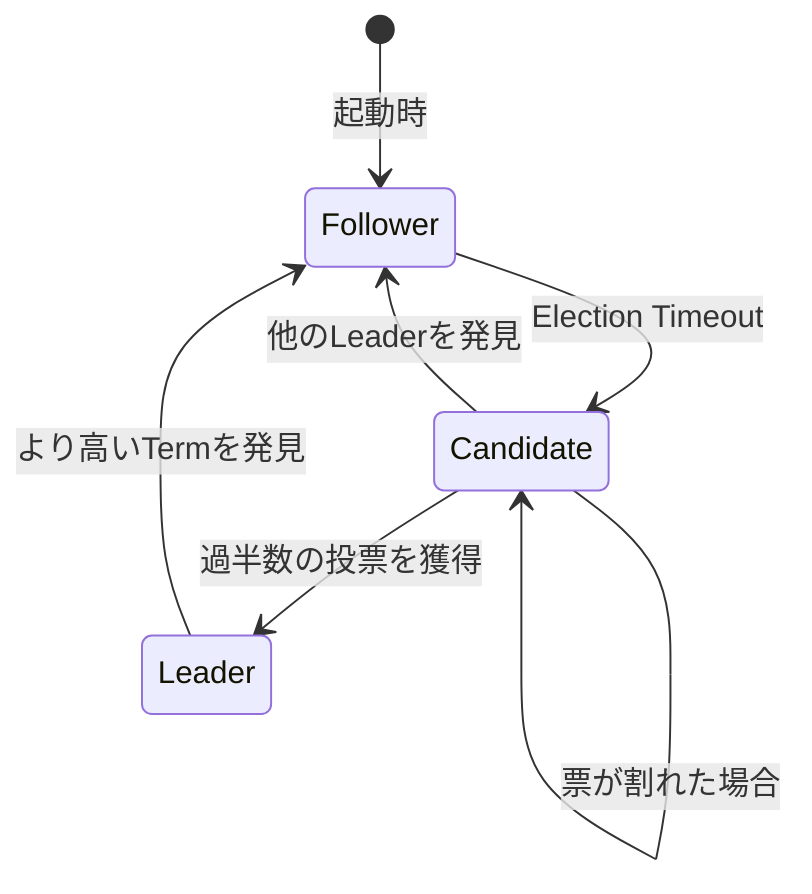
```mermaid
stateDiagram-v2
    [*] --> Follower: 起動時
    Follower --> Candidate: Election Timeout
    Candidate --> Candidate: 票が割れた場合
    Candidate --> Leader: 過半数の投票を獲得
    Candidate --> Follower: 他のLeaderを発見
    Leader --> Follower: より高いTermを発見
```

- **Leader**: クライアントリクエストを受け付け、ログエントリを他のノードに複製する唯一のノード
- **Follower**: Leaderからのログ複製を受け入れる受動的なノード
- **Candidate**: リーダー選挙中にFollowerから遷移する一時的な状態

### 2.2 Term（任期）

Raftは時間を**Term**と呼ばれる連続した期間に分割する。各Termは選挙で始まり、最大1人のLeaderが存在する。Termは論理クロックとして機能し、ノード間のメッセージの新旧判定に使用される。

### 2.3 ログの複製とコミット

クライアントからの書き込み要求は、以下のフローで処理される。

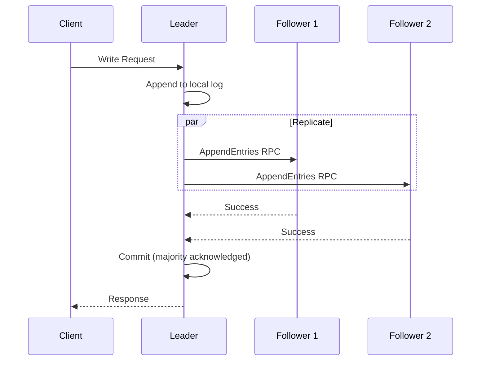
```mermaid
sequenceDiagram
    participant Client
    participant Leader
    participant F1 as Follower 1
    participant F2 as Follower 2

    Client->>Leader: Write Request
    Leader->>Leader: Append to local log
    par Replicate
        Leader->>F1: AppendEntries RPC
        Leader->>F2: AppendEntries RPC
    end
    F1-->>Leader: Success
    F2-->>Leader: Success
    Leader->>Leader: Commit (majority acknowledged)
    Leader-->>Client: Response
```

Leaderは、過半数のノードがログエントリを永続化したことを確認すると、そのエントリを**コミット済み**とみなす。コミット済みのエントリは、Raftの安全性保証により、将来のいかなるLeaderのログにも存在することが保証される。

### 2.4 安全性の保証

Raftが保証する主要な安全性特性は以下の通りである。

| 特性 | 内容 |
|------|------|
| **Election Safety** | 任意のTermで最大1人のLeaderしか選出されない |
| **Leader Append-Only** | Leaderは自身のログを上書き・削除しない |
| **Log Matching** | 2つのログが同じインデックスとTermのエントリを持つなら、それ以前のすべてのエントリも一致する |
| **Leader Completeness** | あるTermでコミットされたエントリは、それ以降のすべてのLeaderのログに含まれる |
| **State Machine Safety** | あるインデックスのログエントリを状態機械に適用したノードは、同じインデックスに異なるエントリを適用しない |

## 3. メンバーシップ変更（Cluster Membership Change）

### 3.1 問題の所在

プロダクション環境では、ノードの追加・削除は日常的な運用作業である。サーバーのハードウェア更新、キャパシティの増強、障害ノードの交換など、クラスタ構成は頻繁に変化する。

メンバーシップ変更の難しさは、**構成の切り替え中に2人のLeaderが同時に選出される可能性がある**点にある。以下の例を考えよう。

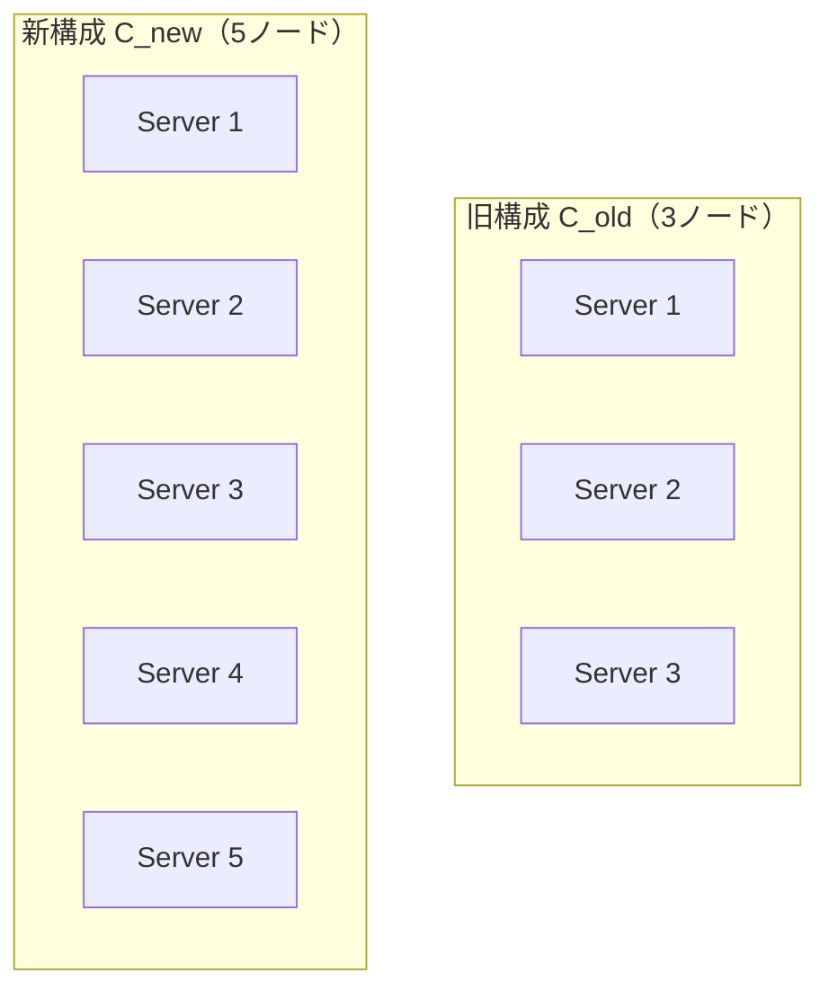
```mermaid
graph TB
    subgraph "旧構成 C_old（3ノード）"
        S1_old[Server 1]
        S2_old[Server 2]
        S3_old[Server 3]
    end
    subgraph "新構成 C_new（5ノード）"
        S1_new[Server 1]
        S2_new[Server 2]
        S3_new[Server 3]
        S4_new[Server 4]
        S5_new[Server 5]
    end
```

3ノードのクラスタに2ノードを追加して5ノードにする場合、各ノードが異なるタイミングで新構成に切り替わると、一時的に旧構成の過半数（2/3）と新構成の過半数（3/5）が重ならない部分集合を形成し、2人の独立したLeaderが選出されてしまう可能性がある。

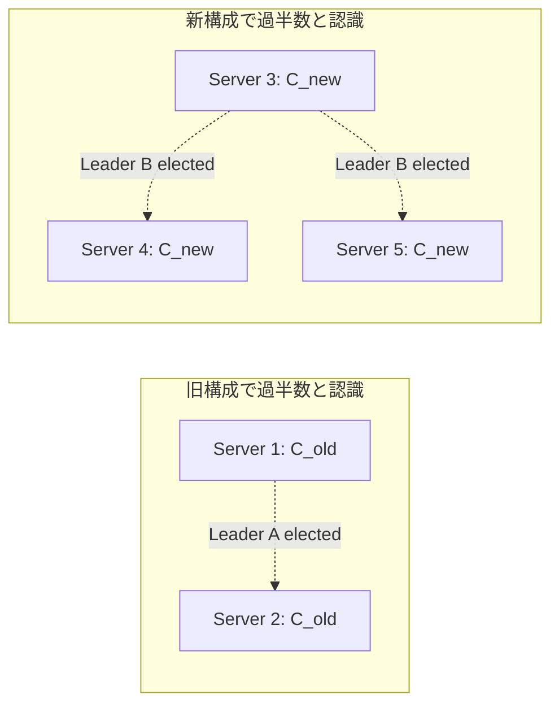
```mermaid
graph LR
    subgraph "旧構成で過半数と認識"
        A1[Server 1: C_old]
        A2[Server 2: C_old]
    end
    subgraph "新構成で過半数と認識"
        B3[Server 3: C_new]
        B4[Server 4: C_new]
        B5[Server 5: C_new]
    end
    A1 -.->|"Leader A elected"| A2
    B3 -.->|"Leader B elected"| B4
    B3 -.->|"Leader B elected"| B5
```

この状況では、Server 1とServer 2が旧構成の過半数でLeader Aを選出し、Server 3、4、5が新構成の過半数でLeader Bを選出してしまう。これは**安全性の致命的な違反**である。

### 3.2 Joint Consensus（共同合意）

Raftの原論文で提案された解決策が**Joint Consensus**である。これは、旧構成から新構成への切り替えを2段階で行うことにより、いかなるタイミングでも2人のLeaderが選出されないことを保証する。

#### フェーズ1: C_old,new の導入

Leaderは、旧構成（C_old）と新構成（C_new）の両方を含む**遷移構成（C_old,new）** をログエントリとしてクラスタに複製する。C_old,new が有効な間、すべての合意判定（ログのコミット、リーダー選挙）は**旧構成の過半数と新構成の過半数の両方**から承認を得なければならない。

#### フェーズ2: C_new への移行

C_old,new がコミットされた後、Leaderは新構成（C_new）のログエントリを複製する。C_new がコミットされると、旧構成のノードのうち新構成に含まれないものはクラスタから安全に離脱できる。

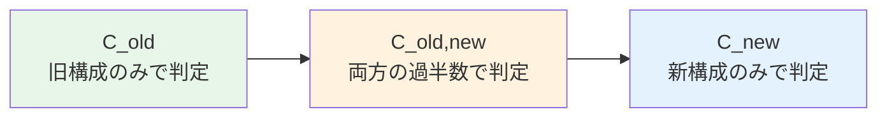
```mermaid
graph LR
    A["C_old<br/>旧構成のみで判定"] --> B["C_old,new<br/>両方の過半数で判定"]
    B --> C["C_new<br/>新構成のみで判定"]

    style A fill:#e8f5e9
    style B fill:#fff3e0
    style C fill:#e3f2fd
```

Joint Consensusが安全である理由を整理する。

- **C_old のみが有効な期間**: 旧構成の過半数でのみ判定が行われる。Leaderは1人。
- **C_old,new が有効な期間**: 両方の過半数が必要。旧構成だけ、あるいは新構成だけでLeaderを選出することは不可能。
- **C_new のみが有効な期間**: 新構成の過半数でのみ判定が行われる。Leaderは1人。
- **遷移期間の重なり**: C_old から C_old,new への遷移と、C_old,new から C_new への遷移は、どちらもC_old,new を経由するため、2つの独立した過半数が同時に存在することはない。

#### Joint Consensus の実装詳細

実際の実装では、以下の点に注意が必要である。

```go
// Configuration entry stored in the Raft log
type Configuration struct {
    // Servers in the old configuration
    OldServers []ServerID
    // Servers in the new configuration
    NewServers []ServerID
    // Whether this is a joint configuration
    IsJoint bool
}

// QuorumCheck verifies that a decision has been approved
// by the required majority (or majorities in joint mode)
func (c *Configuration) QuorumCheck(votes map[ServerID]bool) bool {
    if !c.IsJoint {
        return countVotes(c.NewServers, votes) > len(c.NewServers)/2
    }
    // Joint consensus: both old and new majorities required
    oldMajority := countVotes(c.OldServers, votes) > len(c.OldServers)/2
    newMajority := countVotes(c.NewServers, votes) > len(c.NewServers)/2
    return oldMajority && newMajority
}
```

### 3.3 Single-Server Change（1ノードずつの変更）

Joint Consensusは正しいが、実装の複雑さが高い。そのため、多くの実装では**1度に1ノードのみを追加または削除する**というより単純なアプローチを採用している。

1ノードの変更であれば、旧構成と新構成の過半数は必ず重なる。例えば、3ノードクラスタ（過半数=2）に1ノード追加して4ノード（過半数=3）にする場合、旧構成の過半数2ノードと新構成の過半数3ノードには、必ず少なくとも1ノードの重なりが存在する。この重なりのおかげで、2人のLeaderが同時に選出されることはない。

> [!WARNING]
> 1ノード変更であっても、**同時に複数の変更リクエストを処理してはならない**。前の変更がコミットされてから次の変更を開始する必要がある。これを怠ると、事実上の複数ノード同時変更となり、安全性が破られる。

### 3.4 実装上の落とし穴

メンバーシップ変更には、以下のようなエッジケースが存在する。

**新しいノードのキャッチアップ**: 新ノードはログが空の状態でクラスタに参加する。このノードを即座に投票メンバーに加えると、ログの複製が追いつくまでクラスタの可用性が低下する。etcdでは、新ノードを最初に**Learner**（投票権のないノード）として追加し、ログのキャッチアップが完了してからVoterに昇格させる方式を採用している。

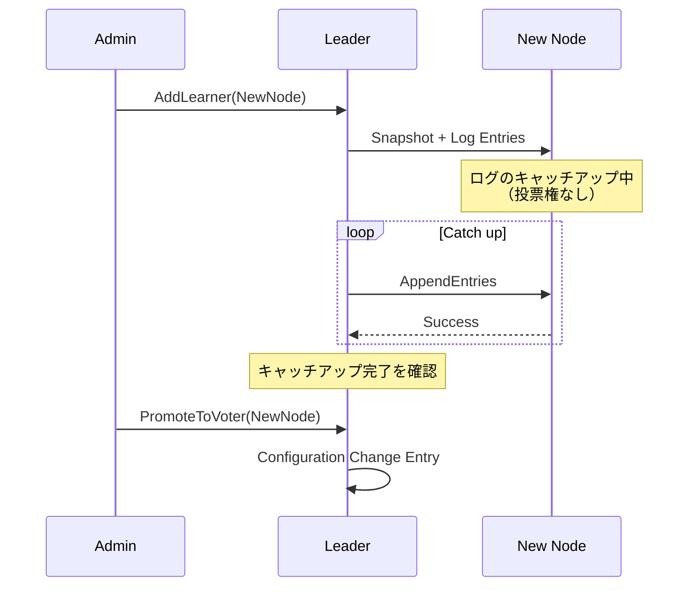
```mermaid
sequenceDiagram
    participant Admin
    participant Leader
    participant NewNode as New Node

    Admin->>Leader: AddLearner(NewNode)
    Leader->>NewNode: Snapshot + Log Entries
    Note over NewNode: ログのキャッチアップ中<br/>（投票権なし）
    loop Catch up
        Leader->>NewNode: AppendEntries
        NewNode-->>Leader: Success
    end
    Note over Leader: キャッチアップ完了を確認
    Admin->>Leader: PromoteToVoter(NewNode)
    Leader->>Leader: Configuration Change Entry
```

**リーダー自身の削除**: Leaderを構成から削除する場合、Leaderは新構成のコミットを確認した後に自発的にステップダウンしなければならない。ただし、コミット前にステップダウンすると変更が失われる可能性があるため、タイミングが重要である。

**構成変更中のリーダー障害**: 構成変更のログエントリが複製途中にLeaderが障害を起こした場合、新Leaderは未コミットの構成変更を検出し、適切に処理する必要がある。Joint Consensusの場合、C_old,new が未コミットならC_old にロールバックできる。

## 4. ログコンパクション（Log Compaction）

### 4.1 無限に成長するログの問題

Raftのログは、クライアントからのすべてのコマンドを時系列に記録する。コンパクションなしでは、ログは単調に増加し続ける。これは以下の問題を引き起こす。

- **ストレージの枯渇**: 長期間稼働するシステムでは、ログサイズがディスク容量を超える
- **起動時間の増大**: ノードの再起動時に、すべてのログエントリを最初から再生して状態を復元する必要がある
- **新ノードへの複製コスト**: 新ノードがクラスタに参加する際、全ログの転送が必要になる

### 4.2 スナップショット方式

最も一般的なログコンパクションの手法が**スナップショット**である。スナップショットは、ある時点での状態機械の完全な状態を保存し、それ以前のログエントリを破棄可能にする。

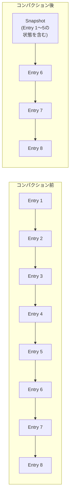
```mermaid
graph LR
    subgraph "コンパクション前"
        L1[Entry 1] --> L2[Entry 2] --> L3[Entry 3] --> L4[Entry 4] --> L5[Entry 5] --> L6[Entry 6] --> L7[Entry 7] --> L8[Entry 8]
    end

    subgraph "コンパクション後"
        S["Snapshot<br/>(Entry 1〜5の<br/>状態を含む)"] --> L6b[Entry 6] --> L7b[Entry 7] --> L8b[Entry 8]
    end
```

スナップショットには以下のメタデータが含まれる。

- **Last Included Index**: スナップショットに含まれる最後のログエントリのインデックス
- **Last Included Term**: そのエントリのTerm
- **状態機械の状態**: アプリケーション固有のデータ
- **クラスタ構成**: スナップショット時点での有効な構成

### 4.3 スナップショットの取得タイミング

スナップショットの取得は計算コストが高い操作である。取得タイミングの一般的な戦略は以下の通りである。

| 戦略 | 説明 | 利点 | 欠点 |
|------|------|------|------|
| **サイズベース** | ログサイズが閾値を超えたら取得 | シンプル | 最適なタイミングではない場合がある |
| **エントリ数ベース** | 前回のスナップショット以降のエントリ数で判断 | 予測しやすい | エントリサイズが不均一だと非効率 |
| **定期的** | 一定時間間隔で取得 | 制御しやすい | 負荷が偏る可能性 |
| **適応的** | システムの負荷に応じて動的に判断 | 効率的 | 実装が複雑 |

etcd/raftでは、デフォルトでログエントリが10,000件を超えた時点でスナップショットを取得する設定になっている。

### 4.4 InstallSnapshot RPC

FollowerのログがLeaderのログより大幅に遅れている場合（例えば、長期間ダウンしていたノードの復帰）、Leaderが保持するログの先頭よりもFollowerが必要とするエントリが古い場合がある。この場合、通常のAppendEntries RPCではログを同期できないため、**InstallSnapshot RPC**を使用してスナップショットごと転送する。

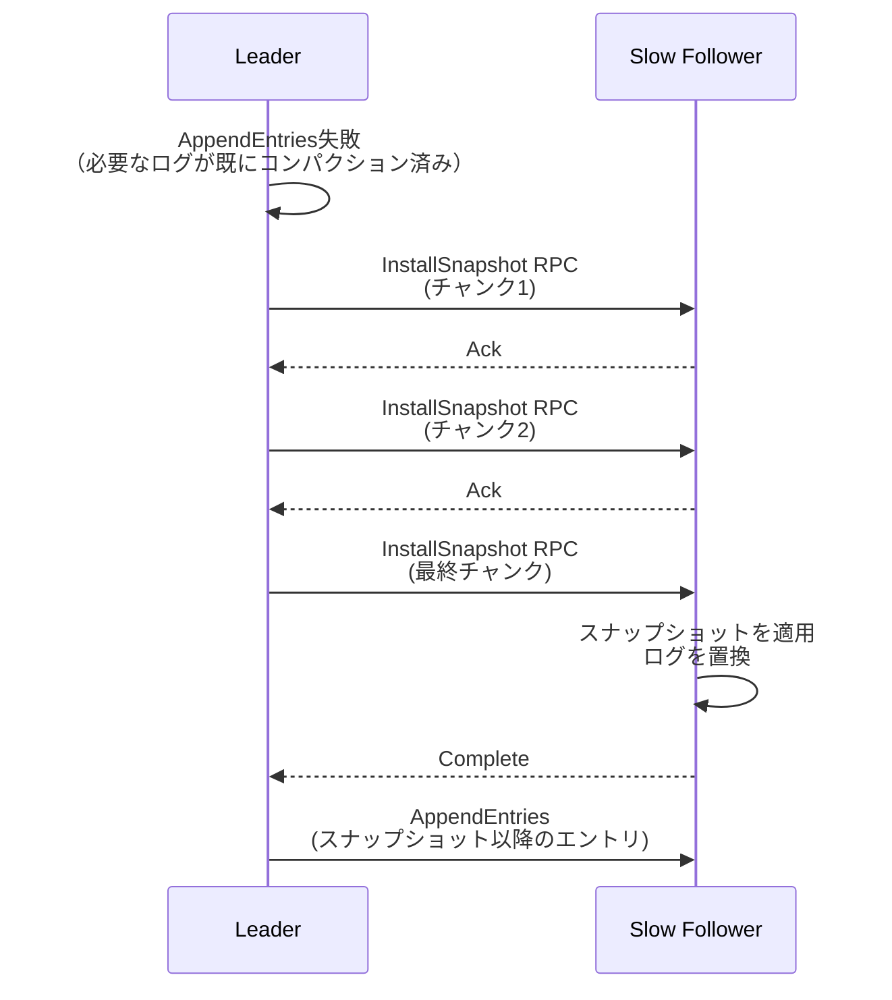
```mermaid
sequenceDiagram
    participant Leader
    participant SlowFollower as Slow Follower

    Leader->>Leader: AppendEntries失敗<br/>（必要なログが既にコンパクション済み）
    Leader->>SlowFollower: InstallSnapshot RPC<br/>(チャンク1)
    SlowFollower-->>Leader: Ack
    Leader->>SlowFollower: InstallSnapshot RPC<br/>(チャンク2)
    SlowFollower-->>Leader: Ack
    Leader->>SlowFollower: InstallSnapshot RPC<br/>(最終チャンク)
    SlowFollower->>SlowFollower: スナップショットを適用<br/>ログを置換
    SlowFollower-->>Leader: Complete
    Leader->>SlowFollower: AppendEntries<br/>(スナップショット以降のエントリ)
```

スナップショットは大きなデータになりうるため、複数のチャンクに分割して転送する。受信側は、すべてのチャンクを受信した後にスナップショットを適用する。

### 4.5 Copy-on-Write によるスナップショット取得

スナップショットの取得中もシステムは新しいリクエストを処理し続ける必要がある。状態機械全体をロックしてスナップショットを取得するのは、可用性の観点から許容できない。

この問題に対する一般的なアプローチが**Copy-on-Write（CoW）** である。

- **OSレベルのCoW**: `fork()` システムコールを使用して子プロセスを生成し、子プロセスがスナップショットを書き出す。Linuxのforkはページテーブルのコピーのみを行うため、実際のメモリコピーは書き込みが発生したページでのみ行われる。Redisがこの方式でRDBスナップショットを取得していることは有名である。
- **アプリケーションレベルのCoW**: イミュータブルなデータ構造や世代番号付きのデータ構造を使用して、スナップショットの一貫性を保つ。
- **LSM-Tree**: RocksDBなどのストレージエンジンでは、LSM-Treeの特性を活かしてスナップショットを効率的に取得できる。TiKVはRocksDBのcheckpoint機能を利用してスナップショットを作成している。

```go
// Simplified snapshot creation using fork-based CoW
func (sm *StateMachine) CreateSnapshot() ([]byte, error) {
    // Acquire a read lock briefly to get consistent state reference
    sm.mu.RLock()
    // Create an immutable view of the current state
    snapshot := sm.state.Clone()
    lastIndex := sm.lastApplied
    lastTerm := sm.lastAppliedTerm
    sm.mu.RUnlock()

    // Serialize the snapshot (can proceed without lock)
    data, err := snapshot.Serialize()
    if err != nil {
        return nil, err
    }
    return encodeSnapshot(lastIndex, lastTerm, data), nil
}
```

### 4.6 インクリメンタルコンパクション

スナップショット方式に代わるアプローチとして、**インクリメンタルコンパクション**がある。これは、状態機械がログ構造マージツリー（LSM-Tree）のような構造を持つ場合に特に有効で、古いログエントリを個別に破棄しながらコンパクションを進める。

ただし、実際にはスナップショット方式が圧倒的に広く採用されている。その理由は、スナップショット方式がアプリケーションの状態機械の内部構造に依存しないため、Raftライブラリとアプリケーションの間の関心の分離が容易であるからだ。

## 5. リーダーリース（Leader Lease）

### 5.1 読み取りのコスト問題

Raftの基本的なアプローチでは、読み取り操作もログに追加してコミットを待つ必要がある。これは、古いLeader（ネットワーク分断により既にLeaderではなくなっているが、自身はまだLeaderだと信じている）がクライアントに古いデータ（stale read）を返すことを防ぐためである。

しかし、すべての読み取りにログの複製を要求すると、読み取りヘビーなワークロードでの性能が大幅に低下する。

### 5.2 ReadIndex 方式

ログ複製のコストを回避するための最初のアプローチが**ReadIndex**である。

1. Leaderは現在のcommit indexを記録する（これを**readIndex**とする）
2. Leaderはクラスタの過半数にハートビートを送信し、自身がまだLeaderであることを確認する
3. 過半数からの応答を受信したら、状態機械がreadIndex以上のエントリを適用するまで待つ
4. 適用が完了したら、状態機械に対して読み取りを実行し、結果を返す

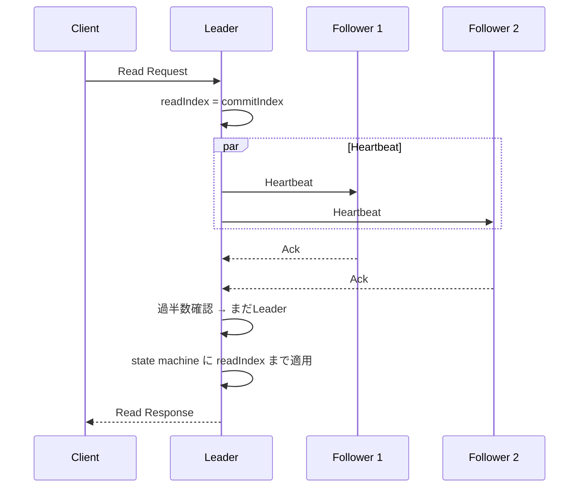
```mermaid
sequenceDiagram
    participant Client
    participant Leader
    participant F1 as Follower 1
    participant F2 as Follower 2

    Client->>Leader: Read Request
    Leader->>Leader: readIndex = commitIndex
    par Heartbeat
        Leader->>F1: Heartbeat
        Leader->>F2: Heartbeat
    end
    F1-->>Leader: Ack
    F2-->>Leader: Ack
    Leader->>Leader: 過半数確認 → まだLeader
    Leader->>Leader: state machine に readIndex まで適用
    Leader-->>Client: Read Response
```

この方式では、ログへの書き込みが不要なため、書き込み負荷を増加させずに線形化可能な読み取りを実現できる。ただし、ネットワークラウンドトリップ（ハートビート）のコストは依然として存在する。

### 5.3 リーダーリース方式

ReadIndexのハートビートコストすら排除するのが**リーダーリース**である。この方式は、Leaderが「一定期間は自分がLeaderであり続ける」という時間ベースの保証を利用する。

リーダーリースの基本的な考え方は以下の通りである。

1. Leaderがハートビートを送信し、過半数から応答を得た時点で、**リース期間**が開始する
2. リース期間中、Leaderは他のノードがリーダー選挙を開始しないことを信頼できる（Followerは最後にLeaderからのメッセージを受信してからElection Timeout が経過するまで選挙を開始しない）
3. したがって、リース期間中の読み取りは、追加のハートビートなしに直接状態機械から応答できる

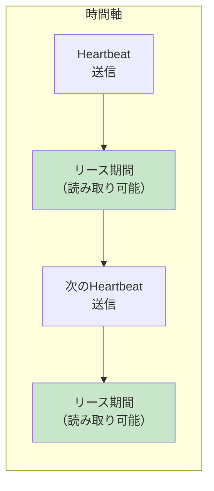
```mermaid
graph LR
    subgraph "時間軸"
        H1["Heartbeat<br/>送信"] --> L1["リース期間<br/>（読み取り可能）"]
        L1 --> H2["次のHeartbeat<br/>送信"]
        H2 --> L2["リース期間<br/>（読み取り可能）"]
    end

    style L1 fill:#c8e6c9
    style L2 fill:#c8e6c9
```

リース期間は、Election Timeoutより短く設定する必要がある。具体的には以下の関係が成り立つ。

$$
\text{lease\_duration} < \text{election\_timeout} - \text{max\_clock\_drift}
$$

> [!CAUTION]
> リーダーリースは**クロックの単調性**に依存する。ノード間のクロックドリフトやクロックのジャンプ（NTPの調整など）が発生すると、リースの安全性が破られる可能性がある。CockroachDBでは、ノード間のクロックオフセットを監視し、許容範囲を超えた場合にノードを停止させるメカニズムを実装している。

### 5.4 リーダーリースの注意点

リーダーリースには以下の重要な注意点がある。

**クロックへの依存**: Raftの基本アルゴリズムはクロックに依存しない（安全性はクロックの正しさを前提としない）。しかし、リーダーリースはクロックの単調性を前提とするため、Raftの安全性保証の一部を弱める。これは意識的なトレードオフである。

**CPUの停止**: ガベージコレクション（GC）の停止やVMのマイグレーションなどにより、プロセスが長時間停止すると、リースが期限切れになっているにもかかわらず、プロセスはまだリースが有効だと信じている可能性がある。Jepsenテストでは、この種の問題が実際に発見されている。

**ネットワーク分断**: ネットワーク分断が発生した場合、旧Leaderはリース期間中も自身がLeaderだと信じ続ける。一方、Follower側ではElection Timeoutが経過して新Leaderが選出される。リース期間が適切に設定されていれば、旧Leaderのリースは新Leaderの選出前に期限切れになるが、クロックの不正確さにより重なりが生じる可能性がある。

## 6. PreVote（予備投票）

### 6.1 不要なリーダー選挙の問題

ネットワーク分断やネットワークの遅延により、あるFollowerがLeaderからのハートビートを受信できなくなった場合、そのFollowerはCandidateに遷移してリーダー選挙を開始する。しかし、このFollowerがネットワーク的に孤立している場合、選挙に勝つことはできず、ただTermを増加させるだけである。

このFollowerがネットワークに復帰すると、増加したTermを含むメッセージが他のノードに伝播し、現在のLeaderが不必要にステップダウンする。これにより、短時間の無駄なリーダー不在期間が発生する。

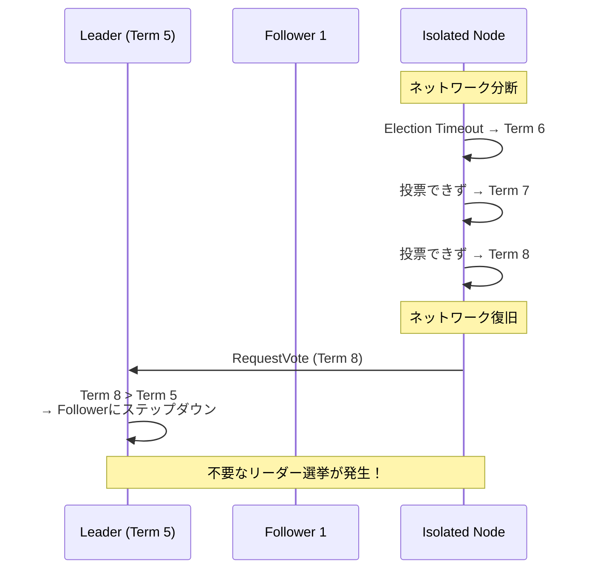
```mermaid
sequenceDiagram
    participant Leader as Leader (Term 5)
    participant F1 as Follower 1
    participant Isolated as Isolated Node

    Note over Isolated: ネットワーク分断
    Isolated->>Isolated: Election Timeout → Term 6
    Isolated->>Isolated: 投票できず → Term 7
    Isolated->>Isolated: 投票できず → Term 8
    Note over Isolated: ネットワーク復旧
    Isolated->>Leader: RequestVote (Term 8)
    Leader->>Leader: Term 8 > Term 5<br/>→ Followerにステップダウン
    Note over Leader,Isolated: 不要なリーダー選挙が発生！
```

### 6.2 PreVoteプロトコル

**PreVote**は、実際のリーダー選挙の前に「予備投票」を行うことで、この問題を解決する。PreVoteフェーズでは、Candidateは自身のTermを増加させず、他のノードに「もし私が選挙を開始したら、投票してくれますか？」と確認する。

PreVoteの手順は以下の通りである。

1. FollowerがElection Timeoutに達した場合、まず**PreVote RPC**を送信する
2. PreVote RPCを受信したノードは、以下の条件をすべて満たす場合のみ賛成する：
   - Candidateのログが自分のログと同じかより新しい
   - 自分が現在のLeaderからハートビートを最近受信していない（Election Timeout内にLeaderから連絡がない）
3. PreVoteで過半数の賛成が得られた場合のみ、実際のリーダー選挙（RequestVote RPC）に進む

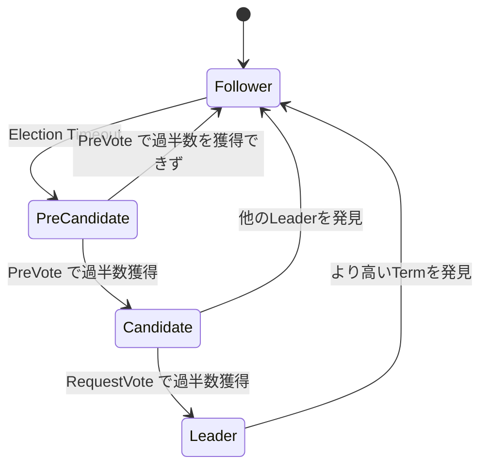
```mermaid
stateDiagram-v2
    [*] --> Follower
    Follower --> PreCandidate: Election Timeout
    PreCandidate --> Candidate: PreVote で過半数獲得
    PreCandidate --> Follower: PreVote で過半数を獲得できず
    Candidate --> Leader: RequestVote で過半数獲得
    Candidate --> Follower: 他のLeaderを発見
    Leader --> Follower: より高いTermを発見
```

> [!TIP]
> PreVoteは、etcd/raft、TiKVなど主要なRaft実装でデフォルトで有効化されている。Raftの原論文には含まれていないが、Diego Ongaroの博士論文（Chapter 9）で詳細に記述されている。

### 6.3 PreVoteの効果

PreVoteの導入により、以下の改善が得られる。

- **不要なTerm増加の防止**: 孤立ノードは PreVote で過半数を獲得できないため、Termを増加させない
- **不要なリーダー交代の防止**: 正常に機能しているLeaderが不必要にステップダウンすることがなくなる
- **可用性の向上**: 不要なリーダー選挙による短時間のサービス停止が排除される

## 7. 読み取りの線形化可能性（Linearizable Reads）

### 7.1 線形化可能性とは

**線形化可能性（Linearizability）** は、分散システムにおける最も強い一貫性保証である。線形化可能な操作は、あたかも単一のノードで逐次的に実行されたかのように振る舞う。具体的には、以下の特性を満たす。

- すべての操作は、呼び出し時刻と完了時刻の間のある一時点で「瞬間的に」実行されたものとして振る舞う
- この瞬間的な実行時点は、すべてのクライアントに対して一貫した全順序を形成する
- 直感的に言えば、「常に最新の値が読める」ことを保証する

### 7.2 読み取りの線形化可能性を実現する方法

Raftにおいて線形化可能な読み取りを実現するには、以下の方法がある。

| 方法 | ログ書き込み | ハートビート | クロック依存 | レイテンシ |
|------|:---:|:---:|:---:|------|
| **ログ経由の読み取り** | 必要 | 不要 | なし | 高い |
| **ReadIndex** | 不要 | 必要 | なし | 中程度 |
| **リーダーリース** | 不要 | 不要（リース中） | あり | 低い |
| **Follower Read** | 不要 | 必要（一部） | なし | 低い（地理分散時） |

#### ログ経由の読み取り

最も単純な方法で、読み取りリクエストもログエントリとして追加し、コミットされた後に実行する。安全だが、すべての読み取りに書き込みと同等のコストがかかるため、実用的ではない。

#### ReadIndex

セクション5.2で説明した通り。Leaderがハートビートで自身のリーダーシップを確認してから読み取りを実行する。

#### リーダーリース

セクション5.3で説明した通り。クロックに依存するが、最もレイテンシが低い。

#### Follower Read

**Follower Read**は、Followerが直接読み取りを処理する方式である。地理的に分散されたクラスタでは、クライアントに最も近いFollowerが読み取りを処理することで、レイテンシを大幅に削減できる。

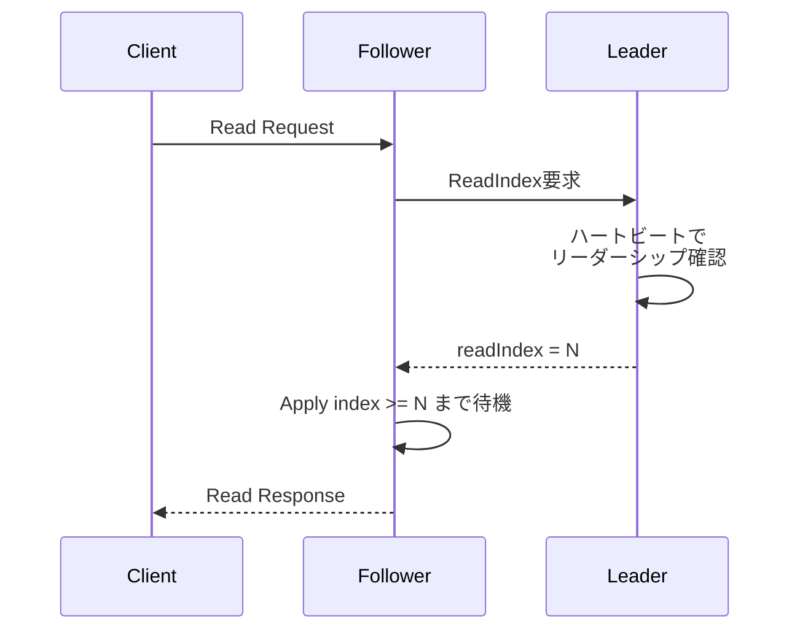
```mermaid
sequenceDiagram
    participant Client
    participant Follower
    participant Leader

    Client->>Follower: Read Request
    Follower->>Leader: ReadIndex要求
    Leader->>Leader: ハートビートで<br/>リーダーシップ確認
    Leader-->>Follower: readIndex = N
    Follower->>Follower: Apply index >= N まで待機
    Follower-->>Client: Read Response
```

Follower Readの手順は以下の通りである。

1. FollowerがクライアントからのRead要求を受信する
2. FollowerはLeaderにReadIndexを問い合わせる
3. Leaderはハートビートで自身のリーダーシップを確認し、現在のcommitIndexをFollowerに返す
4. Followerは自身の状態機械がそのインデックスまで適用されるのを待つ
5. 適用が完了したら、Followerのローカル状態機械から読み取りを実行する

この方式では、Leaderの負荷を分散しつつ、線形化可能な読み取りを実現できる。TiKVのFollower Readはこのアプローチを採用している。

## 8. バッチングとパイプライニング

### 8.1 バッチング

Raftの素朴な実装では、クライアントリクエストを1つずつ処理する。つまり、1つのリクエストをログに追加し、過半数にRPCを送信し、コミットを確認してからクライアントに応答し、次のリクエストを処理する。これでは、1リクエストあたり最低1 RTT（Round-Trip Time）のレイテンシがかかり、スループットが低い。

**バッチング**は、複数のリクエストをまとめて1回のAppendEntries RPCで送信する最適化である。

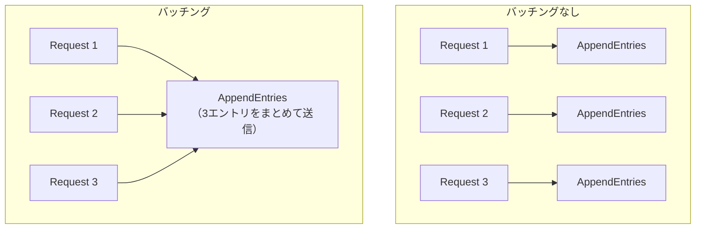
```mermaid
graph TB
    subgraph "バッチングなし"
        R1[Request 1] --> RPC1[AppendEntries]
        R2[Request 2] --> RPC2[AppendEntries]
        R3[Request 3] --> RPC3[AppendEntries]
    end

    subgraph "バッチング"
        R4[Request 1] --> BATCH[AppendEntries<br/>（3エントリをまとめて送信）]
        R5[Request 2] --> BATCH
        R6[Request 3] --> BATCH
    end
```

バッチングの効果は以下の通りである。

- **RPCオーバーヘッドの削減**: 1回のRPCで複数のエントリを送信するため、RPC呼び出しの回数が減少する
- **ディスクI/Oの効率化**: 複数のエントリを1回の`fsync`で永続化できる
- **ネットワーク帯域の効率化**: RPCヘッダーなどの固定オーバーヘッドが共有される

バッチサイズのチューニングは、レイテンシとスループットのトレードオフである。バッチサイズが大きいほどスループットは向上するが、個々のリクエストのレイテンシは増加する（バッチが満たされるまで待つ必要があるため）。実際の実装では、タイムアウト付きのバッチング（一定時間待っても満たされなければ送信する）を採用することが多い。

### 8.2 パイプライニング

**パイプライニング**は、前のAppendEntries RPCの応答を待たずに次のRPCを送信する最適化である。

通常のRaftでは、Leaderは各Followerの `nextIndex` を管理し、AppendEntries RPCが成功した後に `nextIndex` を更新する。パイプライニングでは、応答を待たずに `nextIndex` を楽観的に更新し、次のRPCを送信する。

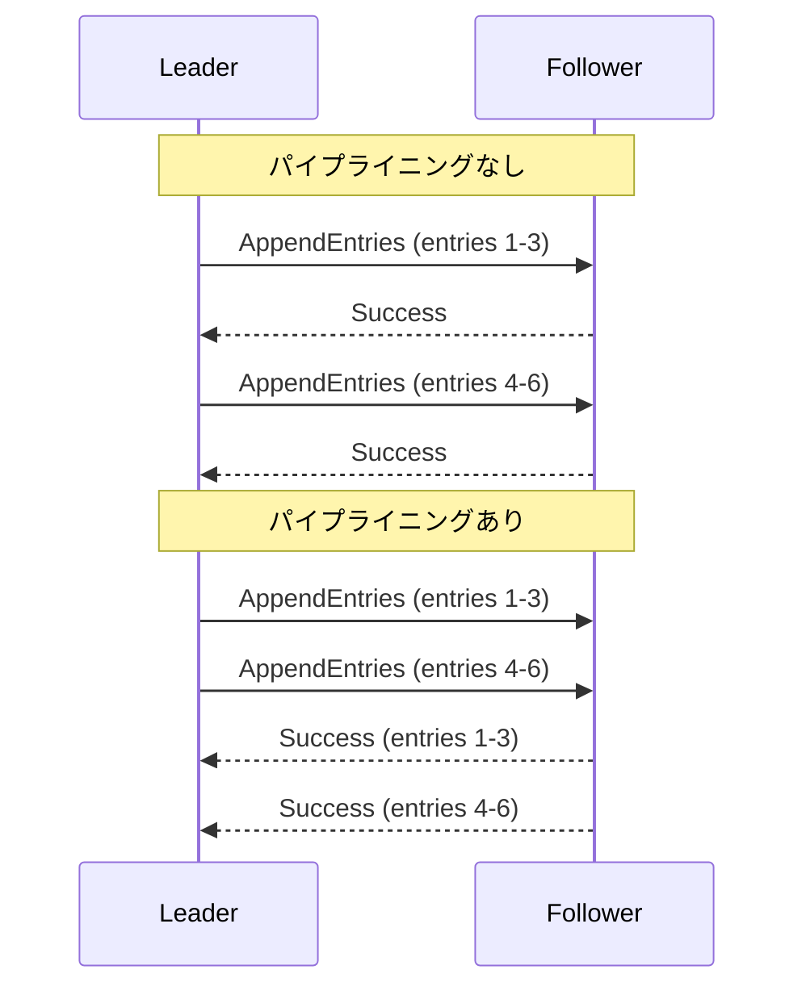
```mermaid
sequenceDiagram
    participant Leader
    participant Follower

    Note over Leader,Follower: パイプライニングなし
    Leader->>Follower: AppendEntries (entries 1-3)
    Follower-->>Leader: Success
    Leader->>Follower: AppendEntries (entries 4-6)
    Follower-->>Leader: Success

    Note over Leader,Follower: パイプライニングあり
    Leader->>Follower: AppendEntries (entries 1-3)
    Leader->>Follower: AppendEntries (entries 4-6)
    Follower-->>Leader: Success (entries 1-3)
    Follower-->>Leader: Success (entries 4-6)
```

パイプライニングにより、ネットワークレイテンシが高い環境（WAN環境など）でのスループットが大幅に改善される。ただし、RPCが失敗した場合のロールバック処理が複雑になるため、実装の難易度は上がる。

### 8.3 並列ディスク書き込み

もう一つの重要な最適化は、Leaderでのログ永続化とFollowerへの複製を**並列に実行する**ことである。

素朴な実装では、Leaderは以下の手順を逐次的に実行する。

1. ログエントリをローカルディスクに永続化する
2. FollowerにAppendEntries RPCを送信する

しかし、Leaderのディスク書き込みとFollowerへの複製は独立した操作であり、並列実行が可能である。Leaderはログをメモリに追加した直後にFollowerへのRPCを送信し、同時にローカルディスクへの永続化も開始できる。コミットの判定は、Leaderを含む過半数がログを永続化した時点で行えばよい。

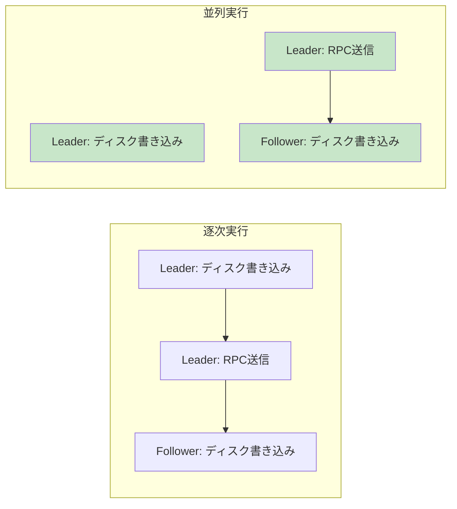
```mermaid
graph LR
    subgraph "逐次実行"
        A1[Leader: ディスク書き込み] --> A2[Leader: RPC送信]
        A2 --> A3[Follower: ディスク書き込み]
    end

    subgraph "並列実行"
        B1[Leader: ディスク書き込み]
        B2[Leader: RPC送信] --> B3[Follower: ディスク書き込み]
    end

    style B1 fill:#c8e6c9
    style B2 fill:#c8e6c9
    style B3 fill:#c8e6c9
```

> [!NOTE]
> この最適化は安全性を損なわない。Raftの正しさは「過半数がログを永続化すること」に依存しており、永続化の順序には依存しない。ただし、Leaderのディスク書き込みが完了する前にLeaderが障害を起こした場合、そのLeaderは「過半数」にカウントされないだけであり、他のノードの永続化が過半数を満たしていればコミットは成立する。

## 9. 実装の複雑さ — 実世界のRaft

### 9.1 etcd/raft

etcd/raftは、Go言語で実装された最も広く使われているRaftライブラリの一つである。Kubernetes のバックエンドストレージであるetcdの中核を担っており、プロダクション環境での稼働実績は圧倒的である。

etcd/raftの設計上の特徴は以下の通りである。

- **ライブラリとしての設計**: etcd/raftはネットワーク層やストレージ層を含まない純粋なRaftアルゴリズムのライブラリであり、これらの機能はアプリケーション側で提供する。この設計により、テスタビリティと移植性が向上する。
- **PreVoteのサポート**: デフォルトで有効化されている。
- **Learnerノード**: 投票権を持たないノードとして新ノードを追加し、ログのキャッチアップ後にVoterに昇格する方式をサポートする。
- **ReadIndex/LeaseReadのサポート**: 線形化可能な読み取りの両方式をサポートする。

```go
// Simplified etcd/raft usage pattern
// Application is responsible for:
// 1. Persisting log entries and hard state
// 2. Sending messages to other nodes
// 3. Applying committed entries to state machine
func (rc *raftNode) serveChannels() {
    for {
        select {
        case <-rc.ticker.C:
            rc.node.Tick()
        case rd := <-rc.node.Ready():
            // Persist entries and hard state to stable storage
            rc.wal.Save(rd.HardState, rd.Entries)
            if !raft.IsEmptySnap(rd.Snapshot) {
                rc.saveSnap(rd.Snapshot)
            }
            // Send messages to other nodes
            rc.transport.Send(rd.Messages)
            // Apply committed entries to state machine
            rc.applyEntries(rd.CommittedEntries)
            // Advance the raft node
            rc.node.Advance()
        }
    }
}
```

### 9.2 CockroachDB の MultiRaft

CockroachDBは、データをRangeと呼ばれる単位に分割し、各Rangeを独立したRaftグループで管理する。大規模なクラスタでは数万〜数十万のRaftグループが同時に動作するため、素朴にグループごとにRaftインスタンスを維持すると、以下の問題が生じる。

- **ハートビートの爆発**: 各Raftグループが独立してハートビートを送信すると、ネットワークトラフィックが膨大になる
- **Goroutineの増大**: グループごとにGoroutineを割り当てると、数十万のGoroutineが必要になる
- **ティック処理のオーバーヘッド**: 各グループが独立してタイマーを管理すると、CPU負荷が高くなる

CockroachDBの**MultiRaft**は、同じノードペア間のメッセージを統合することでこれらの問題を解決する。具体的には、同一ノード間の複数のRaftグループのメッセージを1つのgRPCストリームに多重化し、ハートビートもノードレベルで統合する。

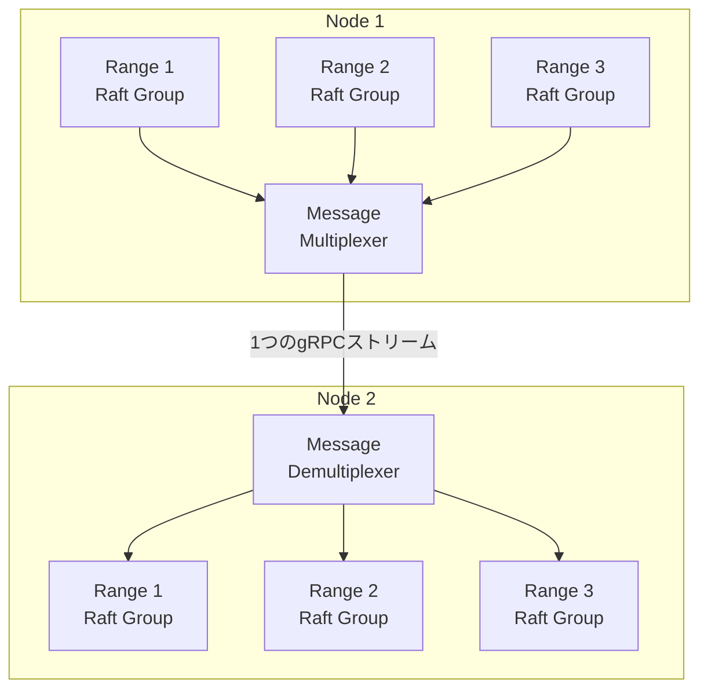
```mermaid
graph TB
    subgraph "Node 1"
        R1[Range 1<br/>Raft Group]
        R2[Range 2<br/>Raft Group]
        R3[Range 3<br/>Raft Group]
        MUX[Message<br/>Multiplexer]
    end

    subgraph "Node 2"
        R4[Range 1<br/>Raft Group]
        R5[Range 2<br/>Raft Group]
        R6[Range 3<br/>Raft Group]
        DEMUX[Message<br/>Demultiplexer]
    end

    R1 --> MUX
    R2 --> MUX
    R3 --> MUX
    MUX -->|"1つのgRPCストリーム"| DEMUX
    DEMUX --> R4
    DEMUX --> R5
    DEMUX --> R6
```

### 9.3 TiKV の Raft Store

TiKV は、PingCAPが開発した分散Key-Valueストアであり、TiDBのストレージエンジンとして使用されている。TiKVのRaft実装は、Rustで書かれたraft-rsライブラリを基盤としている。

TiKVの特徴的な設計は以下の通りである。

- **Raft Store**: 複数のRaftグループ（Region）を効率的に管理するためのアーキテクチャ。バッチ処理システムにより、複数のRegionのメッセージ処理を効率化している。
- **Follower Read**: 地理的に分散されたクラスタでの読み取りレイテンシを削減するため、Followerからの読み取りをサポートしている。
- **Joint Consensus**: メンバーシップ変更にJoint Consensus方式を採用している。
- **Prevote**: デフォルトで有効化されている。

### 9.4 実装間の比較

| 特性 | etcd/raft | CockroachDB | TiKV (raft-rs) | HashiCorp Raft |
|------|-----------|-------------|-----------------|----------------|
| **言語** | Go | Go | Rust | Go |
| **メンバーシップ変更** | Joint Consensus | Joint Consensus | Joint Consensus | Single-Server |
| **PreVote** | あり | あり | あり | なし（v1.x） |
| **リーダーリース** | あり | あり | あり | あり |
| **Follower Read** | あり | あり（v21.2〜） | あり | なし |
| **MultiRaft** | N/A | あり | あり | N/A |
| **パイプライニング** | あり | あり | あり | なし |

## 10. テストとデバッグ

### 10.1 分散システムのテストの困難さ

分散合意アルゴリズムのテストは、以下の理由で極めて困難である。

- **非決定性**: ネットワークの遅延、パケットロス、ノード障害のタイミングが結果に影響する
- **状態空間の爆発**: ノード数×メッセージ数の組み合わせにより、可能な実行パスが指数的に増大する
- **再現困難なバグ**: 特定のタイミングでのみ発現するバグは、通常のテストでは検出できない

### 10.2 決定論的シミュレーションテスト

最も強力なテスト手法の一つが**決定論的シミュレーション（Deterministic Simulation Testing; DST）** である。この手法は、FoundationDBの開発チームによって広められた。

DSTの基本的な考え方は以下の通りである。

1. ネットワーク、ディスクI/O、タイマーなどのすべての非決定的要素をシミュレーション層で置換する
2. すべてのイベントの順序を単一の擬似乱数生成器のシードで制御する
3. バグが発見された場合、同じシードで完全に再現可能

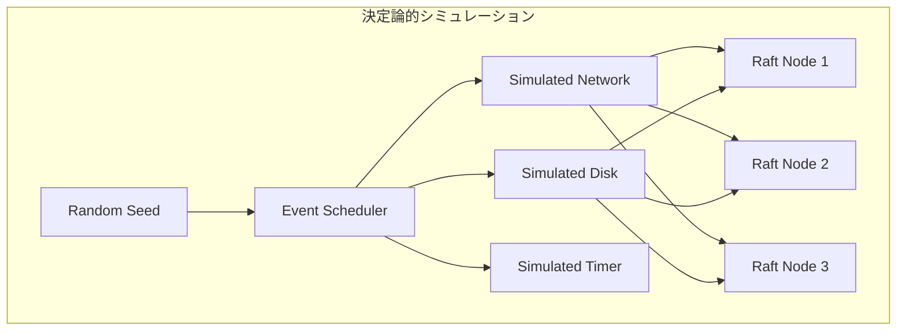
```mermaid
graph TB
    subgraph "決定論的シミュレーション"
        SEED[Random Seed] --> SCHEDULER[Event Scheduler]
        SCHEDULER --> NET[Simulated Network]
        SCHEDULER --> DISK[Simulated Disk]
        SCHEDULER --> TIMER[Simulated Timer]
        NET --> NODE1[Raft Node 1]
        NET --> NODE2[Raft Node 2]
        NET --> NODE3[Raft Node 3]
        DISK --> NODE1
        DISK --> NODE2
        DISK --> NODE3
    end
```

DSTの利点は以下の通りである。

- **再現性**: バグが発見された場合、シードを指定するだけで同じ実行を再現できる
- **高速**: 実時間を待つ必要がなく、シミュレーション内の時間を高速に進められる
- **網羅性**: 多数のシードで繰り返し実行することにより、広い状態空間を探索できる

### 10.3 障害注入テスト（Fault Injection）

**障害注入テスト**は、システムに意図的に障害を発生させ、正しく動作することを確認する手法である。Raftの文脈では、以下のような障害を注入する。

- **ネットワーク分断**: 特定のノード間の通信を遮断する
- **メッセージの遅延・重複・順序入れ替え**: RPCメッセージに対して様々な異常を発生させる
- **ノードのクラッシュと再起動**: 任意のタイミングでノードを停止し、再起動する
- **ディスク障害**: 永続化の失敗をシミュレートする
- **クロックのスキュー**: ノード間のクロックにずれを発生させる

### 10.4 Jepsen

**Jepsen**は、Kyle Kingsburyが開発した分散システムの一貫性検証フレームワークである。Jepsenは実際のシステムに対して障害注入を行いながらワークロードを実行し、結果が一貫性モデル（線形化可能性など）に違反していないかを検証する。

Jepsenのテストでは、以下のような実際のバグが発見されている。

- **etcd**: ネットワーク分断時のstale readの問題
- **CockroachDB**: メンバーシップ変更中の一貫性違反
- **TiDB/TiKV**: 特定の障害パターンでのデータ損失

Jepsenのアーキテクチャは以下のようになっている。

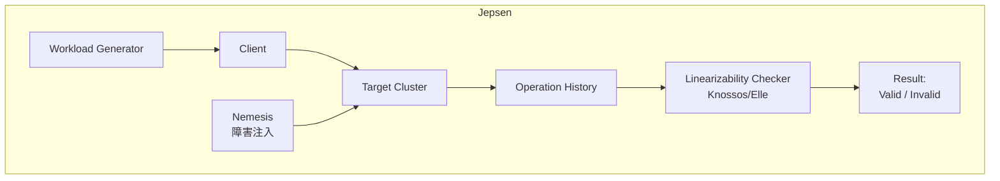
```mermaid
graph TB
    subgraph "Jepsen"
        GENERATOR[Workload Generator] --> CLIENT[Client]
        CLIENT --> CLUSTER[Target Cluster]
        NEMESIS[Nemesis<br/>障害注入] --> CLUSTER
        CLUSTER --> HISTORY[Operation History]
        HISTORY --> CHECKER[Linearizability Checker<br/>Knossos/Elle]
        CHECKER --> RESULT[Result:<br/>Valid / Invalid]
    end
```

- **Generator**: テスト操作（読み取り、書き込み、CASなど）を生成する
- **Client**: 操作をターゲットシステムに対して実行し、結果を記録する
- **Nemesis**: ネットワーク分断、ノード停止などの障害を注入する
- **Checker**: 操作の履歴が一貫性モデルに適合するかを検証する（KnossosアルゴリズムまたはElleフレームワークを使用）

### 10.5 形式検証

**TLA+** は、Leslie Lamportが設計した形式仕様記述言語であり、分散アルゴリズムの正しさを数学的に検証するために使用される。Raftの原論文でも、TLA+による仕様記述が公開されている。

TLA+を使用すると、アルゴリズムの状態空間を網羅的に探索し、安全性特性（例：「2人のLeaderが同時に存在しない」）が常に成り立つことを検証できる。ただし、TLA+はアルゴリズムの抽象モデルを検証するものであり、実装コードの正しさを直接保証するものではない。抽象モデルと実装コードの間の対応関係は、開発者の責任で維持する必要がある。

> [!TIP]
> 実用的なテスト戦略としては、TLA+による設計レベルの検証、DSTによる広範な状態空間の探索、Jepsenによる実システムの一貫性検証を組み合わせるのが理想的である。

## 11. まとめと展望

### 11.1 実装上の課題の全体像

本記事で取り上げた実装上の課題を整理する。

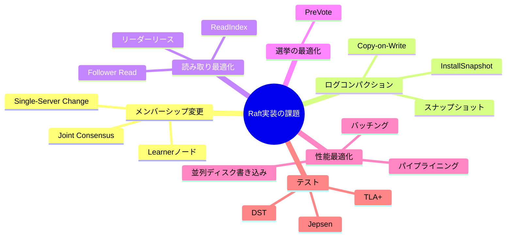
```mermaid
mindmap
  root((Raft実装の課題))
    メンバーシップ変更
      Joint Consensus
      Single-Server Change
      Learnerノード
    ログコンパクション
      スナップショット
      InstallSnapshot
      Copy-on-Write
    読み取り最適化
      ReadIndex
      リーダーリース
      Follower Read
    選挙の最適化
      PreVote
    性能最適化
      バッチング
      パイプライニング
      並列ディスク書き込み
    テスト
      DST
      Jepsen
      TLA+
```

### 11.2 論文から実装への道のり

Raftの原論文は、合意アルゴリズムの核心を理解するための優れた出発点である。しかし、プロダクション品質のシステムを構築するには、本記事で述べたような多くの拡張が不可欠である。

etcd、CockroachDB、TiKVといった実装は、何年にもわたるプロダクション運用とバグ修正を経て成熟してきた。これらの実装から学ぶべき最も重要な教訓は、**分散合意の正しさは、アルゴリズムの正しさだけでなく、あらゆるエッジケースに対する注意深い処理によって初めて達成される**ということである。

### 11.3 今後の方向性

Raftを取り巻く技術的な動向として、以下の点が注目される。

- **Flexible Quorum**: 書き込みクォーラムと読み取りクォーラムのサイズを非対称にする研究。読み取りヘビーなワークロードで性能を改善できる可能性がある。
- **Parallel Raft / MultiPaxos との再統合**: Raftの強いリーダーモデルを緩和し、複数のリーダーが並行してログの異なる部分を担当するアプローチ。PolarDB の Parallel Raft などが研究されている。
- **RDMA/NVMe の活用**: 高速なネットワークとストレージの進化により、Raftの性能特性が変化している。特にRDMAを活用した低レイテンシのRPC実装が注目されている。
- **Raft以外の選択肢**: Paxosの変種（EPaxos, Flexible Paxos）、CRDTベースの手法、DAGベースの合意プロトコル（Narwhal/Bullshark）など、Raftとは異なるアプローチも活発に研究されている。

分散合意は、理論的にはFLP不可能性定理により非同期系での決定論的な解が存在しないことが証明されているが、実用的には確率的な手法（ランダム化タイムアウト）と部分同期モデルの仮定により、高い信頼性で運用可能なシステムが構築されている。Raftは、その理解のしやすさにより、この理論と実践の橋渡し役として今後も重要な位置を占め続けるだろう。
