# RAG（Retrieval-Augmented Generation）

## 背景と動機 — LLM の知識の限界

大規模言語モデル（Large Language Model, LLM）は、膨大なテキストコーパスで事前学習されることで、言語の構造・知識・推論能力を獲得する。GPT-4、Claude、Gemini といった最新のモデルは、一般常識から専門知識まで幅広い質問に対して流暢に回答できるようになった。しかし、LLM には本質的な限界がいくつか存在する。

**知識のカットオフ問題**: LLM の知識は学習データの時点で凍結される。学習完了後に発生した出来事、更新された法律、新しい製品情報などには対応できない。たとえば、2024年に学習が完了したモデルに2026年の出来事を尋ねても、正確に答えることはできない。

**ハルシネーション（Hallucination）**: LLM は統計的なパターンマッチングに基づいてテキストを生成するため、学習データに含まれていない情報を「もっともらしく」でっちあげることがある。これをハルシネーションと呼ぶ。特に、固有名詞・数値・日付・引用元といったファクトベースの情報で顕著に発生する。

**ドメイン固有知識の欠如**: 社内文書、非公開の技術仕様、特定業界の専門知識など、公開されていないデータに関する知識を LLM は持ち合わせていない。ファインチューニングによって対応できる場合もあるが、コストが高く、知識の更新のたびに再学習が必要になる。

**根拠の提示が困難**: LLM が生成した回答の根拠がどこにあるのかを特定することが難しい。ビジネスや法律の文脈では、回答の出典を明示することが求められる場面が多い。

::: tip パラメトリック知識とノンパラメトリック知識
- **パラメトリック知識**: モデルの重みに暗黙的に格納された知識。学習データから獲得される
- **ノンパラメトリック知識**: 外部のデータソース（データベース、文書など）に明示的に格納された知識。検索によって動的に取得される

RAG は、パラメトリック知識とノンパラメトリック知識を組み合わせることで、LLM の限界を補完するアプローチである。
:::

これらの課題に対する解決策として、2020年に Meta AI（旧 Facebook AI Research）の Patrick Lewis らが「Retrieval-Augmented Generation for Knowledge-Intensive NLP Tasks」という論文で **RAG（Retrieval-Augmented Generation）** を提案した。RAG の基本的なアイデアは明快である。質問に対して回答を生成する前に、関連する外部文書を検索し、それをコンテキストとして LLM に渡すことで、より正確で根拠のある回答を生成させる。

## RAG の基本アーキテクチャ

RAG のパイプラインは、大きく3つのフェーズで構成される。**Retrieve（検索）**、**Augment（拡張）**、**Generate（生成）** である。

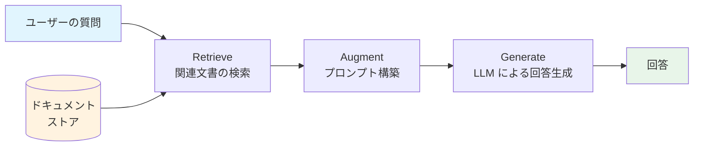

### Retrieve（検索）フェーズ

ユーザーの質問（クエリ）に対して、関連性の高い文書やテキストチャンクを外部の知識ベースから検索するフェーズである。このフェーズの品質が RAG 全体の性能を大きく左右する。「ゴミを入れればゴミが出る（Garbage In, Garbage Out）」という原則は RAG にも当てはまり、検索結果が不適切であれば、いかに優れた LLM を使っても正確な回答は得られない。

### Augment（拡張）フェーズ

検索で得られた文書をユーザーの質問と組み合わせ、LLM に投入するプロンプトを構築するフェーズである。検索結果の順序づけ、関連性によるフィルタリング、コンテキストウィンドウの制約に合わせた文書の選択と切り詰めなどが行われる。

### Generate（生成）フェーズ

構築されたプロンプトを LLM に渡し、回答を生成するフェーズである。LLM は自身のパラメトリック知識と、プロンプトに含まれる検索結果（ノンパラメトリック知識）の両方を活用して回答を生成する。

より詳細なパイプラインを以下に示す。

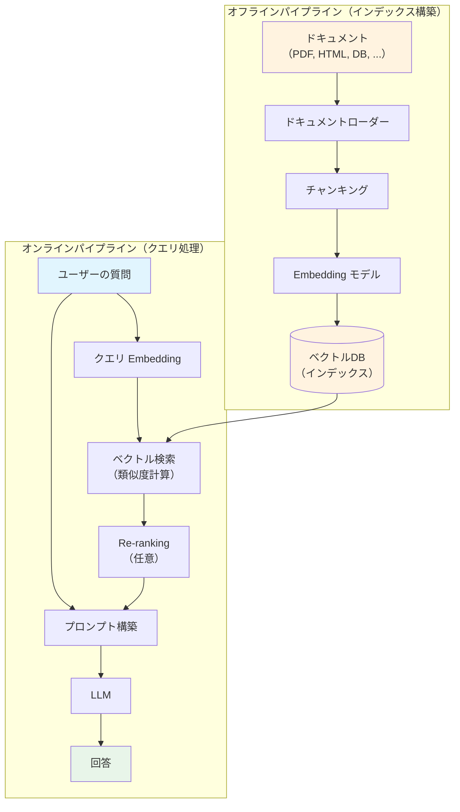

このように、RAG システムは **オフラインパイプライン**（ドキュメントの前処理とインデックス構築）と **オンラインパイプライン**（クエリ処理と回答生成）の2つから構成される。

## 検索コンポーネント — 関連文書をどう見つけるか

RAG の検索フェーズでは、さまざまな検索手法を組み合わせることができる。大きく分けて、**Sparse Retrieval（疎な検索）**、**Dense Retrieval（密な検索）**、**Hybrid Search（ハイブリッド検索）** の3つのアプローチがある。

### Sparse Retrieval（疎な検索）

Sparse Retrieval は、転置インデックスに基づくキーワードベースの検索手法である。代表的なスコアリング関数として **BM25** がある。

$$\text{BM25}(q, d) = \sum_{t \in q} \text{IDF}(t) \cdot \frac{f(t, d) \cdot (k_1 + 1)}{f(t, d) + k_1 \cdot \left(1 - b + b \cdot \frac{|d|}{\text{avgdl}}\right)}$$

ここで $f(t, d)$ は文書 $d$ における単語 $t$ の出現頻度、$|d|$ は文書長、$\text{avgdl}$ はコーパス全体の平均文書長、$k_1$ と $b$ はハイパーパラメータである。

**Sparse Retrieval の強み**:
- 固有名詞、製品名、エラーコードなど、正確なキーワードマッチが重要な場面で高い精度を発揮する
- 計算コストが低く、大規模データセットでもスケーラブルである
- インデックスの更新が容易（新しい文書の追加が高速）
- 解釈性が高い（なぜその文書がヒットしたかが明確）

**Sparse Retrieval の弱み**:
- 語彙のミスマッチ問題（同義語や言い換え表現に対応できない）
- 意味的な類似性を捉えられない

### Dense Retrieval（密な検索）

Dense Retrieval は、クエリと文書の両方を Embedding モデルでベクトル化し、ベクトル空間上の類似度で関連性を判定する手法である。

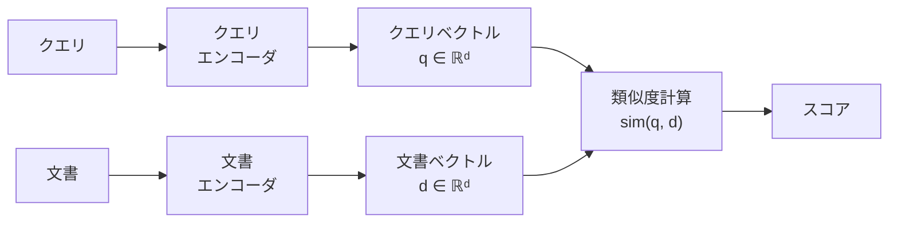

類似度関数としては、コサイン類似度や内積が一般的に使われる。

$$\text{sim}(\mathbf{q}, \mathbf{d}) = \frac{\mathbf{q} \cdot \mathbf{d}}{\|\mathbf{q}\| \cdot \|\mathbf{d}\|}$$

Dense Retrieval のモデルは、**Bi-Encoder** アーキテクチャと **Cross-Encoder** アーキテクチャに大別される。

**Bi-Encoder**: クエリと文書を独立にエンコードする。文書ベクトルは事前に計算してインデックス化できるため、検索時の計算コストが低い。DPR（Dense Passage Retriever）、Sentence-BERT、E5、BGE などが代表的なモデルである。

**Cross-Encoder**: クエリと文書を連結して同時にエンコードする。クエリと文書の間の細かな相互作用を捉えられるため精度が高いが、全文書に対してリアルタイムに計算する必要があり、大規模検索には向かない。Re-ranking ステージでの利用が一般的である。

**Dense Retrieval の強み**:
- 意味的な類似性を捉えられる（語彙のミスマッチ問題を解決）
- 多言語対応が容易（多言語 Embedding モデルを使用可能）

**Dense Retrieval の弱み**:
- Embedding モデルの品質に依存する
- 固有名詞や専門用語のマッチングは Sparse Retrieval に劣ることがある
- ベクトルインデックスの構築と維持にコストがかかる
- ドメイン外のデータに対する汎化性能が低い場合がある

### Hybrid Search（ハイブリッド検索）

実用的な RAG システムの多くは、Sparse Retrieval と Dense Retrieval を組み合わせた **Hybrid Search** を採用している。両者の長所を組み合わせることで、より幅広いクエリに対して高い検索精度を実現できる。

スコアの統合方法として、**Reciprocal Rank Fusion（RRF）** が広く使われている。

$$\text{RRF}(d) = \sum_{r \in R} \frac{1}{k + r(d)}$$

ここで $R$ は各検索手法の結果リスト、$r(d)$ は文書 $d$ のランク（1から始まる順位）、$k$ は定数（通常 60）である。RRF は、各検索手法のスコアのスケールが異なっていても、ランク情報のみに基づいてスコアを統合できるという利点がある。

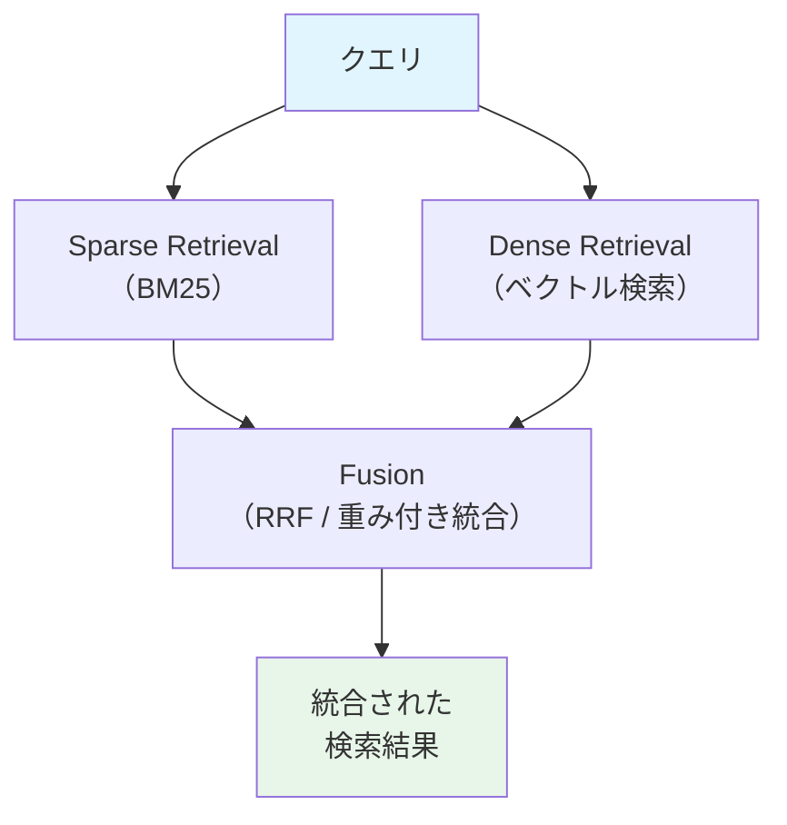

| 検索手法 | キーワード一致 | 意味的類似 | 速度 | 適用場面 |
|---------|:---:|:---:|:---:|------|
| Sparse（BM25） | 強い | 弱い | 高速 | 固有名詞、エラーコード |
| Dense（ベクトル検索） | 弱い | 強い | 中程度 | 概念的な質問、多言語 |
| Hybrid | 強い | 強い | 中程度 | 汎用的な RAG システム |

## チャンキング戦略 — 文書をどう分割するか

RAG システムでは、元の文書をそのまま検索対象にするのではなく、適切な単位に分割（チャンキング）してから Embedding を計算し、インデックスに格納する。チャンキングの品質は検索精度に直結するため、慎重な設計が求められる。

### なぜチャンキングが必要か

チャンキングが必要な理由は主に3つある。

1. **Embedding モデルの入力長制限**: 多くの Embedding モデルには入力トークン数の上限がある（例: 512トークン）。長い文書をそのまま入力すると、末尾が切り捨てられるか、全体の意味が希薄化する
2. **コンテキストウィンドウの制約**: LLM に渡すプロンプトのサイズには上限がある。複数の文書チャンクを含める必要があるため、個々のチャンクは適度なサイズに収める必要がある
3. **検索精度の最適化**: 大きすぎるチャンクは無関係な情報を多く含み、小さすぎるチャンクは文脈を失う。適切な粒度が重要である

### 固定長チャンキング

最もシンプルな手法で、文書を一定の文字数またはトークン数で機械的に分割する。

```python
def fixed_size_chunking(text: str, chunk_size: int, overlap: int) -> list[str]:
    """Split text into fixed-size chunks with overlap."""
    chunks = []
    start = 0
    while start < len(text):
        end = start + chunk_size
        chunks.append(text[start:end])
        start += chunk_size - overlap
    return chunks
```

**オーバーラップ**（重複領域）を設けることで、チャンク境界で文脈が切断される問題を緩和する。一般的なオーバーラップ率は 10〜20% 程度である。

**長所**: 実装が簡単で、処理速度が速い
**短所**: 文の途中や段落の途中で分割されることがあり、意味的な一貫性が損なわれる

### セマンティックチャンキング

テキストの意味的なまとまりを考慮して分割する手法である。連続する文やセグメント間の Embedding の類似度を計算し、類似度が大きく低下する箇所をチャンクの境界とする。

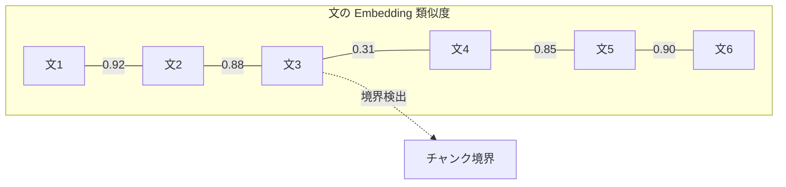

上の例では、文3と文4の間で類似度が 0.31 と大きく低下しているため、そこがチャンク境界として検出される。

**長所**: 意味的に一貫したチャンクが得られるため、検索精度が向上する
**短所**: 各文の Embedding 計算が必要で、処理コストが高い

### 再帰的分割（Recursive Splitting）

文書の構造（見出し、段落、文、単語）を階層的に利用して分割する手法である。LangChain の `RecursiveCharacterTextSplitter` がこのアプローチの代表例である。

分割は以下の優先順位で行われる。

1. まず見出し（`\n# `, `\n## `）で分割を試みる
2. 結果が大きすぎる場合、段落（`\n\n`）で分割する
3. さらに大きすぎる場合、文（`.` `。`）で分割する
4. 最終手段として、文字数で分割する

```python
class RecursiveTextSplitter:
    def __init__(self, chunk_size: int, chunk_overlap: int):
        self.chunk_size = chunk_size
        self.chunk_overlap = chunk_overlap
        # separators in order of priority
        self.separators = ["\n## ", "\n# ", "\n\n", "\n", ". ", "。", " ", ""]

    def split(self, text: str) -> list[str]:
        """Recursively split text using hierarchical separators."""
        for sep in self.separators:
            if sep in text:
                parts = text.split(sep)
                chunks = self._merge_parts(parts, sep)
                if all(len(c) <= self.chunk_size for c in chunks):
                    return chunks
        # fallback to character-level splitting
        return self._char_split(text)
```

**長所**: 文書の論理構造を尊重しつつ、サイズ制約も満たせる
**短所**: 文書のフォーマットに依存する（マークダウン、HTML、プレーンテキストで挙動が異なる）

### チャンキング戦略の選択指針

| 戦略 | 実装難易度 | 検索精度 | 計算コスト | 適用場面 |
|------|:---:|:---:|:---:|------|
| 固定長 | 低 | 中 | 低 | プロトタイプ、構造が均一な文書 |
| セマンティック | 高 | 高 | 高 | 多様なトピックが混在する文書 |
| 再帰的分割 | 中 | 高 | 低 | 見出し構造がある文書（MD, HTML） |

実務上は、**再帰的分割をベースに、チャンクサイズを 500〜1000 トークン程度、オーバーラップを 10〜20% に設定する**のが一般的な出発点である。最適なパラメータはデータと用途に応じて実験的に決定する必要がある。

## Embedding モデルの選択と評価

RAG の検索品質は Embedding モデルの性能に直接依存する。適切なモデルの選択は、システム全体の成功を左右する重要な意思決定である。

### 主要な Embedding モデル

| モデル | 提供元 | 次元数 | 特徴 |
|-------|-------|:---:|------|
| text-embedding-3-large | OpenAI | 3072 | 高い汎用性能、API経由で利用 |
| text-embedding-3-small | OpenAI | 1536 | コスト効率重視、API経由 |
| voyage-3 | Voyage AI | 1024 | RAG に特化した高精度モデル |
| E5-large-v2 | Microsoft | 1024 | オープンソース、多言語対応 |
| BGE-large-en-v1.5 | BAAI | 1024 | オープンソース、高い精度 |
| multilingual-e5-large | Microsoft | 1024 | 多言語対応のオープンソース |
| Cohere Embed v3 | Cohere | 1024 | 検索に特化、圧縮対応 |

### 評価基準

Embedding モデルの評価には **MTEB（Massive Text Embedding Benchmark）** が広く使われている。MTEB は以下のタスクカテゴリを含む。

- **Retrieval**: クエリに対して関連文書を正しくランク付けできるか
- **STS（Semantic Textual Similarity）**: 文ペアの意味的類似度を正しく評価できるか
- **Classification**: テキスト分類タスクにおける Embedding の品質
- **Clustering**: 意味的に類似した文書をクラスタリングできるか

RAG 用途では、特に **Retrieval** タスクのスコアを重視すべきである。

### ドメイン固有の Embedding

汎用 Embedding モデルが特定ドメインのデータに対して十分な性能を発揮しないケースがある。たとえば、法律文書、医療記録、特定のプログラミング言語のコードなどは、汎用モデルの学習データに十分含まれていない可能性がある。

この場合の対策として以下がある。

1. **ドメイン固有のモデルを使用**: 医療向け（BioGPT-Embeddings）、コード向け（CodeBERT）など
2. **ファインチューニング**: 自社データでの追加学習。対照学習（Contrastive Learning）が主流
3. **Matryoshka Representation Learning（MRL）**: 異なる次元数で切り出しても性能が保たれるように学習する手法。OpenAI の text-embedding-3 シリーズが対応

## ベクトルデータベースの活用

Embedding ベクトルを効率的に格納し、高速な類似度検索を実現するのが **ベクトルデータベース** の役割である。

### 主要なベクトルデータベース

| データベース | タイプ | 特徴 |
|------------|------|------|
| Pinecone | マネージドサービス | フルマネージド、スケーラブル |
| Weaviate | オープンソース | ハイブリッド検索、GraphQL API |
| Qdrant | オープンソース | Rust 実装、高速、フィルタリング |
| Milvus | オープンソース | 大規模分散対応、GPU サポート |
| Chroma | オープンソース | 開発者フレンドリー、軽量 |
| pgvector | PostgreSQL 拡張 | 既存 RDB に統合可能 |

### 近似最近傍探索（ANN）アルゴリズム

ベクトルデータベースの内部では、**近似最近傍探索（Approximate Nearest Neighbor, ANN）** アルゴリズムが使われている。代表的なアルゴリズムとして以下がある。

**HNSW（Hierarchical Navigable Small World）**: 小世界ネットワークの多層グラフ構造を構築し、上位層から下位層へと探索を絞り込む。検索精度が高く、多くのベクトルデータベースでデフォルトのインデックスとして採用されている。

**IVF（Inverted File Index）**: ベクトル空間をクラスタに分割し、クエリベクトルに近いクラスタのみを探索する。Product Quantization（PQ）と組み合わせてメモリ効率を高めることが多い。

**SCANN（Scalable Nearest Neighbors）**: Google が開発したアルゴリズムで、非対称ハッシュと空間分割を組み合わせる。

::: warning インデックスの選択
- **検索精度優先**: HNSW（メモリ消費は大きいが、recall が高い）
- **メモリ効率優先**: IVF-PQ（量子化によりメモリ使用量を削減）
- **データ量 < 100万件**: HNSW で十分なことが多い
- **データ量 > 1億件**: IVF系のインデックスや分散構成を検討
:::

### メタデータフィルタリング

実用的な RAG システムでは、ベクトル類似度だけでなく **メタデータによるフィルタリング** を組み合わせることが重要である。

たとえば、以下のようなフィルタ条件が考えられる。

- 文書の作成日（最新の情報のみを返したい場合）
- 文書のカテゴリやタグ
- アクセス権限（ユーザーが閲覧可能な文書のみ）
- ソースの種類（FAQ、マニュアル、論文など）

```python
# Qdrant example: vector search with metadata filtering
results = client.search(
    collection_name="documents",
    query_vector=query_embedding,
    query_filter=Filter(
        must=[
            FieldCondition(
                key="category",
                match=MatchValue(value="technical-manual"),
            ),
            FieldCondition(
                key="updated_at",
                range=Range(gte="2025-01-01"),
            ),
        ]
    ),
    limit=5,
)
```

## プロンプト構築とコンテキストウィンドウ管理

検索で得られた文書チャンクを LLM に効果的に渡すためのプロンプト設計は、RAG の性能に大きく影響する。

### 基本的なプロンプトテンプレート

```
以下のコンテキスト情報を元に、ユーザーの質問に回答してください。
コンテキストに含まれない情報については「わかりません」と回答してください。

## コンテキスト
{context}

## 質問
{question}

## 回答
```

このテンプレートのポイントは以下の通りである。

1. **明確な指示**: コンテキストに基づいて回答することを明示する
2. **ハルシネーション抑制**: コンテキストに含まれない情報は「わかりません」と答えるよう指示する
3. **構造化**: コンテキストと質問を明確に分離する

### コンテキストウィンドウの制約

LLM のコンテキストウィンドウ（入力可能なトークン数の上限）は有限である。

| モデル | コンテキストウィンドウ |
|-------|:---:|
| GPT-4o | 128K トークン |
| Claude 3.5 Sonnet | 200K トークン |
| Gemini 1.5 Pro | 2M トークン |

コンテキストウィンドウが大きくなった現在でも、すべての検索結果を無制限に詰め込むのは得策ではない。以下の理由による。

**Lost in the Middle 問題**: Liu et al.（2023）の研究により、LLM はプロンプトの先頭と末尾に配置された情報を重視し、中間部分の情報を見落とす傾向があることが示された。検索結果を大量に詰め込むと、重要な情報が「中間に埋もれる」リスクがある。

**コスト**: トークン数に応じて API 利用料が増加する。不必要に長いコンテキストはコストの無駄である。

**レイテンシ**: トークン数が増えると、生成時間が長くなる。

### コンテキスト管理の戦略

1. **関連性スコアによるフィルタリング**: 一定の閾値を下回る検索結果を除外する
2. **上位 K 件の選択**: 関連性の高い上位 K 件（一般に 3〜10 件）のみを使用する
3. **重複排除**: 意味的に重複する文書チャンクを除去する
4. **再ランク付け後の選択**: Re-ranker で精度の高いランキングを得てから上位を選択する
5. **コンテキスト圧縮**: LLMChain を使って検索結果を要約してからプロンプトに含める

## Advanced RAG — 検索精度と回答品質の向上

基本的な RAG パイプラインの性能を向上させるために、さまざまな高度な手法が提案されている。

### Pre-retrieval（検索前の最適化）

#### Query Expansion（クエリ拡張）

ユーザーの元のクエリだけでは検索に十分な情報が含まれていないことがある。クエリ拡張は、元のクエリを変換・拡張することで検索精度を向上させる手法である。

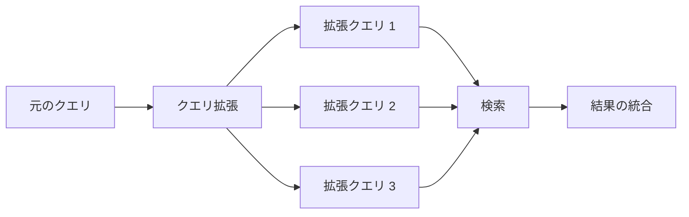

**Multi-Query**: LLM を使って元のクエリから複数の異なる表現のクエリを生成し、それぞれで検索を行い、結果を統合する。

```
元のクエリ: "Kubernetes のPod がCrashLoopBackOff になる原因"

拡張クエリ 1: "Kubernetes CrashLoopBackOff トラブルシューティング"
拡張クエリ 2: "Pod の再起動ループの一般的な原因と解決策"
拡張クエリ 3: "コンテナの起動失敗とヘルスチェックの設定"
```

#### HyDE（Hypothetical Document Embeddings）

Gao et al.（2022）が提案した手法で、クエリに対して LLM に**仮想的な回答文書**を生成させ、その文書の Embedding で検索を行う。

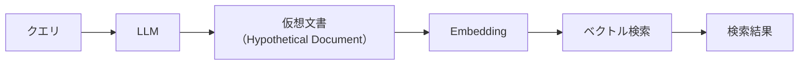

直感的に理解するならば、クエリ（質問文）のベクトルよりも、理想的な回答文のベクトルのほうが、実際の関連文書のベクトルに近いという仮説に基づいている。短い質問文と長い文書チャンクの間には表現のギャップがあるため、仮想文書を介することでそのギャップを埋める効果がある。

**長所**: クエリと文書の表現ギャップを埋められる
**短所**: LLM の追加呼び出しが必要で、レイテンシとコストが増加する。仮想文書にハルシネーションが含まれると検索がミスリードされる可能性がある

#### Step-back Prompting

Zheng et al.（2023）が提案した手法で、具体的なクエリから一歩引いて、より一般的・抽象的なクエリを生成し、それで検索を行う。

```
元のクエリ: "Python 3.12 で match 文のパフォーマンスが改善されたか？"
Step-back クエリ: "Python の構造的パターンマッチング（match文）の実装と最適化"
```

### Post-retrieval（検索後の最適化）

#### Re-ranking（再ランク付け）

初期検索で得られた候補文書を、より精度の高いモデルで再ランク付けする手法である。

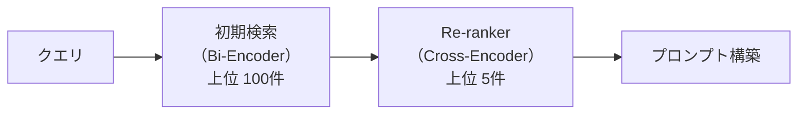

初期検索には計算効率の高い Bi-Encoder を使い、大量の候補から上位 N 件（例: 100件）を取得する。その後、計算コストの高い Cross-Encoder で精密な再ランク付けを行い、最終的に上位 K 件（例: 5件）を選択する。

代表的な Re-ranker モデル:
- **Cohere Rerank**: API 経由で利用可能なマネージドサービス
- **BGE-reranker**: BAAI が提供するオープンソースモデル
- **cross-encoder/ms-marco-MiniLM**: Sentence-Transformers ライブラリで利用可能

#### Contextual Compression（コンテキスト圧縮）

検索で得られた文書チャンクの中から、クエリに関連する部分のみを抽出・要約する手法である。チャンク全体をプロンプトに含めるのではなく、関連部分だけを残すことで、コンテキストウィンドウの利用効率を高める。

### RAG のアーキテクチャパターン

高度な RAG システムでは、これらの手法を組み合わせた複雑なパイプラインが構築される。

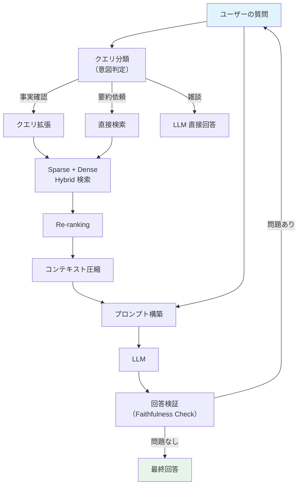

## 評価指標 — RAG システムの品質をどう測るか

RAG システムの評価は、検索コンポーネントと生成コンポーネントの両方を対象に行う必要がある。

### 検索の評価指標

**Recall@K**: 正解文書のうち、上位 K 件の検索結果に含まれる割合。

$$\text{Recall@K} = \frac{|\text{正解文書} \cap \text{上位 K 件の検索結果}|}{|\text{正解文書}|}$$

**MRR（Mean Reciprocal Rank）**: 最初の正解文書のランクの逆数の平均。

$$\text{MRR} = \frac{1}{|Q|} \sum_{i=1}^{|Q|} \frac{1}{\text{rank}_i}$$

**nDCG（Normalized Discounted Cumulative Gain）**: ランクに応じて減衰するゲインを累積し、理想的なランキングで正規化した指標。

### 生成の評価指標

**Faithfulness（忠実性）**: 生成された回答が、提供されたコンテキストの情報と矛盾しないかを評価する。ハルシネーションの検出に直結する指標である。

**Answer Relevancy（回答の関連性）**: 生成された回答がユーザーの質問に対して適切に答えているかを評価する。

**Context Relevancy（コンテキストの関連性）**: 検索されたコンテキストが質問に対して関連しているかを評価する。無関係なコンテキストが多いと、LLM が混乱してハルシネーションを起こしやすくなる。

### RAGAS フレームワーク

**RAGAS（Retrieval-Augmented Generation Assessment）** は、RAG システムの自動評価フレームワークとして広く採用されている。LLM を評価者として使用し、以下の指標を自動で計算する。

| 指標 | 評価対象 | 説明 |
|------|---------|------|
| Faithfulness | 生成 | 回答がコンテキストに忠実かどうか |
| Answer Relevancy | 生成 | 回答が質問に適切に答えているか |
| Context Precision | 検索 | 検索結果の上位に関連文書が含まれているか |
| Context Recall | 検索 | 必要な情報がコンテキストに含まれているか |

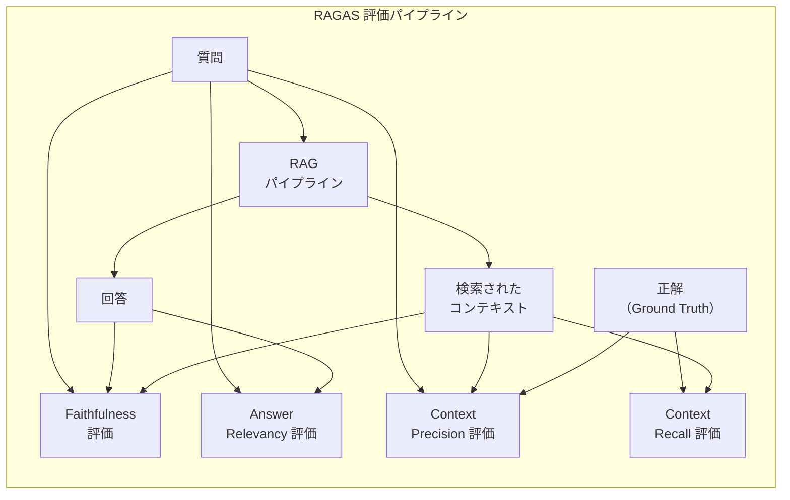

RAGAS の各指標は 0.0〜1.0 のスコアで表され、1.0 に近いほど良好であることを示す。実運用では、これらの指標を継続的にモニタリングし、パフォーマンスの低下を早期に検知することが重要である。

### 人間による評価

自動評価指標だけでは捉えきれない品質の側面もある。特に以下の点については、人間による評価（Human Evaluation）が重要である。

- 回答の自然さ・読みやすさ
- 引用元の適切性
- ユーザーの期待に沿っているか
- ドメイン専門家から見た正確性

## 実運用でのアーキテクチャパターン

### パターン 1: シンプル RAG

最もシンプルな構成で、小〜中規模のプロジェクトに適している。

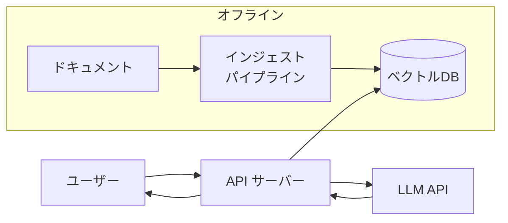

**適用場面**: 社内 FAQ ボット、ドキュメント検索アシスタント
**技術スタック例**: LangChain + Chroma + OpenAI API

### パターン 2: Agentic RAG

LLM をエージェントとして動作させ、検索ツールを自律的に呼び出すパターンである。単純な1回の検索では不十分な複雑な質問に対して、複数回の検索を繰り返して情報を収集する。

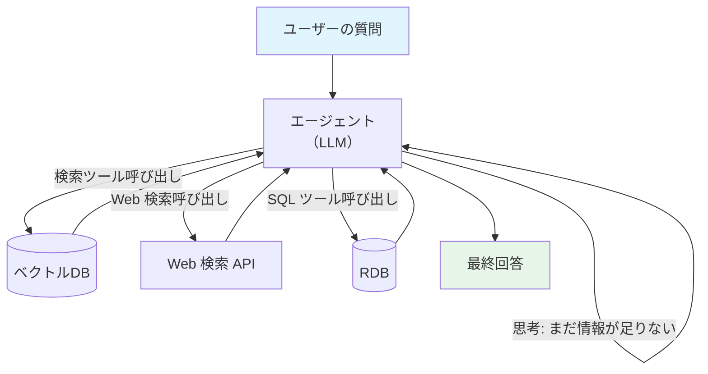

**適用場面**: リサーチアシスタント、複合的な質問への対応
**技術スタック例**: LangGraph + Tool Calling + 複数データソース

### パターン 3: Corrective RAG（CRAG）

検索結果の品質を検証し、品質が低い場合にフォールバック戦略を実行するパターンである。

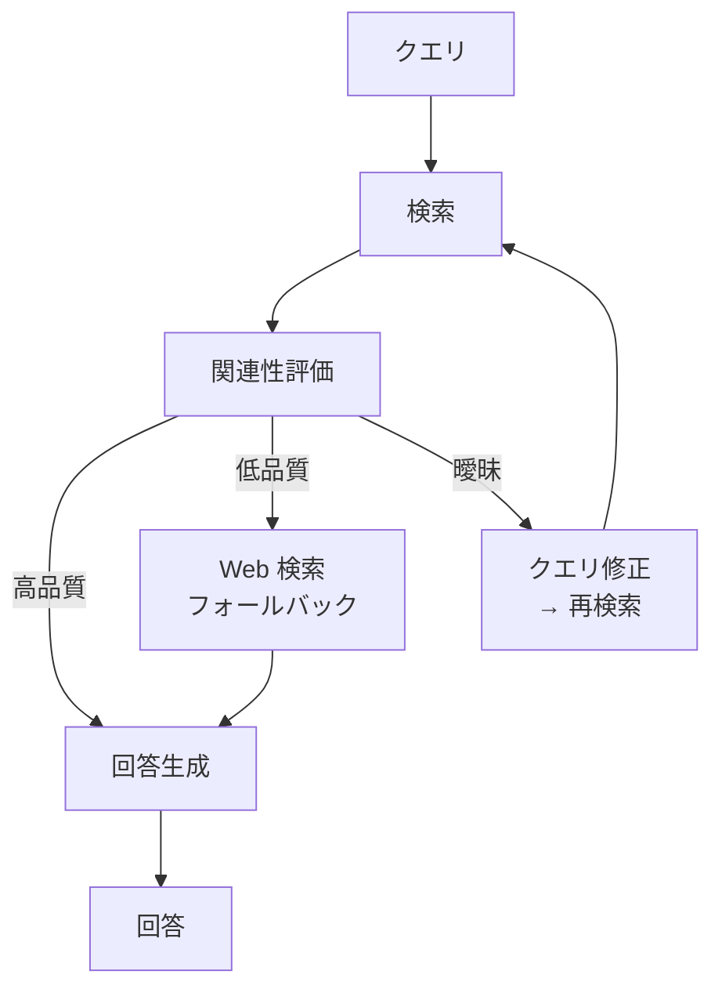

### パターン 4: Graph RAG

ナレッジグラフ（Knowledge Graph）をベクトル検索と組み合わせるパターンである。エンティティ間の関係性を活用することで、複数ホップの推論が必要な質問に対応できる。

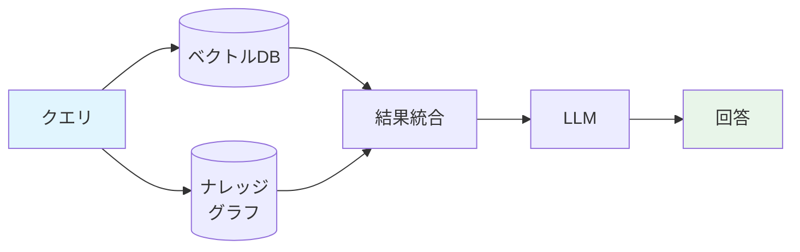

たとえば「CEOがスタンフォード出身の企業で、最近AIの特許を取得した会社はどこか」のような質問は、ベクトル検索だけでは答えにくいが、ナレッジグラフの関係性を辿ることで効率的に回答できる。

### 本番環境でのベストプラクティス

実運用の RAG システムを構築する際に考慮すべきポイントを以下にまとめる。

**インデックスの鮮度**: ドキュメントの更新に合わせてインデックスを継続的に更新する仕組みが必要である。増分更新（差分のみの再インデックス）が理想的だが、定期的な全再構築も検討する。

**モニタリングと可観測性**: 検索のレイテンシ、LLM のトークン使用量、ユーザーフィードバック（thumbs up/down）、Faithfulness スコアなどを継続的に監視する。

**セキュリティとアクセス制御**: RAG は外部文書を参照するため、ユーザーのアクセス権限に応じた文書フィルタリングが必要である。機密文書が権限のないユーザーに漏洩しないように注意する。

**キャッシュ戦略**: 同一または類似のクエリに対する検索結果や LLM の回答をキャッシュすることで、レイテンシとコストを削減できる。セマンティックキャッシュ（クエリの意味的類似度に基づくキャッシュ）も有効である。

**コスト最適化**: Embedding の計算コスト、ベクトル DB のストレージコスト、LLM の API コストを総合的に管理する。次元数の削減（Matryoshka Embedding）やバッチ処理の活用が効果的である。

**エラーハンドリング**: 検索結果が空の場合、LLM の応答がタイムアウトした場合、レートリミットに達した場合などのエッジケースに適切に対処する。

## RAG とファインチューニングの使い分け

LLM をドメイン固有の知識で強化する手法として、RAG とファインチューニングはしばしば比較される。

| 観点 | RAG | ファインチューニング |
|------|-----|-----------------|
| 知識の更新 | リアルタイムに更新可能 | 再学習が必要 |
| 根拠の提示 | 出典を明示できる | 困難 |
| ハルシネーション | 低減できる（完全には排除不可） | 排除が困難 |
| セットアップコスト | 検索インフラが必要 | 学習データとGPUが必要 |
| 推論コスト | 検索 + LLM の二重コスト | LLM のみのコスト |
| ドメイン特化 | 知識の追加が容易 | 応答スタイルの変更に適する |

実務上は、RAG とファインチューニングは二者択一ではなく、**相補的に使用する** ケースが多い。ファインチューニングでモデルの応答スタイルやドメイン固有の振る舞いを調整し、RAG で最新の知識や具体的な事実情報を補完するというアプローチである。

## RAG の限界と今後の方向性

RAG は LLM の知識の限界を補完する強力な手法だが、万能ではない。

### 現在の限界

**推論の連鎖が長い質問**: 複数の情報を組み合わせた推論が必要な質問（例: 「A社の売上がB社を超えたのはいつか、その原因は何か」）は、単一の検索では対応が困難である。Agentic RAG や Graph RAG がこの問題に取り組んでいるが、まだ発展途上である。

**数値比較・集計**: 「2024年の売上トップ10を表にして」のような、データの集計・比較が必要な質問は、テキスト検索ベースの RAG には不向きである。Text-to-SQL との組み合わせが必要になる。

**マルチモーダル対応**: テキストだけでなく、画像・音声・動画を含むドキュメントへの対応はまだ発展段階にある。CLIP や GPT-4V の登場により可能性が広がりつつあるが、統一的な解決策はまだない。

**評価の難しさ**: RAG システムの品質を自動で正確に評価することは依然として困難である。特に、Faithfulness の判定では LLM 自体の判断能力に依存するため、評価の信頼性に限界がある。

### 今後の発展方向

**Long Context LLM の進化**: コンテキストウィンドウの拡大（Gemini 1.5 Pro の 200万トークンなど）により、「検索せずに全文書を LLM に投入する」アプローチが一部の用途で現実的になりつつある。ただし、コスト・レイテンシの観点から、RAG の価値が完全に失われることはないと考えられる。

**Self-RAG**: 自己反省メカニズムを組み込んだ RAG で、検索が必要かどうか、検索結果が有用かどうかをモデル自身が判断する。Asai et al.（2023）が提案した。

**Adaptive RAG**: クエリの複雑さに応じて、検索の深さや手法を動的に切り替えるアプローチ。単純な質問にはシンプルな検索を、複雑な質問にはマルチステップの検索を適用する。

**RAG と Agent の融合**: RAG を単なる検索→生成のパイプラインとしてではなく、自律的なエージェントの知識獲得メカニズムとして位置づける方向に進化しつつある。ツール呼び出し、計画立案、自己修正を組み合わせた知的な情報アクセスが実現されつつある。

## まとめ

RAG は、LLM の知識の限界とハルシネーションの問題に対する実用的かつ効果的な解決策である。外部知識ベースから関連情報を検索し、それをコンテキストとして LLM に提供するという比較的シンプルなアイデアに基づいているが、その実装には検索技術、Embedding モデル、プロンプトエンジニアリング、評価手法など、幅広い技術の統合が求められる。

RAG システムの構築において最も重要なのは、**検索の品質** である。検索精度が低ければ、どれほど高性能な LLM を使っても正確な回答は得られない。Hybrid Search、適切なチャンキング、Re-ranking といった手法を組み合わせて、検索品質を最大化することがシステム全体の成功の鍵となる。

また、RAG はソフトウェアシステムとして継続的に運用・改善していくものであり、評価指標のモニタリング、インデックスの更新、ユーザーフィードバックの活用を通じて、継続的な改善サイクルを回していくことが求められる。LLM の急速な進化とともに RAG の技術も日々発展しており、Long Context LLM、Self-RAG、Agent との融合など、今後のさらなる進化が期待される。
