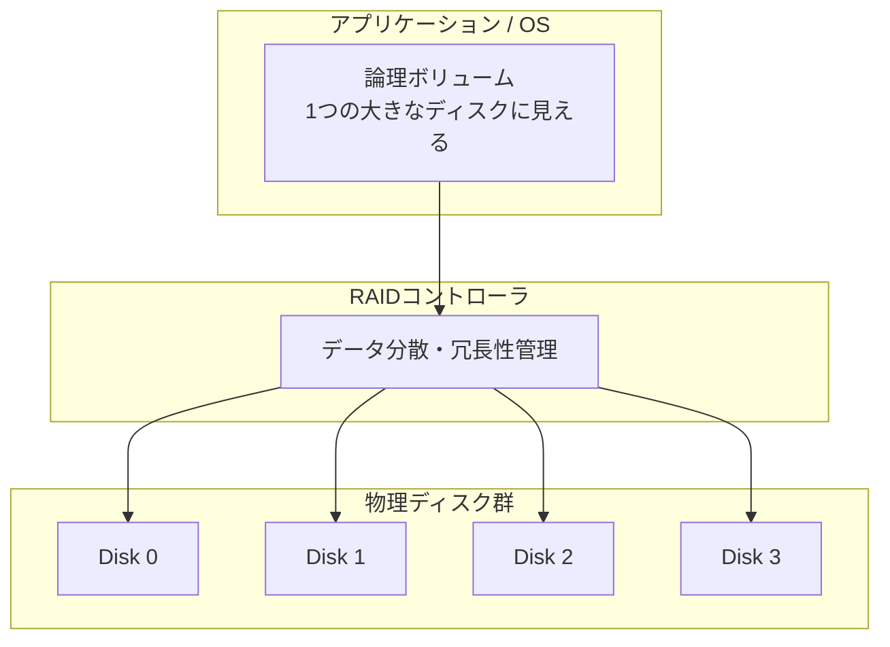
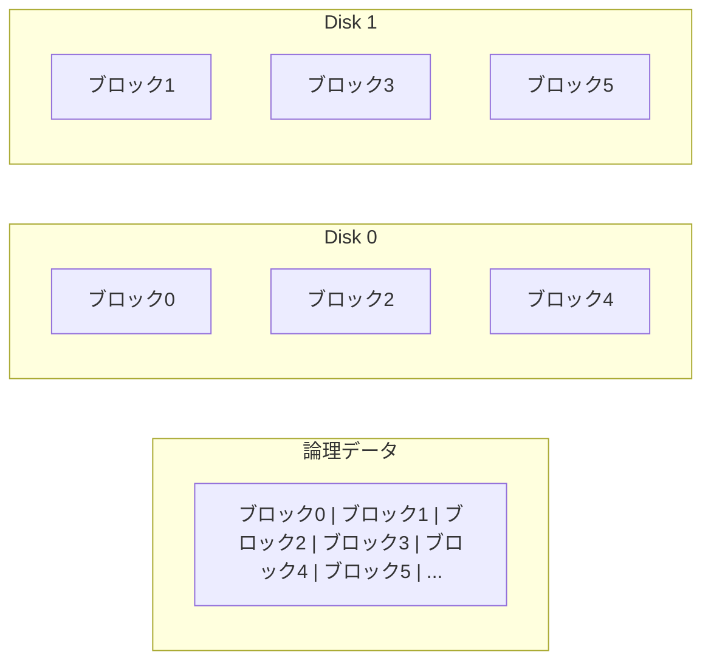
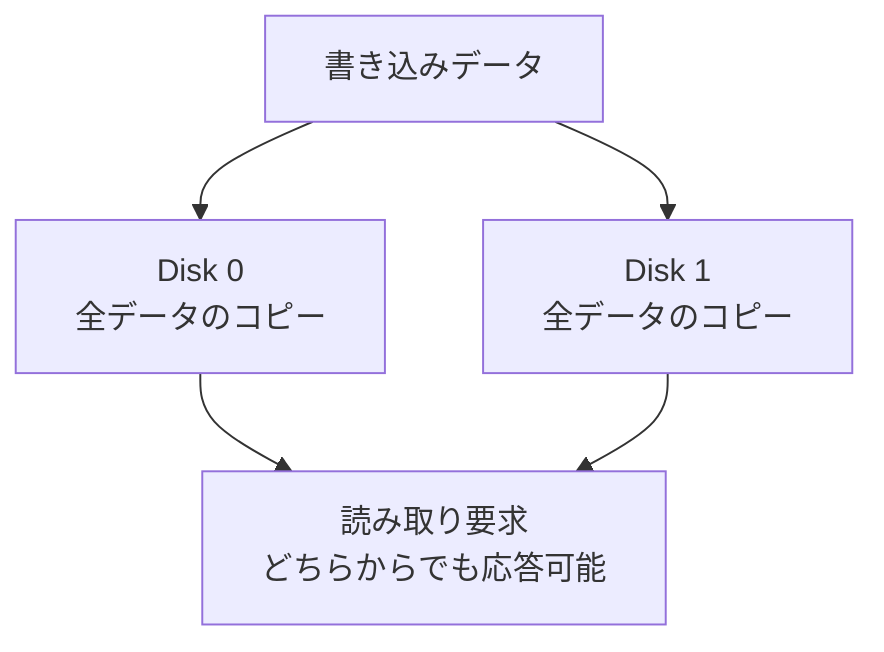
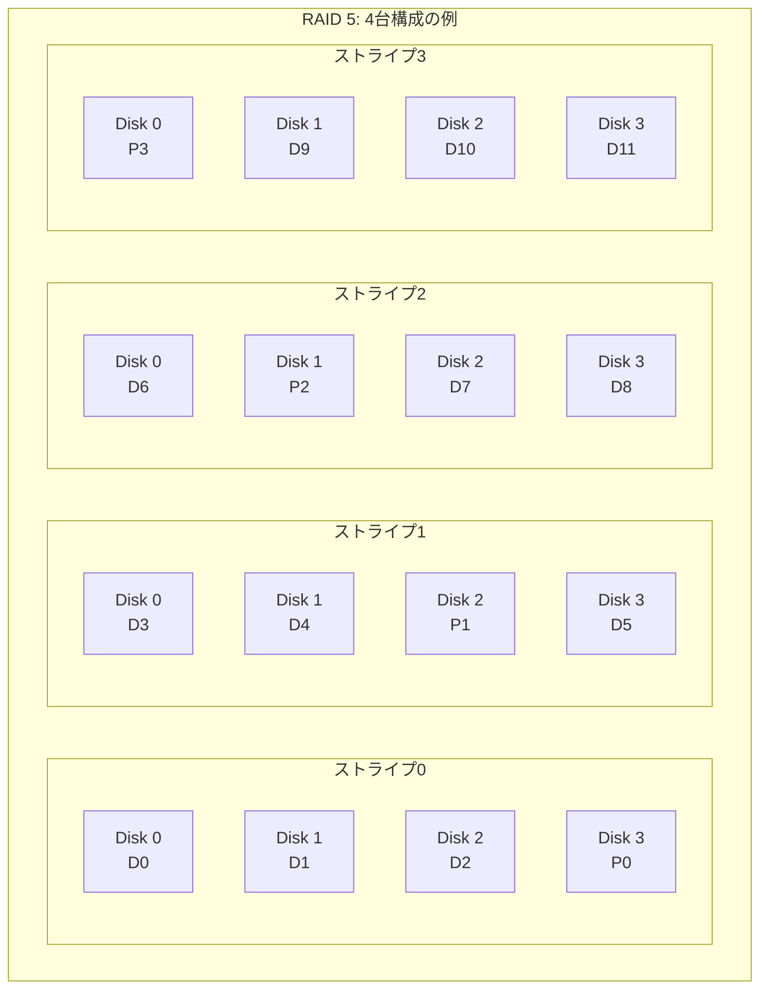
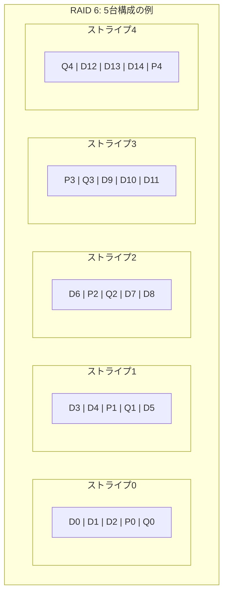
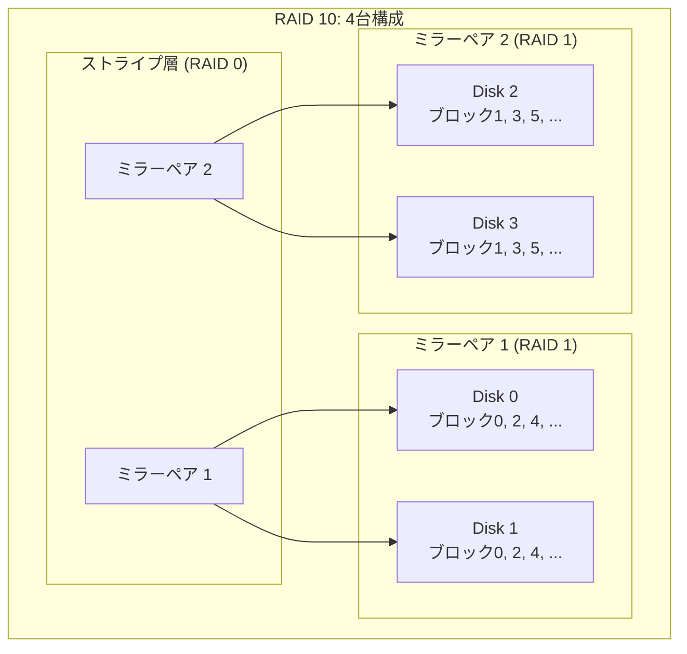
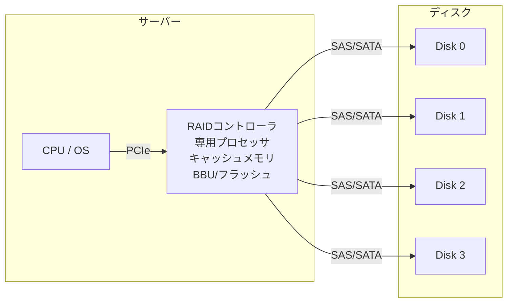
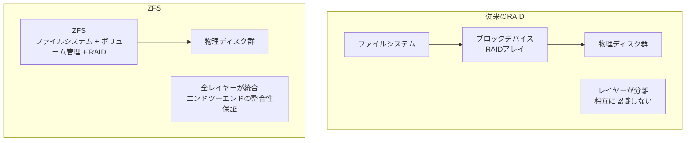

# RAID — 冗長化と性能を両立するディスクアレイ技術

## 1. RAIDの歴史と動機

### 1.1 大容量ディスクの限界

1980年代後半、コンピュータシステムの処理能力は急速に向上していたが、ストレージ技術はそのペースに追いついていなかった。CPU性能がムーアの法則に従って指数的に成長する一方で、ハードディスクドライブ（HDD）の性能改善は緩やかだった。特にランダムI/Oのレイテンシは、機械的なヘッドの移動（シーク）とプラッタの回転待ちに律速されるため、根本的な改善が困難だった。

当時の大型ストレージは、高価な大容量ディスク（いわゆるSLED: Single Large Expensive Disk）に依存していた。IBMの3380ディスクのような装置は1台あたり数万ドルにもなり、それでいて性能は1台のディスクの物理的限界に縛られていた。

### 1.2 バークレーの提案

この状況を打開する画期的なアイデアが、1988年にカリフォルニア大学バークレー校のDavid Patterson、Garth Gibson、Randy Katzによって発表された論文「*A Case for Redundant Arrays of Inexpensive Disks (RAID)*」で提示された。彼らの主張は明快だった。

> 高価な大容量ディスク1台を使う代わりに、安価な小容量ディスクを複数台束ねて使えば、容量・性能・信頼性のすべてを改善できる。

この論文が革新的だったのは、複数ディスクの活用を単なる性能向上の手段としてだけでなく、**冗長性（redundancy）を組み込むことで信頼性も同時に高める**というアーキテクチャを体系化した点にある。

論文ではRAID 1からRAID 5までの5つのレベルが定義された。後にRAID 0（冗長性なし）やRAID 6（二重パリティ）などが追加され、現在のRAIDレベル体系が形成された。

### 1.3 なぜ冗長性が必要か

複数のディスクを使うと容量と性能は向上するが、同時に**故障確率が上がる**という問題が生じる。1台のディスクの年間故障率（AFR: Annual Failure Rate）が2%だとすると、10台のアレイでは少なくとも1台が故障する確率は次のように計算される。

$$
P(\text{1台以上故障}) = 1 - (1 - 0.02)^{10} = 1 - 0.98^{10} \approx 0.183
$$

つまり、10台のアレイでは約18%の確率で年間に少なくとも1台が故障する。100台なら約87%だ。冗長性なしに複数ディスクを使えば、データ損失のリスクは台数に比例して増大する。RAIDは、このリスクを許容可能なレベルに抑えるための技術である。

### 1.4 RAIDの基本概念

RAIDの本質は、複数の物理ディスクを束ねて**1つの論理ボリューム**として見せることにある。OSやアプリケーションは個々の物理ディスクを意識する必要がなく、あたかも1台の大きなディスクにアクセスしているかのように振る舞える。



RAIDコントローラ（ハードウェアまたはソフトウェア）がデータの分散配置と冗長性の管理を担い、ディスク故障時のデータ復旧を透過的に処理する。

以降の章では、代表的なRAIDレベルの仕組みを詳しく見ていく。

## 2. RAID 0（ストライピング）

### 2.1 基本原理

RAID 0はデータを**ストライプ（stripe）**と呼ばれる固定サイズのブロックに分割し、複数のディスクに交互に書き込む方式である。厳密にはRAIDの「R」が意味する冗長性（Redundancy）を持たないため、「本当のRAID」ではないという議論もあるが、広く使われている呼称である。



ストライプサイズは通常64KB〜256KB程度で設定される。ストライプサイズの選択はワークロードによって最適値が異なる。

- **大きなストライプサイズ**（256KB〜1MB）：シーケンシャルI/Oが多いワークロードに適する。1つのI/O要求が1台のディスクで完結しやすく、ディスクごとの独立性が高まる。
- **小さなストライプサイズ**（4KB〜64KB）：1つのI/O要求が複数ディスクに跨るため、単一I/Oの帯域は向上するが、ディスクの並列性は下がる。

### 2.2 性能特性

RAID 0の最大の利点は性能である。$N$ 台のディスクでアレイを構成した場合、理論上の性能は次のようになる。

| メトリクス | 性能 |
|---|---|
| シーケンシャル読み取り帯域 | 単一ディスクの最大 $N$ 倍 |
| シーケンシャル書き込み帯域 | 単一ディスクの最大 $N$ 倍 |
| ランダム読み取りIOPS | 単一ディスクの最大 $N$ 倍 |
| ランダム書き込みIOPS | 単一ディスクの最大 $N$ 倍 |
| 利用可能容量 | ディスク容量 × $N$ |

実際にはコントローラのオーバーヘッドやバス帯域の制約があるため、線形にスケールするわけではないが、RAID 0は冗長性を持つレベルと比較して最も効率的な性能を提供する。

### 2.3 信頼性の問題

RAID 0の致命的な弱点は、**1台のディスクが故障するとアレイ全体のデータが失われる**ことである。データはディスク間に分散されているため、どの1台が欠けてもファイルシステム全体が壊れる。

$N$ 台構成のRAID 0の信頼性（MTTDL: Mean Time To Data Loss）は次のように表される。

$$
\text{MTTDL}_{\text{RAID0}} = \frac{\text{MTTF}_{\text{disk}}}{N}
$$

ここでMTTFはディスク1台の平均故障間隔である。ディスク台数が増えるほどMTTDLは短くなり、データ損失のリスクは高まる。

### 2.4 用途

RAID 0は冗長性がないため、データ損失が許容できるワークロードに限定される。

- **一時的なスクラッチ領域**：ビルドキャッシュやレンダリングの中間データなど
- **ストリーミングメディア**：別の場所にマスターデータがある場合
- **ベンチマーク・テスト環境**

重要なデータをRAID 0に置くことは推奨されない。

## 3. RAID 1（ミラーリング）

### 3.1 基本原理

RAID 1は最もシンプルな冗長化方式であり、データを**2台（以上）のディスクに完全にコピー**する。すべての書き込みは同時に全ミラーに反映され、どのディスクからでも同一のデータを読み取れる。



### 3.2 性能特性

RAID 1の性能特性は読み取りと書き込みで大きく異なる。

| メトリクス | 性能（2台ミラー） |
|---|---|
| シーケンシャル読み取り帯域 | 最大2倍（両ディスクから並列読み取り） |
| シーケンシャル書き込み帯域 | 単一ディスクと同等 |
| ランダム読み取りIOPS | 最大2倍 |
| ランダム書き込みIOPS | 単一ディスクと同等（両ディスクに書き込む必要がある） |
| 利用可能容量 | ディスク容量 × 1（50%のオーバーヘッド） |

**読み取り性能**はミラー間で負荷分散できるため向上する。RAIDコントローラは、ヘッド位置が近い方のディスクを選択する（nearest read）などの最適化を行うことで、ランダム読み取りの実効IOPSを高められる。

**書き込み性能**は、すべてのミラーにデータを書き込む必要があるため、単一ディスクと同等かわずかに低下する。ただし、書き込みの帯域はボトルネックになりにくいケースが多い。

### 3.3 信頼性

2台ミラーのRAID 1では、1台が故障してもデータは失われない。データ損失が発生するのは、**残りのディスクも故障した場合のみ**である。

$$
\text{MTTDL}_{\text{RAID1}} = \frac{\text{MTTF}_{\text{disk}}^2}{2 \times \text{MTTR}}
$$

ここでMTTRは平均修復時間（Mean Time To Repair）である。故障ディスクの交換とリビルドにかかる時間が短いほど、信頼性は高くなる。

例えば、MTTF = 100万時間、MTTR = 24時間の場合：

$$
\text{MTTDL}_{\text{RAID1}} = \frac{(10^6)^2}{2 \times 24} \approx 2.08 \times 10^{10} \text{ 時間}
$$

これは単一ディスクの100万時間を大幅に超える値であり、冗長化による信頼性向上は劇的である。

### 3.4 用途と考察

RAID 1は構成がシンプルで理解しやすく、リビルドも高速（故障ディスクから正常ディスクへの単純コピー）であるため、以下の用途に適している。

- **OSブートディスク**：ブートディスクの故障はシステム全体の停止を意味するため、ミラーリングで保護することが多い
- **データベースのトランザクションログ**：書き込み性能が重要で、データ損失が許されない領域
- **小規模サーバー**：ディスク2台で構成でき、初期コストが低い

RAID 1の最大の欠点は**容量効率が50%**にとどまることである。大容量が必要な場合はコスト面で不利になるため、RAID 5やRAID 6が選択されることが多い。

## 4. RAID 5（パリティ分散）

### 4.1 基本原理

RAID 5は、RAID 0のストライピングによる性能向上とRAID 1の冗長性を、**パリティ（parity）**という仕組みで効率的に両立させるレベルである。RAID 1が「データの完全なコピー」で冗長性を確保するのに対し、RAID 5は「データから計算可能なチェック情報」で冗長性を確保する。

パリティの本質はXOR（排他的論理和）演算である。$N$ 個のデータブロック $D_1, D_2, \ldots, D_N$ に対して、パリティ $P$ は次のように計算される。

$$
P = D_1 \oplus D_2 \oplus \cdots \oplus D_N
$$

XORの重要な性質は、**任意の1つの要素が欠けても、残りの要素から復元できる**ことである。例えば $D_2$ が失われた場合：

$$
D_2 = D_1 \oplus D_3 \oplus \cdots \oplus D_N \oplus P
$$

この性質により、$N$ 台のデータディスクに対してパリティ1台分のオーバーヘッドで1台の故障に耐えられる。

### 4.2 パリティの分散配置

初期のRAID（RAID 3, RAID 4）では、パリティを専用の1台のディスクに集中配置していた。しかし、この設計には深刻なボトルネックがある。すべての書き込み操作でパリティの更新が必要になるため、**パリティディスクがI/Oのボトルネック**になるのである。

RAID 5はこの問題を、**パリティをストライプごとに異なるディスクに分散配置**することで解決した。



この図では、パリティブロック（P0〜P3）が各ストライプごとに異なるディスクに配置されている。これにより、書き込みI/Oが特定のディスクに集中することが避けられる。

### 4.3 書き込みペナルティ

RAID 5の書き込みには「**ライトペナルティ（write penalty）**」が伴う。1つのデータブロックを更新する場合、以下の4つのI/Oが必要になる。

1. **旧データの読み取り**（更新対象ブロック）
2. **旧パリティの読み取り**（対応するパリティブロック）
3. **新データの書き込み**
4. **新パリティの書き込み**

新しいパリティは次の式で効率的に計算できる。

$$
P_{\text{new}} = P_{\text{old}} \oplus D_{\text{old}} \oplus D_{\text{new}}
$$

この「Read-Modify-Write」サイクルにより、RAID 5のランダム書き込み性能はRAID 0やRAID 1に比べて大幅に低下する。ランダム書き込みが多いワークロード（OLTP系データベースなど）では、この点が大きな制約となる。

::: warning ライトホール問題
RAID 5にはいわゆる「ライトホール（write hole）」問題がある。データブロックとパリティブロックの書き込みの間で電源障害が発生すると、パリティとデータの一貫性が崩れる。この問題に対処するためには、バッテリバックアップ付きキャッシュ（BBU: Battery Backup Unit）を持つRAIDコントローラや、ジャーナリング機能を持つファイルシステム/RAID実装が必要となる。
:::

### 4.4 性能特性

| メトリクス | 性能（$N$ 台構成） |
|---|---|
| シーケンシャル読み取り帯域 | 単一ディスクの最大 $(N-1)$ 倍 |
| シーケンシャル書き込み帯域 | 単一ディスクの最大 $(N-1)$ 倍 |
| ランダム読み取りIOPS | 単一ディスクの最大 $N$ 倍 |
| ランダム書き込みIOPS | 単一ディスクの約 $N/4$ 倍（ライトペナルティ） |
| 利用可能容量 | ディスク容量 × $(N-1)$ |

### 4.5 リビルドとリスク

RAID 5でディスクが1台故障すると、アレイは**デグレード状態（degraded mode）**で動作を継続する。デグレード状態では、失われたディスクのデータを他のディスクとパリティからオンザフライで再計算するため、読み取り性能が大幅に低下する。

故障ディスクを交換してリビルド（再構築）を行う際には、アレイ内の全ディスクから全データを読み出す必要があるため、**リビルド中は全ディスクに高い負荷がかかる**。大容量ディスクではリビルドに数時間から数十時間を要する場合があり、この期間中に追加のディスク故障が発生するとデータが完全に失われる。

現代の大容量HDD（8TB〜20TB）では、リビルド時間の長期化が深刻な問題となっている。例えば12TBのディスクを100MB/sでリビルドすると、約33時間かかる計算になる。この間のURE（Unrecoverable Read Error）リスクも無視できない。HDDのURE率が $10^{14}$ ビットに1回（≈12.5TB）だとすると、12TBのリビルド中にUREが発生する確率は無視できない水準になる。

この問題がRAID 6や、後述するZFSのようなより高度なRAID実装が求められるようになった大きな要因である。

## 5. RAID 6（二重パリティ）

### 5.1 基本原理

RAID 6はRAID 5を拡張し、**2種類の独立したパリティ**を使うことで、同時に2台のディスク故障に耐えられるようにしたレベルである。

1つ目のパリティ $P$ はRAID 5と同じXORベースだが、2つ目のパリティ $Q$ は**ガロア体（Galois Field）$GF(2^8)$** の演算を使って計算される。具体的には、Reed-Solomon符号の原理に基づく。

$$
P = D_1 \oplus D_2 \oplus \cdots \oplus D_N
$$
$$
Q = g^1 \cdot D_1 \oplus g^2 \cdot D_2 \oplus \cdots \oplus g^N \cdot D_N
$$

ここで $g$ は $GF(2^8)$ の生成元であり、乗算は $GF(2^8)$ 上で行われる。$P$ と $Q$ は数学的に独立であるため、2台のディスクが同時に故障しても、2つの連立方程式を解くことでデータを復元できる。

### 5.2 データ配置



RAID 5と同様に、P パリティと Q パリティもストライプごとに異なるディスクに分散配置される。

### 5.3 性能特性

| メトリクス | 性能（$N$ 台構成） |
|---|---|
| シーケンシャル読み取り帯域 | 単一ディスクの最大 $(N-2)$ 倍 |
| シーケンシャル書き込み帯域 | 単一ディスクの最大 $(N-2)$ 倍 |
| ランダム読み取りIOPS | 単一ディスクの最大 $N$ 倍 |
| ランダム書き込みIOPS | 単一ディスクの約 $N/6$ 倍（2種類のパリティ更新が必要） |
| 利用可能容量 | ディスク容量 × $(N-2)$ |

RAID 6のランダム書き込みペナルティはRAID 5よりもさらに大きい。1つのデータブロックの更新に6つのI/O（旧データ読み取り、旧P読み取り、旧Q読み取り、新データ書き込み、新P書き込み、新Q書き込み）が必要になるためである。

### 5.4 RAID 5 vs RAID 6 の選択

| 項目 | RAID 5 | RAID 6 |
|---|---|---|
| 最小ディスク数 | 3 | 4 |
| 耐障害ディスク数 | 1 | 2 |
| 容量オーバーヘッド | ディスク1台分 | ディスク2台分 |
| 書き込みペナルティ | 4 I/O | 6 I/O |
| リビルド中の安全性 | 低（追加故障でデータ損失） | 高（もう1台故障しても耐えられる） |
| 推奨用途 | 小規模アレイ（4台以下） | 中〜大規模アレイ（5台以上） |

現在では、**大容量HDDを使うシステムではRAID 6が事実上の標準**になっている。前節で述べたリビルド時間の長期化とUREリスクを考慮すると、RAID 5では実用上の安全性が不十分だからである。多くのストレージベンダーはRAID 5の使用を推奨しなくなっている。

## 6. RAID 10（ミラー + ストライプ）

### 6.1 基本原理

RAID 10（RAID 1+0とも表記される）は、**RAID 1（ミラーリング）のペアをRAID 0（ストライピング）で束ねた**ネストRAIDレベルである。まずディスクをペアにしてミラーを作り、そのミラーペア群に対してストライピングを行う。



### 6.2 性能特性

| メトリクス | 性能（$N$ 台構成、$N/2$ ミラーペア） |
|---|---|
| シーケンシャル読み取り帯域 | 単一ディスクの最大 $N$ 倍 |
| シーケンシャル書き込み帯域 | 単一ディスクの最大 $N/2$ 倍 |
| ランダム読み取りIOPS | 単一ディスクの最大 $N$ 倍 |
| ランダム書き込みIOPS | 単一ディスクの最大 $N/2$ 倍 |
| 利用可能容量 | ディスク容量 × $N/2$ |

RAID 10の最も重要な利点は、**ランダム書き込み性能がRAID 5/6と比較して圧倒的に優れている**ことである。パリティ計算が不要なため、Read-Modify-Writeサイクルが発生しない。書き込みは単純にミラーペアの両方のディスクに対して行うだけで完了する。

### 6.3 耐障害性

RAID 10は最小で1台、最大で $N/2$ 台のディスク故障に耐えられる。ただし、**同じミラーペアの2台が同時に故障するとデータは失われる**。つまり、どのディスクが故障するかによって耐障害台数が変わる。

- **最良ケース**：すべての故障が異なるミラーペアで発生 → $N/2$ 台まで耐えられる
- **最悪ケース**：同じミラーペアの2台が故障 → 2台目の故障でデータ損失

### 6.4 RAID 01との違い

RAID 01（RAID 0+1）はRAID 10とは逆の構成で、**先にストライピングしてからミラーリング**を行う。一見似ているが、耐障害性に重要な違いがある。

```
RAID 10:  ミラーペアを束ねてストライプ
          → 1台故障すると、そのミラーペアだけがデグレード
          → 残りのミラーペアは健全

RAID 01:  ストライプセットをミラーリング
          → 1台故障すると、そのストライプセット全体がデグレード
          → もう1つのストライプセットの任意の1台が故障するとデータ損失
```

RAID 10はRAID 01より耐障害性が高いため、一般にRAID 10が推奨される。

### 6.5 用途

RAID 10は容量効率が50%と低いが、性能と信頼性のバランスが優れているため、以下の用途で広く採用されている。

- **データベースサーバー**：特にOLTPワークロードではランダム書き込みが多いため、RAID 5/6のライトペナルティが問題になる
- **仮想化基盤**：多数のVMが同時にI/Oを発行するため、ランダムI/O性能が重要
- **メールサーバー**：小さなファイルへのランダムアクセスが主体

## 7. RAIDレベルの比較まとめ

以下の表は、主要なRAIDレベルの特性を比較したものである。

| 項目 | RAID 0 | RAID 1 | RAID 5 | RAID 6 | RAID 10 |
|---|---|---|---|---|---|
| 最小ディスク数 | 2 | 2 | 3 | 4 | 4 |
| 耐障害ディスク数 | 0 | 1 | 1 | 2 | 1〜N/2 |
| 容量効率 | 100% | 50% | $(N-1)/N$ | $(N-2)/N$ | 50% |
| 読み取り性能 | 優秀 | 良好 | 良好 | 良好 | 優秀 |
| 書き込み性能 | 優秀 | 良好 | やや低い | 低い | 良好 |
| リビルド速度 | N/A | 高速 | 遅い | 遅い | 高速 |
| 主な用途 | 一時データ | ブートディスク | ファイルサーバー | 大規模ストレージ | データベース |

## 8. ハードウェアRAID vs ソフトウェアRAID

### 8.1 ハードウェアRAID

ハードウェアRAIDは、専用のRAIDコントローラカード（HBA: Host Bus Adapter にRAID機能を搭載したもの）によってRAID処理を行う方式である。

**アーキテクチャ：**



**利点：**

- **CPUオフロード**：パリティ計算やI/Oスケジューリングを専用ハードウェアが処理するため、ホストCPUの負荷が軽減される
- **BBU/フラッシュバックキャッシュ**：バッテリまたはフラッシュメモリで保護されたライトバックキャッシュにより、書き込み性能が大幅に向上する。電源障害時もキャッシュ内のデータは保護される
- **ライトホール問題の軽減**：BBU付きキャッシュにより、パリティとデータの一貫性が保たれやすい
- **OS非依存**：BIOSレベルでRAIDが認識されるため、OSのインストールやブートが容易

**欠点：**

- **コスト**：高品質なRAIDコントローラは高価（数万円〜数十万円）
- **ベンダーロックイン**：コントローラが故障した場合、同じモデル（または互換モデル）のコントローラが必要。異なるベンダーのコントローラではアレイを認識できない場合がある
- **単一障害点**：コントローラ自体の故障がアレイ全体の停止につながる
- **透明性の欠如**：コントローラのファームウェアがブラックボックスであり、内部の挙動を完全に把握することが難しい

代表的なハードウェアRAIDコントローラには、Broadcom（旧LSI / Avago）のMegaRAIDシリーズや、Microsemi（旧Adaptec）のSmartRAIDシリーズがある。

### 8.2 ソフトウェアRAID

ソフトウェアRAIDは、OS上のソフトウェアレイヤーでRAID機能を実装する方式である。

**代表的なソフトウェアRAID実装：**

| 実装 | OS | 特徴 |
|---|---|---|
| Linux md (mdadm) | Linux | カーネルレベルで動作、最も広く使われている |
| LVM RAID | Linux | LVMの上にRAIDを構築 |
| Windows Storage Spaces | Windows | Windows Server 2012以降で利用可能 |
| Apple RAID | macOS | Disk Utilityから設定可能 |

**利点：**

- **コスト**：追加のハードウェアが不要
- **柔軟性**：ソフトウェアの更新で機能改善やバグ修正が可能
- **透明性**：オープンソース実装であれば、コードを読んで挙動を完全に把握できる
- **移植性**：同じOSが動作する別のハードウェアにディスクを移動してもアレイを認識できる
- **ベンダー非依存**：特定のハードウェアに依存しない

**欠点：**

- **CPU負荷**：パリティ計算やI/O処理がホストCPUで行われる。ただし、現代のCPUは十分高速であり、多くのワークロードでこの点は問題にならない
- **BBUの欠如**：ソフトウェアRAIDにはライトバックキャッシュのバッテリ保護がない（ファイルシステム側のジャーナリングで対処する場合が多い）
- **ブートの複雑さ**：OSブートディスクをソフトウェアRAIDで構成する場合、ブートローダーの設定が複雑になることがある

### 8.3 現代における選択

2020年代の実情として、ハードウェアRAIDの優位性は薄れつつある。

1. **CPUの高性能化**：現代のサーバーCPUは十分に高速であり、ソフトウェアRAIDのパリティ計算はほとんどオーバーヘッドにならない
2. **NVMe SSDの普及**：NVMe SSDはPCIeバスに直結するため、従来のSAS/SATA RAIDコントローラを経由する構成が適さない。多くのNVMe環境ではソフトウェアRAIDが自然な選択となる
3. **ZFS/Btrfsの台頭**：ファイルシステムレベルでRAID機能を統合するアプローチが普及し、従来のハードウェアRAIDとは異なるパラダイムが登場している

特にクラウド環境では、仮想ディスク（EBSなど）自体がストレージバックエンドで冗長化されているため、ゲストOS側でのRAID構成は別の意味合いを持つ（主に性能向上やさらなる冗長性のため）。

## 9. ZFS / Btrfs の RAID 実装

### 9.1 従来のRAIDの限界

従来のRAID（ハードウェアRAID、Linux md）は、ブロックデバイスレイヤーで動作する。ファイルシステムはRAIDの存在を認識せず、RAIDもファイルシステムの構造を認識しない。この「レイヤー間の断絶」がいくつかの問題を引き起こす。

- **サイレントデータ破損**：ディスク上のデータがビット腐敗（bit rot）などで無言のうちに破損しても、従来のRAIDはそれを検出できない。パリティが一致するかどうかは、リビルド時にしか検証されない
- **ライトホール問題**：前述の通り、パリティとデータの整合性が崩れるリスクがある
- **非効率なリビルド**：従来のRAIDは、使用中・未使用にかかわらずディスク全体をリビルドする。大容量ディスクで使用率が低い場合、無駄なI/Oが大量に発生する

### 9.2 ZFSのアプローチ

ZFSは2005年にSun Microsystemsが開発したファイルシステム兼ボリュームマネージャであり、RAID機能を**ファイルシステム内に統合**するという革新的なアプローチを採用している。ZFSのRAID実装はRAID-Zと呼ばれ、従来のRAIDの問題を根本的に解決している。

**RAID-Zの種類：**

| レベル | パリティ数 | 耐障害ディスク数 | 従来のRAIDとの対応 |
|---|---|---|---|
| RAID-Z1 | 1 | 1 | RAID 5相当 |
| RAID-Z2 | 2 | 2 | RAID 6相当 |
| RAID-Z3 | 3 | 3 | 従来RAIDに対応なし |

**ZFS RAID-Zの優位性：**

1. **エンドツーエンドのチェックサム**：ZFSはすべてのブロックにチェックサム（デフォルトではFletcher-4、設定によりSHA-256も使用可能）を付与し、読み取り時に検証する。ビット腐敗が検出されると、冗長コピーやパリティから自動的に修復する（自己修復: self-healing）

2. **ライトホール問題の解消**：ZFSはCoW（Copy-on-Write）方式を採用しているため、既存のデータやパリティを上書きしない。新しいデータとパリティは常に新しい位置に書き込まれ、メタデータのアトミックな更新によって切り替えられる。これにより、ライトホール問題は原理的に発生しない

3. **可変ストライプ幅**：従来のRAIDはストライプサイズが固定だが、RAID-Zはファイルシステムのブロックサイズに応じて**ストライプ幅を動的に調整**する。これにより、小さなファイルの書き込みでもディスクスペースの無駄が少ない

4. **効率的なリビルド（resilvering）**：ZFSはファイルシステムのメタデータを利用して、**使用中のブロックだけをリビルド**する。ディスクの使用率が低い場合、リビルド時間が大幅に短縮される



### 9.3 ZFSの構成例

ZFSのストレージプールは**vdev（virtual device）**の集合で構成される。各vdevがRAID-Z、ミラー、または単一ディスクのいずれかを構成し、プール内のvdev間でデータがストライピングされる。

```bash
# RAID-Z2 vdevを2つ持つプールの作成例
# Each vdev has 4 disks, tolerating 2 disk failures per vdev
zpool create tank \
    raidz2 /dev/sda /dev/sdb /dev/sdc /dev/sdd \
    raidz2 /dev/sde /dev/sdf /dev/sdg /dev/sdh

# ミラーvdevを4つ持つプールの作成例（RAID 10相当）
# Each mirror pair tolerates 1 disk failure
zpool create tank \
    mirror /dev/sda /dev/sdb \
    mirror /dev/sdc /dev/sdd \
    mirror /dev/sde /dev/sdf \
    mirror /dev/sdg /dev/sdh
```

::: tip ZFSのベストプラクティス
ZFSでは、**vdevの数を増やす**ことでIOPSを向上させることができる。例えば、8台のディスクがある場合、1つの8台RAID-Z2よりも、2つの4台RAID-Z1の方がIOPS性能は高い（ただし耐障害性は低くなる）。ワークロードの性質に応じて、vdev構成を慎重に設計する必要がある。
:::

### 9.4 Btrfs の RAID 実装

Btrfs（B-tree file system）はLinuxのCoWファイルシステムであり、ZFSと同様にRAID機能を内蔵している。BtrfsのRAID実装は以下のレベルをサポートする。

| レベル | 説明 | 状態 |
|---|---|---|
| RAID 0 | ストライピング | 安定 |
| RAID 1 | ミラーリング（2コピー） | 安定 |
| RAID 1C3 | 3コピーミラーリング | 安定 |
| RAID 1C4 | 4コピーミラーリング | 安定 |
| RAID 5 | パリティ分散 | **不安定（実験的）** |
| RAID 6 | 二重パリティ | **不安定（実験的）** |
| RAID 10 | ミラー + ストライプ | 安定 |

::: danger Btrfs RAID 5/6 の注意点
2026年現在、BtrfsのRAID 5/6実装にはライトホール問題が完全には解決されておらず、実運用での使用は推奨されない。データの信頼性が重要な環境では、Btrfs RAID 1/10を使用するか、ZFSのRAID-Zを検討すべきである。
:::

BtrfsはZFSと同様にチェックサム（デフォルトではCRC-32C、設定によりXXHash、SHA-256、BLAKE2bも使用可能）によるデータ整合性検証を備えている。ミラー構成であれば、破損したコピーを検出して正常なコピーから自動修復する機能が動作する。

### 9.5 ZFS vs Btrfs

| 項目 | ZFS | Btrfs |
|---|---|---|
| 成熟度 | 高い（2005年〜） | 中程度（2009年〜） |
| ライセンス | CDDL（Linuxカーネルとの互換性問題） | GPL（Linuxカーネルに統合） |
| RAID 5/6相当 | RAID-Z1/Z2/Z3（安定） | RAID 5/6（不安定） |
| メモリ使用量 | 多い（ARCキャッシュ） | 少ない |
| プール拡張 | vdev単位（vdev内のディスク追加は不可） | デバイス単位（柔軟） |
| スナップショット | 高性能 | 高性能 |
| 送受信（レプリケーション） | 高機能 | 高機能 |
| エンタープライズ採用 | 広い（NAS、ストレージ） | 限定的 |

ZFSは信頼性の面でより成熟しており、ストレージアプライアンス（TrueNASなど）で広く採用されている。BtrfsはLinuxカーネルに統合されている利便性があり、SUSEやFedoraなどのディストリビューションでデフォルト採用されるケースがある。

## 10. SSD時代のRAID考慮事項

### 10.1 SSDがRAIDに与えた影響

SSD（Solid State Drive）の普及は、RAIDの設計前提を根本的に変えた。HDDとSSDの特性差は以下の通りである。

| 特性 | HDD | SSD (NVMe) |
|---|---|---|
| ランダム読み取りレイテンシ | 5〜10 ms | 10〜100 μs |
| ランダム読み取りIOPS | 100〜200 | 100,000〜1,000,000 |
| シーケンシャル帯域 | 100〜250 MB/s | 3,000〜7,000 MB/s |
| 故障モード | 機械的劣化（段階的） | NAND摩耗（突発的なケースあり） |
| 振動・衝撃耐性 | 低い | 高い |

### 10.2 性能面の変化

**RAIDコントローラのボトルネック化：** NVMe SSDは1台で数十万IOPSを発生させるため、従来のSAS/SATA RAIDコントローラが処理能力の上限に達してしまう。NVMe SSDをRAIDコントローラ経由で接続すると、SSD本来の性能を活かせない場合がある。このため、NVMe環境ではソフトウェアRAIDやファイルシステムベースのRAID（ZFS、Btrfsなど）が適している。

**パリティ計算のオーバーヘッド：** SSDの高いIOPSに追いつくためには、パリティ計算も高速に行う必要がある。現代のCPUはこの計算を十分に高速に処理できるが、RAID 5/6の書き込みペナルティ（Read-Modify-Write）は依然としてI/O増幅を引き起こし、SSDの寿命（書き込み回数制限）に影響を与える。

**ストライプサイズの再考：** HDDではストライプサイズの選択がシーケンシャルアクセス性能に大きく影響したが、SSDではランダムアクセスのレイテンシが極めて低いため、ストライプサイズの影響は相対的に小さくなる。

### 10.3 信頼性面の変化

**故障モードの違い：** HDDの故障は多くの場合、セクタの段階的な劣化として現れるため、S.M.A.R.T.情報などで事前に予兆を検知できることが多い。一方、SSDの故障はNANDフラッシュの書き込み回数制限（P/Eサイクル）の枯渇やコントローラの障害によって発生し、突発的に全面故障するケースがある。

**書き込み増幅とSSD寿命：** RAID 5/6では1回の論理書き込みが複数回の物理書き込みに増幅される（ライトペナルティ）。SSDは書き込み回数に物理的な制限があるため、RAID構成による書き込み増幅がSSDの寿命を短縮する。さらに、SSD自体が内部でウェアレベリングやガベージコレクションを行っており、そのI/O（書き込み増幅: Write Amplification Factor, WAF）とRAIDのライトペナルティが重畳する。

$$
\text{実効WAF} = \text{SSD内部WAF} \times \text{RAIDライトペナルティ倍率}
$$

この二重の書き込み増幅は、SSD環境でのRAID設計において重要な考慮事項である。

**URE率の改善：** SSDはHDDと比較してURE率が低い（一般に $10^{15}$〜$10^{17}$ ビットに1回）。これにより、リビルド中のURE発生リスクが大幅に低減され、RAID 5の実用性がHDD環境よりも高くなる。

### 10.4 SSD環境でのRAID構成の推奨

SSD環境でのRAID構成は、HDDとは異なるガイドラインに基づくべきである。

**性能重視の場合：** RAID 0またはRAID 10が推奨される。パリティベースのRAID（5/6）は書き込み増幅によるSSD寿命短縮が懸念されるが、書き込みが少ないワークロード（読み取り主体）であれば問題は軽減される。

**容量効率と冗長性のバランス：** NVMe SSD環境では、ソフトウェアRAID（Linux mdやZFS）が自然な選択肢となる。特にZFSは、チェックサムによるサイレント破損の検出やCoWによるライトホール問題の回避など、SSD環境でも有効な特性を備えている。

**エンタープライズSSDのRAS機能：** エンタープライズ向けSSDは、パワーロスプロテクション（PLP）、エンドツーエンドデータ保護（T10 DIF/DIX）、予測可能な寿命管理などのRAS（Reliability, Availability, Serviceability）機能を備えている。これらの機能はRAIDの信頼性を補完し、より堅牢なストレージシステムを構築する基盤となる。

### 10.5 NVMe RAIDの最新動向

NVMe SSDの高性能を活かすRAID技術として、以下のようなアプローチが注目されている。

**Linux md RAID with NVMe：** Linux mdはNVMe SSDを直接サポートしており、ソフトウェアRAIDとして最もシンプルな選択肢である。マルチキュー対応（md-multiqueue）により、NVMeの並列I/O能力を活かせるようになっている。

**SPDK (Storage Performance Development Kit)：** IntelのSPDKは、カーネルをバイパスしてNVMeデバイスにアクセスするユーザースペースフレームワークであり、ソフトウェアRAID機能も含む。カーネル経由のオーバーヘッドを排除することで、極めて低レイテンシのRAIDを実現する。

**Computational Storage：** SSD自体にRAID計算をオフロードする「コンピューテーショナルストレージ」の研究も進んでいる。SSD内蔵のプロセッサでパリティ計算やチェックサム検証を行い、ホストCPUとI/Oバスの負荷を軽減するアプローチである。

## 11. RAIDとバックアップの関係

### 11.1 RAIDはバックアップではない

RAIDに関して最も重要な認識は、**RAIDはバックアップの代替にはならない**ということである。この点は何度強調しても足りない。

RAIDが保護するもの：
- ディスクの物理的故障

RAIDが保護**しない**もの：
- **人為的なミス**：誤ってファイルを削除した場合、RAIDは即座にその削除を全ミラー/パリティに反映する
- **ソフトウェアの障害**：ファイルシステムの破損、アプリケーションのバグによるデータ破壊
- **ランサムウェア・マルウェア**：暗号化型マルウェアはRAIDアレイ全体を暗号化する
- **コントローラ障害**：RAIDコントローラ自体の故障やファームウェアバグ
- **災害**：火災、水害、落雷など物理的な災害はRAIDアレイ全体を破壊する

したがって、RAIDは**可用性（availability）を高める技術**であり、**耐久性（durability）を保証する技術ではない**。データの耐久性を確保するためには、3-2-1ルール（3つのコピー、2種類のメディア、1つはオフサイト）に基づくバックアップ戦略が必須である。

### 11.2 RAIDとバックアップの組み合わせ

実運用では、RAIDとバックアップを組み合わせて使うのが正しいアプローチである。

```
ストレージ戦略の階層

1. RAID       → ディスク故障時の可用性を維持
2. スナップショット → 短期的な復旧ポイント（人為ミスの復旧）
3. ローカルバックアップ → 中期的なデータ保護
4. オフサイトバックアップ → 災害対策（DR: Disaster Recovery）
```

ZFSやBtrfsのスナップショット機能は、RAIDとバックアップの中間に位置する有用な機能であり、人為ミスからの迅速な復旧に特に効果的である。

## 12. まとめと今後の展望

### 12.1 RAIDの本質

RAIDは、複数の物理ディスクを束ねて冗長性と性能を確保するという、シンプルだが強力なアイデアである。1988年の提案から40年近く経った現在でも、ストレージシステムの基盤技術として広く使われている。

各RAIDレベルはそれぞれ異なるトレードオフを持ち、ワークロードの性質に応じた選択が求められる。

- **性能重視、冗長性不要** → RAID 0
- **シンプルな冗長性** → RAID 1
- **容量効率と冗長性** → RAID 5 / RAID 6
- **性能と冗長性の両立** → RAID 10
- **データ整合性の包括的保護** → ZFS RAID-Z / Btrfs RAID

### 12.2 今後の展望

**イレージャーコーディングの進化：** クラウドストレージでは、RAIDの概念を拡張した**イレージャーコーディング（Erasure Coding）**が広く使われている。Reed-Solomon符号やLocal Reconstruction Code（LRC）により、ノード間でデータを分散配置し、任意の $k$ 台の故障に耐える構成を実現する。Azure Storage、Google Colossus、Facebook（Meta）のf4などが実例である。

**CXL（Compute Express Link）とメモリティアリング：** CXLの普及により、メモリとストレージの境界が曖昧になりつつある。永続メモリ（Persistent Memory）やCXL接続のストレージデバイスでは、従来のRAIDとは異なるデータ保護の仕組みが求められる可能性がある。

**ZNS SSD（Zoned Namespace SSD）：** ZNS SSDはゾーンベースの書き込みインターフェースを提供し、SSD内部の書き込み増幅を低減する。ZNS SSD向けのRAID実装は、ゾーンの概念をRAIDレイヤーで適切に扱う必要があり、新たな設計課題を提示している。

**ソフトウェア定義ストレージ（SDS）の深化：** Ceph、MinIO、DAOS（Distributed Asynchronous Object Storage）などのソフトウェア定義ストレージは、クラスタレベルでイレージャーコーディングやレプリケーションを行い、個別ノードのRAID構成に依存しないアーキテクチャを採用している。このトレンドは、ローカルRAIDの重要性を相対的に低下させる方向に作用する。

RAIDという概念自体は「冗長性によるデータ保護」という普遍的な原理に基づいており、ストレージ技術がどのように進化しても、その本質は変わらない。変わるのは実装のレイヤーと手法であり、ブロックデバイスレベルのRAIDからファイルシステムレベル、さらにはクラスタレベルへと、冗長化の実装ポイントが上位レイヤーに移行しつつある。
