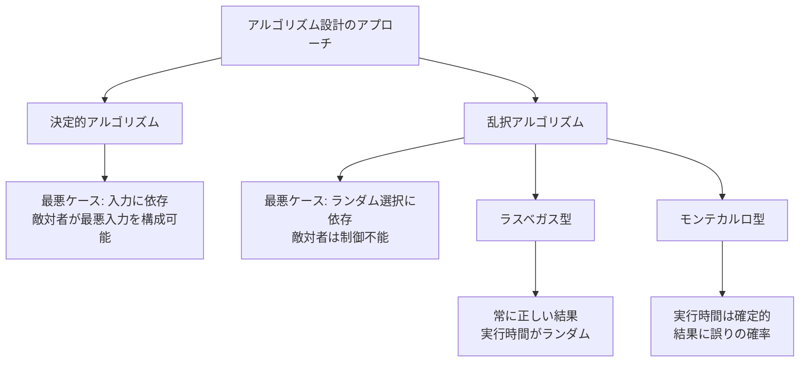
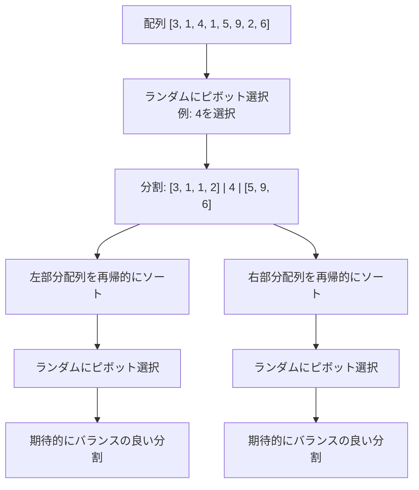
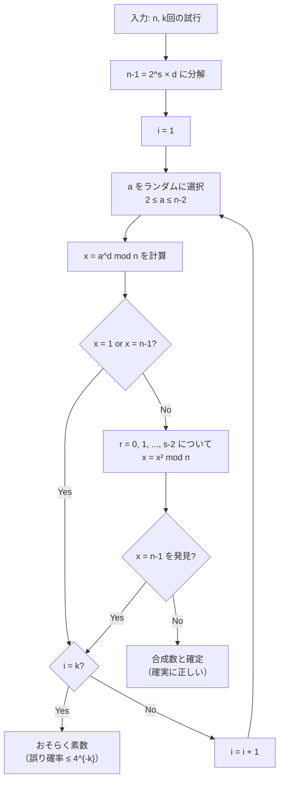
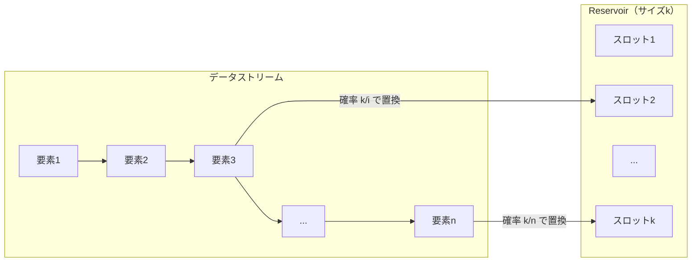
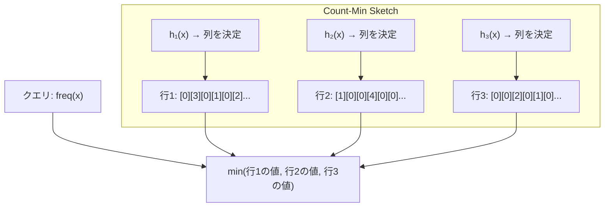
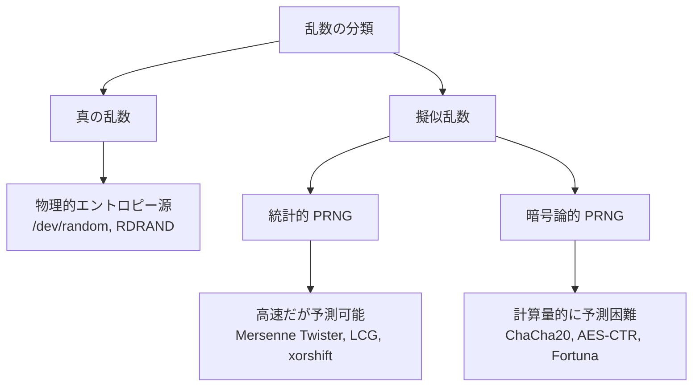
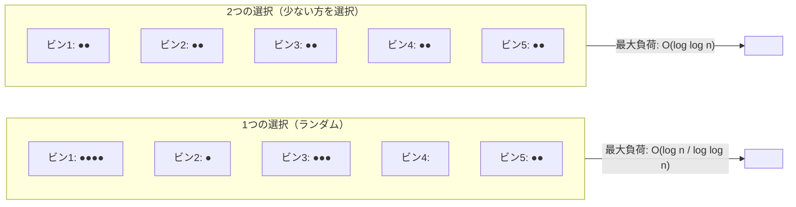
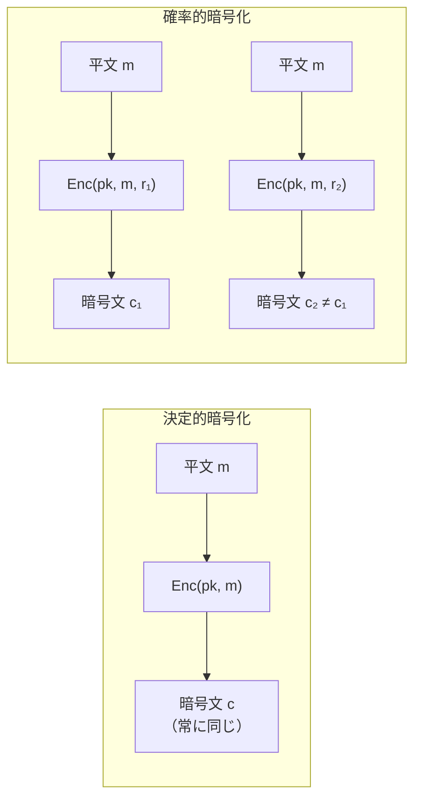

# 乱択アルゴリズム（Randomized Algorithms）

## 1. 乱択アルゴリズムとは

### 決定的アルゴリズムの限界

コンピューターサイエンスの伝統的なアルゴリズム設計では、入力に対して常に同じ手順を踏み、同じ結果を返す**決定的アルゴリズム（Deterministic Algorithm）**が基本とされてきた。しかし、多くの問題において決定的アルゴリズムには本質的な限界がある。

例えば、ソートアルゴリズムにおける QuickSort を考えよう。決定的にピボットを選択する場合（例：常に先頭要素を選ぶ）、特定の入力パターン（既にソート済みの配列など）に対して最悪計算量 $O(n^2)$ に陥る。また、素数判定のような問題では、決定的な手法である AKS 素数判定法は理論的には多項式時間だが、実用的には乱択的手法に大きく劣る。

このような背景から、**アルゴリズムの実行過程にランダムネス（乱数）を導入する**という発想が生まれた。これが乱択アルゴリズム（Randomized Algorithm）である。

### 乱択アルゴリズムの定義と基本概念

乱択アルゴリズムとは、計算の途中で**乱数生成器（Random Number Generator）**を用いてランダムな選択を行うアルゴリズムのことである。形式的には、乱択アルゴリズムは通常の入力に加え、ランダムビット列 $r \in \{0, 1\}^*$ を追加の入力として受け取るアルゴリズムと捉えることができる。

$$A(x, r) \to y$$

ここで $x$ は入力、$r$ はランダムビット列、$y$ は出力である。同じ入力 $x$ に対しても、$r$ が異なれば異なる出力や異なる実行時間を示す可能性がある。

乱択アルゴリズムの重要な性質は、**ランダムネスの源泉がアルゴリズム自身の内部にある**ことだ。最悪ケースの入力を想定する敵対者（adversary）がいたとしても、アルゴリズムがどのランダム選択を行うかは予測できない。これにより、決定的アルゴリズムでは避けられない最悪ケースを**確率的に回避**できる。

### なぜ乱択が有効なのか

乱択アルゴリズムが有効である本質的な理由は、**最悪ケースの「確率的平滑化」**にある。決定的アルゴリズムでは、敵対者が最悪入力を構成できるが、乱択アルゴリズムでは最悪ケースの発生が入力ではなくアルゴリズム内部のランダム選択に依存するため、特定の入力に対して常に最悪性能になることがない。

この考え方を図で整理する。



乱択アルゴリズムのもう一つの重要な利点は、**アルゴリズムの単純化**である。多くの問題で、決定的に最適な選択を行うには複雑なデータ構造や精緻な解析が必要だが、ランダムな選択で「十分に良い」結果を得ることで、アルゴリズムを大幅に簡潔にできる場合がある。

## 2. ラスベガス型 vs モンテカルロ型

乱択アルゴリズムは、出力の正確性と実行時間の性質に基づいて、大きく2つのカテゴリに分類される。

### ラスベガス型アルゴリズム（Las Vegas Algorithm）

ラスベガス型アルゴリズムは、**常に正しい結果を返す**が、**実行時間がランダム**なアルゴリズムである。つまり、出力の正確性は保証されるが、いつ終了するかは確率的にしか分からない。

形式的には、ラスベガス型アルゴリズム $A$ は以下の性質を持つ：

$$\forall x: \Pr[A(x) = \text{correct answer}] = 1$$

$$E[T(x)] \leq f(|x|) \quad \text{（期待実行時間が有限）}$$

代表的なラスベガス型アルゴリズムには以下がある：

- **Randomized QuickSort**: 常に正しくソートするが、ピボットのランダム選択により実行時間が変動する
- **Randomized Selection（QuickSelect）**: k番目に小さい要素を常に正しく見つけるが、実行時間はランダム
- **ランダム化されたハッシュテーブル**: ユニバーサルハッシュを用いることで、任意の入力に対して期待 $O(1)$ の操作を保証

### モンテカルロ型アルゴリズム（Monte Carlo Algorithm）

モンテカルロ型アルゴリズムは、**実行時間は確定的**（または有界）だが、**結果に誤りが含まれる確率がある**アルゴリズムである。

形式的には、モンテカルロ型アルゴリズム $A$ は以下の性質を持つ：

$$\Pr[A(x) = \text{correct answer}] \geq 1 - \epsilon$$

ここで $\epsilon > 0$ は誤り確率の上界である。

モンテカルロ型はさらに、誤りの方向性によって分類される：

- **片側誤りモンテカルロ（One-sided error）**: YES/NO の一方の回答は常に正しく、もう一方にのみ誤りの可能性がある
- **両側誤りモンテカルロ（Two-sided error）**: どちらの回答にも誤りの可能性がある

代表的なモンテカルロ型アルゴリズム：

- **Miller-Rabin 素数判定**: 「合成数」の判定は常に正しいが、「素数」の判定には誤りの可能性がある（片側誤り）
- **ランダムウォークによる 2-SAT 解法**: 解が存在する場合に高確率で見つける
- **近似カウンティング**: 正確な値ではなく、高確率で近い値を返す

### 誤り確率の増幅（Probability Amplification）

モンテカルロ型アルゴリズムの極めて重要な性質は、**独立に複数回実行することで誤り確率を指数的に削減できる**ことである。

誤り確率が $\epsilon$ のモンテカルロ型アルゴリズムを $k$ 回独立に実行し、多数決を取ると、誤り確率は以下のように減少する。

片側誤りの場合、$k$ 回実行して一度でも「NO」と出れば NO、すべて「YES」なら YES と判定すると：

$$\Pr[\text{誤り}] \leq \epsilon^k$$

両側誤りの場合（$\epsilon < 1/2$）、$k$ 回の多数決では Chernoff 限界により：

$$\Pr[\text{誤り}] \leq e^{-\Omega(k)}$$

つまり、実行回数を線形に増やすだけで、誤り確率を**指数的に**減少させることができる。これは乱択アルゴリズムの実用性を裏付ける極めて強力な結果である。

::: tip 確率増幅の直感
コインを投げて表が出る確率が 3/4 だとする。1回投げただけでは 1/4 の確率で裏が出るが、100回投げて多数決を取れば、裏が多数になる確率は天文学的に小さくなる。これが確率増幅の本質である。
:::

### 両者の比較

| 特性 | ラスベガス型 | モンテカルロ型 |
|------|------------|--------------|
| 出力の正確性 | 常に正しい | 誤りの確率がある |
| 実行時間 | ランダム（期待値で評価） | 確定的（有界） |
| 繰り返しの効果 | 実行時間の改善 | 誤り確率の削減 |
| 停止性 | 確率 1 で停止（期待有限時間） | 必ず停止 |
| 変換 | モンテカルロ型に変換可能 | 一般にはラスベガス型に変換困難 |

ラスベガス型アルゴリズムは、実行時間に上限を設けることでモンテカルロ型に変換できる。逆に、モンテカルロ型からラスベガス型への変換は、出力の正しさを検証する効率的な手段がある場合にのみ可能である。

## 3. Randomized QuickSort

### 決定的 QuickSort の問題点

QuickSort はピボット選択に基づく分割統治型のソートアルゴリズムである。決定的にピボットを選ぶ場合、特定の入力パターンに対して最悪 $O(n^2)$ の計算量となる。

例えば、常に先頭要素をピボットに選ぶ QuickSort に対して、既にソート済みの配列を入力すると、各分割でピボットが最小値（または最大値）となり、分割が極端に偏る。

```
[1, 2, 3, 4, 5, 6, 7, 8]
  pivot=1 → [1] | [2, 3, 4, 5, 6, 7, 8]
              pivot=2 → [2] | [3, 4, 5, 6, 7, 8]
                          pivot=3 → [3] | [4, 5, 6, 7, 8]
                                      ...
```

この場合、再帰の深さが $n$ となり、計算量は $\sum_{i=1}^{n} (n-i) = O(n^2)$ となる。

### ランダムピボット選択

Randomized QuickSort では、**ピボットを配列からランダムに選択**する。この単純な変更により、最悪ケースの入力が存在しなくなる。

```python
import random

def randomized_quicksort(arr, low, high):
    if low < high:
        # Randomly select pivot
        pivot_idx = random.randint(low, high)
        arr[pivot_idx], arr[high] = arr[high], arr[pivot_idx]

        pivot = arr[high]
        i = low - 1

        for j in range(low, high):
            if arr[j] <= pivot:
                i += 1
                arr[i], arr[j] = arr[j], arr[i]

        arr[i + 1], arr[high] = arr[high], arr[i + 1]
        p = i + 1

        randomized_quicksort(arr, low, p - 1)
        randomized_quicksort(arr, p + 1, high)
```

### 期待計算量の解析

Randomized QuickSort の期待比較回数を厳密に解析する。この解析は乱択アルゴリズムの解析手法の好例であり、**指示確率変数（Indicator Random Variable）**と**期待値の線形性**を活用する。

ソート対象の要素を値の昇順に $z_1, z_2, \ldots, z_n$ とする。確率変数 $X_{ij}$ を「$z_i$ と $z_j$（$i < j$）が比較される」という事象の指示変数とする。

$$X_{ij} = \begin{cases} 1 & z_i \text{ と } z_j \text{ が比較される} \\ 0 & \text{それ以外} \end{cases}$$

全比較回数 $X$ は：

$$X = \sum_{i=1}^{n-1} \sum_{j=i+1}^{n} X_{ij}$$

期待値の線形性より：

$$E[X] = \sum_{i=1}^{n-1} \sum_{j=i+1}^{n} E[X_{ij}] = \sum_{i=1}^{n-1} \sum_{j=i+1}^{n} \Pr[z_i \text{ と } z_j \text{ が比較される}]$$

ここで、$z_i$ と $z_j$ が比較されるのは、集合 $\{z_i, z_{i+1}, \ldots, z_j\}$ の中で **$z_i$ または $z_j$ が最初にピボットとして選ばれた**場合に限る。この集合の要素数は $j - i + 1$ であり、各要素が等確率で選ばれるため：

$$\Pr[z_i \text{ と } z_j \text{ が比較される}] = \frac{2}{j - i + 1}$$

したがって：

$$E[X] = \sum_{i=1}^{n-1} \sum_{j=i+1}^{n} \frac{2}{j - i + 1}$$

$k = j - i$ と置換すると：

$$E[X] = \sum_{i=1}^{n-1} \sum_{k=1}^{n-i} \frac{2}{k + 1} < \sum_{i=1}^{n-1} \sum_{k=1}^{n} \frac{2}{k} = \sum_{i=1}^{n-1} 2H_n$$

ここで $H_n = \sum_{k=1}^{n} \frac{1}{k} = \ln n + O(1)$ は第 $n$ 調和数（harmonic number）である。よって：

$$E[X] < 2nH_n = 2n\ln n + O(n) = O(n \log n)$$

この結果は、**任意の入力**に対して成り立つ。つまり、Randomized QuickSort は最悪ケース入力が存在せず、すべての入力に対して期待 $O(n \log n)$ の計算量を達成する。



### 高確率の保証

期待計算量だけでなく、Randomized QuickSort は**高確率（with high probability）**で $O(n \log n)$ の計算量を達成することも示せる。具体的には：

$$\Pr[X > cn \log n] \leq \frac{1}{n^{\alpha}}$$

適切な定数 $c, \alpha > 0$ に対して上式が成り立つ。これは、$O(n^2)$ に陥る確率が $n$ の多項式の逆数よりも小さいことを意味する。

## 4. Miller-Rabin 素数判定

### 素数判定の重要性

素数判定は暗号理論、特に RSA 暗号の鍵生成において不可欠な操作である。RSA では数百桁の大きな素数が必要であり、候補の数が素数かどうかを高速に判定する必要がある。

決定的な素数判定法としては AKS 素数判定法（2002年）が知られており、多項式時間 $\tilde{O}(\log^6 n)$ で動作するが、実用的には乱択的な Miller-Rabin 法の方が遥かに高速である。

### フェルマーの小定理と擬素数

Miller-Rabin 法の基礎となるのは**フェルマーの小定理**である。

> **フェルマーの小定理**: $p$ が素数で $\gcd(a, p) = 1$ ならば、$a^{p-1} \equiv 1 \pmod{p}$

この対偶を取ると、もし $a^{n-1} \not\equiv 1 \pmod{n}$ であれば、$n$ は合成数であると分かる。しかし、フェルマーテストだけでは不十分である。カーマイケル数（Carmichael number）と呼ばれる合成数は、すべての $\gcd(a, n) = 1$ なる $a$ に対して $a^{n-1} \equiv 1 \pmod{n}$ を満たしてしまう。最小のカーマイケル数は 561 = 3 × 11 × 17 である。

### Miller-Rabin テストのアルゴリズム

Miller-Rabin 法は、フェルマーテストを強化したものである。$n - 1 = 2^s \cdot d$（$d$ は奇数）と分解し、以下の判定を行う。

$n$ が素数であれば、任意の $a$（$1 < a < n$）に対して次のいずれかが成り立つ：

1. $a^d \equiv 1 \pmod{n}$
2. ある $r$（$0 \leq r < s$）が存在して $a^{2^r \cdot d} \equiv -1 \pmod{n}$

これは、$x^2 \equiv 1 \pmod{p}$ の解が $x \equiv \pm 1 \pmod{p}$ のみであるという性質（素数の場合）に基づいている。

```python
import random

def miller_rabin(n, k=20):
    """
    Miller-Rabin primality test.
    Returns True if n is probably prime, False if n is composite.
    k: number of rounds (higher = more accurate)
    """
    if n < 2:
        return False
    if n == 2 or n == 3:
        return True
    if n % 2 == 0:
        return False

    # Write n-1 as 2^s * d with d odd
    s, d = 0, n - 1
    while d % 2 == 0:
        s += 1
        d //= 2

    for _ in range(k):
        a = random.randrange(2, n - 1)
        x = pow(a, d, n)  # a^d mod n

        if x == 1 or x == n - 1:
            continue

        for _ in range(s - 1):
            x = pow(x, 2, n)  # Square and reduce mod n
            if x == n - 1:
                break
        else:
            # n is definitely composite
            return False

    # n is probably prime
    return True
```

### 誤り確率の解析

Miller-Rabin テストの1回の実行で、合成数 $n$ を誤って「おそらく素数」と判定する確率は最大 $1/4$ である。これは Rabin（1980年）による深い結果であり、証明は非自明だが、結果は強力である。

$$\Pr[\text{合成数を素数と誤判定} \mid \text{1回の試行}] \leq \frac{1}{4}$$

$k$ 回の独立な試行を行い、すべてで「おそらく素数」と判定された場合の誤り確率は：

$$\Pr[\text{誤り}] \leq \left(\frac{1}{4}\right)^k = 4^{-k}$$

$k = 20$ の場合：

$$4^{-20} = \frac{1}{4^{20}} \approx 9.1 \times 10^{-13}$$

これは約1兆分の1であり、実用上無視できる確率である。$k = 40$ にすれば $4^{-40} \approx 8.3 \times 10^{-25}$ となり、宇宙線によるビット反転の確率よりも遥かに小さい。

::: warning 片側誤りの重要性
Miller-Rabin は**片側誤りのモンテカルロ型**アルゴリズムである。「合成数」と判定された場合は**確実に合成数**である（フェルマーの小定理の対偶が成立しないことを確認している）。誤りが起こるのは「おそらく素数」と判定する方向のみであり、これは実用上極めて望ましい性質である。
:::



## 5. ランダムサンプリングと Reservoir Sampling

### ランダムサンプリングの基本

ランダムサンプリングは、大規模なデータ集合から代表的な部分集合を抽出する技法である。統計的推論の基礎であると同時に、アルゴリズム設計においても強力なツールとなる。

$n$ 個の要素から $k$ 個を均一ランダムに（各要素が選ばれる確率が等しくなるように）サンプリングする問題を考える。

$n$ が事前に既知で、全データがメモリに載る場合は、Fisher-Yates シャッフル（Knuth シャッフル）の最初の $k$ ステップで実現できる：

```python
import random

def random_sample(arr, k):
    """
    Select k elements uniformly at random from arr.
    Uses partial Fisher-Yates shuffle.
    """
    n = len(arr)
    result = arr[:]
    for i in range(min(k, n)):
        j = random.randint(i, n - 1)
        result[i], result[j] = result[j], result[i]
    return result[:k]
```

### Reservoir Sampling

現実の多くのシナリオでは、データのサイズ $n$ が事前に不明であったり、データがストリームとして到着したりする。例えば：

- ログストリームからランダムなサンプルを抽出したい
- 巨大なファイルから均一にランダムな行を選びたい
- データベースのフルスキャンを1回だけ行い、ランダムサンプルを得たい

このような場面で使われるのが **Reservoir Sampling**（貯水池サンプリング）である。Algorithm R（Vitter, 1985）として知られるこの手法は、以下のように動作する。

```python
import random

def reservoir_sampling(stream, k):
    """
    Algorithm R: Select k items uniformly at random from a stream.
    The stream length n need not be known in advance.
    """
    reservoir = []

    for i, item in enumerate(stream):
        if i < k:
            # Fill the reservoir with the first k items
            reservoir.append(item)
        else:
            # Replace an element with decreasing probability
            j = random.randint(0, i)
            if j < k:
                reservoir[j] = item

    return reservoir
```

### 正しさの証明

Reservoir Sampling が各要素を確率 $k/n$ で選択することを数学的帰納法で証明する。

**主張**: アルゴリズムが $i$ 番目の要素（$i \geq k$、0-indexed）を処理した後、reservoir 内の各要素は確率 $k/(i+1)$ で存在する。

**基底**: $i = k - 1$ のとき、最初の $k$ 個がすべて reservoir に入っており、各要素の存在確率は $k/k = 1$。正しい。

**帰納ステップ**: $i$ 番目の要素処理後に各要素が確率 $k/i$ で reservoir にあるとする（$(i-1)$ 番目まで処理後、$i$ 個の要素を見た状態）。$i$ 番目の要素（0-indexed）を処理するとき：

- 新しい要素が reservoir に入る確率は $k/(i+1)$。これは正しい。
- 既存の要素が reservoir に残る確率は：

$$\frac{k}{i} \cdot \left(1 - \frac{1}{i+1}\right) = \frac{k}{i} \cdot \frac{i}{i+1} = \frac{k}{i+1}$$

帰納法により、すべての要素が等確率 $k/n$ で最終的な reservoir に含まれる。

### 重み付き Reservoir Sampling

実際の応用では、各要素に重みがあり、重みに比例した確率でサンプリングしたい場合がある。Efraimidis-Spirakis（2006年）のアルゴリズムは、各要素にキー $u^{1/w_i}$（$u \sim \text{Uniform}(0,1)$、$w_i$ は重み）を割り当て、上位 $k$ 個のキーを持つ要素を保持することで、重み付きサンプリングを1パスで実現する。



## 6. ハッシュベースの確率的手法

### ユニバーサルハッシング

ハッシュ関数は乱択アルゴリズムの最も基本的な構成要素の一つである。Carter-Wegman（1979年）が提唱した**ユニバーサルハッシング**は、ハッシュ関数の族からランダムに関数を選ぶことで、最悪ケースの入力に対しても衝突を確率的に抑える手法である。

ハッシュ関数の族 $\mathcal{H} = \{h : U \to \{0, 1, \ldots, m-1\}\}$ が**ユニバーサル**であるとは、任意の異なる2つのキー $x, y \in U$ に対して：

$$\Pr_{h \in \mathcal{H}}[h(x) = h(y)] \leq \frac{1}{m}$$

が成り立つことである。

具体的な構成例として、$p$ を素数、$a, b$ をランダムに選ぶ場合：

$$h_{a,b}(x) = ((ax + b) \bmod p) \bmod m$$

この族がユニバーサルであることは比較的容易に証明できる。

ユニバーサルハッシングを用いたハッシュテーブルでは、$n$ 個のキーをサイズ $m$ のテーブルに格納するとき、任意のキーに対する連鎖の期待長は $n/m$ 以下となる。$m = \Theta(n)$ とすれば、各操作の期待時間は $O(1)$ である。

### Bloom Filter

**Bloom Filter**（Bloom, 1970）は、集合のメンバーシップを確率的に判定する空間効率の良いデータ構造である。偽陰性（false negative）は発生しないが、偽陽性（false positive）が一定確率で発生する。

Bloom Filter は $m$ ビットの配列と $k$ 個の独立なハッシュ関数 $h_1, h_2, \ldots, h_k$ から構成される。

**挿入**: 要素 $x$ を挿入するとき、$h_1(x), h_2(x), \ldots, h_k(x)$ の各位置のビットを 1 にする。

**検索**: 要素 $x$ の存在を確認するとき、$h_1(x), h_2(x), \ldots, h_k(x)$ のすべてのビットが 1 であれば「おそらく存在する」、一つでも 0 であれば「確実に存在しない」と判定する。

$n$ 個の要素を挿入した後の偽陽性確率は、近似的に：

$$\Pr[\text{偽陽性}] \approx \left(1 - e^{-kn/m}\right)^k$$

この値を最小化する最適なハッシュ関数の個数は：

$$k^* = \frac{m}{n} \ln 2$$

このとき偽陽性確率は：

$$\Pr[\text{偽陽性}] \approx \left(\frac{1}{2}\right)^k = (0.6185)^{m/n}$$

::: details Bloom Filter のサイズ設計の具体例
偽陽性確率を $p$ 以下にするために必要なビット数は：

$$m = -\frac{n \ln p}{(\ln 2)^2}$$

例えば、100万個の要素に対して偽陽性確率 1% を達成するには：

$$m = -\frac{10^6 \cdot \ln 0.01}{(\ln 2)^2} \approx 9.58 \times 10^6 \text{ ビット} \approx 1.2 \text{ MB}$$

1要素あたり約9.6ビットで済む。これは要素自体を格納する場合と比べて劇的に少ない。
:::

### Count-Min Sketch

**Count-Min Sketch**（Cormode-Muthukrishnan, 2005）は、データストリーム中の各要素の頻度を近似的に推定する確率的データ構造である。

$d$ 行 $w$ 列のカウンター配列と、行ごとに独立なハッシュ関数 $h_1, h_2, \ldots, h_d$ を使用する。

**更新**: 要素 $x$ のカウントを $c$ だけ増やすとき、各行 $i$ について $\text{table}[i][h_i(x)]$ を $c$ だけ増加する。

**クエリ**: 要素 $x$ の頻度推定値は $\hat{f}(x) = \min_i \text{table}[i][h_i(x)]$。

推定値は常に真の頻度以上であり（過大推定のみ）、以下の保証がある：

$$\Pr\left[\hat{f}(x) - f(x) > \frac{\epsilon \|f\|_1}{1}\right] \leq \delta$$

ここで $w = \lceil e/\epsilon \rceil$、$d = \lceil \ln(1/\delta) \rceil$ とする。$\|f\|_1$ はストリーム中の全要素の総頻度である。



### HyperLogLog

**HyperLogLog**（Flajolet et al., 2007）は、データストリーム中の異なる要素数（カーディナリティ）を極めて少ないメモリで近似推定するアルゴリズムである。

基本的なアイデアは、ハッシュ値の先頭連続ゼロビット数の最大値からカーディナリティを推定することにある。$n$ 個の異なる要素がある場合、ハッシュ値を一様ランダムと見なすと、先頭連続ゼロの最大長の期待値は約 $\log_2 n$ となる。

HyperLogLog は入力をハッシュし、ハッシュ値の先頭ビットでバケットを分け、残りのビットで先頭連続ゼロ数を計測する。$m$ 個のバケットを使用した場合、各バケットの推定値の調和平均を取ることで、相対標準誤差 $\approx 1.04 / \sqrt{m}$ の推定が可能となる。

$m = 2^{14} = 16384$ バケット（メモリ使用量約12KB）で、相対標準誤差約 0.81% を達成する。これは10億個のユニーク要素の数をわずか12KBのメモリで2%以内の精度で推定できることを意味する。

## 7. 乱数生成の品質

### 真の乱数と擬似乱数

乱択アルゴリズムの正しさと性能は、使用する乱数の品質に依存する。乱数の生成方法は大きく2つに分けられる。

**真の乱数（True Random Numbers）**: 物理的な現象（熱雑音、放射性崩壊、量子力学的過程など）から生成される。予測不可能だが、生成速度が遅く、特殊なハードウェアが必要な場合がある。Linux の `/dev/random` は環境ノイズからエントロピーを収集して真の乱数を提供する。

**擬似乱数（Pseudorandom Numbers）**: 決定的なアルゴリズム（擬似乱数生成器、PRNG）によりシード値から生成される数列。高速に生成でき、再現性もあるが、原理的には予測可能である。



### 擬似乱数生成器の種類

**線形合同法（Linear Congruential Generator, LCG）**:

$$x_{n+1} = (ax_n + c) \bmod m$$

最も単純な PRNG の一つ。高速だが周期が短く、低次ビットの品質が悪い。現代のアルゴリズムには不向き。

**Mersenne Twister（MT19937）**:

周期 $2^{19937} - 1$ の長周期 PRNG。623次元の均等分布を持ち、統計的検定に強い。Python の `random` モジュールや多くの言語の標準ライブラリで採用されている。ただし、暗号論的に安全ではない（624個の出力から内部状態を復元可能）。

**xorshift 系（xoshiro256**, xorshift128+）**:

ビット演算のみで構成される高速 PRNG。Mersenne Twister より高速で、統計的品質も十分。JavaScript エンジン（V8, SpiderMonkey）の `Math.random()` で採用されている。

### 暗号論的擬似乱数生成器（CSPRNG）

セキュリティに関わるアプリケーション（鍵生成、トークン生成、Miller-Rabin の暗号学的応用など）では、**暗号論的に安全な擬似乱数生成器（Cryptographically Secure PRNG, CSPRNG）**が必要である。

CSPRNG は以下の性質を満たす：

1. **次ビット予測不可能性**: 過去の出力列から次のビットを $1/2 + \text{negl}(n)$ より高い確率で予測することが計算量的に困難
2. **バックトラック耐性**: 内部状態が漏洩しても、過去の出力を復元することが困難

代表的な CSPRNG：

- **ChaCha20**: ストリーム暗号に基づく CSPRNG。Linux カーネル（`/dev/urandom`、getrandom(2)）で使用
- **AES-CTR-DRBG**: AES のカウンターモードに基づく。NIST SP 800-90A で標準化
- **Fortuna**: 複数のエントロピープールを持つ設計。FreeBSD 等で採用

::: danger 非暗号的 PRNG のセキュリティ利用
Mersenne Twister や xorshift 系の PRNG を暗号目的に使用してはならない。これらは出力列から内部状態を復元でき、将来の出力を完全に予測可能となる。セキュリティトークンやセッション ID の生成には必ず CSPRNG を使用すること。
:::

### 乱数の品質と乱択アルゴリズムへの影響

理論的には、乱択アルゴリズムは完全にランダムなビット列を仮定している。実際の PRNG は完全にはランダムではないが、十分に品質の高い PRNG を使えば、実用上問題は起きない。

ただし、PRNG の品質がアルゴリズムの正しさに影響する例もある。例えば、LCG の低次ビットを QuickSort のピボット選択に使用すると、特定のパターンが生じて性能が劣化する可能性がある。

理論と実践の橋渡しとして、**$k$-wise 独立ハッシュ関数**が重要な役割を果たす。多くの乱択アルゴリズムでは完全な独立性は不要で、限られた次数の独立性（pairwise independence や $O(\log n)$-wise independence）で十分な場合が多い。これにより、必要なランダムビット数を大幅に削減できる。

## 8. 期待計算量の解析

### 期待値の線形性

乱択アルゴリズムの解析で最も頻繁に使われるのが**期待値の線形性（Linearity of Expectation）**である。

$$E\left[\sum_{i=1}^{n} X_i\right] = \sum_{i=1}^{n} E[X_i]$$

この等式は $X_i$ が独立でなくても成り立つ。これは極めて強力であり、複雑な確率変数を単純な指示確率変数の和に分解して解析する手法の基礎となる。

Randomized QuickSort の解析（第3節）はこの手法の典型例である。

### マルコフの不等式とチェビシェフの不等式

期待値だけでは、アルゴリズムの性能がどの程度集中するかが分からない。**集中不等式（Concentration Inequality）**を用いることで、期待値からの逸脱確率を上界づけることができる。

**マルコフの不等式**: 非負の確率変数 $X$ に対して：

$$\Pr[X \geq t] \leq \frac{E[X]}{t}$$

**チェビシェフの不等式**: 期待値 $\mu = E[X]$、分散 $\sigma^2 = \text{Var}[X]$ に対して：

$$\Pr[|X - \mu| \geq t] \leq \frac{\sigma^2}{t^2}$$

### Chernoff 限界

独立な確率変数の和に対しては、より強力な**Chernoff 限界**が使える。$X_1, X_2, \ldots, X_n$ が独立な $\{0, 1\}$ 値確率変数で、$X = \sum X_i$、$\mu = E[X]$ とすると：

上側限界：

$$\Pr[X \geq (1 + \delta)\mu] \leq \left(\frac{e^\delta}{(1+\delta)^{(1+\delta)}}\right)^\mu$$

特に $0 < \delta \leq 1$ のとき：

$$\Pr[X \geq (1 + \delta)\mu] \leq e^{-\mu\delta^2/3}$$

下側限界：

$$\Pr[X \leq (1 - \delta)\mu] \leq e^{-\mu\delta^2/2}$$

Chernoff 限界は、モンテカルロ型アルゴリズムの誤り確率の増幅や、ランダム化されたデータ構造の高確率保証に不可欠なツールである。

### 応用例：ランダム化されたロードバランシング

$n$ 個のボールを $n$ 個のビンに一様ランダムに投げ入れる問題（Balls into Bins）を考える。

**1つのハッシュ関数を使う場合**: 各ボールを独立に一様ランダムなビンに入れると、最も多くのボールが入るビンの負荷は、高確率で：

$$\max \text{ load} = \Theta\left(\frac{\log n}{\log \log n}\right)$$

**2つの選択の力（Power of Two Choices）**: 各ボールに対して2つのビンをランダムに選び、少ない方に入れると：

$$\max \text{ load} = \Theta(\log \log n)$$

たった1つの選択肢を増やすだけで、最大負荷が $\Theta(\log n / \log \log n)$ から $\Theta(\log \log n)$ へと**指数的に改善**される。この結果は Azar et al.（1999年）によるもので、分散システムにおけるロードバランシングの理論的基礎となっている。



### Yao の原理（ミニマックス原理）

乱択アルゴリズムの計算量の下界を示すための強力な道具が **Yao の原理（Yao's Minimax Principle, 1977）**である。

この原理は、ゲーム理論のミニマックス定理を計算量理論に応用したもので、以下を述べる：

> 乱択アルゴリズムの最悪入力に対する期待計算量は、最悪の入力分布に対する最適な決定的アルゴリズムの期待計算量に等しい。

形式的には：

$$\min_R \max_x E_R[C(R, x)] = \max_P \min_D E_P[C(D, x)]$$

ここで $R$ は乱択アルゴリズム、$D$ は決定的アルゴリズム、$x$ は入力、$P$ は入力の確率分布、$C$ はコスト関数である。

この原理の実用的な帰結として、乱択アルゴリズムの下界を示すには、適切な入力分布を構成し、その分布に対するすべての決定的アルゴリズムの期待コストの下界を示せばよい。これは直接的に乱択アルゴリズムを解析するよりも容易な場合が多い。

## 9. 暗号と乱択

### 乱択と暗号理論の深い関係

暗号理論は乱択アルゴリズムの最も重要な応用分野の一つである。現代暗号のほぼすべてのプロトコルが、何らかの形で乱数を必要とする。

暗号における乱数の役割は多岐にわたる：

1. **鍵生成**: 対称鍵、公開鍵ペア、セッション鍵の生成
2. **ナンス（nonce）**: 暗号化やプロトコルの一回性を保証する使い捨ての値
3. **パディング**: 暗号文の決定論的パターンを排除（例：OAEP パディング）
4. **ゼロ知識証明**: 証明者と検証者の間の対話的プロトコル
5. **秘密分散**: Shamir の秘密分散法におけるランダム多項式

### RSA 鍵生成と Miller-Rabin

RSA 暗号の鍵生成では、大きな素数 $p, q$ を見つける必要がある。典型的な手順は以下の通りである：

1. ランダムに大きな奇数 $n$ を生成（例：1024ビット）
2. Miller-Rabin テストで素数判定
3. 素数でなければ $n = n + 2$ として再テスト
4. 素数が見つかるまで繰り返す

素数定理により、$N$ 付近の素数の密度は約 $1/\ln N$ である。1024ビットの数であれば $\ln(2^{1024}) \approx 710$ なので、平均して約 355 個の奇数を試せば素数が見つかる。各テストに Miller-Rabin を $k$ 回適用しても、鍵生成全体は実用的な時間で完了する。

### ランダムオラクルモデル

暗号理論における重要な概念モデルの一つが**ランダムオラクルモデル（Random Oracle Model）**である。これは、ハッシュ関数を「理想的なランダム関数」として扱う仮定であり、多くの暗号スキームの安全性証明で使用される。

ランダムオラクル $H$ は以下の性質を持つ理想化された関数である：

- 各入力 $x$ に対して、出力 $H(x)$ は一様ランダム
- 同じ入力には常に同じ出力（決定的）
- 出力は入力とは独立に見える

現実のハッシュ関数（SHA-256 など）はランダムオラクルではないが、ランダムオラクルモデルでの安全性証明は実用的な安全性の強力な指標となる。

### 確率的暗号化

確率的暗号化（Probabilistic Encryption）は、Goldwasser-Micali（1984年）によって提唱された概念で、暗号化の過程に乱数を導入することで、同じ平文から毎回異なる暗号文を生成する。

決定的暗号化では、同じ平文は常に同じ暗号文に変換されるため、暗号文のパターンから情報が漏洩する可能性がある。確率的暗号化はこの問題を根本的に解決する。

形式的には、暗号化関数 $\text{Enc}$ は：

$$\text{Enc}(pk, m, r) = c$$

ここで $pk$ は公開鍵、$m$ は平文、$r$ はランダムな値、$c$ は暗号文である。同じ $pk$ と $m$ に対しても、$r$ が異なれば異なる $c$ が生成される。

この概念は、現代の暗号スキームの安全性定義（IND-CPA 安全性など）の基礎となっている。



### 計算量的乱数性

暗号理論では、**計算量的擬似乱数性（Computational Pseudorandomness）**という概念が中心的な役割を果たす。

確率分布 $D$ が**計算量的に一様分布と区別不可能**であるとは、任意の多項式時間アルゴリズム（識別器）$\mathcal{A}$ に対して：

$$\left| \Pr_{x \sim D}[\mathcal{A}(x) = 1] - \Pr_{x \sim U}[\mathcal{A}(x) = 1] \right| \leq \text{negl}(n)$$

が成り立つことである。ここで $U$ は一様分布、$\text{negl}(n)$ は任意の多項式の逆数より速く減少する関数（無視可能関数）である。

この概念により、短い真のランダムシード（例：256ビット）から長い擬似ランダムビット列を生成し、それを「本物のランダムビット」として使用しても、多項式時間の敵対者には区別できないことが保証される。これが CSPRNG の理論的基礎である。

一方向関数の存在を仮定すれば、擬似乱数生成器が構成でき、さらにそこから暗号の多くの基本要素（コミットメントスキーム、ゼロ知識証明、CPA 安全な暗号化など）が構成できる。この意味で、**乱択性は暗号理論全体の基盤**である。

## まとめと展望

乱択アルゴリズムは、コンピューターサイエンスにおける最も美しく実用的なアイデアの一つである。本稿で見てきたように、ランダムネスの導入により以下の恩恵が得られる：

1. **最悪ケースの回避**: Randomized QuickSort のように、敵対的入力に対しても良好な期待性能を保証
2. **効率の劇的改善**: Miller-Rabin のように、決定的手法では実用的でない問題を高速に解決
3. **空間の大幅削減**: Bloom Filter や HyperLogLog のように、極めて少ないメモリで有用な近似的回答を提供
4. **安全性の実現**: 暗号理論において、ランダムネスは安全性の根本的な源泉

乱択アルゴリズムの理論は、**脱乱択化（Derandomization）**の研究とも深く結びついている。$\text{BPP} = \text{P}$ 予想が正しければ、理論的にはすべての効率的な乱択アルゴリズムは決定的に模倣できることになる。しかし、現実のアルゴリズム設計においては、乱択手法は依然として不可欠であり、その重要性は増す一方である。

量子コンピューティングの文脈では、量子ビットの測定から得られる「本質的にランダムな」出力が新たな乱数源となる。量子乱数生成器（QRNG）は、物理法則に基づく予測不可能性を保証し、古典的な PRNG や環境エントロピーに基づく真の乱数生成とは本質的に異なるアプローチを提供する。

乱択アルゴリズムの設計と解析は、確率論、組合せ論、計算量理論、情報理論が交差する豊かな分野であり、理論と実践の両面で今後もコンピューターサイエンスの発展を牽引し続けるだろう。
