# Rate Limiting の設計と実装（Token Bucket, Sliding Window）

## 1. Rate Limiting の必要性と目的

### 1.1 なぜ Rate Limiting が必要なのか

あらゆる公開 API は、有限のリソース（CPU、メモリ、データベースコネクション、ネットワーク帯域）の上で動作している。Rate Limiting（レート制限）とは、一定期間内にクライアントが発行できるリクエスト数に上限を設けることで、このリソースを保護する仕組みである。

Rate Limiting がなければ、以下の問題が発生しうる。

| 脅威 | 内容 |
|---|---|
| **DoS / DDoS 攻撃** | 大量リクエストによるサービス停止 |
| **ブルートフォース攻撃** | ログイン試行の無制限繰り返しによるアカウント侵害 |
| **リソース枯渇** | 一部クライアントの過剰利用による他ユーザーへの影響 |
| **コスト爆発** | クラウド環境での従量課金による予期しないコスト増 |
| **カスケード障害** | 下流サービスへの過負荷伝播 |

::: tip Rate Limiting と Throttling の違い
Rate Limiting はリクエストを「拒否する」のに対し、Throttling はリクエストを「遅延させる（キューイングする）」という意味合いで使い分けられることがある。ただし実際には両者を厳密に区別せず、広義に Rate Limiting と呼ぶことが多い。
:::

### 1.2 Rate Limiting の適用対象

Rate Limiting はさまざまなレイヤーで適用できる。

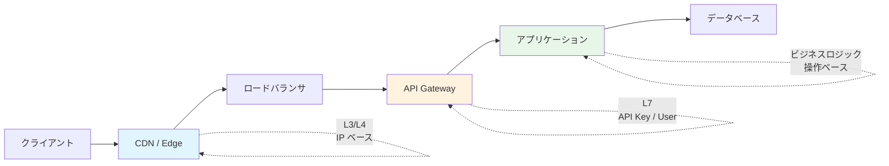

一般的には API Gateway レイヤーで全体的なレート制限を行い、アプリケーションレイヤーで操作ごとの細かいレート制限を行う多層構成が推奨される。

### 1.3 Rate Limiting のキー設計

レート制限を「誰に対して」適用するかを決めるキーの設計は、Rate Limiting の効果を左右する重要な決定である。

| キーの種類 | 例 | 長所 | 短所 |
|---|---|---|---|
| **IP アドレス** | `192.168.1.1` | 認証不要で適用可能 | NAT 環境で誤爆する |
| **API Key** | `api_key_abc123` | クライアント単位で正確 | 認証前のリクエストに無効 |
| **ユーザー ID** | `user:12345` | ユーザー単位で公平 | 認証が前提 |
| **エンドポイント** | `POST /api/orders` | 操作の重さに応じた制御 | クライアント横断の保護が弱い |
| **複合キー** | `user:12345:POST:/api/orders` | きめ細かい制御 | 管理が複雑化する |

::: warning NAT とプロキシの問題
IP ベースの Rate Limiting では、同一 NAT 配下の正当なユーザーが巻き添えで制限される可能性がある。モバイルキャリアの CGNAT 環境では、数万ユーザーが同一 IP を共有するため、IP 単体でのレート制限は非常に粗い粒度になる。`X-Forwarded-For` ヘッダーを利用する場合は、信頼できるプロキシからのヘッダーのみを採用するよう注意が必要である。
:::

## 2. Rate Limiting アルゴリズム

Rate Limiting を実現するアルゴリズムには複数の方式がある。それぞれの特徴、メリット・デメリットを理解し、ユースケースに応じて適切なものを選択することが重要である。

### 2.1 Fixed Window Counter（固定ウィンドウカウンタ）

最も単純なアルゴリズムである。時間を固定長のウィンドウ（例: 1分間）に区切り、各ウィンドウ内のリクエスト数をカウントする。

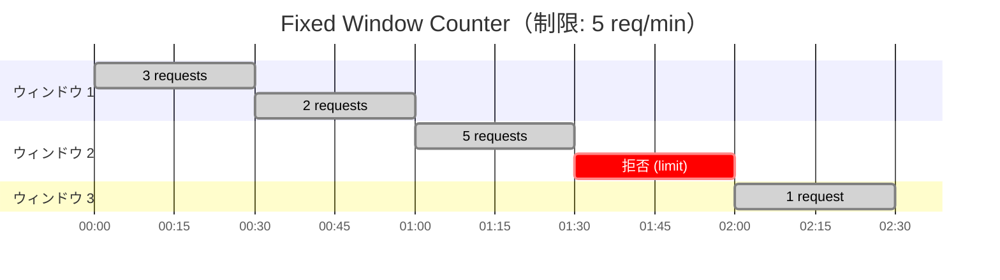

**アルゴリズム:**

1. 現在時刻からウィンドウキー（例: `2026-03-02T10:05`）を算出する
2. そのキーに対応するカウンタを取得する
3. カウンタが制限値未満なら、カウンタをインクリメントしてリクエストを許可する
4. 制限値以上なら、リクエストを拒否する
5. ウィンドウが切り替わるとカウンタはリセットされる

```python
import time

class FixedWindowCounter:
    def __init__(self, limit: int, window_size: int):
        self.limit = limit            # max requests per window
        self.window_size = window_size # window size in seconds
        self.counters: dict[str, int] = {}

    def _current_window(self) -> str:
        # Compute window key from current timestamp
        return str(int(time.time()) // self.window_size)

    def allow(self, key: str) -> bool:
        window = self._current_window()
        counter_key = f"{key}:{window}"

        current = self.counters.get(counter_key, 0)
        if current >= self.limit:
            return False

        self.counters[counter_key] = current + 1
        return True
```

**メリット:**
- 実装が極めて単純
- メモリ効率が良い（ウィンドウごとに 1 カウンタ）
- Redis の `INCR` + `EXPIRE` で簡単に実装可能

**デメリット:**
- **バースト問題（Boundary Burst）**: ウィンドウの境界をまたぐとき、短時間に最大で制限値の 2 倍のリクエストが許可される

```mermaid
timeline
    title バースト問題の例（制限: 100 req/min）
    00:00 - 00:30 : 0 requests
    00:30 - 01:00 : 100 requests (ウィンドウ 1 の末尾)
    01:00 - 01:30 : 100 requests (ウィンドウ 2 の先頭)
    01:30 - 02:00 : 拒否
```

上記の例では、00:30 から 01:30 の 1 分間で 200 リクエストが通過してしまう。この問題を解決するのが、次に紹介する Sliding Window 系のアルゴリズムである。

### 2.2 Sliding Window Log（スライディングウィンドウログ）

リクエストごとにタイムスタンプをログとして記録し、直近のウィンドウ内のリクエスト数を正確にカウントする方式である。

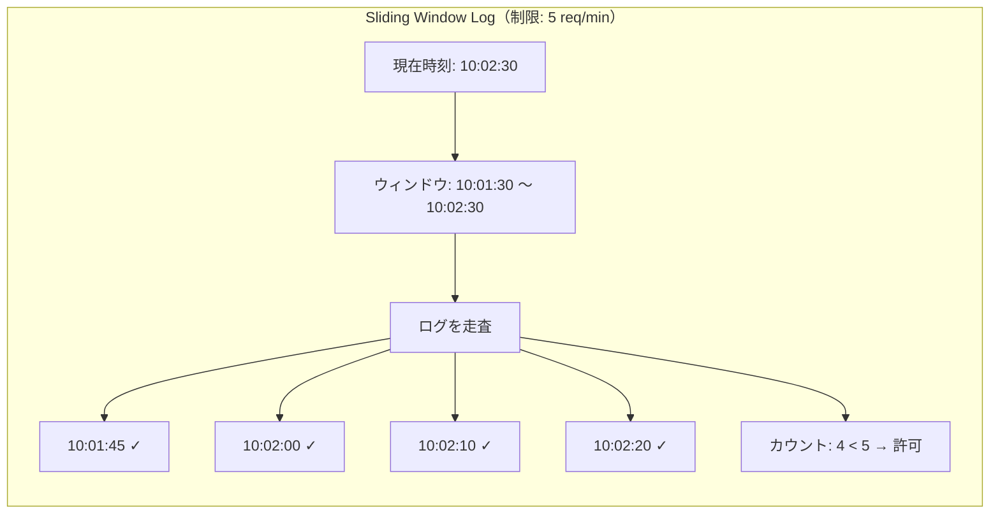

**アルゴリズム:**

1. 現在時刻のタイムスタンプをログに追加する
2. ウィンドウ外（現在時刻 - ウィンドウサイズ より古い）のエントリを削除する
3. ログ内のエントリ数が制限値以下なら許可、超えていれば拒否する

```python
import time

class SlidingWindowLog:
    def __init__(self, limit: int, window_size: int):
        self.limit = limit
        self.window_size = window_size
        self.logs: dict[str, list[float]] = {}

    def allow(self, key: str) -> bool:
        now = time.time()
        window_start = now - self.window_size

        if key not in self.logs:
            self.logs[key] = []

        # Remove entries outside the window
        self.logs[key] = [
            ts for ts in self.logs[key] if ts > window_start
        ]

        if len(self.logs[key]) >= self.limit:
            return False

        self.logs[key].append(now)
        return True
```

**メリット:**
- ウィンドウ境界のバースト問題が発生しない
- 正確なレート制限が可能

**デメリット:**
- **メモリ消費が大きい**: リクエストごとにタイムスタンプを保持するため、高トラフィック環境では大量のメモリを消費する
- ウィンドウ外エントリの削除コストが発生する

### 2.3 Sliding Window Counter（スライディングウィンドウカウンタ）

Fixed Window Counter と Sliding Window Log のハイブリッドアプローチである。前のウィンドウと現在のウィンドウのカウンタから、重み付けによって近似的にスライディングウィンドウのカウントを算出する。

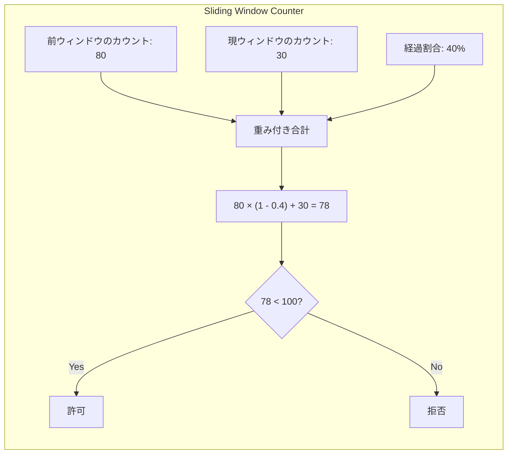

**アルゴリズム:**

1. 前のウィンドウのカウンタと現在のウィンドウのカウンタを取得する
2. 現在のウィンドウ内での経過割合を算出する
3. 推定リクエスト数 = 前ウィンドウのカウント × (1 - 経過割合) + 現ウィンドウのカウント
4. 推定値が制限値未満なら許可、以上なら拒否する

```python
import time

class SlidingWindowCounter:
    def __init__(self, limit: int, window_size: int):
        self.limit = limit
        self.window_size = window_size
        # {key: {window_key: count}}
        self.counters: dict[str, dict[str, int]] = {}

    def allow(self, key: str) -> bool:
        now = time.time()
        current_window = int(now) // self.window_size
        previous_window = current_window - 1

        # Elapsed fraction within current window
        elapsed = (now - current_window * self.window_size) / self.window_size

        if key not in self.counters:
            self.counters[key] = {}

        prev_count = self.counters[key].get(str(previous_window), 0)
        curr_count = self.counters[key].get(str(current_window), 0)

        # Weighted estimate
        estimated = prev_count * (1 - elapsed) + curr_count
        if estimated >= self.limit:
            return False

        self.counters[key][str(current_window)] = curr_count + 1
        return True
```

**メリット:**
- メモリ効率が良い（ウィンドウあたり 1 カウンタ × 2 ウィンドウ分）
- バースト問題をほぼ解消する
- 実装の複雑度が低い

**デメリット:**
- 近似値に基づくため、完全に正確ではない（ただし Cloudflare の検証では誤差は 0.003% 程度とされる）

::: tip Cloudflare での採用
Cloudflare は自社の Rate Limiting 機能において Sliding Window Counter を採用している。その理由として、メモリ効率の良さと十分な精度のバランスを挙げている。大規模な CDN エッジノードにおいては、メモリ効率が実用上きわめて重要な要素となる。
:::

### 2.4 Token Bucket（トークンバケット）

Token Bucket は、ネットワークのトラフィック制御の文脈で古くから使われてきた古典的なアルゴリズムである。バケット（容器）にトークンが一定速度で補充され、リクエストの処理にトークンを消費するというメタファーに基づいている。

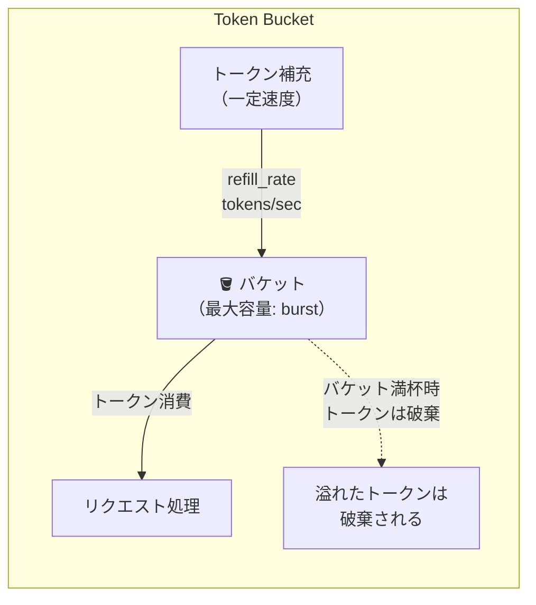

**アルゴリズム:**

1. バケットには最大容量（burst）分のトークンが入る
2. 一定速度（refill_rate）でトークンが追加される
3. リクエストが来たとき、バケットにトークンがあれば 1 つ消費して許可する
4. トークンがなければ拒否する
5. バケットが満杯のとき、新たなトークンは破棄される

```python
import time

class TokenBucket:
    def __init__(self, capacity: int, refill_rate: float):
        self.capacity = capacity        # max tokens (burst size)
        self.refill_rate = refill_rate  # tokens added per second
        self.buckets: dict[str, tuple[float, float]] = {}

    def allow(self, key: str) -> bool:
        now = time.time()

        if key not in self.buckets:
            # Initialize with full bucket
            self.buckets[key] = (self.capacity - 1, now)
            return True

        tokens, last_refill = self.buckets[key]

        # Calculate tokens to add since last refill
        elapsed = now - last_refill
        tokens = min(
            self.capacity,
            tokens + elapsed * self.refill_rate
        )

        if tokens < 1:
            self.buckets[key] = (tokens, now)
            return False

        self.buckets[key] = (tokens - 1, now)
        return True
```

**パラメータの意味:**

| パラメータ | 意味 | 例 |
|---|---|---|
| `capacity`（burst） | バーストとして許容する最大リクエスト数 | 10 |
| `refill_rate` | 定常状態での秒間リクエスト許容数 | 2 tokens/sec |

たとえば capacity=10, refill_rate=2 の場合、バケットが満杯の状態から瞬間的に 10 リクエストを処理でき、その後は毎秒 2 リクエストのペースで処理が可能になる。

**メリット:**
- バースト許容と定常レートの両方を柔軟に制御できる
- パラメータが直感的
- メモリ効率が良い（キーごとに 2 つの値のみ）
- Amazon API Gateway, Stripe, GitHub API など多くの実サービスで採用されている

**デメリット:**
- 分散環境での正確な実装がやや複雑
- パラメータのチューニングが必要

### 2.5 Leaky Bucket（リーキーバケット）

Leaky Bucket は Token Bucket と対になるアルゴリズムである。バケットにリクエストを投入し、バケットの底から一定速度で「漏れる」ように処理する。

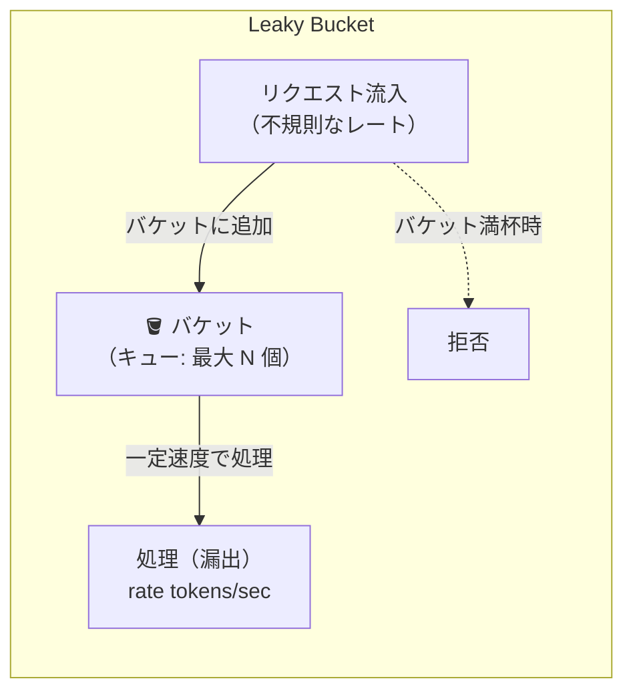

**アルゴリズム:**

1. バケットはキュー（FIFO）として機能する
2. リクエストが到着するとキューに追加する
3. キューが満杯（capacity 超過）なら拒否する
4. キューからは一定速度でリクエストが取り出され処理される

```python
import time
from collections import deque

class LeakyBucket:
    def __init__(self, capacity: int, leak_rate: float):
        self.capacity = capacity    # max queue size
        self.leak_rate = leak_rate  # requests processed per second
        self.buckets: dict[str, tuple[deque, float]] = {}

    def allow(self, key: str) -> bool:
        now = time.time()

        if key not in self.buckets:
            self.buckets[key] = (deque(), now)

        queue, last_leak = self.buckets[key]

        # Leak (process) items from the queue
        elapsed = now - last_leak
        items_to_leak = int(elapsed * self.leak_rate)
        for _ in range(min(items_to_leak, len(queue))):
            queue.popleft()

        if items_to_leak > 0:
            last_leak = now

        self.buckets[key] = (queue, last_leak)

        # Check if queue has space
        if len(queue) >= self.capacity:
            return False

        queue.append(now)
        return True
```

**Token Bucket との違い:**

| 特性 | Token Bucket | Leaky Bucket |
|---|---|---|
| **バースト許容** | 許容する（capacity 分） | 許容しない（一定速度で出力） |
| **出力レート** | バースト後は refill_rate に収束 | 常に一定（leak_rate） |
| **ユースケース** | API Rate Limiting | トラフィックシェーピング |
| **パラメータ** | capacity, refill_rate | capacity, leak_rate |

::: tip Token Bucket vs Leaky Bucket の使い分け
API の Rate Limiting には Token Bucket が好まれることが多い。ユーザーにとっての体験を考えると、しばらく使っていなかった後に短時間でバースト的にリクエストを送れることは自然な挙動であり、Token Bucket はこれを許容する。一方、Leaky Bucket はネットワーク機器でのトラフィック整形（traffic shaping）のように、出力を厳密に平滑化したい場合に適している。
:::

### 2.6 アルゴリズム比較まとめ

| アルゴリズム | メモリ効率 | 精度 | バースト制御 | 実装複雑度 | 代表的な利用例 |
|---|---|---|---|---|---|
| Fixed Window Counter | 高い | 低い | 境界バースト問題 | 低い | 簡易な制限 |
| Sliding Window Log | 低い | 高い | なし | 中程度 | 精度重視の制限 |
| Sliding Window Counter | 高い | ほぼ正確 | ほぼ解消 | 低い | Cloudflare |
| Token Bucket | 高い | 高い | 柔軟に許容 | 中程度 | AWS, Stripe, GitHub |
| Leaky Bucket | 中程度 | 高い | 許容しない | 中程度 | トラフィックシェーピング |

## 3. 分散環境での Rate Limiting

### 3.1 なぜ分散環境で難しいのか

単一プロセスでの Rate Limiting は、インメモリのデータ構造で十分に実現できる。しかし、現代のシステムでは複数のアプリケーションサーバーがロードバランサの背後に配置されるのが一般的であり、各サーバーが独立してレート制限を行うと正確な制御ができない。

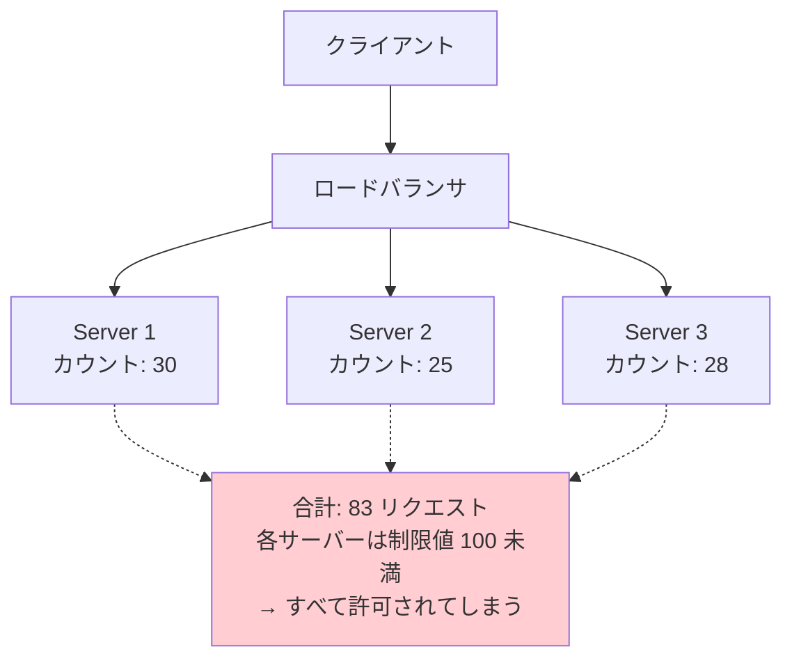

たとえば制限値が 100 req/min で 3 台のサーバーがある場合、各サーバーのローカルカウンタでは最大で 300 req/min が許可されてしまう。単純に制限値を `100 / 3 = 33` に設定する方法もあるが、ロードバランサがリクエストを均等に分配する保証はなく、一部のサーバーに偏った場合に正当なリクエストが不必要に拒否される。

### 3.2 Redis を用いた集中型アプローチ

最も一般的な解決策は、Redis のような共有データストアを使って、すべてのサーバーから参照可能な単一のカウンタを管理することである。

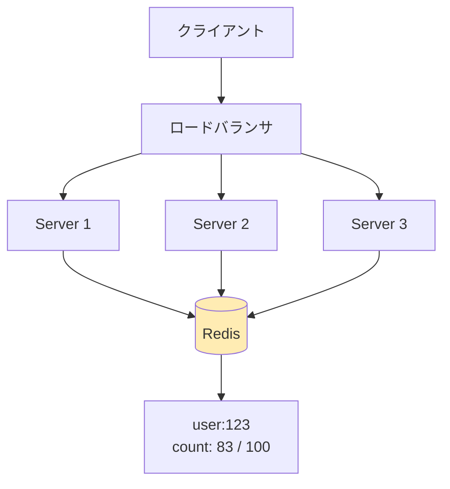

### 3.3 レースコンディションへの対策

分散環境では複数のサーバーが同時にカウンタを読み書きするため、レースコンディション（競合状態）が発生しうる。

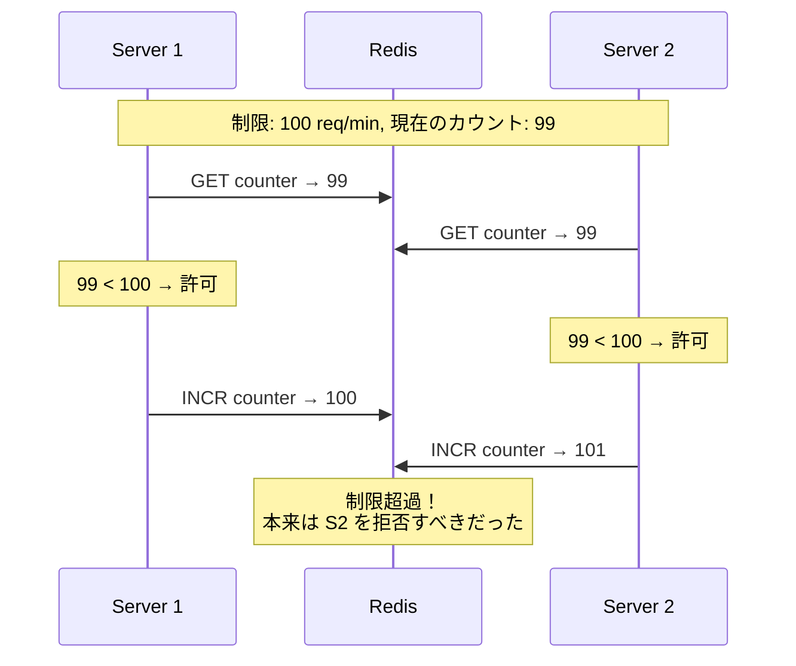

この問題を解決するためのアプローチがいくつかある。

#### アプローチ 1: アトミック操作（INCR + チェック）

Redis の `INCR` はアトミックな操作であるため、「インクリメントしてから制限値を確認し、超過していたらロールバックする」というパターンが使える。

```lua
-- Redis Lua script: Fixed Window Counter (atomic)
local key = KEYS[1]
local limit = tonumber(ARGV[1])
local window = tonumber(ARGV[2])

local current = redis.call("INCR", key)

if current == 1 then
    -- First request in this window: set expiry
    redis.call("EXPIRE", key, window)
end

if current > limit then
    return 0  -- rejected
end

return 1  -- allowed
```

::: warning INCR 先行パターンの注意点
このパターンでは、リクエストが拒否された場合でもカウンタがインクリメントされている。制限を超えた後のリクエストがさらにカウンタを増やし続けるため、ウィンドウ内の「実際に処理されたリクエスト数」とカウンタの値が乖離する。ほとんどの場合これは問題にならないが、厳密なカウントが必要な場合は Lua スクリプトで事前チェックを行うか、超過時にデクリメントする処理を追加する。
:::

#### アプローチ 2: Lua スクリプト（アトミックなチェック＋インクリメント）

Redis の Lua スクリプトはアトミックに実行されるため、GET と INCR を単一のトランザクションとして扱える。

```lua
-- Redis Lua script: Check-then-increment (atomic)
local key = KEYS[1]
local limit = tonumber(ARGV[1])
local window = tonumber(ARGV[2])

local current = tonumber(redis.call("GET", key) or "0")

if current >= limit then
    return 0  -- rejected
end

current = redis.call("INCR", key)
if current == 1 then
    redis.call("EXPIRE", key, window)
end

return current  -- allowed, return current count
```

#### アプローチ 3: Token Bucket の Redis + Lua 実装

Token Bucket は状態が「残りトークン数」と「最終補充時刻」の 2 つであるため、Lua スクリプトで効率的に実装できる。

```lua
-- Redis Lua script: Token Bucket
local key = KEYS[1]
local capacity = tonumber(ARGV[1])
local refill_rate = tonumber(ARGV[2])  -- tokens per second
local now = tonumber(ARGV[3])          -- current timestamp (float)

local data = redis.call("HMGET", key, "tokens", "last_refill")
local tokens = tonumber(data[1])
local last_refill = tonumber(data[2])

if tokens == nil then
    -- Initialize bucket
    tokens = capacity
    last_refill = now
end

-- Refill tokens
local elapsed = now - last_refill
local new_tokens = elapsed * refill_rate
tokens = math.min(capacity, tokens + new_tokens)

-- Try to consume a token
local allowed = 0
if tokens >= 1 then
    tokens = tokens - 1
    allowed = 1
end

-- Update state
redis.call("HMSET", key, "tokens", tokens, "last_refill", now)
redis.call("EXPIRE", key, math.ceil(capacity / refill_rate) * 2)

return {allowed, math.floor(tokens)}
```

#### アプローチ 4: Sliding Window Counter の Redis 実装

```lua
-- Redis Lua script: Sliding Window Counter
local key = KEYS[1]
local limit = tonumber(ARGV[1])
local window = tonumber(ARGV[2])  -- window size in seconds
local now = tonumber(ARGV[3])     -- current timestamp

local current_window = math.floor(now / window)
local previous_window = current_window - 1
local elapsed_ratio = (now - current_window * window) / window

local prev_key = key .. ":" .. previous_window
local curr_key = key .. ":" .. current_window

local prev_count = tonumber(redis.call("GET", prev_key) or "0")
local curr_count = tonumber(redis.call("GET", curr_key) or "0")

-- Weighted estimate
local estimated = prev_count * (1 - elapsed_ratio) + curr_count

if estimated >= limit then
    return {0, math.ceil(estimated)}  -- rejected
end

-- Increment current window
local new_count = redis.call("INCR", curr_key)
if new_count == 1 then
    redis.call("EXPIRE", curr_key, window * 2)
end

return {1, math.ceil(estimated + 1)}  -- allowed
```

### 3.4 Redis 障害時のフォールバック

Rate Limiting を Redis に依存する場合、Redis がダウンしたときの振る舞いを設計しておく必要がある。

| 戦略 | 説明 | リスク |
|---|---|---|
| **Fail Open** | Redis 障害時はレート制限を無効にし、すべてのリクエストを許可する | 一時的に保護が失われる |
| **Fail Closed** | Redis 障害時はすべてのリクエストを拒否する | 正当なリクエストも拒否される |
| **ローカルフォールバック** | Redis 障害時はインメモリのローカルカウンタにフォールバックする | 精度が低下するが、ある程度の保護は維持される |

::: danger Fail Open vs Fail Closed
Rate Limiting の障害時ポリシーはサービスの性質に依存する。E コマースサイトのように可用性を重視するサービスでは Fail Open が一般的である。一方、金融 API のようにセキュリティが重要なサービスでは Fail Closed が適切な場合もある。多くの実用的な実装では「ローカルフォールバック」を併用し、最低限の保護を維持しつつ可用性を確保する戦略が取られる。
:::

### 3.5 分散 Rate Limiting の高度なパターン

#### ローカルキャッシュ＋同期パターン

各サーバーがローカルにカウンタを持ち、定期的に Redis と同期するパターンである。Redis へのアクセス頻度を下げることで、レイテンシとスループットを改善できる。

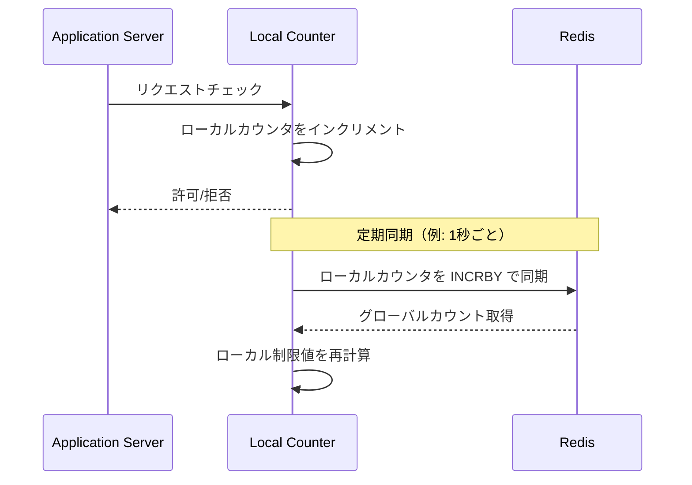

ただし、同期の遅延分だけ正確さが犠牲になる。大量のトラフィックを処理する場合のトレードオフとして有効だが、厳密な精度が要求される場面には適さない。

## 4. HTTP 標準とレスポンスヘッダー

### 4.1 429 Too Many Requests

Rate Limit を超過した際のレスポンスステータスコードは **429 Too Many Requests**（RFC 6585）が標準である。

```http
HTTP/1.1 429 Too Many Requests
Content-Type: application/json
Retry-After: 30

{
  "error": {
    "code": "rate_limit_exceeded",
    "message": "Rate limit exceeded. Please retry after 30 seconds."
  }
}
```

`Retry-After` ヘッダーは、クライアントが次にリクエストを試みるまでの待機秒数（または日時）を示す。このヘッダーを返すことで、クライアントが無駄なリトライを繰り返すことを防げる。

### 4.2 RateLimit ヘッダー

Rate Limit の残量情報をレスポンスヘッダーで返す標準が、IETF の RFC 9110 および RateLimit Header Fields（draft-ietf-httpapi-ratelimit-headers）で議論されている。広く使われている事実上の標準的なヘッダーは以下のとおりである。

```http
HTTP/1.1 200 OK
RateLimit-Limit: 100
RateLimit-Remaining: 42
RateLimit-Reset: 1709380800
```

| ヘッダー | 意味 |
|---|---|
| `RateLimit-Limit` | ウィンドウあたりの最大リクエスト数 |
| `RateLimit-Remaining` | 現在のウィンドウで残っているリクエスト数 |
| `RateLimit-Reset` | ウィンドウがリセットされる Unix タイムスタンプ（または秒数） |

::: tip ヘッダー名の表記揺れ
GitHub API は `X-RateLimit-Limit`, `X-RateLimit-Remaining`, `X-RateLimit-Reset` というプレフィックス付きヘッダーを使用している。IETF のドラフトでは `X-` プレフィックスなしの形式が推奨されているが、実際には両方の形式が混在している。新規開発では `X-` なしの形式を採用するのが望ましい。
:::

### 4.3 レスポンス設計のベストプラクティス

```python
from dataclasses import dataclass

@dataclass
class RateLimitResult:
    allowed: bool
    limit: int
    remaining: int
    reset_at: int       # unix timestamp
    retry_after: int    # seconds (only when rejected)

def build_rate_limit_headers(result: RateLimitResult) -> dict:
    # Build standard rate limit response headers
    headers = {
        "RateLimit-Limit": str(result.limit),
        "RateLimit-Remaining": str(max(0, result.remaining)),
        "RateLimit-Reset": str(result.reset_at),
    }
    if not result.allowed:
        headers["Retry-After"] = str(result.retry_after)
    return headers
```

クライアントが Rate Limit 情報を活用して自律的にリクエストペースを調整できるよう、成功レスポンスにも常に RateLimit ヘッダーを含めることが望ましい。

## 5. API Gateway / ミドルウェアでの実装

### 5.1 実装レイヤーの選択

Rate Limiting は一般にミドルウェア（あるいは API Gateway）として実装される。ビジネスロジックの外側で横断的関心事として適用することで、関心の分離を実現する。

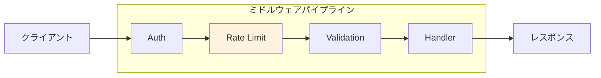

### 5.2 ミドルウェアの実装例

以下は Python（ASGI ミドルウェア）での Rate Limiting の概念的な実装例である。

```python
import time
import redis.asyncio as redis

class RateLimitMiddleware:
    """ASGI middleware for rate limiting using Token Bucket."""

    def __init__(self, app, redis_url: str, capacity: int = 100,
                 refill_rate: float = 10.0):
        self.app = app
        self.redis = redis.from_url(redis_url)
        self.capacity = capacity
        self.refill_rate = refill_rate
        # Load Lua script at startup
        self.script = None

    async def _load_script(self):
        # Register Lua script for atomic token bucket operation
        lua = """
        local key = KEYS[1]
        local capacity = tonumber(ARGV[1])
        local refill_rate = tonumber(ARGV[2])
        local now = tonumber(ARGV[3])

        local data = redis.call("HMGET", key, "tokens", "last_refill")
        local tokens = tonumber(data[1])
        local last_refill = tonumber(data[2])

        if tokens == nil then
            tokens = capacity
            last_refill = now
        end

        local elapsed = now - last_refill
        tokens = math.min(capacity, tokens + elapsed * refill_rate)

        local allowed = 0
        if tokens >= 1 then
            tokens = tokens - 1
            allowed = 1
        end

        redis.call("HMSET", key, "tokens", tokens, "last_refill", now)
        redis.call("EXPIRE", key, math.ceil(capacity / refill_rate) * 2)

        return {allowed, math.floor(tokens)}
        """
        self.script = self.redis.register_script(lua)

    def _extract_key(self, scope: dict) -> str:
        # Extract rate limit key from request
        # In production, use API key or user ID from auth context
        headers = dict(scope.get("headers", []))
        forwarded = headers.get(b"x-forwarded-for", b"").decode()
        if forwarded:
            return f"ratelimit:{forwarded.split(',')[0].strip()}"
        client = scope.get("client", ("unknown", 0))
        return f"ratelimit:{client[0]}"

    async def __call__(self, scope, receive, send):
        if scope["type"] != "http":
            await self.app(scope, receive, send)
            return

        if self.script is None:
            await self._load_script()

        key = self._extract_key(scope)
        now = time.time()

        try:
            result = await self.script(
                keys=[key],
                args=[self.capacity, self.refill_rate, now]
            )
            allowed, remaining = result[0], result[1]
        except Exception:
            # Fail open: allow request if Redis is unavailable
            allowed, remaining = 1, self.capacity

        if not allowed:
            # Return 429 response
            await send({
                "type": "http.response.start",
                "status": 429,
                "headers": [
                    [b"content-type", b"application/json"],
                    [b"retry-after", b"10"],
                    [b"ratelimit-limit", str(self.capacity).encode()],
                    [b"ratelimit-remaining", b"0"],
                ],
            })
            await send({
                "type": "http.response.body",
                "body": b'{"error":"rate_limit_exceeded"}',
            })
            return

        # Proceed to the next middleware / handler
        await self.app(scope, receive, send)
```

### 5.3 主要な API Gateway の Rate Limiting 機能

実際のプロダクション環境では、自前で Rate Limiting を実装するよりも、API Gateway の組み込み機能を使うことが多い。

| API Gateway | アルゴリズム | 設定粒度 | 分散対応 |
|---|---|---|---|
| **AWS API Gateway** | Token Bucket | ステージごと / API キーごと | マネージドで自動分散 |
| **Kong** | Fixed Window, Sliding Window | ルート / サービス / コンシューマ | Redis / PostgreSQL |
| **Envoy** | Token Bucket | ルートごと / ディスクリプタ | 外部サービス (RLS) |
| **Nginx** | Leaky Bucket (`limit_req`) | ゾーンごと | ローカルのみ（標準） |
| **Cloudflare** | Sliding Window Counter | ルール単位 | エッジ分散 |

### 5.4 Nginx での Rate Limiting 設定例

Nginx は `ngx_http_limit_req_module` で Leaky Bucket ベースの Rate Limiting を提供している。

```nginx
http {
    # Define a rate limit zone
    # $binary_remote_addr: key (client IP, binary form for memory efficiency)
    # zone=api_limit:10m: 10MB shared memory zone named "api_limit"
    # rate=10r/s: 10 requests per second
    limit_req_zone $binary_remote_addr zone=api_limit:10m rate=10r/s;

    server {
        location /api/ {
            # Apply rate limit
            # burst=20: allow burst of 20 requests
            # nodelay: don't delay burst requests, process immediately
            limit_req zone=api_limit burst=20 nodelay;

            # Custom error page for 429
            limit_req_status 429;

            proxy_pass http://backend;
        }
    }
}
```

::: tip burst と nodelay の関係
`burst=20` は追加で 20 リクエストをバッファに溜めることを許可する。`nodelay` を付けると、バースト分のリクエストを遅延なく即座に処理し、バッファ枠は leak_rate で回復する。`nodelay` なしの場合、バースト分のリクエストは leak_rate に従って遅延処理される。API のレスポンスタイムを重視する場合は `nodelay` を指定するのが一般的である。
:::

## 6. 実装例：Redis + Lua による Token Bucket の完全な実装

ここでは、プロダクション品質に近い Token Bucket の実装を Go で示す。

```go
package ratelimit

import (
	"context"
	"fmt"
	"time"

	"github.com/redis/go-redis/v9"
)

// TokenBucketLimiter implements rate limiting using the Token Bucket algorithm.
type TokenBucketLimiter struct {
	client     *redis.Client
	script     *redis.Script
	capacity   int     // max burst size
	refillRate float64 // tokens per second
	keyPrefix  string
}

// Lua script for atomic token bucket operation.
// Returns {allowed (0 or 1), remaining tokens, reset time in ms}.
const tokenBucketScript = `
local key = KEYS[1]
local capacity = tonumber(ARGV[1])
local refill_rate = tonumber(ARGV[2])
local now = tonumber(ARGV[3])
local ttl = tonumber(ARGV[4])

local data = redis.call("HMGET", key, "tokens", "last_refill")
local tokens = tonumber(data[1])
local last_refill = tonumber(data[2])

if tokens == nil then
    tokens = capacity
    last_refill = now
end

-- Refill tokens based on elapsed time
local elapsed = math.max(0, now - last_refill)
tokens = math.min(capacity, tokens + elapsed * refill_rate)
last_refill = now

-- Try to consume one token
local allowed = 0
if tokens >= 1 then
    tokens = tokens - 1
    allowed = 1
end

-- Calculate time until next token is available
local reset_after_ms = 0
if tokens < 1 then
    reset_after_ms = math.ceil((1 - tokens) / refill_rate * 1000)
end

-- Persist state with TTL
redis.call("HMSET", key, "tokens", tostring(tokens), "last_refill", tostring(now))
redis.call("EXPIRE", key, ttl)

return {allowed, math.floor(tokens), reset_after_ms}
`

// NewTokenBucketLimiter creates a new rate limiter.
func NewTokenBucketLimiter(client *redis.Client, capacity int, refillRate float64) *TokenBucketLimiter {
	return &TokenBucketLimiter{
		client:     client,
		script:     redis.NewScript(tokenBucketScript),
		capacity:   capacity,
		refillRate: refillRate,
		keyPrefix:  "rl:",
	}
}

// Result holds the outcome of a rate limit check.
type Result struct {
	Allowed      bool
	Limit        int
	Remaining    int
	ResetAfterMs int
}

// Allow checks whether a request identified by key should be allowed.
func (l *TokenBucketLimiter) Allow(ctx context.Context, key string) (*Result, error) {
	fullKey := l.keyPrefix + key
	now := float64(time.Now().UnixMicro()) / 1e6
	ttl := int(float64(l.capacity)/l.refillRate) * 2

	res, err := l.script.Run(ctx, l.client, []string{fullKey},
		l.capacity, l.refillRate, now, ttl,
	).Int64Slice()

	if err != nil {
		// Fail open on Redis errors
		return &Result{
			Allowed:   true,
			Limit:     l.capacity,
			Remaining: l.capacity,
		}, nil
	}

	return &Result{
		Allowed:      res[0] == 1,
		Limit:        l.capacity,
		Remaining:    int(res[1]),
		ResetAfterMs: int(res[2]),
	}, nil
}
```

使用例:

```go
func rateLimitMiddleware(limiter *ratelimit.TokenBucketLimiter) func(http.Handler) http.Handler {
	return func(next http.Handler) http.Handler {
		return http.HandlerFunc(func(w http.ResponseWriter, r *http.Request) {
			// Use API key or user ID as rate limit key
			key := r.Header.Get("X-API-Key")
			if key == "" {
				key = r.RemoteAddr
			}

			result, err := limiter.Allow(r.Context(), key)
			if err != nil {
				// Fail open: proceed without rate limiting
				next.ServeHTTP(w, r)
				return
			}

			// Set rate limit headers on every response
			w.Header().Set("RateLimit-Limit", fmt.Sprintf("%d", result.Limit))
			w.Header().Set("RateLimit-Remaining", fmt.Sprintf("%d", result.Remaining))

			if !result.Allowed {
				retryAfter := (result.ResetAfterMs + 999) / 1000
				w.Header().Set("Retry-After", fmt.Sprintf("%d", retryAfter))
				w.WriteHeader(http.StatusTooManyRequests)
				w.Write([]byte(`{"error":"rate_limit_exceeded"}`))
				return
			}

			next.ServeHTTP(w, r)
		})
	}
}
```

## 7. 運用上の考慮事項

### 7.1 レート制限値の決め方

Rate Limit の値を決めるのは、技術的な問題というよりもビジネス判断に近い。以下のような要素を総合的に考慮する必要がある。

| 考慮事項 | 詳細 |
|---|---|
| **バックエンドの処理能力** | 最大スループットのうち、何 % を 1 クライアントに割り当てるか |
| **ユースケースの分析** | 正当な利用パターンでのリクエスト頻度を計測する |
| **プラン別の差別化** | Free / Pro / Enterprise で異なる制限値を設定する |
| **エンドポイントの重み** | 検索 API と注文 API では処理コストが異なる |
| **段階的な引き上げ** | 最初は保守的な値で開始し、データに基づいて調整する |

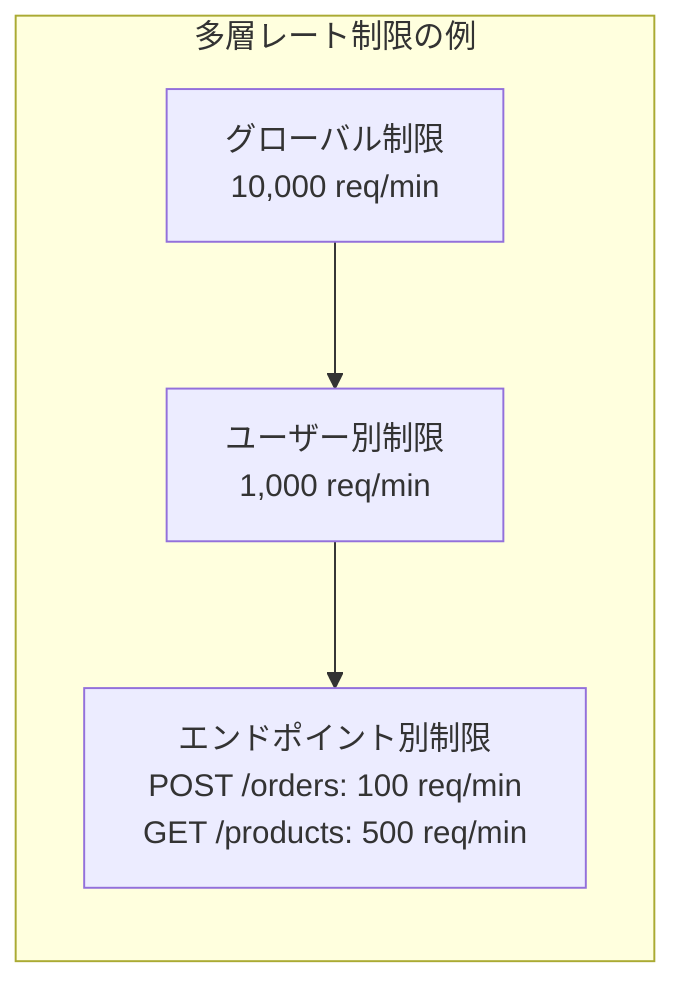

### 7.2 監視とアラート

Rate Limiting の運用においては、以下のメトリクスを監視することが重要である。

- **拒否率（Rejection Rate）**: 429 レスポンスの割合。急激な上昇は攻撃や設定ミスを示唆する
- **カウンタ分布**: 各キーのリクエスト数の分布。特定キーへの集中を検知する
- **Redis レイテンシ**: Rate Limiting の判定に要する時間。P99 で 1ms 以下が理想的
- **Redis 可用性**: フォールバックが発動していないかの確認

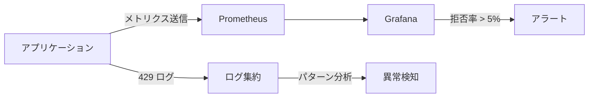

### 7.3 クライアントサイドの対策

Rate Limiting は「サーバーを守る」仕組みであるが、優れた API クライアントは Rate Limit を尊重し、自律的に振る舞う必要がある。

#### Exponential Backoff with Jitter

429 レスポンスを受け取ったとき、固定間隔でリトライすると多数のクライアントが同時にリトライを行い、さらなるスパイクを引き起こす（Thundering Herd 問題）。指数バックオフにジッター（ランダムな揺らぎ）を加えることで、リトライのタイミングを分散させる。

```python
import random
import time

def retry_with_backoff(func, max_retries: int = 5):
    """Retry a function with exponential backoff and jitter."""
    for attempt in range(max_retries):
        result = func()

        if result.status_code != 429:
            return result

        # Use Retry-After header if available
        retry_after = result.headers.get("Retry-After")
        if retry_after:
            wait = int(retry_after)
        else:
            # Exponential backoff with full jitter
            base_wait = min(2 ** attempt, 60)  # cap at 60 seconds
            wait = random.uniform(0, base_wait)

        time.sleep(wait)

    raise Exception("Max retries exceeded")
```

#### Adaptive Rate Limiting（クライアントサイド）

`RateLimit-Remaining` ヘッダーを監視し、残量が少なくなってきたら自発的にリクエスト頻度を下げるアプローチもある。

```python
class AdaptiveClient:
    """Client that adapts request rate based on rate limit headers."""

    def __init__(self, base_delay: float = 0.1):
        self.base_delay = base_delay
        self.remaining = float("inf")
        self.limit = float("inf")

    def request(self, url: str):
        # Slow down when approaching the limit
        if self.limit > 0:
            usage_ratio = 1 - (self.remaining / self.limit)
            if usage_ratio > 0.8:
                # More than 80% consumed: apply increasing delay
                extra_delay = self.base_delay * (usage_ratio - 0.8) * 50
                time.sleep(extra_delay)

        response = http_client.get(url)

        # Update state from response headers
        if "RateLimit-Remaining" in response.headers:
            self.remaining = int(response.headers["RateLimit-Remaining"])
        if "RateLimit-Limit" in response.headers:
            self.limit = int(response.headers["RateLimit-Limit"])

        return response
```

### 7.4 公平性と優先度制御

単純な Rate Limiting では、すべてのリクエストを平等に扱う。しかし実際のシステムでは、リクエストの優先度に差をつけたい場合がある。

#### 多層バケット

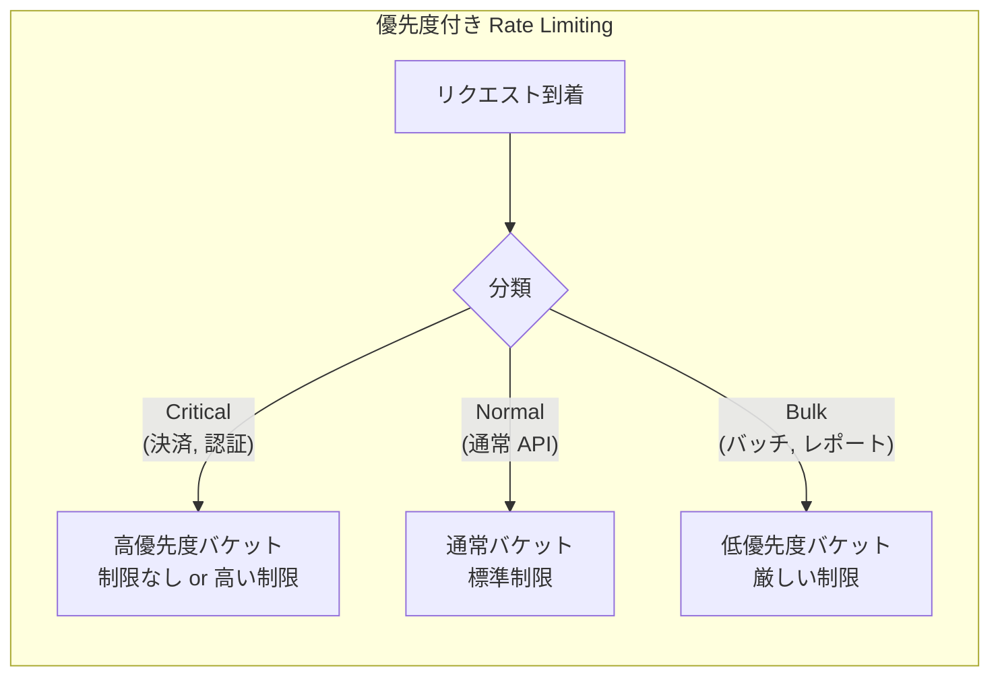

#### Weighted Rate Limiting

エンドポイントの処理コストに応じて、リクエストごとに異なるトークン数を消費させるアプローチもある。

```python
# Endpoint weight configuration
ENDPOINT_WEIGHTS = {
    "GET /api/users": 1,       # lightweight read
    "POST /api/orders": 5,     # expensive write with side effects
    "GET /api/reports": 10,    # heavy computation
    "POST /api/bulk-import": 50,  # very expensive batch operation
}

def weighted_allow(bucket: TokenBucket, key: str, endpoint: str) -> bool:
    weight = ENDPOINT_WEIGHTS.get(endpoint, 1)
    # Consume multiple tokens for expensive operations
    return bucket.consume(key, tokens=weight)
```

### 7.5 Rate Limiting の回避策と対策

Rate Limiting を導入する側は、悪意のある回避策にも対処する必要がある。

| 回避手法 | 対策 |
|---|---|
| **IP ローテーション** | IP だけでなく、API キー / ユーザー ID でも制限する |
| **分散リクエスト** | フィンガープリンティング、行動分析の併用 |
| **Slowloris 攻撃** | 接続数制限、タイムアウト設定 |
| **API キーの大量取得** | アカウント作成自体にも Rate Limit を適用、本人確認の導入 |
| **WebSocket への逃避** | WebSocket にもメッセージ単位のレート制限を適用する |

### 7.6 テスト戦略

Rate Limiting のテストは、時間に依存する処理のテストが中心となる。

```python
from unittest.mock import patch

class TestTokenBucket:
    def test_allows_requests_within_limit(self):
        bucket = TokenBucket(capacity=5, refill_rate=1.0)
        for _ in range(5):
            assert bucket.allow("user:1") is True

    def test_rejects_when_exhausted(self):
        bucket = TokenBucket(capacity=2, refill_rate=1.0)
        assert bucket.allow("user:1") is True
        assert bucket.allow("user:1") is True
        assert bucket.allow("user:1") is False  # exhausted

    @patch("time.time")
    def test_refills_over_time(self, mock_time):
        bucket = TokenBucket(capacity=2, refill_rate=1.0)
        mock_time.return_value = 1000.0

        # Exhaust all tokens
        assert bucket.allow("user:1") is True
        assert bucket.allow("user:1") is True
        assert bucket.allow("user:1") is False

        # Advance time by 1 second -> 1 token refilled
        mock_time.return_value = 1001.0
        assert bucket.allow("user:1") is True
        assert bucket.allow("user:1") is False

    def test_independent_keys(self):
        bucket = TokenBucket(capacity=1, refill_rate=0.1)
        # Different keys should have independent buckets
        assert bucket.allow("user:1") is True
        assert bucket.allow("user:2") is True
        assert bucket.allow("user:1") is False
        assert bucket.allow("user:2") is False
```

::: tip 時間のモック
Rate Limiting のテストでは `time.time()` をモックして時間を制御することが不可欠である。実際に `time.sleep()` で待機するテストは不安定（flaky）になりやすく、CI パイプラインの実行時間も長くなる。Go では `clockwork` パッケージ、Java では `java.time.Clock` の差し替えが使われる。
:::

## 8. 実サービスにおける Rate Limiting の実例

### 8.1 GitHub API

GitHub API は Token Bucket ベースの Rate Limiting を採用しており、認証状態に応じて制限が変わる。

| 認証方式 | 制限値 |
|---|---|
| 未認証 | 60 req/hour（IP ベース） |
| Personal Access Token | 5,000 req/hour |
| GitHub App | 5,000 req/hour（インストールごと） |
| GitHub Actions | 1,000 req/hour |

レスポンスヘッダー例:
```http
X-RateLimit-Limit: 5000
X-RateLimit-Remaining: 4987
X-RateLimit-Reset: 1709384400
X-RateLimit-Used: 13
X-RateLimit-Resource: core
```

### 8.2 Stripe API

Stripe は定常レートとバースト許容の 2 段階で Rate Limiting を行っている。

- **テストモード**: 25 req/sec
- **ライブモード**: 100 req/sec（バーストは一時的に許容）
- エンドポイントごとの追加制限あり

### 8.3 AWS API Gateway

AWS API Gateway はデフォルトで以下のレート制限を提供する。

- **アカウントレベル**: 10,000 req/sec（Token Bucket）
- **ステージレベル**: 設定可能
- **メソッドレベル**: 設定可能
- **API キー別使用量プラン**: バースト制限 + レート制限 + クォータ（日次/月次）

AWS の使用量プランでは、Token Bucket の 2 つのパラメータ（burst limit と rate limit）に加え、月間のリクエスト総数上限（quota）も設定できる。これは Rate Limiting とクォータ管理の組み合わせである。

## 9. まとめ

Rate Limiting は、API の信頼性とセキュリティを支える基盤的な仕組みである。本記事で解説した内容を振り返る。

**アルゴリズムの選択**は、ユースケースに応じて行う。メモリ効率と精度のバランスが求められる場合は Sliding Window Counter が、バースト許容と定常レートの両方を柔軟に制御したい場合は Token Bucket が適している。

**分散環境での実装**では、Redis + Lua スクリプトによるアトミック操作が事実上の標準的なアプローチである。レースコンディション対策、Redis 障害時のフォールバック戦略を含めた設計が必要となる。

**運用面**では、適切なレスポンスヘッダーの返却、監視体制の構築、クライアントサイドのバックオフ実装との協調が重要である。Rate Limiting は単独の機能ではなく、API 設計全体の一部として位置づけるべきである。

最後に、Rate Limiting はあくまで「保護の一手段」であり、万能ではない。DDoS 攻撃に対しては CDN レイヤーでの防御が、ブルートフォース攻撃に対してはアカウントロックアウトが、リソース枯渇に対してはオートスケーリングが、それぞれ Rate Limiting と組み合わせて使われる。多層防御（Defense in Depth）の考え方に基づき、Rate Limiting を適切な位置に配置することが、堅牢な API を構築する鍵である。
