# リアクティビティシステム — Signals, Fine-Grained Reactivity

## 1. 背景と動機

### 1.1 UIにおける「状態とビューの同期」問題

フロントエンド開発の根本的な課題は、アプリケーションの状態（State）とユーザーインターフェース（View）を常に一致した状態に保つことである。ユーザーがボタンをクリックする、サーバーからデータが到着する、タイマーが発火するといったイベントによって状態が変化するたび、画面上の表示もそれに応じて更新されなければならない。

初期のWebアプリケーションでは、この同期を手動で管理していた。jQueryの時代には、データが変更されるたびに開発者自身がDOM操作を記述し、どの要素をどう更新するかを逐一指定していた。

```javascript
// Manual synchronization: error-prone and hard to maintain
let count = 0;

function increment() {
  count++;
  document.getElementById("counter").textContent = count;
  document.getElementById("doubled").textContent = count * 2;
  document.getElementById("is-even").textContent = count % 2 === 0 ? "Yes" : "No";
}
```

この素朴なアプローチには、深刻な問題がある。`count` から派生する値（`doubled` や `is-even`）が増えるたびに、更新コードを手動で追加しなければならない。更新箇所を一つでも漏らせば、UIが不整合な状態に陥る。アプリケーションの規模が大きくなるほど、この問題は指数関数的に深刻化する。

### 1.2 リアクティビティとは何か

**リアクティビティ（Reactivity）**とは、ある値が変化したとき、その値に依存するすべての計算やUIが自動的に更新される仕組みのことである。スプレッドシートが最も直感的な例だ。セルA1の値を変更すると、A1を参照する数式を含むすべてのセルが即座に再計算される。開発者（あるいはユーザー）は「何が何に依存しているか」を一度宣言すれば、その後の同期は自動的に行われる。

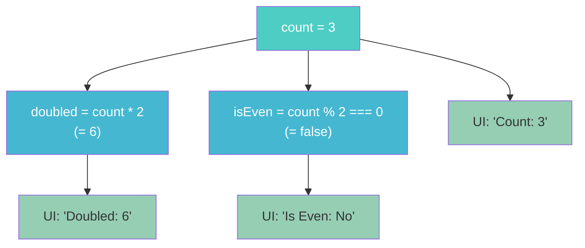

リアクティブシステムの本質は、**依存関係の自動追跡**と**変更の自動伝播**にある。開発者は「何を表示したいか」を宣言するだけでよく、「いつ、どこを更新するか」はシステムが自動的に決定する。この宣言的な性質こそが、現代のフロントエンドフレームワークがリアクティビティを中核に据える理由である。

### 1.3 歴史的経緯

リアクティブプログラミングの概念自体は、フロントエンド開発よりもはるかに古い。1969年にBell LabsのBob Frankston が開発したスプレッドシートの前身から、1980年代のデータフロープログラミング、1997年のFunctional Reactive Programming（FRP）の理論的基盤（Conal ElliottとPaul Hudakによる "Functional Reactive Animation"）に至るまで、長い歴史がある。

Webフロントエンドにおいては、以下のような変遷を経て現在に至る。

| 年代 | 技術・フレームワーク | リアクティビティの手法 |
|------|---------------------|----------------------|
| 2010 | Knockout.js | Observable + Computed |
| 2012 | Angular.js (v1) | Dirty Checking |
| 2013 | React | 仮想DOM + 再レンダリング |
| 2014 | Vue.js (v1) | Object.defineProperty |
| 2016 | MobX | Observable + Proxy |
| 2019 | Svelte 3 | コンパイラベース |
| 2020 | Vue.js 3 | Proxy ベース |
| 2022 | Solid.js | Fine-Grained Signals |
| 2023 | Angular Signals | Signal ベース |
| 2024 | Preact Signals / TC39 Signals Proposal | 標準化の議論 |

この表が示す通り、フロントエンドにおけるリアクティビティの実装は多様であり、それぞれに異なるトレードオフがある。本記事では、これらの手法を体系的に整理し、その設計思想と実装上の考慮点を深く掘り下げる。

## 2. リアクティビティの分類 — Push型、Pull型、Push-Pull型

リアクティブシステムは、変更が伝播される仕組みによって大きく3つに分類できる。

### 2.1 Push型（Eager Evaluation）

Push型では、値が変更された瞬間に、その変更が依存先すべてに即座に通知される。EventEmitterやRxJSのObservableが典型的なPush型である。

```
ソース値変更 → 即座に依存先A更新 → 即座に依存先B更新 → ...
```

**利点**:
- 変更が即座に反映されるため、レイテンシが低い
- 値が常に最新であることが保証される

**欠点**:
- 一つの変更が連鎖的に多数の更新を引き起こす可能性がある（Glitch問題）
- 中間的な不整合状態が外部に露出する場合がある

```javascript
// Push-based: immediate propagation
const emitter = new EventEmitter();
let a = 1;
let b = 2;
let sum = a + b; // = 3

emitter.on("a-changed", (newA) => {
  a = newA;
  sum = a + b;
  // At this point, sum is updated immediately
  updateUI(sum);
});
```

### 2.2 Pull型（Lazy Evaluation）

Pull型では、値が必要とされた時点で初めて計算が実行される。計算結果はキャッシュされ、ソース値が変更された場合は「ダーティ（要再計算）」フラグが立てられるだけで、実際の再計算は次にアクセスされるまで遅延される。

```
ソース値変更 → ダーティフラグを設定（計算はしない）
              ...
値の読み取り → ダーティなら再計算 → 結果を返す
```

**利点**:
- 実際に使われない計算は実行されないため、無駄が少ない
- 複数のソース値が同時に変更されても、再計算は1回で済む

**欠点**:
- 値を読み取る時点まで更新が遅延されるため、プッシュ通知的な用途には向かない
- いつ値が変更されたかを外部から検知しにくい

### 2.3 Push-Pull型（Hybrid）

現代のリアクティブフレームワークの多くは、Push型とPull型を組み合わせた**Push-Pull型**を採用している。変更通知はPushで伝播し（「何かが変わった」）、実際の値の再計算はPullで遅延実行する（「新しい値は何か」）。

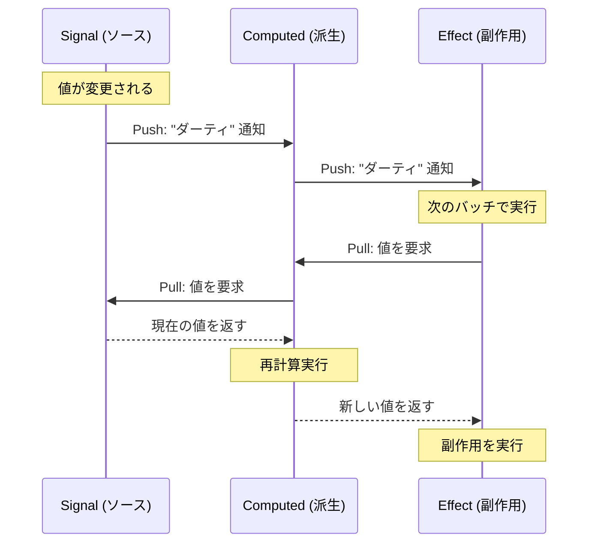

この設計の利点は以下の通りである。

1. **不要な計算の回避**: 誰からも参照されていないComputedは再計算されない
2. **バッチ更新との親和性**: Push通知はダーティフラグを立てるだけなので軽量。実際の計算はバッチの境界でまとめて実行できる
3. **Glitch-free**: 依存グラフのトポロジカルソート順に再計算することで、中間的な不整合状態を防げる

## 3. 依存グラフと自動追跡

### 3.1 依存グラフとは

リアクティブシステムの中核となるデータ構造が**依存グラフ（Dependency Graph）**である。これは有向非巡回グラフ（DAG）であり、ノードはリアクティブな値（Signal, Computed, Effect）、辺は依存関係を表す。

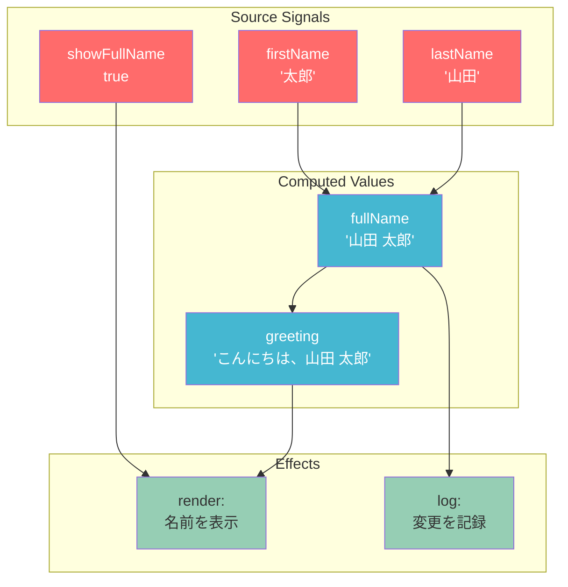

### 3.2 自動追跡（Automatic Dependency Tracking）

依存グラフを手動で構築するのは非現実的である。リアクティブシステムの重要な特徴は、**依存関係を実行時に自動的に追跡する**ことにある。この仕組みは以下のように動作する。

1. Computed値やEffectの計算関数を実行する前に、グローバルな「現在のサブスクライバ」スタックに自身を登録する
2. 計算関数内でリアクティブな値が読み取られると、その値は「現在のサブスクライバ」を自身の依存先リストに追加する
3. 計算関数の実行が完了すると、スタックから自身を取り除く

この仕組みの擬似コードは以下のようになる。

```javascript
// Global subscriber stack
const subscriberStack = [];

function createSignal(initialValue) {
  let value = initialValue;
  const subscribers = new Set();

  function read() {
    // Track dependency: if someone is observing, register them
    const current = subscriberStack[subscriberStack.length - 1];
    if (current) {
      subscribers.add(current);
    }
    return value;
  }

  function write(newValue) {
    value = newValue;
    // Notify all subscribers
    for (const sub of subscribers) {
      sub.notify();
    }
  }

  return [read, write];
}

function createComputed(fn) {
  let cachedValue;
  let dirty = true;

  const computed = {
    read() {
      if (dirty) {
        // Push ourselves onto the subscriber stack
        subscriberStack.push(computed);
        cachedValue = fn();
        subscriberStack.pop();
        dirty = false;
      }
      // Also track if someone is observing us
      const current = subscriberStack[subscriberStack.length - 1];
      if (current) {
        computed.subscribers.add(current);
      }
      return cachedValue;
    },
    notify() {
      dirty = true;
      // Propagate notification to our own subscribers
      for (const sub of computed.subscribers) {
        sub.notify();
      }
    },
    subscribers: new Set(),
  };

  return computed;
}
```

### 3.3 動的な依存関係

自動追跡の重要な特性は、**依存関係が動的に変化する**ことを正しく扱えることである。条件分岐によって、ある実行では参照するSignalが異なるケースがある。

```javascript
const [showDetails, setShowDetails] = createSignal(false);
const [name, setName] = createSignal("Alice");
const [bio, setBio] = createSignal("Developer");

// Dependencies change based on showDetails
const display = createComputed(() => {
  if (showDetails()) {
    return `${name()} - ${bio()}`; // depends on: showDetails, name, bio
  } else {
    return name(); // depends on: showDetails, name (NOT bio)
  }
});
```

`showDetails` が `false` のとき、`display` は `bio` に依存しない。したがって `bio` が変更されても `display` を再計算する必要はない。この動的な依存関係の追跡は、再実行のたびに依存リストをクリアし、新たに構築し直すことで実現される。

## 4. Observer/Observable パターン

### 4.1 基本構造

リアクティビティの最も基本的な実装パターンが、Observer/Observable（あるいはPublisher/Subscriber）パターンである。GoFデザインパターンの一つとして広く知られるこのパターンは、リアクティブシステムの土台となる。

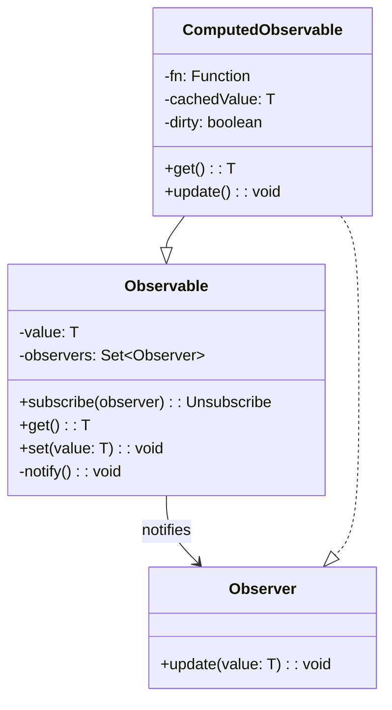

Knockout.js（2010年）は、このパターンをフロントエンドで体系的に実装した最初期のフレームワークの一つである。

```javascript
// Knockout.js style observables (conceptual)
const name = ko.observable("Alice");
const greeting = ko.computed(() => `Hello, ${name()}`);

// greeting automatically updates when name changes
name("Bob"); // greeting() is now "Hello, Bob"
```

### 4.2 明示的なサブスクリプション vs 暗黙的な追跡

Observer パターンの実装には、依存関係の登録方法に2つのスタイルがある。

**明示的なサブスクリプション**では、開発者が手動で何に依存するかを宣言する。RxJSがこの典型例である。

```javascript
// Explicit subscription (RxJS style)
const count$ = new BehaviorSubject(0);
const doubled$ = count$.pipe(map((c) => c * 2));

// Developer must explicitly subscribe
const subscription = doubled$.subscribe((value) => {
  document.getElementById("output").textContent = value;
});

// Developer must explicitly unsubscribe to avoid memory leaks
subscription.unsubscribe();
```

**暗黙的な追跡（Automatic Tracking）**では、値の読み取り時に依存関係が自動的に検出される。前節で説明した仕組みがこれに該当する。Vue.jsやSolid.jsはこの方式を採用している。

暗黙的な追跡の利点は、コードの自然さである。開発者は通常のJavaScriptのように値を読み書きするだけで、リアクティブな振る舞いが得られる。一方で、「いつ追跡が行われるのか」が見えにくいという欠点もある。非同期コールバック内での追跡漏れなど、注意が必要な落とし穴が存在する。

## 5. 実装手法の比較

### 5.1 Object.defineProperty ベース（Vue.js 2）

Vue.js 2は、`Object.defineProperty` を使用してオブジェクトのプロパティにgetterとsetterを設定し、読み取りと書き込みをインターセプトすることでリアクティビティを実現していた。

```javascript
// Simplified Vue 2 reactivity
function defineReactive(obj, key, val) {
  const dep = new Dep(); // dependency tracker

  Object.defineProperty(obj, key, {
    get() {
      // Track: register the current watcher
      if (Dep.target) {
        dep.depend();
      }
      return val;
    },
    set(newVal) {
      if (newVal === val) return;
      val = newVal;
      // Trigger: notify all watchers
      dep.notify();
    },
  });
}

// Walk through all properties and make them reactive
function observe(obj) {
  for (const key of Object.keys(obj)) {
    defineReactive(obj, key, obj[key]);
  }
}
```

この方式には以下の制約があった。

1. **プロパティの追加・削除を検知できない**: `Object.defineProperty` は既存のプロパティに対してのみ機能するため、後から追加されたプロパティはリアクティブにならない。Vue.js 2では `Vue.set()` という専用APIで回避していた
2. **配列のインデックスアクセスを検知できない**: `arr[0] = 'new'` のような操作はインターセプトできず、`arr.splice(0, 1, 'new')` のようなメソッド呼び出しに置き換える必要があった
3. **初期化時のコスト**: オブジェクトの全プロパティを再帰的にgetterとsetterで書き換えるため、大きなオブジェクトではオーバーヘッドが大きかった

### 5.2 Proxy ベース（Vue.js 3）

Vue.js 3は、ES2015で導入された `Proxy` を使用することで、Vue.js 2の制約を解消した。`Proxy` はオブジェクト全体の操作をインターセプトできるため、プロパティの追加・削除も含めてあらゆる操作を追跡できる。

```javascript
// Simplified Vue 3 reactivity (reactive())
function reactive(target) {
  const depsMap = new Map(); // key -> Set<Effect>

  return new Proxy(target, {
    get(obj, key, receiver) {
      // Track dependency
      track(depsMap, key);
      const result = Reflect.get(obj, key, receiver);
      // Recursively wrap nested objects
      if (typeof result === "object" && result !== null) {
        return reactive(result);
      }
      return result;
    },
    set(obj, key, value, receiver) {
      const oldValue = obj[key];
      const result = Reflect.set(obj, key, value, receiver);
      if (oldValue !== value) {
        // Trigger update
        trigger(depsMap, key);
      }
      return result;
    },
    deleteProperty(obj, key) {
      const result = Reflect.deleteProperty(obj, key);
      trigger(depsMap, key);
      return result;
    },
  });
}
```

Vue.js 3のリアクティビティシステムは、`@vue/reactivity` として独立したパッケージに分離されており、Vue以外のプロジェクトでも利用可能である。主要なAPIは以下の通りである。

| API | 役割 |
|-----|------|
| `ref(value)` | プリミティブ値をリアクティブにする。`.value` でアクセス |
| `reactive(obj)` | オブジェクト全体をProxyでラップしてリアクティブにする |
| `computed(fn)` | 派生値を定義。依存する値が変わったときだけ再計算 |
| `watch(source, cb)` | 値の変更を監視して副作用を実行 |
| `watchEffect(fn)` | 関数内で使われるリアクティブ値を自動追跡し、変更時に再実行 |

```javascript
import { ref, computed, watchEffect } from "vue";

const count = ref(0);
const doubled = computed(() => count.value * 2);

watchEffect(() => {
  console.log(`Count: ${count.value}, Doubled: ${doubled.value}`);
});

count.value++; // logs: "Count: 1, Doubled: 2"
```

::: tip Proxy の利点
`Proxy` は `Object.defineProperty` と異なり、`has`、`deleteProperty`、`ownKeys` など13種類のトラップをサポートする。これにより、`key in obj`、`delete obj.key`、`Object.keys(obj)` といった操作もすべてリアクティブに追跡できる。
:::

### 5.3 Signals アーキテクチャ（Solid.js, Angular, Preact）

**Signals** は、リアクティビティの最小単位として設計されたプリミティブである。仮想DOMを使用せず、変更が発生した箇所だけをピンポイントで更新する**Fine-Grained Reactivity（きめ細かなリアクティビティ）**を実現する。

#### Solid.js の Signals

Solid.js（Ryan Carniato、2018年開発開始）は、Signalsベースのリアクティビティを最も純粋な形で実装したフレームワークである。コンポーネント関数は**一度だけ実行**され、その後はリアクティブなバインディングが個別に更新される。

```javascript
import { createSignal, createEffect, createMemo } from "solid-js";

function Counter() {
  // Signal: reactive primitive
  const [count, setCount] = createSignal(0);

  // Memo (Computed): derived reactive value
  const doubled = createMemo(() => count() * 2);

  // Effect: side effect that re-runs when dependencies change
  createEffect(() => {
    console.log(`Count changed to: ${count()}`);
  });

  // This JSX compiles to fine-grained DOM updates
  // The component function runs ONCE, not on every update
  return (
    <div>
      <p>Count: {count()}</p>
      <p>Doubled: {doubled()}</p>
      <button onClick={() => setCount(count() + 1)}>Increment</button>
    </div>
  );
}
```

Solid.jsの重要な特徴は、コンポーネント関数が再実行されないことである。Reactでは状態変更のたびにコンポーネント関数全体が再実行されるが、Solid.jsではJSX内のリアクティブな式（`{count()}` など）だけが個別に更新される。

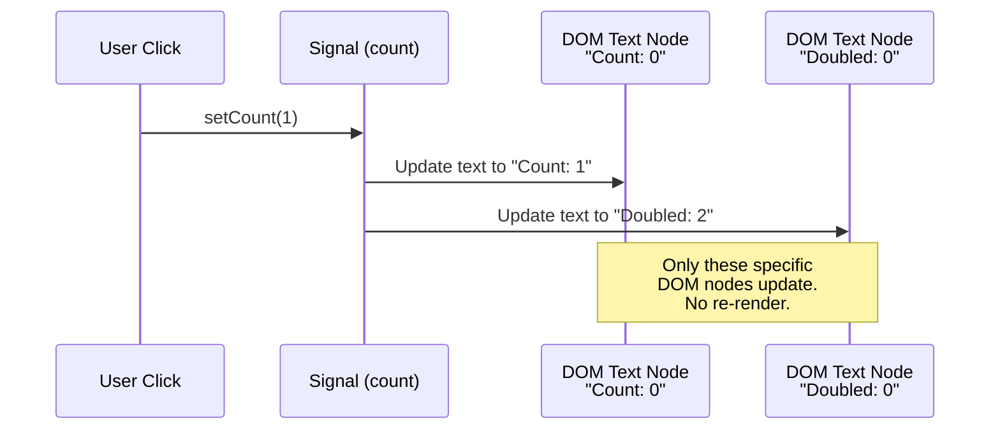

#### Angular Signals

Angularは2023年のv16でSignalsを導入した。従来のZone.jsベースのDirty Checking（変更検知）からSignalsベースのリアクティビティへの移行は、Angularの歴史において最大級のパラダイムシフトである。

```typescript
import { signal, computed, effect } from "@angular/core";

@Component({
  template: `
    <p>Count: {{ count() }}</p>
    <p>Doubled: {{ doubled() }}</p>
    <button (click)="increment()">Increment</button>
  `,
})
export class CounterComponent {
  count = signal(0);
  doubled = computed(() => this.count() * 2);

  constructor() {
    effect(() => {
      console.log(`Count: ${this.count()}`);
    });
  }

  increment() {
    this.count.update((c) => c + 1);
  }
}
```

Angular Signalsの導入は、Zone.jsの排除（Zoneless Angular）を可能にする。Zone.jsはすべての非同期操作（setTimeout、Promise、XMLHttpRequestなど）をモンキーパッチして変更検知のトリガーとしていたが、これは不要な変更検知サイクルを引き起こし、パフォーマンスのボトルネックとなっていた。Signalsにより、変更された箇所のみを正確に特定して更新できるようになる。

#### Preact Signals

Preact Signalsは、Preactの軽量さとSignalsの効率性を組み合わせたアプローチである。特筆すべきは、SignalをJSX内に直接渡すことで、コンポーネントの再レンダリングを完全にバイパスできる点である。

```javascript
import { signal, computed } from "@preact/signals";

const count = signal(0);
const doubled = computed(() => count.value * 2);

function Counter() {
  // When count changes, only the text node updates
  // The component function does NOT re-execute
  return (
    <div>
      <p>Count: {count}</p>
      <p>Doubled: {doubled}</p>
      <button onClick={() => count.value++}>Increment</button>
    </div>
  );
}
```

### 5.4 React のイミュータブルステートモデル

Reactのリアクティビティモデルは、ここまで紹介してきたフレームワークとは根本的に異なるアプローチを採っている。Reactは**明示的なリアクティビティプリミティブを持たない**。代わりに、状態の変更を検知する仕組みとして**イミュータブルなステートと再レンダリング**を採用している。

```javascript
function Counter() {
  // useState is NOT a reactive signal — it's a state snapshot mechanism
  const [count, setCount] = useState(0);

  // This value is recalculated on every render
  const doubled = count * 2;

  // Side effect — explicit dependency array required
  useEffect(() => {
    console.log(`Count: ${count}`);
  }, [count]); // developer must manually specify dependencies

  return (
    <div>
      <p>Count: {count}</p>
      <p>Doubled: {doubled}</p>
      <button onClick={() => setCount(count + 1)}>Increment</button>
    </div>
  );
}
```

Reactの設計哲学における重要な違いは以下の通りである。

| 観点 | Signal ベース（Solid, Vue等） | React |
|------|------------------------------|-------|
| 変更の伝播 | 自動追跡 + きめ細かな更新 | 再レンダリング + 差分比較 |
| 依存関係 | 実行時に自動検出 | 手動で指定（`useEffect` の依存配列） |
| 計算の単位 | 個々のリアクティブ式 | コンポーネント関数全体 |
| メモ化 | 暗黙的（Computedは自動キャッシュ） | 明示的（`useMemo`, `React.memo`） |
| メンタルモデル | スプレッドシート的 | スナップショットの連続 |

Reactが自動追跡を採用しない理由には、設計上の意図がある。Reactチームは、コンポーネント関数を「状態からUIへの純粋関数」として扱うことを重視している。自動追跡は暗黙的な副作用を生みやすく、関数の純粋性を損なう可能性がある。また、Reactの並行モード（Concurrent Features）は、レンダリングの中断と再開を前提としており、これは「関数の再実行」モデルとの親和性が高い。

::: warning React と Signals の関係
Reactチームは2024年のReact Confで、React Compilerを通じた自動メモ化を発表した。これはSignalsとは異なるアプローチで、コンパイラが `useMemo` や `useCallback` を自動挿入することで、手動のメモ化から開発者を解放する。Reactは「ランタイムのリアクティビティ」ではなく「コンパイラによる最適化」の方向に進んでいる。
:::

### 5.5 コンパイラベースのアプローチ（Svelte）

Svelte（Rich Harris、2016年初版）は、リアクティビティの実装において全く異なるアプローチを採っている。ランタイムでの依存追跡やProxyの使用を一切行わず、**コンパイル時に**リアクティブなコードを命令的なDOM操作コードに変換する。

#### Svelte 3/4 のアプローチ

Svelte 3/4では、`$:` ラベルを使ったリアクティブ宣言が特徴的だった。

```svelte
<script>
  let count = 0;

  // Reactive declaration: re-runs when count changes
  $: doubled = count * 2;

  // Reactive statement: re-runs when doubled changes
  $: console.log(`Doubled is now: ${doubled}`);

  function increment() {
    count++;
  }
</script>

<p>Count: {count}</p>
<p>Doubled: {doubled}</p>
<button on:click={increment}>Increment</button>
```

Svelteコンパイラはこのコードを解析し、`count` への代入がどの変数に影響するかを静的に解析する。コンパイル後のコードは概念的には以下のようになる。

```javascript
// Compiler output (simplified)
function create_fragment(ctx) {
  let p0, t0, p1, t1;

  return {
    create() {
      p0 = element("p");
      t0 = text("Count: " + ctx[0]); // ctx[0] = count
      p1 = element("p");
      t1 = text("Doubled: " + ctx[1]); // ctx[1] = doubled
    },
    update(ctx, dirty) {
      // Only update DOM nodes that depend on changed values
      if (dirty & 1) { // bit 0 = count changed
        set_data(t0, "Count: " + ctx[0]);
      }
      if (dirty & 2) { // bit 1 = doubled changed
        set_data(t1, "Doubled: " + ctx[1]);
      }
    },
  };
}

// The increment function becomes:
function increment() {
  count++;
  $$invalidate(0, count); // mark count as dirty
  // Compiler knows: doubled depends on count
  $$invalidate(1, (doubled = count * 2));
}
```

ここで注目すべきは、`dirty` ビットマスクを使った効率的な変更検知である。ランタイムのオーバーヘッドはほぼゼロであり、生成されるコードは手書きの命令的コードに近い効率性を持つ。

#### Svelte 5 のRunes

Svelte 5（2024年リリース）では、`$:` ラベルから**Runes**と呼ばれる新しいリアクティビティプリミティブに移行した。これはSignalsに近い明示的なAPIを提供しつつ、コンパイラベースの最適化を維持する。

```svelte
<script>
  // $state: reactive state (compiled away, not a runtime function)
  let count = $state(0);

  // $derived: computed value
  let doubled = $derived(count * 2);

  // $effect: side effect
  $effect(() => {
    console.log(`Count: ${count}`);
  });

  function increment() {
    count++;
  }
</script>

<p>Count: {count}</p>
<p>Doubled: {doubled}</p>
<button onclick={increment}>Increment</button>
```

Runesの導入により、Svelteのリアクティビティは以下の点で改善された。

1. **ファイル境界を超えたリアクティビティ**: `$:` はコンポーネント内でしか使えなかったが、Runesは `.svelte.js` ファイルでも使用可能
2. **明示性の向上**: `$state`、`$derived`、`$effect` という明確なプリミティブにより、何がリアクティブで何がそうでないかが一目で分かる
3. **Deep Reactivity**: `$state` で宣言されたオブジェクトや配列は自動的にdeepリアクティブになる（内部的にはProxyを使用）

## 6. Fine-Grained vs Coarse-Grained リアクティビティ

### 6.1 粒度の違い

リアクティブシステムの重要な設計判断の一つが、**更新の粒度（Granularity）**である。

**Coarse-Grained（粗粒度）リアクティビティ**では、変更が検知されるとコンポーネント（あるいはサブツリー）単位で再評価が行われる。Reactが典型例であり、状態が変更されるとコンポーネント関数全体が再実行され、仮想DOMの差分比較によって実際のDOM更新を最小化する。

**Fine-Grained（細粒度）リアクティビティ**では、変更が検知されると、その値に直接依存するDOM操作だけがピンポイントで実行される。仮想DOMや差分アルゴリズムは不要である。Solid.jsが典型例である。

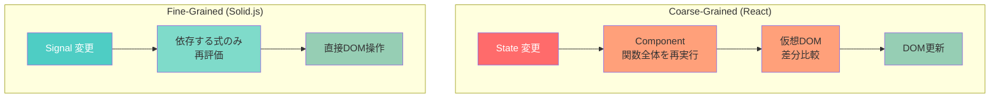

### 6.2 パフォーマンス特性の比較

両者のパフォーマンス特性は、アプリケーションの特性によって異なる。

**Fine-Grainedが有利な場面**:
- 大規模なコンポーネントの中で、少数の値だけが頻繁に変更される場合
- リアルタイムダッシュボード、ストリーミングデータの表示など、高頻度の部分更新が必要な場面
- 大きなリスト内の個別アイテムの更新

**Coarse-Grainedが有利な場面**:
- 状態変更によってコンポーネントの大部分が変化する場合（どちらにしても全体の再評価が必要）
- メモリ使用量が制約となる場合（Fine-Grainedはリアクティブノードごとにメタデータを保持するため、メモリ消費が大きい）
- 初期レンダリングのパフォーマンスが重要な場合

::: details パフォーマンスの定量的比較
JS Framework Benchmark（Krausest）のデータによると、Solid.jsはFine-Grainedリアクティビティにより、特に部分更新（partial update）と行の入れ替え（swap rows）のベンチマークでReactを大幅に上回る。一方、初期レンダリング（create rows）では、Reactの仮想DOM方式もSolid.jsと同等のパフォーマンスを示す場合がある。これは、仮想DOMの差分比較コストが初期レンダリングでは発生しないためである。
:::

### 6.3 コンポーネントの再実行モデルの違い

Fine-GrainedとCoarse-Grainedの最も根本的な違いは、**コンポーネント関数がいつ再実行されるか**にある。

Reactでは、状態変更のたびにコンポーネント関数が再実行される。これは「コンポーネント関数 = レンダリング関数」というモデルである。

```javascript
// React: this entire function re-runs on every state change
function ExpensiveComponent({ data }) {
  console.log("Component re-executed"); // called on every render

  const processed = useMemo(() => expensiveOperation(data), [data]);

  return <div>{processed}</div>;
}
```

Solid.jsでは、コンポーネント関数はセットアップ関数であり、一度だけ実行される。リアクティブな式だけが個別に再実行される。

```javascript
// Solid: this function runs ONCE as setup
function ExpensiveComponent(props) {
  console.log("Component setup"); // called only once

  const processed = createMemo(() => expensiveOperation(props.data));

  return <div>{processed()}</div>;
}
```

この違いは、開発者のメンタルモデルに大きな影響を与える。Reactでは「レンダリングのたびに新しいクロージャが生成される」ことを意識する必要があり、`useCallback` や `useMemo` によるメモ化が必要になる。Solid.jsではその必要がなく、クロージャは一度だけ生成される。

## 7. ダイヤモンド問題とバッチ更新

### 7.1 ダイヤモンド問題（Glitch問題）

リアクティブシステムにおける「ダイヤモンド問題」とは、依存グラフがダイヤモンド形（菱形）になったとき、中間的な不整合状態が観測可能になる問題のことである。

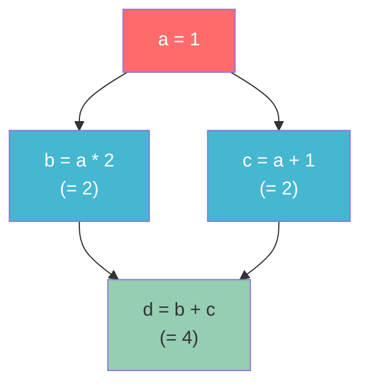

`a` が `1` から `2` に変更されたとき、`b` は `4`、`c` は `3` になるべきであり、`d` は `4 + 3 = 7` であるべきだ。しかし、素朴なPush型の実装では以下のような問題が起こりうる。

1. `a` が `2` に変更される
2. `b` が再計算される: `b = 2 * 2 = 4`
3. `d` が再計算される: `d = 4 + c` = `4 + 2 = 6`（`c` はまだ古い値！）
4. `c` が再計算される: `c = 2 + 1 = 3`
5. `d` が再び再計算される: `d = 4 + 3 = 7`

ステップ3で `d` の値が一時的に `6` になるという不整合が発生する。これが**Glitch**（一時的な不整合）である。もしステップ3の時点でEffectが実行されると、不正な値 `6` に基づいて副作用が起こる可能性がある。

### 7.2 トポロジカルソートによる解決

Glitchを防ぐ標準的な手法は、依存グラフの**トポロジカルソート順**に再計算を行うことである。

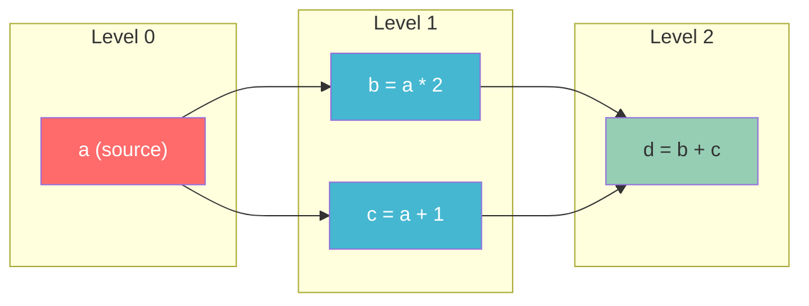

各ノードに「レベル」を割り当て、レベルの低い順（ソースに近い順）に再計算する。

1. Level 0: `a` が変更される
2. Level 1: `b` と `c` が再計算される（順序は問わない）
3. Level 2: `d` が再計算される（`b` と `c` が両方とも最新であることが保証されている）

この方式では、`d` が再計算されるのは1回だけであり、Glitchは発生しない。

### 7.3 バッチ更新

複数のソース値を同時に変更する場合、個々の変更ごとにグラフを走査するのは非効率である。**バッチ更新**は、一連の変更をまとめて処理することで、不要な中間再計算を排除する。

```javascript
// Without batching: two separate update cycles
setFirstName("太郎"); // triggers re-computation
setLastName("山田");  // triggers another re-computation

// With batching: single update cycle
batch(() => {
  setFirstName("太郎");
  setLastName("山田");
  // Re-computation happens once after batch completes
});
```

多くのフレームワークは、マイクロタスクやrequestAnimationFrameを利用した暗黙的なバッチ処理を実装している。同期的なイベントハンドラ内での複数の状態変更は、自動的にバッチ化される。

Reactは歴史的に、イベントハンドラ内の状態更新のみを自動バッチ化していたが、React 18以降は**Automatic Batching**により、Promise、setTimeout、ネイティブイベントハンドラ内の状態更新もすべて自動的にバッチ化されるようになった。

```javascript
// React 18+: all these updates are automatically batched
setTimeout(() => {
  setCount(1);
  setFlag(true);
  setName("Alice");
  // Only one re-render happens
}, 0);
```

## 8. メモ化（Computed / Derived）の実装

### 8.1 Computedの役割

Computed（あるいはDerived、Memo）は、他のリアクティブ値から派生する値を表す。その核心的な特性は以下の2つである。

1. **遅延評価**: 依存するソース値が変更されても、Computedの再計算はその値が実際に読み取られるまで遅延される（Pull型の性質）
2. **キャッシュ**: 依存するソース値が変更されていなければ、前回の計算結果を再利用する

### 8.2 実装の詳細

Computedの実装は、以下の状態遷移モデルで理解できる。

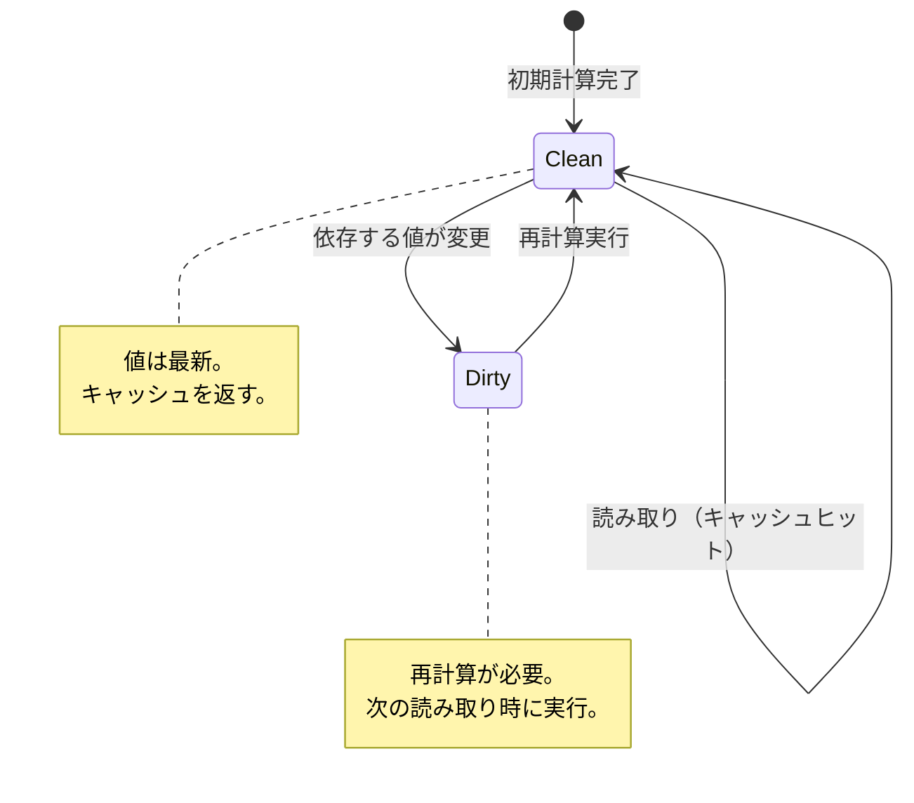

より高度な実装では、`MaybeDirty`（もしかしたらダーティ）という中間状態を導入する。これは、依存するComputedがダーティだが、再計算の結果が実際に変わるかどうかがまだ分からない状態である。

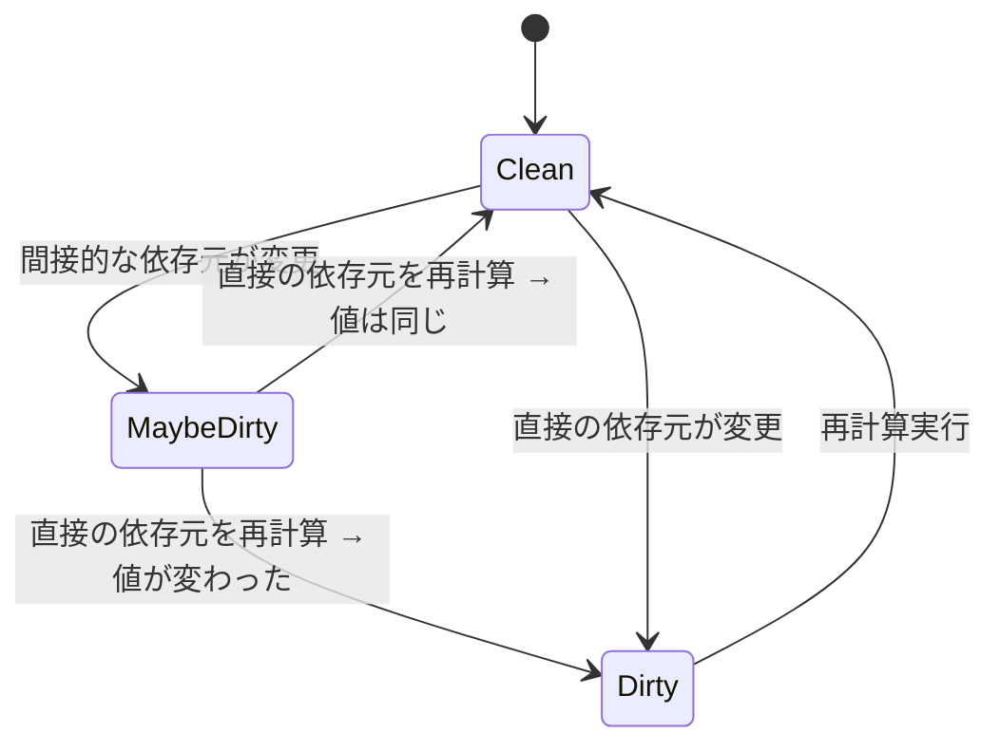

この最適化により、不必要な再計算の連鎖を断ち切ることができる。たとえば、`a → b → c` という依存チェーンで `a` が変更されても、`b` の再計算結果が以前と同じであれば、`c` を再計算する必要はない。

### 8.3 等価性チェック

Computedの再計算が行われた後、新しい値が以前の値と等しいかどうかを比較する**等価性チェック（Equality Check）**は、更新の伝播を最小化するための重要な仕組みである。

```javascript
const [items, setItems] = createSignal([1, 2, 3]);

// This computed returns the length of items
const count = createMemo(() => items().length);

// Even if items array is replaced, if length is the same,
// count's subscribers won't be notified
setItems([4, 5, 6]); // items changed, but count is still 3
```

デフォルトでは `Object.is()` による参照等価性チェックが使われるが、カスタムの等価性関数を提供できるフレームワークもある。

## 9. Effect（副作用）の管理

### 9.1 Effectとは

**Effect**は、リアクティブな値の変更に応じて実行される副作用である。副作用とは、DOM操作、ネットワークリクエスト、ロギング、タイマーの設定など、リアクティブシステムの「外側の世界」に影響を与える操作を指す。

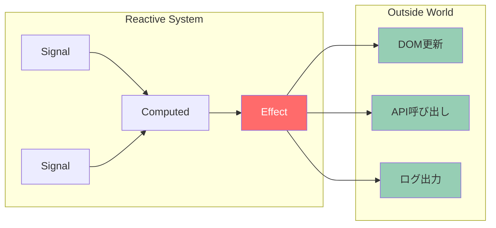

Effectはリアクティブグラフの「末端（Sink）」に位置し、値を生成するのではなく、外部に対するアクションを実行する。

### 9.2 クリーンアップ

Effectが管理する副作用は、次の実行時や廃棄時に**クリーンアップ**する必要がある場合がある。タイマーの解除、イベントリスナーの削除、ネットワークリクエストのキャンセルなどがこれに該当する。

```javascript
// Solid.js: onCleanup for effect cleanup
createEffect(() => {
  const id = setInterval(() => {
    console.log(`Count is: ${count()}`);
  }, 1000);

  // Cleanup: called before re-execution and on disposal
  onCleanup(() => clearInterval(id));
});
```

```javascript
// Vue 3: watchEffect with cleanup
watchEffect((onCleanup) => {
  const controller = new AbortController();

  fetch(`/api/data?id=${id.value}`, { signal: controller.signal })
    .then((res) => res.json())
    .then((data) => (result.value = data));

  onCleanup(() => controller.abort());
});
```

```javascript
// React: useEffect with cleanup return
useEffect(() => {
  const controller = new AbortController();

  fetch(`/api/data?id=${id}`, { signal: controller.signal })
    .then((res) => res.json())
    .then((data) => setResult(data));

  return () => controller.abort(); // cleanup function
}, [id]);
```

### 9.3 実行タイミング

Effectの実行タイミングは、フレームワークによって異なるが、一般的に以下の2種類がある。

1. **同期的Effect**: 依存する値が変更された直後に実行される。DOMへの即座の反映が必要な場合に使われる
2. **非同期的Effect（スケジュールされたEffect）**: マイクロタスクキューやアニメーションフレームにスケジュールされ、バッチ更新が完了した後に実行される

多くのフレームワークはデフォルトで非同期的Effectを採用している。これにより、複数の状態変更が一つのEffectの実行にまとめられ、不要な副作用の実行を防げる。

### 9.4 所有権とライフサイクル

Effectは通常、それを生成したコンテキスト（コンポーネントやスコープ）に**所有**される。所有者が破棄されると、そのEffectも自動的にクリーンアップされ破棄される。これにより、メモリリークを防止する。

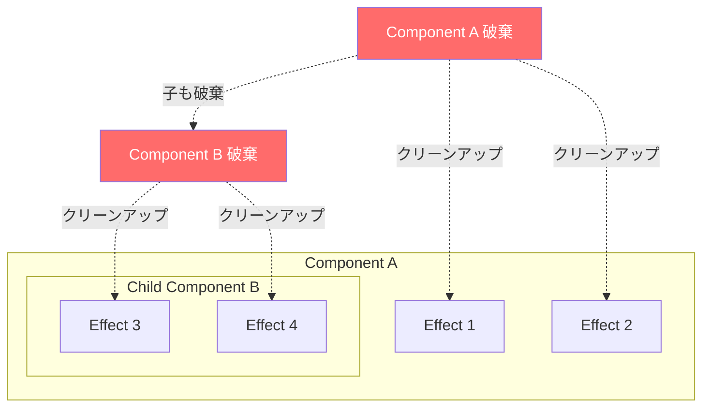

Solid.jsでは `createRoot` によって明示的な所有権スコープを作成でき、Vue.jsでは `effectScope` が同様の機能を提供する。

```javascript
// Vue 3: effectScope for manual scope management
const scope = effectScope();

scope.run(() => {
  const doubled = computed(() => counter.value * 2);

  watch(doubled, () => console.log(doubled.value));

  watchEffect(() => console.log("Count: ", counter.value));
});

// Dispose all effects within the scope
scope.stop();
```

## 10. 各アプローチの統合的な比較

### 10.1 アーキテクチャ比較

```mermaid
graph TB
    subgraph "React Model"
        RS[State Change] --> RR[Re-render<br/>Component]
        RR --> RV[Virtual DOM<br/>Diff]
        RV --> RD[DOM Patch]
    end

    subgraph "Vue 3 Model"
        VS[Proxy-based<br/>State Change] --> VT[Track &<br/>Trigger]
        VT --> VV[Virtual DOM<br/>Diff<br/>(optimized)]
        VV --> VD[DOM Patch]
    end

    subgraph "Solid.js Model"
        SS[Signal Change] --> SE[Re-run<br/>bound expressions]
        SE --> SD[Direct DOM<br/>Update]
    end

    subgraph "Svelte 5 Model"
        SV["Compiled<br/>$state Change"] --> SI["$$invalidate<br/>(bitflag)"]
        SI --> SU["Generated<br/>update()"]
        SU --> SVD[DOM Update]
    end

    style RS fill:#61dafb,color:#333
    style VS fill:#42b883,color:#fff
    style SS fill:#4f88c6,color:#fff
    style SV fill:#ff3e00,color:#fff
```

### 10.2 トレードオフの整理

| 観点 | React | Vue 3 | Solid.js | Svelte 5 |
|------|-------|-------|----------|----------|
| リアクティビティ手法 | イミュータブル + 再レンダリング | Proxy + 仮想DOM | Signals + Fine-Grained | コンパイラ + Runes |
| 更新粒度 | コンポーネント | コンポーネント（最適化あり） | DOM式単位 | DOM式単位 |
| ランタイムサイズ | 中（~40KB） | 中（~33KB） | 小（~7KB） | 極小（フレームワークレス） |
| メモリ消費 | 仮想DOM分のオーバーヘッド | Proxyのオーバーヘッド | リアクティブノードのオーバーヘッド | 最小限 |
| 学習曲線 | Hook のルールを理解する必要あり | 直感的だが `ref` vs `reactive` の使い分け | Signal の概念を理解する必要あり | 独自構文の学習が必要 |
| デバッグ容易性 | DevTools が充実 | DevTools が充実 | DevTools は発展途上 | 生成コードの理解が難しい場合あり |
| エコシステム | 最大 | 大 | 成長中 | 成長中 |

### 10.3 TC39 Signals Proposal

2024年、TC39（JavaScriptの標準化委員会）に**Signals**の標準化提案が提出された。この提案は、Angular, Bubble, Ember, FAST, MobX, Preact, Qwik, RxJS, Solid, Starbeam, Svelte, Vue, Wiz など、多数のフレームワーク開発者の合意に基づいている。

提案されているAPIは以下のようなものである。

```javascript
// TC39 Signals Proposal (Stage 1 as of 2024)
const counter = new Signal.State(0);
const isEven = new Signal.Computed(() => (counter.get() & 1) === 0);
const parity = new Signal.Computed(() => (isEven.get() ? "even" : "odd"));

// Watcher: notification mechanism for scheduling
const watcher = new Signal.subtle.Watcher(() => {
  // Called synchronously when a watched signal becomes dirty
  // Typically used to schedule async work
  queueMicrotask(processPending);
});

watcher.watch(parity);
counter.set(1); // watcher callback is called synchronously
```

この提案の特筆すべき点は、**フレームワーク間の相互運用性**を目指していることである。異なるフレームワークで作られたコンポーネントが、同じリアクティブグラフを共有できる可能性がある。たとえば、VueのComputedがSolid.jsのSignalに依存する、といったことが理論的に可能になる。

::: tip 標準化の意義
Signalsの標準化が実現すれば、ブラウザエンジンがリアクティブグラフの管理を最適化できる可能性がある。現在のフレームワークがJavaScriptレベルで実装しているトポロジカルソートやバッチ更新を、エンジンレベルで高速に処理できるようになるかもしれない。
:::

## 11. 実装における共通の課題

### 11.1 循環依存の検出

リアクティブグラフは有向非巡回グラフ（DAG）であることが前提であるが、開発者のミスによって循環依存が発生する可能性がある。

```javascript
// Circular dependency: a depends on b, b depends on a
const [a, setA] = createSignal(0);
const b = createMemo(() => a() + 1);
const c = createMemo(() => b() + 1);
// If a depended on c, we'd have a cycle: a -> b -> c -> a
```

循環依存は無限ループを引き起こすため、検出して適切なエラーを報告する仕組みが必要である。一般的な実装では、再計算中にすでに計算中のノードにアクセスした場合にエラーを投げる。

### 11.2 メモリリーク

リアクティブシステムにおけるメモリリークの主な原因は、**不要になったEffect やComputedが解除されないこと**である。特に以下のケースに注意が必要だ。

1. **グローバルなEffect**: コンポーネントのライフサイクルに紐付かないEffectは、手動でクリーンアップしないとリークする
2. **クロージャによるキャプチャ**: Effect内のクロージャが大きなオブジェクトをキャプチャし続ける場合
3. **条件付きの購読解除漏れ**: 条件分岐によって不要になったサブスクリプションが解除されない場合

### 11.3 Effect の無限ループ

Effect内でリアクティブな値を書き込むと、その書き込みがEffectの再実行をトリガーし、無限ループに陥る可能性がある。

```javascript
// Infinite loop: effect writes to its own dependency
const [count, setCount] = createSignal(0);

createEffect(() => {
  // Reading count triggers tracking
  console.log(count());
  // Writing count triggers re-execution of this effect
  setCount(count() + 1); // INFINITE LOOP!
});
```

多くのフレームワークは、Effect内での同一バッチ内の書き込みが再帰的なトリガーを引き起こさないようにする保護機構を備えているが、これは完全な解決策ではなく、開発者が注意すべき点である。

### 11.4 非同期処理との統合

リアクティブシステムの依存追跡は**同期的**に行われるため、非同期コールバック内での値の読み取りは追跡されない。

```javascript
createEffect(async () => {
  const id = userId(); // tracked: this read happens synchronously

  const data = await fetch(`/api/users/${id}`); // async boundary

  // NOT tracked: this read happens after the async boundary
  console.log(otherSignal()); // dependency is NOT registered
});
```

この問題に対して、フレームワークはさまざまなアプローチで対処している。

- **Vue.js**: `watchEffect` は初回の同期実行時のみ追跡するが、`watch` ではソースを明示的に指定するため、非同期問題を回避できる
- **Solid.js**: `createResource` という専用のAPIで非同期データの取得をリアクティブに扱う
- **React**: `useEffect` の依存配列を手動で指定するため、そもそも自動追跡に依存しない

## 12. 設計思想のまとめと今後の展望

### 12.1 根本的な設計思想の対立

フロントエンドのリアクティビティには、2つの根本的に異なる設計思想がある。

**値の同一性（Identity）に基づくアプローチ**（Signals / Vue / Solid）:
- リアクティブな値は「同一性」を持つ
- 値が変更されても、参照は同じ
- 変更の追跡は参照を通じて行われる
- オブジェクト指向的なメンタルモデル

**値のスナップショット（Snapshot）に基づくアプローチ**（React）:
- 値は不変であり、変更は「新しいスナップショットの作成」として表現される
- 前のスナップショットと新しいスナップショットの差分を比較する
- 関数型プログラミング的なメンタルモデル

どちらが「正しい」ということはなく、アプリケーションの特性やチームの嗜好に応じて選択すべきものである。

### 12.2 コンバージェンス（収束）の傾向

興味深いことに、異なるアプローチを採っていたフレームワーク間で収束が起きている。

- **React**: コンパイラによる自動メモ化（React Compiler）で、手動メモ化の負担を軽減
- **Vue**: Vapor Mode（実験的）で、仮想DOMを使わないFine-Grainedな更新を目指す
- **Svelte**: Runes（Svelte 5）で、Signalsに近い明示的なリアクティビティプリミティブを導入
- **Angular**: Zone.jsからSignalsベースへの移行

結果として、多くのフレームワークが「Signalsベースのリアクティビティ + コンパイラによる最適化」というハイブリッドな方向に向かっている。TC39のSignals提案が標準化されれば、この収束はさらに加速するだろう。

### 12.3 残された課題

リアクティブシステムの研究と実装には、まだ多くの未解決課題がある。

1. **サーバーサイドとの統合**: リアクティブな状態をサーバーとクライアント間でどのように同期するか。React Server Components、Qwik のResumability、Solid の Server Functions など、各フレームワークが異なるアプローチで挑戦している
2. **大規模リアクティブグラフのデバッグ**: 何百ものSignalとComputedが絡み合う大規模アプリケーションでは、データの流れを追跡し、パフォーマンスのボトルネックを特定することが困難になる
3. **並行処理との統合**: ReactのConcurrent Featuresのように、リアクティブな更新を中断・再開・優先度付けするモデルをSignalsベースのシステムでどう実現するか
4. **型安全性**: リアクティブなAPIの型付けは複雑であり、特にテンプレートコンパイラとの統合においては、TypeScriptの型システムとの整合性を保つことが課題となる

リアクティビティは、フロントエンドフレームワークの中核をなす技術であり続ける。その実装手法は進化を続けているが、根本的な問題意識 — 「状態が変化したとき、その変化をいかに効率的にUIに反映するか」 — は変わらない。スプレッドシートの時代から続くこの問いに対する答えは、ハードウェア、ブラウザエンジン、言語仕様の進化とともに、今後も洗練されていくことだろう。
