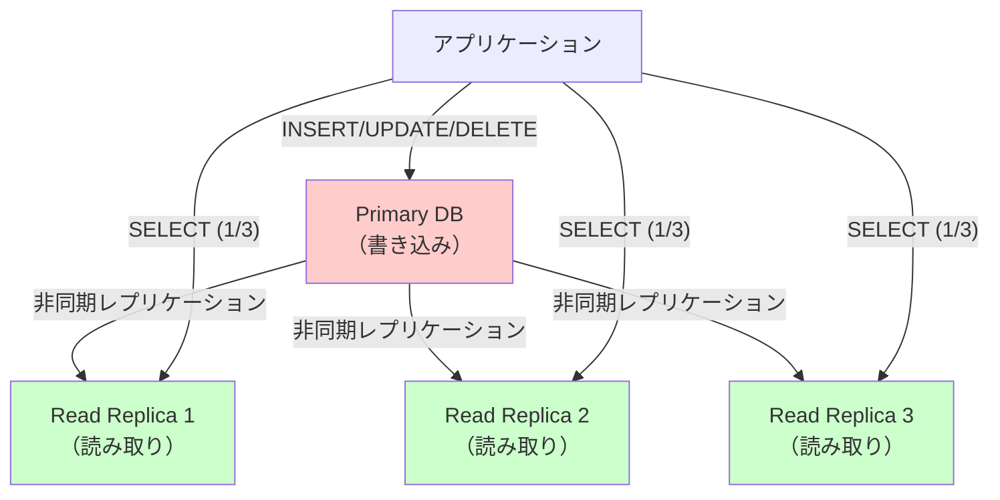
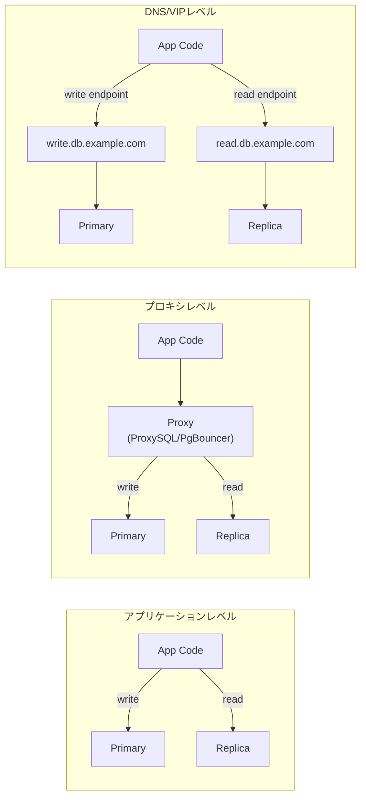
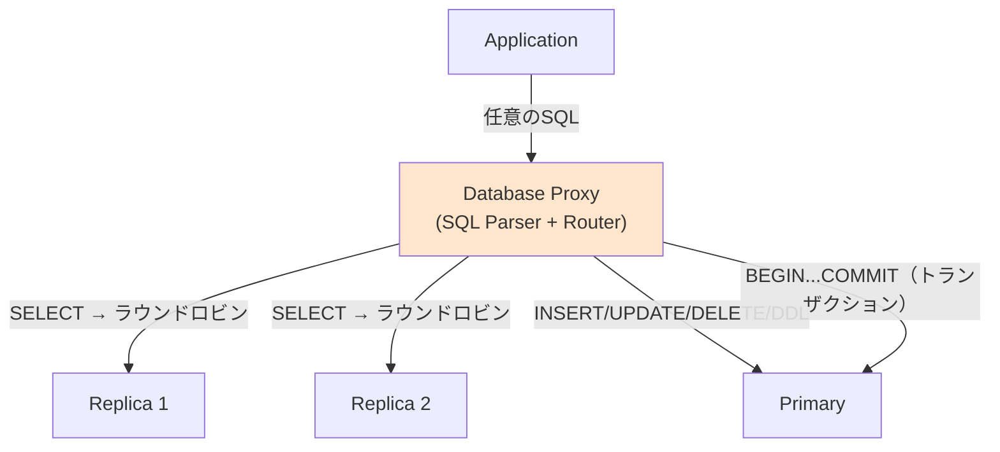
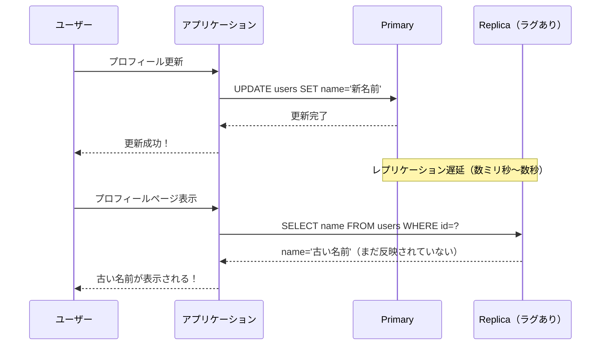
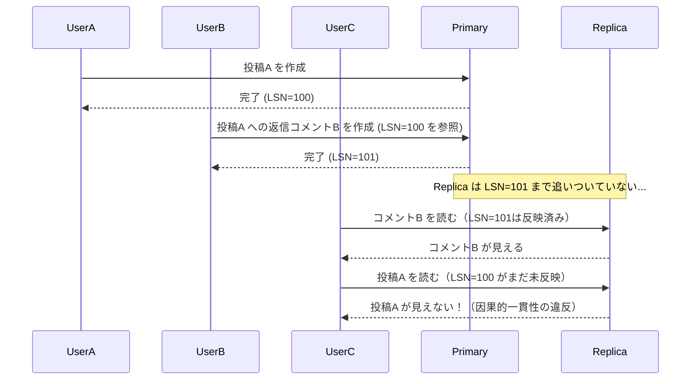
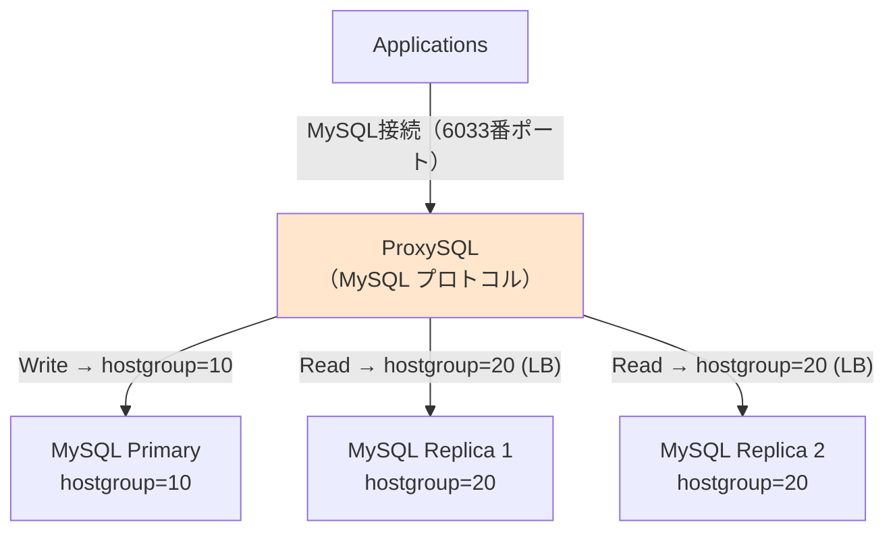
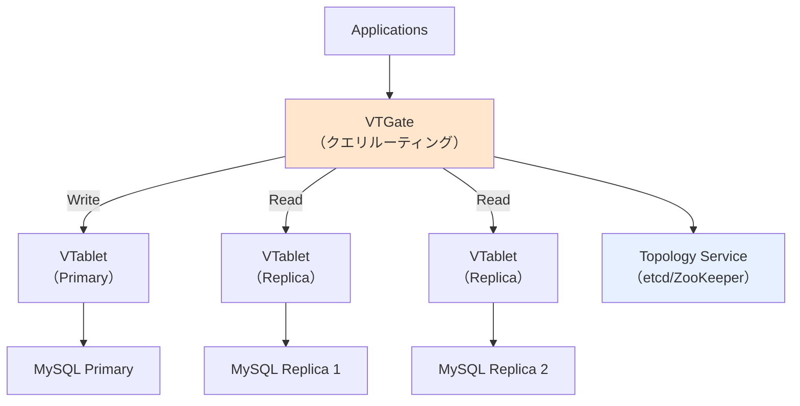
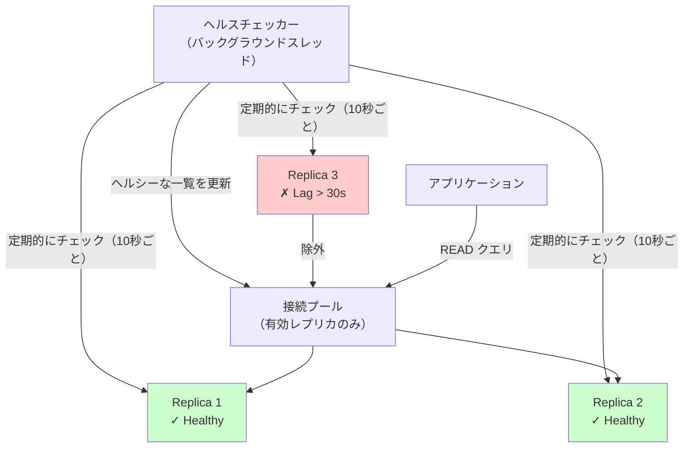
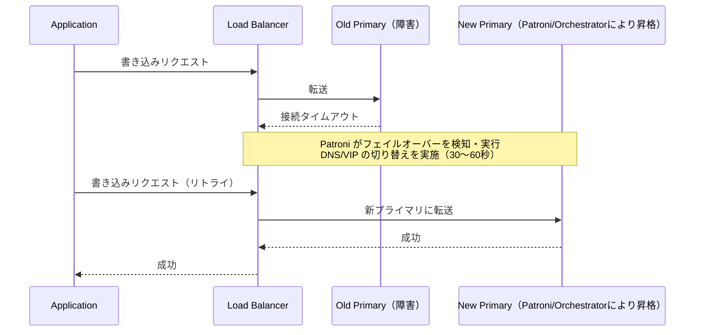
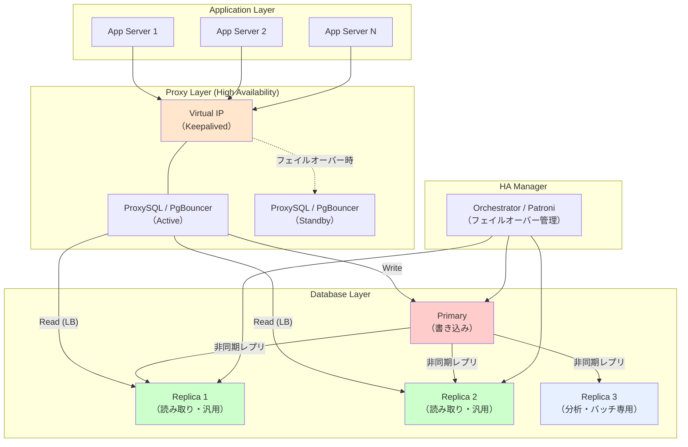

# Read Replica のルーティング設計

## 1. はじめに：Read Replica とは何か、なぜ必要か

現代のWebアプリケーションにおいて、データベースは最もスケールアウトが困難なコンポーネントの一つである。アプリケーションサーバーはステートレスに設計することで水平スケールが容易だが、データベースは状態を持つため、単純な複製ができない。

Read Replica（リードレプリカ）とは、プライマリデータベース（書き込みを受け付けるノード）のデータをレプリケーションによって複製した読み取り専用のデータベースノードである。プライマリへの書き込みは非同期（あるいは半同期）でレプリカに伝搬され、レプリカはSELECTクエリのみを処理する。

### 1.1 Read Replica が解決する問題

多くのWebアプリケーションでは、読み取り操作と書き込み操作の比率が非対称である。ECサイトの商品閲覧、SNSのタイムライン表示、ニュースサイトの記事配信――これらのユースケースでは、読み取りが全トラフィックの90〜95%を占めることも珍しくない。

この非対称性を活用するのが Read Replica の基本的なアイデアである。書き込みはプライマリに集中させ、読み取りは複数のレプリカに分散させることで、データベース全体のスループットを大幅に向上させることができる。



### 1.2 Read Replica の用途

Read Replica には読み取りスケーラビリティ以外にも複数の用途がある。

**分析クエリのオフロード**: 重いレポートクエリやバッチ集計処理をプライマリから切り離し、専用のレプリカで実行することで、本番トラフィックへの影響を防ぐ。`pg_dump` などのバックアップ処理もレプリカに向けることが多い。

**可用性の向上**: プライマリが障害を起こした際にレプリカをプライマリに昇格（フェイルオーバー）させることで、サービスの継続性を確保する。Read Replica はフェイルオーバー候補としても機能する。

**地理的分散**: グローバルサービスでは、ユーザーに物理的に近い地域にレプリカを配置することで読み取りレイテンシを低減できる。AWS Aurora Global Database や Google Cloud Spanner はこのユースケースを念頭に設計されている。

**障害分離**: プライマリへの負荷を適切に分散することで、予期しないクエリスパイクによるプライマリのCPU/I/Oリソース枯渇を防ぐ。

> [!NOTE]
> Read Replica は一般に非同期レプリケーションを使用するため、プライマリへの書き込みが即座にレプリカに反映されるわけではない。この「レプリケーションラグ」の問題は、ルーティング設計において最も重要な考慮事項の一つである。

## 2. Read/Write 分離の構成パターン

どこで Read と Write のルーティングを切り替えるかは、設計上の重要な判断点である。実装レイヤーによって、アプリケーションレベル、プロキシレベル、DNS/VIPレベルの3つに大別される。



### 2.1 アプリケーションレベルの分離

アプリケーションコード内で接続先を明示的に切り替えるパターンである。最もシンプルであり、細粒度の制御が可能だが、アプリケーション開発者の負担が増す。

```python
# Python example: explicit read/write routing
class UserRepository:
    def __init__(self, primary_conn, replica_conn):
        self._primary = primary_conn
        self._replica = replica_conn

    def create_user(self, name: str, email: str) -> User:
        # Write: always goes to primary
        cursor = self._primary.cursor()
        cursor.execute(
            "INSERT INTO users (name, email) VALUES (%s, %s) RETURNING id",
            (name, email)
        )
        return User(id=cursor.fetchone()[0], name=name, email=email)

    def find_user_by_id(self, user_id: int) -> User:
        # Read: can go to replica
        cursor = self._replica.cursor()
        cursor.execute("SELECT id, name, email FROM users WHERE id = %s", (user_id,))
        row = cursor.fetchone()
        return User(id=row[0], name=row[1], email=row[2]) if row else None
```

**利点**:
- トランザクション境界をアプリケーションが完全にコントロールできる
- 特定のクエリを特定のレプリカに向けるなど、高度なルーティングロジックが実装可能
- プロキシを挟まないためレイテンシが最小

**欠点**:
- 開発者が常に接続先を意識する必要があり、誤りが発生しやすい
- 接続プールの管理が複雑になる
- レプリカの追加・削除時にアプリケーションコードの変更が必要

### 2.2 プロキシレベルの分離

データベースとアプリケーションの間にプロキシを配置し、プロキシがSQLの種類を解析してルーティングを決定するパターンである。アプリケーションは単一のエンドポイント（プロキシ）に接続するだけでよく、Read/Writeの分離を透過的に行える。



ProxySQL、PgBouncer、AWS RDS Proxy などがこのカテゴリに属する。詳細は後述のセクション 4 で扱う。

**利点**:
- アプリケーションコードの変更が不要（または最小限）
- 接続プールの集約による効率化
- レプリカの追加・削除をプロキシ側で吸収できる

**欠点**:
- プロキシがSPOF（単一障害点）になりうる（冗長化が必要）
- SQL解析のオーバーヘッドが発生する
- プロキシ自体の運用・監視が必要

### 2.3 DNS/VIPレベルの分離

書き込み用エンドポイントと読み取り用エンドポイントを別のDNS名（またはVirtual IP）で提供し、アプリケーションはその2つのエンドポイントに接続を分けるパターンである。

```yaml
# Application configuration example
database:
  write:
    host: "primary.db.internal"       # Points to the primary
    port: 5432
  read:
    host: "replicas.db.internal"      # Points to a load balancer in front of replicas
    port: 5432
```

AWS RDS や Aurora のマネージドサービスでは、このパターンが標準的に提供されている。

```
# AWS Aurora endpoints example
Writer endpoint:  mydb.cluster-xxxxx.ap-northeast-1.rds.amazonaws.com
Reader endpoint:  mydb.cluster-ro-xxxxx.ap-northeast-1.rds.amazonaws.com
```

リーダーエンドポイントはAWSが内部でロードバランシングを行い、複数のレプリカにトラフィックを分散する。フェイルオーバー発生時はエンドポイントが自動的に新しいプライマリ/レプリカを向くようDNSが更新される。

**利点**:
- シンプルな設定でRead/Write分離が実現できる
- マネージドサービスではフェイルオーバーが自動化されている
- アプリケーションのコードが接続文字列の切り替えだけで済む

**欠点**:
- DNSのTTLによりフェイルオーバーに遅延が生じることがある
- DNS/VIPの制御がインフラ側に依存するため、柔軟なルーティングロジックの実装が困難
- クライアント側のDNSキャッシュが問題になることがある（JVM の `networkaddress.cache.ttl` など）

## 3. レプリケーションラグと一貫性の問題

Read Replica を導入する際に最も注意すべき問題が**レプリケーションラグ**である。プライマリへの書き込みがレプリカに反映されるまでに数ミリ秒〜数秒（場合によっては数分）の遅延が生じることがある。

### 3.1 レプリケーションラグの影響



この問題はユーザー体験を著しく損ない、「更新したのに反映されていない」というバグレポートにつながる。

### 3.2 Read-Your-Writes 一貫性

**Read-Your-Writes 一貫性**（Write後自己読み取り一貫性）とは、ユーザーが自身の書き込んだデータを必ず読み取れることを保証する一貫性モデルである。

この問題への対処法として、以下のアプローチが広く使われている。

#### 書き込み後のリードをプライマリに向ける

最もシンプルな方法は、書き込み直後の読み取りをプライマリに向けることである。ただし「直後」の期間をいつまでとするかを定義する必要がある。

```python
import time

class Session:
    def __init__(self):
        self.last_write_time = None

    def record_write(self):
        self.last_write_time = time.time()

    def should_use_primary(self) -> bool:
        # Use primary for 5 seconds after the last write
        if self.last_write_time is None:
            return False
        return (time.time() - self.last_write_time) < 5.0

class UserRepository:
    def find_user(self, user_id: int, session: Session) -> User:
        conn = self._primary if session.should_use_primary() else self._replica
        # ...
```

#### レプリケーション位置（LSN/binlog position）を追跡する

より精密なアプローチとして、書き込み時にプライマリのレプリケーション位置（PostgreSQLのLSN、MySQLのbinlogポジション）を記録し、読み取り先のレプリカがそのポジションに追いついた場合のみ使用する方法がある。

```python
# After write, record the primary's LSN
def create_comment(self, post_id: int, content: str) -> Comment:
    cursor = self._primary.cursor()
    cursor.execute(
        "INSERT INTO comments (post_id, content) VALUES (%s, %s)",
        (post_id, content)
    )
    # Record current WAL position
    cursor.execute("SELECT pg_current_wal_lsn()")
    lsn = cursor.fetchone()[0]
    self._session['min_lsn'] = lsn
    return Comment(...)

# On read, ensure the replica has caught up
def find_comments(self, post_id: int) -> list[Comment]:
    min_lsn = self._session.get('min_lsn')
    if min_lsn:
        cursor = self._replica.cursor()
        cursor.execute("SELECT pg_last_wal_replay_lsn()")
        replica_lsn = cursor.fetchone()[0]
        if replica_lsn < min_lsn:
            # Replica hasn't caught up, fall back to primary
            cursor = self._primary.cursor()
    # ...
```

ProxySQL は `GTID` を使ってこれを自動的に処理する機能を持つ。AWS Aurora も `aurora_replica_read_consistency` セッション変数でこの動作を制御できる。

#### ユーザーごとに一貫したレプリカを使う（Sticky Reads）

同一ユーザーのリクエストを常に同じレプリカに振ることで、単調読み取り（Monotonic Reads）を保証するアプローチである。ただしレプリカ間で負荷が偏る可能性がある。

```python
import hashlib

def get_replica_for_user(user_id: int, replicas: list) -> Replica:
    # Deterministic selection based on user_id
    index = int(hashlib.md5(str(user_id).encode()).hexdigest(), 16) % len(replicas)
    return replicas[index]
```

### 3.3 因果的一貫性（Causal Consistency）

Read-Your-Writes 一貫性はユーザーが自身の書き込みに関して一貫性を見ることを保証するが、より広い文脈で「原因と結果」の順序が保たれることを**因果的一貫性**と呼ぶ。

典型的なシナリオを考えよう。UserAが「投稿A」を作成し、UserBがそれへの返信「コメントB」を作成したとする。第三者がコメントBを読んだ場合、投稿Aも必ず見えていなければならない。



因果的一貫性を実装するには、操作に**因果的依存関係**を付与する必要がある。MongoDBはセッション内での因果的一貫性を `causalConsistency: true` オプションで提供している。

```javascript
// MongoDB causal consistency session example
const session = client.startSession({ causalConsistency: true });
try {
    // All reads and writes within this session are causally consistent
    await postsCollection.insertOne(
        { title: "Post A", content: "..." },
        { session }
    );
    // This read is guaranteed to see the insert above
    const post = await postsCollection.findOne(
        { title: "Post A" },
        { session }
    );
} finally {
    session.endSession();
}
```

### 3.4 ラグの許容度の設計

現実的には、すべての読み取りに厳密な一貫性を要求する必要はない。以下の基準でルーティングを使い分けることが有効である。

| 操作の種類 | 一貫性要件 | ルーティング先 |
|---|---|---|
| ユーザー自身のプロフィール読み取り | 強い（自己書き込み後） | プライマリ（または追いついたレプリカ） |
| 他のユーザーのプロフィール閲覧 | 弱い（数秒のラグ許容） | レプリカ |
| 注文確定後の注文詳細確認 | 強い | プライマリ |
| 商品カタログの閲覧 | 弱い（数分のラグ許容） | レプリカ |
| 管理画面での操作 | 強い | プライマリ |
| 分析レポートの生成 | 弱い（リアルタイム不要） | 専用分析レプリカ |

> [!TIP]
> アプリケーションの要件を「強一貫性が必要な操作」と「結果整合性で許容できる操作」に分類してからルーティング設計を始めることで、不必要なプライマリへの負荷集中を避けられる。

## 4. プロキシによるルーティング

### 4.1 ProxySQL

ProxySQL は MySQL/MariaDB 向けの高性能データベースプロキシである。クエリルーティング、コネクションプーリング、クエリキャッシュ、ミラーリングなど多彩な機能を持つ。

#### アーキテクチャ



#### 設定例

ProxySQLの設定はSQLインターフェース経由で行う。

```sql
-- Define backend servers
INSERT INTO mysql_servers (hostgroup_id, hostname, port, max_connections) VALUES
  (10, 'primary-host',  3306, 200),  -- Write hostgroup
  (20, 'replica1-host', 3306, 200),  -- Read hostgroup
  (20, 'replica2-host', 3306, 200);  -- Read hostgroup

-- Define replication group for monitoring
INSERT INTO mysql_replication_hostgroups (writer_hostgroup, reader_hostgroup, comment)
VALUES (10, 20, 'mysql_cluster');

-- Query routing rules
-- Rule 1: Explicit comment hints always go to writer
INSERT INTO mysql_query_rules (rule_id, active, match_digest, destination_hostgroup, apply)
VALUES (1, 1, '^SELECT .* FOR UPDATE', 10, 1);

-- Rule 2: SELECT queries go to reader
INSERT INTO mysql_query_rules (rule_id, active, match_digest, destination_hostgroup, apply)
VALUES (2, 1, '^SELECT', 20, 1);

-- Apply configuration
LOAD MYSQL SERVERS TO RUNTIME;
LOAD MYSQL QUERY RULES TO RUNTIME;
SAVE MYSQL SERVERS TO DISK;
SAVE MYSQL QUERY RULES TO DISK;
```

ProxySQLは `/* comment */` 形式のヒントによるルーティング制御もサポートしている。

```sql
-- Force routing to primary regardless of query type
SELECT /* hostgroup=10 */ * FROM users WHERE id = 1;
```

#### GTID を使った Read-Your-Writes

ProxySQL 2.0以降、GTIDベースの Read-Your-Writes 機能が利用できる。書き込み後に発行されたGTIDをセッションに記録し、後続の読み取りをそのGTIDを適用済みのレプリカに向ける。

```sql
-- Enable GTID tracking
SET mysql-default_session_track_gtids = 'OWN_GTID';
LOAD MYSQL VARIABLES TO RUNTIME;
```

### 4.2 PgBouncer

PgBouncer は PostgreSQL 向けの軽量コネクションプーラーである。ProxySQLと異なりSQLの解析・ルーティング機能は持たないが、コネクション数の削減とプーリングに特化した優れたパフォーマンスを発揮する。

PostgreSQLのRead/Write分離においては、PgBouncerを2インスタンス起動（Primaryへの接続用とReplicaへの接続用）して利用するのが一般的である。

```ini
# pgbouncer-primary.ini
[databases]
mydb = host=primary-host port=5432 dbname=mydb

[pgbouncer]
listen_addr = *
listen_port = 5432
pool_mode = transaction
max_client_conn = 1000
default_pool_size = 20
```

```ini
# pgbouncer-replica.ini
[databases]
mydb = host=replica-host port=5432 dbname=mydb

[pgbouncer]
listen_addr = *
listen_port = 5433
pool_mode = transaction
max_client_conn = 1000
default_pool_size = 20
```

アプリケーションは書き込み時は5432番ポート、読み取り時は5433番ポートに接続する。

より高度なRead/Write分離が必要な場合は、Pgpool-II を使う選択肢もある。Pgpool-II は PostgreSQL 向けのプロキシとして SQL 解析によるルーティングを実装している。

```
# Pgpool-II: automatic load balancing based on SQL type
load_balance_mode = on
# Write queries → primary (node 0)
# SELECT queries → distributed across all nodes
```

### 4.3 Vitess

Vitess は Kubernetes 上で MySQL を水平スケールさせるための分散データベースミドルウェアである。もともとYouTubeのスケーリングのために開発され、現在はPlanetScaleが主にメンテナンスしている。



VTGate（クエリルーター）がアプリケーションからのクエリを受け取り、VTablet（各MySQLノードのサイドカー）に転送する。VTabletはMySQL のレプリケーション状態を監視し、VTGateに情報を提供する。

Vitessはシャーディング機能も持ち、テーブルのシャードキーに基づいて適切なシャードへルーティングする点が特徴的である。

## 5. ORM レベルでの Read Replica 対応

多くのWebフレームワークとORMはRead Replica対応を組み込みでサポートしている。

### 5.1 Rails（Active Record）

Ruby on RailsのActive Recordは、Rails 6.0から**マルチDB対応（Multiple Databases）**を正式サポートし、Read Replica へのルーティングが宣言的に記述できるようになった。

```ruby
# config/database.yml
production:
  primary:
    adapter: postgresql
    database: myapp_production
    host: primary-host
  primary_replica:
    adapter: postgresql
    database: myapp_production
    host: replica-host
    replica: true  # Marks this as a read-only replica
```

```ruby
# app/models/application_record.rb
class ApplicationRecord < ActiveRecord::Base
  self.abstract_class = true

  connects_to database: { writing: :primary, reading: :primary_replica }
end
```

```ruby
# Usage in controllers and services
# Writes go to primary automatically
User.create!(name: "Alice", email: "alice@example.com")

# Reads use replica by default in some configurations
# Explicit use of replica:
ActiveRecord::Base.connected_to(role: :reading) do
  @users = User.where(active: true).to_a
end

# Automatic switching: reads in GET requests use replica,
# reads after writes use primary
```

Rails 6.1以降では `automatic_role_switching` によるロール自動切替が提供された。

```ruby
# config/application.rb
config.active_record.database_selector = { delay: 2.seconds }
config.active_record.database_resolver = ActiveRecord::Middleware::DatabaseSelector::Resolver
config.active_record.database_resolver_context = ActiveRecord::Middleware::DatabaseSelector::Resolver::Session
```

この設定では、直近2秒以内に書き込みがあったセッションではプライマリを使用し、それ以外ではレプリカを使用する。書き込みのタイムスタンプはセッションに記録される。

### 5.2 Django

Djangoは**データベースルーター（Database Router）**の仕組みを使ってRead/Write分離を実現する。

```python
# settings.py
DATABASES = {
    "default": {
        "ENGINE": "django.db.backends.postgresql",
        "NAME": "myapp",
        "HOST": "primary-host",
        "PORT": "5432",
    },
    "replica": {
        "ENGINE": "django.db.backends.postgresql",
        "NAME": "myapp",
        "HOST": "replica-host",
        "PORT": "5432",
        "TEST": {"MIRROR": "default"},  # Use primary in tests
    },
}

DATABASE_ROUTERS = ["myapp.routers.PrimaryReplicaRouter"]
```

```python
# myapp/routers.py
class PrimaryReplicaRouter:
    """
    Route read queries to replica and write queries to primary.
    """

    def db_for_read(self, model, **hints):
        """Direct all read operations to the replica."""
        return "replica"

    def db_for_write(self, model, **hints):
        """Direct all write operations to the primary (default)."""
        return "default"

    def allow_relation(self, obj1, obj2, **hints):
        """Allow relations between objects in the same database."""
        db_set = {"default", "replica"}
        if obj1._state.db in db_set and obj2._state.db in db_set:
            return True
        return None

    def allow_migrate(self, db, app_label, model_name=None, **hints):
        """Only run migrations on the primary."""
        return db == "default"
```

```python
# Usage in views
from django.db import transaction

# Automatic: reads go to replica
users = User.objects.filter(is_active=True)

# Explicit: force reading from primary
users = User.objects.using("default").filter(is_active=True)

# Writes always go to primary
with transaction.atomic():
    user = User.objects.create(name="Bob")
```

> [!WARNING]
> DjangoのDBルーターはトランザクション内での Read-Your-Writes を保証しない。`transaction.atomic()` ブロック内で作成したオブジェクトをすぐに読み取る場合は、明示的に `.using("default")` を指定するか、`select_for_update()` を使用すること。

### 5.3 Spring（Spring Data JPA）

Springエコシステムでは、**LazyConnectionDataSourceProxy** と **AbstractRoutingDataSource** を組み合わせる方法が代表的である。

```java
// ReplicationRoutingDataSource.java
import org.springframework.jdbc.datasource.lookup.AbstractRoutingDataSource;
import org.springframework.transaction.support.TransactionSynchronizationManager;

public class ReplicationRoutingDataSource extends AbstractRoutingDataSource {

    private static final String PRIMARY = "primary";
    private static final String REPLICA = "replica";

    @Override
    protected Object determineCurrentLookupKey() {
        // Use primary if the current transaction is read-write,
        // or if there is no active transaction (to be safe)
        if (TransactionSynchronizationManager.isCurrentTransactionReadOnly()) {
            return REPLICA;
        }
        return PRIMARY;
    }
}
```

```java
// DataSourceConfig.java
@Configuration
public class DataSourceConfig {

    @Bean
    @ConfigurationProperties("spring.datasource.primary")
    public DataSource primaryDataSource() {
        return DataSourceBuilder.create().build();
    }

    @Bean
    @ConfigurationProperties("spring.datasource.replica")
    public DataSource replicaDataSource() {
        return DataSourceBuilder.create().build();
    }

    @Bean
    public DataSource routingDataSource(
            @Qualifier("primaryDataSource") DataSource primary,
            @Qualifier("replicaDataSource") DataSource replica) {

        Map<Object, Object> dataSources = new HashMap<>();
        dataSources.put("primary", primary);
        dataSources.put("replica", replica);

        ReplicationRoutingDataSource routing = new ReplicationRoutingDataSource();
        routing.setTargetDataSources(dataSources);
        routing.setDefaultTargetDataSource(primary);
        return routing;
    }

    @Bean
    public DataSource dataSource(@Qualifier("routingDataSource") DataSource routingDataSource) {
        // LazyConnectionDataSourceProxy defers connection acquisition
        // until actual use, allowing the routing decision to happen
        // after @Transactional annotation is processed
        return new LazyConnectionDataSourceProxy(routingDataSource);
    }
}
```

```java
// UserService.java
@Service
public class UserService {

    @Transactional(readOnly = true)  // → Replica
    public List<User> findActiveUsers() {
        return userRepository.findByIsActiveTrue();
    }

    @Transactional  // → Primary (read-write transaction)
    public User createUser(String name, String email) {
        return userRepository.save(new User(name, email));
    }
}
```

`@Transactional(readOnly = true)` が付いたメソッドではレプリカへルーティングし、それ以外（もしくはトランザクションなし）ではプライマリへルーティングする設計である。`LazyConnectionDataSourceProxy` が重要で、これがないとトランザクションの開始前（`@Transactional` の判定前）に接続が確立され、常にデフォルト（プライマリ）が選ばれてしまう。

## 6. ヘルスチェックとフェイルオーバー

Read Replica を正しく運用するには、各レプリカの健全性を継続的に監視し、問題が発生したレプリカをルーティング先から除外する仕組みが不可欠である。

### 6.1 ヘルスチェックの種類

**死活監視（Liveness Check）**: レプリカのプロセスが起動しておりTCP接続を受け付けるかを確認する。最も基本的なチェックである。

```python
import socket

def is_replica_alive(host: str, port: int, timeout: float = 1.0) -> bool:
    """Check if the replica TCP port is accessible."""
    try:
        with socket.create_connection((host, port), timeout=timeout):
            return True
    except (socket.timeout, ConnectionRefusedError, OSError):
        return False
```

**クエリ実行確認（Readiness Check）**: 実際にSQLクエリを実行して応答を確認する。接続は受け付けられても処理が詰まっている場合をカバーする。

```python
def is_replica_ready(conn, timeout: float = 2.0) -> bool:
    """Check if the replica can execute queries."""
    try:
        cursor = conn.cursor()
        cursor.execute("SELECT 1")
        cursor.fetchone()
        return True
    except Exception:
        return False
```

**レプリケーションラグ確認**: レプリカのレプリケーションラグが許容範囲内かを確認する。ラグが大きすぎるレプリカはルーティング先から外す。

```python
def get_replica_lag_seconds(conn) -> float:
    """Get replication lag in seconds for PostgreSQL."""
    cursor = conn.cursor()
    cursor.execute("""
        SELECT EXTRACT(EPOCH FROM (now() - pg_last_xact_replay_timestamp()))
        AS lag_seconds
    """)
    result = cursor.fetchone()
    if result and result[0] is not None:
        return float(result[0])
    # No lag info available (could mean no replication activity)
    return 0.0

MAX_ACCEPTABLE_LAG_SECONDS = 30.0

def is_replica_lag_acceptable(conn) -> bool:
    lag = get_replica_lag_seconds(conn)
    return lag <= MAX_ACCEPTABLE_LAG_SECONDS
```

### 6.2 ヘルスチェックの実装パターン



```python
import threading
import time
from typing import List
import logging

logger = logging.getLogger(__name__)

class ReplicaPool:
    def __init__(self, replicas: list, check_interval: float = 10.0):
        self._all_replicas = replicas
        self._healthy_replicas: List = []
        self._lock = threading.RLock()
        self._check_interval = check_interval
        self._running = True
        # Start background health check thread
        self._thread = threading.Thread(target=self._health_check_loop, daemon=True)
        self._thread.start()

    def _health_check_loop(self):
        while self._running:
            healthy = []
            for replica in self._all_replicas:
                try:
                    if replica.ping() and is_replica_lag_acceptable(replica.conn):
                        healthy.append(replica)
                    else:
                        logger.warning(f"Replica {replica.host} is unhealthy or lagging, removing from pool")
                except Exception as e:
                    logger.error(f"Health check failed for {replica.host}: {e}")
            with self._lock:
                self._healthy_replicas = healthy
            time.sleep(self._check_interval)

    def get_replica(self):
        with self._lock:
            if not self._healthy_replicas:
                raise RuntimeError("No healthy replicas available")
            # Round-robin selection
            replica = self._healthy_replicas[0]
            self._healthy_replicas.append(self._healthy_replicas.pop(0))
            return replica

    def stop(self):
        self._running = False
```

### 6.3 フェイルオーバー時の挙動

プライマリが障害を起こした際、レプリカの一つがプライマリに昇格するフェイルオーバーが発生する。この際のルーティング設計として注意すべき点がある。

**フェイルオーバー検知のラグ**: Orchestrator、Patroni（PostgreSQL）、MHA（MySQL HA）などの高可用性ツールがフェイルオーバーを検知して完了するまでの間（通常30秒〜数分）、アプリケーションが古いプライマリへの書き込みを試み続ける可能性がある。

**DNS TTLの問題**: DNS ベースのフェイルオーバーでは、クライアントがキャッシュしたDNSレコードの有効期限が切れるまで古いホストに接続し続ける。JVMの `networkaddress.cache.ttl` や各種HTTPクライアントのDNSキャッシュ設定を低い値（60秒以下）に設定しておく必要がある。

**接続のドレイン**: フェイルオーバー中に既存の接続を適切にクローズし、新しい接続を新しいプライマリに向ける仕組みが必要である。コネクションプール（PgBouncer、HikariCP など）はこの処理を支援する機能を持つ。



> [!WARNING]
> フェイルオーバー中は短期間の書き込み失敗が発生する可能性がある。アプリケーション側でリトライロジック（指数バックオフ付き）を実装し、ユーザーへの影響を最小限に抑えること。

## 7. 重み付きルーティング

すべてのレプリカが同じスペックや同じネットワーク距離にあるとは限らない。重み付きルーティングを使うことで、性能や地理的条件に応じてトラフィックを柔軟に分配できる。

### 7.1 重みの設定方法

**スペックベースの重み付け**: レプリカのCPUコア数やRAM容量に比例した重みを設定する。

```python
from dataclasses import dataclass
import random

@dataclass
class Replica:
    host: str
    weight: int   # Relative weight (e.g., 100 = 1x, 200 = 2x)

replicas = [
    Replica(host="replica1", weight=100),   # Standard instance
    Replica(host="replica2", weight=100),   # Standard instance
    Replica(host="replica3", weight=200),   # High-spec instance (2x weight)
]

def select_replica_weighted(replicas: list[Replica]) -> Replica:
    """Weighted random selection."""
    total = sum(r.weight for r in replicas)
    rand = random.uniform(0, total)
    cumulative = 0.0
    for replica in replicas:
        cumulative += replica.weight
        if rand <= cumulative:
            return replica
    return replicas[-1]  # Fallback to last
```

**ラグベースの動的重み付け**: レプリケーションラグが大きいレプリカの重みを動的に下げることで、古いデータを返す可能性を低減する。

```python
import math

MAX_LAG = 60.0   # seconds

def calculate_weight(base_weight: int, lag_seconds: float) -> int:
    """
    Reduce weight exponentially as lag increases.
    At 0 seconds lag: full weight
    At MAX_LAG seconds lag: weight approaches 0
    """
    if lag_seconds >= MAX_LAG:
        return 0  # Exclude from routing
    factor = 1.0 - (lag_seconds / MAX_LAG) ** 2
    return max(1, int(base_weight * factor))
```

### 7.2 地理的近接性によるルーティング

グローバルに展開するサービスでは、クライアントのIPアドレスや接続元リージョンに基づいて最も近いレプリカを選択する。

```python
# Region-aware routing example
REGION_REPLICAS = {
    "ap-northeast-1": ["replica-tokyo-1", "replica-tokyo-2"],
    "us-east-1":      ["replica-virginia-1", "replica-virginia-2"],
    "eu-west-1":      ["replica-ireland-1", "replica-ireland-2"],
}

def get_replicas_for_region(client_region: str) -> list[str]:
    """
    Return replicas for the client's region.
    Fall back to default region replicas if not found.
    """
    return REGION_REPLICAS.get(client_region, REGION_REPLICAS["ap-northeast-1"])
```

### 7.3 ProxySQL での重み付き設定

```sql
-- Set different weights for read replicas in ProxySQL
INSERT INTO mysql_servers
  (hostgroup_id, hostname, port, weight, max_connections)
VALUES
  (20, 'replica1-host', 3306, 100, 200),   -- Normal weight
  (20, 'replica2-host', 3306, 100, 200),   -- Normal weight
  (20, 'replica3-host', 3306, 200, 400);   -- Double weight (high-spec)

LOAD MYSQL SERVERS TO RUNTIME;
SAVE MYSQL SERVERS TO DISK;
```

### 7.4 カナリア的なルーティング

新しいレプリカ（新バージョンのMySQL/PostgreSQL、新しいインスタンスタイプなど）を本番投入する前に少量のトラフィックを向けてテストする「カナリアルーティング」も重み付けで実現できる。

```sql
-- Send 10% of read traffic to the new replica for testing
INSERT INTO mysql_servers
  (hostgroup_id, hostname, port, weight, max_connections)
VALUES
  (20, 'replica-existing-1', 3306, 450, 200),
  (20, 'replica-existing-2', 3306, 450, 200),
  (20, 'replica-new-version', 3306,  100, 50);   -- 10% weight
```

## 8. 総合的なアーキテクチャと運用の考慮事項

### 8.1 推奨アーキテクチャ

以下に、一般的な本番環境での Read Replica ルーティングアーキテクチャを示す。



### 8.2 接続数の管理

Read Replica を導入するとレプリカの数だけ接続先が増える。適切なコネクションプーリングなしではデータベースの接続数上限に達することがある。

```
# PostgreSQL: max_connections のデフォルトは100
# アプリケーションサーバー10台 × レプリカ3台 × スレッド10 = 300接続（上限超過）

# PgBouncer/ProxySQL を介した場合:
# アプリケーションサーバー → PgBouncer（1000接続受付）
# PgBouncer → 各レプリカ（20接続プール）
```

### 8.3 モニタリング指標

Read Replica 環境で監視すべき主要なメトリクスを整理する。

| メトリクス | 説明 | アラート閾値の目安 |
|---|---|---|
| Replication lag (seconds) | プライマリからレプリカへの遅延 | > 30秒で警告、> 120秒で緊急 |
| Healthy replica count | ヘルシーなレプリカ数 | 1台以下で緊急 |
| QPS per replica | レプリカあたりのクエリ毎秒 | 設計上限の80%で警告 |
| Connection pool utilization | プール使用率 | 80%超で警告 |
| Read/Write routing ratio | Read/Write の振り分け比率 | 設計値から大きく乖離で調査 |
| Query error rate on replicas | レプリカでのクエリエラー率 | 1%超で調査 |

```sql
-- PostgreSQL: replication lag monitoring query
SELECT
    client_addr,
    state,
    sent_lsn,
    replay_lsn,
    (sent_lsn - replay_lsn)::bigint AS lag_bytes,
    EXTRACT(EPOCH FROM (now() - replay_lag)) AS lag_seconds
FROM pg_stat_replication
ORDER BY lag_seconds DESC;
```

### 8.4 アンチパターンと注意点

#### トランザクション内での Read Replica 利用

書き込みトランザクション内での読み取りをレプリカに向けることは、多くの場合問題を引き起こす。

```python
# ANTI-PATTERN: Reading from replica within a write transaction
with transaction.atomic():  # Transaction starts on primary
    order = Order.objects.create(user=user, total=100)
    # This might go to replica, which doesn't have the order yet!
    confirmed = Order.objects.using("replica").get(id=order.id)  # NG
```

```python
# CORRECT: Stay on primary within a transaction
with transaction.atomic():
    order = Order.objects.create(user=user, total=100)
    confirmed = Order.objects.get(id=order.id)  # Uses primary (same transaction)
```

#### DDL 後の即時読み取り

スキーマ変更（ALTER TABLE）などのDDLはプライマリで実行されるが、レプリカへの反映に時間がかかる場合がある。マイグレーション直後にレプリカから読み取ると、古いスキーマのデータが返ることがある。

#### 長時間クエリによるレプリケーションブロック

一部のデータベース（PostgreSQL の `hot_standby_feedback` など）では、レプリカで実行中のクエリが完了するまでVACUUMや行のパージが遅延することがある。分析用の長時間クエリは専用レプリカに向けることを推奨する。

> [!TIP]
> 分析・バッチ処理専用のレプリカを汎用読み取りレプリカとは別に用意することで、重い集計クエリが通常の読み取りトラフィックに影響を与えるリスクを排除できる。Aurora や RDS では `db.r` 系インスタンスタイプをAnalytics用に追加することが一般的である。

## 9. マネージドサービスにおける Read Replica

クラウドのマネージドデータベースサービスは Read Replica 管理を大幅に簡素化する。

### 9.1 Amazon Aurora

Aurora は Read Replica の管理において最も成熟したマネージドサービスの一つである。

- **共有ストレージアーキテクチャ**: PrimaryとReplicaが同一のAurora分散ストレージ（6つのコピーを3 AZに分散）を共有するため、レプリケーションラグが極めて小さい（通常数ミリ秒以内）
- **自動フェイルオーバー**: Primary障害時に30秒以内でReplicaを昇格
- **Reader Endpoint**: 複数のReadレプリカへのロードバランシングを単一のエンドポイントで提供
- **Aurora Auto Scaling**: 読み取り負荷に応じてReplicaを自動的に追加・削除

```python
# Aurora connection example with writer and reader endpoints
import psycopg2

writer_conn = psycopg2.connect(
    host="mydb.cluster-xxxxx.ap-northeast-1.rds.amazonaws.com",
    database="myapp", user="admin", password="..."
)

reader_conn = psycopg2.connect(
    host="mydb.cluster-ro-xxxxx.ap-northeast-1.rds.amazonaws.com",
    database="myapp", user="admin", password="..."
)
```

### 9.2 Google Cloud Spanner

Spanner は従来のレプリケーションの概念とは異なり、グローバルに強一貫性を持つ分散データベースである。Read Replicaの概念は薄く、リードレプリカの代わりに「リードのみのリージョン」を設定して地理的に近い場所から読み取る仕組みを提供する。

### 9.3 PlanetScale（Vitess ベース）

PlanetScale は Vitess をベースにした MySQL 互換のサーバーレスデータベースで、自動シャーディングと Read Replica 管理が組み込まれている。

```javascript
// PlanetScale connection branching example
const db = createConnection({
  host: process.env.DATABASE_HOST,
  database: process.env.DATABASE_NAME,
  username: process.env.DATABASE_USERNAME,
  password: process.env.DATABASE_PASSWORD,
});
// PlanetScale handles read replica routing transparently
```

## 10. まとめ

Read Replica のルーティング設計は、単に「読み取りをレプリカへ」というシンプルな話ではなく、一貫性・可用性・レイテンシ・運用コストの多面的なトレードオフを扱う設計課題である。

本記事で扱った主要なトピックを整理する。

| 設計軸 | 主な選択肢 | 判断のポイント |
|---|---|---|
| ルーティングレイヤー | アプリケーション / プロキシ / DNS | 開発コスト vs 透過性 vs 柔軟性 |
| 一貫性保証 | 強一貫性 / Read-Your-Writes / 因果 / 結果整合 | ユーザー体験への影響度 |
| プロキシ製品 | ProxySQL / PgBouncer / Vitess | DBの種類 / スケール要件 |
| ORM統合 | Rails / Django / Spring | フレームワークの標準機能の活用 |
| ヘルスチェック | 死活 / クエリ実行 / ラグ監視 | サービスの可用性要件 |
| 重み付け | 静的 / ラグ動的 / 地理的 | インフラ構成の複雑さ |

最も重要な原則は、**アプリケーションの操作を「強一貫性が必要なもの」と「結果整合性で許容できるもの」に分類し、その分類に基づいてルーティングを設計すること**である。すべての読み取りを無条件にレプリカに向けるのではなく、書き込み直後の自己読み取りや決済・在庫確認などの重要操作はプライマリから読む、という粒度の細かいルーティング判断がシステムの信頼性を高める。

また、どれだけ高度なルーティングを実装しても、レプリケーションラグという物理的な制約は存在する。システムの要件定義の段階で「どの程度のラグが許容できるか」「どの操作で強一貫性が必須か」をステークホルダーと合意しておくことが、適切なアーキテクチャ選択への第一歩となる。
