# Redis の内部設計（データ構造実装, シングルスレッドモデル, 永続化, Cluster）

## 1. はじめに：Redis はなぜ速いのか

Redis（Remote Dictionary Server）は、Salvatore Sanfilippo（通称 antirez）が2009年に公開したインメモリデータストアである。キー・バリューストアとして出発しながらも、文字列、リスト、ハッシュ、集合、ソート済み集合、ストリームといった多彩なデータ構造をサーバーサイドで直接操作できる点が他のキャッシュシステムと一線を画している。

Redis の設計は「シンプルさが性能を生む」という哲学に貫かれている。単純なキー・バリュー操作で毎秒数十万リクエストを処理できる性能は、以下の設計判断の積み重ねによって実現されている。

1. **すべてのデータをメモリ上に保持する**：ディスクI/Oをクリティカルパスから排除する
2. **シングルスレッドのイベント駆動モデル**：ロック競合を完全に排除し、コンテキストスイッチを最小化する
3. **データ構造ごとに最適化された内部エンコーディング**：同じ論理型でもデータサイズに応じて内部表現を切り替える
4. **カーネルの I/O 多重化（epoll / kqueue）を最大限に活用する**：少ないスレッドで大量の接続を捌く

本記事では、Redis の内部設計を以下の観点から深く掘り下げる。

- データ構造の内部実装（SDS、ziplist / listpack、dict、skiplist）
- シングルスレッドモデルとイベントループの詳細
- 永続化メカニズム（RDB / AOF / ハイブリッド）
- レプリケーションアーキテクチャ
- Redis Cluster の設計（ハッシュスロット、Gossip プロトコル）
- メモリ管理と Eviction ポリシー

これらを通じて、Redis が単なる「速いキャッシュ」ではなく、極めて洗練された設計思想に基づくシステムであることを明らかにしたい。

## 2. Redis オブジェクトシステムと型エンコーディング

Redis は、ユーザーが操作する論理的なデータ型と、メモリ上の物理的なエンコーディングを明確に分離している。この二層構造が、Redis のメモリ効率と性能の両立を可能にしている。

### 2.1 redisObject 構造体

Redis のすべての値は `redisObject` 構造体でラップされている。

```c
typedef struct redisObject {
    unsigned type:4;      // logical type (string, list, set, etc.)
    unsigned encoding:4;  // internal encoding format
    unsigned lru:24;      // LRU time or LFU frequency data
    int refcount;         // reference count for memory management
    void *ptr;            // pointer to the actual data structure
} robj;
```

`type` フィールドは論理的なデータ型を表し、`encoding` フィールドはその型の内部表現を示す。たとえば、同じ「リスト」型でも、要素数が少ないうちは `listpack`（かつては `ziplist`）で格納し、要素数が増えると `quicklist` に昇格する。

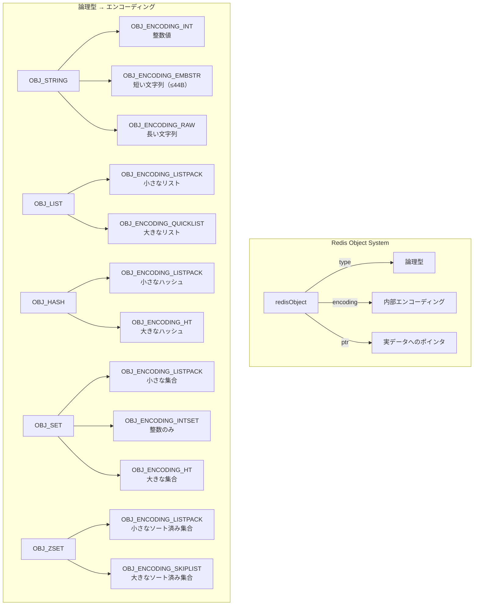
```mermaid
graph TD
    subgraph "Redis Object System"
        RO["redisObject"]
        RO -->|type| T["論理型"]
        RO -->|encoding| E["内部エンコーディング"]
        RO -->|ptr| P["実データへのポインタ"]
    end

    subgraph "論理型 → エンコーディング"
        STR["OBJ_STRING"]
        STR --> STR_INT["OBJ_ENCODING_INT<br/>整数値"]
        STR --> STR_EMBSTR["OBJ_ENCODING_EMBSTR<br/>短い文字列（≤44B）"]
        STR --> STR_RAW["OBJ_ENCODING_RAW<br/>長い文字列"]

        LST["OBJ_LIST"]
        LST --> LST_LP["OBJ_ENCODING_LISTPACK<br/>小さなリスト"]
        LST --> LST_QL["OBJ_ENCODING_QUICKLIST<br/>大きなリスト"]

        HASH["OBJ_HASH"]
        HASH --> HASH_LP["OBJ_ENCODING_LISTPACK<br/>小さなハッシュ"]
        HASH --> HASH_HT["OBJ_ENCODING_HT<br/>大きなハッシュ"]

        SET["OBJ_SET"]
        SET --> SET_LP["OBJ_ENCODING_LISTPACK<br/>小さな集合"]
        SET --> SET_INT["OBJ_ENCODING_INTSET<br/>整数のみ"]
        SET --> SET_HT["OBJ_ENCODING_HT<br/>大きな集合"]

        ZSET["OBJ_ZSET"]
        ZSET --> ZSET_LP["OBJ_ENCODING_LISTPACK<br/>小さなソート済み集合"]
        ZSET --> ZSET_SL["OBJ_ENCODING_SKIPLIST<br/>大きなソート済み集合"]
    end
```

### 2.2 エンコーディングの自動昇格

Redis は要素数やサイズの閾値を超えると、自動的にエンコーディングを昇格させる。この切り替えはユーザーに対して完全に透過的であり、API は一切変わらない。

| 論理型 | コンパクトエンコーディング | 条件 | 通常エンコーディング |
|---|---|---|---|
| STRING | INT / EMBSTR | 整数 / ≤44バイト | RAW |
| LIST | listpack | 要素数 ≤128 かつ各要素 ≤64B | quicklist |
| HASH | listpack | フィールド数 ≤128 かつ各値 ≤64B | hashtable |
| SET | intset / listpack | 整数のみ ≤512要素 / ≤128要素 | hashtable |
| ZSET | listpack | 要素数 ≤128 かつ各要素 ≤64B | skiplist + hashtable |

::: tip エンコーディングの確認方法
`OBJECT ENCODING <key>` コマンドで任意のキーの内部エンコーディングを確認できる。

```
127.0.0.1:6379> SET counter 42
OK
127.0.0.1:6379> OBJECT ENCODING counter
"int"
127.0.0.1:6379> SET name "hello"
OK
127.0.0.1:6379> OBJECT ENCODING name
"embstr"
```
:::

## 3. データ構造の内部実装

### 3.1 SDS（Simple Dynamic String）

Redis は C の標準文字列（null 終端文字列）を直接使用しない。代わりに **SDS（Simple Dynamic String）** と呼ばれる独自の文字列ライブラリを用いている。SDS の設計には、C 文字列の根本的な問題を解決するための工夫が詰まっている。

#### C 文字列の問題点

1. **長さの取得が O(n)**：`strlen()` は null バイトまで走査する必要がある
2. **バッファオーバーフローの危険**：`strcat()` などが事前にバッファサイズを検証しない
3. **バイナリセーフでない**：null バイトを含むデータを格納できない
4. **頻繁なメモリ再割り当て**：文字列の変更のたびに `realloc()` が必要になりうる

#### SDS のヘッダ構造

SDS はヘッダサイズを文字列長に応じて動的に切り替える。短い文字列ではヘッダのオーバーヘッドを最小化し、長い文字列では十分な範囲のサイズ情報を保持する。

```c
// SDS header for strings up to 255 bytes
struct __attribute__ ((__packed__)) sdshdr8 {
    uint8_t len;        // current string length
    uint8_t alloc;      // allocated buffer size (excluding header and null terminator)
    unsigned char flags; // header type indicator (lower 3 bits)
    char buf[];          // actual string data (flexible array member)
};

// SDS header for strings up to 65535 bytes
struct __attribute__ ((__packed__)) sdshdr16 {
    uint16_t len;
    uint16_t alloc;
    unsigned char flags;
    char buf[];
};

// Additional variants: sdshdr32, sdshdr64
```

```
SDS メモリレイアウト (sdshdr8):
┌─────┬───────┬───────┬─────────────────────────┬────┐
│ len │ alloc │ flags │ buf[] (実際の文字列データ) │ \0 │
│ 1B  │  1B   │  1B   │       len バイト          │ 1B │
└─────┴───────┴───────┴─────────────────────────┴────┘
                        ↑
                        SDS ポインタはここを指す
```

SDS ポインタは `buf[]` の先頭を指す。これにより、SDS をそのまま C 標準ライブラリの関数に渡すことができる。ヘッダ情報が必要な場合は、ポインタを逆方向にたどる。

#### SDS の空間事前割り当て戦略

SDS は文字列を伸長する際に、実際に必要なサイズよりも多くのメモリを事前に割り当てる。これにより、連続した `APPEND` 操作でのメモリ再割り当て回数を大幅に削減する。

```
事前割り当てルール：
- 変更後の長さ < 1MB → 長さの2倍を割り当て
- 変更後の長さ ≥ 1MB → 長さ + 1MB を割り当て

例：
  "hello" (5B) に "world" (5B) を追加 → 必要 10B → 20B 割り当て
  追加の append が 10B 以内なら realloc 不要
```

この戦略は `amortized O(1)` の追記性能を実現する。動的配列（`std::vector` や Go の `slice`）と同様の戦略だが、1MB を上限としてオーバーアロケーションを抑制する点が Redis 独自の工夫である。

### 3.2 ziplist から listpack への進化

#### ziplist の設計

**ziplist** は Redis の初期から長年使われてきたコンパクトなシリアライズ形式である。連続したメモリブロック上にエントリを密に詰め込むことで、ポインタのオーバーヘッドを排除し、キャッシュライン効率を最大化する設計であった。

```
ziplist のメモリレイアウト：
┌──────────┬──────┬─────────┬─────────┬─────┬─────────┬─────┐
│ zlbytes  │ zltail │ zllen  │ entry1  │ ... │ entryN  │ end │
│  4B      │  4B    │  2B    │         │     │         │ 1B  │
└──────────┴──────┴─────────┴─────────┴─────┴─────────┴─────┘

各 entry の構造：
┌──────────────┬──────────┬──────┐
│ prevlen      │ encoding │ data │
│ 1B or 5B     │ 可変     │ 可変 │
└──────────────┴──────────┴──────┘
```

ここで `prevlen` フィールドが重要である。これは前のエントリの長さを格納しており、リストの逆方向走査を可能にするために存在する。しかし、この設計が **カスケード更新（cascade update）** と呼ばれる深刻な問題を引き起こす。

#### カスケード更新問題

`prevlen` は前のエントリの長さが254バイト未満なら1バイト、254バイト以上なら5バイトで格納される。ある中間エントリのサイズが253バイトから254バイトに変化すると、次のエントリの `prevlen` が1バイトから5バイトに拡大し、そのエントリ自体のサイズも4バイト増加する。この増加がさらに次のエントリの `prevlen` を拡大させる可能性があり、最悪の場合、連鎖的にリスト全体の書き換えが発生する。

```
カスケード更新の例：
entry1 (253B) → entry2 (253B) → entry3 (253B) → ...

entry1 を 254B に変更すると：
1. entry2 の prevlen: 1B → 5B（entry2 全体が 257B に）
2. entry3 の prevlen: 1B → 5B（entry3 全体が 257B に）
3. ... 以降も連鎖的に更新
```

この問題の最悪計算量は O(n^2) であり、大量のエントリを持つ ziplist では深刻な性能劣化を引き起こしうる。

#### listpack：カスケード更新のない後継

Redis 7.0 で ziplist は **listpack** に置き換えられた。listpack の最大の改善点は、`prevlen` フィールドを廃止し、代わりに**各エントリの末尾にそのエントリ自身の長さを格納する**設計に変更したことである。

```
listpack のエントリ構造：
┌──────────┬──────┬──────────────┐
│ encoding │ data │ backlen      │
│ 可変     │ 可変 │ 1-5B (自身の │
│          │      │  総長を格納)  │
└──────────┴──────┴──────────────┘
```

`backlen` は自分自身のエントリの長さを格納するため、前のエントリのサイズ変更に影響を受けない。逆方向走査は、現在のエントリの `backlen` を読んでそのバイト数だけ後退することで実現する。これにより、カスケード更新問題は完全に解消された。

::: warning ziplist から listpack への移行
Redis 7.0 以降、`hash-max-ziplist-entries` などの設定パラメータは `hash-max-listpack-entries` に改名されている。旧名称も互換性のためにしばらくサポートされるが、新しいデプロイメントでは新名称を使用すべきである。
:::

### 3.3 dict（ハッシュテーブル）

Redis のキースペース全体、そしてハッシュ型やセット型の大きなインスタンスの内部実装には、**dict** と呼ばれるハッシュテーブルが使われている。dict の設計で最も注目すべきは **漸進的リハッシュ（incremental rehashing）** 機構である。

#### ハッシュテーブルの基本構造

```c
typedef struct dictEntry {
    void *key;              // key pointer
    union {
        void *val;          // value pointer
        uint64_t u64;
        int64_t s64;
        double d;
    } v;
    struct dictEntry *next; // chaining for collision resolution
} dictEntry;

typedef struct dictht {
    dictEntry **table;      // array of hash buckets
    unsigned long size;     // number of buckets (always power of 2)
    unsigned long sizemask; // size - 1, used for fast modulo
    unsigned long used;     // number of entries stored
} dictht;

typedef struct dict {
    dictType *type;         // type-specific function pointers
    void *privdata;         // private data for type functions
    dictht ht[2];           // two hash tables for incremental rehashing
    long rehashidx;         // rehash progress index (-1 when not rehashing)
    int16_t pauserehash;    // >0 means rehashing is paused
} dict;
```

`dict` が2つのハッシュテーブル `ht[0]` と `ht[1]` を持っている点が核心である。通常時は `ht[0]` のみを使用し、`ht[1]` は空の状態である。リハッシュが必要になると、`ht[1]` を新しいサイズで確保し、少しずつデータを移行する。

#### 漸進的リハッシュ

一般的なハッシュテーブル実装では、負荷係数（load factor = used / size）が閾値を超えると、テーブル全体を一度にリハッシュする。しかし、Redis のようなリアルタイムシステムでは、数百万エントリの一括リハッシュは許容できない長時間のブロッキングを引き起こす。

Redis の漸進的リハッシュは、この問題を以下のように解決する。

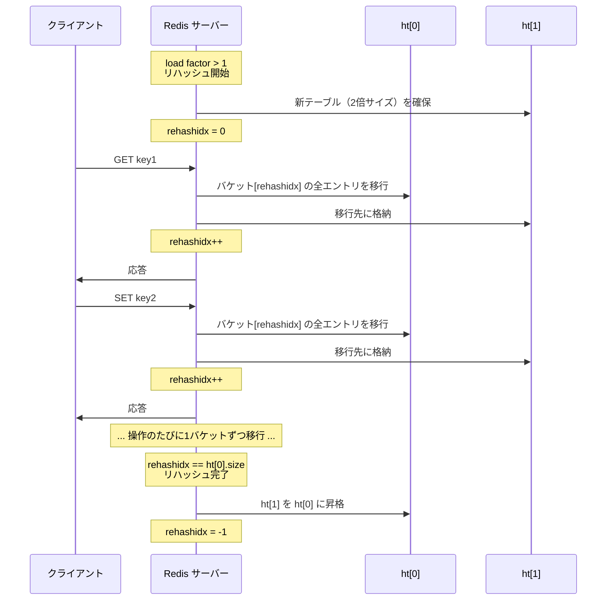
```mermaid
sequenceDiagram
    participant C as クライアント
    participant R as Redis サーバー
    participant HT0 as ht[0]
    participant HT1 as ht[1]

    Note over R: load factor > 1<br/>リハッシュ開始

    R->>HT1: 新テーブル（2倍サイズ）を確保
    Note over R: rehashidx = 0

    C->>R: GET key1
    R->>HT0: バケット[rehashidx] の全エントリを移行
    R->>HT1: 移行先に格納
    Note over R: rehashidx++
    R->>C: 応答

    C->>R: SET key2
    R->>HT0: バケット[rehashidx] の全エントリを移行
    R->>HT1: 移行先に格納
    Note over R: rehashidx++
    R->>C: 応答

    Note over R: ... 操作のたびに1バケットずつ移行 ...

    Note over R: rehashidx == ht[0].size<br/>リハッシュ完了
    R->>HT0: ht[1] を ht[0] に昇格
    Note over R: rehashidx = -1
```

**リハッシュ中の操作ルール**は次のとおりである。

- **検索**：まず `ht[0]` を検索し、見つからなければ `ht[1]` を検索する
- **挿入**：常に `ht[1]` に挿入する（`ht[0]` に新しいデータを追加しない）
- **削除 / 更新**：両方のテーブルを対象に操作する
- **移行ペース**：各操作（GET、SET、DEL など）で1バケットずつ移行する

さらに、Redis はサーバーのアイドル時間にも `dictRehashMilliseconds()` を呼び出し、1ミリ秒あたり100バケットずつバックグラウンドでリハッシュを進行させる。これにより、トラフィックが少ない時間帯にリハッシュが効率的に完了する。

#### 拡張・縮小の閾値

```
拡張条件：
  - BGSAVE / BGREWRITEAOF 実行中でない場合：load factor ≥ 1
  - BGSAVE / BGREWRITEAOF 実行中の場合：load factor ≥ 5
    （fork 時の CoW を考慮し、リハッシュを抑制）

縮小条件：
  - load factor < 0.1
```

BGSAVE 実行中にリハッシュの閾値を引き上げるのは、`fork()` 後の Copy-on-Write（CoW）によるメモリ増加を抑制するためである。リハッシュは大量のメモリ書き込みを発生させ、CoW ページの複製を促進してしまう。

### 3.4 skiplist（スキップリスト）

Redis のソート済み集合（Sorted Set / ZSET）は、大きなデータセットに対して **skiplist**（スキップリスト）と **dict** の組み合わせで実装されている。skiplist はスコアによる範囲検索を効率的に行うために、dict はメンバー名によるスコアの O(1) 検索を行うために、それぞれ使用される。

#### スキップリストの基本概念

スキップリストは、William Pugh が1990年の論文 "*Skip Lists: A Probabilistic Alternative to Balanced Trees*" で提案したデータ構造である。平衡二分探索木（AVL木や赤黒木）と同等の期待計算量を持ちながら、実装が格段にシンプルである。

基本的な発想は、連結リストに「高速レーン」を追加することである。最下層（レベル0）はすべての要素を含む通常の連結リストであり、上位のレベルではいくつかの要素をスキップすることで、検索を高速化する。

```
レベル3: HEAD ─────────────────────────────────── 90 → NIL
レベル2: HEAD ──────── 30 ─────────────────────── 90 → NIL
レベル1: HEAD ──────── 30 ──── 50 ──────── 70 ─── 90 → NIL
レベル0: HEAD → 10 → 30 → 40 → 50 → 60 → 70 → 80 → 90 → NIL
```

検索時は最上位レベルから開始し、目標値より大きなノードに遭遇したら1つ下のレベルに降りる。これにより、平均 O(log n) の計算量で検索、挿入、削除が可能となる。

#### Redis の skiplist 実装の特徴

Redis の skiplist は標準的なスキップリストに対して、いくつかの独自の拡張を施している。

```c
typedef struct zskiplistNode {
    sds ele;                         // member name (SDS string)
    double score;                    // sort score
    struct zskiplistNode *backward;  // pointer to previous node (level 0 only)
    struct zskiplistLevel {
        struct zskiplistNode *forward; // pointer to next node at this level
        unsigned long span;            // number of nodes skipped to reach forward
    } level[];                        // flexible array of levels
} zskiplistNode;

typedef struct zskiplist {
    struct zskiplistNode *header, *tail;
    unsigned long length;            // total number of nodes
    int level;                       // current maximum level
} zskiplist;
```

Redis の skiplist 実装における注目すべき設計判断を以下に示す。

**1. backward ポインタによる逆方向走査**

標準的なスキップリストには逆方向のポインタがない。Redis は最下層（レベル0）に `backward` ポインタを追加することで、`ZREVRANGE` などの逆順検索を効率的にサポートしている。

**2. span フィールドによるランク計算**

各レベルの forward ポインタに `span`（そのポインタがスキップするノード数）を付加している。これにより、`ZRANK` コマンド（あるメンバーの順位を取得する）を O(log n) で実行できる。検索パスの各レベルの span を加算するだけで順位が求まる。

**3. 同一スコアの辞書順ソート**

スコアが同じメンバーが複数存在する場合、Redis はメンバー名の辞書順でソートする。これは、ソート済み集合のリーダーボードのようなユースケースで、同点のメンバー間に一貫した順序を保証するために重要である。

**4. dict との併用**

skiplist だけでは、特定メンバーのスコアを取得する操作（`ZSCORE`）に O(log n) かかる。dict を併用することで、メンバー名からスコアへの検索を O(1) に高速化している。

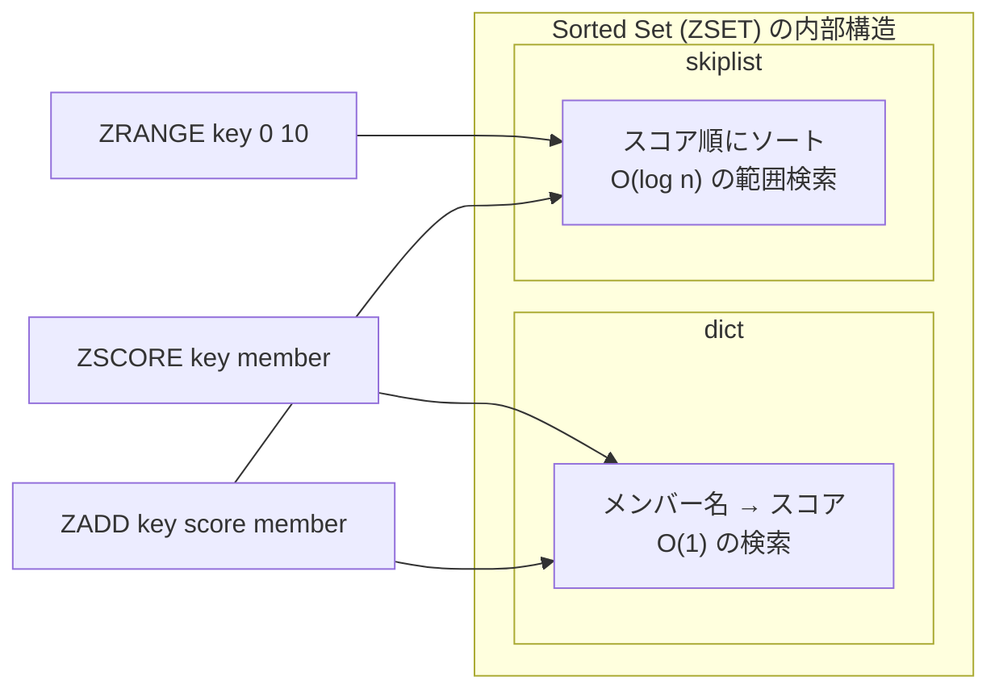
```mermaid
graph LR
    subgraph "Sorted Set (ZSET) の内部構造"
        direction TB
        subgraph "dict"
            D["メンバー名 → スコア<br/>O(1) の検索"]
        end
        subgraph "skiplist"
            S["スコア順にソート<br/>O(log n) の範囲検索"]
        end
    end

    ZSCORE["ZSCORE key member"] --> D
    ZRANGE["ZRANGE key 0 10"] --> S
    ZADD["ZADD key score member"] --> D
    ZADD --> S
```

#### レベル決定の確率的アルゴリズム

新しいノードのレベルは、以下の確率的アルゴリズムで決定される。

```c
// Determine the level for a new skiplist node
int zslRandomLevel(void) {
    int level = 1;
    // ZSKIPLIST_P = 0.25
    while ((random() & 0xFFFF) < (ZSKIPLIST_P * 0xFFFF))
        level += 1;
    // ZSKIPLIST_MAXLEVEL = 32
    return (level < ZSKIPLIST_MAXLEVEL) ? level : ZSKIPLIST_MAXLEVEL;
}
```

Redis は確率 $p = 0.25$ を採用している。一般的なスキップリストの教科書では $p = 0.5$ が多いが、$p = 0.25$ にすることで上位レベルのノード数が減り、メモリ使用量が削減される。期待されるレベル数は $\frac{1}{1-p} = \frac{4}{3} \approx 1.33$ であり、平均的なノードは約1.33レベルを持つ。最大レベルは32に設定されており、$4^{32} \approx 1.8 \times 10^{19}$ 個の要素まで効率的に処理できる。

::: details なぜ平衡木ではなくスキップリストなのか
antirez は Redis の設計において、平衡二分探索木（赤黒木やAVL木）ではなくスキップリストを選択した理由を次のように述べている。

1. **実装の単純さ**：スキップリストは赤黒木と比べて実装がはるかにシンプルであり、バグが入りにくい
2. **範囲操作の自然さ**：スキップリストは本質的に順序付きリストの多層構造であるため、範囲検索が自然に実装できる
3. **定数係数の小ささ**：実測値において、Redis のスキップリスト実装は赤黒木と同等かそれ以上の性能を示した
4. **並行性への拡張可能性**：ロックフリーなスキップリストの研究は豊富であり、将来のマルチスレッド化を見据えた選択でもあった

理論的な計算量は同じ O(log n) であり、スキップリストの方がメモリ使用量がやや多い場合があるが、上記のエンジニアリング上の利点が勝ると判断された。
:::

## 4. シングルスレッドモデルとイベントループ

### 4.1 なぜシングルスレッドなのか

Redis がシングルスレッドモデルを採用している理由は、しばしば誤解されている。「マルチスレッドの方が速いはずだ」という直感に反するこの設計判断の背景を理解するには、Redis のワークロードの特性を正しく把握する必要がある。

**Redis の操作は CPU バウンドではない。** 個々のコマンドの処理時間は極めて短く（マイクロ秒オーダー）、ボトルネックはネットワーク I/O とメモリアクセスにある。この状況でマルチスレッド化すると、以下のオーバーヘッドが発生する。

1. **ロック競合**：共有データ構造へのアクセスを保護するための mutex / spinlock のコスト
2. **コンテキストスイッチ**：OS スケジューラによるスレッド切り替えのコスト（キャッシュ無効化を含む）
3. **キャッシュコヒーレンシ**：マルチコア環境でのキャッシュラインの無効化とバウンシング
4. **実装の複雑化**：並行プログラミングにおけるデッドロック、レースコンディション、メモリオーダリングの問題

Redis のシングルスレッドモデルでは、これらのオーバーヘッドがすべてゼロである。各コマンドはアトミックに実行され、明示的なロックは一切不要である。これにより、1コマンドあたりの処理時間が最小化され、結果として高いスループットが実現される。

::: warning シングルスレッドの落とし穴
シングルスレッドモデルには重要な制約がある。`KEYS *` や `LRANGE key 0 -1`（巨大リスト）のような O(n) コマンドは、処理中に他のすべてのクライアントをブロックする。本番環境では `SCAN` コマンドによるイテレーションや、`LRANGE` の範囲指定を使って、長時間のブロッキングを回避すべきである。
:::

### 4.2 ae イベントループ

Redis は独自のイベントループライブラリ **ae**（A simple Event library）を使用している。ae は、プラットフォームに応じて最適な I/O 多重化機構を選択する。

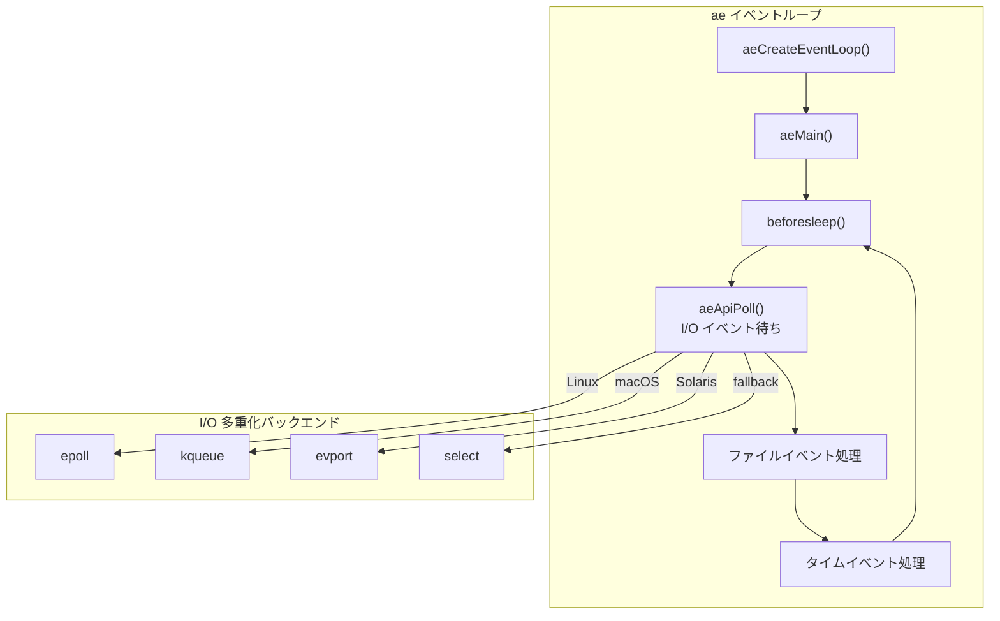
```mermaid
graph TD
    subgraph "ae イベントループ"
        INIT["aeCreateEventLoop()"]
        INIT --> MAIN["aeMain()"]
        MAIN --> BEFORE["beforesleep()"]
        BEFORE --> POLL["aeApiPoll()<br/>I/O イベント待ち"]
        POLL --> FE["ファイルイベント処理"]
        FE --> TE["タイムイベント処理"]
        TE --> BEFORE
    end

    subgraph "I/O 多重化バックエンド"
        POLL --> |Linux| EPOLL["epoll"]
        POLL --> |macOS| KQUEUE["kqueue"]
        POLL --> |Solaris| EVPORT["evport"]
        POLL --> |fallback| SELECT["select"]
    end
```

#### ファイルイベントとタイムイベント

ae は2種類のイベントを管理する。

**ファイルイベント（File Events）** はソケットの読み書き可能状態の通知である。クライアント接続、コマンド受信、レスポンス送信がこれに該当する。

**タイムイベント（Time Events）** は一定時間後に実行されるコールバックである。Redis の `serverCron()` 関数は100ミリ秒ごとに呼び出されるタイムイベントであり、以下の定期タスクを実行する。

- 期限切れキーのサンプリング削除
- クライアントのタイムアウト検出
- メモリ使用量の監視と Eviction
- RDB / AOF の書き込み状態チェック
- レプリケーション状態の監視
- クラスタハートビートの送信

### 4.3 コマンド処理パイプライン

1つのコマンドが処理される流れを詳しく見てみよう。

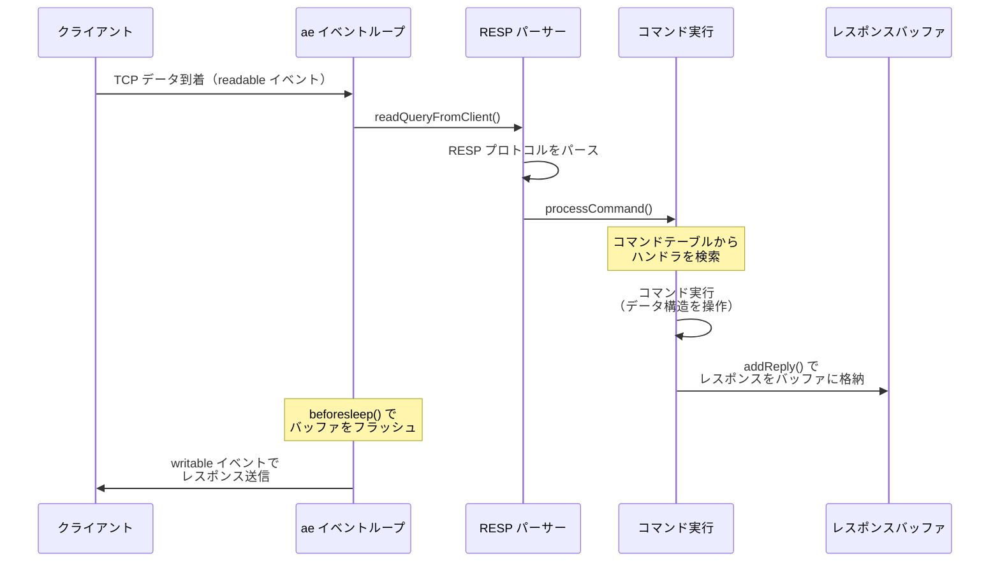
```mermaid
sequenceDiagram
    participant Client as クライアント
    participant AE as ae イベントループ
    participant Parser as RESP パーサー
    participant CMD as コマンド実行
    participant Reply as レスポンスバッファ

    Client->>AE: TCP データ到着（readable イベント）
    AE->>Parser: readQueryFromClient()
    Parser->>Parser: RESP プロトコルをパース
    Parser->>CMD: processCommand()

    Note over CMD: コマンドテーブルから<br/>ハンドラを検索

    CMD->>CMD: コマンド実行<br/>（データ構造を操作）
    CMD->>Reply: addReply() で<br/>レスポンスをバッファに格納

    Note over AE: beforesleep() で<br/>バッファをフラッシュ

    AE->>Client: writable イベントで<br/>レスポンス送信
```

### 4.4 Redis 6.0 以降の I/O スレッド

Redis 6.0 で導入された **I/O スレッド** は、シングルスレッドモデルを完全に維持しながら、ネットワーク I/O の処理を並列化する仕組みである。

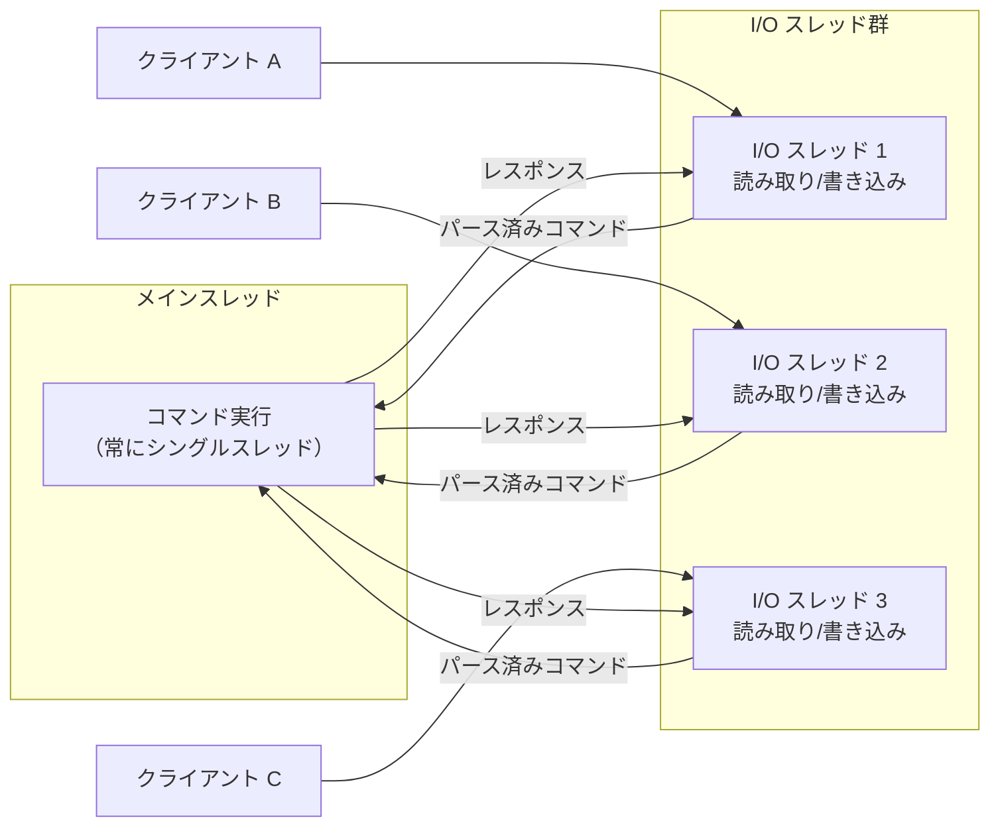
```mermaid
graph LR
    subgraph "メインスレッド"
        MAIN["コマンド実行<br/>（常にシングルスレッド）"]
    end

    subgraph "I/O スレッド群"
        IO1["I/O スレッド 1<br/>読み取り/書き込み"]
        IO2["I/O スレッド 2<br/>読み取り/書き込み"]
        IO3["I/O スレッド 3<br/>読み取り/書き込み"]
    end

    C1["クライアント A"] --> IO1
    C2["クライアント B"] --> IO2
    C3["クライアント C"] --> IO3

    IO1 -->|パース済みコマンド| MAIN
    IO2 -->|パース済みコマンド| MAIN
    IO3 -->|パース済みコマンド| MAIN

    MAIN -->|レスポンス| IO1
    MAIN -->|レスポンス| IO2
    MAIN -->|レスポンス| IO3
```

重要な点は、**コマンドの実行は依然としてメインスレッドでのみ行われる**ということである。I/O スレッドが担当するのは、以下の処理に限定される。

- クライアントからのデータの読み取りと RESP プロトコルのパース
- レスポンスデータのクライアントへの書き込み

この設計により、Redis はデータ構造のロックを一切追加することなく、ネットワーク I/O のスループットを向上させている。設定は `io-threads` と `io-threads-do-reads` で制御する。

## 5. 永続化メカニズム

Redis はインメモリデータストアであるが、データを永続化する複数の手段を提供している。各手段にはそれぞれ異なるトレードオフがあり、ユースケースに応じた選択が求められる。

### 5.1 RDB（Redis Database）スナップショット

RDB は、ある時点の Redis データセット全体をバイナリ形式でディスクに書き出す方式である。

#### RDB の生成プロセス

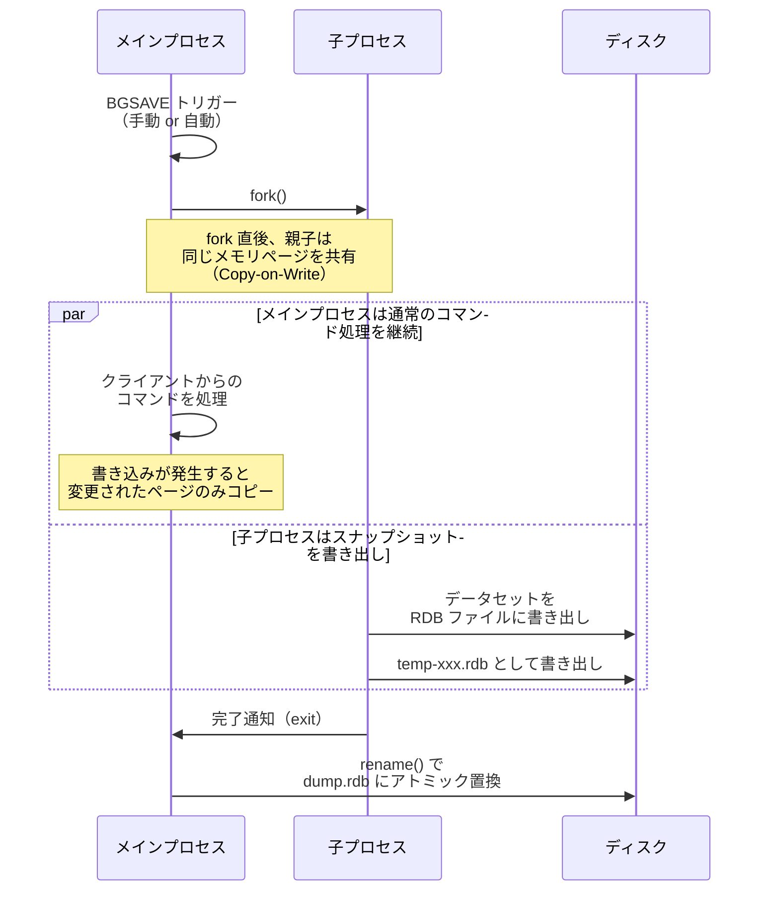
```mermaid
sequenceDiagram
    participant Main as メインプロセス
    participant Child as 子プロセス
    participant Disk as ディスク

    Main->>Main: BGSAVE トリガー<br/>（手動 or 自動）
    Main->>Child: fork()

    Note over Main,Child: fork 直後、親子は<br/>同じメモリページを共有<br/>（Copy-on-Write）

    par メインプロセスは通常のコマンド処理を継続
        Main->>Main: クライアントからの<br/>コマンドを処理
        Note over Main: 書き込みが発生すると<br/>変更されたページのみコピー
    and 子プロセスはスナップショットを書き出し
        Child->>Disk: データセットを<br/>RDB ファイルに書き出し
        Child->>Disk: temp-xxx.rdb として書き出し
    end

    Child->>Main: 完了通知（exit）
    Main->>Disk: rename() で<br/>dump.rdb にアトミック置換
```

RDB 生成の核心は `fork()` と **Copy-on-Write（CoW）** の活用である。`fork()` 直後は、親プロセスと子プロセスが同じ物理メモリページを共有している。子プロセスが読み取り専用でデータセットを走査する間、親プロセスが書き込みを行ったページのみが OS のカーネルによって複製される。これにより、巨大なデータセットでも追加メモリはごくわずかで済む（ただし、書き込みが多い場合は CoW による複製がメモリ使用量を押し上げる）。

#### RDB の利点と欠点

| 利点 | 欠点 |
|---|---|
| コンパクトなバイナリ形式で高速なリストア | fork 間のデータは永続化されない（データ損失のリスク） |
| バックアップ・災害復旧に適している | 大規模データセットでの fork は一時的な遅延を引き起こす |
| 子プロセスがすべてを処理、メインプロセスへの影響が小さい | fork 時の CoW によるメモリ使用量の増加 |
| RDB ファイルの転送によるレプリカの初期同期 | |

#### RDB の自動トリガー設定

```
# redis.conf
# save <seconds> <changes>
save 3600 1     # 1時間に1回以上の変更があればスナップショット
save 300 100    # 5分間に100回以上の変更があればスナップショット
save 60 10000   # 1分間に10000回以上の変更があればスナップショット
```

### 5.2 AOF（Append-Only File）

AOF は、Redis に対するすべての書き込みコマンドをテキスト形式（RESP プロトコル）でログファイルに追記する方式である。

#### AOF の書き込みフロー

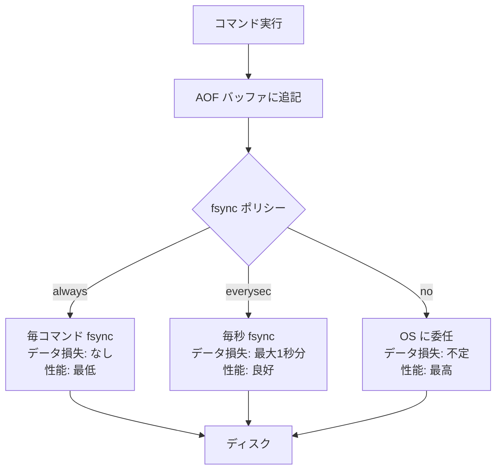
```mermaid
graph TD
    CMD["コマンド実行"] --> BUF["AOF バッファに追記"]
    BUF --> POLICY{"fsync ポリシー"}

    POLICY -->|always| ALWAYS["毎コマンド fsync<br/>データ損失: なし<br/>性能: 最低"]
    POLICY -->|everysec| EVERYSEC["毎秒 fsync<br/>データ損失: 最大1秒分<br/>性能: 良好"]
    POLICY -->|no| NO["OS に委任<br/>データ損失: 不定<br/>性能: 最高"]

    ALWAYS --> DISK["ディスク"]
    EVERYSEC --> DISK
    NO --> DISK
```

`appendfsync` の設定は、耐久性と性能のトレードオフを直接制御する。

- **`always`**：すべての書き込みコマンドの後に `fsync()` を呼び出す。データ損失は発生しないが、ディスク I/O が毎コマンドで発生するため性能は大幅に低下する
- **`everysec`**（デフォルト）：バックグラウンドスレッドが毎秒 `fsync()` を実行する。最大1秒分のデータ損失が発生しうるが、RDB に近い性能を維持できる
- **`no`**：`fsync()` を OS に完全に委任する。Linux のデフォルトでは約30秒ごとにフラッシュされるが、保証はない

#### AOF リライト

AOF ファイルはすべての書き込みコマンドを追記するため、時間とともに肥大化する。たとえば、あるキーに対して1000回の `INCR` を実行した場合、AOF には1000行の `INCR` コマンドが記録されるが、最終的な値は単一の `SET` コマンドで表現できる。

**AOF リライト** は、現在のデータセットの状態を最小限のコマンド列で再構成するプロセスである。RDB と同様に `fork()` を使って子プロセスで実行される。

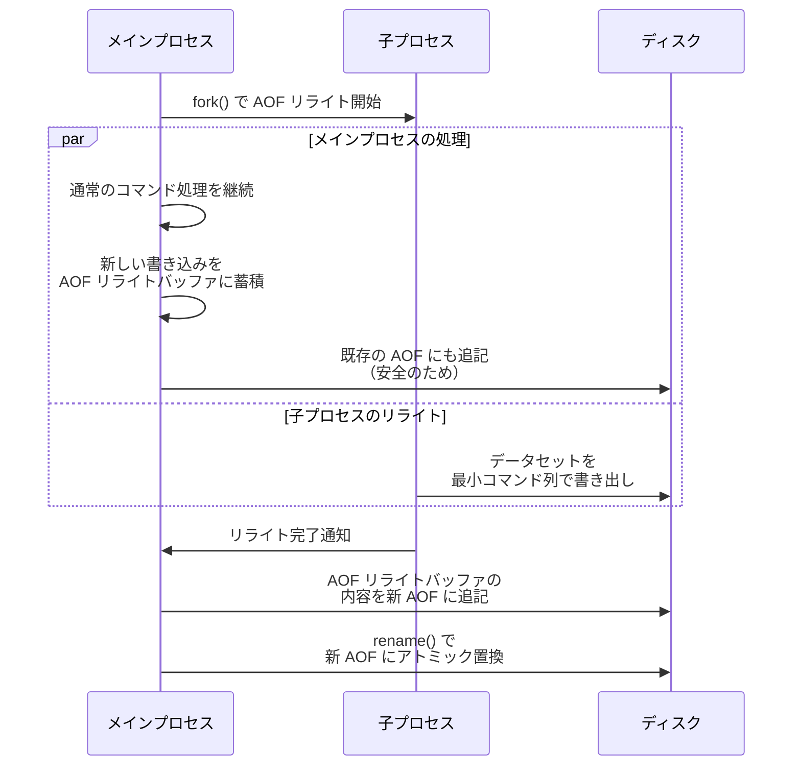
```mermaid
sequenceDiagram
    participant Main as メインプロセス
    participant Child as 子プロセス
    participant Disk as ディスク

    Main->>Child: fork() で AOF リライト開始

    par メインプロセスの処理
        Main->>Main: 通常のコマンド処理を継続
        Main->>Main: 新しい書き込みを<br/>AOF リライトバッファに蓄積
        Main->>Disk: 既存の AOF にも追記<br/>（安全のため）
    and 子プロセスのリライト
        Child->>Disk: データセットを<br/>最小コマンド列で書き出し
    end

    Child->>Main: リライト完了通知
    Main->>Disk: AOF リライトバッファの<br/>内容を新 AOF に追記
    Main->>Disk: rename() で<br/>新 AOF にアトミック置換
```

リライト中にメインプロセスに到着した書き込みコマンドは、**AOF リライトバッファ** に蓄積される。子プロセスが完了した後、メインプロセスがこのバッファの内容を新しい AOF ファイルに追記し、アトミックに切り替える。これにより、リライト中のデータ損失を防止する。

### 5.3 RDB + AOF ハイブリッド永続化

Redis 4.0 で導入された **ハイブリッド永続化**（`aof-use-rdb-preamble yes`、Redis 7.0 以降はデフォルトで有効）は、AOF リライト時に RDB 形式のプリアンブルと AOF 形式の差分を組み合わせる方式である。

```
ハイブリッド AOF ファイルの構造：
┌─────────────────────────────────────────┐
│ RDB プリアンブル                         │
│ （リライト時点のデータセット全体を        │
│  バイナリ形式で格納）                     │
├─────────────────────────────────────────┤
│ AOF 差分                                │
│ （リライト以降の書き込みコマンドを         │
│  RESP 形式で格納）                       │
└─────────────────────────────────────────┘
```

この方式により、以下の利点が得られる。

- **高速なリストア**：データの大部分を RDB 形式（バイナリ）で読み込むため、純粋な AOF と比べてリストアが大幅に高速化される
- **低いデータ損失リスク**：リストア後の差分は AOF 形式で適用されるため、AOF と同等の耐久性を維持する
- **ファイルサイズの抑制**：RDB のコンパクトさと AOF の差分記録を組み合わせる

::: tip 永続化戦略の選択指針
| ユースケース | 推奨設定 |
|---|---|
| 純粋なキャッシュ（データ損失許容） | 永続化なし（`save ""`, `appendonly no`） |
| データ損失を最小限にしたい | AOF（`appendfsync everysec`）+ ハイブリッド |
| 高速バックアップが必要 | RDB + AOF の併用 |
| 最大限の耐久性が必要 | AOF（`appendfsync always`）※性能とのトレードオフ |
:::

## 6. レプリケーション

Redis のレプリケーションは**非同期**であり、リーダー（master）の書き込み性能に影響を与えずにフォロワー（replica）にデータを複製する。

### 6.1 初期同期（Full Resynchronization）

レプリカが初めてリーダーに接続した場合、または差分同期が不可能な場合に実行される。

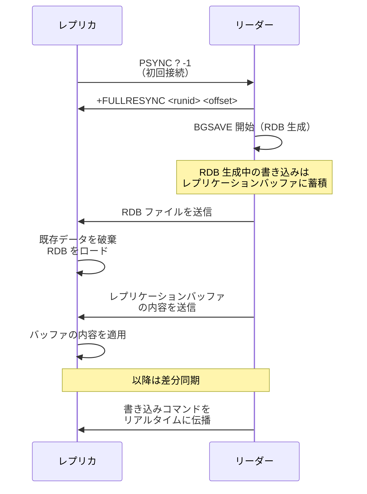
```mermaid
sequenceDiagram
    participant R as レプリカ
    participant M as リーダー

    R->>M: PSYNC ? -1<br/>（初回接続）
    M->>R: +FULLRESYNC <runid> <offset>

    M->>M: BGSAVE 開始（RDB 生成）
    Note over M: RDB 生成中の書き込みは<br/>レプリケーションバッファに蓄積

    M->>R: RDB ファイルを送信
    R->>R: 既存データを破棄<br/>RDB をロード

    M->>R: レプリケーションバッファ<br/>の内容を送信
    R->>R: バッファの内容を適用

    Note over M,R: 以降は差分同期
    M->>R: 書き込みコマンドを<br/>リアルタイムに伝播
```

### 6.2 部分同期（Partial Resynchronization）

Redis 2.8 で導入された部分同期は、一時的な接続断の後に、差分のみを転送して同期を再開する仕組みである。これを実現するために、以下の3つの要素が使用される。

1. **Replication ID**：リーダーのデータセットの論理的な識別子
2. **Replication Offset**：リーダーとレプリカがそれぞれ保持するバイトオフセット
3. **Replication Backlog**：リーダーが保持する固定サイズのリングバッファ

```
レプリケーションバックログ（リングバッファ）：
┌─────────────────────────────────────────────┐
│ ... │ CMD_N │ CMD_N+1 │ CMD_N+2 │ ... │     │
└─────────────────────────────────────────────┘
       ↑                            ↑
       レプリカの offset             リーダーの offset

差分 = リーダーの offset - レプリカの offset
差分がバックログ内にある → 部分同期可能
差分がバックログを超えている → フル同期が必要
```

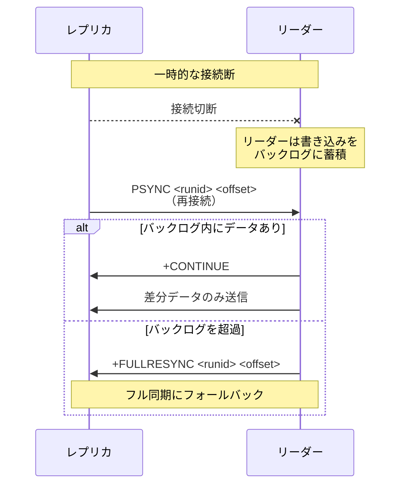
```mermaid
sequenceDiagram
    participant R as レプリカ
    participant M as リーダー

    Note over R,M: 一時的な接続断
    R--xM: 接続切断

    Note over M: リーダーは書き込みを<br/>バックログに蓄積

    R->>M: PSYNC <runid> <offset><br/>（再接続）

    alt バックログ内にデータあり
        M->>R: +CONTINUE
        M->>R: 差分データのみ送信
    else バックログを超過
        M->>R: +FULLRESYNC <runid> <offset>
        Note over M,R: フル同期にフォールバック
    end
```

### 6.3 レプリケーションの一貫性モデル

Redis のレプリケーションは**非同期**であるため、リーダーへの書き込みがレプリカに到達する前にリーダーが障害を起こすと、データが失われる可能性がある。Redis は `WAIT` コマンドによる**同期的レプリケーション**もサポートしているが、これは強い一貫性を保証するものではない。`WAIT` は指定数のレプリカがデータを受信したことを確認するが、それらのレプリカが応答する前にフェイルオーバーが発生した場合のデータ保証は提供しない。

## 7. Redis Cluster

### 7.1 設計目標

Redis Cluster は、Redis を水平にスケーリングするための分散アーキテクチャである。その設計目標は以下のとおりである。

1. **最大1000ノードまでの線形スケーリング**
2. **許容可能な書き込み安全性**：ネットワーク分断がない限り、書き込みの大部分を保持する
3. **可用性**：過半数のマスターが到達可能であり、到達不能な各マスターにレプリカが存在する限り、クラスタは機能する
4. **プロキシレスアーキテクチャ**：クライアントがノードに直接接続する

### 7.2 ハッシュスロット

Redis Cluster は **16384個のハッシュスロット** を用いてキー空間を分割する。各キーは以下のハッシュ関数でスロットに割り当てられる。

```
HASH_SLOT = CRC16(key) mod 16384
```

16384 という数が選ばれた理由は、クラスタの Gossip プロトコルと密接に関連している。各ノードは、自身がどのスロットを担当しているかを表すビットマップを他のノードに送信する。16384 ビット = 2KB であり、Gossip メッセージのサイズとして妥当である。65536 スロットにすると8KB のビットマップが必要となり、帯域幅の消費が過大になる。また、Redis Cluster の設計上限は1000ノードであり、16384 スロットあれば各ノードに平均16スロットを割り当てられるため、十分な粒度を持つ。

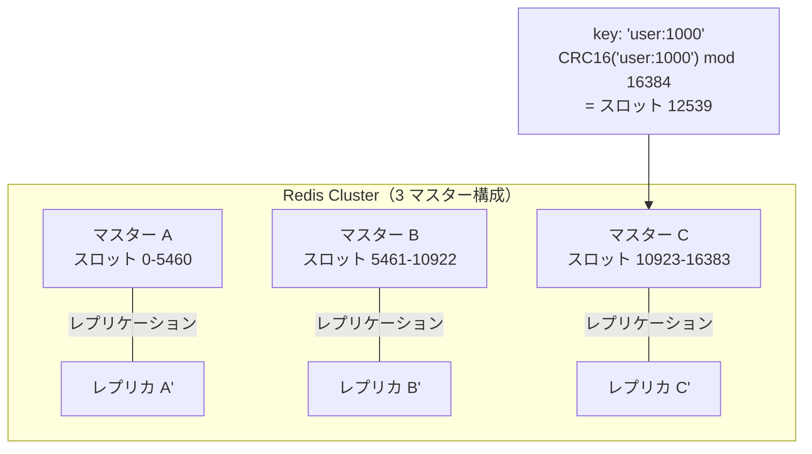
```mermaid
graph TD
    subgraph "Redis Cluster（3 マスター構成）"
        M1["マスター A<br/>スロット 0-5460"]
        M2["マスター B<br/>スロット 5461-10922"]
        M3["マスター C<br/>スロット 10923-16383"]

        R1["レプリカ A'"]
        R2["レプリカ B'"]
        R3["レプリカ C'"]

        M1 ---|レプリケーション| R1
        M2 ---|レプリケーション| R2
        M3 ---|レプリケーション| R3
    end

    KEY["key: 'user:1000'<br/>CRC16('user:1000') mod 16384<br/>= スロット 12539"]
    KEY --> M3
```

#### ハッシュタグによるキーの共存

Redis Cluster では、異なるスロットに属するキーに対するマルチキー操作（`MGET`、トランザクションなど）は実行できない。この制約を回避するために **ハッシュタグ** が提供されている。

キーに `{...}` が含まれる場合、中括弧内の部分文字列のみがハッシュ計算に使用される。

```
user:{1000}:profile  → CRC16("1000") mod 16384
user:{1000}:session  → CRC16("1000") mod 16384
user:{1000}:cart     → CRC16("1000") mod 16384

→ すべて同じスロットに格納される → マルチキー操作が可能
```

### 7.3 MOVED リダイレクションと ASK リダイレクション

クライアントがキーの担当ノードではないノードにコマンドを送信した場合、`MOVED` リダイレクションが返される。

```
Client → Node A: GET user:1000
Node A → Client: -MOVED 12539 192.168.1.3:6379

Client は 192.168.1.3:6379 に再接続してコマンドを再送
Client はスロット 12539 → 192.168.1.3:6379 のマッピングをキャッシュ
```

**ASK リダイレクション** は、スロットの**マイグレーション中**にのみ発生する一時的なリダイレクションである。

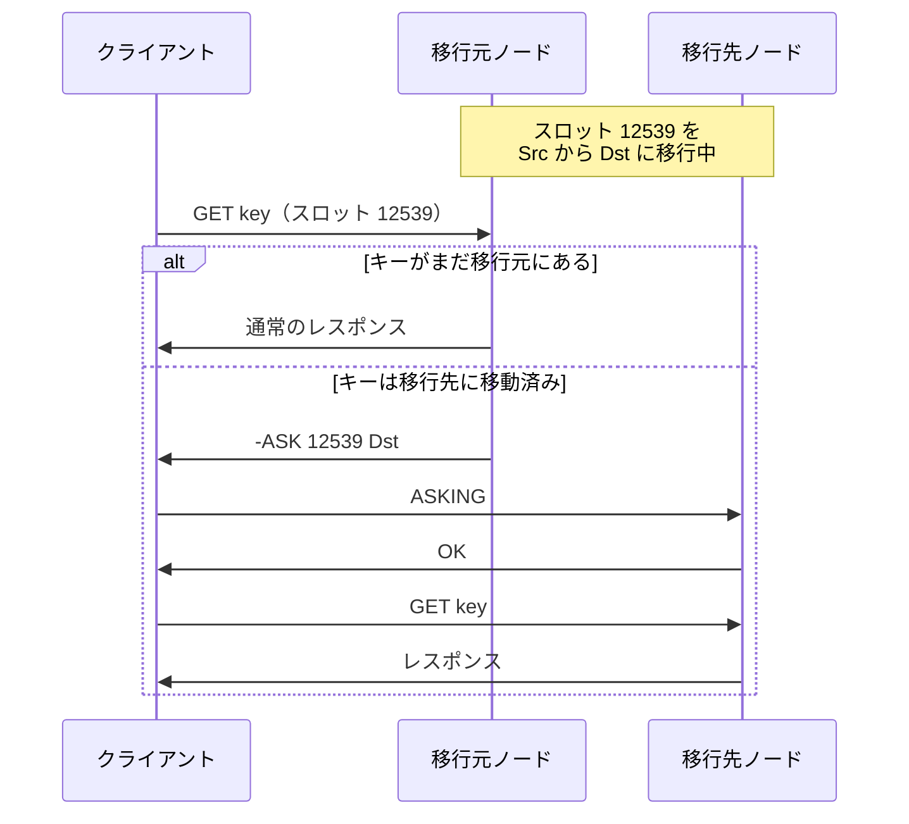
```mermaid
sequenceDiagram
    participant C as クライアント
    participant Src as 移行元ノード
    participant Dst as 移行先ノード

    Note over Src,Dst: スロット 12539 を<br/>Src から Dst に移行中

    C->>Src: GET key（スロット 12539）

    alt キーがまだ移行元にある
        Src->>C: 通常のレスポンス
    else キーは移行先に移動済み
        Src->>C: -ASK 12539 Dst
        C->>Dst: ASKING
        Dst->>C: OK
        C->>Dst: GET key
        Dst->>C: レスポンス
    end
```

`MOVED` と `ASK` の重要な違いは次のとおりである。

- **`MOVED`**：スロットの担当が永続的に移動した。クライアントはスロットマッピングを更新すべき
- **`ASK`**：一時的なリダイレクション。スロットマッピングは更新すべきでない（移行が完了するまで）

### 7.4 Gossip プロトコルとフェイルオーバー

Redis Cluster のノード間通信には **Gossip プロトコル** が使用されている。各ノードは、専用の **Cluster Bus**（通常はデータポート + 10000、例: 16379）を通じて、他のノードと定期的に情報を交換する。

#### Gossip メッセージの種類

| メッセージ | 目的 |
|---|---|
| PING | ヘルスチェックとメタデータ交換 |
| PONG | PING への応答 |
| MEET | 新しいノードをクラスタに参加させる |
| FAIL | 特定のノードが障害状態であることをブロードキャスト |
| PUBLISH | Pub/Sub メッセージのクラスタ全体への伝播 |

#### PING/PONG の内容

各 PING/PONG メッセージには以下の情報が含まれる。

1. **送信ノード自身の情報**：ノード ID、担当スロット、エポック番号
2. **送信ノードが知っている他のノードの情報**（ランダムに数ノード分）：ノード ID、IP、ポート、状態フラグ

この仕組みにより、各ノードは他のすべてのノードの状態を**最終的に**（eventually）把握する。完全なクラスタ状態の収束は、概ね O(log n) ラウンドの Gossip 交換で達成される。

#### フェイルオーバーのプロセス

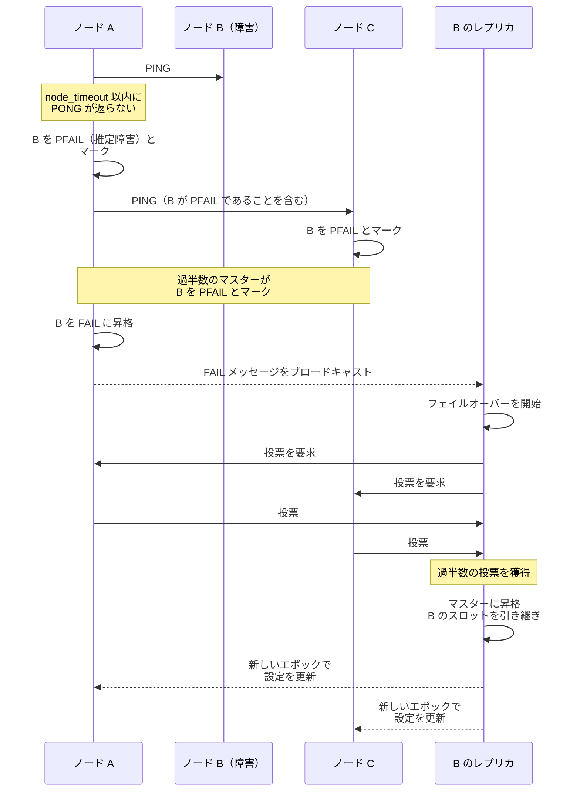
```mermaid
sequenceDiagram
    participant A as ノード A
    participant B as ノード B（障害）
    participant C as ノード C
    participant R as B のレプリカ

    A->>B: PING
    Note over A: node_timeout 以内に<br/>PONG が返らない
    A->>A: B を PFAIL（推定障害）と<br/>マーク

    A->>C: PING（B が PFAIL であることを含む）
    C->>C: B を PFAIL とマーク

    Note over A,C: 過半数のマスターが<br/>B を PFAIL とマーク

    A->>A: B を FAIL に昇格
    A-->>R: FAIL メッセージをブロードキャスト

    R->>R: フェイルオーバーを開始
    R->>A: 投票を要求
    R->>C: 投票を要求

    A->>R: 投票
    C->>R: 投票

    Note over R: 過半数の投票を獲得

    R->>R: マスターに昇格<br/>B のスロットを引き継ぎ
    R-->>A: 新しいエポックで<br/>設定を更新
    R-->>C: 新しいエポックで<br/>設定を更新
```

**PFAIL（Probable Failure）** と **FAIL** の二段階は、ネットワーク分断による誤検知を防止するために設計されている。単一ノードの判断（PFAIL）では障害とせず、過半数のマスターが合意した場合にのみ FAIL に昇格する。この仕組みは、分散システムにおける**障害検出器（failure detector）**の典型的なパターンである。

### 7.5 エポックとコンフリクト解決

Redis Cluster は **Raft** のようなコンセンサスプロトコルを使用していない代わりに、**エポック番号（configuration epoch）** を用いてスロット割り当てのコンフリクトを解決する。

- 各マスターは自身のエポック番号を持つ
- フェイルオーバー時に新しいマスターに昇格するレプリカは、より大きなエポック番号を取得する
- スロットの所有権が衝突した場合、**より大きなエポック番号を持つノードが勝つ**（last-writer-wins）
- クラスタ全体のエポック（`currentEpoch`）は単調増加し、すべてのノードが観測した最大値に収束する

この設計は Raft ほど強い一貫性を提供しないが、Redis Cluster の可用性要件（AP 寄りの設計）に適している。

## 8. メモリ管理と Eviction

### 8.1 メモリアロケータ

Redis は、デフォルトで **jemalloc** をメモリアロケータとして使用する。jemalloc は Facebook が開発したアロケータで、マルチスレッド環境での断片化の低減に優れているが、Redis がこれを選択した理由はむしろ以下の特性にある。

- **サイズクラスベースの割り当て**：内部断片化を予測可能に抑制する
- **メモリ使用量の正確な報告**：`malloc_usable_size()` により、実際のメモリ消費量を正確に追跡できる
- **スレッドキャッシュ**：小さな割り当ての高速化（I/O スレッドとの併用で有効）

Redis の `INFO memory` コマンドは、jemalloc から取得した詳細なメモリ統計を報告する。

```
used_memory:        1073741824  # Redis が割り当てたメモリ（バイト）
used_memory_rss:    1207959552  # OS から見た物理メモリ使用量
mem_fragmentation_ratio: 1.12   # RSS / used_memory（断片化率）
```

`mem_fragmentation_ratio` が 1.0 を大幅に超える場合（例: 1.5 以上）、メモリの断片化が深刻であり、`MEMORY PURGE` や `activedefrag` の有効化を検討すべきである。

### 8.2 キーの期限切れ（Expiration）

Redis は2つの戦略を組み合わせてキーの期限切れを処理する。

#### 受動的期限切れ（Lazy Expiration）

キーにアクセスされた時点で有効期限を検査し、期限切れであればその場で削除する。これだけでは、アクセスされないキーが永久にメモリを占有し続ける。

#### 能動的期限切れ（Active Expiration）

`serverCron()` タイムイベントで定期的に以下のサンプリングアルゴリズムを実行する。

```
Active Expiration アルゴリズム：
1. 有効期限が設定されたキーの中からランダムに20個サンプリング
2. サンプル中の期限切れキーを削除
3. 削除されたキーが25%（5個）以上なら、ステップ1に戻る
4. 25%未満なら処理を終了（次回のserverCronまで待機）
```

このアルゴリズムは確率的であり、すべての期限切れキーを即座に削除するわけではないが、期限切れキーがメモリの大部分を占有し続けないことを統計的に保証する。25% の閾値は、「期限切れキーが全体の25%以下であれば許容する」という設計判断に基づいている。

### 8.3 Eviction ポリシー

`maxmemory` が設定されている場合、メモリ使用量が上限に達すると Redis は Eviction ポリシーに従ってキーを削除する。

| ポリシー | 対象 | アルゴリズム |
|---|---|---|
| `noeviction` | - | 新しい書き込みをエラーで拒否 |
| `allkeys-lru` | 全キー | LRU（Least Recently Used） |
| `allkeys-lfu` | 全キー | LFU（Least Frequently Used） |
| `allkeys-random` | 全キー | ランダム |
| `volatile-lru` | TTL付きキー | LRU |
| `volatile-lfu` | TTL付きキー | LFU |
| `volatile-random` | TTL付きキー | ランダム |
| `volatile-ttl` | TTL付きキー | TTL が短いものを優先 |

#### 近似 LRU と近似 LFU

Redis の LRU / LFU は**近似アルゴリズム**である。厳密な LRU を実装するには、全キーを最終アクセス時刻でソートしたリストを維持する必要があり、これはメモリと CPU の両面で高コストである。

Redis は代わりに、以下の **サンプリングベース** のアプローチを採用する。

```
近似 LRU アルゴリズム：
1. ランダムに maxmemory-samples 個（デフォルト5個）のキーをサンプリング
2. サンプル中で LRU 時刻が最も古いキーを削除
3. メモリ使用量が maxmemory 以下になるまで繰り返す
```

`maxmemory-samples` を増やすと LRU の精度は向上するが、CPU 使用量も増加する。デフォルトの5で、ほとんどのワークロードにおいて十分な精度が得られることが実験的に確認されている。

**LFU（Redis 4.0 以降）** は、LRU の `lru` フィールド（24ビット）を以下のように分割して実装されている。

```
LFU カウンタの構造（24ビット lru フィールドの再利用）：
┌────────────────────┬──────────────┐
│ ldt (16ビット)      │ cnt (8ビット) │
│ 最終減衰時刻        │ 対数カウンタ  │
│ (分単位, mod 65536) │ (0-255)      │
└────────────────────┴──────────────┘
```

LFU カウンタは **対数的** に増加する。カウンタ値が $c$ のとき、アクセスによりカウンタが増加する確率は $\frac{1}{(c - \text{LFU\_INIT\_VAL}) \times \text{lfu\_log\_factor} + 1}$ である。デフォルトの `lfu-log-factor = 10` では、カウンタが255に到達するまでに約100万回のアクセスが必要となる。

また、LFU には**減衰メカニズム**がある。時間の経過とともにカウンタを減少させることで、過去に頻繁にアクセスされたが現在はアクセスされていないキーが Eviction の対象になりやすくなる。`lfu-decay-time` パラメータ（デフォルト1分）は、カウンタを1減少させる時間間隔を制御する。

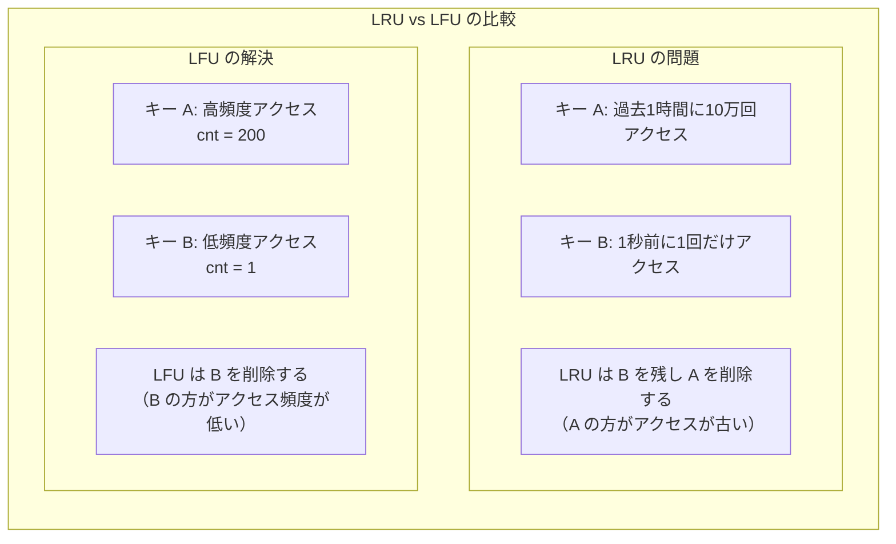
```mermaid
graph LR
    subgraph "LRU vs LFU の比較"
        direction TB

        subgraph "LRU の問題"
            LRU1["キー A: 過去1時間に10万回アクセス"]
            LRU2["キー B: 1秒前に1回だけアクセス"]
            LRU3["LRU は B を残し A を削除する<br/>（A の方がアクセスが古い）"]
        end

        subgraph "LFU の解決"
            LFU1["キー A: 高頻度アクセス<br/>cnt = 200"]
            LFU2["キー B: 低頻度アクセス<br/>cnt = 1"]
            LFU3["LFU は B を削除する<br/>（B の方がアクセス頻度が低い）"]
        end
    end
```

## 9. 運用上の考慮事項

### 9.1 fork のコストとメモリ管理

RDB スナップショットと AOF リライトは `fork()` に依存するため、大規模なデータセットでは以下の問題が生じうる。

1. **fork の遅延**：Linux の `fork()` は O(ページテーブルサイズ) であり、巨大なメモリ空間ではミリ秒〜秒オーダーの遅延が発生する
2. **CoW によるメモリ増加**：書き込みが多い場合、fork 後に最大で元のデータセットと同量の追加メモリが必要になる
3. **Transparent Huge Pages（THP）の問題**：THP が有効な場合、CoW の粒度が 2MB ページになるため、メモリ増加が深刻化する

::: danger Transparent Huge Pages の無効化
Redis の運用環境では THP を無効化すべきである。THP は fork 後の CoW でメモリ使用量を大幅に増加させ、遅延のスパイクを引き起こす。

```bash
echo never > /sys/kernel/mm/transparent_hugepage/enabled
```

Redis の起動時にも、THP が有効な場合は警告メッセージが表示される。
:::

### 9.2 キーの設計指針

Redis Cluster を使用する場合、キーの設計はパフォーマンスとスケーラビリティに直接影響する。

- **ハッシュタグの適切な使用**：関連するキーを同一スロットに配置するが、ホットスロットを生まないよう注意する
- **大きなキー（Big Key）の回避**：1つのキーに数百万要素を格納するとブロッキング操作の原因になる。`UNLINK`（非同期削除）や `SCAN` 系コマンドで対処する
- **有効期限の分散**：大量のキーが同時に期限切れになると、能動的期限切れ処理が一時的に CPU を占有する。ランダムなジッター（例: TTL + random(0, 300)）を追加することで分散できる

### 9.3 Pub/Sub とストリームの選択

Redis は Pub/Sub 機能を提供するが、Pub/Sub はメッセージをバッファリングしない「fire-and-forget」モデルである。受信側が接続していないメッセージは永久に失われる。

メッセージの永続性と再読み取りが必要な場合は、Redis 5.0 で導入された **Streams**（`XADD` / `XREAD` / `XREADGROUP`）を使用すべきである。Streams は Apache Kafka に着想を得た設計であり、コンシューマーグループ、メッセージ ID による再読み取り、ACK による処理保証を提供する。

## 10. まとめ

Redis の内部設計は、「シンプルであること」を最優先とする哲学のもとに、複数の巧妙な工学的判断が積み重ねられた結果である。

| 設計要素 | 設計判断 | 得られる利点 |
|---|---|---|
| データ構造 | 論理型とエンコーディングの分離 | メモリ効率と API の安定性の両立 |
| SDS | 事前割り当てとバイナリセーフ | O(1) の長さ取得と amortized O(1) の追記 |
| dict | 漸進的リハッシュ | リハッシュ中のブロッキング回避 |
| skiplist | 確率的データ構造 | 実装の単純さと範囲検索の効率 |
| シングルスレッド | ロックフリーのイベント駆動 | 予測可能な遅延と高スループット |
| RDB | fork + CoW | メインプロセスへの影響を最小化 |
| AOF | fsync ポリシーの選択肢 | 耐久性と性能のトレードオフ制御 |
| Cluster | ハッシュスロット + Gossip | プロキシレスで線形にスケール |
| Eviction | サンプリングベースの近似 LRU / LFU | 正確なLRU のコストを回避 |

Redis を効果的に運用するためには、これらの内部設計を理解した上で、ワークロードの特性に応じた設定を行うことが不可欠である。Redis は「速いから使う」だけのツールではなく、その設計から分散システム、データ構造、OS の原理に至るまで、コンピューターサイエンスの多くの領域を横断する教材でもある。

::: tip さらなる学習リソース
- Redis のソースコードは C で書かれており、約10万行程度と比較的小規模で読みやすい。特に `t_zset.c`（skiplist 実装）、`dict.c`（ハッシュテーブル実装）、`ae.c`（イベントループ）は設計の核心を学ぶのに最適である
- antirez のブログ（[antirez.com](http://antirez.com)）には、設計判断の背景が詳しく記されている
- Redis の公式ドキュメント（[redis.io](https://redis.io)）は、各コマンドの計算量と挙動が網羅的に文書化されている
:::
