# 参照カウント

## 1. 参照カウントの基本原理

### 1.1 最も直感的なメモリ管理

ガベージコレクション（GC）にはさまざまなアルゴリズムが存在するが、その中で**参照カウント（Reference Counting）** は最も直感的で理解しやすい方式である。基本的な考え方は極めてシンプルだ。

> **各オブジェクトに「何箇所から参照されているか」を示すカウンタを持たせ、カウンタが 0 になった瞬間にそのオブジェクトを解放する。**

この方式は1960年、George E. Collins が論文 *"A Method for Overlapping and Erasure of Lists"* で提案したものであり、GC アルゴリズムとしては Mark-and-Sweep（1958年、McCarthy）に次いで古い歴史を持つ。

### 1.2 動作の基本

参照カウントの動作は、次の3つの操作に集約される。

1. **参照の作成（assign）**：あるポインタがオブジェクトを指すようになったとき、そのオブジェクトのカウンタを +1 する。
2. **参照の削除（release）**：ポインタが別のオブジェクトを指すようになったとき、またはスコープを外れたとき、元のオブジェクトのカウンタを -1 する。
3. **カウンタが 0 になったとき**：そのオブジェクトを解放する。解放時に、オブジェクトが保持していた参照先のカウンタも再帰的に -1 する。

この一連の流れを擬似コードで表すと以下のようになる。

```python
def assign(pointer, new_object):
    old_object = pointer.target
    if old_object is not None:
        old_object.ref_count -= 1
        if old_object.ref_count == 0:
            release_children(old_object)  # decrement children recursively
            free(old_object)
    pointer.target = new_object
    if new_object is not None:
        new_object.ref_count += 1

def release_children(obj):
    for child in obj.references:
        child.ref_count -= 1
        if child.ref_count == 0:
            release_children(child)
            free(child)
```

### 1.3 オブジェクトのライフサイクル

参照カウントにおけるオブジェクトのライフサイクルを図示する。

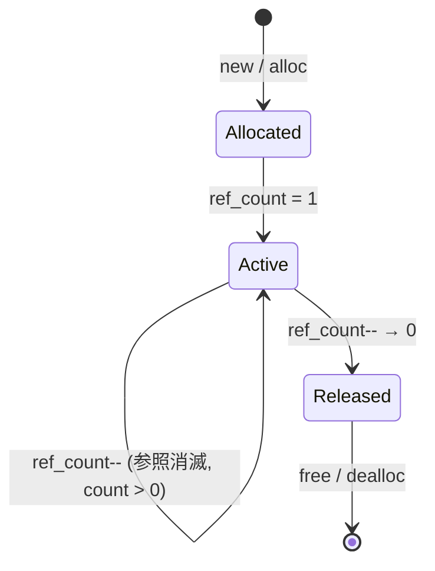

具体的な例を見てみよう。

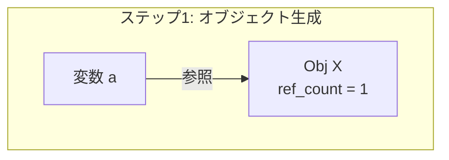

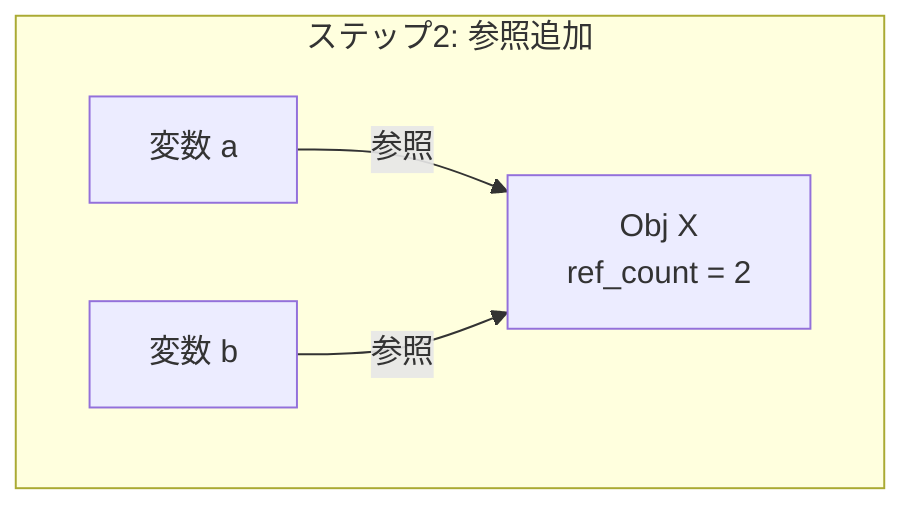

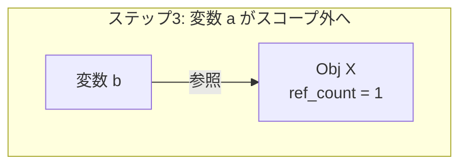

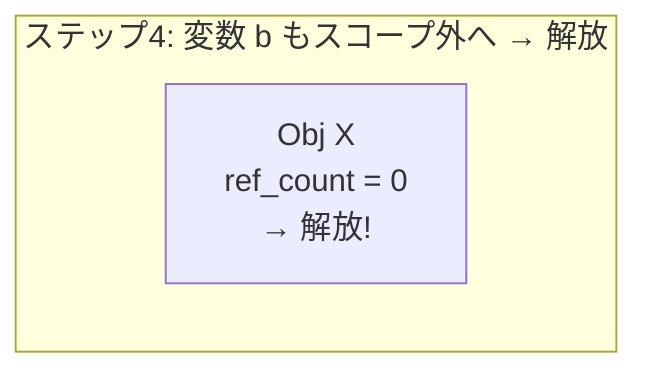

### 1.4 参照カウントの利点

参照カウント方式には、トレーシング GC にはない固有の利点がある。

**即座の回収（Immediate Reclamation）**：オブジェクトが不要になった瞬間に解放される。メモリ使用量のピークが抑えられ、メモリ制約の厳しい環境で有利である。

**予測可能なパフォーマンス**：GC の「停止時間（stop-the-world pause）」が存在しない。メモリ管理のコストはオブジェクトの操作に分散されるため、リアルタイム性の高いアプリケーションに適している。

**デストラクタの即時実行**：オブジェクトが解放されるタイミングが確定的であるため、ファイルハンドルやネットワーク接続などのリソース解放を、デストラクタで確実に行える。Python の `with` 文が参照カウントと組み合わさって効果的に機能するのもこのためである。

**局所性（Locality）**：参照カウントの操作は、オブジェクトにアクセスしたタイミングで局所的に行われる。トレーシング GC のようにヒープ全体を走査する必要がないため、キャッシュの効率が良い場合がある。

### 1.5 参照カウントの欠点

一方で、参照カウントには無視できない欠点も存在する。

**オーバーヘッド**：ポインタの代入のたびにカウンタの増減が必要であり、特にマルチスレッド環境ではアトミック操作（atomic increment/decrement）が求められるため、性能コストが大きい。

**循環参照（Circular Reference）**：最大の弱点であり、次章で詳しく扱う。互いに参照し合うオブジェクトのグループは、外部からの参照がなくなっても ref_count が 0 にならず、メモリリークを引き起こす。

**連鎖的な解放（Cascade Deallocation）**：あるオブジェクトの解放が、その子オブジェクト群の連鎖的な解放を引き起こし、一時的に長い停止時間が発生することがある。これは「参照カウントには stop-the-world がない」という利点を部分的に損なう。

## 2. 循環参照問題

### 2.1 問題の本質

参照カウントの最大の弱点は**循環参照（circular reference / reference cycle）** である。2つ以上のオブジェクトが互いに参照し合うと、外部からの参照がすべて消えても、カウンタが 0 にならない。

```python
class Node:
    def __init__(self):
        self.next = None

a = Node()  # a.ref_count = 1
b = Node()  # b.ref_count = 1
a.next = b  # b.ref_count = 2
b.next = a  # a.ref_count = 2

# Remove external references
a = None  # a's Node.ref_count = 1 (still referenced by b.next)
b = None  # b's Node.ref_count = 1 (still referenced by a.next)
# Both ref_counts are 1 — neither can be freed!
```

この状態を図示すると以下のようになる。

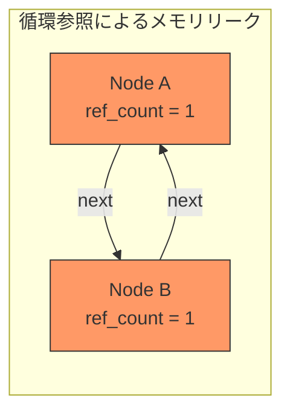

外部変数 `a` と `b` はすでに `None` に設定されており、プログラムからこの2つのノードに到達する手段はない。しかし相互参照によって ref_count が 1 のまま残り続けるため、参照カウント方式だけではこれらを回収できない。

### 2.2 循環参照が現実に発生するパターン

循環参照は人工的な例だけでなく、実際のプログラミングで頻繁に発生する。

**親子関係**：ツリー構造において、子ノードが親への参照を持つ場合。DOM ツリー、AST（抽象構文木）、GUI のウィジェットツリーなどが典型例である。

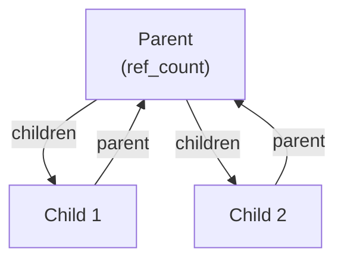

**オブザーバパターン**：Subject がオブザーバのリストを持ち、各オブザーバが Subject への参照を保持する場合。

**双方向リンク**：双方向連結リスト、グラフのノード間の辺など。

**クロージャのキャプチャ**：クロージャ（ラムダ式）が `self` をキャプチャし、そのクロージャ自体がオブジェクトのプロパティに格納される場合。Swift や JavaScript でよく見られるパターンである。

### 2.3 循環参照への対処法

循環参照に対する主なアプローチは以下のとおりである。

| 手法 | 概要 | 採用例 |
|------|------|--------|
| 弱参照（weak reference） | カウンタに加算しない特別な参照を導入 | Swift, Python, Rust, C++ |
| バックアップGC | 参照カウントに加えてトレーシングGCを併用 | Python, PHP |
| プログラマの手動管理 | 明示的に循環を断ち切る | Objective-C（ARC 以前）, COM |
| 試行的削除 | 循環参照候補を検出し試験的にカウンタを減算 | Python の世代別GC |

これらのアプローチを、以降の各言語・システムの解説で詳しく見ていく。

## 3. Python の参照カウント＋世代別GCハイブリッド

### 3.1 CPython の参照カウント

Python の標準実装である CPython は、メモリ管理の主軸として参照カウントを採用している。CPython では、すべての Python オブジェクトが `ob_refcnt` フィールドを持つ `PyObject` 構造体として表現される。

```c
typedef struct _object {
    Py_ssize_t ob_refcnt;  // reference count
    PyTypeObject *ob_type;  // type pointer
} PyObject;
```

CPython の参照カウント操作は、`Py_INCREF` / `Py_DECREF` マクロで行われる。

```c
// Simplified version of Py_DECREF
#define Py_DECREF(op) do { \
    if (--((PyObject *)(op))->ob_refcnt == 0) { \
        _Py_Dealloc((PyObject *)(op)); \
    } \
} while (0)
```

Python で `sys.getrefcount()` を使うと、オブジェクトの参照カウントを直接確認できる。

```python
import sys

a = []
print(sys.getrefcount(a))  # 2 (a itself + argument to getrefcount)

b = a
print(sys.getrefcount(a))  # 3 (a + b + argument)

del b
print(sys.getrefcount(a))  # 2 (a + argument)
```

### 3.2 GIL と参照カウント

CPython が**GIL（Global Interpreter Lock）** を持つ理由の一つが、参照カウントの保護である。もし GIL がなければ、`ob_refcnt` のインクリメント/デクリメントをアトミック操作で行う必要があり、これは非常にコストが高い。GIL によって一度に1スレッドしか Python バイトコードを実行できないため、参照カウント操作を安価な非アトミック操作で実現できる。

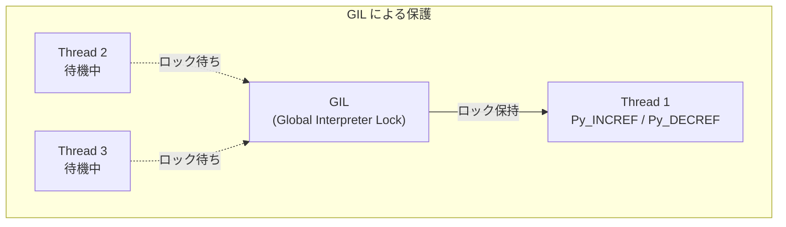

> [!NOTE]
> CPython 3.13 では **free-threaded mode**（`--disable-gil`）が実験的に導入された。このモードでは参照カウントにアトミック操作と biased reference counting の最適化が使われる。これについては後述の最適化テクニックで触れる。

### 3.3 世代別サイクルGC

CPython は循環参照を回収するために、参照カウントに加えて**世代別サイクル検出 GC（generational cycle-detecting garbage collector）** を備えている。この GC は `gc` モジュールを通じて制御できる。

CPython のサイクル GC は、以下のアルゴリズムで動作する（概要）。

1. **コンテナオブジェクトの追跡**：他のオブジェクトへの参照を持ちうるオブジェクト（リスト、辞書、クラスインスタンスなど）のみを追跡対象とする。整数や文字列などのアトミックなオブジェクトは循環参照を形成しないため、追跡不要である。
2. **試行的削除（tentative deletion）**：追跡対象のオブジェクト群について、各オブジェクトの内部参照による ref_count の寄与分を差し引く。
3. **到達可能性の判定**：差し引き後も ref_count が 0 でないオブジェクトは外部から参照されている。そこから到達可能なオブジェクトもすべて生存と判定する。
4. **回収**：到達不可能と判定されたオブジェクトを解放する。

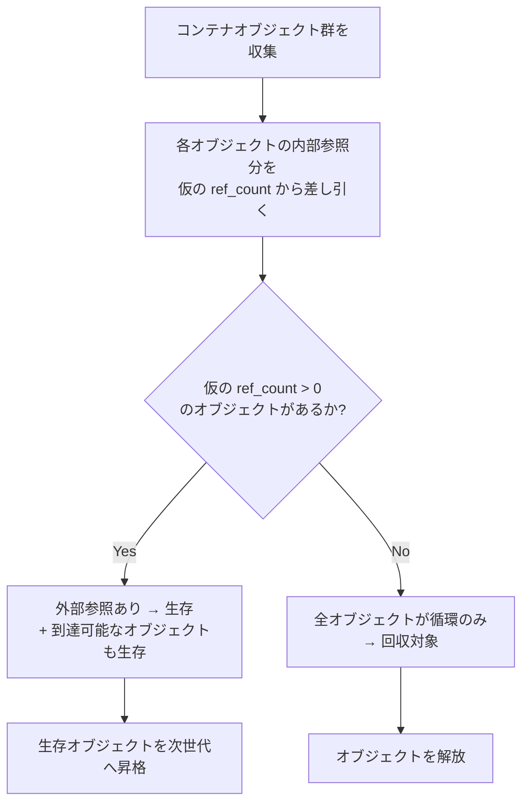

### 3.4 世代の管理

CPython のサイクル GC は3つの世代（generation 0, 1, 2）を持つ。

| 世代 | 対象 | GC 頻度 | デフォルト閾値 |
|------|------|---------|---------------|
| 0 | 新しく生成されたオブジェクト | 高（頻繁） | 700 |
| 1 | 世代0のGCを生き残ったオブジェクト | 中 | 10 |
| 2 | 世代1のGCを生き残ったオブジェクト | 低（まれ） | 10 |

閾値の意味は以下のとおりである。
- 世代0の閾値 700：新規に作成されたコンテナオブジェクトの数が700を超えると、世代0のGCが起動する。
- 世代1の閾値 10：世代0のGCが10回実行されると、世代1のGCが起動する。
- 世代2の閾値 10：世代1のGCが10回実行されると、世代2のGCが起動する。

```python
import gc

# Get current thresholds
print(gc.get_threshold())  # (700, 10, 10)

# Get generation counts
print(gc.get_count())  # (number_of_new_objects, gen1_count, gen2_count)

# Manual collection
collected = gc.collect()
print(f"Collected {collected} objects")
```

### 3.5 弱参照（weakref）

Python は `weakref` モジュールで弱参照をサポートしている。弱参照はオブジェクトの参照カウントを増やさないため、循環参照の回避に利用できる。

```python
import weakref

class Cache:
    def __init__(self, name):
        self.name = name

obj = Cache("test")
weak = weakref.ref(obj)  # does not increment ref_count

print(weak())       # <Cache object>
print(weak().name)  # "test"

del obj
print(weak())       # None (object has been collected)
```

`weakref.WeakValueDictionary` や `weakref.WeakSet` は、キャッシュの実装でよく使われるパターンである。

## 4. Swift の ARC（Automatic Reference Counting）

### 4.1 ARC の概要

Swift は**ARC（Automatic Reference Counting）** をメモリ管理の中核としている。ARC は、コンパイラが参照カウントの増減（retain / release）を**コンパイル時にコードへ自動挿入**する方式であり、実行時にトレーシング GC を必要としない。

ARC はもともと Apple が Objective-C 向けに導入した技術（2011年、Xcode 4.2）であり、Swift は言語設計の初期段階から ARC を前提としている。

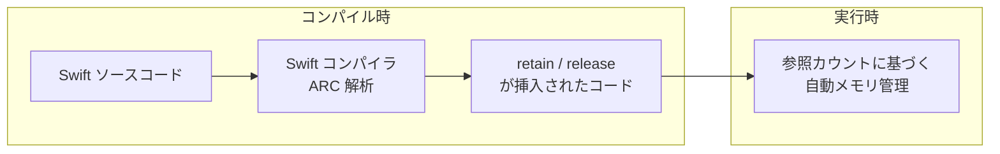

### 4.2 retain / release の自動挿入

Swift のコンパイラは、変数のスコープと所有権を解析し、適切な位置に `swift_retain`（カウンタ +1）と `swift_release`（カウンタ -1）の呼び出しを挿入する。

```swift
class Person {
    let name: String
    init(name: String) {
        self.name = name
        print("\(name) is being initialized")
    }
    deinit {
        print("\(name) is being deinitialized")
    }
}

func example() {
    let alice = Person(name: "Alice")
    // swift_retain(alice) — implicit, ref_count = 1

    let also_alice = alice
    // swift_retain(alice) — ref_count = 2

    print(also_alice.name)
    // swift_release(also_alice) — ref_count = 1 (end of also_alice scope)
    // swift_release(alice) — ref_count = 0 → deinit called
}
```

ARC の重要な特徴は、**ランタイムによる GC 停止が一切ない**ことである。すべてのメモリ管理コストはオブジェクトの操作に分散される。iOS のような低レイテンシが要求される環境で Swift が選ばれる理由の一つがここにある。

### 4.3 クラスと構造体の使い分け

Swift では、**クラス（class）** は参照型であり ARC の管理下に置かれるが、**構造体（struct）** は値型であり ARC の対象外である。構造体はスタック上に配置されるか、コピーオンライトで管理されるため、参照カウントのオーバーヘッドが生じない。

```swift
// Reference type — managed by ARC
class RefPoint {
    var x: Double
    var y: Double
    init(x: Double, y: Double) { self.x = x; self.y = y }
}

// Value type — no ARC overhead
struct ValPoint {
    var x: Double
    var y: Double
}
```

Swift の標準ライブラリは `Array`、`Dictionary`、`String` などの主要な型をすべて構造体として実装しており、ARC のオーバーヘッドを最小化している。

## 5. weak / unowned 参照

### 5.1 strong 参照と循環参照

Swift のデフォルトの参照は **strong 参照**であり、参照カウントをインクリメントする。strong 参照だけを使うと、循環参照が容易に発生する。

```swift
class Person {
    let name: String
    var apartment: Apartment?
    init(name: String) { self.name = name }
    deinit { print("\(name) is being deinitialized") }
}

class Apartment {
    let unit: String
    var tenant: Person?  // strong reference — causes cycle!
    init(unit: String) { self.unit = unit }
    deinit { print("Apartment \(unit) is being deinitialized") }
}

var john: Person? = Person(name: "John")
var unit4A: Apartment? = Apartment(unit: "4A")

john?.apartment = unit4A
unit4A?.tenant = john

john = nil    // Person not deallocated — ref_count is still 1
unit4A = nil  // Apartment not deallocated — ref_count is still 1
// Memory leak!
```

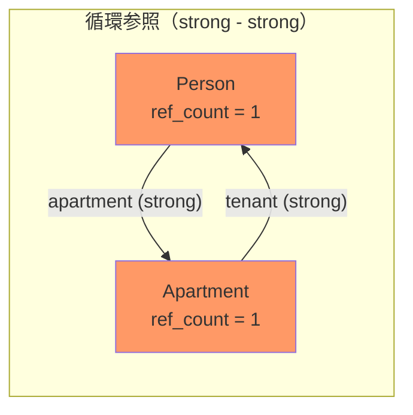

### 5.2 weak 参照

**weak 参照**は参照カウントをインクリメントしない参照である。参照先のオブジェクトが解放されると、weak 参照は自動的に `nil` に設定される。そのため、weak 参照は常にオプショナル型（`Optional`）として宣言する必要がある。

```swift
class Apartment {
    let unit: String
    weak var tenant: Person?  // weak reference — breaks the cycle
    init(unit: String) { self.unit = unit }
    deinit { print("Apartment \(unit) is being deinitialized") }
}
```

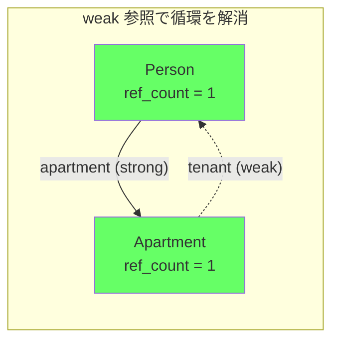

weak 参照を使うと、`john = nil` とした時点で Person の ref_count が 0 になり、deinit が呼ばれる。Person の deinit により Apartment への strong 参照も消え、Apartment も解放される。

### 5.3 unowned 参照

**unowned 参照**も参照カウントをインクリメントしないが、weak と異なり参照先が解放された後もポインタが `nil` にならない。参照先が解放された後に unowned 参照にアクセスするとクラッシュする（トラップが発生する）。

unowned は「参照先が自分より先に解放されることはない」と確信できる場合に使う。weak のような Optional のアンラップが不要になるため、コードが簡潔になる。

```swift
class Customer {
    let name: String
    var card: CreditCard?
    init(name: String) { self.name = name }
    deinit { print("\(name) is being deinitialized") }
}

class CreditCard {
    let number: UInt64
    unowned let customer: Customer  // card cannot exist without customer
    init(number: UInt64, customer: Customer) {
        self.number = number
        self.customer = customer
    }
    deinit { print("Card #\(number) is being deinitialized") }
}
```

### 5.4 weak / unowned の使い分け

| 特性 | weak | unowned |
|------|------|---------|
| 参照カウント | 加算しない | 加算しない |
| 型 | Optional（`?`） | Non-optional |
| 参照先解放後 | 自動的に `nil` | クラッシュ（トラップ） |
| パフォーマンス | サイドテーブル管理のコストあり | weak より高速 |
| 使い分け | 参照先が先に解放される可能性がある場合 | 参照先の寿命が自分以上と確信できる場合 |

### 5.5 クロージャと循環参照

Swift ではクロージャがオブジェクトのプロパティとして保持され、かつそのクロージャが `self` をキャプチャする場合に循環参照が発生する。これを防ぐために**キャプチャリスト（capture list）** を使う。

```swift
class HTMLElement {
    let name: String
    let text: String?

    lazy var asHTML: () -> String = { [weak self] in
        guard let self = self else { return "" }
        if let text = self.text {
            return "<\(self.name)>\(text)</\(self.name)>"
        } else {
            return "<\(self.name) />"
        }
    }

    init(name: String, text: String? = nil) {
        self.name = name
        self.text = text
    }

    deinit {
        print("\(name) is being deinitialized")
    }
}
```

`[weak self]` を指定することで、クロージャは `self` を弱参照でキャプチャし、循環参照を回避する。`[unowned self]` を使うパターンもあるが、`self` が先に解放されるとクラッシュするリスクがある。

## 6. Rust の Rc / Arc

### 6.1 所有権と参照カウントの関係

Rust は**所有権システム（ownership system）** によってコンパイル時にメモリ安全性を保証する言語である。通常、各値にはただ1つの所有者があり、所有者がスコープを抜けると値は自動的にドロップ（解放）される。

しかし、グラフ構造やキャッシュなど、**複数の所有者が必要な場面**が存在する。そのために Rust は、ランタイムの参照カウントを提供する `Rc<T>`（Reference Counted）と `Arc<T>`（Atomically Reference Counted）を標準ライブラリに含めている。

### 6.2 Rc\<T\> — シングルスレッド用参照カウント

`Rc<T>` はシングルスレッド環境での共有所有権を実現する。`Rc::clone()` で参照カウントをインクリメントし、`Rc` がドロップされると自動的にデクリメントされる。

```rust
use std::rc::Rc;

fn main() {
    let a = Rc::new(String::from("hello"));
    println!("ref count: {}", Rc::strong_count(&a)); // 1

    let b = Rc::clone(&a);
    println!("ref count: {}", Rc::strong_count(&a)); // 2

    {
        let c = Rc::clone(&a);
        println!("ref count: {}", Rc::strong_count(&a)); // 3
    } // c is dropped here

    println!("ref count: {}", Rc::strong_count(&a)); // 2
}
```

`Rc<T>` はアトミック操作を使わないため、マルチスレッド環境では使用できない。`Rc<T>` を別スレッドに送ろうとすると、コンパイルエラーになる。

### 6.3 Arc\<T\> — マルチスレッド用参照カウント

`Arc<T>`（Atomic Reference Counted）は、アトミックな参照カウント操作を用いてスレッド間での共有所有権を実現する。

```rust
use std::sync::Arc;
use std::thread;

fn main() {
    let data = Arc::new(vec![1, 2, 3, 4, 5]);

    let mut handles = vec![];

    for i in 0..3 {
        let data_clone = Arc::clone(&data);
        let handle = thread::spawn(move || {
            println!("Thread {}: {:?}", i, data_clone);
        });
        handles.push(handle);
    }

    for handle in handles {
        handle.join().unwrap();
    }
}
```

`Arc<T>` と `Rc<T>` の違いはアトミック操作の有無だけであり、API は同一である。

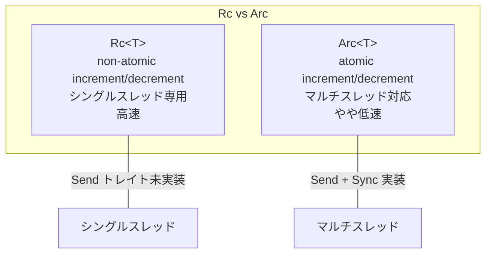

### 6.4 Weak\<T\> による循環参照の防止

Rust も `Rc::downgrade()` で弱参照（`Weak<T>`）を作成できる。これにより循環参照を防ぐ。

```rust
use std::rc::{Rc, Weak};
use std::cell::RefCell;

#[derive(Debug)]
struct Node {
    value: i32,
    parent: RefCell<Weak<Node>>,      // weak reference to parent
    children: RefCell<Vec<Rc<Node>>>,  // strong references to children
}

fn main() {
    let leaf = Rc::new(Node {
        value: 3,
        parent: RefCell::new(Weak::new()),
        children: RefCell::new(vec![]),
    });

    let branch = Rc::new(Node {
        value: 5,
        parent: RefCell::new(Weak::new()),
        children: RefCell::new(vec![Rc::clone(&leaf)]),
    });

    // Set parent as weak reference
    *leaf.parent.borrow_mut() = Rc::downgrade(&branch);

    println!("leaf parent = {:?}", leaf.parent.borrow().upgrade());
    println!("branch strong count = {}", Rc::strong_count(&branch)); // 1
    println!("branch weak count = {}", Rc::weak_count(&branch));     // 1
}
```

`Weak<T>` の `upgrade()` メソッドは `Option<Rc<T>>` を返す。参照先がすでにドロップされていれば `None` が返る。Swift の `weak` 参照が `nil` になるのと同じセマンティクスである。

### 6.5 Rc と内部可変性パターン

`Rc<T>` は共有参照（`&T`）しか提供しないため、内部の値を変更するには **内部可変性（interior mutability）** パターンが必要である。`RefCell<T>` と組み合わせることで、実行時に借用規則をチェックしながら可変参照を取得できる。

```rust
use std::rc::Rc;
use std::cell::RefCell;

let shared = Rc::new(RefCell::new(vec![1, 2, 3]));

let clone1 = Rc::clone(&shared);
let clone2 = Rc::clone(&shared);

clone1.borrow_mut().push(4);
clone2.borrow_mut().push(5);

println!("{:?}", shared.borrow()); // [1, 2, 3, 4, 5]
```

マルチスレッド環境では `Arc<Mutex<T>>` の組み合わせが一般的である。

## 7. COM の参照カウント

### 7.1 COM の概要

**COM（Component Object Model）** は、Microsoft が1993年に導入したバイナリインターフェース標準である。異なるプログラミング言語で書かれたコンポーネント同士が通信できるようにするための仕組みであり、Windows のシステム全体で広く使われている。DirectX、Shell Extensions、OLE、ActiveX などはすべて COM ベースである。

COM のメモリ管理は参照カウントに基づいている。すべての COM オブジェクトは `IUnknown` インターフェースを実装し、その3つのメソッドのうち2つが参照カウントに関するものである。

```cpp
interface IUnknown {
    virtual HRESULT QueryInterface(REFIID riid, void **ppv) = 0;
    virtual ULONG   AddRef()  = 0;  // increment ref count
    virtual ULONG   Release() = 0;  // decrement ref count
};
```

### 7.2 COM の参照カウント規則

COM は言語非依存の仕様であるため、参照カウントの管理責任はプログラマ（またはラッパーライブラリ）にある。規則は以下のとおりである。

1. **関数がインターフェースポインタを返す場合**、呼び出し側の `AddRef` が済んだ状態で返す。
2. **ポインタを別の変数にコピーする場合**、`AddRef` を呼ぶ。
3. **ポインタが不要になった場合**、`Release` を呼ぶ。
4. **`QueryInterface` はインターフェースポインタを返す**ため、内部で `AddRef` を呼ぶ。

```cpp
void UseComponent() {
    IMyComponent *pComponent = nullptr;
    HRESULT hr = CoCreateInstance(
        CLSID_MyComponent, nullptr, CLSCTX_INPROC_SERVER,
        IID_IMyComponent, (void**)&pComponent
    );
    // ref_count = 1 after CoCreateInstance

    if (SUCCEEDED(hr)) {
        pComponent->DoSomething();

        IMyComponent *pCopy = pComponent;
        pCopy->AddRef();  // ref_count = 2

        // ... use pCopy ...

        pCopy->Release();     // ref_count = 1
        pComponent->Release(); // ref_count = 0 → destroyed
    }
}
```

### 7.3 スマートポインタによる安全化

手動の `AddRef` / `Release` はミスが起きやすいため、C++ では COM 専用のスマートポインタが広く使われる。

```cpp
#include <wrl/client.h>
using Microsoft::WRL::ComPtr;

void SafeUsage() {
    ComPtr<IMyComponent> component;
    HRESULT hr = CoCreateInstance(
        CLSID_MyComponent, nullptr, CLSCTX_INPROC_SERVER,
        IID_PPV_ARGS(&component)
    );

    if (SUCCEEDED(hr)) {
        component->DoSomething();
    }
    // Release is called automatically when ComPtr goes out of scope
}
```

`ComPtr`（Windows Runtime C++ Template Library）や ATL の `CComPtr` は、RAII パターンにより `AddRef` / `Release` の呼び出しを自動化する。これは Swift の ARC が行うことと本質的に同じである。

### 7.4 COM と循環参照

COM では循環参照の検出機構が組み込まれていない。プログラマが意識的にサイクルを断ち切る責任を負う。一般的な対処法は以下のとおりである。

- **弱参照パターン**：子が親を弱参照で保持する（`AddRef` を呼ばない）。
- **split identity**：外部向けと内部向けで異なる `IUnknown` を持つ。
- **明示的な `Close` / `Shutdown` メソッド**：循環を構成する参照を明示的に切断する。

## 8. トレーシングGCとの比較

### 8.1 2つのパラダイム

自動メモリ管理には大きく分けて2つのアプローチがある。

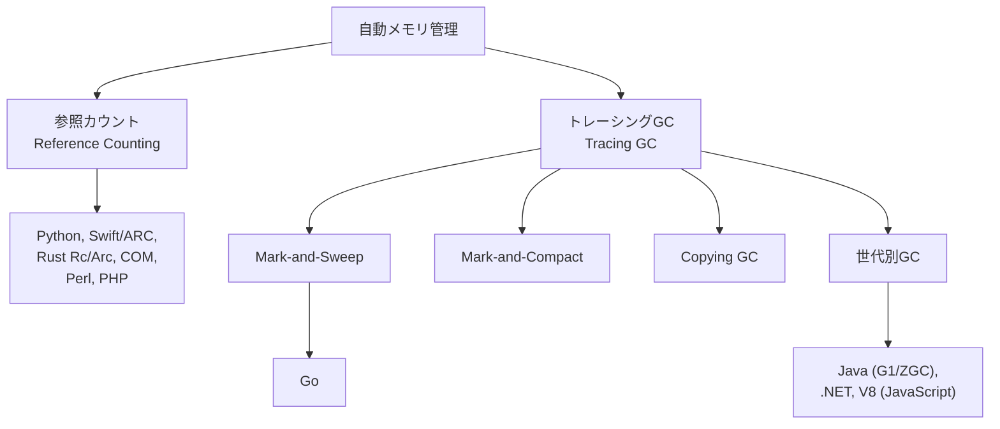

### 8.2 詳細比較

| 観点 | 参照カウント | トレーシングGC |
|------|------------|---------------|
| **回収タイミング** | 即座（参照がなくなった時点） | GC サイクル実行時 |
| **スループット** | ポインタ操作ごとにコスト | まとめて処理するため高スループット |
| **レイテンシ** | 予測可能（連鎖的解放を除く） | stop-the-world pause あり（改善は進んでいる） |
| **メモリ使用量** | ピークが低い | フロート（浮遊）ゴミが溜まる |
| **循環参照** | 単独では回収不可 | 自然に回収可能 |
| **カウンタのオーバーヘッド** | 各ポインタ操作に付随 | なし |
| **マルチスレッド** | アトミック操作が必要（高コスト） | GC スレッドとの同期が必要 |
| **実装の複雑さ** | 基本は単純（最適化は複雑） | 全般的に複雑 |

### 8.3 パフォーマンス特性の可視化

参照カウントとトレーシング GC のメモリ回収パターンの違いを時間軸で示す。

```
参照カウント:
メモリ使用量
│    ╱╲    ╱╲╱╲    ╱╲
│   ╱  ╲  ╱    ╲  ╱  ╲
│  ╱    ╲╱      ╲╱    ╲╱
│ ╱
│╱
└──────────────────────── 時間
  (メモリ使用が細かく増減)

トレーシングGC:
メモリ使用量
│         ╱│   ╱│     ╱│
│        ╱ │  ╱ │    ╱ │
│       ╱  │ ╱  │   ╱  │
│      ╱   │╱   │  ╱   │
│     ╱    │    │ ╱    │╱
│    ╱     │    │╱     │
│   ╱      │    │      │
│  ╱       │    │      │
│ ╱        │    │      │
│╱         │    │      │
└──────────────────────── 時間
           GC   GC     GC
  (使用量が増加し、GC時に急減)
```

参照カウントではメモリ使用量が細かく変動し、ピークが抑えられる。一方、トレーシング GC ではメモリ使用量が徐々に増加し、GC 実行時に一気に減少する鋸歯状のパターンを示す。

### 8.4 ハイブリッドアプローチ

現実の処理系では、参照カウントとトレーシング GC を組み合わせるハイブリッドアプローチが多い。

- **Python**：参照カウント（主）＋ 世代別サイクル検出 GC（補）
- **PHP**：参照カウント（主）＋ サイクルコレクタ（補）
- **Objective-C / Swift**：ARC（主）＋ 弱参照による循環回避（プログラマ責任）
- **.NET（実験的）**：トレーシング GC（主）だが、`System.Runtime.InteropServices` での COM 連携では参照カウント

### 8.5 各言語のメモリ管理戦略マップ

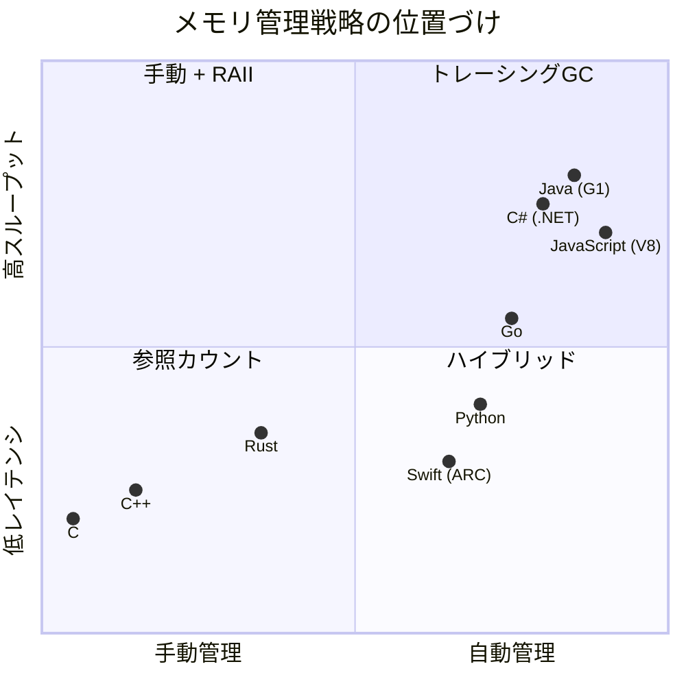

## 9. 参照カウントの最適化テクニック

参照カウントの基本方式にはオーバーヘッドが伴うため、さまざまな最適化が研究・実装されてきた。この章では主要な最適化テクニックを解説する。

### 9.1 遅延参照カウント（Deferred Reference Counting）

**遅延参照カウント**は、1976年に Deutsch と Bobrow が提案した手法である。ローカル変数からの参照に対しては参照カウントの増減を行わず、ヒープ上のポインタからの参照のみをカウントする。

ローカル変数はスタック上にあり、関数の終了とともに自動的に消滅する。これらの一時的な参照のたびにカウンタを操作するのは無駄が多い。遅延参照カウントでは、カウンタが 0 になったオブジェクトを即座に解放する代わりに「要解放候補」リストに入れ、定期的にスタックを走査して本当に到達不可能かを確認する。

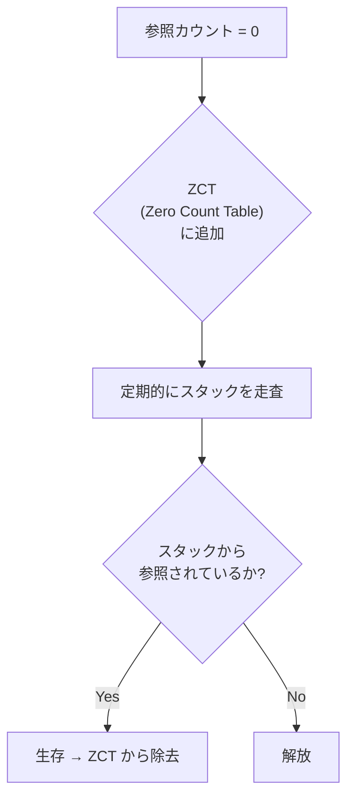

この手法は参照カウント操作の回数を大幅に削減できるが、即時回収の利点が部分的に失われるというトレードオフがある。

### 9.2 合体参照カウント（Coalesced Reference Counting）

**合体参照カウント**は、同じポインタに対する連続した参照カウント操作をまとめる手法である。例えば、あるポインタが短い間に A → B → C と値を変更した場合、通常は6回のカウンタ操作（A の decrement、B の increment、B の decrement、C の increment ...）が必要だが、合体参照カウントでは A の decrement と C の increment だけで済む。

### 9.3 バイアス参照カウント（Biased Reference Counting）

**バイアス参照カウント**は、マルチスレッド環境での参照カウントのアトミック操作コストを削減する手法である。オブジェクトを作成したスレッド（所有者スレッド）と、それ以外のスレッドで参照カウントを分離する。

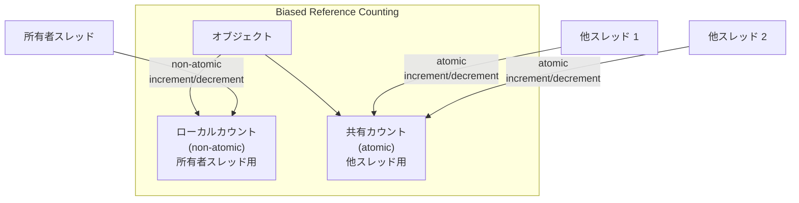

多くのオブジェクトは作成したスレッドで最も頻繁にアクセスされるため、アトミック操作の頻度を大幅に削減できる。

> [!TIP]
> CPython 3.13 の free-threaded mode（nogil）では、まさにこのバイアス参照カウントが採用されている。各オブジェクトは「ローカル参照カウント」と「共有参照カウント」の2つのカウンタを持ち、所有者スレッドからの操作は非アトミックで行われる。

### 9.4 重み付き参照カウント（Weighted Reference Counting）

**重み付き参照カウント**は、分散システムにおける参照カウントの通信コストを削減するための手法である。オブジェクトに初期重み（例えば1024）を割り当て、参照をコピーする際に重みを分割する。

```
初期状態:
  Object: total_weight = 1024
  Ref A:  weight = 1024

参照コピー（A → B）:
  Object: total_weight = 1024
  Ref A:  weight = 512
  Ref B:  weight = 512

参照削除（B を破棄）:
  Object: total_weight = 1024 - 512 = 512
  Ref A:  weight = 512
```

参照のコピーではオブジェクト本体への通信が不要であり、参照の削除時にのみ重みの減算を通知すればよい。分散オブジェクトシステムでのネットワーク通信を半減できる。

### 9.5 コンパイラによる最適化（Swift ARC）

Swift のコンパイラは、不必要な retain / release ペアを検出して除去するさまざまな最適化を実施する。

**retain/release の除去（Redundant retain/release elimination）**：

```swift
// Before optimization
func example(obj: MyClass) {
    // swift_retain(obj)  — inserted by ARC
    let x = obj.value
    // swift_release(obj) — inserted by ARC
    return x
}

// After optimization: retain/release pair removed
// because obj's lifetime is guaranteed by the caller
func example(obj: MyClass) {
    let x = obj.value
    return x
}
```

**所有権の移動（Ownership transfer）**：

Swift 5.9 以降では `consuming` / `borrowing` パラメータ修飾子により、プログラマが明示的に所有権の意図を示せるようになった。これによりコンパイラがより積極的な最適化を行える。

```swift
func process(_ item: consuming MyClass) {
    // Ownership is transferred — no retain needed
    // item is consumed at the end of this function
}
```

### 9.6 不死オブジェクト（Immortal Objects）

**不死オブジェクト（immortal objects）** は、プログラムの存続期間全体にわたって生存するオブジェクト（例えば `None`、`True`、`False`、小さい整数など）に対して、参照カウント操作を完全にスキップする手法である。

CPython 3.12 で導入されたこの最適化では、特定のオブジェクトの参照カウントを特別な「不死」値に設定し、`Py_INCREF` / `Py_DECREF` がこの値を検出した場合は何もしない。

```c
// Simplified immortal object check in CPython 3.12+
static inline void Py_INCREF(PyObject *op) {
    if (_Py_IsImmortal(op)) {
        return;  // skip ref count update
    }
    op->ob_refcnt++;
}
```

この最適化は、free-threaded CPython におけるアトミック操作の削減にも寄与する。`None` のような頻繁に参照されるオブジェクトでアトミック操作を行わなくて済むのは大きな改善である。

### 9.7 参照カウント最適化の総まとめ

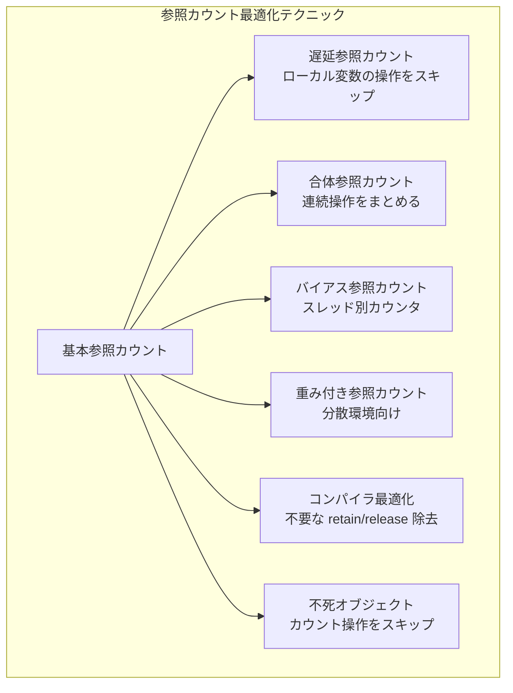

## 10. 参照カウントの歴史と未来

### 10.1 歴史的な位置づけ

参照カウントは1960年に提案されて以来、60年以上にわたってメモリ管理の重要な手法であり続けている。一時期は「循環参照を扱えない」「オーバーヘッドが大きい」として、トレーシング GC に対して劣位に見なされることもあった。しかし近年、いくつかの要因により参照カウントが再評価されている。

**リアルタイム性の重要性の高まり**：モバイルアプリ、ゲーム、AR/VR など、GC の停止時間が許容できないアプリケーションが増加している。Swift が iOS 向けに ARC を選択したのは偶然ではない。

**マルチコア時代の課題**：トレーシング GC も「並行GC（concurrent GC）」や「増分GC（incremental GC）」として停止時間を短縮しているが、完全に排除するのは難しい。Java の ZGC や Shenandoah GC は停止時間を1ms以下に抑えるが、そのためにかなりの複雑さとオーバーヘッドを伴う。

**所有権システムとの相性**：Rust の所有権モデルでは、ほとんどのメモリ管理がコンパイル時に解決される。参照カウント（`Rc` / `Arc`）は必要な場面でのみ「opt-in」で使用するため、オーバーヘッドが最小限に抑えられる。

### 10.2 最新の動向

**CPython の free-threaded mode**：GIL の除去は Python エコシステムにとって歴史的な転換点であり、参照カウントの実装にも大きな影響を与えている。バイアス参照カウントと不死オブジェクトの導入により、GIL なしでも参照カウントの性能を維持しようとしている。

**Swift の Ownership Manifesto**：Swift は所有権アノテーション（`consuming`、`borrowing`、`~Copyable`）を段階的に導入しており、ARC の retain / release をさらに最適化する方向に進んでいる。長期的には Rust の所有権モデルに近づく可能性がある。

**Perceus 参照カウント**：関数型言語 Koka で採用された参照カウント方式である。線形型に基づく最適化により、多くの場面で参照カウント操作をゼロに削減できるとされている。

### 10.3 まとめ — いつ参照カウントを選ぶか

参照カウントは万能ではないが、以下の条件で特に効果的である。

1. **リアルタイム性が要求される場合**：GC の停止時間が許容できないアプリケーション（iOS アプリ、ゲーム、音声処理など）。
2. **リソース管理が重要な場合**：ファイルハンドル、ネットワーク接続、データベース接続など、メモリ以外のリソースの確定的な解放が必要な場合。
3. **メモリ制約が厳しい場合**：組み込みシステムやモバイルデバイスなど、メモリのピーク使用量を抑えたい場合。
4. **言語間連携が必要な場合**：COM のように、異なる言語で書かれたコンポーネント間でオブジェクトを共有する場合。

一方、以下の条件ではトレーシング GC がより適している。

1. **高スループットが要求される場合**：大量のオブジェクト生成・破棄が行われるサーバーアプリケーション。
2. **プログラマの負担を最小化したい場合**：循環参照を意識せずにコードを書きたい場合。
3. **ポインタ操作が非常に多い場合**：参照カウントのオーバーヘッドが累積する場合。

最終的に、参照カウントとトレーシング GC は対立するものではなく、相補的な技術である。Python のハイブリッドモデルが示すように、両者を組み合わせることで各方式の弱点を補い合うことができる。メモリ管理の設計を行う際には、アプリケーションの特性に応じて適切な手法を選択することが重要である。
