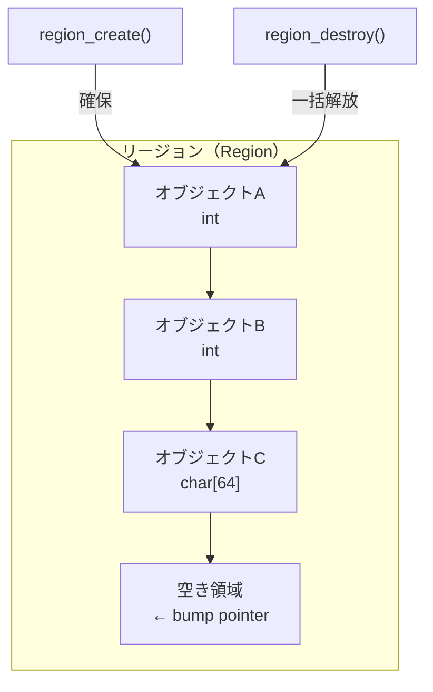
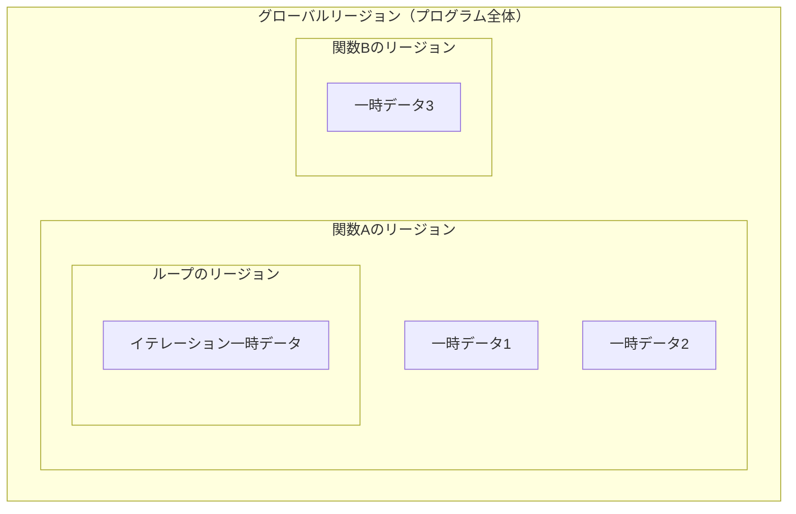
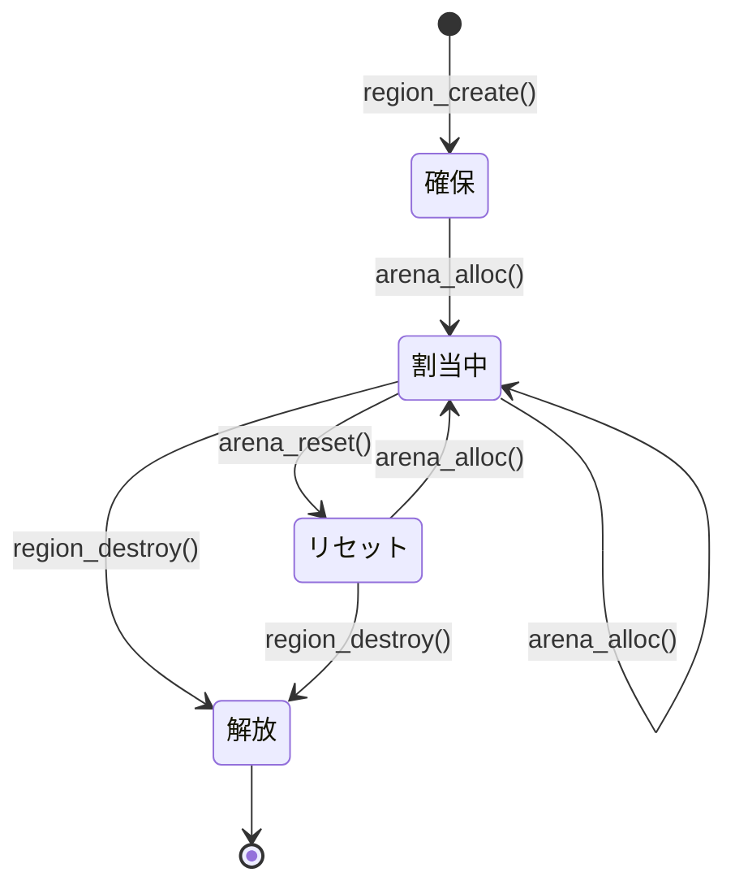
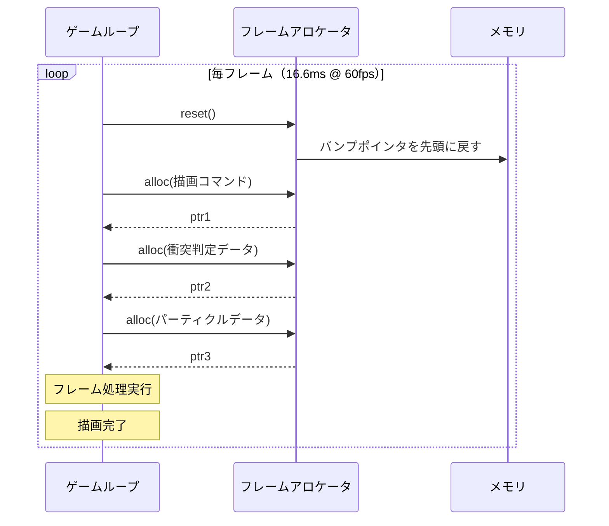

# リージョンベースメモリ管理

## 1. 背景 — メモリ管理の第三の道

### 1.1 手動管理とGCの狭間

プログラミング言語の歴史において、メモリ管理は常に二つの極の間で揺れ動いてきた。一方の極にはCに代表される**手動メモリ管理**がある。`malloc` と `free` を明示的に呼び出し、プログラマがメモリの確保と解放の全責任を負う。このアプローチは最大限の制御と性能を提供するが、ダングリングポインタ、二重解放、メモリリークといった深刻なバグの温床となる。

もう一方の極には、Java、Go、Python、OCaml、Haskellなどが採用する**ガベージコレクション（GC）** がある。GCはプログラマからメモリ管理の負担を取り除き、安全性を自動的に保証する。しかし、その代償として実行時オーバーヘッド、予測困難なGC停止（pause）、メモリ消費の増大が生じる。リアルタイムシステムやゲームエンジンのように、一定のレイテンシ制約を課される領域では、GCの停止時間は許容できない場合がある。

この二つの極の間に、**リージョンベースメモリ管理（region-based memory management）** という第三の道が存在する。リージョンとは、メモリ上の連続領域であり、複数のオブジェクトをまとめて確保し、不要になった時点でリージョン全体を一括解放する方式である。個々のオブジェクトを個別に追跡・解放する必要がないため、手動管理やGCとは根本的に異なるトレードオフを提供する。

### 1.2 リージョンの基本概念

リージョンベースメモリ管理の核心的アイデアは驚くほど単純である。

1. **リージョン（region）** を確保する — メモリの大きなブロックを一括で取得する
2. リージョン内から小さなオブジェクトを**バンプアロケーション（bump allocation）** で高速に割り当てる
3. リージョンが不要になった時点で、**リージョン全体を一括解放**する

```c
// Conceptual example of region-based allocation
Region *r = region_create(4096);   // allocate 4KB region
int *a = region_alloc(r, sizeof(int));
int *b = region_alloc(r, sizeof(int));
char *s = region_alloc(r, 64);
// ... use a, b, s ...
region_destroy(r);                 // free everything at once
```

バンプアロケーションとは、リージョン内のポインタを単純にインクリメントするだけでメモリを割り当てる方式である。`malloc` のようにフリーリストの探索やメタデータの管理が不要なため、割り当てコストは事実上 $O(1)$ であり、通常の `malloc` よりも桁違いに高速である。

解放もまた $O(1)$ である。リージョン内の個々のオブジェクトを追跡する必要がなく、リージョンのベースポインタを返すだけでよい。GCのようにオブジェクトグラフを走査する必要もない。



### 1.3 歴史的起源

リージョンの概念自体は古くから実践されていた。1960年代のFortranコンパイラでは、サブルーチンのローカル変数をスタックフレーム上にまとめて配置し、サブルーチン終了時に一括で解放するという方式が使われていた。これはリージョンの最も単純な形態と見なすことができる。

しかし、リージョンベースメモリ管理が学術的に体系化されたのは、1990年代のMads Tofte と Jean-Pierre Talpinによる先駆的な研究による。彼らは、MLのような関数型言語において、プログラム中のすべてのメモリ割り当てと解放をリージョンによって自動的に管理する手法を提案した。この研究は、後にMLKitという実用的なコンパイラへと結実し、リージョンベースメモリ管理の実現可能性を実証した。

## 2. Tofte-Talpinのリージョン推論

### 2.1 リージョン推論とは

Tofte-Talpinのリージョン推論（Region Inference）は、プログラマが明示的にリージョンを管理するのではなく、**コンパイラがプログラムの構造を解析して、各値をどのリージョンに配置すべきかを自動的に推論する**手法である。これは型推論のメモリ管理版と言ってもよい。

Standard MLのような言語では、プログラマは通常のコードを書くだけでよい。コンパイラがプログラムのデータフローを解析し、以下の情報を自動的に導出する。

- 各値がどのリージョンに配置されるか
- 各リージョンがいつ生成され、いつ破棄されるか
- リージョン間の寿命の関係

### 2.2 リージョン型システム

Tofte-Talpinの体系では、型にリージョンの注釈が付加される。例えば、通常のML型 `int` はリージョン注釈付きで `int at ρ` と表される。ここで `ρ`（ロー）はリージョン変数であり、その値が配置されるリージョンを示す。

関数型は以下のように拡張される。

$$
\tau_1 \xrightarrow{\epsilon.\varphi} \tau_2
$$

ここで $\epsilon$ はリージョン変数の集合（effect）であり、関数が実行中にアクセスするリージョンを表す。$\varphi$ は関数実行中に新たに確保されるリージョンの集合である。

具体例を見てみよう。以下のML関数について考える。

```sml
fun f(x, y) = (x, y)
```

この関数にリージョン注釈を付与すると、概念的には以下のようになる。

```
fun f [ρ_result](x at ρ1, y at ρ2) =
  (x, y) at ρ_result
```

結果のタプルはリージョン `ρ_result` に配置される。`ρ_result` の寿命は呼び出し元の文脈によって決まり、結果が不要になった時点でリージョンごと解放される。

### 2.3 letregion構文

リージョン推論の中核となる構文は `letregion` である。

```
letregion ρ in e end
```

これは「リージョン $\rho$ を確保し、式 $e$ を評価し、評価終了後にリージョン $\rho$ を解放する」という意味を持つ。スコープベースの管理であるため、リージョンの寿命はプログラムの静的構造から決定できる。

```
letregion ρ1 in
  let val x = 42 at ρ1
  in
    letregion ρ2 in
      let val y = x + 1 at ρ2
      in
        y
      end
    end   (* ρ2 is deallocated here *)
  end
end       (* ρ1 is deallocated here *)
```

この例では、`ρ2` が `ρ1` よりも先に解放される。リージョンの寿命はスコープに従って**スタック的に（LIFO順で）** 管理される。これはリージョンの重要な性質であり、リージョンの確保・解放をスタック操作として実装できることを意味する。

### 2.4 リージョンの多相性

Tofte-Talpinの体系は**リージョン多相性（region polymorphism）** をサポートする。これは型の多相性（ジェネリクス）のリージョン版であり、同一の関数が異なるリージョンに対して適用できることを意味する。

```
fun map [ρ_result] (f, nil) = nil at ρ_result
  | map [ρ_result] (f, x::xs) =
      f(x) :: map [ρ_result] (f, xs) at ρ_result
```

`map` 関数は結果リストのリージョン `ρ_result` について多相的である。呼び出し元が異なるリージョンを指定でき、結果リストの寿命を柔軟に制御できる。

### 2.5 リージョン推論のアルゴリズム

実際のリージョン推論アルゴリズムは以下の手順で進む。

1. **リージョン変数の導入**: すべての型にリージョン変数を付加する
2. **制約の生成**: プログラムのデータフローに基づき、リージョン変数間の制約（同一リージョンに配置すべき、など）を生成する
3. **制約の解決**: ユニフィケーション（型推論と同様の手法）によって制約を解決し、リージョン変数を具体化する
4. **`letregion` の挿入**: 各リージョンの最も狭い有効なスコープを決定し、`letregion` 構文を挿入する

重要なのは、リージョン推論は**保守的な近似**であるという点である。GCが「もう参照されないオブジェクト」を正確に回収するのに対し、リージョン推論は「このスコープを抜けたら確実に不要になる」オブジェクトをまとめて解放する。この保守性ゆえに、リージョンベースの管理ではGCよりもメモリ消費量が増える場合がある。

## 3. MLKitでの実装と実績

### 3.1 MLKitの概要

MLKit は、Tofte-Talpinのリージョン推論を実装した Standard ML コンパイラである。1990年代後半にコペンハーゲン大学で開発され、リージョンベースメモリ管理の実用性を世界で初めて実証した。

MLKit の特筆すべき点は、GCを**完全に排除**してリージョンのみでメモリを管理できることを示した点にある。Standard ML のような高水準関数型言語において、これは非自明な成果であった。関数型言語では、クロージャ、高階関数、データ構造の共有など、メモリの寿命が複雑に絡み合う場面が多いためである。

### 3.2 実装上の工夫

MLKit の実装は、理論をそのまま適用するだけでは不十分であることを示した。実用上のいくつかの課題と、それに対する解決策が見出された。

**リージョンサイズの問題** — 理論的には単一の値も独自のリージョンに配置される可能性がある。しかし、リージョンごとにメモリページを確保するのは非効率的である。MLKit では、小さなリージョンをスタック上に配置する「無限リージョン」と「有限リージョン」の区別を導入した。有限リージョン（サイズが静的に定まるもの）はスタック上に直接配置され、無限リージョン（サイズが不定のもの）はヒープ上にリンクリストとして確保される。

**リージョンの寿命が長すぎる問題** — 保守的な推論のため、リージョンの寿命が実際に必要な期間より長くなる場合がある。典型的な例は、リスト処理でリストの一部の要素だけが後で使われる場合である。リージョン全体がその要素の寿命に引きずられて、他の不要な要素もメモリに留まり続ける。

MLKit ではこの問題に対処するために、**リージョンリセット（region resetting）** という手法を導入した。リージョン内のデータが不要になった時点でリージョンをリセット（中身を破棄してポインタを先頭に戻す）し、同じリージョンを再利用する。

**GCとのハイブリッド** — 純粋なリージョンベース管理では解決しきれないケースに対応するため、MLKit の後期バージョンではリージョン内部で限定的なGCを実行するハイブリッドモードも提供された。

### 3.3 性能評価

MLKit の性能評価は興味深い結果を示した。

- **メモリ消費**: 多くのベンチマークでGC版と比較して同等かやや多いメモリ消費。ただし、一部のプログラムでは大幅に少ないメモリ消費を達成した
- **実行時間**: GCのオーバーヘッドがないため、GC版より高速な場合が多い。特にGCが頻繁に発生するプログラムでは顕著な速度向上が見られた
- **予測可能性**: 最大の利点は、GC停止による予測困難なレイテンシスパイクがないこと。リージョンの解放コストは確保されたリージョンのサイズに比例し、事前に予測可能である

### 3.4 MLKitの影響と限界

MLKit は学術的な意義は大きかったが、産業での広範な採用には至らなかった。その理由としては以下が挙げられる。

- Standard ML自体のエコシステムが限定的であった
- リージョン推論の結果が直感的でない場合があり、メモリ消費の予測がプログラマにとって困難であった
- リージョンの寿命が保守的に推論されるため、一部のプログラムでは過剰なメモリ消費が発生した

しかし、MLKit で培われたアイデアは、後のRustのライフタイムシステムやArenaアロケータの設計に深い影響を与えている。

## 4. Arena / Bump Allocatorとしての実用的観点

### 4.1 Arenaアロケータの設計

理論的なリージョン推論とは別に、リージョンの概念は**Arenaアロケータ（arena allocator）** あるいは**バンプアロケータ（bump allocator）** として実務で広く活用されている。Arenaアロケータはリージョンの最も実用的な具現化であり、シンプルさと性能のバランスに優れる。

Arenaアロケータの実装は驚くほど単純である。

```c
typedef struct {
    char *base;     // base address of the region
    size_t offset;  // current allocation offset (bump pointer)
    size_t capacity; // total capacity
} Arena;

Arena *arena_create(size_t capacity) {
    Arena *a = malloc(sizeof(Arena));
    a->base = malloc(capacity);
    a->offset = 0;
    a->capacity = capacity;
    return a;
}

void *arena_alloc(Arena *a, size_t size) {
    // align to 8 bytes
    size = (size + 7) & ~7;
    if (a->offset + size > a->capacity) {
        return NULL;  // out of memory
    }
    void *ptr = a->base + a->offset;
    a->offset += size;
    return ptr;
}

void arena_reset(Arena *a) {
    a->offset = 0;  // reset bump pointer; all allocations invalidated
}

void arena_destroy(Arena *a) {
    free(a->base);
    free(a);
}
```

ここでの重要なポイントは以下の通りである。

- **割り当てコスト**: ポインタの加算とサイズチェックのみ。分岐予測が効く場合、事実上数ナノ秒で完了する。`malloc` は一般的に数十〜数百ナノ秒かかるため、桁違いに高速である
- **個別解放なし**: `arena_free(ptr)` のような関数は存在しない。これは設計上の意図であり、個別のオブジェクト管理のオーバーヘッドを完全に排除する
- **リセットによる再利用**: `arena_reset` はポインタを先頭に戻すだけであり、$O(1)$ で全メモリを再利用可能にする

### 4.2 成長可能なArena

実用的なArenaアロケータは、容量が足りなくなった場合に自動的に拡張する仕組みを持つことが多い。一般的な設計は、固定サイズのチャンク（ブロック）をリンクリストで連結する方式である。

```c
typedef struct Chunk {
    struct Chunk *next;
    size_t capacity;
    size_t offset;
    char data[];  // flexible array member
} Chunk;

typedef struct {
    Chunk *current;  // current chunk for allocation
    Chunk *first;    // first chunk (for iteration/reset)
} GrowableArena;

void *growable_arena_alloc(GrowableArena *a, size_t size) {
    size = (size + 7) & ~7;
    if (a->current->offset + size > a->current->capacity) {
        // allocate new chunk (double the previous size)
        size_t new_cap = a->current->capacity * 2;
        if (new_cap < size) new_cap = size;
        Chunk *c = malloc(sizeof(Chunk) + new_cap);
        c->capacity = new_cap;
        c->offset = 0;
        c->next = NULL;
        a->current->next = c;
        a->current = c;
    }
    void *ptr = a->current->data + a->current->offset;
    a->current->offset += size;
    return ptr;
}
```

この設計では、新しいチャンクを追加する際に前のチャンクのデータは移動しない。したがって、既存のポインタは有効なままである。

### 4.3 アラインメントとパディング

実際のArenaアロケータでは、メモリアラインメントの処理が重要である。多くのCPUアーキテクチャでは、特定の型のデータが特定のアドレス境界に配置されていないとパフォーマンスペナルティが発生する（あるいはハードウェア例外が発生する）。

```c
void *arena_alloc_aligned(Arena *a, size_t size, size_t align) {
    // round up offset to alignment boundary
    size_t aligned_offset = (a->offset + align - 1) & ~(align - 1);
    if (aligned_offset + size > a->capacity) {
        return NULL;
    }
    void *ptr = a->base + aligned_offset;
    a->offset = aligned_offset + size;
    return ptr;
}
```

### 4.4 スクラッチArena（一時Arena）

実務でよく使われるパターンとして**スクラッチArena（scratch arena）** がある。これは一時的な計算に使うArenaで、計算が終わったらリセットして再利用する。

```c
void process_request(Arena *scratch, Request *req) {
    // save current position
    size_t saved_offset = scratch->offset;

    // allocate temporary data from scratch arena
    char *temp_buf = arena_alloc(scratch, 4096);
    ParsedData *parsed = arena_alloc(scratch, sizeof(ParsedData));
    // ... process request using temporary allocations ...

    // restore position: all temporary allocations invalidated
    scratch->offset = saved_offset;
}
```

この「保存と復元」パターンは、スタックフレームのpush/popと本質的に同じであり、関数の一時データを効率的に管理できる。

## 5. リージョンの階層構造とスコープ

### 5.1 入れ子リージョン

リージョンは階層的に入れ子にすることができる。外側のリージョンが破棄されると、内側のリージョンも同時に破棄される。この階層構造はプログラムの制御フローと自然に対応する。



```
letregion ρ_global in
  ...
  letregion ρ_funcA in
    let val tmp1 = ... at ρ_funcA
    let val tmp2 = ... at ρ_funcA
    letregion ρ_loop in
      (* per-iteration temporary data *)
      let val iter_tmp = ... at ρ_loop
    end  (* ρ_loop freed after loop *)
  end    (* ρ_funcA freed after function A *)
  ...
  letregion ρ_funcB in
    let val tmp3 = ... at ρ_funcB
  end    (* ρ_funcB freed after function B *)
end      (* ρ_global freed at program exit *)
```

### 5.2 リージョンのライフサイクル

リージョンのライフサイクルは以下の4つのフェーズから構成される。



1. **確保（Creation）**: リージョンに対応するメモリブロックを取得する
2. **割り当て（Allocation）**: バンプポインタを進めてオブジェクトを配置する
3. **リセット（Reset）**（任意）: バンプポインタを先頭に戻し、リージョンを再利用可能にする
4. **解放（Destruction）**: リージョン全体を返却する

リセットフェーズの存在が、リージョンをスタック割り当てよりも柔軟にしている。スタック割り当てでは、最も最近に確保されたものから順に解放しなければならない（LIFO制約）。リージョンのリセットはこの制約なしに、リージョン内のすべてのデータを一度に無効化できる。

### 5.3 リージョンとスタックの関係

リージョンベース管理は、スタック割り当てとヒープ割り当ての中間に位置すると理解できる。

| 特性 | スタック | リージョン | ヒープ（malloc） | ヒープ（GC） |
|------|---------|-----------|----------------|-------------|
| 割り当て速度 | 極めて高速 | 非常に高速 | 中程度 | 中程度 |
| 解放速度 | 極めて高速 | 非常に高速 | 中程度 | 不定 |
| 個別解放 | 不可 | 不可 | 可能 | 自動 |
| 寿命の柔軟性 | 低い（LIFO） | 中程度 | 高い | 高い |
| メモリ効率 | 高い | 中〜高 | 高い | 中程度 |
| フラグメンテーション | なし | リージョン内はなし | あり | 方式依存 |
| 予測可能性 | 高い | 高い | 高い | 低い |

リージョンの寿命はスコープに紐づくため、スタックと同様に静的に決定できる。しかし、リージョン内のオブジェクトの数やサイズは動的に変化できるため、スタックよりも柔軟である。

## 6. Rustのライフタイムとの関連性

### 6.1 ライフタイムはリージョンの抽象化

Rustのライフタイム（lifetime）は、Tofte-Talpinのリージョン推論から直接的な影響を受けている。Rustの設計者であるGraydon Hoareは、MLのリージョン研究を熟知しており、Rustの借用チェッカー（borrow checker）にその知見を取り込んだ。

Rustのライフタイム `'a` は、値が有効であるスコープの期間を表すが、これはリージョンの寿命とほぼ同義である。実際、Rust コンパイラの内部では、ライフタイムは**リージョン（region）** と呼ばれている。

```rust
fn longest<'a>(x: &'a str, y: &'a str) -> &'a str {
    // 'a is a region (lifetime) that encompasses both x and y
    if x.len() > y.len() { x } else { y }
}
```

ここで `'a` は、`x` と `y` の両方が有効であるリージョンを表す。返り値もこのリージョンに属するため、`x` と `y` の両方が有効である間のみ使用可能であることがコンパイル時に保証される。

### 6.2 リージョン推論との相違点

ただし、Rustのライフタイムシステムは Tofte-Talpin のリージョン推論とはいくつかの重要な違いがある。

**メモリ割り当てとの分離** — Tofte-Talpin の体系では、リージョンはメモリの実際の割り当て先である。値は特定のリージョン内に物理的に配置される。一方、Rustのライフタイムは**参照の有効期間の追跡**に特化しており、メモリの物理的な配置場所を制御するものではない。Rustでの実際のメモリ管理は、所有権（ownership）と `Drop` トレイトによって行われる。

**個別解放のサポート** — Tofte-Talpin のリージョンでは個別のオブジェクト解放はできないが、Rustでは所有権に基づく個別の値の解放が可能である。`Box<T>` がスコープを抜けると、その値は即座に解放される。リージョンのような一括解放ではなく、値ごとのきめ細かい解放が行われる。

**明示性** — Tofte-Talpin のリージョン推論はリージョンを完全に自動推論するが、Rustでは一部のライフタイムをプログラマが明示的に注釈する必要がある。ライフタイムの省略規則（lifetime elision rules）により多くの場合は省略できるが、複雑なケースでは明示的な注釈が必要となる。

### 6.3 Rustにおけるリージョンベース管理の実践

Rustでリージョンベースのメモリ管理を実践するには、`bumpalo` クレートなどのArenaアロケータを使用する。

```rust
use bumpalo::Bump;

fn process_frame(bump: &Bump) {
    // allocate from the arena
    let data = bump.alloc_slice_copy(&[1, 2, 3, 4, 5]);
    let name = bump.alloc_str("hello");

    // use data and name...
    println!("{:?}, {}", data, name);

    // no individual deallocation needed
    // caller resets the arena after this function returns
}

fn main() {
    let bump = Bump::new();

    for _ in 0..60 {
        process_frame(&bump);
        bump.reset(); // free all allocations at once
    }
}
```

Rustの所有権システムと組み合わせることで、Arenaの安全性がコンパイル時に保証される。Arenaから確保した参照は、Arena自体の寿命を超えて使用できないことがライフタイムチェッカーによって検証される。

## 7. GCとの比較

### 7.1 レイテンシ

GCとリージョンベース管理の最も顕著な違いはレイテンシの特性にある。

**GCの場合** — GCは定期的に実行され、「マーク」フェーズ（生存オブジェクトの走査）と「スイープ」フェーズ（不要オブジェクトの回収）を行う。世代別GC（Generational GC）やインクリメンタルGC、コンカレントGC（ZGC、Shenandoah等）など、停止時間を短縮するための技術は進化しているが、根本的に非決定的な停止が発生する。

Java の ZGC は停止時間を 1ms 未満に抑えることを目標としているが、それでもヒープサイズやオブジェクト数に依存する不確実性が残る。Go の GC も停止時間の短縮に注力しているが、やはり完全に排除はできない。

**リージョンベースの場合** — リージョンの解放コストは、リージョンを構成するチャンク数に比例する。単一チャンクのリージョンであれば、解放は単一の `free` 呼び出し（あるいはポインタリセット）で完了する。このコストは事前に予測可能であり、非決定的な停止は発生しない。

```
// GC: unpredictable pause
// | processing | GC pause | processing | GC pause | ...
// |============|====|=====|============|==|=======|

// Region-based: predictable, bounded deallocation
// | processing | free | processing | free | processing | free |
// |============|=|====|============|=|====|============|=|====|
```

### 7.2 スループット

スループット（単位時間あたりの処理量）の観点では、状況に依存する。

**GCが有利なケース** — 多数の短命オブジェクトが生成される場合、世代別GCは極めて効率的である。Young世代のGC（マイナーGC）はコピーGCとして実装されることが多く、生存オブジェクトのみをコピーするため、大量の短命オブジェクトがあっても高速に回収できる。

**リージョンが有利なケース** — リージョンの寿命とデータの寿命が一致する場合、リージョンベースはGCよりも効率的である。リージョンの確保・解放のオーバーヘッドはGCの走査コストよりも小さく、特にリアルタイム処理で有利になる。

### 7.3 メモリ効率

**GCの場合** — GCは個々のオブジェクトの到達可能性を追跡できるため、理論的にはメモリ効率が高い。不要になったオブジェクトは（最終的には）回収される。ただし、GCの実行頻度とヒープサイズのバランスにより、実際には使用メモリの2〜3倍のヒープを確保する必要がある場合が多い。

**リージョンの場合** — リージョンベースでは、リージョン内の一部のオブジェクトが不要になっても、リージョン全体が解放されるまでメモリが保持される。これは**内部フラグメンテーション（internal fragmentation）** の一種であり、リージョンの寿命とオブジェクトの寿命が一致しない場合にメモリが無駄になる。

### 7.4 比較まとめ

| 観点 | GC | リージョンベース |
|------|-----|----------------|
| レイテンシ | 非決定的停止あり | 予測可能、低遅延 |
| スループット | 短命オブジェクト多数の場合に有利 | リージョン寿命が適合する場合に有利 |
| メモリ効率 | 個別回収可能、ただしヒープ余裕が必要 | 一括解放、内部フラグメンテーションのリスク |
| 実装の複雑性 | 高い（マーク、スイープ、世代管理） | 低い（バンプポインタとチャンク管理） |
| 安全性 | 言語ランタイムが保証 | スコープルールまたは型システムが保証 |
| プログラマの負担 | 低い（自動管理） | 中程度（リージョン設計が必要） |

## 8. ゲームエンジンとリアルタイムシステムでの採用

### 8.1 ゲームエンジンにおけるメモリ管理の要件

ゲームエンジンは、リージョンベースメモリ管理が最も実用的な効果を発揮する領域の一つである。ゲームは毎秒30〜120フレームの描画を要求され、各フレームの処理時間は 8ms（120fps）〜 33ms（30fps）に制限される。この厳しい時間制約の中で、GCの非決定的な停止は許容できない。

ゲームエンジンが直面するメモリ管理の課題は以下の通りである。

- **大量の一時データ**: 各フレームで描画コマンド、衝突検出の中間結果、パーティクルデータなど大量の一時データが生成される
- **確定的なタイミング**: フレームレートの維持にはメモリ操作の時間が予測可能でなければならない
- **フラグメンテーション回避**: 長時間稼働するゲームでは、ヒープのフラグメンテーションが性能劣化を引き起こす
- **メモリ予算**: コンソール機では使用可能なメモリが厳密に制限されている

### 8.2 フレーム単位アロケーション

ゲームエンジンで最も一般的なリージョンベースのパターンは**フレームアロケータ（frame allocator）** である。これは各フレームの開始時にリージョンを確保（またはリセット）し、フレーム中の一時データをそこから割り当て、フレーム終了時にリージョンをリセットするという方式である。



```cpp
class FrameAllocator {
    char *buffer;
    size_t offset;
    size_t capacity;

public:
    FrameAllocator(size_t size) : capacity(size), offset(0) {
        buffer = static_cast<char*>(malloc(size));
    }

    void *alloc(size_t size) {
        size = (size + 15) & ~15; // align to 16 bytes
        if (offset + size > capacity) return nullptr;
        void *ptr = buffer + offset;
        offset += size;
        return ptr;
    }

    void reset() {
        offset = 0; // O(1) reset: all frame data invalidated
    }

    ~FrameAllocator() { free(buffer); }
};

// Game loop usage
FrameAllocator frame_alloc(16 * 1024 * 1024); // 16MB per frame

void game_loop() {
    while (running) {
        frame_alloc.reset();

        // all per-frame allocations use the frame allocator
        auto *cmds = static_cast<DrawCommand*>(
            frame_alloc.alloc(sizeof(DrawCommand) * MAX_DRAW_COMMANDS));
        auto *particles = static_cast<Particle*>(
            frame_alloc.alloc(sizeof(Particle) * MAX_PARTICLES));

        update(cmds, particles);
        render(cmds);
    }
}
```

このパターンの利点は以下の通りである。

- 割り当てコストが極めて低い（ポインタ加算のみ）
- 解放コストが $O(1)$（リセットのみ）
- フラグメンテーションが発生しない（毎フレーム初期化されるため）
- メモリ使用量が予測可能（フレームアロケータの最大サイズ = 最悪ケースのメモリ使用量）

### 8.3 ダブルバッファリングArena

フレーム $N$ のデータがフレーム $N+1$ でも参照される場合（例えば前フレームの物理状態を参照する補間処理）、2つのArenaを交互に使用する**ダブルバッファリング**パターンが用いられる。

```cpp
class DoubleBufferedArena {
    Arena arenas[2];
    int current = 0;

public:
    DoubleBufferedArena(size_t size)
        : arenas{{size}, {size}} {}

    Arena &current_arena() { return arenas[current]; }
    Arena &previous_arena() { return arenas[1 - current]; }

    void swap() {
        current = 1 - current;
        arenas[current].reset(); // reset the new current arena
    }
};
```

フレーム $N$ では `current_arena()` から割り当て、フレーム $N+1$ ではスワップ後に `previous_arena()` で前フレームのデータにアクセスできる。前々フレームのデータは新しい `current_arena()` のリセットにより自動的に解放される。

### 8.4 実際のゲームエンジンでの採用例

多くの商用ゲームエンジンがリージョンベースのアロケーション戦略を採用している。

**Unreal Engine** — Unreal Engineは `FMemStackBase` などのスタック式アロケータを内部で使用しており、レンダリングコマンドや一時的なデータ構造の管理にリージョンベースのアプローチを適用している。

**DICE / Frostbite** — Electronic Artsの Frostbite エンジンは、フレーム単位のリニアアロケータ（linear allocator）を広く活用していることが GDC（Game Developers Conference）の講演で報告されている。

**id Software** — id Tech エンジンは歴史的にゾーンアロケータ（zone allocator）と呼ばれるリージョンベースのシステムを採用してきた。Quakeのソースコードにはこの実装が含まれている。

### 8.5 リアルタイムシステムでの活用

ゲーム以外のリアルタイムシステムでも、リージョンベースの手法は広く採用されている。

**組み込みシステム** — 組み込みシステムでは動的メモリ割り当て自体が制限される場合が多いが、許容される場合にはリージョンベースの管理が好まれる。MISRA-Cガイドラインのような安全規格に準拠するシステムでは、メモリの確保と解放が予測可能であることが求められ、リージョンはこの要件を満たす。

**オーディオ処理** — オーディオ処理では、バッファのアンダーランを防ぐために一定時間内に処理を完了する必要がある。GCの停止は音切れの直接的な原因となるため、オーディオエンジンではリージョンベースの一時メモリ管理が標準的である。

**ネットワークサーバー** — リクエスト単位でArenaを確保し、レスポンス送信後に一括解放するパターンは、Webサーバーの実装でも見られる。Apache HTTP Serverの APR（Apache Portable Runtime）は、リクエスト処理にプールアロケータ（リージョンの一形態）を使用している。nginx も同様のアプローチを採用しており、リクエストごとにメモリプールを作成し、処理完了後に一括解放する。

## 9. 高度なトピック

### 9.1 リージョンの安全性

リージョンベース管理における最大のリスクは**ダングリングポインタ**である。リージョンが解放された後に、そのリージョン内のオブジェクトへのポインタが残っていると、未定義動作を引き起こす。

この問題に対する解決策はいくつかある。

**型システムによる保証** — Tofte-Talpinのリージョン型システムやRustのライフタイムシステムは、リージョン解放後のアクセスをコンパイル時に防止する。これは最も安全だが、表現力に制約がある。

**世代カウンタ** — リージョンに世代番号を付与し、リージョンリセット時にインクリメントする。ポインタにも世代番号を持たせ、アクセス時に一致を確認する。一致しなければ無効なアクセスとして検出できる。実行時コストは小さいがゼロではない。

```c
typedef struct {
    Arena *arena;
    uint32_t generation;  // incremented on reset
} SafeArena;

typedef struct {
    void *ptr;
    uint32_t generation;  // generation when allocated
} SafePtr;

void *safe_deref(SafeArena *a, SafePtr p) {
    if (p.generation != a->generation) {
        // dangling pointer detected
        return NULL;
    }
    return p.ptr;
}
```

**デバッグモードでの検出** — リージョンリセット時にメモリを特定のパターン（例: `0xDEADBEEF`）で上書きし、デバッグ時にダングリングアクセスを検出しやすくする。本番環境ではこの上書きを省略してパフォーマンスを維持する。

### 9.2 マルチスレッド環境でのリージョン

マルチスレッド環境でリージョンを使用する場合、いくつかの戦略がある。

**スレッドローカルArena** — 各スレッドが独自のArenaを持つ。スレッド間でArenaを共有しないため、同期が不要であり最も効率的である。

```c
__thread Arena *tls_arena = NULL;

void init_thread_arena(size_t size) {
    tls_arena = arena_create(size);
}

void *thread_alloc(size_t size) {
    return arena_alloc(tls_arena, size);
}
```

**ロック付きArena** — 複数スレッドが同一のArenaから割り当てを行う場合、ミューテックスやアトミック操作で同期する。ただし、バンプアロケーションの高速性がロックのオーバーヘッドで損なわれる可能性がある。

**アトミックバンプアロケータ** — バンプポインタをアトミック変数として実装し、`compare_and_swap` で更新する。ロックフリーだが、競合が激しい場合はリトライコストが増大する。

```c
typedef struct {
    char *base;
    _Atomic size_t offset;
    size_t capacity;
} AtomicArena;

void *atomic_arena_alloc(AtomicArena *a, size_t size) {
    size = (size + 7) & ~7;
    size_t old_offset = atomic_load(&a->offset);
    while (1) {
        if (old_offset + size > a->capacity) return NULL;
        if (atomic_compare_exchange_weak(&a->offset, &old_offset,
                                          old_offset + size)) {
            return a->base + old_offset;
        }
        // CAS failed: old_offset updated, retry
    }
}
```

### 9.3 言語レベルでのリージョンサポート

いくつかの言語は、リージョンの概念を言語レベルで組み込んでいる。

**Cyclone** — AT&T Bell Labsで開発されたCの安全な方言であるCycloneは、リージョンを言語の型システムに組み込んだ最初の実用的な言語の一つである。Cycloneでは、すべてのポインタがリージョンに関連付けられ、リージョンの寿命を超えるアクセスがコンパイル時に防止される。Cycloneは後にRustの設計に大きな影響を与えた。

**Rust** — 前述の通り、Rustのライフタイムはリージョンの概念を借用に適用したものであり、ライフタイム注釈 `'a` はリージョンの明示的な名前である。

**Swift** — Swiftの `withUnsafeTemporaryAllocation` APIは、スコープ限定の一時メモリ領域を提供する。これはリージョンの簡易版と見なすことができる。

**Zig** — Zigのアロケータインターフェースは、`ArenaAllocator` を標準ライブラリで提供しており、リージョンベースの管理をファーストクラスでサポートしている。Zigの設計哲学は「アロケータを明示的に渡す」ことであり、リージョンの活用を自然に促す。

### 9.4 リージョンとコンパクション

GCの一つの利点はコンパクション（compaction）—— 生存オブジェクトを移動してメモリの断片化を解消すること —— が可能な点である。リージョンベースの管理では、リージョン内のオブジェクトは移動されないため、リージョン間のフラグメンテーション（外部フラグメンテーション）が問題になりうる。

しかし、リージョンの典型的な使用パターン（フレーム単位リセット、リクエスト単位リセット）では、リージョンが定期的にリセットされるため、長期的なフラグメンテーションは実質的に問題にならない。永続データについてはリージョンベースの管理を避け、通常のヒープアロケータやGCと組み合わせるのが一般的な設計である。

## 10. まとめと展望

### 10.1 リージョンベース管理の本質

リージョンベースメモリ管理の本質は、**メモリの寿命をデータの論理的な単位に合わせる**ことにある。フレーム、リクエスト、トランザクション、パース処理といった論理的な単位ごとにリージョンを確保し、処理完了時に一括解放する。この「バッチ解放」の発想が、割り当て速度、解放速度、予測可能性、フラグメンテーション耐性の すべてにおいて優れた特性をもたらす。

### 10.2 どのような場面で選択すべきか

リージョンベースメモリ管理が特に有効な場面は以下の通りである。

- **フレーム駆動のシステム**: ゲーム、アニメーション、シミュレーションなど、固定間隔で処理が繰り返されるシステム
- **リクエスト駆動のシステム**: Webサーバー、データベースクエリ処理、RPCハンドラなど
- **パース処理**: コンパイラ、JSONパーサー、XMLパーサーなど、入力の処理中に大量の一時データを生成するもの
- **リアルタイム制約のあるシステム**: オーディオ処理、制御系、医療機器、航空宇宙システムなど
- **組み込みシステム**: メモリが限定的で、動的割り当ての予測可能性が求められる環境

一方、以下の場面ではリージョンベースの管理は適さない。

- **データの寿命が多様で予測困難な場合**: グラフ構造やキャッシュのように、個々の要素が異なるタイミングで不要になるデータ
- **長時間存続するデータ**: プログラム全体を通じて生存し続けるデータは、リージョンによる一括解放の恩恵を受けにくい
- **参照カウントで十分な場合**: 単純な所有権構造のデータであれば、スマートポインタや参照カウントの方が適している

### 10.3 今後の発展

リージョンベースメモリ管理は、以下のような方向で発展が続いている。

**言語レベルの統合の深化** — Rustのライフタイムシステムは成功を収めているが、ライフタイム注釈の複雑さはしばしば批判の対象となる。よりエルゴノミックなリージョン管理の構文や推論アルゴリズムの研究が進んでいる。

**GCとのハイブリッド** — 純粋なリージョンベース管理と純粋なGCの中間的なアプローチとして、リージョン内で限定的なGCを実行するハイブリッド方式の研究が進展している。MLKitの後期版やいくつかの研究言語がこの方向を探っている。

**GPUメモリ管理** — GPUプログラミングでは、カーネル実行ごとにメモリを確保・解放するパターンが一般的であり、リージョンベースの管理と自然に適合する。GPU向けのArenaアロケータの最適化は活発な研究領域である。

**WebAssemblyでの活用** — WebAssemblyのリニアメモリモデルは、リージョンベースの管理と相性が良い。WebAssemblyモジュール内でArenaアロケータを使用することで、GCに依存しない高性能なWebアプリケーションの実現が進んでいる。

リージョンベースメモリ管理は、1960年代の実践的な起源から1990年代の理論的体系化を経て、2020年代の現在ではゲームエンジン、システムプログラミング、リアルタイム処理、Webサーバーなど幅広い領域で不可欠な技術となっている。GCの代替としてではなく、GCと相補的な関係にある技術として、その重要性は今後も増していくだろう。
