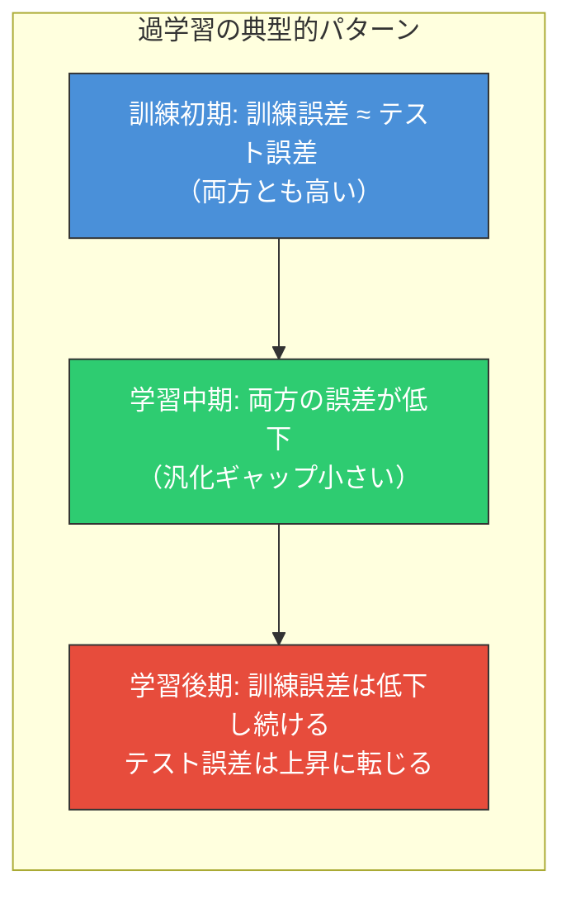
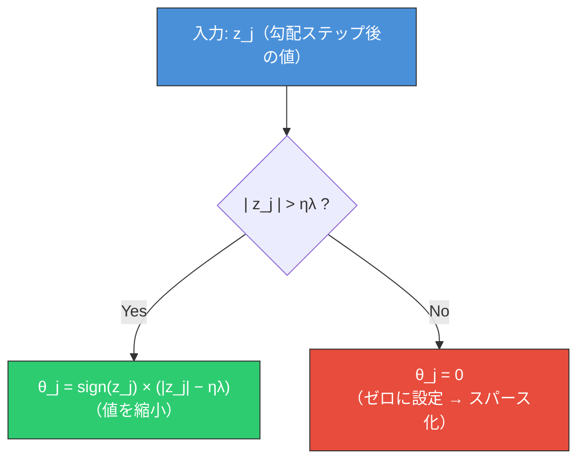
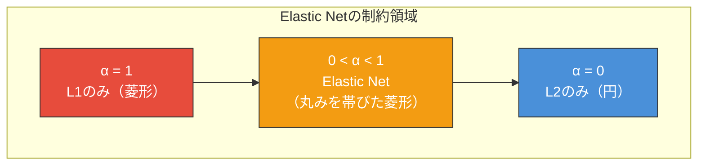
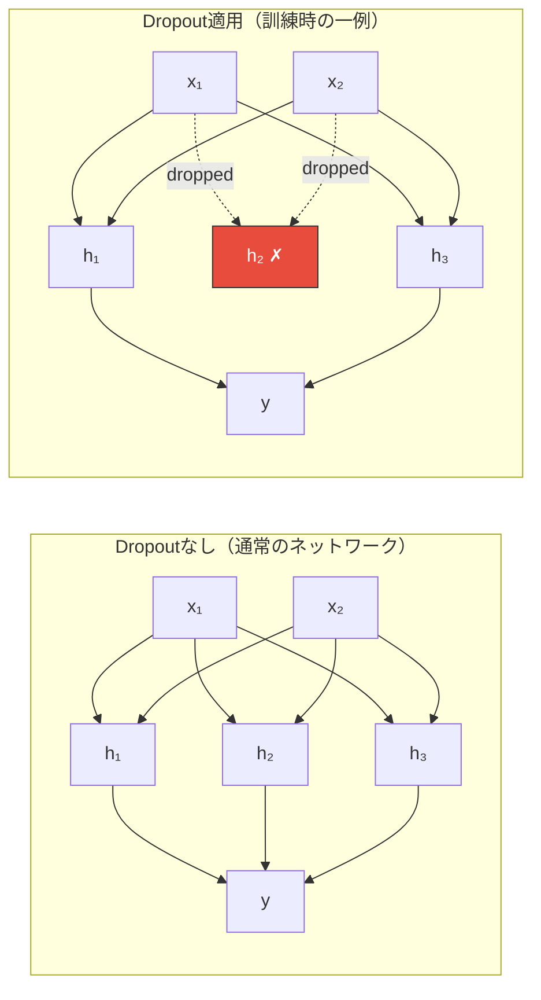
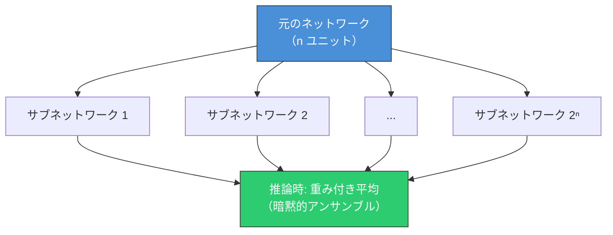
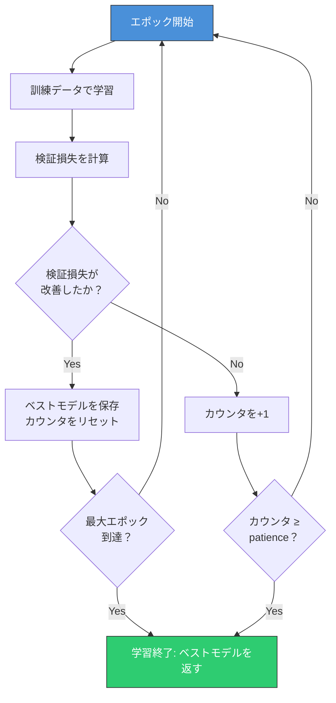
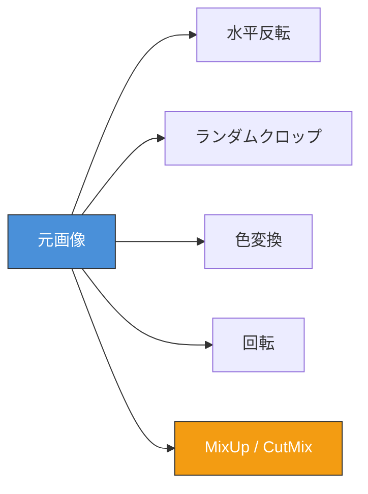
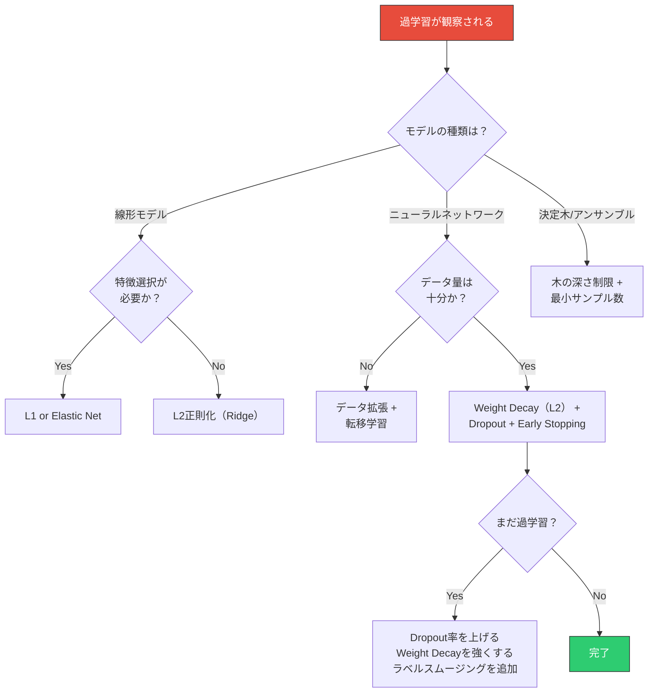
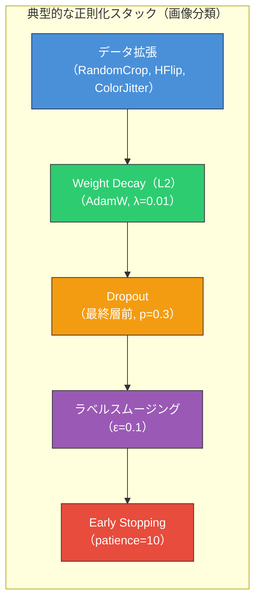

# 過学習と正則化（L1/L2, Dropout, Early Stopping）

## 1. 背景と動機 — なぜモデルは「学びすぎる」のか

機械学習の最終的な目標は、**未知のデータに対して正確な予測を行うこと**、すなわち**汎化性能（generalization performance）**の最大化である。しかし現実には、訓練データに対して優れた性能を示すモデルが、テストデータに対しては惨憺たる結果を返すことが頻繁に起こる。この現象が**過学習（overfitting）**であり、機械学習における最も根本的かつ普遍的な課題の一つである。

過学習を理解し制御するための理論的枠組みが**バイアス-バリアンストレードオフ**であり、それに対する実践的な対処法の総称が**正則化（regularization）**である。本記事では、過学習のメカニズムを理論的に分析した上で、L1/L2正則化、Dropout、Early Stoppingをはじめとする主要な正則化手法の原理・数理・実装上の考慮点を包括的に解説する。

### バイアス-バリアンストレードオフの復習

モデルの期待汎化誤差は、次のように3つの成分に分解できる（二乗損失の場合）。

$$
\mathbb{E}\left[(y - \hat{f}(x))^2\right] = \underbrace{\text{Bias}^2[\hat{f}(x)]}_{\text{バイアスの二乗}} + \underbrace{\text{Var}[\hat{f}(x)]}_{\text{バリアンス}} + \underbrace{\sigma^2}_{\text{既約誤差}}
$$

- **バイアス（Bias）**: モデルの仮定が真の関係をどれだけ外しているか。単純すぎるモデルはバイアスが大きい。
- **バリアンス（Variance）**: 訓練データの変動に対してモデルの出力がどれだけ変動するか。複雑すぎるモデルはバリアンスが大きい。
- **既約誤差（Irreducible Error）**: データ自体に内在するノイズであり、いかなるモデルでも除去できない。

```
汎化誤差
 ^
 |  \                          /
 |   \    バイアス²           / バリアンス
 |    \                     /
 |     \                  /
 |      \              /
 |       \    ___   /
 |        \_ /   \_/  <- 最適な複雑さ
 |          /\_____\_______ 汎化誤差（合計）
 |         /
 |--------/-----------------------> 既約誤差
 +-----------------------------------------> モデルの複雑さ
     未学習                     過学習
```

正則化の本質は、**バリアンスを減少させることでバイアスとのバランスを取り、汎化誤差の最小点に近づけること**にある。バリアンスの低減にはバイアスの若干の増加が伴うが、それが全体の誤差を減少させるならば、そのトレードオフは有益である。

## 2. 過学習の定義と原因

### 過学習の形式的定義

過学習は、以下の条件が同時に成立する状態として定義できる。

$$
\mathcal{L}_{\text{train}}(\boldsymbol{\theta}) \ll \mathcal{L}_{\text{test}}(\boldsymbol{\theta})
$$

すなわち、訓練損失が十分小さいにもかかわらず、テスト損失（または検証損失）が大きい状態である。両者の差を**汎化ギャップ（generalization gap）**と呼ぶ。



### 過学習の主要な原因

過学習は、モデル・データ・学習過程のそれぞれに起因する複合的な現象である。

#### (1) モデルの複雑度が高すぎる

パラメータ数がデータ数に対して多すぎる場合、モデルは訓練データを「暗記」する能力を持ってしまう。たとえば、$n$ 個のデータ点を $n-1$ 次の多項式で必ず完全に通すことができるが、このような多項式は訓練データの間で激しく振動し、汎化性能は極めて低い。

$$
\text{パラメータ数} \gg \text{データ点数} \Rightarrow \text{過学習のリスク大}
$$

> [!NOTE]
> 近年の深層学習では、パラメータ数がデータ数を大幅に超えるにもかかわらず汎化する**二重降下（double descent）**現象が報告されている。これは古典的なバイアス-バリアンスの枠組みでは完全に説明できない現象であり、活発な研究が続いている。

#### (2) 訓練データの量が不足している

データが少ないと、偶然のパターンやノイズが真のパターンと区別できなくなる。統計的学習理論における**VC次元**の議論によれば、汎化誤差の上界は $O\left(\sqrt{\frac{d_{\text{VC}}}{n}}\right)$ の形をしている（$d_{\text{VC}}$: VC次元、$n$: データ数）。つまり、モデルの容量に対してデータが少ないほど、汎化の保証は弱くなる。

#### (3) ノイズの学習

訓練データに含まれるノイズ（測定誤差、ラベルの誤りなど）を、モデルが真のパターンの一部として学習してしまう現象である。ノイズのパターンは訓練データ固有のものであり、テストデータには再現されないため、過学習を引き起こす。

#### (4) 特徴量の冗長性

入力特徴量の中に、予測に寄与しない冗長な特徴量が多数含まれていると、モデルはこれらの特徴量から偽の相関を学習しやすくなる。

## 3. L2正則化（Ridge回帰 / 重み減衰）

### 基本的なアイデア

L2正則化は、最も広く使われている正則化手法の一つであり、**損失関数にパラメータの二乗ノルムに比例するペナルティ項を追加する**ことで、パラメータが大きな値を取ることを抑制する。

$$
\mathcal{L}_{\text{reg}}(\boldsymbol{\theta}) = \mathcal{L}(\boldsymbol{\theta}) + \frac{\lambda}{2} \|\boldsymbol{\theta}\|_2^2 = \mathcal{L}(\boldsymbol{\theta}) + \frac{\lambda}{2} \sum_{j=1}^{d} \theta_j^2
$$

ここで $\lambda > 0$ は**正則化係数**（regularization coefficient）であり、元の損失関数とペナルティのバランスを制御するハイパーパラメータである。$\frac{1}{2}$ は微分した際に係数を簡潔にするための慣例的な定数である。

### 勾配への影響

L2正則化を施した損失関数の勾配は次のように変わる。

$$
\nabla_{\boldsymbol{\theta}} \mathcal{L}_{\text{reg}} = \nabla_{\boldsymbol{\theta}} \mathcal{L} + \lambda \boldsymbol{\theta}
$$

したがって、勾配降下法によるパラメータ更新式は以下のようになる。

$$
\boldsymbol{\theta}_{t+1} = \boldsymbol{\theta}_t - \eta \left(\nabla_{\boldsymbol{\theta}} \mathcal{L} + \lambda \boldsymbol{\theta}_t\right) = (1 - \eta\lambda) \boldsymbol{\theta}_t - \eta \nabla_{\boldsymbol{\theta}} \mathcal{L}
$$

ここで $(1 - \eta\lambda)$ の係数は、各更新ステップにおいてパラメータを一定割合で縮小させることを意味する。このことから、L2正則化は**重み減衰（weight decay）**とも呼ばれる。

> [!WARNING]
> Adamなどの適応的学習率をもつオプティマイザでは、L2正則化と重み減衰は厳密には等価ではない。Loshchilov & Hutter（2019）が提案した**AdamW**は、勾配に正則化項を加えるのではなく、重み減衰を直接パラメータ更新に適用することで、この不一致を解消している。

### 幾何学的解釈

L2正則化の効果は、幾何学的には**元の損失関数の等高線と、原点を中心とする円（高次元では超球）の交差**として理解できる。

```
θ₂
 ^
 |        ╱ 元の損失関数の
 |       ╱   等高線（楕円）
 |      ╱
 |    ╱  ⬤  <- L2正則化後の最適点
 |   ╱ ╱─╲
 |  ╱╱    ╲   ○ <- 元の最適点
 | ╱       ╲
 |╱ L2制約  ╲
 +╱（円）    ╲──────> θ₁
```

正則化なしの最適解は楕円の中心にあるが、L2制約（$\|\boldsymbol{\theta}\|_2^2 \leq s$）を課すと、解は円と楕円が接する点に移動する。パラメータは全体的に**縮小（shrinkage）**されるが、完全にゼロにはならない。

### ベイズ的解釈

L2正則化には、ベイズ統計の観点からの自然な解釈がある。パラメータに**ガウス事前分布**を仮定した場合の**MAP推定（Maximum A Posteriori）**と等価になるのである。

パラメータの事前分布を $\boldsymbol{\theta} \sim \mathcal{N}(\mathbf{0}, \sigma_\theta^2 \mathbf{I})$ とすると、

$$
p(\boldsymbol{\theta} | D) \propto p(D | \boldsymbol{\theta}) \cdot p(\boldsymbol{\theta})
$$

対数をとると、

$$
\log p(\boldsymbol{\theta} | D) = \log p(D | \boldsymbol{\theta}) + \log p(\boldsymbol{\theta}) + \text{const}
$$

ガウス事前分布の対数は $-\frac{1}{2\sigma_\theta^2}\|\boldsymbol{\theta}\|_2^2$ に比例するため、これを最大化することは、$\lambda = \frac{1}{\sigma_\theta^2}$ として L2正則化付き損失を最小化することと等価である。

つまり、L2正則化は**「パラメータはゼロ近辺に集中しているはずだ」という事前知識を反映している**と解釈できる。

### 線形回帰の場合の閉形式解

線形回帰において L2正則化を適用したものが**Ridge回帰**である。正規方程式は以下のようになる。

$$
\hat{\boldsymbol{\theta}}_{\text{Ridge}} = (X^T X + \lambda I)^{-1} X^T \boldsymbol{y}
$$

$\lambda I$ を加えることで、$X^T X$ が特異行列であっても逆行列が計算可能になるという数値的な利点もある。特異値分解 $X = U \Sigma V^T$ を用いると、Ridge推定量の振る舞いを明確に分析できる。

$$
\hat{\boldsymbol{\theta}}_{\text{Ridge}} = V \text{diag}\left(\frac{\sigma_j^2}{\sigma_j^2 + \lambda}\right) V^T \hat{\boldsymbol{\theta}}_{\text{OLS}}
$$

ここで $\sigma_j$ は特異値であり、$\frac{\sigma_j^2}{\sigma_j^2 + \lambda}$ は**縮小係数**として機能する。特異値が小さい（データの変動が小さい）方向ほど、より強く縮小される。これは直感的にも理にかなっている。データからの情報量が少ない方向のパラメータは、信頼性が低いため、より強く事前分布（ゼロ）に引き戻されるのである。

## 4. L1正則化（Lasso）

### 基本的なアイデア

L1正則化は、パラメータの**絶対値の和**をペナルティとして追加する。

$$
\mathcal{L}_{\text{reg}}(\boldsymbol{\theta}) = \mathcal{L}(\boldsymbol{\theta}) + \lambda \|\boldsymbol{\theta}\|_1 = \mathcal{L}(\boldsymbol{\theta}) + \lambda \sum_{j=1}^{d} |\theta_j|
$$

線形回帰に適用したものが**Lasso（Least Absolute Shrinkage and Selection Operator）**であり、Tibshiraniによって1996年に提案された。

### スパース性と特徴選択

L1正則化の最も重要な特性は、**スパースな解（多くのパラメータが正確にゼロになる解）**を生み出す傾向があることである。この性質により、L1正則化は暗黙的な**特徴選択（feature selection）**として機能する。

この現象を幾何学的に理解しよう。L2制約が円を形成するのに対し、L1制約 $\|\boldsymbol{\theta}\|_1 \leq s$ は**菱形（ダイヤモンド形状）**を形成する。

```
θ₂
 ^
 |        ╱ 元の損失関数の
 |       ╱   等高線（楕円）
 |      ╱
 |    ╱
 |   ╱╲
 |  ╱  ╲ ⬤  <- L1正則化後の最適点
 | ╱    ╲      （軸上 = スパース）
 |╱ L1制約╲
 +╱（菱形） ╲──────> θ₁
```

菱形の角（頂点）は座標軸上にあるため、等高線が菱形と接する点は**角に当たりやすい**。角に当たった場合、少なくとも一つのパラメータが正確にゼロになる。高次元では、この効果がさらに顕著になる。

### 劣勾配と近接勾配法

L1ノルムは原点で微分不可能であるため、通常の勾配降下法を直接適用できない。この問題に対処するため、**劣勾配（subgradient）**の概念を用いる。

$|\theta_j|$ の劣勾配は以下のように定義される。

$$
\partial |\theta_j| = \begin{cases} \{+1\} & \text{if } \theta_j > 0 \\ [-1, +1] & \text{if } \theta_j = 0 \\ \{-1\} & \text{if } \theta_j < 0 \end{cases}
$$

実際の最適化では、劣勾配法よりも**近接勾配法（proximal gradient method）**が効率的である。近接勾配法では、各更新ステップを以下の2段階に分離する。

1. **勾配ステップ**: $\boldsymbol{z} = \boldsymbol{\theta}_t - \eta \nabla_{\boldsymbol{\theta}} \mathcal{L}(\boldsymbol{\theta}_t)$
2. **近接操作（ソフトしきい値処理）**: $\theta_{t+1,j} = \text{sign}(z_j) \max(|z_j| - \eta\lambda, 0)$

ソフトしきい値処理は、以下の**近接演算子（proximal operator）**に対応する。

$$
\text{prox}_{\eta\lambda \|\cdot\|_1}(\boldsymbol{z}) = \text{sign}(\boldsymbol{z}) \odot \max(|\boldsymbol{z}| - \eta\lambda, \mathbf{0})
$$

この操作により、絶対値が $\eta\lambda$ 以下のパラメータは正確にゼロに設定される。



### ベイズ的解釈

L1正則化は、パラメータに**ラプラス事前分布**を仮定した場合のMAP推定と等価である。

$$
p(\theta_j) = \frac{\lambda}{2} \exp(-\lambda |\theta_j|)
$$

ラプラス分布はゼロ周辺に鋭いピークを持ち、裾が重い形状をしている。これは「多くのパラメータはゼロだが、一部のパラメータは大きな値を取りうる」という事前知識を反映しており、スパース解を促進する性質と整合する。

### L1とL2の比較

| 観点 | L1正則化（Lasso） | L2正則化（Ridge） |
|------|-------------------|-------------------|
| ペナルティ | $\lambda\sum\|\theta_j\|$ | $\frac{\lambda}{2}\sum\theta_j^2$ |
| 制約の形状 | 菱形（$\ell_1$ボール） | 円/球（$\ell_2$ボール） |
| 解のスパース性 | 高い（多くの0を含む） | 低い（0にはならない） |
| 特徴選択 | 暗黙的に実行 | 実行しない |
| ベイズ的解釈 | ラプラス事前分布 | ガウス事前分布 |
| 微分可能性 | 原点で不可 | 全域で可能 |
| 相関特徴量 | 1つを選び他を0にする | 均等に重みを分配 |
| 数値的安定性 | 良好 | $\lambda I$の追加で改善 |

## 5. Elastic Net — L1とL2の統合

### 動機

L1正則化には限界がある。特に、**高度に相関した特徴量群**がある場合、Lassoは群の中から1つだけを選択し残りをゼロにする傾向がある。これは不安定な挙動を引き起こしうる。一方、L2正則化は相関した特徴量に対して重みを均等に分配するが、スパースな解は得られない。

Elastic Net（Zou & Hastie, 2005）は、L1とL2の両方のペナルティを組み合わせることで、それぞれの長所を取り入れる。

### 定式化

$$
\mathcal{L}_{\text{ElasticNet}}(\boldsymbol{\theta}) = \mathcal{L}(\boldsymbol{\theta}) + \lambda \left[\alpha \|\boldsymbol{\theta}\|_1 + \frac{1 - \alpha}{2} \|\boldsymbol{\theta}\|_2^2 \right]
$$

ここで $\alpha \in [0, 1]$ は L1とL2のバランスを制御するパラメータである。

- $\alpha = 1$: 純粋なL1正則化（Lasso）
- $\alpha = 0$: 純粋なL2正則化（Ridge）
- $0 < \alpha < 1$: 両者のハイブリッド

### Elastic Netの利点



Elastic Netは以下の特性を併せ持つ。

1. **グループ効果**: 相関の高い特徴量群が同時に選択される（L2成分の効果）
2. **スパース性**: 不要な特徴量はゼロに設定される（L1成分の効果）
3. **安定性**: Lassoよりも特徴選択が安定する
4. **特徴量数 > データ数の場合**: Lassoは最大 $n$ 個の特徴量しか選択できないが、Elastic Netにはこの制限がない

実践的には、$\alpha$ の選択は交差検証によって行われるが、$\alpha = 0.5$ が妥当な出発点としてよく用いられる。

## 6. Dropout — 確率的正則化

### 背景

ここまでのL1/L2正則化は、損失関数にペナルティ項を追加する**明示的な正則化（explicit regularization）**であった。一方、**Dropout**（Srivastava et al., 2014）は、ニューラルネットワークの学習過程自体を変更する**暗黙的な正則化（implicit regularization）**の代表例である。

### 基本的なメカニズム

Dropoutは、訓練時の各ミニバッチ処理において、ネットワークの各ユニット（ニューロン）を確率 $p$ で**ランダムに無効化（ドロップ）**する手法である。



形式的には、層 $l$ の出力 $\boldsymbol{h}^{(l)}$ に対してDropoutを適用する際、次のようにマスクを掛ける。

$$
\boldsymbol{r}^{(l)} \sim \text{Bernoulli}(1 - p)
$$

$$
\tilde{\boldsymbol{h}}^{(l)} = \boldsymbol{r}^{(l)} \odot \boldsymbol{h}^{(l)}
$$

ここで $p$ は**ドロップ率（drop rate）**、$\boldsymbol{r}^{(l)}$ はベルヌーイ分布から生成される二値マスク、$\odot$ は要素ごとの積を表す。$p = 0.5$ が隠れ層でよく使われるデフォルト値であり、入力層では $p = 0.2$ 程度が一般的である。

### 推論時のスケーリング

訓練時にDropoutを適用すると、各ユニットの期待出力は $(1 - p)$ 倍にスケールダウンする。推論（テスト）時にはDropoutを適用しないため、出力スケールの不整合が生じる。これを補正するために、2つの方法がある。

**方法1: 推論時にスケーリング**（標準的なDropout）

推論時に全ユニットを使用し、重みを $(1 - p)$ 倍にスケーリングする。

$$
\boldsymbol{h}_{\text{test}}^{(l)} = (1 - p) \cdot \boldsymbol{W}^{(l)} \boldsymbol{h}^{(l-1)}
$$

**方法2: 訓練時に逆スケーリング**（**Inverted Dropout** — 実装上のデファクト標準）

訓練時にDropout適用後の出力を $\frac{1}{1-p}$ 倍にスケールアップする。

$$
\tilde{\boldsymbol{h}}^{(l)} = \frac{1}{1 - p} \cdot \boldsymbol{r}^{(l)} \odot \boldsymbol{h}^{(l)}
$$

Inverted Dropoutでは、推論時に一切の変更が不要になるため、実装が簡潔になる。PyTorchやTensorFlowなどの主要フレームワークではこちらが採用されている。

::: code-group
```python [PyTorch]
import torch
import torch.nn as nn

class SimpleNet(nn.Module):
    def __init__(self, input_dim, hidden_dim, output_dim, drop_rate=0.5):
        super().__init__()
        self.fc1 = nn.Linear(input_dim, hidden_dim)
        self.dropout = nn.Dropout(p=drop_rate)  # Inverted dropout
        self.fc2 = nn.Linear(hidden_dim, output_dim)

    def forward(self, x):
        x = torch.relu(self.fc1(x))
        x = self.dropout(x)  # Automatically disabled during eval
        x = self.fc2(x)
        return x

# Training: model.train() enables dropout
# Inference: model.eval() disables dropout
```
:::

### なぜDropoutは効くのか — 3つの解釈

#### (1) アンサンブル学習の近似

Dropoutを適用すると、$n$ 個のユニットを持つネットワークから、$2^n$ 個の異なるサブネットワークがサンプリングされる。各ミニバッチは異なるサブネットワークで処理され、推論時にはこれらすべてのサブネットワークの**重み付き平均**として近似される。これは**モデルのアンサンブル**と解釈でき、バリアンスの低減に寄与する。



#### (2) 共適応の防止

Dropout がない場合、ニューロン間で**共適応（co-adaptation）**が発生しやすい。すなわち、特定のニューロンが他のニューロンの「ミス」を補完する形で、一部のニューロンに過度に依存する構造が形成されてしまう。Dropoutはランダムにユニットを欠損させることで、各ユニットが独立して有用な特徴を学習するよう促す。

#### (3) ノイズ注入としての正則化

Dropoutは、ネットワークの中間表現に**乗法的ノイズ**を注入していると見なせる。モデルはこのノイズに対して頑健な表現を学習することを余儀なくされ、結果として過学習に対する耐性が高まる。

### Dropoutの変種

| 手法 | 特徴 | 主な用途 |
|------|------|----------|
| **Standard Dropout** | ユニット単位でドロップ | 全結合層 |
| **Spatial Dropout** | チャンネル全体をドロップ | CNN（特徴マップ単位） |
| **DropConnect** | 重み（接続）単位でドロップ | 全結合層 |
| **DropBlock** | 連続した空間領域をドロップ | CNN |
| **Variational Dropout** | ドロップ率を学習可能に | ベイズNN |

## 7. Early Stopping — 学習過程の制御

### 基本原理

Early Stoppingは、訓練過程を**検証損失（validation loss）が最小となるエポックで打ち切る**手法である。概念的には最も単純な正則化手法だが、その効果は非常に強力である。

```
損失
 ^
 |  ╲
 |   ╲  検証損失
 |    ╲           ╱
 |     ╲    ____╱
 |      ╲__╱
 |       ╱  <- 停止点（最小検証損失）
 |      ╱
 |    訓練損失
 |   ╱
 |  ╱
 | ╱
 |╱
 +──────────────────────────> エポック
       ↑
    この時点で停止
```

### 形式的な手続き

Early Stoppingの典型的なアルゴリズムは以下のとおりである。

```
Algorithm: Early Stopping

Input: patience P, tolerance δ
Initialize: best_loss ← ∞, counter ← 0, best_params ← θ₀

for epoch = 1, 2, ... do
    Train model on training set
    Compute validation loss L_val

    if L_val < best_loss − δ then
        best_loss ← L_val
        best_params ← θ_current
        counter ← 0
    else
        counter ← counter + 1
    end if

    if counter ≥ P then
        return best_params   // Early stop
    end if
end for
```



**patience**（忍耐度）は、検証損失が改善しない状態を何エポック許容するかを制御するハイパーパラメータである。patienceが小さすぎると、一時的な損失の変動で早期終了してしまう。大きすぎると、過学習が進んでから停止することになる。

### Early StoppingとL2正則化の関係

興味深いことに、Early Stoppingは**暗黙的にL2正則化と同等の効果を持つ**ことが理論的に示されている。

二次近似の損失関数 $\mathcal{L}(\boldsymbol{\theta}) \approx \frac{1}{2}(\boldsymbol{\theta} - \boldsymbol{\theta}^*)^T H (\boldsymbol{\theta} - \boldsymbol{\theta}^*)$ において、初期値 $\boldsymbol{\theta}_0 = \mathbf{0}$ から学習率 $\eta$ で $T$ ステップ勾配降下を行った場合、更新されたパラメータは以下のように表せる。

$$
\boldsymbol{\theta}_T = (I - (I - \eta H)^T) \boldsymbol{\theta}^*
$$

一方、L2正則化の場合の解は以下である。

$$
\hat{\boldsymbol{\theta}}_{\text{Ridge}} = (H + \lambda I)^{-1} H \boldsymbol{\theta}^*
$$

$\eta$ が十分小さく $T$ が有限のとき、$\frac{1}{\eta T}$ が $\lambda$ に対応する形で、両者は同等の正則化効果を持つ。すなわち、**学習を早く止めることは、パラメータの大きさに制約を課すことと本質的に同じ**なのである。

### 実践的な考慮事項

- **検証データの分割**: 訓練データの10〜20%を検証データとして確保するのが一般的
- **patienceの設定**: 典型的には5〜20エポック。大きなデータセットや複雑なモデルでは大きめに設定する
- **検証損失のノイズ**: ミニバッチ学習では検証損失が変動するため、移動平均を使って平滑化することが有効
- **学習率スケジューラとの組み合わせ**: 学習率を段階的に下げるスケジューラと併用する場合、学習率低下後に再び改善する可能性があるため、patienceを適切に設定する必要がある

## 8. その他の正則化手法

過学習に対処する手法はL1/L2、Dropout、Early Stoppingに限られない。ここでは、実践上重要な追加の正則化手法を紹介する。

### データ拡張（Data Augmentation）

データ拡張は、訓練データに対して意味を保存する変換を施すことで、見かけ上のデータ量を増やす手法である。正則化の観点からは、**モデルが入力の不変性（invariance）を学習するよう促す**効果がある。



**画像タスクの代表的な手法**:
- 幾何学的変換: 回転、反転、クロップ、スケーリング、弾性変形
- 色空間変換: 明度・コントラスト・色相の変動
- 消去系: Cutout、Random Erasing
- 混合系: **MixUp**（2つの画像とラベルを線形補間）、**CutMix**（画像の一部を別画像で置換）

MixUpは以下のように定式化される。$\tilde{x}$ と $\tilde{y}$ が拡張後のデータとラベルであるとすると、

$$
\tilde{x} = \lambda x_i + (1 - \lambda) x_j, \quad \tilde{y} = \lambda y_i + (1 - \lambda) y_j
$$

ここで $\lambda \sim \text{Beta}(\alpha, \alpha)$ であり、$\alpha$ はハイパーパラメータ（通常 $\alpha = 0.2$ 程度）である。

**テキストタスクの手法**:
- 同義語置換、ランダム挿入/削除
- Back-translation（逆翻訳）
- Token-level MixUp

データ拡張は、ドメイン知識に基づいて「タスクに対してラベルを変えない変換」を設計する必要があるという点で、他の正則化手法とは性質が異なる。

### バッチ正規化（Batch Normalization）

バッチ正規化（Ioffe & Szegedy, 2015）は、ネットワークの各層の入力を**ミニバッチ単位で正規化**する手法である。主目的は学習の安定化と加速だが、**副次的に正則化効果を持つ**。

ミニバッチ $\mathcal{B} = \{x_1, \ldots, x_m\}$ に対して、以下の変換を適用する。

$$
\hat{x}_i = \frac{x_i - \mu_{\mathcal{B}}}{\sqrt{\sigma_{\mathcal{B}}^2 + \epsilon}}, \quad y_i = \gamma \hat{x}_i + \beta
$$

ここで $\mu_{\mathcal{B}}$ と $\sigma_{\mathcal{B}}^2$ はミニバッチの平均と分散、$\gamma$ と $\beta$ は学習可能なパラメータ、$\epsilon$ は数値安定性のための小さな定数である。

正則化効果が生じる理由は、ミニバッチの統計量がバッチごとに変動するためである。各サンプルの正規化結果は、同じミニバッチに含まれる他のサンプルに依存するため、**確率的なノイズが注入される**。これはDropoutと類似のメカニズムで正則化として機能する。

> [!TIP]
> バッチ正規化はDropoutと併用すると、効果が打ち消し合うことがある。これは、Dropoutが導入する分散のシフトとバッチ正規化の正規化が相互干渉するためである。実践的には、バッチ正規化を使う場合はDropoutを省略するか、Dropout率を小さくすることが推奨される。

### ラベルスムージング（Label Smoothing）

ラベルスムージング（Szegedy et al., 2016）は、ハードラベル（one-hotベクトル）をソフトラベルに変換する手法である。

通常のクロスエントロピー損失では、ターゲットが $[0, 0, 1, 0]$（one-hot）のような形をしている。ラベルスムージングでは、これを以下のように変換する。

$$
y_k^{\text{smooth}} = (1 - \epsilon) \cdot y_k + \frac{\epsilon}{K}
$$

ここで $K$ はクラス数、$\epsilon$ はスムージングパラメータ（典型的には $0.1$）である。上の例では、$[0, 0, 1, 0] \rightarrow [0.025, 0.025, 0.925, 0.025]$ のようになる。

ラベルスムージングが正則化として機能する理由は以下のとおりである。

1. モデルが**過度に自信のある予測**（出力確率が0または1に近い）を行うことを抑制する
2. これにより、最終層の重みが発散的に大きくなることが防がれる
3. ロジットの値が**ソフトマックスの飽和領域**に入りにくくなり、勾配消失を軽減する

### 重み制約（Weight Constraint / Max-Norm Regularization）

重み制約は、L2正則化のように損失関数にペナルティを追加するのではなく、**重みのノルムに上限を設ける**手法である。

$$
\|\boldsymbol{w}\|_2 \leq c
$$

各更新ステップの後、ノルムが制約を超えた場合にスケーリングを行う。

$$
\boldsymbol{w} \leftarrow \boldsymbol{w} \cdot \frac{c}{\max(c, \|\boldsymbol{w}\|_2)}
$$

Dropoutとの相性が良く、Dropoutの原論文でも併用が推奨されている。

### Stochastic Depth

ResNetのような深いネットワークにおいて、訓練時に各残差ブロックを確率的にスキップ（ドロップ）する手法である。これはDropoutのブロック単位版と見なせる。

### Spectral Normalization

判別器（discriminator）の重み行列のスペクトルノルム（最大特異値）を1に制約する手法であり、GAN（敵対的生成ネットワーク）の訓練安定化に広く使われている。

## 9. 実践的ガイドライン

### 手法の選択フローチャート



### ハイパーパラメータの一般的な指針

以下の値はあくまで出発点であり、データセットとタスクに応じて交差検証で調整すべきである。

| ハイパーパラメータ | 典型的な範囲 | 備考 |
|---------------------|-------------|------|
| L2正則化係数 $\lambda$ | $10^{-5}$ 〜 $10^{-2}$ | AdamWの場合のweight decay |
| L1正則化係数 | $10^{-5}$ 〜 $10^{-1}$ | 特徴量のスケールに依存 |
| Elastic Net $\alpha$ | 0.1 〜 0.9 | 交差検証で決定 |
| Dropout率（隠れ層） | 0.2 〜 0.5 | 大きなモデルほど高め |
| Dropout率（入力層） | 0.0 〜 0.2 | 入力の欠損には控えめに |
| Early Stopping patience | 5 〜 20 | エポック数に依存 |
| ラベルスムージング $\epsilon$ | 0.05 〜 0.2 | 0.1が一般的 |

### 複数手法の組み合わせ

実践的なディープラーニングでは、**複数の正則化手法を併用する**のが一般的である。以下は、典型的な組み合わせ例である。



### 注意すべき落とし穴

1. **正則化の過剰適用**: 正則化を強くしすぎると、未学習（underfitting）を引き起こす。訓練損失とテスト損失の両方が高い場合は、正則化が強すぎる可能性がある

2. **バッチ正規化とDropoutの併用**: 前述のとおり、相互干渉の問題がある。CNN（特にResNetやEfficientNet）ではバッチ正規化が標準的に使われるため、Dropoutは最終層付近に限定するか省略することが多い

3. **Early Stoppingの検証データ漏洩**: Early Stoppingで使用する検証データは、ハイパーパラメータ調整にも使用することが多い。この場合、最終的な性能評価には別のテストデータを確保する必要がある

4. **正則化係数と学習率の相互作用**: L2正則化（重み減衰）の効果は学習率に依存する。学習率スケジューラを使用する場合、実効的な正則化の強さが変化する点に注意が必要（AdamWはこの問題を軽減する）

5. **転移学習時の正則化**: 事前学習済みモデルをファインチューニングする場合、事前学習の重みから大きく離れないよう、正則化を適切に設定する必要がある。低い学習率（discriminative learning rate）やL2正則化は、この目的に有効である

### 正則化の効果を検証する方法

正則化が適切に機能しているかを確認するには、以下の指標を監視する。

1. **学習曲線**: 訓練損失と検証損失の推移を可視化する。両者の差（汎化ギャップ）が縮小していれば、正則化は機能している

2. **重みの分布**: 正則化前後の重みのヒストグラムを比較する。L2正則化の場合、重みの分布はより中心に集中するはずである

3. **特徴量の活性度**: Dropout後の中間表現の活性パターンを確認する。特定のニューロンへの過度な依存が減少しているかを検証する

4. **交差検証スコア**: k-fold交差検証によるスコアの平均と分散を確認する。正則化が効いている場合、分散は小さくなる傾向がある

## まとめ

過学習は機械学習における根本的な課題であり、モデルが訓練データのノイズや偶然のパターンを学習してしまう結果として生じる。バイアス-バリアンストレードオフの枠組みは、この問題を理論的に理解するための基盤を提供する。

正則化手法はそれぞれ異なるメカニズムでバリアンスを抑制する。

- **L2正則化**: パラメータを原点方向に縮小し、ガウス事前分布を反映する
- **L1正則化**: スパースな解を促進し、暗黙的な特徴選択を行う
- **Elastic Net**: L1とL2を統合し、両者の長所を取り入れる
- **Dropout**: 確率的にユニットを無効化し、暗黙的なアンサンブルを形成する
- **Early Stopping**: 学習を適時に打ち切り、暗黙的にL2正則化と同等の効果を得る
- **データ拡張、バッチ正規化、ラベルスムージング**: それぞれ異なる角度からモデルの汎化性能を向上させる

実践においては、これらの手法を適切に組み合わせ、交差検証を通じてハイパーパラメータを調整することが、高い汎化性能を達成する鍵となる。理論的な理解に裏打ちされた実験的アプローチこそが、現代の機械学習における正則化の実践である。
