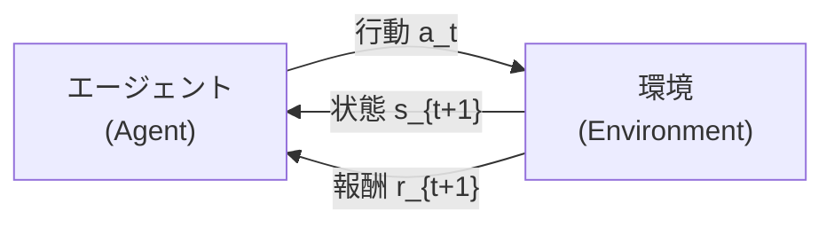
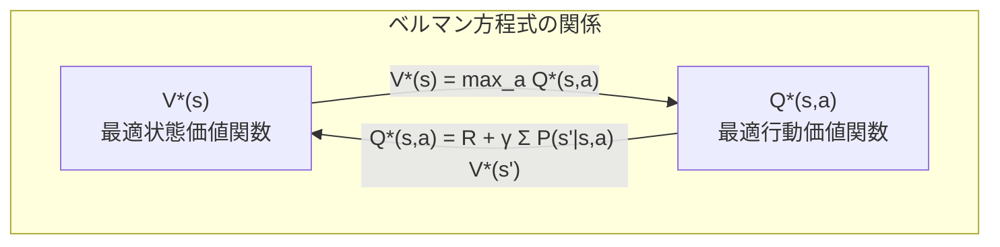
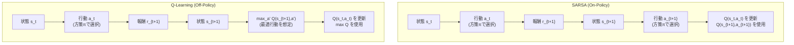
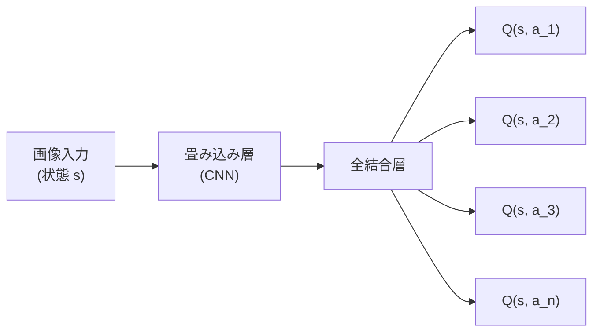
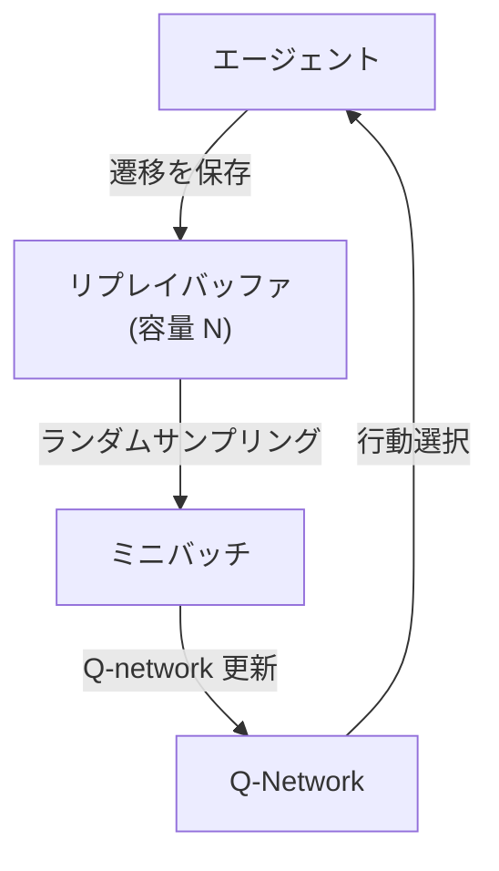
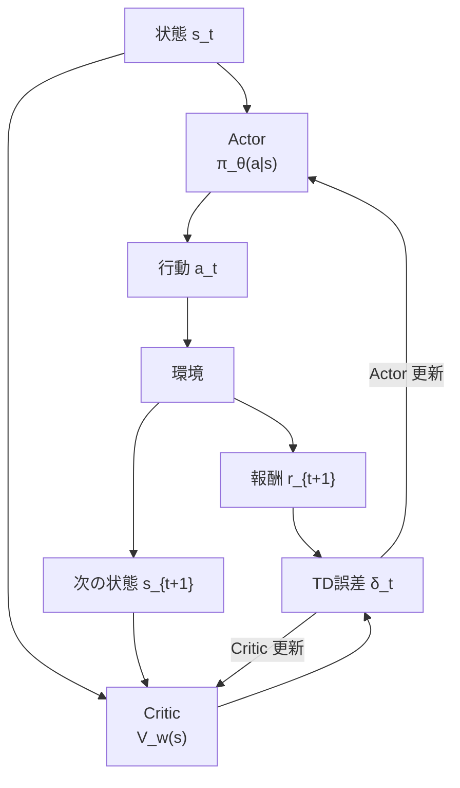
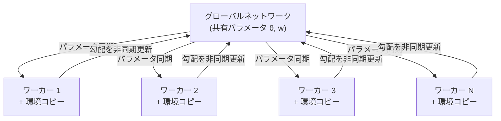
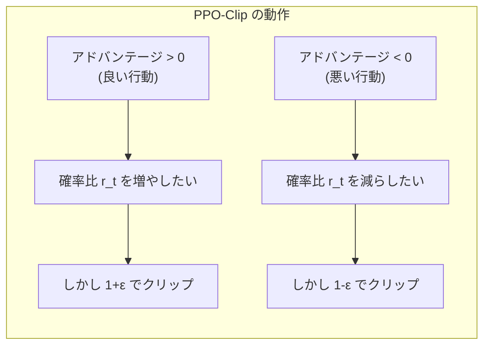
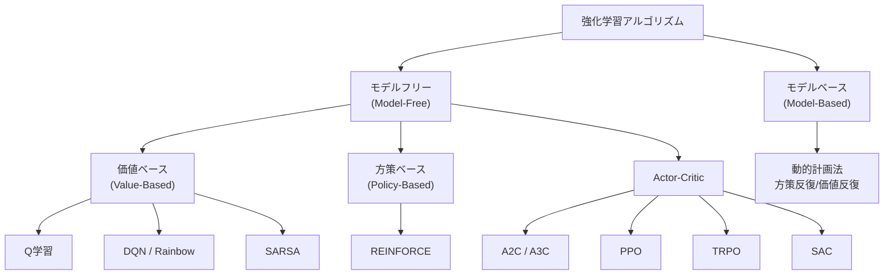
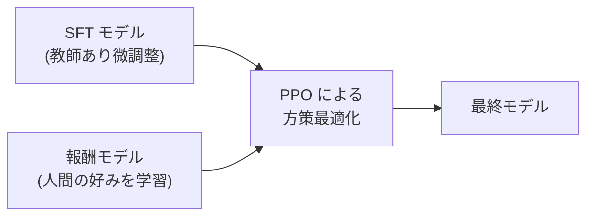

# 強化学習 — Q学習からActor-Criticまで

## 1. はじめに：強化学習とは何か

機械学習は一般に、**教師あり学習（Supervised Learning）**、**教師なし学習（Unsupervised Learning）**、そして**強化学習（Reinforcement Learning; RL）**の3つのパラダイムに分類される。教師あり学習では正解ラベル付きのデータから関数を学習し、教師なし学習ではラベルなしデータの構造を発見する。これらに対して強化学習は、根本的に異なるフレームワークを持つ。

強化学習のエッセンスは次の一文に集約される。

> **エージェント（Agent）が環境（Environment）と相互作用しながら、累積報酬（Cumulative Reward）を最大化する方策（Policy）を学習する。**

ここで重要なのは、エージェントに「正解の行動」が直接与えられるわけではないという点である。エージェントは行動を選択し、その結果として環境から報酬（あるいは罰）を受け取る。この**試行錯誤（Trial and Error）**のプロセスを通じて、どの状況でどの行動をとるべきかを学んでいく。

### 強化学習が解決する問題

強化学習が特に威力を発揮するのは、以下のような特徴を持つ問題である。

- **逐次的意思決定**: 一度の判断ではなく、時間的に連続する一連の意思決定が必要
- **遅延報酬**: 行動の良し悪しがすぐにはわからず、将来になって初めて判明する
- **環境との相互作用**: 行動が環境の状態を変化させ、次の意思決定に影響を与える
- **探索と活用のトレードオフ**: 既知の良い行動を繰り返すか、未知の行動を試して更に良い方策を発見するか

囲碁やチェスのようなゲーム、ロボットの歩行制御、自動運転車の経路計画、データセンターの省エネ制御、広告配信の最適化など、これらの特性を持つ現実世界の問題は極めて多い。

### 歴史的背景

強化学習の理論的基盤は、1950年代の動的計画法（Dynamic Programming; DP）に関する Richard Bellman の研究に遡る。1980年代後半から1990年代にかけて、Christopher Watkins による Q学習（1989年）、Ronald Williams による REINFORCE アルゴリズム（1992年）、Richard Sutton による TD学習の体系化などが行われ、強化学習の基本的なアルゴリズム群が確立された。

2013年、DeepMind が深層ニューラルネットワークと Q学習を組み合わせた **DQN（Deep Q-Network）** を発表し、Atari ゲームにおいて人間を超える性能を達成したことで、強化学習は再び大きな注目を集めた。2016年の **AlphaGo** による囲碁世界チャンピオンへの勝利は、強化学習の可能性を世界に示す歴史的な出来事となった。

## 2. マルコフ決定過程（MDP）

強化学習の問題を数学的に定式化するための標準的なフレームワークが**マルコフ決定過程（Markov Decision Process; MDP）**である。

### MDP の構成要素

MDP は以下の5つの要素の組 $(S, A, P, R, \gamma)$ で定義される。

- $S$: **状態空間（State Space）** — エージェントが取りうるすべての状態の集合
- $A$: **行動空間（Action Space）** — エージェントが選択可能なすべての行動の集合
- $P$: **状態遷移確率（Transition Probability）** — $P(s' | s, a)$ は状態 $s$ で行動 $a$ をとったとき、次の状態が $s'$ になる確率
- $R$: **報酬関数（Reward Function）** — $R(s, a, s')$ は状態 $s$ で行動 $a$ をとり状態 $s'$ に遷移したときに得られる報酬
- $\gamma$: **割引率（Discount Factor）** — $0 \le \gamma \le 1$。将来の報酬をどの程度重視するかを制御するパラメータ



### マルコフ性

MDP の「マルコフ」という名前は**マルコフ性（Markov Property）**に由来する。これは次のように定式化される。

$$P(s_{t+1} | s_t, a_t, s_{t-1}, a_{t-1}, \ldots, s_0, a_0) = P(s_{t+1} | s_t, a_t)$$

すなわち、次の状態は**現在の状態と行動のみ**に依存し、過去の履歴には依存しない。これは一見強い仮定に見えるが、状態の定義を十分に豊かにすれば（必要な履歴情報を状態に含めれば）、多くの問題をマルコフ性を満たす形で定式化できる。

### 方策と収益

**方策（Policy）**$\pi$ は、各状態においてどの行動を選択するかを規定する関数である。確率的方策の場合、$\pi(a|s)$ は状態 $s$ で行動 $a$ を選択する確率を表す。決定的方策の場合は $a = \pi(s)$ と書く。

エージェントの目標は、**期待累積割引報酬（Expected Cumulative Discounted Reward）**を最大化する方策を見つけることである。時刻 $t$ からの**収益（Return）**$G_t$ は次のように定義される。

$$G_t = r_{t+1} + \gamma r_{t+2} + \gamma^2 r_{t+3} + \cdots = \sum_{k=0}^{\infty} \gamma^k r_{t+k+1}$$

割引率 $\gamma$ の役割は重要である。$\gamma = 0$ の場合、エージェントは直近の報酬のみを考慮する近視眼的な行動をとる。$\gamma$ が 1 に近づくほど、将来の報酬を重視する長期的な計画を行う。また、$\gamma < 1$ とすることで、無限期間の問題でも収益が有限値に収束することが保証される。

### エピソードとステップ

強化学習のタスクは大きく2種類に分けられる。

- **エピソディック・タスク**: ゲームの1プレイのように、明確な終了状態（ターミナル状態）を持つ。開始から終了までを1**エピソード**と呼ぶ。
- **継続的タスク**: ロボットの制御のように、終了状態を持たず永続的に続くタスク。割引率 $\gamma < 1$ が特に重要になる。

## 3. 価値関数とベルマン方程式

MDP において方策を評価・改善するための中心概念が**価値関数（Value Function）**である。

### 状態価値関数

方策 $\pi$ に従ったときの状態 $s$ の**状態価値関数（State-Value Function）**$V^\pi(s)$ は、状態 $s$ から方策 $\pi$ に従って行動したときの期待収益として定義される。

$$V^\pi(s) = \mathbb{E}_\pi \left[ G_t \mid s_t = s \right] = \mathbb{E}_\pi \left[ \sum_{k=0}^{\infty} \gamma^k r_{t+k+1} \mid s_t = s \right]$$

### 行動価値関数

**行動価値関数（Action-Value Function）**$Q^\pi(s, a)$ は、状態 $s$ で行動 $a$ をとり、その後は方策 $\pi$ に従ったときの期待収益である。

$$Q^\pi(s, a) = \mathbb{E}_\pi \left[ G_t \mid s_t = s, a_t = a \right]$$

$V^\pi$ と $Q^\pi$ の関係は次のように書ける。

$$V^\pi(s) = \sum_{a \in A} \pi(a|s) \, Q^\pi(s, a)$$

### ベルマン期待方程式

価値関数は再帰的な構造を持つ。これを表現するのが**ベルマン期待方程式（Bellman Expectation Equation）**である。

$$V^\pi(s) = \sum_{a \in A} \pi(a|s) \left[ \sum_{s' \in S} P(s'|s,a) \left( R(s,a,s') + \gamma V^\pi(s') \right) \right]$$

行動価値関数についても同様に以下が成り立つ。

$$Q^\pi(s,a) = \sum_{s' \in S} P(s'|s,a) \left[ R(s,a,s') + \gamma \sum_{a' \in A} \pi(a'|s') \, Q^\pi(s', a') \right]$$

これらの方程式は「現在の状態の価値は、即時報酬と次の状態の（割引された）価値の期待値の和である」という直感を表現している。

### 最適価値関数とベルマン最適方程式

すべての方策の中で最大の価値を達成する方策を**最適方策（Optimal Policy）**$\pi^*$ と呼ぶ。最適方策に対応する価値関数を**最適価値関数**と呼び、以下のように定義する。

$$V^*(s) = \max_\pi V^\pi(s) = \max_a Q^*(s, a)$$

$$Q^*(s,a) = \sum_{s' \in S} P(s'|s,a) \left[ R(s,a,s') + \gamma \max_{a'} Q^*(s', a') \right]$$

上式が**ベルマン最適方程式（Bellman Optimality Equation）**である。最適方策のもとでは、各状態で常に最大の行動価値を持つ行動を選択する。



### 動的計画法

環境のモデル（$P$ と $R$）が既知の場合、ベルマン方程式を用いた動的計画法で最適方策を求めることができる。代表的なアルゴリズムは以下の2つである。

- **方策反復法（Policy Iteration）**: 方策評価（現在の方策の価値関数を計算）と方策改善（価値関数に基づき方策を更新）を交互に繰り返す
- **価値反復法（Value Iteration）**: ベルマン最適方程式の更新を繰り返すことで、直接最適価値関数を求める

しかし現実の多くの問題では、環境のモデルは未知であるか、状態空間が巨大すぎて完全な計算が不可能である。そこで**モデルフリー（Model-Free）**なアプローチが必要となる。

## 4. モンテカルロ法と TD 学習

モデルフリーな強化学習の基本的な手法として、**モンテカルロ法（Monte Carlo Method）**と**TD学習（Temporal-Difference Learning）**がある。これらは環境のモデルを必要とせず、実際の経験（サンプル）から価値関数を推定する。

### モンテカルロ法

モンテカルロ法は、エピソードが完了した後に、各状態で実際に得られた収益を平均することで価値関数を推定する。

状態 $s$ の価値推定値の更新は次のように行う。

$$V(s) \leftarrow V(s) + \alpha \left( G_t - V(s) \right)$$

ここで $\alpha$ は学習率、$G_t$ はエピソード終了まで実際に得られた収益である。

**モンテカルロ法の特徴:**

- エピソード完了後にのみ更新可能（オンライン更新不可）
- 収益 $G_t$ は実際のサンプルなので**不偏推定量（Unbiased Estimator）**
- ただし1エピソード内の報酬系列に依存するため**分散が大きい**
- 継続的タスクには直接適用できない

### TD 学習

**TD 学習**は、Richard Sutton が 1988 年に提案した手法で、モンテカルロ法と動的計画法の長所を組み合わせたアプローチである。エピソードの終了を待たず、1ステップごとに価値関数を更新できる。

最も基本的な TD(0) の更新則は次のとおりである。

$$V(s_t) \leftarrow V(s_t) + \alpha \left( r_{t+1} + \gamma V(s_{t+1}) - V(s_t) \right)$$

ここで $r_{t+1} + \gamma V(s_{t+1})$ は **TD ターゲット（TD Target）**と呼ばれ、$\delta_t = r_{t+1} + \gamma V(s_{t+1}) - V(s_t)$ は **TD 誤差（TD Error）**と呼ばれる。

**TD 学習の特徴:**

- 各ステップでオンライン更新が可能
- **ブートストラップ（Bootstrapping）**: 他の推定値 $V(s_{t+1})$ を用いて現在の推定値を更新する
- ブートストラップにより分散は小さいが、推定値を用いるためバイアスが存在する
- 継続的タスクにも適用可能

### モンテカルロ法と TD 学習の比較

| 特性 | モンテカルロ法 | TD 学習 |
|------|-------------|---------|
| 更新タイミング | エピソード終了後 | 各ステップ |
| バイアス | なし（不偏） | あり（ブートストラップ） |
| 分散 | 大きい | 小さい |
| 継続的タスク | 不可 | 可能 |
| 環境モデル | 不要 | 不要 |
| 初期値の影響 | 小さい | 大きい |

### TD($\lambda$) と適格度トレース

TD(0) は1ステップ先の推定値のみを使うが、モンテカルロ法はエピソード全体を使う。この間を連続的に補間するのが **TD($\lambda$)** である。パラメータ $\lambda \in [0, 1]$ で、$\lambda = 0$ が TD(0)、$\lambda = 1$ がモンテカルロ法に対応する。

$\lambda$-収益は、$n$ステップ収益の指数加重平均として定義される。

$$G_t^\lambda = (1 - \lambda) \sum_{n=1}^{\infty} \lambda^{n-1} G_t^{(n)}$$

ここで $G_t^{(n)} = \sum_{k=0}^{n-1} \gamma^k r_{t+k+1} + \gamma^n V(s_{t+n})$ は $n$ ステップ収益である。

実装上は**適格度トレース（Eligibility Trace）**を用いることで、TD($\lambda$) を効率的にオンラインで計算できる。適格度トレース $e_t(s)$ は最近訪問した状態ほど大きな値を持ち、TD 誤差をどの程度各状態に割り当てるかを制御する。

$$e_t(s) = \gamma \lambda \, e_{t-1}(s) + \mathbf{1}(s_t = s)$$

## 5. Q 学習と SARSA

ここまでは状態価値関数 $V(s)$ の推定について議論した。しかし、方策を直接改善するためには、行動価値関数 $Q(s, a)$ を推定する方が便利である。$Q$ 値がわかれば、各状態で $Q$ 値が最大の行動を選ぶだけで方策が得られるからだ。

### SARSA

**SARSA** は、TD 学習を行動価値関数に拡張した**オン方策（On-Policy）**アルゴリズムである。名前は更新に使用する5つの要素 $(S_t, A_t, R_{t+1}, S_{t+1}, A_{t+1})$ の頭文字に由来する。

更新則は次のとおりである。

$$Q(s_t, a_t) \leftarrow Q(s_t, a_t) + \alpha \left( r_{t+1} + \gamma Q(s_{t+1}, a_{t+1}) - Q(s_t, a_t) \right)$$

ここで $a_{t+1}$ は、実際に方策 $\pi$ に従って選択された行動である。SARSA は「現在の方策が実際にとる行動」に基づいて $Q$ 値を更新するため、オン方策と呼ばれる。

### Q 学習

**Q 学習（Q-Learning）**は Christopher Watkins が 1989 年に提案した**オフ方策（Off-Policy）**アルゴリズムで、強化学習の歴史における最も重要なブレークスルーのひとつである。

更新則は次のとおりである。

$$Q(s_t, a_t) \leftarrow Q(s_t, a_t) + \alpha \left( r_{t+1} + \gamma \max_{a'} Q(s_{t+1}, a') - Q(s_t, a_t) \right)$$

SARSA との決定的な違いは、次の状態 $s_{t+1}$ での行動について、**実際にとった行動ではなく、最大の $Q$ 値を持つ行動**を使用する点である。これにより、Q 学習は探索のために非最適な行動をとっていても、最適行動価値関数 $Q^*$ を直接学習できる。

### オン方策 vs オフ方策



この違いは、実用上以下のような影響をもたらす。

- **SARSA（オン方策）**: 探索方策自体の価値を学習するため、探索中のリスクも考慮した「安全な」方策を学びやすい。例えば崖の縁を歩くタスクでは、崖に落ちるリスクを避ける経路を学習する傾向がある。
- **Q 学習（オフ方策）**: 最適方策の価値を直接学習するため、探索方策とは独立に最適な $Q$ 値を推定できる。しかし、崖際の最短経路のように、リスクを無視した攻撃的な方策を学ぶ可能性がある。

### $\epsilon$-greedy 方策

Q 学習や SARSA では、行動選択に**$\epsilon$-greedy 方策**がよく用いられる。

$$\pi(a|s) = \begin{cases} 1 - \epsilon + \frac{\epsilon}{|A|} & \text{if } a = \arg\max_{a'} Q(s, a') \\ \frac{\epsilon}{|A|} & \text{otherwise} \end{cases}$$

確率 $1 - \epsilon$ で現在の $Q$ 値に基づく最良の行動（**活用; Exploitation**）を選び、確率 $\epsilon$ でランダムな行動（**探索; Exploration**）を選ぶ。$\epsilon$ を学習の進行に伴い徐々に減少させることで、探索と活用のバランスをとる。

### テーブル型 Q 学習の実装例

テーブル型 Q 学習の擬似コードを示す。

```python
import numpy as np

def q_learning(env, num_episodes, alpha=0.1, gamma=0.99, epsilon=0.1):
    # Initialize Q-table with zeros
    Q = np.zeros((env.num_states, env.num_actions))

    for episode in range(num_episodes):
        state = env.reset()
        done = False

        while not done:
            # Epsilon-greedy action selection
            if np.random.random() < epsilon:
                action = np.random.randint(env.num_actions)
            else:
                action = np.argmax(Q[state])

            # Take action, observe next state and reward
            next_state, reward, done = env.step(action)

            # Q-learning update
            td_target = reward + gamma * np.max(Q[next_state]) * (1 - done)
            td_error = td_target - Q[state, action]
            Q[state, action] += alpha * td_error

            state = next_state

    return Q
```

### テーブル型手法の限界

テーブル型の Q 学習は、状態と行動の全ペアに対して $Q$ 値を表形式で保持する。状態空間や行動空間が小さい問題では十分に機能するが、以下のような場合に破綻する。

- **高次元の状態空間**: 画像入力（例えば $210 \times 160$ ピクセルのAtari画面）では、状態数は天文学的な数になる
- **連続的な状態空間**: ロボットの関節角度のように連続値をとる場合、テーブルの離散化が困難
- **汎化の欠如**: テーブル型では、訪問したことのない状態に対する $Q$ 値の推定ができない

これらの限界を克服するために、関数近似を用いた手法が開発された。

## 6. 深層 Q 学習（DQN）

テーブルの代わりに**ニューラルネットワーク**を用いて $Q$ 関数を近似する手法が**深層 Q 学習（Deep Q-Network; DQN）**である。2013年に DeepMind（Mnih ら）が発表し、2015年に Nature 誌に掲載された論文は、深層強化学習の時代を開いた記念碑的な研究である。

### DQN のアイデア

テーブル型 Q 学習では $Q(s, a)$ をテーブルに格納していたが、DQN ではパラメータ $\theta$ を持つニューラルネットワーク $Q(s, a; \theta)$ で $Q$ 関数を近似する。



入力は状態 $s$（Atariゲームの場合は画像のピクセル値）、出力は各行動 $a$ に対応する $Q$ 値のベクトルである。この設計により、1回のフォワードパスで全行動の $Q$ 値を同時に得られる。

### 素朴なアプローチの問題点

Q 学習の更新則をそのままニューラルネットワークに適用すると、学習が極めて不安定になる。主な原因は以下の2つである。

**1. 経験の相関**

連続するステップの遷移 $(s_t, a_t, r_{t+1}, s_{t+1})$ は強く相関している。確率的勾配降下法（SGD）は、学習サンプルが独立同分布（i.i.d.）であることを前提としているため、相関の強いデータで学習すると収束しない。

**2. 非定常なターゲット**

TD ターゲット $r + \gamma \max_{a'} Q(s', a'; \theta)$ は、学習対象のパラメータ $\theta$ 自体に依存している。パラメータを更新するたびにターゲットも変化するため、「動く標的を追いかける」状況になり、学習の発散を引き起こす。

### DQN の2つのイノベーション

DQN はこれらの問題に対して、2つの重要な技法を導入した。

#### 経験再生（Experience Replay）

エージェントが経験した遷移 $(s_t, a_t, r_{t+1}, s_{t+1})$ を**リプレイバッファ（Replay Buffer）**と呼ばれるメモリに蓄積し、学習時にはバッファからランダムにミニバッチをサンプリングして使用する。



これにより以下の利点が得られる。

- 連続するサンプル間の相関が破壊され、i.i.d. の仮定に近づく
- 過去の経験を何度も再利用できるため、データ効率が向上する
- レアだが重要な遷移を繰り返し学習できる

#### ターゲットネットワーク（Target Network）

$Q$ 値の更新ターゲットの計算に、メインネットワークとは別の**ターゲットネットワーク** $Q(s, a; \theta^-)$ を用いる。ターゲットネットワークのパラメータ $\theta^-$ は、一定ステップごとにメインネットワークのパラメータ $\theta$ をコピーして更新する。

損失関数は次のように定義される。

$$L(\theta) = \mathbb{E}_{(s,a,r,s') \sim \mathcal{D}} \left[ \left( r + \gamma \max_{a'} Q(s', a'; \theta^-) - Q(s, a; \theta) \right)^2 \right]$$

ターゲットネットワークのパラメータ $\theta^-$ は一定期間固定されるため、TD ターゲットの変動が抑制され、学習が安定化する。

### DQN の改良

DQN の成功以降、多くの改良が提案された。

**Double DQN**: 通常の DQN は $\max$ 操作により $Q$ 値を過大評価する傾向がある。Double DQN では、行動の選択と評価を別のネットワークで行うことでこの問題を軽減する。

$$y = r + \gamma Q(s', \arg\max_{a'} Q(s', a'; \theta); \theta^-)$$

**Dueling DQN**: $Q(s, a)$ を、状態の価値 $V(s)$ と行動のアドバンテージ $A(s, a)$ に分解するアーキテクチャ。

$$Q(s, a; \theta) = V(s; \theta) + A(s, a; \theta) - \frac{1}{|A|} \sum_{a'} A(s, a'; \theta)$$

多くの状態では行動の選択が価値に大きな影響を与えないため、この分解により学習効率が向上する。

**Prioritized Experience Replay**: TD 誤差の大きい遷移を優先的にサンプリングすることで、学習効率を改善する。

**Rainbow**: 上記を含む6つの改良を統合したアルゴリズムで、個々の改良の相乗効果により大幅な性能向上を達成した。

### DQN の限界

DQN は離散的な行動空間を持つ問題に対して大きな成功を収めたが、以下の限界がある。

- **連続行動空間への適用が困難**: $\max_{a'} Q(s', a')$ の計算が、行動空間が連続の場合には困難
- **確率的方策の学習が困難**: DQN は本質的に決定的な方策を出力する
- **探索の限界**: $\epsilon$-greedy は高次元行動空間では非効率

これらの限界を克服する別のアプローチが、次に述べる方策勾配法である。

## 7. 方策勾配法（Policy Gradient）

DQN を含む価値ベースの手法は、価値関数を推定してから間接的に方策を導出する。これに対して**方策勾配法（Policy Gradient Method）**は、方策 $\pi_\theta(a|s)$ をパラメータ $\theta$ で直接パラメトライズし、$\theta$ を勾配法で最適化するアプローチである。

### 方策を直接最適化する利点

方策勾配法には以下の利点がある。

1. **連続行動空間への自然な対応**: 方策がガウス分布などの連続分布として表現できるため、ロボット制御のような連続行動問題に直接適用可能
2. **確率的方策の学習**: じゃんけんのように確率的な方策が最適な場合にも対応できる
3. **方策の滑らかな改善**: $\theta$ の小さな変化が方策の小さな変化に対応するため、学習が安定しやすい

### 方策勾配定理

方策 $\pi_\theta$ の性能指標として、初期状態からの期待収益を定義する。

$$J(\theta) = \mathbb{E}_{\tau \sim \pi_\theta} \left[ \sum_{t=0}^{T} \gamma^t r_{t+1} \right]$$

ここで $\tau = (s_0, a_0, r_1, s_1, a_1, r_2, \ldots)$ は方策 $\pi_\theta$ に従って生成された軌跡（Trajectory）である。

**方策勾配定理（Policy Gradient Theorem）**は、$J(\theta)$ の勾配を以下の形で表現する。

$$\nabla_\theta J(\theta) = \mathbb{E}_{\pi_\theta} \left[ \nabla_\theta \log \pi_\theta(a_t | s_t) \, Q^{\pi_\theta}(s_t, a_t) \right]$$

この定理の重要性は、方策の勾配が**状態分布の微分を含まない**ことにある。状態分布 $d^\pi(s)$ はパラメータ $\theta$ に依存するが、勾配の計算にはその微分が不要であり、サンプルベースの推定が可能になる。

直感的には、$\nabla_\theta \log \pi_\theta(a_t | s_t)$ は「行動 $a_t$ の確率を増やす方向」を示し、$Q^{\pi_\theta}(s_t, a_t)$ はその行動がどれだけ良いかを表す。よって、良い結果をもたらした行動の確率を増やし、悪い結果をもたらした行動の確率を減らす方向にパラメータが更新される。

### REINFORCE アルゴリズム

**REINFORCE**（Ronald Williams, 1992）は、方策勾配定理に基づく最もシンプルなアルゴリズムである。$Q^{\pi_\theta}(s_t, a_t)$ の代わりに、実際のエピソードで得られた収益 $G_t$ を使用する（モンテカルロ推定）。

$$\nabla_\theta J(\theta) \approx \frac{1}{N} \sum_{i=1}^{N} \sum_{t=0}^{T} \nabla_\theta \log \pi_\theta(a_t^{(i)} | s_t^{(i)}) \, G_t^{(i)}$$

パラメータ更新は次のように行う。

$$\theta \leftarrow \theta + \alpha \nabla_\theta J(\theta)$$

```python
def reinforce(env, policy_network, num_episodes, alpha=0.001, gamma=0.99):
    optimizer = torch.optim.Adam(policy_network.parameters(), lr=alpha)

    for episode in range(num_episodes):
        states, actions, rewards = [], [], []
        state = env.reset()
        done = False

        # Collect one episode
        while not done:
            probs = policy_network(state)
            dist = torch.distributions.Categorical(probs)
            action = dist.sample()

            next_state, reward, done = env.step(action.item())

            states.append(state)
            actions.append(action)
            rewards.append(reward)

            state = next_state

        # Compute returns
        returns = []
        G = 0
        for r in reversed(rewards):
            G = r + gamma * G
            returns.insert(0, G)
        returns = torch.tensor(returns)

        # Normalize returns for stability
        returns = (returns - returns.mean()) / (returns.std() + 1e-8)

        # Compute policy gradient loss
        loss = 0
        for log_prob, G_t in zip(
            [torch.distributions.Categorical(policy_network(s)).log_prob(a)
             for s, a in zip(states, actions)],
            returns
        ):
            loss -= log_prob * G_t

        # Update policy
        optimizer.zero_grad()
        loss.backward()
        optimizer.step()
```

### ベースライン（分散削減）

REINFORCE の大きな問題は**分散が非常に大きい**ことである。$G_t$ の値はエピソードごとに大きく変動するため、勾配の推定が不安定になる。

この分散を削減する標準的な手法が**ベースライン（Baseline）**の導入である。方策勾配の式から、状態にのみ依存する任意の関数 $b(s_t)$ を引いても、勾配の期待値は変わらない（不偏性が保たれる）ことが証明できる。

$$\nabla_\theta J(\theta) = \mathbb{E}_{\pi_\theta} \left[ \nabla_\theta \log \pi_\theta(a_t | s_t) \left( Q^{\pi_\theta}(s_t, a_t) - b(s_t) \right) \right]$$

最も一般的なベースラインは状態価値関数 $V^{\pi_\theta}(s_t)$ であり、この場合 $Q^{\pi_\theta}(s_t, a_t) - V^{\pi_\theta}(s_t)$ は**アドバンテージ関数（Advantage Function）**$A^{\pi_\theta}(s_t, a_t)$ と呼ばれる。

$$A^{\pi_\theta}(s_t, a_t) = Q^{\pi_\theta}(s_t, a_t) - V^{\pi_\theta}(s_t)$$

アドバンテージ関数は「その行動が平均と比べてどれだけ良いか」を表し、正なら平均以上、負なら平均以下の行動であることを示す。ベースラインの導入により、すべての行動が一律に強化される問題が解消され、勾配推定の分散が劇的に改善される。

## 8. Actor-Critic 法

方策勾配法の分散問題とベースラインの有用性は、自然に**Actor-Critic 法**というアーキテクチャへとつながる。Actor-Critic は、方策（Actor）と価値関数（Critic）の2つのコンポーネントを同時に学習するフレームワークである。

### 基本的な Actor-Critic

Actor-Critic のアイデアは次のとおりである。

- **Actor（方策）**: パラメータ $\theta$ を持つ方策 $\pi_\theta(a|s)$。行動を選択する。
- **Critic（価値関数）**: パラメータ $w$ を持つ価値関数 $V_w(s)$（または $Q_w(s, a)$）。Actor の行動を評価する。



Critic は TD 学習で価値関数を更新し、Actor は Critic の出力（TD 誤差）を用いて方策を更新する。

**更新則:**

TD 誤差: $\delta_t = r_{t+1} + \gamma V_w(s_{t+1}) - V_w(s_t)$

Critic 更新: $w \leftarrow w + \alpha_w \delta_t \nabla_w V_w(s_t)$

Actor 更新: $\theta \leftarrow \theta + \alpha_\theta \delta_t \nabla_\theta \log \pi_\theta(a_t | s_t)$

TD 誤差 $\delta_t$ はアドバンテージ関数の不偏推定量であることが示せる。すなわち $\mathbb{E}[\delta_t | s_t, a_t] = A^{\pi_\theta}(s_t, a_t)$ が成り立つ。

### REINFORCE との比較

| 特性 | REINFORCE | Actor-Critic |
|------|-----------|-------------|
| 収益の推定 | モンテカルロ（エピソード全体） | TD 学習（ブートストラップ） |
| 更新タイミング | エピソード終了後 | 各ステップ |
| バイアス | なし | あり |
| 分散 | 大きい | 小さい |
| 継続的タスク | 不可 | 可能 |

### A2C（Advantage Actor-Critic）

**A2C** は Actor-Critic の基本形を安定させた手法で、以下の特徴を持つ。

- 複数のワーカー（環境コピー）を**同期的に**並列実行してサンプルを収集
- 各ワーカーのデータを集約して1回の更新を行う
- $n$ステップ収益を用いることで、バイアスと分散のバランスをとる

$n$ステップのアドバンテージ推定:

$$\hat{A}_t = \sum_{k=0}^{n-1} \gamma^k r_{t+k+1} + \gamma^n V_w(s_{t+n}) - V_w(s_t)$$

損失関数は方策損失、価値損失、エントロピーボーナスの3つから構成される。

$$L = L_{\text{policy}} + c_1 L_{\text{value}} - c_2 H(\pi_\theta)$$

- $L_{\text{policy}} = -\mathbb{E}_t [\log \pi_\theta(a_t|s_t) \hat{A}_t]$: 方策の損失
- $L_{\text{value}} = \mathbb{E}_t [(V_w(s_t) - G_t)^2]$: 価値関数の損失
- $H(\pi_\theta) = -\sum_a \pi_\theta(a|s) \log \pi_\theta(a|s)$: エントロピー項（探索を促進）

### A3C（Asynchronous Advantage Actor-Critic）

**A3C**（Mnih ら, 2016）は A2C の非同期版で、以下のアーキテクチャを持つ。



各ワーカーは独立に環境と相互作用し、ローカルに勾配を計算してグローバルネットワークに非同期的に適用する。非同期性により以下の利点がある。

- 経験再生なしでも学習サンプルの相関を破壊できる（各ワーカーが異なる状態にいるため）
- マルチコアCPUを効率的に活用できる
- GPU なしでも高速に学習可能

ただし実際には、同期版の A2C のほうが GPU の利用効率が高く、実装も容易であるため、現在では A2C が主流となっている。

### GAE（Generalized Advantage Estimation）

アドバンテージ関数の推定には、$n$ステップ推定のステップ数 $n$ の選択が重要であり、バイアスと分散のトレードオフが存在する。**GAE（Generalized Advantage Estimation）**（Schulman ら, 2016）は、TD($\lambda$) のアイデアをアドバンテージ推定に適用し、このトレードオフを滑らかに制御する。

$$\hat{A}_t^{\text{GAE}(\gamma, \lambda)} = \sum_{l=0}^{\infty} (\gamma \lambda)^l \delta_{t+l}$$

ここで $\delta_t = r_{t+1} + \gamma V_w(s_{t+1}) - V_w(s_t)$ は各ステップの TD 誤差である。$\lambda = 0$ のとき1ステップ TD 推定（低分散・高バイアス）、$\lambda = 1$ のときモンテカルロ推定（高分散・低バイアス）に対応する。実用的には $\lambda = 0.95$ 程度がよく使われる。

## 9. PPO（Proximal Policy Optimization）

**PPO（Proximal Policy Optimization）**は、John Schulman らが 2017 年に OpenAI から発表したアルゴリズムで、現在最も広く使われている強化学習アルゴリズムのひとつである。PPO は Actor-Critic の枠組みをベースとしながら、方策更新の安定性を大幅に改善した。

### TRPO からの発展

PPO の前身である**TRPO（Trust Region Policy Optimization）**（Schulman ら, 2015）は、方策更新の幅を KL ダイバージェンスで制約するアプローチである。

$$\max_\theta \quad \mathbb{E}_t \left[ \frac{\pi_\theta(a_t|s_t)}{\pi_{\theta_{\text{old}}}(a_t|s_t)} \hat{A}_t \right] \quad \text{s.t.} \quad \mathbb{E}_t \left[ D_{\text{KL}}(\pi_{\theta_{\text{old}}} \| \pi_\theta) \right] \le \delta$$

TRPO は理論的に方策の単調改善を保証するが、実装が複雑であり（二次最適化、共役勾配法が必要）、計算コストも高い。PPO は TRPO と同等の性能を、はるかにシンプルな実装で達成することを目指した。

### PPO-Clip

PPO の最も一般的な変種は **PPO-Clip** であり、確率比（Probability Ratio）のクリッピングにより方策更新を制約する。

確率比を次のように定義する。

$$r_t(\theta) = \frac{\pi_\theta(a_t | s_t)}{\pi_{\theta_{\text{old}}}(a_t | s_t)}$$

PPO-Clip の目的関数は以下のとおりである。

$$L^{\text{CLIP}}(\theta) = \mathbb{E}_t \left[ \min \left( r_t(\theta) \hat{A}_t, \, \text{clip}(r_t(\theta), 1-\epsilon, 1+\epsilon) \hat{A}_t \right) \right]$$

ここで $\epsilon$ はクリッピングの幅（通常 $\epsilon = 0.2$）である。

この目的関数の直感は次のとおりである。

- $\hat{A}_t > 0$（良い行動）の場合: $r_t$ を $1 + \epsilon$ 以上に増やしても利得が増えない（クリップされる）。方策の急激な変更が抑制される。
- $\hat{A}_t < 0$（悪い行動）の場合: $r_t$ を $1 - \epsilon$ 以下に減らしても損失が減らない。やはり急激な変更が抑制される。



### PPO の学習ループ

PPO の典型的な学習ループは以下のとおりである。

1. 現在の方策 $\pi_{\theta_{\text{old}}}$ で $T$ ステップ分のデータを複数の並列環境から収集
2. GAE を用いてアドバンテージ $\hat{A}_t$ を計算
3. 収集したデータに対して、$K$ エポック（通常 3〜10）のミニバッチ SGD で $L^{\text{CLIP}}$ を最適化
4. $\theta_{\text{old}} \leftarrow \theta$ として手順1に戻る

```python
def ppo_update(policy, value_net, buffer, clip_epsilon=0.2,
               epochs=10, gamma=0.99, lam=0.95):
    states, actions, rewards, dones, old_log_probs, values = buffer.get()

    # Compute GAE advantages
    advantages = compute_gae(rewards, values, dones, gamma, lam)
    returns = advantages + values

    # Normalize advantages
    advantages = (advantages - advantages.mean()) / (advantages.std() + 1e-8)

    for epoch in range(epochs):
        for batch in minibatch_iterator(states, actions, old_log_probs,
                                         advantages, returns):
            s, a, old_lp, adv, ret = batch

            # Current policy evaluation
            dist = policy(s)
            new_log_prob = dist.log_prob(a)
            entropy = dist.entropy().mean()

            # Probability ratio
            ratio = torch.exp(new_log_prob - old_lp)

            # Clipped surrogate objective
            surr1 = ratio * adv
            surr2 = torch.clamp(ratio, 1 - clip_epsilon, 1 + clip_epsilon) * adv
            policy_loss = -torch.min(surr1, surr2).mean()

            # Value function loss
            value_loss = F.mse_loss(value_net(s).squeeze(), ret)

            # Total loss
            loss = policy_loss + 0.5 * value_loss - 0.01 * entropy

            optimizer.zero_grad()
            loss.backward()
            nn.utils.clip_grad_norm_(parameters, max_norm=0.5)
            optimizer.step()
```

### PPO が広く採用される理由

PPO は以下の特性により、実用的な強化学習のデファクトスタンダードとなった。

- **実装の容易さ**: TRPO と異なり、一次最適化のみで実装可能
- **ハイパーパラメータのロバスト性**: 広範な問題に対して同じハイパーパラメータで合理的な性能を発揮
- **サンプル効率と安定性のバランス**: オン方策手法としては高いサンプル効率
- **汎用性**: 離散行動空間にも連続行動空間にも適用可能

PPO は OpenAI Five（Dota 2）、OpenAI のロボット操作研究、そして ChatGPT に代表される RLHF（Reinforcement Learning from Human Feedback）など、多くの実用的なプロジェクトで中核的な役割を果たしている。

## 10. 手法の分類と全体像

ここまで紹介した手法を分類し、全体像を整理する。



### 価値ベース vs 方策ベース vs Actor-Critic

| 特性 | 価値ベース | 方策ベース | Actor-Critic |
|------|-----------|-----------|-------------|
| 行動空間 | 離散のみ | 離散/連続 | 離散/連続 |
| 方策の種類 | 決定的（暗黙的） | 確率的 | 確率的 |
| 更新 | 各ステップ | エピソード終了後 | 各ステップ |
| 分散 | 低い | 高い | 中程度 |
| バイアス | あり | なし | あり |
| 代表手法 | Q学習, DQN | REINFORCE | A2C, PPO, SAC |

### オン方策 vs オフ方策

- **オン方策（On-Policy）**: 学習に使うデータと行動方策が同一。SARSA, A2C, PPO
- **オフ方策（Off-Policy）**: 学習に使うデータと行動方策が異なる。Q学習, DQN, SAC

オフ方策手法はデータ効率が高い（過去のデータを再利用可能）が、学習の安定性に課題がある。オン方策手法は安定的だが、データを収集するたびに捨てる必要があるためサンプル効率が低い。

## 11. 実応用と近年の発展

### RLHF — 大規模言語モデルへの応用

強化学習が最も社会的インパクトを持った応用のひとつが、**RLHF（Reinforcement Learning from Human Feedback）**である。ChatGPT や Claude などの大規模言語モデル（LLM）の学習パイプラインにおいて、人間の好みに沿った応答を生成するために PPO などの強化学習アルゴリズムが利用されている。

RLHF の典型的なパイプラインは以下のとおりである。

1. **教師あり微調整（SFT）**: 人間が作成した良質な応答データでモデルを微調整
2. **報酬モデルの学習**: 人間の好みのランキングデータから報酬モデルを学習
3. **PPO による最適化**: 報酬モデルをフィードバックとして、LLM の方策を PPO で最適化



近年は PPO の代替として、**DPO（Direct Preference Optimization）** のように報酬モデルを明示的に学習せず、人間の好みから直接方策を最適化する手法も登場している。

### ゲーム AI

- **AlphaGo / AlphaZero**: モンテカルロ木探索（MCTS）と深層強化学習の組み合わせにより、囲碁、チェス、将棋で超人的な性能を達成
- **OpenAI Five**: PPO を用いて Dota 2 のプロチーム級の性能を実現
- **MuZero**: 環境モデルも学習するモデルベース手法で、ルールを知らない状態からゲームをプレイ

### ロボティクス

- **Sim-to-Real Transfer**: シミュレーション環境で方策を学習し、実環境のロボットに転移
- **Domain Randomization**: シミュレーションのパラメータをランダム化して、実環境へのロバスト性を獲得
- **器用な物体操作**: OpenAI のロボットハンドによるルービックキューブ解きなどの成果

### その他の応用

- **自動運転**: シミュレーション環境での経路計画と意思決定
- **チップ設計**: Google が強化学習を用いた半導体チップの配置最適化を実現
- **エネルギー最適化**: DeepMind のデータセンター冷却最適化で約40%のエネルギー削減
- **医療**: 治療方針の最適化、薬物投与量の制御

## 12. 課題と今後の方向性

### 現在の主要な課題

**1. サンプル効率**

強化学習は依然として大量のサンプル（環境との相互作用）を必要とする。例えば Atari ゲームでは数千万フレーム、複雑なロボット制御では数十億ステップの学習が必要な場合がある。これはシミュレーション環境では許容できても、実環境での学習には致命的な障壁となる。

**2. 報酬関数の設計**

適切な報酬関数の設計は困難であり、意図しない行動（**報酬ハッキング; Reward Hacking**）を引き起こすリスクがある。エージェントが報酬を最大化するために、設計者が意図しない抜け道を見つけてしまう問題は、強化学習の実用化において深刻な課題である。

**3. 安全性と信頼性**

学習中に危険な行動をとるリスクがあるため、実世界への直接適用は困難である。**Safe RL（安全な強化学習）**の研究が進んでいるが、安全性を保証しながら効率的に学習する手法はまだ発展途上にある。

**4. 汎化**

学習環境に過適合し、わずかに異なる環境では性能が大幅に低下する問題がある。環境の微小な変化に対してもロバストに動作する**汎化能力**の獲得は、重要な研究テーマである。

### 今後の方向性

**モデルベース強化学習の発展**

環境のダイナミクスモデルを学習し、そのモデル内でシミュレーション（計画）を行うアプローチは、サンプル効率の大幅な改善を期待できる。**World Models**、**Dreamer** シリーズ、**MuZero** などの研究が精力的に進められている。

**オフライン強化学習**

過去に蓄積されたデータセットから、追加の環境相互作用なしに方策を学習する**オフライン強化学習（Offline RL / Batch RL）**は、医療や金融など試行錯誤が許されない領域での応用に期待されている。**CQL（Conservative Q-Learning）**や **Decision Transformer** が代表的な手法である。

**基盤モデルと強化学習の融合**

大規模言語モデルや Vision-Language Model を方策の初期化や報酬信号として活用するアプローチが注目されている。言語で記述された目標に基づいてロボットを制御するなど、基盤モデルのもつ広範な世界知識を強化学習に活かす研究が急速に進展している。

**マルチエージェント強化学習**

複数のエージェントが協調・競争する環境での強化学習は、自動運転や市場設計など多くの実問題に関連する。通信、役割分担、創発的行動の理解など、単一エージェントにはない固有の課題がある。

## 13. まとめ

本記事では、強化学習の基礎理論から最先端のアルゴリズムまでを体系的に解説した。

- **MDP** は強化学習の数学的基盤であり、エージェントと環境の相互作用を状態、行動、報酬、遷移確率、割引率で定式化する
- **ベルマン方程式** は価値関数の再帰的構造を表し、動的計画法の基盤となる
- **モンテカルロ法と TD 学習** はモデルフリーな価値推定の基本手法であり、バイアスと分散のトレードオフが存在する
- **Q 学習** はオフ方策 TD 学習の代表格で、最適行動価値関数を直接学習する
- **DQN** はニューラルネットワークによる関数近似、経験再生、ターゲットネットワークを組み合わせ、高次元状態空間への適用を可能にした
- **方策勾配法（REINFORCE）** は方策を直接最適化するアプローチで、連続行動空間に自然に対応するが分散が大きい
- **Actor-Critic** は方策と価値関数を同時に学習することで、方策勾配法の分散を削減する
- **PPO** はクリッピングによる安定した方策更新を実現し、実用的な強化学習のデファクトスタンダードとなった

強化学習は、ゲーム AI から大規模言語モデルの整合化（Alignment）まで、幅広い領域で成果を上げている。サンプル効率、安全性、汎化能力などの課題は残されているが、モデルベース手法、オフライン学習、基盤モデルとの融合など、活発な研究が進んでおり、今後も応用範囲が拡大していくことは間違いない。

## 参考文献

- Sutton, R. S., & Barto, A. G. (2018). *Reinforcement Learning: An Introduction* (2nd ed.). MIT Press.
- Watkins, C. J. C. H. (1989). *Learning from Delayed Rewards*. PhD thesis, University of Cambridge.
- Mnih, V., et al. (2015). Human-level control through deep reinforcement learning. *Nature*, 518, 529-533.
- Williams, R. J. (1992). Simple statistical gradient-following algorithms for connectionist reinforcement learning. *Machine Learning*, 8, 229-256.
- Schulman, J., et al. (2017). Proximal Policy Optimization Algorithms. *arXiv:1707.06347*.
- Schulman, J., et al. (2016). High-Dimensional Continuous Control Using Generalized Advantage Estimation. *ICLR 2016*.
- Mnih, V., et al. (2016). Asynchronous Methods for Deep Reinforcement Learning. *ICML 2016*.
