# SSR, SSG, ISR, Streaming SSR — レンダリング手法の比較

## 1. 背景 — なぜレンダリング戦略が問題になるのか

### 1.1 Webアプリケーションの進化とHTMLの配信

Webの黎明期、サーバーは静的なHTMLファイルをそのまま配信していた。やがてCGIやPHPのようなサーバーサイド技術が登場し、リクエストのたびにHTMLを動的に生成するようになった。この時代のWebアプリケーションは、ページ遷移のたびにサーバーへリクエストを送り、完全なHTMLを受け取って画面全体を再描画するという、いわゆる**MPA（Multi-Page Application）**のモデルに基づいていた。

2000年代後半からAjaxの普及とともにリッチなクライアントサイドアプリケーションが台頭し、2010年代にはAngularJS、Backbone.js、Ember.jsといったフレームワークが登場した。これらは**SPA（Single-Page Application）**というアーキテクチャを推進し、初回ロード時にJavaScriptバンドルをダウンロードした後はクライアント側でルーティングとレンダリングを行う方式が主流となった。

しかし、SPAの普及に伴い、いくつかの深刻な課題が表面化した。

### 1.2 CSRの限界

SPAの中核をなす**CSR（Client-Side Rendering）**は、すべてのレンダリングをブラウザ上のJavaScriptで行う。この方式には以下の本質的な問題がある。

**初期表示速度の問題**: ユーザーがページにアクセスすると、まず空の（もしくは最小限のHTMLシェルの）HTMLを受け取り、JavaScriptバンドルのダウンロード・パース・実行が完了してはじめてコンテンツが画面に表示される。この間、ユーザーは白い画面やローディングスピナーを見続けることになる。

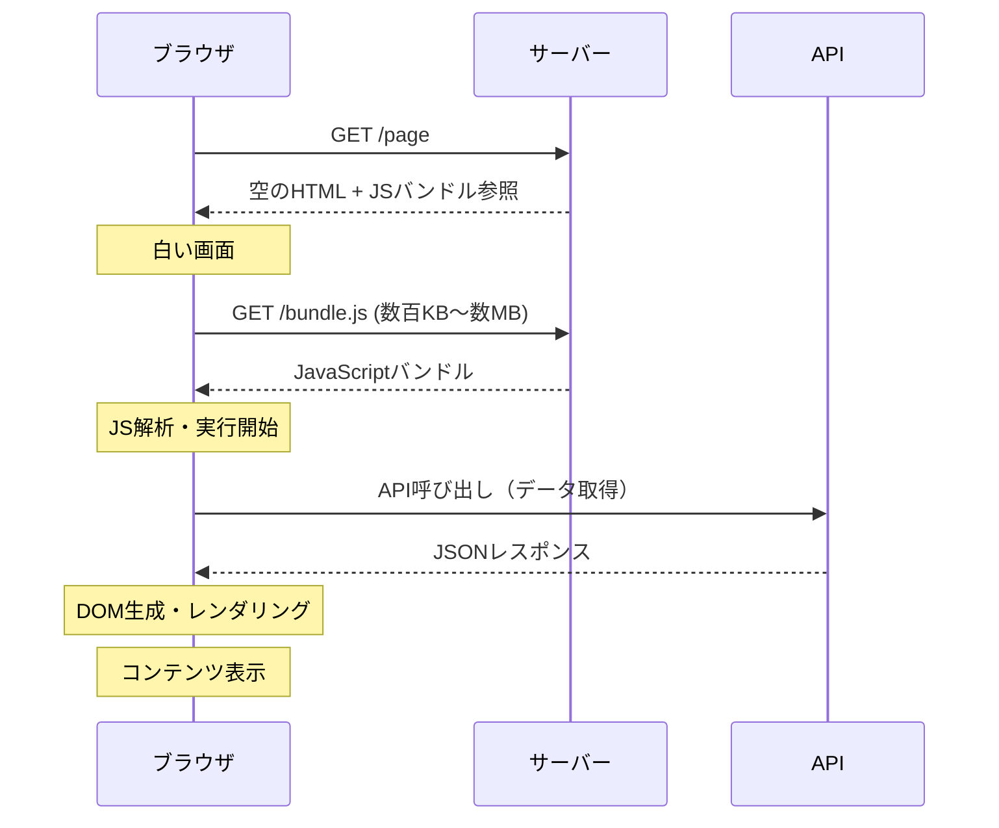

**SEOの問題**: 検索エンジンのクローラーは、JavaScriptを実行しないか、実行が限定的なケースが多い。GoogleのクローラーはJavaScriptをレンダリングできるが、インデックス登録までに遅延が生じることがあり、他の検索エンジン（Bingなど）ではさらに制約が大きい。ソーシャルメディアのOGPプレビュー（Open Graph Protocol）もJavaScriptを実行しないため、CSRのみのサイトではリンクシェア時にプレビューが正しく表示されない。

**パフォーマンス指標への影響**: Googleが重視するCore Web Vitalsの中でも、**LCP（Largest Contentful Paint）**と**FCP（First Contentful Paint）**はCSRで悪化しやすい。JavaScriptの実行完了を待たなければコンテンツが表示されないため、特にモバイルデバイスや低速なネットワーク環境でのユーザー体験が大きく損なわれる。

### 1.3 レンダリング戦略の多様化

これらの課題に対処するため、Webのレンダリング戦略は多様化してきた。サーバー側でHTMLを生成するSSR、ビルド時にHTMLを生成するSSG、SSGを拡張するISR、Reactの新機能を活用したStreaming SSR、そしてこれらを組み合わせるPartial Prerenderingなど、さまざまなアプローチが提案されている。

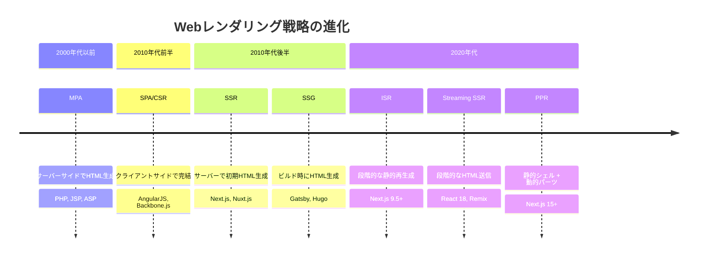

それぞれの手法は異なるトレードオフを持ち、アプリケーションの要件によって最適な選択が変わる。本記事では、各レンダリング戦略の仕組み、メリット・デメリット、そして実践的な選択指針を詳しく解説する。

## 2. CSR（Client-Side Rendering）

### 2.1 基本的な仕組み

CSRでは、サーバーは最小限のHTMLシェルとJavaScriptバンドルへの参照のみを返す。ブラウザがJavaScriptを実行し、APIサーバーからデータを取得した上で、DOMツリーを構築・レンダリングする。

```html
<!-- Minimal HTML shell for CSR -->
<!doctype html>
<html>
  <head>
    <title>My App</title>
  </head>
  <body>
    <div id="root"></div>
    <script src="/bundle.js"></script>
  </body>
</html>
```

```javascript
// Typical CSR application entry point
import { createRoot } from "react-dom/client";
import App from "./App";

// The entire UI is rendered client-side
const root = createRoot(document.getElementById("root"));
root.render(<App />);
```

ブラウザは以下の手順でページを表示する。

1. サーバーから空のHTMLシェルを受信する
2. HTMLのパース中にJavaScriptバンドルのダウンロードを開始する
3. JavaScriptのパースと実行を行う
4. アプリケーションコードがAPIサーバーにデータリクエストを送信する
5. レスポンスを受信し、DOMを構築して画面に描画する

### 2.2 CSRのメリット

**サーバー負荷が低い**: HTMLの生成はクライアント側で行われるため、サーバーは静的ファイルを配信するだけでよい。CDNに配置すれば、オリジンサーバーへのリクエストを大幅に削減できる。

**リッチなインタラクション**: ページ遷移時にサーバーへのリクエストが不要で、クライアント側のルーティングによってシームレスな画面遷移が実現できる。SPAとしてのユーザー体験は非常に滑らかである。

**デプロイが容易**: フロントエンドは静的ファイルとして配信でき、バックエンドAPIとは完全に分離される。S3 + CloudFrontのような構成でスケーラブルな配信が可能である。

### 2.3 CSRのデメリット

**初期表示が遅い**: JavaScriptバンドルのダウンロード・パース・実行、さらにAPIからのデータ取得が完了するまでコンテンツが表示されない。この問題は「ウォーターフォール問題」とも呼ばれ、リクエストが直列に発生するために遅延が累積する。

```mermaid
gantt
    title CSRにおけるリクエストのウォーターフォール
    dateFormat X
    axisFormat %s秒

    section ネットワーク
    HTMLダウンロード         :a1, 0, 1
    JSバンドルダウンロード   :a2, 1, 3
    APIリクエスト            :a3, 4, 6

    section ブラウザ処理
    HTML解析                 :b1, 0, 1
    JSパース・実行           :b2, 3, 4
    DOM構築・描画            :b3, 6, 7

    section 表示
    FCP                      :milestone, 6, 0
    TTI                      :milestone, 7, 0
```

**SEOに不利**: クローラーがJavaScriptを実行しないとコンテンツを認識できない。Googlebot はJavaScriptを実行できるが、その処理には「セカンドウェーブ」と呼ばれる追加のインデックスサイクルが必要であり、クロールバジェットの消費も増大する。

**アクセシビリティの課題**: JavaScriptが無効な環境や、JavaScriptの読み込みに失敗した場合、ページは空白のままとなる。Progressive Enhancementの観点からは望ましくない。

### 2.4 CSRが適するケース

CSRは以下のようなケースで有効である。

- **管理画面やダッシュボード**: SEOが不要で、認証済みユーザーのみがアクセスするアプリケーション
- **インタラクティブなツール**: リアルタイム編集、描画ツールなど、クライアント側の処理が中心のアプリケーション
- **社内ツール**: パフォーマンス要件が比較的緩く、ネットワーク環境が安定している場合

## 3. SSR（Server-Side Rendering）

### 3.1 基本的な仕組み

SSRでは、リクエストのたびにサーバー上でHTMLを生成し、完全なHTMLをブラウザに返す。ブラウザはHTMLを即座に表示できるため、ユーザーはJavaScriptの実行完了を待たずにコンテンツを閲覧できる。

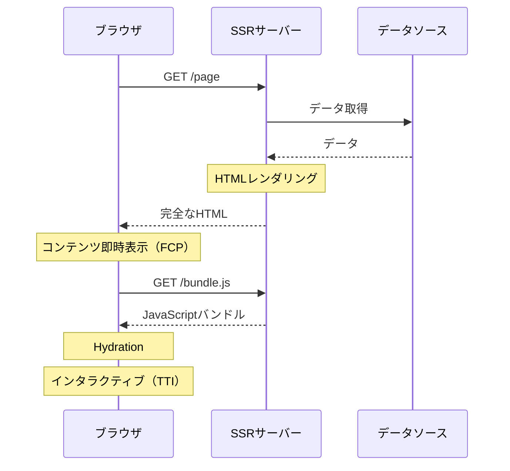

SSRの重要な概念が**Hydration（ハイドレーション）**である。サーバーが生成したHTMLは静的なものであり、ボタンクリックなどのインタラクションは処理できない。ブラウザ側でJavaScriptが実行されると、既存のDOMにイベントハンドラをアタッチし、コンポーネントの状態を復元する。この過程をHydrationと呼ぶ。

```javascript
// Server-side: render to HTML string
import { renderToString } from "react-dom/server";
import App from "./App";

app.get("/page", async (req, res) => {
  // Fetch data on the server
  const data = await fetchData();

  // Render React component to HTML
  const html = renderToString(<App data={data} />);

  res.send(`
    <!DOCTYPE html>
    <html>
      <head><title>My App</title></head>
      <body>
        <div id="root">${html}</div>
        <script>
          window.__INITIAL_DATA__ = ${JSON.stringify(data)};
        </script>
        <script src="/bundle.js"></script>
      </body>
    </html>
  `);
});
```

```javascript
// Client-side: hydrate the server-rendered HTML
import { hydrateRoot } from "react-dom/client";
import App from "./App";

// Reuse server-fetched data to avoid redundant API calls
const data = window.__INITIAL_DATA__;
hydrateRoot(document.getElementById("root"), <App data={data} />);
```

### 3.2 SSRのメリット

**FCP（First Contentful Paint）の改善**: サーバーから完全なHTMLが返されるため、ブラウザはJavaScriptの実行を待たずにコンテンツを表示できる。ユーザーは素早く情報を得られる。

**SEOフレンドリー**: クローラーはJavaScriptを実行せずとも完全なHTMLを取得できる。OGPメタタグもサーバー側で正しく設定されるため、ソーシャルメディアでのリンクプレビューも正常に機能する。

**動的データの対応**: リクエスト時にデータを取得してHTMLに埋め込むため、ユーザーごとにパーソナライズされたコンテンツや、リアルタイムに更新されるデータを扱うことができる。

### 3.3 SSRのデメリット

**TTFB（Time to First Byte）の増加**: サーバー側でデータ取得とHTML生成を行うため、最初の1バイトがブラウザに届くまでの時間が増加する。データソースへの問い合わせが遅い場合、その遅延がそのままTTFBに反映される。

**サーバーコスト**: リクエストごとにHTMLを生成するため、トラフィックが増加するとサーバーの負荷も比例して増大する。CSRと異なり、CDNでHTMLをキャッシュしづらい（動的コンテンツの場合）。

**TTI（Time to Interactive）までのギャップ**: HTMLが表示されてからHydrationが完了するまでの間、ページは見えているがインタラクティブではない。ユーザーがボタンをクリックしても反応しないという、いわゆる「不気味の谷（Uncanny Valley）」問題が発生する。

```mermaid
gantt
    title SSRにおけるタイムライン
    dateFormat X
    axisFormat %s秒

    section サーバー
    データ取得            :s1, 0, 2
    HTML生成              :s2, 2, 3

    section ネットワーク
    HTML転送              :n1, 3, 4
    JSバンドル転送        :n2, 4, 6

    section ブラウザ
    HTML表示（FCP）       :b1, 4, 5
    Hydration             :b2, 6, 8

    section 表示状態
    コンテンツ表示        :milestone, 4, 0
    インタラクティブ（TTI）:milestone, 8, 0
```

**Hydrationのオーバーヘッド**: Hydrationではサーバーが生成したDOMツリー全体を走査し、イベントハンドラのアタッチとコンポーネントの状態復元を行う。ページが複雑であるほどこの処理は重くなり、メインスレッドをブロックする。

### 3.4 SSRのアーキテクチャ上の考慮事項

SSRを導入する際には、いくつかのアーキテクチャ上の課題に対処する必要がある。

**サーバー・クライアント間のコードの一貫性**: SSRでは同じコンポーネントコードがサーバーとクライアントの両方で実行される（Isomorphic / Universal JavaScript）。しかし、`window`オブジェクトや`localStorage`のような、ブラウザ固有のAPIはサーバー上では利用できない。サーバーとクライアントで環境を適切に分離する必要がある。

**状態のシリアライゼーション**: サーバーで取得したデータをクライアントに引き渡すために、状態をJSON形式でHTMLに埋め込む。このデータはXSS攻撃のベクターになりうるため、適切なエスケープ処理が不可欠である。

**エラーハンドリング**: サーバーサイドでのレンダリング中にエラーが発生した場合の処理を設計する必要がある。コンポーネントのレンダリングエラーがサーバー全体をクラッシュさせないよう、適切なエラーバウンダリを設置する必要がある。

## 4. SSG（Static Site Generation）

### 4.1 基本的な仕組み

SSGはビルド時にすべてのページのHTMLを事前生成する。生成されたHTMLファイルは静的ファイルとしてCDNに配置され、リクエストに対してはCDNのエッジから即座に配信される。

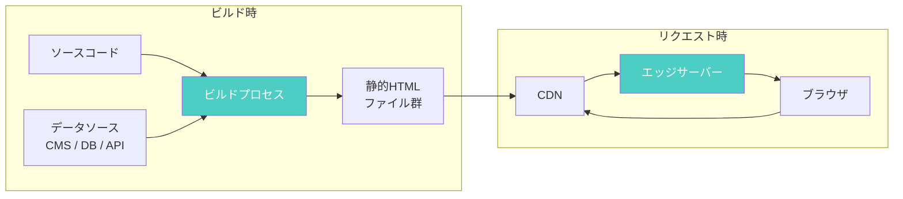

```javascript
// Next.js: Static Site Generation with getStaticProps
export async function getStaticProps() {
  // This runs at build time, not on every request
  const posts = await fetchBlogPosts();
  return {
    props: { posts },
  };
}

export async function getStaticPaths() {
  // Define which dynamic routes to pre-render
  const posts = await fetchBlogPosts();
  return {
    paths: posts.map((post) => ({
      params: { slug: post.slug },
    })),
    fallback: false,
  };
}

export default function BlogPost({ posts }) {
  return (
    <ul>
      {posts.map((post) => (
        <li key={post.id}>{post.title}</li>
      ))}
    </ul>
  );
}
```

### 4.2 SSGのメリット

**最高のパフォーマンス**: 事前生成されたHTMLをCDNから配信するため、TTFBは極めて短い。サーバーサイドの処理が一切不要で、世界中のエッジロケーションからユーザーに最も近いサーバーが応答する。

**高い信頼性とスケーラビリティ**: 静的ファイルの配信はWebサーバーの最も基本的な機能であり、障害が起きにくい。トラフィックの急増にもCDNが対処できるため、サーバーのスケーリングを心配する必要がない。

**セキュリティ**: サーバーサイドのランタイムが存在しないため、攻撃対象面（Attack Surface）が極めて小さい。データベースへの直接的な接続もないため、SQLインジェクションなどの脆弱性リスクも排除される。

**コスト効率**: 静的ファイルのホスティングコストは非常に低い。CDNの配信コストはリクエスト量に応じるが、オリジンサーバーの計算リソースは不要である。

### 4.3 SSGのデメリット

**ビルド時間の増大**: ページ数が多いサイト（数万ページ規模のECサイトなど）では、ビルドに数十分から数時間かかることがある。コンテンツの一部を更新するだけでも全ページの再ビルドが必要になるケースがある。

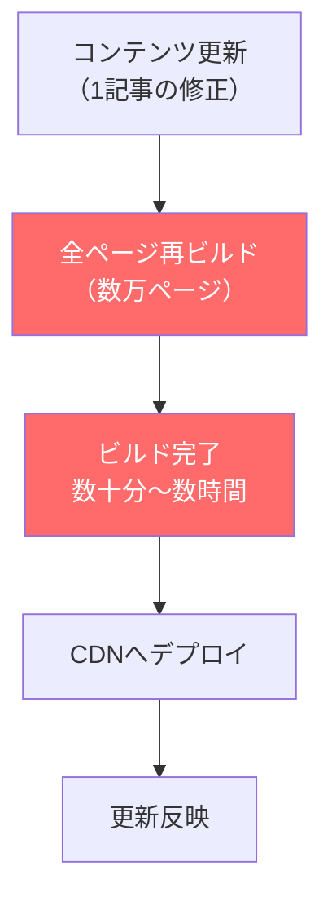

**リアルタイムデータに不向き**: ビルド時にデータを取得するため、頻繁に更新されるデータ（在庫数、価格、コメント数など）を正確に反映することが困難である。

**パーソナライゼーションの制約**: すべてのユーザーに同じHTMLが配信されるため、ユーザーごとに異なるコンテンツを表示することがビルド時点では難しい。クライアントサイドでの補完が必要となる。

### 4.4 SSGが適するケース

- **ブログやドキュメントサイト**: コンテンツの更新頻度が低く、全ユーザーに同じ内容を配信するサイト
- **マーケティングページ**: ランディングページやコーポレートサイトなど、パフォーマンスとSEOが重要なページ
- **技術ドキュメント**: VitePress、Docusaurusなどのドキュメントジェネレーターが利用される

## 5. ISR（Incremental Static Regeneration）

### 5.1 SSGの課題を解決する

ISRはNext.jsが導入した概念で、SSGの「ビルド時に全ページを生成する」という制約を緩和する。ISRでは、事前生成された静的ページに**有効期限（revalidate間隔）**を設定し、期限が切れた後のリクエスト時にバックグラウンドでページを再生成する。

### 5.2 ISRの動作メカニズム

ISRの基本的な動作は以下のとおりである。

1. **ビルド時**: SSGと同様に、静的HTMLを生成する
2. **有効期限内のリクエスト**: キャッシュされた静的HTMLを即座に返す
3. **有効期限切れ後のリクエスト**: 古いHTMLを即座に返しつつ（**stale-while-revalidate**）、バックグラウンドでページを再生成する
4. **再生成完了**: 次のリクエストから新しいHTMLが配信される

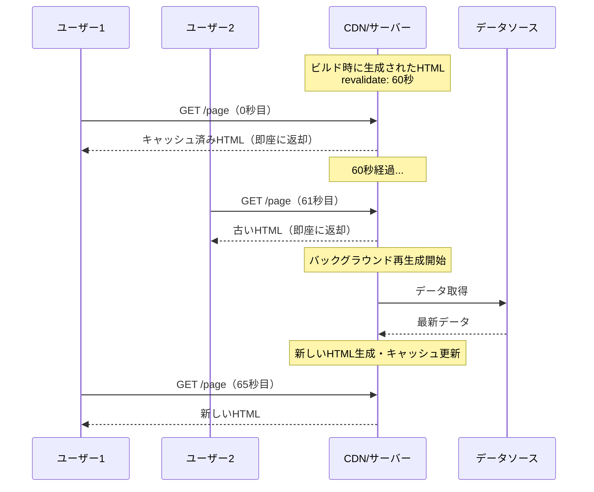

```javascript
// Next.js: ISR with revalidate
export async function getStaticProps() {
  const products = await fetchProducts();
  return {
    props: { products },
    // Re-generate page in the background after 60 seconds
    revalidate: 60,
  };
}
```

### 5.3 On-Demand Revalidation

Next.jsでは、時間ベースの再生成に加えて、**On-Demand Revalidation（オンデマンド再生成）**もサポートしている。CMS（Content Management System）のWebhookやAPIエンドポイントから明示的にページの再生成をトリガーできる。

```javascript
// Next.js API route for on-demand revalidation
export default async function handler(req, res) {
  // Verify webhook secret
  if (req.query.secret !== process.env.REVALIDATION_SECRET) {
    return res.status(401).json({ message: "Invalid token" });
  }

  try {
    // Trigger revalidation for a specific path
    await res.revalidate("/blog/" + req.query.slug);
    return res.json({ revalidated: true });
  } catch (err) {
    return res.status(500).send("Error revalidating");
  }
}
```

On-Demand Revalidationにより、コンテンツが更新されたタイミングで即座に再生成をトリガーでき、時間ベースのrevalidateでは避けられない「古いコンテンツが配信される期間」を最小化できる。

### 5.4 ISRのメリットとデメリット

**メリット**:
- SSGのパフォーマンス上の利点を維持しつつ、コンテンツの鮮度を担保できる
- ビルド時にすべてのページを生成する必要がなく、`fallback: 'blocking'`を使えば未生成のページも最初のリクエスト時に生成できる
- CDNレベルでのキャッシュが可能で、サーバー負荷を低く抑えられる

**デメリット**:
- revalidate間隔の設定が難しい（短すぎるとサーバー負荷が増加し、長すぎるとデータの鮮度が低下する）
- stale-while-revalidateの特性上、再生成が完了するまでの間は古いコンテンツが配信される
- Next.js固有の概念であり、他のフレームワークでは直接的に利用できない（類似機能は存在する）

## 6. Streaming SSR（React Server Components と Suspense）

### 6.1 従来のSSRの限界

従来のSSRには「All-or-Nothing（全か無か）」の問題がある。ページ全体のデータ取得とレンダリングが完了してからHTMLがブラウザに送信されるため、ページの一部でも遅いデータ取得があると、ページ全体の表示が遅延する。

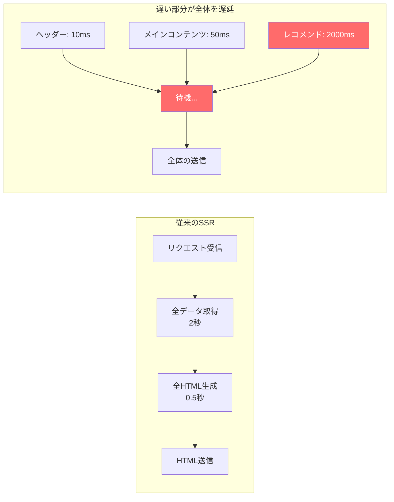

同様に、Hydrationにも「All-or-Nothing」の問題がある。ページ全体のHydrationが完了するまで、どの部分もインタラクティブにならない。

### 6.2 Streaming SSRの仕組み

Streaming SSRは、HTMLをチャンクに分割してストリーミング配信する。HTTP/1.1のChunked Transfer EncodingやHTTP/2のストリーミング機能を活用し、準備ができた部分から順次ブラウザに送信する。

React 18で導入された`renderToPipeableStream` APIは、`<Suspense>`コンポーネントと連携してStreaming SSRを実現する。

```javascript
// Server-side streaming with React 18
import { renderToPipeableStream } from "react-dom/server";

app.get("/page", (req, res) => {
  const { pipe } = renderToPipeableStream(<App />, {
    bootstrapScripts: ["/bundle.js"],
    onShellReady() {
      // The shell (everything outside Suspense boundaries) is ready
      res.statusCode = 200;
      res.setHeader("Content-Type", "text/html");
      pipe(res);
    },
    onError(error) {
      console.error(error);
      res.statusCode = 500;
      res.end("Internal Server Error");
    },
  });
});
```

```jsx
// Component using Suspense for streaming
function Page() {
  return (
    <html>
      <body>
        <Header />
        <MainContent />
        {/* Recommendations will stream in when data is ready */}
        <Suspense fallback={<RecommendationsSkeleton />}>
          <Recommendations />
        </Suspense>
      </body>
    </html>
  );
}
```

この仕組みでは、以下のことが起きる。

1. サーバーはまず`<Suspense>`の外側（シェル）と、`fallback`として指定されたスケルトンUIを含むHTMLを即座に送信する
2. ブラウザはシェルを表示し、スケルトンUIがレコメンドセクションのプレースホルダーとして表示される
3. レコメンドデータの取得が完了すると、サーバーは追加のHTMLチャンクをストリーミングで送信する
4. ブラウザ側のスクリプトがスケルトンを実際のコンテンツに差し替える

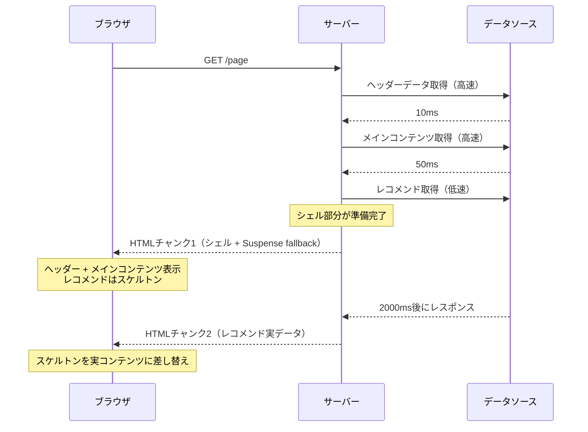

### 6.3 Selective Hydration

React 18のSelective Hydration（選択的ハイドレーション）は、Streaming SSRと連携してHydrationの「All-or-Nothing」問題も解決する。

Selective Hydrationでは、`<Suspense>`境界ごとに独立してHydrationが実行される。さらに、ユーザーが特定の要素をクリックした場合、その要素を含むSuspense境界のHydrationが優先的に実行される。

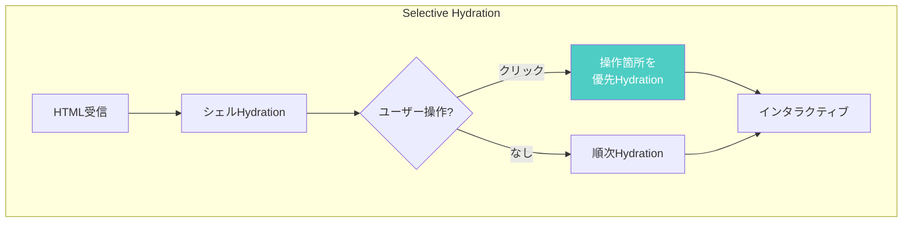

この仕組みにより、ページの一部のHydrationが完了すれば、その部分はすぐにインタラクティブになる。残りの部分のHydrationは非同期で進行する。

### 6.4 React Server Components（RSC）

React Server Components（RSC）は、コンポーネントを**サーバーコンポーネント**と**クライアントコンポーネント**に明確に分離するアーキテクチャである。

**サーバーコンポーネント**はサーバー上でのみ実行され、そのJavaScriptはクライアントに送信されない。データベースへの直接アクセスやファイルシステムの読み取りが可能で、クライアントに送信するJavaScriptバンドルサイズの削減に大きく寄与する。

**クライアントコンポーネント**は従来のReactコンポーネントと同様に、サーバーとクライアントの両方で実行される（SSR + Hydration）。`useState`や`useEffect`といったフックの使用が必要な場合に使用する。

```jsx
// Server Component (default in Next.js App Router)
// No "use client" directive — runs only on the server
async function ProductPage({ id }) {
  // Direct database access — no API layer needed
  const product = await db.query("SELECT * FROM products WHERE id = $1", [id]);
  const reviews = await db.query(
    "SELECT * FROM reviews WHERE product_id = $1",
    [id],
  );

  return (
    <div>
      <h1>{product.name}</h1>
      <p>{product.description}</p>
      {/* Client Component for interactive elements */}
      <AddToCartButton productId={id} price={product.price} />
      <ReviewList reviews={reviews} />
    </div>
  );
}
```

```jsx
// Client Component — includes interactivity
"use client";

import { useState } from "react";

function AddToCartButton({ productId, price }) {
  const [quantity, setQuantity] = useState(1);

  const handleAddToCart = async () => {
    await fetch("/api/cart", {
      method: "POST",
      body: JSON.stringify({ productId, quantity }),
    });
  };

  return (
    <div>
      <input
        type="number"
        value={quantity}
        onChange={(e) => setQuantity(Number(e.target.value))}
      />
      <button onClick={handleAddToCart}>カートに追加（¥{price * quantity}）</button>
    </div>
  );
}
```

RSCの大きな利点は、サーバーコンポーネントのJavaScriptがクライアントにまったく送信されないことである。これにより、重いライブラリ（マークダウンパーサー、シンタックスハイライター、日付フォーマッターなど）をサーバーコンポーネント内で使用しても、クライアントのバンドルサイズに影響しない。

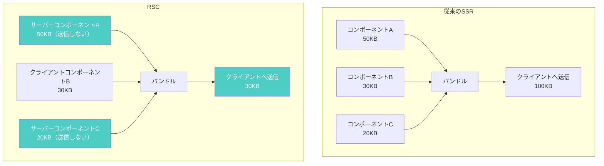

### 6.5 RSCのデータフロー

RSCはサーバーとクライアント間のデータの流れにも新しいモデルを導入する。サーバーコンポーネントのレンダリング結果は、HTMLではなく**RSC Payload**と呼ばれる独自のストリーミングフォーマットでクライアントに転送される。このPayloadにはReactの仮想DOMツリーのシリアライズされた形式が含まれ、クライアント側のReactランタイムがこれを解釈してDOMに反映する。

ナビゲーション時には、ページ全体のHTMLを再取得するのではなく、RSC Payloadのみを取得して差分更新を行う。これにより、SPAのようなスムーズなナビゲーションとSSRのようなサーバーサイドデータ取得を両立できる。

## 7. Partial Prerendering（PPR）

### 7.1 静的と動的の融合

Partial Prerendering（PPR）は、Next.js 15で導入された実験的な機能で、1つのページ内で静的な部分と動的な部分を共存させる。SSGの即時配信と、SSRの動的データ取得を、ページレベルではなくコンポーネントレベルで組み合わせる。

従来の手法では、ページ全体を「静的」か「動的」かのどちらかに分類する必要があった。たとえばECサイトの商品ページでは、商品説明は静的（全ユーザーに共通）だが、在庫数やパーソナライズされたレコメンドは動的（リクエスト時に決定）である。従来はページ全体をSSRにするしかなかったが、PPRではこの問題を解消する。

### 7.2 PPRの動作メカニズム

PPRは、Suspense境界を基準にページを静的シェルと動的ホールに分割する。

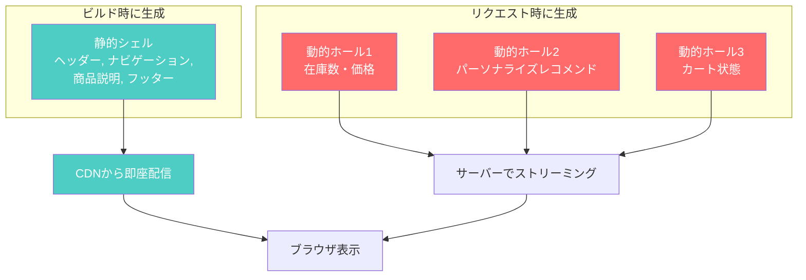

```jsx
// Next.js Partial Prerendering example
import { Suspense } from "react";

// This page uses PPR: static shell + dynamic holes
export default function ProductPage({ params }) {
  return (
    <div>
      {/* Static: pre-rendered at build time */}
      <Header />
      <ProductDescription id={params.id} />

      {/* Dynamic: streamed at request time */}
      <Suspense fallback={<PriceSkeleton />}>
        <DynamicPrice id={params.id} />
      </Suspense>

      <Suspense fallback={<RecommendationsSkeleton />}>
        <PersonalizedRecommendations />
      </Suspense>

      {/* Static */}
      <Footer />
    </div>
  );
}
```

PPRの配信フローは以下のとおりである。

1. **ビルド時**: Suspense境界の外側（静的シェル）とfallbackを含むHTMLを事前生成する
2. **リクエスト時**: CDNから静的シェルを即座に配信する（TTFBは極めて短い）
3. **同時に**: サーバーがSuspense内の動的コンポーネントのデータ取得とレンダリングを開始する
4. **準備完了次第**: 動的部分をストリーミングでブラウザに送信し、fallbackを置き換える

この仕組みにより、ページの静的な部分はSSGと同等の速度で配信されつつ、動的な部分はリクエスト時の最新データを反映できる。

### 7.3 PPRの意義

PPRが本質的に解決するのは、「ページ単位でレンダリング戦略を選ぶ」という従来のモデルの制約である。実際のWebページは、静的な要素と動的な要素が混在している。PPRにより、開発者は各コンポーネントの性質に応じて最適なレンダリング方式を自然に適用でき、ページ全体のパフォーマンスと動的性の両方を最大化できる。

## 8. 各手法の比較

### 8.1 パフォーマンス指標による比較

各レンダリング戦略を主要なパフォーマンス指標で比較する。

| 指標 | CSR | SSR | SSG | ISR | Streaming SSR | PPR |
|------|-----|-----|-----|-----|---------------|-----|
| **TTFB** | 速い（空HTML） | 遅い（レンダリング待ち） | 最速（CDN配信） | 最速（CDN配信） | 中程度（シェル即送信） | 最速（静的シェル） |
| **FCP** | 遅い（JS実行後） | 中程度（HTML受信後） | 速い（HTML即配信） | 速い（HTML即配信） | 速い（シェル即表示） | 速い（シェル即表示） |
| **LCP** | 遅い | 中程度 | 速い | 速い | 速い〜中程度 | 速い |
| **TTI** | 中程度（Hydration不要） | 遅い（Hydration必要） | 速い | 速い | 速い（Selective Hydration） | 速い（部分的Hydration） |

::: tip 指標の補足
- **TTFB (Time to First Byte)**: サーバーから最初の1バイトが届くまでの時間
- **FCP (First Contentful Paint)**: 最初のコンテンツがレンダリングされるまでの時間
- **LCP (Largest Contentful Paint)**: 最大のコンテンツ要素がレンダリングされるまでの時間
- **TTI (Time to Interactive)**: ページがインタラクティブになるまでの時間
:::

### 8.2 機能面での比較

| 特性 | CSR | SSR | SSG | ISR | Streaming SSR | PPR |
|------|-----|-----|-----|-----|---------------|-----|
| **SEO** | 不利 | 有利 | 最適 | 最適 | 有利 | 最適 |
| **動的データ** | 対応 | 対応 | 非対応 | 部分対応 | 対応 | 対応 |
| **パーソナライゼーション** | 対応 | 対応 | 非対応 | 非対応 | 対応 | 対応 |
| **サーバーコスト** | 低い | 高い | 極低 | 低い | 中程度 | 低い |
| **ビルド時間** | 短い | 短い | ページ数に依存 | 短い | 短い | 中程度 |
| **実装の複雑さ** | 低い | 中程度 | 低い | 中程度 | 高い | 高い |
| **CDNキャッシュ** | 可能（静的ファイル） | 困難 | 最適 | 可能 | 困難 | 部分的に可能 |

### 8.3 レンダリング戦略の決定フロー

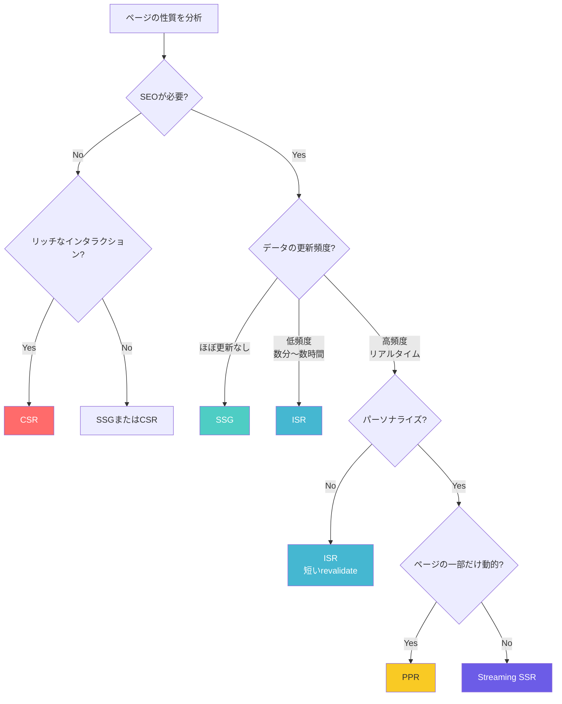

## 9. フレームワーク別の実装

### 9.1 Next.js

Next.jsは、最も多くのレンダリング戦略をサポートするフレームワークであり、CSR、SSR、SSG、ISR、Streaming SSR、PPRのすべてに対応している。

**Pages Router（従来のAPI）**

```javascript
// SSG
export async function getStaticProps() {
  const data = await fetchData();
  return { props: { data } };
}

// SSR
export async function getServerSideProps(context) {
  const data = await fetchData(context.req);
  return { props: { data } };
}

// ISR
export async function getStaticProps() {
  const data = await fetchData();
  return { props: { data }, revalidate: 60 };
}
```

**App Router（React Server Components）**

App Routerでは、コンポーネントのデフォルトがサーバーコンポーネントとなり、データ取得のAPIが大幅に簡素化された。

```jsx
// Static rendering (default)
async function StaticPage() {
  const data = await fetch("https://api.example.com/data");
  return <div>{data.title}</div>;
}

// Dynamic rendering (opt-in)
async function DynamicPage() {
  const data = await fetch("https://api.example.com/data", {
    cache: "no-store", // Disable caching → SSR on every request
  });
  return <div>{data.title}</div>;
}

// ISR equivalent
async function ISRPage() {
  const data = await fetch("https://api.example.com/data", {
    next: { revalidate: 60 }, // Revalidate every 60 seconds
  });
  return <div>{data.title}</div>;
}
```

### 9.2 Nuxt

Nuxt（Vue.jsベース）もSSR、SSG、ISRをサポートしている。Nuxt 3ではVue 3のComposition APIと統合され、データ取得のAPIが洗練されている。

```vue
<script setup>
// SSR: fetch on every request
const { data } = await useFetch('/api/products', {
  server: true,
})

// ISR equivalent: Hybrid Rendering with route rules
// Configured in nuxt.config.ts
</script>

<template>
  <div>
    <ProductList :products="data" />
  </div>
</template>
```

```typescript
// nuxt.config.ts: route-level rendering rules
export default defineNuxtConfig({
  routeRules: {
    // Static generation at build time
    "/": { prerender: true },
    // ISR: revalidate every 60 seconds
    "/products/**": { isr: 60 },
    // SSR on every request
    "/dashboard/**": { ssr: true },
    // Client-side only
    "/admin/**": { ssr: false },
  },
});
```

Nuxtの**Hybrid Rendering**は、ルートごとに異なるレンダリング戦略を`routeRules`で宣言的に設定できる点が特徴である。

### 9.3 Astro

Astroは「コンテンツ重視」のフレームワークで、デフォルトではJavaScriptをクライアントに一切送信しない**Zero JS by default**のアプローチを取る。必要な部分だけをインタラクティブにする**Islands Architecture（アイランズアーキテクチャ）**が特徴である。

```astro
---
// Astro component: runs on server only by default
const response = await fetch('https://api.example.com/posts');
const posts = await response.json();
---

<html>
  <body>
    <h1>ブログ記事一覧</h1>
    <!-- Static HTML: no JS shipped -->
    <ul>
      {posts.map(post => (
        <li>{post.title}</li>
      ))}
    </ul>

    <!-- Interactive island: JS shipped only for this component -->
    <SearchBar client:load />

    <!-- Hydrate only when visible in viewport -->
    <CommentSection client:visible />
  </body>
</html>
```

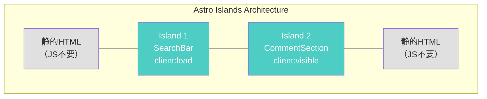

Astroの`client:*`ディレクティブにより、各インタラクティブコンポーネント（Island）のHydrationタイミングを細かく制御できる。

| ディレクティブ | Hydrationタイミング |
|---|---|
| `client:load` | ページ読み込み時に即座にHydration |
| `client:idle` | メインスレッドがアイドルになったらHydration |
| `client:visible` | ビューポートに入ったらHydration |
| `client:media` | メディアクエリが一致したらHydration |
| `client:only` | SSRせずクライアントのみでレンダリング |

Astroはまた、React、Vue、Svelte、Solidなど複数のUIフレームワークのコンポーネントを同一プロジェクト内で混在させることができるため、フレームワーク選択の柔軟性が高い。

### 9.4 Remix

Remix（現在はReact Routerに統合）は、Web標準のAPIを活用したフルスタックフレームワークである。SSRをデフォルトとし、各ルートに`loader`（データ取得）と`action`（データ変更）を定義するモデルを採用している。

```jsx
// Remix: loader for data fetching (runs on server)
export async function loader({ params }) {
  const product = await db.product.findUnique({
    where: { id: params.id },
  });
  if (!product) throw new Response("Not Found", { status: 404 });
  return json({ product });
}

// Action for mutations (runs on server)
export async function action({ request }) {
  const formData = await request.formData();
  await db.cart.add({
    productId: formData.get("productId"),
    quantity: Number(formData.get("quantity")),
  });
  return redirect("/cart");
}

export default function ProductPage() {
  const { product } = useLoaderData();
  return (
    <div>
      <h1>{product.name}</h1>
      <Form method="post">
        <input type="hidden" name="productId" value={product.id} />
        <button type="submit">カートに追加</button>
      </Form>
    </div>
  );
}
```

Remixの特徴は、ネストされたルーティングとデータのプリフェッチにある。各ルートが独立したデータ取得ロジックを持ち、レイアウトの入れ子構造に対応して並列にデータを取得できる。これにより、SSRにおけるウォーターフォール問題（データ取得の直列化）を回避できる。

### 9.5 フレームワーク比較のまとめ

| フレームワーク | CSR | SSR | SSG | ISR | Streaming SSR | PPR | Islands |
|---|:---:|:---:|:---:|:---:|:---:|:---:|:---:|
| **Next.js** | o | o | o | o | o | o（実験的） | - |
| **Nuxt** | o | o | o | o | o | - | - |
| **Astro** | o | o | o | - | - | - | o |
| **Remix** | - | o | - | - | o | - | - |

::: warning 注意
上記の比較は2026年3月時点のものである。各フレームワークは活発に開発が進んでおり、対応状況は変化しうる。
:::

## 10. 選択の指針

### 10.1 アプリケーション特性による判断

レンダリング戦略の選択は、アプリケーションの特性によって大きく左右される。ここでは、代表的なユースケースごとに推奨される戦略を示す。

**ブログ・ドキュメントサイト**

コンテンツの更新頻度が低く、全ユーザーに同じコンテンツを配信するサイトにはSSGが最適である。ビルド時にすべてのページを生成し、CDNから配信することで最高のパフォーマンスを実現できる。VitePress、Astro、Next.jsのSSGモードが適している。

**ECサイト**

商品一覧ページはISRで効率的にキャッシュしつつ定期的に更新し、商品詳細ページにはPPR（静的な商品説明 + 動的な在庫・価格情報）を適用するのが理想的である。カートや決済ページはSSRまたはCSRで動的に処理する。

**ニュースサイト**

記事ページはISRで配信し、トップページのように頻繁に更新されるページにはStreaming SSRまたはSSRを適用する。記事が公開されたタイミングでOn-Demand Revalidationをトリガーすると効果的である。

**SaaSダッシュボード**

認証済みユーザーのみが利用し、SEOが不要で、データがリアルタイムに更新されるダッシュボードにはCSRが適している。ただし、初期表示速度を重視する場合はSSRやStreaming SSRを検討する。

**ソーシャルメディア**

フィードはユーザーごとにパーソナライズされるためSSRが基本となるが、Streaming SSRを活用して段階的にコンテンツを表示することでユーザー体験を改善できる。プロフィールページなど、公開情報中心のページにはISRが適している。

### 10.2 ハイブリッドアプローチの実践

現代のWebアプリケーションでは、サイト全体で単一のレンダリング戦略を採用するのではなく、ページやコンポーネントの特性に応じてレンダリング戦略を使い分ける**ハイブリッドアプローチ**が主流である。

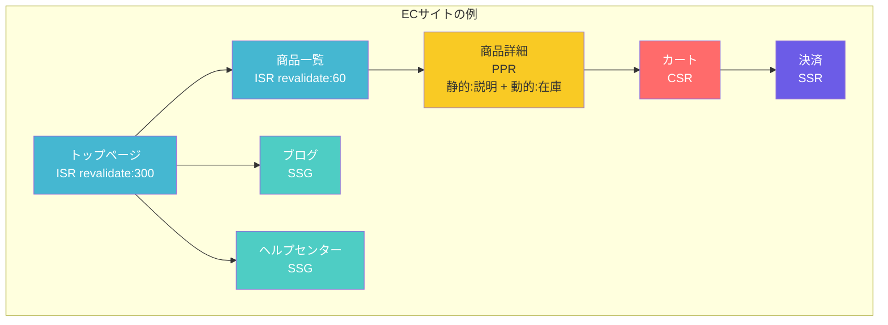

### 10.3 将来の展望

Webのレンダリング戦略は引き続き進化を続けている。いくつかの注目すべきトレンドを挙げる。

**Resumability（再開可能性）**: Qwikが提唱するアプローチで、Hydration自体を不要にする。サーバーで生成したコンポーネントの状態をHTMLにシリアライズし、クライアント側ではユーザーの操作時にはじめて必要最小限のJavaScriptをロード・実行する。これにより、TTIを劇的に改善できる。

**React Server Componentsの成熟**: RSCはまだ比較的新しい技術だが、Next.js App Routerでの採用を通じて急速にエコシステムが形成されつつある。サーバーとクライアントの境界をコンポーネント単位で制御できるこのモデルは、今後のWebフレームワーク設計に大きな影響を与えると考えられる。

**エッジコンピューティングとの統合**: Cloudflare Workers、Vercel Edge Functions、Deno Deployなどのエッジランタイムにより、SSRの実行場所がユーザーに近いエッジロケーションに移動しつつある。これにより、SSRのTTFBの課題が大幅に緩和される。

**AIとレンダリングの融合**: LLMを活用した動的コンテンツ生成が増加する中、Streaming SSRの重要性が高まっている。AIの応答を段階的にストリーミングで表示するUIパターンは、Streaming SSRの技術基盤の上に成り立っている。

### 10.4 まとめ

Webのレンダリング戦略は、「サーバーかクライアントか」という二項対立から、「いつ・どこで・どの粒度で」レンダリングを行うかという多次元的な選択へと進化してきた。

| 戦略 | レンダリング時点 | レンダリング場所 | 粒度 |
|---|---|---|---|
| CSR | リクエスト時 | クライアント | ページ全体 |
| SSR | リクエスト時 | サーバー | ページ全体 |
| SSG | ビルド時 | ビルドサーバー | ページ全体 |
| ISR | ビルド時 + 再生成 | ビルドサーバー + エッジ | ページ全体 |
| Streaming SSR | リクエスト時（段階的） | サーバー | コンポーネント単位 |
| PPR | ビルド時 + リクエスト時 | CDN + サーバー | コンポーネント単位 |

重要なのは、どの戦略が「最良」かではなく、アプリケーションの要件に最も適した戦略を選択することである。そして、現代のフレームワークはこれらの戦略を柔軟に組み合わせる手段を提供しており、ページごと、あるいはコンポーネントごとに最適な戦略を適用できるようになっている。

技術選定においては、以下の問いを自らに投げかけることが有効である。

1. **SEOは必要か？** — 必要ならCSR単独は避ける
2. **データはどの程度の頻度で更新されるか？** — 低頻度ならSSG/ISR、高頻度ならSSR/Streaming SSR
3. **パーソナライゼーションは必要か？** — 必要ならSSR系の戦略を検討
4. **サーバーコストの制約は？** — 制約が厳しいならSSG/ISR
5. **初期表示速度の目標は？** — 厳しい要件ならSSG/ISR/PPR

これらの問いに対する回答が、最適なレンダリング戦略の選択へと導いてくれるだろう。
