# レプリケーション — データベースの複製戦略と一貫性の設計

## 1. はじめに：なぜデータを複製するのか

データベースレプリケーションとは、同一のデータを複数のノード（マシン）に保持する技術である。一見すると「同じデータを複数箇所に置く」という単純な話に思えるが、実際にはデータベースシステム設計において最も本質的かつ困難な課題の一つである。レプリケーションが必要とされる理由は大きく3つに分類される。

### 1.1 高可用性（High Availability）

単一のデータベースサーバーに依存するシステムは、そのサーバーが停止した瞬間にサービス全体が停止する。これは**単一障害点（Single Point of Failure: SPOF）**と呼ばれる。ハードウェア故障、ソフトウェアバグ、電源障害、ネットワーク分断――これらのイベントは「起きるかどうか」ではなく「いつ起きるか」の問題である。

レプリケーションにより、データの複製を複数のノードに持たせることで、いずれかのノードが障害を起こしても残りのノードがサービスを継続できる。これがフェイルオーバーの基盤となる。

### 1.2 読取スケーラビリティ（Read Scalability）

多くのWebアプリケーションでは、読み取り操作（SELECT）が書き込み操作（INSERT/UPDATE/DELETE）を大幅に上回る。ソーシャルメディアのタイムライン表示、ECサイトの商品検索、ニュースサイトの記事閲覧――これらのワークロードでは読み取りが全体の90%以上を占めることも珍しくない。

レプリケーションを用いてデータの複製を複数のノードに配置し、読み取りリクエストをそれらに分散させることで、読み取りスループットを水平にスケールさせることができる。

### 1.3 地理的分散（Geographic Distribution）

グローバルに展開するサービスでは、ユーザーと物理的に近い場所にデータを配置することがレイテンシ低減の鍵となる。東京のユーザーが米国東海岸のデータベースにアクセスすると、光の速度の制約だけでも往復100ms以上のレイテンシが発生する。レプリケーションにより、各地域にデータの複製を置くことで、ユーザーは近隣のノードからデータを読み取れるようになる。

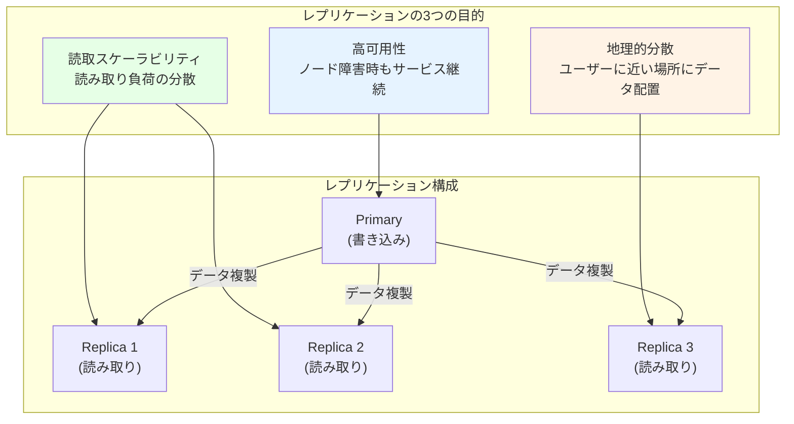

しかし、データを複数のノードに複製するということは、「どのノードのデータが正しいのか」「書き込みが全ノードに反映されるまでのタイムラグにどう対処するのか」「複数ノードに同時に書き込まれた場合にどうするのか」という一連の難問に向き合うことを意味する。本記事では、これらの課題に対する主要なアプローチを体系的に解説する。

## 2. レプリケーションの基本モデル

レプリケーションのアーキテクチャは、「書き込みを受け付けるノードが何台あるか」によって3つに大別される。

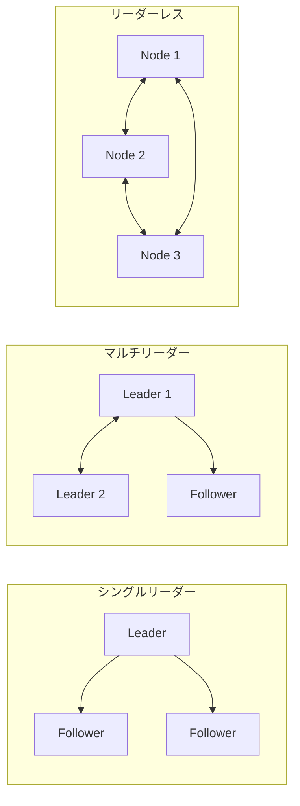

### 2.1 シングルリーダーレプリケーション（Single-Leader Replication）

シングルリーダーレプリケーションは、最も広く採用されているモデルである。**1台のノード（リーダー/プライマリ/マスター）のみが書き込みを受け付け**、そのリーダーが変更内容を他のノード（フォロワー/レプリカ/スレーブ）に伝搬させる。

#### 動作の流れ

1. クライアントが書き込みリクエストをリーダーに送信する
2. リーダーは自身のローカルストレージにデータを書き込む
3. リーダーは変更内容を**レプリケーションログ**としてフォロワーに送信する
4. フォロワーはログを受信し、リーダーと同じ順序で変更を適用する
5. クライアントの読み取りリクエストはリーダーまたはフォロワーのいずれからでも処理できる

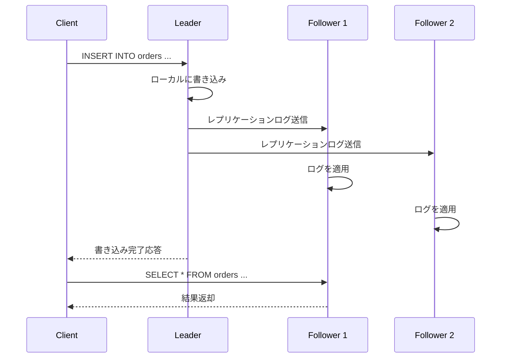

#### 利点

- **実装が比較的単純**: 書き込みの競合が発生しない（書き込みはすべてリーダーに集約されるため）
- **一貫性の保証が容易**: リーダーが単一の書き込み順序を決定する
- **幅広い採用実績**: MySQL、PostgreSQL、MongoDBなど主要なデータベースがこのモデルをサポート

#### 欠点

- **書き込みのスケーラビリティに制限**: すべての書き込みが単一ノードに集中する
- **リーダー障害時の対応が必要**: フェイルオーバーの仕組みが不可欠
- **地理的分散時のレイテンシ**: 遠隔地のクライアントからの書き込みは、リーダーまでのネットワーク遅延が発生する

### 2.2 マルチリーダーレプリケーション（Multi-Leader Replication）

マルチリーダーレプリケーション（マルチマスターレプリケーションとも呼ばれる）では、**複数のノードが書き込みを受け付ける**ことができる。各リーダーは自身が受け付けた書き込みを他のリーダーに伝搬させる。

#### ユースケース

マルチリーダーレプリケーションが正当化されるシナリオは限定的である。

1. **マルチデータセンター運用**: 各データセンターにリーダーを配置し、ローカルでの書き込みレイテンシを低減する
2. **オフライン対応アプリケーション**: CouchDBのようなデータベースでは、各端末がローカルにデータベースを持ち、オンラインになった時点で同期する
3. **協調編集**: Google Docsのようなリアルタイム共同編集では、各ユーザーの変更がローカルで即座に反映され、非同期で他のユーザーに伝搬する

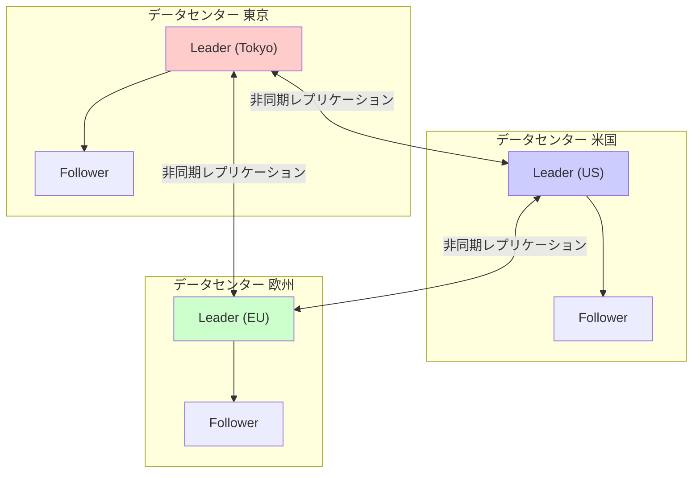

#### 根本的な課題：書き込みコンフリクト

マルチリーダーレプリケーション最大の問題は**書き込みコンフリクト**である。2つのリーダーが同じデータに対して異なる書き込みを同時に受け付けた場合、それらをどのように統合するかを決めなければならない。この問題については後述の「コンフリクト解決」のセクションで詳述する。

### 2.3 リーダーレスレプリケーション（Leaderless Replication）

リーダーレスレプリケーションでは、**特定のリーダーノードが存在せず**、クライアントが複数のノードに直接書き込みを行う。このアプローチはAmazonのDynamoシステム（2007年のDynamo論文）で広く知られるようになり、Apache Cassandra、Riak、Voldemortなどのデータベースで採用されている。

#### Quorumの仕組み

リーダーレスレプリケーションの中核となる概念が**クォーラム（Quorum）**である。ノード総数を $n$、書き込み時に応答を要求するノード数を $w$、読み取り時に問い合わせるノード数を $r$ とすると、以下の条件を満たす場合、読み取りは必ず最新のデータを含むノードから応答を得られることが保証される。

$$
w + r > n
$$

たとえば $n = 3$ の場合、$w = 2$, $r = 2$ とすると $2 + 2 = 4 > 3$ であり、読み取り時に問い合わせた2つのノードのうち少なくとも1つは最新の書き込みを受け取ったノードである。

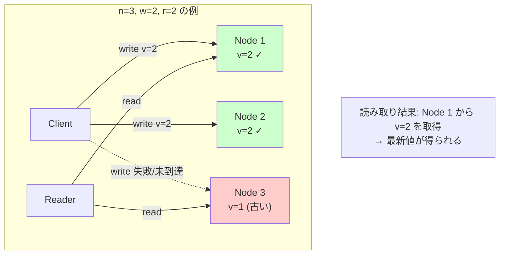

#### 読み取り修復とアンチエントロピー

クォーラムが保証するのは「最新のデータを**含む**応答が得られる」ことだけであり、すべてのノードが常に最新のデータを保持していることは保証しない。古いデータを持つノードを更新するための仕組みとして、次の2つがある。

- **読み取り修復（Read Repair）**: クライアントが複数のノードから読み取った際に、古いデータを返したノードに対して最新のデータを書き戻す
- **アンチエントロピープロセス（Anti-Entropy Process）**: バックグラウンドプロセスがノード間のデータを比較し、差異を検出して修復する。Merkleツリーを用いることで、効率的に差異を特定する

## 3. 同期レプリケーションと非同期レプリケーション

レプリケーションにおけるもう一つの重要な設計軸が、リーダーからフォロワーへのデータ伝搬が**同期的**か**非同期的**かという選択である。

### 3.1 同期レプリケーション（Synchronous Replication）

同期レプリケーションでは、リーダーはフォロワーが書き込みの確認応答を返すまでクライアントへの応答を待つ。

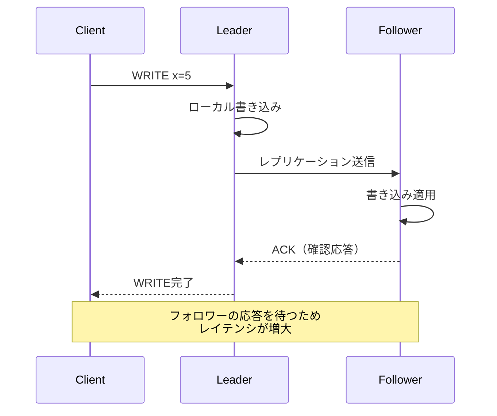

**利点**:
- フォロワーのデータがリーダーと一致していることが保証される
- リーダーが障害を起こしてもフォロワーにはデータが存在する（データ損失なし）

**欠点**:
- フォロワーが応答しない場合（ネットワーク障害、フォロワーのクラッシュなど）、リーダーの書き込みもブロックされる
- レイテンシが増大する（特にフォロワーが地理的に離れている場合）

### 3.2 非同期レプリケーション（Asynchronous Replication）

非同期レプリケーションでは、リーダーはフォロワーの確認応答を待たずにクライアントへ書き込み完了を応答する。

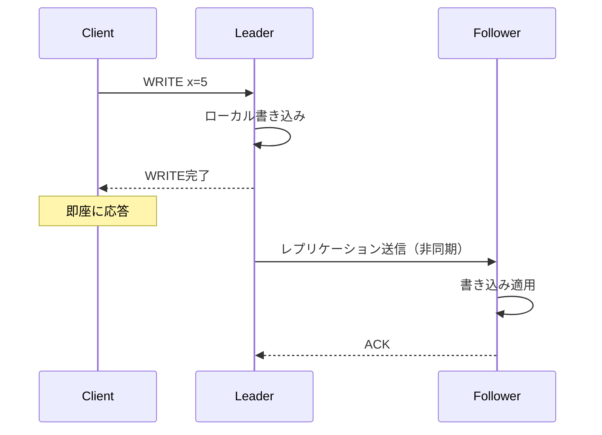

**利点**:
- 書き込みレイテンシが低い
- フォロワーの障害がリーダーの書き込み性能に影響しない

**欠点**:
- フォロワーのデータがリーダーに追いついていない可能性がある（**レプリケーションラグ**）
- リーダーがクラッシュした場合、フォロワーにまだ伝搬されていないデータは失われる可能性がある

### 3.3 半同期レプリケーション（Semi-Synchronous Replication）

実用的な妥協案として、**半同期レプリケーション**がある。これは、複数のフォロワーのうち少なくとも1台は同期的にレプリケーションし、残りは非同期で行う方式である。

MySQLの`semi-synchronous replication`がこの方式の代表例である。少なくとも1台のフォロワーからACKを受けるまでクライアントへの応答を保留することで、リーダー障害時のデータ損失リスクを低減しつつ、すべてを同期にするよりも高い可用性を維持する。

| 方式 | レイテンシ | データ耐久性 | 可用性 |
|---|---|---|---|
| 同期 | 高い | 最も強い | フォロワー障害で書き込み停止 |
| 非同期 | 低い | データ損失リスクあり | 最も高い |
| 半同期 | 中程度 | 同期フォロワー分は保証 | 中程度 |

## 4. レプリケーションの実装方式

レプリケーションにおいて「どのようなデータを伝搬するか」は、性能・互換性・柔軟性に直結する重要な設計判断である。

### 4.1 WALベースのレプリケーション（Physical Replication）

**WAL（Write-Ahead Log）ベースのレプリケーション**は、データベースがディスクに書き込む前に記録するWALのデータをそのままフォロワーに転送する方式である。WALにはページレベルの物理的な変更（どのページのどのバイトがどう変わったか）が記録されている。

PostgreSQLの**ストリーミングレプリケーション**がこの方式の代表例である。

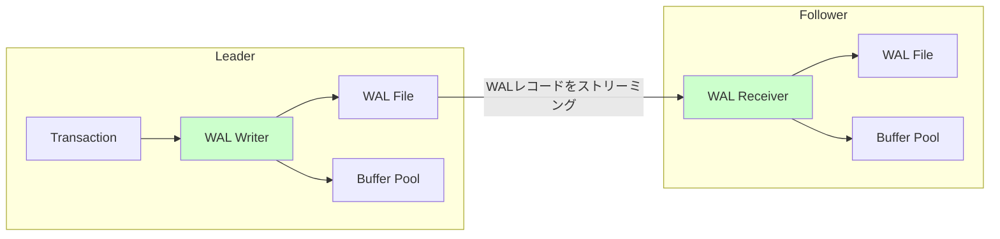

**利点**:
- リーダーへのオーバーヘッドが最小限（WALは元々書き込まれているデータを転送するだけ）
- バイトレベルの正確な複製が保証される

**欠点**:
- WALのフォーマットはストレージエンジンの内部実装に密結合している
- **異なるバージョンのデータベース間でのレプリケーションが困難**（内部フォーマットの変更に対して非互換になりうる）
- リーダーとフォロワーが同一のストレージエンジンを使用する必要がある

### 4.2 論理レプリケーション（Logical Replication）

**論理レプリケーション**は、物理的なWALのバイト列ではなく、行レベルの論理的な変更内容を伝搬する方式である。具体的には「どのテーブルのどの行がどのように変更されたか」を論理的に表現したログを転送する。

```
INSERT INTO users (id, name, email) VALUES (42, 'Alice', 'alice@example.com');
UPDATE users SET email = 'new@example.com' WHERE id = 42;
DELETE FROM users WHERE id = 42;
```

**利点**:
- **異なるバージョン・異なるデータベースエンジン間**でもレプリケーション可能
- **選択的レプリケーション**: テーブル単位、カラム単位でレプリケーション対象を選べる
- **CDC（Change Data Capture）**: 外部システム（Elasticsearch、データウェアハウスなど）へのデータ連携に利用できる

**欠点**:
- DDL（スキーマ変更）の伝搬が自動ではないことが多い
- WALベースのレプリケーションに比べてオーバーヘッドが大きい場合がある

PostgreSQLは**論理レプリケーション**（Logical Replication）を、MySQLは**binlog**ベースのレプリケーションを通じてこの方式をサポートしている。

### 4.3 ステートメントベースレプリケーション

最も素朴な方式として、SQLステートメントそのもの（`INSERT INTO ...`, `UPDATE ... SET ...`）をフォロワーに転送する方法がある。かつてのMySQL（バージョン5.0以前のデフォルト）で使われていた。

**問題点**:
- **非決定的な関数**: `NOW()`, `RAND()`, `UUID()` などの関数がリーダーとフォロワーで異なる値を返す
- **副作用のある操作**: トリガー、ストアドプロシージャの結果が環境によって異なる可能性
- **自動採番**: `AUTO_INCREMENT` の値がリーダーとフォロワーで同じになる保証がない（同時実行順序に依存する場合）

これらの理由から、現代のデータベースではステートメントベースレプリケーションは単独ではほとんど使用されなくなっている。MySQLでは**行ベース（ROW）**のbinlogフォーマットがデフォルトとなった。

### 4.4 比較表

| 方式 | 粒度 | バージョン互換性 | 選択的レプリケーション | 典型例 |
|---|---|---|---|---|
| WALベース（物理） | ページ/バイト | 低い | 不可 | PostgreSQL Streaming Replication |
| 論理レプリケーション | 行レベル | 高い | 可能 | PostgreSQL Logical Replication, MySQL binlog (ROW) |
| ステートメントベース | SQL文 | 高い | 可能 | 旧MySQL (STATEMENT format) |

## 5. レプリケーションラグと一貫性の問題

非同期レプリケーションを使用する場合（そして実運用のほとんどがそうである）、リーダーへの書き込みがフォロワーに反映されるまでにタイムラグが発生する。この**レプリケーションラグ**は、通常は数ミリ秒から数百ミリ秒程度だが、フォロワーの負荷が高い場合やネットワークの問題が発生している場合には数秒から数分に達することもある。

レプリケーションラグが引き起こす代表的な一貫性の問題を見ていこう。

### 5.1 Read-After-Write Consistency（自分の書き込みの読み取り一貫性）

ユーザーがデータを書き込んだ直後にそのデータを読み取ろうとしたとき、読み取りリクエストがまだ書き込みを反映していないフォロワーに振られると、ユーザーは「書き込んだはずのデータが消えた」と認識する。

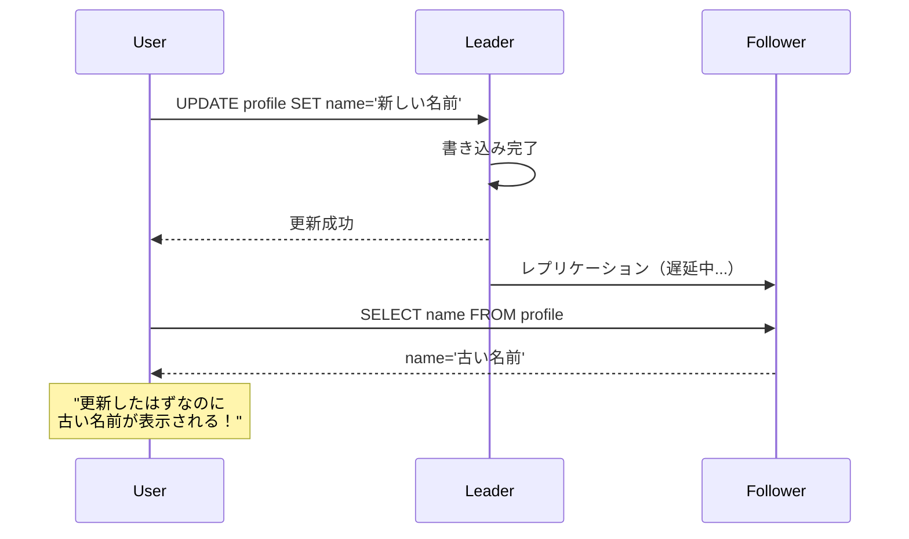

**対策**:

- **自身が更新したデータはリーダーから読み取る**: ユーザーが最近更新した可能性があるデータ（例：自分のプロフィール）はリーダーから読み取り、それ以外はフォロワーから読み取る
- **更新タイムスタンプの追跡**: クライアントが最後の書き込み時刻を記憶し、フォロワーのレプリケーション位置がそれより古い場合はリーダーから読み取る
- **因果的一貫性のトークン**: 書き込み操作の応答にレプリケーション位置のトークンを含め、読み取り時にそのトークンの位置まで追いついたフォロワーのみを使用する

### 5.2 Monotonic Reads（単調読み取り）

ユーザーが同じデータを連続して読み取ったとき、最初の読み取りで新しいデータが返り、次の読み取りで古いデータが返るという「時間の巻き戻り」が発生することがある。これは、1回目の読み取りがレプリケーションラグの少ないフォロワーに、2回目がラグの大きいフォロワーに振られた場合に起きる。

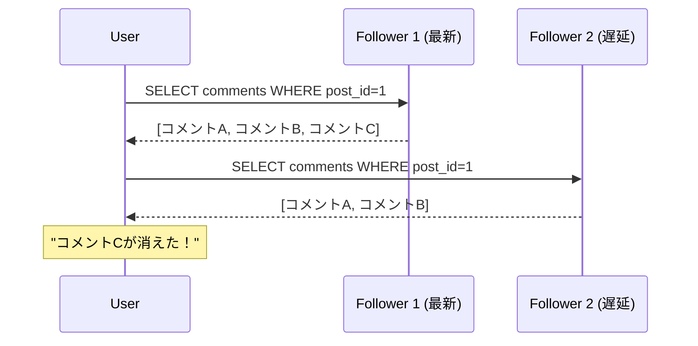

**対策**:

- **同一ユーザーのリクエストを同一フォロワーにルーティング**: ユーザーIDのハッシュ値でフォロワーを決定する（Sticky Session）
- **レプリケーション位置のトラッキング**: 前回の読み取りで使用したレプリケーション位置以降のフォロワーのみを使用する

### 5.3 Consistent Prefix Reads（一貫したプレフィクス読み取り）

因果関係のある複数の書き込みが、フォロワーで異なる順序で観察されるケース。例えば、質問に対する回答が、質問よりも先に表示されてしまう場合がある。

```
Writer:
  1. INSERT "Paxosって何？" (質問)
  2. INSERT "分散合意アルゴリズムです" (回答)

Reader (フォロワー経由):
  1. "分散合意アルゴリズムです" (回答が先に見える)
  2. "Paxosって何？" (質問が後から見える)
```

この問題は、特にシャーディングされたデータベースにおいて、因果的に関連する書き込みが異なるシャードに格納された場合に発生しやすい。

**対策**:

- **因果関係のあるデータを同一パーティションに配置する**
- **因果的順序付け**: 論理時計やバージョンベクトルを用いて因果的な順序を追跡する

## 6. コンフリクト解決

マルチリーダーレプリケーションやリーダーレスレプリケーションでは、複数のノードが同時に同じデータを更新できるため、**書き込みコンフリクト**が不可避的に発生する。

### 6.1 コンフリクトの例

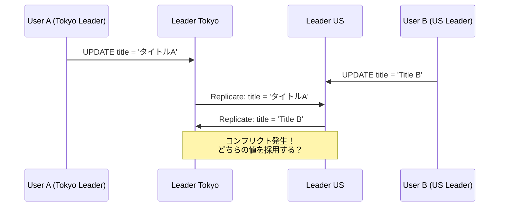

### 6.2 コンフリクト回避

最も単純で効果的なアプローチは、**コンフリクトが発生しないように設計する**ことである。

- **特定のレコードへの書き込みを常に同一のリーダーにルーティングする**: たとえば、ユーザーIDに基づいて担当リーダーを決定する
- **パーティショニングと組み合わせる**: データのパーティションごとにリーダーを割り当てる

ただし、ユーザーの地理的移動やデータセンターの障害でリーダーの割り当てが変わる場合、コンフリクトの回避は保証できなくなる。

### 6.3 Last Write Wins（LWW）

**Last Write Wins（LWW）**は最も単純なコンフリクト解決戦略である。各書き込みにタイムスタンプを付与し、コンフリクト発生時にはタイムスタンプが最も新しい書き込みを採用する。

```
Write 1: title = 'タイトルA' (timestamp: 1000)
Write 2: title = 'Title B'  (timestamp: 1001)

→ LWW解決: title = 'Title B' を採用（新しいタイムスタンプ）
```

**利点**: 実装が単純であり、最終的にすべてのノードが同じ値に収束する

**欠点**:
- **データ損失が発生しうる**: 並行した書き込みのうち1つだけが生き残り、残りは静かに破棄される
- **タイムスタンプの信頼性**: 分散システムでは物理時計の同期が完全でないため、「どちらが後か」の判定が不正確になりうる
- **因果関係の無視**: 因果的に後の書き込みが古いタイムスタンプを持つ可能性がある

CassandraはデフォルトでLWWを使用している。LWWの危険性を理解した上で、同じキーに対して一度しか書き込まない（immutable）ユースケースであればデータ損失のリスクが低い。

### 6.4 マージ関数（Application-Level Resolution）

アプリケーション固有のロジックでコンフリクトを解決する方法である。

- **値の結合**: ショッピングカートの場合、両方のカートのアイテムを和集合として統合する
- **最大値の採用**: カウンターの場合、値が大きい方を採用する
- **ユーザーによる手動解決**: コンフリクトを記録しておき、ユーザーに提示して選択させる（GitのマージコンフリクトやCouchDBのコンフリクトドキュメント）

```
カートの例:
  User A のカート: {りんご, バナナ, みかん}
  User B のカート: {りんご, ぶどう}

  マージ結果（和集合）: {りんご, バナナ, みかん, ぶどう}
```

### 6.5 CRDT（Conflict-Free Replicated Data Types）

**CRDT（Conflict-Free Replicated Data Types）**は、データ構造レベルでコンフリクトのない収束を保証するアプローチである。CRDTは、どのような順序で操作が適用されても最終的に同じ状態に収束するように数学的に設計されている。

代表的なCRDTの例:
- **G-Counter**: 増加のみ可能なカウンター。各ノードが自身のカウンターを持ち、合計値で読み取る
- **PN-Counter**: 増減可能なカウンター。増加用と減少用の2つのG-Counterを組み合わせる
- **LWW-Register**: Last Write Winsセマンティクスのレジスタ
- **OR-Set（Observed-Remove Set）**: 要素の追加と削除が可能なセット

Riak DTやRedis CRDBなどのデータベースがCRDTを組み込みでサポートしている。

## 7. フェイルオーバーとリーダー選出

シングルリーダーレプリケーションにおいて、リーダーが障害を起こした場合にフォロワーの一つを新しいリーダーに昇格させる必要がある。この過程を**フェイルオーバー**と呼ぶ。

### 7.1 フェイルオーバーの手順

1. **リーダーの障害検知**: ハートビートのタイムアウトなどでリーダーの障害を検出する
2. **新リーダーの選出**: フォロワーの中から、最もレプリケーションが進んでいる（リーダーのデータに最も近い）ノードを選出する
3. **クライアントのリダイレクト**: クライアントおよび他のフォロワーが新リーダーに接続先を変更する

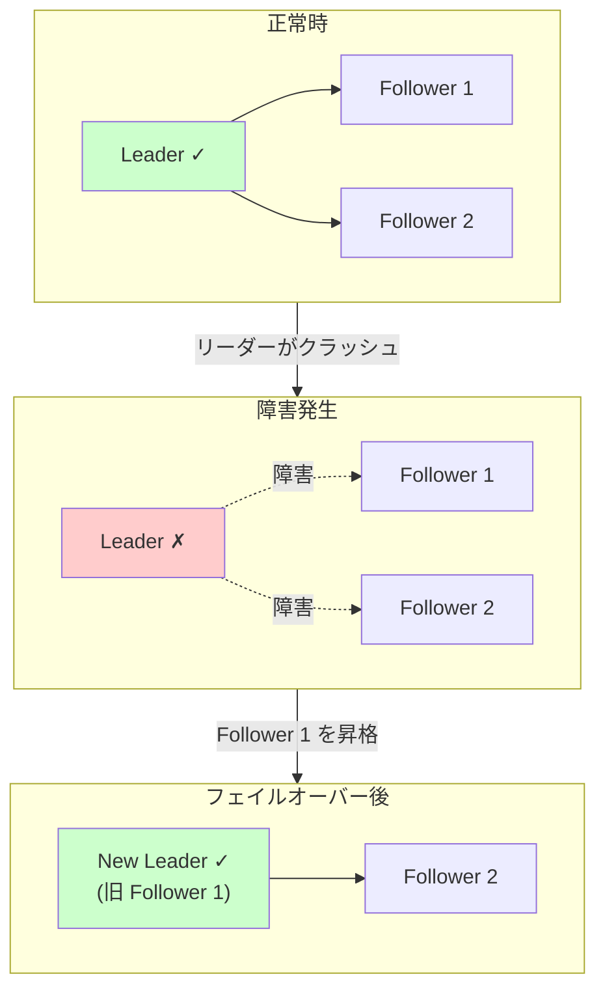

### 7.2 フェイルオーバーの落とし穴

フェイルオーバーは見かけ以上に困難であり、いくつかの深刻な問題が潜んでいる。

**非同期レプリケーションでのデータ損失**: 旧リーダーがフォロワーに未伝搬のデータを持っていた場合、新リーダーはそれらのデータを持っていない。旧リーダーが復帰した際、その未伝搬データをどう扱うかは難しい問題である（通常は破棄するが、それはデータ損失を意味する）。

**スプリットブレイン**: ネットワーク分断により、旧リーダーが自分を依然としてリーダーだと認識している場合、2つのノードが同時にリーダーとして書き込みを受け付ける状態（**スプリットブレイン**）に陥る。この状態は深刻なデータ不整合を引き起こす。

**適切なタイムアウト設定**: 障害検知のタイムアウトが短すぎると、一時的な負荷スパイクやネットワーク遅延で不必要なフェイルオーバーが発生する。長すぎると、真の障害時の復旧が遅れる。

> [!WARNING]
> GitHubの2012年の大規模障害は、MySQLのフェイルオーバー時にスプリットブレインが発生し、データの不整合が起きたことが原因であった。フェイルオーバーの自動化は慎重な設計が求められる。

## 8. 各データベースの実装

### 8.1 MySQL

MySQLのレプリケーションは**binlog（バイナリログ）**に基づいている。

#### binlogのフォーマット

MySQLのbinlogには3つのフォーマットがある。

- **STATEMENT**: SQLステートメントそのものを記録する。古い方式であり前述の非決定性問題がある
- **ROW**: 行の変更前後の値を記録する。現在のデフォルトであり、最も安全
- **MIXED**: 通常はSTATEMENTフォーマットを使い、非決定的な操作の場合にROWフォーマットに切り替える

#### レプリケーションのアーキテクチャ

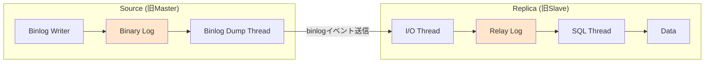

MySQL 8.0以降の主要な機能:

- **GTID（Global Transaction Identifier）**: トランザクションにグローバルに一意なIDを付与し、レプリケーションの位置管理を簡素化する
- **グループレプリケーション（Group Replication）**: Paxosベースのグループ通信プロトコルを使い、マルチソースレプリケーションとフェイルオーバーの自動化を実現する
- **InnoDB Cluster**: Group ReplicationとMySQL Router、MySQL Shellを組み合わせた高可用性ソリューション
- **半同期レプリケーション**: プラグインとして提供され、少なくとも1台のレプリカがbinlogを受信・永続化するまで待つ

### 8.2 PostgreSQL

PostgreSQLは2種類のレプリケーション方式を提供している。

#### ストリーミングレプリケーション（Physical Replication）

WALレコードをそのままフォロワーに転送する方式であり、PostgreSQLのデフォルトのレプリケーション方式である。

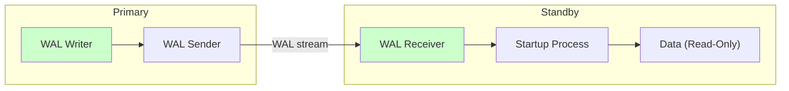

- **同期/非同期の選択**: `synchronous_commit` パラメータで制御。`on`（ローカルディスクのみ）、`remote_write`（リモートへの書き込みまで）、`remote_apply`（リモートでの適用まで）を指定可能
- **ホットスタンバイ**: スタンバイサーバーで読み取りクエリを実行できる
- **カスケードレプリケーション**: スタンバイがさらに別のスタンバイにWALを転送できる

#### 論理レプリケーション（Logical Replication）

PostgreSQL 10で導入された。WALから論理的な変更をデコードし、Publication/Subscriptionモデルで伝搬する。

```sql
-- Publisher側
CREATE PUBLICATION my_pub FOR TABLE users, orders;

-- Subscriber側
CREATE SUBSCRIPTION my_sub
  CONNECTION 'host=primary dbname=mydb'
  PUBLICATION my_pub;
```

**利点**:
- 異なるメジャーバージョン間でのレプリケーションが可能（ローリングアップグレードに有用）
- テーブル単位での選択的レプリケーション
- 異なるスキーマやインデックスを持つレプリカの構築

### 8.3 MongoDB

MongoDBのレプリケーションは**レプリカセット（Replica Set）**と呼ばれる構成を採用している。

#### レプリカセットの構成

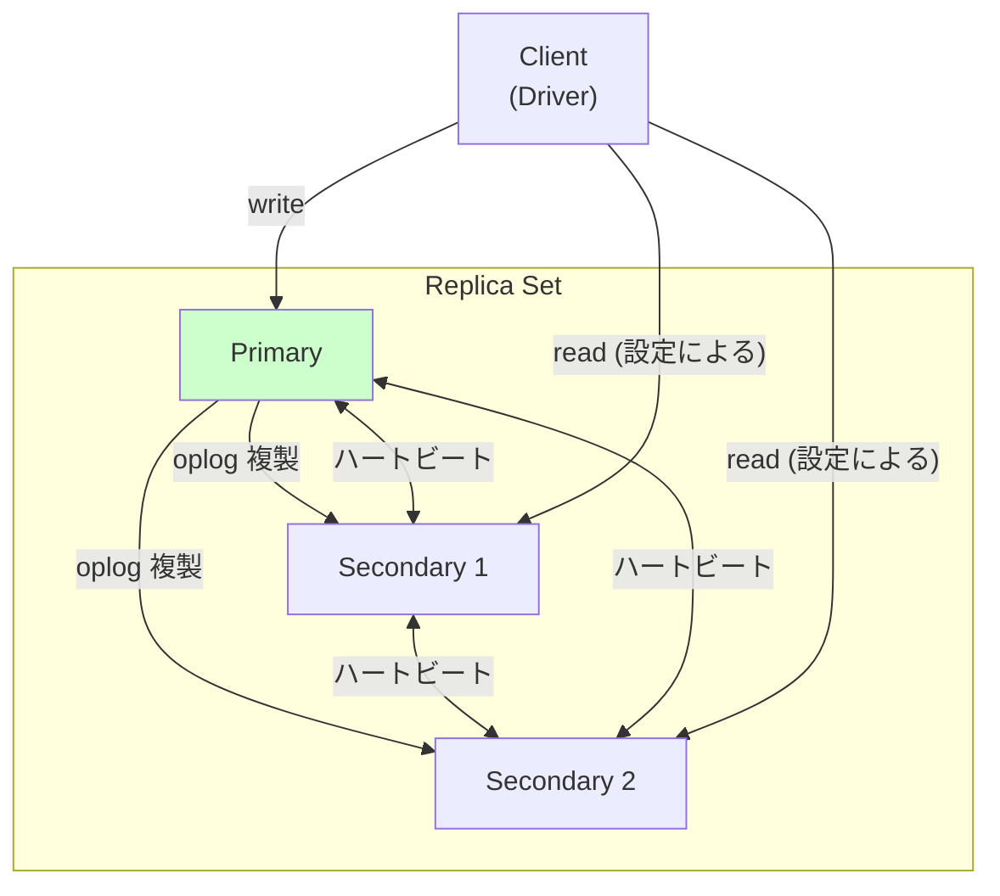

- **oplog（Operation Log）**: MongoDBのレプリケーションログ。capped collection（サイズ固定のコレクション）として実装されており、各操作は冪等な形式で記録される
- **自動フェイルオーバー**: Primary障害時、Secondaryノードの間でRaftベースの選挙プロトコルにより新しいPrimaryが自動的に選出される
- **Write Concern**: 書き込みの確認レベルを指定できる
  - `w: 1` — Primaryのみに書き込み（デフォルト）
  - `w: "majority"` — 過半数のノードへの書き込みを確認
  - `w: 0` — 書き込み確認なし（fire-and-forget）
- **Read Preference**: 読み取りの振り先を指定できる
  - `primary` — 常にPrimaryから読み取り
  - `primaryPreferred` — Primaryが利用可能ならPrimary、そうでなければSecondary
  - `secondary` — Secondaryから読み取り
  - `secondaryPreferred` — Secondaryが利用可能ならSecondary
  - `nearest` — ネットワーク的に最も近いノード

#### 因果的一貫性セッション

MongoDB 3.6以降、**因果的一貫性セッション（Causal Consistency Session）**が導入された。セッション内で、read-after-write consistency、monotonic reads、monotonic writes、writes follow readsが保証される。

```javascript
// Causal Consistency Session example
const session = client.startSession({ causalConsistency: true });
const collection = client.db("test").collection("items");

// Write operation
collection.insertOne({ item: "example" }, { session });

// Read operation in the same session
// Guarantees read-after-write consistency
collection.find({}, { session });

session.endSession();
```

## 9. レプリケーションのトポロジ

マルチリーダーレプリケーションにおいて、リーダー間でどのようにデータを伝搬するかの**トポロジ**は、障害耐性とレイテンシに直結する。

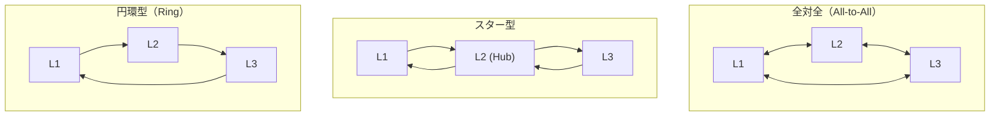

| トポロジ | 障害耐性 | レイテンシ | 順序保証 |
|---|---|---|---|
| 全対全 | 高い（代替経路あり） | 低い | 順序逆転の可能性あり |
| スター型 | ハブが単一障害点 | 中程度 | ハブが順序を管理 |
| 円環型 | 1ノード障害で全体に影響 | 高い | 順序が保証される |

MySQLの従来のマルチソースレプリケーションでは円環型やスター型が多く使われていたが、現在のGroup Replicationでは全対全のトポロジがベースとなっている。

## 10. レプリケーションラグの監視と対応

### 10.1 レプリケーションラグの監視

レプリケーションラグの監視は運用上不可欠である。各データベースでの確認方法を示す。

**MySQL**:

```sql
-- Replica側で実行
SHOW REPLICA STATUS\G
-- Seconds_Behind_Source フィールドを確認
```

**PostgreSQL**:

```sql
-- Primary側で実行
SELECT client_addr, state, sent_lsn, write_lsn, flush_lsn, replay_lsn,
       (sent_lsn - replay_lsn) AS replication_lag_bytes
FROM pg_stat_replication;
```

**MongoDB**:

```javascript
// Replica Set のステータス確認
rs.status()
// optimeDate と lastHeartbeat の差分を確認
```

### 10.2 レプリケーションラグが増大する原因

- **フォロワーの処理能力不足**: CPUやI/Oのボトルネック
- **大量の書き込みバースト**: バッチ処理やデータ移行
- **ネットワーク帯域の制約**: 特に地理的に離れたレプリカ
- **長時間実行クエリ**: フォロワーでの重いクエリがレプリケーション適用をブロックする（PostgreSQLのhotstandbyでは `max_standby_streaming_delay` で制御）
- **DDL操作**: 大きなテーブルのスキーマ変更（`ALTER TABLE`）がレプリケーションを長時間ブロックする

### 10.3 レプリケーションラグへの対策

- **アラートの設定**: レプリケーションラグが閾値を超えた場合の通知
- **読み取りのルーティング制御**: ラグの大きいフォロワーを読み取り先から一時的に除外する
- **並列レプリケーション**: MySQL 8.0のマルチスレッドレプリカ（`replica_parallel_workers`）やPostgreSQLの並列リカバリ機能を活用する
- **フォロワーのスペック増強**: CPUやI/O性能の向上

## 11. レプリケーションとCAP定理

レプリケーションの設計は、CAP定理と密接に関連している。CAP定理は、ネットワーク分断（Partition）が発生した場合に、一貫性（Consistency）と可用性（Availability）を同時に完全には満たせないことを述べている。

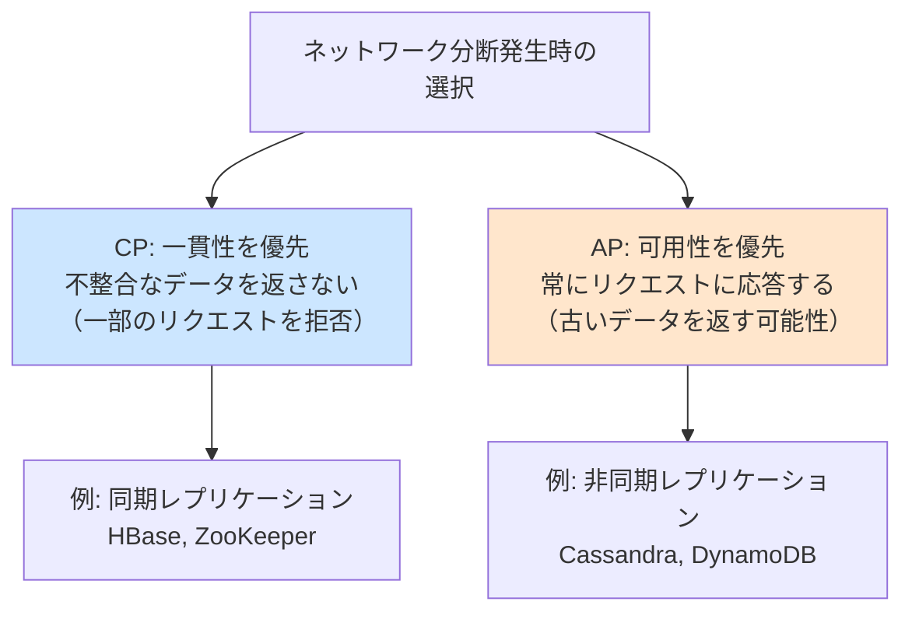

実用上は、多くのシステムがPACELC（ネットワーク分断時はAvailabilityとConsistencyの選択、正常時はLatencyとConsistencyの選択）の枠組みで設計を行っている。

| データベース | 分断時の選択 | 正常時のトレードオフ |
|---|---|---|
| PostgreSQL (同期レプリケーション) | CP寄り | 一貫性重視（レイテンシ犠牲） |
| MySQL (非同期レプリケーション) | AP寄り | レイテンシ重視（結果整合性） |
| Cassandra | AP | レイテンシ重視（チューナブル一貫性） |
| MongoDB (w:majority) | CP寄り | 一貫性重視 |

## 12. 設計上の考慮事項とベストプラクティス

### 12.1 レプリケーション方式の選択基準

レプリケーション方式の選択は、ワークロードの特性と要件に基づいて行うべきである。

**シングルリーダーを選ぶべき場合**:
- 読み取りと書き込みの比率が高い（read-heavy）
- 強い一貫性が求められる
- 書き込みのスケーラビリティがボトルネックでない

**マルチリーダーを選ぶべき場合**:
- マルチデータセンター構成が必要
- オフライン対応が必要
- 書き込みレイテンシの低減が重要

**リーダーレスを選ぶべき場合**:
- 極めて高い書き込み可用性が必要
- 結果整合性が許容される
- チューナブルな一貫性レベルが求められる

### 12.2 レプリカの数とフェイルオーバー

- **最低3台構成**: フェイルオーバー時にもクォーラムを維持するため、最低3台のノードが推奨される
- **奇数台構成**: コンセンサスアルゴリズム（Raft、Paxos）でのスプリットブレイン回避のため、奇数台が望ましい
- **地理的分散**: 同一データセンター内にすべてのレプリカを配置すると、データセンター全体の障害に対応できない

### 12.3 バックアップとレプリケーションの違い

レプリケーションはバックアップの代替にはならない。この点はしばしば誤解される。

- **レプリケーション**: リーダーでの誤った操作（`DROP TABLE`）はフォロワーにも即座に伝搬する
- **バックアップ**: ポイントインタイムリカバリにより、任意の時点のデータに復元できる

> [!CAUTION]
> レプリケーションは**高可用性**のための仕組みであり、**データ保護**のためにはポイントインタイムリカバリが可能なバックアップが不可欠である。両方を組み合わせて初めて堅牢なデータ保護が実現する。

## 13. まとめ

データベースレプリケーションは、高可用性、読取スケーラビリティ、地理的分散という3つの目的を達成するための基盤技術である。しかし、データを複数のノードに複製するという行為は、一貫性、性能、可用性の間のトレードオフを生む。

本記事で扱った主要なトピックを整理する。

| 設計軸 | 選択肢 | トレードオフ |
|---|---|---|
| リーダーの数 | シングルリーダー / マルチリーダー / リーダーレス | 一貫性 vs 書き込みスケーラビリティ |
| 同期性 | 同期 / 非同期 / 半同期 | 耐久性 vs レイテンシ |
| 実装方式 | WALベース / 論理 / ステートメント | 互換性 vs 効率性 |
| コンフリクト解決 | LWW / マージ関数 / CRDT | 単純性 vs データ保全性 |

レプリケーションの設計に「正解」はない。重要なのは、自身のシステムの要件（どの程度のデータ損失が許容されるか、どの程度のレイテンシが許容されるか、どの程度の可用性が必要か）を正確に理解し、それに基づいて適切なトレードオフを選択することである。

分散システムの設計者であるPeter Bailis氏の言葉を借りれば、「一貫性の保証を強くするほど、可用性やレイテンシを犠牲にする」のであり、この本質的なトレードオフはレプリケーションの設計において常に意識すべき原則である。
