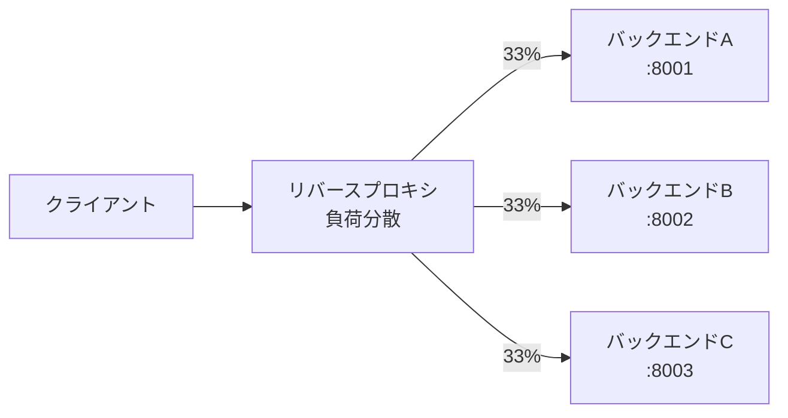
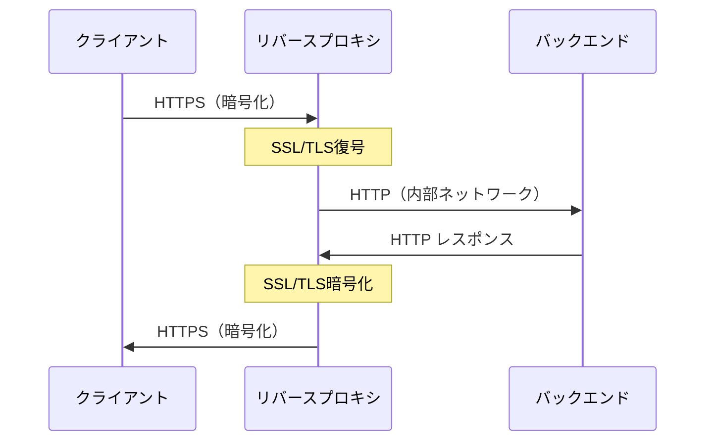
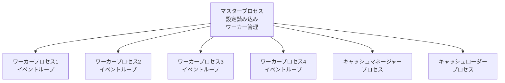
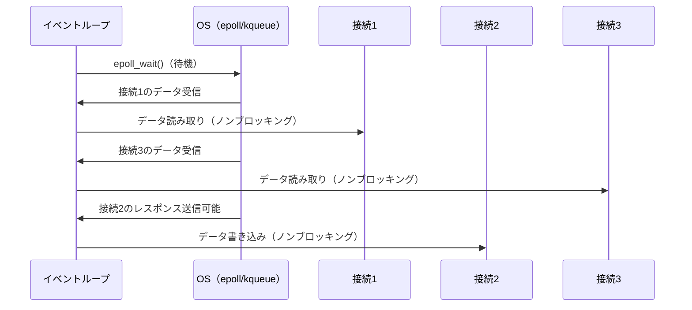
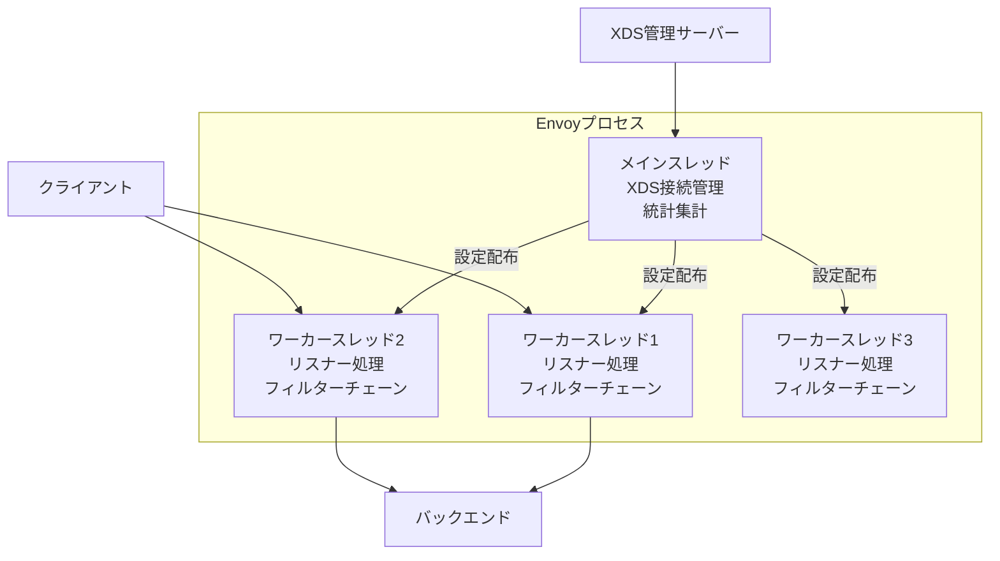
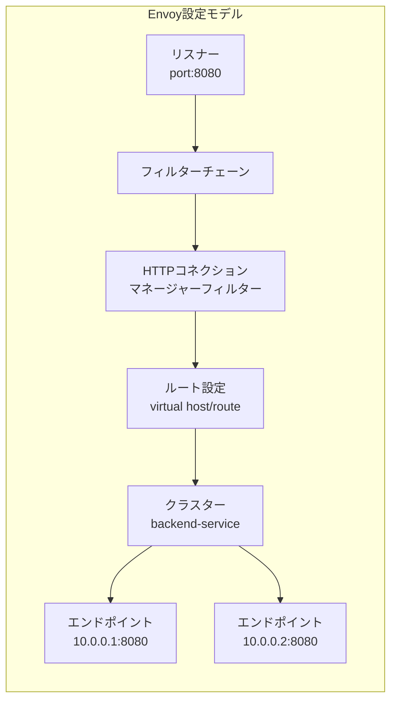
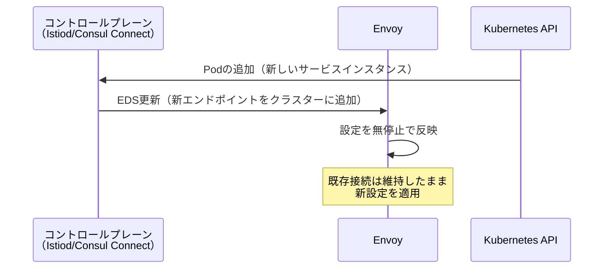
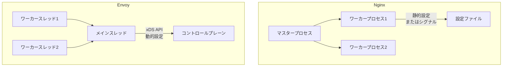
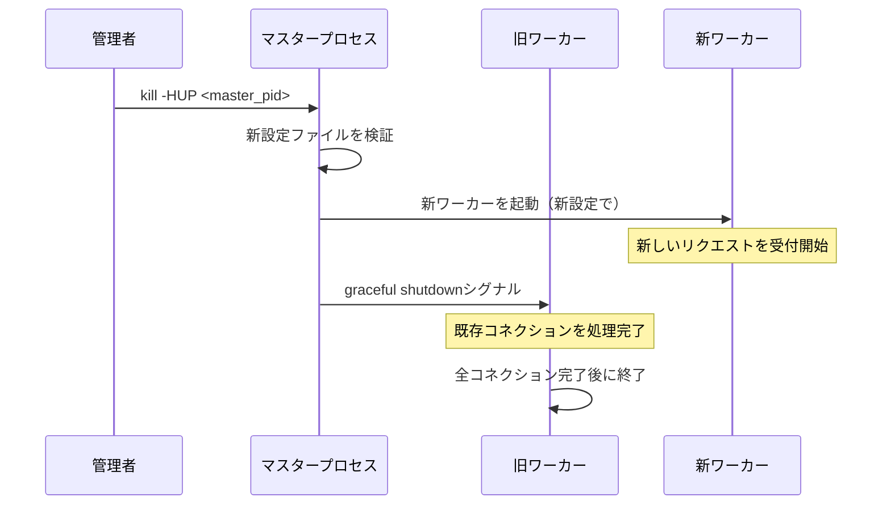
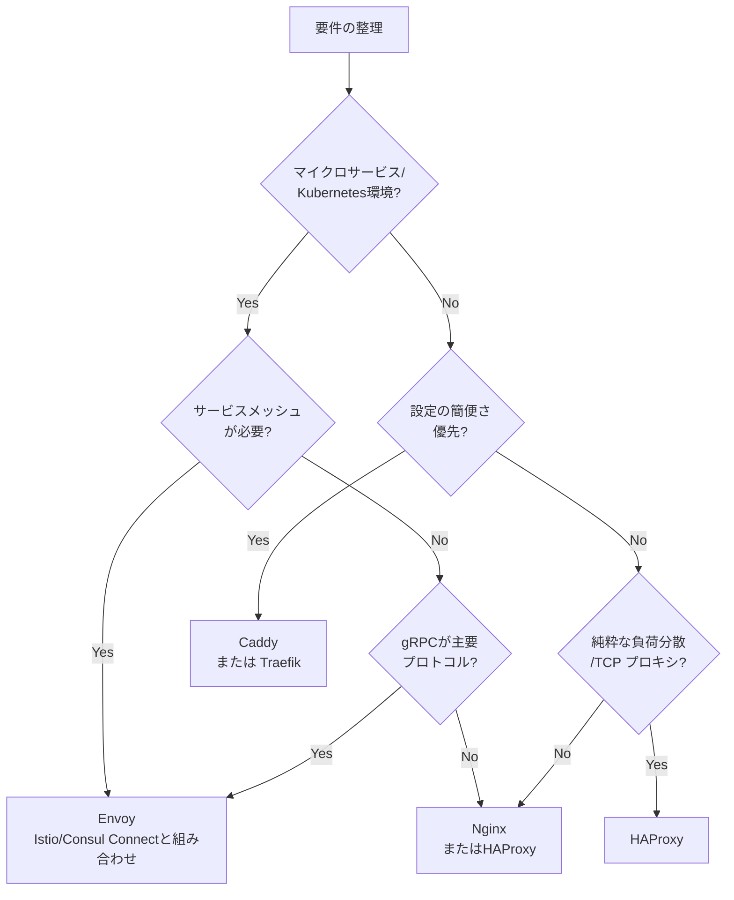

# リバースプロキシ（Nginx, Envoy）

## 1. 歴史的背景

### 1.1 プロキシの誕生

プロキシ（Proxy）という概念は、インターネットが現在のような規模に成長するはるか以前、1990年代初頭のネットワーク環境に起源を持つ。当時のネットワーク接続は低速で高価であり、多数のクライアントが同じリソースに繰り返しアクセスするケースが多かった。この非効率性を解消するために生まれたのがフォワードプロキシである。

フォワードプロキシは**クライアント側に代わって**インターネットにアクセスするサーバーである。企業や大学のネットワークにプロキシサーバーを設置し、すべての外部アクセスをそこを経由させることで、頻繁にアクセスされるウェブページやファイルをキャッシュして帯域幅を節約した。同時に、プロキシはアクセス制御やコンテンツフィルタリングの手段としても機能し、組織のセキュリティポリシーを実施する場所となった。

初期の代表的な実装としては、CERN（欧州原子核研究機関）で開発されたCERN httpd（1990年）や、後に広く普及したSquid（1996年）などが挙げられる。これらはインターネットの急速な普及に合わせて、多くの組織のネットワーク境界に設置された。

### 1.2 フォワードプロキシとリバースプロキシの違い

フォワードプロキシとリバースプロキシは、どちらも「中間に立つサーバー」という共通点を持つが、その目的と配置が根本的に異なる。

```
フォワードプロキシ:

[クライアントA] ─┐
[クライアントB] ─┤→ [フォワードプロキシ] → インターネット → [サーバー]
[クライアントC] ─┘

リバースプロキシ:

                              ┌→ [バックエンドサーバーA]
[クライアント] → インターネット → [リバースプロキシ] ─┤→ [バックエンドサーバーB]
                              └→ [バックエンドサーバーC]
```

**フォワードプロキシ**はクライアント側の代理人である。クライアントはプロキシサーバーを意識的に設定し、すべてのリクエストをそこに送る。サーバー側からは、実際にアクセスしているクライアントのIPアドレスではなく、プロキシのIPアドレスが見える。VPNや企業内プロキシがこれに該当する。

**リバースプロキシ**はサーバー側の代理人である。クライアントはリバースプロキシの存在をほとんど意識しない——あるいはまったく知らない。クライアントからは単一のサーバー（例：`api.example.com`）にアクセスしているように見えるが、実際にはリバースプロキシがリクエストを受け取り、内部の複数のバックエンドサーバーに転送している。

この「透明性」こそがリバースプロキシの本質的な特徴である。クライアントに対しては一枚岩のエンドポイントとして振る舞いながら、裏側では複雑なルーティングやサービス管理を行う。

### 1.3 リバースプロキシの登場と進化

Webサーバーの商用利用が本格化した1990年代後半、Webサイトへのトラフィックが急増し始めた。単一のサーバーではリクエストをさばき切れなくなり、複数のサーバーに負荷を分散させる必要が生じた。これがリバースプロキシとしての機能が本格的に求められた契機である。

1995年にはApache HTTP Serverが登場し、`mod_proxy` モジュールによるプロキシ機能が提供された。しかし、Apacheはリクエストごとにスレッド（またはプロセス）を割り当てる「マルチスレッド/マルチプロセスモデル」を採用しており、同時接続数が増大すると深刻なパフォーマンス問題（いわゆる「C10K問題」）を引き起こした。

この問題を解決するため、イベント駆動アーキテクチャを採用した新世代のプロキシソフトウェアが登場した。その代表が**Nginx**（2004年公開）である。Nginxは1万件の同時接続を効率的に処理することを明確な目標として設計され、現代のリバースプロキシの基礎を作った。

2010年代に入るとクラウドコンピューティングとマイクロサービスアーキテクチャが普及し、プロキシに求められる役割はさらに高度化した。単純な負荷分散を超えて、サービスメッシュ、動的設定更新、詳細な可観測性といった機能が必要とされるようになった。この要求に応えるため、Lyftが2016年に**Envoy**を公開し、L7プロキシの新たなパラダイムを示した。

## 2. リバースプロキシの役割

リバースプロキシは単なるトラフィック転送装置ではなく、現代のWebインフラにおける多機能なミドルウェアである。その主要な役割を詳しく見ていこう。

### 2.1 負荷分散

最も基本的かつ重要な役割が負荷分散（Load Balancing）である。単一のバックエンドサーバーに集中するトラフィックを、複数のサーバーに均等に分散させることで、システム全体のスループットを向上させ、単一障害点を排除する。

主要な負荷分散アルゴリズムには以下のものがある。

| アルゴリズム | 説明 | 適したユースケース |
|---|---|---|
| ラウンドロビン | 順番にリクエストを配布 | 均一な処理時間のリクエスト |
| 重み付きラウンドロビン | サーバー性能に応じて配布量を調整 | 異なるスペックのサーバー混在 |
| 最小接続数 | 最もアクティブ接続が少ないサーバーへ | 処理時間の長いリクエスト |
| IPハッシュ | クライアントIPに基づいて固定配布 | セッション維持が必要な場合 |
| ランダム | ランダムにサーバーを選択 | シンプルな分散が必要な場合 |



ヘルスチェックも負荷分散の重要な要素である。リバースプロキシは定期的にバックエンドサーバーの死活確認を行い、障害が発生したサーバーを自動的にルーティング対象から除外する。これにより、バックエンドの一部が障害を起こしても、サービス全体は継続して動作する。

### 2.2 SSL/TLS終端

現代のWebではHTTPSが標準となっているが、SSL/TLSの暗号化・復号処理はCPU負荷が高い。リバースプロキシがSSL/TLS終端（SSL Termination）を担うことで、バックエンドサーバーの負担を軽減できる。



この構成には複数のメリットがある。まず、SSL証明書の管理を一箇所に集約できる。複数のバックエンドサーバーそれぞれに証明書を配置・更新する代わりに、リバースプロキシだけで管理すればよい。次に、バックエンドとの通信が内部ネットワーク内であれば平文HTTPを使用でき、ハードウェアリソースを節約できる。

さらに、Let's Encryptのような自動証明書発行・更新サービスとの統合も、リバースプロキシ側で一括して行える。CaddyやTraefikはこの機能をネイティブに統合している。

### 2.3 キャッシュ

静的コンテンツ（画像、CSS、JavaScript、HTMLなど）やキャッシュ可能なAPIレスポンスをリバースプロキシ側でキャッシュすることで、バックエンドへのリクエスト数を大幅に削減できる。

キャッシュの有効期限はHTTPの `Cache-Control` ヘッダーや `Expires` ヘッダーに基づいて制御される。リバースプロキシはこれらのヘッダーを解釈し、適切なキャッシュポリシーを適用する。

```
# Nginx のキャッシュ設定例
proxy_cache_path /var/cache/nginx levels=1:2 keys_zone=my_cache:10m max_size=1g
                 inactive=60m use_temp_path=off;

server {
    location / {
        proxy_cache my_cache;
        # Cache for 10 minutes
        proxy_cache_valid 200 10m;
        # Add cache status header for debugging
        add_header X-Cache-Status $upstream_cache_status;
    }
}
```

コンテンツデリバリーネットワーク（CDN）は、このリバースプロキシのキャッシュ機能を地理的に分散させたものと考えることができる。世界各地に配置されたエッジサーバーがそれぞれキャッシュを持ち、ユーザーに最も近い場所からコンテンツを配信する。

### 2.4 セキュリティ

リバースプロキシはセキュリティの観点でも重要な役割を果たす。

**バックエンドの隠蔽**: クライアントはリバースプロキシのIPアドレスしか知らない。バックエンドサーバーの実際のIPアドレスや内部構造は隠蔽され、直接攻撃を受けにくくなる。

**WAF（Web Application Firewall）**: SQLインジェクション、XSS、CSRF攻撃などのWebアプリケーション攻撃パターンを検知してブロックする。NginxではModSecurityモジュールを組み合わせることでWAF機能を実現できる。

**DDoS緩和**: レート制限（Rate Limiting）機能により、特定のIPアドレスからの過剰なリクエストを制限できる。また、SYN Cookie、コネクション制限といったL4レベルの防御も担える。

**リクエスト検証**: 不正なヘッダー、過大なボディサイズ、不正なHTTPメソッドなどをフィルタリングし、バックエンドへの不正なリクエストを排除できる。

### 2.5 その他の機能

リバースプロキシが提供するその他の重要な機能を挙げる。

- **圧縮**: gzipやBrotliによるレスポンス圧縮でネットワーク帯域を節約
- **URLリライト**: URLのパターンマッチングと書き換えでルーティングを柔軟に制御
- **A/Bテスト**: トラフィックの一部を新バージョンに振り分けるカナリアリリース
- **認証の集約**: JWTやOAuth2トークンの検証をバックエンドの手前で一元化
- **アクセスログ**: クライアントの詳細なアクセス記録をバックエンドに負担をかけずに取得

## 3. Nginxのアーキテクチャ

### 3.1 誕生の背景：C10K問題

2000年代初頭、WebエンジニアはC10K問題（1万同時接続問題）に直面していた。当時主流だったApacheのような「接続ごとにスレッド/プロセスを割り当てる」アーキテクチャでは、数千の同時接続が来ると、スレッドのコンテキストスイッチングとメモリ消費がシステムリソースを枯渇させた。

Igor Sysoevは2002年にこの問題を解決するためにNginxの開発を開始し、2004年に公開した。設計の核心は**イベント駆動、非同期、シングルスレッド**というアーキテクチャにある。

### 3.2 マスター・ワーカープロセスモデル

Nginxは複数のプロセスから構成されるが、その構造は単純で明快である。



**マスタープロセス**: 設定ファイルを読み込み、ワーカープロセスを生成・管理する。シグナル（SIGHUP、SIGUSR1など）を受け取って設定のリロードやログのローテーションを行う。特権が必要な操作（ポート80/443へのバインドなど）をここで実行し、ワーカーは非特権ユーザーで動作させることができる。

**ワーカープロセス**: 実際のリクエスト処理を担う。通常はCPUコア数と同じ数を起動する（`worker_processes auto`）。各ワーカーは独立したイベントループを持ち、数千の同時接続を一つのスレッドで処理する。

### 3.3 イベント駆動モデルとノンブロッキングI/O

Nginxが高い並行処理性能を実現できる核心は、**ノンブロッキングI/OとI/O多重化**にある。



LinuxではepollAPI、BSDではkqueue、SolarisではeventportというOS提供の効率的なI/O多重化機構を使用する。これにより、シングルスレッドで数万の接続を同時に監視し、I/Oが準備できた接続から順番に処理できる。

スレッドベースのサーバーと比較した際のメリットを整理すると以下のようになる。

| 項目 | スレッドモデル（Apache mpm_prefork） | イベント駆動モデル（Nginx） |
|---|---|---|
| 同時接続1万件のメモリ使用 | 〜10GB（1接続1スレッド×1MB） | 〜25MB（1ワーカー×25MB程度） |
| コンテキストスイッチング | 頻繁に発生、オーバーヘッド大 | ほぼなし |
| プログラミングモデル | 単純（同期的） | 複雑（非同期的） |
| CPUバウンド処理 | 各スレッドが並行処理 | ブロッキングが発生 |

ただし、イベント駆動モデルの弱点もある。CPUを長時間占有する処理（重い計算、ブロッキングなシステムコールなど）が発生すると、同じワーカーが処理している他の全接続がその間ブロックされてしまう。Nginxはこの問題に対応するため、ファイルI/Oなどにスレッドプールをオプションとしてサポートしている。

### 3.4 設定モデル

Nginxの設定はディレクティブとコンテキストの階層構造で記述する。

```nginx
# Main context
worker_processes auto;
error_log /var/log/nginx/error.log warn;

events {
    # Events context: connection handling settings
    worker_connections 1024;
    use epoll;
}

http {
    # HTTP context: shared configuration for all virtual hosts
    include mime.types;

    # Upstream block: define backend server groups
    upstream backend {
        least_conn;
        server backend1.example.com:8080 weight=3;
        server backend2.example.com:8080 weight=2;
        server backend3.example.com:8080 backup;
    }

    server {
        # Server context: virtual host configuration
        listen 443 ssl;
        server_name api.example.com;

        ssl_certificate /etc/ssl/certs/example.com.crt;
        ssl_certificate_key /etc/ssl/private/example.com.key;

        location /api/ {
            # Location context: URL-specific settings
            proxy_pass http://backend;
            # Preserve client's real IP
            proxy_set_header X-Real-IP $remote_addr;
            proxy_set_header X-Forwarded-For $proxy_add_x_forwarded_for;
            proxy_set_header Host $http_host;

            # Rate limiting
            limit_req zone=api_limit burst=20 nodelay;
        }

        location /static/ {
            # Serve static files directly, bypassing backend
            root /var/www;
            expires 30d;
            add_header Cache-Control "public, immutable";
        }
    }
}
```

**継承と上書きの仕組み**: 親コンテキストで設定された値は子コンテキストに継承されるが、子コンテキストで同じディレクティブを指定すると上書きされる。ただし、これはディレクティブの型（単純なディレクティブかブロックディレクティブか、配列型かどうか）によって振る舞いが異なる点に注意が必要である。

### 3.5 モジュールシステム

Nginxの機能はモジュールによって構成される。コアモジュール（HTTP、イベント処理など）は組み込みであるが、多くの機能がモジュールとして提供される。

歴史的にNginxは静的モジュールのみをサポートし、モジュールはコンパイル時に組み込む必要があった。Nginx 1.9.11（2016年）からは動的モジュールがサポートされ、`load_module` ディレクティブで実行時にロードできるようになった。

代表的なサードパーティモジュールとして、ModSecurity（WAF）、lua-nginx-module（Lua スクリプティング）、nginx-module-vts（トラフィック統計）などがある。OpenRestyは、Nginxにlua-nginx-moduleやその他多数のモジュールをバンドルした派生ディストリビューションであり、Luaスクリプトで柔軟なカスタムロジックを実装できる。

## 4. Envoyのアーキテクチャ

### 4.1 誕生の背景

Envoyは2016年にLyft（ライドシェアサービス）が社内で開発・使用していたプロキシをOSSとして公開したものである。Lyftはマイクロサービスアーキテクチャへの移行に伴い、サービス間通信の複雑さが爆発的に増大するという課題に直面した。

その課題とは次のようなものである。数十〜数百のマイクロサービスが相互に通信する環境では、リトライ、タイムアウト、サーキットブレーカー、分散トレーシングといった機能が各サービスに必要となる。しかし、これらをアプリケーションコードに実装すると、言語やフレームワークの違いによって実装のばらつきが生じ、メンテナンスも困難になる。

Envoyはこの問題を「ネットワーク機能をアプリケーション外部のサイドカープロキシとして提供する」というアプローチで解決した。各マイクロサービスの隣にEnvoyコンテナを配置し、サービス間の通信はすべてEnvoyを経由させる。これがサービスメッシュの基本的な考え方であり、IstioやConsul Connectといったサービスメッシュ実装の基盤となっている。

### 4.2 コアアーキテクチャ

Envoyはシングルプロセスで、複数のスレッドを使用する。



**メインスレッド**: 設定管理、XDS接続、統計の集計・エクスポートを担当する。

**ワーカースレッド**: 実際のリクエスト処理を担当する。各ワーカーは独立したイベントループを持ち、Nginxのワーカープロセスと同様の役割を果たすが、プロセスではなくスレッドである点が異なる。スレッド間でメモリを共有できるため、設定の更新などのコスト削減につながる一方、スレッドセーフな実装が求められる。

### 4.3 リスナー・フィルターチェーンモデル

Envoyの設定は、**リスナー（Listener）**、**ルート（Route）**、**クラスター（Cluster）**、**エンドポイント（Endpoint）**という4つの主要概念で構成される。



**リスナー**: ポートとプロトコルのバインド設定。L4（TCP/UDP）レベルでの受信を担う。

**フィルターチェーン**: リスナーにアタッチされる処理パイプライン。L4フィルター（TLSインスペクション、レート制限など）とL7フィルター（HTTP処理、gRPC転写など）の二層構造になっている。

**HTTPコネクションマネージャー（HCM）**: 最も重要なL7フィルターであり、HTTPリクエストのパース、ルーティング、ヘッダー操作などを担う。

**クラスター**: バックエンドサービスの定義。ロードバランシングアルゴリズム、ヘルスチェック設定、サーキットブレーカー設定などを含む。

**エンドポイント**: クラスターに属する個々のバックエンドインスタンス（IPアドレス+ポート）。

### 4.4 xDS API：動的設定管理

Envoyの最も革新的な機能の一つが**xDS（x Discovery Service）API**である。従来のプロキシが静的な設定ファイルで動作するのに対し、EnvoyはgRPCまたはRESTベースのAPIを通じて、設定を動的に受け取ることができる。

xDSは複数のAPIの総称である。

| API名 | 略称 | 説明 |
|---|---|---|
| Listener Discovery Service | LDS | リスナー設定の動的配信 |
| Route Discovery Service | RDS | ルート設定の動的配信 |
| Cluster Discovery Service | CDS | クラスター設定の動的配信 |
| Endpoint Discovery Service | EDS | エンドポイント（バックエンドIP）の動的配信 |
| Secret Discovery Service | SDS | TLS証明書の動的配信 |
| Aggregated Discovery Service | ADS | 上記すべてを単一ストリームで提供 |



この動的設定管理がサービスメッシュを実現する鍵となる。Kubernetesでは、Podのスケールアウト・スケールダウン、デプロイによるIPアドレスの変更が頻繁に発生する。xDS APIを使えば、これらの変更をEnvoyに即座に伝播でき、サービスディスカバリとロードバランシングを自動化できる。

### 4.5 可観測性：Envoyの強み

Envoyは設計段階から可観測性（Observability）を重視しており、以下の三つの観点で詳細な情報を提供する。

**メトリクス**: Prometheusフォーマットで数百種類のメトリクスを提供する。リクエスト数、レイテンシ（p50/p95/p99）、エラー率、アップストリームの接続状態、サーキットブレーカーの状態など、運用に必要な情報がデフォルトで収集される。

```
# Example of Envoy metrics (Prometheus format)
envoy_cluster_upstream_rq_total{cluster_name="backend-service"} 12345
envoy_cluster_upstream_rq_time_bucket{cluster_name="backend-service",le="25"} 8901
envoy_cluster_upstream_cx_active{cluster_name="backend-service"} 42
```

**分散トレーシング**: Zipkin、Jaeger、AWS X-Ray、Datadogなどのトレーシングバックエンドに対応した分散トレーシングをビルトインでサポートする。サービスメッシュ環境では、リクエストがどのサービスを経由したか、各サービスでどれだけ時間を消費したかを視覚的に把握できる。

**アクセスログ**: JSON形式での詳細なアクセスログ出力をサポートし、カスタムフィールドの追加も容易である。ログフォーマットにはリクエストID、トレースID、バックエンドのレスポンスタイムなど、診断に必要な豊富な情報を含められる。

### 4.6 高度なL7機能

Envoyはレイヤー7（アプリケーション層）の深い機能を多数提供する。

**サーキットブレーカー**: バックエンドサービスへの接続数、ペンディングリクエスト数、リトライ数に上限を設定し、カスケード障害を防止する。

```yaml
# Example Envoy circuit breaker configuration
circuit_breakers:
  thresholds:
    - priority: DEFAULT
      # Maximum concurrent connections
      max_connections: 1000
      # Maximum pending requests
      max_pending_requests: 1000
      # Maximum concurrent requests
      max_requests: 1000
      # Maximum retries in progress
      max_retries: 3
```

**リトライポリシー**: 失敗したリクエストの自動リトライ条件（5xx、接続失敗など）、リトライ回数、指数バックオフなどを細かく制御できる。

**トラフィックシェーピング**: 重み付きルーティング（カナリアリリース）、リクエストミラーリング（シャドウトラフィック）、フォルトインジェクション（テスト用の意図的なエラー注入）をサポートする。

**gRPCの深いサポート**: gRPCのトランスコーディング（gRPC ↔ HTTP/JSON変換）、gRPCウェブ（WebSocket経由でgRPCを使用）、gRPCメタデータのルーティングなど、gRPCに対する豊富なサポートを持つ。

## 5. 主要機能の比較

NginxとEnvoyを代表的な機能軸で比較する。

### 5.1 アーキテクチャの比較



| 項目 | Nginx | Envoy |
|---|---|---|
| 実装言語 | C | C++ |
| プロセスモデル | マルチプロセス | マルチスレッド |
| 設定方法 | 静的ファイル（Hot reload可能） | xDS APIによる動的更新 |
| 設定言語 | 独自DSL | protobuf（YAML/JSON） |
| モジュール拡張 | C/Lua（OpenResty経由） | フィルターAPI（C++） |
| メモリ使用量 | 非常に少ない | Nginxより多め |

### 5.2 ルーティング

**Nginx**: `location` ブロックによる正規表現マッチング、プレフィックスマッチング、完全一致マッチングをサポート。`map` モジュールによる変数マッピングや、`if` ディレクティブによる条件分岐も可能。ただし `if` の使用は多くのエッジケースがあるため非推奨とされることが多い。

```nginx
server {
    # Longest prefix match
    location /api/ {
        proxy_pass http://api_backend;
    }

    # Regex match (case-sensitive)
    location ~ ^/v[0-9]+/api/ {
        proxy_pass http://versioned_api_backend;
    }

    # Exact match (highest priority)
    location = /health {
        return 200 "OK";
    }
}
```

**Envoy**: ヘッダー値、クエリパラメータ、パスプレフィックス、正規表現、gRPCサービス名など、より豊富な条件でルーティングを定義できる。重み付きルーティングによるトラフィック分割もネイティブにサポートする。

```yaml
# Example Envoy route configuration
virtual_hosts:
  - name: api-service
    domains: ["api.example.com"]
    routes:
      - match:
          prefix: "/v2/api"
          headers:
            - name: "x-user-tier"
              exact_match: "premium"
        route:
          cluster: premium-backend
          timeout: 30s
      - match:
          prefix: "/api"
        route:
          weighted_clusters:
            clusters:
              - name: api-backend-stable
                weight: 90
              - name: api-backend-canary
                weight: 10
```

### 5.3 レート制限

**Nginx**: `limit_req_zone` と `limit_req` ディレクティブによるローカルレート制限。`$binary_remote_addr` などの変数をキーとして使用できる。

```nginx
# Define rate limit zone: 10 MB shared memory, 10 requests/second per IP
limit_req_zone $binary_remote_addr zone=api_limit:10m rate=10r/s;

location /api/ {
    # Allow burst of 20 requests, process without delay
    limit_req zone=api_limit burst=20 nodelay;
}
```

**Envoy**: ローカルレート制限とglobal rate limit（外部のレート制限サービスと連携）の両方をサポート。グローバルレート制限では、複数のEnvoyインスタンスをまたいだ制限を一元管理できる。これはマイクロサービス環境で重要な機能である。

### 5.4 gRPCサポート

| 機能 | Nginx | Envoy |
|---|---|---|
| gRPCプロキシ | あり（HTTP/2転送） | あり（L7サポート） |
| gRPC-Web | サードパーティモジュール | ビルトイン |
| JSON/gRPCトランスコーディング | サードパーティモジュール | ビルトイン |
| gRPCヘルスチェック | 限定的 | gRPCヘルスチェックプロトコル対応 |
| gRPCリトライ | 限定的 | ステータスコードベースの詳細制御 |

gRPCを多用するマイクロサービス環境ではEnvoyが圧倒的に優れている。一方、主にHTTP/HTTPSを扱うウェブフロントでは、Nginxの豊富な実績と低いリソース消費が魅力である。

### 5.5 利用シーンの使い分け

```
Nginxが適しているケース:
- 静的コンテンツの配信（画像、CSS、JSなど）
- シンプルなHTTPリバースプロキシ
- 少ないメモリ消費が重要な環境
- 静的な構成が基本で設定変更頻度が低い
- PHPやNode.jsアプリの前段プロキシ

Envoyが適しているケース:
- Kubernetes上のマイクロサービス間通信（Istioのデータプレーン）
- gRPCサービスのプロキシ
- 詳細な可観測性が必要な環境
- 動的なサービスディスカバリが必要
- カナリアリリースや高度なトラフィック制御
```

## 6. 実運用の考慮事項

### 6.1 パフォーマンスチューニング

**Nginxのチューニング**

OS レベルのチューニングと Nginx 設定のチューニングを組み合わせることが重要である。

```nginx
# OS-level file descriptor limit
worker_rlimit_nofile 65535;

worker_processes auto;
worker_cpu_affinity auto;

events {
    worker_connections 10000;
    # Use epoll for Linux
    use epoll;
    # Accept multiple connections per event
    multi_accept on;
}

http {
    # Enable sendfile for static files
    sendfile on;
    tcp_nopush on;
    tcp_nodelay on;

    # Keep-alive settings
    keepalive_timeout 65;
    keepalive_requests 1000;

    # Connection pool to upstream
    upstream backend {
        keepalive 32;  # Keep 32 idle connections per worker
        server backend1:8080;
    }

    server {
        location / {
            proxy_pass http://backend;
            # Enable keep-alive to upstream
            proxy_http_version 1.1;
            proxy_set_header Connection "";
        }
    }
}
```

アップストリームへのコネクションプールは特に重要である。`keepalive` ディレクティブにより、バックエンドとのTCPコネクションを再利用できる。TCPハンドシェイクのオーバーヘッドが削減され、特にHTTPS（TLSハンドシェイクも削減）では顕著な効果がある。

**Envoyのチューニング**

```yaml
# Example Envoy connection pool tuning
clusters:
  - name: backend-service
    connect_timeout: 0.25s
    http2_protocol_options: {}
    upstream_connection_options:
      # TCP keepalive settings
      tcp_keepalive:
        keepalive_probes: 3
        keepalive_time: 300
        keepalive_interval: 30
    circuit_breakers:
      thresholds:
        - priority: DEFAULT
          max_connections: 1000
          max_pending_requests: 500
          max_requests: 1000
```

### 6.2 モニタリング

**Nginx**のモニタリングには主に以下の方法がある。

- `ngx_http_stub_status_module`: 基本的な接続数、リクエスト数を提供するシンプルなステータスエンドポイント
- `nginx-module-vts`: 仮想ホスト・ロケーション・アップストリームごとの詳細な統計
- アクセスログ解析: GoAccess、Grafana Loki、Elasticsearchなどで構造化ログを分析

```nginx
# Enable stub status
location /nginx_status {
    stub_status on;
    # Allow only from internal network
    allow 10.0.0.0/8;
    deny all;
}
```

**Envoy**はPrometheusメトリクスエンドポイントとadmin APIをネイティブに提供する。

```yaml
# Envoy admin interface configuration
admin:
  address:
    socket_address:
      address: 0.0.0.0
      port_value: 9901
```

Admin UI（`:9901`）では、現在の設定の確認、統計リセット、クラスターの状態確認などができる。Grafana + Prometheusと組み合わせることで、充実したダッシュボードを構築できる。

重要なモニタリング指標を以下に整理する。

| カテゴリ | メトリクス | アラート閾値の例 |
|---|---|---|
| レイテンシ | p99レスポンスタイム | >500ms |
| エラー率 | 5xx応答の割合 | >1% |
| 接続 | アップストリーム接続失敗 | >0 |
| キャパシティ | ワーカーコネクション使用率 | >80% |
| バックエンド | ヘルスチェック失敗数 | >0 |

### 6.3 ゼロダウンタイムデプロイ

プロキシ自体を更新する際に、サービスを停止させずにデプロイする方法を説明する。

**Nginxのゼロダウンタイムリロード**

Nginxは設定変更時に以下の手順でゼロダウンタイムリロードを実現する。



```bash
# Reload Nginx configuration without downtime
nginx -t && kill -HUP $(cat /run/nginx.pid)

# Or using systemd
systemctl reload nginx
```

**Envoyのホットリスタート**

Envoyはホットリスタート機能を持ち、プロセス自体を入れ替えながらも既存のコネクションを維持できる。

```bash
# Hot restart Envoy
envoy --restart-epoch 1 --config-path /etc/envoy/envoy.yaml

# The old process will drain connections and hand them to the new process
```

また、Kubernetes環境ではローリングアップデートが標準的な更新方法となる。

```yaml
# Kubernetes Deployment with rolling update for Envoy
spec:
  strategy:
    type: RollingUpdate
    rollingUpdate:
      maxSurge: 1
      maxUnavailable: 0
```

### 6.4 セキュリティ設定のベストプラクティス

```nginx
server {
    listen 443 ssl http2;

    # Disable old TLS versions
    ssl_protocols TLSv1.2 TLSv1.3;
    # Strong cipher suites
    ssl_ciphers ECDHE-ECDSA-AES128-GCM-SHA256:ECDHE-RSA-AES128-GCM-SHA256:ECDHE-ECDSA-AES256-GCM-SHA384;
    ssl_prefer_server_ciphers off;

    # HSTS: enforce HTTPS for 1 year
    add_header Strict-Transport-Security "max-age=31536000; includeSubDomains" always;
    # Prevent MIME sniffing
    add_header X-Content-Type-Options nosniff always;
    # Clickjacking prevention
    add_header X-Frame-Options DENY always;

    # Limit request body size
    client_max_body_size 10m;

    # Hide Nginx version
    server_tokens off;

    # Rate limiting for login endpoint
    location /auth/login {
        limit_req zone=login_limit burst=5 nodelay;
        proxy_pass http://auth_backend;
    }
}
```

## 7. 他のプロキシソフトウェアとの比較

NginxとEnvoy以外にも重要なプロキシソフトウェアが存在する。それぞれの特徴と適したユースケースを比較する。

### 7.1 HAProxy

HAProxyは1999年にWilly Tarreauが開発を開始した老舗のロードバランサー兼プロキシである。特にL4（TCP）レベルの負荷分散において圧倒的な実績を持つ。

**強み**:
- 極めて高い信頼性と成熟度（25年以上の実績）
- L4/L7両方の高性能負荷分散
- 詳細なヘルスチェック機能（HTTP、TCP、SMTPなど多様なプロトコル対応）
- スティッキーセッション（セッション維持）の豊富なオプション
- 設定の明確さと予測可能な動作

**弱み**:
- Webサーバーとしての機能は限定的（静的ファイル配信には不向き）
- 動的設定更新はDataplaneAPI経由で可能だが、Envoyほど柔軟ではない
- エコシステムとコミュニティ規模がNginxやEnvoyより小さい

**適したユースケース**: データベースクラスターの前段（MySQL、PostgreSQL）、金融系システムのTCP負荷分散、高い信頼性が求められるプロダクション環境。

```
HAProxy vs Nginx:
- 純粋な負荷分散性能ではHAProxyが一歩上
- 静的コンテンツ配信・Webサーバー機能はNginxが圧倒的に優れる
- 両者を組み合わせる構成も多い（HAProxyでL4負荷分散 → Nginxで配信）
```

### 7.2 Caddy

Caddyは2015年にMatt Holtが開発したGo言語製のWebサーバー・リバースプロキシである。

**最大の特徴——自動HTTPS**: Let's EncryptやZeroSSLと自動的に連携し、設定なしでHTTPS証明書の取得・更新を行う。この機能により、設定の簡便性において他のプロキシを大きく上回る。

```
# Caddyfile - automatic HTTPS, minimal configuration
api.example.com {
    reverse_proxy backend:8080
}

static.example.com {
    file_server
    root /var/www/static
}
```

Nginxで同等の設定を実現するには、certbot等の設定が別途必要になる。

**弱み**: 高負荷環境での性能はNginxに劣る傾向がある。カスタマイズ性もNginxやEnvoyほど高くない。エンタープライズ向けの高度な機能（詳細なレート制限、複雑なルーティングなど）は限定的。

**適したユースケース**: 個人・小規模プロジェクト、HTTPS設定の手間を省きたい場合、Go言語で書かれたプラグインによる拡張が必要な場合。

### 7.3 Traefik

Traefikは2016年にEmile Vauge（後にTraefik Labsが開発を継続）が公開したGo言語製のエッジルーターである。DockerとKubernetesとの統合を強みとする。

**最大の特徴——動的プロバイダー統合**: DockerのラベルやKubernetesのアノテーションを読み取り、自動的にルーティング設定を生成する。コンテナを起動するだけで、Traefikが自動的にルートを追加する。

```yaml
# Docker Compose: just add labels to enable Traefik routing
version: '3'
services:
  my-api:
    image: my-api:latest
    labels:
      - "traefik.enable=true"
      - "traefik.http.routers.my-api.rule=Host(`api.example.com`)"
      - "traefik.http.routers.my-api.entrypoints=websecure"
      - "traefik.http.routers.my-api.tls.certresolver=myresolver"
```

**弱み**: 高トラフィック環境での性能はNginxに劣る。設定の複雑さが増すとデバッグが難しくなる。大規模環境でのメモリ消費が課題になることがある。

**適したユースケース**: Docker ComposeやKubernetes上のマイクロサービス、開発環境での素早いプロトタイピング、Caddyと同様に自動HTTPSが欲しいケース。

### 7.4 プロキシソフトウェア選択ガイド



## 8. 将来の展望

### 8.1 eBPFの台頭

eBPF（extended Berkeley Packet Filter）は、Linuxカーネル内で安全にカスタムプログラムを実行できる技術であり、ネットワーキングの分野に革命をもたらしつつある。

従来のリバースプロキシはユーザー空間で動作し、カーネルとユーザー空間の間でのコンテキストスイッチングがオーバーヘッドとなる。eBPFを使えば、パケット処理の一部をカーネル空間で直接実行でき、このオーバーヘッドを大幅に削減できる。

CiliumはKubernetes向けのCNI（Container Network Interface）実装であり、eBPFを活用してサービスメッシュ機能をサイドカープロキシなしで実現する（「Sidecarless Service Mesh」）。Envoyベースのサービスメッシュと比べ、CPU使用率とレイテンシを大幅に削減できるとされる。IstioもAmbientモードでCiliumとの統合を進めており、業界全体でeBPFへのシフトが進みつつある。

### 8.2 HTTP/3とQUICへの対応

HTTP/3はTCPではなくUDP上のQUICプロトコルを使用する。TCPのヘッドオブライン・ブロッキング問題を解決し、特に高パケットロス環境での性能改善が期待される。

Nginxは1.25.0（2023年）でHTTP/3の実験的サポートを追加した。Envoyも早期からQUICをサポートしており、Googlesは自社のサービスでEnvoyを使ったHTTP/3サービスを運用している。HTTP/3の普及に伴い、リバースプロキシのQUIC対応は今後さらに重要度を増すだろう。

### 8.3 WebAssembly（Wasm）によるプロキシ拡張

Proxy-WasmはEnvoyのフィルター拡張をWebAssemblyで記述するための仕様であり、Envoy、Nginx（NGINX Unit）、その他のプロキシで使用できる共通ABI（Application Binary Interface）を定義している。

これにより、C++でEnvoyフィルターを書く代わりに、Go、Rust、AssemblyScriptなどの言語でフィルターを実装し、それをWasmにコンパイルして動的にロードできる。言語の壁を越えた拡張開発が可能になり、安全性とポータビリティが向上する。

IstioはすでにProxy-Wasmを通じたWasm拡張をサポートしており、この技術は今後さらに普及すると見られる。

### 8.4 AIトラフィック管理の台頭

生成AI、LLM（Large Language Model）APIの普及に伴い、AIトラフィック特有の課題がリバースプロキシに求められるようになってきた。

LLMのAPIはストリーミングレスポンス（SSE、Server-Sent Events）を多用し、レイテンシが非常に高く（数十秒）、トークン単位での使用量課金が一般的である。これらの特性に対応するため、AI特化のAPIゲートウェイ・プロキシ製品が登場しつつある。トークン消費量に基づくレート制限、複数のLLMプロバイダーへの負荷分散（フォールバック含む）、プロンプトキャッシュなど、従来のリバースプロキシには存在しなかった機能が求められる。

Kong、Cloudflare AI Gateway、AWS API Gatewayなどの既存プレイヤーもこの分野に参入しており、EnvoyやNginxもこれらの要件に対応するエコシステムが発展していくことが予想される。

### 8.5 まとめ

リバースプロキシはWebインフラの中心に位置するコンポーネントであり、その役割は年々拡大している。単純なトラフィック転送から始まり、SSL終端、負荷分散、キャッシュ、セキュリティ、可観測性、そしてサービスメッシュへと、プロキシが担う責任は増し続けている。

Nginxはその卓越した性能効率と成熟度から、Webフロントエンドのプロキシとして引き続き重要な地位を保つだろう。Envoyはマイクロサービスとサービスメッシュの標準データプレーンとしての地位を固め、Kubernetes中心の世界でさらに普及するはずだ。

eBPF、HTTP/3、WebAssemblyといった新技術の登場により、プロキシのアーキテクチャ自体も変化していくが、「クライアントとバックエンドの間に立ち、トラフィックを制御する」という基本的な役割は変わらない。変わるのはその実装方法とより高度な機能の追加である。

現代のエンジニアにとって、リバースプロキシの深い理解は、スケーラブルで信頼性の高いシステムを構築する上で不可欠なスキルである。NginxやEnvoyの内部動作を理解することで、パフォーマンスチューニング、障害診断、セキュリティ強化において、より適切な判断が下せるようになる。

## 参考資料

- [Nginx公式ドキュメント](https://nginx.org/en/docs/)
- [Envoy公式ドキュメント](https://www.envoyproxy.io/docs/envoy/latest/)
- [Nginx Architecture](https://www.nginx.com/blog/inside-nginx-how-we-designed-for-performance-scale/)
- [Envoy Threading Model](https://blog.envoyproxy.io/envoy-threading-model-a8d44b922310)
- [The C10K Problem](http://www.kegel.com/c10k.html)
- [xDS REST and gRPC protocol](https://www.envoyproxy.io/docs/envoy/latest/api-docs/xds_protocol)
- [Proxy-Wasm ABI specification](https://github.com/proxy-wasm/spec)
