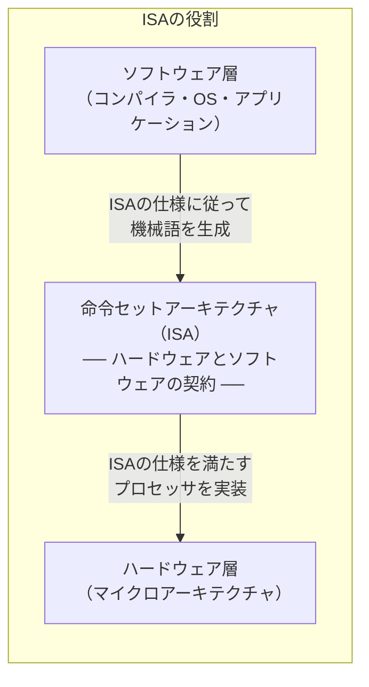
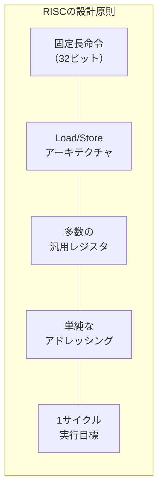
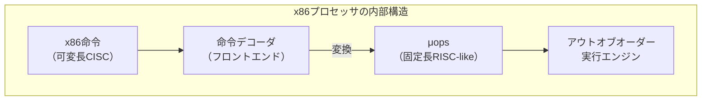
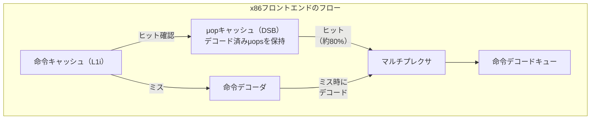
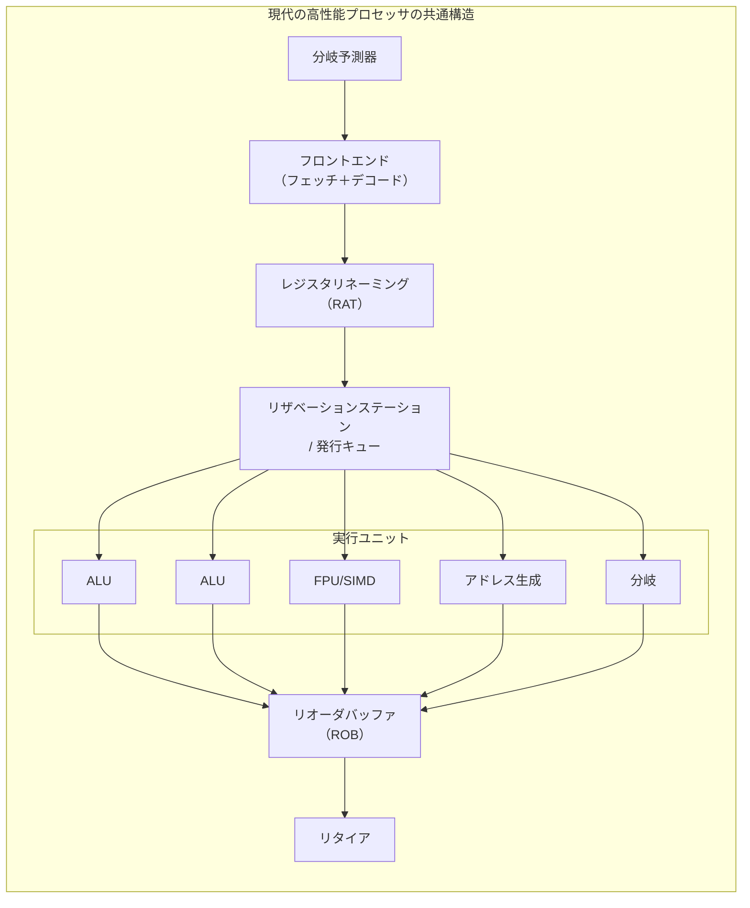
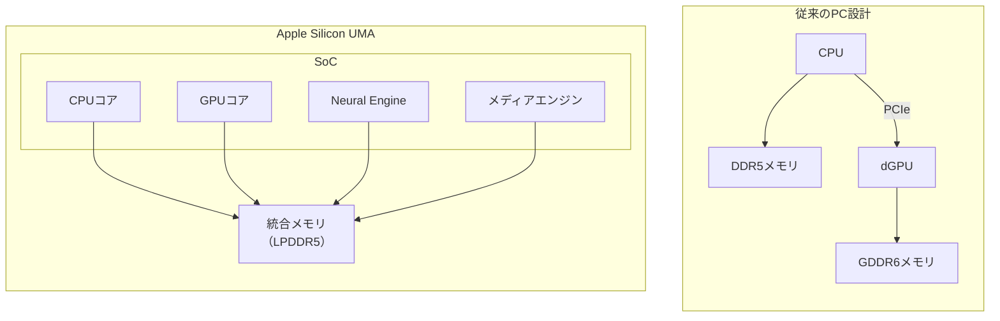
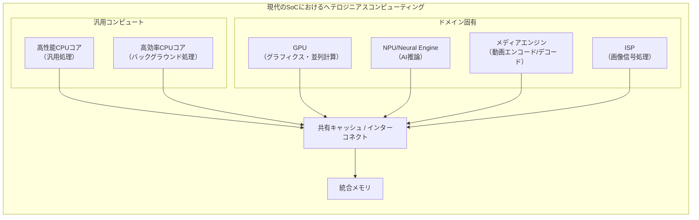
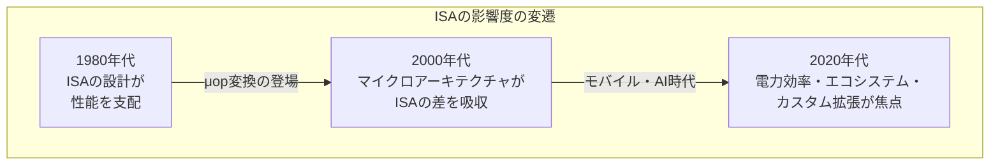

# RISC vs CISC — 命令セットアーキテクチャの設計哲学と現代的融合

## 1. 命令セットアーキテクチャ（ISA）とは

### 1.1 ハードウェアとソフトウェアの契約

コンピュータアーキテクチャにおいて、**命令セットアーキテクチャ（Instruction Set Architecture: ISA）** は、ハードウェアとソフトウェアの間に定義される「契約」である。ISAは、プロセッサがどのような命令を理解し実行できるか、データをどのように表現しメモリにアクセスするか、レジスタの数や種類はどうなっているか、といった仕様を厳密に規定する。

ソフトウェア開発者（およびコンパイラ）はISAの仕様に従ってプログラムを記述し、ハードウェア設計者はその仕様を満たすプロセッサを実装する。この分離のおかげで、同じISAに準拠する限り、プロセッサの内部実装（マイクロアーキテクチャ）がどれだけ変わっても、ソフトウェアの互換性は維持される。IntelのPentium 4とCore i9は内部構造がまったく異なるが、同じx86-64のバイナリを実行できるのは、ISAという抽象化レイヤーが存在するからである。



### 1.2 ISAが定義するもの

ISAが規定する主要な要素は以下の通りである。

| 要素 | 説明 | 例 |
|------|------|-----|
| **命令セット** | 実行可能な演算の種類 | ADD, SUB, MUL, LOAD, STORE, BRANCH |
| **データ型** | 扱えるデータの種類とサイズ | 8/16/32/64ビット整数、単精度/倍精度浮動小数点 |
| **レジスタ** | 汎用・専用レジスタの数と用途 | x86-64の16本の汎用レジスタ、ARMの31本 |
| **アドレッシングモード** | メモリアドレスの指定方法 | 直接、間接、インデックス付き、ベース+オフセット |
| **命令エンコーディング** | 命令のバイナリ表現 | 固定長（ARM: 32ビット）、可変長（x86: 1〜15バイト） |
| **メモリモデル** | メモリアクセスの順序保証 | TSO（x86）、弱順序（ARM） |
| **例外・割り込みモデル** | 例外処理と割り込みの仕組み | 精密例外、ベクタテーブル |

### 1.3 ISAの分類 — RISC と CISC

1970年代後半から1980年代にかけて、ISAの設計思想は大きく二つの流派に分かれた。一方は、多種多様で複雑な命令を提供する **CISC（Complex Instruction Set Computer）**、もう一方は、単純な命令に限定して高速化を図る **RISC（Reduced Instruction Set Computer）** である。

この対立は、コンピュータアーキテクチャの歴史において最も重要な論争の一つとなり、プロセッサ設計の方向性を根本から揺さぶった。そしてその論争は、単純な「どちらが優れているか」という二項対立を超え、両者の長所を融合させた現代のプロセッサ設計へと収束していった。

## 2. CISCの設計思想

### 2.1 セマンティックギャップの解消

CISCの設計思想は、**セマンティックギャップ（semantic gap）** の解消を目指すものである。セマンティックギャップとは、高級言語で記述されたプログラムの意味と、プロセッサが実行する低レベルの機械語命令との間に存在する乖離のことを指す。

1960年代から1970年代にかけて、コンパイラの技術は未成熟であり、多くのプログラムがアセンブリ言語で直接記述されていた。プログラマの生産性を向上させるため、高級言語の構文に対応する複雑な命令をハードウェアに組み込むことが合理的とされた。例えば、C言語の `strcpy` に相当する文字列コピー命令や、PascalのCASE文に対応する多方向分岐命令をISAに含めることで、プログラマの負担を軽減できると考えられたのである。

### 2.2 メモリの節約

もう一つの重要な動機は**メモリの節約**であった。1970年代のメモリは極めて高価であり、プログラムのコードサイズを削減することは切実な要求であった。複雑な命令を1つのオペコードで表現できれば、単純な命令を複数並べるよりも、命令メモリの消費を大幅に削減できる。可変長命令フォーマットも、頻出する命令を短いエンコーディングで表現できるため、コード密度の向上に寄与した。

### 2.3 x86 — CISCの代表格

x86アーキテクチャは、CISCの設計思想を最も体現するISAの一つである。1978年にIntel 8086として誕生し、約半世紀にわたる互換性の維持を通じて、以下のような複雑さを蓄積してきた。

**可変長命令**: x86の命令長は1バイトから15バイトまで変化する。プレフィックス、オペコード、ModR/M、SIB、ディスプレースメント、即値という多段構成のエンコーディングは、デコーダの設計を著しく複雑にする。

```
x86命令のエンコーディング構造:

┌─────────┬─────────┬────────┬─────┬──────────────┬─────────┐
│ Prefix  │ Opcode  │ ModR/M │ SIB │ Displacement │ Imm     │
│ 0-4B    │ 1-3B    │ 0-1B   │ 0-1B│ 0/1/2/4B     │ 0/1/2/4B│
└─────────┴─────────┴────────┴─────┴──────────────┴─────────┘
         合計: 1〜15バイト
```

**豊富なアドレッシングモード**: x86はメモリオペランドを直接演算命令に組み込むことができる。例えば `ADD EAX, [RBX + RCX*4 + 8]` という1命令で、ベースレジスタ＋スケーリングされたインデックスレジスタ＋ディスプレースメントによるメモリアドレス計算とメモリ読み出しと加算をすべて実行する。

```nasm
; x86 CISC-style: a single instruction does memory addressing + arithmetic
add eax, [rbx + rcx*4 + 8]   ; EAX = EAX + Memory[RBX + RCX*4 + 8]

; equivalent RISC-style decomposition (pseudo-assembly)
sll  t0, rcx, 2       ; t0 = rcx * 4
add  t0, t0, rbx      ; t0 = t0 + rbx
addi t0, t0, 8        ; t0 = t0 + 8
lw   t1, 0(t0)        ; t1 = Memory[t0]
add  eax, eax, t1     ; eax = eax + t1
```

**歴史的レガシー**: x86-64は、8086の16ビットモード、80386の32ビットプロテクトモード、AMD64による64ビットロングモードを重層的に内包している。リアルモードのセグメンテーション機構やBCDサポート命令など、現代のソフトウェアでは使用されない機能も依然としてISA仕様に残存している。

### 2.4 VAX — CISCの極致

CISCの設計思想を最も極端に推し進めたのがDECの**VAX（Virtual Address eXtension）** アーキテクチャ（1977年）である。VAXは以下のような特徴を持つ。

- 命令長が1バイトから57バイトまで変動
- 多項式評価命令（`POLY`）やCRC計算命令（`CRC`）などの極めて高レベルな命令
- すべての命令で全アドレッシングモードが使用可能（完全直交型）

VAXの設計思想は「高級言語の1文を1命令で表現する」というものであった。しかし後に、これらの複雑な命令の多くは実行頻度が低く、マイクロコードによる実装のオーバーヘッドが大きいことが判明した。この教訓がRISCの誕生を促す直接的な動因となる。

## 3. RISCの設計思想

### 3.1 RISC誕生の背景 — 実測データに基づく設計

RISCの思想は、1970年代後半にIBMの**John Cocke**、UC BerkeleyのDavid Patterson、StanfordのJohn Hennessyらによって独立に提唱された。その核心にあったのは、実際のプログラムの振る舞いを統計的に分析するという、実証に基づくアプローチであった。

彼らの分析が明らかにした事実は衝撃的であった。

- 典型的なプログラムでは、命令セット全体のうち**20〜30%の単純な命令が、実行時間の80〜90%**を占めていた
- VAXの複雑な命令の多くは、コンパイラからほとんど生成されなかった
- 複雑な命令のマイクロコード実装は、同等の単純命令列よりも**かえって遅い**場合があった

この発見は、「命令セットを複雑にすることでプログラマを支援する」というCISCの前提を根底から覆すものであった。

### 3.2 RISCの基本原則

RISCアーキテクチャは、以下の設計原則に基づいている。



**固定長命令**: すべての命令を同じビット幅（通常32ビット）でエンコードする。これにより、命令のフェッチとデコードが著しく単純化され、パイプライン設計が容易になる。

**Load/Storeアーキテクチャ**: メモリアクセスはLOAD（メモリ→レジスタ）とSTORE（レジスタ→メモリ）命令に限定し、算術論理演算はレジスタ間でのみ行う。これにより、メモリアクセスと演算のタイミングが明確に分離され、パイプラインのハザード管理が容易になる。

**多数の汎用レジスタ**: レジスタを豊富に用意することで、メモリアクセスの頻度を削減する。初期のRISCアーキテクチャでは32本の汎用レジスタが標準的であり、CISCの8本（x86）と比較して大幅に多い。

**単純なアドレッシングモード**: アドレス計算を単純に保つことで、命令のデコードと実行を高速化する。ベース＋オフセットを基本とし、x86のような複雑なスケーリング付きインデックスアドレッシングは提供しない。

### 3.3 パイプラインの効率化

RISCの最も重要な設計動機は、**命令パイプラインの効率化**である。パイプラインとは、命令の実行を複数のステージに分割し、複数の命令を同時に処理する手法である。

```mermaid
gantt
    title RISCの5段パイプライン
    dateFormat X
    axisFormat %s

    section 命令1
    IF（命令フェッチ）  : 0, 1
    ID（命令デコード）  : 1, 2
    EX（実行）          : 2, 3
    MEM（メモリアクセス）: 3, 4
    WB（ライトバック）  : 4, 5

    section 命令2
    IF  : 1, 2
    ID  : 2, 3
    EX  : 3, 4
    MEM : 4, 5
    WB  : 5, 6

    section 命令3
    IF  : 2, 3
    ID  : 3, 4
    EX  : 4, 5
    MEM : 5, 6
    WB  : 6, 7

    section 命令4
    IF  : 3, 4
    ID  : 4, 5
    EX  : 5, 6
    MEM : 6, 7
    WB  : 7, 8
```



RISCの固定長命令フォーマットは、パイプラインの各ステージを均一な時間で完了させることを可能にする。CISCの可変長命令では、命令の境界を特定するだけでも複雑な処理が必要であり、パイプラインのフロントエンドに大きな負荷がかかる。

### 3.4 MIPS — アカデミアからの挑戦

**MIPS（Microprocessor without Interlocked Pipeline Stages）** は、1984年にStanford大学のJohn Hennessyらによって設計されたRISCアーキテクチャである。名前が示す通り、パイプラインのインターロック（ハザード検出による自動ストール機構）を排除し、コンパイラがパイプラインハザードを解決するという大胆な設計を採用した。

MIPSの特徴的な設計として**遅延分岐（delayed branch）** がある。分岐命令の直後のスロット（遅延スロット）に配置された命令は、分岐の成否にかかわらず常に実行される。これはパイプラインのバブルを削減するための工夫であったが、コンパイラに対して命令スケジューリングの負担を課すことになった。

```nasm
; MIPS delayed branch example
beq  $t0, $t1, target   ; branch if t0 == t1
addi $t2, $t3, 1        ; delay slot: always executed regardless of branch
                         ; (compiler must place a useful instruction here)
```

MIPSは組み込みシステム、ネットワーク機器、ゲームコンソール（PlayStation 2のEmotion Engine）など、幅広い分野で採用された。しかしARMとの競争に敗れ、2021年にMIPS Technologies社はRISC-Vへの移行を表明した。

### 3.5 ARM — モバイル革命の立役者

**ARM（Advanced RISC Machines）** は、1985年にイギリスのAcorn Computersで設計されたRISCアーキテクチャである。当初はデスクトップPC向けであったが、その低消費電力特性が注目され、携帯電話やPDAなどの組み込み分野で急速に普及した。

ARMの設計における特筆すべき点は以下の通りである。

**条件付き実行**: ARM（A32）では、ほぼすべての命令に4ビットの条件コードフィールドが付加されており、フラグレジスタの状態に応じて命令の実行をスキップできる。短い条件分岐をパイプラインストールなしで処理できるため、分岐予測ミスのペナルティを軽減する。

```nasm
; ARM conditional execution example
; if (r0 == 0) r1 = r2 + r3; else r1 = r2 - r3;
cmp   r0, #0
addeq r1, r2, r3    ; executed only if Z flag is set (r0 == 0)
subne r1, r2, r3    ; executed only if Z flag is not set (r0 != 0)
; no branch instruction needed
```

**Thumb/Thumb-2命令セット**: RISCの固定長命令はコード密度が低いという弱点を抱えていた。ARMはこの問題に対し、16ビット幅の短縮命令セット「Thumb」と、16ビットと32ビットを混在させる「Thumb-2」を導入することで対処した。Thumb-2は固定長命令のデコード容易性とコード密度のバランスを巧みに取った設計である。

**AArch64（ARMv8以降）**: 2011年に発表されたARMv8-Aでは、64ビットの新ISA「AArch64」が導入された。AArch64は従来のARMとは異なるクリーンな設計を持ち、31本の64ビット汎用レジスタ、32本の128ビットSIMDレジスタ、PC相対アドレッシングの標準化など、現代的なRISCの理想に近い構成となっている。

## 4. マイクロオペレーション変換 — CISCの内側にRISCあり

### 4.1 CISCのRISC化

現代のx86プロセッサにおける最も重要なアーキテクチャ的革新の一つは、**マイクロオペレーション（micro-ops、μops）への変換**である。これは、外部的にはCISCのx86命令セットとの完全な互換性を維持しながら、内部的にはRISCライクな固定長のマイクロオペレーションに分解して実行するという手法である。

この手法は1995年のIntel Pentium Proで本格的に導入され、以降のすべての高性能x86プロセッサで採用されている。



### 4.2 デコーダの構造

現代のIntelおよびAMDプロセッサのフロントエンドには、複数の命令デコーダが並列に配置されている。

**単純命令デコーダ（Simple Decoder）**: 1つのx86命令を1つのμopに変換する。`ADD reg, reg` や `MOV reg, imm` のような単純な命令が該当する。

**複合命令デコーダ（Complex Decoder）**: 1つのx86命令を2〜4個のμopsに変換する。`ADD reg, [mem]` のようなメモリオペランドを含む命令は、ロード操作と演算操作に分解される。

**マイクロコードシーケンサ（Microcode Sequencer / MSROM）**: 極めて複雑な命令（`REP MOVSB`、`CPUID`など）は、マイクロコードROMに格納された一連のμopsとして展開される。

例えば、IntelのGolden Cove（Alder Lake世代のPコア）マイクロアーキテクチャでは、6つのデコーダ（1つの複合デコーダ＋5つの単純デコーダ）が並列に動作し、サイクルあたり最大6つのx86命令をデコードできる。

### 4.3 μopキャッシュ

x86命令のデコードは、可変長命令の境界特定やプレフィックスの解析など、多くの電力と回路面積を消費する処理である。この問題を軽減するため、現代のx86プロセッサは**μopキャッシュ（Decoded Stream Buffer: DSB）** を備えている。

μopキャッシュは、一度デコードされたμopsをキャッシュに保存し、同じ命令が再度実行される際にデコーダをバイパスして直接μopsを供給する。IntelのSandy Bridge（2011年）で初めて導入されたこの機構は、Agner Fogの計測によれば約80%のヒット率を達成し、消費電力の削減とフロントエンドのスループット向上に大きく貢献している。



AMDもZenマイクロアーキテクチャ（2017年）でOp Cache（μopキャッシュの同等物）を導入しており、現代の高性能x86プロセッサにおいて不可欠な構成要素となっている。

### 4.4 マイクロオペレーション変換の意義

マイクロオペレーション変換は、RISC vs CISCの論争に対して重要な示唆を与える。x86プロセッサの**外側はCISC**であるが、**内側はRISC**に近い構造で動作している。この事実は、ISA（プログラマから見えるインタフェース）とマイクロアーキテクチャ（ハードウェアの実装）が独立した概念であることを如実に示している。

ただし、このデコード処理には無視できないコストが伴う。複雑なデコーダはトランジスタ面積と消費電力を消費し、ARMのような本来のRISC ISAでは不要なオーバーヘッドである。このオーバーヘッドが、後述するApple Siliconの電力効率における優位性の一因となっている。

## 5. 命令長の固定 vs 可変

### 5.1 固定長命令の利点

RISCアーキテクチャが採用する固定長命令フォーマット（通常32ビット）は、ハードウェア設計に以下の大きな利点をもたらす。

**命令フェッチの単純化**: 固定長命令では、プログラムカウンタに一定値を加算するだけで次の命令のアドレスが確定する。分岐先アドレスの計算もPCに対するオフセットの加算だけで済む。一方、可変長命令では、フェッチしたバイト列の先頭バイトを解析して初めて命令長が判明するため、次の命令の開始位置を特定するだけでも逐次的な処理が必要になる。

**並列デコードの容易さ**: 固定長命令では、フェッチされた128ビットの命令ライン中に必ず4つの32ビット命令が含まれていることが保証される。したがって、4つのデコーダを並列に配置し、それぞれに32ビットずつ割り当てるだけでよい。可変長命令の並列デコードでは、先行する命令の長さが確定しないと後続の命令の開始位置がわからないという逐次的な依存関係が存在し、これを解決するための**プリデコード機構**が必要になる。

**分岐予測との親和性**: 固定長命令では、分岐ターゲットのアラインメントが保証されるため、分岐ターゲットバッファ（BTB）のエントリ管理が容易になる。

### 5.2 可変長命令の利点

CISCの可変長命令にも明確な利点が存在する。

**コード密度**: 頻出する命令を短いエンコーディングで、稀な命令を長いエンコーディングで表現できるため、ハフマン符号のような効率的な命令エンコーディングが可能になる。x86では、`NOP`（0x90）はわずか1バイト、`PUSH EAX`（0x50）も1バイトで表現できる。

**命令キャッシュの効率**: コード密度が高いということは、同じサイズの命令キャッシュにより多くの命令を格納できることを意味する。命令キャッシュのミス率は性能に直結するため、これは無視できない利点である。

### 5.3 コード密度の比較

実際のプログラムにおけるコード密度の比較は以下の通りである。

| ISA | 命令長 | 相対コードサイズ（x86を1.0とした場合） |
|-----|--------|----------------------------------------|
| x86-64 | 1〜15バイト（可変長） | 1.0（基準） |
| ARM A64 | 4バイト（固定長） | 約1.1〜1.3 |
| ARM Thumb-2 | 2/4バイト（混在） | 約0.9〜1.0 |
| MIPS | 4バイト（固定長） | 約1.2〜1.4 |
| RISC-V（RV64GC） | 2/4バイト（C拡張込み） | 約1.0〜1.2 |

RISC-Vは、オプションの**C拡張（Compressed）** によって16ビットの短縮命令を利用可能であり、固定長RISCのコード密度の弱点を補っている。ARMのThumb-2と同様の戦略であるが、RISC-Vでは基本命令セットからの導出が体系的に定義されている点が特徴的である。

## 6. レジスタ数と直交性

### 6.1 レジスタ数の設計トレードオフ

レジスタの数はISA設計における重要なパラメータであり、RISC と CISC の間で顕著な差異がある。

| ISA | 汎用レジスタ数 | 浮動小数点/SIMDレジスタ数 |
|-----|----------------|---------------------------|
| x86（32ビット） | 8 | 8（XMM） |
| x86-64 | 16 | 16（XMM/YMM）、32（ZMM、AVX-512時） |
| ARM AArch64 | 31 | 32（128ビットV） |
| MIPS | 32 | 32 |
| RISC-V（RV64G） | 32 | 32 |

レジスタ数が多いことの利点は明白である。

- **レジスタスピル（spill）の削減**: レジスタが不足すると、コンパイラはレジスタの内容を一時的にスタックメモリに退避（スピル）し、後で復元（フィル）する必要がある。レジスタが豊富であればスピルの頻度が減り、メモリアクセスが削減される
- **関数呼び出しの効率化**: 引数や戻り値をレジスタで受け渡すことで、メモリ経由のデータ転送を回避できる。AArch64では最大8つの引数をレジスタで渡せる
- **ループ最適化の余地**: ループ内で使用する変数をすべてレジスタに保持できれば、ループ本体からメモリアクセスを排除できる

一方、レジスタ数が多いことのコストも存在する。

- **命令エンコーディングのビット消費**: 32本のレジスタを指定するには5ビットが必要であり、3オペランド命令では15ビットがレジスタ指定に消費される。32ビット固定長命令では、残りの17ビットでオペコードと即値を表現する必要がある
- **コンテキストスイッチのコスト**: OSがプロセスやスレッドを切り替える際、すべてのレジスタの内容をメモリに退避・復元する必要がある。レジスタ数が多いほどこのコストが増大する

### 6.2 直交性（Orthogonality）

ISA設計における**直交性**とは、命令セットの要素（命令の種類、データ型、アドレッシングモード、レジスタ）を自由に組み合わせられる度合いを指す。直交性が高いISAでは、任意の命令で任意のレジスタとアドレッシングモードを使用できる。

VAXは直交性の極致であり、すべての命令でメモリオペランドと全アドレッシングモードが使用可能であった。しかし、この完全な直交性はハードウェアの複雑化を招き、実装コストを著しく増大させた。

x86は直交性が低い部分を多く含む。例えば、32ビットx86ではDIV命令は暗黙的にEDX:EAXレジスタペアを使用し、特定のレジスタにデータを配置しなければならない制約がある。こうした「特別扱い」のレジスタの存在は、レジスタアロケータの設計を複雑にする。

RISCアーキテクチャは中庸を取る。演算命令はレジスタ間でのみ動作し（Load/Storeアーキテクチャ）、アドレッシングモードは限定的だが、レジスタの使い方においては高い対称性を持つ。RISC-Vでは `x0` レジスタが常に0を返すハードワイヤードゼロレジスタとして定義されている以外、31本の汎用レジスタは完全に対等である。


## 7. 現代のCPUにおけるRISC/CISCの融合

### 7.1 境界の消失

2020年代の現在、RISC と CISC の境界は事実上消失している。現代のプロセッサは、両方の設計思想の長所を取り入れたハイブリッドな存在である。

**x86プロセッサのRISC的特徴**:
- μopへのデコードにより、内部はRISCライクなパイプラインで動作
- アウトオブオーダー実行エンジンは、μop単位でスケジューリングを行う
- μopフュージョン（複数のμopsを1つに融合）により、パイプラインの効率を向上
- レジスタリネーミングにより、ISA上のレジスタ数の制約を内部的に克服

**ARMプロセッサのCISC的特徴**:
- AArch64にはLDP/STP（ペアロード/ストア）のような複合命令が存在
- SVE/SVE2（Scalable Vector Extension）は複雑なベクトル演算命令を提供
- 条件選択命令（CSEL）やビットフィールド操作命令（UBFM）など、1命令で複数の操作を実行する命令が増加
- ARMv9ではTME（Transactional Memory Extension）のような高レベル命令も導入

### 7.2 マイクロアーキテクチャの共通化

現代の高性能プロセッサは、ISAがRISCであれCISCであれ、マイクロアーキテクチャレベルでは驚くほど類似した構造を持っている。



| 要素 | Intel Core（x86-64） | Apple M-series（AArch64） | AMD Zen（x86-64） |
|------|----------------------|---------------------------|---------------------|
| アウトオブオーダー実行 | あり | あり | あり |
| レジスタリネーミング | あり（~300+ 物理レジスタ） | あり | あり（~200+ 物理レジスタ） |
| 投機的実行 | あり | あり | あり |
| 分岐予測 | TAGE系 | TAGE系 | TAGE系 |
| μopフュージョン | あり | 類似の最適化あり | あり |
| リオーダバッファ | ~500+ エントリ | ~600+ エントリ | ~300+ エントリ |

### 7.3 RISC vs CISCの真の争点

現代において「RISC vs CISC」が実質的に意味を持つのは、主に以下の点においてである。

**デコーダの複雑性と電力**: x86のデコーダは、可変長命令の境界特定とμop変換のために大きなトランジスタ面積と消費電力を必要とする。μopキャッシュがこの問題を緩和しているものの、完全には解消できない。ARMのデコーダは相対的に単純であり、同じ電力バジェットでより多くの実行ユニットに振り向けることができる。

**ISAのクリーンさ**: x86-64は約半世紀の後方互換性の重荷を背負っている。使用されないセグメントレジスタ、歴史的なBCD命令、複数世代にわたるSIMD拡張（MMX、SSE、SSE2、SSE3、SSSE3、SSE4.1、SSE4.2、AVX、AVX2、AVX-512）の並存など、ISAの複雑さが設計と検証のコストを押し上げている。

**ソフトウェアエコシステムの慣性**: x86が依然としてデスクトップ・サーバ市場で支配的な地位にあるのは、ISAの優秀さによるものではなく、膨大なソフトウェア資産と互換性の慣性力による。Windows、Linux、そしてその上で動作する無数のアプリケーションがx86バイナリとして提供されている現実は、アーキテクチャの移行における最大の障壁である。

## 8. Apple Siliconの成功 — ARMがデスクトップを制した日

### 8.1 Macの転換点

2020年11月、AppleはMacのプロセッサをIntelのx86からApple独自設計のARMベースチップ「Apple M1」に移行することを発表し、業界に衝撃を与えた。これは「RISCは高性能コンピューティングには向かない」という長年の通説を覆す歴史的な出来事であった。

Apple Siliconの成功を支えた要因は多岐にわたる。

### 8.2 統合メモリアーキテクチャ（UMA）

Apple Siliconの最も革新的な特徴は、CPUコア、GPUコア、Neural Engine、メディアエンジンが同一のメモリプール（LPDDR4X/LPDDR5）を共有する**統合メモリアーキテクチャ（Unified Memory Architecture）** である。従来のPC設計ではCPUとGPUが別々のメモリ空間を持ち、データの受け渡しにPCIeバス経由のコピーが必要であった。統合メモリではこのコピーが不要になり、レイテンシの削減とメモリ帯域の効率的な利用が可能になる。



### 8.3 電力効率の優位性

Apple Siliconは、同世代のx86プロセッサと比較して際立った電力効率を示している。2025年時点のベンチマークでは、Apple SiliconがIntelやAMDの同等チップに対してマルチコア性能で最大40%の優位性を示しつつ、消費電力が約半分というデータが報告されている。

この電力効率の優位性の要因は複合的である。

1. **ARMのデコーダの単純さ**: AArch64の固定長命令により、デコーダが消費するトランジスタ数と電力が大幅に削減される。節約された電力バジェットを実行ユニットの拡充に充てることができる
2. **先端プロセスの活用**: AppleはTSMCの最先端プロセスノードを最も早く利用できる立場にあり、M1は5nm、M3は3nmプロセスで製造された
3. **SoC統合による効率化**: CPU、GPU、アクセラレータ、メモリコントローラを単一ダイに統合することで、チップ間通信のオーバーヘッドを排除
4. **big.LITTLE構成の活用**: 高性能コア（Firestorm/Avalanche/Everest等）と高効率コア（Icestorm/Blizzard/Sawtooth等）を組み合わせることで、ワークロードに応じた動的な電力配分を実現

### 8.4 Rosetta 2 — ソフトウェア互換性の橋渡し

アーキテクチャ移行における最大の課題であるソフトウェア互換性に対して、Appleは**Rosetta 2**というバイナリトランスレータを用意した。Rosetta 2は、x86-64のバイナリをAArch64の命令に事前変換（AOT: Ahead-Of-Time translation）することで、多くのx86アプリケーションをApple Silicon上でネイティブに近い性能で実行可能にした。

Rosetta 2の性能は、変換対象のx86バイナリがIntel Mac上でネイティブに動作する速度の70〜90%程度とされ、アーキテクチャ移行の痛みを大幅に軽減した。

### 8.5 データセンターへの波及

Apple Siliconの成功は、ARMベースプロセッサのデータセンター進出を加速させた。

- **AWS Graviton**: AmazonはARM Neoverse（N1/V1/V2）ベースの独自プロセッサGravitonシリーズを展開。Graviton3はx86インスタンスと比較して最大25%の性能向上と60%の電力削減を主張
- **Ampere Altra**: Ampere Computingは最大128コアのARM Neoverseベースサーバプロセッサを提供
- **NVIDIA Grace**: NVIDIAのGrace CPUはARM Neoverse V2をベースとし、Grace Hopper Superchipとして AI/HPC ワークロード向けに展開
- **Microsoft Cobalt**: MicrosoftもAzure向けの独自ARMプロセッサ「Cobalt 100」を開発

2025年時点で、ARMアーキテクチャのデータセンターCPU市場シェアは約25%に達しており、主要ハイパースケーラーに出荷されるコンピュート能力の約50%がARMベースであるとArmは報告している。

## 9. ISAの将来

### 9.1 RISC-V — オープンソースISAの台頭

**RISC-V**（「リスクファイブ」と発音）は、2010年にUC Berkeleyで誕生したオープンソースのRISC ISAである。BSD ライセンスのもとで公開されており、ライセンス料を支払うことなく誰でも自由にRISC-V準拠のプロセッサを設計・製造できる。

RISC-Vの設計哲学は、RISCの原則を現代の知見で再構築することにある。

**モジュラー設計**: RISC-Vは基本命令セット（RV32I/RV64I）を最小限に保ち、乗算除算（M）、アトミック操作（A）、浮動小数点（F/D）、ベクトル演算（V）などの機能を標準拡張として追加する方式を採用している。これにより、組み込みマイクロコントローラからハイパフォーマンスサーバまで、用途に応じたISAの構成が可能になる。

```
RISC-Vの命令セット構成:

RV64G = RV64I（基本整数） + M（乗除算） + A（アトミック）
       + F（単精度浮動小数点） + D（倍精度浮動小数点）

RV64GC = RV64G + C（圧縮命令：16ビット短縮形式）

追加標準拡張:
  V  - ベクトル演算
  B  - ビット操作
  H  - ハイパーバイザ
  Zicsr - CSR操作
  Zifencei - 命令フェンス
```

**カスタム拡張の許容**: RISC-Vの命令エンコーディング空間には、ユーザー定義のカスタム拡張用に予約された領域が存在する。企業はこの空間を利用して、AI推論やドメイン固有の処理に特化した独自命令を追加できる。これはx86やARMでは困難な柔軟性であり、RISC-Vが AI/ML アクセラレータ設計で注目される理由の一つである。

### 9.2 RISC-Vの普及状況

2025年時点で、RISC-V Internationalのメンバーは4,600組織を超え、エコシステムの拡大は著しい。

- **RVA23プロファイル**: 2024年に批准された高性能コンピューティング向けプロファイルで、ベクトル拡張（RVV）を必須要件として標準化。Ubuntu Linuxは2025年10月からRVA23準拠を要求
- **サーバ向けプロセッサ**: Alibaba DAMOアカデミーのXuantie C930、SpacemiTのVitalStone V100など、64コア級のサーバプロセッサが登場
- **AI特化チップ**: TenstorrentのGrendelチップは、RISC-Vコアと独自のTensix AIコアを統合し、AI推論ワークロードにおいてx86サーバを超える効率を主張
- **国際標準化**: RISC-V InternationalはISO/IEC JTC1のPASサブミッターとして承認され、RISC-V命令セットマニュアルの国際標準化が進行中

### 9.3 x86の進化

x86アーキテクチャも、ARMやRISC-Vの台頭に対して静観しているわけではない。

**Intel APX（Advanced Performance Extensions）**: 2023年に発表されたAPXは、x86-64の汎用レジスタを16本から32本に倍増させ、3オペランド形式の命令を導入する拡張である。RISCの利点であった「レジスタ数の豊富さ」をx86にもたらすもので、レジスタスピルの削減による性能向上が期待される。

**x86エコシステムアドバイザリグループ**: 2024年、IntelとAMDは共同で「x86 Ecosystem Advisory Group」を設立し、x86 ISAの将来的な進化について協調する方針を示した。なお、Intelが2023年に提案したx86S（16ビットモードなどのレガシーを削除する64ビット専用の簡素化ISA）については、エコシステムからのフィードバックを受けて推進を中止している。

**AMDのZenアーキテクチャの進化**: AMDはZen 5世代（2024年）で、フロントエンドの幅を拡大し、分岐予測の精度を向上させることで、μop変換のオーバーヘッドを最小化しつつ高いIPC（Instructions Per Clock）を実現している。

### 9.4 ドメイン固有アーキテクチャ（DSA）の時代

汎用のISA設計に加えて、特定のワークロードに最適化された**ドメイン固有アーキテクチャ（Domain-Specific Architecture: DSA）** が急速に重要性を増している。GoogleのTPU（Tensor Processing Unit）、NVIDIAのCUDAコア、AppleのNeural Engineなどは、汎用CPUでは効率的に処理できないAI/ML推論・学習を、専用のハードウェアで高速かつ低電力に実行する。



RISC-Vのモジュラー設計とカスタム拡張の柔軟性は、このDSAの潮流と親和性が高い。汎用のRISC-Vコアにドメイン固有の命令を追加し、ソフトウェアスタックをカスタマイズすることで、特定のワークロードに対して最適化されたチップを効率的に設計できる。

### 9.5 ISAは重要か？

現代のコンピュータアーキテクチャにおいて、ISAの選択がプロセッサの性能を決定的に左右するかという問いに対する答えは、「以前ほどではない」というものである。

マイクロアーキテクチャの進化、μopキャッシュの導入、アウトオブオーダー実行エンジンの高度化により、ISAレベルの差異はハードウェアによって大部分が吸収される。同じ設計リソースと製造技術を使えば、x86プロセッサとARMプロセッサの性能差は、ISAの違い単独では数%〜10%程度に過ぎないとされる。

しかし、「ISAは関係ない」と言い切ることもできない。理由は以下の通りである。

1. **デコーダの電力コスト**: x86のデコーダが消費する数ワットの電力は、モバイルデバイスの限られた電力バジェットにおいて無視できない差となる
2. **設計の複雑性**: x86の可変長命令とレガシー機能のサポートは、プロセッサの設計・検証にかかる工数とコストを増大させる。その分のエンジニアリングリソースが、性能向上や新機能の開発から奪われる
3. **エコシステムの慣性**: ISAの選択はソフトウェアエコシステムと密接に結びついており、アーキテクチャの移行には莫大なコストが伴う
4. **カスタム拡張の柔軟性**: RISC-Vのようなオープンで拡張可能なISAは、DSAの時代において新たな価値を提供する



### 9.6 将来の展望

ISAの未来は、以下のようなトレンドによって形作られるだろう。

**マルチISAの共存**: x86、ARM、RISC-Vの三つのISAは、それぞれのニッチで共存し続ける可能性が高い。x86はレガシーソフトウェアの互換性が重要なデスクトップ・サーバ市場で、ARMはモバイルと電力効率が重視されるデータセンターで、RISC-Vは組み込みとカスタムアクセラレータの領域で、それぞれ強みを発揮するだろう。

**バイナリ変換技術の成熟**: AppleのRosetta 2やMicrosoftのPrism（ARM上でのx86エミュレーション）に見られるように、バイナリ変換技術の進歩はISA間の移行コストを大幅に削減している。ISAの選択がソフトウェアエコシステムの壁によって制約される度合いは、今後も低下し続けるだろう。

**CXL（Compute Express Link）とチップレット**: 異なるISAのチップレットをCXLで接続し、ワークロードに応じて最適なコンピュートユニットにタスクを振り分けるヘテロジニアスアーキテクチャが現実化しつつある。この場合、個々のチップレットのISAよりも、チップレット間のインターコネクトプロトコルの標準化が重要になる。

**セキュリティとISA**: Spectre/Meltdown以降、ISA設計においてセキュリティは最優先の考慮事項となった。ARM MTE（Memory Tagging Extension）、Intel CET（Control-flow Enforcement Technology）、RISC-V CFI（Control-Flow Integrity）など、ISAレベルでのセキュリティ機構の強化が進んでいる。

## まとめ

RISC vs CISCの論争は、コンピュータアーキテクチャの歴史において最も生産的な論争の一つであった。この論争を通じて、パイプライン設計の原則、コンパイラ最適化の重要性、ISAとマイクロアーキテクチャの分離、電力効率の設計指針など、プロセッサ設計の根幹をなす多くの知見が蓄積された。

現代のプロセッサは、RISCの「単純さによる効率」とCISCの「互換性と表現力」を巧みに融合させている。x86プロセッサの内部にはRISCのパイプラインが動いており、ARMプロセッサにはCISCの複合命令が増えている。両者の差異は、ISAの表面的な特徴よりも、ソフトウェアエコシステム、ビジネスモデル、設計の歴史的経緯に由来する部分が大きい。

そしてRISC-Vの登場は、ISA設計に第三の選択肢 — **オープンで拡張可能なISA** — を加えた。ドメイン固有アーキテクチャの時代において、カスタム拡張の柔軟性を持つオープンなISAの価値は、今後さらに高まるだろう。

ISAの設計哲学は変わり続ける。しかし、その根底にある問い — **「プロセッサに何をさせ、何をさせないか」**という境界の設計 — は、コンピュータアーキテクチャが存在する限り、常に本質的な課題であり続ける。
