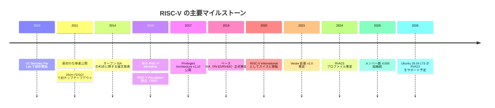
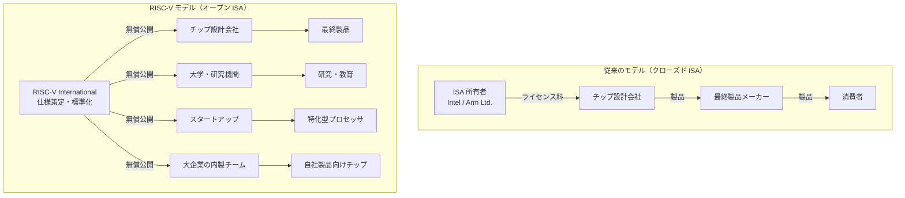
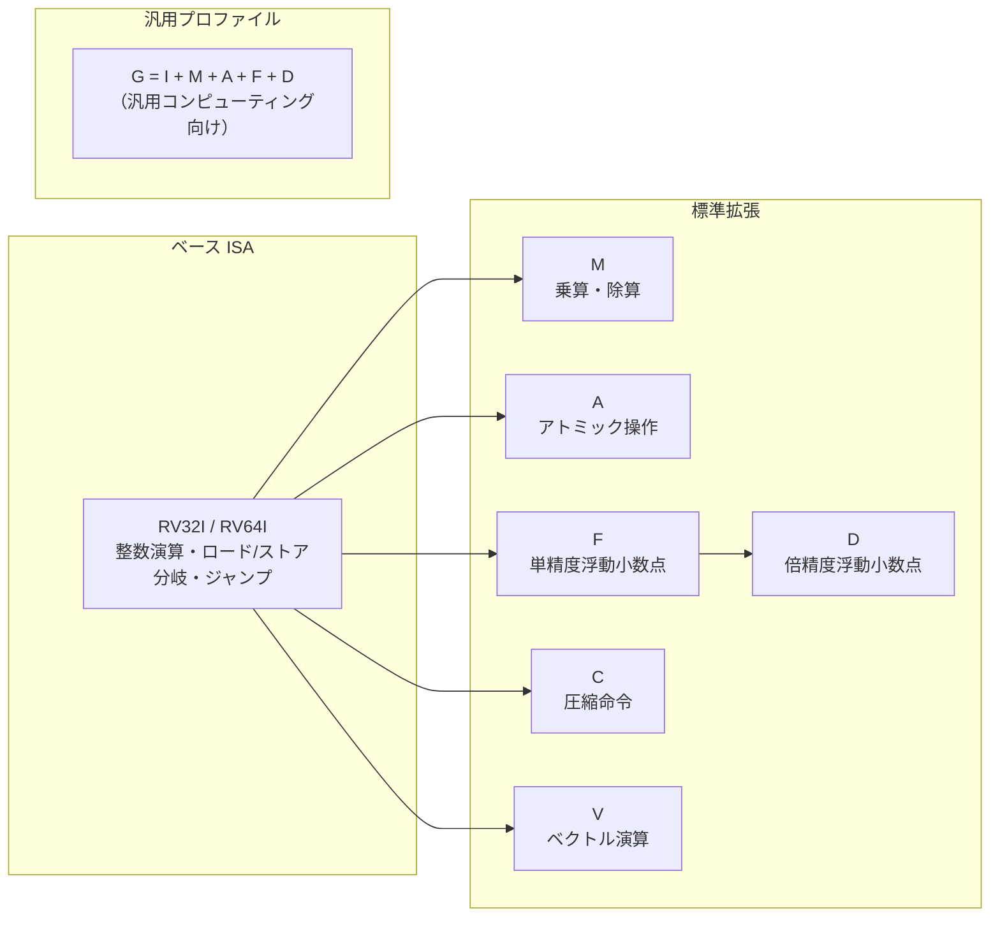
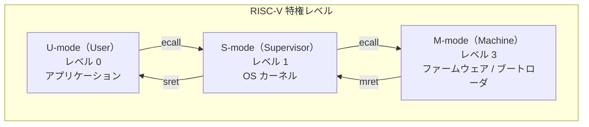
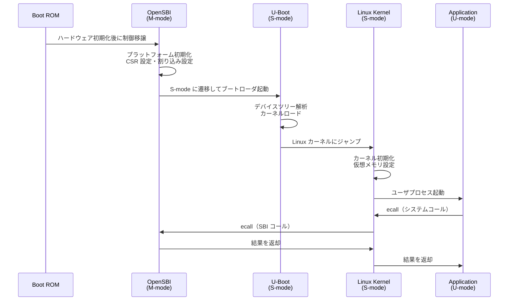
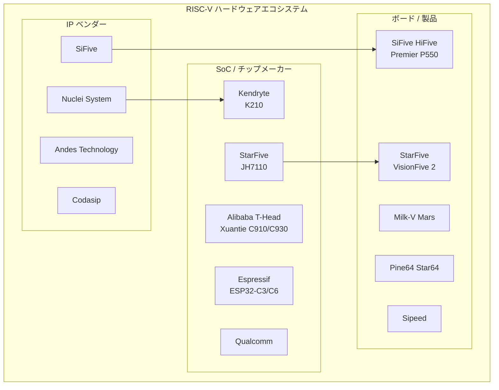
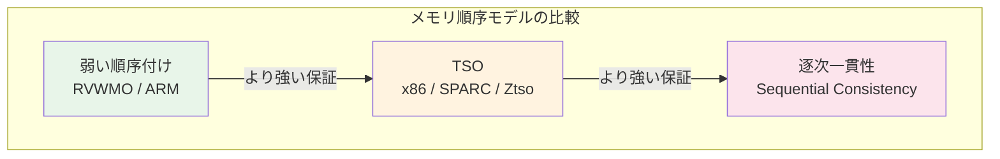
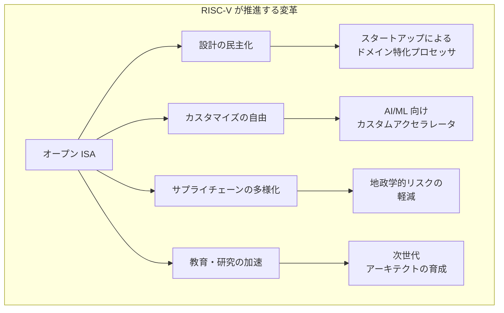

# RISC-V — オープンな命令セットアーキテクチャの設計と展望

## 1. 背景と動機

### 1.1 命令セットアーキテクチャ（ISA）の役割

コンピュータアーキテクチャにおいて、命令セットアーキテクチャ（Instruction Set Architecture, ISA）はハードウェアとソフトウェアの境界を定義する最も重要な抽象化レイヤである。ISA はプロセッサが理解する命令の仕様を規定し、コンパイラやオペレーティングシステムがその仕様に基づいてソフトウェアを構築する。つまり、ISA は「ソフトウェアがハードウェアとどのように対話するか」を決める契約であり、プロセッサの実装とソフトウェアエコシステムの両方に影響を及ぼす。

歴史的に、主要な ISA は商用企業によって所有され、ライセンス契約を通じて利用されてきた。x86 は Intel（および AMD のクロスライセンス）が管理し、ARM は Arm Ltd. がライセンスビジネスとして展開している。この状況は、プロセッサを設計したい企業や研究機関にとって大きな参入障壁となってきた。

### 1.2 既存 ISA の課題

2010年頃までに、プロセッサ設計の現場ではいくつかの根本的な課題が認識されていた。

**ライセンスコストと制約**: ARM のライセンス料は数百万ドルに達し、さらにロイヤリティが加算される。x86 に至っては事実上 Intel と AMD 以外が設計できない閉鎖的な状況であった。スタートアップや学術機関がプロセッサ設計に参入するには、これらのコストが大きな障壁となっていた。

**レガシーの蓄積**: x86 は 1978 年の 8086 から連綿と続く後方互換性を維持しており、セグメントレジスタ、複雑なアドレッシングモード、可変長命令など、現代のプロセッサ設計には不要な複雑性が蓄積していた。ARM も v7 から v8 への移行で大きなアーキテクチャ変更を行ったが、依然として歴史的な設計判断の遺産を抱えている。

**教育・研究の制約**: 大学でコンピュータアーキテクチャを教える際、商用 ISA を使うことにはライセンス上の制約があった。MIPS は教育用途で広く使われていたが、商用利用との兼ね合いや ISA 自体の設計上の問題（遅延分岐スロットなど）が存在していた。

### 1.3 RISC-V の誕生

RISC-V は 2010 年 5 月、カリフォルニア大学バークレー校の Parallel Computing Laboratory（Par Lab）で始まった。Krste Asanovic 教授と大学院生の Andrew Waterman、Yunsup Lee が、研究プロジェクトに使うプロセッサコアを必要としていたことがきっかけである。

当初、ARM を使うことも検討されたが、ライセンスの取得に時間とコストがかかり、さらにコアのカスタマイズが制限されるという問題があった。そこで彼らは、完全に新しい ISA を一から設計することを決断した。RISC の父とも呼ばれる David Patterson 教授の支援のもと、過去の RISC アーキテクチャ（RISC-I, RISC-II, MIPS, SPARC, Alpha など）の教訓を取り入れつつ、クリーンスレートで設計が進められた。

「RISC-V」の名称は、"V" が「5番目のバージョン」「Vector」「Variants」の三重の意味を持つものとして 2010 年 8 月に命名された。バークレーの RISC プロジェクトとしては RISC-I（1981年）、RISC-II（1983年）、SOAR（1984年）、SPUR（1988年）に続く第5世代にあたる。

2011 年 5 月に最初の仕様書『The RISC-V Instruction Set Manual, Volume I: Base User-Level ISA』が発表され、同年に 28nm FDSOI プロセスで最初の RISC-V チップがテープアウトされた。2015 年 1 月には初の RISC-V Workshop が開催され、同年に RISC-V Foundation が 36 の創設メンバーで設立された。その後、2020 年に RISC-V International としてスイスに本部を移し、特定の国の輸出規制から独立した組織運営を行っている。



## 2. オープン ISA の意義

### 2.1 ISA のオープン性とは

RISC-V の最も革命的な特徴は、ISA 仕様がオープンソースライセンスのもとで誰でも自由に利用できる点にある。ここで重要なのは、「オープン」とは ISA 仕様の利用が無償かつ無制限であるという意味であり、特定のプロセッサ実装がオープンソースであることとは異なるということである。

RISC-V の ISA 仕様はクリエイティブ・コモンズ・ライセンスで公開されており、誰でも以下のことが可能である。

- RISC-V ISA に準拠したプロセッサを設計・製造・販売する
- ISA に独自の拡張を追加する
- 教育目的で自由に使用する
- ロイヤリティを一切支払うことなくチップを出荷する

### 2.2 x86・ARM との比較

RISC-V のオープン ISA モデルを理解するために、既存の主要アーキテクチャとの比較を行う。

| 項目 | x86 | ARM | RISC-V |
|------|-----|-----|--------|
| ISA の所有者 | Intel/AMD | Arm Ltd. | RISC-V International（オープン） |
| ライセンス費用 | 事実上クローズド | 数百万ドル + ロイヤリティ | 無料 |
| カスタム拡張 | 不可 | 制限あり（カスタムインストラクション追加可だが高額） | 自由（予約済みオペコード空間あり） |
| 仕様書の規模 | 約 5,000 ページ | 約 2,000 ページ以上 | 約 240 ページ（ベース仕様） |
| 設計の複雑さ | 非常に複雑（CISC + レガシー） | 中程度 | シンプル（クリーンスレート設計） |
| 命令の形式 | 可変長（1〜15 バイト） | 固定長 32 ビット（Thumb で 16 ビット混在） | 固定長 32 ビット（C 拡張で 16 ビット混在） |
| 主な用途 | デスクトップ・サーバ | モバイル・組み込み | IoT・組み込み・サーバ（拡大中） |

### 2.3 オープン ISA がもたらす構造的変化

オープン ISA の影響は単なるコスト削減にとどまらない。以下のような構造的な変化をもたらしている。

**イノベーションの民主化**: ISA のライセンスが不要になることで、スタートアップ、大学、小規模チームがプロセッサ設計に参入できるようになった。結果として、特定用途向けの最適化されたプロセッサ（ドメイン固有アクセラレータ）の開発が活発化している。

**サプライチェーンの多様化**: 特定のプロセッサベンダーへの依存を軽減し、地政学的リスクの分散にもつながる。RISC-V International がスイスに本部を置いたのも、こうした中立性への配慮からである。

**教育の発展**: 大学でのコンピュータアーキテクチャ教育において、RISC-V は理想的な教材となっている。学生は仕様書を読み、実際にプロセッサを設計し、FPGA 上で動作させるところまでを一貫して体験できる。



## 3. ベース命令セット — RV32I と RV64I

### 3.1 設計原則

RISC-V のベース命令セットは、以下の設計原則に基づいている。

**シンプルさ**: 必要最小限の命令のみをベース命令セットに含め、追加機能は拡張として分離する。RV32I のベース命令数はわずか 47 命令であり、これだけで汎用のソフトウェアを実行できる。

**規則性**: 命令フォーマットを少数のパターンに統一し、デコーダの実装を簡素化する。ソースレジスタ（rs1, rs2）とデスティネーションレジスタ（rd）の位置はすべてのフォーマットで固定されている。

**モジュール性**: ベース命令セットは将来にわたって固定され、新機能は標準拡張またはカスタム拡張として追加される。これにより、過去のソフトウェアとの互換性が保証される。

### 3.2 レジスタ構成

RISC-V は 32 本の汎用整数レジスタ（`x0` 〜 `x31`）を持つ。各レジスタは RV32I では 32 ビット、RV64I では 64 ビット幅である。`x0` は常にゼロを保持するハードワイヤードレジスタであり、書き込みは無視される。これはゼロレジスタとして、NOP（`addi x0, x0, 0`）、レジスタ間コピー（`addi rd, rs, 0`）、条件分岐のゼロ比較など、多くの疑似命令をハードウェアの追加なしに実現する。

加えて、プログラムカウンタ（PC）が存在するが、汎用レジスタファイルには含まれない。

| レジスタ | ABI 名 | 用途 | 呼び出し規約 |
|----------|--------|------|-------------|
| x0 | zero | 定数ゼロ | — |
| x1 | ra | リターンアドレス | caller-saved |
| x2 | sp | スタックポインタ | callee-saved |
| x3 | gp | グローバルポインタ | — |
| x4 | tp | スレッドポインタ | — |
| x5-x7 | t0-t2 | 一時レジスタ | caller-saved |
| x8 | s0/fp | セーブレジスタ / フレームポインタ | callee-saved |
| x9 | s1 | セーブレジスタ | callee-saved |
| x10-x11 | a0-a1 | 関数引数 / 戻り値 | caller-saved |
| x12-x17 | a2-a7 | 関数引数 | caller-saved |
| x18-x27 | s2-s11 | セーブレジスタ | callee-saved |
| x28-x31 | t3-t6 | 一時レジスタ | caller-saved |

### 3.3 命令フォーマット

RISC-V は 6 種類の命令フォーマットを定義している。すべて 32 ビット固定長であり、最下位 2 ビット（`inst[1:0]`）は常に `11` である（C 拡張との区別のため）。

```
R-Type: [ funct7  | rs2   | rs1   | funct3 | rd    | opcode ]
        [31    25 |24  20 |19  15 |14   12 |11   7 |6     0 ]

I-Type: [ imm[11:0]       | rs1   | funct3 | rd    | opcode ]
        [31           20  |19  15 |14   12 |11   7 |6     0 ]

S-Type: [ imm[11:5] | rs2   | rs1   | funct3 | imm[4:0] | opcode ]
        [31     25  |24  20 |19  15 |14   12 |11     7  |6     0 ]

B-Type: [ imm[12|10:5] | rs2 | rs1   | funct3 | imm[4:1|11] | opcode ]
        [31        25  |24 20|19  15 |14   12 |11        7  |6     0 ]

U-Type: [ imm[31:12]                          | rd    | opcode ]
        [31                               12  |11   7 |6     0 ]

J-Type: [ imm[20|10:1|11|19:12]               | rd    | opcode ]
        [31                               12  |11   7 |6     0 ]
```

各フォーマットの特徴と用途は以下のとおりである。

- **R-Type**: レジスタ間演算（`add`, `sub`, `and`, `or`, `sll` など）
- **I-Type**: 即値演算とロード命令（`addi`, `lw`, `jalr` など）
- **S-Type**: ストア命令（`sw`, `sh`, `sb` など）
- **B-Type**: 条件分岐（`beq`, `bne`, `blt`, `bge` など）
- **U-Type**: 上位即値（`lui`, `auipc`）
- **J-Type**: 無条件ジャンプ（`jal`）

重要な設計ポイントとして、`rs1`, `rs2`, `rd` の位置がすべてのフォーマットで同一であることが挙げられる。これにより、命令のデコードとレジスタファイルの読み出しを並行して行うことが可能になり、パイプライン設計が簡素化される。

### 3.4 主要な命令カテゴリ

RV32I の命令は以下のカテゴリに分類される。

**整数演算命令**: `add`, `sub`, `and`, `or`, `xor`, `sll`, `srl`, `sra` など。即値バージョン（`addi`, `andi` 等）も含む。なお、ベースの RV32I には乗算・除算命令は含まれない（M 拡張で提供）。

**ロード・ストア命令**: `lw`（ワードロード）、`lh`（ハーフワードロード）、`lb`（バイトロード）、`sw`, `sh`, `sb`（対応するストア）。RISC-V はロード・ストアアーキテクチャであり、メモリアクセスはロード命令とストア命令のみで行う。演算命令がメモリを直接操作することはない。

**分岐命令**: `beq`（等しければ分岐）、`bne`（等しくなければ分岐）、`blt`（小さければ分岐）、`bge`（以上なら分岐）。符号なしバージョンとして `bltu`, `bgeu` もある。RISC-V にはフラグレジスタ（ステータスレジスタ）が存在せず、分岐命令が直接 2 つのレジスタを比較する。これは MIPS に似た設計だが、MIPS と異なり遅延分岐スロット（delay slot）は存在しない。

**ジャンプ命令**: `jal`（ジャンプ・アンド・リンク）と `jalr`（レジスタ間接ジャンプ・アンド・リンク）。関数呼び出しと戻りに使用される。

**上位即値命令**: `lui`（Load Upper Immediate）と `auipc`（Add Upper Immediate to PC）。32 ビット定数の構築やPC相対アドレッシングに使用する。

**システム命令**: `ecall`（環境呼び出し）と `ebreak`（ブレークポイント）。それぞれシステムコールとデバッグに使用される。

### 3.5 RV32I と RV64I の違い

RV64I は RV32I を 64 ビットに拡張したものである。レジスタ幅が 64 ビットになるほか、ワード幅の演算を行う命令（`addw`, `subw`, `sllw` など）が追加される。これらの `-w` サフィックス付き命令は、64 ビットレジスタ上で 32 ビット演算を行い、結果を符号拡張して 64 ビットレジスタに格納する。

RV64I ではアドレス空間が 64 ビットに拡大されるため、`ld`（ダブルワードロード）や `sd`（ダブルワードストア）が追加される。

なお、128 ビット版の RV128I も仕様上は定義されているが、2026 年時点では実用的な実装は存在しない。

以下に、簡単な C 言語の関数とそれに対応する RISC-V アセンブリの例を示す。

```c
int sum(int a, int b) {
    return a + b;
}
```

```asm
# RV32I assembly for sum(int a, int b)
# a0 = a, a1 = b (argument registers)
sum:
    add a0, a0, a1   # a0 = a + b (result in a0)
    ret              # pseudo-instruction for jalr x0, ra, 0
```

このシンプルさが RISC-V の特徴を端的に示している。引数はレジスタ `a0`, `a1` で渡され、戻り値は `a0` に格納される。`ret` は `jalr x0, ra, 0` の疑似命令であり、リターンアドレスレジスタ `ra` に格納されたアドレスへジャンプする。

## 4. 標準拡張

RISC-V のモジュール性は標準拡張によって実現される。ベース命令セットは最小限に抑えられ、用途に応じて必要な拡張を組み合わせる設計思想となっている。



### 4.1 M 拡張 — 整数乗算・除算

M 拡張は整数の乗算命令と除算命令を追加する。ベースの RV32I にはこれらが含まれないため、乗算を多用する処理では M 拡張が事実上必須となる。

追加される主な命令は以下のとおりである。

- `mul`: 乗算（下位ワード）
- `mulh`: 符号付き乗算（上位ワード）
- `mulhu`: 符号なし乗算（上位ワード）
- `mulhsu`: 符号付き × 符号なし乗算（上位ワード）
- `div` / `divu`: 符号付き / 符号なし除算
- `rem` / `remu`: 符号付き / 符号なし剰余

M 拡張がベースから分離されている理由は、マイクロコントローラなどの極めて小面積を必要とする用途では、乗算器のハードウェアコストが無視できないためである。ソフトウェアによる乗算ルーチンで代替可能な場合、M 拡張を省略することでシリコン面積を節約できる。

### 4.2 A 拡張 — アトミック操作

A 拡張はマルチプロセッサ環境でのスレッド間同期に必要なアトミック命令を提供する。RISC-V は 2 種類のアトミック操作メカニズムを定義している。

**Load-Reserved / Store-Conditional（LR/SC）**: `lr.w` でメモリアドレスに対する予約付きロードを行い、`sc.w` で条件付きストアを行う。別のハートが同じアドレスに書き込んだ場合、`sc.w` は失敗を返す。これは LL/SC（Load-Linked / Store-Conditional）パターンの一種であり、CAS（Compare-And-Swap）よりも ABA 問題が生じにくいという利点がある。

**Atomic Memory Operations（AMO）**: `amoswap`, `amoadd`, `amoand`, `amoor`, `amoxor`, `amomax`, `amomin` など。メモリの読み出し・演算・書き戻しをアトミックに実行する。キャッシュコヒーレンスプロトコルとの親和性が高く、スピンロックやアトミックカウンタの実装に適している。

```asm
# LR/SC pattern: atomic compare-and-swap
# a0 = address, a1 = expected, a2 = desired
cas:
    lr.w t0, (a0)        # load-reserved from address
    bne  t0, a1, fail    # if value != expected, fail
    sc.w t1, a2, (a0)    # store-conditional desired value
    bnez t1, cas          # if sc failed, retry
    li   a0, 1           # return success
    ret
fail:
    li   a0, 0           # return failure
    ret
```

### 4.3 F 拡張・D 拡張 — 浮動小数点演算

F 拡張は IEEE 754 準拠の単精度（32 ビット）浮動小数点演算を追加し、D 拡張はこれを倍精度（64 ビット）に拡張する。

いずれも専用の浮動小数点レジスタファイル（`f0` 〜 `f31`）を使用する。F 拡張では各レジスタが 32 ビット幅、D 拡張では 64 ビット幅に拡張される。

提供される演算は以下のカテゴリに分類される。

- **算術演算**: `fadd`, `fsub`, `fmul`, `fdiv`, `fsqrt`
- **積和演算（FMA）**: `fmadd`, `fmsub`, `fnmadd`, `fnmsub`
- **比較**: `feq`, `flt`, `fle`
- **変換**: 整数⇔浮動小数点の変換（`fcvt.w.s`, `fcvt.s.w` など）
- **転送**: 整数レジスタ⇔浮動小数点レジスタの移動（`fmv.x.w`, `fmv.w.x`）
- **符号操作**: `fsgnj`, `fsgnjn`, `fsgnjx`

浮動小数点制御・ステータスレジスタ（`fcsr`）が追加され、丸めモードと例外フラグを管理する。5 つの IEEE 754 丸めモード（最近接偶数丸め、ゼロ方向、正の無限大方向、負の無限大方向、最大値方向）がサポートされる。

### 4.4 C 拡張 — 圧縮命令

C 拡張は、頻繁に使用されるパターンに対して 16 ビットの短縮命令を提供する。これによりコードサイズを平均 25〜30% 削減できる。

C 拡張は ARM の Thumb-2 や MIPS16e に相当する機能だが、RISC-V の C 拡張には以下の特徴がある。

- **自由な混在**: 32 ビット命令と 16 ビット命令を自由に混在させることができ、モード切替は不要。命令の最下位 2 ビットが `00`, `01`, `10` のいずれかであれば 16 ビット命令、`11` であれば 32 ビット命令として解釈される。
- **透過性**: 16 ビット圧縮命令はそれぞれ対応する 32 ビット命令と完全に等価であり、アセンブラが自動的に適用可能な場面で圧縮形式を選択できる。

主な圧縮命令には `c.addi`, `c.li`, `c.lw`, `c.sw`, `c.j`, `c.beqz`, `c.mv` などがある。レジスタの使用が `x8` 〜 `x15`（`s0` 〜 `s1`, `a0` 〜 `a5`）に制限される命令もあるが、これは統計的に最も頻繁に使われるレジスタ範囲に合致する。

### 4.5 V 拡張 — ベクトル演算

V 拡張（RVV 1.0）は RISC-V にベクトル処理能力を追加する、最も大規模な標準拡張の一つである。2021 年に正式策定された。

V 拡張の設計は、従来の SIMD（Single Instruction, Multiple Data）命令セットとは根本的に異なるアプローチをとっている。

**SIMD との違い**: x86 の SSE/AVX や ARM の NEON は、固定幅のベクトルレジスタ（128 ビット、256 ビット、512 ビットなど）を前提としている。このためベクトル幅が変わるとソフトウェアの書き直しやリコンパイルが必要になる。対して RISC-V の V 拡張は **VLA（Vector Length Agnostic）** 設計を採用しており、ソフトウェアはハードウェアのベクトル長に依存しないコードを書ける。

V 拡張の基本的なパラメータは以下のとおりである。

- **VLEN**: 1 つのベクトルレジスタのビット幅。実装ごとに異なり、最小 ELEN（要素幅の最大値）以上で最大 65,536 ビットまで可能。
- **ELEN**: 1 つのベクトル要素の最大ビット幅。最小 8 ビットで 2 のべき乗。
- **vl（vector length）**: 現在の操作で処理する要素数。`vsetvli` 命令で設定する。
- **vtype**: 要素の型（SEW: Selected Element Width）やグループ化（LMUL: Length Multiplier）を指定する。

32 本のベクトルレジスタ（`v0` 〜 `v31`）が追加され、それぞれ VLEN ビット幅である。

```asm
# Vector addition example: a[i] = b[i] + c[i]
# a0 = pointer to a, a1 = pointer to b, a2 = pointer to c, a3 = length
vector_add:
    vsetvli t0, a3, e32, m1   # set vector length for 32-bit elements
loop:
    vle32.v v1, (a1)          # load vector from b
    vle32.v v2, (a2)          # load vector from c
    vadd.vv v0, v1, v2        # vector add
    vse32.v v0, (a0)          # store result to a
    sub     a3, a3, t0        # decrement remaining count
    slli    t1, t0, 2         # byte offset = count * 4
    add     a0, a0, t1        # advance pointers
    add     a1, a1, t1
    add     a2, a2, t1
    bnez    a3, vector_add    # loop if elements remain
    ret
```

このコードはベクトル長がいくつであっても正しく動作する。`vsetvli` 命令がハードウェアのベクトル長に基づいて実際に処理する要素数を返すため、ソフトウェアはそれに従ってポインタを進めるだけでよい。

V 拡張がサポートする演算は、整数演算（加減乗除、論理演算、シフト）、浮動小数点演算、マスク操作、リダクション（合計、最大値、最小値）、パーミュテーション（要素の並べ替え）など多岐にわたる。ロード・ストアは unit-stride、strided、indexed（scatter/gather）の 3 種類のアクセスパターンをサポートする。

### 4.6 その他の注目すべき拡張

上記の主要拡張に加え、近年策定された注目すべき拡張がいくつか存在する。

| 拡張 | 概要 |
|------|------|
| Zicsr | CSR（Control and Status Register）アクセス命令 |
| Zifencei | 命令フェッチフェンス |
| Zba, Zbb, Zbc, Zbs | ビット操作（address generation, basic, carry-less, single-bit） |
| Zk | 暗号処作（AES, SHA-2 など向けの命令） |
| H | ハイパーバイザ拡張 |
| Ztso | Total Store Ordering（x86 互換メモリモデル） |
| Svnapot | Naturally Aligned Power-Of-Two（大ページサポート） |
| Zicond | 条件付き操作 |

「G」プロファイルは `IMAFD_Zicsr_Zifencei` の略称であり、汎用コンピューティングに必要な基本セットを表す。さらに 2024 年に策定された RVA23 プロファイルは、アプリケーションプロセッサ向けに V 拡張やビット操作拡張なども含む包括的なプロファイルであり、Linux ディストリビューションが要求するベースラインとなりつつある。

## 5. 特権モデル

### 5.1 特権レベルの概要

RISC-V の特権アーキテクチャは、ソフトウェアスタックの各層に適切な権限を与えるための階層構造を定義している。3 つの特権レベルが存在し、レベルが高いほど多くのシステムリソースにアクセスできる。



**M-mode（Machine Mode）**: 最も高い特権レベルであり、すべての RISC-V 実装で必須の唯一のモードである。すべての CSR（Control and Status Register）へのアクセスが可能で、割り込みの制御、物理メモリの直接操作、プラットフォーム固有の初期化を行う。組み込みシステムでは M-mode のみで動作するファームウェアも一般的である。

**S-mode（Supervisor Mode）**: OS カーネルが動作するレベルである。ページベースの仮想メモリシステム（Sv32, Sv39, Sv48, Sv57）を管理し、ユーザプロセスの隔離を実現する。S-mode はオプションであり、仮想メモリが不要なシステムでは省略可能である。

**U-mode（User Mode）**: アプリケーションが動作する最低特権レベル。直接的なハードウェアアクセスや特権 CSR へのアクセスは制限される。U-mode のコードがシステムリソースにアクセスするには `ecall` 命令でトラップを発生させ、S-mode または M-mode のハンドラに処理を委譲する。

### 5.2 実装の組み合わせ

すべてのシステムが 3 つの特権レベルすべてを実装する必要はない。用途に応じて以下のような組み合わせが可能である。

| 構成 | モード | 用途 |
|------|-------|------|
| M のみ | M | シンプルな組み込みシステム |
| M + U | M, U | ユーザ/カーネル分離が必要な組み込み |
| M + S + U | M, S, U | 汎用 OS（Linux 等）を動作させるシステム |

### 5.3 制御・ステータスレジスタ（CSR）

各特権レベルには対応する CSR 群が存在する。CSR はシステムの状態管理と制御を担い、`csrrw`, `csrrs`, `csrrc`（およびそれらの即値版）でアクセスする。

主要な CSR の例を以下に示す。

**M-mode CSR**:
- `mstatus`: マシンステータス（割り込み有効化、特権モード情報など）
- `mtvec`: トラップベクタのベースアドレス
- `mepc`: トラップ発生時の PC
- `mcause`: トラップの原因
- `mie` / `mip`: 割り込み有効化 / 割り込みペンディング
- `mhartid`: ハード ID

**S-mode CSR**:
- `sstatus`: スーパーバイザステータス
- `satp`: ページテーブルのベースアドレスと仮想メモリモード
- `stvec`: S-mode トラップベクタ
- `sepc` / `scause`: S-mode のトラップ情報

### 5.4 トラップ処理

RISC-V のトラップ処理は、例外（同期的）と割り込み（非同期的）の両方を統一的に扱う。トラップが発生すると、以下のシーケンスが実行される。

1. 現在の PC を `mepc`（または `sepc`）に保存
2. トラップの原因を `mcause`（または `scause`）に記録
3. トラップに関連する追加情報を `mtval`（または `stval`）に記録
4. `mstatus`（または `sstatus`）の特権情報を更新
5. `mtvec`（または `stvec`）で指定されたハンドラアドレスに PC を設定

`mtvec` / `stvec` は Direct モード（すべてのトラップが同一アドレスに飛ぶ）と Vectored モード（割り込みの種類に応じて異なるアドレスに飛ぶ）の 2 つの動作モードをサポートする。

### 5.5 仮想メモリ

S-mode がサポートされる場合、RISC-V はページベースの仮想メモリシステムを提供する。`satp` CSR でページテーブルのベースアドレスと仮想アドレスモードを指定する。

| モード | ページテーブル段数 | 仮想アドレス幅 | 物理アドレス幅 | 対象 |
|--------|----------------|----------------|----------------|------|
| Sv32 | 2 段 | 32 ビット | 34 ビット | RV32 |
| Sv39 | 3 段 | 39 ビット | 56 ビット | RV64 |
| Sv48 | 4 段 | 48 ビット | 56 ビット | RV64 |
| Sv57 | 5 段 | 57 ビット | 56 ビット | RV64 |

ページサイズは 4 KiB を基本とし、メガページ（2 MiB）、ギガページ（1 GiB）などのスーパーページもサポートする。PTE（Page Table Entry）のフォーマットには Read, Write, Execute, Valid, User, Global, Accessed, Dirty のビットが含まれ、きめ細かなアクセス制御が可能である。

### 5.6 SBI（Supervisor Binary Interface）

SBI は M-mode ファームウェアと S-mode ソフトウェア（OS カーネルなど）の間のインターフェースを定義する仕様である。ARM における ATF（ARM Trusted Firmware）や x86 における BIOS/UEFI に相当する役割を持つ。

SBI は以下のような機能を提供する。

- タイマー操作
- プロセッサ間割り込み（IPI）
- コンソール I/O
- リモートフェンス操作
- ハートの起動・停止（HSM: Hart State Management）
- システムリセット・シャットダウン

OpenSBI は SBI 仕様のリファレンス実装であり、オープンソースで提供されている。RISC-V の Linux システムでは、ブートシーケンスは一般的に以下の流れとなる。



## 6. RISC-V のエコシステム

### 6.1 ハードウェアエコシステム

RISC-V のエコシステムは急速に拡大しており、組み込みマイクロコントローラからデータセンター向けプロセッサまで幅広い製品が登場している。



### 6.2 SiFive

SiFive は RISC-V のエコシステムにおいて最も影響力の大きい企業の一つである。2015 年に RISC-V の生みの親の一人である Andrew Waterman と Yunsup Lee が Krste Asanovic とともに設立した。

SiFive のビジネスモデルは、RISC-V ベースのプロセッサ IP（Intellectual Property）コアのライセンスである。ARM の IP ライセンスモデルと類似しているが、ISA 自体のライセンス料は発生しない。SiFive が提供する付加価値は、高性能に最適化されたマイクロアーキテクチャの設計、検証済みの IP コア、設計ツール、テクニカルサポートである。

主な製品ラインは以下のとおりである。

- **Essential シリーズ（E シリーズ）**: 組み込み向けの小型・低消費電力コア。E20、E24 など。
- **Performance シリーズ（P シリーズ）**: アプリケーションプロセッサ向けの高性能コア。P550 は Linux が動作する 64 ビットコアであり、HiFive Premier P550 開発ボードに搭載されている。P670、P870 とシリーズが進むごとに性能が向上している。
- **Intelligence シリーズ（X シリーズ）**: AI/ML ワークロード向けに最適化されたコア。ベクトル拡張を活用した推論処理に特化している。2025 年 9 月には第 2 世代 Intelligence ファミリ（X160 Gen 2、X180 Gen 2、X280 Gen 2 など）を発表した。

SiFive にとっての重要なマイルストーンとして、2025 年 7 月に NVIDIA が CUDA を RISC-V にポーティングすることを発表し、HiFive Premier P550 を最初の対応プラットフォームとして選んだことが挙げられる。

### 6.3 StarFive

StarFive（赛昉科技）は中国・上海を拠点とする RISC-V SoC 設計会社であり、世界初の高性能 RISC-V SoC である JH7110 を開発したことで知られる。

JH7110 は SiFive U74 コアをベースとした 4 コアの 64 ビットプロセッサであり、GPU、VPU（ビデオ処理ユニット）、ISP（イメージシグナルプロセッサ）を統合している。この SoC を搭載した VisionFive 2 ボードは、Raspberry Pi に類似した形状の RISC-V 開発ボードとして人気を博しており、Linux デスクトップ環境を動作させることができる。

2025 年 11 月には、StarFive が「Lion Rock」チップを発表した。これは RISC-V アーキテクチャベースとしては初のデータセンター管理チップであり、RISC-V がデータセンター領域に本格的に進出する象徴的な製品である。2026 年第 1 四半期からの量産が予定されており、XFusion を通じて中国本土および香港のデータセンターに展開される計画となっている。

### 6.4 Alibaba T-Head（平頭哥）

Alibaba グループの半導体部門である T-Head（平頭哥半導体）は、RISC-V プロセッサの開発において世界をリードする存在である。Xuantie（玄鉄）ブランドで以下のコアを展開している。

- **C906**: 低消費電力の 64 ビットコア。Allwinner D1 SoC に採用。
- **C910**: 高性能な 64 ビットコア。デュアル発行、アウトオブオーダー実行。
- **C930**: 2025 年 3 月発表のサーバグレードコア。RVA23 プロファイルに対応し、Alibaba Cloud のデータセンターでの利用を想定している。

T-Head は Xuantie コアの一部を CHIPS Alliance を通じてオープンソースで公開しており、RISC-V エコシステムの発展に貢献している。

### 6.5 その他の主要プレイヤー

**Espressif Systems**: IoT 向けマイクロコントローラで知られる Espressif は、ESP32-C3 で RISC-V コア（RV32IMC）を採用した。Wi-Fi と Bluetooth LE を統合した SoC であり、ESP32-C6 では Wi-Fi 6 と Thread/Zigbee にも対応している。Arduino や ESP-IDF で開発でき、IoT 分野における RISC-V の普及に大きく寄与している。

**Andes Technology**: 台湾を拠点とする IP ベンダーであり、RISC-V コアの商用ライセンスで SiFive と競合する。AndesCore シリーズは組み込みからアプリケーションプロセッサまで幅広いラインナップを持つ。

**Qualcomm**: スマートフォン向け SoC の大手である Qualcomm は、Snapdragon SoC 内の一部サブシステム（マイクロコントローラ等）に RISC-V を採用しており、RISC-V International の主要メンバーでもある。

**Google**: Titan セキュリティチップや Android デバイスの一部コンポーネントに RISC-V を採用。Android の RISC-V 対応も進めている。

## 7. Linux とソフトウェアサポート

### 7.1 Linux カーネルのサポート

RISC-V の Linux カーネルサポートは、2017 年の Linux 4.15 でメインラインにマージされて以降、急速に成熟してきた。2026 年時点では、RISC-V は Linux カーネルの正式サポートアーキテクチャとして安定しており、以下のような機能がアップストリームでサポートされている。

- SMP（Symmetric Multi-Processing）
- 仮想メモリ（Sv39, Sv48, Sv57）
- ベクトル拡張（V 拡張）
- KVM ハイパーバイザ
- BPF JIT コンパイラ
- perf イベントカウンタ

ただし、SoC ごとのデバイスドライバの上流化（upstreaming）にはまだ課題が残っている。特に USB、PCIe、GPU、ディスプレイ、マルチメディア関連のドライバは、ベンダー固有のダウンストリームカーネルに依存するケースが多い。

### 7.2 Linux ディストリビューション

主要な Linux ディストリビューションの RISC-V 対応状況は以下のとおりである。

| ディストリビューション | 対応状況 |
|----------------------|----------|
| Ubuntu | 26.04 LTS（2026 年 4 月リリース予定）で RVA23 を公式サポート |
| Debian | riscv64 ポートが存在。sid（unstable）で多数のパッケージがビルド可能 |
| Fedora | RISC-V SIG が活動。テスト用イメージを提供 |
| openSUSE | RISC-V ポートが進行中 |
| Arch Linux | riscv64 ポートが活発に開発中 |
| Alpine Linux | RISC-V サポートあり |
| Armbian | 26.2 で RISC-V デスクトップ（Xfce）サポートを追加 |
| Red Hat | RHEL 10 開発者プレビューを SiFive HiFive Premier P550 向けに提供 |

Canonical は「2026 年は RISC-V デスクトップ元年」と宣言しており、Ubuntu 26.04 LTS が RVA23 プロファイルを要求する最初の LTS リリースとなる。これは、RISC-V が研究者やエンスージアストの領域から、一般消費者向けの製品レベルに到達しつつあることを示している。

### 7.3 ツールチェーンとコンパイラ

RISC-V のソフトウェア開発ツールチェーンは成熟しており、主要なコンパイラとツールが RISC-V をサポートしている。

**GCC**: riscv64-unknown-linux-gnu および riscv64-unknown-elf ターゲットで対応。すべての策定済み標準拡張をサポート。ベクトル拡張の自動ベクトル化にも対応している。

**LLVM/Clang**: RISC-V バックエンドが安定しており、GCC と並んで主要なコンパイラとして使用されている。

**Rust**: rustc が RISC-V ターゲット（riscv64gc-unknown-linux-gnu 等）をサポート。Tier 2 サポート。

**Go**: Go 1.21 以降で riscv64 が公式サポート。

**QEMU**: RISC-V のシステムエミュレーションとユーザモードエミュレーションの両方をサポートしており、実ハードウェアなしでの開発・テストが可能。

**GDB**: RISC-V のデバッグをフルサポート。OpenOCD を通じた JTAG デバッグにも対応。

### 7.4 RISC-V のメモリモデル

RISC-V のデフォルトメモリモデルは RVWMO（RISC-V Weak Memory Ordering）であり、ARM と同様に弱い順序付けを採用している。これはハードウェア実装の効率を最大化するための選択だが、ソフトウェア開発者にとっては明示的なフェンス命令（`fence`）の使用が求められる場面がある。

x86 のような TSO（Total Store Ordering）を必要とするワークロードのために、Ztso 拡張が定義されている。Ztso が有効な場合、x86 と同等の強い順序付けが保証され、x86 向けに書かれた並行プログラムのポーティングが容易になる。



## 8. RISC-V の展望

### 8.1 市場規模と成長予測

RISC-V の市場は急速に成長している。2026 年時点の RISC-V 技術市場規模は約 19 億ドルと推定されており、2031 年までに約 107 億ドルに達するとの予測がある。RISC-V International のメンバー数は 2025 年時点で 4,000 組織を超え、世界 70 以上の国・地域に広がっている。

出荷済みの RISC-V コア数は 2023 年時点で既に 100 億個を超えているが、その大半は組み込みマイクロコントローラ（SSD コントローラ、IoT センサ、ストレージデバイスなど）である。今後の成長の鍵は、高性能コンピューティング、データセンター、消費者向けデバイスといった高価値市場への浸透にある。

### 8.2 技術的な課題と機会

**性能ギャップの縮小**: 2026 年時点では、RISC-V の高性能コアは ARM の最新コア（Cortex-X シリーズ）や x86 のハイエンドコアに性能面で及ばない。しかし、業界の専門家は 2026 年末までに高性能 ARM コアと RISC-V コアの性能パリティが達成される可能性を指摘している。SiFive の P870 や Alibaba の C930 は、この方向への具体的な取り組みを示している。

**エコシステムの成熟**: ソフトウェアエコシステム、特にドライバの上流化、デスクトップ環境の安定性、マルチメディア対応などが引き続き課題となっている。Ubuntu 26.04 LTS の RVA23 サポートは、この課題に対する一つの転換点となる可能性がある。

**AI/ML 向け特化**: V 拡張に加え、行列演算拡張（Matrix Extension）や AI/ML 向けのカスタム拡張の開発が進んでいる。NVIDIA の CUDA ポーティングは、RISC-V が AI/ML ワークロードにおいても存在感を示す可能性を開くものである。

**セキュリティ**: CFI（Control-Flow Integrity）対応がシリコンレベルで進行中であり、RISC-V のセキュリティ機能は着実に強化されている。また、WorldGuard による物理メモリ保護やカスタム TEE（Trusted Execution Environment）の実装も各社で進められている。

### 8.3 RISC-V が変えるもの

RISC-V の真の意義は、特定のアーキテクチャの性能優位性ではなく、ISA のオープン化がプロセッサ設計のエコシステム全体にもたらす構造的変革にある。



Linux がオペレーティングシステムの世界を変えたように、RISC-V は ISA の世界で同様の変革をもたらす可能性を秘めている。Linux はプロプライエタリな UNIX を置き換えることで、サーバ市場の勢力図を塗り替えた。RISC-V はプロプライエタリな ISA に対するオープンな代替として、同様のインパクトをもたらしうる。

ただし、Linux のアナロジーには注意が必要である。Linux はソフトウェアであり、一度書かれたコードの再利用コストは低い。一方、プロセッサのシリコン設計には巨額の投資と長い開発サイクルが必要であり、ISA がオープンであってもチップの設計・製造のハードルは依然として高い。RISC-V のオープン性がもたらす真の恩恵は、ISA ライセンスの壁を取り除くことで、より多くのプレイヤーがプロセッサ設計に参入でき、結果としてイノベーションの速度が加速することにある。

### 8.4 今後の注目ポイント

2026 年以降、以下の動向が RISC-V の発展を左右する重要な要素となる。

1. **Platform 仕様の策定**: ハードウェアとファームウェアの標準化されたセットを定義する Platform 仕様が正式に策定される見通しであり、RVA23 と合わせて「RISC-V 互換」の具体的な要件が明確化される。

2. **RVA23 後のプロファイル展開**: RVA23 に続く次世代プロファイルの策定により、データセンターや HPC 向けの機能要件がさらに具体化される。

3. **消費者向け製品の登場**: デスクトップ PC やノートブック PC への RISC-V チップの搭載が現実味を帯びてくる。Ubuntu 26.04 LTS の RVA23 サポートは、このための OS 側の準備が整ったことを意味する。

4. **AI/ML エコシステムの発展**: NVIDIA の CUDA ポーティングに続き、主要な ML フレームワーク（PyTorch, TensorFlow 等）の RISC-V 最適化が進むかどうかが、高付加価値市場での存在感を左右する。

5. **企業内製チップの増加**: Google、Apple、Amazon などの大企業が自社製品向けに RISC-V ベースのカスタムチップを開発する動きが加速する可能性がある。ISA ライセンス料が不要であることは、内製チップの経済性を大きく改善する。

## 9. まとめ

RISC-V は、2010 年に UC Berkeley の研究室で生まれた小さなプロジェクトから、わずか 15 年余りで世界的なムーブメントへと成長した。その成功の核心にあるのは、ISA をオープンにするという根本的な設計判断である。

技術的には、RISC-V はモジュラーな設計思想に基づき、最小限のベース命令セット（47 命令の RV32I）に標準拡張を組み合わせるアプローチを採用している。これにより、IoT の小型マイクロコントローラからサーバ向け高性能プロセッサまで、同一の ISA ファミリでカバーすることが可能になった。

特権モデルは M/S/U の 3 レベルで、組み込みからフル OS まで柔軟に対応する。SBI インターフェースにより、ファームウェアと OS の間の標準化されたインタラクションが実現されている。

エコシステムは SiFive、StarFive、Alibaba T-Head をはじめとする企業群によって急速に拡大しており、Linux カーネル、主要ディストリビューション、コンパイラツールチェーンのサポートも成熟しつつある。2026 年は Ubuntu 26.04 LTS の RVA23 サポートを皮切りに、RISC-V が研究段階から実用段階へと本格的に移行する年となる可能性がある。

RISC-V が最終的にどこまで市場を獲得するかはまだ不透明であるが、ISA のオープン化という不可逆的な変化がプロセッサ設計の世界にもたらした影響は、既に十分に大きい。今後のプロセッサアーキテクチャの発展を理解する上で、RISC-V の設計思想とエコシステムの動向を把握しておくことは不可欠である。
